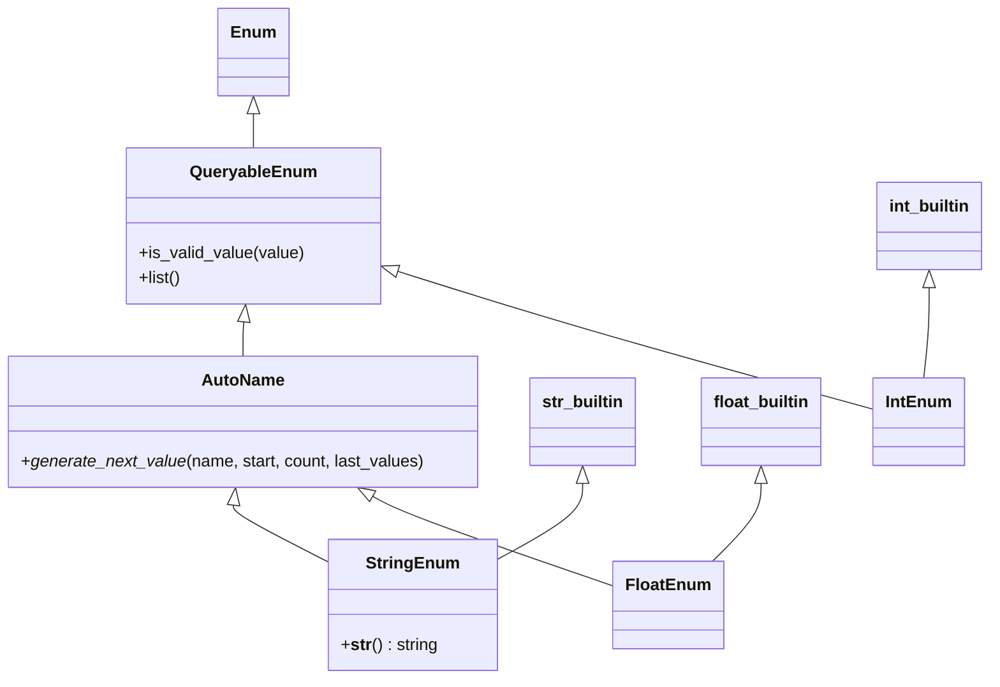

# Diagram: shipment_core/chromium_export/fv/python/fv/enum.py

> Auto-generated by Obscura crawlers

## Mermaid

### SVG

<svg id="container" width="942.83984375" xmlns="http://www.w3.org/2000/svg" class="classDiagram" height="652" viewBox="0 0 942.83984375 652" role="graphics-document document" aria-roledescription="class"><g><defs><marker id="container_class-aggregationStart" class="marker aggregation class" refX="18" refY="7" markerWidth="190" markerHeight="240" orient="auto"><path d="M 18,7 L9,13 L1,7 L9,1 Z"></path></marker></defs><defs><marker id="container_class-aggregationEnd" class="marker aggregation class" refX="1" refY="7" markerWidth="20" markerHeight="28" orient="auto"><path d="M 18,7 L9,13 L1,7 L9,1 Z"></path></marker></defs><defs><marker id="container_class-extensionStart" class="marker extension class" refX="18" refY="7" markerWidth="190" markerHeight="240" orient="auto"><path d="M 1,7 L18,13 V 1 Z"></path></marker></defs><defs><marker id="container_class-extensionEnd" class="marker extension class" refX="1" refY="7" markerWidth="20" markerHeight="28" orient="auto"><path d="M 1,1 V 13 L18,7 Z"></path></marker></defs><defs><marker id="container_class-compositionStart" class="marker composition class" refX="18" refY="7" markerWidth="190" markerHeight="240" orient="auto"><path d="M 18,7 L9,13 L1,7 L9,1 Z"></path></marker></defs><defs><marker id="container_class-compositionEnd" class="marker composition class" refX="1" refY="7" markerWidth="20" markerHeight="28" orient="auto"><path d="M 18,7 L9,13 L1,7 L9,1 Z"></path></marker></defs><defs><marker id="container_class-dependencyStart" class="marker dependency class" refX="6" refY="7" markerWidth="190" markerHeight="240" orient="auto"><path d="M 5,7 L9,13 L1,7 L9,1 Z"></path></marker></defs><defs><marker id="container_class-dependencyEnd" class="marker dependency class" refX="13" refY="7" markerWidth="20" markerHeight="28" orient="auto"><path d="M 18,7 L9,13 L14,7 L9,1 Z"></path></marker></defs><defs><marker id="container_class-lollipopStart" class="marker lollipop class" refX="13" refY="7" markerWidth="190" markerHeight="240" orient="auto"><circle stroke="black" fill="transparent" cx="7" cy="7" r="6"></circle></marker></defs><defs><marker id="container_class-lollipopEnd" class="marker lollipop class" refX="1" refY="7" markerWidth="190" markerHeight="240" orient="auto"><circle stroke="black" fill="transparent" cx="7" cy="7" r="6"></circle></marker></defs><g class="root"><g class="clusters"></g><g class="edgePaths"><path d="M242.781,109.25L242.781,110.542C242.781,111.833,242.781,114.417,242.781,119.875C242.781,125.333,242.781,133.667,242.781,137.833L242.781,142" id="id_Enum_QueryableEnum_1" class="edge-thickness-normal edge-pattern-solid relation" style=";;;" data-edge="true" data-et="edge" data-id="id_Enum_QueryableEnum_1" data-points="W3sieCI6MjQyLjc4MTI1LCJ5Ijo5Mn0seyJ4IjoyNDIuNzgxMjUsInkiOjExN30seyJ4IjoyNDIuNzgxMjUsInkiOjE0Mn1d" marker-start="url(#container_class-extensionStart)"></path><path d="M233.565,309.164L233.434,310.47C233.304,311.776,233.042,314.388,232.912,319.861C232.781,325.333,232.781,333.667,232.781,337.833L232.781,342" id="id_QueryableEnum_AutoName_2" class="edge-thickness-normal edge-pattern-solid relation" style=";;;" data-edge="true" data-et="edge" data-id="id_QueryableEnum_AutoName_2" data-points="W3sieCI6MjM1LjI4MTI1LCJ5IjoyOTJ9LHsieCI6MjMyLjc4MTI1LCJ5IjozMTd9LHsieCI6MjMyLjc4MTI1LCJ5IjozNDJ9XQ==" marker-start="url(#container_class-extensionStart)"></path><path d="M884.77,276.25L884.77,283.042C884.77,289.833,884.77,303.417,883.898,317.875C883.027,332.333,881.285,347.667,880.413,355.333L879.542,363" id="id_int_builtin_IntEnum_3" class="edge-thickness-normal edge-pattern-solid relation" style=";;;" data-edge="true" data-et="edge" data-id="id_int_builtin_IntEnum_3" data-points="W3sieCI6ODg0Ljc2OTUzMTI1LCJ5IjoyNTl9LHsieCI6ODg0Ljc2OTUzMTI1LCJ5IjozMTd9LHsieCI6ODc5LjU0MjI1ODUyMjcyNzMsInkiOjM2M31d" marker-start="url(#container_class-extensionStart)"></path><path d="M379.263,260.292L409.06,269.743C438.856,279.194,498.45,298.097,574.012,320.264C649.574,342.431,741.105,367.862,786.871,380.578L832.637,393.294" id="id_QueryableEnum_IntEnum_4" class="edge-thickness-normal edge-pattern-solid relation" style=";;;" data-edge="true" data-et="edge" data-id="id_QueryableEnum_IntEnum_4" data-points="W3sieCI6MzYyLjgyMDMxMjUsInkiOjI1NS4wNzYwMDMzMjA2NTM3NH0seyJ4Ijo1NTguMDQyOTY4NzUsInkiOjMxN30seyJ4Ijo4MzIuNjM2NzE4NzUsInkiOjM5My4yOTM3MjczMzc3NTY4fV0=" marker-start="url(#container_class-extensionStart)"></path><path d="M557.188,464.25L557.188,469.042C557.188,473.833,557.188,483.417,543.393,495.692C529.599,507.968,502.01,522.935,488.216,530.419L474.422,537.903" id="id_str_builtin_StringEnum_5" class="edge-thickness-normal edge-pattern-solid relation" style=";;;" data-edge="true" data-et="edge" data-id="id_str_builtin_StringEnum_5" data-points="W3sieCI6NTU3LjE4NzUsInkiOjQ0N30seyJ4Ijo1NTcuMTg3NSwieSI6NDkzfSx7IngiOjQ3NC40MjE4NzUsInkiOjUzNy45MDI4MDMxOTgxNTA0fV0=" marker-start="url(#container_class-extensionStart)"></path><path d="M223.674,485.14L223.526,486.45C223.377,487.76,223.079,490.38,238.391,499.591C253.703,508.802,284.625,524.604,300.086,532.505L315.547,540.405" id="id_AutoName_StringEnum_6" class="edge-thickness-normal edge-pattern-solid relation" style=";;;" data-edge="true" data-et="edge" data-id="id_AutoName_StringEnum_6" data-points="W3sieCI6MjI1LjYyMjE1OTA5MDkwOTEsInkiOjQ2OH0seyJ4IjoyMjIuNzgxMjUsInkiOjQ5M30seyJ4IjozMTUuNTQ2ODc1LCJ5Ijo1NDAuNDA1NDk4NTkzNTk0MX1d" marker-start="url(#container_class-extensionStart)"></path><path d="M725.457,464.25L725.457,469.042C725.457,473.833,725.457,483.417,717.755,495.875C710.054,508.333,694.65,523.667,686.948,531.333L679.247,539" id="id_float_builtin_FloatEnum_7" class="edge-thickness-normal edge-pattern-solid relation" style=";;;" data-edge="true" data-et="edge" data-id="id_float_builtin_FloatEnum_7" data-points="W3sieCI6NzI1LjQ1NzAzMTI1LCJ5Ijo0NDd9LHsieCI6NzI1LjQ1NzAzMTI1LCJ5Ijo0OTN9LHsieCI6Njc5LjI0NjcxNTE5ODg2MzYsInkiOjUzOX1d" marker-start="url(#container_class-extensionStart)"></path><path d="M356.678,476.634L361.396,479.362C366.114,482.089,375.549,487.545,413.896,502.013C452.242,516.48,519.5,539.961,553.129,551.701L586.758,563.441" id="id_AutoName_FloatEnum_8" class="edge-thickness-normal edge-pattern-solid relation" style=";;;" data-edge="true" data-et="edge" data-id="id_AutoName_FloatEnum_8" data-points="W3sieCI6MzQxLjc0NDg1MDg1MjI3Mjc1LCJ5Ijo0Njh9LHsieCI6Mzg0Ljk4NDM3NSwieSI6NDkzfSx7IngiOjU4Ni43NTc4MTI1LCJ5Ijo1NjMuNDQwOTExMjA0MDkxMX1d" marker-start="url(#container_class-extensionStart)"></path></g><g class="edgeLabels"><g class="edgeLabel"><g class="label" data-id="id_Enum_QueryableEnum_1" transform="translate(0, 0)"><foreignObject width="0" height="0">

</foreignObject></g></g><g class="edgeLabel"><g class="label" data-id="id_QueryableEnum_AutoName_2" transform="translate(0, 0)"><foreignObject width="0" height="0">

</foreignObject></g></g><g class="edgeLabel"><g class="label" data-id="id_int_builtin_IntEnum_3" transform="translate(0, 0)"><foreignObject width="0" height="0">

</foreignObject></g></g><g class="edgeLabel"><g class="label" data-id="id_QueryableEnum_IntEnum_4" transform="translate(0, 0)"><foreignObject width="0" height="0">

</foreignObject></g></g><g class="edgeLabel"><g class="label" data-id="id_str_builtin_StringEnum_5" transform="translate(0, 0)"><foreignObject width="0" height="0">

</foreignObject></g></g><g class="edgeLabel"><g class="label" data-id="id_AutoName_StringEnum_6" transform="translate(0, 0)"><foreignObject width="0" height="0">

</foreignObject></g></g><g class="edgeLabel"><g class="label" data-id="id_float_builtin_FloatEnum_7" transform="translate(0, 0)"><foreignObject width="0" height="0">

</foreignObject></g></g><g class="edgeLabel"><g class="label" data-id="id_AutoName_FloatEnum_8" transform="translate(0, 0)"><foreignObject width="0" height="0">

</foreignObject></g></g></g><g class="nodes"><g class="node default" id="classId-Enum-0" transform="translate(242.78125, 50)"><g class="basic label-container"><path d="M-32.0859375 -42 L32.0859375 -42 L32.0859375 42 L-32.0859375 42" stroke="none" stroke-width="0" fill="#ECECFF" style=""></path><path d="M-32.0859375 -42 C-8.200979318557373 -42, 15.683978862885255 -42, 32.0859375 -42 M-32.0859375 -42 C-6.640186850207115 -42, 18.80556379958577 -42, 32.0859375 -42 M32.0859375 -42 C32.0859375 -16.929043572156875, 32.0859375 8.14191285568625, 32.0859375 42 M32.0859375 -42 C32.0859375 -8.476829450788763, 32.0859375 25.046341098422474, 32.0859375 42 M32.0859375 42 C12.449916446373006 42, -7.186104607253988 42, -32.0859375 42 M32.0859375 42 C10.160524565136622 42, -11.764888369726755 42, -32.0859375 42 M-32.0859375 42 C-32.0859375 12.412062991519399, -32.0859375 -17.175874016961203, -32.0859375 -42 M-32.0859375 42 C-32.0859375 23.96306646098016, -32.0859375 5.926132921960317, -32.0859375 -42" stroke="#9370DB" stroke-width="1.3" fill="none" stroke-dasharray="0 0" style=""></path></g><g class="annotation-group text" transform="translate(0, -18)"></g><g class="label-group text" transform="translate(-20.0859375, -18)"><g class="label" style="font-weight: bolder" transform="translate(0,-12)"><foreignObject width="40.171875" height="24">

Enum

</foreignObject></g></g><g class="members-group text" transform="translate(-20.0859375, 30)"></g><g class="methods-group text" transform="translate(-20.0859375, 60)"></g><g class="divider" style=""><path d="M-32.0859375 6 C-7.316925305806155 6, 17.45208688838769 6, 32.0859375 6 M-32.0859375 6 C-10.925710339287093 6, 10.234516821425814 6, 32.0859375 6" stroke="#9370DB" stroke-width="1.3" fill="none" stroke-dasharray="0 0" style=""></path></g><g class="divider" style=""><path d="M-32.0859375 24 C-12.250118064526596 24, 7.585701370946808 24, 32.0859375 24 M-32.0859375 24 C-14.29487553782019 24, 3.496186424359621 24, 32.0859375 24" stroke="#9370DB" stroke-width="1.3" fill="none" stroke-dasharray="0 0" style=""></path></g></g><g class="node default" id="classId-QueryableEnum-1" transform="translate(242.78125, 217)"><g class="basic label-container"><path d="M-120.0390625 -75 L120.0390625 -75 L120.0390625 75 L-120.0390625 75" stroke="none" stroke-width="0" fill="#ECECFF" style=""></path><path d="M-120.0390625 -75 C-50.20601820968669 -75, 19.62702608062662 -75, 120.0390625 -75 M-120.0390625 -75 C-43.27511081614014 -75, 33.488840867719716 -75, 120.0390625 -75 M120.0390625 -75 C120.0390625 -44.79253126227805, 120.0390625 -14.585062524556086, 120.0390625 75 M120.0390625 -75 C120.0390625 -31.605482734432584, 120.0390625 11.789034531134831, 120.0390625 75 M120.0390625 75 C27.392349271071453 75, -65.2543639578571 75, -120.0390625 75 M120.0390625 75 C47.22494534528575 75, -25.589171809428507 75, -120.0390625 75 M-120.0390625 75 C-120.0390625 33.39739878536142, -120.0390625 -8.205202429277165, -120.0390625 -75 M-120.0390625 75 C-120.0390625 44.120359382201656, -120.0390625 13.240718764403304, -120.0390625 -75" stroke="#9370DB" stroke-width="1.3" fill="none" stroke-dasharray="0 0" style=""></path></g><g class="annotation-group text" transform="translate(0, -51)"></g><g class="label-group text" transform="translate(-57.6875, -51)"><g class="label" style="font-weight: bolder" transform="translate(0,-12)"><foreignObject width="115.375" height="24">

QueryableEnum

</foreignObject></g></g><g class="members-group text" transform="translate(-108.0390625, -3)"></g><g class="methods-group text" transform="translate(-108.0390625, 27)"><g class="label" style="" transform="translate(0,-12)"><foreignObject width="158.390625" height="24">

+is_valid_value(value)

</foreignObject></g><g class="label" style="" transform="translate(0,12)"><foreignObject width="40.8125" height="24">

+list()

</foreignObject></g></g><g class="divider" style=""><path d="M-120.0390625 -27 C-34.72449782053556 -27, 50.59006685892888 -27, 120.0390625 -27 M-120.0390625 -27 C-41.1112300343452 -27, 37.816602431309605 -27, 120.0390625 -27" stroke="#9370DB" stroke-width="1.3" fill="none" stroke-dasharray="0 0" style=""></path></g><g class="divider" style=""><path d="M-120.0390625 -3 C-63.956489314032446 -3, -7.8739161280648915 -3, 120.0390625 -3 M-120.0390625 -3 C-44.82739564657756 -3, 30.384271206844886 -3, 120.0390625 -3" stroke="#9370DB" stroke-width="1.3" fill="none" stroke-dasharray="0 0" style=""></path></g></g><g class="node default" id="classId-AutoName-2" transform="translate(232.78125, 405)"><g class="basic label-container"><path d="M-224.78125 -63 L224.78125 -63 L224.78125 63 L-224.78125 63" stroke="none" stroke-width="0" fill="#ECECFF" style=""></path><path d="M-224.78125 -63 C-51.056683788628675 -63, 122.66788242274265 -63, 224.78125 -63 M-224.78125 -63 C-86.11561657376947 -63, 52.550016852461056 -63, 224.78125 -63 M224.78125 -63 C224.78125 -19.288067043935, 224.78125 24.423865912129997, 224.78125 63 M224.78125 -63 C224.78125 -23.470223424756348, 224.78125 16.059553150487304, 224.78125 63 M224.78125 63 C74.84773993022134 63, -75.08577013955733 63, -224.78125 63 M224.78125 63 C123.47015927622041 63, 22.15906855244083 63, -224.78125 63 M-224.78125 63 C-224.78125 22.453265491441115, -224.78125 -18.09346901711777, -224.78125 -63 M-224.78125 63 C-224.78125 34.65768961637136, -224.78125 6.315379232742707, -224.78125 -63" stroke="#9370DB" stroke-width="1.3" fill="none" stroke-dasharray="0 0" style=""></path></g><g class="annotation-group text" transform="translate(0, -39)"></g><g class="label-group text" transform="translate(-37.78125, -39)"><g class="label" style="font-weight: bolder" transform="translate(0,-12)"><foreignObject width="75.5625" height="24">

AutoName

</foreignObject></g></g><g class="members-group text" transform="translate(-212.78125, 9)"></g><g class="methods-group text" transform="translate(-212.78125, 39)"><g class="label" style="" transform="translate(0,-12)"><foreignObject width="387.78125" height="24">

+<em>generate_next_value</em>(name, start, count, last_values)

</foreignObject></g></g><g class="divider" style=""><path d="M-224.78125 -15 C-101.94882652302982 -15, 20.883596953940355 -15, 224.78125 -15 M-224.78125 -15 C-47.739256310711426 -15, 129.30273737857715 -15, 224.78125 -15" stroke="#9370DB" stroke-width="1.3" fill="none" stroke-dasharray="0 0" style=""></path></g><g class="divider" style=""><path d="M-224.78125 9 C-49.15389420577725 9, 126.4734615884455 9, 224.78125 9 M-224.78125 9 C-71.88634831321275 9, 81.0085533735745 9, 224.78125 9" stroke="#9370DB" stroke-width="1.3" fill="none" stroke-dasharray="0 0" style=""></path></g></g><g class="node default" id="classId-int_builtin-3" transform="translate(884.76953125, 217)"><g class="basic label-container"><path d="M-50.0703125 -42 L50.0703125 -42 L50.0703125 42 L-50.0703125 42" stroke="none" stroke-width="0" fill="#ECECFF" style=""></path><path d="M-50.0703125 -42 C-13.577587928250253 -42, 22.915136643499494 -42, 50.0703125 -42 M-50.0703125 -42 C-21.96023709674796 -42, 6.14983830650408 -42, 50.0703125 -42 M50.0703125 -42 C50.0703125 -17.165394565150084, 50.0703125 7.669210869699832, 50.0703125 42 M50.0703125 -42 C50.0703125 -13.2643036511782, 50.0703125 15.471392697643601, 50.0703125 42 M50.0703125 42 C26.859170792182532 42, 3.6480290843650636 42, -50.0703125 42 M50.0703125 42 C11.183719596169304 42, -27.702873307661392 42, -50.0703125 42 M-50.0703125 42 C-50.0703125 9.450717128670803, -50.0703125 -23.098565742658394, -50.0703125 -42 M-50.0703125 42 C-50.0703125 16.506843728119957, -50.0703125 -8.986312543760086, -50.0703125 -42" stroke="#9370DB" stroke-width="1.3" fill="none" stroke-dasharray="0 0" style=""></path></g><g class="annotation-group text" transform="translate(0, -18)"></g><g class="label-group text" transform="translate(-38.0703125, -18)"><g class="label" style="font-weight: bolder" transform="translate(0,-12)"><foreignObject width="76.140625" height="24">

int_builtin

</foreignObject></g></g><g class="members-group text" transform="translate(-38.0703125, 30)"></g><g class="methods-group text" transform="translate(-38.0703125, 60)"></g><g class="divider" style=""><path d="M-50.0703125 6 C-27.879452913805636 6, -5.688593327611272 6, 50.0703125 6 M-50.0703125 6 C-16.995259536152666 6, 16.079793427694668 6, 50.0703125 6" stroke="#9370DB" stroke-width="1.3" fill="none" stroke-dasharray="0 0" style=""></path></g><g class="divider" style=""><path d="M-50.0703125 24 C-24.977474241045382 24, 0.11536401790923634 24, 50.0703125 24 M-50.0703125 24 C-11.812195905407798 24, 26.445920689184405 24, 50.0703125 24" stroke="#9370DB" stroke-width="1.3" fill="none" stroke-dasharray="0 0" style=""></path></g></g><g class="node default" id="classId-str_builtin-4" transform="translate(557.1875, 405)"><g class="basic label-container"><path d="M-49.625 -42 L49.625 -42 L49.625 42 L-49.625 42" stroke="none" stroke-width="0" fill="#ECECFF" style=""></path><path d="M-49.625 -42 C-19.041906804171134 -42, 11.541186391657732 -42, 49.625 -42 M-49.625 -42 C-26.05829187239808 -42, -2.4915837447961593 -42, 49.625 -42 M49.625 -42 C49.625 -9.62091123536652, 49.625 22.75817752926696, 49.625 42 M49.625 -42 C49.625 -22.7750534850969, 49.625 -3.550106970193802, 49.625 42 M49.625 42 C23.736969947439203 42, -2.1510601051215943 42, -49.625 42 M49.625 42 C15.791224093370865 42, -18.04255181325827 42, -49.625 42 M-49.625 42 C-49.625 13.770689046520118, -49.625 -14.458621906959763, -49.625 -42 M-49.625 42 C-49.625 20.434050341923886, -49.625 -1.1318993161522286, -49.625 -42" stroke="#9370DB" stroke-width="1.3" fill="none" stroke-dasharray="0 0" style=""></path></g><g class="annotation-group text" transform="translate(0, -18)"></g><g class="label-group text" transform="translate(-37.625, -18)"><g class="label" style="font-weight: bolder" transform="translate(0,-12)"><foreignObject width="75.25" height="24">

str_builtin

</foreignObject></g></g><g class="members-group text" transform="translate(-37.625, 30)"></g><g class="methods-group text" transform="translate(-37.625, 60)"></g><g class="divider" style=""><path d="M-49.625 6 C-16.34938393488769 6, 16.92623213022462 6, 49.625 6 M-49.625 6 C-21.110845565077824 6, 7.403308869844352 6, 49.625 6" stroke="#9370DB" stroke-width="1.3" fill="none" stroke-dasharray="0 0" style=""></path></g><g class="divider" style=""><path d="M-49.625 24 C-16.291873256478503 24, 17.041253487042994 24, 49.625 24 M-49.625 24 C-10.824264629774191 24, 27.976470740451617 24, 49.625 24" stroke="#9370DB" stroke-width="1.3" fill="none" stroke-dasharray="0 0" style=""></path></g></g><g class="node default" id="classId-float_builtin-5" transform="translate(725.45703125, 405)"><g class="basic label-container"><path d="M-57.1796875 -42 L57.1796875 -42 L57.1796875 42 L-57.1796875 42" stroke="none" stroke-width="0" fill="#ECECFF" style=""></path><path d="M-57.1796875 -42 C-23.94831628987074 -42, 9.283054920258522 -42, 57.1796875 -42 M-57.1796875 -42 C-12.177028441303626 -42, 32.82563061739275 -42, 57.1796875 -42 M57.1796875 -42 C57.1796875 -24.79043606415935, 57.1796875 -7.580872128318703, 57.1796875 42 M57.1796875 -42 C57.1796875 -11.05030077450957, 57.1796875 19.89939845098086, 57.1796875 42 M57.1796875 42 C20.69507104473937 42, -15.789545410521256 42, -57.1796875 42 M57.1796875 42 C13.522220115436909 42, -30.135247269126182 42, -57.1796875 42 M-57.1796875 42 C-57.1796875 11.242096954644289, -57.1796875 -19.515806090711422, -57.1796875 -42 M-57.1796875 42 C-57.1796875 9.131376283618437, -57.1796875 -23.737247432763127, -57.1796875 -42" stroke="#9370DB" stroke-width="1.3" fill="none" stroke-dasharray="0 0" style=""></path></g><g class="annotation-group text" transform="translate(0, -18)"></g><g class="label-group text" transform="translate(-45.1796875, -18)"><g class="label" style="font-weight: bolder" transform="translate(0,-12)"><foreignObject width="90.359375" height="24">

float_builtin

</foreignObject></g></g><g class="members-group text" transform="translate(-45.1796875, 30)"></g><g class="methods-group text" transform="translate(-45.1796875, 60)"></g><g class="divider" style=""><path d="M-57.1796875 6 C-11.602248571088452 6, 33.975190357823095 6, 57.1796875 6 M-57.1796875 6 C-19.47362352624681 6, 18.232440447506377 6, 57.1796875 6" stroke="#9370DB" stroke-width="1.3" fill="none" stroke-dasharray="0 0" style=""></path></g><g class="divider" style=""><path d="M-57.1796875 24 C-24.015365335843413 24, 9.148956828313175 24, 57.1796875 24 M-57.1796875 24 C-24.74271142505907 24, 7.694264649881859 24, 57.1796875 24" stroke="#9370DB" stroke-width="1.3" fill="none" stroke-dasharray="0 0" style=""></path></g></g><g class="node default" id="classId-IntEnum-6" transform="translate(874.76953125, 405)"><g class="basic label-container"><path d="M-42.1328125 -42 L42.1328125 -42 L42.1328125 42 L-42.1328125 42" stroke="none" stroke-width="0" fill="#ECECFF" style=""></path><path d="M-42.1328125 -42 C-17.363806228857097 -42, 7.405200042285806 -42, 42.1328125 -42 M-42.1328125 -42 C-11.830310040131224 -42, 18.472192419737553 -42, 42.1328125 -42 M42.1328125 -42 C42.1328125 -17.42793419619068, 42.1328125 7.14413160761864, 42.1328125 42 M42.1328125 -42 C42.1328125 -20.42975326863136, 42.1328125 1.1404934627372825, 42.1328125 42 M42.1328125 42 C24.297071680887267 42, 6.461330861774535 42, -42.1328125 42 M42.1328125 42 C14.905134748757742 42, -12.322543002484515 42, -42.1328125 42 M-42.1328125 42 C-42.1328125 14.746464428882256, -42.1328125 -12.507071142235489, -42.1328125 -42 M-42.1328125 42 C-42.1328125 14.785551055283307, -42.1328125 -12.428897889433387, -42.1328125 -42" stroke="#9370DB" stroke-width="1.3" fill="none" stroke-dasharray="0 0" style=""></path></g><g class="annotation-group text" transform="translate(0, -18)"></g><g class="label-group text" transform="translate(-30.1328125, -18)"><g class="label" style="font-weight: bolder" transform="translate(0,-12)"><foreignObject width="60.265625" height="24">

IntEnum

</foreignObject></g></g><g class="members-group text" transform="translate(-30.1328125, 30)"></g><g class="methods-group text" transform="translate(-30.1328125, 60)"></g><g class="divider" style=""><path d="M-42.1328125 6 C-20.176499176108173 6, 1.7798141477836538 6, 42.1328125 6 M-42.1328125 6 C-11.281883189071646 6, 19.569046121856708 6, 42.1328125 6" stroke="#9370DB" stroke-width="1.3" fill="none" stroke-dasharray="0 0" style=""></path></g><g class="divider" style=""><path d="M-42.1328125 24 C-11.345016040083529 24, 19.442780419832943 24, 42.1328125 24 M-42.1328125 24 C-18.98632783763743 24, 4.160156824725142 24, 42.1328125 24" stroke="#9370DB" stroke-width="1.3" fill="none" stroke-dasharray="0 0" style=""></path></g></g><g class="node default" id="classId-StringEnum-7" transform="translate(394.984375, 581)"><g class="basic label-container"><path d="M-79.4375 -63 L79.4375 -63 L79.4375 63 L-79.4375 63" stroke="none" stroke-width="0" fill="#ECECFF" style=""></path><path d="M-79.4375 -63 C-36.76872866942047 -63, 5.900042661159063 -63, 79.4375 -63 M-79.4375 -63 C-35.89837148364022 -63, 7.640757032719563 -63, 79.4375 -63 M79.4375 -63 C79.4375 -18.061707381150654, 79.4375 26.87658523769869, 79.4375 63 M79.4375 -63 C79.4375 -23.253835158576045, 79.4375 16.49232968284791, 79.4375 63 M79.4375 63 C27.19573569441704 63, -25.046028611165923 63, -79.4375 63 M79.4375 63 C35.95714328479885 63, -7.5232134304022935 63, -79.4375 63 M-79.4375 63 C-79.4375 27.921044032458084, -79.4375 -7.157911935083831, -79.4375 -63 M-79.4375 63 C-79.4375 15.451932138233055, -79.4375 -32.09613572353389, -79.4375 -63" stroke="#9370DB" stroke-width="1.3" fill="none" stroke-dasharray="0 0" style=""></path></g><g class="annotation-group text" transform="translate(0, -39)"></g><g class="label-group text" transform="translate(-42.234375, -39)"><g class="label" style="font-weight: bolder" transform="translate(0,-12)"><foreignObject width="84.46875" height="24">

StringEnum

</foreignObject></g></g><g class="members-group text" transform="translate(-67.4375, 9)"></g><g class="methods-group text" transform="translate(-67.4375, 39)"><g class="label" style="" transform="translate(0,-12)"><foreignObject width="92.640625" height="24">

+<strong>str</strong>() : string

</foreignObject></g></g><g class="divider" style=""><path d="M-79.4375 -15 C-25.826702985250826 -15, 27.78409402949835 -15, 79.4375 -15 M-79.4375 -15 C-30.004470082248872 -15, 19.428559835502256 -15, 79.4375 -15" stroke="#9370DB" stroke-width="1.3" fill="none" stroke-dasharray="0 0" style=""></path></g><g class="divider" style=""><path d="M-79.4375 9 C-27.34542000832282 9, 24.746659983354363 9, 79.4375 9 M-79.4375 9 C-40.60741181751002 9, -1.7773236350200392 9, 79.4375 9" stroke="#9370DB" stroke-width="1.3" fill="none" stroke-dasharray="0 0" style=""></path></g></g><g class="node default" id="classId-FloatEnum-8" transform="translate(637.0546875, 581)"><g class="basic label-container"><path d="M-50.296875 -42 L50.296875 -42 L50.296875 42 L-50.296875 42" stroke="none" stroke-width="0" fill="#ECECFF" style=""></path><path d="M-50.296875 -42 C-16.991115346109822 -42, 16.314644307780355 -42, 50.296875 -42 M-50.296875 -42 C-26.059518807599805 -42, -1.822162615199609 -42, 50.296875 -42 M50.296875 -42 C50.296875 -19.147228323672408, 50.296875 3.7055433526551838, 50.296875 42 M50.296875 -42 C50.296875 -16.033164586663364, 50.296875 9.933670826673271, 50.296875 42 M50.296875 42 C18.716598456406157 42, -12.863678087187687 42, -50.296875 42 M50.296875 42 C19.80417536969844 42, -10.688524260603117 42, -50.296875 42 M-50.296875 42 C-50.296875 22.269002260790113, -50.296875 2.538004521580227, -50.296875 -42 M-50.296875 42 C-50.296875 8.92838203078199, -50.296875 -24.14323593843602, -50.296875 -42" stroke="#9370DB" stroke-width="1.3" fill="none" stroke-dasharray="0 0" style=""></path></g><g class="annotation-group text" transform="translate(0, -18)"></g><g class="label-group text" transform="translate(-38.296875, -18)"><g class="label" style="font-weight: bolder" transform="translate(0,-12)"><foreignObject width="76.59375" height="24">

FloatEnum

</foreignObject></g></g><g class="members-group text" transform="translate(-38.296875, 30)"></g><g class="methods-group text" transform="translate(-38.296875, 60)"></g><g class="divider" style=""><path d="M-50.296875 6 C-12.60772631905472 6, 25.08142236189056 6, 50.296875 6 M-50.296875 6 C-22.783321063820342 6, 4.730232872359316 6, 50.296875 6" stroke="#9370DB" stroke-width="1.3" fill="none" stroke-dasharray="0 0" style=""></path></g><g class="divider" style=""><path d="M-50.296875 24 C-26.67628742272607 24, -3.055699845452139 24, 50.296875 24 M-50.296875 24 C-16.137253525218107 24, 18.022367949563787 24, 50.296875 24" stroke="#9370DB" stroke-width="1.3" fill="none" stroke-dasharray="0 0" style=""></path></g></g></g></g></g></svg>
