# Diagram: shipment_core/chromium_export/fv/python/fv/error.py

> Auto-generated by Obscura crawlers

## Mermaid

```mermaid
classDiagram
class ErrorTypes {
  <<enumeration>>
  AUTHENTICATION
  AUTHORIZATION
  DATABASE
  LOCATION
  PARAMETER
  UNEXPECTED
  VALUE
  VALIDATION
}
class Exception {
}
class HandledException {
  +http_status
  +client_message
  +__init__(message, client_message, http_status)
}
class ForbiddenError {
  +__init__(message, client_message="Access denied", http_status=403)
}
class BadRequestError {
  +__init__(message, client_message, http_status=400)
}
class UnauthorizedError {
  +__init__(message, client_message, http_status=401)
}
class NotFoundError {
  +__init__(message="", client_message="Resource not found", http_status=404)
}
class ConflictError {
  +__init__(message="", client_message="Resource already exists", http_status=409)
}
class GatewayTimeout {
  +__init__(message="", client_message="Request timed out", http_status=504)
}
class DatabaseError {
  +__init__(message, client_message=None, http_status=500)
}
class UnhandledException {
  +__init__(message, client_message=None, http_status=500)
}
class ParameterError {
}
class ValidationError {
}
class InvalidSignatureError {
}
class ParallelError {
}
class LocationError {
}
class add_idens {
  +add_idens(identifiers) string
}

Exception <|-- HandledException
HandledException <|-- ForbiddenError
HandledException <|-- BadRequestError
HandledException <|-- UnauthorizedError
HandledException <|-- NotFoundError
HandledException <|-- ConflictError
HandledException <|-- GatewayTimeout
HandledException <|-- DatabaseError
HandledException <|-- UnhandledException

Exception <|-- ParameterError
Exception <|-- ValidationError
Exception <|-- InvalidSignatureError
Exception <|-- ParallelError
Exception <|-- LocationError
```

### SVG

<svg id="container" width="4597.546875" xmlns="http://www.w3.org/2000/svg" class="classDiagram" height="722" viewBox="0 0 4597.546875 722" role="graphics-document document" aria-roledescription="class"><g><defs><marker id="container_class-aggregationStart" class="marker aggregation class" refX="18" refY="7" markerWidth="190" markerHeight="240" orient="auto"><path d="M 18,7 L9,13 L1,7 L9,1 Z"></path></marker></defs><defs><marker id="container_class-aggregationEnd" class="marker aggregation class" refX="1" refY="7" markerWidth="20" markerHeight="28" orient="auto"><path d="M 18,7 L9,13 L1,7 L9,1 Z"></path></marker></defs><defs><marker id="container_class-extensionStart" class="marker extension class" refX="18" refY="7" markerWidth="190" markerHeight="240" orient="auto"><path d="M 1,7 L18,13 V 1 Z"></path></marker></defs><defs><marker id="container_class-extensionEnd" class="marker extension class" refX="1" refY="7" markerWidth="20" markerHeight="28" orient="auto"><path d="M 1,1 V 13 L18,7 Z"></path></marker></defs><defs><marker id="container_class-compositionStart" class="marker composition class" refX="18" refY="7" markerWidth="190" markerHeight="240" orient="auto"><path d="M 18,7 L9,13 L1,7 L9,1 Z"></path></marker></defs><defs><marker id="container_class-compositionEnd" class="marker composition class" refX="1" refY="7" markerWidth="20" markerHeight="28" orient="auto"><path d="M 18,7 L9,13 L1,7 L9,1 Z"></path></marker></defs><defs><marker id="container_class-dependencyStart" class="marker dependency class" refX="6" refY="7" markerWidth="190" markerHeight="240" orient="auto"><path d="M 5,7 L9,13 L1,7 L9,1 Z"></path></marker></defs><defs><marker id="container_class-dependencyEnd" class="marker dependency class" refX="13" refY="7" markerWidth="20" markerHeight="28" orient="auto"><path d="M 18,7 L9,13 L14,7 L9,1 Z"></path></marker></defs><defs><marker id="container_class-lollipopStart" class="marker lollipop class" refX="13" refY="7" markerWidth="190" markerHeight="240" orient="auto"><circle stroke="black" fill="transparent" cx="7" cy="7" r="6"></circle></marker></defs><defs><marker id="container_class-lollipopEnd" class="marker lollipop class" refX="1" refY="7" markerWidth="190" markerHeight="240" orient="auto"><circle stroke="black" fill="transparent" cx="7" cy="7" r="6"></circle></marker></defs><g class="root"><g class="clusters"></g><g class="edgePaths"><path d="M3118.487,176.136L2968.538,204.28C2818.589,232.424,2518.691,288.712,2368.742,321.023C2218.793,353.333,2218.793,361.667,2218.793,365.833L2218.793,370" id="id_Exception_HandledException_1" class="edge-thickness-normal edge-pattern-solid relation" style=";;;" data-edge="true" data-et="edge" data-id="id_Exception_HandledException_1" data-points="W3sieCI6MzEzNS40NDE0MDYyNSwieSI6MTcyLjk1MzQ0MTgzNjcyNjQzfSx7IngiOjIyMTguNzkyOTY4NzUsInkiOjM0NX0seyJ4IjoyMjE4Ljc5Mjk2ODc1LCJ5IjozNzB9XQ==" marker-start="url(#container_class-extensionStart)"></path><path d="M1998.738,466.387L1712.68,482.489C1426.621,498.591,854.504,530.796,568.445,551.064C282.387,571.333,282.387,579.667,282.387,583.833L282.387,588" id="id_HandledException_ForbiddenError_2" class="edge-thickness-normal edge-pattern-solid relation" style=";;;" data-edge="true" data-et="edge" data-id="id_HandledException_ForbiddenError_2" data-points="W3sieCI6MjAxNS45NjA5Mzc1LCJ5Ijo0NjUuNDE3MzgyNzk2NzQwMDd9LHsieCI6MjgyLjM4NjcxODc1LCJ5Ijo1NjN9LHsieCI6MjgyLjM4NjcxODc1LCJ5Ijo1ODh9XQ==" marker-start="url(#container_class-extensionStart)"></path><path d="M1998.763,471.204L1803.092,486.503C1607.42,501.803,1216.077,532.401,1020.406,551.867C824.734,571.333,824.734,579.667,824.734,583.833L824.734,588" id="id_HandledException_BadRequestError_3" class="edge-thickness-normal edge-pattern-solid relation" style=";;;" data-edge="true" data-et="edge" data-id="id_HandledException_BadRequestError_3" data-points="W3sieCI6MjAxNS45NjA5Mzc1LCJ5Ijo0NjkuODU5MjI2Nzk2NzU3NDd9LHsieCI6ODI0LjczNDM3NSwieSI6NTYzfSx7IngiOjgyNC43MzQzNzUsInkiOjU4OH1d" marker-start="url(#container_class-extensionStart)"></path><path d="M1998.834,480.444L1884.384,494.203C1769.934,507.963,1541.033,535.481,1426.583,553.407C1312.133,571.333,1312.133,579.667,1312.133,583.833L1312.133,588" id="id_HandledException_UnauthorizedError_4" class="edge-thickness-normal edge-pattern-solid relation" style=";;;" data-edge="true" data-et="edge" data-id="id_HandledException_UnauthorizedError_4" data-points="W3sieCI6MjAxNS45NjA5Mzc1LCJ5Ijo0NzguMzg0NzYxMjA3MjEyMjV9LHsieCI6MTMxMi4xMzI4MTI1LCJ5Ijo1NjN9LHsieCI6MTMxMi4xMzI4MTI1LCJ5Ijo1ODh9XQ==" marker-start="url(#container_class-extensionStart)"></path><path d="M1999.564,525.628L1980.5,531.856C1961.436,538.085,1923.308,550.543,1904.244,560.938C1885.18,571.333,1885.18,579.667,1885.18,583.833L1885.18,588" id="id_HandledException_NotFoundError_5" class="edge-thickness-normal edge-pattern-solid relation" style=";;;" data-edge="true" data-et="edge" data-id="id_HandledException_NotFoundError_5" data-points="W3sieCI6MjAxNS45NjA5Mzc1LCJ5Ijo1MjAuMjcwNDE3NDIyODY3NX0seyJ4IjoxODg1LjE3OTY4NzUsInkiOjU2M30seyJ4IjoxODg1LjE3OTY4NzUsInkiOjU4OH1d" marker-start="url(#container_class-extensionStart)"></path><path d="M2438.022,525.628L2457.086,531.856C2476.15,538.085,2514.278,550.543,2533.342,560.938C2552.406,571.333,2552.406,579.667,2552.406,583.833L2552.406,588" id="id_HandledException_ConflictError_6" class="edge-thickness-normal edge-pattern-solid relation" style=";;;" data-edge="true" data-et="edge" data-id="id_HandledException_ConflictError_6" data-points="W3sieCI6MjQyMS42MjUsInkiOjUyMC4yNzA0MTc0MjI4Njc1fSx7IngiOjI1NTIuNDA2MjUsInkiOjU2M30seyJ4IjoyNTUyLjQwNjI1LCJ5Ijo1ODh9XQ==" marker-start="url(#container_class-extensionStart)"></path><path d="M2438.774,477.965L2568.869,492.137C2698.964,506.31,2959.154,534.655,3089.249,552.994C3219.344,571.333,3219.344,579.667,3219.344,583.833L3219.344,588" id="id_HandledException_GatewayTimeout_7" class="edge-thickness-normal edge-pattern-solid relation" style=";;;" data-edge="true" data-et="edge" data-id="id_HandledException_GatewayTimeout_7" data-points="W3sieCI6MjQyMS42MjUsInkiOjQ3Ni4wOTY1MjEwNTY3NjE3M30seyJ4IjozMjE5LjM0Mzc1LCJ5Ijo1NjN9LHsieCI6MzIxOS4zNDM3NSwieSI6NTg4fV0=" marker-start="url(#container_class-extensionStart)"></path><path d="M2438.835,469.086L2667.129,484.739C2895.424,500.391,3352.013,531.695,3580.307,551.514C3808.602,571.333,3808.602,579.667,3808.602,583.833L3808.602,588" id="id_HandledException_DatabaseError_8" class="edge-thickness-normal edge-pattern-solid relation" style=";;;" data-edge="true" data-et="edge" data-id="id_HandledException_DatabaseError_8" data-points="W3sieCI6MjQyMS42MjUsInkiOjQ2Ny45MDY1MTE0NDYxOTkwM30seyJ4IjozODA4LjYwMTU2MjUsInkiOjU2M30seyJ4IjozODA4LjYwMTU2MjUsInkiOjU4OH1d" marker-start="url(#container_class-extensionStart)"></path><path d="M2438.852,465.297L2756.051,481.581C3073.249,497.865,3707.646,530.432,4024.845,550.883C4342.043,571.333,4342.043,579.667,4342.043,583.833L4342.043,588" id="id_HandledException_UnhandledException_9" class="edge-thickness-normal edge-pattern-solid relation" style=";;;" data-edge="true" data-et="edge" data-id="id_HandledException_UnhandledException_9" data-points="W3sieCI6MjQyMS42MjUsInkiOjQ2NC40MTI2NjUyMDk1ODQzNn0seyJ4Ijo0MzQyLjA0Mjk2ODc1LCJ5Ijo1NjN9LHsieCI6NDM0Mi4wNDI5Njg3NSwieSI6NTg4fV0=" marker-start="url(#container_class-extensionStart)"></path><path d="M3118.836,182.088L3022.303,209.24C2925.771,236.392,2732.706,290.696,2636.173,329.015C2539.641,367.333,2539.641,389.667,2539.641,400.833L2539.641,412" id="id_Exception_ParameterError_10" class="edge-thickness-normal edge-pattern-solid relation" style=";;;" data-edge="true" data-et="edge" data-id="id_Exception_ParameterError_10" data-points="W3sieCI6MzEzNS40NDE0MDYyNSwieSI6MTc3LjQxNzU4MDc0OTkyMjZ9LHsieCI6MjUzOS42NDA2MjUsInkiOjM0NX0seyJ4IjoyNTM5LjY0MDYyNSwieSI6NDEyfV0=" marker-start="url(#container_class-extensionStart)"></path><path d="M3119.397,189.176L3053.637,215.146C2987.877,241.117,2856.356,293.059,2790.596,330.196C2724.836,367.333,2724.836,389.667,2724.836,400.833L2724.836,412" id="id_Exception_ValidationError_11" class="edge-thickness-normal edge-pattern-solid relation" style=";;;" data-edge="true" data-et="edge" data-id="id_Exception_ValidationError_11" data-points="W3sieCI6MzEzNS40NDE0MDYyNSwieSI6MTgyLjgzOTQxNDYyNzQ5NDF9LHsieCI6MjcyNC44MzU5Mzc1LCJ5IjozNDV9LHsieCI6MjcyNC44MzU5Mzc1LCJ5Ijo0MTJ9XQ==" marker-start="url(#container_class-extensionStart)"></path><path d="M3177.855,223.182L3176.04,243.485C3174.226,263.788,3170.596,304.394,3168.781,335.864C3166.967,367.333,3166.967,389.667,3166.967,400.833L3166.967,412" id="id_Exception_InvalidSignatureError_12" class="edge-thickness-normal edge-pattern-solid relation" style=";;;" data-edge="true" data-et="edge" data-id="id_Exception_InvalidSignatureError_12" data-points="W3sieCI6MzE3OS4zOTA1ODE4MzcwMTY3LCJ5IjoyMDZ9LHsieCI6MzE2Ni45NjY3OTY4NzUsInkiOjM0NX0seyJ4IjozMTY2Ljk2Njc5Njg3NSwieSI6NDEyfV0=" marker-start="url(#container_class-extensionStart)"></path><path d="M3237.494,218.178L3258.698,239.315C3279.902,260.452,3322.309,302.726,3343.513,335.03C3364.717,367.333,3364.717,389.667,3364.717,400.833L3364.717,412" id="id_Exception_ParallelError_13" class="edge-thickness-normal edge-pattern-solid relation" style=";;;" data-edge="true" data-et="edge" data-id="id_Exception_ParallelError_13" data-points="W3sieCI6MzIyNS4yNzczMjIxNjg1MDg0LCJ5IjoyMDZ9LHsieCI6MzM2NC43MTY3OTY4NzUsInkiOjM0NX0seyJ4IjozMzY0LjcxNjc5Njg3NSwieSI6NDEyfV0=" marker-start="url(#container_class-extensionStart)"></path><path d="M3246.177,196.523L3294.138,221.269C3342.099,246.015,3438.021,295.508,3485.982,331.42C3533.943,367.333,3533.943,389.667,3533.943,400.833L3533.943,412" id="id_Exception_LocationError_14" class="edge-thickness-normal edge-pattern-solid relation" style=";;;" data-edge="true" data-et="edge" data-id="id_Exception_LocationError_14" data-points="W3sieCI6MzIzMC44NDc2NTYyNSwieSI6MTg4LjYxMzE1NDEyOTI0NzQyfSx7IngiOjM1MzMuOTQzMzU5Mzc1LCJ5IjozNDV9LHsieCI6MzUzMy45NDMzNTkzNzUsInkiOjQxMn1d" marker-start="url(#container_class-extensionStart)"></path></g><g class="edgeLabels"><g class="edgeLabel"><g class="label" data-id="id_Exception_HandledException_1" transform="translate(0, 0)"><foreignObject width="0" height="0">

</foreignObject></g></g><g class="edgeLabel"><g class="label" data-id="id_HandledException_ForbiddenError_2" transform="translate(0, 0)"><foreignObject width="0" height="0">

</foreignObject></g></g><g class="edgeLabel"><g class="label" data-id="id_HandledException_BadRequestError_3" transform="translate(0, 0)"><foreignObject width="0" height="0">

</foreignObject></g></g><g class="edgeLabel"><g class="label" data-id="id_HandledException_UnauthorizedError_4" transform="translate(0, 0)"><foreignObject width="0" height="0">

</foreignObject></g></g><g class="edgeLabel"><g class="label" data-id="id_HandledException_NotFoundError_5" transform="translate(0, 0)"><foreignObject width="0" height="0">

</foreignObject></g></g><g class="edgeLabel"><g class="label" data-id="id_HandledException_ConflictError_6" transform="translate(0, 0)"><foreignObject width="0" height="0">

</foreignObject></g></g><g class="edgeLabel"><g class="label" data-id="id_HandledException_GatewayTimeout_7" transform="translate(0, 0)"><foreignObject width="0" height="0">

</foreignObject></g></g><g class="edgeLabel"><g class="label" data-id="id_HandledException_DatabaseError_8" transform="translate(0, 0)"><foreignObject width="0" height="0">

</foreignObject></g></g><g class="edgeLabel"><g class="label" data-id="id_HandledException_UnhandledException_9" transform="translate(0, 0)"><foreignObject width="0" height="0">

</foreignObject></g></g><g class="edgeLabel"><g class="label" data-id="id_Exception_ParameterError_10" transform="translate(0, 0)"><foreignObject width="0" height="0">

</foreignObject></g></g><g class="edgeLabel"><g class="label" data-id="id_Exception_ValidationError_11" transform="translate(0, 0)"><foreignObject width="0" height="0">

</foreignObject></g></g><g class="edgeLabel"><g class="label" data-id="id_Exception_InvalidSignatureError_12" transform="translate(0, 0)"><foreignObject width="0" height="0">

</foreignObject></g></g><g class="edgeLabel"><g class="label" data-id="id_Exception_ParallelError_13" transform="translate(0, 0)"><foreignObject width="0" height="0">

</foreignObject></g></g><g class="edgeLabel"><g class="label" data-id="id_Exception_LocationError_14" transform="translate(0, 0)"><foreignObject width="0" height="0">

</foreignObject></g></g></g><g class="nodes"><g class="node default" id="classId-ErrorTypes-0" transform="translate(2983.8828125, 164)"><g class="basic label-container"><path d="M-101.55859375 -156 L101.55859375 -156 L101.55859375 156 L-101.55859375 156" stroke="none" stroke-width="0" fill="#ECECFF" style=""></path><path d="M-101.55859375 -156 C-47.955667237135714 -156, 5.6472592757285724 -156, 101.55859375 -156 M-101.55859375 -156 C-53.024402667502926 -156, -4.490211585005852 -156, 101.55859375 -156 M101.55859375 -156 C101.55859375 -44.76481077309863, 101.55859375 66.47037845380274, 101.55859375 156 M101.55859375 -156 C101.55859375 -66.82012062778615, 101.55859375 22.359758744427694, 101.55859375 156 M101.55859375 156 C37.93454031220427 156, -25.68951312559146 156, -101.55859375 156 M101.55859375 156 C49.99071084930025 156, -1.5771720513995007 156, -101.55859375 156 M-101.55859375 156 C-101.55859375 72.58376869981107, -101.55859375 -10.832462600377852, -101.55859375 -156 M-101.55859375 156 C-101.55859375 31.433489490283478, -101.55859375 -93.13302101943304, -101.55859375 -156" stroke="#9370DB" stroke-width="1.3" fill="none" stroke-dasharray="0 0" style=""></path></g><g class="annotation-group text" transform="translate(-55.5546875, -132)"><g class="label" style="" transform="translate(0,-12)"><foreignObject width="111.109375" height="24">

«enumeration»

</foreignObject></g></g><g class="label-group text" transform="translate(-39.390625, -108)"><g class="label" style="font-weight: bolder" transform="translate(0,-12)"><foreignObject width="78.78125" height="24">

ErrorTypes

</foreignObject></g></g><g class="members-group text" transform="translate(-89.55859375, -60)"><g class="label" style="" transform="translate(0,-12)"><foreignObject width="123.5625" height="24">

AUTHENTICATION

</foreignObject></g><g class="label" style="" transform="translate(0,12)"><foreignObject width="115.9375" height="24">

AUTHORIZATION

</foreignObject></g><g class="label" style="" transform="translate(0,36)"><foreignObject width="71.25" height="24">

DATABASE

</foreignObject></g><g class="label" style="" transform="translate(0,60)"><foreignObject width="70.640625" height="24">

LOCATION

</foreignObject></g><g class="label" style="" transform="translate(0,84)"><foreignObject width="83.875" height="24">

PARAMETER

</foreignObject></g><g class="label" style="" transform="translate(0,108)"><foreignObject width="92.328125" height="24">

UNEXPECTED

</foreignObject></g><g class="label" style="" transform="translate(0,132)"><foreignObject width="44.5625" height="24">

VALUE

</foreignObject></g><g class="label" style="" transform="translate(0,156)"><foreignObject width="84.046875" height="24">

VALIDATION

</foreignObject></g></g><g class="methods-group text" transform="translate(-89.55859375, 156)"></g><g class="divider" style=""><path d="M-101.55859375 -84 C-39.14697259023364 -84, 23.264648569532724 -84, 101.55859375 -84 M-101.55859375 -84 C-39.935660843683145 -84, 21.68727206263371 -84, 101.55859375 -84" stroke="#9370DB" stroke-width="1.3" fill="none" stroke-dasharray="0 0" style=""></path></g><g class="divider" style=""><path d="M-101.55859375 132 C-48.302687406758714 132, 4.953218936482571 132, 101.55859375 132 M-101.55859375 132 C-39.20894899660631 132, 23.14069575678738 132, 101.55859375 132" stroke="#9370DB" stroke-width="1.3" fill="none" stroke-dasharray="0 0" style=""></path></g></g><g class="node default" id="classId-Exception-1" transform="translate(3183.14453125, 164)"><g class="basic label-container"><path d="M-47.703125 -42 L47.703125 -42 L47.703125 42 L-47.703125 42" stroke="none" stroke-width="0" fill="#ECECFF" style=""></path><path d="M-47.703125 -42 C-26.00123558923375 -42, -4.299346178467502 -42, 47.703125 -42 M-47.703125 -42 C-9.544470296616716 -42, 28.61418440676657 -42, 47.703125 -42 M47.703125 -42 C47.703125 -15.289367194415782, 47.703125 11.421265611168437, 47.703125 42 M47.703125 -42 C47.703125 -8.446982668255025, 47.703125 25.10603466348995, 47.703125 42 M47.703125 42 C18.96925000638496 42, -9.764624987230079 42, -47.703125 42 M47.703125 42 C23.351741640313975 42, -0.9996417193720504 42, -47.703125 42 M-47.703125 42 C-47.703125 21.586278243255578, -47.703125 1.172556486511155, -47.703125 -42 M-47.703125 42 C-47.703125 8.610431553660845, -47.703125 -24.77913689267831, -47.703125 -42" stroke="#9370DB" stroke-width="1.3" fill="none" stroke-dasharray="0 0" style=""></path></g><g class="annotation-group text" transform="translate(0, -18)"></g><g class="label-group text" transform="translate(-35.703125, -18)"><g class="label" style="font-weight: bolder" transform="translate(0,-12)"><foreignObject width="71.40625" height="24">

Exception

</foreignObject></g></g><g class="members-group text" transform="translate(-35.703125, 30)"></g><g class="methods-group text" transform="translate(-35.703125, 60)"></g><g class="divider" style=""><path d="M-47.703125 6 C-22.751600768292327 6, 2.1999234634153453 6, 47.703125 6 M-47.703125 6 C-26.50848938751293 6, -5.313853775025862 6, 47.703125 6" stroke="#9370DB" stroke-width="1.3" fill="none" stroke-dasharray="0 0" style=""></path></g><g class="divider" style=""><path d="M-47.703125 24 C-26.866025291061543 24, -6.028925582123087 24, 47.703125 24 M-47.703125 24 C-13.629512013109476 24, 20.444100973781048 24, 47.703125 24" stroke="#9370DB" stroke-width="1.3" fill="none" stroke-dasharray="0 0" style=""></path></g></g><g class="node default" id="classId-HandledException-2" transform="translate(2218.79296875, 454)"><g class="basic label-container"><path d="M-202.83203125 -84 L202.83203125 -84 L202.83203125 84 L-202.83203125 84" stroke="none" stroke-width="0" fill="#ECECFF" style=""></path><path d="M-202.83203125 -84 C-96.84734709321505 -84, 9.137337063569902 -84, 202.83203125 -84 M-202.83203125 -84 C-119.1694114669295 -84, -35.50679168385901 -84, 202.83203125 -84 M202.83203125 -84 C202.83203125 -19.84452950236512, 202.83203125 44.31094099526976, 202.83203125 84 M202.83203125 -84 C202.83203125 -28.696659778379455, 202.83203125 26.60668044324109, 202.83203125 84 M202.83203125 84 C87.96789833723302 84, -26.896234575533953 84, -202.83203125 84 M202.83203125 84 C54.308041891321466 84, -94.21594746735707 84, -202.83203125 84 M-202.83203125 84 C-202.83203125 31.654790192918632, -202.83203125 -20.690419614162735, -202.83203125 -84 M-202.83203125 84 C-202.83203125 32.78195570828033, -202.83203125 -18.436088583439343, -202.83203125 -84" stroke="#9370DB" stroke-width="1.3" fill="none" stroke-dasharray="0 0" style=""></path></g><g class="annotation-group text" transform="translate(0, -60)"></g><g class="label-group text" transform="translate(-66.3828125, -60)"><g class="label" style="font-weight: bolder" transform="translate(0,-12)"><foreignObject width="132.765625" height="24">

HandledException

</foreignObject></g></g><g class="members-group text" transform="translate(-190.83203125, -12)"><g class="label" style="" transform="translate(0,-12)"><foreignObject width="90.828125" height="24">

+http_status

</foreignObject></g><g class="label" style="" transform="translate(0,12)"><foreignObject width="119.421875" height="24">

+client_message

</foreignObject></g></g><g class="methods-group text" transform="translate(-190.83203125, 60)"><g class="label" style="" transform="translate(0,-12)"><foreignObject width="315.28125" height="24">

+<strong>init</strong>(message, client_message, http_status)

</foreignObject></g></g><g class="divider" style=""><path d="M-202.83203125 -36 C-65.03236722725683 -36, 72.76729679548635 -36, 202.83203125 -36 M-202.83203125 -36 C-70.17544470271488 -36, 62.48114184457023 -36, 202.83203125 -36" stroke="#9370DB" stroke-width="1.3" fill="none" stroke-dasharray="0 0" style=""></path></g><g class="divider" style=""><path d="M-202.83203125 36 C-111.0212556016913 36, -19.21047995338259 36, 202.83203125 36 M-202.83203125 36 C-43.180029605156165 36, 116.47197203968767 36, 202.83203125 36" stroke="#9370DB" stroke-width="1.3" fill="none" stroke-dasharray="0 0" style=""></path></g></g><g class="node default" id="classId-ForbiddenError-3" transform="translate(282.38671875, 651)"><g class="basic label-container"><path d="M-274.38671875 -63 L274.38671875 -63 L274.38671875 63 L-274.38671875 63" stroke="none" stroke-width="0" fill="#ECECFF" style=""></path><path d="M-274.38671875 -63 C-133.13598757432817 -63, 8.114743601343662 -63, 274.38671875 -63 M-274.38671875 -63 C-158.27699554948833 -63, -42.16727234897667 -63, 274.38671875 -63 M274.38671875 -63 C274.38671875 -25.273829859582108, 274.38671875 12.452340280835784, 274.38671875 63 M274.38671875 -63 C274.38671875 -17.36448456406613, 274.38671875 28.271030871867737, 274.38671875 63 M274.38671875 63 C73.64457036599802 63, -127.09757801800396 63, -274.38671875 63 M274.38671875 63 C97.7061271939661 63, -78.9744643620678 63, -274.38671875 63 M-274.38671875 63 C-274.38671875 23.804160127727847, -274.38671875 -15.391679744544305, -274.38671875 -63 M-274.38671875 63 C-274.38671875 30.16383830782548, -274.38671875 -2.672323384349042, -274.38671875 -63" stroke="#9370DB" stroke-width="1.3" fill="none" stroke-dasharray="0 0" style=""></path></g><g class="annotation-group text" transform="translate(0, -39)"></g><g class="label-group text" transform="translate(-55.3515625, -39)"><g class="label" style="font-weight: bolder" transform="translate(0,-12)"><foreignObject width="110.703125" height="24">

ForbiddenError

</foreignObject></g></g><g class="members-group text" transform="translate(-262.38671875, 9)"></g><g class="methods-group text" transform="translate(-262.38671875, 39)"><g class="label" style="" transform="translate(0,-12)"><foreignObject width="469.421875" height="24">

+<strong>init</strong>(message, client_message="Access denied", http_status=403)

</foreignObject></g></g><g class="divider" style=""><path d="M-274.38671875 -15 C-117.14240929666093 -15, 40.10190015667814 -15, 274.38671875 -15 M-274.38671875 -15 C-104.70873523275924 -15, 64.96924828448152 -15, 274.38671875 -15" stroke="#9370DB" stroke-width="1.3" fill="none" stroke-dasharray="0 0" style=""></path></g><g class="divider" style=""><path d="M-274.38671875 9 C-98.7986449601122 9, 76.7894288297756 9, 274.38671875 9 M-274.38671875 9 C-103.07110976955065 9, 68.24449921089871 9, 274.38671875 9" stroke="#9370DB" stroke-width="1.3" fill="none" stroke-dasharray="0 0" style=""></path></g></g><g class="node default" id="classId-BadRequestError-4" transform="translate(824.734375, 651)"><g class="basic label-container"><path d="M-217.9609375 -63 L217.9609375 -63 L217.9609375 63 L-217.9609375 63" stroke="none" stroke-width="0" fill="#ECECFF" style=""></path><path d="M-217.9609375 -63 C-100.10614658351322 -63, 17.748644332973555 -63, 217.9609375 -63 M-217.9609375 -63 C-117.05937267451017 -63, -16.157807849020344 -63, 217.9609375 -63 M217.9609375 -63 C217.9609375 -36.41421468906506, 217.9609375 -9.828429378130117, 217.9609375 63 M217.9609375 -63 C217.9609375 -23.56590974108439, 217.9609375 15.86818051783122, 217.9609375 63 M217.9609375 63 C94.56643392556492 63, -28.828069648870155 63, -217.9609375 63 M217.9609375 63 C126.7355158270423 63, 35.51009415408461 63, -217.9609375 63 M-217.9609375 63 C-217.9609375 13.296480506957046, -217.9609375 -36.40703898608591, -217.9609375 -63 M-217.9609375 63 C-217.9609375 22.784611906969218, -217.9609375 -17.430776186061564, -217.9609375 -63" stroke="#9370DB" stroke-width="1.3" fill="none" stroke-dasharray="0 0" style=""></path></g><g class="annotation-group text" transform="translate(0, -39)"></g><g class="label-group text" transform="translate(-62.28125, -39)"><g class="label" style="font-weight: bolder" transform="translate(0,-12)"><foreignObject width="124.5625" height="24">

BadRequestError

</foreignObject></g></g><g class="members-group text" transform="translate(-205.9609375, 9)"></g><g class="methods-group text" transform="translate(-205.9609375, 39)"><g class="label" style="" transform="translate(0,-12)"><foreignObject width="349.640625" height="24">

+<strong>init</strong>(message, client_message, http_status=400)

</foreignObject></g></g><g class="divider" style=""><path d="M-217.9609375 -15 C-55.40784948308135 -15, 107.1452385338373 -15, 217.9609375 -15 M-217.9609375 -15 C-123.4397834794953 -15, -28.91862945899061 -15, 217.9609375 -15" stroke="#9370DB" stroke-width="1.3" fill="none" stroke-dasharray="0 0" style=""></path></g><g class="divider" style=""><path d="M-217.9609375 9 C-89.5323764930711 9, 38.896184513857804 9, 217.9609375 9 M-217.9609375 9 C-122.19077228898188 9, -26.42060707796375 9, 217.9609375 9" stroke="#9370DB" stroke-width="1.3" fill="none" stroke-dasharray="0 0" style=""></path></g></g><g class="node default" id="classId-UnauthorizedError-5" transform="translate(1312.1328125, 651)"><g class="basic label-container"><path d="M-219.4375 -63 L219.4375 -63 L219.4375 63 L-219.4375 63" stroke="none" stroke-width="0" fill="#ECECFF" style=""></path><path d="M-219.4375 -63 C-130.5851469577991 -63, -41.73279391559822 -63, 219.4375 -63 M-219.4375 -63 C-95.1154976446985 -63, 29.206504710603014 -63, 219.4375 -63 M219.4375 -63 C219.4375 -13.090700326918181, 219.4375 36.81859934616364, 219.4375 63 M219.4375 -63 C219.4375 -25.62999630646999, 219.4375 11.740007387060018, 219.4375 63 M219.4375 63 C120.17929652159116 63, 20.92109304318231 63, -219.4375 63 M219.4375 63 C116.42406594964774 63, 13.410631899295481 63, -219.4375 63 M-219.4375 63 C-219.4375 28.473252846943645, -219.4375 -6.053494306112711, -219.4375 -63 M-219.4375 63 C-219.4375 23.759858872171257, -219.4375 -15.480282255657485, -219.4375 -63" stroke="#9370DB" stroke-width="1.3" fill="none" stroke-dasharray="0 0" style=""></path></g><g class="annotation-group text" transform="translate(0, -39)"></g><g class="label-group text" transform="translate(-67.625, -39)"><g class="label" style="font-weight: bolder" transform="translate(0,-12)"><foreignObject width="135.25" height="24">

UnauthorizedError

</foreignObject></g></g><g class="members-group text" transform="translate(-207.4375, 9)"></g><g class="methods-group text" transform="translate(-207.4375, 39)"><g class="label" style="" transform="translate(0,-12)"><foreignObject width="347.25" height="24">

+<strong>init</strong>(message, client_message, http_status=401)

</foreignObject></g></g><g class="divider" style=""><path d="M-219.4375 -15 C-109.15233457518632 -15, 1.1328308496273678 -15, 219.4375 -15 M-219.4375 -15 C-81.15703302574369 -15, 57.12343394851263 -15, 219.4375 -15" stroke="#9370DB" stroke-width="1.3" fill="none" stroke-dasharray="0 0" style=""></path></g><g class="divider" style=""><path d="M-219.4375 9 C-131.25321265073453 9, -43.06892530146905 9, 219.4375 9 M-219.4375 9 C-89.57661824339382 9, 40.28426351321235 9, 219.4375 9" stroke="#9370DB" stroke-width="1.3" fill="none" stroke-dasharray="0 0" style=""></path></g></g><g class="node default" id="classId-NotFoundError-6" transform="translate(1885.1796875, 651)"><g class="basic label-container"><path d="M-303.609375 -63 L303.609375 -63 L303.609375 63 L-303.609375 63" stroke="none" stroke-width="0" fill="#ECECFF" style=""></path><path d="M-303.609375 -63 C-69.27024317155119 -63, 165.06888865689763 -63, 303.609375 -63 M-303.609375 -63 C-70.54792556806831 -63, 162.51352386386338 -63, 303.609375 -63 M303.609375 -63 C303.609375 -26.570425686552632, 303.609375 9.859148626894736, 303.609375 63 M303.609375 -63 C303.609375 -34.97647980379567, 303.609375 -6.952959607591339, 303.609375 63 M303.609375 63 C63.16868675310022 63, -177.27200149379956 63, -303.609375 63 M303.609375 63 C65.00184394959251 63, -173.60568710081498 63, -303.609375 63 M-303.609375 63 C-303.609375 34.7203898409153, -303.609375 6.4407796818306124, -303.609375 -63 M-303.609375 63 C-303.609375 31.713796582925134, -303.609375 0.4275931658502685, -303.609375 -63" stroke="#9370DB" stroke-width="1.3" fill="none" stroke-dasharray="0 0" style=""></path></g><g class="annotation-group text" transform="translate(0, -39)"></g><g class="label-group text" transform="translate(-53.53125, -39)"><g class="label" style="font-weight: bolder" transform="translate(0,-12)"><foreignObject width="107.0625" height="24">

NotFoundError

</foreignObject></g></g><g class="members-group text" transform="translate(-291.609375, 9)"></g><g class="methods-group text" transform="translate(-291.609375, 39)"><g class="label" style="" transform="translate(0,-12)"><foreignObject width="529.6875" height="24">

+<strong>init</strong>(message="", client_message="Resource not found", http_status=404)

</foreignObject></g></g><g class="divider" style=""><path d="M-303.609375 -15 C-66.32878121108922 -15, 170.95181257782156 -15, 303.609375 -15 M-303.609375 -15 C-137.0442802064532 -15, 29.520814587093582 -15, 303.609375 -15" stroke="#9370DB" stroke-width="1.3" fill="none" stroke-dasharray="0 0" style=""></path></g><g class="divider" style=""><path d="M-303.609375 9 C-161.13801906743234 9, -18.666663134864677 9, 303.609375 9 M-303.609375 9 C-109.90131611654664 9, 83.80674276690672 9, 303.609375 9" stroke="#9370DB" stroke-width="1.3" fill="none" stroke-dasharray="0 0" style=""></path></g></g><g class="node default" id="classId-ConflictError-7" transform="translate(2552.40625, 651)"><g class="basic label-container"><path d="M-313.6171875 -63 L313.6171875 -63 L313.6171875 63 L-313.6171875 63" stroke="none" stroke-width="0" fill="#ECECFF" style=""></path><path d="M-313.6171875 -63 C-82.97542799558977 -63, 147.66633150882046 -63, 313.6171875 -63 M-313.6171875 -63 C-73.58788339935177 -63, 166.44142070129647 -63, 313.6171875 -63 M313.6171875 -63 C313.6171875 -15.63389525848072, 313.6171875 31.73220948303856, 313.6171875 63 M313.6171875 -63 C313.6171875 -24.65099022126291, 313.6171875 13.698019557474183, 313.6171875 63 M313.6171875 63 C187.47350610256922 63, 61.32982470513841 63, -313.6171875 63 M313.6171875 63 C164.36953234288984 63, 15.121877185779681 63, -313.6171875 63 M-313.6171875 63 C-313.6171875 21.030318877640816, -313.6171875 -20.939362244718367, -313.6171875 -63 M-313.6171875 63 C-313.6171875 37.66394986942072, -313.6171875 12.327899738841438, -313.6171875 -63" stroke="#9370DB" stroke-width="1.3" fill="none" stroke-dasharray="0 0" style=""></path></g><g class="annotation-group text" transform="translate(0, -39)"></g><g class="label-group text" transform="translate(-46.140625, -39)"><g class="label" style="font-weight: bolder" transform="translate(0,-12)"><foreignObject width="92.28125" height="24">

ConflictError

</foreignObject></g></g><g class="members-group text" transform="translate(-301.6171875, 9)"></g><g class="methods-group text" transform="translate(-301.6171875, 39)"><g class="label" style="" transform="translate(0,-12)"><foreignObject width="557.09375" height="24">

+<strong>init</strong>(message="", client_message="Resource already exists", http_status=409)

</foreignObject></g></g><g class="divider" style=""><path d="M-313.6171875 -15 C-103.85275169783529 -15, 105.91168410432942 -15, 313.6171875 -15 M-313.6171875 -15 C-102.92099180148281 -15, 107.77520389703437 -15, 313.6171875 -15" stroke="#9370DB" stroke-width="1.3" fill="none" stroke-dasharray="0 0" style=""></path></g><g class="divider" style=""><path d="M-313.6171875 9 C-73.67538808458173 9, 166.26641133083655 9, 313.6171875 9 M-313.6171875 9 C-128.64760145231475 9, 56.32198459537051 9, 313.6171875 9" stroke="#9370DB" stroke-width="1.3" fill="none" stroke-dasharray="0 0" style=""></path></g></g><g class="node default" id="classId-GatewayTimeout-8" transform="translate(3219.34375, 651)"><g class="basic label-container"><path d="M-303.3203125 -63 L303.3203125 -63 L303.3203125 63 L-303.3203125 63" stroke="none" stroke-width="0" fill="#ECECFF" style=""></path><path d="M-303.3203125 -63 C-176.95826617536392 -63, -50.59621985072786 -63, 303.3203125 -63 M-303.3203125 -63 C-176.82580776447514 -63, -50.33130302895029 -63, 303.3203125 -63 M303.3203125 -63 C303.3203125 -26.317701573277695, 303.3203125 10.36459685344461, 303.3203125 63 M303.3203125 -63 C303.3203125 -21.143486403124804, 303.3203125 20.713027193750392, 303.3203125 63 M303.3203125 63 C100.4884178246561 63, -102.34347685068781 63, -303.3203125 63 M303.3203125 63 C83.58015677134446 63, -136.15999895731107 63, -303.3203125 63 M-303.3203125 63 C-303.3203125 25.051632526770277, -303.3203125 -12.896734946459446, -303.3203125 -63 M-303.3203125 63 C-303.3203125 15.212494219988706, -303.3203125 -32.57501156002259, -303.3203125 -63" stroke="#9370DB" stroke-width="1.3" fill="none" stroke-dasharray="0 0" style=""></path></g><g class="annotation-group text" transform="translate(0, -39)"></g><g class="label-group text" transform="translate(-61.28125, -39)"><g class="label" style="font-weight: bolder" transform="translate(0,-12)"><foreignObject width="122.5625" height="24">

GatewayTimeout

</foreignObject></g></g><g class="members-group text" transform="translate(-291.3203125, 9)"></g><g class="methods-group text" transform="translate(-291.3203125, 39)"><g class="label" style="" transform="translate(0,-12)"><foreignObject width="521.359375" height="24">

+<strong>init</strong>(message="", client_message="Request timed out", http_status=504)

</foreignObject></g></g><g class="divider" style=""><path d="M-303.3203125 -15 C-128.4307449020598 -15, 46.45882269588037 -15, 303.3203125 -15 M-303.3203125 -15 C-126.01995488369246 -15, 51.28040273261507 -15, 303.3203125 -15" stroke="#9370DB" stroke-width="1.3" fill="none" stroke-dasharray="0 0" style=""></path></g><g class="divider" style=""><path d="M-303.3203125 9 C-84.98309712862337 9, 133.35411824275326 9, 303.3203125 9 M-303.3203125 9 C-93.01583502247746 9, 117.28864245504508 9, 303.3203125 9" stroke="#9370DB" stroke-width="1.3" fill="none" stroke-dasharray="0 0" style=""></path></g></g><g class="node default" id="classId-DatabaseError-9" transform="translate(3808.6015625, 651)"><g class="basic label-container"><path d="M-235.9375 -63 L235.9375 -63 L235.9375 63 L-235.9375 63" stroke="none" stroke-width="0" fill="#ECECFF" style=""></path><path d="M-235.9375 -63 C-112.12486194369721 -63, 11.687776112605576 -63, 235.9375 -63 M-235.9375 -63 C-115.88071149366172 -63, 4.176077012676558 -63, 235.9375 -63 M235.9375 -63 C235.9375 -24.600080467209622, 235.9375 13.799839065580755, 235.9375 63 M235.9375 -63 C235.9375 -36.0263261221463, 235.9375 -9.05265224429261, 235.9375 63 M235.9375 63 C48.85002110982043 63, -138.23745778035914 63, -235.9375 63 M235.9375 63 C89.70293398096806 63, -56.53163203806389 63, -235.9375 63 M-235.9375 63 C-235.9375 28.96234401962522, -235.9375 -5.075311960749559, -235.9375 -63 M-235.9375 63 C-235.9375 31.41648838641741, -235.9375 -0.16702322716518125, -235.9375 -63" stroke="#9370DB" stroke-width="1.3" fill="none" stroke-dasharray="0 0" style=""></path></g><g class="annotation-group text" transform="translate(0, -39)"></g><g class="label-group text" transform="translate(-52.359375, -39)"><g class="label" style="font-weight: bolder" transform="translate(0,-12)"><foreignObject width="104.71875" height="24">

DatabaseError

</foreignObject></g></g><g class="members-group text" transform="translate(-223.9375, 9)"></g><g class="methods-group text" transform="translate(-223.9375, 39)"><g class="label" style="" transform="translate(0,-12)"><foreignObject width="395.515625" height="24">

+<strong>init</strong>(message, client_message=None, http_status=500)

</foreignObject></g></g><g class="divider" style=""><path d="M-235.9375 -15 C-119.60078510158671 -15, -3.264070203173418 -15, 235.9375 -15 M-235.9375 -15 C-114.23326073859062 -15, 7.470978522818768 -15, 235.9375 -15" stroke="#9370DB" stroke-width="1.3" fill="none" stroke-dasharray="0 0" style=""></path></g><g class="divider" style=""><path d="M-235.9375 9 C-91.13121612021573 9, 53.67506775956855 9, 235.9375 9 M-235.9375 9 C-94.2715759282921 9, 47.39434814341581 9, 235.9375 9" stroke="#9370DB" stroke-width="1.3" fill="none" stroke-dasharray="0 0" style=""></path></g></g><g class="node default" id="classId-UnhandledException-10" transform="translate(4342.04296875, 651)"><g class="basic label-container"><path d="M-247.50390625 -63 L247.50390625 -63 L247.50390625 63 L-247.50390625 63" stroke="none" stroke-width="0" fill="#ECECFF" style=""></path><path d="M-247.50390625 -63 C-135.98571475969644 -63, -24.46752326939287 -63, 247.50390625 -63 M-247.50390625 -63 C-74.05369214789894 -63, 99.39652195420211 -63, 247.50390625 -63 M247.50390625 -63 C247.50390625 -17.82793686380451, 247.50390625 27.34412627239098, 247.50390625 63 M247.50390625 -63 C247.50390625 -18.726908217171847, 247.50390625 25.546183565656307, 247.50390625 63 M247.50390625 63 C56.22123522784011 63, -135.06143579431978 63, -247.50390625 63 M247.50390625 63 C99.48120778686496 63, -48.54149067627009 63, -247.50390625 63 M-247.50390625 63 C-247.50390625 37.46132896260663, -247.50390625 11.922657925213251, -247.50390625 -63 M-247.50390625 63 C-247.50390625 28.106986238639372, -247.50390625 -6.786027522721255, -247.50390625 -63" stroke="#9370DB" stroke-width="1.3" fill="none" stroke-dasharray="0 0" style=""></path></g><g class="annotation-group text" transform="translate(0, -39)"></g><g class="label-group text" transform="translate(-75.4921875, -39)"><g class="label" style="font-weight: bolder" transform="translate(0,-12)"><foreignObject width="150.984375" height="24">

UnhandledException

</foreignObject></g></g><g class="members-group text" transform="translate(-235.50390625, 9)"></g><g class="methods-group text" transform="translate(-235.50390625, 39)"><g class="label" style="" transform="translate(0,-12)"><foreignObject width="395.515625" height="24">

+<strong>init</strong>(message, client_message=None, http_status=500)

</foreignObject></g></g><g class="divider" style=""><path d="M-247.50390625 -15 C-138.96454975782464 -15, -30.425193265649284 -15, 247.50390625 -15 M-247.50390625 -15 C-67.15738333057794 -15, 113.18913958884411 -15, 247.50390625 -15" stroke="#9370DB" stroke-width="1.3" fill="none" stroke-dasharray="0 0" style=""></path></g><g class="divider" style=""><path d="M-247.50390625 9 C-103.85422058354428 9, 39.79546508291145 9, 247.50390625 9 M-247.50390625 9 C-60.05750295274956 9, 127.38890034450088 9, 247.50390625 9" stroke="#9370DB" stroke-width="1.3" fill="none" stroke-dasharray="0 0" style=""></path></g></g><g class="node default" id="classId-ParameterError-11" transform="translate(2539.640625, 454)"><g class="basic label-container"><path d="M-68.015625 -42 L68.015625 -42 L68.015625 42 L-68.015625 42" stroke="none" stroke-width="0" fill="#ECECFF" style=""></path><path d="M-68.015625 -42 C-33.42439050933859 -42, 1.1668439813228133 -42, 68.015625 -42 M-68.015625 -42 C-34.549485604690865 -42, -1.0833462093817303 -42, 68.015625 -42 M68.015625 -42 C68.015625 -13.914875127392179, 68.015625 14.170249745215642, 68.015625 42 M68.015625 -42 C68.015625 -14.890441069283671, 68.015625 12.219117861432657, 68.015625 42 M68.015625 42 C29.889432887171303 42, -8.236759225657394 42, -68.015625 42 M68.015625 42 C30.193439688527263 42, -7.628745622945473 42, -68.015625 42 M-68.015625 42 C-68.015625 10.83137740836349, -68.015625 -20.33724518327302, -68.015625 -42 M-68.015625 42 C-68.015625 22.074113711484372, -68.015625 2.148227422968745, -68.015625 -42" stroke="#9370DB" stroke-width="1.3" fill="none" stroke-dasharray="0 0" style=""></path></g><g class="annotation-group text" transform="translate(0, -18)"></g><g class="label-group text" transform="translate(-56.015625, -18)"><g class="label" style="font-weight: bolder" transform="translate(0,-12)"><foreignObject width="112.03125" height="24">

ParameterError

</foreignObject></g></g><g class="members-group text" transform="translate(-56.015625, 30)"></g><g class="methods-group text" transform="translate(-56.015625, 60)"></g><g class="divider" style=""><path d="M-68.015625 6 C-28.616720637398757 6, 10.782183725202486 6, 68.015625 6 M-68.015625 6 C-15.522325299608859 6, 36.97097440078228 6, 68.015625 6" stroke="#9370DB" stroke-width="1.3" fill="none" stroke-dasharray="0 0" style=""></path></g><g class="divider" style=""><path d="M-68.015625 24 C-13.846019603847871 24, 40.32358579230426 24, 68.015625 24 M-68.015625 24 C-15.909361428474966 24, 36.19690214305007 24, 68.015625 24" stroke="#9370DB" stroke-width="1.3" fill="none" stroke-dasharray="0 0" style=""></path></g></g><g class="node default" id="classId-ValidationError-12" transform="translate(2724.8359375, 454)"><g class="basic label-container"><path d="M-67.1796875 -42 L67.1796875 -42 L67.1796875 42 L-67.1796875 42" stroke="none" stroke-width="0" fill="#ECECFF" style=""></path><path d="M-67.1796875 -42 C-28.67666356963114 -42, 9.826360360737723 -42, 67.1796875 -42 M-67.1796875 -42 C-34.98850480060462 -42, -2.7973221012092466 -42, 67.1796875 -42 M67.1796875 -42 C67.1796875 -18.038283186028828, 67.1796875 5.9234336279423445, 67.1796875 42 M67.1796875 -42 C67.1796875 -12.78482038895465, 67.1796875 16.4303592220907, 67.1796875 42 M67.1796875 42 C21.41652485285043 42, -24.34663779429914 42, -67.1796875 42 M67.1796875 42 C17.907600215988218 42, -31.364487068023564 42, -67.1796875 42 M-67.1796875 42 C-67.1796875 16.316546718186938, -67.1796875 -9.366906563626124, -67.1796875 -42 M-67.1796875 42 C-67.1796875 16.385111978288048, -67.1796875 -9.229776043423904, -67.1796875 -42" stroke="#9370DB" stroke-width="1.3" fill="none" stroke-dasharray="0 0" style=""></path></g><g class="annotation-group text" transform="translate(0, -18)"></g><g class="label-group text" transform="translate(-55.1796875, -18)"><g class="label" style="font-weight: bolder" transform="translate(0,-12)"><foreignObject width="110.359375" height="24">

ValidationError

</foreignObject></g></g><g class="members-group text" transform="translate(-55.1796875, 30)"></g><g class="methods-group text" transform="translate(-55.1796875, 60)"></g><g class="divider" style=""><path d="M-67.1796875 6 C-19.079550907836918 6, 29.020585684326164 6, 67.1796875 6 M-67.1796875 6 C-32.93393169152404 6, 1.3118241169519251 6, 67.1796875 6" stroke="#9370DB" stroke-width="1.3" fill="none" stroke-dasharray="0 0" style=""></path></g><g class="divider" style=""><path d="M-67.1796875 24 C-25.913810707811656 24, 15.352066084376688 24, 67.1796875 24 M-67.1796875 24 C-14.02985072567082 24, 39.11998604865836 24, 67.1796875 24" stroke="#9370DB" stroke-width="1.3" fill="none" stroke-dasharray="0 0" style=""></path></g></g><g class="node default" id="classId-InvalidSignatureError-13" transform="translate(3166.966796875, 454)"><g class="basic label-container"><path d="M-90.0546875 -42 L90.0546875 -42 L90.0546875 42 L-90.0546875 42" stroke="none" stroke-width="0" fill="#ECECFF" style=""></path><path d="M-90.0546875 -42 C-50.00526273931434 -42, -9.95583797862868 -42, 90.0546875 -42 M-90.0546875 -42 C-35.719223109152 -42, 18.616241281696006 -42, 90.0546875 -42 M90.0546875 -42 C90.0546875 -12.770859411767326, 90.0546875 16.45828117646535, 90.0546875 42 M90.0546875 -42 C90.0546875 -18.20180727669752, 90.0546875 5.5963854466049625, 90.0546875 42 M90.0546875 42 C52.60192723454505 42, 15.149166969090103 42, -90.0546875 42 M90.0546875 42 C20.117134170392035 42, -49.82041915921593 42, -90.0546875 42 M-90.0546875 42 C-90.0546875 11.890140608929642, -90.0546875 -18.219718782140717, -90.0546875 -42 M-90.0546875 42 C-90.0546875 15.941490543082356, -90.0546875 -10.117018913835288, -90.0546875 -42" stroke="#9370DB" stroke-width="1.3" fill="none" stroke-dasharray="0 0" style=""></path></g><g class="annotation-group text" transform="translate(0, -18)"></g><g class="label-group text" transform="translate(-78.0546875, -18)"><g class="label" style="font-weight: bolder" transform="translate(0,-12)"><foreignObject width="156.109375" height="24">

InvalidSignatureError

</foreignObject></g></g><g class="members-group text" transform="translate(-78.0546875, 30)"></g><g class="methods-group text" transform="translate(-78.0546875, 60)"></g><g class="divider" style=""><path d="M-90.0546875 6 C-48.57755728862508 6, -7.10042707725016 6, 90.0546875 6 M-90.0546875 6 C-39.176101202599796 6, 11.702485094800409 6, 90.0546875 6" stroke="#9370DB" stroke-width="1.3" fill="none" stroke-dasharray="0 0" style=""></path></g><g class="divider" style=""><path d="M-90.0546875 24 C-40.32187728051648 24, 9.410932938967036 24, 90.0546875 24 M-90.0546875 24 C-26.752709601326572 24, 36.549268297346856 24, 90.0546875 24" stroke="#9370DB" stroke-width="1.3" fill="none" stroke-dasharray="0 0" style=""></path></g></g><g class="node default" id="classId-ParallelError-14" transform="translate(3364.716796875, 454)"><g class="basic label-container"><path d="M-57.6953125 -42 L57.6953125 -42 L57.6953125 42 L-57.6953125 42" stroke="none" stroke-width="0" fill="#ECECFF" style=""></path><path d="M-57.6953125 -42 C-32.373475876116835 -42, -7.05163925223367 -42, 57.6953125 -42 M-57.6953125 -42 C-20.54204944971267 -42, 16.611213600574658 -42, 57.6953125 -42 M57.6953125 -42 C57.6953125 -22.930139298793918, 57.6953125 -3.860278597587836, 57.6953125 42 M57.6953125 -42 C57.6953125 -12.905674513476164, 57.6953125 16.18865097304767, 57.6953125 42 M57.6953125 42 C23.153404699628297 42, -11.388503100743407 42, -57.6953125 42 M57.6953125 42 C27.54009083269419 42, -2.6151308346116195 42, -57.6953125 42 M-57.6953125 42 C-57.6953125 14.269950739223212, -57.6953125 -13.460098521553576, -57.6953125 -42 M-57.6953125 42 C-57.6953125 21.49918949019578, -57.6953125 0.998378980391557, -57.6953125 -42" stroke="#9370DB" stroke-width="1.3" fill="none" stroke-dasharray="0 0" style=""></path></g><g class="annotation-group text" transform="translate(0, -18)"></g><g class="label-group text" transform="translate(-45.6953125, -18)"><g class="label" style="font-weight: bolder" transform="translate(0,-12)"><foreignObject width="91.390625" height="24">

ParallelError

</foreignObject></g></g><g class="members-group text" transform="translate(-45.6953125, 30)"></g><g class="methods-group text" transform="translate(-45.6953125, 60)"></g><g class="divider" style=""><path d="M-57.6953125 6 C-24.227833326137088 6, 9.239645847725825 6, 57.6953125 6 M-57.6953125 6 C-26.553579447136222 6, 4.588153605727555 6, 57.6953125 6" stroke="#9370DB" stroke-width="1.3" fill="none" stroke-dasharray="0 0" style=""></path></g><g class="divider" style=""><path d="M-57.6953125 24 C-11.999952741179037 24, 33.69540701764193 24, 57.6953125 24 M-57.6953125 24 C-25.855897592175946 24, 5.983517315648108 24, 57.6953125 24" stroke="#9370DB" stroke-width="1.3" fill="none" stroke-dasharray="0 0" style=""></path></g></g><g class="node default" id="classId-LocationError-15" transform="translate(3533.943359375, 454)"><g class="basic label-container"><path d="M-61.53125 -42 L61.53125 -42 L61.53125 42 L-61.53125 42" stroke="none" stroke-width="0" fill="#ECECFF" style=""></path><path d="M-61.53125 -42 C-23.886038552056966 -42, 13.759172895886067 -42, 61.53125 -42 M-61.53125 -42 C-13.131850922307166 -42, 35.26754815538567 -42, 61.53125 -42 M61.53125 -42 C61.53125 -19.06293139991059, 61.53125 3.874137200178822, 61.53125 42 M61.53125 -42 C61.53125 -16.11482375774367, 61.53125 9.770352484512657, 61.53125 42 M61.53125 42 C28.264731267635575 42, -5.001787464728849 42, -61.53125 42 M61.53125 42 C27.283535191381475 42, -6.9641796172370505 42, -61.53125 42 M-61.53125 42 C-61.53125 14.41193447311377, -61.53125 -13.176131053772458, -61.53125 -42 M-61.53125 42 C-61.53125 20.63790213092773, -61.53125 -0.7241957381445374, -61.53125 -42" stroke="#9370DB" stroke-width="1.3" fill="none" stroke-dasharray="0 0" style=""></path></g><g class="annotation-group text" transform="translate(0, -18)"></g><g class="label-group text" transform="translate(-49.53125, -18)"><g class="label" style="font-weight: bolder" transform="translate(0,-12)"><foreignObject width="99.0625" height="24">

LocationError

</foreignObject></g></g><g class="members-group text" transform="translate(-49.53125, 30)"></g><g class="methods-group text" transform="translate(-49.53125, 60)"></g><g class="divider" style=""><path d="M-61.53125 6 C-28.022119786730208 6, 5.487010426539584 6, 61.53125 6 M-61.53125 6 C-14.705845033204817 6, 32.11955993359037 6, 61.53125 6" stroke="#9370DB" stroke-width="1.3" fill="none" stroke-dasharray="0 0" style=""></path></g><g class="divider" style=""><path d="M-61.53125 24 C-21.00545433376447 24, 19.520341332471062 24, 61.53125 24 M-61.53125 24 C-22.250163086262766 24, 17.030923827474467 24, 61.53125 24" stroke="#9370DB" stroke-width="1.3" fill="none" stroke-dasharray="0 0" style=""></path></g></g><g class="node default" id="classId-add_idens-16" transform="translate(3422.734375, 164)"><g class="basic label-container"><path d="M-141.88671875 -63 L141.88671875 -63 L141.88671875 63 L-141.88671875 63" stroke="none" stroke-width="0" fill="#ECECFF" style=""></path><path d="M-141.88671875 -63 C-76.80228656129383 -63, -11.717854372587652 -63, 141.88671875 -63 M-141.88671875 -63 C-83.49480711565664 -63, -25.102895481313297 -63, 141.88671875 -63 M141.88671875 -63 C141.88671875 -13.847768107242587, 141.88671875 35.30446378551483, 141.88671875 63 M141.88671875 -63 C141.88671875 -30.76175039030992, 141.88671875 1.476499219380159, 141.88671875 63 M141.88671875 63 C69.49357627725335 63, -2.8995661954932928 63, -141.88671875 63 M141.88671875 63 C52.68915866731636 63, -36.508401415367274 63, -141.88671875 63 M-141.88671875 63 C-141.88671875 37.31878173330939, -141.88671875 11.637563466618793, -141.88671875 -63 M-141.88671875 63 C-141.88671875 20.670766930843044, -141.88671875 -21.658466138313912, -141.88671875 -63" stroke="#9370DB" stroke-width="1.3" fill="none" stroke-dasharray="0 0" style=""></path></g><g class="annotation-group text" transform="translate(0, -39)"></g><g class="label-group text" transform="translate(-38.1015625, -39)"><g class="label" style="font-weight: bolder" transform="translate(0,-12)"><foreignObject width="76.203125" height="24">

add_idens

</foreignObject></g></g><g class="members-group text" transform="translate(-129.88671875, 9)"></g><g class="methods-group text" transform="translate(-129.88671875, 39)"><g class="label" style="" transform="translate(0,-12)"><foreignObject width="221.671875" height="24">

+add_idens(identifiers) : string

</foreignObject></g></g><g class="divider" style=""><path d="M-141.88671875 -15 C-59.59208190578903 -15, 22.70255493842194 -15, 141.88671875 -15 M-141.88671875 -15 C-50.119551526387 -15, 41.647615697226 -15, 141.88671875 -15" stroke="#9370DB" stroke-width="1.3" fill="none" stroke-dasharray="0 0" style=""></path></g><g class="divider" style=""><path d="M-141.88671875 9 C-68.60039557652466 9, 4.685927596950677 9, 141.88671875 9 M-141.88671875 9 C-29.654325790776838 9, 82.57806716844632 9, 141.88671875 9" stroke="#9370DB" stroke-width="1.3" fill="none" stroke-dasharray="0 0" style=""></path></g></g></g></g></g></svg>
