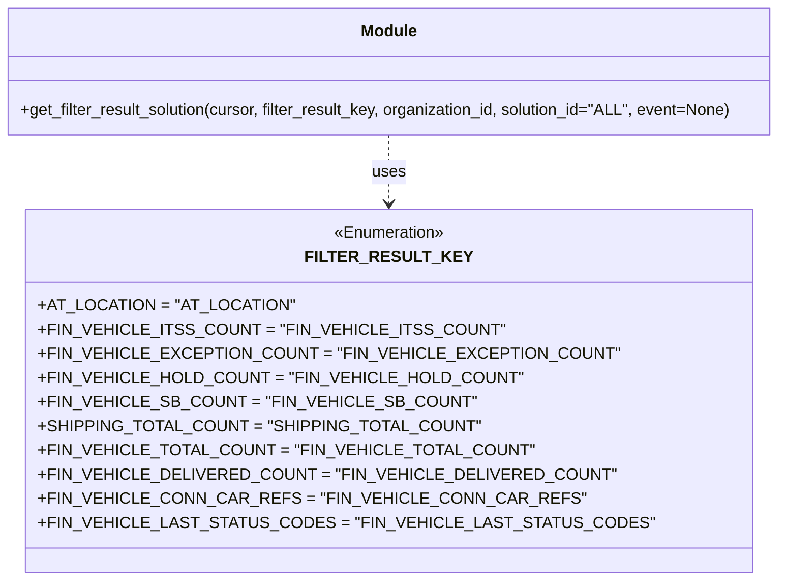

# Diagram: shipment_core/chromium_export/fv/python/fv/filterresult/lookup.py


> Auto-generated by Obscura crawlers

## Diagram 1



> SVG rendering failed for this diagram.

## Diagram 2

```mermaid
flowchart LR
    Start([Start]) --> BuildData[/"Build data dict: filter_result_key, solution_id, organization_id"/]
    BuildData --> TryAuth{Event and requestContext?}
    TryAuth -- No --> BuildQuery[/"Compose SQL query and log with cursor.mogrify"/]
    TryAuth -- Yes --> HasAuthorizer{requestContext.authorizer?}
    HasAuthorizer -- No --> BuildQuery
    HasAuthorizer -- Yes --> GetAuthorizer[/"authorizer = requestContext.authorizer"/]
    GetAuthorizer --> HasEmail{authorizer.email present?}
    HasEmail -- No --> BuildQuery
    HasEmail -- Yes --> IsCachedUser{email == "cacheduser@fv.com"?}
    IsCachedUser -- Yes --> ReturnCached["Return (None, False) (force cache refresh)"]
    IsCachedUser -- No --> BuildQuery
    BuildQuery --> Mogrify[/"query = cursor.mogrify(query, data) and log"/]
    Mogrify --> Execute[/cursor.execute(query)/]
    Execute --> Fetch[/result = cursor.fetchone()/]
    Fetch --> HasResult{result and result.query_function_result?}
    HasResult -- Yes --> ReturnSuccess["Return (result.query_function_result, True)"]
    HasResult -- No --> ReturnFail["Return (None, False)"]
    ReturnCached --> End([End])
    ReturnSuccess --> End
    ReturnFail --> End
```

> SVG rendering failed for this diagram.
