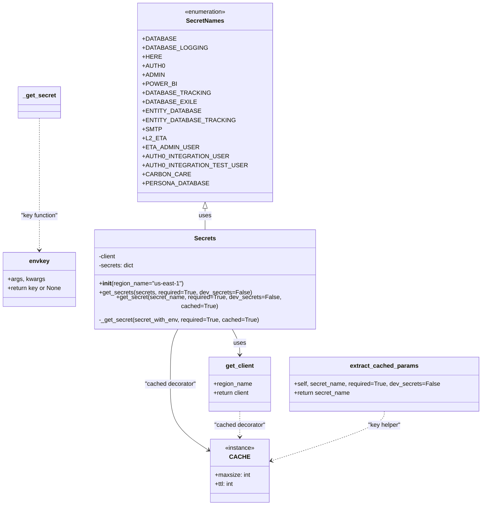
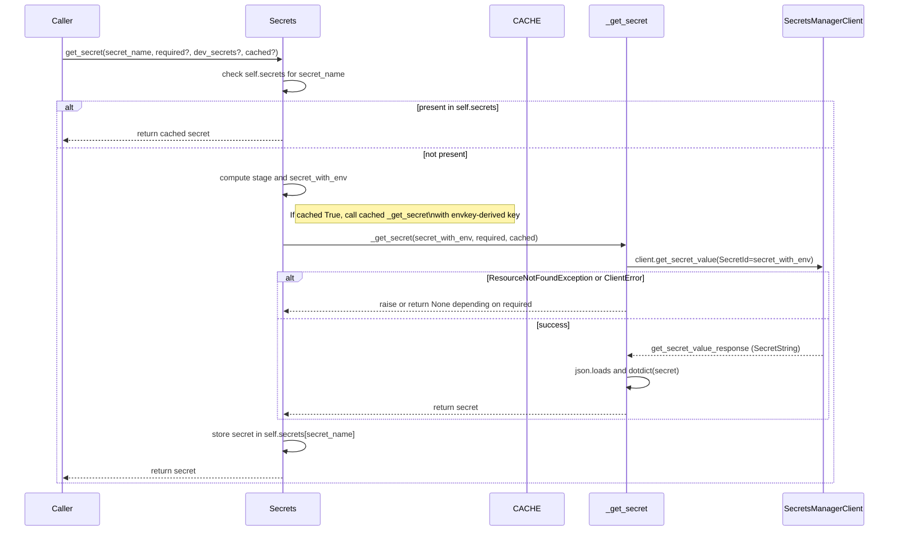

# Diagram: shipment_core/chromium_export/fv/python/fv/secrets/__init__.py

> Auto-generated by Obscura crawlers

## Diagram 1

### SVG

<svg id="container" width="1269.197265625" xmlns="http://www.w3.org/2000/svg" class="classDiagram" height="1318" viewBox="0 0 1269.197265625 1318" role="graphics-document document" aria-roledescription="class"><g><defs><marker id="container_class-aggregationStart" class="marker aggregation class" refX="18" refY="7" markerWidth="190" markerHeight="240" orient="auto"><path d="M 18,7 L9,13 L1,7 L9,1 Z"></path></marker></defs><defs><marker id="container_class-aggregationEnd" class="marker aggregation class" refX="1" refY="7" markerWidth="20" markerHeight="28" orient="auto"><path d="M 18,7 L9,13 L1,7 L9,1 Z"></path></marker></defs><defs><marker id="container_class-extensionStart" class="marker extension class" refX="18" refY="7" markerWidth="190" markerHeight="240" orient="auto"><path d="M 1,7 L18,13 V 1 Z"></path></marker></defs><defs><marker id="container_class-extensionEnd" class="marker extension class" refX="1" refY="7" markerWidth="20" markerHeight="28" orient="auto"><path d="M 1,1 V 13 L18,7 Z"></path></marker></defs><defs><marker id="container_class-compositionStart" class="marker composition class" refX="18" refY="7" markerWidth="190" markerHeight="240" orient="auto"><path d="M 18,7 L9,13 L1,7 L9,1 Z"></path></marker></defs><defs><marker id="container_class-compositionEnd" class="marker composition class" refX="1" refY="7" markerWidth="20" markerHeight="28" orient="auto"><path d="M 18,7 L9,13 L1,7 L9,1 Z"></path></marker></defs><defs><marker id="container_class-dependencyStart" class="marker dependency class" refX="6" refY="7" markerWidth="190" markerHeight="240" orient="auto"><path d="M 5,7 L9,13 L1,7 L9,1 Z"></path></marker></defs><defs><marker id="container_class-dependencyEnd" class="marker dependency class" refX="13" refY="7" markerWidth="20" markerHeight="28" orient="auto"><path d="M 18,7 L9,13 L14,7 L9,1 Z"></path></marker></defs><defs><marker id="container_class-lollipopStart" class="marker lollipop class" refX="13" refY="7" markerWidth="190" markerHeight="240" orient="auto"><circle stroke="black" fill="transparent" cx="7" cy="7" r="6"></circle></marker></defs><defs><marker id="container_class-lollipopEnd" class="marker lollipop class" refX="1" refY="7" markerWidth="190" markerHeight="240" orient="auto"><circle stroke="black" fill="transparent" cx="7" cy="7" r="6"></circle></marker></defs><g class="root"><g class="clusters"></g><g class="edgePaths"><path d="M544.191,553.25L544.191,556.542C544.191,559.833,544.191,566.417,544.191,575.875C544.191,585.333,544.191,597.667,544.191,603.833L544.191,610" id="id_SecretNames_Secrets_1" class="edge-thickness-normal edge-pattern-solid relation" style=";;;" data-edge="true" data-et="edge" data-id="id_SecretNames_Secrets_1" data-points="W3sieCI6NTQ0LjE5MTQwNjI1LCJ5Ijo1MzZ9LHsieCI6NTQ0LjE5MTQwNjI1LCJ5Ijo1NzN9LHsieCI6NTQ0LjE5MTQwNjI1LCJ5Ijo2MTB9XQ==" marker-start="url(#container_class-extensionStart)"></path><path d="M615.252,850L618.904,856.167C622.555,862.333,629.859,874.667,633.51,886C637.162,897.333,637.162,907.667,637.162,912.833L637.162,918" id="id_Secrets_get_client_2" class="edge-thickness-normal edge-pattern-solid relation" style=";;;" data-edge="true" data-et="edge" data-id="id_Secrets_get_client_2" data-points="W3sieCI6NjE1LjI1MTgxNjI4MTg0NzEsInkiOjg1MH0seyJ4Ijo2MzcuMTYyMTA5Mzc1LCJ5Ijo4ODd9LHsieCI6NjM3LjE2MjEwOTM3NSwieSI6OTI0fV0=" marker-end="url(#container_class-dependencyEnd)"></path><path d="M473.131,850L469.479,856.167C465.828,862.333,458.524,874.667,454.872,899C451.221,923.333,451.221,959.667,451.221,996C451.221,1032.333,451.221,1068.667,468.292,1097.942C485.363,1127.218,519.506,1149.436,536.577,1160.545L553.649,1171.654" id="id_Secrets_CACHE_3" class="edge-thickness-normal edge-pattern-solid relation" style=";;;" data-edge="true" data-et="edge" data-id="id_Secrets_CACHE_3" data-points="W3sieCI6NDczLjEzMDk5NjIxODE1Mjg2LCJ5Ijo4NTB9LHsieCI6NDUxLjIyMDcwMzEyNSwieSI6ODg3fSx7IngiOjQ1MS4yMjA3MDMxMjUsInkiOjk5Nn0seyJ4Ijo0NTEuMjIwNzAzMTI1LCJ5IjoxMTA1fSx7IngiOjU1OC42Nzc3MzQzNzUsInkiOjExNzQuOTI2ODcxMjg0MjE2OH1d" marker-end="url(#container_class-dependencyEnd)"></path><path d="M105.066,314L105.066,357.167C105.066,400.333,105.066,486.667,105.066,543C105.066,599.333,105.066,625.667,105.066,638.833L105.066,652" id="id__get_secret_envkey_4" class="edge-thickness-normal edge-pattern-dashed relation" style=";;;" data-edge="true" data-et="edge" data-id="id__get_secret_envkey_4" data-points="W3sieCI6MTA1LjA2NjQwNjI1LCJ5IjozMTR9LHsieCI6MTA1LjA2NjQwNjI1LCJ5Ijo1NzN9LHsieCI6MTA1LjA2NjQwNjI1LCJ5Ijo2NTh9XQ==" marker-end="url(#container_class-dependencyEnd)"></path><path d="M637.162,1068L637.162,1074.167C637.162,1080.333,637.162,1092.667,637.162,1104C637.162,1115.333,637.162,1125.667,637.162,1130.833L637.162,1136" id="id_get_client_CACHE_5" class="edge-thickness-normal edge-pattern-dashed relation" style=";;;" data-edge="true" data-et="edge" data-id="id_get_client_CACHE_5" data-points="W3sieCI6NjM3LjE2MjEwOTM3NSwieSI6MTA2OH0seyJ4Ijo2MzcuMTYyMTA5Mzc1LCJ5IjoxMTA1fSx7IngiOjYzNy4xNjIxMDkzNzUsInkiOjExNDJ9XQ==" marker-end="url(#container_class-dependencyEnd)"></path><path d="M1014.959,1068L1014.959,1074.167C1014.959,1080.333,1014.959,1092.667,966.026,1114.506C917.093,1136.344,819.227,1167.689,770.294,1183.361L721.361,1199.033" id="id_extract_cached_params_CACHE_6" class="edge-thickness-normal edge-pattern-dashed relation" style=";;;" data-edge="true" data-et="edge" data-id="id_extract_cached_params_CACHE_6" data-points="W3sieCI6MTAxNC45NTg5ODQzNzUsInkiOjEwNjh9LHsieCI6MTAxNC45NTg5ODQzNzUsInkiOjExMDV9LHsieCI6NzE1LjY0NjQ4NDM3NSwieSI6MTIwMC44NjMxODcwNjMxNTM5fV0=" marker-end="url(#container_class-dependencyEnd)"></path></g><g class="edgeLabels"><g class="edgeLabel" transform="translate(544.19140625, 573)"><g class="label" data-id="id_SecretNames_Secrets_1" transform="translate(-16.4921875, -12)"><foreignObject width="32.984375" height="24">

uses

</foreignObject></g></g><g class="edgeLabel" transform="translate(637.162109375, 887)"><g class="label" data-id="id_Secrets_get_client_2" transform="translate(-16.4921875, -12)"><foreignObject width="32.984375" height="24">

uses

</foreignObject></g></g><g class="edgeLabel" transform="translate(451.220703125, 996)"><g class="label" data-id="id_Secrets_CACHE_3" transform="translate(-69.3828125, -12)"><foreignObject width="138.765625" height="24">

"cached decorator"

</foreignObject></g></g><g class="edgeLabel" transform="translate(105.06640625, 573)"><g class="label" data-id="id__get_secret_envkey_4" transform="translate(-51.0703125, -12)"><foreignObject width="102.140625" height="24">

"key function"

</foreignObject></g></g><g class="edgeLabel" transform="translate(637.162109375, 1105)"><g class="label" data-id="id_get_client_CACHE_5" transform="translate(-69.3828125, -12)"><foreignObject width="138.765625" height="24">

"cached decorator"

</foreignObject></g></g><g class="edgeLabel" transform="translate(1014.958984375, 1105)"><g class="label" data-id="id_extract_cached_params_CACHE_6" transform="translate(-44.421875, -12)"><foreignObject width="88.84375" height="24">

"key helper"

</foreignObject></g></g></g><g class="nodes"><g class="node default" id="classId-SecretNames-0" transform="translate(544.19140625, 272)"><g class="basic label-container"><path d="M-161.82421875 -264 L161.82421875 -264 L161.82421875 264 L-161.82421875 264" stroke="none" stroke-width="0" fill="#ECECFF" style=""></path><path d="M-161.82421875 -264 C-83.67646543956441 -264, -5.52871212912882 -264, 161.82421875 -264 M-161.82421875 -264 C-78.43588233203845 -264, 4.952454085923108 -264, 161.82421875 -264 M161.82421875 -264 C161.82421875 -148.61089769488325, 161.82421875 -33.22179538976653, 161.82421875 264 M161.82421875 -264 C161.82421875 -71.04371832160138, 161.82421875 121.91256335679725, 161.82421875 264 M161.82421875 264 C54.92184735550261 264, -51.98052403899479 264, -161.82421875 264 M161.82421875 264 C74.48052059155624 264, -12.863177566887515 264, -161.82421875 264 M-161.82421875 264 C-161.82421875 147.83433184647933, -161.82421875 31.66866369295866, -161.82421875 -264 M-161.82421875 264 C-161.82421875 87.45032820113869, -161.82421875 -89.09934359772262, -161.82421875 -264" stroke="#9370DB" stroke-width="1.3" fill="none" stroke-dasharray="0 0" style=""></path></g><g class="annotation-group text" transform="translate(-55.5546875, -240)"><g class="label" style="" transform="translate(0,-12)"><foreignObject width="111.109375" height="24">

«enumeration»

</foreignObject></g></g><g class="label-group text" transform="translate(-48.03125, -216)"><g class="label" style="font-weight: bolder" transform="translate(0,-12)"><foreignObject width="96.0625" height="24">

SecretNames

</foreignObject></g></g><g class="members-group text" transform="translate(-149.82421875, -168)"><g class="label" style="" transform="translate(0,-12)"><foreignObject width="79.234375" height="24">

+DATABASE

</foreignObject></g><g class="label" style="" transform="translate(0,12)"><foreignObject width="151.8125" height="24">

+DATABASE_LOGGING

</foreignObject></g><g class="label" style="" transform="translate(0,36)"><foreignObject width="45.671875" height="24">

+HERE

</foreignObject></g><g class="label" style="" transform="translate(0,60)"><foreignObject width="55.515625" height="24">

+AUTH0

</foreignObject></g><g class="label" style="" transform="translate(0,84)"><foreignObject width="55.28125" height="24">

+ADMIN

</foreignObject></g><g class="label" style="" transform="translate(0,108)"><foreignObject width="82.578125" height="24">

+POWER_BI

</foreignObject></g><g class="label" style="" transform="translate(0,132)"><foreignObject width="157.84375" height="24">

+DATABASE_TRACKING

</foreignObject></g><g class="label" style="" transform="translate(0,156)"><foreignObject width="126.015625" height="24">

+DATABASE_EXILE

</foreignObject></g><g class="label" style="" transform="translate(0,180)"><foreignObject width="135.828125" height="24">

+ENTITY_DATABASE

</foreignObject></g><g class="label" style="" transform="translate(0,204)"><foreignObject width="214.4375" height="24">

+ENTITY_DATABASE_TRACKING

</foreignObject></g><g class="label" style="" transform="translate(0,228)"><foreignObject width="45.703125" height="24">

+SMTP

</foreignObject></g><g class="label" style="" transform="translate(0,252)"><foreignObject width="57.15625" height="24">

+L2_ETA

</foreignObject></g><g class="label" style="" transform="translate(0,276)"><foreignObject width="134.25" height="24">

+ETA_ADMIN_USER

</foreignObject></g><g class="label" style="" transform="translate(0,300)"><foreignObject width="204.0625" height="24">

+AUTH0_INTEGRATION_USER

</foreignObject></g><g class="label" style="" transform="translate(0,324)"><foreignObject width="244.09375" height="24">

+AUTH0_INTEGRATION_TEST_USER

</foreignObject></g><g class="label" style="" transform="translate(0,348)"><foreignObject width="111.578125" height="24">

+CARBON_CARE

</foreignObject></g><g class="label" style="" transform="translate(0,372)"><foreignObject width="154.875" height="24">

+PERSONA_DATABASE

</foreignObject></g></g><g class="methods-group text" transform="translate(-149.82421875, 264)"></g><g class="divider" style=""><path d="M-161.82421875 -192 C-53.94510895031809 -192, 53.93400084936383 -192, 161.82421875 -192 M-161.82421875 -192 C-50.95288995507899 -192, 59.918438839842025 -192, 161.82421875 -192" stroke="#9370DB" stroke-width="1.3" fill="none" stroke-dasharray="0 0" style=""></path></g><g class="divider" style=""><path d="M-161.82421875 240 C-56.47556037899358 240, 48.873097992012845 240, 161.82421875 240 M-161.82421875 240 C-82.92828832628244 240, -4.032357902564883 240, 161.82421875 240" stroke="#9370DB" stroke-width="1.3" fill="none" stroke-dasharray="0 0" style=""></path></g></g><g class="node default" id="classId-CACHE-1" transform="translate(637.162109375, 1226)"><g class="basic label-container"><path d="M-78.484375 -84 L78.484375 -84 L78.484375 84 L-78.484375 84" stroke="none" stroke-width="0" fill="#ECECFF" style=""></path><path d="M-78.484375 -84 C-36.907952321851965 -84, 4.668470356296069 -84, 78.484375 -84 M-78.484375 -84 C-46.41722467646868 -84, -14.350074352937355 -84, 78.484375 -84 M78.484375 -84 C78.484375 -43.78785010442336, 78.484375 -3.575700208846726, 78.484375 84 M78.484375 -84 C78.484375 -49.849063865220415, 78.484375 -15.69812773044083, 78.484375 84 M78.484375 84 C41.62932344275852 84, 4.774271885517038 84, -78.484375 84 M78.484375 84 C25.111463446426733 84, -28.261448107146535 84, -78.484375 84 M-78.484375 84 C-78.484375 35.48821894186651, -78.484375 -13.023562116266973, -78.484375 -84 M-78.484375 84 C-78.484375 40.60345266185507, -78.484375 -2.7930946762898543, -78.484375 -84" stroke="#9370DB" stroke-width="1.3" fill="none" stroke-dasharray="0 0" style=""></path></g><g class="annotation-group text" transform="translate(-39.546875, -60)"><g class="label" style="" transform="translate(0,-12)"><foreignObject width="79.09375" height="24">

«instance»

</foreignObject></g></g><g class="label-group text" transform="translate(-23.3828125, -36)"><g class="label" style="font-weight: bolder" transform="translate(0,-12)"><foreignObject width="46.765625" height="24">

CACHE

</foreignObject></g></g><g class="members-group text" transform="translate(-66.484375, 12)"><g class="label" style="" transform="translate(0,-12)"><foreignObject width="93.421875" height="24">

+maxsize: int

</foreignObject></g><g class="label" style="" transform="translate(0,12)"><foreignObject width="51.890625" height="24">

+ttl: int

</foreignObject></g></g><g class="methods-group text" transform="translate(-66.484375, 84)"></g><g class="divider" style=""><path d="M-78.484375 -12 C-25.321319904267618 -12, 27.841735191464764 -12, 78.484375 -12 M-78.484375 -12 C-38.81693694144571 -12, 0.8505011171085783 -12, 78.484375 -12" stroke="#9370DB" stroke-width="1.3" fill="none" stroke-dasharray="0 0" style=""></path></g><g class="divider" style=""><path d="M-78.484375 60 C-40.44151900648234 60, -2.3986630129646755 60, 78.484375 60 M-78.484375 60 C-39.26705231633424 60, -0.0497296326684733 60, 78.484375 60" stroke="#9370DB" stroke-width="1.3" fill="none" stroke-dasharray="0 0" style=""></path></g></g><g class="node default" id="classId-get_client-2" transform="translate(637.162109375, 996)"><g class="basic label-container"><path d="M-81.55859375 -72 L81.55859375 -72 L81.55859375 72 L-81.55859375 72" stroke="none" stroke-width="0" fill="#ECECFF" style=""></path><path d="M-81.55859375 -72 C-19.335076957865006 -72, 42.88843983426999 -72, 81.55859375 -72 M-81.55859375 -72 C-21.08009238213561 -72, 39.39840898572878 -72, 81.55859375 -72 M81.55859375 -72 C81.55859375 -26.16253825029372, 81.55859375 19.674923499412557, 81.55859375 72 M81.55859375 -72 C81.55859375 -32.053464297741534, 81.55859375 7.893071404516931, 81.55859375 72 M81.55859375 72 C34.68131877962336 72, -12.195956190753279 72, -81.55859375 72 M81.55859375 72 C22.884361045165626 72, -35.78987165966875 72, -81.55859375 72 M-81.55859375 72 C-81.55859375 20.68137099149604, -81.55859375 -30.637258017007923, -81.55859375 -72 M-81.55859375 72 C-81.55859375 22.53195005552677, -81.55859375 -26.93609988894646, -81.55859375 -72" stroke="#9370DB" stroke-width="1.3" fill="none" stroke-dasharray="0 0" style=""></path></g><g class="annotation-group text" transform="translate(0, -48)"></g><g class="label-group text" transform="translate(-36.3203125, -48)"><g class="label" style="font-weight: bolder" transform="translate(0,-12)"><foreignObject width="72.640625" height="24">

get_client

</foreignObject></g></g><g class="members-group text" transform="translate(-69.55859375, 0)"><g class="label" style="" transform="translate(0,-12)"><foreignObject width="102.796875" height="24">

+region_name

</foreignObject></g><g class="label" style="" transform="translate(0,12)"><foreignObject width="98.015625" height="24">

+return client

</foreignObject></g></g><g class="methods-group text" transform="translate(-69.55859375, 72)"></g><g class="divider" style=""><path d="M-81.55859375 -24 C-18.038679356814114 -24, 45.48123503637177 -24, 81.55859375 -24 M-81.55859375 -24 C-42.71337978286437 -24, -3.8681658157287444 -24, 81.55859375 -24" stroke="#9370DB" stroke-width="1.3" fill="none" stroke-dasharray="0 0" style=""></path></g><g class="divider" style=""><path d="M-81.55859375 48 C-40.26853225847812 48, 1.0215292330437649 48, 81.55859375 48 M-81.55859375 48 C-38.77637142166748 48, 4.005850906665046 48, 81.55859375 48" stroke="#9370DB" stroke-width="1.3" fill="none" stroke-dasharray="0 0" style=""></path></g></g><g class="node default" id="classId-envkey-3" transform="translate(105.06640625, 730)"><g class="basic label-container"><path d="M-97.06640625 -72 L97.06640625 -72 L97.06640625 72 L-97.06640625 72" stroke="none" stroke-width="0" fill="#ECECFF" style=""></path><path d="M-97.06640625 -72 C-25.592777682834665 -72, 45.88085088433067 -72, 97.06640625 -72 M-97.06640625 -72 C-34.9613152109308 -72, 27.143775828138402 -72, 97.06640625 -72 M97.06640625 -72 C97.06640625 -30.225878729175626, 97.06640625 11.548242541648747, 97.06640625 72 M97.06640625 -72 C97.06640625 -23.21387401078455, 97.06640625 25.5722519784309, 97.06640625 72 M97.06640625 72 C30.178342065635434 72, -36.70972211872913 72, -97.06640625 72 M97.06640625 72 C43.92685471171179 72, -9.212696826576419 72, -97.06640625 72 M-97.06640625 72 C-97.06640625 15.878357528012835, -97.06640625 -40.24328494397433, -97.06640625 -72 M-97.06640625 72 C-97.06640625 18.704581046651413, -97.06640625 -34.590837906697175, -97.06640625 -72" stroke="#9370DB" stroke-width="1.3" fill="none" stroke-dasharray="0 0" style=""></path></g><g class="annotation-group text" transform="translate(0, -48)"></g><g class="label-group text" transform="translate(-25.8984375, -48)"><g class="label" style="font-weight: bolder" transform="translate(0,-12)"><foreignObject width="51.796875" height="24">

envkey

</foreignObject></g></g><g class="members-group text" transform="translate(-85.06640625, 0)"><g class="label" style="" transform="translate(0,-12)"><foreignObject width="95.9375" height="24">

+args, kwargs

</foreignObject></g><g class="label" style="" transform="translate(0,12)"><foreignObject width="144.234375" height="24">

+return key or None

</foreignObject></g></g><g class="methods-group text" transform="translate(-85.06640625, 72)"></g><g class="divider" style=""><path d="M-97.06640625 -24 C-54.27713273474731 -24, -11.487859219494624 -24, 97.06640625 -24 M-97.06640625 -24 C-47.520288040656744 -24, 2.025830168686511 -24, 97.06640625 -24" stroke="#9370DB" stroke-width="1.3" fill="none" stroke-dasharray="0 0" style=""></path></g><g class="divider" style=""><path d="M-97.06640625 48 C-53.37530656983061 48, -9.684206889661226 48, 97.06640625 48 M-97.06640625 48 C-45.81587288855826 48, 5.434660472883479 48, 97.06640625 48" stroke="#9370DB" stroke-width="1.3" fill="none" stroke-dasharray="0 0" style=""></path></g></g><g class="node default" id="classId-extract_cached_params-4" transform="translate(1014.958984375, 996)"><g class="basic label-container"><path d="M-246.23828125 -72 L246.23828125 -72 L246.23828125 72 L-246.23828125 72" stroke="none" stroke-width="0" fill="#ECECFF" style=""></path><path d="M-246.23828125 -72 C-84.44511137197779 -72, 77.34805850604442 -72, 246.23828125 -72 M-246.23828125 -72 C-70.35698906468014 -72, 105.52430312063973 -72, 246.23828125 -72 M246.23828125 -72 C246.23828125 -25.226839712433588, 246.23828125 21.546320575132825, 246.23828125 72 M246.23828125 -72 C246.23828125 -17.064398200270738, 246.23828125 37.871203599458525, 246.23828125 72 M246.23828125 72 C85.92601250486416 72, -74.38625624027168 72, -246.23828125 72 M246.23828125 72 C145.97866691382762 72, 45.71905257765522 72, -246.23828125 72 M-246.23828125 72 C-246.23828125 26.709685427851603, -246.23828125 -18.580629144296793, -246.23828125 -72 M-246.23828125 72 C-246.23828125 18.3354695990838, -246.23828125 -35.3290608018324, -246.23828125 -72" stroke="#9370DB" stroke-width="1.3" fill="none" stroke-dasharray="0 0" style=""></path></g><g class="annotation-group text" transform="translate(0, -48)"></g><g class="label-group text" transform="translate(-86.7109375, -48)"><g class="label" style="font-weight: bolder" transform="translate(0,-12)"><foreignObject width="173.421875" height="24">

extract_cached_params

</foreignObject></g></g><g class="members-group text" transform="translate(-234.23828125, 0)"><g class="label" style="" transform="translate(0,-12)"><foreignObject width="381.765625" height="24">

+self, secret_name, required=True, dev_secrets=False

</foreignObject></g><g class="label" style="" transform="translate(0,12)"><foreignObject width="150.15625" height="24">

+return secret_name

</foreignObject></g></g><g class="methods-group text" transform="translate(-234.23828125, 72)"></g><g class="divider" style=""><path d="M-246.23828125 -24 C-87.46007773324433 -24, 71.31812578351133 -24, 246.23828125 -24 M-246.23828125 -24 C-88.1340322170102 -24, 69.9702168159796 -24, 246.23828125 -24" stroke="#9370DB" stroke-width="1.3" fill="none" stroke-dasharray="0 0" style=""></path></g><g class="divider" style=""><path d="M-246.23828125 48 C-138.04785862826952 48, -29.857436006539018 48, 246.23828125 48 M-246.23828125 48 C-59.43421181536797 48, 127.36985761926405 48, 246.23828125 48" stroke="#9370DB" stroke-width="1.3" fill="none" stroke-dasharray="0 0" style=""></path></g></g><g class="node default" id="classId-Secrets-5" transform="translate(544.19140625, 730)"><g class="basic label-container"><path d="M-292.05859375 -120 L292.05859375 -120 L292.05859375 120 L-292.05859375 120" stroke="none" stroke-width="0" fill="#ECECFF" style=""></path><path d="M-292.05859375 -120 C-164.48059880973034 -120, -36.90260386946065 -120, 292.05859375 -120 M-292.05859375 -120 C-86.2263853726914 -120, 119.6058230046172 -120, 292.05859375 -120 M292.05859375 -120 C292.05859375 -60.66089185020468, 292.05859375 -1.3217837004093553, 292.05859375 120 M292.05859375 -120 C292.05859375 -31.82949786208043, 292.05859375 56.34100427583914, 292.05859375 120 M292.05859375 120 C144.41894438775648 120, -3.2207049744870346 120, -292.05859375 120 M292.05859375 120 C90.85334900365396 120, -110.35189574269208 120, -292.05859375 120 M-292.05859375 120 C-292.05859375 44.22114969352367, -292.05859375 -31.557700612952658, -292.05859375 -120 M-292.05859375 120 C-292.05859375 36.380238568530686, -292.05859375 -47.23952286293863, -292.05859375 -120" stroke="#9370DB" stroke-width="1.3" fill="none" stroke-dasharray="0 0" style=""></path></g><g class="annotation-group text" transform="translate(0, -96)"></g><g class="label-group text" transform="translate(-27.1640625, -96)"><g class="label" style="font-weight: bolder" transform="translate(0,-12)"><foreignObject width="54.328125" height="24">

Secrets

</foreignObject></g></g><g class="members-group text" transform="translate(-280.05859375, -48)"><g class="label" style="" transform="translate(0,-12)"><foreignObject width="47.171875" height="24">

-client

</foreignObject></g><g class="label" style="" transform="translate(0,12)"><foreignObject width="93.546875" height="24">

-secrets: dict

</foreignObject></g></g><g class="methods-group text" transform="translate(-280.05859375, 24)"><g class="label" style="" transform="translate(0,-12)"><foreignObject width="223.40625" height="24">

+<strong>init</strong>(region_name="us-east-1")

</foreignObject></g><g class="label" style="" transform="translate(0,12)"><foreignObject width="399.796875" height="24">

+get_secrets(secrets, required=True, dev_secrets=False)

</foreignObject></g><g class="label" style="" transform="translate(0,36)"><foreignObject width="532.953125" height="24">

+get_secret(secret_name, required=True, dev_secrets=False, cached=True)

</foreignObject></g><g class="label" style="" transform="translate(0,60)"><foreignObject width="424.59375" height="24">

-_get_secret(secret_with_env, required=True, cached=True)

</foreignObject></g></g><g class="divider" style=""><path d="M-292.05859375 -72 C-122.12611419359303 -72, 47.80636536281395 -72, 292.05859375 -72 M-292.05859375 -72 C-59.4082858439055 -72, 173.242022062189 -72, 292.05859375 -72" stroke="#9370DB" stroke-width="1.3" fill="none" stroke-dasharray="0 0" style=""></path></g><g class="divider" style=""><path d="M-292.05859375 0 C-155.46321236954634 0, -18.86783098909268 0, 292.05859375 0 M-292.05859375 0 C-93.70066290233922 0, 104.65726794532156 0, 292.05859375 0" stroke="#9370DB" stroke-width="1.3" fill="none" stroke-dasharray="0 0" style=""></path></g></g><g class="node default" id="classId-_get_secret-6" transform="translate(105.06640625, 272)"><g class="basic label-container"><path d="M-54.7734375 -42 L54.7734375 -42 L54.7734375 42 L-54.7734375 42" stroke="none" stroke-width="0" fill="#ECECFF" style=""></path><path d="M-54.7734375 -42 C-14.91102735204835 -42, 24.9513827959033 -42, 54.7734375 -42 M-54.7734375 -42 C-28.927816647368743 -42, -3.082195794737487 -42, 54.7734375 -42 M54.7734375 -42 C54.7734375 -12.765304135953688, 54.7734375 16.469391728092624, 54.7734375 42 M54.7734375 -42 C54.7734375 -16.734022048014122, 54.7734375 8.531955903971756, 54.7734375 42 M54.7734375 42 C25.970787229807875 42, -2.831863040384249 42, -54.7734375 42 M54.7734375 42 C23.90210239965802 42, -6.9692327006839605 42, -54.7734375 42 M-54.7734375 42 C-54.7734375 16.477655120547517, -54.7734375 -9.044689758904966, -54.7734375 -42 M-54.7734375 42 C-54.7734375 13.470247052919898, -54.7734375 -15.059505894160203, -54.7734375 -42" stroke="#9370DB" stroke-width="1.3" fill="none" stroke-dasharray="0 0" style=""></path></g><g class="annotation-group text" transform="translate(0, -18)"></g><g class="label-group text" transform="translate(-42.7734375, -18)"><g class="label" style="font-weight: bolder" transform="translate(0,-12)"><foreignObject width="85.546875" height="24">

_get_secret

</foreignObject></g></g><g class="members-group text" transform="translate(-42.7734375, 30)"></g><g class="methods-group text" transform="translate(-42.7734375, 60)"></g><g class="divider" style=""><path d="M-54.7734375 6 C-12.403550231303733 6, 29.966337037392535 6, 54.7734375 6 M-54.7734375 6 C-23.40484645338301 6, 7.963744593233983 6, 54.7734375 6" stroke="#9370DB" stroke-width="1.3" fill="none" stroke-dasharray="0 0" style=""></path></g><g class="divider" style=""><path d="M-54.7734375 24 C-16.850416206233312 24, 21.072605087533375 24, 54.7734375 24 M-54.7734375 24 C-24.515359063255758 24, 5.742719373488484 24, 54.7734375 24" stroke="#9370DB" stroke-width="1.3" fill="none" stroke-dasharray="0 0" style=""></path></g></g></g></g></g></svg>

## Diagram 2

### SVG

<svg id="container" width="1925.5" xmlns="http://www.w3.org/2000/svg" height="1116" viewBox="-50 -10 1925.5 1116" role="graphics-document document" aria-roledescription="sequence"><g><rect x="1648.5" y="1030" fill="#eaeaea" stroke="#666" width="177" height="65" name="AWS" rx="3" ry="3" class="actor actor-bottom"></rect><text x="1737" y="1062.5" dominant-baseline="central" alignment-baseline="central" class="actor actor-box" style="text-anchor: middle; font-size: 16px; font-weight: 400;"><tspan x="1737" dy="0">SecretsManagerClient</tspan></text></g><g><rect x="1231" y="1030" fill="#eaeaea" stroke="#666" width="150" height="65" name="_get_secret" rx="3" ry="3" class="actor actor-bottom"></rect><text x="1306" y="1062.5" dominant-baseline="central" alignment-baseline="central" class="actor actor-box" style="text-anchor: middle; font-size: 16px; font-weight: 400;"><tspan x="1306" dy="0">_get_secret</tspan></text></g><g><rect x="1031" y="1030" fill="#eaeaea" stroke="#666" width="150" height="65" name="Cache" rx="3" ry="3" class="actor actor-bottom"></rect><text x="1106" y="1062.5" dominant-baseline="central" alignment-baseline="central" class="actor actor-box" style="text-anchor: middle; font-size: 16px; font-weight: 400;"><tspan x="1106" dy="0">CACHE</tspan></text></g><g><rect x="489" y="1030" fill="#eaeaea" stroke="#666" width="150" height="65" name="SecretsObj" rx="3" ry="3" class="actor actor-bottom"></rect><text x="564" y="1062.5" dominant-baseline="central" alignment-baseline="central" class="actor actor-box" style="text-anchor: middle; font-size: 16px; font-weight: 400;"><tspan x="564" dy="0">Secrets</tspan></text></g><g><rect x="0" y="1030" fill="#eaeaea" stroke="#666" width="150" height="65" name="Caller" rx="3" ry="3" class="actor actor-bottom"></rect><text x="75" y="1062.5" dominant-baseline="central" alignment-baseline="central" class="actor actor-box" style="text-anchor: middle; font-size: 16px; font-weight: 400;"><tspan x="75" dy="0">Caller</tspan></text></g><g><line id="actor4" x1="1737" y1="65" x2="1737" y2="1030" class="actor-line 200" stroke-width="0.5px" stroke="#999" name="AWS"></line><g id="root-4"><rect x="1648.5" y="0" fill="#eaeaea" stroke="#666" width="177" height="65" name="AWS" rx="3" ry="3" class="actor actor-top"></rect><text x="1737" y="32.5" dominant-baseline="central" alignment-baseline="central" class="actor actor-box" style="text-anchor: middle; font-size: 16px; font-weight: 400;"><tspan x="1737" dy="0">SecretsManagerClient</tspan></text></g></g><g><line id="actor3" x1="1306" y1="65" x2="1306" y2="1030" class="actor-line 200" stroke-width="0.5px" stroke="#999" name="_get_secret"></line><g id="root-3"><rect x="1231" y="0" fill="#eaeaea" stroke="#666" width="150" height="65" name="_get_secret" rx="3" ry="3" class="actor actor-top"></rect><text x="1306" y="32.5" dominant-baseline="central" alignment-baseline="central" class="actor actor-box" style="text-anchor: middle; font-size: 16px; font-weight: 400;"><tspan x="1306" dy="0">_get_secret</tspan></text></g></g><g><line id="actor2" x1="1106" y1="65" x2="1106" y2="1030" class="actor-line 200" stroke-width="0.5px" stroke="#999" name="Cache"></line><g id="root-2"><rect x="1031" y="0" fill="#eaeaea" stroke="#666" width="150" height="65" name="Cache" rx="3" ry="3" class="actor actor-top"></rect><text x="1106" y="32.5" dominant-baseline="central" alignment-baseline="central" class="actor actor-box" style="text-anchor: middle; font-size: 16px; font-weight: 400;"><tspan x="1106" dy="0">CACHE</tspan></text></g></g><g><line id="actor1" x1="564" y1="65" x2="564" y2="1030" class="actor-line 200" stroke-width="0.5px" stroke="#999" name="SecretsObj"></line><g id="root-1"><rect x="489" y="0" fill="#eaeaea" stroke="#666" width="150" height="65" name="SecretsObj" rx="3" ry="3" class="actor actor-top"></rect><text x="564" y="32.5" dominant-baseline="central" alignment-baseline="central" class="actor actor-box" style="text-anchor: middle; font-size: 16px; font-weight: 400;"><tspan x="564" dy="0">Secrets</tspan></text></g></g><g><line id="actor0" x1="75" y1="65" x2="75" y2="1030" class="actor-line 200" stroke-width="0.5px" stroke="#999" name="Caller"></line><g id="root-0"><rect x="0" y="0" fill="#eaeaea" stroke="#666" width="150" height="65" name="Caller" rx="3" ry="3" class="actor actor-top"></rect><text x="75" y="32.5" dominant-baseline="central" alignment-baseline="central" class="actor actor-box" style="text-anchor: middle; font-size: 16px; font-weight: 400;"><tspan x="75" dy="0">Caller</tspan></text></g></g><g></g><defs><symbol id="computer" width="24" height="24"><path transform="scale(.5)" d="M2 2v13h20v-13h-20zm18 11h-16v-9h16v9zm-10.228 6l.466-1h3.524l.467 1h-4.457zm14.228 3h-24l2-6h2.104l-1.33 4h18.45l-1.297-4h2.073l2 6zm-5-10h-14v-7h14v7z"></path></symbol></defs><defs><symbol id="database" fill-rule="evenodd" clip-rule="evenodd"><path transform="scale(.5)" d="M12.258.001l.256.004.255.005.253.008.251.01.249.012.247.015.246.016.242.019.241.02.239.023.236.024.233.027.231.028.229.031.225.032.223.034.22.036.217.038.214.04.211.041.208.043.205.045.201.046.198.048.194.05.191.051.187.053.183.054.18.056.175.057.172.059.168.06.163.061.16.063.155.064.15.066.074.033.073.033.071.034.07.034.069.035.068.035.067.035.066.035.064.036.064.036.062.036.06.036.06.037.058.037.058.037.055.038.055.038.053.038.052.038.051.039.05.039.048.039.047.039.045.04.044.04.043.04.041.04.04.041.039.041.037.041.036.041.034.041.033.042.032.042.03.042.029.042.027.042.026.043.024.043.023.043.021.043.02.043.018.044.017.043.015.044.013.044.012.044.011.045.009.044.007.045.006.045.004.045.002.045.001.045v17l-.001.045-.002.045-.004.045-.006.045-.007.045-.009.044-.011.045-.012.044-.013.044-.015.044-.017.043-.018.044-.02.043-.021.043-.023.043-.024.043-.026.043-.027.042-.029.042-.03.042-.032.042-.033.042-.034.041-.036.041-.037.041-.039.041-.04.041-.041.04-.043.04-.044.04-.045.04-.047.039-.048.039-.05.039-.051.039-.052.038-.053.038-.055.038-.055.038-.058.037-.058.037-.06.037-.06.036-.062.036-.064.036-.064.036-.066.035-.067.035-.068.035-.069.035-.07.034-.071.034-.073.033-.074.033-.15.066-.155.064-.16.063-.163.061-.168.06-.172.059-.175.057-.18.056-.183.054-.187.053-.191.051-.194.05-.198.048-.201.046-.205.045-.208.043-.211.041-.214.04-.217.038-.22.036-.223.034-.225.032-.229.031-.231.028-.233.027-.236.024-.239.023-.241.02-.242.019-.246.016-.247.015-.249.012-.251.01-.253.008-.255.005-.256.004-.258.001-.258-.001-.256-.004-.255-.005-.253-.008-.251-.01-.249-.012-.247-.015-.245-.016-.243-.019-.241-.02-.238-.023-.236-.024-.234-.027-.231-.028-.228-.031-.226-.032-.223-.034-.22-.036-.217-.038-.214-.04-.211-.041-.208-.043-.204-.045-.201-.046-.198-.048-.195-.05-.19-.051-.187-.053-.184-.054-.179-.056-.176-.057-.172-.059-.167-.06-.164-.061-.159-.063-.155-.064-.151-.066-.074-.033-.072-.033-.072-.034-.07-.034-.069-.035-.068-.035-.067-.035-.066-.035-.064-.036-.063-.036-.062-.036-.061-.036-.06-.037-.058-.037-.057-.037-.056-.038-.055-.038-.053-.038-.052-.038-.051-.039-.049-.039-.049-.039-.046-.039-.046-.04-.044-.04-.043-.04-.041-.04-.04-.041-.039-.041-.037-.041-.036-.041-.034-.041-.033-.042-.032-.042-.03-.042-.029-.042-.027-.042-.026-.043-.024-.043-.023-.043-.021-.043-.02-.043-.018-.044-.017-.043-.015-.044-.013-.044-.012-.044-.011-.045-.009-.044-.007-.045-.006-.045-.004-.045-.002-.045-.001-.045v-17l.001-.045.002-.045.004-.045.006-.045.007-.045.009-.044.011-.045.012-.044.013-.044.015-.044.017-.043.018-.044.02-.043.021-.043.023-.043.024-.043.026-.043.027-.042.029-.042.03-.042.032-.042.033-.042.034-.041.036-.041.037-.041.039-.041.04-.041.041-.04.043-.04.044-.04.046-.04.046-.039.049-.039.049-.039.051-.039.052-.038.053-.038.055-.038.056-.038.057-.037.058-.037.06-.037.061-.036.062-.036.063-.036.064-.036.066-.035.067-.035.068-.035.069-.035.07-.034.072-.034.072-.033.074-.033.151-.066.155-.064.159-.063.164-.061.167-.06.172-.059.176-.057.179-.056.184-.054.187-.053.19-.051.195-.05.198-.048.201-.046.204-.045.208-.043.211-.041.214-.04.217-.038.22-.036.223-.034.226-.032.228-.031.231-.028.234-.027.236-.024.238-.023.241-.02.243-.019.245-.016.247-.015.249-.012.251-.01.253-.008.255-.005.256-.004.258-.001.258.001zm-9.258 20.499v.01l.001.021.003.021.004.022.005.021.006.022.007.022.009.023.01.022.011.023.012.023.013.023.015.023.016.024.017.023.018.024.019.024.021.024.022.025.023.024.024.025.052.049.056.05.061.051.066.051.07.051.075.051.079.052.084.052.088.052.092.052.097.052.102.051.105.052.11.052.114.051.119.051.123.051.127.05.131.05.135.05.139.048.144.049.147.047.152.047.155.047.16.045.163.045.167.043.171.043.176.041.178.041.183.039.187.039.19.037.194.035.197.035.202.033.204.031.209.03.212.029.216.027.219.025.222.024.226.021.23.02.233.018.236.016.24.015.243.012.246.01.249.008.253.005.256.004.259.001.26-.001.257-.004.254-.005.25-.008.247-.011.244-.012.241-.014.237-.016.233-.018.231-.021.226-.021.224-.024.22-.026.216-.027.212-.028.21-.031.205-.031.202-.034.198-.034.194-.036.191-.037.187-.039.183-.04.179-.04.175-.042.172-.043.168-.044.163-.045.16-.046.155-.046.152-.047.148-.048.143-.049.139-.049.136-.05.131-.05.126-.05.123-.051.118-.052.114-.051.11-.052.106-.052.101-.052.096-.052.092-.052.088-.053.083-.051.079-.052.074-.052.07-.051.065-.051.06-.051.056-.05.051-.05.023-.024.023-.025.021-.024.02-.024.019-.024.018-.024.017-.024.015-.023.014-.024.013-.023.012-.023.01-.023.01-.022.008-.022.006-.022.006-.022.004-.022.004-.021.001-.021.001-.021v-4.127l-.077.055-.08.053-.083.054-.085.053-.087.052-.09.052-.093.051-.095.05-.097.05-.1.049-.102.049-.105.048-.106.047-.109.047-.111.046-.114.045-.115.045-.118.044-.12.043-.122.042-.124.042-.126.041-.128.04-.13.04-.132.038-.134.038-.135.037-.138.037-.139.035-.142.035-.143.034-.144.033-.147.032-.148.031-.15.03-.151.03-.153.029-.154.027-.156.027-.158.026-.159.025-.161.024-.162.023-.163.022-.165.021-.166.02-.167.019-.169.018-.169.017-.171.016-.173.015-.173.014-.175.013-.175.012-.177.011-.178.01-.179.008-.179.008-.181.006-.182.005-.182.004-.184.003-.184.002h-.37l-.184-.002-.184-.003-.182-.004-.182-.005-.181-.006-.179-.008-.179-.008-.178-.01-.176-.011-.176-.012-.175-.013-.173-.014-.172-.015-.171-.016-.17-.017-.169-.018-.167-.019-.166-.02-.165-.021-.163-.022-.162-.023-.161-.024-.159-.025-.157-.026-.156-.027-.155-.027-.153-.029-.151-.03-.15-.03-.148-.031-.146-.032-.145-.033-.143-.034-.141-.035-.14-.035-.137-.037-.136-.037-.134-.038-.132-.038-.13-.04-.128-.04-.126-.041-.124-.042-.122-.042-.12-.044-.117-.043-.116-.045-.113-.045-.112-.046-.109-.047-.106-.047-.105-.048-.102-.049-.1-.049-.097-.05-.095-.05-.093-.052-.09-.051-.087-.052-.085-.053-.083-.054-.08-.054-.077-.054v4.127zm0-5.654v.011l.001.021.003.021.004.021.005.022.006.022.007.022.009.022.01.022.011.023.012.023.013.023.015.024.016.023.017.024.018.024.019.024.021.024.022.024.023.025.024.024.052.05.056.05.061.05.066.051.07.051.075.052.079.051.084.052.088.052.092.052.097.052.102.052.105.052.11.051.114.051.119.052.123.05.127.051.131.05.135.049.139.049.144.048.147.048.152.047.155.046.16.045.163.045.167.044.171.042.176.042.178.04.183.04.187.038.19.037.194.036.197.034.202.033.204.032.209.03.212.028.216.027.219.025.222.024.226.022.23.02.233.018.236.016.24.014.243.012.246.01.249.008.253.006.256.003.259.001.26-.001.257-.003.254-.006.25-.008.247-.01.244-.012.241-.015.237-.016.233-.018.231-.02.226-.022.224-.024.22-.025.216-.027.212-.029.21-.03.205-.032.202-.033.198-.035.194-.036.191-.037.187-.039.183-.039.179-.041.175-.042.172-.043.168-.044.163-.045.16-.045.155-.047.152-.047.148-.048.143-.048.139-.05.136-.049.131-.05.126-.051.123-.051.118-.051.114-.052.11-.052.106-.052.101-.052.096-.052.092-.052.088-.052.083-.052.079-.052.074-.051.07-.052.065-.051.06-.05.056-.051.051-.049.023-.025.023-.024.021-.025.02-.024.019-.024.018-.024.017-.024.015-.023.014-.023.013-.024.012-.022.01-.023.01-.023.008-.022.006-.022.006-.022.004-.021.004-.022.001-.021.001-.021v-4.139l-.077.054-.08.054-.083.054-.085.052-.087.053-.09.051-.093.051-.095.051-.097.05-.1.049-.102.049-.105.048-.106.047-.109.047-.111.046-.114.045-.115.044-.118.044-.12.044-.122.042-.124.042-.126.041-.128.04-.13.039-.132.039-.134.038-.135.037-.138.036-.139.036-.142.035-.143.033-.144.033-.147.033-.148.031-.15.03-.151.03-.153.028-.154.028-.156.027-.158.026-.159.025-.161.024-.162.023-.163.022-.165.021-.166.02-.167.019-.169.018-.169.017-.171.016-.173.015-.173.014-.175.013-.175.012-.177.011-.178.009-.179.009-.179.007-.181.007-.182.005-.182.004-.184.003-.184.002h-.37l-.184-.002-.184-.003-.182-.004-.182-.005-.181-.007-.179-.007-.179-.009-.178-.009-.176-.011-.176-.012-.175-.013-.173-.014-.172-.015-.171-.016-.17-.017-.169-.018-.167-.019-.166-.02-.165-.021-.163-.022-.162-.023-.161-.024-.159-.025-.157-.026-.156-.027-.155-.028-.153-.028-.151-.03-.15-.03-.148-.031-.146-.033-.145-.033-.143-.033-.141-.035-.14-.036-.137-.036-.136-.037-.134-.038-.132-.039-.13-.039-.128-.04-.126-.041-.124-.042-.122-.043-.12-.043-.117-.044-.116-.044-.113-.046-.112-.046-.109-.046-.106-.047-.105-.048-.102-.049-.1-.049-.097-.05-.095-.051-.093-.051-.09-.051-.087-.053-.085-.052-.083-.054-.08-.054-.077-.054v4.139zm0-5.666v.011l.001.02.003.022.004.021.005.022.006.021.007.022.009.023.01.022.011.023.012.023.013.023.015.023.016.024.017.024.018.023.019.024.021.025.022.024.023.024.024.025.052.05.056.05.061.05.066.051.07.051.075.052.079.051.084.052.088.052.092.052.097.052.102.052.105.051.11.052.114.051.119.051.123.051.127.05.131.05.135.05.139.049.144.048.147.048.152.047.155.046.16.045.163.045.167.043.171.043.176.042.178.04.183.04.187.038.19.037.194.036.197.034.202.033.204.032.209.03.212.028.216.027.219.025.222.024.226.021.23.02.233.018.236.017.24.014.243.012.246.01.249.008.253.006.256.003.259.001.26-.001.257-.003.254-.006.25-.008.247-.01.244-.013.241-.014.237-.016.233-.018.231-.02.226-.022.224-.024.22-.025.216-.027.212-.029.21-.03.205-.032.202-.033.198-.035.194-.036.191-.037.187-.039.183-.039.179-.041.175-.042.172-.043.168-.044.163-.045.16-.045.155-.047.152-.047.148-.048.143-.049.139-.049.136-.049.131-.051.126-.05.123-.051.118-.052.114-.051.11-.052.106-.052.101-.052.096-.052.092-.052.088-.052.083-.052.079-.052.074-.052.07-.051.065-.051.06-.051.056-.05.051-.049.023-.025.023-.025.021-.024.02-.024.019-.024.018-.024.017-.024.015-.023.014-.024.013-.023.012-.023.01-.022.01-.023.008-.022.006-.022.006-.022.004-.022.004-.021.001-.021.001-.021v-4.153l-.077.054-.08.054-.083.053-.085.053-.087.053-.09.051-.093.051-.095.051-.097.05-.1.049-.102.048-.105.048-.106.048-.109.046-.111.046-.114.046-.115.044-.118.044-.12.043-.122.043-.124.042-.126.041-.128.04-.13.039-.132.039-.134.038-.135.037-.138.036-.139.036-.142.034-.143.034-.144.033-.147.032-.148.032-.15.03-.151.03-.153.028-.154.028-.156.027-.158.026-.159.024-.161.024-.162.023-.163.023-.165.021-.166.02-.167.019-.169.018-.169.017-.171.016-.173.015-.173.014-.175.013-.175.012-.177.01-.178.01-.179.009-.179.007-.181.006-.182.006-.182.004-.184.003-.184.001-.185.001-.185-.001-.184-.001-.184-.003-.182-.004-.182-.006-.181-.006-.179-.007-.179-.009-.178-.01-.176-.01-.176-.012-.175-.013-.173-.014-.172-.015-.171-.016-.17-.017-.169-.018-.167-.019-.166-.02-.165-.021-.163-.023-.162-.023-.161-.024-.159-.024-.157-.026-.156-.027-.155-.028-.153-.028-.151-.03-.15-.03-.148-.032-.146-.032-.145-.033-.143-.034-.141-.034-.14-.036-.137-.036-.136-.037-.134-.038-.132-.039-.13-.039-.128-.041-.126-.041-.124-.041-.122-.043-.12-.043-.117-.044-.116-.044-.113-.046-.112-.046-.109-.046-.106-.048-.105-.048-.102-.048-.1-.05-.097-.049-.095-.051-.093-.051-.09-.052-.087-.052-.085-.053-.083-.053-.08-.054-.077-.054v4.153zm8.74-8.179l-.257.004-.254.005-.25.008-.247.011-.244.012-.241.014-.237.016-.233.018-.231.021-.226.022-.224.023-.22.026-.216.027-.212.028-.21.031-.205.032-.202.033-.198.034-.194.036-.191.038-.187.038-.183.04-.179.041-.175.042-.172.043-.168.043-.163.045-.16.046-.155.046-.152.048-.148.048-.143.048-.139.049-.136.05-.131.05-.126.051-.123.051-.118.051-.114.052-.11.052-.106.052-.101.052-.096.052-.092.052-.088.052-.083.052-.079.052-.074.051-.07.052-.065.051-.06.05-.056.05-.051.05-.023.025-.023.024-.021.024-.02.025-.019.024-.018.024-.017.023-.015.024-.014.023-.013.023-.012.023-.01.023-.01.022-.008.022-.006.023-.006.021-.004.022-.004.021-.001.021-.001.021.001.021.001.021.004.021.004.022.006.021.006.023.008.022.01.022.01.023.012.023.013.023.014.023.015.024.017.023.018.024.019.024.02.025.021.024.023.024.023.025.051.05.056.05.06.05.065.051.07.052.074.051.079.052.083.052.088.052.092.052.096.052.101.052.106.052.11.052.114.052.118.051.123.051.126.051.131.05.136.05.139.049.143.048.148.048.152.048.155.046.16.046.163.045.168.043.172.043.175.042.179.041.183.04.187.038.191.038.194.036.198.034.202.033.205.032.21.031.212.028.216.027.22.026.224.023.226.022.231.021.233.018.237.016.241.014.244.012.247.011.25.008.254.005.257.004.26.001.26-.001.257-.004.254-.005.25-.008.247-.011.244-.012.241-.014.237-.016.233-.018.231-.021.226-.022.224-.023.22-.026.216-.027.212-.028.21-.031.205-.032.202-.033.198-.034.194-.036.191-.038.187-.038.183-.04.179-.041.175-.042.172-.043.168-.043.163-.045.16-.046.155-.046.152-.048.148-.048.143-.048.139-.049.136-.05.131-.05.126-.051.123-.051.118-.051.114-.052.11-.052.106-.052.101-.052.096-.052.092-.052.088-.052.083-.052.079-.052.074-.051.07-.052.065-.051.06-.05.056-.05.051-.05.023-.025.023-.024.021-.024.02-.025.019-.024.018-.024.017-.023.015-.024.014-.023.013-.023.012-.023.01-.023.01-.022.008-.022.006-.023.006-.021.004-.022.004-.021.001-.021.001-.021-.001-.021-.001-.021-.004-.021-.004-.022-.006-.021-.006-.023-.008-.022-.01-.022-.01-.023-.012-.023-.013-.023-.014-.023-.015-.024-.017-.023-.018-.024-.019-.024-.02-.025-.021-.024-.023-.024-.023-.025-.051-.05-.056-.05-.06-.05-.065-.051-.07-.052-.074-.051-.079-.052-.083-.052-.088-.052-.092-.052-.096-.052-.101-.052-.106-.052-.11-.052-.114-.052-.118-.051-.123-.051-.126-.051-.131-.05-.136-.05-.139-.049-.143-.048-.148-.048-.152-.048-.155-.046-.16-.046-.163-.045-.168-.043-.172-.043-.175-.042-.179-.041-.183-.04-.187-.038-.191-.038-.194-.036-.198-.034-.202-.033-.205-.032-.21-.031-.212-.028-.216-.027-.22-.026-.224-.023-.226-.022-.231-.021-.233-.018-.237-.016-.241-.014-.244-.012-.247-.011-.25-.008-.254-.005-.257-.004-.26-.001-.26.001z"></path></symbol></defs><defs><symbol id="clock" width="24" height="24"><path transform="scale(.5)" d="M12 2c5.514 0 10 4.486 10 10s-4.486 10-10 10-10-4.486-10-10 4.486-10 10-10zm0-2c-6.627 0-12 5.373-12 12s5.373 12 12 12 12-5.373 12-12-5.373-12-12-12zm5.848 12.459c.202.038.202.333.001.372-1.907.361-6.045 1.111-6.547 1.111-.719 0-1.301-.582-1.301-1.301 0-.512.77-5.447 1.125-7.445.034-.192.312-.181.343.014l.985 6.238 5.394 1.011z"></path></symbol></defs><defs><marker id="arrowhead" refX="7.9" refY="5" markerUnits="userSpaceOnUse" markerWidth="12" markerHeight="12" orient="auto-start-reverse"><path d="M -1 0 L 10 5 L 0 10 z"></path></marker></defs><defs><marker id="crosshead" markerWidth="15" markerHeight="8" orient="auto" refX="4" refY="4.5"><path fill="none" stroke="#000000" stroke-width="1pt" d="M 1,2 L 6,7 M 6,2 L 1,7" style="stroke-dasharray: 0, 0;"></path></marker></defs><defs><marker id="filled-head" refX="15.5" refY="7" markerWidth="20" markerHeight="28" orient="auto"><path d="M 18,7 L9,13 L14,7 L9,1 Z"></path></marker></defs><defs><marker id="sequencenumber" refX="15" refY="15" markerWidth="60" markerHeight="40" orient="auto"><circle cx="15" cy="15" r="6"></circle></marker></defs><g><rect x="589" y="417" fill="#EDF2AE" stroke="#666" width="492" height="39" class="note"></rect><text x="835" y="422" text-anchor="middle" dominant-baseline="middle" alignment-baseline="middle" class="noteText" dy="1em" style="font-size: 16px; font-weight: 400;"><tspan x="835">If cached True, call cached _get_secret\nwith envkey-derived key</tspan></text></g><g><line x1="553" y1="562" x2="1748" y2="562" class="loopLine"></line><line x1="1748" y1="562" x2="1748" y2="874" class="loopLine"></line><line x1="553" y1="874" x2="1748" y2="874" class="loopLine"></line><line x1="553" y1="562" x2="553" y2="874" class="loopLine"></line><line x1="553" y1="660" x2="1748" y2="660" class="loopLine" style="stroke-dasharray: 3, 3;"></line><polygon points="553,562 603,562 603,575 594.6,582 553,582" class="labelBox"></polygon><text x="578" y="575" text-anchor="middle" dominant-baseline="middle" alignment-baseline="middle" class="labelText" style="font-size: 16px; font-weight: 400;">alt</text><text x="1175.5" y="580" text-anchor="middle" class="loopText" style="font-size: 16px; font-weight: 400;"><tspan x="1175.5">[ResourceNotFoundException or ClientError]</tspan></text><text x="1150.5" y="678" text-anchor="middle" class="loopText" style="font-size: 16px; font-weight: 400;">[success]</text></g><g><line x1="64" y1="201" x2="1758" y2="201" class="loopLine"></line><line x1="1758" y1="201" x2="1758" y2="1010" class="loopLine"></line><line x1="64" y1="1010" x2="1758" y2="1010" class="loopLine"></line><line x1="64" y1="201" x2="64" y2="1010" class="loopLine"></line><line x1="64" y1="299" x2="1758" y2="299" class="loopLine" style="stroke-dasharray: 3, 3;"></line><polygon points="64,201 114,201 114,214 105.6,221 64,221" class="labelBox"></polygon><text x="89" y="214" text-anchor="middle" dominant-baseline="middle" alignment-baseline="middle" class="labelText" style="font-size: 16px; font-weight: 400;">alt</text><text x="936" y="219" text-anchor="middle" class="loopText" style="font-size: 16px; font-weight: 400;"><tspan x="936">[present in self.secrets]</tspan></text><text x="911" y="317" text-anchor="middle" class="loopText" style="font-size: 16px; font-weight: 400;">[not present]</text></g><text x="318" y="80" text-anchor="middle" dominant-baseline="middle" alignment-baseline="middle" class="messageText" dy="1em" style="font-size: 16px; font-weight: 400;">get_secret(secret_name, required?, dev_secrets?, cached?)</text><line x1="76" y1="113" x2="560" y2="113" class="messageLine0" stroke-width="2" stroke="none" marker-end="url(#arrowhead)" style="fill: none;"></line><text x="565" y="128" text-anchor="middle" dominant-baseline="middle" alignment-baseline="middle" class="messageText" dy="1em" style="font-size: 16px; font-weight: 400;">check self.secrets for secret_name</text><path d="M 565,161 C 625,151 625,191 565,181" class="messageLine0" stroke-width="2" stroke="none" marker-end="url(#arrowhead)" style="fill: none;"></path><text x="321" y="251" text-anchor="middle" dominant-baseline="middle" alignment-baseline="middle" class="messageText" dy="1em" style="font-size: 16px; font-weight: 400;">return cached secret</text><line x1="563" y1="284" x2="79" y2="284" class="messageLine1" stroke-width="2" stroke="none" marker-end="url(#arrowhead)" style="stroke-dasharray: 3, 3; fill: none;"></line><text x="565" y="344" text-anchor="middle" dominant-baseline="middle" alignment-baseline="middle" class="messageText" dy="1em" style="font-size: 16px; font-weight: 400;">compute stage and secret_with_env</text><path d="M 565,377 C 625,367 625,407 565,397" class="messageLine0" stroke-width="2" stroke="none" marker-end="url(#arrowhead)" style="fill: none;"></path><text x="934" y="471" text-anchor="middle" dominant-baseline="middle" alignment-baseline="middle" class="messageText" dy="1em" style="font-size: 16px; font-weight: 400;">_get_secret(secret_with_env, required, cached)</text><line x1="565" y1="504" x2="1302" y2="504" class="messageLine0" stroke-width="2" stroke="none" marker-end="url(#arrowhead)" style="fill: none;"></line><text x="1520" y="519" text-anchor="middle" dominant-baseline="middle" alignment-baseline="middle" class="messageText" dy="1em" style="font-size: 16px; font-weight: 400;">client.get_secret_value(SecretId=secret_with_env)</text><line x1="1307" y1="552" x2="1733" y2="552" class="messageLine0" stroke-width="2" stroke="none" marker-end="url(#arrowhead)" style="fill: none;"></line><text x="937" y="612" text-anchor="middle" dominant-baseline="middle" alignment-baseline="middle" class="messageText" dy="1em" style="font-size: 16px; font-weight: 400;">raise or return None depending on required</text><line x1="1305" y1="645" x2="568" y2="645" class="messageLine1" stroke-width="2" stroke="none" marker-end="url(#arrowhead)" style="stroke-dasharray: 3, 3; fill: none;"></line><text x="1523" y="705" text-anchor="middle" dominant-baseline="middle" alignment-baseline="middle" class="messageText" dy="1em" style="font-size: 16px; font-weight: 400;">get_secret_value_response (SecretString)</text><line x1="1736" y1="738" x2="1310" y2="738" class="messageLine1" stroke-width="2" stroke="none" marker-end="url(#arrowhead)" style="stroke-dasharray: 3, 3; fill: none;"></line><text x="1307" y="753" text-anchor="middle" dominant-baseline="middle" alignment-baseline="middle" class="messageText" dy="1em" style="font-size: 16px; font-weight: 400;">json.loads and dotdict(secret)</text><path d="M 1307,786 C 1367,776 1367,816 1307,806" class="messageLine0" stroke-width="2" stroke="none" marker-end="url(#arrowhead)" style="fill: none;"></path><text x="937" y="831" text-anchor="middle" dominant-baseline="middle" alignment-baseline="middle" class="messageText" dy="1em" style="font-size: 16px; font-weight: 400;">return secret</text><line x1="1305" y1="864" x2="568" y2="864" class="messageLine1" stroke-width="2" stroke="none" marker-end="url(#arrowhead)" style="stroke-dasharray: 3, 3; fill: none;"></line><text x="565" y="889" text-anchor="middle" dominant-baseline="middle" alignment-baseline="middle" class="messageText" dy="1em" style="font-size: 16px; font-weight: 400;">store secret in self.secrets[secret_name]</text><path d="M 565,922 C 625,912 625,952 565,942" class="messageLine0" stroke-width="2" stroke="none" marker-end="url(#arrowhead)" style="fill: none;"></path><text x="321" y="967" text-anchor="middle" dominant-baseline="middle" alignment-baseline="middle" class="messageText" dy="1em" style="font-size: 16px; font-weight: 400;">return secret</text><line x1="563" y1="1000" x2="79" y2="1000" class="messageLine1" stroke-width="2" stroke="none" marker-end="url(#arrowhead)" style="stroke-dasharray: 3, 3; fill: none;"></line></svg>
