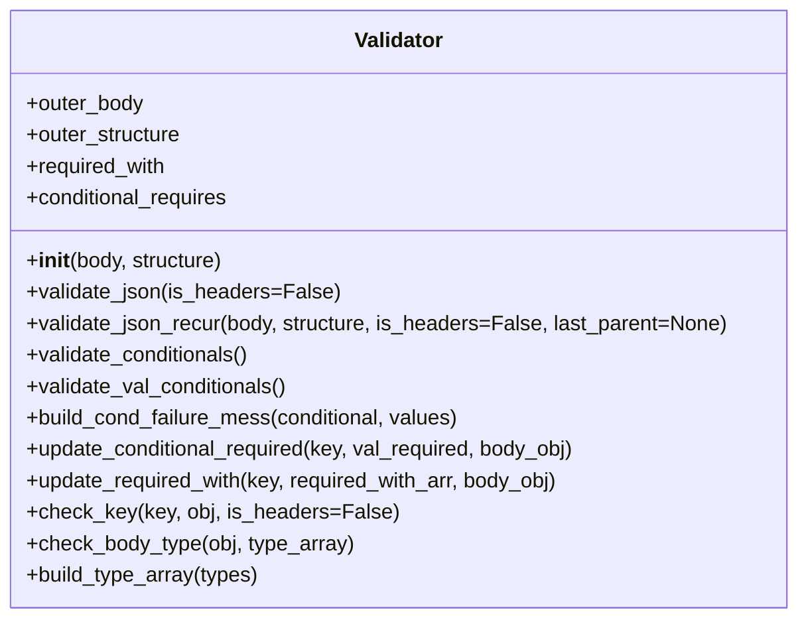

# Diagram: shipment_core/chromium_export/fv/python/fv/utilities/Validator.py


> Auto-generated by Obscura crawlers

## Diagram 1



### SVG

<svg id="container" width="611.03125" xmlns="http://www.w3.org/2000/svg" class="classDiagram" height="472" viewBox="0 0 611.03125 472" role="graphics-document document" aria-roledescription="class"><style>#container{font-family:"trebuchet ms",verdana,arial,sans-serif;font-size:16px;fill:#333;}@keyframes edge-animation-frame{from{stroke-dashoffset:0;}}@keyframes dash{to{stroke-dashoffset:0;}}#container .edge-animation-slow{stroke-dasharray:9,5!important;stroke-dashoffset:900;animation:dash 50s linear infinite;stroke-linecap:round;}#container .edge-animation-fast{stroke-dasharray:9,5!important;stroke-dashoffset:900;animation:dash 20s linear infinite;stroke-linecap:round;}#container .error-icon{fill:#552222;}#container .error-text{fill:#552222;stroke:#552222;}#container .edge-thickness-normal{stroke-width:1px;}#container .edge-thickness-thick{stroke-width:3.5px;}#container .edge-pattern-solid{stroke-dasharray:0;}#container .edge-thickness-invisible{stroke-width:0;fill:none;}#container .edge-pattern-dashed{stroke-dasharray:3;}#container .edge-pattern-dotted{stroke-dasharray:2;}#container .marker{fill:#333333;stroke:#333333;}#container .marker.cross{stroke:#333333;}#container svg{font-family:"trebuchet ms",verdana,arial,sans-serif;font-size:16px;}#container p{margin:0;}#container g.classGroup text{fill:#9370DB;stroke:none;font-family:"trebuchet ms",verdana,arial,sans-serif;font-size:10px;}#container g.classGroup text .title{font-weight:bolder;}#container .nodeLabel,#container .edgeLabel{color:#131300;}#container .edgeLabel .label rect{fill:#ECECFF;}#container .label text{fill:#131300;}#container .labelBkg{background:#ECECFF;}#container .edgeLabel .label span{background:#ECECFF;}#container .classTitle{font-weight:bolder;}#container .node rect,#container .node circle,#container .node ellipse,#container .node polygon,#container .node path{fill:#ECECFF;stroke:#9370DB;stroke-width:1px;}#container .divider{stroke:#9370DB;stroke-width:1;}#container g.clickable{cursor:pointer;}#container g.classGroup rect{fill:#ECECFF;stroke:#9370DB;}#container g.classGroup line{stroke:#9370DB;stroke-width:1;}#container .classLabel .box{stroke:none;stroke-width:0;fill:#ECECFF;opacity:0.5;}#container .classLabel .label{fill:#9370DB;font-size:10px;}#container .relation{stroke:#333333;stroke-width:1;fill:none;}#container .dashed-line{stroke-dasharray:3;}#container .dotted-line{stroke-dasharray:1 2;}#container #compositionStart,#container .composition{fill:#333333!important;stroke:#333333!important;stroke-width:1;}#container #compositionEnd,#container .composition{fill:#333333!important;stroke:#333333!important;stroke-width:1;}#container #dependencyStart,#container .dependency{fill:#333333!important;stroke:#333333!important;stroke-width:1;}#container #dependencyStart,#container .dependency{fill:#333333!important;stroke:#333333!important;stroke-width:1;}#container #extensionStart,#container .extension{fill:transparent!important;stroke:#333333!important;stroke-width:1;}#container #extensionEnd,#container .extension{fill:transparent!important;stroke:#333333!important;stroke-width:1;}#container #aggregationStart,#container .aggregation{fill:transparent!important;stroke:#333333!important;stroke-width:1;}#container #aggregationEnd,#container .aggregation{fill:transparent!important;stroke:#333333!important;stroke-width:1;}#container #lollipopStart,#container .lollipop{fill:#ECECFF!important;stroke:#333333!important;stroke-width:1;}#container #lollipopEnd,#container .lollipop{fill:#ECECFF!important;stroke:#333333!important;stroke-width:1;}#container .edgeTerminals{font-size:11px;line-height:initial;}#container .classTitleText{text-anchor:middle;font-size:18px;fill:#333;}#container .label-icon{display:inline-block;height:1em;overflow:visible;vertical-align:-0.125em;}#container .node .label-icon path{fill:currentColor;stroke:revert;stroke-width:revert;}#container :root{--mermaid-font-family:"trebuchet ms",verdana,arial,sans-serif;}</style><g><defs><marker id="container_class-aggregationStart" class="marker aggregation class" refX="18" refY="7" markerWidth="190" markerHeight="240" orient="auto"><path d="M 18,7 L9,13 L1,7 L9,1 Z"></path></marker></defs><defs><marker id="container_class-aggregationEnd" class="marker aggregation class" refX="1" refY="7" markerWidth="20" markerHeight="28" orient="auto"><path d="M 18,7 L9,13 L1,7 L9,1 Z"></path></marker></defs><defs><marker id="container_class-extensionStart" class="marker extension class" refX="18" refY="7" markerWidth="190" markerHeight="240" orient="auto"><path d="M 1,7 L18,13 V 1 Z"></path></marker></defs><defs><marker id="container_class-extensionEnd" class="marker extension class" refX="1" refY="7" markerWidth="20" markerHeight="28" orient="auto"><path d="M 1,1 V 13 L18,7 Z"></path></marker></defs><defs><marker id="container_class-compositionStart" class="marker composition class" refX="18" refY="7" markerWidth="190" markerHeight="240" orient="auto"><path d="M 18,7 L9,13 L1,7 L9,1 Z"></path></marker></defs><defs><marker id="container_class-compositionEnd" class="marker composition class" refX="1" refY="7" markerWidth="20" markerHeight="28" orient="auto"><path d="M 18,7 L9,13 L1,7 L9,1 Z"></path></marker></defs><defs><marker id="container_class-dependencyStart" class="marker dependency class" refX="6" refY="7" markerWidth="190" markerHeight="240" orient="auto"><path d="M 5,7 L9,13 L1,7 L9,1 Z"></path></marker></defs><defs><marker id="container_class-dependencyEnd" class="marker dependency class" refX="13" refY="7" markerWidth="20" markerHeight="28" orient="auto"><path d="M 18,7 L9,13 L14,7 L9,1 Z"></path></marker></defs><defs><marker id="container_class-lollipopStart" class="marker lollipop class" refX="13" refY="7" markerWidth="190" markerHeight="240" orient="auto"><circle stroke="black" fill="transparent" cx="7" cy="7" r="6"></circle></marker></defs><defs><marker id="container_class-lollipopEnd" class="marker lollipop class" refX="1" refY="7" markerWidth="190" markerHeight="240" orient="auto"><circle stroke="black" fill="transparent" cx="7" cy="7" r="6"></circle></marker></defs><g class="root"><g class="clusters"></g><g class="edgePaths"></g><g class="edgeLabels"></g><g class="nodes"><g class="node default" id="classId-Validator-0" transform="translate(305.515625, 236)"><g class="basic label-container"><path d="M-297.515625 -228 L297.515625 -228 L297.515625 228 L-297.515625 228" stroke="none" stroke-width="0" fill="#ECECFF" style=""></path><path d="M-297.515625 -228 C-69.73162890632568 -228, 158.05236718734864 -228, 297.515625 -228 M-297.515625 -228 C-136.69950563253207 -228, 24.116613734935868 -228, 297.515625 -228 M297.515625 -228 C297.515625 -68.47896257702672, 297.515625 91.04207484594656, 297.515625 228 M297.515625 -228 C297.515625 -102.84369648844994, 297.515625 22.312607023100128, 297.515625 228 M297.515625 228 C67.81179540986437 228, -161.89203418027125 228, -297.515625 228 M297.515625 228 C72.91960019053403 228, -151.67642461893195 228, -297.515625 228 M-297.515625 228 C-297.515625 68.77606903807563, -297.515625 -90.44786192384873, -297.515625 -228 M-297.515625 228 C-297.515625 51.89536018197296, -297.515625 -124.20927963605408, -297.515625 -228" stroke="#9370DB" stroke-width="1.3" fill="none" stroke-dasharray="0 0" style=""></path></g><g class="annotation-group text" transform="translate(0, -204)"></g><g class="label-group text" transform="translate(-33.1875, -204)"><g class="label" style="font-weight: bolder" transform="translate(0,-12)"><foreignObject width="66.375" height="24"><div xmlns="http://www.w3.org/1999/xhtml" style="display: table-cell; white-space: nowrap; line-height: 1.5; max-width: 116px; text-align: center;"><span class="nodeLabel markdown-node-label" style=""><p>Validator</p></span></div></foreignObject></g></g><g class="members-group text" transform="translate(-285.515625, -156)"><g class="label" style="" transform="translate(0,-12)"><foreignObject width="90.40625" height="24"><div xmlns="http://www.w3.org/1999/xhtml" style="display: table-cell; white-space: nowrap; line-height: 1.5; max-width: 148px; text-align: center;"><span class="nodeLabel markdown-node-label" style=""><p>+outer_body</p></span></div></foreignObject></g><g class="label" style="" transform="translate(0,12)"><foreignObject width="120.015625" height="24"><div xmlns="http://www.w3.org/1999/xhtml" style="display: table-cell; white-space: nowrap; line-height: 1.5; max-width: 177px; text-align: center;"><span class="nodeLabel markdown-node-label" style=""><p>+outer_structure</p></span></div></foreignObject></g><g class="label" style="" transform="translate(0,36)"><foreignObject width="108.921875" height="24"><div xmlns="http://www.w3.org/1999/xhtml" style="display: table-cell; white-space: nowrap; line-height: 1.5; max-width: 166px; text-align: center;"><span class="nodeLabel markdown-node-label" style=""><p>+required_with</p></span></div></foreignObject></g><g class="label" style="" transform="translate(0,60)"><foreignObject width="158.375" height="24"><div xmlns="http://www.w3.org/1999/xhtml" style="display: table-cell; white-space: nowrap; line-height: 1.5; max-width: 216px; text-align: center;"><span class="nodeLabel markdown-node-label" style=""><p>+conditional_requires</p></span></div></foreignObject></g></g><g class="methods-group text" transform="translate(-285.515625, -36)"><g class="label" style="" transform="translate(0,-12)"><foreignObject width="152.40625" height="24"><div xmlns="http://www.w3.org/1999/xhtml" style="display: table-cell; white-space: nowrap; line-height: 1.5; max-width: 241px; text-align: center;"><span class="nodeLabel markdown-node-label" style=""><p>+<strong>init</strong>(body, structure)</p></span></div></foreignObject></g><g class="label" style="" transform="translate(0,12)"><foreignObject width="237.96875" height="24"><div xmlns="http://www.w3.org/1999/xhtml" style="display: table-cell; white-space: nowrap; line-height: 1.5; max-width: 295px; text-align: center;"><span class="nodeLabel markdown-node-label" style=""><p>+validate_json(is_headers=False)</p></span></div></foreignObject></g><g class="label" style="" transform="translate(0,36)"><foreignObject width="537.84375" height="24"><div xmlns="http://www.w3.org/1999/xhtml" style="display: table-cell; white-space: nowrap; line-height: 1.5; max-width: 595px; text-align: center;"><span class="nodeLabel markdown-node-label" style=""><p>+validate_json_recur(body, structure, is_headers=False, last_parent=None)</p></span></div></foreignObject></g><g class="label" style="" transform="translate(0,60)"><foreignObject width="173.609375" height="24"><div xmlns="http://www.w3.org/1999/xhtml" style="display: table-cell; white-space: nowrap; line-height: 1.5; max-width: 231px; text-align: center;"><span class="nodeLabel markdown-node-label" style=""><p>+validate_conditionals()</p></span></div></foreignObject></g><g class="label" style="" transform="translate(0,84)"><foreignObject width="202.296875" height="24"><div xmlns="http://www.w3.org/1999/xhtml" style="display: table-cell; white-space: nowrap; line-height: 1.5; max-width: 260px; text-align: center;"><span class="nodeLabel markdown-node-label" style=""><p>+validate_val_conditionals()</p></span></div></foreignObject></g><g class="label" style="" transform="translate(0,108)"><foreignObject width="336.203125" height="24"><div xmlns="http://www.w3.org/1999/xhtml" style="display: table-cell; white-space: nowrap; line-height: 1.5; max-width: 394px; text-align: center;"><span class="nodeLabel markdown-node-label" style=""><p>+build_cond_failure_mess(conditional, values)</p></span></div></foreignObject></g><g class="label" style="" transform="translate(0,132)"><foreignObject width="428.0625" height="24"><div xmlns="http://www.w3.org/1999/xhtml" style="display: table-cell; white-space: nowrap; line-height: 1.5; max-width: 485px; text-align: center;"><span class="nodeLabel markdown-node-label" style=""><p>+update_conditional_required(key, val_required, body_obj)</p></span></div></foreignObject></g><g class="label" style="" transform="translate(0,156)"><foreignObject width="414.5625" height="24"><div xmlns="http://www.w3.org/1999/xhtml" style="display: table-cell; white-space: nowrap; line-height: 1.5; max-width: 472px; text-align: center;"><span class="nodeLabel markdown-node-label" style=""><p>+update_required_with(key, required_with_arr, body_obj)</p></span></div></foreignObject></g><g class="label" style="" transform="translate(0,180)"><foreignObject width="278.90625" height="24"><div xmlns="http://www.w3.org/1999/xhtml" style="display: table-cell; white-space: nowrap; line-height: 1.5; max-width: 336px; text-align: center;"><span class="nodeLabel markdown-node-label" style=""><p>+check_key(key, obj, is_headers=False)</p></span></div></foreignObject></g><g class="label" style="" transform="translate(0,204)"><foreignObject width="251.578125" height="24"><div xmlns="http://www.w3.org/1999/xhtml" style="display: table-cell; white-space: nowrap; line-height: 1.5; max-width: 309px; text-align: center;"><span class="nodeLabel markdown-node-label" style=""><p>+check_body_type(obj, type_array)</p></span></div></foreignObject></g><g class="label" style="" transform="translate(0,228)"><foreignObject width="179.4375" height="24"><div xmlns="http://www.w3.org/1999/xhtml" style="display: table-cell; white-space: nowrap; line-height: 1.5; max-width: 237px; text-align: center;"><span class="nodeLabel markdown-node-label" style=""><p>+build_type_array(types)</p></span></div></foreignObject></g></g><g class="divider" style=""><path d="M-297.515625 -180 C-71.33262115586686 -180, 154.85038268826628 -180, 297.515625 -180 M-297.515625 -180 C-100.36765121114666 -180, 96.78032257770667 -180, 297.515625 -180" stroke="#9370DB" stroke-width="1.3" fill="none" stroke-dasharray="0 0" style=""></path></g><g class="divider" style=""><path d="M-297.515625 -60 C-64.62608234023378 -60, 168.26346031953244 -60, 297.515625 -60 M-297.515625 -60 C-163.74505556205386 -60, -29.974486124107727 -60, 297.515625 -60" stroke="#9370DB" stroke-width="1.3" fill="none" stroke-dasharray="0 0" style=""></path></g></g></g></g></g></svg>

## Diagram 2

```mermaid
flowchart TD
    Start([Start]) --> CheckOuterBody{"outer_body present?"}
    CheckOuterBody -- No --> ErrMissingBody[/"Raise BadRequestError: Missing request body"/]
    CheckOuterBody -- Yes --> RecurCall[/"Call validate_json_recur(body, structure, is_headers)"/]
    RecurCall --> RecurResult{"validated?"}
    RecurResult -- No --> ReturnFalse1["Return False, message from validate_json_recur"]
    RecurResult -- Yes --> HasRequiredWith{"has attribute required_with?"}
    HasRequiredWith -- Yes --> ValidateRequiredWith[/"Call validate_conditionals()"/]
    HasRequiredWith -- No --> SkipRequiredWith
    ValidateRequiredWith --> ReqWithResult{ "validated_cond?"}
    ReqWithResult -- No --> ReturnFalse2["Return False, message_cond"]
    ReqWithResult -- Yes --> SkipRequiredWith
    SkipRequiredWith --> HasValConditionals{"has method validate_conditionals?"}
    HasValConditionals -- Yes --> ValidateValConditionals[/"Call validate_val_conditionals()"/]
    HasValConditionals -- No --> SkipValConditionals
    ValidateValConditionals --> ValCondResult{ "validated_cond?"}
    ValCondResult -- No --> ReturnFalse3["Return False, message_cond"]
    ValCondResult -- Yes --> SkipValConditionals
    SkipValConditionals --> ReturnTrue["Return True, \"\""]
    ReturnTrue --> End([End])
```

> SVG rendering failed for this diagram.
