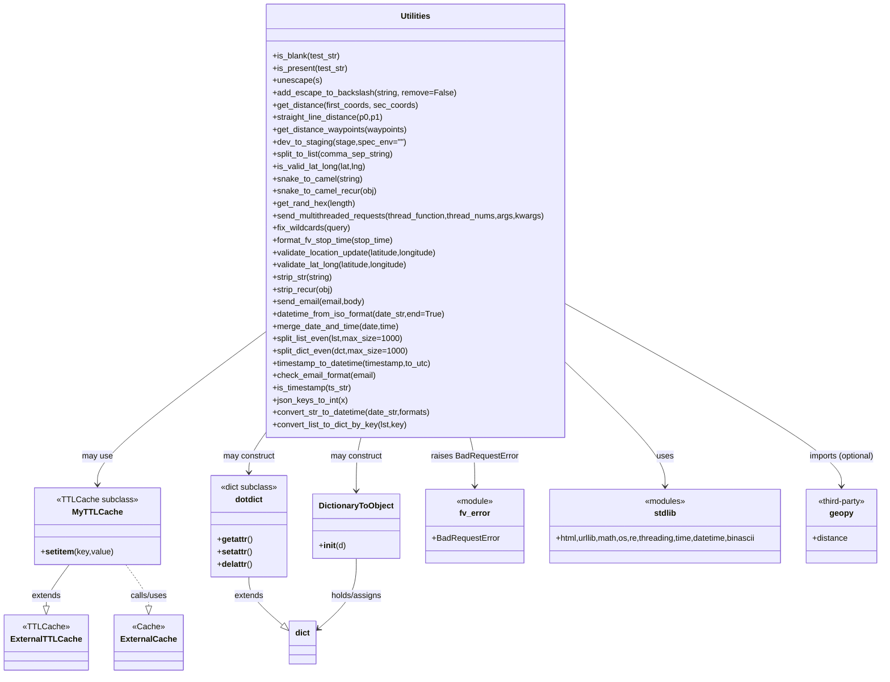

# Diagram: shipment_core/chromium_export/fv/python/fv/utilities/__init__.py

> Auto-generated by Obscura crawlers

## Mermaid

### SVG

<svg id="container" width="1713.21875" xmlns="http://www.w3.org/2000/svg" class="classDiagram" height="1316" viewBox="0 0 1713.21875 1316" role="graphics-document document" aria-roledescription="class"><g><defs><marker id="container_class-aggregationStart" class="marker aggregation class" refX="18" refY="7" markerWidth="190" markerHeight="240" orient="auto"><path d="M 18,7 L9,13 L1,7 L9,1 Z"></path></marker></defs><defs><marker id="container_class-aggregationEnd" class="marker aggregation class" refX="1" refY="7" markerWidth="20" markerHeight="28" orient="auto"><path d="M 18,7 L9,13 L1,7 L9,1 Z"></path></marker></defs><defs><marker id="container_class-extensionStart" class="marker extension class" refX="18" refY="7" markerWidth="190" markerHeight="240" orient="auto"><path d="M 1,7 L18,13 V 1 Z"></path></marker></defs><defs><marker id="container_class-extensionEnd" class="marker extension class" refX="1" refY="7" markerWidth="20" markerHeight="28" orient="auto"><path d="M 1,1 V 13 L18,7 Z"></path></marker></defs><defs><marker id="container_class-compositionStart" class="marker composition class" refX="18" refY="7" markerWidth="190" markerHeight="240" orient="auto"><path d="M 18,7 L9,13 L1,7 L9,1 Z"></path></marker></defs><defs><marker id="container_class-compositionEnd" class="marker composition class" refX="1" refY="7" markerWidth="20" markerHeight="28" orient="auto"><path d="M 18,7 L9,13 L1,7 L9,1 Z"></path></marker></defs><defs><marker id="container_class-dependencyStart" class="marker dependency class" refX="6" refY="7" markerWidth="190" markerHeight="240" orient="auto"><path d="M 5,7 L9,13 L1,7 L9,1 Z"></path></marker></defs><defs><marker id="container_class-dependencyEnd" class="marker dependency class" refX="13" refY="7" markerWidth="20" markerHeight="28" orient="auto"><path d="M 18,7 L9,13 L14,7 L9,1 Z"></path></marker></defs><defs><marker id="container_class-lollipopStart" class="marker lollipop class" refX="13" refY="7" markerWidth="190" markerHeight="240" orient="auto"><circle stroke="black" fill="transparent" cx="7" cy="7" r="6"></circle></marker></defs><defs><marker id="container_class-lollipopEnd" class="marker lollipop class" refX="1" refY="7" markerWidth="190" markerHeight="240" orient="auto"><circle stroke="black" fill="transparent" cx="7" cy="7" r="6"></circle></marker></defs><g class="root"><g class="clusters"></g><g class="edgePaths"><path d="M1083.725,707.804L1116.433,738.337C1149.142,768.869,1214.559,829.935,1247.268,870.134C1279.977,910.333,1279.977,929.667,1279.977,939.333L1279.977,949" id="id_Utilities_stdlib_1" class="edge-thickness-normal edge-pattern-solid relation" style=";;;" data-edge="true" data-et="edge" data-id="id_Utilities_stdlib_1" data-points="W3sieCI6MTA4My43MjQ2MDkzNzUsInkiOjcwNy44MDQwMjY4NzIyMzh9LHsieCI6MTI3OS45NzY1NjI1LCJ5Ijo4OTF9LHsieCI6MTI3OS45NzY1NjI1LCJ5Ijo5NTV9XQ==" marker-end="url(#container_class-dependencyEnd)"></path><path d="M1083.725,592.045L1175.468,641.871C1267.212,691.697,1450.7,791.348,1542.444,850.841C1634.188,910.333,1634.188,929.667,1634.188,939.333L1634.188,949" id="id_Utilities_geopy_2" class="edge-thickness-normal edge-pattern-solid relation" style=";;;" data-edge="true" data-et="edge" data-id="id_Utilities_geopy_2" data-points="W3sieCI6MTA4My43MjQ2MDkzNzUsInkiOjU5Mi4wNDUyNDA0MDY2NzcxfSx7IngiOjE2MzQuMTg3NSwieSI6ODkxfSx7IngiOjE2MzQuMTg3NSwieSI6OTU1fV0=" marker-end="url(#container_class-dependencyEnd)"></path><path d="M891.936,854L893.463,860.167C894.99,866.333,898.044,878.667,899.571,894.5C901.098,910.333,901.098,929.667,901.098,939.333L901.098,949" id="id_Utilities_fv_error_3" class="edge-thickness-normal edge-pattern-solid relation" style=";;;" data-edge="true" data-et="edge" data-id="id_Utilities_fv_error_3" data-points="W3sieCI6ODkxLjkzNTc4ODg5MjY2MywieSI6ODU0fSx7IngiOjkwMS4wOTc2NTYyNSwieSI6ODkxfSx7IngiOjkwMS4wOTc2NTYyNSwieSI6OTU1fV0=" marker-end="url(#container_class-dependencyEnd)"></path><path d="M127.027,1102L119.914,1112.167C112.802,1122.333,98.577,1142.667,91.464,1156.125C84.352,1169.583,84.352,1176.167,84.352,1179.458L84.352,1182.75" id="id_MyTTLCache_ExternalTTLCache_4" class="edge-thickness-normal edge-pattern-solid relation" style=";;;" data-edge="true" data-et="edge" data-id="id_MyTTLCache_ExternalTTLCache_4" data-points="W3sieCI6MTI3LjAyNjY4MzEzNDE5MTE3LCJ5IjoxMTAyfSx7IngiOjg0LjM1MTU2MjUsInkiOjExNjN9LHsieCI6ODQuMzUxNTYyNSwieSI6MTIwMH1d" marker-end="url(#container_class-extensionEnd)"></path><path d="M231.966,1102L239.078,1112.167C246.191,1122.333,260.416,1142.667,267.528,1156.125C274.641,1169.583,274.641,1176.167,274.641,1179.458L274.641,1182.75" id="id_MyTTLCache_ExternalCache_5" class="edge-thickness-normal edge-pattern-dashed relation" style=";;;" data-edge="true" data-et="edge" data-id="id_MyTTLCache_ExternalCache_5" data-points="W3sieCI6MjMxLjk2NTUwNDM2NTgwODg0LCJ5IjoxMTAyfSx7IngiOjI3NC42NDA2MjUsInkiOjExNjN9LHsieCI6Mjc0LjY0MDYyNSwieSI6MTIwMH1d" marker-end="url(#container_class-extensionEnd)"></path><path d="M466.695,1126L466.695,1132.167C466.695,1138.333,466.695,1150.667,477.425,1166.285C488.154,1181.904,509.613,1200.809,520.343,1210.261L531.072,1219.713" id="id_dotdict_dict_6" class="edge-thickness-normal edge-pattern-solid relation" style=";;;" data-edge="true" data-et="edge" data-id="id_dotdict_dict_6" data-points="W3sieCI6NDY2LjY5NTMxMjUsInkiOjExMjZ9LHsieCI6NDY2LjY5NTMxMjUsInkiOjExNjN9LHsieCI6NTQ0LjAxNTYyNSwieSI6MTIzMS4xMTU3OTE4NjIwNDgxfV0=" marker-end="url(#container_class-extensionEnd)"></path><path d="M673.289,1090L673.289,1102.167C673.289,1114.333,673.289,1138.667,661.153,1161.525C649.016,1184.383,624.744,1205.766,612.607,1216.458L600.471,1227.15" id="id_DictionaryToObject_dict_7" class="edge-thickness-normal edge-pattern-solid relation" style=";;;" data-edge="true" data-et="edge" data-id="id_DictionaryToObject_dict_7" data-points="W3sieCI6NjczLjI4OTA2MjUsInkiOjEwOTB9LHsieCI6NjczLjI4OTA2MjUsInkiOjExNjN9LHsieCI6NTk1Ljk2ODc1LCJ5IjoxMjMxLjExNTc5MTg2MjA0ODF9XQ==" marker-end="url(#container_class-dependencyEnd)"></path><path d="M490.662,655.461L438.801,694.718C386.94,733.974,283.218,812.487,231.357,860.91C179.496,909.333,179.496,927.667,179.496,936.833L179.496,946" id="id_Utilities_MyTTLCache_8" class="edge-thickness-normal edge-pattern-solid relation" style=";;;" data-edge="true" data-et="edge" data-id="id_Utilities_MyTTLCache_8" data-points="W3sieCI6NDkwLjY2MjEwOTM3NSwieSI6NjU1LjQ2MTA2NDI3NjMyNDl9LHsieCI6MTc5LjQ5NjA5Mzc1LCJ5Ijo4OTF9LHsieCI6MTc5LjQ5NjA5Mzc1LCJ5Ijo5NTJ9XQ==" marker-end="url(#container_class-dependencyEnd)"></path><path d="M492.475,854L488.178,860.167C483.881,866.333,475.288,878.667,470.992,890C466.695,901.333,466.695,911.667,466.695,916.833L466.695,922" id="id_Utilities_dotdict_9" class="edge-thickness-normal edge-pattern-solid relation" style=";;;" data-edge="true" data-et="edge" data-id="id_Utilities_dotdict_9" data-points="W3sieCI6NDkyLjQ3NDUwMzIyNjkwMjIsInkiOjg1NH0seyJ4Ijo0NjYuNjk1MzEyNSwieSI6ODkxfSx7IngiOjQ2Ni42OTUzMTI1LCJ5Ijo5Mjh9XQ==" marker-end="url(#container_class-dependencyEnd)"></path><path d="M682.451,854L680.924,860.167C679.397,866.333,676.343,878.667,674.816,896C673.289,913.333,673.289,935.667,673.289,946.833L673.289,958" id="id_Utilities_DictionaryToObject_10" class="edge-thickness-normal edge-pattern-solid relation" style=";;;" data-edge="true" data-et="edge" data-id="id_Utilities_DictionaryToObject_10" data-points="W3sieCI6NjgyLjQ1MDkyOTg1NzMzNywieSI6ODU0fSx7IngiOjY3My4yODkwNjI1LCJ5Ijo4OTF9LHsieCI6NjczLjI4OTA2MjUsInkiOjk2NH1d" marker-end="url(#container_class-dependencyEnd)"></path></g><g class="edgeLabels"><g class="edgeLabel" transform="translate(1279.9765625, 891)"><g class="label" data-id="id_Utilities_stdlib_1" transform="translate(-16.4921875, -12)"><foreignObject width="32.984375" height="24">

uses

</foreignObject></g></g><g class="edgeLabel" transform="translate(1634.1875, 891)"><g class="label" data-id="id_Utilities_geopy_2" transform="translate(-66.1015625, -12)"><foreignObject width="132.203125" height="24">

imports (optional)

</foreignObject></g></g><g class="edgeLabel" transform="translate(901.09765625, 891)"><g class="label" data-id="id_Utilities_fv_error_3" transform="translate(-84.7734375, -12)"><foreignObject width="169.546875" height="24">

raises BadRequestError

</foreignObject></g></g><g class="edgeLabel" transform="translate(84.3515625, 1163)"><g class="label" data-id="id_MyTTLCache_ExternalTTLCache_4" transform="translate(-28.5078125, -12)"><foreignObject width="57.015625" height="24">

extends

</foreignObject></g></g><g class="edgeLabel" transform="translate(274.640625, 1163)"><g class="label" data-id="id_MyTTLCache_ExternalCache_5" transform="translate(-36.8515625, -12)"><foreignObject width="73.703125" height="24">

calls/uses

</foreignObject></g></g><g class="edgeLabel" transform="translate(466.6953125, 1163)"><g class="label" data-id="id_dotdict_dict_6" transform="translate(-28.5078125, -12)"><foreignObject width="57.015625" height="24">

extends

</foreignObject></g></g><g class="edgeLabel" transform="translate(673.2890625, 1163)"><g class="label" data-id="id_DictionaryToObject_dict_7" transform="translate(-50.453125, -12)"><foreignObject width="100.90625" height="24">

holds/assigns

</foreignObject></g></g><g class="edgeLabel" transform="translate(179.49609375, 891)"><g class="label" data-id="id_Utilities_MyTTLCache_8" transform="translate(-29.8984375, -12)"><foreignObject width="59.796875" height="24">

may use

</foreignObject></g></g><g class="edgeLabel" transform="translate(466.6953125, 891)"><g class="label" data-id="id_Utilities_dotdict_9" transform="translate(-51.25, -12)"><foreignObject width="102.5" height="24">

may construct

</foreignObject></g></g><g class="edgeLabel" transform="translate(673.2890625, 891)"><g class="label" data-id="id_Utilities_DictionaryToObject_10" transform="translate(-51.25, -12)"><foreignObject width="102.5" height="24">

may construct

</foreignObject></g></g></g><g class="nodes"><g class="node default" id="classId-Utilities-0" transform="translate(787.193359375, 431)"><g class="basic label-container"><path d="M-296.53125 -423 L296.53125 -423 L296.53125 423 L-296.53125 423" stroke="none" stroke-width="0" fill="#ECECFF" style=""></path><path d="M-296.53125 -423 C-168.36193201394573 -423, -40.192614027891466 -423, 296.53125 -423 M-296.53125 -423 C-71.5040373164662 -423, 153.5231753670676 -423, 296.53125 -423 M296.53125 -423 C296.53125 -182.67279726020848, 296.53125 57.65440547958303, 296.53125 423 M296.53125 -423 C296.53125 -156.75578006436285, 296.53125 109.4884398712743, 296.53125 423 M296.53125 423 C115.85977756674674 423, -64.81169486650651 423, -296.53125 423 M296.53125 423 C156.7467551528889 423, 16.962260305777818 423, -296.53125 423 M-296.53125 423 C-296.53125 163.76328832172499, -296.53125 -95.47342335655003, -296.53125 -423 M-296.53125 423 C-296.53125 171.60403047500586, -296.53125 -79.79193904998829, -296.53125 -423" stroke="#9370DB" stroke-width="1.3" fill="none" stroke-dasharray="0 0" style=""></path></g><g class="annotation-group text" transform="translate(0, -399)"></g><g class="label-group text" transform="translate(-28.8125, -399)"><g class="label" style="font-weight: bolder" transform="translate(0,-12)"><foreignObject width="57.625" height="24">

Utilities

</foreignObject></g></g><g class="members-group text" transform="translate(-284.53125, -351)"></g><g class="methods-group text" transform="translate(-284.53125, -321)"><g class="label" style="" transform="translate(0,-12)"><foreignObject width="133.96875" height="24">

+is_blank(test_str)

</foreignObject></g><g class="label" style="" transform="translate(0,12)"><foreignObject width="148.859375" height="24">

+is_present(test_str)

</foreignObject></g><g class="label" style="" transform="translate(0,36)"><foreignObject width="95.125" height="24">

+unescape(s)

</foreignObject></g><g class="label" style="" transform="translate(0,60)"><foreignObject width="354.375" height="24">

+add_escape_to_backslash(string, remove=False)

</foreignObject></g><g class="label" style="" transform="translate(0,84)"><foreignObject width="284.078125" height="24">

+get_distance(first_coords, sec_coords)

</foreignObject></g><g class="label" style="" transform="translate(0,108)"><foreignObject width="216.109375" height="24">

+straight_line_distance(p0,p1)

</foreignObject></g><g class="label" style="" transform="translate(0,132)"><foreignObject width="265.140625" height="24">

+get_distance_waypoints(waypoints)

</foreignObject></g><g class="label" style="" transform="translate(0,156)"><foreignObject width="257.234375" height="24">

+dev_to_staging(stage,spec_env="")

</foreignObject></g><g class="label" style="" transform="translate(0,180)"><foreignObject width="239.921875" height="24">

+split_to_list(comma_sep_string)

</foreignObject></g><g class="label" style="" transform="translate(0,204)"><foreignObject width="185.21875" height="24">

+is_valid_lat_long(lat,lng)

</foreignObject></g><g class="label" style="" transform="translate(0,228)"><foreignObject width="175.859375" height="24">

+snake_to_camel(string)

</foreignObject></g><g class="label" style="" transform="translate(0,252)"><foreignObject width="203.265625" height="24">

+snake_to_camel_recur(obj)

</foreignObject></g><g class="label" style="" transform="translate(0,276)"><foreignObject width="162.71875" height="24">

+get_rand_hex(length)

</foreignObject></g><g class="label" style="" transform="translate(0,300)"><foreignObject width="540.25" height="24">

+send_multithreaded_requests(thread_function,thread_nums,args,kwargs)

</foreignObject></g><g class="label" style="" transform="translate(0,324)"><foreignObject width="153.8125" height="24">

+fix_wildcards(query)

</foreignObject></g><g class="label" style="" transform="translate(0,348)"><foreignObject width="240.609375" height="24">

+format_fv_stop_time(stop_time)

</foreignObject></g><g class="label" style="" transform="translate(0,372)"><foreignObject width="332.609375" height="24">

+validate_location_update(latitude,longitude)

</foreignObject></g><g class="label" style="" transform="translate(0,396)"><foreignObject width="273.015625" height="24">

+validate_lat_long(latitude,longitude)

</foreignObject></g><g class="label" style="" transform="translate(0,420)"><foreignObject width="120.859375" height="24">

+strip_str(string)

</foreignObject></g><g class="label" style="" transform="translate(0,444)"><foreignObject width="120.515625" height="24">

+strip_recur(obj)

</foreignObject></g><g class="label" style="" transform="translate(0,468)"><foreignObject width="182.359375" height="24">

+send_email(email,body)

</foreignObject></g><g class="label" style="" transform="translate(0,492)"><foreignObject width="341.65625" height="24">

+datetime_from_iso_format(date_str,end=True)

</foreignObject></g><g class="label" style="" transform="translate(0,516)"><foreignObject width="248.21875" height="24">

+merge_date_and_time(date,time)

</foreignObject></g><g class="label" style="" transform="translate(0,540)"><foreignObject width="252.796875" height="24">

+split_list_even(lst,max_size=1000)

</foreignObject></g><g class="label" style="" transform="translate(0,564)"><foreignObject width="262.75" height="24">

+split_dict_even(dct,max_size=1000)

</foreignObject></g><g class="label" style="" transform="translate(0,588)"><foreignObject width="317.578125" height="24">

+timestamp_to_datetime(timestamp,to_utc)

</foreignObject></g><g class="label" style="" transform="translate(0,612)"><foreignObject width="205.53125" height="24">

+check_email_format(email)

</foreignObject></g><g class="label" style="" transform="translate(0,636)"><foreignObject width="156.46875" height="24">

+is_timestamp(ts_str)

</foreignObject></g><g class="label" style="" transform="translate(0,660)"><foreignObject width="147.109375" height="24">

+json_keys_to_int(x)

</foreignObject></g><g class="label" style="" transform="translate(0,684)"><foreignObject width="313.71875" height="24">

+convert_str_to_datetime(date_str,formats)

</foreignObject></g><g class="label" style="" transform="translate(0,708)"><foreignObject width="265.90625" height="24">

+convert_list_to_dict_by_key(lst,key)

</foreignObject></g></g><g class="divider" style=""><path d="M-296.53125 -375 C-145.2997008719738 -375, 5.931848256052376 -375, 296.53125 -375 M-296.53125 -375 C-148.10494144548852 -375, 0.3213671090229582 -375, 296.53125 -375" stroke="#9370DB" stroke-width="1.3" fill="none" stroke-dasharray="0 0" style=""></path></g><g class="divider" style=""><path d="M-296.53125 -351 C-79.80461092145828 -351, 136.92202815708345 -351, 296.53125 -351 M-296.53125 -351 C-146.1763056081487 -351, 4.178638783702581 -351, 296.53125 -351" stroke="#9370DB" stroke-width="1.3" fill="none" stroke-dasharray="0 0" style=""></path></g></g><g class="node default" id="classId-dotdict-1" transform="translate(466.6953125, 1027)"><g class="basic label-container"><path d="M-74.484375 -99 L74.484375 -99 L74.484375 99 L-74.484375 99" stroke="none" stroke-width="0" fill="#ECECFF" style=""></path><path d="M-74.484375 -99 C-19.077814306846108 -99, 36.328746386307785 -99, 74.484375 -99 M-74.484375 -99 C-28.861482984436535 -99, 16.76140903112693 -99, 74.484375 -99 M74.484375 -99 C74.484375 -55.63784712836406, 74.484375 -12.275694256728116, 74.484375 99 M74.484375 -99 C74.484375 -39.59474771628058, 74.484375 19.81050456743884, 74.484375 99 M74.484375 99 C29.868103504212485 99, -14.74816799157503 99, -74.484375 99 M74.484375 99 C31.96303106170216 99, -10.558312876595679 99, -74.484375 99 M-74.484375 99 C-74.484375 49.08472918572269, -74.484375 -0.830541628554613, -74.484375 -99 M-74.484375 99 C-74.484375 43.0048855807915, -74.484375 -12.990228838416996, -74.484375 -99" stroke="#9370DB" stroke-width="1.3" fill="none" stroke-dasharray="0 0" style=""></path></g><g class="annotation-group text" transform="translate(-55.78125, -75)"><g class="label" style="" transform="translate(0,-12)"><foreignObject width="111.5625" height="24">

«dict subclass»

</foreignObject></g></g><g class="label-group text" transform="translate(-26.3984375, -51)"><g class="label" style="font-weight: bolder" transform="translate(0,-12)"><foreignObject width="52.796875" height="24">

dotdict

</foreignObject></g></g><g class="members-group text" transform="translate(-62.484375, -3)"></g><g class="methods-group text" transform="translate(-62.484375, 27)"><g class="label" style="" transform="translate(0,-12)"><foreignObject width="69.1875" height="24">

+<strong>getattr</strong>()

</foreignObject></g><g class="label" style="" transform="translate(0,12)"><foreignObject width="68.453125" height="24">

+<strong>setattr</strong>()

</foreignObject></g><g class="label" style="" transform="translate(0,36)"><foreignObject width="69" height="24">

+<strong>delattr</strong>()

</foreignObject></g></g><g class="divider" style=""><path d="M-74.484375 -27 C-39.67072375647927 -27, -4.857072512958538 -27, 74.484375 -27 M-74.484375 -27 C-24.98970662652109 -27, 24.504961746957818 -27, 74.484375 -27" stroke="#9370DB" stroke-width="1.3" fill="none" stroke-dasharray="0 0" style=""></path></g><g class="divider" style=""><path d="M-74.484375 -3 C-16.207934111618158 -3, 42.068506776763684 -3, 74.484375 -3 M-74.484375 -3 C-33.48298443206365 -3, 7.518406135872695 -3, 74.484375 -3" stroke="#9370DB" stroke-width="1.3" fill="none" stroke-dasharray="0 0" style=""></path></g></g><g class="node default" id="classId-DictionaryToObject-2" transform="translate(673.2890625, 1027)"><g class="basic label-container"><path d="M-82.109375 -63 L82.109375 -63 L82.109375 63 L-82.109375 63" stroke="none" stroke-width="0" fill="#ECECFF" style=""></path><path d="M-82.109375 -63 C-28.866713331275605 -63, 24.37594833744879 -63, 82.109375 -63 M-82.109375 -63 C-45.1361172659966 -63, -8.162859531993206 -63, 82.109375 -63 M82.109375 -63 C82.109375 -31.957246122681774, 82.109375 -0.9144922453635473, 82.109375 63 M82.109375 -63 C82.109375 -12.655793293464122, 82.109375 37.68841341307176, 82.109375 63 M82.109375 63 C49.189778756628115 63, 16.27018251325623 63, -82.109375 63 M82.109375 63 C36.951373332049386 63, -8.206628335901229 63, -82.109375 63 M-82.109375 63 C-82.109375 16.714978325752632, -82.109375 -29.570043348494735, -82.109375 -63 M-82.109375 63 C-82.109375 34.19835595700178, -82.109375 5.396711914003561, -82.109375 -63" stroke="#9370DB" stroke-width="1.3" fill="none" stroke-dasharray="0 0" style=""></path></g><g class="annotation-group text" transform="translate(0, -39)"></g><g class="label-group text" transform="translate(-70.109375, -39)"><g class="label" style="font-weight: bolder" transform="translate(0,-12)"><foreignObject width="140.21875" height="24">

DictionaryToObject

</foreignObject></g></g><g class="members-group text" transform="translate(-70.109375, 9)"></g><g class="methods-group text" transform="translate(-70.109375, 39)"><g class="label" style="" transform="translate(0,-12)"><foreignObject width="52.359375" height="24">

+<strong>init</strong>(d)

</foreignObject></g></g><g class="divider" style=""><path d="M-82.109375 -15 C-18.732795303243023 -15, 44.643784393513954 -15, 82.109375 -15 M-82.109375 -15 C-37.84945618519893 -15, 6.4104626296021365 -15, 82.109375 -15" stroke="#9370DB" stroke-width="1.3" fill="none" stroke-dasharray="0 0" style=""></path></g><g class="divider" style=""><path d="M-82.109375 9 C-20.230098443407243 9, 41.64917811318551 9, 82.109375 9 M-82.109375 9 C-34.93252032805338 9, 12.244334343893243 9, 82.109375 9" stroke="#9370DB" stroke-width="1.3" fill="none" stroke-dasharray="0 0" style=""></path></g></g><g class="node default" id="classId-MyTTLCache-3" transform="translate(179.49609375, 1027)"><g class="basic label-container"><path d="M-119.7109375 -75 L119.7109375 -75 L119.7109375 75 L-119.7109375 75" stroke="none" stroke-width="0" fill="#ECECFF" style=""></path><path d="M-119.7109375 -75 C-62.98319655064253 -75, -6.255455601285064 -75, 119.7109375 -75 M-119.7109375 -75 C-26.617378698848896 -75, 66.47618010230221 -75, 119.7109375 -75 M119.7109375 -75 C119.7109375 -23.749573644213918, 119.7109375 27.500852711572165, 119.7109375 75 M119.7109375 -75 C119.7109375 -27.177597453640743, 119.7109375 20.644805092718514, 119.7109375 75 M119.7109375 75 C26.977155078319257 75, -65.75662734336149 75, -119.7109375 75 M119.7109375 75 C61.64907419959223 75, 3.5872108991844556 75, -119.7109375 75 M-119.7109375 75 C-119.7109375 23.058112735002936, -119.7109375 -28.883774529994128, -119.7109375 -75 M-119.7109375 75 C-119.7109375 41.166732256543504, -119.7109375 7.333464513087009, -119.7109375 -75" stroke="#9370DB" stroke-width="1.3" fill="none" stroke-dasharray="0 0" style=""></path></g><g class="annotation-group text" transform="translate(-75.546875, -51)"><g class="label" style="" transform="translate(0,-12)"><foreignObject width="151.09375" height="24">

«TTLCache subclass»

</foreignObject></g></g><g class="label-group text" transform="translate(-44.609375, -27)"><g class="label" style="font-weight: bolder" transform="translate(0,-12)"><foreignObject width="89.21875" height="24">

MyTTLCache

</foreignObject></g></g><g class="members-group text" transform="translate(-107.7109375, 21)"></g><g class="methods-group text" transform="translate(-107.7109375, 51)"><g class="label" style="" transform="translate(0,-12)"><foreignObject width="139.875" height="24">

+<strong>setitem</strong>(key,value)

</foreignObject></g></g><g class="divider" style=""><path d="M-119.7109375 -3 C-56.51843686599698 -3, 6.674063768006036 -3, 119.7109375 -3 M-119.7109375 -3 C-60.06056508694473 -3, -0.4101926738894548 -3, 119.7109375 -3" stroke="#9370DB" stroke-width="1.3" fill="none" stroke-dasharray="0 0" style=""></path></g><g class="divider" style=""><path d="M-119.7109375 21 C-28.073440178472637 21, 63.564057143054725 21, 119.7109375 21 M-119.7109375 21 C-53.74468249275729 21, 12.221572514485416 21, 119.7109375 21" stroke="#9370DB" stroke-width="1.3" fill="none" stroke-dasharray="0 0" style=""></path></g></g><g class="node default" id="classId-ExternalCache-4" transform="translate(274.640625, 1254)"><g class="basic label-container"><path d="M-63.9375 -54 L63.9375 -54 L63.9375 54 L-63.9375 54" stroke="none" stroke-width="0" fill="#ECECFF" style=""></path><path d="M-63.9375 -54 C-27.901718142604096 -54, 8.134063714791807 -54, 63.9375 -54 M-63.9375 -54 C-14.180319970014303 -54, 35.576860059971395 -54, 63.9375 -54 M63.9375 -54 C63.9375 -29.018192990566636, 63.9375 -4.036385981133272, 63.9375 54 M63.9375 -54 C63.9375 -23.42474691349463, 63.9375 7.15050617301074, 63.9375 54 M63.9375 54 C22.729500546076856 54, -18.478498907846287 54, -63.9375 54 M63.9375 54 C29.088564166417385 54, -5.760371667165231 54, -63.9375 54 M-63.9375 54 C-63.9375 31.325603373114983, -63.9375 8.651206746229967, -63.9375 -54 M-63.9375 54 C-63.9375 18.178239478642027, -63.9375 -17.643521042715946, -63.9375 -54" stroke="#9370DB" stroke-width="1.3" fill="none" stroke-dasharray="0 0" style=""></path></g><g class="annotation-group text" transform="translate(-30.59375, -30)"><g class="label" style="" transform="translate(0,-12)"><foreignObject width="61.1875" height="24">

«Cache»

</foreignObject></g></g><g class="label-group text" transform="translate(-51.9375, -6)"><g class="label" style="font-weight: bolder" transform="translate(0,-12)"><foreignObject width="103.875" height="24">

ExternalCache

</foreignObject></g></g><g class="members-group text" transform="translate(-51.9375, 42)"></g><g class="methods-group text" transform="translate(-51.9375, 72)"></g><g class="divider" style=""><path d="M-63.9375 18 C-22.024927135324994 18, 19.887645729350012 18, 63.9375 18 M-63.9375 18 C-14.407964189630476 18, 35.12157162073905 18, 63.9375 18" stroke="#9370DB" stroke-width="1.3" fill="none" stroke-dasharray="0 0" style=""></path></g><g class="divider" style=""><path d="M-63.9375 36 C-21.276268811718523 36, 21.384962376562953 36, 63.9375 36 M-63.9375 36 C-31.37107880287052 36, 1.195342394258958 36, 63.9375 36" stroke="#9370DB" stroke-width="1.3" fill="none" stroke-dasharray="0 0" style=""></path></g></g><g class="node default" id="classId-ExternalTTLCache-5" transform="translate(84.3515625, 1254)"><g class="basic label-container"><path d="M-76.3515625 -54 L76.3515625 -54 L76.3515625 54 L-76.3515625 54" stroke="none" stroke-width="0" fill="#ECECFF" style=""></path><path d="M-76.3515625 -54 C-35.99316701831494 -54, 4.365228463370116 -54, 76.3515625 -54 M-76.3515625 -54 C-23.905770416142083 -54, 28.540021667715834 -54, 76.3515625 -54 M76.3515625 -54 C76.3515625 -14.111814265197147, 76.3515625 25.776371469605706, 76.3515625 54 M76.3515625 -54 C76.3515625 -19.30144576443633, 76.3515625 15.39710847112734, 76.3515625 54 M76.3515625 54 C43.49842734570884 54, 10.645292191417681 54, -76.3515625 54 M76.3515625 54 C30.75303115185855 54, -14.845500196282899 54, -76.3515625 54 M-76.3515625 54 C-76.3515625 11.230368869212, -76.3515625 -31.539262261576, -76.3515625 -54 M-76.3515625 54 C-76.3515625 20.260123424153193, -76.3515625 -13.479753151693615, -76.3515625 -54" stroke="#9370DB" stroke-width="1.3" fill="none" stroke-dasharray="0 0" style=""></path></g><g class="annotation-group text" transform="translate(-42.328125, -30)"><g class="label" style="" transform="translate(0,-12)"><foreignObject width="84.65625" height="24">

«TTLCache»

</foreignObject></g></g><g class="label-group text" transform="translate(-64.3515625, -6)"><g class="label" style="font-weight: bolder" transform="translate(0,-12)"><foreignObject width="128.703125" height="24">

ExternalTTLCache

</foreignObject></g></g><g class="members-group text" transform="translate(-64.3515625, 42)"></g><g class="methods-group text" transform="translate(-64.3515625, 72)"></g><g class="divider" style=""><path d="M-76.3515625 18 C-26.872010713641984 18, 22.60754107271603 18, 76.3515625 18 M-76.3515625 18 C-30.176899562047154 18, 15.997763375905691 18, 76.3515625 18" stroke="#9370DB" stroke-width="1.3" fill="none" stroke-dasharray="0 0" style=""></path></g><g class="divider" style=""><path d="M-76.3515625 36 C-38.78328381704479 36, -1.21500513408958 36, 76.3515625 36 M-76.3515625 36 C-25.98276011543424 36, 24.386042269131522 36, 76.3515625 36" stroke="#9370DB" stroke-width="1.3" fill="none" stroke-dasharray="0 0" style=""></path></g></g><g class="node default" id="classId-fv_error-6" transform="translate(901.09765625, 1027)"><g class="basic label-container"><path d="M-95.69921875 -72 L95.69921875 -72 L95.69921875 72 L-95.69921875 72" stroke="none" stroke-width="0" fill="#ECECFF" style=""></path><path d="M-95.69921875 -72 C-47.244865595377725 -72, 1.2094875592445504 -72, 95.69921875 -72 M-95.69921875 -72 C-40.2897860092876 -72, 15.119646731424794 -72, 95.69921875 -72 M95.69921875 -72 C95.69921875 -33.91317583943297, 95.69921875 4.173648321134067, 95.69921875 72 M95.69921875 -72 C95.69921875 -28.268684465827363, 95.69921875 15.462631068345274, 95.69921875 72 M95.69921875 72 C32.16972866229226 72, -31.359761425415485 72, -95.69921875 72 M95.69921875 72 C21.374645051787326 72, -52.94992864642535 72, -95.69921875 72 M-95.69921875 72 C-95.69921875 39.92845500734163, -95.69921875 7.856910014683265, -95.69921875 -72 M-95.69921875 72 C-95.69921875 39.78555858355581, -95.69921875 7.571117167111623, -95.69921875 -72" stroke="#9370DB" stroke-width="1.3" fill="none" stroke-dasharray="0 0" style=""></path></g><g class="annotation-group text" transform="translate(-36.6015625, -48)"><g class="label" style="" transform="translate(0,-12)"><foreignObject width="73.203125" height="24">

«module»

</foreignObject></g></g><g class="label-group text" transform="translate(-29.1875, -24)"><g class="label" style="font-weight: bolder" transform="translate(0,-12)"><foreignObject width="58.375" height="24">

fv_error

</foreignObject></g></g><g class="members-group text" transform="translate(-83.69921875, 24)"><g class="label" style="" transform="translate(0,-12)"><foreignObject width="130.796875" height="24">

+BadRequestError

</foreignObject></g></g><g class="methods-group text" transform="translate(-83.69921875, 72)"></g><g class="divider" style=""><path d="M-95.69921875 0 C-22.627158924150734 0, 50.44490090169853 0, 95.69921875 0 M-95.69921875 0 C-42.112361811724206 0, 11.474495126551588 0, 95.69921875 0" stroke="#9370DB" stroke-width="1.3" fill="none" stroke-dasharray="0 0" style=""></path></g><g class="divider" style=""><path d="M-95.69921875 48 C-29.55487064121806 48, 36.58947746756388 48, 95.69921875 48 M-95.69921875 48 C-39.845734278032396 48, 16.00775019393521 48, 95.69921875 48" stroke="#9370DB" stroke-width="1.3" fill="none" stroke-dasharray="0 0" style=""></path></g></g><g class="node default" id="classId-stdlib-7" transform="translate(1279.9765625, 1027)"><g class="basic label-container"><path d="M-233.1796875 -72 L233.1796875 -72 L233.1796875 72 L-233.1796875 72" stroke="none" stroke-width="0" fill="#ECECFF" style=""></path><path d="M-233.1796875 -72 C-76.11837500923409 -72, 80.94293748153183 -72, 233.1796875 -72 M-233.1796875 -72 C-98.17282409856989 -72, 36.83403930286022 -72, 233.1796875 -72 M233.1796875 -72 C233.1796875 -27.33486659079915, 233.1796875 17.330266818401697, 233.1796875 72 M233.1796875 -72 C233.1796875 -25.049221971656138, 233.1796875 21.901556056687724, 233.1796875 72 M233.1796875 72 C49.91794030920022 72, -133.34380688159956 72, -233.1796875 72 M233.1796875 72 C60.5087677082272 72, -112.1621520835456 72, -233.1796875 72 M-233.1796875 72 C-233.1796875 17.959239220018034, -233.1796875 -36.08152155996393, -233.1796875 -72 M-233.1796875 72 C-233.1796875 34.38702263086045, -233.1796875 -3.2259547382791, -233.1796875 -72" stroke="#9370DB" stroke-width="1.3" fill="none" stroke-dasharray="0 0" style=""></path></g><g class="annotation-group text" transform="translate(-40.5, -48)"><g class="label" style="" transform="translate(0,-12)"><foreignObject width="81" height="24">

«modules»

</foreignObject></g></g><g class="label-group text" transform="translate(-21.0234375, -24)"><g class="label" style="font-weight: bolder" transform="translate(0,-12)"><foreignObject width="42.046875" height="24">

stdlib

</foreignObject></g></g><g class="members-group text" transform="translate(-221.1796875, 24)"><g class="label" style="" transform="translate(0,-12)"><foreignObject width="401.859375" height="24">

+html,urllib,math,os,re,threading,time,datetime,binascii

</foreignObject></g></g><g class="methods-group text" transform="translate(-221.1796875, 72)"></g><g class="divider" style=""><path d="M-233.1796875 0 C-101.82655888839545 0, 29.526569723209093 0, 233.1796875 0 M-233.1796875 0 C-102.39922611592587 0, 28.38123526814826 0, 233.1796875 0" stroke="#9370DB" stroke-width="1.3" fill="none" stroke-dasharray="0 0" style=""></path></g><g class="divider" style=""><path d="M-233.1796875 48 C-100.3805909520799 48, 32.4185055958402 48, 233.1796875 48 M-233.1796875 48 C-61.716663614244084 48, 109.74636027151183 48, 233.1796875 48" stroke="#9370DB" stroke-width="1.3" fill="none" stroke-dasharray="0 0" style=""></path></g></g><g class="node default" id="classId-geopy-8" transform="translate(1634.1875, 1027)"><g class="basic label-container"><path d="M-71.03125 -72 L71.03125 -72 L71.03125 72 L-71.03125 72" stroke="none" stroke-width="0" fill="#ECECFF" style=""></path><path d="M-71.03125 -72 C-23.681887123773173 -72, 23.667475752453655 -72, 71.03125 -72 M-71.03125 -72 C-42.247145973781834 -72, -13.463041947563667 -72, 71.03125 -72 M71.03125 -72 C71.03125 -32.10315183907973, 71.03125 7.793696321840542, 71.03125 72 M71.03125 -72 C71.03125 -23.04628762803344, 71.03125 25.90742474393312, 71.03125 72 M71.03125 72 C21.58197062269037 72, -27.86730875461926 72, -71.03125 72 M71.03125 72 C19.901337429167597 72, -31.228575141664805 72, -71.03125 72 M-71.03125 72 C-71.03125 15.965978905021693, -71.03125 -40.068042189956614, -71.03125 -72 M-71.03125 72 C-71.03125 25.254567150267363, -71.03125 -21.490865699465274, -71.03125 -72" stroke="#9370DB" stroke-width="1.3" fill="none" stroke-dasharray="0 0" style=""></path></g><g class="annotation-group text" transform="translate(-48.71875, -48)"><g class="label" style="" transform="translate(0,-12)"><foreignObject width="97.4375" height="24">

«third-party»

</foreignObject></g></g><g class="label-group text" transform="translate(-22.1796875, -24)"><g class="label" style="font-weight: bolder" transform="translate(0,-12)"><foreignObject width="44.359375" height="24">

geopy

</foreignObject></g></g><g class="members-group text" transform="translate(-59.03125, 24)"><g class="label" style="" transform="translate(0,-12)"><foreignObject width="69.34375" height="24">

+distance

</foreignObject></g></g><g class="methods-group text" transform="translate(-59.03125, 72)"></g><g class="divider" style=""><path d="M-71.03125 0 C-24.31561539439076 0, 22.400019211218478 0, 71.03125 0 M-71.03125 0 C-19.484526115583478 0, 32.062197768833045 0, 71.03125 0" stroke="#9370DB" stroke-width="1.3" fill="none" stroke-dasharray="0 0" style=""></path></g><g class="divider" style=""><path d="M-71.03125 48 C-34.011516823876974 48, 3.008216352246052 48, 71.03125 48 M-71.03125 48 C-21.216955317314678 48, 28.597339365370644 48, 71.03125 48" stroke="#9370DB" stroke-width="1.3" fill="none" stroke-dasharray="0 0" style=""></path></g></g><g class="node default" id="classId-dict-9" transform="translate(569.9921875, 1254)"><g class="basic label-container"><path d="M-25.9765625 -42 L25.9765625 -42 L25.9765625 42 L-25.9765625 42" stroke="none" stroke-width="0" fill="#ECECFF" style=""></path><path d="M-25.9765625 -42 C-11.51646989574498 -42, 2.9436227085100413 -42, 25.9765625 -42 M-25.9765625 -42 C-5.570196854370948 -42, 14.836168791258103 -42, 25.9765625 -42 M25.9765625 -42 C25.9765625 -17.660035265732006, 25.9765625 6.679929468535988, 25.9765625 42 M25.9765625 -42 C25.9765625 -15.045430496892031, 25.9765625 11.909139006215938, 25.9765625 42 M25.9765625 42 C9.07231570813272 42, -7.83193108373456 42, -25.9765625 42 M25.9765625 42 C5.867602437419134 42, -14.241357625161733 42, -25.9765625 42 M-25.9765625 42 C-25.9765625 24.302681407759305, -25.9765625 6.60536281551861, -25.9765625 -42 M-25.9765625 42 C-25.9765625 20.034758154630307, -25.9765625 -1.9304836907393863, -25.9765625 -42" stroke="#9370DB" stroke-width="1.3" fill="none" stroke-dasharray="0 0" style=""></path></g><g class="annotation-group text" transform="translate(0, -18)"></g><g class="label-group text" transform="translate(-13.9765625, -18)"><g class="label" style="font-weight: bolder" transform="translate(0,-12)"><foreignObject width="27.953125" height="24">

dict

</foreignObject></g></g><g class="members-group text" transform="translate(-13.9765625, 30)"></g><g class="methods-group text" transform="translate(-13.9765625, 60)"></g><g class="divider" style=""><path d="M-25.9765625 6 C-5.878224934279604 6, 14.220112631440792 6, 25.9765625 6 M-25.9765625 6 C-6.843460721369812 6, 12.289641057260376 6, 25.9765625 6" stroke="#9370DB" stroke-width="1.3" fill="none" stroke-dasharray="0 0" style=""></path></g><g class="divider" style=""><path d="M-25.9765625 24 C-7.612162148728853 24, 10.752238202542294 24, 25.9765625 24 M-25.9765625 24 C-5.927385400443832 24, 14.121791699112336 24, 25.9765625 24" stroke="#9370DB" stroke-width="1.3" fill="none" stroke-dasharray="0 0" style=""></path></g></g></g></g></g></svg>
