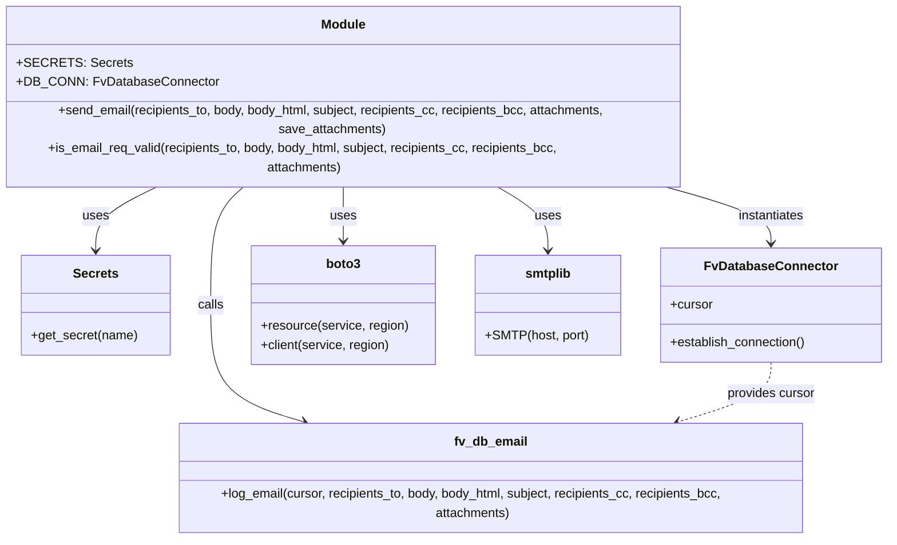
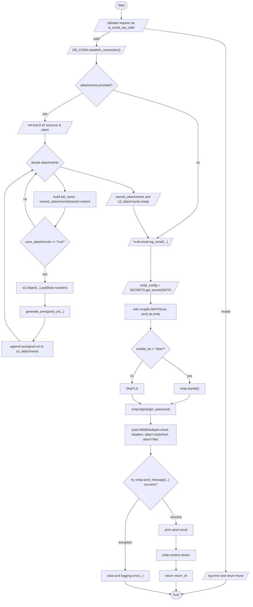

# Diagram: shipment_core/chromium_export/fv/python/fv/utilities/email_sender.py

> Auto-generated by Obscura crawlers

## Diagram 1

### SVG

<svg id="container" width="1132.33984375" xmlns="http://www.w3.org/2000/svg" class="classDiagram" height="632" viewBox="0 0 1132.33984375 632" role="graphics-document document" aria-roledescription="class"><g><defs><marker id="container_class-aggregationStart" class="marker aggregation class" refX="18" refY="7" markerWidth="190" markerHeight="240" orient="auto"><path d="M 18,7 L9,13 L1,7 L9,1 Z"></path></marker></defs><defs><marker id="container_class-aggregationEnd" class="marker aggregation class" refX="1" refY="7" markerWidth="20" markerHeight="28" orient="auto"><path d="M 18,7 L9,13 L1,7 L9,1 Z"></path></marker></defs><defs><marker id="container_class-extensionStart" class="marker extension class" refX="18" refY="7" markerWidth="190" markerHeight="240" orient="auto"><path d="M 1,7 L18,13 V 1 Z"></path></marker></defs><defs><marker id="container_class-extensionEnd" class="marker extension class" refX="1" refY="7" markerWidth="20" markerHeight="28" orient="auto"><path d="M 1,1 V 13 L18,7 Z"></path></marker></defs><defs><marker id="container_class-compositionStart" class="marker composition class" refX="18" refY="7" markerWidth="190" markerHeight="240" orient="auto"><path d="M 18,7 L9,13 L1,7 L9,1 Z"></path></marker></defs><defs><marker id="container_class-compositionEnd" class="marker composition class" refX="1" refY="7" markerWidth="20" markerHeight="28" orient="auto"><path d="M 18,7 L9,13 L1,7 L9,1 Z"></path></marker></defs><defs><marker id="container_class-dependencyStart" class="marker dependency class" refX="6" refY="7" markerWidth="190" markerHeight="240" orient="auto"><path d="M 5,7 L9,13 L1,7 L9,1 Z"></path></marker></defs><defs><marker id="container_class-dependencyEnd" class="marker dependency class" refX="13" refY="7" markerWidth="20" markerHeight="28" orient="auto"><path d="M 18,7 L9,13 L14,7 L9,1 Z"></path></marker></defs><defs><marker id="container_class-lollipopStart" class="marker lollipop class" refX="13" refY="7" markerWidth="190" markerHeight="240" orient="auto"><circle stroke="black" fill="transparent" cx="7" cy="7" r="6"></circle></marker></defs><defs><marker id="container_class-lollipopEnd" class="marker lollipop class" refX="1" refY="7" markerWidth="190" markerHeight="240" orient="auto"><circle stroke="black" fill="transparent" cx="7" cy="7" r="6"></circle></marker></defs><g class="root"><g class="clusters"></g><g class="edgePaths"><path d="M229.509,200L215.109,206.167C200.709,212.333,171.909,224.667,157.509,238C143.109,251.333,143.109,265.667,143.109,272.833L143.109,280" id="id_Module_Secrets_1" class="edge-thickness-normal edge-pattern-solid relation" style=";;;" data-edge="true" data-et="edge" data-id="id_Module_Secrets_1" data-points="W3sieCI6MjI5LjUwODYzNDg2ODQyMTA0LCJ5IjoyMDB9LHsieCI6MTQzLjEwOTM3NSwieSI6MjM3fSx7IngiOjE0My4xMDkzNzUsInkiOjI4Nn1d" marker-end="url(#container_class-dependencyEnd)"></path><path d="M837.95,200L862.634,206.167C887.318,212.333,936.687,224.667,961.371,236.5C986.055,248.333,986.055,259.667,986.055,265.333L986.055,271" id="id_Module_FvDatabaseConnector_2" class="edge-thickness-normal edge-pattern-solid relation" style=";;;" data-edge="true" data-et="edge" data-id="id_Module_FvDatabaseConnector_2" data-points="W3sieCI6ODM3Ljk1MDM2NDE5MTcyOTIsInkiOjIwMH0seyJ4Ijo5ODYuMDU0Njg3NSwieSI6MjM3fSx7IngiOjk4Ni4wNTQ2ODc1LCJ5IjoyNzd9XQ==" marker-end="url(#container_class-dependencyEnd)"></path><path d="M333.389,200L325.662,206.167C317.935,212.333,302.481,224.667,294.754,249.5C287.027,274.333,287.027,311.667,287.027,349C287.027,386.333,287.027,423.667,307.619,448.225C328.211,472.783,369.395,484.566,389.987,490.458L410.579,496.35" id="id_Module_fv_db_email_3" class="edge-thickness-normal edge-pattern-solid relation" style=";;;" data-edge="true" data-et="edge" data-id="id_Module_fv_db_email_3" data-points="W3sieCI6MzMzLjM4OTI3Mzk2NjE2NTQzLCJ5IjoyMDB9LHsieCI6Mjg3LjAyNzM0Mzc1LCJ5IjoyMzd9LHsieCI6Mjg3LjAyNzM0Mzc1LCJ5IjozNDl9LHsieCI6Mjg3LjAyNzM0Mzc1LCJ5Ijo0NjF9LHsieCI6NDE2LjM0NzQwMjM0Mzc1LCJ5Ijo0OTh9XQ==" marker-end="url(#container_class-dependencyEnd)"></path><path d="M453.68,200L453.68,206.167C453.68,212.333,453.68,224.667,453.68,236C453.68,247.333,453.68,257.667,453.68,262.833L453.68,268" id="id_Module_boto3_4" class="edge-thickness-normal edge-pattern-solid relation" style=";;;" data-edge="true" data-et="edge" data-id="id_Module_boto3_4" data-points="W3sieCI6NDUzLjY3OTY4NzUsInkiOjIwMH0seyJ4Ijo0NTMuNjc5Njg3NSwieSI6MjM3fSx7IngiOjQ1My42Nzk2ODc1LCJ5IjoyNzR9XQ==" marker-end="url(#container_class-dependencyEnd)"></path><path d="M637.486,200L649.293,206.167C661.1,212.333,684.714,224.667,696.521,238C708.328,251.333,708.328,265.667,708.328,272.833L708.328,280" id="id_Module_smtplib_5" class="edge-thickness-normal edge-pattern-solid relation" style=";;;" data-edge="true" data-et="edge" data-id="id_Module_smtplib_5" data-points="W3sieCI6NjM3LjQ4NjA3ODQ3NzQ0MzYsInkiOjIwMH0seyJ4Ijo3MDguMzI4MTI1LCJ5IjoyMzd9LHsieCI6NzA4LjMyODEyNSwieSI6Mjg2fV0=" marker-end="url(#container_class-dependencyEnd)"></path><path d="M986.055,421L986.055,427.667C986.055,434.333,986.055,447.667,965.463,460.225C944.871,472.783,903.687,484.566,883.095,490.458L862.503,496.35" id="id_FvDatabaseConnector_fv_db_email_6" class="edge-thickness-normal edge-pattern-dashed relation" style=";;;" data-edge="true" data-et="edge" data-id="id_FvDatabaseConnector_fv_db_email_6" data-points="W3sieCI6OTg2LjA1NDY4NzUsInkiOjQyMX0seyJ4Ijo5ODYuMDU0Njg3NSwieSI6NDYxfSx7IngiOjg1Ni43MzQ2Mjg5MDYyNSwieSI6NDk4fV0=" marker-end="url(#container_class-dependencyEnd)"></path></g><g class="edgeLabels"><g class="edgeLabel" transform="translate(143.109375, 237)"><g class="label" data-id="id_Module_Secrets_1" transform="translate(-16.4921875, -12)"><foreignObject width="32.984375" height="24">

uses

</foreignObject></g></g><g class="edgeLabel" transform="translate(986.0546875, 237)"><g class="label" data-id="id_Module_FvDatabaseConnector_2" transform="translate(-42.9140625, -12)"><foreignObject width="85.828125" height="24">

instantiates

</foreignObject></g></g><g class="edgeLabel" transform="translate(287.02734375, 349)"><g class="label" data-id="id_Module_fv_db_email_3" transform="translate(-16.4453125, -12)"><foreignObject width="32.890625" height="24">

calls

</foreignObject></g></g><g class="edgeLabel" transform="translate(453.6796875, 237)"><g class="label" data-id="id_Module_boto3_4" transform="translate(-16.4921875, -12)"><foreignObject width="32.984375" height="24">

uses

</foreignObject></g></g><g class="edgeLabel" transform="translate(708.328125, 237)"><g class="label" data-id="id_Module_smtplib_5" transform="translate(-16.4921875, -12)"><foreignObject width="32.984375" height="24">

uses

</foreignObject></g></g><g class="edgeLabel" transform="translate(986.0546875, 461)"><g class="label" data-id="id_FvDatabaseConnector_fv_db_email_6" transform="translate(-56.296875, -12)"><foreignObject width="112.59375" height="24">

provides cursor

</foreignObject></g></g></g><g class="nodes"><g class="node default" id="classId-Module-0" transform="translate(453.6796875, 104)"><g class="basic label-container"><path d="M-445.6796875 -96 L445.6796875 -96 L445.6796875 96 L-445.6796875 96" stroke="none" stroke-width="0" fill="#ECECFF" style=""></path><path d="M-445.6796875 -96 C-166.77929983791364 -96, 112.12108782417272 -96, 445.6796875 -96 M-445.6796875 -96 C-219.5972009929735 -96, 6.4852855140529755 -96, 445.6796875 -96 M445.6796875 -96 C445.6796875 -29.982760756626803, 445.6796875 36.034478486746394, 445.6796875 96 M445.6796875 -96 C445.6796875 -56.67349226475869, 445.6796875 -17.346984529517385, 445.6796875 96 M445.6796875 96 C106.43886828467595 96, -232.8019509306481 96, -445.6796875 96 M445.6796875 96 C231.57502436772674 96, 17.47036123545348 96, -445.6796875 96 M-445.6796875 96 C-445.6796875 19.65556773346016, -445.6796875 -56.68886453307968, -445.6796875 -96 M-445.6796875 96 C-445.6796875 51.1942820569051, -445.6796875 6.3885641138102045, -445.6796875 -96" stroke="#9370DB" stroke-width="1.3" fill="none" stroke-dasharray="0 0" style=""></path></g><g class="annotation-group text" transform="translate(0, -72)"></g><g class="label-group text" transform="translate(-27.09375, -72)"><g class="label" style="font-weight: bolder" transform="translate(0,-12)"><foreignObject width="54.1875" height="24">

Module

</foreignObject></g></g><g class="members-group text" transform="translate(-433.6796875, -24)"><g class="label" style="" transform="translate(0,-12)"><foreignObject width="129.140625" height="24">

+SECRETS: Secrets

</foreignObject></g><g class="label" style="" transform="translate(0,12)"><foreignObject width="241.65625" height="24">

+DB_CONN: FvDatabaseConnector

</foreignObject></g></g><g class="methods-group text" transform="translate(-433.6796875, 48)"><g class="label" style="" transform="translate(0,-12)"><foreignObject width="840.265625" height="24">

+send_email(recipients_to, body, body_html, subject, recipients_cc, recipients_bcc, attachments, save_attachments)

</foreignObject></g><g class="label" style="" transform="translate(0,12)"><foreignObject width="752.875" height="24">

+is_email_req_valid(recipients_to, body, body_html, subject, recipients_cc, recipients_bcc, attachments)

</foreignObject></g></g><g class="divider" style=""><path d="M-445.6796875 -48 C-189.72963996567853 -48, 66.22040756864294 -48, 445.6796875 -48 M-445.6796875 -48 C-243.52812865597124 -48, -41.37656981194249 -48, 445.6796875 -48" stroke="#9370DB" stroke-width="1.3" fill="none" stroke-dasharray="0 0" style=""></path></g><g class="divider" style=""><path d="M-445.6796875 24 C-144.6764141334403 24, 156.32685923311942 24, 445.6796875 24 M-445.6796875 24 C-177.6548157630392 24, 90.37005597392158 24, 445.6796875 24" stroke="#9370DB" stroke-width="1.3" fill="none" stroke-dasharray="0 0" style=""></path></g></g><g class="node default" id="classId-Secrets-1" transform="translate(143.109375, 349)"><g class="basic label-container"><path d="M-92.47265625 -63 L92.47265625 -63 L92.47265625 63 L-92.47265625 63" stroke="none" stroke-width="0" fill="#ECECFF" style=""></path><path d="M-92.47265625 -63 C-38.39276431413034 -63, 15.687127621739322 -63, 92.47265625 -63 M-92.47265625 -63 C-35.32865797378157 -63, 21.815340302436866 -63, 92.47265625 -63 M92.47265625 -63 C92.47265625 -15.924888411096013, 92.47265625 31.150223177807973, 92.47265625 63 M92.47265625 -63 C92.47265625 -17.406692889580718, 92.47265625 28.186614220838564, 92.47265625 63 M92.47265625 63 C38.84167954038852 63, -14.789297169222962 63, -92.47265625 63 M92.47265625 63 C21.285777237417236 63, -49.90110177516553 63, -92.47265625 63 M-92.47265625 63 C-92.47265625 35.26311156510282, -92.47265625 7.5262231302056435, -92.47265625 -63 M-92.47265625 63 C-92.47265625 33.89929753040914, -92.47265625 4.798595060818279, -92.47265625 -63" stroke="#9370DB" stroke-width="1.3" fill="none" stroke-dasharray="0 0" style=""></path></g><g class="annotation-group text" transform="translate(0, -39)"></g><g class="label-group text" transform="translate(-27.1640625, -39)"><g class="label" style="font-weight: bolder" transform="translate(0,-12)"><foreignObject width="54.328125" height="24">

Secrets

</foreignObject></g></g><g class="members-group text" transform="translate(-80.47265625, 9)"></g><g class="methods-group text" transform="translate(-80.47265625, 39)"><g class="label" style="" transform="translate(0,-12)"><foreignObject width="133.78125" height="24">

+get_secret(name)

</foreignObject></g></g><g class="divider" style=""><path d="M-92.47265625 -15 C-47.39912489692356 -15, -2.32559354384712 -15, 92.47265625 -15 M-92.47265625 -15 C-42.71148654058687 -15, 7.049683168826263 -15, 92.47265625 -15" stroke="#9370DB" stroke-width="1.3" fill="none" stroke-dasharray="0 0" style=""></path></g><g class="divider" style=""><path d="M-92.47265625 9 C-41.59256749123897 9, 9.287521267522067 9, 92.47265625 9 M-92.47265625 9 C-49.12554938485896 9, -5.778442519717913 9, 92.47265625 9" stroke="#9370DB" stroke-width="1.3" fill="none" stroke-dasharray="0 0" style=""></path></g></g><g class="node default" id="classId-FvDatabaseConnector-2" transform="translate(986.0546875, 349)"><g class="basic label-container"><path d="M-138.28515625 -72 L138.28515625 -72 L138.28515625 72 L-138.28515625 72" stroke="none" stroke-width="0" fill="#ECECFF" style=""></path><path d="M-138.28515625 -72 C-39.67910338440642 -72, 58.926949481187165 -72, 138.28515625 -72 M-138.28515625 -72 C-69.45730654236345 -72, -0.6294568347269092 -72, 138.28515625 -72 M138.28515625 -72 C138.28515625 -23.77814703881978, 138.28515625 24.443705922360436, 138.28515625 72 M138.28515625 -72 C138.28515625 -19.511837531739914, 138.28515625 32.97632493652017, 138.28515625 72 M138.28515625 72 C36.569606296812225 72, -65.14594365637555 72, -138.28515625 72 M138.28515625 72 C41.41469452250843 72, -55.45576720498315 72, -138.28515625 72 M-138.28515625 72 C-138.28515625 36.72413329410281, -138.28515625 1.4482665882056267, -138.28515625 -72 M-138.28515625 72 C-138.28515625 23.658568698732992, -138.28515625 -24.682862602534016, -138.28515625 -72" stroke="#9370DB" stroke-width="1.3" fill="none" stroke-dasharray="0 0" style=""></path></g><g class="annotation-group text" transform="translate(0, -48)"></g><g class="label-group text" transform="translate(-79.3046875, -48)"><g class="label" style="font-weight: bolder" transform="translate(0,-12)"><foreignObject width="158.609375" height="24">

FvDatabaseConnector

</foreignObject></g></g><g class="members-group text" transform="translate(-126.28515625, 0)"><g class="label" style="" transform="translate(0,-12)"><foreignObject width="53.71875" height="24">

+cursor

</foreignObject></g></g><g class="methods-group text" transform="translate(-126.28515625, 48)"><g class="label" style="" transform="translate(0,-12)"><foreignObject width="173.265625" height="24">

+establish_connection()

</foreignObject></g></g><g class="divider" style=""><path d="M-138.28515625 -24 C-34.02862334394041 -24, 70.22790956211918 -24, 138.28515625 -24 M-138.28515625 -24 C-36.71228696500931 -24, 64.86058231998138 -24, 138.28515625 -24" stroke="#9370DB" stroke-width="1.3" fill="none" stroke-dasharray="0 0" style=""></path></g><g class="divider" style=""><path d="M-138.28515625 24 C-63.51317975021182 24, 11.258796749576362 24, 138.28515625 24 M-138.28515625 24 C-55.5288936243459 24, 27.227369001308205 24, 138.28515625 24" stroke="#9370DB" stroke-width="1.3" fill="none" stroke-dasharray="0 0" style=""></path></g></g><g class="node default" id="classId-fv_db_email-3" transform="translate(636.541015625, 561)"><g class="basic label-container"><path d="M-404.66015625 -63 L404.66015625 -63 L404.66015625 63 L-404.66015625 63" stroke="none" stroke-width="0" fill="#ECECFF" style=""></path><path d="M-404.66015625 -63 C-217.48368892060094 -63, -30.30722159120188 -63, 404.66015625 -63 M-404.66015625 -63 C-123.1188475296342 -63, 158.4224611907316 -63, 404.66015625 -63 M404.66015625 -63 C404.66015625 -31.42084804729275, 404.66015625 0.158303905414499, 404.66015625 63 M404.66015625 -63 C404.66015625 -30.03858622913547, 404.66015625 2.9228275417290632, 404.66015625 63 M404.66015625 63 C90.26583842078429 63, -224.12847940843142 63, -404.66015625 63 M404.66015625 63 C207.76010500951955 63, 10.860053769039098 63, -404.66015625 63 M-404.66015625 63 C-404.66015625 17.78435818989248, -404.66015625 -27.43128362021504, -404.66015625 -63 M-404.66015625 63 C-404.66015625 15.025733497888602, -404.66015625 -32.948533004222796, -404.66015625 -63" stroke="#9370DB" stroke-width="1.3" fill="none" stroke-dasharray="0 0" style=""></path></g><g class="annotation-group text" transform="translate(0, -39)"></g><g class="label-group text" transform="translate(-44.3203125, -39)"><g class="label" style="font-weight: bolder" transform="translate(0,-12)"><foreignObject width="88.640625" height="24">

fv_db_email

</foreignObject></g></g><g class="members-group text" transform="translate(-392.66015625, 9)"></g><g class="methods-group text" transform="translate(-392.66015625, 39)"><g class="label" style="" transform="translate(0,-12)"><foreignObject width="741" height="24">

+log_email(cursor, recipients_to, body, body_html, subject, recipients_cc, recipients_bcc, attachments)

</foreignObject></g></g><g class="divider" style=""><path d="M-404.66015625 -15 C-123.3209580106838 -15, 158.0182402286324 -15, 404.66015625 -15 M-404.66015625 -15 C-168.25427388853802 -15, 68.15160847292395 -15, 404.66015625 -15" stroke="#9370DB" stroke-width="1.3" fill="none" stroke-dasharray="0 0" style=""></path></g><g class="divider" style=""><path d="M-404.66015625 9 C-161.03304670109216 9, 82.59406284781568 9, 404.66015625 9 M-404.66015625 9 C-175.26783381027812 9, 54.12448862944376 9, 404.66015625 9" stroke="#9370DB" stroke-width="1.3" fill="none" stroke-dasharray="0 0" style=""></path></g></g><g class="node default" id="classId-boto3-4" transform="translate(453.6796875, 349)"><g class="basic label-container"><path d="M-115.20703125 -75 L115.20703125 -75 L115.20703125 75 L-115.20703125 75" stroke="none" stroke-width="0" fill="#ECECFF" style=""></path><path d="M-115.20703125 -75 C-46.01642675434336 -75, 23.174177741313287 -75, 115.20703125 -75 M-115.20703125 -75 C-56.802834515259406 -75, 1.6013622194811887 -75, 115.20703125 -75 M115.20703125 -75 C115.20703125 -30.26868935971023, 115.20703125 14.46262128057954, 115.20703125 75 M115.20703125 -75 C115.20703125 -31.262660970733613, 115.20703125 12.474678058532774, 115.20703125 75 M115.20703125 75 C55.13382117133366 75, -4.939388907332685 75, -115.20703125 75 M115.20703125 75 C26.2489437646214 75, -62.7091437207572 75, -115.20703125 75 M-115.20703125 75 C-115.20703125 19.2759590176326, -115.20703125 -36.4480819647348, -115.20703125 -75 M-115.20703125 75 C-115.20703125 44.11234264781689, -115.20703125 13.224685295633776, -115.20703125 -75" stroke="#9370DB" stroke-width="1.3" fill="none" stroke-dasharray="0 0" style=""></path></g><g class="annotation-group text" transform="translate(0, -51)"></g><g class="label-group text" transform="translate(-21.0703125, -51)"><g class="label" style="font-weight: bolder" transform="translate(0,-12)"><foreignObject width="42.140625" height="24">

boto3

</foreignObject></g></g><g class="members-group text" transform="translate(-103.20703125, -3)"></g><g class="methods-group text" transform="translate(-103.20703125, 27)"><g class="label" style="" transform="translate(0,-12)"><foreignObject width="185.34375" height="24">

+resource(service, region)

</foreignObject></g><g class="label" style="" transform="translate(0,12)"><foreignObject width="163.765625" height="24">

+client(service, region)

</foreignObject></g></g><g class="divider" style=""><path d="M-115.20703125 -27 C-45.06477365508911 -27, 25.077483939821775 -27, 115.20703125 -27 M-115.20703125 -27 C-39.40413106350641 -27, 36.398769122987176 -27, 115.20703125 -27" stroke="#9370DB" stroke-width="1.3" fill="none" stroke-dasharray="0 0" style=""></path></g><g class="divider" style=""><path d="M-115.20703125 -3 C-48.73210796729377 -3, 17.742815315412457 -3, 115.20703125 -3 M-115.20703125 -3 C-45.40218971390597 -3, 24.402651822188062 -3, 115.20703125 -3" stroke="#9370DB" stroke-width="1.3" fill="none" stroke-dasharray="0 0" style=""></path></g></g><g class="node default" id="classId-smtplib-5" transform="translate(708.328125, 349)"><g class="basic label-container"><path d="M-89.44140625 -63 L89.44140625 -63 L89.44140625 63 L-89.44140625 63" stroke="none" stroke-width="0" fill="#ECECFF" style=""></path><path d="M-89.44140625 -63 C-51.10865739619372 -63, -12.775908542387441 -63, 89.44140625 -63 M-89.44140625 -63 C-39.83116552259443 -63, 9.779075204811136 -63, 89.44140625 -63 M89.44140625 -63 C89.44140625 -24.043699697159774, 89.44140625 14.912600605680453, 89.44140625 63 M89.44140625 -63 C89.44140625 -21.61756700133831, 89.44140625 19.764865997323383, 89.44140625 63 M89.44140625 63 C51.088764399765616 63, 12.736122549531231 63, -89.44140625 63 M89.44140625 63 C25.896935723496952 63, -37.647534803006096 63, -89.44140625 63 M-89.44140625 63 C-89.44140625 31.453712748843415, -89.44140625 -0.09257450231316966, -89.44140625 -63 M-89.44140625 63 C-89.44140625 31.555763833710028, -89.44140625 0.11152766742005582, -89.44140625 -63" stroke="#9370DB" stroke-width="1.3" fill="none" stroke-dasharray="0 0" style=""></path></g><g class="annotation-group text" transform="translate(0, -39)"></g><g class="label-group text" transform="translate(-27.8984375, -39)"><g class="label" style="font-weight: bolder" transform="translate(0,-12)"><foreignObject width="55.796875" height="24">

smtplib

</foreignObject></g></g><g class="members-group text" transform="translate(-77.44140625, 9)"></g><g class="methods-group text" transform="translate(-77.44140625, 39)"><g class="label" style="" transform="translate(0,-12)"><foreignObject width="126.984375" height="24">

+SMTP(host, port)

</foreignObject></g></g><g class="divider" style=""><path d="M-89.44140625 -15 C-46.040244442376896 -15, -2.639082634753791 -15, 89.44140625 -15 M-89.44140625 -15 C-34.34906366483847 -15, 20.743278920323064 -15, 89.44140625 -15" stroke="#9370DB" stroke-width="1.3" fill="none" stroke-dasharray="0 0" style=""></path></g><g class="divider" style=""><path d="M-89.44140625 9 C-24.292950513445945 9, 40.85550522310811 9, 89.44140625 9 M-89.44140625 9 C-51.74230509505263 9, -14.043203940105258 9, 89.44140625 9" stroke="#9370DB" stroke-width="1.3" fill="none" stroke-dasharray="0 0" style=""></path></g></g></g></g></g></svg>

## Diagram 2

### SVG

<svg id="container" width="1285.26171875" xmlns="http://www.w3.org/2000/svg" class="flowchart" height="3036.140625" viewBox="0 0 1285.26171875 3036.140625" role="graphics-document document" aria-roledescription="flowchart-v2"><g><marker id="container_flowchart-v2-pointEnd" class="marker flowchart-v2" viewBox="0 0 10 10" refX="5" refY="5" markerUnits="userSpaceOnUse" markerWidth="8" markerHeight="8" orient="auto"><path d="M 0 0 L 10 5 L 0 10 z" class="arrowMarkerPath" style="stroke-width: 1; stroke-dasharray: 1, 0;"></path></marker><marker id="container_flowchart-v2-pointStart" class="marker flowchart-v2" viewBox="0 0 10 10" refX="4.5" refY="5" markerUnits="userSpaceOnUse" markerWidth="8" markerHeight="8" orient="auto"><path d="M 0 5 L 10 10 L 10 0 z" class="arrowMarkerPath" style="stroke-width: 1; stroke-dasharray: 1, 0;"></path></marker><marker id="container_flowchart-v2-circleEnd" class="marker flowchart-v2" viewBox="0 0 10 10" refX="11" refY="5" markerUnits="userSpaceOnUse" markerWidth="11" markerHeight="11" orient="auto"><circle cx="5" cy="5" r="5" class="arrowMarkerPath" style="stroke-width: 1; stroke-dasharray: 1, 0;"></circle></marker><marker id="container_flowchart-v2-circleStart" class="marker flowchart-v2" viewBox="0 0 10 10" refX="-1" refY="5" markerUnits="userSpaceOnUse" markerWidth="11" markerHeight="11" orient="auto"><circle cx="5" cy="5" r="5" class="arrowMarkerPath" style="stroke-width: 1; stroke-dasharray: 1, 0;"></circle></marker><marker id="container_flowchart-v2-crossEnd" class="marker cross flowchart-v2" viewBox="0 0 11 11" refX="12" refY="5.2" markerUnits="userSpaceOnUse" markerWidth="11" markerHeight="11" orient="auto"><path d="M 1,1 l 9,9 M 10,1 l -9,9" class="arrowMarkerPath" style="stroke-width: 2; stroke-dasharray: 1, 0;"></path></marker><marker id="container_flowchart-v2-crossStart" class="marker cross flowchart-v2" viewBox="0 0 11 11" refX="-1" refY="5.2" markerUnits="userSpaceOnUse" markerWidth="11" markerHeight="11" orient="auto"><path d="M 1,1 l 9,9 M 10,1 l -9,9" class="arrowMarkerPath" style="stroke-width: 2; stroke-dasharray: 1, 0;"></path></marker><g class="root"><g class="clusters"></g><g class="edgePaths"><path d="M619.328,47.5L619.245,51.583C619.161,55.667,618.995,63.833,618.982,71.5C618.969,79.167,619.109,86.334,619.179,89.917L619.25,93.501" id="L_Start_Validate_0" class="edge-thickness-normal edge-pattern-solid edge-thickness-normal edge-pattern-solid flowchart-link" style=";" data-edge="true" data-et="edge" data-id="L_Start_Validate_0" data-points="W3sieCI6NjE5LjMyODEyNSwieSI6NDcuNX0seyJ4Ijo2MTguODI4MTI1LCJ5Ijo3Mn0seyJ4Ijo2MTkuMzI4MTI1LCJ5Ijo5Ny41fV0=" marker-end="url(#container_flowchart-v2-pointEnd)"></path><path d="M735.204,143.748L805.512,152.623C875.82,161.498,1016.435,179.249,1086.743,197.541C1157.051,215.833,1157.051,234.667,1157.051,251.5C1157.051,268.333,1157.051,283.167,1157.051,313.186C1157.051,343.206,1157.051,388.411,1157.051,435.617C1157.051,482.823,1157.051,532.029,1157.051,568.048C1157.051,604.068,1157.051,626.901,1157.051,647.734C1157.051,668.568,1157.051,687.401,1157.051,717.379C1157.051,747.357,1157.051,788.479,1157.051,829.602C1157.051,870.724,1157.051,911.846,1157.051,943.074C1157.051,974.302,1157.051,995.635,1157.051,1016.969C1157.051,1038.302,1157.051,1059.635,1157.051,1095.145C1157.051,1130.654,1157.051,1180.339,1157.051,1232.023C1157.051,1283.708,1157.051,1337.393,1157.051,1375.652C1157.051,1413.911,1157.051,1436.745,1157.051,1457.578C1157.051,1478.411,1157.051,1497.245,1157.051,1517.328C1157.051,1537.411,1157.051,1558.745,1157.051,1580.078C1157.051,1601.411,1157.051,1622.745,1157.051,1654.083C1157.051,1685.422,1157.051,1726.766,1157.051,1770.109C1157.051,1813.453,1157.051,1858.797,1157.051,1892.135C1157.051,1925.474,1157.051,1946.807,1157.051,1966.141C1157.051,1985.474,1157.051,2002.807,1157.051,2020.141C1157.051,2037.474,1157.051,2054.807,1157.051,2072.141C1157.051,2089.474,1157.051,2106.807,1157.051,2128.141C1157.051,2149.474,1157.051,2174.807,1157.051,2200.141C1157.051,2225.474,1157.051,2250.807,1157.051,2290.807C1157.051,2330.807,1157.051,2385.474,1157.051,2442.141C1157.051,2498.807,1157.051,2557.474,1157.051,2597.474C1157.051,2637.474,1157.051,2658.807,1157.051,2680.141C1157.051,2701.474,1157.051,2722.807,1157.051,2744.141C1157.051,2765.474,1157.051,2786.807,1157.051,2806.141C1157.051,2825.474,1157.051,2842.807,1157.124,2856.307C1157.197,2869.807,1157.344,2879.474,1157.417,2884.308L1157.49,2889.141" id="L_Validate_LogInvalid_0" class="edge-thickness-normal edge-pattern-solid edge-thickness-normal edge-pattern-solid flowchart-link" style=";" data-edge="true" data-et="edge" data-id="L_Validate_LogInvalid_0" data-points="W3sieCI6NzM1LjIwNDMwMTE5NTY0MjUsInkiOjE0My43NDc2NDc2MDg3MTQ5NH0seyJ4IjoxMTU3LjA1MDc4MTI1LCJ5IjoxOTd9LHsieCI6MTE1Ny4wNTA3ODEyNSwieSI6MjUzLjV9LHsieCI6MTE1Ny4wNTA3ODEyNSwieSI6Mjk4fSx7IngiOjExNTcuMDUwNzgxMjUsInkiOjQzMy42MTcxODc1fSx7IngiOjExNTcuMDUwNzgxMjUsInkiOjU4MS4yMzQzNzV9LHsieCI6MTE1Ny4wNTA3ODEyNSwieSI6NjQ5LjczNDM3NX0seyJ4IjoxMTU3LjA1MDc4MTI1LCJ5Ijo3MDYuMjM0Mzc1fSx7IngiOjExNTcuMDUwNzgxMjUsInkiOjgyOS42MDE1NjI1fSx7IngiOjExNTcuMDUwNzgxMjUsInkiOjk1Mi45Njg3NX0seyJ4IjoxMTU3LjA1MDc4MTI1LCJ5IjoxMDE2Ljk2ODc1fSx7IngiOjExNTcuMDUwNzgxMjUsInkiOjEwODAuOTY4NzV9LHsieCI6MTE1Ny4wNTA3ODEyNSwieSI6MTIzMC4wMjM0Mzc1fSx7IngiOjExNTcuMDUwNzgxMjUsInkiOjEzOTEuMDc4MTI1fSx7IngiOjExNTcuMDUwNzgxMjUsInkiOjE0NTkuNTc4MTI1fSx7IngiOjExNTcuMDUwNzgxMjUsInkiOjE1MTYuMDc4MTI1fSx7IngiOjExNTcuMDUwNzgxMjUsInkiOjE1ODAuMDc4MTI1fSx7IngiOjExNTcuMDUwNzgxMjUsInkiOjE2NDQuMDc4MTI1fSx7IngiOjExNTcuMDUwNzgxMjUsInkiOjE3NjguMTA5Mzc1fSx7IngiOjExNTcuMDUwNzgxMjUsInkiOjE5MDQuMTQwNjI1fSx7IngiOjExNTcuMDUwNzgxMjUsInkiOjE5NjguMTQwNjI1fSx7IngiOjExNTcuMDUwNzgxMjUsInkiOjIwMjAuMTQwNjI1fSx7IngiOjExNTcuMDUwNzgxMjUsInkiOjIwNzIuMTQwNjI1fSx7IngiOjExNTcuMDUwNzgxMjUsInkiOjIxMjQuMTQwNjI1fSx7IngiOjExNTcuMDUwNzgxMjUsInkiOjIyMDAuMTQwNjI1fSx7IngiOjExNTcuMDUwNzgxMjUsInkiOjIyNzYuMTQwNjI1fSx7IngiOjExNTcuMDUwNzgxMjUsInkiOjI0NDAuMTQwNjI1fSx7IngiOjExNTcuMDUwNzgxMjUsInkiOjI2MTYuMTQwNjI1fSx7IngiOjExNTcuMDUwNzgxMjUsInkiOjI2ODAuMTQwNjI1fSx7IngiOjExNTcuMDUwNzgxMjUsInkiOjI3NDQuMTQwNjI1fSx7IngiOjExNTcuMDUwNzgxMjUsInkiOjI4MDguMTQwNjI1fSx7IngiOjExNTcuMDUwNzgxMjUsInkiOjI4NjAuMTQwNjI1fSx7IngiOjExNTcuNTUwNzgxMjUsInkiOjI4OTMuMTQwNjI1fV0=" marker-end="url(#container_flowchart-v2-pointEnd)"></path><path d="M1157.551,2932.141L1157.467,2937.474C1157.384,2942.807,1157.217,2953.474,1119.034,2965.46C1080.85,2977.446,1004.649,2990.751,966.549,2997.403L928.448,3004.056" id="L_LogInvalid_End_0" class="edge-thickness-normal edge-pattern-solid edge-thickness-normal edge-pattern-solid flowchart-link" style=";" data-edge="true" data-et="edge" data-id="L_LogInvalid_End_0" data-points="W3sieCI6MTE1Ny41NTA3ODEyNSwieSI6MjkzMi4xNDA2MjV9LHsieCI6MTE1Ny4wNTA3ODEyNSwieSI6Mjk2NC4xNDA2MjV9LHsieCI6OTI0LjUwNzY3OTAwOTE4OTcsInkiOjMwMDQuNzQzNzUyMjAxMzE5Mn1d" marker-end="url(#container_flowchart-v2-pointEnd)"></path><path d="M559.87,160.5L548.147,166.583C536.424,172.667,512.978,184.833,501.329,196.5C489.68,208.167,489.829,219.334,489.903,224.917L489.978,230.5" id="L_Validate_DBConnect_0" class="edge-thickness-normal edge-pattern-solid edge-thickness-normal edge-pattern-solid flowchart-link" style=";" data-edge="true" data-et="edge" data-id="L_Validate_DBConnect_0" data-points="W3sieCI6NTU5Ljg3MDQzNzk1NjIwNDMsInkiOjE2MC41fSx7IngiOjQ4OS41MzEyNSwieSI6MTk3fSx7IngiOjQ5MC4wMzEyNSwieSI6MjM0LjV9XQ==" marker-end="url(#container_flowchart-v2-pointEnd)"></path><path d="M490.031,273.5L489.948,277.583C489.865,281.667,489.698,289.833,489.615,297.417C489.531,305,489.531,312,489.531,315.5L489.531,319" id="L_DBConnect_PrepareAttachments_0" class="edge-thickness-normal edge-pattern-solid edge-thickness-normal edge-pattern-solid flowchart-link" style=";" data-edge="true" data-et="edge" data-id="L_DBConnect_PrepareAttachments_0" data-points="W3sieCI6NDkwLjAzMTI1LCJ5IjoyNzMuNX0seyJ4Ijo0ODkuNTMxMjUsInkiOjI5OH0seyJ4Ijo0ODkuNTMxMjUsInkiOjMyM31d" marker-end="url(#container_flowchart-v2-pointEnd)"></path><path d="M575.819,457.947L648.694,478.495C721.569,499.043,867.32,540.139,940.195,572.103C1013.07,604.068,1013.07,626.901,1013.07,647.734C1013.07,668.568,1013.07,687.401,1013.07,717.379C1013.07,747.357,1013.07,788.479,1013.07,829.602C1013.07,870.724,1013.07,911.846,1013.07,943.074C1013.07,974.302,1013.07,995.635,1013.07,1016.969C1013.07,1038.302,1013.07,1059.635,978.2,1091.63C943.33,1123.625,873.589,1166.28,838.718,1187.608L803.848,1208.936" id="L_PrepareAttachments_LogRequest_0" class="edge-thickness-normal edge-pattern-solid edge-thickness-normal edge-pattern-solid flowchart-link" style=";" data-edge="true" data-et="edge" data-id="L_PrepareAttachments_LogRequest_0" data-points="W3sieCI6NTc1LjgxODc4NTMzOTQwMzgsInkiOjQ1Ny45NDY4Mzk2NjA1OTYyfSx7IngiOjEwMTMuMDcwMzEyNSwieSI6NTgxLjIzNDM3NX0seyJ4IjoxMDEzLjA3MDMxMjUsInkiOjY0OS43MzQzNzV9LHsieCI6MTAxMy4wNzAzMTI1LCJ5Ijo3MDYuMjM0Mzc1fSx7IngiOjEwMTMuMDcwMzEyNSwieSI6ODI5LjYwMTU2MjV9LHsieCI6MTAxMy4wNzAzMTI1LCJ5Ijo5NTIuOTY4NzV9LHsieCI6MTAxMy4wNzAzMTI1LCJ5IjoxMDE2Ljk2ODc1fSx7IngiOjEwMTMuMDcwMzEyNSwieSI6MTA4MC45Njg3NX0seyJ4Ijo4MDAuNDM1NTY5OTA4MzQxNywieSI6MTIxMS4wMjM0Mzc1fV0=" marker-end="url(#container_flowchart-v2-pointEnd)"></path><path d="M418.747,473.45L386.824,491.414C354.902,509.378,291.056,545.306,259.208,568.854C227.36,592.401,227.509,603.568,227.583,609.151L227.658,614.735" id="L_PrepareAttachments_S3Init_0" class="edge-thickness-normal edge-pattern-solid edge-thickness-normal edge-pattern-solid flowchart-link" style=";" data-edge="true" data-et="edge" data-id="L_PrepareAttachments_S3Init_0" data-points="W3sieCI6NDE4Ljc0Njk1OTI0MTM1NzMsInkiOjQ3My40NTAwODQyNDEzNTczfSx7IngiOjIyNy4yMTA5Mzc1LCJ5Ijo1ODEuMjM0Mzc1fSx7IngiOjIyNy43MTA5Mzc1LCJ5Ijo2MTguNzM0Mzc1fV0=" marker-end="url(#container_flowchart-v2-pointEnd)"></path><path d="M227.711,681.734L227.628,685.818C227.544,689.901,227.378,698.068,227.294,705.651C227.211,713.234,227.211,720.234,227.211,723.734L227.211,727.234" id="L_S3Init_ForEachAtt_0" class="edge-thickness-normal edge-pattern-solid edge-thickness-normal edge-pattern-solid flowchart-link" style=";" data-edge="true" data-et="edge" data-id="L_S3Init_ForEachAtt_0" data-points="W3sieCI6MjI3LjcxMDkzNzUsInkiOjY4MS43MzQzNzV9LHsieCI6MjI3LjIxMDkzNzUsInkiOjcwNi4yMzQzNzV9LHsieCI6MjI3LjIxMDkzNzUsInkiOjczMS4yMzQzNzV9XQ==" marker-end="url(#container_flowchart-v2-pointEnd)"></path><path d="M271.97,883.209L281.678,894.836C291.385,906.463,310.8,929.716,320.507,944.842C330.215,959.969,330.215,966.969,330.215,970.469L330.215,973.969" id="L_ForEachAtt_BuildName_0" class="edge-thickness-normal edge-pattern-solid edge-thickness-normal edge-pattern-solid flowchart-link" style=";" data-edge="true" data-et="edge" data-id="L_ForEachAtt_BuildName_0" data-points="W3sieCI6MjcxLjk3MDIwNTk3MTQyNDE1LCJ5Ijo4ODMuMjA5NDgxNTI4NTc1OX0seyJ4IjozMzAuMjE0ODQzNzUsInkiOjk1Mi45Njg3NX0seyJ4IjozMzAuMjE0ODQzNzUsInkiOjk3Ny45Njg3NX1d" marker-end="url(#container_flowchart-v2-pointEnd)"></path><path d="M330.215,1055.969L330.215,1060.135C330.215,1064.302,330.215,1072.635,321.876,1088.869C313.537,1105.104,296.858,1129.238,288.519,1141.306L280.18,1153.373" id="L_BuildName_SaveToS3_0" class="edge-thickness-normal edge-pattern-solid edge-thickness-normal edge-pattern-solid flowchart-link" style=";" data-edge="true" data-et="edge" data-id="L_BuildName_SaveToS3_0" data-points="W3sieCI6MzMwLjIxNDg0Mzc1LCJ5IjoxMDU1Ljk2ODc1fSx7IngiOjMzMC4yMTQ4NDM3NSwieSI6MTA4MC45Njg3NX0seyJ4IjoyNzcuOTA1OTY1MjM1NDgyOCwieSI6MTE1Ni42NjM3Nzc3MzU0ODI5fV0=" marker-end="url(#container_flowchart-v2-pointEnd)"></path><path d="M227.211,1354.078L227.211,1360.245C227.211,1366.411,227.211,1378.745,227.211,1391.161C227.211,1403.578,227.211,1416.078,227.211,1422.328L227.211,1428.578" id="L_SaveToS3_PutObject_0" class="edge-thickness-normal edge-pattern-solid edge-thickness-normal edge-pattern-solid flowchart-link" style=";" data-edge="true" data-et="edge" data-id="L_SaveToS3_PutObject_0" data-points="W3sieCI6MjI3LjIxMDkzNzUsInkiOjEzNTQuMDc4MTI1fSx7IngiOjIyNy4yMTA5Mzc1LCJ5IjoxMzkxLjA3ODEyNX0seyJ4IjoyMjcuMjEwOTM3NSwieSI6MTQzMi41NzgxMjV9XQ==" marker-end="url(#container_flowchart-v2-pointEnd)"></path><path d="M227.211,1486.578L227.211,1491.495C227.211,1496.411,227.211,1506.245,227.211,1516.661C227.211,1527.078,227.211,1538.078,227.211,1543.578L227.211,1549.078" id="L_PutObject_Presign_0" class="edge-thickness-normal edge-pattern-solid edge-thickness-normal edge-pattern-solid flowchart-link" style=";" data-edge="true" data-et="edge" data-id="L_PutObject_Presign_0" data-points="W3sieCI6MjI3LjIxMDkzNzUsInkiOjE0ODYuNTc4MTI1fSx7IngiOjIyNy4yMTA5Mzc1LCJ5IjoxNTE2LjA3ODEyNX0seyJ4IjoyMjcuMjEwOTM3NSwieSI6MTU1My4wNzgxMjV9XQ==" marker-end="url(#container_flowchart-v2-pointEnd)"></path><path d="M227.211,1607.078L227.211,1613.245C227.211,1619.411,227.211,1631.745,217.407,1651.542C207.603,1671.339,187.995,1698.601,178.191,1712.231L168.387,1725.862" id="L_Presign_CollectURL_0" class="edge-thickness-normal edge-pattern-solid edge-thickness-normal edge-pattern-solid flowchart-link" style=";" data-edge="true" data-et="edge" data-id="L_Presign_CollectURL_0" data-points="W3sieCI6MjI3LjIxMDkzNzUsInkiOjE2MDcuMDc4MTI1fSx7IngiOjIyNy4yMTA5Mzc1LCJ5IjoxNjQ0LjA3ODEyNX0seyJ4IjoxNjYuMDUxMjA5MzcyNjM3OTQsInkiOjE3MjkuMTA5Mzc1fV0=" marker-end="url(#container_flowchart-v2-pointEnd)"></path><path d="M100.995,1729.109L87.548,1714.938C74.101,1700.766,47.207,1672.422,33.76,1647.583C20.313,1622.745,20.313,1601.411,20.313,1580.078C20.313,1558.745,20.313,1537.411,20.313,1517.328C20.313,1497.245,20.313,1478.411,20.313,1457.578C20.313,1436.745,20.313,1413.911,20.313,1375.652C20.313,1337.393,20.313,1283.708,20.313,1232.023C20.313,1180.339,20.313,1130.654,20.313,1095.145C20.313,1059.635,20.313,1038.302,20.313,1016.969C20.313,995.635,20.313,974.302,43.952,949.54C67.592,924.777,114.872,896.586,138.512,882.49L162.152,868.394" id="L_CollectURL_ForEachAtt_0" class="edge-thickness-normal edge-pattern-solid edge-thickness-normal edge-pattern-solid flowchart-link" style=";" data-edge="true" data-et="edge" data-id="L_CollectURL_ForEachAtt_0" data-points="W3sieCI6MTAwLjk5NDcwODk5NDcwODk5LCJ5IjoxNzI5LjEwOTM3NX0seyJ4IjoyMC4zMTI1LCJ5IjoxNjQ0LjA3ODEyNX0seyJ4IjoyMC4zMTI1LCJ5IjoxNTgwLjA3ODEyNX0seyJ4IjoyMC4zMTI1LCJ5IjoxNTE2LjA3ODEyNX0seyJ4IjoyMC4zMTI1LCJ5IjoxNDU5LjU3ODEyNX0seyJ4IjoyMC4zMTI1LCJ5IjoxMzkxLjA3ODEyNX0seyJ4IjoyMC4zMTI1LCJ5IjoxMjMwLjAyMzQzNzV9LHsieCI6MjAuMzEyNSwieSI6MTA4MC45Njg3NX0seyJ4IjoyMC4zMTI1LCJ5IjoxMDE2Ljk2ODc1fSx7IngiOjIwLjMxMjUsInkiOjk1Mi45Njg3NX0seyJ4IjoxNjUuNTg3NzU5NTA0OTU1NzYsInkiOjg2Ni4zNDU1NzIwMDQ5NTU4fV0=" marker-end="url(#container_flowchart-v2-pointEnd)"></path><path d="M176.516,1156.664L167.798,1144.048C159.08,1131.432,141.643,1106.2,132.925,1082.918C124.207,1059.635,124.207,1038.302,124.207,1016.969C124.207,995.635,124.207,974.302,133.487,952.521C142.767,930.739,161.328,908.51,170.608,897.395L179.888,886.28" id="L_SaveToS3_ForEachAtt_0" class="edge-thickness-normal edge-pattern-solid edge-thickness-normal edge-pattern-solid flowchart-link" style=";" data-edge="true" data-et="edge" data-id="L_SaveToS3_ForEachAtt_0" data-points="W3sieCI6MTc2LjUxNTkwOTc2NDUxNzE4LCJ5IjoxMTU2LjY2Mzc3NzczNTQ4Mjl9LHsieCI6MTI0LjIwNzAzMTI1LCJ5IjoxMDgwLjk2ODc1fSx7IngiOjEyNC4yMDcwMzEyNSwieSI6MTAxNi45Njg3NX0seyJ4IjoxMjQuMjA3MDMxMjUsInkiOjk1Mi45Njg3NX0seyJ4IjoxODIuNDUxNjY5MDI4NTc1ODgsInkiOjg4My4yMDk0ODE1Mjg1NzU5fV0=" marker-end="url(#container_flowchart-v2-pointEnd)"></path><path d="M304.547,850.633L367.265,867.689C429.983,884.745,555.419,918.857,618.211,940.746C681.002,962.636,681.148,972.302,681.222,977.136L681.295,981.969" id="L_ForEachAtt_AfterAtts_0" class="edge-thickness-normal edge-pattern-solid edge-thickness-normal edge-pattern-solid flowchart-link" style=";" data-edge="true" data-et="edge" data-id="L_ForEachAtt_AfterAtts_0" data-points="W3sieCI6MzA0LjU0Njg2NTM3NDIwMDMsInkiOjg1MC42MzI4MjIxMjU3OTk2fSx7IngiOjY4MC44NTU0Njg3NSwieSI6OTUyLjk2ODc1fSx7IngiOjY4MS4zNTU0Njg3NSwieSI6OTg1Ljk2ODc1fV0=" marker-end="url(#container_flowchart-v2-pointEnd)"></path><path d="M681.355,1048.969L681.272,1054.302C681.189,1059.635,681.022,1070.302,693.288,1096.736C705.555,1123.17,730.254,1165.37,742.604,1186.471L754.953,1207.571" id="L_AfterAtts_LogRequest_0" class="edge-thickness-normal edge-pattern-solid edge-thickness-normal edge-pattern-solid flowchart-link" style=";" data-edge="true" data-et="edge" data-id="L_AfterAtts_LogRequest_0" data-points="W3sieCI6NjgxLjM1NTQ2ODc1LCJ5IjoxMDQ4Ljk2ODc1fSx7IngiOjY4MC44NTU0Njg3NSwieSI6MTA4MC45Njg3NX0seyJ4Ijo3NTYuOTczNzQwMTQ3ODcyLCJ5IjoxMjExLjAyMzQzNzV9XQ==" marker-end="url(#container_flowchart-v2-pointEnd)"></path><path d="M768.355,1250.023L768.272,1273.533C768.189,1297.042,768.022,1344.06,768.013,1373.152C768.004,1402.245,768.153,1413.412,768.228,1418.995L768.302,1424.578" id="L_LogRequest_GetSMTP_0" class="edge-thickness-normal edge-pattern-solid edge-thickness-normal edge-pattern-solid flowchart-link" style=";" data-edge="true" data-et="edge" data-id="L_LogRequest_GetSMTP_0" data-points="W3sieCI6NzY4LjM1NTQ2ODc1LCJ5IjoxMjUwLjAyMzQzNzV9LHsieCI6NzY3Ljg1NTQ2ODc1LCJ5IjoxMzkxLjA3ODEyNX0seyJ4Ijo3NjguMzU1NDY4NzUsInkiOjE0MjguNTc4MTI1fV0=" marker-end="url(#container_flowchart-v2-pointEnd)"></path><path d="M768.355,1491.578L768.272,1495.661C768.189,1499.745,768.022,1507.911,767.939,1515.495C767.855,1523.078,767.855,1530.078,767.855,1533.578L767.855,1537.078" id="L_GetSMTP_OpenSMTP_0" class="edge-thickness-normal edge-pattern-solid edge-thickness-normal edge-pattern-solid flowchart-link" style=";" data-edge="true" data-et="edge" data-id="L_GetSMTP_OpenSMTP_0" data-points="W3sieCI6NzY4LjM1NTQ2ODc1LCJ5IjoxNDkxLjU3ODEyNX0seyJ4Ijo3NjcuODU1NDY4NzUsInkiOjE1MTYuMDc4MTI1fSx7IngiOjc2Ny44NTU0Njg3NSwieSI6MTU0MS4wNzgxMjV9XQ==" marker-end="url(#container_flowchart-v2-pointEnd)"></path><path d="M767.855,1619.078L767.855,1623.245C767.855,1627.411,767.855,1635.745,767.855,1643.411C767.855,1651.078,767.855,1658.078,767.855,1661.578L767.855,1665.078" id="L_OpenSMTP_TLSCheck_0" class="edge-thickness-normal edge-pattern-solid edge-thickness-normal edge-pattern-solid flowchart-link" style=";" data-edge="true" data-et="edge" data-id="L_OpenSMTP_TLSCheck_0" data-points="W3sieCI6NzY3Ljg1NTQ2ODc1LCJ5IjoxNjE5LjA3ODEyNX0seyJ4Ijo3NjcuODU1NDY4NzUsInkiOjE2NDQuMDc4MTI1fSx7IngiOjc2Ny44NTU0Njg3NSwieSI6MTY2OS4wNzgxMjV9XQ==" marker-end="url(#container_flowchart-v2-pointEnd)"></path><path d="M827.018,1807.978L850.801,1824.005C874.583,1840.032,922.149,1872.087,945.932,1893.614C969.715,1915.141,969.715,1926.141,969.715,1931.641L969.715,1937.141" id="L_TLSCheck_StartTLS_0" class="edge-thickness-normal edge-pattern-solid edge-thickness-normal edge-pattern-solid flowchart-link" style=";" data-edge="true" data-et="edge" data-id="L_TLSCheck_StartTLS_0" data-points="W3sieCI6ODI3LjAxNzc2Nzg4Mjk0OCwieSI6MTgwNy45NzgzMjU4NjcwNTJ9LHsieCI6OTY5LjcxNDg0Mzc1LCJ5IjoxOTA0LjE0MDYyNX0seyJ4Ijo5NjkuNzE0ODQzNzUsInkiOjE5NDEuMTQwNjI1fV0=" marker-end="url(#container_flowchart-v2-pointEnd)"></path><path d="M727.272,1826.557L718.294,1839.488C709.316,1852.418,691.359,1878.28,682.381,1896.71C673.402,1915.141,673.402,1926.141,673.402,1931.641L673.402,1937.141" id="L_TLSCheck_SkipTLS_0" class="edge-thickness-normal edge-pattern-solid edge-thickness-normal edge-pattern-solid flowchart-link" style=";" data-edge="true" data-et="edge" data-id="L_TLSCheck_SkipTLS_0" data-points="W3sieCI6NzI3LjI3MjE5MjYxNjE3ODYsInkiOjE4MjYuNTU3MzQ4ODY2MTc4NX0seyJ4Ijo2NzMuNDAyMzQzNzUsInkiOjE5MDQuMTQwNjI1fSx7IngiOjY3My40MDIzNDM3NSwieSI6MTk0MS4xNDA2MjV9XQ==" marker-end="url(#container_flowchart-v2-pointEnd)"></path><path d="M969.715,1995.141L969.715,1999.307C969.715,2003.474,969.715,2011.807,954.186,2019.974C938.657,2028.141,907.599,2036.142,892.07,2040.142L876.541,2044.143" id="L_StartTLS_Login_0" class="edge-thickness-normal edge-pattern-solid edge-thickness-normal edge-pattern-solid flowchart-link" style=";" data-edge="true" data-et="edge" data-id="L_StartTLS_Login_0" data-points="W3sieCI6OTY5LjcxNDg0Mzc1LCJ5IjoxOTk1LjE0MDYyNX0seyJ4Ijo5NjkuNzE0ODQzNzUsInkiOjIwMjAuMTQwNjI1fSx7IngiOjg3Mi42NjcwNjczMDc2OTIzLCJ5IjoyMDQ1LjE0MDYyNX1d" marker-end="url(#container_flowchart-v2-pointEnd)"></path><path d="M673.402,1995.141L673.402,1999.307C673.402,2003.474,673.402,2011.807,680.387,2019.819C687.371,2027.831,701.34,2035.521,708.324,2039.366L715.308,2043.212" id="L_SkipTLS_Login_0" class="edge-thickness-normal edge-pattern-solid edge-thickness-normal edge-pattern-solid flowchart-link" style=";" data-edge="true" data-et="edge" data-id="L_SkipTLS_Login_0" data-points="W3sieCI6NjczLjQwMjM0Mzc1LCJ5IjoxOTk1LjE0MDYyNX0seyJ4Ijo2NzMuNDAyMzQzNzUsInkiOjIwMjAuMTQwNjI1fSx7IngiOjcxOC44MTI1LCJ5IjoyMDQ1LjE0MDYyNX1d" marker-end="url(#container_flowchart-v2-pointEnd)"></path><path d="M767.855,2099.141L767.855,2103.307C767.855,2107.474,767.855,2115.807,767.855,2123.474C767.855,2131.141,767.855,2138.141,767.855,2141.641L767.855,2145.141" id="L_Login_BuildEmail_0" class="edge-thickness-normal edge-pattern-solid edge-thickness-normal edge-pattern-solid flowchart-link" style=";" data-edge="true" data-et="edge" data-id="L_Login_BuildEmail_0" data-points="W3sieCI6NzY3Ljg1NTQ2ODc1LCJ5IjoyMDk5LjE0MDYyNX0seyJ4Ijo3NjcuODU1NDY4NzUsInkiOjIxMjQuMTQwNjI1fSx7IngiOjc2Ny44NTU0Njg3NSwieSI6MjE0OS4xNDA2MjV9XQ==" marker-end="url(#container_flowchart-v2-pointEnd)"></path><path d="M767.855,2251.141L767.855,2255.307C767.855,2259.474,767.855,2267.807,767.855,2275.474C767.855,2283.141,767.855,2290.141,767.855,2293.641L767.855,2297.141" id="L_BuildEmail_SendTry_0" class="edge-thickness-normal edge-pattern-solid edge-thickness-normal edge-pattern-solid flowchart-link" style=";" data-edge="true" data-et="edge" data-id="L_BuildEmail_SendTry_0" data-points="W3sieCI6NzY3Ljg1NTQ2ODc1LCJ5IjoyMjUxLjE0MDYyNX0seyJ4Ijo3NjcuODU1NDY4NzUsInkiOjIyNzYuMTQwNjI1fSx7IngiOjc2Ny44NTU0Njg3NSwieSI6MjMwMS4xNDA2MjV9XQ==" marker-end="url(#container_flowchart-v2-pointEnd)"></path><path d="M827.065,2519.931L838.963,2535.966C850.862,2552.001,874.66,2584.071,886.558,2605.606C898.457,2627.141,898.457,2638.141,898.457,2643.641L898.457,2649.141" id="L_SendTry_PrintResult_0" class="edge-thickness-normal edge-pattern-solid edge-thickness-normal edge-pattern-solid flowchart-link" style=";" data-edge="true" data-et="edge" data-id="L_SendTry_PrintResult_0" data-points="W3sieCI6ODI3LjA2NDYxNjQxMjEyMjUsInkiOjI1MTkuOTMxNDc3MzM3ODc3NH0seyJ4Ijo4OTguNDU3MDMxMjUsInkiOjI2MTYuMTQwNjI1fSx7IngiOjg5OC40NTcwMzEyNSwieSI6MjY1My4xNDA2MjV9XQ==" marker-end="url(#container_flowchart-v2-pointEnd)"></path><path d="M898.457,2707.141L898.457,2713.307C898.457,2719.474,898.457,2731.807,898.457,2743.474C898.457,2755.141,898.457,2766.141,898.457,2771.641L898.457,2777.141" id="L_PrintResult_CloseSMTP_0" class="edge-thickness-normal edge-pattern-solid edge-thickness-normal edge-pattern-solid flowchart-link" style=";" data-edge="true" data-et="edge" data-id="L_PrintResult_CloseSMTP_0" data-points="W3sieCI6ODk4LjQ1NzAzMTI1LCJ5IjoyNzA3LjE0MDYyNX0seyJ4Ijo4OTguNDU3MDMxMjUsInkiOjI3NDQuMTQwNjI1fSx7IngiOjg5OC40NTcwMzEyNSwieSI6Mjc4MS4xNDA2MjV9XQ==" marker-end="url(#container_flowchart-v2-pointEnd)"></path><path d="M898.457,2835.141L898.457,2839.307C898.457,2843.474,898.457,2851.807,898.457,2859.474C898.457,2867.141,898.457,2874.141,898.457,2877.641L898.457,2881.141" id="L_CloseSMTP_ReturnID_0" class="edge-thickness-normal edge-pattern-solid edge-thickness-normal edge-pattern-solid flowchart-link" style=";" data-edge="true" data-et="edge" data-id="L_CloseSMTP_ReturnID_0" data-points="W3sieCI6ODk4LjQ1NzAzMTI1LCJ5IjoyODM1LjE0MDYyNX0seyJ4Ijo4OTguNDU3MDMxMjUsInkiOjI4NjAuMTQwNjI1fSx7IngiOjg5OC40NTcwMzEyNSwieSI6Mjg4NS4xNDA2MjV9XQ==" marker-end="url(#container_flowchart-v2-pointEnd)"></path><path d="M898.457,2939.141L898.457,2943.307C898.457,2947.474,898.457,2955.807,898.527,2963.557C898.598,2971.308,898.738,2978.474,898.808,2982.058L898.879,2985.641" id="L_ReturnID_End_0" class="edge-thickness-normal edge-pattern-solid edge-thickness-normal edge-pattern-solid flowchart-link" style=";" data-edge="true" data-et="edge" data-id="L_ReturnID_End_0" data-points="W3sieCI6ODk4LjQ1NzAzMTI1LCJ5IjoyOTM5LjE0MDYyNX0seyJ4Ijo4OTguNDU3MDMxMjUsInkiOjI5NjQuMTQwNjI1fSx7IngiOjg5OC45NTcwMzEyNSwieSI6Mjk4OS42NDA2MjV9XQ==" marker-end="url(#container_flowchart-v2-pointEnd)"></path><path d="M708.646,2519.931L696.748,2535.966C684.849,2552.001,661.051,2584.071,649.153,2610.772C637.254,2637.474,637.254,2658.807,637.254,2680.141C637.254,2701.474,637.254,2722.807,637.254,2744.141C637.254,2765.474,637.254,2786.807,637.254,2806.141C637.254,2825.474,637.254,2842.807,637.254,2854.974C637.254,2867.141,637.254,2874.141,637.254,2877.641L637.254,2881.141" id="L_SendTry_Except_0" class="edge-thickness-normal edge-pattern-solid edge-thickness-normal edge-pattern-solid flowchart-link" style=";" data-edge="true" data-et="edge" data-id="L_SendTry_Except_0" data-points="W3sieCI6NzA4LjY0NjMyMTA4Nzg3NzUsInkiOjI1MTkuOTMxNDc3MzM3ODc3NH0seyJ4Ijo2MzcuMjUzOTA2MjUsInkiOjI2MTYuMTQwNjI1fSx7IngiOjYzNy4yNTM5MDYyNSwieSI6MjY4MC4xNDA2MjV9LHsieCI6NjM3LjI1MzkwNjI1LCJ5IjoyNzQ0LjE0MDYyNX0seyJ4Ijo2MzcuMjUzOTA2MjUsInkiOjI4MDguMTQwNjI1fSx7IngiOjYzNy4yNTM5MDYyNSwieSI6Mjg2MC4xNDA2MjV9LHsieCI6NjM3LjI1MzkwNjI1LCJ5IjoyODg1LjE0MDYyNX1d" marker-end="url(#container_flowchart-v2-pointEnd)"></path><path d="M637.254,2939.141L637.254,2943.307C637.254,2947.474,637.254,2955.807,675.954,2966.635C714.654,2977.463,792.054,2990.785,830.753,2997.446L869.453,3004.107" id="L_Except_End_0" class="edge-thickness-normal edge-pattern-solid edge-thickness-normal edge-pattern-solid flowchart-link" style=";" data-edge="true" data-et="edge" data-id="L_Except_End_0" data-points="W3sieCI6NjM3LjI1MzkwNjI1LCJ5IjoyOTM5LjE0MDYyNX0seyJ4Ijo2MzcuMjUzOTA2MjUsInkiOjI5NjQuMTQwNjI1fSx7IngiOjg3My4zOTUzNTg4MjI2MjA2LCJ5IjozMDA0Ljc4NTc5Nzk5MzE2OTZ9XQ==" marker-end="url(#container_flowchart-v2-pointEnd)"></path></g><g class="edgeLabels"><g class="edgeLabel"><g class="label" data-id="L_Start_Validate_0" transform="translate(0, 0)"><foreignObject width="0" height="0">

</foreignObject></g></g><g class="edgeLabel" transform="translate(1157.05078125, 1580.078125)"><g class="label" data-id="L_Validate_LogInvalid_0" transform="translate(-24.359375, -12)"><foreignObject width="48.71875" height="24">

invalid

</foreignObject></g></g><g class="edgeLabel"><g class="label" data-id="L_LogInvalid_End_0" transform="translate(0, 0)"><foreignObject width="0" height="0">

</foreignObject></g></g><g class="edgeLabel" transform="translate(489.53125, 197)"><g class="label" data-id="L_Validate_DBConnect_0" transform="translate(-17.46875, -12)"><foreignObject width="34.9375" height="24">

valid

</foreignObject></g></g><g class="edgeLabel"><g class="label" data-id="L_DBConnect_PrepareAttachments_0" transform="translate(0, 0)"><foreignObject width="0" height="0">

</foreignObject></g></g><g class="edgeLabel" transform="translate(1013.0703125, 829.6015625)"><g class="label" data-id="L_PrepareAttachments_LogRequest_0" transform="translate(-9.3671875, -12)"><foreignObject width="18.734375" height="24">

no

</foreignObject></g></g><g class="edgeLabel" transform="translate(227.2109375, 581.234375)"><g class="label" data-id="L_PrepareAttachments_S3Init_0" transform="translate(-12.0078125, -12)"><foreignObject width="24.015625" height="24">

yes

</foreignObject></g></g><g class="edgeLabel"><g class="label" data-id="L_S3Init_ForEachAtt_0" transform="translate(0, 0)"><foreignObject width="0" height="0">

</foreignObject></g></g><g class="edgeLabel"><g class="label" data-id="L_ForEachAtt_BuildName_0" transform="translate(0, 0)"><foreignObject width="0" height="0">

</foreignObject></g></g><g class="edgeLabel"><g class="label" data-id="L_BuildName_SaveToS3_0" transform="translate(0, 0)"><foreignObject width="0" height="0">

</foreignObject></g></g><g class="edgeLabel" transform="translate(227.2109375, 1391.078125)"><g class="label" data-id="L_SaveToS3_PutObject_0" transform="translate(-12.0078125, -12)"><foreignObject width="24.015625" height="24">

yes

</foreignObject></g></g><g class="edgeLabel"><g class="label" data-id="L_PutObject_Presign_0" transform="translate(0, 0)"><foreignObject width="0" height="0">

</foreignObject></g></g><g class="edgeLabel"><g class="label" data-id="L_Presign_CollectURL_0" transform="translate(0, 0)"><foreignObject width="0" height="0">

</foreignObject></g></g><g class="edgeLabel"><g class="label" data-id="L_CollectURL_ForEachAtt_0" transform="translate(0, 0)"><foreignObject width="0" height="0">

</foreignObject></g></g><g class="edgeLabel" transform="translate(124.20703125, 1016.96875)"><g class="label" data-id="L_SaveToS3_ForEachAtt_0" transform="translate(-9.3671875, -12)"><foreignObject width="18.734375" height="24">

no

</foreignObject></g></g><g class="edgeLabel"><g class="label" data-id="L_ForEachAtt_AfterAtts_0" transform="translate(0, 0)"><foreignObject width="0" height="0">

</foreignObject></g></g><g class="edgeLabel"><g class="label" data-id="L_AfterAtts_LogRequest_0" transform="translate(0, 0)"><foreignObject width="0" height="0">

</foreignObject></g></g><g class="edgeLabel"><g class="label" data-id="L_LogRequest_GetSMTP_0" transform="translate(0, 0)"><foreignObject width="0" height="0">

</foreignObject></g></g><g class="edgeLabel"><g class="label" data-id="L_GetSMTP_OpenSMTP_0" transform="translate(0, 0)"><foreignObject width="0" height="0">

</foreignObject></g></g><g class="edgeLabel"><g class="label" data-id="L_OpenSMTP_TLSCheck_0" transform="translate(0, 0)"><foreignObject width="0" height="0">

</foreignObject></g></g><g class="edgeLabel" transform="translate(969.71484375, 1904.140625)"><g class="label" data-id="L_TLSCheck_StartTLS_0" transform="translate(-12.0078125, -12)"><foreignObject width="24.015625" height="24">

yes

</foreignObject></g></g><g class="edgeLabel" transform="translate(673.40234375, 1904.140625)"><g class="label" data-id="L_TLSCheck_SkipTLS_0" transform="translate(-9.3671875, -12)"><foreignObject width="18.734375" height="24">

no

</foreignObject></g></g><g class="edgeLabel"><g class="label" data-id="L_StartTLS_Login_0" transform="translate(0, 0)"><foreignObject width="0" height="0">

</foreignObject></g></g><g class="edgeLabel"><g class="label" data-id="L_SkipTLS_Login_0" transform="translate(0, 0)"><foreignObject width="0" height="0">

</foreignObject></g></g><g class="edgeLabel"><g class="label" data-id="L_Login_BuildEmail_0" transform="translate(0, 0)"><foreignObject width="0" height="0">

</foreignObject></g></g><g class="edgeLabel"><g class="label" data-id="L_BuildEmail_SendTry_0" transform="translate(0, 0)"><foreignObject width="0" height="0">

</foreignObject></g></g><g class="edgeLabel" transform="translate(898.45703125, 2616.140625)"><g class="label" data-id="L_SendTry_PrintResult_0" transform="translate(-27.4765625, -12)"><foreignObject width="54.953125" height="24">

success

</foreignObject></g></g><g class="edgeLabel"><g class="label" data-id="L_PrintResult_CloseSMTP_0" transform="translate(0, 0)"><foreignObject width="0" height="0">

</foreignObject></g></g><g class="edgeLabel"><g class="label" data-id="L_CloseSMTP_ReturnID_0" transform="translate(0, 0)"><foreignObject width="0" height="0">

</foreignObject></g></g><g class="edgeLabel"><g class="label" data-id="L_ReturnID_End_0" transform="translate(0, 0)"><foreignObject width="0" height="0">

</foreignObject></g></g><g class="edgeLabel" transform="translate(637.25390625, 2744.140625)"><g class="label" data-id="L_SendTry_Except_0" transform="translate(-35.3828125, -12)"><foreignObject width="70.765625" height="24">

exception

</foreignObject></g></g><g class="edgeLabel"><g class="label" data-id="L_Except_End_0" transform="translate(0, 0)"><foreignObject width="0" height="0">

</foreignObject></g></g></g><g class="nodes"><g class="node default" id="flowchart-Start-0" transform="translate(618.828125, 27.5)"><g class="basic label-container outer-path"><path d="M-10.3984375 -19.5 C-3.6589952165454553 -19.5, 3.0804470669090893 -19.5, 10.3984375 -19.5 C10.3984375 -19.5, 10.398437499999998 -19.5, 10.398437499999998 -19.5 C10.894710323559773 -19.48408549648489, 11.390983147119545 -19.468170992969778, 11.6478067896239 -19.45993515863156 C11.934847892749106 -19.432244648630505, 12.221888995874313 -19.404554138629447, 12.892042152847864 -19.3399052695533 C13.270945482908257 -19.278647117588346, 13.64984881296865 -19.217388965623392, 14.126030759676757 -19.140403561325776 C14.593809610576391 -19.03363609115021, 15.061588461476028 -18.926868620974645, 15.34470188623539 -18.862249829261074 C15.717507837754459 -18.751602979748586, 16.090313789273527 -18.640956130236102, 16.543047751460602 -18.50658706670804 C16.801078897964686 -18.411629219580764, 17.05911004446877 -18.31667137245349, 17.716144095147794 -18.074876768247425 C18.105037496424337 -17.90272519561517, 18.49393089770088 -17.730573622982913, 18.85917041279238 -17.568892924097174 C19.267396886836693 -17.355921434069792, 19.675623360881005 -17.142949944042414, 19.967429764076783 -16.990714730406097 C20.374321461782777 -16.744054592095694, 20.781213159488768 -16.497394453785287, 21.036368073605697 -16.342718045390892 C21.377735245609003 -16.10459508374809, 21.71910241761231 -15.86647212210529, 22.061592844578712 -15.627565626425154 C22.43990812984937 -15.325869253814348, 22.818223415120027 -15.024172881203542, 23.03889120850187 -14.848196188198123 C23.328011739448065 -14.585624571702846, 23.61713227039426 -14.323052955207569, 23.964247236767985 -14.007812326905688 C24.253669186840362 -13.708960401471943, 24.54309113691274 -13.4101084760382, 24.833858442968648 -13.10986736009568 C25.106925367469486 -12.789107412628821, 25.379992291970325 -12.468347465161964, 25.644151408126582 -12.158051136245305 C25.937510022560584 -11.764977318423314, 26.230868636994582 -11.371903500601322, 26.391796464640635 -11.156274872382312 C26.536796277653234 -10.933516221693344, 26.681796090665834 -10.710757571004375, 27.073721378604247 -10.108655082055241 C27.21929578692423 -9.850172979075806, 27.364870195244215 -9.591690876096372, 27.6871239742735 -9.019496659696287 C27.87384735769072 -8.63176155879005, 28.06057074110794 -8.244026457883812, 28.22948364880834 -7.893275190886684 C28.332765043971264 -7.638168148024329, 28.436046439134188 -7.383061105161974, 28.698571729970325 -6.734618561215508 C28.787298280159217 -6.467388328702545, 28.876024830348108 -6.200158096189582, 29.09246063421488 -5.548287939305138 C29.176826447624148 -5.226564528400775, 29.261192261033415 -4.904841117496414, 29.40953178754556 -4.339158212148133 C29.486439494071412 -3.9442533935874255, 29.56334720059726 -3.549348575026718, 29.648482276581777 -3.1121979531509023 C29.700684428180786 -2.707328373829804, 29.75288657977979 -2.302458794508705, 29.808330202509367 -1.872449005199798 C29.83047045618443 -1.5275966829196101, 29.85261070985949 -1.1827443606394223, 29.888418715913414 -0.6250057626472757 C29.888418715913414 -0.16445309600169616, 29.888418715913414 0.29609957064388337, 29.888418715913414 0.625005762647271 C29.865269416304354 0.9855747898367088, 29.842120116695295 1.3461438170261464, 29.808330202509367 1.8724490051997846 C29.76150808541915 2.2355920992787124, 29.714685968328926 2.5987351933576406, 29.648482276581777 3.1121979531508885 C29.590493973257924 3.4099556348866216, 29.532505669934075 3.707713316622355, 29.40953178754556 4.339158212148129 C29.285268835074962 4.813026705822796, 29.161005882604364 5.2868951994974624, 29.092460634214884 5.548287939305125 C28.97774530413078 5.893792236112715, 28.86302997404668 6.239296532920305, 28.69857172997033 6.734618561215495 C28.529426093631088 7.152411553181826, 28.36028045729185 7.570204545148158, 28.229483648808344 7.893275190886679 C28.0940778702426 8.174448187297982, 27.958672091676856 8.455621183709283, 27.687123974273504 9.019496659696284 C27.48531284285355 9.37783275912543, 27.28350171143359 9.73616885855458, 27.07372137860425 10.108655082055236 C26.888827783024006 10.392701295748685, 26.70393418744376 10.676747509442134, 26.39179646464064 11.156274872382301 C26.121349658380765 11.51864895455963, 25.85090285212089 11.88102303673696, 25.644151408126582 12.158051136245302 C25.388889680664956 12.45789608612549, 25.13362795320333 12.75774103600568, 24.83385844296866 13.10986736009567 C24.625140017362856 13.325386270635093, 24.416421591757054 13.540905181174514, 23.96424723676799 14.007812326905684 C23.61728202833501 14.32291694900816, 23.270316819902032 14.638021571110638, 23.038891208501887 14.848196188198111 C22.752890167999468 15.076274407191471, 22.466889127497044 15.30435262618483, 22.061592844578715 15.627565626425152 C21.740447330616952 15.851582834799643, 21.419301816655185 16.075600043174134, 21.036368073605708 16.34271804539089 C20.6445945766717 16.580213441548906, 20.25282107973769 16.817708837706924, 19.967429764076787 16.990714730406093 C19.631653774283283 17.165888849206578, 19.29587778448978 17.341062968007066, 18.859170412792388 17.56889292409717 C18.591214827462608 17.68750891310264, 18.323259242132824 17.80612490210811, 17.716144095147804 18.07487676824742 C17.448751620345682 18.17327967072354, 17.18135914554356 18.271682573199666, 16.543047751460616 18.506587066708033 C16.178266732008655 18.614852158506732, 15.813485712556696 18.72311725030543, 15.344701886235413 18.86224982926107 C15.092975661337006 18.919704697426997, 14.841249436438599 18.977159565592927, 14.126030759676766 19.140403561325773 C13.709168085561297 19.207798685658442, 13.292305411445827 19.275193809991112, 12.892042152847878 19.3399052695533 C12.570744854669622 19.370900433492018, 12.249447556491365 19.40189559743074, 11.6478067896239 19.45993515863156 C11.240216813292491 19.473005775846747, 10.832626836961085 19.486076393061932, 10.398437500000004 19.5 C10.398437500000002 19.5, 10.398437500000002 19.5, 10.3984375 19.5 C2.756502758152598 19.5, -4.885431983694804 19.5, -10.398437499999996 19.5 C-10.81611053719766 19.48660603864832, -11.233783574395327 19.473212077296637, -11.647806789623893 19.45993515863156 C-12.07487555231066 19.4187363487205, -12.501944314997427 19.37753753880944, -12.892042152847871 19.3399052695533 C-13.156621647552887 19.297130108694017, -13.421201142257903 19.254354947834734, -14.126030759676759 19.140403561325773 C-14.580629570857841 19.03664434920817, -15.035228382038923 18.93288513709057, -15.344701886235388 18.862249829261074 C-15.788604194890803 18.730501954142913, -16.23250650354622 18.598754079024754, -16.54304775146059 18.506587066708043 C-16.80315532459439 18.41086507538676, -17.063262897728183 18.315143084065472, -17.716144095147797 18.074876768247425 C-18.114996729511695 17.898316538557552, -18.51384936387559 17.721756308867676, -18.85917041279238 17.568892924097174 C-19.205309269029502 17.388312504510786, -19.55144812526662 17.2077320849244, -19.96742976407678 16.990714730406097 C-20.361930900264742 16.751565823302943, -20.756432036452704 16.512416916199793, -21.036368073605686 16.3427180453909 C-21.335756065147805 16.133877942788388, -21.635144056689928 15.925037840185876, -22.061592844578712 15.627565626425156 C-22.26886411345477 15.462272305216608, -22.47613538233083 15.29697898400806, -23.03889120850187 14.848196188198125 C-23.292347931010696 14.618013498913005, -23.545804653519518 14.387830809627884, -23.964247236767974 14.007812326905697 C-24.22560775577861 13.73793613292954, -24.486968274789245 13.468059938953383, -24.833858442968655 13.109867360095677 C-25.023690774453854 12.886879501767497, -25.213523105939057 12.66389164343932, -25.64415140812658 12.158051136245307 C-25.929989702777284 11.775053861817707, -26.21582799742799 11.392056587390105, -26.391796464640635 11.156274872382316 C-26.564063131388686 10.891627012180267, -26.736329798136733 10.62697915197822, -27.073721378604244 10.108655082055249 C-27.308341400905874 9.69206347460523, -27.542961423207505 9.275471867155215, -27.6871239742735 9.019496659696289 C-27.842246251988577 8.697381930935899, -27.997368529703653 8.37526720217551, -28.22948364880834 7.893275190886686 C-28.352198577492917 7.590166944504041, -28.47491350617749 7.287058698121396, -28.698571729970325 6.73461856121551 C-28.836851934263436 6.318140617843211, -28.975132138556546 5.901662674470912, -29.09246063421488 5.5482879393051325 C-29.2015257148293 5.132375517817392, -29.310590795443726 4.716463096329652, -29.409531787545557 4.339158212148136 C-29.503080290947615 3.858806418661772, -29.596628794349673 3.378454625175408, -29.648482276581777 3.112197953150904 C-29.691599208105377 2.777791546655025, -29.73471613962898 2.443385140159146, -29.808330202509364 1.872449005199809 C-29.82666297358985 1.5869012976747445, -29.84499574467034 1.30135359014968, -29.888418715913414 0.6250057626472781 C-29.888418715913414 0.2799582840829138, -29.888418715913414 -0.06508919448145056, -29.888418715913414 -0.6250057626472687 C-29.86350651932914 -1.0130333332104815, -29.838594322744868 -1.4010609037736945, -29.808330202509367 -1.8724490051997822 C-29.746981211308228 -2.3482596662272424, -29.685632220107088 -2.8240703272547023, -29.648482276581777 -3.112197953150895 C-29.553250278482604 -3.6011941361002178, -29.458018280383435 -4.09019031904954, -29.40953178754556 -4.339158212148126 C-29.341263017318884 -4.599496620894623, -29.272994247092207 -4.85983502964112, -29.092460634214884 -5.548287939305123 C-28.978136322657296 -5.892614550611194, -28.863812011099707 -6.236941161917266, -28.698571729970332 -6.734618561215485 C-28.56773888280704 -7.057778223189839, -28.436906035643748 -7.380937885164193, -28.229483648808344 -7.893275190886676 C-28.034295457335123 -8.298587646839076, -27.839107265861905 -8.703900102791476, -27.687123974273504 -9.019496659696282 C-27.463000103311707 -9.417451287591849, -27.23887623234991 -9.815405915487416, -27.073721378604247 -10.108655082055243 C-26.85177910089572 -10.449618020461875, -26.629836823187187 -10.790580958868508, -26.39179646464064 -11.156274872382308 C-26.092825758993285 -11.55686838115817, -25.793855053345926 -11.957461889934029, -25.644151408126586 -12.158051136245302 C-25.42318554412174 -12.417610213419241, -25.202219680116894 -12.67716929059318, -24.833858442968662 -13.10986736009567 C-24.49739123837444 -13.457297373310444, -24.16092403378022 -13.80472738652522, -23.964247236767996 -14.007812326905677 C-23.66652321224119 -14.278197408634897, -23.368799187714387 -14.548582490364115, -23.038891208501887 -14.848196188198107 C-22.803186250876244 -15.036164619532212, -22.567481293250605 -15.224133050866318, -22.06159284457872 -15.627565626425149 C-21.72261575499616 -15.86402137003624, -21.383638665413603 -16.10047711364733, -21.03636807360571 -16.342718045390885 C-20.71177047597699 -16.539491016620634, -20.38717287834827 -16.736263987850382, -19.96742976407679 -16.99071473040609 C-19.67551103455982 -17.143008544612222, -19.38359230504285 -17.295302358818358, -18.859170412792388 -17.56889292409717 C-18.409089183707547 -17.768130533027737, -17.959007954622706 -17.967368141958303, -17.716144095147804 -18.07487676824742 C-17.28098762502185 -18.235018371796087, -16.845831154895897 -18.39515997534475, -16.54304775146062 -18.506587066708033 C-16.15642372574603 -18.6213350481092, -15.769799700031445 -18.736083029510365, -15.344701886235413 -18.862249829261067 C-14.990880138563302 -18.943007334264546, -14.637058390891191 -19.023764839268022, -14.126030759676768 -19.140403561325773 C-13.76482426921125 -19.198800625506067, -13.403617778745733 -19.257197689686365, -12.89204215284788 -19.3399052695533 C-12.573632730912353 -19.37062184354406, -12.255223308976827 -19.401338417534827, -11.647806789623903 -19.45993515863156 C-11.2882531158465 -19.47146534512083, -10.928699442069096 -19.4829955316101, -10.398437500000005 -19.5 C-10.398437500000004 -19.5, -10.398437500000002 -19.5, -10.3984375 -19.5" stroke="none" stroke-width="0" fill="#ECECFF" style=""></path><path d="M-10.3984375 -19.5 C-4.779728190272568 -19.5, 0.8389811194548642 -19.5, 10.3984375 -19.5 M-10.3984375 -19.5 C-2.2664940193054726 -19.5, 5.865449461389055 -19.5, 10.3984375 -19.5 M10.3984375 -19.5 C10.3984375 -19.5, 10.398437499999998 -19.5, 10.398437499999998 -19.5 M10.3984375 -19.5 C10.3984375 -19.5, 10.398437499999998 -19.5, 10.398437499999998 -19.5 M10.398437499999998 -19.5 C10.712195122952068 -19.489938403724093, 11.025952745904137 -19.479876807448186, 11.6478067896239 -19.45993515863156 M10.398437499999998 -19.5 C10.835362440468938 -19.485988667581967, 11.272287380937877 -19.47197733516393, 11.6478067896239 -19.45993515863156 M11.6478067896239 -19.45993515863156 C12.139160371972167 -19.41253486948156, 12.630513954320435 -19.365134580331564, 12.892042152847864 -19.3399052695533 M11.6478067896239 -19.45993515863156 C12.070268249548949 -19.41918080967683, 12.492729709473998 -19.3784264607221, 12.892042152847864 -19.3399052695533 M12.892042152847864 -19.3399052695533 C13.339322072653164 -19.267592520826764, 13.786601992458465 -19.195279772100225, 14.126030759676757 -19.140403561325776 M12.892042152847864 -19.3399052695533 C13.296070436281271 -19.27458510997392, 13.700098719714678 -19.20926495039454, 14.126030759676757 -19.140403561325776 M14.126030759676757 -19.140403561325776 C14.427620635212488 -19.071567640292606, 14.729210510748217 -19.00273171925944, 15.34470188623539 -18.862249829261074 M14.126030759676757 -19.140403561325776 C14.396447672868353 -19.078682665525065, 14.66686458605995 -19.016961769724357, 15.34470188623539 -18.862249829261074 M15.34470188623539 -18.862249829261074 C15.79355408685786 -18.729032852189604, 16.24240628748033 -18.595815875118138, 16.543047751460602 -18.50658706670804 M15.34470188623539 -18.862249829261074 C15.662572500084282 -18.767907499607624, 15.980443113933175 -18.673565169954173, 16.543047751460602 -18.50658706670804 M16.543047751460602 -18.50658706670804 C17.008979780061107 -18.335119773154595, 17.474911808661613 -18.16365247960115, 17.716144095147794 -18.074876768247425 M16.543047751460602 -18.50658706670804 C16.853498282944045 -18.39233840134888, 17.163948814427485 -18.278089735989717, 17.716144095147794 -18.074876768247425 M17.716144095147794 -18.074876768247425 C17.946916848745392 -17.972720515860278, 18.177689602342987 -17.87056426347313, 18.85917041279238 -17.568892924097174 M17.716144095147794 -18.074876768247425 C18.135843936829442 -17.889088098288415, 18.555543778511094 -17.703299428329405, 18.85917041279238 -17.568892924097174 M18.85917041279238 -17.568892924097174 C19.215349366303737 -17.383074592193807, 19.571528319815098 -17.19725626029044, 19.967429764076783 -16.990714730406097 M18.85917041279238 -17.568892924097174 C19.245260154530914 -17.367470153134462, 19.63134989626945 -17.16604738217175, 19.967429764076783 -16.990714730406097 M19.967429764076783 -16.990714730406097 C20.23135685872409 -16.830720574623133, 20.4952839533714 -16.670726418840164, 21.036368073605697 -16.342718045390892 M19.967429764076783 -16.990714730406097 C20.25090619995391 -16.818869649084935, 20.534382635831033 -16.647024567763772, 21.036368073605697 -16.342718045390892 M21.036368073605697 -16.342718045390892 C21.37220942143181 -16.10844965948503, 21.708050769257923 -15.874181273579163, 22.061592844578712 -15.627565626425154 M21.036368073605697 -16.342718045390892 C21.43914404317674 -16.06175896490884, 21.84192001274778 -15.780799884426788, 22.061592844578712 -15.627565626425154 M22.061592844578712 -15.627565626425154 C22.264628181369105 -15.465650348332039, 22.467663518159497 -15.303735070238924, 23.03889120850187 -14.848196188198123 M22.061592844578712 -15.627565626425154 C22.391890414106037 -15.364162104314577, 22.72218798363336 -15.100758582204, 23.03889120850187 -14.848196188198123 M23.03889120850187 -14.848196188198123 C23.237952283799633 -14.667414186480134, 23.437013359097392 -14.486632184762144, 23.964247236767985 -14.007812326905688 M23.03889120850187 -14.848196188198123 C23.22869602135222 -14.675820479127587, 23.418500834202572 -14.503444770057051, 23.964247236767985 -14.007812326905688 M23.964247236767985 -14.007812326905688 C24.296200933300444 -13.665042881330587, 24.6281546298329 -13.322273435755484, 24.833858442968648 -13.10986736009568 M23.964247236767985 -14.007812326905688 C24.18019601872477 -13.784827479810579, 24.396144800681558 -13.561842632715468, 24.833858442968648 -13.10986736009568 M24.833858442968648 -13.10986736009568 C25.08184788867584 -12.818564846168808, 25.32983733438303 -12.527262332241937, 25.644151408126582 -12.158051136245305 M24.833858442968648 -13.10986736009568 C25.01622395136425 -12.895650457042816, 25.19858945975985 -12.681433553989953, 25.644151408126582 -12.158051136245305 M25.644151408126582 -12.158051136245305 C25.87651852787805 -11.846700364858433, 26.10888564762952 -11.535349593471564, 26.391796464640635 -11.156274872382312 M25.644151408126582 -12.158051136245305 C25.908717288545947 -11.803556958930892, 26.173283168965316 -11.44906278161648, 26.391796464640635 -11.156274872382312 M26.391796464640635 -11.156274872382312 C26.651241325000576 -10.75769789616962, 26.910686185360515 -10.359120919956927, 27.073721378604247 -10.108655082055241 M26.391796464640635 -11.156274872382312 C26.600264663495793 -10.83601173739124, 26.808732862350954 -10.515748602400167, 27.073721378604247 -10.108655082055241 M27.073721378604247 -10.108655082055241 C27.2594356754124 -9.778900542460603, 27.445149972220555 -9.449146002865964, 27.6871239742735 -9.019496659696287 M27.073721378604247 -10.108655082055241 C27.317313159654766 -9.676133208457491, 27.56090494070528 -9.24361133485974, 27.6871239742735 -9.019496659696287 M27.6871239742735 -9.019496659696287 C27.80739052816056 -8.769760587257785, 27.927657082047624 -8.520024514819282, 28.22948364880834 -7.893275190886684 M27.6871239742735 -9.019496659696287 C27.800850216648875 -8.783341684052047, 27.914576459024254 -8.547186708407807, 28.22948364880834 -7.893275190886684 M28.22948364880834 -7.893275190886684 C28.35990225635301 -7.571138708779113, 28.490320863897676 -7.249002226671542, 28.698571729970325 -6.734618561215508 M28.22948364880834 -7.893275190886684 C28.363612571639482 -7.561974158287454, 28.497741494470628 -7.230673125688222, 28.698571729970325 -6.734618561215508 M28.698571729970325 -6.734618561215508 C28.78069787787618 -6.487267688747762, 28.862824025782032 -6.239916816280016, 29.09246063421488 -5.548287939305138 M28.698571729970325 -6.734618561215508 C28.82725958557019 -6.3470312437740635, 28.95594744117005 -5.95944392633262, 29.09246063421488 -5.548287939305138 M29.09246063421488 -5.548287939305138 C29.21540101893081 -5.079462969683526, 29.338341403646734 -4.610638000061915, 29.40953178754556 -4.339158212148133 M29.09246063421488 -5.548287939305138 C29.170897972490412 -5.249172373503083, 29.249335310765947 -4.950056807701029, 29.40953178754556 -4.339158212148133 M29.40953178754556 -4.339158212148133 C29.485156874705666 -3.950839372948829, 29.560781961865768 -3.5625205337495247, 29.648482276581777 -3.1121979531509023 M29.40953178754556 -4.339158212148133 C29.504299990473825 -3.852543519378275, 29.59906819340209 -3.3659288266084166, 29.648482276581777 -3.1121979531509023 M29.648482276581777 -3.1121979531509023 C29.704791595323652 -2.6754739965216157, 29.761100914065526 -2.238750039892329, 29.808330202509367 -1.872449005199798 M29.648482276581777 -3.1121979531509023 C29.704689098187245 -2.6762689440712237, 29.760895919792716 -2.240339934991545, 29.808330202509367 -1.872449005199798 M29.808330202509367 -1.872449005199798 C29.83653566228882 -1.4331262020974254, 29.864741122068278 -0.9938033989950527, 29.888418715913414 -0.6250057626472757 M29.808330202509367 -1.872449005199798 C29.838766169995438 -1.398384244133446, 29.869202137481512 -0.9243194830670939, 29.888418715913414 -0.6250057626472757 M29.888418715913414 -0.6250057626472757 C29.888418715913414 -0.2272533763030799, 29.888418715913414 0.1704990100411159, 29.888418715913414 0.625005762647271 M29.888418715913414 -0.6250057626472757 C29.888418715913414 -0.368017893218089, 29.888418715913414 -0.11103002378890225, 29.888418715913414 0.625005762647271 M29.888418715913414 0.625005762647271 C29.866570741985356 0.9653055919439286, 29.844722768057295 1.3056054212405863, 29.808330202509367 1.8724490051997846 M29.888418715913414 0.625005762647271 C29.867084151519336 0.9573088240354676, 29.84574958712526 1.289611885423664, 29.808330202509367 1.8724490051997846 M29.808330202509367 1.8724490051997846 C29.771944566251793 2.154648814856965, 29.735558929994216 2.436848624514145, 29.648482276581777 3.1121979531508885 M29.808330202509367 1.8724490051997846 C29.770490985680212 2.1659224987281864, 29.732651768851056 2.4593959922565887, 29.648482276581777 3.1121979531508885 M29.648482276581777 3.1121979531508885 C29.577834218982673 3.474960797450031, 29.50718616138357 3.8377236417491742, 29.40953178754556 4.339158212148129 M29.648482276581777 3.1121979531508885 C29.561922901913768 3.5566620477408053, 29.475363527245758 4.0011261423307225, 29.40953178754556 4.339158212148129 M29.40953178754556 4.339158212148129 C29.31507655606851 4.6993569469264, 29.22062132459146 5.059555681704673, 29.092460634214884 5.548287939305125 M29.40953178754556 4.339158212148129 C29.283203388325738 4.8209031494478785, 29.156874989105912 5.302648086747629, 29.092460634214884 5.548287939305125 M29.092460634214884 5.548287939305125 C28.98642391383549 5.867653646430801, 28.8803871934561 6.187019353556476, 28.69857172997033 6.734618561215495 M29.092460634214884 5.548287939305125 C28.9910771389515 5.853638873772125, 28.889693643688116 6.1589898082391255, 28.69857172997033 6.734618561215495 M28.69857172997033 6.734618561215495 C28.59134535311419 6.999469785131126, 28.48411897625805 7.264321009046757, 28.229483648808344 7.893275190886679 M28.69857172997033 6.734618561215495 C28.598286240687955 6.9823256586309945, 28.49800075140558 7.230032756046493, 28.229483648808344 7.893275190886679 M28.229483648808344 7.893275190886679 C28.066804516938067 8.231081888991119, 27.904125385067793 8.56888858709556, 27.687123974273504 9.019496659696284 M28.229483648808344 7.893275190886679 C28.028948885748015 8.309689917138018, 27.828414122687686 8.726104643389357, 27.687123974273504 9.019496659696284 M27.687123974273504 9.019496659696284 C27.451892015436044 9.43717482243096, 27.21666005659858 9.854852985165635, 27.07372137860425 10.108655082055236 M27.687123974273504 9.019496659696284 C27.560910473149637 9.243601511444567, 27.434696972025773 9.46770636319285, 27.07372137860425 10.108655082055236 M27.07372137860425 10.108655082055236 C26.901775778012762 10.37280969842247, 26.729830177421274 10.636964314789704, 26.39179646464064 11.156274872382301 M27.07372137860425 10.108655082055236 C26.81146595382535 10.511549839957672, 26.549210529046448 10.91444459786011, 26.39179646464064 11.156274872382301 M26.39179646464064 11.156274872382301 C26.239751429092134 11.360001368429607, 26.08770639354363 11.563727864476913, 25.644151408126582 12.158051136245302 M26.39179646464064 11.156274872382301 C26.161900507166486 11.464314511445089, 25.93200454969233 11.772354150507875, 25.644151408126582 12.158051136245302 M25.644151408126582 12.158051136245302 C25.399730106006263 12.445162305681915, 25.155308803885944 12.732273475118529, 24.83385844296866 13.10986736009567 M25.644151408126582 12.158051136245302 C25.33994146233707 12.515393448605952, 25.035731516547553 12.872735760966602, 24.83385844296866 13.10986736009567 M24.83385844296866 13.10986736009567 C24.57871709721507 13.373321747080306, 24.323575751461483 13.636776134064943, 23.96424723676799 14.007812326905684 M24.83385844296866 13.10986736009567 C24.569172606295748 13.383177217571784, 24.304486769622837 13.6564870750479, 23.96424723676799 14.007812326905684 M23.96424723676799 14.007812326905684 C23.62572015679293 14.315253664003322, 23.28719307681787 14.622695001100958, 23.038891208501887 14.848196188198111 M23.96424723676799 14.007812326905684 C23.762575777757345 14.190965010044748, 23.5609043187467 14.374117693183809, 23.038891208501887 14.848196188198111 M23.038891208501887 14.848196188198111 C22.749808290005213 15.07873212287967, 22.460725371508538 15.309268057561228, 22.061592844578715 15.627565626425152 M23.038891208501887 14.848196188198111 C22.658064597347476 15.15189527637202, 22.277237986193065 15.45559436454593, 22.061592844578715 15.627565626425152 M22.061592844578715 15.627565626425152 C21.847471758554732 15.776927226883062, 21.633350672530746 15.926288827340974, 21.036368073605708 16.34271804539089 M22.061592844578715 15.627565626425152 C21.76986438994731 15.83106276765476, 21.478135935315905 16.03455990888437, 21.036368073605708 16.34271804539089 M21.036368073605708 16.34271804539089 C20.639898406541157 16.5830602874798, 20.243428739476606 16.82340252956871, 19.967429764076787 16.990714730406093 M21.036368073605708 16.34271804539089 C20.732239779952824 16.527082404259502, 20.42811148629994 16.711446763128116, 19.967429764076787 16.990714730406093 M19.967429764076787 16.990714730406093 C19.56035539874744 17.203085166054837, 19.153281033418093 17.415455601703584, 18.859170412792388 17.56889292409717 M19.967429764076787 16.990714730406093 C19.588446518629056 17.18843004680582, 19.20946327318132 17.38614536320555, 18.859170412792388 17.56889292409717 M18.859170412792388 17.56889292409717 C18.6083358014998 17.679929965772025, 18.357501190207213 17.79096700744688, 17.716144095147804 18.07487676824742 M18.859170412792388 17.56889292409717 C18.45481124740871 17.747890731724063, 18.050452082025032 17.926888539350955, 17.716144095147804 18.07487676824742 M17.716144095147804 18.07487676824742 C17.464314147685247 18.167552516804157, 17.212484200222686 18.260228265360894, 16.543047751460616 18.506587066708033 M17.716144095147804 18.07487676824742 C17.31133556252819 18.223850050260495, 16.906527029908574 18.372823332273565, 16.543047751460616 18.506587066708033 M16.543047751460616 18.506587066708033 C16.23855909467186 18.59695770174936, 15.934070437883104 18.687328336790692, 15.344701886235413 18.86224982926107 M16.543047751460616 18.506587066708033 C16.251831690160827 18.59301846507751, 15.96061562886104 18.67944986344699, 15.344701886235413 18.86224982926107 M15.344701886235413 18.86224982926107 C15.051800100126238 18.92910275057771, 14.758898314017063 18.995955671894347, 14.126030759676766 19.140403561325773 M15.344701886235413 18.86224982926107 C15.011664504516176 18.938263438366466, 14.67862712279694 19.014277047471865, 14.126030759676766 19.140403561325773 M14.126030759676766 19.140403561325773 C13.83658206577188 19.18719938144817, 13.547133371866995 19.233995201570565, 12.892042152847878 19.3399052695533 M14.126030759676766 19.140403561325773 C13.798433180202252 19.19336699741804, 13.47083560072774 19.24633043351031, 12.892042152847878 19.3399052695533 M12.892042152847878 19.3399052695533 C12.57684025725093 19.370312417335796, 12.261638361653983 19.40071956511829, 11.6478067896239 19.45993515863156 M12.892042152847878 19.3399052695533 C12.519563202875007 19.375837865885703, 12.147084252902138 19.411770462218108, 11.6478067896239 19.45993515863156 M11.6478067896239 19.45993515863156 C11.305261110217165 19.470919931845415, 10.962715430810432 19.48190470505927, 10.398437500000004 19.5 M11.6478067896239 19.45993515863156 C11.364852015639588 19.46900896749518, 11.081897241655277 19.4780827763588, 10.398437500000004 19.5 M10.398437500000004 19.5 C10.398437500000002 19.5, 10.398437500000002 19.5, 10.3984375 19.5 M10.398437500000004 19.5 C10.398437500000002 19.5, 10.398437500000002 19.5, 10.3984375 19.5 M10.3984375 19.5 C2.93477595922122 19.5, -4.52888558155756 19.5, -10.398437499999996 19.5 M10.3984375 19.5 C5.150548785151839 19.5, -0.09733992969632155 19.5, -10.398437499999996 19.5 M-10.398437499999996 19.5 C-10.83841473194143 19.485890786535368, -11.278391963882862 19.471781573070736, -11.647806789623893 19.45993515863156 M-10.398437499999996 19.5 C-10.765847032868932 19.488217891400165, -11.133256565737867 19.47643578280033, -11.647806789623893 19.45993515863156 M-11.647806789623893 19.45993515863156 C-11.925027303773332 19.43319202903801, -12.202247817922771 19.40644889944446, -12.892042152847871 19.3399052695533 M-11.647806789623893 19.45993515863156 C-11.923897389701336 19.433301030489616, -12.19998798977878 19.40666690234767, -12.892042152847871 19.3399052695533 M-12.892042152847871 19.3399052695533 C-13.321697160342522 19.27044197996591, -13.751352167837172 19.20097869037852, -14.126030759676759 19.140403561325773 M-12.892042152847871 19.3399052695533 C-13.317670147749281 19.271093036132037, -13.74329814265069 19.202280802710774, -14.126030759676759 19.140403561325773 M-14.126030759676759 19.140403561325773 C-14.583364133522135 19.036020203124735, -15.040697507367513 18.9316368449237, -15.344701886235388 18.862249829261074 M-14.126030759676759 19.140403561325773 C-14.408080537335387 19.076027540122, -14.690130314994015 19.011651518918224, -15.344701886235388 18.862249829261074 M-15.344701886235388 18.862249829261074 C-15.651213659216053 18.77127874395354, -15.957725432196717 18.680307658646008, -16.54304775146059 18.506587066708043 M-15.344701886235388 18.862249829261074 C-15.69344266874453 18.758745395590083, -16.04218345125367 18.655240961919095, -16.54304775146059 18.506587066708043 M-16.54304775146059 18.506587066708043 C-16.98920911075579 18.342395562217014, -17.435370470050994 18.17820405772599, -17.716144095147797 18.074876768247425 M-16.54304775146059 18.506587066708043 C-16.90487770008345 18.37343030089545, -17.266707648706312 18.24027353508286, -17.716144095147797 18.074876768247425 M-17.716144095147797 18.074876768247425 C-17.96123869281029 17.966380660335158, -18.206333290472784 17.85788455242289, -18.85917041279238 17.568892924097174 M-17.716144095147797 18.074876768247425 C-18.15239808041094 17.881760069986107, -18.588652065674086 17.68864337172479, -18.85917041279238 17.568892924097174 M-18.85917041279238 17.568892924097174 C-19.10934064957897 17.438379271807293, -19.359510886365562 17.307865619517415, -19.96742976407678 16.990714730406097 M-18.85917041279238 17.568892924097174 C-19.0841230371337 17.45153528406734, -19.309075661475017 17.334177644037506, -19.96742976407678 16.990714730406097 M-19.96742976407678 16.990714730406097 C-20.267237899567398 16.808969276803516, -20.567046035058016 16.627223823200932, -21.036368073605686 16.3427180453909 M-19.96742976407678 16.990714730406097 C-20.379992652198766 16.740616683137905, -20.792555540320755 16.49051863586971, -21.036368073605686 16.3427180453909 M-21.036368073605686 16.3427180453909 C-21.43986192691329 16.061258200290908, -21.843355780220897 15.779798355190916, -22.061592844578712 15.627565626425156 M-21.036368073605686 16.3427180453909 C-21.29129136815778 16.164894590562923, -21.54621466270987 15.987071135734945, -22.061592844578712 15.627565626425156 M-22.061592844578712 15.627565626425156 C-22.337521499604833 15.407519866811711, -22.613450154630954 15.187474107198266, -23.03889120850187 14.848196188198125 M-22.061592844578712 15.627565626425156 C-22.340613351196776 15.405054197444763, -22.61963385781484 15.182542768464371, -23.03889120850187 14.848196188198125 M-23.03889120850187 14.848196188198125 C-23.38218409417119 14.536426672465268, -23.72547697984051 14.224657156732409, -23.964247236767974 14.007812326905697 M-23.03889120850187 14.848196188198125 C-23.345845408378015 14.569428505433692, -23.652799608254156 14.290660822669258, -23.964247236767974 14.007812326905697 M-23.964247236767974 14.007812326905697 C-24.212152252363747 13.75183004492276, -24.46005726795952 13.495847762939826, -24.833858442968655 13.109867360095677 M-23.964247236767974 14.007812326905697 C-24.25705509665517 13.705464171599793, -24.54986295654236 13.403116016293888, -24.833858442968655 13.109867360095677 M-24.833858442968655 13.109867360095677 C-25.0076479013561 12.90572437337346, -25.181437359743548 12.70158138665124, -25.64415140812658 12.158051136245307 M-24.833858442968655 13.109867360095677 C-24.99929067385883 12.915541248331468, -25.16472290474901 12.72121513656726, -25.64415140812658 12.158051136245307 M-25.64415140812658 12.158051136245307 C-25.863050046406393 11.864746903026553, -26.081948684686203 11.571442669807798, -26.391796464640635 11.156274872382316 M-25.64415140812658 12.158051136245307 C-25.807991205806562 11.938520733466754, -25.97183100348655 11.718990330688202, -26.391796464640635 11.156274872382316 M-26.391796464640635 11.156274872382316 C-26.61591512488927 10.811968425953543, -26.8400337851379 10.46766197952477, -27.073721378604244 10.108655082055249 M-26.391796464640635 11.156274872382316 C-26.583172624483034 10.862269699169959, -26.77454878432543 10.568264525957602, -27.073721378604244 10.108655082055249 M-27.073721378604244 10.108655082055249 C-27.306320936594354 9.695651013584532, -27.538920494584467 9.282646945113816, -27.6871239742735 9.019496659696289 M-27.073721378604244 10.108655082055249 C-27.284178819765405 9.73496658414679, -27.49463626092657 9.361278086238329, -27.6871239742735 9.019496659696289 M-27.6871239742735 9.019496659696289 C-27.860824474721895 8.65880385391988, -28.034524975170285 8.298111048143468, -28.22948364880834 7.893275190886686 M-27.6871239742735 9.019496659696289 C-27.836745994942127 8.708803332379496, -27.986368015610758 8.398110005062701, -28.22948364880834 7.893275190886686 M-28.22948364880834 7.893275190886686 C-28.35720106940915 7.577810692754345, -28.484918490009957 7.262346194622005, -28.698571729970325 6.73461856121551 M-28.22948364880834 7.893275190886686 C-28.384809907990586 7.509616327677615, -28.54013616717283 7.125957464468544, -28.698571729970325 6.73461856121551 M-28.698571729970325 6.73461856121551 C-28.839967197939664 6.3087579400002705, -28.981362665909007 5.88289731878503, -29.09246063421488 5.5482879393051325 M-28.698571729970325 6.73461856121551 C-28.8206008483655 6.367086299308886, -28.942629966760677 5.999554037402261, -29.09246063421488 5.5482879393051325 M-29.09246063421488 5.5482879393051325 C-29.204140317267466 5.122404905544816, -29.31582000032005 4.6965218717845, -29.409531787545557 4.339158212148136 M-29.09246063421488 5.5482879393051325 C-29.18098692493239 5.210698825262168, -29.2695132156499 4.873109711219203, -29.409531787545557 4.339158212148136 M-29.409531787545557 4.339158212148136 C-29.46561426154514 4.051186561195348, -29.521696735544726 3.7632149102425605, -29.648482276581777 3.112197953150904 M-29.409531787545557 4.339158212148136 C-29.459575233681992 4.082195692923639, -29.509618679818423 3.825233173699141, -29.648482276581777 3.112197953150904 M-29.648482276581777 3.112197953150904 C-29.70362150489056 2.684548986860184, -29.758760733199342 2.2569000205694643, -29.808330202509364 1.872449005199809 M-29.648482276581777 3.112197953150904 C-29.71184398555514 2.6207770505381522, -29.775205694528506 2.1293561479254004, -29.808330202509364 1.872449005199809 M-29.808330202509364 1.872449005199809 C-29.83719755872648 1.4228166308077066, -29.866064914943593 0.9731842564156044, -29.888418715913414 0.6250057626472781 M-29.808330202509364 1.872449005199809 C-29.83835778808811 1.4047451219800309, -29.868385373666854 0.9370412387602527, -29.888418715913414 0.6250057626472781 M-29.888418715913414 0.6250057626472781 C-29.888418715913414 0.3521403477125922, -29.888418715913414 0.07927493277790632, -29.888418715913414 -0.6250057626472687 M-29.888418715913414 0.6250057626472781 C-29.888418715913414 0.24825706112626067, -29.888418715913414 -0.1284916403947568, -29.888418715913414 -0.6250057626472687 M-29.888418715913414 -0.6250057626472687 C-29.86612323349707 -0.972275897871282, -29.84382775108073 -1.3195460330952953, -29.808330202509367 -1.8724490051997822 M-29.888418715913414 -0.6250057626472687 C-29.866182210654063 -0.9713572810456519, -29.843945705394713 -1.317708799444035, -29.808330202509367 -1.8724490051997822 M-29.808330202509367 -1.8724490051997822 C-29.76140252838224 -2.236410778812365, -29.714474854255112 -2.600372552424948, -29.648482276581777 -3.112197953150895 M-29.808330202509367 -1.8724490051997822 C-29.74596305698968 -2.3561562700645715, -29.683595911469997 -2.839863534929361, -29.648482276581777 -3.112197953150895 M-29.648482276581777 -3.112197953150895 C-29.582397292243403 -3.4515303806620667, -29.516312307905025 -3.7908628081732383, -29.40953178754556 -4.339158212148126 M-29.648482276581777 -3.112197953150895 C-29.59530020568105 -3.3852766471914704, -29.54211813478032 -3.6583553412320455, -29.40953178754556 -4.339158212148126 M-29.40953178754556 -4.339158212148126 C-29.29914867868617 -4.760096846570988, -29.188765569826778 -5.181035480993851, -29.092460634214884 -5.548287939305123 M-29.40953178754556 -4.339158212148126 C-29.33051854533499 -4.640469949252831, -29.251505303124418 -4.941781686357537, -29.092460634214884 -5.548287939305123 M-29.092460634214884 -5.548287939305123 C-28.989577812674824 -5.858154605632274, -28.88669499113476 -6.168021271959426, -28.698571729970332 -6.734618561215485 M-29.092460634214884 -5.548287939305123 C-28.94464377505357 -5.993488767680843, -28.796826915892254 -6.438689596056562, -28.698571729970332 -6.734618561215485 M-28.698571729970332 -6.734618561215485 C-28.57984049367298 -7.027887010382241, -28.461109257375625 -7.321155459548996, -28.229483648808344 -7.893275190886676 M-28.698571729970332 -6.734618561215485 C-28.570360790985706 -7.05130205929739, -28.442149852001076 -7.367985557379296, -28.229483648808344 -7.893275190886676 M-28.229483648808344 -7.893275190886676 C-28.030005848060696 -8.307495112280359, -27.830528047313052 -8.72171503367404, -27.687123974273504 -9.019496659696282 M-28.229483648808344 -7.893275190886676 C-28.05041045642743 -8.265124506418164, -27.871337264046513 -8.63697382194965, -27.687123974273504 -9.019496659696282 M-27.687123974273504 -9.019496659696282 C-27.543127621190173 -9.275176765807617, -27.399131268106842 -9.530856871918951, -27.073721378604247 -10.108655082055243 M-27.687123974273504 -9.019496659696282 C-27.54340933608277 -9.274676552489085, -27.399694697892038 -9.529856445281888, -27.073721378604247 -10.108655082055243 M-27.073721378604247 -10.108655082055243 C-26.9300428234228 -10.329383925908155, -26.786364268241353 -10.55011276976107, -26.39179646464064 -11.156274872382308 M-27.073721378604247 -10.108655082055243 C-26.846232768735973 -10.458138676057962, -26.618744158867703 -10.80762227006068, -26.39179646464064 -11.156274872382308 M-26.39179646464064 -11.156274872382308 C-26.09722133372655 -11.550978711460688, -25.80264620281246 -11.945682550539066, -25.644151408126586 -12.158051136245302 M-26.39179646464064 -11.156274872382308 C-26.221525213473157 -11.384422836916643, -26.051253962305672 -11.612570801450978, -25.644151408126586 -12.158051136245302 M-25.644151408126586 -12.158051136245302 C-25.391492847913135 -12.454838257751371, -25.138834287699684 -12.75162537925744, -24.833858442968662 -13.10986736009567 M-25.644151408126586 -12.158051136245302 C-25.389449511979798 -12.457238476407777, -25.134747615833007 -12.756425816570253, -24.833858442968662 -13.10986736009567 M-24.833858442968662 -13.10986736009567 C-24.62413121354899 -13.326427943397245, -24.414403984129315 -13.542988526698823, -23.964247236767996 -14.007812326905677 M-24.833858442968662 -13.10986736009567 C-24.607551806484743 -13.343547542385716, -24.38124517000082 -13.577227724675762, -23.964247236767996 -14.007812326905677 M-23.964247236767996 -14.007812326905677 C-23.71539382783727 -14.233814408596169, -23.466540418906547 -14.459816490286661, -23.038891208501887 -14.848196188198107 M-23.964247236767996 -14.007812326905677 C-23.659833343165456 -14.284272970725246, -23.355419449562913 -14.560733614544814, -23.038891208501887 -14.848196188198107 M-23.038891208501887 -14.848196188198107 C-22.737100378682314 -15.088866343987956, -22.43530954886274 -15.329536499777806, -22.06159284457872 -15.627565626425149 M-23.038891208501887 -14.848196188198107 C-22.831213477417315 -15.01381365220153, -22.623535746332742 -15.179431116204954, -22.06159284457872 -15.627565626425149 M-22.06159284457872 -15.627565626425149 C-21.810936961030976 -15.80241232006974, -21.560281077483232 -15.97725901371433, -21.03636807360571 -16.342718045390885 M-22.06159284457872 -15.627565626425149 C-21.81498637669074 -15.799587623001864, -21.568379908802765 -15.971609619578581, -21.03636807360571 -16.342718045390885 M-21.03636807360571 -16.342718045390885 C-20.808679571768675 -16.480744153250654, -20.58099106993164 -16.618770261110424, -19.96742976407679 -16.99071473040609 M-21.03636807360571 -16.342718045390885 C-20.750337016909327 -16.5161117528653, -20.464305960212943 -16.689505460339713, -19.96742976407679 -16.99071473040609 M-19.96742976407679 -16.99071473040609 C-19.69258314153353 -17.134102037339247, -19.41773651899027 -17.2774893442724, -18.859170412792388 -17.56889292409717 M-19.96742976407679 -16.99071473040609 C-19.536907284569786 -17.215318032202084, -19.10638480506278 -17.439921333998083, -18.859170412792388 -17.56889292409717 M-18.859170412792388 -17.56889292409717 C-18.497323002942277 -17.729072038615776, -18.135475593092167 -17.889251153134378, -17.716144095147804 -18.07487676824742 M-18.859170412792388 -17.56889292409717 C-18.529149225606442 -17.7149835139337, -18.199128038420493 -17.861074103770232, -17.716144095147804 -18.07487676824742 M-17.716144095147804 -18.07487676824742 C-17.29731762241909 -18.22900878180106, -16.878491149690372 -18.383140795354702, -16.54304775146062 -18.506587066708033 M-17.716144095147804 -18.07487676824742 C-17.404853763487314 -18.189434487834763, -17.093563431826826 -18.303992207422105, -16.54304775146062 -18.506587066708033 M-16.54304775146062 -18.506587066708033 C-16.268336463770982 -18.588119934905343, -15.993625176081343 -18.669652803102654, -15.344701886235413 -18.862249829261067 M-16.54304775146062 -18.506587066708033 C-16.253602023179468 -18.592493039530247, -15.96415629489832 -18.67839901235246, -15.344701886235413 -18.862249829261067 M-15.344701886235413 -18.862249829261067 C-15.084222157808712 -18.92170262748538, -14.82374242938201 -18.981155425709694, -14.126030759676768 -19.140403561325773 M-15.344701886235413 -18.862249829261067 C-14.951701493641021 -18.951949604303504, -14.55870110104663 -19.04164937934594, -14.126030759676768 -19.140403561325773 M-14.126030759676768 -19.140403561325773 C-13.861245550759858 -19.183211980463497, -13.596460341842945 -19.226020399601218, -12.89204215284788 -19.3399052695533 M-14.126030759676768 -19.140403561325773 C-13.756155849184651 -19.200202068431366, -13.386280938692536 -19.260000575536964, -12.89204215284788 -19.3399052695533 M-12.89204215284788 -19.3399052695533 C-12.547139552861069 -19.37317760856796, -12.202236952874259 -19.406449947582626, -11.647806789623903 -19.45993515863156 M-12.89204215284788 -19.3399052695533 C-12.609007290219072 -19.367209302351874, -12.325972427590264 -19.394513335150453, -11.647806789623903 -19.45993515863156 M-11.647806789623903 -19.45993515863156 C-11.25514657485727 -19.47252700745238, -10.862486360090637 -19.485118856273203, -10.398437500000005 -19.5 M-11.647806789623903 -19.45993515863156 C-11.22231046909019 -19.47357999745273, -10.796814148556473 -19.4872248362739, -10.398437500000005 -19.5 M-10.398437500000005 -19.5 C-10.398437500000004 -19.5, -10.398437500000002 -19.5, -10.3984375 -19.5 M-10.398437500000005 -19.5 C-10.398437500000004 -19.5, -10.398437500000004 -19.5, -10.3984375 -19.5" stroke="#9370DB" stroke-width="1.3" fill="none" stroke-dasharray="0 0" style=""></path></g><g class="label" style="" transform="translate(-17.5234375, -12)"><rect></rect><foreignObject width="35.046875" height="24">

Start

</foreignObject></g></g><g class="node default" id="flowchart-Validate-1" transform="translate(618.828125, 128.5)"><polygon points="-31.5,0 215,0 246.5,-63 0,-63" class="label-container" transform="translate(-107.5,31.5)"></polygon><g class="label" style="" transform="translate(-100, -24)"><rect></rect><foreignObject width="200" height="48">

Validate request via is_email_req_valid

</foreignObject></g></g><g class="node default" id="flowchart-LogInvalid-3" transform="translate(1157.05078125, 2912.140625)"><polygon points="-19.5,0 201.421875,0 220.921875,-39 0,-39" class="label-container" transform="translate(-100.7109375,19.5)"></polygon><g class="label" style="" transform="translate(-93.2109375, -12)"><rect></rect><foreignObject width="186.421875" height="24">

log error and return None

</foreignObject></g></g><g class="node default" id="flowchart-End-4" transform="translate(898.45703125, 3008.640625)"><g class="basic label-container outer-path"><path d="M-6.5546875 -19.5 C-3.3784261182618565 -19.5, -0.20216473652371292 -19.5, 6.5546875 -19.5 C6.5546875 -19.5, 6.5546875 -19.5, 6.554687499999999 -19.5 C6.958464643319392 -19.48705165291828, 7.362241786638784 -19.474103305836557, 7.8040567896239 -19.45993515863156 C8.2556903202632 -19.416366615099573, 8.7073238509025 -19.37279807156759, 9.048292152847864 -19.3399052695533 C9.441369537063736 -19.27635556643392, 9.834446921279609 -19.21280586331454, 10.282280759676757 -19.140403561325776 C10.676863035787283 -19.050342731693537, 11.071445311897808 -18.960281902061297, 11.50095188623539 -18.862249829261074 C11.951299050689288 -18.72858915477166, 12.401646215143186 -18.594928480282253, 12.699297751460602 -18.50658706670804 C13.018734293573297 -18.38903146637154, 13.338170835685993 -18.271475866035043, 13.872394095147794 -18.074876768247425 C14.278036253194585 -17.895311017827197, 14.683678411241377 -17.71574526740697, 15.015420412792382 -17.568892924097174 C15.330309767474743 -17.404615349455643, 15.645199122157106 -17.240337774814115, 16.123679764076783 -16.990714730406097 C16.494924184780913 -16.765664180900874, 16.866168605485047 -16.540613631395647, 17.192618073605697 -16.342718045390892 C17.44825884850585 -16.16439410733133, 17.703899623406002 -15.98607016927177, 18.217842844578712 -15.627565626425154 C18.5542804266651 -15.359265607691322, 18.890718008751485 -15.090965588957488, 19.19514120850187 -14.848196188198123 C19.475424930080635 -14.593649928161183, 19.755708651659404 -14.339103668124242, 20.120497236767985 -14.007812326905688 C20.32645928577194 -13.795139601510403, 20.532421334775893 -13.582466876115117, 20.990108442968648 -13.10986736009568 C21.26426454920372 -12.787827997787597, 21.538420655438788 -12.465788635479514, 21.800401408126582 -12.158051136245305 C22.01143431956531 -11.875286260411144, 22.222467231004043 -11.592521384576983, 22.548046464640635 -11.156274872382312 C22.708138566962248 -10.910330412467568, 22.86823066928386 -10.664385952552825, 23.229971378604247 -10.108655082055241 C23.3546104257754 -9.88734583273075, 23.479249472946556 -9.666036583406257, 23.8433739742735 -9.019496659696287 C23.98275055172386 -8.730078214439592, 24.12212712917422 -8.440659769182897, 24.38573364880834 -7.893275190886684 C24.515725268757144 -7.572193376396144, 24.645716888705945 -7.251111561905603, 24.854821729970325 -6.734618561215508 C24.978132444687542 -6.363226335381543, 25.101443159404756 -5.991834109547577, 25.24871063421488 -5.548287939305138 C25.314544593170393 -5.297234521189467, 25.380378552125908 -5.046181103073796, 25.56578178754556 -4.339158212148133 C25.629467979305872 -4.012143077540323, 25.693154171066187 -3.6851279429325112, 25.804732276581777 -3.1121979531509023 C25.865910228312373 -2.637713840481413, 25.927088180042972 -2.163229727811924, 25.964580202509367 -1.872449005199798 C25.99165420504012 -1.450749562041776, 26.018728207570877 -1.0290501188837542, 26.044668715913414 -0.6250057626472757 C26.044668715913414 -0.23869155029127864, 26.044668715913414 0.1476226620647184, 26.044668715913414 0.625005762647271 C26.020629216427572 0.9994403714740079, 25.996589716941727 1.3738749803007448, 25.964580202509367 1.8724490051997846 C25.91302482297626 2.2723023480973494, 25.861469443443152 2.6721556909949142, 25.804732276581777 3.1121979531508885 C25.729043163924832 3.5008455497446818, 25.653354051267886 3.8894931463384754, 25.56578178754556 4.339158212148129 C25.489200164425736 4.631197131789442, 25.412618541305907 4.923236051430754, 25.248710634214884 5.548287939305125 C25.133287460319895 5.895924148891509, 25.017864286424906 6.243560358477892, 24.85482172997033 6.734618561215495 C24.672219629630735 7.185649279425736, 24.48961752929114 7.636679997635976, 24.385733648808344 7.893275190886679 C24.20649686719578 8.265464202957933, 24.027260085583215 8.637653215029186, 23.843373974273504 9.019496659696284 C23.699505248004982 9.274950151474313, 23.555636521736457 9.530403643252342, 23.22997137860425 10.108655082055236 C23.002842822693932 10.457585536490512, 22.77571426678361 10.806515990925789, 22.54804646464064 11.156274872382301 C22.364921998117488 11.401644974541226, 22.181797531594334 11.64701507670015, 21.800401408126582 12.158051136245302 C21.481388098815323 12.532782321733839, 21.162374789504067 12.907513507222378, 20.99010844296866 13.10986736009567 C20.670152417803134 13.440248224957276, 20.35019639263761 13.77062908981888, 20.12049723676799 14.007812326905684 C19.867572552601395 14.237511833045353, 19.6146478684348 14.467211339185024, 19.195141208501887 14.848196188198111 C18.899543673004004 15.083927356576893, 18.603946137506124 15.319658524955676, 18.217842844578715 15.627565626425152 C17.924175428586416 15.832415303163836, 17.630508012594113 16.03726497990252, 17.192618073605708 16.34271804539089 C16.975135240060425 16.474557417157033, 16.75765240651514 16.606396788923178, 16.123679764076787 16.990714730406093 C15.722051753808183 17.200243806108205, 15.320423743539578 17.40977288181032, 15.015420412792386 17.56889292409717 C14.737392735351184 17.69196752950237, 14.459365057909984 17.815042134907568, 13.872394095147804 18.07487676824742 C13.495664966751793 18.21351656994304, 13.118935838355782 18.35215637163866, 12.699297751460616 18.506587066708033 C12.456314415818616 18.578703245281023, 12.213331080176616 18.650819423854013, 11.500951886235413 18.86224982926107 C11.067997997849092 18.961068728997088, 10.635044109462772 19.059887628733108, 10.282280759676766 19.140403561325773 C9.9058899043865 19.201255515854427, 9.529499049096236 19.26210747038308, 9.048292152847878 19.3399052695533 C8.652418204505254 19.378094753241832, 8.25654425616263 19.416284236930366, 7.804056789623901 19.45993515863156 C7.4081471174997535 19.472631211225153, 7.012237445375607 19.485327263818746, 6.5546875000000036 19.5 C6.554687500000003 19.5, 6.554687500000002 19.5, 6.5546875 19.5 C2.33351327027205 19.5, -1.8876609594559 19.5, -6.5546874999999964 19.5 C-6.998910685091272 19.4857546270821, -7.443133870182549 19.471509254164197, -7.8040567896238935 19.45993515863156 C-8.132837688922715 19.428218060693084, -8.461618588221537 19.39650096275461, -9.048292152847871 19.3399052695533 C-9.369451470079358 19.287982721771016, -9.690610787310847 19.23606017398873, -10.282280759676759 19.140403561325773 C-10.622995313380217 19.062637687813208, -10.963709867083676 18.98487181430064, -11.500951886235388 18.862249829261074 C-11.97658088306832 18.721085639628612, -12.45220987990125 18.579921449996153, -12.699297751460593 18.506587066708043 C-13.137082925584357 18.345478075788712, -13.574868099708121 18.184369084869378, -13.872394095147797 18.074876768247425 C-14.154861741436378 17.949836720340485, -14.43732938772496 17.82479667243355, -15.01542041279238 17.568892924097174 C-15.275727584839482 17.433090839174902, -15.536034756886583 17.29728875425263, -16.12367976407678 16.990714730406097 C-16.420048723193553 16.811054125732184, -16.71641768231033 16.63139352105827, -17.192618073605686 16.3427180453909 C-17.481239611806394 16.141388154567103, -17.769861150007102 15.940058263743307, -18.217842844578712 15.627565626425156 C-18.485231551270658 15.414330248350648, -18.7526202579626 15.201094870276139, -19.19514120850187 14.848196188198125 C-19.386664383699973 14.674259907908736, -19.57818755889808 14.500323627619347, -20.120497236767974 14.007812326905697 C-20.422920490677168 13.695535487833547, -20.72534374458636 13.383258648761396, -20.990108442968655 13.109867360095677 C-21.175189177078124 12.892460998418583, -21.36026991118759 12.675054636741491, -21.80040140812658 12.158051136245307 C-22.043620863400225 11.832159223926825, -22.28684031867387 11.506267311608342, -22.548046464640635 11.156274872382316 C-22.734575391008313 10.869716351451565, -22.921104317375992 10.583157830520816, -23.229971378604244 10.108655082055249 C-23.418713832653122 9.773523742645533, -23.607456286702 9.438392403235818, -23.8433739742735 9.019496659696289 C-24.045234119967375 8.60032974804775, -24.247094265661246 8.181162836399213, -24.38573364880834 7.893275190886686 C-24.49962198977919 7.611968786807411, -24.61351033075004 7.3306623827281365, -24.854821729970325 6.73461856121551 C-24.948068519244025 6.453774088781393, -25.041315308517724 6.172929616347276, -25.24871063421488 5.5482879393051325 C-25.347434386573347 5.171811484417363, -25.446158138931818 4.7953350295295945, -25.565781787545557 4.339158212148136 C-25.649439952676044 3.90959121536255, -25.73309811780653 3.4800242185769643, -25.804732276581777 3.112197953150904 C-25.86369977385656 2.6548576887371063, -25.922667271131342 2.1975174243233084, -25.964580202509364 1.872449005199809 C-25.99424649380037 1.4103725721430143, -26.023912785091383 0.9482961390862195, -26.044668715913414 0.6250057626472781 C-26.044668715913414 0.21455391435006638, -26.044668715913414 -0.1958979339471454, -26.044668715913414 -0.6250057626472687 C-26.028513912563593 -0.8766298647432992, -26.012359109213772 -1.1282539668393297, -25.964580202509367 -1.8724490051997822 C-25.92529445071827 -2.177141538242376, -25.88600869892717 -2.48183407128497, -25.804732276581777 -3.112197953150895 C-25.735478501419166 -3.467801451820349, -25.66622472625655 -3.8234049504898024, -25.56578178754556 -4.339158212148126 C-25.497169225297267 -4.6008076488734595, -25.428556663048973 -4.862457085598792, -25.248710634214884 -5.548287939305123 C-25.09420446607118 -6.013635900539158, -24.93969829792747 -6.478983861773192, -24.854821729970332 -6.734618561215485 C-24.675705759083584 -7.17703847227747, -24.496589788196832 -7.619458383339456, -24.385733648808344 -7.893275190886676 C-24.270975372533275 -8.131573207005616, -24.156217096258207 -8.369871223124553, -23.843373974273504 -9.019496659696282 C-23.63199627687248 -9.394819165744666, -23.42061857947146 -9.770141671793048, -23.229971378604247 -10.108655082055243 C-23.03465018282938 -10.408720889850349, -22.839328987054515 -10.708786697645456, -22.54804646464064 -11.156274872382308 C-22.313549071514267 -11.470480016019655, -22.07905167838789 -11.784685159657002, -21.800401408126586 -12.158051136245302 C-21.51972386723629 -12.48775094677956, -21.239046326345992 -12.817450757313818, -20.990108442968662 -13.10986736009567 C-20.73860780528253 -13.369562417092965, -20.487107167596402 -13.629257474090258, -20.120497236767996 -14.007812326905677 C-19.763014210196424 -14.332468953155404, -19.405531183624852 -14.65712557940513, -19.195141208501887 -14.848196188198107 C-18.990061661115686 -15.011741669842651, -18.784982113729484 -15.175287151487197, -18.21784284457872 -15.627565626425149 C-17.82462575274492 -15.901856847594848, -17.431408660911128 -16.176148068764547, -17.19261807360571 -16.342718045390885 C-16.769477781651656 -16.599228177021804, -16.3463374896976 -16.85573830865272, -16.12367976407679 -16.99071473040609 C-15.793402585800404 -17.16302012276025, -15.463125407524018 -17.335325515114413, -15.01542041279239 -17.56889292409717 C-14.62893728512715 -17.73997754009993, -14.242454157461912 -17.911062156102684, -13.872394095147806 -18.07487676824742 C-13.580157768200595 -18.182422437966988, -13.287921441253383 -18.289968107686555, -12.699297751460618 -18.506587066708033 C-12.294818695640046 -18.62663432732169, -11.890339639819473 -18.746681587935345, -11.500951886235413 -18.862249829261067 C-11.022063148476118 -18.971553058613562, -10.543174410716825 -19.080856287966057, -10.282280759676768 -19.140403561325773 C-9.861686053870603 -19.208402051599855, -9.44109134806444 -19.27640054187394, -9.04829215284788 -19.3399052695533 C-8.600411613846545 -19.383111766495603, -8.152531074845209 -19.426318263437903, -7.804056789623903 -19.45993515863156 C-7.428890242524158 -19.471966019579664, -7.053723695424413 -19.48399688052777, -6.554687500000006 -19.5 C-6.5546875000000036 -19.5, -6.554687500000002 -19.5, -6.5546875 -19.5" stroke="none" stroke-width="0" fill="#ECECFF" style=""></path><path d="M-6.5546875 -19.5 C-2.084850842945116 -19.5, 2.3849858141097684 -19.5, 6.5546875 -19.5 M-6.5546875 -19.5 C-3.26521716058746 -19.5, 0.024253178825079935 -19.5, 6.5546875 -19.5 M6.5546875 -19.5 C6.5546875 -19.5, 6.554687499999999 -19.5, 6.554687499999999 -19.5 M6.5546875 -19.5 C6.5546875 -19.5, 6.554687499999999 -19.5, 6.554687499999999 -19.5 M6.554687499999999 -19.5 C6.963206619953786 -19.48689958695731, 7.371725739907573 -19.473799173914625, 7.8040567896239 -19.45993515863156 M6.554687499999999 -19.5 C6.937449405074924 -19.4877255707051, 7.320211310149848 -19.475451141410197, 7.8040567896239 -19.45993515863156 M7.8040567896239 -19.45993515863156 C8.180568709218088 -19.423613506570142, 8.557080628812276 -19.38729185450872, 9.048292152847864 -19.3399052695533 M7.8040567896239 -19.45993515863156 C8.122386877724098 -19.429226237880478, 8.440716965824295 -19.398517317129393, 9.048292152847864 -19.3399052695533 M9.048292152847864 -19.3399052695533 C9.351117863024117 -19.29094675718046, 9.653943573200369 -19.24198824480762, 10.282280759676757 -19.140403561325776 M9.048292152847864 -19.3399052695533 C9.447587225444668 -19.275350338795384, 9.84688229804147 -19.21079540803747, 10.282280759676757 -19.140403561325776 M10.282280759676757 -19.140403561325776 C10.74910756492378 -19.03385338935774, 11.215934370170801 -18.927303217389706, 11.50095188623539 -18.862249829261074 M10.282280759676757 -19.140403561325776 C10.648060352652521 -19.05691675616397, 11.013839945628284 -18.97342995100217, 11.50095188623539 -18.862249829261074 M11.50095188623539 -18.862249829261074 C11.827981620104621 -18.76518912086279, 12.155011353973855 -18.668128412464505, 12.699297751460602 -18.50658706670804 M11.50095188623539 -18.862249829261074 C11.776016359858623 -18.780612137332586, 12.051080833481857 -18.698974445404094, 12.699297751460602 -18.50658706670804 M12.699297751460602 -18.50658706670804 C13.161169171848323 -18.336614114512752, 13.623040592236045 -18.16664116231746, 13.872394095147794 -18.074876768247425 M12.699297751460602 -18.50658706670804 C13.02899778002312 -18.385254408483377, 13.35869780858564 -18.263921750258717, 13.872394095147794 -18.074876768247425 M13.872394095147794 -18.074876768247425 C14.17294342865117 -17.94183249378469, 14.473492762154548 -17.808788219321958, 15.015420412792382 -17.568892924097174 M13.872394095147794 -18.074876768247425 C14.176911387857338 -17.94007599594945, 14.481428680566884 -17.80527522365147, 15.015420412792382 -17.568892924097174 M15.015420412792382 -17.568892924097174 C15.318519264850114 -17.410766447122736, 15.621618116907845 -17.252639970148298, 16.123679764076783 -16.990714730406097 M15.015420412792382 -17.568892924097174 C15.314289567133308 -17.412973077712344, 15.613158721474232 -17.257053231327514, 16.123679764076783 -16.990714730406097 M16.123679764076783 -16.990714730406097 C16.374186364274244 -16.838856157226207, 16.62469296447171 -16.686997584046317, 17.192618073605697 -16.342718045390892 M16.123679764076783 -16.990714730406097 C16.504267502095956 -16.76000020703707, 16.884855240115126 -16.52928568366804, 17.192618073605697 -16.342718045390892 M17.192618073605697 -16.342718045390892 C17.437103666803935 -16.172175479186556, 17.68158926000217 -16.001632912982217, 18.217842844578712 -15.627565626425154 M17.192618073605697 -16.342718045390892 C17.588405779990737 -16.066633674790356, 17.984193486375776 -15.790549304189822, 18.217842844578712 -15.627565626425154 M18.217842844578712 -15.627565626425154 C18.546646051954045 -15.365353818364143, 18.875449259329375 -15.103142010303133, 19.19514120850187 -14.848196188198123 M18.217842844578712 -15.627565626425154 C18.603133213751626 -15.320306810017078, 18.98842358292454 -15.013047993609, 19.19514120850187 -14.848196188198123 M19.19514120850187 -14.848196188198123 C19.439387243793746 -14.626378401342006, 19.683633279085623 -14.40456061448589, 20.120497236767985 -14.007812326905688 M19.19514120850187 -14.848196188198123 C19.536910885036203 -14.537810010699758, 19.878680561570533 -14.227423833201392, 20.120497236767985 -14.007812326905688 M20.120497236767985 -14.007812326905688 C20.32793233424825 -13.793618558019084, 20.535367431728513 -13.579424789132478, 20.990108442968648 -13.10986736009568 M20.120497236767985 -14.007812326905688 C20.396326669750508 -13.722995791333625, 20.67215610273303 -13.438179255761563, 20.990108442968648 -13.10986736009568 M20.990108442968648 -13.10986736009568 C21.3056309975714 -12.73923661371733, 21.621153552174146 -12.368605867338978, 21.800401408126582 -12.158051136245305 M20.990108442968648 -13.10986736009568 C21.29293535473389 -12.754149638196811, 21.59576226649913 -12.39843191629794, 21.800401408126582 -12.158051136245305 M21.800401408126582 -12.158051136245305 C21.984632033960743 -11.911198881382818, 22.168862659794904 -11.664346626520329, 22.548046464640635 -11.156274872382312 M21.800401408126582 -12.158051136245305 C22.09622172249907 -11.76167886477122, 22.392042036871555 -11.365306593297136, 22.548046464640635 -11.156274872382312 M22.548046464640635 -11.156274872382312 C22.716455963017104 -10.897552658593742, 22.884865461393577 -10.638830444805173, 23.229971378604247 -10.108655082055241 M22.548046464640635 -11.156274872382312 C22.79199239963269 -10.781508407578896, 23.035938334624742 -10.40674194277548, 23.229971378604247 -10.108655082055241 M23.229971378604247 -10.108655082055241 C23.445254218052476 -9.726398600863531, 23.660537057500708 -9.344142119671822, 23.8433739742735 -9.019496659696287 M23.229971378604247 -10.108655082055241 C23.4403636650136 -9.735082273006256, 23.650755951422948 -9.36150946395727, 23.8433739742735 -9.019496659696287 M23.8433739742735 -9.019496659696287 C24.008372423244687 -8.676873850006368, 24.173370872215873 -8.33425104031645, 24.38573364880834 -7.893275190886684 M23.8433739742735 -9.019496659696287 C24.012337439533436 -8.668640408845025, 24.18130090479337 -8.317784157993762, 24.38573364880834 -7.893275190886684 M24.38573364880834 -7.893275190886684 C24.487821224882765 -7.641116904253844, 24.58990880095719 -7.388958617621004, 24.854821729970325 -6.734618561215508 M24.38573364880834 -7.893275190886684 C24.562336449235236 -7.457062859449387, 24.73893924966213 -7.02085052801209, 24.854821729970325 -6.734618561215508 M24.854821729970325 -6.734618561215508 C24.941668003598792 -6.47305142212116, 25.028514277227256 -6.211484283026812, 25.24871063421488 -5.548287939305138 M24.854821729970325 -6.734618561215508 C24.962635169293893 -6.409901659711693, 25.07044860861746 -6.085184758207879, 25.24871063421488 -5.548287939305138 M25.24871063421488 -5.548287939305138 C25.341605575552162 -5.194039267063831, 25.434500516889443 -4.839790594822524, 25.56578178754556 -4.339158212148133 M25.24871063421488 -5.548287939305138 C25.361244824438455 -5.119146299356085, 25.473779014662032 -4.690004659407031, 25.56578178754556 -4.339158212148133 M25.56578178754556 -4.339158212148133 C25.633268386939765 -3.992628787556722, 25.700754986333973 -3.646099362965311, 25.804732276581777 -3.1121979531509023 M25.56578178754556 -4.339158212148133 C25.648829629241135 -3.91272509720892, 25.73187747093671 -3.486291982269707, 25.804732276581777 -3.1121979531509023 M25.804732276581777 -3.1121979531509023 C25.855869668725305 -2.715586437905981, 25.90700706086883 -2.3189749226610594, 25.964580202509367 -1.872449005199798 M25.804732276581777 -3.1121979531509023 C25.862189429836853 -2.6665716187028017, 25.919646583091925 -2.220945284254701, 25.964580202509367 -1.872449005199798 M25.964580202509367 -1.872449005199798 C25.984453580658844 -1.562905099019584, 26.00432695880832 -1.2533611928393702, 26.044668715913414 -0.6250057626472757 M25.964580202509367 -1.872449005199798 C25.990825540573034 -1.4636566800025963, 26.0170708786367 -1.0548643548053946, 26.044668715913414 -0.6250057626472757 M26.044668715913414 -0.6250057626472757 C26.044668715913414 -0.14407014604531304, 26.044668715913414 0.3368654705566496, 26.044668715913414 0.625005762647271 M26.044668715913414 -0.6250057626472757 C26.044668715913414 -0.23030661139667125, 26.044668715913414 0.1643925398539332, 26.044668715913414 0.625005762647271 M26.044668715913414 0.625005762647271 C26.023243836799747 0.9587155486938028, 26.00181895768608 1.2924253347403345, 25.964580202509367 1.8724490051997846 M26.044668715913414 0.625005762647271 C26.019578461465443 1.0158067281632865, 25.994488207017472 1.4066076936793022, 25.964580202509367 1.8724490051997846 M25.964580202509367 1.8724490051997846 C25.921692279644766 2.2050792657593363, 25.878804356780165 2.537709526318888, 25.804732276581777 3.1121979531508885 M25.964580202509367 1.8724490051997846 C25.93254468304386 2.1209101680453832, 25.90050916357836 2.369371330890982, 25.804732276581777 3.1121979531508885 M25.804732276581777 3.1121979531508885 C25.7514797655252 3.385638342504211, 25.698227254468627 3.659078731857533, 25.56578178754556 4.339158212148129 M25.804732276581777 3.1121979531508885 C25.75137931576191 3.3861541308086602, 25.698026354942037 3.6601103084664324, 25.56578178754556 4.339158212148129 M25.56578178754556 4.339158212148129 C25.4634952057978 4.7292212796373, 25.361208624050036 5.119284347126471, 25.248710634214884 5.548287939305125 M25.56578178754556 4.339158212148129 C25.47516205524911 4.684730526234915, 25.384542322952658 5.030302840321701, 25.248710634214884 5.548287939305125 M25.248710634214884 5.548287939305125 C25.15284617508062 5.837016416290214, 25.05698171594635 6.125744893275303, 24.85482172997033 6.734618561215495 M25.248710634214884 5.548287939305125 C25.16848369844155 5.789918687428084, 25.088256762668212 6.031549435551043, 24.85482172997033 6.734618561215495 M24.85482172997033 6.734618561215495 C24.700371294906446 7.1161141219193045, 24.545920859842564 7.497609682623115, 24.385733648808344 7.893275190886679 M24.85482172997033 6.734618561215495 C24.752204794251018 6.98808437640568, 24.649587858531707 7.241550191595865, 24.385733648808344 7.893275190886679 M24.385733648808344 7.893275190886679 C24.23053617999868 8.215546055563813, 24.07533871118902 8.537816920240946, 23.843373974273504 9.019496659696284 M24.385733648808344 7.893275190886679 C24.22415379835932 8.228799207599035, 24.0625739479103 8.56432322431139, 23.843373974273504 9.019496659696284 M23.843373974273504 9.019496659696284 C23.61754744343038 9.420474532624155, 23.391720912587257 9.821452405552026, 23.22997137860425 10.108655082055236 M23.843373974273504 9.019496659696284 C23.675380624165502 9.317785863984366, 23.507387274057503 9.616075068272446, 23.22997137860425 10.108655082055236 M23.22997137860425 10.108655082055236 C23.005257558604942 10.453875853683815, 22.780543738605633 10.799096625312394, 22.54804646464064 11.156274872382301 M23.22997137860425 10.108655082055236 C23.0235677144094 10.425746537402897, 22.817164050214547 10.742837992750559, 22.54804646464064 11.156274872382301 M22.54804646464064 11.156274872382301 C22.298557778554876 11.49056698285035, 22.049069092469107 11.8248590933184, 21.800401408126582 12.158051136245302 M22.54804646464064 11.156274872382301 C22.343651844942265 11.430145042045208, 22.139257225243888 11.704015211708114, 21.800401408126582 12.158051136245302 M21.800401408126582 12.158051136245302 C21.549794335648336 12.452428463524639, 21.299187263170094 12.746805790803975, 20.99010844296866 13.10986736009567 M21.800401408126582 12.158051136245302 C21.539975062832593 12.463962740106465, 21.279548717538603 12.76987434396763, 20.99010844296866 13.10986736009567 M20.99010844296866 13.10986736009567 C20.755335374604204 13.352289828409354, 20.520562306239746 13.594712296723037, 20.12049723676799 14.007812326905684 M20.99010844296866 13.10986736009567 C20.81136733263194 13.29443223143641, 20.632626222295215 13.47899710277715, 20.12049723676799 14.007812326905684 M20.12049723676799 14.007812326905684 C19.752707941460212 14.341828833732707, 19.384918646152432 14.675845340559729, 19.195141208501887 14.848196188198111 M20.12049723676799 14.007812326905684 C19.81310560669819 14.286977272198225, 19.505713976628396 14.566142217490766, 19.195141208501887 14.848196188198111 M19.195141208501887 14.848196188198111 C18.811202116465825 15.154377397048542, 18.427263024429767 15.460558605898973, 18.217842844578715 15.627565626425152 M19.195141208501887 14.848196188198111 C18.81502230091491 15.151330901609773, 18.434903393327936 15.454465615021435, 18.217842844578715 15.627565626425152 M18.217842844578715 15.627565626425152 C17.825087739582127 15.901534585576304, 17.43233263458554 16.175503544727455, 17.192618073605708 16.34271804539089 M18.217842844578715 15.627565626425152 C17.972208812561778 15.798909293834301, 17.72657478054484 15.97025296124345, 17.192618073605708 16.34271804539089 M17.192618073605708 16.34271804539089 C16.7933698614994 16.584744657812656, 16.394121649393096 16.82677127023442, 16.123679764076787 16.990714730406093 M17.192618073605708 16.34271804539089 C16.799950765954623 16.580755274858213, 16.40728345830354 16.818792504325536, 16.123679764076787 16.990714730406093 M16.123679764076787 16.990714730406093 C15.835983289665236 17.14080579682821, 15.548286815253686 17.29089686325033, 15.015420412792386 17.56889292409717 M16.123679764076787 16.990714730406093 C15.844578501094219 17.136321680531207, 15.56547723811165 17.281928630656324, 15.015420412792386 17.56889292409717 M15.015420412792386 17.56889292409717 C14.66335123204977 17.724743506650746, 14.311282051307154 17.880594089204326, 13.872394095147804 18.07487676824742 M15.015420412792386 17.56889292409717 C14.691458570440586 17.712301221719702, 14.367496728088787 17.855709519342234, 13.872394095147804 18.07487676824742 M13.872394095147804 18.07487676824742 C13.431470934770596 18.237140567115247, 12.990547774393388 18.399404365983074, 12.699297751460616 18.506587066708033 M13.872394095147804 18.07487676824742 C13.597473388694317 18.176050129561457, 13.32255268224083 18.277223490875492, 12.699297751460616 18.506587066708033 M12.699297751460616 18.506587066708033 C12.393368142996561 18.597385368642882, 12.087438534532508 18.68818367057773, 11.500951886235413 18.86224982926107 M12.699297751460616 18.506587066708033 C12.34331739401865 18.612240168217784, 11.987337036576683 18.717893269727533, 11.500951886235413 18.86224982926107 M11.500951886235413 18.86224982926107 C11.206067638273097 18.929555234558915, 10.911183390310782 18.99686063985676, 10.282280759676766 19.140403561325773 M11.500951886235413 18.86224982926107 C11.243507304858982 18.921009874977344, 10.986062723482549 18.97976992069362, 10.282280759676766 19.140403561325773 M10.282280759676766 19.140403561325773 C9.865026184331033 19.207862045210113, 9.447771608985299 19.27532052909445, 9.048292152847878 19.3399052695533 M10.282280759676766 19.140403561325773 C10.021248411568397 19.18260524703184, 9.760216063460028 19.22480693273791, 9.048292152847878 19.3399052695533 M9.048292152847878 19.3399052695533 C8.680210412414413 19.375413672369856, 8.312128671980949 19.410922075186413, 7.804056789623901 19.45993515863156 M9.048292152847878 19.3399052695533 C8.64477635324652 19.37883195344209, 8.241260553645162 19.417758637330884, 7.804056789623901 19.45993515863156 M7.804056789623901 19.45993515863156 C7.510667332541417 19.46934358747226, 7.217277875458933 19.47875201631296, 6.5546875000000036 19.5 M7.804056789623901 19.45993515863156 C7.371955001556822 19.473791821939763, 6.9398532134897435 19.487648485247966, 6.5546875000000036 19.5 M6.5546875000000036 19.5 C6.554687500000003 19.5, 6.554687500000002 19.5, 6.5546875 19.5 M6.5546875000000036 19.5 C6.554687500000003 19.5, 6.554687500000002 19.5, 6.5546875 19.5 M6.5546875 19.5 C1.843364653792098 19.5, -2.867958192415804 19.5, -6.5546874999999964 19.5 M6.5546875 19.5 C3.4588486754886283 19.5, 0.3630098509772566 19.5, -6.5546874999999964 19.5 M-6.5546874999999964 19.5 C-6.8793491060354 19.489588734209924, -7.204010712070805 19.47917746841985, -7.8040567896238935 19.45993515863156 M-6.5546874999999964 19.5 C-6.892065396681488 19.489180947519664, -7.229443293362981 19.478361895039328, -7.8040567896238935 19.45993515863156 M-7.8040567896238935 19.45993515863156 C-8.292457649594855 19.41281971505813, -8.780858509565817 19.365704271484706, -9.048292152847871 19.3399052695533 M-7.8040567896238935 19.45993515863156 C-8.065263545145134 19.43473685707351, -8.326470300666376 19.40953855551546, -9.048292152847871 19.3399052695533 M-9.048292152847871 19.3399052695533 C-9.467760861827713 19.272088821713858, -9.887229570807555 19.20427237387442, -10.282280759676759 19.140403561325773 M-9.048292152847871 19.3399052695533 C-9.515785069973415 19.26432464017416, -9.983277987098958 19.18874401079502, -10.282280759676759 19.140403561325773 M-10.282280759676759 19.140403561325773 C-10.58038925269025 19.072362243135164, -10.87849774570374 19.00432092494455, -11.500951886235388 18.862249829261074 M-10.282280759676759 19.140403561325773 C-10.534567586096085 19.08282073952096, -10.786854412515412 19.02523791771615, -11.500951886235388 18.862249829261074 M-11.500951886235388 18.862249829261074 C-11.90781102093576 18.741496173729182, -12.314670155636133 18.620742518197293, -12.699297751460593 18.506587066708043 M-11.500951886235388 18.862249829261074 C-11.965626630385355 18.72433680432487, -12.430301374535322 18.586423779388667, -12.699297751460593 18.506587066708043 M-12.699297751460593 18.506587066708043 C-13.076569111852427 18.367747718625623, -13.45384047224426 18.228908370543202, -13.872394095147797 18.074876768247425 M-12.699297751460593 18.506587066708043 C-13.061555465868576 18.3732728791323, -13.423813180276557 18.239958691556563, -13.872394095147797 18.074876768247425 M-13.872394095147797 18.074876768247425 C-14.260296349240937 17.903163947071924, -14.648198603334077 17.731451125896424, -15.01542041279238 17.568892924097174 M-13.872394095147797 18.074876768247425 C-14.186294735405168 17.93592226633714, -14.500195375662539 17.796967764426856, -15.01542041279238 17.568892924097174 M-15.01542041279238 17.568892924097174 C-15.33482485157089 17.402259832974732, -15.6542292903494 17.23562674185229, -16.12367976407678 16.990714730406097 M-15.01542041279238 17.568892924097174 C-15.328481031007522 17.405569400099232, -15.641541649222663 17.242245876101286, -16.12367976407678 16.990714730406097 M-16.12367976407678 16.990714730406097 C-16.370812776772038 16.840901245795443, -16.617945789467296 16.691087761184793, -17.192618073605686 16.3427180453909 M-16.12367976407678 16.990714730406097 C-16.394436621785594 16.826580332119104, -16.665193479494405 16.66244593383211, -17.192618073605686 16.3427180453909 M-17.192618073605686 16.3427180453909 C-17.56354380908164 16.08397630943917, -17.934469544557594 15.825234573487439, -18.217842844578712 15.627565626425156 M-17.192618073605686 16.3427180453909 C-17.55083427332549 16.092841931395725, -17.909050473045287 15.842965817400552, -18.217842844578712 15.627565626425156 M-18.217842844578712 15.627565626425156 C-18.52972414586496 15.378848588159357, -18.841605447151206 15.13013154989356, -19.19514120850187 14.848196188198125 M-18.217842844578712 15.627565626425156 C-18.452911528204645 15.440104606673858, -18.687980211830578 15.25264358692256, -19.19514120850187 14.848196188198125 M-19.19514120850187 14.848196188198125 C-19.402382231750142 14.659985374181044, -19.60962325499841 14.471774560163965, -20.120497236767974 14.007812326905697 M-19.19514120850187 14.848196188198125 C-19.492823955530646 14.577848593600471, -19.790506702559423 14.307500999002817, -20.120497236767974 14.007812326905697 M-20.120497236767974 14.007812326905697 C-20.30151422058193 13.82089742934703, -20.48253120439588 13.633982531788362, -20.990108442968655 13.109867360095677 M-20.120497236767974 14.007812326905697 C-20.426148655099727 13.692202143030027, -20.73180007343148 13.376591959154355, -20.990108442968655 13.109867360095677 M-20.990108442968655 13.109867360095677 C-21.29777351234536 12.74846646296741, -21.605438581722066 12.387065565839144, -21.80040140812658 12.158051136245307 M-20.990108442968655 13.109867360095677 C-21.241156288876965 12.814972275264665, -21.492204134785275 12.520077190433653, -21.80040140812658 12.158051136245307 M-21.80040140812658 12.158051136245307 C-21.95258091638018 11.954144459023889, -22.104760424633785 11.750237781802468, -22.548046464640635 11.156274872382316 M-21.80040140812658 12.158051136245307 C-21.965536206252622 11.936785550846007, -22.130671004378662 11.715519965446706, -22.548046464640635 11.156274872382316 M-22.548046464640635 11.156274872382316 C-22.69587034546781 10.929177695161771, -22.843694226294986 10.702080517941226, -23.229971378604244 10.108655082055249 M-22.548046464640635 11.156274872382316 C-22.776994310067895 10.80454950070138, -23.005942155495156 10.452824129020446, -23.229971378604244 10.108655082055249 M-23.229971378604244 10.108655082055249 C-23.428207677843005 9.756666459154824, -23.626443977081767 9.404677836254399, -23.8433739742735 9.019496659696289 M-23.229971378604244 10.108655082055249 C-23.47291222966286 9.677289000571927, -23.715853080721477 9.245922919088605, -23.8433739742735 9.019496659696289 M-23.8433739742735 9.019496659696289 C-23.997011264712853 8.700465538787576, -24.150648555152205 8.381434417878863, -24.38573364880834 7.893275190886686 M-23.8433739742735 9.019496659696289 C-23.96954404631025 8.757501805504903, -24.095714118347 8.495506951313518, -24.38573364880834 7.893275190886686 M-24.38573364880834 7.893275190886686 C-24.504174500278783 7.600723997856612, -24.622615351749225 7.308172804826538, -24.854821729970325 6.73461856121551 M-24.38573364880834 7.893275190886686 C-24.533693717431316 7.527810960774618, -24.68165378605429 7.1623467306625495, -24.854821729970325 6.73461856121551 M-24.854821729970325 6.73461856121551 C-24.942442907575 6.470717534808999, -25.030064085179674 6.206816508402488, -25.24871063421488 5.5482879393051325 M-24.854821729970325 6.73461856121551 C-24.952048356266605 6.441787453770301, -25.049274982562885 6.148956346325091, -25.24871063421488 5.5482879393051325 M-25.24871063421488 5.5482879393051325 C-25.33175726077679 5.2315951595889425, -25.4148038873387 4.9149023798727525, -25.565781787545557 4.339158212148136 M-25.24871063421488 5.5482879393051325 C-25.3625330810983 5.114233618378132, -25.476355527981713 4.680179297451132, -25.565781787545557 4.339158212148136 M-25.565781787545557 4.339158212148136 C-25.64988457444045 3.9073081765731823, -25.733987361335338 3.475458140998229, -25.804732276581777 3.112197953150904 M-25.565781787545557 4.339158212148136 C-25.64789121036495 3.9175436798032237, -25.73000063318434 3.4959291474583116, -25.804732276581777 3.112197953150904 M-25.804732276581777 3.112197953150904 C-25.83817103888254 2.852853515976691, -25.8716098011833 2.5935090788024775, -25.964580202509364 1.872449005199809 M-25.804732276581777 3.112197953150904 C-25.84151191636861 2.8269423299256036, -25.878291556155443 2.541686706700303, -25.964580202509364 1.872449005199809 M-25.964580202509364 1.872449005199809 C-25.993140095033038 1.4276056260132561, -26.021699987556715 0.982762246826703, -26.044668715913414 0.6250057626472781 M-25.964580202509364 1.872449005199809 C-25.986135625881378 1.5367058869560957, -26.007691049253395 1.2009627687123825, -26.044668715913414 0.6250057626472781 M-26.044668715913414 0.6250057626472781 C-26.044668715913414 0.29132414094795755, -26.044668715913414 -0.04235748075136303, -26.044668715913414 -0.6250057626472687 M-26.044668715913414 0.6250057626472781 C-26.044668715913414 0.23933132596495527, -26.044668715913414 -0.1463431107173676, -26.044668715913414 -0.6250057626472687 M-26.044668715913414 -0.6250057626472687 C-26.01336095172198 -1.1126494611012587, -25.982053187530546 -1.6002931595552485, -25.964580202509367 -1.8724490051997822 M-26.044668715913414 -0.6250057626472687 C-26.020806598308678 -0.9966775054956848, -25.99694448070394 -1.3683492483441009, -25.964580202509367 -1.8724490051997822 M-25.964580202509367 -1.8724490051997822 C-25.907148518697966 -2.317877803672263, -25.849716834886568 -2.7633066021447448, -25.804732276581777 -3.112197953150895 M-25.964580202509367 -1.8724490051997822 C-25.928369285413087 -2.153293727544168, -25.892158368316803 -2.4341384498885543, -25.804732276581777 -3.112197953150895 M-25.804732276581777 -3.112197953150895 C-25.754227249432915 -3.371530593319027, -25.703722222284057 -3.630863233487159, -25.56578178754556 -4.339158212148126 M-25.804732276581777 -3.112197953150895 C-25.72071760452934 -3.543595537632929, -25.636702932476904 -3.974993122114963, -25.56578178754556 -4.339158212148126 M-25.56578178754556 -4.339158212148126 C-25.498081648755885 -4.597328182778911, -25.43038150996621 -4.855498153409696, -25.248710634214884 -5.548287939305123 M-25.56578178754556 -4.339158212148126 C-25.450524613364088 -4.778683770077358, -25.335267439182616 -5.218209328006591, -25.248710634214884 -5.548287939305123 M-25.248710634214884 -5.548287939305123 C-25.123361813514176 -5.925818615633279, -24.998012992813468 -6.303349291961435, -24.854821729970332 -6.734618561215485 M-25.248710634214884 -5.548287939305123 C-25.163653169476845 -5.804467471029497, -25.078595704738806 -6.060647002753872, -24.854821729970332 -6.734618561215485 M-24.854821729970332 -6.734618561215485 C-24.730828111264632 -7.040885196672104, -24.606834492558928 -7.3471518321287235, -24.385733648808344 -7.893275190886676 M-24.854821729970332 -6.734618561215485 C-24.72700001245973 -7.050340674731462, -24.59917829494913 -7.366062788247439, -24.385733648808344 -7.893275190886676 M-24.385733648808344 -7.893275190886676 C-24.221698254983295 -8.23389819595956, -24.057662861158246 -8.574521201032443, -23.843373974273504 -9.019496659696282 M-24.385733648808344 -7.893275190886676 C-24.176479811085795 -8.327795262232424, -23.96722597336325 -8.76231533357817, -23.843373974273504 -9.019496659696282 M-23.843373974273504 -9.019496659696282 C-23.65824947387492 -9.348203956042369, -23.473124973476335 -9.676911252388454, -23.229971378604247 -10.108655082055243 M-23.843373974273504 -9.019496659696282 C-23.60023902683384 -9.451207378958541, -23.35710407939418 -9.8829180982208, -23.229971378604247 -10.108655082055243 M-23.229971378604247 -10.108655082055243 C-22.972570339782692 -10.50409219954205, -22.715169300961136 -10.899529317028858, -22.54804646464064 -11.156274872382308 M-23.229971378604247 -10.108655082055243 C-23.009571309254348 -10.447248774282093, -22.789171239904448 -10.78584246650894, -22.54804646464064 -11.156274872382308 M-22.54804646464064 -11.156274872382308 C-22.39004081981804 -11.367988041834224, -22.232035174995442 -11.579701211286139, -21.800401408126586 -12.158051136245302 M-22.54804646464064 -11.156274872382308 C-22.32548597880659 -11.454485647722567, -22.102925492972542 -11.752696423062824, -21.800401408126586 -12.158051136245302 M-21.800401408126586 -12.158051136245302 C-21.51847795432922 -12.489214466974655, -21.236554500531856 -12.820377797704008, -20.990108442968662 -13.10986736009567 M-21.800401408126586 -12.158051136245302 C-21.6256103325791 -12.36337067947733, -21.45081925703162 -12.568690222709359, -20.990108442968662 -13.10986736009567 M-20.990108442968662 -13.10986736009567 C-20.78614641107569 -13.320474903619406, -20.58218437918272 -13.531082447143143, -20.120497236767996 -14.007812326905677 M-20.990108442968662 -13.10986736009567 C-20.65379592698714 -13.457137644617662, -20.317483411005618 -13.804407929139655, -20.120497236767996 -14.007812326905677 M-20.120497236767996 -14.007812326905677 C-19.79075171936197 -14.307278481225532, -19.461006201955943 -14.606744635545386, -19.195141208501887 -14.848196188198107 M-20.120497236767996 -14.007812326905677 C-19.82159838315089 -14.279264357330435, -19.52269952953378 -14.550716387755193, -19.195141208501887 -14.848196188198107 M-19.195141208501887 -14.848196188198107 C-18.96925876576238 -15.02833142529862, -18.74337632302287 -15.208466662399132, -18.21784284457872 -15.627565626425149 M-19.195141208501887 -14.848196188198107 C-18.857294432556206 -15.117620001534505, -18.519447656610527 -15.387043814870902, -18.21784284457872 -15.627565626425149 M-18.21784284457872 -15.627565626425149 C-18.00796592646028 -15.77396667907922, -17.798089008341837 -15.92036773173329, -17.19261807360571 -16.342718045390885 M-18.21784284457872 -15.627565626425149 C-17.936983041905812 -15.823481266544867, -17.656123239232905 -16.019396906664586, -17.19261807360571 -16.342718045390885 M-17.19261807360571 -16.342718045390885 C-16.961624984431054 -16.48274741351463, -16.7306318952564 -16.622776781638375, -16.12367976407679 -16.99071473040609 M-17.19261807360571 -16.342718045390885 C-16.771165006131607 -16.598205371626825, -16.349711938657506 -16.853692697862762, -16.12367976407679 -16.99071473040609 M-16.12367976407679 -16.99071473040609 C-15.74002978020612 -17.190864681251877, -15.35637979633545 -17.391014632097665, -15.01542041279239 -17.56889292409717 M-16.12367976407679 -16.99071473040609 C-15.685625480603752 -17.219247369506814, -15.247571197130712 -17.44778000860754, -15.01542041279239 -17.56889292409717 M-15.01542041279239 -17.56889292409717 C-14.676898019557838 -17.7187467456721, -14.338375626323286 -17.868600567247032, -13.872394095147806 -18.07487676824742 M-15.01542041279239 -17.56889292409717 C-14.685794870253813 -17.71480837378469, -14.356169327715236 -17.860723823472213, -13.872394095147806 -18.07487676824742 M-13.872394095147806 -18.07487676824742 C-13.558046510767268 -18.190559585096675, -13.24369892638673 -18.30624240194593, -12.699297751460618 -18.506587066708033 M-13.872394095147806 -18.07487676824742 C-13.507606321782287 -18.209122040907143, -13.14281854841677 -18.343367313566866, -12.699297751460618 -18.506587066708033 M-12.699297751460618 -18.506587066708033 C-12.329141717146667 -18.61644743470374, -11.958985682832717 -18.72630780269945, -11.500951886235413 -18.862249829261067 M-12.699297751460618 -18.506587066708033 C-12.257609246133983 -18.6376778966187, -11.815920740807346 -18.768768726529373, -11.500951886235413 -18.862249829261067 M-11.500951886235413 -18.862249829261067 C-11.246140286437972 -18.920408914113747, -10.991328686640534 -18.97856799896643, -10.282280759676768 -19.140403561325773 M-11.500951886235413 -18.862249829261067 C-11.079050967518972 -18.958545960797306, -10.657150048802533 -19.05484209233354, -10.282280759676768 -19.140403561325773 M-10.282280759676768 -19.140403561325773 C-9.828261217324721 -19.213805919959114, -9.374241674972675 -19.28720827859246, -9.04829215284788 -19.3399052695533 M-10.282280759676768 -19.140403561325773 C-10.020897422013102 -19.182661992301178, -9.759514084349435 -19.224920423276583, -9.04829215284788 -19.3399052695533 M-9.04829215284788 -19.3399052695533 C-8.751696259107453 -19.368517518713688, -8.455100365367027 -19.397129767874077, -7.804056789623903 -19.45993515863156 M-9.04829215284788 -19.3399052695533 C-8.79488827874994 -19.364350836524782, -8.541484404652 -19.38879640349626, -7.804056789623903 -19.45993515863156 M-7.804056789623903 -19.45993515863156 C-7.422909882863678 -19.472157798073912, -7.0417629761034535 -19.484380437516265, -6.554687500000006 -19.5 M-7.804056789623903 -19.45993515863156 C-7.449080390451759 -19.471318560833364, -7.094103991279615 -19.48270196303517, -6.554687500000006 -19.5 M-6.554687500000006 -19.5 C-6.554687500000004 -19.5, -6.554687500000002 -19.5, -6.5546875 -19.5 M-6.554687500000006 -19.5 C-6.554687500000004 -19.5, -6.554687500000003 -19.5, -6.5546875 -19.5" stroke="#9370DB" stroke-width="1.3" fill="none" stroke-dasharray="0 0" style=""></path></g><g class="label" style="" transform="translate(-13.6796875, -12)"><rect></rect><foreignObject width="27.359375" height="24">

End

</foreignObject></g></g><g class="node default" id="flowchart-DBConnect-6" transform="translate(489.53125, 253.5)"><polygon points="-19.5,0 252.921875,0 272.421875,-39 0,-39" class="label-container" transform="translate(-126.4609375,19.5)"></polygon><g class="label" style="" transform="translate(-118.9609375, -12)"><rect></rect><foreignObject width="237.921875" height="24">

DB_CONN.establish_connection()

</foreignObject></g></g><g class="node default" id="flowchart-PrepareAttachments-8" transform="translate(489.53125, 433.6171875)"><polygon points="110.6171875,0 221.234375,-110.6171875 110.6171875,-221.234375 0,-110.6171875" class="label-container" transform="translate(-110.1171875, 110.6171875)"></polygon><g class="label" style="" transform="translate(-83.6171875, -12)"><rect></rect><foreignObject width="167.234375" height="24">

attachments provided?

</foreignObject></g></g><g class="node default" id="flowchart-LogRequest-10" transform="translate(767.85546875, 1230.0234375)"><polygon points="-19.5,0 190.671875,0 210.171875,-39 0,-39" class="label-container" transform="translate(-95.3359375,19.5)"></polygon><g class="label" style="" transform="translate(-87.8359375, -12)"><rect></rect><foreignObject width="175.671875" height="24">

fv.db.email.log_email(...)

</foreignObject></g></g><g class="node default" id="flowchart-S3Init-12" transform="translate(227.2109375, 649.734375)"><polygon points="-31.5,0 215,0 246.5,-63 0,-63" class="label-container" transform="translate(-107.5,31.5)"></polygon><g class="label" style="" transform="translate(-100, -24)"><rect></rect><foreignObject width="200" height="48">

init boto3 s3 resource &amp; client

</foreignObject></g></g><g class="node default" id="flowchart-ForEachAtt-13" transform="translate(227.2109375, 829.6015625)"><polygon points="98.3671875,0 196.734375,-98.3671875 98.3671875,-196.734375 0,-98.3671875" class="label-container" transform="translate(-97.8671875, 98.3671875)"></polygon><g class="label" style="" transform="translate(-71.3671875, -12)"><rect></rect><foreignObject width="142.734375" height="24">

Iterate attachments

</foreignObject></g></g><g class="node default" id="flowchart-BuildName-15" transform="translate(330.21484375, 1016.96875)"><rect class="basic label-container" style="" x="-161.640625" y="-39" width="323.28125" height="78"></rect><g class="label" style="" transform="translate(-131.640625, -24)"><rect></rect><foreignObject width="263.28125" height="48">

build full_name, named_attachments[name]=content

</foreignObject></g></g><g class="node default" id="flowchart-SaveToS3-17" transform="translate(227.2109375, 1230.0234375)"><polygon points="124.0546875,0 248.109375,-124.0546875 124.0546875,-248.109375 0,-124.0546875" class="label-container" transform="translate(-123.5546875, 124.0546875)"></polygon><g class="label" style="" transform="translate(-97.0546875, -12)"><rect></rect><foreignObject width="194.109375" height="24">

save_attachments == True?

</foreignObject></g></g><g class="node default" id="flowchart-PutObject-19" transform="translate(227.2109375, 1459.578125)"><rect class="basic label-container" style="" x="-143.421875" y="-27" width="286.84375" height="54"></rect><g class="label" style="" transform="translate(-113.421875, -12)"><rect></rect><foreignObject width="226.84375" height="24">

s3.Object(...).put(Body=content)

</foreignObject></g></g><g class="node default" id="flowchart-Presign-20" transform="translate(227.2109375, 1580.078125)"><rect class="basic label-container" style="" x="-126.7109375" y="-27" width="253.421875" height="54"></rect><g class="label" style="" transform="translate(-96.7109375, -12)"><rect></rect><foreignObject width="193.421875" height="24">

generate_presigned_url(...)

</foreignObject></g></g><g class="node default" id="flowchart-CollectURL-21" transform="translate(138, 1768.109375)"><rect class="basic label-container" style="" x="-130" y="-39" width="260" height="78"></rect><g class="label" style="" transform="translate(-100, -24)"><rect></rect><foreignObject width="200" height="48">

append presigned url to s3_attachments

</foreignObject></g></g><g class="node default" id="flowchart-AfterAtts-26" transform="translate(680.85546875, 1016.96875)"><polygon points="-31.5,0 215,0 246.5,-63 0,-63" class="label-container" transform="translate(-107.5,31.5)"></polygon><g class="label" style="" transform="translate(-100, -24)"><rect></rect><foreignObject width="200" height="48">

named_attachments and s3_attachments ready

</foreignObject></g></g><g class="node default" id="flowchart-GetSMTP-30" transform="translate(767.85546875, 1459.578125)"><polygon points="-31.5,0 215,0 246.5,-63 0,-63" class="label-container" transform="translate(-107.5,31.5)"></polygon><g class="label" style="" transform="translate(-100, -24)"><rect></rect><foreignObject width="200" height="48">

smtp_config = SECRETS.get_secret(SMTP)

</foreignObject></g></g><g class="node default" id="flowchart-OpenSMTP-32" transform="translate(767.85546875, 1580.078125)"><rect class="basic label-container" style="" x="-130" y="-39" width="260" height="78"></rect><g class="label" style="" transform="translate(-100, -24)"><rect></rect><foreignObject width="200" height="48">

with smtplib.SMTP(host, port) as smtp

</foreignObject></g></g><g class="node default" id="flowchart-TLSCheck-34" transform="translate(767.85546875, 1768.109375)"><polygon points="99.03125,0 198.0625,-99.03125 99.03125,-198.0625 0,-99.03125" class="label-container" transform="translate(-98.53125, 99.03125)"></polygon><g class="label" style="" transform="translate(-72.03125, -12)"><rect></rect><foreignObject width="144.0625" height="24">

enable_tls != 'false'?

</foreignObject></g></g><g class="node default" id="flowchart-StartTLS-36" transform="translate(969.71484375, 1968.140625)"><rect class="basic label-container" style="" x="-81.078125" y="-27" width="162.15625" height="54"></rect><g class="label" style="" transform="translate(-51.078125, -12)"><rect></rect><foreignObject width="102.15625" height="24">

smtp.starttls()

</foreignObject></g></g><g class="node default" id="flowchart-SkipTLS-38" transform="translate(673.40234375, 1968.140625)"><rect class="basic label-container" style="" x="-57.828125" y="-27" width="115.65625" height="54"></rect><g class="label" style="" transform="translate(-27.828125, -12)"><rect></rect><foreignObject width="55.65625" height="24">

SkipTLS

</foreignObject></g></g><g class="node default" id="flowchart-Login-40" transform="translate(767.85546875, 2072.140625)"><rect class="basic label-container" style="" x="-129.78125" y="-27" width="259.5625" height="54"></rect><g class="label" style="" transform="translate(-99.78125, -12)"><rect></rect><foreignObject width="199.5625" height="24">

smtp.login(login, password)

</foreignObject></g></g><g class="node default" id="flowchart-BuildEmail-44" transform="translate(767.85546875, 2200.140625)"><rect class="basic label-container" style="" x="-130" y="-51" width="260" height="102"></rect><g class="label" style="" transform="translate(-100, -36)"><rect></rect><foreignObject width="200" height="72">

build MIMEMultipart email, headers, attach body/html, attach files

</foreignObject></g></g><g class="node default" id="flowchart-SendTry-46" transform="translate(767.85546875, 2440.140625)"><polygon points="139,0 278,-139 139,-278 0,-139" class="label-container" transform="translate(-138.5, 139)"></polygon><g class="label" style="" transform="translate(-100, -24)"><rect></rect><foreignObject width="200" height="48">

try smtp.send_message(...) success?

</foreignObject></g></g><g class="node default" id="flowchart-PrintResult-48" transform="translate(898.45703125, 2680.140625)"><rect class="basic label-container" style="" x="-90.3125" y="-27" width="180.625" height="54"></rect><g class="label" style="" transform="translate(-60.3125, -12)"><rect></rect><foreignObject width="120.625" height="24">

print send result

</foreignObject></g></g><g class="node default" id="flowchart-CloseSMTP-49" transform="translate(898.45703125, 2808.140625)"><rect class="basic label-container" style="" x="-101.953125" y="-27" width="203.90625" height="54"></rect><g class="label" style="" transform="translate(-71.953125, -12)"><rect></rect><foreignObject width="143.90625" height="24">

smtp context closes

</foreignObject></g></g><g class="node default" id="flowchart-ReturnID-50" transform="translate(898.45703125, 2912.140625)"><rect class="basic label-container" style="" x="-88.3828125" y="-27" width="176.765625" height="54"></rect><g class="label" style="" transform="translate(-58.3828125, -12)"><rect></rect><foreignObject width="116.765625" height="24">

return return_id

</foreignObject></g></g><g class="node default" id="flowchart-Except-53" transform="translate(637.25390625, 2912.140625)"><rect class="basic label-container" style="" x="-122.8203125" y="-27" width="245.640625" height="54"></rect><g class="label" style="" transform="translate(-92.8203125, -12)"><rect></rect><foreignObject width="185.640625" height="24">

raise and logging.error(...)

</foreignObject></g></g></g></g></g></svg>
