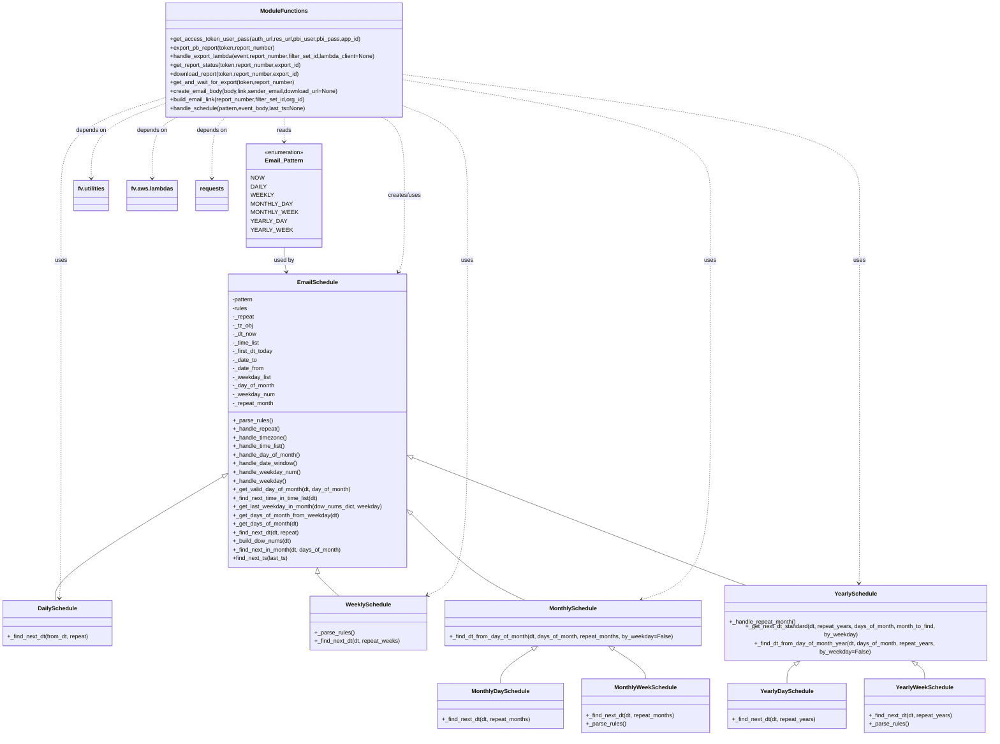

# Diagram: shipment_core/chromium_export/fv/python/fv/utilities/pbi.py

> Auto-generated by Obscura crawlers

## Mermaid

### SVG

<svg id="container" width="2726.23828125" xmlns="http://www.w3.org/2000/svg" class="classDiagram" height="2010" viewBox="0 0 2726.23828125 2010" role="graphics-document document" aria-roledescription="class"><g><defs><marker id="container_class-aggregationStart" class="marker aggregation class" refX="18" refY="7" markerWidth="190" markerHeight="240" orient="auto"><path d="M 18,7 L9,13 L1,7 L9,1 Z"></path></marker></defs><defs><marker id="container_class-aggregationEnd" class="marker aggregation class" refX="1" refY="7" markerWidth="20" markerHeight="28" orient="auto"><path d="M 18,7 L9,13 L1,7 L9,1 Z"></path></marker></defs><defs><marker id="container_class-extensionStart" class="marker extension class" refX="18" refY="7" markerWidth="190" markerHeight="240" orient="auto"><path d="M 1,7 L18,13 V 1 Z"></path></marker></defs><defs><marker id="container_class-extensionEnd" class="marker extension class" refX="1" refY="7" markerWidth="20" markerHeight="28" orient="auto"><path d="M 1,1 V 13 L18,7 Z"></path></marker></defs><defs><marker id="container_class-compositionStart" class="marker composition class" refX="18" refY="7" markerWidth="190" markerHeight="240" orient="auto"><path d="M 18,7 L9,13 L1,7 L9,1 Z"></path></marker></defs><defs><marker id="container_class-compositionEnd" class="marker composition class" refX="1" refY="7" markerWidth="20" markerHeight="28" orient="auto"><path d="M 18,7 L9,13 L1,7 L9,1 Z"></path></marker></defs><defs><marker id="container_class-dependencyStart" class="marker dependency class" refX="6" refY="7" markerWidth="190" markerHeight="240" orient="auto"><path d="M 5,7 L9,13 L1,7 L9,1 Z"></path></marker></defs><defs><marker id="container_class-dependencyEnd" class="marker dependency class" refX="13" refY="7" markerWidth="20" markerHeight="28" orient="auto"><path d="M 18,7 L9,13 L14,7 L9,1 Z"></path></marker></defs><defs><marker id="container_class-lollipopStart" class="marker lollipop class" refX="13" refY="7" markerWidth="190" markerHeight="240" orient="auto"><circle stroke="black" fill="transparent" cx="7" cy="7" r="6"></circle></marker></defs><defs><marker id="container_class-lollipopEnd" class="marker lollipop class" refX="1" refY="7" markerWidth="190" markerHeight="240" orient="auto"><circle stroke="black" fill="transparent" cx="7" cy="7" r="6"></circle></marker></defs><g class="root"><g class="clusters"></g><g class="edgePaths"><path d="M601.565,1328.79L526.364,1374.491C451.163,1420.193,300.761,1511.597,226.29,1565.465C151.818,1619.333,153.276,1635.667,154.005,1643.833L154.734,1652" id="id_EmailSchedule_DailySchedule_1" class="edge-thickness-normal edge-pattern-solid relation" style=";;;" data-edge="true" data-et="edge" data-id="id_EmailSchedule_DailySchedule_1" data-points="W3sieCI6NjE2LjMwNjY0MDYyNSwieSI6MTMxOS44MzA5NzM1NjA0OTI4fSx7IngiOjE1MC4zNTkzNzUsInkiOjE2MDN9LHsieCI6MTU0LjczNDM3NSwieSI6MTY1Mn1d" marker-start="url(#container_class-extensionStart)"></path><path d="M862.85,1595.25L862.85,1596.542C862.85,1597.833,862.85,1600.417,870.6,1607.875C878.351,1615.333,893.853,1627.667,901.604,1633.833L909.354,1640" id="id_EmailSchedule_WeeklySchedule_2" class="edge-thickness-normal edge-pattern-solid relation" style=";;;" data-edge="true" data-et="edge" data-id="id_EmailSchedule_WeeklySchedule_2" data-points="W3sieCI6ODYyLjg0OTYwOTM3NSwieSI6MTU3OH0seyJ4Ijo4NjIuODQ5NjA5Mzc1LCJ5IjoxNjAzfSx7IngiOjkwOS4zNTQ0NzQ3NDg4ODQsInkiOjE2NDB9XQ==" marker-start="url(#container_class-extensionStart)"></path><path d="M1121.608,1428.02L1150.854,1457.183C1180.101,1486.347,1238.594,1544.673,1287.781,1582.003C1336.968,1619.333,1376.849,1635.667,1396.789,1643.833L1416.73,1652" id="id_EmailSchedule_MonthlySchedule_3" class="edge-thickness-normal edge-pattern-solid relation" style=";;;" data-edge="true" data-et="edge" data-id="id_EmailSchedule_MonthlySchedule_3" data-points="W3sieCI6MTEwOS4zOTI1NzgxMjUsInkiOjE0MTUuODM5OTIyNjM3NTIwOX0seyJ4IjoxMjk3LjA4Nzg5MDYyNSwieSI6MTYwM30seyJ4IjoxNDE2LjcyOTYxNDI1NzgxMjUsInkiOjE2NTJ9XQ==" marker-start="url(#container_class-extensionStart)"></path><path d="M1441.775,1786.361L1429.552,1793.134C1417.329,1799.907,1392.883,1813.454,1380.66,1826.393C1368.438,1839.333,1368.438,1851.667,1368.438,1857.833L1368.438,1864" id="id_MonthlySchedule_MonthlyDaySchedule_4" class="edge-thickness-normal edge-pattern-solid relation" style=";;;" data-edge="true" data-et="edge" data-id="id_MonthlySchedule_MonthlyDaySchedule_4" data-points="W3sieCI6MTQ1Ni44NjM3Njk1MzEyNSwieSI6MTc3OH0seyJ4IjoxMzY4LjQzNzUsInkiOjE4Mjd9LHsieCI6MTM2OC40Mzc1LCJ5IjoxODY0fV0=" marker-start="url(#container_class-extensionStart)"></path><path d="M1699.334,1786.361L1711.557,1793.134C1723.78,1799.907,1748.226,1813.454,1760.449,1824.393C1772.672,1835.333,1772.672,1843.667,1772.672,1847.833L1772.672,1852" id="id_MonthlySchedule_MonthlyWeekSchedule_5" class="edge-thickness-normal edge-pattern-solid relation" style=";;;" data-edge="true" data-et="edge" data-id="id_MonthlySchedule_MonthlyWeekSchedule_5" data-points="W3sieCI6MTY4NC4yNDU2MDU0Njg3NSwieSI6MTc3OH0seyJ4IjoxNzcyLjY3MTg3NSwieSI6MTgyN30seyJ4IjoxNzcyLjY3MTg3NSwieSI6MTg1Mn1d" marker-start="url(#container_class-extensionStart)"></path><path d="M1125.474,1271.899L1267.699,1327.082C1409.924,1382.266,1694.374,1492.633,1850.6,1551.983C2006.826,1611.333,2034.827,1619.667,2048.828,1623.833L2062.829,1628" id="id_EmailSchedule_YearlySchedule_6" class="edge-thickness-normal edge-pattern-solid relation" style=";;;" data-edge="true" data-et="edge" data-id="id_EmailSchedule_YearlySchedule_6" data-points="W3sieCI6MTEwOS4zOTI1NzgxMjUsInkiOjEyNjUuNjU5MDgwOTI1MjcwMn0seyJ4IjoxOTc4LjgyNDIxODc1LCJ5IjoxNjAzfSx7IngiOjIwNjIuODI4NjQ4MTU4NDgyMywieSI6MTYyOH1d" marker-start="url(#container_class-extensionStart)"></path><path d="M2192.565,1810.753L2187.967,1813.461C2183.369,1816.169,2174.173,1821.584,2169.575,1830.459C2164.977,1839.333,2164.977,1851.667,2164.977,1857.833L2164.977,1864" id="id_YearlySchedule_YearlyDaySchedule_7" class="edge-thickness-normal edge-pattern-solid relation" style=";;;" data-edge="true" data-et="edge" data-id="id_YearlySchedule_YearlyDaySchedule_7" data-points="W3sieCI6MjIwNy40MjkxMjk0NjQyODYsInkiOjE4MDJ9LHsieCI6MjE2NC45NzY1NjI1LCJ5IjoxODI3fSx7IngiOjIxNjQuOTc2NTYyNSwieSI6MTg2NH1d" marker-start="url(#container_class-extensionStart)"></path><path d="M2517.763,1810.753L2522.361,1813.461C2526.959,1816.169,2536.155,1821.584,2540.753,1828.459C2545.352,1835.333,2545.352,1843.667,2545.352,1847.833L2545.352,1852" id="id_YearlySchedule_YearlyWeekSchedule_8" class="edge-thickness-normal edge-pattern-solid relation" style=";;;" data-edge="true" data-et="edge" data-id="id_YearlySchedule_YearlyWeekSchedule_8" data-points="W3sieCI6MjUwMi44OTg5OTU1MzU3MTQsInkiOjE4MDJ9LHsieCI6MjU0NS4zNTE1NjI1LCJ5IjoxODI3fSx7IngiOjI1NDUuMzUxNTYyNSwieSI6MTg1Mn1d" marker-start="url(#container_class-extensionStart)"></path><path d="M773.52,688L773.52,694.167C773.52,700.333,773.52,712.667,774.561,724.02C775.602,735.372,777.684,745.745,778.725,750.931L779.766,756.117" id="id_Email_Pattern_EmailSchedule_9" class="edge-thickness-normal edge-pattern-solid relation" style=";;;" data-edge="true" data-et="edge" data-id="id_Email_Pattern_EmailSchedule_9" data-points="W3sieCI6NzczLjUxOTUzMTI1LCJ5Ijo2ODh9LHsieCI6NzczLjUxOTUzMTI1LCJ5Ijo3MjV9LHsieCI6NzgwLjk0Njk3NTk0ODAzMzcsInkiOjc2Mn1d" marker-end="url(#container_class-dependencyEnd)"></path><path d="M1040.824,326L1051.192,332.167C1061.559,338.333,1082.293,350.667,1092.66,387C1103.027,423.333,1103.027,483.667,1103.027,544C1103.027,604.333,1103.027,664.667,1100.174,700.12C1097.321,735.573,1091.614,746.147,1088.761,751.433L1085.907,756.72" id="id_ModuleFunctions_EmailSchedule_10" class="edge-thickness-normal edge-pattern-dashed relation" style=";;;" data-edge="true" data-et="edge" data-id="id_ModuleFunctions_EmailSchedule_10" data-points="W3sieCI6MTA0MC44MjQzMzgzMjkwODE3LCJ5IjozMjZ9LHsieCI6MTEwMy4wMjczNDM3NSwieSI6MzYzfSx7IngiOjExMDMuMDI3MzQzNzUsInkiOjU0NH0seyJ4IjoxMTAzLjAyNzM0Mzc1LCJ5Ijo3MjV9LHsieCI6MTA4My4wNTc1MDk2NTU4OTksInkiOjc2Mn1d" marker-end="url(#container_class-dependencyEnd)"></path><path d="M773.52,326L773.52,332.167C773.52,338.333,773.52,350.667,773.52,362C773.52,373.333,773.52,383.667,773.52,388.833L773.52,394" id="id_ModuleFunctions_Email_Pattern_11" class="edge-thickness-normal edge-pattern-dashed relation" style=";;;" data-edge="true" data-et="edge" data-id="id_ModuleFunctions_Email_Pattern_11" data-points="W3sieCI6NzczLjUxOTUzMTI1LCJ5IjozMjZ9LHsieCI6NzczLjUxOTUzMTI1LCJ5IjozNjN9LHsieCI6NzczLjUxOTUzMTI1LCJ5Ijo0MDB9XQ==" marker-end="url(#container_class-dependencyEnd)"></path><path d="M1108.059,208.196L1317.576,233.997C1527.094,259.797,1946.129,311.399,2155.646,367.366C2365.164,423.333,2365.164,483.667,2365.164,544C2365.164,604.333,2365.164,664.667,2365.164,769C2365.164,873.333,2365.164,1021.667,2365.164,1168C2365.164,1314.333,2365.164,1458.667,2364.881,1534.004C2364.598,1609.341,2364.032,1615.683,2363.749,1618.853L2363.466,1622.024" id="id_ModuleFunctions_YearlySchedule_12" class="edge-thickness-normal edge-pattern-dashed relation" style=";;;" data-edge="true" data-et="edge" data-id="id_ModuleFunctions_YearlySchedule_12" data-points="W3sieCI6MTEwOC4wNTg1OTM3NSwieSI6MjA4LjE5NjE2ODQ2NzY1NzAzfSx7IngiOjIzNjUuMTY0MDYyNSwieSI6MzYzfSx7IngiOjIzNjUuMTY0MDYyNSwieSI6NTQ0fSx7IngiOjIzNjUuMTY0MDYyNSwieSI6NzI1fSx7IngiOjIzNjUuMTY0MDYyNSwieSI6MTE3MH0seyJ4IjoyMzY1LjE2NDA2MjUsInkiOjE2MDN9LHsieCI6MjM2Mi45MzE5MTk2NDI4NTczLCJ5IjoxNjI4fV0=" marker-end="url(#container_class-dependencyEnd)"></path><path d="M1108.059,222.623L1248.771,246.02C1389.483,269.416,1670.908,316.208,1811.62,369.771C1952.332,423.333,1952.332,483.667,1952.332,544C1952.332,604.333,1952.332,664.667,1952.332,769C1952.332,873.333,1952.332,1021.667,1952.332,1168C1952.332,1314.333,1952.332,1458.667,1925.454,1538.718C1898.575,1618.77,1844.819,1634.541,1817.94,1642.426L1791.062,1650.311" id="id_ModuleFunctions_MonthlySchedule_13" class="edge-thickness-normal edge-pattern-dashed relation" style=";;;" data-edge="true" data-et="edge" data-id="id_ModuleFunctions_MonthlySchedule_13" data-points="W3sieCI6MTEwOC4wNTg1OTM3NSwieSI6MjIyLjYyMzQ4MjMxODAxMDd9LHsieCI6MTk1Mi4zMzIwMzEyNSwieSI6MzYzfSx7IngiOjE5NTIuMzMyMDMxMjUsInkiOjU0NH0seyJ4IjoxOTUyLjMzMjAzMTI1LCJ5Ijo3MjV9LHsieCI6MTk1Mi4zMzIwMzEyNSwieSI6MTE3MH0seyJ4IjoxOTUyLjMzMjAzMTI1LCJ5IjoxNjAzfSx7IngiOjE3ODUuMzA0NDQzMzU5Mzc1LCJ5IjoxNjUyfV0=" marker-end="url(#container_class-dependencyEnd)"></path><path d="M1108.059,297.21L1136.23,308.175C1164.402,319.14,1220.745,341.07,1248.916,382.202C1277.088,423.333,1277.088,483.667,1277.088,544C1277.088,604.333,1277.088,664.667,1277.088,769C1277.088,873.333,1277.088,1021.667,1277.088,1168C1277.088,1314.333,1277.088,1458.667,1259.374,1538.088C1241.661,1617.509,1206.233,1632.019,1188.52,1639.274L1170.806,1646.528" id="id_ModuleFunctions_WeeklySchedule_14" class="edge-thickness-normal edge-pattern-dashed relation" style=";;;" data-edge="true" data-et="edge" data-id="id_ModuleFunctions_WeeklySchedule_14" data-points="W3sieCI6MTEwOC4wNTg1OTM3NSwieSI6Mjk3LjIxMDA0MDA2NTYyNTQ0fSx7IngiOjEyNzcuMDg3ODkwNjI1LCJ5IjozNjN9LHsieCI6MTI3Ny4wODc4OTA2MjUsInkiOjU0NH0seyJ4IjoxMjc3LjA4Nzg5MDYyNSwieSI6NzI1fSx7IngiOjEyNzcuMDg3ODkwNjI1LCJ5IjoxMTcwfSx7IngiOjEyNzcuMDg3ODkwNjI1LCJ5IjoxNjAzfSx7IngiOjExNjUuMjUzOTA2MjUsInkiOjE2NDguODAyMjkyNjExNTA2fV0=" marker-end="url(#container_class-dependencyEnd)"></path><path d="M438.98,275.71L394.21,290.258C349.44,304.807,259.9,333.903,215.13,378.618C170.359,423.333,170.359,483.667,170.359,544C170.359,604.333,170.359,664.667,170.359,769C170.359,873.333,170.359,1021.667,170.359,1168C170.359,1314.333,170.359,1458.667,169.719,1538.004C169.079,1617.341,167.798,1631.683,167.158,1638.853L166.518,1646.024" id="id_ModuleFunctions_DailySchedule_15" class="edge-thickness-normal edge-pattern-dashed relation" style=";;;" data-edge="true" data-et="edge" data-id="id_ModuleFunctions_DailySchedule_15" data-points="W3sieCI6NDM4Ljk4MDQ2ODc1LCJ5IjoyNzUuNzEwMTkxNzYzNDMzNX0seyJ4IjoxNzAuMzU5Mzc1LCJ5IjozNjN9LHsieCI6MTcwLjM1OTM3NSwieSI6NTQ0fSx7IngiOjE3MC4zNTkzNzUsInkiOjcyNX0seyJ4IjoxNzAuMzU5Mzc1LCJ5IjoxMTcwfSx7IngiOjE3MC4zNTkzNzUsInkiOjE2MDN9LHsieCI6MTY1Ljk4NDM3NSwieSI6MTY1Mn1d" marker-end="url(#container_class-dependencyEnd)"></path><path d="M438.98,293.214L408.152,304.845C377.323,316.476,315.665,339.738,284.837,373.536C254.008,407.333,254.008,451.667,254.008,473.833L254.008,496" id="id_ModuleFunctions_fv.utilities_16" class="edge-thickness-normal edge-pattern-dashed relation" style=";;;" data-edge="true" data-et="edge" data-id="id_ModuleFunctions_fv.utilities_16" data-points="W3sieCI6NDM4Ljk4MDQ2ODc1LCJ5IjoyOTMuMjE0MDA4MDQ1NDE1MjZ9LHsieCI6MjU0LjAwNzgxMjUsInkiOjM2M30seyJ4IjoyNTQuMDA3ODEyNSwieSI6NTAyfV0=" marker-end="url(#container_class-dependencyEnd)"></path><path d="M487.186,326L476.081,332.167C464.975,338.333,442.765,350.667,431.66,379C420.555,407.333,420.555,451.667,420.555,473.833L420.555,496" id="id_ModuleFunctions_fv.aws.lambdas_17" class="edge-thickness-normal edge-pattern-dashed relation" style=";;;" data-edge="true" data-et="edge" data-id="id_ModuleFunctions_fv.aws.lambdas_17" data-points="W3sieCI6NDg3LjE4NTgwNTk2MzAxMDIsInkiOjMyNn0seyJ4Ijo0MjAuNTU0Njg3NSwieSI6MzYzfSx7IngiOjQyMC41NTQ2ODc1LCJ5Ijo1MDJ9XQ==" marker-end="url(#container_class-dependencyEnd)"></path><path d="M618.515,326L612.504,332.167C606.492,338.333,594.469,350.667,588.457,379C582.445,407.333,582.445,451.667,582.445,473.833L582.445,496" id="id_ModuleFunctions_requests_18" class="edge-thickness-normal edge-pattern-dashed relation" style=";;;" data-edge="true" data-et="edge" data-id="id_ModuleFunctions_requests_18" data-points="W3sieCI6NjE4LjUxNTQ0NTYzMTM3NzYsInkiOjMyNn0seyJ4Ijo1ODIuNDQ1MzEyNSwieSI6MzYzfSx7IngiOjU4Mi40NDUzMTI1LCJ5Ijo1MDJ9XQ==" marker-end="url(#container_class-dependencyEnd)"></path></g><g class="edgeLabels"><g class="edgeLabel"><g class="label" data-id="id_EmailSchedule_DailySchedule_1" transform="translate(0, 0)"><foreignObject width="0" height="0">

</foreignObject></g></g><g class="edgeLabel"><g class="label" data-id="id_EmailSchedule_WeeklySchedule_2" transform="translate(0, 0)"><foreignObject width="0" height="0">

</foreignObject></g></g><g class="edgeLabel"><g class="label" data-id="id_EmailSchedule_MonthlySchedule_3" transform="translate(0, 0)"><foreignObject width="0" height="0">

</foreignObject></g></g><g class="edgeLabel"><g class="label" data-id="id_MonthlySchedule_MonthlyDaySchedule_4" transform="translate(0, 0)"><foreignObject width="0" height="0">

</foreignObject></g></g><g class="edgeLabel"><g class="label" data-id="id_MonthlySchedule_MonthlyWeekSchedule_5" transform="translate(0, 0)"><foreignObject width="0" height="0">

</foreignObject></g></g><g class="edgeLabel"><g class="label" data-id="id_EmailSchedule_YearlySchedule_6" transform="translate(0, 0)"><foreignObject width="0" height="0">

</foreignObject></g></g><g class="edgeLabel"><g class="label" data-id="id_YearlySchedule_YearlyDaySchedule_7" transform="translate(0, 0)"><foreignObject width="0" height="0">

</foreignObject></g></g><g class="edgeLabel"><g class="label" data-id="id_YearlySchedule_YearlyWeekSchedule_8" transform="translate(0, 0)"><foreignObject width="0" height="0">

</foreignObject></g></g><g class="edgeLabel" transform="translate(773.51953125, 725)"><g class="label" data-id="id_Email_Pattern_EmailSchedule_9" transform="translate(-28.3125, -12)"><foreignObject width="56.625" height="24">

used by

</foreignObject></g></g><g class="edgeLabel" transform="translate(1103.02734375, 544)"><g class="label" data-id="id_ModuleFunctions_EmailSchedule_10" transform="translate(-46.578125, -12)"><foreignObject width="93.15625" height="24">

creates/uses

</foreignObject></g></g><g class="edgeLabel" transform="translate(773.51953125, 363)"><g class="label" data-id="id_ModuleFunctions_Email_Pattern_11" transform="translate(-20.0078125, -12)"><foreignObject width="40.015625" height="24">

reads

</foreignObject></g></g><g class="edgeLabel" transform="translate(2365.1640625, 725)"><g class="label" data-id="id_ModuleFunctions_YearlySchedule_12" transform="translate(-16.4921875, -12)"><foreignObject width="32.984375" height="24">

uses

</foreignObject></g></g><g class="edgeLabel" transform="translate(1952.33203125, 725)"><g class="label" data-id="id_ModuleFunctions_MonthlySchedule_13" transform="translate(-16.4921875, -12)"><foreignObject width="32.984375" height="24">

uses

</foreignObject></g></g><g class="edgeLabel" transform="translate(1277.087890625, 725)"><g class="label" data-id="id_ModuleFunctions_WeeklySchedule_14" transform="translate(-16.4921875, -12)"><foreignObject width="32.984375" height="24">

uses

</foreignObject></g></g><g class="edgeLabel" transform="translate(170.359375, 725)"><g class="label" data-id="id_ModuleFunctions_DailySchedule_15" transform="translate(-16.4921875, -12)"><foreignObject width="32.984375" height="24">

uses

</foreignObject></g></g><g class="edgeLabel" transform="translate(254.0078125, 363)"><g class="label" data-id="id_ModuleFunctions_fv.utilities_16" transform="translate(-42.9453125, -12)"><foreignObject width="85.890625" height="24">

depends on

</foreignObject></g></g><g class="edgeLabel" transform="translate(420.5546875, 363)"><g class="label" data-id="id_ModuleFunctions_fv.aws.lambdas_17" transform="translate(-42.9453125, -12)"><foreignObject width="85.890625" height="24">

depends on

</foreignObject></g></g><g class="edgeLabel" transform="translate(582.4453125, 363)"><g class="label" data-id="id_ModuleFunctions_requests_18" transform="translate(-42.9453125, -12)"><foreignObject width="85.890625" height="24">

depends on

</foreignObject></g></g></g><g class="nodes"><g class="node default" id="classId-Email_Pattern-0" transform="translate(773.51953125, 544)"><g class="basic label-container"><path d="M-97.08203125 -144 L97.08203125 -144 L97.08203125 144 L-97.08203125 144" stroke="none" stroke-width="0" fill="#ECECFF" style=""></path><path d="M-97.08203125 -144 C-40.00620306902892 -144, 17.06962511194216 -144, 97.08203125 -144 M-97.08203125 -144 C-37.455570207570105 -144, 22.17089083485979 -144, 97.08203125 -144 M97.08203125 -144 C97.08203125 -38.55763664038311, 97.08203125 66.88472671923378, 97.08203125 144 M97.08203125 -144 C97.08203125 -32.442909883618114, 97.08203125 79.11418023276377, 97.08203125 144 M97.08203125 144 C38.73563983604673 144, -19.61075157790654 144, -97.08203125 144 M97.08203125 144 C23.036987597976818 144, -51.008056054046364 144, -97.08203125 144 M-97.08203125 144 C-97.08203125 50.00563552991187, -97.08203125 -43.98872894017626, -97.08203125 -144 M-97.08203125 144 C-97.08203125 60.73894306978444, -97.08203125 -22.52211386043112, -97.08203125 -144" stroke="#9370DB" stroke-width="1.3" fill="none" stroke-dasharray="0 0" style=""></path></g><g class="annotation-group text" transform="translate(-55.5546875, -120)"><g class="label" style="" transform="translate(0,-12)"><foreignObject width="111.109375" height="24">

«enumeration»

</foreignObject></g></g><g class="label-group text" transform="translate(-51.109375, -96)"><g class="label" style="font-weight: bolder" transform="translate(0,-12)"><foreignObject width="102.21875" height="24">

Email_Pattern

</foreignObject></g></g><g class="members-group text" transform="translate(-85.08203125, -48)"><g class="label" style="" transform="translate(0,-12)"><foreignObject width="35.21875" height="24">

NOW

</foreignObject></g><g class="label" style="" transform="translate(0,12)"><foreignObject width="39.375" height="24">

DAILY

</foreignObject></g><g class="label" style="" transform="translate(0,36)"><foreignObject width="55.09375" height="24">

WEEKLY

</foreignObject></g><g class="label" style="" transform="translate(0,60)"><foreignObject width="103.140625" height="24">

MONTHLY_DAY

</foreignObject></g><g class="label" style="" transform="translate(0,84)"><foreignObject width="114.609375" height="24">

MONTHLY_WEEK

</foreignObject></g><g class="label" style="" transform="translate(0,108)"><foreignObject width="85.90625" height="24">

YEARLY_DAY

</foreignObject></g><g class="label" style="" transform="translate(0,132)"><foreignObject width="97.390625" height="24">

YEARLY_WEEK

</foreignObject></g></g><g class="methods-group text" transform="translate(-85.08203125, 144)"></g><g class="divider" style=""><path d="M-97.08203125 -72 C-44.211738324369826 -72, 8.658554601260349 -72, 97.08203125 -72 M-97.08203125 -72 C-22.830988283605848 -72, 51.420054682788304 -72, 97.08203125 -72" stroke="#9370DB" stroke-width="1.3" fill="none" stroke-dasharray="0 0" style=""></path></g><g class="divider" style=""><path d="M-97.08203125 120 C-48.04741613840654 120, 0.9871989731869206 120, 97.08203125 120 M-97.08203125 120 C-47.42343748890905 120, 2.2351562721818965 120, 97.08203125 120" stroke="#9370DB" stroke-width="1.3" fill="none" stroke-dasharray="0 0" style=""></path></g></g><g class="node default" id="classId-EmailSchedule-1" transform="translate(862.849609375, 1170)"><g class="basic label-container"><path d="M-246.54296875 -408 L246.54296875 -408 L246.54296875 408 L-246.54296875 408" stroke="none" stroke-width="0" fill="#ECECFF" style=""></path><path d="M-246.54296875 -408 C-137.6960604178431 -408, -28.849152085686256 -408, 246.54296875 -408 M-246.54296875 -408 C-62.887102971957404 -408, 120.76876280608519 -408, 246.54296875 -408 M246.54296875 -408 C246.54296875 -179.588766429058, 246.54296875 48.822467141883976, 246.54296875 408 M246.54296875 -408 C246.54296875 -238.25560022572773, 246.54296875 -68.51120045145547, 246.54296875 408 M246.54296875 408 C83.21383720550301 408, -80.11529433899398 408, -246.54296875 408 M246.54296875 408 C90.19221051673657 408, -66.15854771652687 408, -246.54296875 408 M-246.54296875 408 C-246.54296875 165.21932012288042, -246.54296875 -77.56135975423916, -246.54296875 -408 M-246.54296875 408 C-246.54296875 196.1878774719511, -246.54296875 -15.624245056097777, -246.54296875 -408" stroke="#9370DB" stroke-width="1.3" fill="none" stroke-dasharray="0 0" style=""></path></g><g class="annotation-group text" transform="translate(0, -384)"></g><g class="label-group text" transform="translate(-53.4765625, -384)"><g class="label" style="font-weight: bolder" transform="translate(0,-12)"><foreignObject width="106.953125" height="24">

EmailSchedule

</foreignObject></g></g><g class="members-group text" transform="translate(-234.54296875, -336)"><g class="label" style="" transform="translate(0,-12)"><foreignObject width="60.09375" height="24">

-pattern

</foreignObject></g><g class="label" style="" transform="translate(0,12)"><foreignObject width="42.75" height="24">

-rules

</foreignObject></g><g class="label" style="" transform="translate(0,36)"><foreignObject width="60.453125" height="24">

-_repeat

</foreignObject></g><g class="label" style="" transform="translate(0,60)"><foreignObject width="57.265625" height="24">

-_tz_obj

</foreignObject></g><g class="label" style="" transform="translate(0,84)"><foreignObject width="67.03125" height="24">

-_dt_now

</foreignObject></g><g class="label" style="" transform="translate(0,108)"><foreignObject width="76.1875" height="24">

-_time_list

</foreignObject></g><g class="label" style="" transform="translate(0,132)"><foreignObject width="113.6875" height="24">

-_first_dt_today

</foreignObject></g><g class="label" style="" transform="translate(0,156)"><foreignObject width="68.265625" height="24">

-_date_to

</foreignObject></g><g class="label" style="" transform="translate(0,180)"><foreignObject width="87.5" height="24">

-_date_from

</foreignObject></g><g class="label" style="" transform="translate(0,204)"><foreignObject width="106.171875" height="24">

-_weekday_list

</foreignObject></g><g class="label" style="" transform="translate(0,228)"><foreignObject width="116.734375" height="24">

-_day_of_month

</foreignObject></g><g class="label" style="" transform="translate(0,252)"><foreignObject width="116.28125" height="24">

-_weekday_num

</foreignObject></g><g class="label" style="" transform="translate(0,276)"><foreignObject width="116.359375" height="24">

-_repeat_month

</foreignObject></g></g><g class="methods-group text" transform="translate(-234.54296875, 0)"><g class="label" style="" transform="translate(0,-12)"><foreignObject width="109.859375" height="24">

+_parse_rules()

</foreignObject></g><g class="label" style="" transform="translate(0,12)"><foreignObject width="130.71875" height="24">

+_handle_repeat()

</foreignObject></g><g class="label" style="" transform="translate(0,36)"><foreignObject width="150.359375" height="24">

+_handle_timezone()

</foreignObject></g><g class="label" style="" transform="translate(0,60)"><foreignObject width="146.4375" height="24">

+_handle_time_list()

</foreignObject></g><g class="label" style="" transform="translate(0,84)"><foreignObject width="186.984375" height="24">

+_handle_day_of_month()

</foreignObject></g><g class="label" style="" transform="translate(0,108)"><foreignObject width="179.390625" height="24">

+_handle_date_window()

</foreignObject></g><g class="label" style="" transform="translate(0,132)"><foreignObject width="186.53125" height="24">

+_handle_weekday_num()

</foreignObject></g><g class="label" style="" transform="translate(0,156)"><foreignObject width="146.296875" height="24">

+_handle_weekday()

</foreignObject></g><g class="label" style="" transform="translate(0,180)"><foreignObject width="329.46875" height="24">

+_get_valid_day_of_month(dt, day_of_month)

</foreignObject></g><g class="label" style="" transform="translate(0,204)"><foreignObject width="242" height="24">

+_find_next_time_in_time_list(dt)

</foreignObject></g><g class="label" style="" transform="translate(0,228)"><foreignObject width="415.609375" height="24">

+_get_last_weekday_in_month(dow_nums_dict, weekday)

</foreignObject></g><g class="label" style="" transform="translate(0,252)"><foreignObject width="295.5" height="24">

+_get_days_of_month_from_weekday(dt)

</foreignObject></g><g class="label" style="" transform="translate(0,276)"><foreignObject width="182.515625" height="24">

+_get_days_of_month(dt)

</foreignObject></g><g class="label" style="" transform="translate(0,300)"><foreignObject width="186.828125" height="24">

+_find_next_dt(dt, repeat)

</foreignObject></g><g class="label" style="" transform="translate(0,324)"><foreignObject width="164.5" height="24">

+_build_dow_nums(dt)

</foreignObject></g><g class="label" style="" transform="translate(0,348)"><foreignObject width="305.703125" height="24">

+_find_next_in_month(dt, days_of_month)

</foreignObject></g><g class="label" style="" transform="translate(0,372)"><foreignObject width="154.96875" height="24">

+find_next_ts(last_ts)

</foreignObject></g></g><g class="divider" style=""><path d="M-246.54296875 -360 C-68.0147874506961 -360, 110.51339384860779 -360, 246.54296875 -360 M-246.54296875 -360 C-126.53176961971077 -360, -6.520570489421544 -360, 246.54296875 -360" stroke="#9370DB" stroke-width="1.3" fill="none" stroke-dasharray="0 0" style=""></path></g><g class="divider" style=""><path d="M-246.54296875 -24 C-130.2684297828815 -24, -13.993890815762995 -24, 246.54296875 -24 M-246.54296875 -24 C-111.41582821813054 -24, 23.711312313738915 -24, 246.54296875 -24" stroke="#9370DB" stroke-width="1.3" fill="none" stroke-dasharray="0 0" style=""></path></g></g><g class="node default" id="classId-DailySchedule-2" transform="translate(160.359375, 1715)"><g class="basic label-container"><path d="M-152.359375 -63 L152.359375 -63 L152.359375 63 L-152.359375 63" stroke="none" stroke-width="0" fill="#ECECFF" style=""></path><path d="M-152.359375 -63 C-73.92047374957345 -63, 4.518427500853107 -63, 152.359375 -63 M-152.359375 -63 C-53.43058676514906 -63, 45.49820146970188 -63, 152.359375 -63 M152.359375 -63 C152.359375 -18.049812399151463, 152.359375 26.900375201697074, 152.359375 63 M152.359375 -63 C152.359375 -17.634680604657916, 152.359375 27.730638790684168, 152.359375 63 M152.359375 63 C31.60808366441293 63, -89.14320767117414 63, -152.359375 63 M152.359375 63 C52.74609201404374 63, -46.86719097191252 63, -152.359375 63 M-152.359375 63 C-152.359375 19.985923292791554, -152.359375 -23.02815341441689, -152.359375 -63 M-152.359375 63 C-152.359375 28.794060415637006, -152.359375 -5.411879168725989, -152.359375 -63" stroke="#9370DB" stroke-width="1.3" fill="none" stroke-dasharray="0 0" style=""></path></g><g class="annotation-group text" transform="translate(0, -39)"></g><g class="label-group text" transform="translate(-51.78125, -39)"><g class="label" style="font-weight: bolder" transform="translate(0,-12)"><foreignObject width="103.5625" height="24">

DailySchedule

</foreignObject></g></g><g class="members-group text" transform="translate(-140.359375, 9)"></g><g class="methods-group text" transform="translate(-140.359375, 39)"><g class="label" style="" transform="translate(0,-12)"><foreignObject width="228.9375" height="24">

+_find_next_dt(from_dt, repeat)

</foreignObject></g></g><g class="divider" style=""><path d="M-152.359375 -15 C-34.898944294218836 -15, 82.56148641156233 -15, 152.359375 -15 M-152.359375 -15 C-36.47536090531982 -15, 79.40865318936036 -15, 152.359375 -15" stroke="#9370DB" stroke-width="1.3" fill="none" stroke-dasharray="0 0" style=""></path></g><g class="divider" style=""><path d="M-152.359375 9 C-40.08836293167201 9, 72.18264913665598 9, 152.359375 9 M-152.359375 9 C-31.1135188891206 9, 90.1323372217588 9, 152.359375 9" stroke="#9370DB" stroke-width="1.3" fill="none" stroke-dasharray="0 0" style=""></path></g></g><g class="node default" id="classId-WeeklySchedule-3" transform="translate(1003.62109375, 1715)"><g class="basic label-container"><path d="M-161.6328125 -75 L161.6328125 -75 L161.6328125 75 L-161.6328125 75" stroke="none" stroke-width="0" fill="#ECECFF" style=""></path><path d="M-161.6328125 -75 C-63.530034436698145 -75, 34.57274362660371 -75, 161.6328125 -75 M-161.6328125 -75 C-76.11038226693685 -75, 9.412047966126295 -75, 161.6328125 -75 M161.6328125 -75 C161.6328125 -34.52650566506067, 161.6328125 5.946988669878664, 161.6328125 75 M161.6328125 -75 C161.6328125 -29.725993111373114, 161.6328125 15.548013777253772, 161.6328125 75 M161.6328125 75 C51.75930486678618 75, -58.11420276642764 75, -161.6328125 75 M161.6328125 75 C34.26103878898165 75, -93.1107349220367 75, -161.6328125 75 M-161.6328125 75 C-161.6328125 32.00175952213247, -161.6328125 -10.996480955735066, -161.6328125 -75 M-161.6328125 75 C-161.6328125 34.643132260707986, -161.6328125 -5.713735478584027, -161.6328125 -75" stroke="#9370DB" stroke-width="1.3" fill="none" stroke-dasharray="0 0" style=""></path></g><g class="annotation-group text" transform="translate(0, -51)"></g><g class="label-group text" transform="translate(-59.953125, -51)"><g class="label" style="font-weight: bolder" transform="translate(0,-12)"><foreignObject width="119.90625" height="24">

WeeklySchedule

</foreignObject></g></g><g class="members-group text" transform="translate(-149.6328125, -3)"></g><g class="methods-group text" transform="translate(-149.6328125, 27)"><g class="label" style="" transform="translate(0,-12)"><foreignObject width="109.859375" height="24">

+_parse_rules()

</foreignObject></g><g class="label" style="" transform="translate(0,12)"><foreignObject width="239.3125" height="24">

+_find_next_dt(dt, repeat_weeks)

</foreignObject></g></g><g class="divider" style=""><path d="M-161.6328125 -27 C-67.26603788064241 -27, 27.10073673871517 -27, 161.6328125 -27 M-161.6328125 -27 C-51.542680996264735 -27, 58.54745050747053 -27, 161.6328125 -27" stroke="#9370DB" stroke-width="1.3" fill="none" stroke-dasharray="0 0" style=""></path></g><g class="divider" style=""><path d="M-161.6328125 -3 C-72.83960161580356 -3, 15.953609268392881 -3, 161.6328125 -3 M-161.6328125 -3 C-72.7476829148844 -3, 16.137446670231213 -3, 161.6328125 -3" stroke="#9370DB" stroke-width="1.3" fill="none" stroke-dasharray="0 0" style=""></path></g></g><g class="node default" id="classId-MonthlySchedule-4" transform="translate(1570.5546875, 1715)"><g class="basic label-container"><path d="M-355.30078125 -63 L355.30078125 -63 L355.30078125 63 L-355.30078125 63" stroke="none" stroke-width="0" fill="#ECECFF" style=""></path><path d="M-355.30078125 -63 C-76.99970442612312 -63, 201.30137239775377 -63, 355.30078125 -63 M-355.30078125 -63 C-187.7079118594274 -63, -20.115042468854824 -63, 355.30078125 -63 M355.30078125 -63 C355.30078125 -25.332991452682364, 355.30078125 12.334017094635271, 355.30078125 63 M355.30078125 -63 C355.30078125 -14.332920023305732, 355.30078125 34.334159953388536, 355.30078125 63 M355.30078125 63 C158.89869275942064 63, -37.50339573115872 63, -355.30078125 63 M355.30078125 63 C186.8240773885511 63, 18.347373527102206 63, -355.30078125 63 M-355.30078125 63 C-355.30078125 37.52374273585249, -355.30078125 12.047485471704974, -355.30078125 -63 M-355.30078125 63 C-355.30078125 14.872337776931673, -355.30078125 -33.255324446136655, -355.30078125 -63" stroke="#9370DB" stroke-width="1.3" fill="none" stroke-dasharray="0 0" style=""></path></g><g class="annotation-group text" transform="translate(0, -39)"></g><g class="label-group text" transform="translate(-63.2890625, -39)"><g class="label" style="font-weight: bolder" transform="translate(0,-12)"><foreignObject width="126.578125" height="24">

MonthlySchedule

</foreignObject></g></g><g class="members-group text" transform="translate(-343.30078125, 9)"></g><g class="methods-group text" transform="translate(-343.30078125, 39)"><g class="label" style="" transform="translate(0,-12)"><foreignObject width="623.3125" height="24">

+_find_dt_from_day_of_month(dt, days_of_month, repeat_months, by_weekday=False)

</foreignObject></g></g><g class="divider" style=""><path d="M-355.30078125 -15 C-201.85454857441016 -15, -48.40831589882032 -15, 355.30078125 -15 M-355.30078125 -15 C-76.39213628817822 -15, 202.51650867364356 -15, 355.30078125 -15" stroke="#9370DB" stroke-width="1.3" fill="none" stroke-dasharray="0 0" style=""></path></g><g class="divider" style=""><path d="M-355.30078125 9 C-86.761996263095 9, 181.77678872381 9, 355.30078125 9 M-355.30078125 9 C-134.49593345432515 9, 86.30891434134969 9, 355.30078125 9" stroke="#9370DB" stroke-width="1.3" fill="none" stroke-dasharray="0 0" style=""></path></g></g><g class="node default" id="classId-MonthlyDaySchedule-5" transform="translate(1368.4375, 1927)"><g class="basic label-container"><path d="M-175.515625 -63 L175.515625 -63 L175.515625 63 L-175.515625 63" stroke="none" stroke-width="0" fill="#ECECFF" style=""></path><path d="M-175.515625 -63 C-102.54568129320013 -63, -29.575737586400265 -63, 175.515625 -63 M-175.515625 -63 C-77.4146302837741 -63, 20.686364432451796 -63, 175.515625 -63 M175.515625 -63 C175.515625 -36.16813366240498, 175.515625 -9.336267324809967, 175.515625 63 M175.515625 -63 C175.515625 -16.296233677355126, 175.515625 30.40753264528975, 175.515625 63 M175.515625 63 C86.19893598737771 63, -3.117753025244582 63, -175.515625 63 M175.515625 63 C62.00422873506051 63, -51.507167529878984 63, -175.515625 63 M-175.515625 63 C-175.515625 15.350392912966456, -175.515625 -32.29921417406709, -175.515625 -63 M-175.515625 63 C-175.515625 29.90984885700869, -175.515625 -3.18030228598262, -175.515625 -63" stroke="#9370DB" stroke-width="1.3" fill="none" stroke-dasharray="0 0" style=""></path></g><g class="annotation-group text" transform="translate(0, -39)"></g><g class="label-group text" transform="translate(-76.828125, -39)"><g class="label" style="font-weight: bolder" transform="translate(0,-12)"><foreignObject width="153.65625" height="24">

MonthlyDaySchedule

</foreignObject></g></g><g class="members-group text" transform="translate(-163.515625, 9)"></g><g class="methods-group text" transform="translate(-163.515625, 39)"><g class="label" style="" transform="translate(0,-12)"><foreignObject width="250.203125" height="24">

+_find_next_dt(dt, repeat_months)

</foreignObject></g></g><g class="divider" style=""><path d="M-175.515625 -15 C-69.9855945846219 -15, 35.544435830756214 -15, 175.515625 -15 M-175.515625 -15 C-59.01005625337022 -15, 57.495512493259554 -15, 175.515625 -15" stroke="#9370DB" stroke-width="1.3" fill="none" stroke-dasharray="0 0" style=""></path></g><g class="divider" style=""><path d="M-175.515625 9 C-43.8091858788101 9, 87.8972532423798 9, 175.515625 9 M-175.515625 9 C-97.17198767412297 9, -18.828350348245948 9, 175.515625 9" stroke="#9370DB" stroke-width="1.3" fill="none" stroke-dasharray="0 0" style=""></path></g></g><g class="node default" id="classId-MonthlyWeekSchedule-6" transform="translate(1772.671875, 1927)"><g class="basic label-container"><path d="M-178.71875 -75 L178.71875 -75 L178.71875 75 L-178.71875 75" stroke="none" stroke-width="0" fill="#ECECFF" style=""></path><path d="M-178.71875 -75 C-39.08359167873428 -75, 100.55156664253144 -75, 178.71875 -75 M-178.71875 -75 C-77.51335960716972 -75, 23.692030785660563 -75, 178.71875 -75 M178.71875 -75 C178.71875 -31.668782612130066, 178.71875 11.662434775739868, 178.71875 75 M178.71875 -75 C178.71875 -29.17276173495553, 178.71875 16.654476530088942, 178.71875 75 M178.71875 75 C96.45902464109982 75, 14.199299282199632 75, -178.71875 75 M178.71875 75 C53.63499632563189 75, -71.44875734873622 75, -178.71875 75 M-178.71875 75 C-178.71875 16.698949933140845, -178.71875 -41.60210013371831, -178.71875 -75 M-178.71875 75 C-178.71875 42.84162686998198, -178.71875 10.683253739963959, -178.71875 -75" stroke="#9370DB" stroke-width="1.3" fill="none" stroke-dasharray="0 0" style=""></path></g><g class="annotation-group text" transform="translate(0, -51)"></g><g class="label-group text" transform="translate(-83.234375, -51)"><g class="label" style="font-weight: bolder" transform="translate(0,-12)"><foreignObject width="166.46875" height="24">

MonthlyWeekSchedule

</foreignObject></g></g><g class="members-group text" transform="translate(-166.71875, -3)"></g><g class="methods-group text" transform="translate(-166.71875, 27)"><g class="label" style="" transform="translate(0,-12)"><foreignObject width="250.203125" height="24">

+_find_next_dt(dt, repeat_months)

</foreignObject></g><g class="label" style="" transform="translate(0,12)"><foreignObject width="109.859375" height="24">

+_parse_rules()

</foreignObject></g></g><g class="divider" style=""><path d="M-178.71875 -27 C-97.0412565246402 -27, -15.363763049280408 -27, 178.71875 -27 M-178.71875 -27 C-49.21783556032014 -27, 80.28307887935972 -27, 178.71875 -27" stroke="#9370DB" stroke-width="1.3" fill="none" stroke-dasharray="0 0" style=""></path></g><g class="divider" style=""><path d="M-178.71875 -3 C-60.990910666754345 -3, 56.73692866649131 -3, 178.71875 -3 M-178.71875 -3 C-62.610167135334635 -3, 53.49841572933073 -3, 178.71875 -3" stroke="#9370DB" stroke-width="1.3" fill="none" stroke-dasharray="0 0" style=""></path></g></g><g class="node default" id="classId-YearlySchedule-7" transform="translate(2355.1640625, 1715)"><g class="basic label-container"><path d="M-363.07421875 -87 L363.07421875 -87 L363.07421875 87 L-363.07421875 87" stroke="none" stroke-width="0" fill="#ECECFF" style=""></path><path d="M-363.07421875 -87 C-154.88337591450465 -87, 53.30746692099069 -87, 363.07421875 -87 M-363.07421875 -87 C-75.13682095037376 -87, 212.80057684925248 -87, 363.07421875 -87 M363.07421875 -87 C363.07421875 -32.65336838602456, 363.07421875 21.69326322795088, 363.07421875 87 M363.07421875 -87 C363.07421875 -41.78562298512426, 363.07421875 3.428754029751474, 363.07421875 87 M363.07421875 87 C207.32762637810205 87, 51.581034006204106 87, -363.07421875 87 M363.07421875 87 C159.61644588532553 87, -43.841326979348935 87, -363.07421875 87 M-363.07421875 87 C-363.07421875 35.5226423457708, -363.07421875 -15.954715308458404, -363.07421875 -87 M-363.07421875 87 C-363.07421875 25.82399020666785, -363.07421875 -35.3520195866643, -363.07421875 -87" stroke="#9370DB" stroke-width="1.3" fill="none" stroke-dasharray="0 0" style=""></path></g><g class="annotation-group text" transform="translate(0, -63)"></g><g class="label-group text" transform="translate(-56.1640625, -63)"><g class="label" style="font-weight: bolder" transform="translate(0,-12)"><foreignObject width="112.328125" height="24">

YearlySchedule

</foreignObject></g></g><g class="members-group text" transform="translate(-351.07421875, -15)"></g><g class="methods-group text" transform="translate(-351.07421875, 15)"><g class="label" style="" transform="translate(0,-12)"><foreignObject width="186.609375" height="24">

+_handle_repeat_month()

</foreignObject></g><g class="label" style="" transform="translate(0,12)"><foreignObject width="630.71875" height="24">

+_get_next_dt_standard(dt, repeat_years, days_of_month, month_to_find, by_weekday)

</foreignObject></g><g class="label" style="" transform="translate(0,36)"><foreignObject width="645.984375" height="24">

+_find_dt_from_day_of_month_year(dt, days_of_month, repeat_years, by_weekday=False)

</foreignObject></g></g><g class="divider" style=""><path d="M-363.07421875 -39 C-161.78746747070758 -39, 39.499283808584835 -39, 363.07421875 -39 M-363.07421875 -39 C-159.92754880182395 -39, 43.21912114635211 -39, 363.07421875 -39" stroke="#9370DB" stroke-width="1.3" fill="none" stroke-dasharray="0 0" style=""></path></g><g class="divider" style=""><path d="M-363.07421875 -15 C-79.57641978853792 -15, 203.92137917292416 -15, 363.07421875 -15 M-363.07421875 -15 C-110.14977522069549 -15, 142.77466830860902 -15, 363.07421875 -15" stroke="#9370DB" stroke-width="1.3" fill="none" stroke-dasharray="0 0" style=""></path></g></g><g class="node default" id="classId-YearlyDaySchedule-8" transform="translate(2164.9765625, 1927)"><g class="basic label-container"><path d="M-163.5859375 -63 L163.5859375 -63 L163.5859375 63 L-163.5859375 63" stroke="none" stroke-width="0" fill="#ECECFF" style=""></path><path d="M-163.5859375 -63 C-82.26543121985102 -63, -0.944924939702048 -63, 163.5859375 -63 M-163.5859375 -63 C-63.461270241768915 -63, 36.66339701646217 -63, 163.5859375 -63 M163.5859375 -63 C163.5859375 -14.867859257698761, 163.5859375 33.26428148460248, 163.5859375 63 M163.5859375 -63 C163.5859375 -30.28947792578179, 163.5859375 2.4210441484364225, 163.5859375 63 M163.5859375 63 C76.10630089022312 63, -11.37333571955375 63, -163.5859375 63 M163.5859375 63 C77.25455057179884 63, -9.07683635640231 63, -163.5859375 63 M-163.5859375 63 C-163.5859375 36.743369458900034, -163.5859375 10.486738917800075, -163.5859375 -63 M-163.5859375 63 C-163.5859375 24.364573971902622, -163.5859375 -14.270852056194755, -163.5859375 -63" stroke="#9370DB" stroke-width="1.3" fill="none" stroke-dasharray="0 0" style=""></path></g><g class="annotation-group text" transform="translate(0, -39)"></g><g class="label-group text" transform="translate(-69.703125, -39)"><g class="label" style="font-weight: bolder" transform="translate(0,-12)"><foreignObject width="139.40625" height="24">

YearlyDaySchedule

</foreignObject></g></g><g class="members-group text" transform="translate(-151.5859375, 9)"></g><g class="methods-group text" transform="translate(-151.5859375, 39)"><g class="label" style="" transform="translate(0,-12)"><foreignObject width="233.46875" height="24">

+_find_next_dt(dt, repeat_years)

</foreignObject></g></g><g class="divider" style=""><path d="M-163.5859375 -15 C-38.73079340255559 -15, 86.12435069488882 -15, 163.5859375 -15 M-163.5859375 -15 C-84.33499001584704 -15, -5.084042531694081 -15, 163.5859375 -15" stroke="#9370DB" stroke-width="1.3" fill="none" stroke-dasharray="0 0" style=""></path></g><g class="divider" style=""><path d="M-163.5859375 9 C-40.738516449961224 9, 82.10890460007755 9, 163.5859375 9 M-163.5859375 9 C-82.8338927341875 9, -2.0818479683750013 9, 163.5859375 9" stroke="#9370DB" stroke-width="1.3" fill="none" stroke-dasharray="0 0" style=""></path></g></g><g class="node default" id="classId-YearlyWeekSchedule-9" transform="translate(2545.3515625, 1927)"><g class="basic label-container"><path d="M-166.7890625 -75 L166.7890625 -75 L166.7890625 75 L-166.7890625 75" stroke="none" stroke-width="0" fill="#ECECFF" style=""></path><path d="M-166.7890625 -75 C-34.39096740033585 -75, 98.0071276993283 -75, 166.7890625 -75 M-166.7890625 -75 C-66.70858876790392 -75, 33.37188496419216 -75, 166.7890625 -75 M166.7890625 -75 C166.7890625 -27.872676906166625, 166.7890625 19.25464618766675, 166.7890625 75 M166.7890625 -75 C166.7890625 -33.30769686914242, 166.7890625 8.384606261715163, 166.7890625 75 M166.7890625 75 C77.31551736449417 75, -12.15802777101166 75, -166.7890625 75 M166.7890625 75 C52.76927761451134 75, -61.25050727097732 75, -166.7890625 75 M-166.7890625 75 C-166.7890625 23.696871502104443, -166.7890625 -27.606256995791114, -166.7890625 -75 M-166.7890625 75 C-166.7890625 32.62517358384725, -166.7890625 -9.7496528323055, -166.7890625 -75" stroke="#9370DB" stroke-width="1.3" fill="none" stroke-dasharray="0 0" style=""></path></g><g class="annotation-group text" transform="translate(0, -51)"></g><g class="label-group text" transform="translate(-76.109375, -51)"><g class="label" style="font-weight: bolder" transform="translate(0,-12)"><foreignObject width="152.21875" height="24">

YearlyWeekSchedule

</foreignObject></g></g><g class="members-group text" transform="translate(-154.7890625, -3)"></g><g class="methods-group text" transform="translate(-154.7890625, 27)"><g class="label" style="" transform="translate(0,-12)"><foreignObject width="233.46875" height="24">

+_find_next_dt(dt, repeat_years)

</foreignObject></g><g class="label" style="" transform="translate(0,12)"><foreignObject width="109.859375" height="24">

+_parse_rules()

</foreignObject></g></g><g class="divider" style=""><path d="M-166.7890625 -27 C-39.370363096480574 -27, 88.04833630703885 -27, 166.7890625 -27 M-166.7890625 -27 C-76.5137993353065 -27, 13.761463829386997 -27, 166.7890625 -27" stroke="#9370DB" stroke-width="1.3" fill="none" stroke-dasharray="0 0" style=""></path></g><g class="divider" style=""><path d="M-166.7890625 -3 C-51.630195327258406 -3, 63.52867184548319 -3, 166.7890625 -3 M-166.7890625 -3 C-88.8758515557629 -3, -10.962640611525813 -3, 166.7890625 -3" stroke="#9370DB" stroke-width="1.3" fill="none" stroke-dasharray="0 0" style=""></path></g></g><g class="node default" id="classId-ModuleFunctions-10" transform="translate(773.51953125, 167)"><g class="basic label-container"><path d="M-334.5390625 -159 L334.5390625 -159 L334.5390625 159 L-334.5390625 159" stroke="none" stroke-width="0" fill="#ECECFF" style=""></path><path d="M-334.5390625 -159 C-137.0139839427114 -159, 60.51109461457719 -159, 334.5390625 -159 M-334.5390625 -159 C-107.77035696436087 -159, 118.99834857127826 -159, 334.5390625 -159 M334.5390625 -159 C334.5390625 -87.97163317951403, 334.5390625 -16.94326635902806, 334.5390625 159 M334.5390625 -159 C334.5390625 -82.88441485807057, 334.5390625 -6.768829716141141, 334.5390625 159 M334.5390625 159 C142.38442278964786 159, -49.770216920704286 159, -334.5390625 159 M334.5390625 159 C111.04970615493309 159, -112.43965019013382 159, -334.5390625 159 M-334.5390625 159 C-334.5390625 91.72544080588017, -334.5390625 24.450881611760337, -334.5390625 -159 M-334.5390625 159 C-334.5390625 66.25910013707939, -334.5390625 -26.481799725841228, -334.5390625 -159" stroke="#9370DB" stroke-width="1.3" fill="none" stroke-dasharray="0 0" style=""></path></g><g class="annotation-group text" transform="translate(0, -135)"></g><g class="label-group text" transform="translate(-62.21875, -135)"><g class="label" style="font-weight: bolder" transform="translate(0,-12)"><foreignObject width="124.4375" height="24">

ModuleFunctions

</foreignObject></g></g><g class="members-group text" transform="translate(-322.5390625, -87)"></g><g class="methods-group text" transform="translate(-322.5390625, -57)"><g class="label" style="" transform="translate(0,-12)"><foreignObject width="526.6875" height="24">

+get_access_token_user_pass(auth_url,res_url,pbi_user,pbi_pass,app_id)

</foreignObject></g><g class="label" style="" transform="translate(0,12)"><foreignObject width="301.234375" height="24">

+export_pb_report(token,report_number)

</foreignObject></g><g class="label" style="" transform="translate(0,36)"><foreignObject width="582.859375" height="24">

+handle_export_lambda(event,report_number,filter_set_id,lambda_client=None)

</foreignObject></g><g class="label" style="" transform="translate(0,60)"><foreignObject width="374.3125" height="24">

+get_report_status(token,report_number,export_id)

</foreignObject></g><g class="label" style="" transform="translate(0,84)"><foreignObject width="370.859375" height="24">

+download_report(token,report_number,export_id)

</foreignObject></g><g class="label" style="" transform="translate(0,108)"><foreignObject width="352.609375" height="24">

+get_and_wait_for_export(token,report_number)

</foreignObject></g><g class="label" style="" transform="translate(0,132)"><foreignObject width="473.265625" height="24">

+create_email_body(body,link,sender_email,download_url=None)

</foreignObject></g><g class="label" style="" transform="translate(0,156)"><foreignObject width="387.265625" height="24">

+build_email_link(report_number,filter_set_id,org_id)

</foreignObject></g><g class="label" style="" transform="translate(0,180)"><foreignObject width="381.609375" height="24">

+handle_schedule(pattern,event_body,last_ts=None)

</foreignObject></g></g><g class="divider" style=""><path d="M-334.5390625 -111 C-137.1354779345816 -111, 60.268106630836826 -111, 334.5390625 -111 M-334.5390625 -111 C-144.07330300744445 -111, 46.3924564851111 -111, 334.5390625 -111" stroke="#9370DB" stroke-width="1.3" fill="none" stroke-dasharray="0 0" style=""></path></g><g class="divider" style=""><path d="M-334.5390625 -87 C-135.0580303195038 -87, 64.42300186099237 -87, 334.5390625 -87 M-334.5390625 -87 C-117.93808872430634 -87, 98.66288505138732 -87, 334.5390625 -87" stroke="#9370DB" stroke-width="1.3" fill="none" stroke-dasharray="0 0" style=""></path></g></g><g class="node default" id="classId-fv.utilities-11" transform="translate(254.0078125, 544)"><g class="basic label-container"><path d="M-48.6484375 -42 L48.6484375 -42 L48.6484375 42 L-48.6484375 42" stroke="none" stroke-width="0" fill="#ECECFF" style=""></path><path d="M-48.6484375 -42 C-19.654855348386963 -42, 9.338726803226074 -42, 48.6484375 -42 M-48.6484375 -42 C-28.78864955130494 -42, -8.928861602609878 -42, 48.6484375 -42 M48.6484375 -42 C48.6484375 -23.709058065562512, 48.6484375 -5.418116131125025, 48.6484375 42 M48.6484375 -42 C48.6484375 -22.563845010441106, 48.6484375 -3.1276900208822127, 48.6484375 42 M48.6484375 42 C28.62914873723846 42, 8.609859974476919 42, -48.6484375 42 M48.6484375 42 C11.458076802292027 42, -25.732283895415947 42, -48.6484375 42 M-48.6484375 42 C-48.6484375 10.937007253551709, -48.6484375 -20.125985492896582, -48.6484375 -42 M-48.6484375 42 C-48.6484375 9.784529963879933, -48.6484375 -22.430940072240134, -48.6484375 -42" stroke="#9370DB" stroke-width="1.3" fill="none" stroke-dasharray="0 0" style=""></path></g><g class="annotation-group text" transform="translate(0, -18)"></g><g class="label-group text" transform="translate(-36.6484375, -18)"><g class="label" style="font-weight: bolder" transform="translate(0,-12)"><foreignObject width="73.296875" height="24">

fv.utilities

</foreignObject></g></g><g class="members-group text" transform="translate(-36.6484375, 30)"></g><g class="methods-group text" transform="translate(-36.6484375, 60)"></g><g class="divider" style=""><path d="M-48.6484375 6 C-15.84112677278695 6, 16.9661839544261 6, 48.6484375 6 M-48.6484375 6 C-10.692103623446279 6, 27.264230253107442 6, 48.6484375 6" stroke="#9370DB" stroke-width="1.3" fill="none" stroke-dasharray="0 0" style=""></path></g><g class="divider" style=""><path d="M-48.6484375 24 C-13.330948916781686 24, 21.986539666436627 24, 48.6484375 24 M-48.6484375 24 C-16.815482849852106 24, 15.017471800295787 24, 48.6484375 24" stroke="#9370DB" stroke-width="1.3" fill="none" stroke-dasharray="0 0" style=""></path></g></g><g class="node default" id="classId-fv.aws.lambdas-12" transform="translate(420.5546875, 544)"><g class="basic label-container"><path d="M-67.8984375 -42 L67.8984375 -42 L67.8984375 42 L-67.8984375 42" stroke="none" stroke-width="0" fill="#ECECFF" style=""></path><path d="M-67.8984375 -42 C-33.55750225259165 -42, 0.7834329948167067 -42, 67.8984375 -42 M-67.8984375 -42 C-22.18213429932444 -42, 23.534168901351123 -42, 67.8984375 -42 M67.8984375 -42 C67.8984375 -25.13866224485347, 67.8984375 -8.277324489706942, 67.8984375 42 M67.8984375 -42 C67.8984375 -23.084364302038512, 67.8984375 -4.168728604077025, 67.8984375 42 M67.8984375 42 C29.93097324245565 42, -8.0364910150887 42, -67.8984375 42 M67.8984375 42 C39.31349823507695 42, 10.728558970153891 42, -67.8984375 42 M-67.8984375 42 C-67.8984375 17.444434305343336, -67.8984375 -7.1111313893133286, -67.8984375 -42 M-67.8984375 42 C-67.8984375 11.55050234234125, -67.8984375 -18.8989953153175, -67.8984375 -42" stroke="#9370DB" stroke-width="1.3" fill="none" stroke-dasharray="0 0" style=""></path></g><g class="annotation-group text" transform="translate(0, -18)"></g><g class="label-group text" transform="translate(-55.8984375, -18)"><g class="label" style="font-weight: bolder" transform="translate(0,-12)"><foreignObject width="111.796875" height="24">

fv.aws.lambdas

</foreignObject></g></g><g class="members-group text" transform="translate(-55.8984375, 30)"></g><g class="methods-group text" transform="translate(-55.8984375, 60)"></g><g class="divider" style=""><path d="M-67.8984375 6 C-38.14099771532622 6, -8.383557930652437 6, 67.8984375 6 M-67.8984375 6 C-39.5798202888157 6, -11.261203077631393 6, 67.8984375 6" stroke="#9370DB" stroke-width="1.3" fill="none" stroke-dasharray="0 0" style=""></path></g><g class="divider" style=""><path d="M-67.8984375 24 C-18.929029701270466 24, 30.04037809745907 24, 67.8984375 24 M-67.8984375 24 C-23.316826678601956 24, 21.26478414279609 24, 67.8984375 24" stroke="#9370DB" stroke-width="1.3" fill="none" stroke-dasharray="0 0" style=""></path></g></g><g class="node default" id="classId-requests-13" transform="translate(582.4453125, 544)"><g class="basic label-container"><path d="M-43.9921875 -42 L43.9921875 -42 L43.9921875 42 L-43.9921875 42" stroke="none" stroke-width="0" fill="#ECECFF" style=""></path><path d="M-43.9921875 -42 C-19.846666279085724 -42, 4.2988549418285515 -42, 43.9921875 -42 M-43.9921875 -42 C-12.562833364261028 -42, 18.866520771477944 -42, 43.9921875 -42 M43.9921875 -42 C43.9921875 -8.818109717894068, 43.9921875 24.363780564211865, 43.9921875 42 M43.9921875 -42 C43.9921875 -12.95403031212414, 43.9921875 16.09193937575172, 43.9921875 42 M43.9921875 42 C9.210683400889607 42, -25.570820698220786 42, -43.9921875 42 M43.9921875 42 C9.999868081624996 42, -23.99245133675001 42, -43.9921875 42 M-43.9921875 42 C-43.9921875 14.992791571838278, -43.9921875 -12.014416856323443, -43.9921875 -42 M-43.9921875 42 C-43.9921875 9.257221085720673, -43.9921875 -23.485557828558655, -43.9921875 -42" stroke="#9370DB" stroke-width="1.3" fill="none" stroke-dasharray="0 0" style=""></path></g><g class="annotation-group text" transform="translate(0, -18)"></g><g class="label-group text" transform="translate(-31.9921875, -18)"><g class="label" style="font-weight: bolder" transform="translate(0,-12)"><foreignObject width="63.984375" height="24">

requests

</foreignObject></g></g><g class="members-group text" transform="translate(-31.9921875, 30)"></g><g class="methods-group text" transform="translate(-31.9921875, 60)"></g><g class="divider" style=""><path d="M-43.9921875 6 C-23.061163350916758 6, -2.130139201833515 6, 43.9921875 6 M-43.9921875 6 C-12.901073719263167 6, 18.190040061473667 6, 43.9921875 6" stroke="#9370DB" stroke-width="1.3" fill="none" stroke-dasharray="0 0" style=""></path></g><g class="divider" style=""><path d="M-43.9921875 24 C-24.76648126881628 24, -5.540775037632557 24, 43.9921875 24 M-43.9921875 24 C-22.71447148686857 24, -1.4367554737371435 24, 43.9921875 24" stroke="#9370DB" stroke-width="1.3" fill="none" stroke-dasharray="0 0" style=""></path></g></g></g></g></g></svg>
