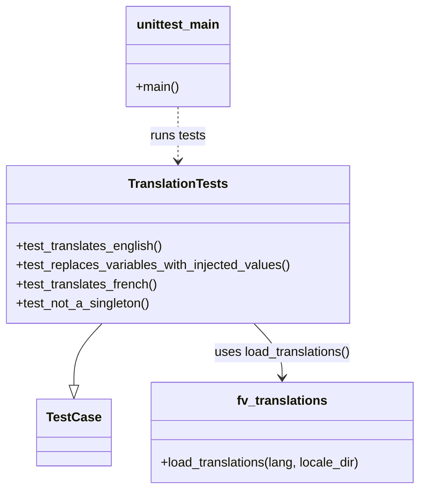

# Diagram: shipment_core/chromium_export/fv/python/tests/translations/test_translations.py


> Auto-generated by Obscura crawlers

## Diagram 1



### SVG

<svg id="container" width="530.2265625" xmlns="http://www.w3.org/2000/svg" class="classDiagram" height="614" viewBox="0 0 530.2265625 614" role="graphics-document document" aria-roledescription="class"><style>#container{font-family:"trebuchet ms",verdana,arial,sans-serif;font-size:16px;fill:#333;}@keyframes edge-animation-frame{from{stroke-dashoffset:0;}}@keyframes dash{to{stroke-dashoffset:0;}}#container .edge-animation-slow{stroke-dasharray:9,5!important;stroke-dashoffset:900;animation:dash 50s linear infinite;stroke-linecap:round;}#container .edge-animation-fast{stroke-dasharray:9,5!important;stroke-dashoffset:900;animation:dash 20s linear infinite;stroke-linecap:round;}#container .error-icon{fill:#552222;}#container .error-text{fill:#552222;stroke:#552222;}#container .edge-thickness-normal{stroke-width:1px;}#container .edge-thickness-thick{stroke-width:3.5px;}#container .edge-pattern-solid{stroke-dasharray:0;}#container .edge-thickness-invisible{stroke-width:0;fill:none;}#container .edge-pattern-dashed{stroke-dasharray:3;}#container .edge-pattern-dotted{stroke-dasharray:2;}#container .marker{fill:#333333;stroke:#333333;}#container .marker.cross{stroke:#333333;}#container svg{font-family:"trebuchet ms",verdana,arial,sans-serif;font-size:16px;}#container p{margin:0;}#container g.classGroup text{fill:#9370DB;stroke:none;font-family:"trebuchet ms",verdana,arial,sans-serif;font-size:10px;}#container g.classGroup text .title{font-weight:bolder;}#container .nodeLabel,#container .edgeLabel{color:#131300;}#container .edgeLabel .label rect{fill:#ECECFF;}#container .label text{fill:#131300;}#container .labelBkg{background:#ECECFF;}#container .edgeLabel .label span{background:#ECECFF;}#container .classTitle{font-weight:bolder;}#container .node rect,#container .node circle,#container .node ellipse,#container .node polygon,#container .node path{fill:#ECECFF;stroke:#9370DB;stroke-width:1px;}#container .divider{stroke:#9370DB;stroke-width:1;}#container g.clickable{cursor:pointer;}#container g.classGroup rect{fill:#ECECFF;stroke:#9370DB;}#container g.classGroup line{stroke:#9370DB;stroke-width:1;}#container .classLabel .box{stroke:none;stroke-width:0;fill:#ECECFF;opacity:0.5;}#container .classLabel .label{fill:#9370DB;font-size:10px;}#container .relation{stroke:#333333;stroke-width:1;fill:none;}#container .dashed-line{stroke-dasharray:3;}#container .dotted-line{stroke-dasharray:1 2;}#container #compositionStart,#container .composition{fill:#333333!important;stroke:#333333!important;stroke-width:1;}#container #compositionEnd,#container .composition{fill:#333333!important;stroke:#333333!important;stroke-width:1;}#container #dependencyStart,#container .dependency{fill:#333333!important;stroke:#333333!important;stroke-width:1;}#container #dependencyStart,#container .dependency{fill:#333333!important;stroke:#333333!important;stroke-width:1;}#container #extensionStart,#container .extension{fill:transparent!important;stroke:#333333!important;stroke-width:1;}#container #extensionEnd,#container .extension{fill:transparent!important;stroke:#333333!important;stroke-width:1;}#container #aggregationStart,#container .aggregation{fill:transparent!important;stroke:#333333!important;stroke-width:1;}#container #aggregationEnd,#container .aggregation{fill:transparent!important;stroke:#333333!important;stroke-width:1;}#container #lollipopStart,#container .lollipop{fill:#ECECFF!important;stroke:#333333!important;stroke-width:1;}#container #lollipopEnd,#container .lollipop{fill:#ECECFF!important;stroke:#333333!important;stroke-width:1;}#container .edgeTerminals{font-size:11px;line-height:initial;}#container .classTitleText{text-anchor:middle;font-size:18px;fill:#333;}#container .label-icon{display:inline-block;height:1em;overflow:visible;vertical-align:-0.125em;}#container .node .label-icon path{fill:currentColor;stroke:revert;stroke-width:revert;}#container :root{--mermaid-font-family:"trebuchet ms",verdana,arial,sans-serif;}</style><g><defs><marker id="container_class-aggregationStart" class="marker aggregation class" refX="18" refY="7" markerWidth="190" markerHeight="240" orient="auto"><path d="M 18,7 L9,13 L1,7 L9,1 Z"></path></marker></defs><defs><marker id="container_class-aggregationEnd" class="marker aggregation class" refX="1" refY="7" markerWidth="20" markerHeight="28" orient="auto"><path d="M 18,7 L9,13 L1,7 L9,1 Z"></path></marker></defs><defs><marker id="container_class-extensionStart" class="marker extension class" refX="18" refY="7" markerWidth="190" markerHeight="240" orient="auto"><path d="M 1,7 L18,13 V 1 Z"></path></marker></defs><defs><marker id="container_class-extensionEnd" class="marker extension class" refX="1" refY="7" markerWidth="20" markerHeight="28" orient="auto"><path d="M 1,1 V 13 L18,7 Z"></path></marker></defs><defs><marker id="container_class-compositionStart" class="marker composition class" refX="18" refY="7" markerWidth="190" markerHeight="240" orient="auto"><path d="M 18,7 L9,13 L1,7 L9,1 Z"></path></marker></defs><defs><marker id="container_class-compositionEnd" class="marker composition class" refX="1" refY="7" markerWidth="20" markerHeight="28" orient="auto"><path d="M 18,7 L9,13 L1,7 L9,1 Z"></path></marker></defs><defs><marker id="container_class-dependencyStart" class="marker dependency class" refX="6" refY="7" markerWidth="190" markerHeight="240" orient="auto"><path d="M 5,7 L9,13 L1,7 L9,1 Z"></path></marker></defs><defs><marker id="container_class-dependencyEnd" class="marker dependency class" refX="13" refY="7" markerWidth="20" markerHeight="28" orient="auto"><path d="M 18,7 L9,13 L14,7 L9,1 Z"></path></marker></defs><defs><marker id="container_class-lollipopStart" class="marker lollipop class" refX="13" refY="7" markerWidth="190" markerHeight="240" orient="auto"><circle stroke="black" fill="transparent" cx="7" cy="7" r="6"></circle></marker></defs><defs><marker id="container_class-lollipopEnd" class="marker lollipop class" refX="1" refY="7" markerWidth="190" markerHeight="240" orient="auto"><circle stroke="black" fill="transparent" cx="7" cy="7" r="6"></circle></marker></defs><g class="root"><g class="clusters"></g><g class="edgePaths"><path d="M129.129,406L123.2,412.167C117.271,418.333,105.413,430.667,99.484,443.625C93.555,456.583,93.555,470.167,93.555,476.958L93.555,483.75" id="id_TranslationTests_TestCase_1" class="edge-thickness-normal edge-pattern-solid relation" style=";;;" data-edge="true" data-et="edge" data-id="id_TranslationTests_TestCase_1" data-points="W3sieCI6MTI5LjEyODUwNDEzNjAyOTQsInkiOjQwNn0seyJ4Ijo5My41NTQ2ODc1LCJ5Ijo0NDN9LHsieCI6OTMuNTU0Njg3NSwieSI6NTAxfV0=" marker-end="url(#container_class-extensionEnd)"></path><path d="M319.496,406L325.425,412.167C331.354,418.333,343.212,430.667,349.141,442C355.07,453.333,355.07,463.667,355.07,468.833L355.07,474" id="id_TranslationTests_fv_translations_2" class="edge-thickness-normal edge-pattern-solid relation" style=";;;" data-edge="true" data-et="edge" data-id="id_TranslationTests_fv_translations_2" data-points="W3sieCI6MzE5LjQ5NjQ5NTg2Mzk3MDYsInkiOjQwNn0seyJ4IjozNTUuMDcwMzEyNSwieSI6NDQzfSx7IngiOjM1NS4wNzAzMTI1LCJ5Ijo0ODB9XQ==" marker-end="url(#container_class-dependencyEnd)"></path><path d="M224.313,134L224.313,140.167C224.313,146.333,224.313,158.667,224.313,170C224.313,181.333,224.313,191.667,224.313,196.833L224.313,202" id="id_unittest_main_TranslationTests_3" class="edge-thickness-normal edge-pattern-dashed relation" style=";;;" data-edge="true" data-et="edge" data-id="id_unittest_main_TranslationTests_3" data-points="W3sieCI6MjI0LjMxMjUsInkiOjEzNH0seyJ4IjoyMjQuMzEyNSwieSI6MTcxfSx7IngiOjIyNC4zMTI1LCJ5IjoyMDh9XQ==" marker-end="url(#container_class-dependencyEnd)"></path></g><g class="edgeLabels"><g class="edgeLabel"><g class="label" data-id="id_TranslationTests_TestCase_1" transform="translate(0, 0)"><foreignObject width="0" height="0"><div xmlns="http://www.w3.org/1999/xhtml" class="labelBkg" style="display: table-cell; white-space: nowrap; line-height: 1.5; max-width: 200px; text-align: center;"><span class="edgeLabel"></span></div></foreignObject></g></g><g class="edgeLabel" transform="translate(355.0703125, 443)"><g class="label" data-id="id_TranslationTests_fv_translations_2" transform="translate(-87.1953125, -12)"><foreignObject width="174.390625" height="24"><div xmlns="http://www.w3.org/1999/xhtml" class="labelBkg" style="display: table-cell; white-space: nowrap; line-height: 1.5; max-width: 200px; text-align: center;"><span class="edgeLabel"><p>uses load_translations()</p></span></div></foreignObject></g></g><g class="edgeLabel" transform="translate(224.3125, 171)"><g class="label" data-id="id_unittest_main_TranslationTests_3" transform="translate(-35.78125, -12)"><foreignObject width="71.5625" height="24"><div xmlns="http://www.w3.org/1999/xhtml" class="labelBkg" style="display: table-cell; white-space: nowrap; line-height: 1.5; max-width: 200px; text-align: center;"><span class="edgeLabel"><p>runs tests</p></span></div></foreignObject></g></g></g><g class="nodes"><g class="node default" id="classId-TranslationTests-0" transform="translate(224.3125, 307)"><g class="basic label-container"><path d="M-216.3125 -99 L216.3125 -99 L216.3125 99 L-216.3125 99" stroke="none" stroke-width="0" fill="#ECECFF" style=""></path><path d="M-216.3125 -99 C-49.45773251234996 -99, 117.39703497530007 -99, 216.3125 -99 M-216.3125 -99 C-88.29871360890147 -99, 39.71507278219707 -99, 216.3125 -99 M216.3125 -99 C216.3125 -54.943963688406846, 216.3125 -10.887927376813693, 216.3125 99 M216.3125 -99 C216.3125 -22.835200018678023, 216.3125 53.329599962643954, 216.3125 99 M216.3125 99 C52.7079947364623 99, -110.8965105270754 99, -216.3125 99 M216.3125 99 C102.27977544468372 99, -11.752949110632557 99, -216.3125 99 M-216.3125 99 C-216.3125 22.390963429697223, -216.3125 -54.218073140605554, -216.3125 -99 M-216.3125 99 C-216.3125 47.83762560215165, -216.3125 -3.3247487956967063, -216.3125 -99" stroke="#9370DB" stroke-width="1.3" fill="none" stroke-dasharray="0 0" style=""></path></g><g class="annotation-group text" transform="translate(0, -75)"></g><g class="label-group text" transform="translate(-60.34375, -75)"><g class="label" style="font-weight: bolder" transform="translate(0,-12)"><foreignObject width="120.6875" height="24"><div xmlns="http://www.w3.org/1999/xhtml" style="display: table-cell; white-space: nowrap; line-height: 1.5; max-width: 168px; text-align: center;"><span class="nodeLabel markdown-node-label" style=""><p>TranslationTests</p></span></div></foreignObject></g></g><g class="members-group text" transform="translate(-204.3125, -27)"></g><g class="methods-group text" transform="translate(-204.3125, 3)"><g class="label" style="" transform="translate(0,-12)"><foreignObject width="185.90625" height="24"><div xmlns="http://www.w3.org/1999/xhtml" style="display: table-cell; white-space: nowrap; line-height: 1.5; max-width: 243px; text-align: center;"><span class="nodeLabel markdown-node-label" style=""><p>+test_translates_english()</p></span></div></foreignObject></g><g class="label" style="" transform="translate(0,12)"><foreignObject width="348.28125" height="24"><div xmlns="http://www.w3.org/1999/xhtml" style="display: table-cell; white-space: nowrap; line-height: 1.5; max-width: 406px; text-align: center;"><span class="nodeLabel markdown-node-label" style=""><p>+test_replaces_variables_with_injected_values()</p></span></div></foreignObject></g><g class="label" style="" transform="translate(0,36)"><foreignObject width="179.625" height="24"><div xmlns="http://www.w3.org/1999/xhtml" style="display: table-cell; white-space: nowrap; line-height: 1.5; max-width: 237px; text-align: center;"><span class="nodeLabel markdown-node-label" style=""><p>+test_translates_french()</p></span></div></foreignObject></g><g class="label" style="" transform="translate(0,60)"><foreignObject width="170.890625" height="24"><div xmlns="http://www.w3.org/1999/xhtml" style="display: table-cell; white-space: nowrap; line-height: 1.5; max-width: 228px; text-align: center;"><span class="nodeLabel markdown-node-label" style=""><p>+test_not_a_singleton()</p></span></div></foreignObject></g></g><g class="divider" style=""><path d="M-216.3125 -51 C-126.01332267322404 -51, -35.71414534644808 -51, 216.3125 -51 M-216.3125 -51 C-111.85636723968021 -51, -7.400234479360421 -51, 216.3125 -51" stroke="#9370DB" stroke-width="1.3" fill="none" stroke-dasharray="0 0" style=""></path></g><g class="divider" style=""><path d="M-216.3125 -27 C-70.2800920804921 -27, 75.75231583901581 -27, 216.3125 -27 M-216.3125 -27 C-63.767505163507764 -27, 88.77748967298447 -27, 216.3125 -27" stroke="#9370DB" stroke-width="1.3" fill="none" stroke-dasharray="0 0" style=""></path></g></g><g class="node default" id="classId-TestCase-1" transform="translate(93.5546875, 543)"><g class="basic label-container"><path d="M-44.359375 -42 L44.359375 -42 L44.359375 42 L-44.359375 42" stroke="none" stroke-width="0" fill="#ECECFF" style=""></path><path d="M-44.359375 -42 C-10.654492000593223 -42, 23.050390998813555 -42, 44.359375 -42 M-44.359375 -42 C-13.433953616849415 -42, 17.49146776630117 -42, 44.359375 -42 M44.359375 -42 C44.359375 -23.5430818518008, 44.359375 -5.086163703601599, 44.359375 42 M44.359375 -42 C44.359375 -20.365864206841913, 44.359375 1.2682715863161746, 44.359375 42 M44.359375 42 C22.623363315025678 42, 0.8873516300513558 42, -44.359375 42 M44.359375 42 C14.777306063353706 42, -14.804762873292589 42, -44.359375 42 M-44.359375 42 C-44.359375 19.947294442046672, -44.359375 -2.105411115906655, -44.359375 -42 M-44.359375 42 C-44.359375 24.313275902576294, -44.359375 6.626551805152587, -44.359375 -42" stroke="#9370DB" stroke-width="1.3" fill="none" stroke-dasharray="0 0" style=""></path></g><g class="annotation-group text" transform="translate(0, -18)"></g><g class="label-group text" transform="translate(-32.359375, -18)"><g class="label" style="font-weight: bolder" transform="translate(0,-12)"><foreignObject width="64.71875" height="24"><div xmlns="http://www.w3.org/1999/xhtml" style="display: table-cell; white-space: nowrap; line-height: 1.5; max-width: 113px; text-align: center;"><span class="nodeLabel markdown-node-label" style=""><p>TestCase</p></span></div></foreignObject></g></g><g class="members-group text" transform="translate(-32.359375, 30)"></g><g class="methods-group text" transform="translate(-32.359375, 60)"></g><g class="divider" style=""><path d="M-44.359375 6 C-10.525602026465613 6, 23.308170947068774 6, 44.359375 6 M-44.359375 6 C-10.379541511034546 6, 23.600291977930908 6, 44.359375 6" stroke="#9370DB" stroke-width="1.3" fill="none" stroke-dasharray="0 0" style=""></path></g><g class="divider" style=""><path d="M-44.359375 24 C-21.040419631382278 24, 2.278535737235444 24, 44.359375 24 M-44.359375 24 C-10.167070254805203 24, 24.025234490389593 24, 44.359375 24" stroke="#9370DB" stroke-width="1.3" fill="none" stroke-dasharray="0 0" style=""></path></g></g><g class="node default" id="classId-fv_translations-2" transform="translate(355.0703125, 543)"><g class="basic label-container"><path d="M-167.15625 -63 L167.15625 -63 L167.15625 63 L-167.15625 63" stroke="none" stroke-width="0" fill="#ECECFF" style=""></path><path d="M-167.15625 -63 C-36.8342611087146 -63, 93.4877277825708 -63, 167.15625 -63 M-167.15625 -63 C-81.47298065969325 -63, 4.210288680613502 -63, 167.15625 -63 M167.15625 -63 C167.15625 -36.68547885632671, 167.15625 -10.370957712653428, 167.15625 63 M167.15625 -63 C167.15625 -12.689190175902098, 167.15625 37.621619648195804, 167.15625 63 M167.15625 63 C52.8854635356994 63, -61.3853229286012 63, -167.15625 63 M167.15625 63 C47.00079586808995 63, -73.1546582638201 63, -167.15625 63 M-167.15625 63 C-167.15625 13.114846842380224, -167.15625 -36.77030631523955, -167.15625 -63 M-167.15625 63 C-167.15625 22.22055010735975, -167.15625 -18.558899785280502, -167.15625 -63" stroke="#9370DB" stroke-width="1.3" fill="none" stroke-dasharray="0 0" style=""></path></g><g class="annotation-group text" transform="translate(0, -39)"></g><g class="label-group text" transform="translate(-54.8125, -39)"><g class="label" style="font-weight: bolder" transform="translate(0,-12)"><foreignObject width="109.625" height="24"><div xmlns="http://www.w3.org/1999/xhtml" style="display: table-cell; white-space: nowrap; line-height: 1.5; max-width: 158px; text-align: center;"><span class="nodeLabel markdown-node-label" style=""><p>fv_translations</p></span></div></foreignObject></g></g><g class="members-group text" transform="translate(-155.15625, 9)"></g><g class="methods-group text" transform="translate(-155.15625, 39)"><g class="label" style="" transform="translate(0,-12)"><foreignObject width="255.5" height="24"><div xmlns="http://www.w3.org/1999/xhtml" style="display: table-cell; white-space: nowrap; line-height: 1.5; max-width: 313px; text-align: center;"><span class="nodeLabel markdown-node-label" style=""><p>+load_translations(lang, locale_dir)</p></span></div></foreignObject></g></g><g class="divider" style=""><path d="M-167.15625 -15 C-46.14388031921874 -15, 74.86848936156252 -15, 167.15625 -15 M-167.15625 -15 C-45.26884988025995 -15, 76.6185502394801 -15, 167.15625 -15" stroke="#9370DB" stroke-width="1.3" fill="none" stroke-dasharray="0 0" style=""></path></g><g class="divider" style=""><path d="M-167.15625 9 C-75.23474094168384 9, 16.686768116632322 9, 167.15625 9 M-167.15625 9 C-39.78692309848381 9, 87.58240380303238 9, 167.15625 9" stroke="#9370DB" stroke-width="1.3" fill="none" stroke-dasharray="0 0" style=""></path></g></g><g class="node default" id="classId-unittest_main-3" transform="translate(224.3125, 71)"><g class="basic label-container"><path d="M-64.84375 -63 L64.84375 -63 L64.84375 63 L-64.84375 63" stroke="none" stroke-width="0" fill="#ECECFF" style=""></path><path d="M-64.84375 -63 C-23.527182947559062 -63, 17.789384104881876 -63, 64.84375 -63 M-64.84375 -63 C-28.868837661049554 -63, 7.106074677900892 -63, 64.84375 -63 M64.84375 -63 C64.84375 -35.09672713935656, 64.84375 -7.193454278713126, 64.84375 63 M64.84375 -63 C64.84375 -37.63469417578753, 64.84375 -12.269388351575067, 64.84375 63 M64.84375 63 C21.808987529602348 63, -21.225774940795304 63, -64.84375 63 M64.84375 63 C34.1352845219416 63, 3.4268190438831994 63, -64.84375 63 M-64.84375 63 C-64.84375 19.016261326470833, -64.84375 -24.967477347058335, -64.84375 -63 M-64.84375 63 C-64.84375 36.213204646615985, -64.84375 9.42640929323197, -64.84375 -63" stroke="#9370DB" stroke-width="1.3" fill="none" stroke-dasharray="0 0" style=""></path></g><g class="annotation-group text" transform="translate(0, -39)"></g><g class="label-group text" transform="translate(-51.03125, -39)"><g class="label" style="font-weight: bolder" transform="translate(0,-12)"><foreignObject width="102.0625" height="24"><div xmlns="http://www.w3.org/1999/xhtml" style="display: table-cell; white-space: nowrap; line-height: 1.5; max-width: 151px; text-align: center;"><span class="nodeLabel markdown-node-label" style=""><p>unittest_main</p></span></div></foreignObject></g></g><g class="members-group text" transform="translate(-52.84375, 9)"></g><g class="methods-group text" transform="translate(-52.84375, 39)"><g class="label" style="" transform="translate(0,-12)"><foreignObject width="54.65625" height="24"><div xmlns="http://www.w3.org/1999/xhtml" style="display: table-cell; white-space: nowrap; line-height: 1.5; max-width: 112px; text-align: center;"><span class="nodeLabel markdown-node-label" style=""><p>+main()</p></span></div></foreignObject></g></g><g class="divider" style=""><path d="M-64.84375 -15 C-30.09320383953986 -15, 4.657342320920279 -15, 64.84375 -15 M-64.84375 -15 C-13.485717232249073 -15, 37.872315535501855 -15, 64.84375 -15" stroke="#9370DB" stroke-width="1.3" fill="none" stroke-dasharray="0 0" style=""></path></g><g class="divider" style=""><path d="M-64.84375 9 C-19.70804458276605 9, 25.4276608344679 9, 64.84375 9 M-64.84375 9 C-23.424840178183615 9, 17.99406964363277 9, 64.84375 9" stroke="#9370DB" stroke-width="1.3" fill="none" stroke-dasharray="0 0" style=""></path></g></g></g></g></g></svg>

## Diagram 2

```mermaid
flowchart TD
    Start([Start]) --> Load[load_translations(lang, locale_dir)]
    Load --> Locale{locale == "en" or "fr"}
    Locale --> Hello[Translate "unit-tests.hello_world"]
    Locale --> Replace[Translate "unit-tests.replace_my_content" with replace_me]
    Hello --> Assert1[Assert expected greeting string]
    Replace --> Assert2[Assert variable replacement result]
    Assert1 --> End([unittest.main() completes])
    Assert2 --> End
```

> SVG rendering failed for this diagram.
