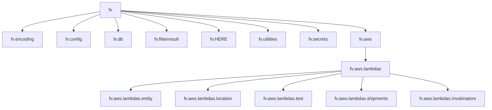

# Diagram: shipment_core/chromium_export/fv/setup.py

> Auto-generated by Obscura crawlers

## Mermaid

### SVG

<svg id="container" width="1724.890625" xmlns="http://www.w3.org/2000/svg" class="flowchart" height="382" viewBox="0 0 1724.890625 382" role="graphics-document document" aria-roledescription="flowchart-v2"><g><marker id="container_flowchart-v2-pointEnd" class="marker flowchart-v2" viewBox="0 0 10 10" refX="5" refY="5" markerUnits="userSpaceOnUse" markerWidth="8" markerHeight="8" orient="auto"><path d="M 0 0 L 10 5 L 0 10 z" class="arrowMarkerPath" style="stroke-width: 1; stroke-dasharray: 1, 0;"></path></marker><marker id="container_flowchart-v2-pointStart" class="marker flowchart-v2" viewBox="0 0 10 10" refX="4.5" refY="5" markerUnits="userSpaceOnUse" markerWidth="8" markerHeight="8" orient="auto"><path d="M 0 5 L 10 10 L 10 0 z" class="arrowMarkerPath" style="stroke-width: 1; stroke-dasharray: 1, 0;"></path></marker><marker id="container_flowchart-v2-circleEnd" class="marker flowchart-v2" viewBox="0 0 10 10" refX="11" refY="5" markerUnits="userSpaceOnUse" markerWidth="11" markerHeight="11" orient="auto"><circle cx="5" cy="5" r="5" class="arrowMarkerPath" style="stroke-width: 1; stroke-dasharray: 1, 0;"></circle></marker><marker id="container_flowchart-v2-circleStart" class="marker flowchart-v2" viewBox="0 0 10 10" refX="-1" refY="5" markerUnits="userSpaceOnUse" markerWidth="11" markerHeight="11" orient="auto"><circle cx="5" cy="5" r="5" class="arrowMarkerPath" style="stroke-width: 1; stroke-dasharray: 1, 0;"></circle></marker><marker id="container_flowchart-v2-crossEnd" class="marker cross flowchart-v2" viewBox="0 0 11 11" refX="12" refY="5.2" markerUnits="userSpaceOnUse" markerWidth="11" markerHeight="11" orient="auto"><path d="M 1,1 l 9,9 M 10,1 l -9,9" class="arrowMarkerPath" style="stroke-width: 2; stroke-dasharray: 1, 0;"></path></marker><marker id="container_flowchart-v2-crossStart" class="marker cross flowchart-v2" viewBox="0 0 11 11" refX="-1" refY="5.2" markerUnits="userSpaceOnUse" markerWidth="11" markerHeight="11" orient="auto"><path d="M 1,1 l 9,9 M 10,1 l -9,9" class="arrowMarkerPath" style="stroke-width: 2; stroke-dasharray: 1, 0;"></path></marker><g class="root"><g class="clusters"></g><g class="edgePaths"><path d="M356.051,41.078L309.945,48.732C263.839,56.386,171.626,71.693,125.52,82.846C79.414,94,79.414,101,79.414,104.5L79.414,108" id="L_fv_encoding_0" class="edge-thickness-normal edge-pattern-solid edge-thickness-normal edge-pattern-solid flowchart-link" style=";" data-edge="true" data-et="edge" data-id="L_fv_encoding_0" data-points="W3sieCI6MzU2LjA1MDc4MTI1LCJ5Ijo0MS4wNzg0MzU3NzM2OTU5Nn0seyJ4Ijo3OS40MTQwNjI1LCJ5Ijo4N30seyJ4Ijo3OS40MTQwNjI1LCJ5IjoxMTJ9XQ==" marker-end="url(#container_flowchart-v2-pointEnd)"></path><path d="M356.051,49.434L340.167,55.695C324.284,61.956,292.517,74.478,276.633,84.239C260.75,94,260.75,101,260.75,104.5L260.75,108" id="L_fv_config_0" class="edge-thickness-normal edge-pattern-solid edge-thickness-normal edge-pattern-solid flowchart-link" style=";" data-edge="true" data-et="edge" data-id="L_fv_config_0" data-points="W3sieCI6MzU2LjA1MDc4MTI1LCJ5Ijo0OS40MzM5MjI1OTYzMTA0NDV9LHsieCI6MjYwLjc1LCJ5Ijo4N30seyJ4IjoyNjAuNzUsInkiOjExMn1d" marker-end="url(#container_flowchart-v2-pointEnd)"></path><path d="M406.004,62L408.062,66.167C410.12,70.333,414.236,78.667,416.294,86.333C418.352,94,418.352,101,418.352,104.5L418.352,108" id="L_fv_db_0" class="edge-thickness-normal edge-pattern-solid edge-thickness-normal edge-pattern-solid flowchart-link" style=";" data-edge="true" data-et="edge" data-id="L_fv_db_0" data-points="W3sieCI6NDA2LjAwMzY4MDg4OTQyMzEsInkiOjYyfSx7IngiOjQxOC4zNTE1NjI1LCJ5Ijo4N30seyJ4Ijo0MTguMzUxNTYyNSwieSI6MTEyfV0=" marker-end="url(#container_flowchart-v2-pointEnd)"></path><path d="M429.285,44.546L456.426,51.622C483.568,58.697,537.85,72.849,564.992,83.424C592.133,94,592.133,101,592.133,104.5L592.133,108" id="L_fv_filterresult_0" class="edge-thickness-normal edge-pattern-solid edge-thickness-normal edge-pattern-solid flowchart-link" style=";" data-edge="true" data-et="edge" data-id="L_fv_filterresult_0" data-points="W3sieCI6NDI5LjI4NTE1NjI1LCJ5Ijo0NC41NDYwMTE3ODkzNTgyNDZ9LHsieCI6NTkyLjEzMjgxMjUsInkiOjg3fSx7IngiOjU5Mi4xMzI4MTI1LCJ5IjoxMTJ9XQ==" marker-end="url(#container_flowchart-v2-pointEnd)"></path><path d="M429.285,39.976L486.954,47.814C544.622,55.651,659.96,71.325,717.628,82.663C775.297,94,775.297,101,775.297,104.5L775.297,108" id="L_fv_HERE_0" class="edge-thickness-normal edge-pattern-solid edge-thickness-normal edge-pattern-solid flowchart-link" style=";" data-edge="true" data-et="edge" data-id="L_fv_HERE_0" data-points="W3sieCI6NDI5LjI4NTE1NjI1LCJ5IjozOS45NzYzNDU3OTg0OTUxOTZ9LHsieCI6Nzc1LjI5Njg3NSwieSI6ODd9LHsieCI6Nzc1LjI5Njg3NSwieSI6MTEyfV0=" marker-end="url(#container_flowchart-v2-pointEnd)"></path><path d="M429.285,38.428L515.761,46.523C602.237,54.619,775.189,70.809,861.665,82.405C948.141,94,948.141,101,948.141,104.5L948.141,108" id="L_fv_utilities_0" class="edge-thickness-normal edge-pattern-solid edge-thickness-normal edge-pattern-solid flowchart-link" style=";" data-edge="true" data-et="edge" data-id="L_fv_utilities_0" data-points="W3sieCI6NDI5LjI4NTE1NjI1LCJ5IjozOC40Mjc4ODAyNTQwMDY2NX0seyJ4Ijo5NDguMTQwNjI1LCJ5Ijo4N30seyJ4Ijo5NDguMTQwNjI1LCJ5IjoxMTJ9XQ==" marker-end="url(#container_flowchart-v2-pointEnd)"></path><path d="M429.285,37.59L545.726,45.825C662.167,54.06,895.048,70.53,1011.489,82.265C1127.93,94,1127.93,101,1127.93,104.5L1127.93,108" id="L_fv_secrets_0" class="edge-thickness-normal edge-pattern-solid edge-thickness-normal edge-pattern-solid flowchart-link" style=";" data-edge="true" data-et="edge" data-id="L_fv_secrets_0" data-points="W3sieCI6NDI5LjI4NTE1NjI1LCJ5IjozNy41ODk2ODE2MDc4NDU4NX0seyJ4IjoxMTI3LjkyOTY4NzUsInkiOjg3fSx7IngiOjExMjcuOTI5Njg3NSwieSI6MTEyfV0=" marker-end="url(#container_flowchart-v2-pointEnd)"></path><path d="M429.285,37.113L573.395,45.427C717.505,53.742,1005.725,70.371,1149.835,82.185C1293.945,94,1293.945,101,1293.945,104.5L1293.945,108" id="L_fv_aws_0" class="edge-thickness-normal edge-pattern-solid edge-thickness-normal edge-pattern-solid flowchart-link" style=";" data-edge="true" data-et="edge" data-id="L_fv_aws_0" data-points="W3sieCI6NDI5LjI4NTE1NjI1LCJ5IjozNy4xMTI2NjEyODM2ODE1OH0seyJ4IjoxMjkzLjk0NTMxMjUsInkiOjg3fSx7IngiOjEyOTMuOTQ1MzEyNSwieSI6MTEyfV0=" marker-end="url(#container_flowchart-v2-pointEnd)"></path><path d="M1293.945,166L1293.945,170.167C1293.945,174.333,1293.945,182.667,1293.945,190.333C1293.945,198,1293.945,205,1293.945,208.5L1293.945,212" id="L_aws_lambdas_0" class="edge-thickness-normal edge-pattern-solid edge-thickness-normal edge-pattern-solid flowchart-link" style=";" data-edge="true" data-et="edge" data-id="L_aws_lambdas_0" data-points="W3sieCI6MTI5My45NDUzMTI1LCJ5IjoxNjZ9LHsieCI6MTI5My45NDUzMTI1LCJ5IjoxOTF9LHsieCI6MTI5My45NDUzMTI1LCJ5IjoyMTZ9XQ==" marker-end="url(#container_flowchart-v2-pointEnd)"></path><path d="M1208.969,248.31L1084.43,256.091C959.891,263.873,710.813,279.437,586.273,290.718C461.734,302,461.734,309,461.734,312.5L461.734,316" id="L_lambdas_entity_0" class="edge-thickness-normal edge-pattern-solid edge-thickness-normal edge-pattern-solid flowchart-link" style=";" data-edge="true" data-et="edge" data-id="L_lambdas_entity_0" data-points="W3sieCI6MTIwOC45Njg3NSwieSI6MjQ4LjMwOTY4ODk4NzM1NDgzfSx7IngiOjQ2MS43MzQzNzUsInkiOjI5NX0seyJ4Ijo0NjEuNzM0Mzc1LCJ5IjozMjB9XQ==" marker-end="url(#container_flowchart-v2-pointEnd)"></path><path d="M1208.969,250.92L1130.142,258.267C1051.315,265.613,893.661,280.307,814.835,291.153C736.008,302,736.008,309,736.008,312.5L736.008,316" id="L_lambdas_location_0" class="edge-thickness-normal edge-pattern-solid edge-thickness-normal edge-pattern-solid flowchart-link" style=";" data-edge="true" data-et="edge" data-id="L_lambdas_location_0" data-points="W3sieCI6MTIwOC45Njg3NSwieSI6MjUwLjkxOTg0OTg5MzU4MTI3fSx7IngiOjczNi4wMDc4MTI1LCJ5IjoyOTV9LHsieCI6NzM2LjAwNzgxMjUsInkiOjMyMH1d" marker-end="url(#container_flowchart-v2-pointEnd)"></path><path d="M1208.969,258.182L1174.624,264.319C1140.279,270.455,1071.589,282.727,1037.243,292.364C1002.898,302,1002.898,309,1002.898,312.5L1002.898,316" id="L_lambdas_test_0" class="edge-thickness-normal edge-pattern-solid edge-thickness-normal edge-pattern-solid flowchart-link" style=";" data-edge="true" data-et="edge" data-id="L_lambdas_test_0" data-points="W3sieCI6MTIwOC45Njg3NSwieSI6MjU4LjE4MjM2OTY3ODQyMzh9LHsieCI6MTAwMi44OTg0Mzc1LCJ5IjoyOTV9LHsieCI6MTAwMi44OTg0Mzc1LCJ5IjozMjB9XQ==" marker-end="url(#container_flowchart-v2-pointEnd)"></path><path d="M1285.771,270L1284.51,274.167C1283.249,278.333,1280.726,286.667,1279.465,294.333C1278.203,302,1278.203,309,1278.203,312.5L1278.203,316" id="L_lambdas_shipments_0" class="edge-thickness-normal edge-pattern-solid edge-thickness-normal edge-pattern-solid flowchart-link" style=";" data-edge="true" data-et="edge" data-id="L_lambdas_shipments_0" data-points="W3sieCI6MTI4NS43NzE0ODQzNzUsInkiOjI3MH0seyJ4IjoxMjc4LjIwMzEyNSwieSI6Mjk1fSx7IngiOjEyNzguMjAzMTI1LCJ5IjozMjB9XQ==" marker-end="url(#container_flowchart-v2-pointEnd)"></path><path d="M1378.922,258.182L1413.267,264.319C1447.612,270.455,1516.302,282.727,1550.647,292.364C1584.992,302,1584.992,309,1584.992,312.5L1584.992,316" id="L_lambdas_invokinators_0" class="edge-thickness-normal edge-pattern-solid edge-thickness-normal edge-pattern-solid flowchart-link" style=";" data-edge="true" data-et="edge" data-id="L_lambdas_invokinators_0" data-points="W3sieCI6MTM3OC45MjE4NzUsInkiOjI1OC4xODIzNjk2Nzg0MjM4fSx7IngiOjE1ODQuOTkyMTg3NSwieSI6Mjk1fSx7IngiOjE1ODQuOTkyMTg3NSwieSI6MzIwfV0=" marker-end="url(#container_flowchart-v2-pointEnd)"></path></g><g class="edgeLabels"><g class="edgeLabel"><g class="label" data-id="L_fv_encoding_0" transform="translate(0, 0)"><foreignObject width="0" height="0">

</foreignObject></g></g><g class="edgeLabel"><g class="label" data-id="L_fv_config_0" transform="translate(0, 0)"><foreignObject width="0" height="0">

</foreignObject></g></g><g class="edgeLabel"><g class="label" data-id="L_fv_db_0" transform="translate(0, 0)"><foreignObject width="0" height="0">

</foreignObject></g></g><g class="edgeLabel"><g class="label" data-id="L_fv_filterresult_0" transform="translate(0, 0)"><foreignObject width="0" height="0">

</foreignObject></g></g><g class="edgeLabel"><g class="label" data-id="L_fv_HERE_0" transform="translate(0, 0)"><foreignObject width="0" height="0">

</foreignObject></g></g><g class="edgeLabel"><g class="label" data-id="L_fv_utilities_0" transform="translate(0, 0)"><foreignObject width="0" height="0">

</foreignObject></g></g><g class="edgeLabel"><g class="label" data-id="L_fv_secrets_0" transform="translate(0, 0)"><foreignObject width="0" height="0">

</foreignObject></g></g><g class="edgeLabel"><g class="label" data-id="L_fv_aws_0" transform="translate(0, 0)"><foreignObject width="0" height="0">

</foreignObject></g></g><g class="edgeLabel"><g class="label" data-id="L_aws_lambdas_0" transform="translate(0, 0)"><foreignObject width="0" height="0">

</foreignObject></g></g><g class="edgeLabel"><g class="label" data-id="L_lambdas_entity_0" transform="translate(0, 0)"><foreignObject width="0" height="0">

</foreignObject></g></g><g class="edgeLabel"><g class="label" data-id="L_lambdas_location_0" transform="translate(0, 0)"><foreignObject width="0" height="0">

</foreignObject></g></g><g class="edgeLabel"><g class="label" data-id="L_lambdas_test_0" transform="translate(0, 0)"><foreignObject width="0" height="0">

</foreignObject></g></g><g class="edgeLabel"><g class="label" data-id="L_lambdas_shipments_0" transform="translate(0, 0)"><foreignObject width="0" height="0">

</foreignObject></g></g><g class="edgeLabel"><g class="label" data-id="L_lambdas_invokinators_0" transform="translate(0, 0)"><foreignObject width="0" height="0">

</foreignObject></g></g></g><g class="nodes"><g class="node default" id="flowchart-fv-0" transform="translate(392.66796875, 35)"><rect class="basic label-container" style="" x="-36.6171875" y="-27" width="73.234375" height="54"></rect><g class="label" style="" transform="translate(-6.6171875, -12)"><rect></rect><foreignObject width="13.234375" height="24">

fv

</foreignObject></g></g><g class="node default" id="flowchart-encoding-2" transform="translate(79.4140625, 139)"><rect class="basic label-container" style="" x="-71.4140625" y="-27" width="142.828125" height="54"></rect><g class="label" style="" transform="translate(-41.4140625, -12)"><rect></rect><foreignObject width="82.828125" height="24">

fv.encoding

</foreignObject></g></g><g class="node default" id="flowchart-config-4" transform="translate(260.75, 139)"><rect class="basic label-container" style="" x="-59.921875" y="-27" width="119.84375" height="54"></rect><g class="label" style="" transform="translate(-29.921875, -12)"><rect></rect><foreignObject width="59.84375" height="24">

fv.config

</foreignObject></g></g><g class="node default" id="flowchart-db-6" transform="translate(418.3515625, 139)"><rect class="basic label-container" style="" x="-47.6796875" y="-27" width="95.359375" height="54"></rect><g class="label" style="" transform="translate(-17.6796875, -12)"><rect></rect><foreignObject width="35.359375" height="24">

fv.db

</foreignObject></g></g><g class="node default" id="flowchart-filterresult-8" transform="translate(592.1328125, 139)"><rect class="basic label-container" style="" x="-76.1015625" y="-27" width="152.203125" height="54"></rect><g class="label" style="" transform="translate(-46.1015625, -12)"><rect></rect><foreignObject width="92.203125" height="24">

fv.filterresult

</foreignObject></g></g><g class="node default" id="flowchart-HERE-10" transform="translate(775.296875, 139)"><rect class="basic label-container" style="" x="-57.0625" y="-27" width="114.125" height="54"></rect><g class="label" style="" transform="translate(-27.0625, -12)"><rect></rect><foreignObject width="54.125" height="24">

fv.HERE

</foreignObject></g></g><g class="node default" id="flowchart-utilities-12" transform="translate(948.140625, 139)"><rect class="basic label-container" style="" x="-65.78125" y="-27" width="131.5625" height="54"></rect><g class="label" style="" transform="translate(-35.78125, -12)"><rect></rect><foreignObject width="71.5625" height="24">

fv.utilities

</foreignObject></g></g><g class="node default" id="flowchart-secrets-14" transform="translate(1127.9296875, 139)"><rect class="basic label-container" style="" x="-64.0078125" y="-27" width="128.015625" height="54"></rect><g class="label" style="" transform="translate(-34.0078125, -12)"><rect></rect><foreignObject width="68.015625" height="24">

fv.secrets

</foreignObject></g></g><g class="node default" id="flowchart-aws-16" transform="translate(1293.9453125, 139)"><rect class="basic label-container" style="" x="-52.0078125" y="-27" width="104.015625" height="54"></rect><g class="label" style="" transform="translate(-22.0078125, -12)"><rect></rect><foreignObject width="44.015625" height="24">

fv.aws

</foreignObject></g></g><g class="node default" id="flowchart-lambdas-18" transform="translate(1293.9453125, 243)"><rect class="basic label-container" style="" x="-84.9765625" y="-27" width="169.953125" height="54"></rect><g class="label" style="" transform="translate(-54.9765625, -12)"><rect></rect><foreignObject width="109.953125" height="24">

fv.aws.lambdas

</foreignObject></g></g><g class="node default" id="flowchart-entity-20" transform="translate(461.734375, 347)"><rect class="basic label-container" style="" x="-107.796875" y="-27" width="215.59375" height="54"></rect><g class="label" style="" transform="translate(-77.796875, -12)"><rect></rect><foreignObject width="155.59375" height="24">

fv.aws.lambdas.entity

</foreignObject></g></g><g class="node default" id="flowchart-location-22" transform="translate(736.0078125, 347)"><rect class="basic label-container" style="" x="-116.4765625" y="-27" width="232.953125" height="54"></rect><g class="label" style="" transform="translate(-86.4765625, -12)"><rect></rect><foreignObject width="172.953125" height="24">

fv.aws.lambdas.location

</foreignObject></g></g><g class="node default" id="flowchart-test-24" transform="translate(1002.8984375, 347)"><rect class="basic label-container" style="" x="-100.4140625" y="-27" width="200.828125" height="54"></rect><g class="label" style="" transform="translate(-70.4140625, -12)"><rect></rect><foreignObject width="140.828125" height="24">

fv.aws.lambdas.test

</foreignObject></g></g><g class="node default" id="flowchart-shipments-26" transform="translate(1278.203125, 347)"><rect class="basic label-container" style="" x="-124.890625" y="-27" width="249.78125" height="54"></rect><g class="label" style="" transform="translate(-94.890625, -12)"><rect></rect><foreignObject width="189.78125" height="24">

fv.aws.lambdas.shipments

</foreignObject></g></g><g class="node default" id="flowchart-invokinators-28" transform="translate(1584.9921875, 347)"><rect class="basic label-container" style="" x="-131.8984375" y="-27" width="263.796875" height="54"></rect><g class="label" style="" transform="translate(-101.8984375, -12)"><rect></rect><foreignObject width="203.796875" height="24">

fv.aws.lambdas.invokinators

</foreignObject></g></g></g></g></g></svg>
