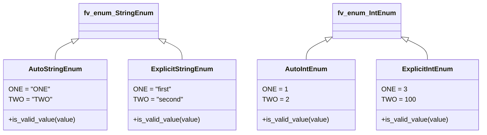

# Diagram: shipment_core/chromium_export/fv/tests/fv/test_enum.py

> Auto-generated by Obscura crawlers

## Mermaid

### SVG

<svg id="container" width="1127.90625" xmlns="http://www.w3.org/2000/svg" class="classDiagram" height="318" viewBox="0 0 1127.90625 318" role="graphics-document document" aria-roledescription="class"><g><defs><marker id="container_class-aggregationStart" class="marker aggregation class" refX="18" refY="7" markerWidth="190" markerHeight="240" orient="auto"><path d="M 18,7 L9,13 L1,7 L9,1 Z"></path></marker></defs><defs><marker id="container_class-aggregationEnd" class="marker aggregation class" refX="1" refY="7" markerWidth="20" markerHeight="28" orient="auto"><path d="M 18,7 L9,13 L1,7 L9,1 Z"></path></marker></defs><defs><marker id="container_class-extensionStart" class="marker extension class" refX="18" refY="7" markerWidth="190" markerHeight="240" orient="auto"><path d="M 1,7 L18,13 V 1 Z"></path></marker></defs><defs><marker id="container_class-extensionEnd" class="marker extension class" refX="1" refY="7" markerWidth="20" markerHeight="28" orient="auto"><path d="M 1,1 V 13 L18,7 Z"></path></marker></defs><defs><marker id="container_class-compositionStart" class="marker composition class" refX="18" refY="7" markerWidth="190" markerHeight="240" orient="auto"><path d="M 18,7 L9,13 L1,7 L9,1 Z"></path></marker></defs><defs><marker id="container_class-compositionEnd" class="marker composition class" refX="1" refY="7" markerWidth="20" markerHeight="28" orient="auto"><path d="M 18,7 L9,13 L1,7 L9,1 Z"></path></marker></defs><defs><marker id="container_class-dependencyStart" class="marker dependency class" refX="6" refY="7" markerWidth="190" markerHeight="240" orient="auto"><path d="M 5,7 L9,13 L1,7 L9,1 Z"></path></marker></defs><defs><marker id="container_class-dependencyEnd" class="marker dependency class" refX="13" refY="7" markerWidth="20" markerHeight="28" orient="auto"><path d="M 18,7 L9,13 L14,7 L9,1 Z"></path></marker></defs><defs><marker id="container_class-lollipopStart" class="marker lollipop class" refX="13" refY="7" markerWidth="190" markerHeight="240" orient="auto"><circle stroke="black" fill="transparent" cx="7" cy="7" r="6"></circle></marker></defs><defs><marker id="container_class-lollipopEnd" class="marker lollipop class" refX="1" refY="7" markerWidth="190" markerHeight="240" orient="auto"><circle stroke="black" fill="transparent" cx="7" cy="7" r="6"></circle></marker></defs><g class="root"><g class="clusters"></g><g class="edgePaths"><path d="M172.001,97.464L164.796,100.72C157.591,103.976,143.18,110.488,135.975,117.911C128.77,125.333,128.77,133.667,128.77,137.833L128.77,142" id="id_fv_enum_StringEnum_AutoStringEnum_1" class="edge-thickness-normal edge-pattern-solid relation" style=";;;" data-edge="true" data-et="edge" data-id="id_fv_enum_StringEnum_AutoStringEnum_1" data-points="W3sieCI6MTg3LjcyMDcwMzEyNSwieSI6OTAuMzYwMTA1OTEzNTAzOTd9LHsieCI6MTI4Ljc2OTUzMTI1LCJ5IjoxMTd9LHsieCI6MTI4Ljc2OTUzMTI1LCJ5IjoxNDJ9XQ==" marker-start="url(#container_class-extensionStart)"></path><path d="M382.065,97.464L389.27,100.72C396.476,103.976,410.886,110.488,418.092,117.911C425.297,125.333,425.297,133.667,425.297,137.833L425.297,142" id="id_fv_enum_StringEnum_ExplicitStringEnum_2" class="edge-thickness-normal edge-pattern-solid relation" style=";;;" data-edge="true" data-et="edge" data-id="id_fv_enum_StringEnum_ExplicitStringEnum_2" data-points="W3sieCI6MzY2LjM0NTcwMzEyNSwieSI6OTAuMzYwMTA1OTEzNTAzOTd9LHsieCI6NDI1LjI5Njg3NSwieSI6MTE3fSx7IngiOjQyNS4yOTY4NzUsInkiOjE0Mn1d" marker-start="url(#container_class-extensionStart)"></path><path d="M765.006,93.805L756.801,97.671C748.595,101.537,732.184,109.268,723.979,117.301C715.773,125.333,715.773,133.667,715.773,137.833L715.773,142" id="id_fv_enum_IntEnum_AutoIntEnum_3" class="edge-thickness-normal edge-pattern-solid relation" style=";;;" data-edge="true" data-et="edge" data-id="id_fv_enum_IntEnum_AutoIntEnum_3" data-points="W3sieCI6NzgwLjYxMTMyODEyNSwieSI6ODYuNDUzMjcwNzA3MTUzOTN9LHsieCI6NzE1Ljc3MzQzNzUsInkiOjExN30seyJ4Ijo3MTUuNzczNDM3NSwieSI6MTQyfV0=" marker-start="url(#container_class-extensionStart)"></path><path d="M950.966,93.805L959.172,97.671C967.377,101.537,983.788,109.268,991.994,117.301C1000.199,125.333,1000.199,133.667,1000.199,137.833L1000.199,142" id="id_fv_enum_IntEnum_ExplicitIntEnum_4" class="edge-thickness-normal edge-pattern-solid relation" style=";;;" data-edge="true" data-et="edge" data-id="id_fv_enum_IntEnum_ExplicitIntEnum_4" data-points="W3sieCI6OTM1LjM2MTMyODEyNSwieSI6ODYuNDUzMjcwNzA3MTUzOTN9LHsieCI6MTAwMC4xOTkyMTg3NSwieSI6MTE3fSx7IngiOjEwMDAuMTk5MjE4NzUsInkiOjE0Mn1d" marker-start="url(#container_class-extensionStart)"></path></g><g class="edgeLabels"><g class="edgeLabel"><g class="label" data-id="id_fv_enum_StringEnum_AutoStringEnum_1" transform="translate(0, 0)"><foreignObject width="0" height="0">

</foreignObject></g></g><g class="edgeLabel"><g class="label" data-id="id_fv_enum_StringEnum_ExplicitStringEnum_2" transform="translate(0, 0)"><foreignObject width="0" height="0">

</foreignObject></g></g><g class="edgeLabel"><g class="label" data-id="id_fv_enum_IntEnum_AutoIntEnum_3" transform="translate(0, 0)"><foreignObject width="0" height="0">

</foreignObject></g></g><g class="edgeLabel"><g class="label" data-id="id_fv_enum_IntEnum_ExplicitIntEnum_4" transform="translate(0, 0)"><foreignObject width="0" height="0">

</foreignObject></g></g></g><g class="nodes"><g class="node default" id="classId-fv_enum_StringEnum-0" transform="translate(277.033203125, 50)"><g class="basic label-container"><path d="M-89.3125 -42 L89.3125 -42 L89.3125 42 L-89.3125 42" stroke="none" stroke-width="0" fill="#ECECFF" style=""></path><path d="M-89.3125 -42 C-23.418831726319155 -42, 42.47483654736169 -42, 89.3125 -42 M-89.3125 -42 C-40.58151322494496 -42, 8.149473550110073 -42, 89.3125 -42 M89.3125 -42 C89.3125 -20.37669683105009, 89.3125 1.24660633789982, 89.3125 42 M89.3125 -42 C89.3125 -24.86609668012326, 89.3125 -7.732193360246519, 89.3125 42 M89.3125 42 C48.828215476343516 42, 8.343930952687032 42, -89.3125 42 M89.3125 42 C24.154401576048883 42, -41.00369684790223 42, -89.3125 42 M-89.3125 42 C-89.3125 12.366181537643264, -89.3125 -17.26763692471347, -89.3125 -42 M-89.3125 42 C-89.3125 15.929052523460765, -89.3125 -10.14189495307847, -89.3125 -42" stroke="#9370DB" stroke-width="1.3" fill="none" stroke-dasharray="0 0" style=""></path></g><g class="annotation-group text" transform="translate(0, -18)"></g><g class="label-group text" transform="translate(-77.3125, -18)"><g class="label" style="font-weight: bolder" transform="translate(0,-12)"><foreignObject width="154.625" height="24">

fv_enum_StringEnum

</foreignObject></g></g><g class="members-group text" transform="translate(-77.3125, 30)"></g><g class="methods-group text" transform="translate(-77.3125, 60)"></g><g class="divider" style=""><path d="M-89.3125 6 C-35.68561669388935 6, 17.9412666122213 6, 89.3125 6 M-89.3125 6 C-18.50663947910968 6, 52.29922104178064 6, 89.3125 6" stroke="#9370DB" stroke-width="1.3" fill="none" stroke-dasharray="0 0" style=""></path></g><g class="divider" style=""><path d="M-89.3125 24 C-28.301950255704682 24, 32.708599488590636 24, 89.3125 24 M-89.3125 24 C-46.02035862404206 24, -2.728217248084121 24, 89.3125 24" stroke="#9370DB" stroke-width="1.3" fill="none" stroke-dasharray="0 0" style=""></path></g></g><g class="node default" id="classId-AutoStringEnum-1" transform="translate(128.76953125, 226)"><g class="basic label-container"><path d="M-120.76953125 -84 L120.76953125 -84 L120.76953125 84 L-120.76953125 84" stroke="none" stroke-width="0" fill="#ECECFF" style=""></path><path d="M-120.76953125 -84 C-56.990206945283624 -84, 6.789117359432751 -84, 120.76953125 -84 M-120.76953125 -84 C-63.67242371604047 -84, -6.57531618208094 -84, 120.76953125 -84 M120.76953125 -84 C120.76953125 -25.40393386364181, 120.76953125 33.19213227271638, 120.76953125 84 M120.76953125 -84 C120.76953125 -48.65009179840614, 120.76953125 -13.300183596812275, 120.76953125 84 M120.76953125 84 C31.811318351106323 84, -57.146894547787355 84, -120.76953125 84 M120.76953125 84 C53.363955108888334 84, -14.041621032223333 84, -120.76953125 84 M-120.76953125 84 C-120.76953125 23.428303819760437, -120.76953125 -37.143392360479126, -120.76953125 -84 M-120.76953125 84 C-120.76953125 35.6883066885113, -120.76953125 -12.623386622977407, -120.76953125 -84" stroke="#9370DB" stroke-width="1.3" fill="none" stroke-dasharray="0 0" style=""></path></g><g class="annotation-group text" transform="translate(0, -60)"></g><g class="label-group text" transform="translate(-59.1484375, -60)"><g class="label" style="font-weight: bolder" transform="translate(0,-12)"><foreignObject width="118.296875" height="24">

AutoStringEnum

</foreignObject></g></g><g class="members-group text" transform="translate(-108.76953125, -12)"><g class="label" style="" transform="translate(0,-12)"><foreignObject width="90.375" height="24">

ONE = "ONE"

</foreignObject></g><g class="label" style="" transform="translate(0,12)"><foreignObject width="94.53125" height="24">

TWO = "TWO"

</foreignObject></g></g><g class="methods-group text" transform="translate(-108.76953125, 60)"><g class="label" style="" transform="translate(0,-12)"><foreignObject width="158.390625" height="24">

+is_valid_value(value)

</foreignObject></g></g><g class="divider" style=""><path d="M-120.76953125 -36 C-64.51837447154084 -36, -8.267217693081676 -36, 120.76953125 -36 M-120.76953125 -36 C-61.587939639457275 -36, -2.4063480289145502 -36, 120.76953125 -36" stroke="#9370DB" stroke-width="1.3" fill="none" stroke-dasharray="0 0" style=""></path></g><g class="divider" style=""><path d="M-120.76953125 36 C-50.67917417503752 36, 19.411182899924967 36, 120.76953125 36 M-120.76953125 36 C-56.21063544787208 36, 8.348260354255842 36, 120.76953125 36" stroke="#9370DB" stroke-width="1.3" fill="none" stroke-dasharray="0 0" style=""></path></g></g><g class="node default" id="classId-ExplicitStringEnum-2" transform="translate(425.296875, 226)"><g class="basic label-container"><path d="M-125.7578125 -84 L125.7578125 -84 L125.7578125 84 L-125.7578125 84" stroke="none" stroke-width="0" fill="#ECECFF" style=""></path><path d="M-125.7578125 -84 C-39.262214957736134 -84, 47.23338258452773 -84, 125.7578125 -84 M-125.7578125 -84 C-73.90093992366732 -84, -22.044067347334632 -84, 125.7578125 -84 M125.7578125 -84 C125.7578125 -45.361539521325646, 125.7578125 -6.7230790426512925, 125.7578125 84 M125.7578125 -84 C125.7578125 -36.82092420006509, 125.7578125 10.358151599869814, 125.7578125 84 M125.7578125 84 C48.28694568543128 84, -29.183921129137445 84, -125.7578125 84 M125.7578125 84 C26.907560795226814 84, -71.94269090954637 84, -125.7578125 84 M-125.7578125 84 C-125.7578125 34.07809542280283, -125.7578125 -15.843809154394336, -125.7578125 -84 M-125.7578125 84 C-125.7578125 43.33136729797297, -125.7578125 2.6627345959459348, -125.7578125 -84" stroke="#9370DB" stroke-width="1.3" fill="none" stroke-dasharray="0 0" style=""></path></g><g class="annotation-group text" transform="translate(0, -60)"></g><g class="label-group text" transform="translate(-69.125, -60)"><g class="label" style="font-weight: bolder" transform="translate(0,-12)"><foreignObject width="138.25" height="24">

ExplicitStringEnum

</foreignObject></g></g><g class="members-group text" transform="translate(-113.7578125, -12)"><g class="label" style="" transform="translate(0,-12)"><foreignObject width="87.953125" height="24">

ONE = "first"

</foreignObject></g><g class="label" style="" transform="translate(0,12)"><foreignObject width="113.46875" height="24">

TWO = "second"

</foreignObject></g></g><g class="methods-group text" transform="translate(-113.7578125, 60)"><g class="label" style="" transform="translate(0,-12)"><foreignObject width="158.390625" height="24">

+is_valid_value(value)

</foreignObject></g></g><g class="divider" style=""><path d="M-125.7578125 -36 C-32.634612164988766 -36, 60.48858817002247 -36, 125.7578125 -36 M-125.7578125 -36 C-39.30452181490166 -36, 47.148768870196676 -36, 125.7578125 -36" stroke="#9370DB" stroke-width="1.3" fill="none" stroke-dasharray="0 0" style=""></path></g><g class="divider" style=""><path d="M-125.7578125 36 C-48.27873158894711 36, 29.20034932210578 36, 125.7578125 36 M-125.7578125 36 C-64.73763377436549 36, -3.717455048730997 36, 125.7578125 36" stroke="#9370DB" stroke-width="1.3" fill="none" stroke-dasharray="0 0" style=""></path></g></g><g class="node default" id="classId-fv_enum_IntEnum-3" transform="translate(857.986328125, 50)"><g class="basic label-container"><path d="M-77.375 -42 L77.375 -42 L77.375 42 L-77.375 42" stroke="none" stroke-width="0" fill="#ECECFF" style=""></path><path d="M-77.375 -42 C-29.427018906888968 -42, 18.520962186222064 -42, 77.375 -42 M-77.375 -42 C-23.529970725229383 -42, 30.315058549541234 -42, 77.375 -42 M77.375 -42 C77.375 -14.741347617059319, 77.375 12.517304765881363, 77.375 42 M77.375 -42 C77.375 -23.758323870593642, 77.375 -5.516647741187285, 77.375 42 M77.375 42 C40.998547355326714 42, 4.622094710653428 42, -77.375 42 M77.375 42 C35.59024876252228 42, -6.194502474955442 42, -77.375 42 M-77.375 42 C-77.375 16.931930637745424, -77.375 -8.136138724509152, -77.375 -42 M-77.375 42 C-77.375 15.03269690224269, -77.375 -11.934606195514618, -77.375 -42" stroke="#9370DB" stroke-width="1.3" fill="none" stroke-dasharray="0 0" style=""></path></g><g class="annotation-group text" transform="translate(0, -18)"></g><g class="label-group text" transform="translate(-65.375, -18)"><g class="label" style="font-weight: bolder" transform="translate(0,-12)"><foreignObject width="130.75" height="24">

fv_enum_IntEnum

</foreignObject></g></g><g class="members-group text" transform="translate(-65.375, 30)"></g><g class="methods-group text" transform="translate(-65.375, 60)"></g><g class="divider" style=""><path d="M-77.375 6 C-41.150633563950564 6, -4.926267127901127 6, 77.375 6 M-77.375 6 C-26.40057146069686 6, 24.57385707860628 6, 77.375 6" stroke="#9370DB" stroke-width="1.3" fill="none" stroke-dasharray="0 0" style=""></path></g><g class="divider" style=""><path d="M-77.375 24 C-45.23896830221603 24, -13.10293660443206 24, 77.375 24 M-77.375 24 C-26.304611630832035 24, 24.76577673833593 24, 77.375 24" stroke="#9370DB" stroke-width="1.3" fill="none" stroke-dasharray="0 0" style=""></path></g></g><g class="node default" id="classId-AutoIntEnum-4" transform="translate(715.7734375, 226)"><g class="basic label-container"><path d="M-114.71875 -84 L114.71875 -84 L114.71875 84 L-114.71875 84" stroke="none" stroke-width="0" fill="#ECECFF" style=""></path><path d="M-114.71875 -84 C-26.98624635082433 -84, 60.74625729835134 -84, 114.71875 -84 M-114.71875 -84 C-32.373473151515356 -84, 49.97180369696929 -84, 114.71875 -84 M114.71875 -84 C114.71875 -48.51169901062709, 114.71875 -13.023398021254181, 114.71875 84 M114.71875 -84 C114.71875 -33.826989403186225, 114.71875 16.34602119362755, 114.71875 84 M114.71875 84 C39.690947160030134 84, -35.33685567993973 84, -114.71875 84 M114.71875 84 C34.27209765741341 84, -46.17455468517318 84, -114.71875 84 M-114.71875 84 C-114.71875 30.908199252199275, -114.71875 -22.18360149560145, -114.71875 -84 M-114.71875 84 C-114.71875 21.970489617246834, -114.71875 -40.05902076550633, -114.71875 -84" stroke="#9370DB" stroke-width="1.3" fill="none" stroke-dasharray="0 0" style=""></path></g><g class="annotation-group text" transform="translate(0, -60)"></g><g class="label-group text" transform="translate(-47.046875, -60)"><g class="label" style="font-weight: bolder" transform="translate(0,-12)"><foreignObject width="94.09375" height="24">

AutoIntEnum

</foreignObject></g></g><g class="members-group text" transform="translate(-102.71875, -12)"><g class="label" style="" transform="translate(0,-12)"><foreignObject width="53.96875" height="24">

ONE = 1

</foreignObject></g><g class="label" style="" transform="translate(0,12)"><foreignObject width="56.96875" height="24">

TWO = 2

</foreignObject></g></g><g class="methods-group text" transform="translate(-102.71875, 60)"><g class="label" style="" transform="translate(0,-12)"><foreignObject width="158.390625" height="24">

+is_valid_value(value)

</foreignObject></g></g><g class="divider" style=""><path d="M-114.71875 -36 C-60.535339648078114 -36, -6.351929296156229 -36, 114.71875 -36 M-114.71875 -36 C-59.129211760983395 -36, -3.5396735219667903 -36, 114.71875 -36" stroke="#9370DB" stroke-width="1.3" fill="none" stroke-dasharray="0 0" style=""></path></g><g class="divider" style=""><path d="M-114.71875 36 C-49.17670996254222 36, 16.365330074915562 36, 114.71875 36 M-114.71875 36 C-64.4369781900123 36, -14.155206380024609 36, 114.71875 36" stroke="#9370DB" stroke-width="1.3" fill="none" stroke-dasharray="0 0" style=""></path></g></g><g class="node default" id="classId-ExplicitIntEnum-5" transform="translate(1000.19921875, 226)"><g class="basic label-container"><path d="M-119.70703125 -84 L119.70703125 -84 L119.70703125 84 L-119.70703125 84" stroke="none" stroke-width="0" fill="#ECECFF" style=""></path><path d="M-119.70703125 -84 C-24.163165611669456 -84, 71.38070002666109 -84, 119.70703125 -84 M-119.70703125 -84 C-41.95806631478166 -84, 35.79089862043668 -84, 119.70703125 -84 M119.70703125 -84 C119.70703125 -29.42458944305733, 119.70703125 25.150821113885343, 119.70703125 84 M119.70703125 -84 C119.70703125 -41.16755460496057, 119.70703125 1.6648907900788572, 119.70703125 84 M119.70703125 84 C38.99845728148176 84, -41.710116687036475 84, -119.70703125 84 M119.70703125 84 C38.852970884993056 84, -42.00108948001389 84, -119.70703125 84 M-119.70703125 84 C-119.70703125 45.511148733244355, -119.70703125 7.022297466488709, -119.70703125 -84 M-119.70703125 84 C-119.70703125 42.191588660690186, -119.70703125 0.38317732138037286, -119.70703125 -84" stroke="#9370DB" stroke-width="1.3" fill="none" stroke-dasharray="0 0" style=""></path></g><g class="annotation-group text" transform="translate(0, -60)"></g><g class="label-group text" transform="translate(-57.0234375, -60)"><g class="label" style="font-weight: bolder" transform="translate(0,-12)"><foreignObject width="114.046875" height="24">

ExplicitIntEnum

</foreignObject></g></g><g class="members-group text" transform="translate(-107.70703125, -12)"><g class="label" style="" transform="translate(0,-12)"><foreignObject width="55.03125" height="24">

ONE = 3

</foreignObject></g><g class="label" style="" transform="translate(0,12)"><foreignObject width="73.828125" height="24">

TWO = 100

</foreignObject></g></g><g class="methods-group text" transform="translate(-107.70703125, 60)"><g class="label" style="" transform="translate(0,-12)"><foreignObject width="158.390625" height="24">

+is_valid_value(value)

</foreignObject></g></g><g class="divider" style=""><path d="M-119.70703125 -36 C-41.3101021879645 -36, 37.086826874070994 -36, 119.70703125 -36 M-119.70703125 -36 C-51.38931707318747 -36, 16.92839710362506 -36, 119.70703125 -36" stroke="#9370DB" stroke-width="1.3" fill="none" stroke-dasharray="0 0" style=""></path></g><g class="divider" style=""><path d="M-119.70703125 36 C-63.70459322480315 36, -7.702155199606295 36, 119.70703125 36 M-119.70703125 36 C-51.68320264147317 36, 16.340625967053654 36, 119.70703125 36" stroke="#9370DB" stroke-width="1.3" fill="none" stroke-dasharray="0 0" style=""></path></g></g></g></g></g></svg>
