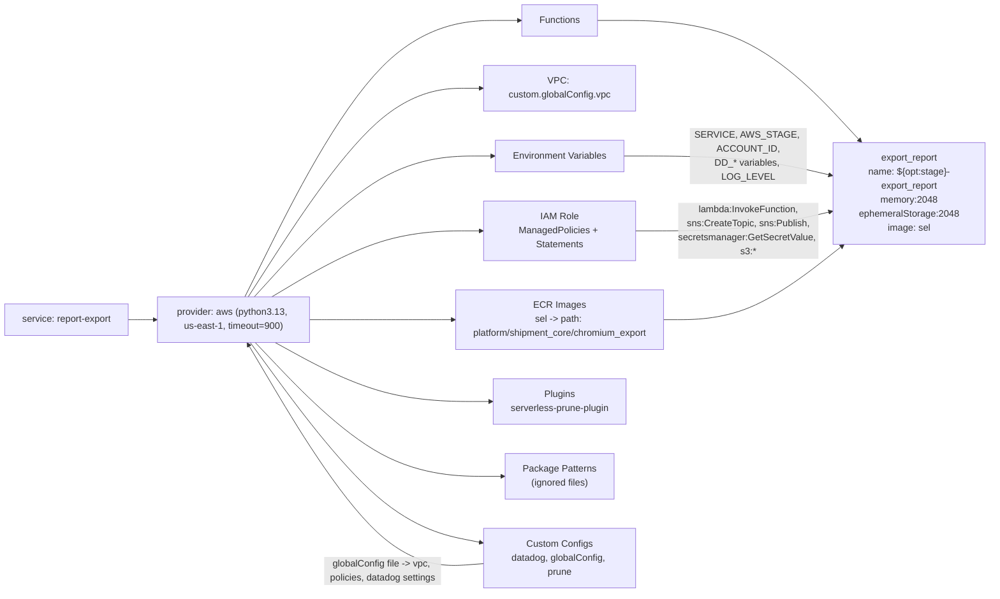

# Diagram: shipment_core/chromium_export/serverless.chromium_export.yml

> Auto-generated by Obscura crawlers

## Mermaid

### SVG

<svg id="container" width="2086.4375" xmlns="http://www.w3.org/2000/svg" class="flowchart" height="966" viewBox="0 0 2086.4375 966" role="graphics-document document" aria-roledescription="flowchart-v2"><g><marker id="container_flowchart-v2-pointEnd" class="marker flowchart-v2" viewBox="0 0 10 10" refX="5" refY="5" markerUnits="userSpaceOnUse" markerWidth="8" markerHeight="8" orient="auto"><path d="M 0 0 L 10 5 L 0 10 z" class="arrowMarkerPath" style="stroke-width: 1; stroke-dasharray: 1, 0;"></path></marker><marker id="container_flowchart-v2-pointStart" class="marker flowchart-v2" viewBox="0 0 10 10" refX="4.5" refY="5" markerUnits="userSpaceOnUse" markerWidth="8" markerHeight="8" orient="auto"><path d="M 0 5 L 10 10 L 10 0 z" class="arrowMarkerPath" style="stroke-width: 1; stroke-dasharray: 1, 0;"></path></marker><marker id="container_flowchart-v2-circleEnd" class="marker flowchart-v2" viewBox="0 0 10 10" refX="11" refY="5" markerUnits="userSpaceOnUse" markerWidth="11" markerHeight="11" orient="auto"><circle cx="5" cy="5" r="5" class="arrowMarkerPath" style="stroke-width: 1; stroke-dasharray: 1, 0;"></circle></marker><marker id="container_flowchart-v2-circleStart" class="marker flowchart-v2" viewBox="0 0 10 10" refX="-1" refY="5" markerUnits="userSpaceOnUse" markerWidth="11" markerHeight="11" orient="auto"><circle cx="5" cy="5" r="5" class="arrowMarkerPath" style="stroke-width: 1; stroke-dasharray: 1, 0;"></circle></marker><marker id="container_flowchart-v2-crossEnd" class="marker cross flowchart-v2" viewBox="0 0 11 11" refX="12" refY="5.2" markerUnits="userSpaceOnUse" markerWidth="11" markerHeight="11" orient="auto"><path d="M 1,1 l 9,9 M 10,1 l -9,9" class="arrowMarkerPath" style="stroke-width: 2; stroke-dasharray: 1, 0;"></path></marker><marker id="container_flowchart-v2-crossStart" class="marker cross flowchart-v2" viewBox="0 0 11 11" refX="-1" refY="5.2" markerUnits="userSpaceOnUse" markerWidth="11" markerHeight="11" orient="auto"><path d="M 1,1 l 9,9 M 10,1 l -9,9" class="arrowMarkerPath" style="stroke-width: 2; stroke-dasharray: 1, 0;"></path></marker><g class="root"><g class="clusters"></g><g class="edgePaths"><path d="M225.047,535L229.214,535C233.38,535,241.714,535,249.38,535C257.047,535,264.047,535,267.547,535L271.047,535" id="L_Service_Provider_0" class="edge-thickness-normal edge-pattern-solid edge-thickness-normal edge-pattern-solid flowchart-link" style=";" data-edge="true" data-et="edge" data-id="L_Service_Provider_0" data-points="W3sieCI6MjI1LjA0Njg3NSwieSI6NTM1fSx7IngiOjI1MC4wNDY4NzUsInkiOjUzNX0seyJ4IjoyNzUuMDQ2ODc1LCJ5Ijo1MzV9XQ==" marker-end="url(#container_flowchart-v2-pointEnd)"></path><path d="M442.155,496L478.47,457.833C514.786,419.667,587.416,343.333,656.517,305.167C725.617,267,791.188,267,823.973,267L856.758,267" id="L_Provider_Env_0" class="edge-thickness-normal edge-pattern-solid edge-thickness-normal edge-pattern-solid flowchart-link" style=";" data-edge="true" data-et="edge" data-id="L_Provider_Env_0" data-points="W3sieCI6NDQyLjE1NTA4Mzk1NTIyMzg2LCJ5Ijo0OTZ9LHsieCI6NjYwLjA0Njg3NSwieSI6MjY3fSx7IngiOjg2MC43NTc4MTI1LCJ5IjoyNjd9XQ==" marker-end="url(#container_flowchart-v2-pointEnd)"></path><path d="M430.945,496L469.129,438.5C507.313,381,583.68,266,651.561,208.5C719.443,151,778.839,151,808.536,151L838.234,151" id="L_Provider_VPC_0" class="edge-thickness-normal edge-pattern-solid edge-thickness-normal edge-pattern-solid flowchart-link" style=";" data-edge="true" data-et="edge" data-id="L_Provider_VPC_0" data-points="W3sieCI6NDMwLjk0NTMxMjUsInkiOjQ5Nn0seyJ4Ijo2NjAuMDQ2ODc1LCJ5IjoxNTF9LHsieCI6ODQyLjIzNDM3NSwieSI6MTUxfV0=" marker-end="url(#container_flowchart-v2-pointEnd)"></path><path d="M476.083,496L506.743,479.167C537.404,462.333,598.725,428.667,659.084,411.833C719.443,395,778.839,395,808.536,395L838.234,395" id="L_Provider_IAM_0" class="edge-thickness-normal edge-pattern-solid edge-thickness-normal edge-pattern-solid flowchart-link" style=";" data-edge="true" data-et="edge" data-id="L_Provider_IAM_0" data-points="W3sieCI6NDc2LjA4MjU4OTI4NTcxNDMsInkiOjQ5Nn0seyJ4Ijo2NjAuMDQ2ODc1LCJ5IjozOTV9LHsieCI6ODQyLjIzNDM3NSwieSI6Mzk1fV0=" marker-end="url(#container_flowchart-v2-pointEnd)"></path><path d="M535.047,535L555.88,535C576.714,535,618.38,535,659.38,535C700.38,535,740.714,535,760.88,535L781.047,535" id="L_Provider_ECR_0" class="edge-thickness-normal edge-pattern-solid edge-thickness-normal edge-pattern-solid flowchart-link" style=";" data-edge="true" data-et="edge" data-id="L_Provider_ECR_0" data-points="W3sieCI6NTM1LjA0Njg3NSwieSI6NTM1fSx7IngiOjY2MC4wNDY4NzUsInkiOjUzNX0seyJ4Ijo3ODUuMDQ2ODc1LCJ5Ijo1MzV9XQ==" marker-end="url(#container_flowchart-v2-pointEnd)"></path><path d="M482.742,574L512.293,588.833C541.844,603.667,600.945,633.333,660.194,648.167C719.443,663,778.839,663,808.536,663L838.234,663" id="L_Provider_Plugins_0" class="edge-thickness-normal edge-pattern-solid edge-thickness-normal edge-pattern-solid flowchart-link" style=";" data-edge="true" data-et="edge" data-id="L_Provider_Plugins_0" data-points="W3sieCI6NDgyLjc0MjE4NzUsInkiOjU3NH0seyJ4Ijo2NjAuMDQ2ODc1LCJ5Ijo2NjN9LHsieCI6ODQyLjIzNDM3NSwieSI6NjYzfV0=" marker-end="url(#container_flowchart-v2-pointEnd)"></path><path d="M443.895,574L479.92,610.167C515.945,646.333,587.996,718.667,653.719,754.833C719.443,791,778.839,791,808.536,791L838.234,791" id="L_Provider_Package_0" class="edge-thickness-normal edge-pattern-solid edge-thickness-normal edge-pattern-solid flowchart-link" style=";" data-edge="true" data-et="edge" data-id="L_Provider_Package_0" data-points="W3sieCI6NDQzLjg5NDUzMTI1LCJ5Ijo1NzR9LHsieCI6NjYwLjA0Njg3NSwieSI6NzkxfSx7IngiOjg0Mi4yMzQzNzUsInkiOjc5MX1d" marker-end="url(#container_flowchart-v2-pointEnd)"></path><path d="M435.183,574L472.661,622.5C510.138,671,585.092,768,652.277,821.639C719.462,875.277,778.878,885.554,808.585,890.693L838.293,895.832" id="L_Provider_Custom_0" class="edge-thickness-normal edge-pattern-solid edge-thickness-normal edge-pattern-solid flowchart-link" style=";" data-edge="true" data-et="edge" data-id="L_Provider_Custom_0" data-points="W3sieCI6NDM1LjE4MzIzODYzNjM2MzYsInkiOjU3NH0seyJ4Ijo2NjAuMDQ2ODc1LCJ5Ijo4NjV9LHsieCI6ODQyLjIzNDM3NSwieSI6ODk2LjUxMzUxMzUxMzUxMzV9XQ==" marker-end="url(#container_flowchart-v2-pointEnd)"></path><path d="M424.937,496L464.122,419.167C503.307,342.333,581.677,188.667,661.385,111.833C741.094,35,822.141,35,862.664,35L903.188,35" id="L_Provider_Functions_0" class="edge-thickness-normal edge-pattern-solid edge-thickness-normal edge-pattern-solid flowchart-link" style=";" data-edge="true" data-et="edge" data-id="L_Provider_Functions_0" data-points="W3sieCI6NDI0LjkzNjg3NSwieSI6NDk2fSx7IngiOjY2MC4wNDY4NzUsInkiOjM1fSx7IngiOjkwNy4xODc1LCJ5IjozNX1d" marker-end="url(#container_flowchart-v2-pointEnd)"></path><path d="M1037.281,35L1089.913,35C1142.544,35,1247.807,35,1363.268,75.472C1478.728,115.945,1604.386,196.889,1667.215,237.362L1730.043,277.834" id="L_Functions_ExportReport_0" class="edge-thickness-normal edge-pattern-solid edge-thickness-normal edge-pattern-solid flowchart-link" style=";" data-edge="true" data-et="edge" data-id="L_Functions_ExportReport_0" data-points="W3sieCI6MTAzNy4yODEyNSwieSI6MzV9LHsieCI6MTM1My4wNzAzMTI1LCJ5IjozNX0seyJ4IjoxNzMzLjQwNjE3MDgxOTI1NjcsInkiOjI4MH1d" marker-end="url(#container_flowchart-v2-pointEnd)"></path><path d="M1083.711,267L1128.604,267C1173.497,267,1263.284,267,1339.792,271.403C1416.299,275.806,1479.528,284.613,1511.143,289.016L1542.757,293.419" id="L_Env_ExportReport_0" class="edge-thickness-normal edge-pattern-solid edge-thickness-normal edge-pattern-solid flowchart-link" style=";" data-edge="true" data-et="edge" data-id="L_Env_ExportReport_0" data-points="W3sieCI6MTA4My43MTA5Mzc1LCJ5IjoyNjd9LHsieCI6MTM1My4wNzAzMTI1LCJ5IjoyNjd9LHsieCI6MTU0Ni43MTg3NSwieSI6MjkzLjk3MTI0OTgwODcyODc3fV0=" marker-end="url(#container_flowchart-v2-pointEnd)"></path><path d="M1102.234,395L1144.04,395C1185.846,395,1269.458,395,1342.879,390.597C1416.299,386.194,1479.528,377.387,1511.143,372.984L1542.757,368.581" id="L_IAM_ExportReport_0" class="edge-thickness-normal edge-pattern-solid edge-thickness-normal edge-pattern-solid flowchart-link" style=";" data-edge="true" data-et="edge" data-id="L_IAM_ExportReport_0" data-points="W3sieCI6MTEwMi4yMzQzNzUsInkiOjM5NX0seyJ4IjoxMzUzLjA3MDMxMjUsInkiOjM5NX0seyJ4IjoxNTQ2LjcxODc1LCJ5IjozNjguMDI4NzUwMTkxMjcxMjN9XQ==" marker-end="url(#container_flowchart-v2-pointEnd)"></path><path d="M1159.422,535L1191.697,535C1223.971,535,1288.521,535,1377.625,509.771C1466.729,484.541,1580.387,434.082,1637.216,408.853L1694.045,383.623" id="L_ECR_ExportReport_0" class="edge-thickness-normal edge-pattern-solid edge-thickness-normal edge-pattern-solid flowchart-link" style=";" data-edge="true" data-et="edge" data-id="L_ECR_ExportReport_0" data-points="W3sieCI6MTE1OS40MjE4NzUsInkiOjUzNX0seyJ4IjoxMzUzLjA3MDMxMjUsInkiOjUzNX0seyJ4IjoxNjk3LjcwMTE3MTg3NSwieSI6MzgyfV0=" marker-end="url(#container_flowchart-v2-pointEnd)"></path><path d="M842.234,928.161L811.87,930.301C781.505,932.441,720.776,936.72,652.349,878.258C583.921,819.796,507.795,698.592,469.732,637.989L431.669,577.387" id="L_Custom_Provider_0" class="edge-thickness-normal edge-pattern-solid edge-thickness-normal edge-pattern-solid flowchart-link" style=";" data-edge="true" data-et="edge" data-id="L_Custom_Provider_0" data-points="W3sieCI6ODQyLjIzNDM3NSwieSI6OTI4LjE2MTE2MTE2MTE2MTJ9LHsieCI6NjYwLjA0Njg3NSwieSI6OTQxfSx7IngiOjQyOS41NDE5NDg4OTE2MjU2LCJ5Ijo1NzR9XQ==" marker-end="url(#container_flowchart-v2-pointEnd)"></path></g><g class="edgeLabels"><g class="edgeLabel"><g class="label" data-id="L_Service_Provider_0" transform="translate(0, 0)"><foreignObject width="0" height="0">

</foreignObject></g></g><g class="edgeLabel"><g class="label" data-id="L_Provider_Env_0" transform="translate(0, 0)"><foreignObject width="0" height="0">

</foreignObject></g></g><g class="edgeLabel"><g class="label" data-id="L_Provider_VPC_0" transform="translate(0, 0)"><foreignObject width="0" height="0">

</foreignObject></g></g><g class="edgeLabel"><g class="label" data-id="L_Provider_IAM_0" transform="translate(0, 0)"><foreignObject width="0" height="0">

</foreignObject></g></g><g class="edgeLabel"><g class="label" data-id="L_Provider_ECR_0" transform="translate(0, 0)"><foreignObject width="0" height="0">

</foreignObject></g></g><g class="edgeLabel"><g class="label" data-id="L_Provider_Plugins_0" transform="translate(0, 0)"><foreignObject width="0" height="0">

</foreignObject></g></g><g class="edgeLabel"><g class="label" data-id="L_Provider_Package_0" transform="translate(0, 0)"><foreignObject width="0" height="0">

</foreignObject></g></g><g class="edgeLabel"><g class="label" data-id="L_Provider_Custom_0" transform="translate(0, 0)"><foreignObject width="0" height="0">

</foreignObject></g></g><g class="edgeLabel"><g class="label" data-id="L_Provider_Functions_0" transform="translate(0, 0)"><foreignObject width="0" height="0">

</foreignObject></g></g><g class="edgeLabel"><g class="label" data-id="L_Functions_ExportReport_0" transform="translate(0, 0)"><foreignObject width="0" height="0">

</foreignObject></g></g><g class="edgeLabel" transform="translate(1353.0703125, 267)"><g class="label" data-id="L_Env_ExportReport_0" transform="translate(-100, -36)"><foreignObject width="200" height="72">

SERVICE, AWS_STAGE, ACCOUNT_ID,\nDD_* variables, LOG_LEVEL

</foreignObject></g></g><g class="edgeLabel" transform="translate(1353.0703125, 395)"><g class="label" data-id="L_IAM_ExportReport_0" transform="translate(-168.6484375, -36)"><foreignObject width="337.296875" height="72">

lambda:InvokeFunction,\nsns:CreateTopic, sns:Publish,\nsecretsmanager:GetSecretValue, s3:*

</foreignObject></g></g><g class="edgeLabel"><g class="label" data-id="L_ECR_ExportReport_0" transform="translate(0, 0)"><foreignObject width="0" height="0">

</foreignObject></g></g><g class="edgeLabel" transform="translate(593.36483, 834.83172)"><g class="label" data-id="L_Custom_Provider_0" transform="translate(-100, -24)"><foreignObject width="200" height="48">

globalConfig file -&gt; vpc, policies, datadog settings

</foreignObject></g></g></g><g class="nodes"><g class="node default" id="flowchart-Service-0" transform="translate(116.5234375, 535)"><rect class="basic label-container" style="" x="-108.5234375" y="-27" width="217.046875" height="54"></rect><g class="label" style="" transform="translate(-78.5234375, -12)"><rect></rect><foreignObject width="157.046875" height="24">

service: report-export

</foreignObject></g></g><g class="node default" id="flowchart-Provider-1" transform="translate(405.046875, 535)"><rect class="basic label-container" style="" x="-130" y="-39" width="260" height="78"></rect><g class="label" style="" transform="translate(-100, -24)"><rect></rect><foreignObject width="200" height="48">

provider: aws (python3.13, us-east-1, timeout=900)

</foreignObject></g></g><g class="node default" id="flowchart-Env-2" transform="translate(972.234375, 267)"><rect class="basic label-container" style="" x="-111.4765625" y="-27" width="222.953125" height="54"></rect><g class="label" style="" transform="translate(-81.4765625, -12)"><rect></rect><foreignObject width="162.953125" height="24">

Environment Variables

</foreignObject></g></g><g class="node default" id="flowchart-VPC-3" transform="translate(972.234375, 151)"><rect class="basic label-container" style="" x="-130" y="-39" width="260" height="78"></rect><g class="label" style="" transform="translate(-100, -24)"><rect></rect><foreignObject width="200" height="48">

VPC: custom.globalConfig.vpc

</foreignObject></g></g><g class="node default" id="flowchart-IAM-4" transform="translate(972.234375, 395)"><rect class="basic label-container" style="" x="-130" y="-51" width="260" height="102"></rect><g class="label" style="" transform="translate(-100, -36)"><rect></rect><foreignObject width="200" height="72">

IAM Role\nManagedPolicies + Statements

</foreignObject></g></g><g class="node default" id="flowchart-ECR-5" transform="translate(972.234375, 535)"><rect class="basic label-container" style="" x="-187.1875" y="-39" width="374.375" height="78"></rect><g class="label" style="" transform="translate(-157.1875, -24)"><rect></rect><foreignObject width="314.375" height="48">

ECR Images\nsel -&gt; path: platform/shipment_core/chromium_export

</foreignObject></g></g><g class="node default" id="flowchart-Functions-6" transform="translate(972.234375, 35)"><rect class="basic label-container" style="" x="-65.046875" y="-27" width="130.09375" height="54"></rect><g class="label" style="" transform="translate(-35.046875, -12)"><rect></rect><foreignObject width="70.09375" height="24">

Functions

</foreignObject></g></g><g class="node default" id="flowchart-ExportReport-7" transform="translate(1812.578125, 331)"><rect class="basic label-container" style="" x="-265.859375" y="-51" width="531.71875" height="102"></rect><g class="label" style="" transform="translate(-235.859375, -36)"><rect></rect><foreignObject width="471.71875" height="72">

export_report\nname: ${opt:stage}-export_report\nmemory:2048\nephemeralStorage:2048\nimage: sel

</foreignObject></g></g><g class="node default" id="flowchart-Plugins-8" transform="translate(972.234375, 663)"><rect class="basic label-container" style="" x="-130" y="-39" width="260" height="78"></rect><g class="label" style="" transform="translate(-100, -24)"><rect></rect><foreignObject width="200" height="48">

Plugins\nserverless-prune-plugin

</foreignObject></g></g><g class="node default" id="flowchart-Package-9" transform="translate(972.234375, 791)"><rect class="basic label-container" style="" x="-130" y="-39" width="260" height="78"></rect><g class="label" style="" transform="translate(-100, -24)"><rect></rect><foreignObject width="200" height="48">

Package Patterns\n(ignored files)

</foreignObject></g></g><g class="node default" id="flowchart-Custom-10" transform="translate(972.234375, 919)"><rect class="basic label-container" style="" x="-130" y="-39" width="260" height="78"></rect><g class="label" style="" transform="translate(-100, -24)"><rect></rect><foreignObject width="200" height="48">

Custom Configs\ndatadog, globalConfig, prune

</foreignObject></g></g></g></g></g></svg>
