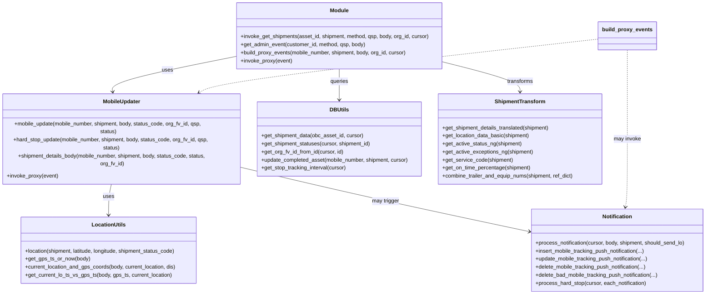

# Diagram: shipment_core/mobile_tracking_api/mobile_tracking_api/common/__init__.py


> Auto-generated by Obscura crawlers

## Diagram 1



### SVG

<svg id="container" width="2132.8046875" xmlns="http://www.w3.org/2000/svg" class="classDiagram" height="878" viewBox="0 0 2132.8046875 878" role="graphics-document document" aria-roledescription="class"><style>#container{font-family:"trebuchet ms",verdana,arial,sans-serif;font-size:16px;fill:#333;}@keyframes edge-animation-frame{from{stroke-dashoffset:0;}}@keyframes dash{to{stroke-dashoffset:0;}}#container .edge-animation-slow{stroke-dasharray:9,5!important;stroke-dashoffset:900;animation:dash 50s linear infinite;stroke-linecap:round;}#container .edge-animation-fast{stroke-dasharray:9,5!important;stroke-dashoffset:900;animation:dash 20s linear infinite;stroke-linecap:round;}#container .error-icon{fill:#552222;}#container .error-text{fill:#552222;stroke:#552222;}#container .edge-thickness-normal{stroke-width:1px;}#container .edge-thickness-thick{stroke-width:3.5px;}#container .edge-pattern-solid{stroke-dasharray:0;}#container .edge-thickness-invisible{stroke-width:0;fill:none;}#container .edge-pattern-dashed{stroke-dasharray:3;}#container .edge-pattern-dotted{stroke-dasharray:2;}#container .marker{fill:#333333;stroke:#333333;}#container .marker.cross{stroke:#333333;}#container svg{font-family:"trebuchet ms",verdana,arial,sans-serif;font-size:16px;}#container p{margin:0;}#container g.classGroup text{fill:#9370DB;stroke:none;font-family:"trebuchet ms",verdana,arial,sans-serif;font-size:10px;}#container g.classGroup text .title{font-weight:bolder;}#container .nodeLabel,#container .edgeLabel{color:#131300;}#container .edgeLabel .label rect{fill:#ECECFF;}#container .label text{fill:#131300;}#container .labelBkg{background:#ECECFF;}#container .edgeLabel .label span{background:#ECECFF;}#container .classTitle{font-weight:bolder;}#container .node rect,#container .node circle,#container .node ellipse,#container .node polygon,#container .node path{fill:#ECECFF;stroke:#9370DB;stroke-width:1px;}#container .divider{stroke:#9370DB;stroke-width:1;}#container g.clickable{cursor:pointer;}#container g.classGroup rect{fill:#ECECFF;stroke:#9370DB;}#container g.classGroup line{stroke:#9370DB;stroke-width:1;}#container .classLabel .box{stroke:none;stroke-width:0;fill:#ECECFF;opacity:0.5;}#container .classLabel .label{fill:#9370DB;font-size:10px;}#container .relation{stroke:#333333;stroke-width:1;fill:none;}#container .dashed-line{stroke-dasharray:3;}#container .dotted-line{stroke-dasharray:1 2;}#container #compositionStart,#container .composition{fill:#333333!important;stroke:#333333!important;stroke-width:1;}#container #compositionEnd,#container .composition{fill:#333333!important;stroke:#333333!important;stroke-width:1;}#container #dependencyStart,#container .dependency{fill:#333333!important;stroke:#333333!important;stroke-width:1;}#container #dependencyStart,#container .dependency{fill:#333333!important;stroke:#333333!important;stroke-width:1;}#container #extensionStart,#container .extension{fill:transparent!important;stroke:#333333!important;stroke-width:1;}#container #extensionEnd,#container .extension{fill:transparent!important;stroke:#333333!important;stroke-width:1;}#container #aggregationStart,#container .aggregation{fill:transparent!important;stroke:#333333!important;stroke-width:1;}#container #aggregationEnd,#container .aggregation{fill:transparent!important;stroke:#333333!important;stroke-width:1;}#container #lollipopStart,#container .lollipop{fill:#ECECFF!important;stroke:#333333!important;stroke-width:1;}#container #lollipopEnd,#container .lollipop{fill:#ECECFF!important;stroke:#333333!important;stroke-width:1;}#container .edgeTerminals{font-size:11px;line-height:initial;}#container .classTitleText{text-anchor:middle;font-size:18px;fill:#333;}#container .label-icon{display:inline-block;height:1em;overflow:visible;vertical-align:-0.125em;}#container .node .label-icon path{fill:currentColor;stroke:revert;stroke-width:revert;}#container :root{--mermaid-font-family:"trebuchet ms",verdana,arial,sans-serif;}</style><g><defs><marker id="container_class-aggregationStart" class="marker aggregation class" refX="18" refY="7" markerWidth="190" markerHeight="240" orient="auto"><path d="M 18,7 L9,13 L1,7 L9,1 Z"></path></marker></defs><defs><marker id="container_class-aggregationEnd" class="marker aggregation class" refX="1" refY="7" markerWidth="20" markerHeight="28" orient="auto"><path d="M 18,7 L9,13 L1,7 L9,1 Z"></path></marker></defs><defs><marker id="container_class-extensionStart" class="marker extension class" refX="18" refY="7" markerWidth="190" markerHeight="240" orient="auto"><path d="M 1,7 L18,13 V 1 Z"></path></marker></defs><defs><marker id="container_class-extensionEnd" class="marker extension class" refX="1" refY="7" markerWidth="20" markerHeight="28" orient="auto"><path d="M 1,1 V 13 L18,7 Z"></path></marker></defs><defs><marker id="container_class-compositionStart" class="marker composition class" refX="18" refY="7" markerWidth="190" markerHeight="240" orient="auto"><path d="M 18,7 L9,13 L1,7 L9,1 Z"></path></marker></defs><defs><marker id="container_class-compositionEnd" class="marker composition class" refX="1" refY="7" markerWidth="20" markerHeight="28" orient="auto"><path d="M 18,7 L9,13 L1,7 L9,1 Z"></path></marker></defs><defs><marker id="container_class-dependencyStart" class="marker dependency class" refX="6" refY="7" markerWidth="190" markerHeight="240" orient="auto"><path d="M 5,7 L9,13 L1,7 L9,1 Z"></path></marker></defs><defs><marker id="container_class-dependencyEnd" class="marker dependency class" refX="13" refY="7" markerWidth="20" markerHeight="28" orient="auto"><path d="M 18,7 L9,13 L14,7 L9,1 Z"></path></marker></defs><defs><marker id="container_class-lollipopStart" class="marker lollipop class" refX="13" refY="7" markerWidth="190" markerHeight="240" orient="auto"><circle stroke="black" fill="transparent" cx="7" cy="7" r="6"></circle></marker></defs><defs><marker id="container_class-lollipopEnd" class="marker lollipop class" refX="1" refY="7" markerWidth="190" markerHeight="240" orient="auto"><circle stroke="black" fill="transparent" cx="7" cy="7" r="6"></circle></marker></defs><g class="root"><g class="clusters"></g><g class="edgePaths"><path d="M719.422,167.929L655.802,180.441C592.182,192.953,464.943,217.976,403.406,241.672C341.87,265.367,346.036,287.734,348.119,298.918L350.202,310.101" id="id_Module_MobileUpdater_1" class="edge-thickness-normal edge-pattern-solid relation" style=";;;" data-edge="true" data-et="edge" data-id="id_Module_MobileUpdater_1" data-points="W3sieCI6NzE5LjQyMTg3NSwieSI6MTY3LjkyOTI3ODMyMjU2MzE2fSx7IngiOjMzNy43MDMxMjUsInkiOjI0M30seyJ4IjozNTEuMzAxMDk5MjAwNTgxNCwieSI6MzE2fV0=" marker-end="url(#container_class-dependencyEnd)"></path><path d="M1029.234,206L1029.234,212.167C1029.234,218.333,1029.234,230.667,1029.234,246C1029.234,261.333,1029.234,279.667,1029.234,288.833L1029.234,298" id="id_Module_DBUtils_2" class="edge-thickness-normal edge-pattern-solid relation" style=";;;" data-edge="true" data-et="edge" data-id="id_Module_DBUtils_2" data-points="W3sieCI6MTAyOS4yMzQzNzUsInkiOjIwNn0seyJ4IjoxMDI5LjIzNDM3NSwieSI6MjQzfSx7IngiOjEwMjkuMjM0Mzc1LCJ5IjozMDR9XQ==" marker-end="url(#container_class-dependencyEnd)"></path><path d="M1339.047,184.469L1378.06,194.224C1417.073,203.979,1495.099,223.49,1534.112,238.411C1573.125,253.333,1573.125,263.667,1573.125,268.833L1573.125,274" id="id_Module_ShipmentTransform_3" class="edge-thickness-normal edge-pattern-solid relation" style=";;;" data-edge="true" data-et="edge" data-id="id_Module_ShipmentTransform_3" data-points="W3sieCI6MTMzOS4wNDY4NzUsInkiOjE4NC40Njg3MDA2MjM0MDIwMX0seyJ4IjoxNTczLjEyNSwieSI6MjQzfSx7IngiOjE1NzMuMTI1LCJ5IjoyODB9XQ==" marker-end="url(#container_class-dependencyEnd)"></path><path d="M347.434,514L344.692,526.167C341.951,538.333,336.468,562.667,333.726,584C330.984,605.333,330.984,623.667,330.984,632.833L330.984,642" id="id_MobileUpdater_LocationUtils_4" class="edge-thickness-normal edge-pattern-solid relation" style=";;;" data-edge="true" data-et="edge" data-id="id_MobileUpdater_LocationUtils_4" data-points="W3sieCI6MzQ3LjQzMzkxMTcwMDU4MTQsInkiOjUxNH0seyJ4IjozMzAuOTg0Mzc1LCJ5Ijo1ODd9LHsieCI6MzMwLjk4NDM3NSwieSI6NjQ4fV0=" marker-end="url(#container_class-dependencyEnd)"></path><path d="M731.484,499.971L793.235,514.476C854.986,528.981,978.487,557.99,1123.042,589.865C1267.597,621.739,1433.206,656.478,1516.011,673.847L1598.815,691.217" id="id_MobileUpdater_Notification_5" class="edge-thickness-normal edge-pattern-solid relation" style=";;;" data-edge="true" data-et="edge" data-id="id_MobileUpdater_Notification_5" data-points="W3sieCI6NzMxLjQ4NDM3NSwieSI6NDk5Ljk3MDk2MzY5Nzk1NDJ9LHsieCI6MTEwMS45ODgyODEyNSwieSI6NTg3fSx7IngiOjE2MDQuNjg3NSwieSI6NjkyLjQ0ODc3MjQ0Mzc0MzV9XQ==" marker-end="url(#container_class-dependencyEnd)"></path><path d="M1811.664,116.219L1620.066,137.349C1428.467,158.479,1045.271,200.74,833.856,233.529C622.441,266.319,582.808,289.638,562.991,301.298L543.174,312.957" id="id_build_proxy_events_MobileUpdater_6" class="edge-thickness-normal edge-pattern-dashed relation" style=";;;" data-edge="true" data-et="edge" data-id="id_build_proxy_events_MobileUpdater_6" data-points="W3sieCI6MTgxMS42NjQwNjI1LCJ5IjoxMTYuMjE5MDI0NjkxNTUzNTZ9LHsieCI6NjYyLjA3NDIxODc1LCJ5IjoyNDN9LHsieCI6NTM4LjAwMzA2NTk1MjAzNDgsInkiOjMxNn1d" marker-end="url(#container_class-dependencyEnd)"></path><path d="M1895.258,149L1895.258,164.667C1895.258,180.333,1895.258,211.667,1895.258,256C1895.258,300.333,1895.258,357.667,1895.258,415C1895.258,472.333,1895.258,529.667,1894.269,563.518C1893.281,597.369,1891.303,607.737,1890.315,612.922L1889.326,618.106" id="id_build_proxy_events_Notification_7" class="edge-thickness-normal edge-pattern-dashed relation" style=";;;" data-edge="true" data-et="edge" data-id="id_build_proxy_events_Notification_7" data-points="W3sieCI6MTg5NS4yNTc4MTI1LCJ5IjoxNDl9LHsieCI6MTg5NS4yNTc4MTI1LCJ5IjoyNDN9LHsieCI6MTg5NS4yNTc4MTI1LCJ5Ijo0MTV9LHsieCI6MTg5NS4yNTc4MTI1LCJ5Ijo1ODd9LHsieCI6MTg4OC4yMDE5Nzc1MzkwNjI1LCJ5Ijo2MjR9XQ==" marker-end="url(#container_class-dependencyEnd)"></path></g><g class="edgeLabels"><g class="edgeLabel" transform="translate(492.13248, 212.62915)"><g class="label" data-id="id_Module_MobileUpdater_1" transform="translate(-16.4921875, -12)"><foreignObject width="32.984375" height="24"><div xmlns="http://www.w3.org/1999/xhtml" class="labelBkg" style="display: table-cell; white-space: nowrap; line-height: 1.5; max-width: 200px; text-align: center;"><span class="edgeLabel"><p>uses</p></span></div></foreignObject></g></g><g class="edgeLabel" transform="translate(1029.234375, 243)"><g class="label" data-id="id_Module_DBUtils_2" transform="translate(-27.2421875, -12)"><foreignObject width="54.484375" height="24"><div xmlns="http://www.w3.org/1999/xhtml" class="labelBkg" style="display: table-cell; white-space: nowrap; line-height: 1.5; max-width: 200px; text-align: center;"><span class="edgeLabel"><p>queries</p></span></div></foreignObject></g></g><g class="edgeLabel" transform="translate(1573.125, 243)"><g class="label" data-id="id_Module_ShipmentTransform_3" transform="translate(-39.4296875, -12)"><foreignObject width="78.859375" height="24"><div xmlns="http://www.w3.org/1999/xhtml" class="labelBkg" style="display: table-cell; white-space: nowrap; line-height: 1.5; max-width: 200px; text-align: center;"><span class="edgeLabel"><p>transforms</p></span></div></foreignObject></g></g><g class="edgeLabel" transform="translate(330.984375, 587)"><g class="label" data-id="id_MobileUpdater_LocationUtils_4" transform="translate(-16.4921875, -12)"><foreignObject width="32.984375" height="24"><div xmlns="http://www.w3.org/1999/xhtml" class="labelBkg" style="display: table-cell; white-space: nowrap; line-height: 1.5; max-width: 200px; text-align: center;"><span class="edgeLabel"><p>uses</p></span></div></foreignObject></g></g><g class="edgeLabel" transform="translate(1167.09723, 600.65759)"><g class="label" data-id="id_MobileUpdater_Notification_5" transform="translate(-41.0234375, -12)"><foreignObject width="82.046875" height="24"><div xmlns="http://www.w3.org/1999/xhtml" class="labelBkg" style="display: table-cell; white-space: nowrap; line-height: 1.5; max-width: 200px; text-align: center;"><span class="edgeLabel"><p>may trigger</p></span></div></foreignObject></g></g><g class="edgeLabel" transform="translate(1165.32608, 187.49954)"><g class="label" data-id="id_build_proxy_events_MobileUpdater_6" transform="translate(-27.5859375, -12)"><foreignObject width="55.171875" height="24"><div xmlns="http://www.w3.org/1999/xhtml" class="labelBkg" style="display: table-cell; white-space: nowrap; line-height: 1.5; max-width: 200px; text-align: center;"><span class="edgeLabel"><p>invokes</p></span></div></foreignObject></g></g><g class="edgeLabel" transform="translate(1895.2578125, 415)"><g class="label" data-id="id_build_proxy_events_Notification_7" transform="translate(-40.9921875, -12)"><foreignObject width="81.984375" height="24"><div xmlns="http://www.w3.org/1999/xhtml" class="labelBkg" style="display: table-cell; white-space: nowrap; line-height: 1.5; max-width: 200px; text-align: center;"><span class="edgeLabel"><p>may invoke</p></span></div></foreignObject></g></g></g><g class="nodes"><g class="node default" id="classId-Module-0" transform="translate(1029.234375, 107)"><g class="basic label-container"><path d="M-309.8125 -99 L309.8125 -99 L309.8125 99 L-309.8125 99" stroke="none" stroke-width="0" fill="#ECECFF" style=""></path><path d="M-309.8125 -99 C-176.38861772751127 -99, -42.96473545502255 -99, 309.8125 -99 M-309.8125 -99 C-150.3856403235784 -99, 9.0412193528432 -99, 309.8125 -99 M309.8125 -99 C309.8125 -26.31064577850448, 309.8125 46.37870844299104, 309.8125 99 M309.8125 -99 C309.8125 -55.17668365859041, 309.8125 -11.353367317180826, 309.8125 99 M309.8125 99 C63.73443252138546 99, -182.34363495722909 99, -309.8125 99 M309.8125 99 C114.16139059757657 99, -81.48971880484686 99, -309.8125 99 M-309.8125 99 C-309.8125 29.425889929832962, -309.8125 -40.148220140334075, -309.8125 -99 M-309.8125 99 C-309.8125 28.359292982998113, -309.8125 -42.281414034003774, -309.8125 -99" stroke="#9370DB" stroke-width="1.3" fill="none" stroke-dasharray="0 0" style=""></path></g><g class="annotation-group text" transform="translate(0, -75)"></g><g class="label-group text" transform="translate(-27.09375, -75)"><g class="label" style="font-weight: bolder" transform="translate(0,-12)"><foreignObject width="54.1875" height="24"><div xmlns="http://www.w3.org/1999/xhtml" style="display: table-cell; white-space: nowrap; line-height: 1.5; max-width: 104px; text-align: center;"><span class="nodeLabel markdown-node-label" style=""><p>Module</p></span></div></foreignObject></g></g><g class="members-group text" transform="translate(-297.8125, -27)"></g><g class="methods-group text" transform="translate(-297.8125, 3)"><g class="label" style="" transform="translate(0,-12)"><foreignObject width="568.53125" height="24"><div xmlns="http://www.w3.org/1999/xhtml" style="display: table-cell; white-space: nowrap; line-height: 1.5; max-width: 626px; text-align: center;"><span class="nodeLabel markdown-node-label" style=""><p>+invoke_get_shipments(asset_id, shipment, method, qsp, body, org_id, cursor)</p></span></div></foreignObject></g><g class="label" style="" transform="translate(0,12)"><foreignObject width="375.421875" height="24"><div xmlns="http://www.w3.org/1999/xhtml" style="display: table-cell; white-space: nowrap; line-height: 1.5; max-width: 433px; text-align: center;"><span class="nodeLabel markdown-node-label" style=""><p>+get_admin_event(customer_id, method, qsp, body)</p></span></div></foreignObject></g><g class="label" style="" transform="translate(0,36)"><foreignObject width="501.734375" height="24"><div xmlns="http://www.w3.org/1999/xhtml" style="display: table-cell; white-space: nowrap; line-height: 1.5; max-width: 559px; text-align: center;"><span class="nodeLabel markdown-node-label" style=""><p>+build_proxy_events(mobile_number, shipment, body, org_id, cursor)</p></span></div></foreignObject></g><g class="label" style="" transform="translate(0,60)"><foreignObject width="154.421875" height="24"><div xmlns="http://www.w3.org/1999/xhtml" style="display: table-cell; white-space: nowrap; line-height: 1.5; max-width: 212px; text-align: center;"><span class="nodeLabel markdown-node-label" style=""><p>+invoke_proxy(event)</p></span></div></foreignObject></g></g><g class="divider" style=""><path d="M-309.8125 -51 C-96.48993902310727 -51, 116.83262195378546 -51, 309.8125 -51 M-309.8125 -51 C-110.81624162895122 -51, 88.18001674209756 -51, 309.8125 -51" stroke="#9370DB" stroke-width="1.3" fill="none" stroke-dasharray="0 0" style=""></path></g><g class="divider" style=""><path d="M-309.8125 -27 C-182.1746150593038 -27, -54.53673011860755 -27, 309.8125 -27 M-309.8125 -27 C-84.0259745157085 -27, 141.760550968583 -27, 309.8125 -27" stroke="#9370DB" stroke-width="1.3" fill="none" stroke-dasharray="0 0" style=""></path></g></g><g class="node default" id="classId-MobileUpdater-1" transform="translate(369.7421875, 415)"><g class="basic label-container"><path d="M-361.7421875 -99 L361.7421875 -99 L361.7421875 99 L-361.7421875 99" stroke="none" stroke-width="0" fill="#ECECFF" style=""></path><path d="M-361.7421875 -99 C-138.00921347461878 -99, 85.72376055076245 -99, 361.7421875 -99 M-361.7421875 -99 C-209.11644372533985 -99, -56.4906999506797 -99, 361.7421875 -99 M361.7421875 -99 C361.7421875 -39.54110283166801, 361.7421875 19.917794336663974, 361.7421875 99 M361.7421875 -99 C361.7421875 -55.90250404012888, 361.7421875 -12.805008080257764, 361.7421875 99 M361.7421875 99 C203.66718295056776 99, 45.59217840113553 99, -361.7421875 99 M361.7421875 99 C126.62020098006349 99, -108.50178553987303 99, -361.7421875 99 M-361.7421875 99 C-361.7421875 20.64388590336435, -361.7421875 -57.7122281932713, -361.7421875 -99 M-361.7421875 99 C-361.7421875 56.12990479901622, -361.7421875 13.259809598032433, -361.7421875 -99" stroke="#9370DB" stroke-width="1.3" fill="none" stroke-dasharray="0 0" style=""></path></g><g class="annotation-group text" transform="translate(0, -75)"></g><g class="label-group text" transform="translate(-54.484375, -75)"><g class="label" style="font-weight: bolder" transform="translate(0,-12)"><foreignObject width="108.96875" height="24"><div xmlns="http://www.w3.org/1999/xhtml" style="display: table-cell; white-space: nowrap; line-height: 1.5; max-width: 159px; text-align: center;"><span class="nodeLabel markdown-node-label" style=""><p>MobileUpdater</p></span></div></foreignObject></g></g><g class="members-group text" transform="translate(-349.7421875, -27)"></g><g class="methods-group text" transform="translate(-349.7421875, 3)"><g class="label" style="" transform="translate(0,-12)"><foreignObject width="618.828125" height="24"><div xmlns="http://www.w3.org/1999/xhtml" style="display: table-cell; white-space: nowrap; line-height: 1.5; max-width: 676px; text-align: center;"><span class="nodeLabel markdown-node-label" style=""><p>+mobile_update(mobile_number, shipment, body, status_code, org_fv_id, qsp, status)</p></span></div></foreignObject></g><g class="label" style="" transform="translate(0,12)"><foreignObject width="641.9375" height="24"><div xmlns="http://www.w3.org/1999/xhtml" style="display: table-cell; white-space: nowrap; line-height: 1.5; max-width: 699px; text-align: center;"><span class="nodeLabel markdown-node-label" style=""><p>+hard_stop_update(mobile_number, shipment, body, status_code, org_fv_id, qsp, status)</p></span></div></foreignObject></g><g class="label" style="" transform="translate(0,36)"><foreignObject width="645" height="24"><div xmlns="http://www.w3.org/1999/xhtml" style="display: table-cell; white-space: nowrap; line-height: 1.5; max-width: 702px; text-align: center;"><span class="nodeLabel markdown-node-label" style=""><p>+shipment_details_body(mobile_number, shipment, body, status_code, status, org_fv_id)</p></span></div></foreignObject></g><g class="label" style="" transform="translate(0,60)"><foreignObject width="154.421875" height="24"><div xmlns="http://www.w3.org/1999/xhtml" style="display: table-cell; white-space: nowrap; line-height: 1.5; max-width: 212px; text-align: center;"><span class="nodeLabel markdown-node-label" style=""><p>+invoke_proxy(event)</p></span></div></foreignObject></g></g><g class="divider" style=""><path d="M-361.7421875 -51 C-79.99129034574139 -51, 201.75960680851722 -51, 361.7421875 -51 M-361.7421875 -51 C-197.63682403537376 -51, -33.53146057074753 -51, 361.7421875 -51" stroke="#9370DB" stroke-width="1.3" fill="none" stroke-dasharray="0 0" style=""></path></g><g class="divider" style=""><path d="M-361.7421875 -27 C-131.44943826273018 -27, 98.84331097453963 -27, 361.7421875 -27 M-361.7421875 -27 C-126.16564274946845 -27, 109.4109020010631 -27, 361.7421875 -27" stroke="#9370DB" stroke-width="1.3" fill="none" stroke-dasharray="0 0" style=""></path></g></g><g class="node default" id="classId-LocationUtils-2" transform="translate(330.984375, 747)"><g class="basic label-container"><path d="M-266.203125 -99 L266.203125 -99 L266.203125 99 L-266.203125 99" stroke="none" stroke-width="0" fill="#ECECFF" style=""></path><path d="M-266.203125 -99 C-120.57816006147078 -99, 25.046804877058435 -99, 266.203125 -99 M-266.203125 -99 C-116.55876855419149 -99, 33.085587891617024 -99, 266.203125 -99 M266.203125 -99 C266.203125 -53.16591530526466, 266.203125 -7.331830610529323, 266.203125 99 M266.203125 -99 C266.203125 -34.56998340873163, 266.203125 29.86003318253674, 266.203125 99 M266.203125 99 C150.54150683126147 99, 34.879888662522944 99, -266.203125 99 M266.203125 99 C103.03018947551604 99, -60.14274604896792 99, -266.203125 99 M-266.203125 99 C-266.203125 43.32395527627787, -266.203125 -12.352089447444257, -266.203125 -99 M-266.203125 99 C-266.203125 26.758915009325065, -266.203125 -45.48216998134987, -266.203125 -99" stroke="#9370DB" stroke-width="1.3" fill="none" stroke-dasharray="0 0" style=""></path></g><g class="annotation-group text" transform="translate(0, -75)"></g><g class="label-group text" transform="translate(-48.140625, -75)"><g class="label" style="font-weight: bolder" transform="translate(0,-12)"><foreignObject width="96.28125" height="24"><div xmlns="http://www.w3.org/1999/xhtml" style="display: table-cell; white-space: nowrap; line-height: 1.5; max-width: 145px; text-align: center;"><span class="nodeLabel markdown-node-label" style=""><p>LocationUtils</p></span></div></foreignObject></g></g><g class="members-group text" transform="translate(-254.203125, -27)"></g><g class="methods-group text" transform="translate(-254.203125, 3)"><g class="label" style="" transform="translate(0,-12)"><foreignObject width="460.265625" height="24"><div xmlns="http://www.w3.org/1999/xhtml" style="display: table-cell; white-space: nowrap; line-height: 1.5; max-width: 518px; text-align: center;"><span class="nodeLabel markdown-node-label" style=""><p>+location(shipment, latitude, longitude, shipment_status_code)</p></span></div></foreignObject></g><g class="label" style="" transform="translate(0,12)"><foreignObject width="192.328125" height="24"><div xmlns="http://www.w3.org/1999/xhtml" style="display: table-cell; white-space: nowrap; line-height: 1.5; max-width: 250px; text-align: center;"><span class="nodeLabel markdown-node-label" style=""><p>+get_gps_ts_or_now(body)</p></span></div></foreignObject></g><g class="label" style="" transform="translate(0,36)"><foreignObject width="457.265625" height="24"><div xmlns="http://www.w3.org/1999/xhtml" style="display: table-cell; white-space: nowrap; line-height: 1.5; max-width: 515px; text-align: center;"><span class="nodeLabel markdown-node-label" style=""><p>+current_location_and_gps_coords(body, current_location, dis)</p></span></div></foreignObject></g><g class="label" style="" transform="translate(0,60)"><foreignObject width="439.515625" height="24"><div xmlns="http://www.w3.org/1999/xhtml" style="display: table-cell; white-space: nowrap; line-height: 1.5; max-width: 497px; text-align: center;"><span class="nodeLabel markdown-node-label" style=""><p>+get_current_lo_ts_vs_gps_ts(body, gps_ts, current_location)</p></span></div></foreignObject></g></g><g class="divider" style=""><path d="M-266.203125 -51 C-78.67178696178709 -51, 108.85955107642582 -51, 266.203125 -51 M-266.203125 -51 C-117.16732557076526 -51, 31.868473858469486 -51, 266.203125 -51" stroke="#9370DB" stroke-width="1.3" fill="none" stroke-dasharray="0 0" style=""></path></g><g class="divider" style=""><path d="M-266.203125 -27 C-139.32650709032777 -27, -12.449889180655504 -27, 266.203125 -27 M-266.203125 -27 C-129.95772720282451 -27, 6.2876705943509705 -27, 266.203125 -27" stroke="#9370DB" stroke-width="1.3" fill="none" stroke-dasharray="0 0" style=""></path></g></g><g class="node default" id="classId-DBUtils-3" transform="translate(1029.234375, 415)"><g class="basic label-container"><path d="M-247.75 -111 L247.75 -111 L247.75 111 L-247.75 111" stroke="none" stroke-width="0" fill="#ECECFF" style=""></path><path d="M-247.75 -111 C-111.5014182199354 -111, 24.747163560129195 -111, 247.75 -111 M-247.75 -111 C-108.4466001468083 -111, 30.856799706383413 -111, 247.75 -111 M247.75 -111 C247.75 -31.852603385511614, 247.75 47.29479322897677, 247.75 111 M247.75 -111 C247.75 -38.57760925592896, 247.75 33.844781488142075, 247.75 111 M247.75 111 C56.87047018431602 111, -134.00905963136796 111, -247.75 111 M247.75 111 C105.70212666975479 111, -36.34574666049042 111, -247.75 111 M-247.75 111 C-247.75 33.74531863819176, -247.75 -43.509362723616476, -247.75 -111 M-247.75 111 C-247.75 44.76803846709733, -247.75 -21.463923065805346, -247.75 -111" stroke="#9370DB" stroke-width="1.3" fill="none" stroke-dasharray="0 0" style=""></path></g><g class="annotation-group text" transform="translate(0, -87)"></g><g class="label-group text" transform="translate(-26.9375, -87)"><g class="label" style="font-weight: bolder" transform="translate(0,-12)"><foreignObject width="53.875" height="24"><div xmlns="http://www.w3.org/1999/xhtml" style="display: table-cell; white-space: nowrap; line-height: 1.5; max-width: 103px; text-align: center;"><span class="nodeLabel markdown-node-label" style=""><p>DBUtils</p></span></div></foreignObject></g></g><g class="members-group text" transform="translate(-235.75, -39)"></g><g class="methods-group text" transform="translate(-235.75, -9)"><g class="label" style="" transform="translate(0,-12)"><foreignObject width="306.859375" height="24"><div xmlns="http://www.w3.org/1999/xhtml" style="display: table-cell; white-space: nowrap; line-height: 1.5; max-width: 364px; text-align: center;"><span class="nodeLabel markdown-node-label" style=""><p>+get_shipment_data(obc_asset_id, cursor)</p></span></div></foreignObject></g><g class="label" style="" transform="translate(0,12)"><foreignObject width="329.96875" height="24"><div xmlns="http://www.w3.org/1999/xhtml" style="display: table-cell; white-space: nowrap; line-height: 1.5; max-width: 387px; text-align: center;"><span class="nodeLabel markdown-node-label" style=""><p>+get_shipment_statuses(cursor, shipment_id)</p></span></div></foreignObject></g><g class="label" style="" transform="translate(0,36)"><foreignObject width="246.859375" height="24"><div xmlns="http://www.w3.org/1999/xhtml" style="display: table-cell; white-space: nowrap; line-height: 1.5; max-width: 304px; text-align: center;"><span class="nodeLabel markdown-node-label" style=""><p>+get_org_fv_id_from_id(cursor, id)</p></span></div></foreignObject></g><g class="label" style="" transform="translate(0,60)"><foreignObject width="444.5625" height="24"><div xmlns="http://www.w3.org/1999/xhtml" style="display: table-cell; white-space: nowrap; line-height: 1.5; max-width: 502px; text-align: center;"><span class="nodeLabel markdown-node-label" style=""><p>+update_completed_asset(mobile_number, shipment, cursor)</p></span></div></foreignObject></g><g class="label" style="" transform="translate(0,84)"><foreignObject width="256.203125" height="24"><div xmlns="http://www.w3.org/1999/xhtml" style="display: table-cell; white-space: nowrap; line-height: 1.5; max-width: 314px; text-align: center;"><span class="nodeLabel markdown-node-label" style=""><p>+get_stop_tracking_interval(cursor)</p></span></div></foreignObject></g></g><g class="divider" style=""><path d="M-247.75 -63 C-124.91529826005169 -63, -2.08059652010337 -63, 247.75 -63 M-247.75 -63 C-79.45753995946157 -63, 88.83492008107686 -63, 247.75 -63" stroke="#9370DB" stroke-width="1.3" fill="none" stroke-dasharray="0 0" style=""></path></g><g class="divider" style=""><path d="M-247.75 -39 C-61.923100241439556 -39, 123.90379951712089 -39, 247.75 -39 M-247.75 -39 C-107.81448894751335 -39, 32.12102210497329 -39, 247.75 -39" stroke="#9370DB" stroke-width="1.3" fill="none" stroke-dasharray="0 0" style=""></path></g></g><g class="node default" id="classId-Notification-4" transform="translate(1864.74609375, 747)"><g class="basic label-container"><path d="M-260.05859375 -123 L260.05859375 -123 L260.05859375 123 L-260.05859375 123" stroke="none" stroke-width="0" fill="#ECECFF" style=""></path><path d="M-260.05859375 -123 C-152.09233224946792 -123, -44.12607074893586 -123, 260.05859375 -123 M-260.05859375 -123 C-88.63056476729432 -123, 82.79746421541137 -123, 260.05859375 -123 M260.05859375 -123 C260.05859375 -37.90047921242275, 260.05859375 47.199041575154496, 260.05859375 123 M260.05859375 -123 C260.05859375 -60.84556432814633, 260.05859375 1.308871343707338, 260.05859375 123 M260.05859375 123 C114.80300002985572 123, -30.452593690288552 123, -260.05859375 123 M260.05859375 123 C85.97689752124035 123, -88.10479870751931 123, -260.05859375 123 M-260.05859375 123 C-260.05859375 36.14525083612595, -260.05859375 -50.70949832774809, -260.05859375 -123 M-260.05859375 123 C-260.05859375 70.15601494907617, -260.05859375 17.312029898152318, -260.05859375 -123" stroke="#9370DB" stroke-width="1.3" fill="none" stroke-dasharray="0 0" style=""></path></g><g class="annotation-group text" transform="translate(0, -99)"></g><g class="label-group text" transform="translate(-42.8828125, -99)"><g class="label" style="font-weight: bolder" transform="translate(0,-12)"><foreignObject width="85.765625" height="24"><div xmlns="http://www.w3.org/1999/xhtml" style="display: table-cell; white-space: nowrap; line-height: 1.5; max-width: 135px; text-align: center;"><span class="nodeLabel markdown-node-label" style=""><p>Notification</p></span></div></foreignObject></g></g><g class="members-group text" transform="translate(-248.05859375, -51)"></g><g class="methods-group text" transform="translate(-248.05859375, -21)"><g class="label" style="" transform="translate(0,-12)"><foreignObject width="453.234375" height="24"><div xmlns="http://www.w3.org/1999/xhtml" style="display: table-cell; white-space: nowrap; line-height: 1.5; max-width: 511px; text-align: center;"><span class="nodeLabel markdown-node-label" style=""><p>+process_notification(cursor, body, shipment, should_send_lo)</p></span></div></foreignObject></g><g class="label" style="" transform="translate(0,12)"><foreignObject width="332.234375" height="24"><div xmlns="http://www.w3.org/1999/xhtml" style="display: table-cell; white-space: nowrap; line-height: 1.5; max-width: 390px; text-align: center;"><span class="nodeLabel markdown-node-label" style=""><p>+insert_mobile_tracking_push_notification(...)</p></span></div></foreignObject></g><g class="label" style="" transform="translate(0,36)"><foreignObject width="341.21875" height="24"><div xmlns="http://www.w3.org/1999/xhtml" style="display: table-cell; white-space: nowrap; line-height: 1.5; max-width: 399px; text-align: center;"><span class="nodeLabel markdown-node-label" style=""><p>+update_mobile_tracking_push_notification(...)</p></span></div></foreignObject></g><g class="label" style="" transform="translate(0,60)"><foreignObject width="335.75" height="24"><div xmlns="http://www.w3.org/1999/xhtml" style="display: table-cell; white-space: nowrap; line-height: 1.5; max-width: 393px; text-align: center;"><span class="nodeLabel markdown-node-label" style=""><p>+delete_mobile_tracking_push_notification(...)</p></span></div></foreignObject></g><g class="label" style="" transform="translate(0,84)"><foreignObject width="371.6875" height="24"><div xmlns="http://www.w3.org/1999/xhtml" style="display: table-cell; white-space: nowrap; line-height: 1.5; max-width: 429px; text-align: center;"><span class="nodeLabel markdown-node-label" style=""><p>+delete_bad_mobile_tracking_push_notification(...)</p></span></div></foreignObject></g><g class="label" style="" transform="translate(0,108)"><foreignObject width="333.796875" height="24"><div xmlns="http://www.w3.org/1999/xhtml" style="display: table-cell; white-space: nowrap; line-height: 1.5; max-width: 391px; text-align: center;"><span class="nodeLabel markdown-node-label" style=""><p>+process_hard_stop(cursor, each_notification)</p></span></div></foreignObject></g></g><g class="divider" style=""><path d="M-260.05859375 -75 C-127.31319328863609 -75, 5.4322071727278285 -75, 260.05859375 -75 M-260.05859375 -75 C-88.92045919865336 -75, 82.21767535269328 -75, 260.05859375 -75" stroke="#9370DB" stroke-width="1.3" fill="none" stroke-dasharray="0 0" style=""></path></g><g class="divider" style=""><path d="M-260.05859375 -51 C-96.82046237316999 -51, 66.41766900366002 -51, 260.05859375 -51 M-260.05859375 -51 C-68.73203579391708 -51, 122.59452216216584 -51, 260.05859375 -51" stroke="#9370DB" stroke-width="1.3" fill="none" stroke-dasharray="0 0" style=""></path></g></g><g class="node default" id="classId-ShipmentTransform-5" transform="translate(1573.125, 415)"><g class="basic label-container"><path d="M-246.140625 -135 L246.140625 -135 L246.140625 135 L-246.140625 135" stroke="none" stroke-width="0" fill="#ECECFF" style=""></path><path d="M-246.140625 -135 C-121.9509067541989 -135, 2.238811491602206 -135, 246.140625 -135 M-246.140625 -135 C-114.48355712978434 -135, 17.17351074043131 -135, 246.140625 -135 M246.140625 -135 C246.140625 -74.37137422412017, 246.140625 -13.742748448240349, 246.140625 135 M246.140625 -135 C246.140625 -39.74003576202439, 246.140625 55.51992847595122, 246.140625 135 M246.140625 135 C132.50556764576524 135, 18.87051029153048 135, -246.140625 135 M246.140625 135 C75.3473021907555 135, -95.446020618489 135, -246.140625 135 M-246.140625 135 C-246.140625 61.86642785630029, -246.140625 -11.267144287399418, -246.140625 -135 M-246.140625 135 C-246.140625 69.979444288878, -246.140625 4.9588885777559994, -246.140625 -135" stroke="#9370DB" stroke-width="1.3" fill="none" stroke-dasharray="0 0" style=""></path></g><g class="annotation-group text" transform="translate(0, -111)"></g><g class="label-group text" transform="translate(-72.390625, -111)"><g class="label" style="font-weight: bolder" transform="translate(0,-12)"><foreignObject width="144.78125" height="24"><div xmlns="http://www.w3.org/1999/xhtml" style="display: table-cell; white-space: nowrap; line-height: 1.5; max-width: 193px; text-align: center;"><span class="nodeLabel markdown-node-label" style=""><p>ShipmentTransform</p></span></div></foreignObject></g></g><g class="members-group text" transform="translate(-234.140625, -63)"></g><g class="methods-group text" transform="translate(-234.140625, -33)"><g class="label" style="" transform="translate(0,-12)"><foreignObject width="325.21875" height="24"><div xmlns="http://www.w3.org/1999/xhtml" style="display: table-cell; white-space: nowrap; line-height: 1.5; max-width: 383px; text-align: center;"><span class="nodeLabel markdown-node-label" style=""><p>+get_shipment_details_translated(shipment)</p></span></div></foreignObject></g><g class="label" style="" transform="translate(0,12)"><foreignObject width="263.15625" height="24"><div xmlns="http://www.w3.org/1999/xhtml" style="display: table-cell; white-space: nowrap; line-height: 1.5; max-width: 321px; text-align: center;"><span class="nodeLabel markdown-node-label" style=""><p>+get_location_data_basic(shipment)</p></span></div></foreignObject></g><g class="label" style="" transform="translate(0,36)"><foreignObject width="238.625" height="24"><div xmlns="http://www.w3.org/1999/xhtml" style="display: table-cell; white-space: nowrap; line-height: 1.5; max-width: 296px; text-align: center;"><span class="nodeLabel markdown-node-label" style=""><p>+get_active_status_ng(shipment)</p></span></div></foreignObject></g><g class="label" style="" transform="translate(0,60)"><foreignObject width="272.140625" height="24"><div xmlns="http://www.w3.org/1999/xhtml" style="display: table-cell; white-space: nowrap; line-height: 1.5; max-width: 330px; text-align: center;"><span class="nodeLabel markdown-node-label" style=""><p>+get_active_exceptions_ng(shipment)</p></span></div></foreignObject></g><g class="label" style="" transform="translate(0,84)"><foreignObject width="211.125" height="24"><div xmlns="http://www.w3.org/1999/xhtml" style="display: table-cell; white-space: nowrap; line-height: 1.5; max-width: 268px; text-align: center;"><span class="nodeLabel markdown-node-label" style=""><p>+get_service_code(shipment)</p></span></div></foreignObject></g><g class="label" style="" transform="translate(0,108)"><foreignObject width="265.140625" height="24"><div xmlns="http://www.w3.org/1999/xhtml" style="display: table-cell; white-space: nowrap; line-height: 1.5; max-width: 323px; text-align: center;"><span class="nodeLabel markdown-node-label" style=""><p>+get_on_time_percentage(shipment)</p></span></div></foreignObject></g><g class="label" style="" transform="translate(0,132)"><foreignObject width="395.890625" height="24"><div xmlns="http://www.w3.org/1999/xhtml" style="display: table-cell; white-space: nowrap; line-height: 1.5; max-width: 453px; text-align: center;"><span class="nodeLabel markdown-node-label" style=""><p>+combine_trailer_and_equip_nums(shipment, ref_dict)</p></span></div></foreignObject></g></g><g class="divider" style=""><path d="M-246.140625 -87 C-91.62607443386761 -87, 62.88847613226477 -87, 246.140625 -87 M-246.140625 -87 C-99.30778862654802 -87, 47.525047746903965 -87, 246.140625 -87" stroke="#9370DB" stroke-width="1.3" fill="none" stroke-dasharray="0 0" style=""></path></g><g class="divider" style=""><path d="M-246.140625 -63 C-133.9343612086244 -63, -21.72809741724879 -63, 246.140625 -63 M-246.140625 -63 C-70.95351271443741 -63, 104.23359957112518 -63, 246.140625 -63" stroke="#9370DB" stroke-width="1.3" fill="none" stroke-dasharray="0 0" style=""></path></g></g><g class="node default" id="classId-build_proxy_events-6" transform="translate(1895.2578125, 107)"><g class="basic label-container"><path d="M-83.59375 -42 L83.59375 -42 L83.59375 42 L-83.59375 42" stroke="none" stroke-width="0" fill="#ECECFF" style=""></path><path d="M-83.59375 -42 C-21.026953708931877 -42, 41.539842582136245 -42, 83.59375 -42 M-83.59375 -42 C-37.0863229200937 -42, 9.4211041598126 -42, 83.59375 -42 M83.59375 -42 C83.59375 -17.79151789248602, 83.59375 6.41696421502796, 83.59375 42 M83.59375 -42 C83.59375 -20.259654244940727, 83.59375 1.4806915101185467, 83.59375 42 M83.59375 42 C29.608858894337978 42, -24.376032211324045 42, -83.59375 42 M83.59375 42 C47.10547612966399 42, 10.617202259327982 42, -83.59375 42 M-83.59375 42 C-83.59375 12.87477948316372, -83.59375 -16.25044103367256, -83.59375 -42 M-83.59375 42 C-83.59375 13.429009336025036, -83.59375 -15.141981327949928, -83.59375 -42" stroke="#9370DB" stroke-width="1.3" fill="none" stroke-dasharray="0 0" style=""></path></g><g class="annotation-group text" transform="translate(0, -18)"></g><g class="label-group text" transform="translate(-71.59375, -18)"><g class="label" style="font-weight: bolder" transform="translate(0,-12)"><foreignObject width="143.1875" height="24"><div xmlns="http://www.w3.org/1999/xhtml" style="display: table-cell; white-space: nowrap; line-height: 1.5; max-width: 191px; text-align: center;"><span class="nodeLabel markdown-node-label" style=""><p>build_proxy_events</p></span></div></foreignObject></g></g><g class="members-group text" transform="translate(-71.59375, 30)"></g><g class="methods-group text" transform="translate(-71.59375, 60)"></g><g class="divider" style=""><path d="M-83.59375 6 C-20.647960262433486 6, 42.29782947513303 6, 83.59375 6 M-83.59375 6 C-44.235057092374525 6, -4.87636418474905 6, 83.59375 6" stroke="#9370DB" stroke-width="1.3" fill="none" stroke-dasharray="0 0" style=""></path></g><g class="divider" style=""><path d="M-83.59375 24 C-21.155029948576654 24, 41.28369010284669 24, 83.59375 24 M-83.59375 24 C-48.46790787382852 24, -13.342065747657045 24, 83.59375 24" stroke="#9370DB" stroke-width="1.3" fill="none" stroke-dasharray="0 0" style=""></path></g></g></g></g></g></svg>

## Diagram 2

```mermaid
flowchart LR
    Start([start build_proxy_events]) --> GetCode{code}
    GetCode -->|SO or ST| Path_SO_ST[Call mobile_update(code)]
    GetCode -->|D1 or XX| Path_D1_XX[maybe update_completed_asset\nCall mobile_update(code)\nCall mobile_update(code+"M")]
    GetCode -->|GOM/DWELLM/GOEM/SO/ST/D1/XX| Path_LO1[Append LO event]
    GetCode -->|SO_IDLE_TIMEOUT| Path_IDLE{check_for_existing_so_idle_timeout}
    Path_IDLE -->|duplicate| Idle_Skip[Log skip]
    Path_IDLE -->|not duplicate| Idle_HardStop[Call hard_stop_update]
    GetCode -->|else| Path_Default{shipment has current_location?}
    Path_Default -->|yes| Check_Loc[compute should_send_lo and is_tracking_idle]
    Check_Loc -->|should_send_lo and not idle| Add_LO[Append mobile_update(code)]
    Check_Loc -->|else| NoAction[No LO appended]
    Path_Default -->|no| Add_Event[Append mobile_update(code)]
    Path_SO_ST --> AfterEvents1[Continue]
    Path_D1_XX --> AfterEvents1
    Path_LO1 --> AfterEvents1
    Add_Event --> AfterEvents1
    Add_LO --> AfterEvents1
    AfterEvents1 --> NotifyCheck{if code in [ST,SO,XX,D1,LO,SO_IDLE_TIMEOUT]\nand body.device_token present}
    NotifyCheck -->|yes| Notify[process_notification(cursor,body,shipment,should_send_lo)]
    NotifyCheck -->|no| End([return events])
```

> SVG rendering failed for this diagram.
