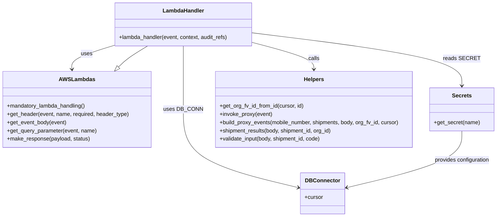

# Diagram: shipment_core/mobile_tracking_api/mobile_tracking_api/update_mobile_asset.py


> Auto-generated by Obscura crawlers

## Diagram 1

```mermaid
flowchart TD
    A[Event received] --> B[get_header(token)]
    B --> C[get_event_body]
    C --> D[extract code, mobile_number, org_id, shipment_id]
    D --> E[validate_input(body, shipment_id, code)]
    E --> F{Authorized?}
    F -->|yes| G[shipment_results(body, shipment_id, org_id)]
    G --> H[get_org_fv_id_from_id(cursor, created_by_org_id)]
    H --> I[build_proxy_events(mobile_number, shipments, body, org_fv_id, cursor)]
    I --> J{destination_actual_departure missing\nAND active_status not in (expired,canceled)?}
    J -->|yes| K[for each e in proxy_events -> invoke_proxy(e)]
    J -->|no| L[return make_response([], 200)]
    K --> M[return make_response(proxy_events, 200)]
    F -->|no| N[raise BadRequestError("Incorrect authorization")]
    style A fill:#f9f,stroke:#333,stroke-width:1px
    style F fill:#ffebcc,stroke:#333,stroke-width:1px
    style J fill:#ffebcc,stroke:#333,stroke-width:1px
```

> SVG rendering failed for this diagram.

## Diagram 2



### SVG

<svg id="container" width="1438.96875" xmlns="http://www.w3.org/2000/svg" class="classDiagram" height="632" viewBox="0 0 1438.96875 632" role="graphics-document document" aria-roledescription="class"><style>#container{font-family:"trebuchet ms",verdana,arial,sans-serif;font-size:16px;fill:#333;}@keyframes edge-animation-frame{from{stroke-dashoffset:0;}}@keyframes dash{to{stroke-dashoffset:0;}}#container .edge-animation-slow{stroke-dasharray:9,5!important;stroke-dashoffset:900;animation:dash 50s linear infinite;stroke-linecap:round;}#container .edge-animation-fast{stroke-dasharray:9,5!important;stroke-dashoffset:900;animation:dash 20s linear infinite;stroke-linecap:round;}#container .error-icon{fill:#552222;}#container .error-text{fill:#552222;stroke:#552222;}#container .edge-thickness-normal{stroke-width:1px;}#container .edge-thickness-thick{stroke-width:3.5px;}#container .edge-pattern-solid{stroke-dasharray:0;}#container .edge-thickness-invisible{stroke-width:0;fill:none;}#container .edge-pattern-dashed{stroke-dasharray:3;}#container .edge-pattern-dotted{stroke-dasharray:2;}#container .marker{fill:#333333;stroke:#333333;}#container .marker.cross{stroke:#333333;}#container svg{font-family:"trebuchet ms",verdana,arial,sans-serif;font-size:16px;}#container p{margin:0;}#container g.classGroup text{fill:#9370DB;stroke:none;font-family:"trebuchet ms",verdana,arial,sans-serif;font-size:10px;}#container g.classGroup text .title{font-weight:bolder;}#container .nodeLabel,#container .edgeLabel{color:#131300;}#container .edgeLabel .label rect{fill:#ECECFF;}#container .label text{fill:#131300;}#container .labelBkg{background:#ECECFF;}#container .edgeLabel .label span{background:#ECECFF;}#container .classTitle{font-weight:bolder;}#container .node rect,#container .node circle,#container .node ellipse,#container .node polygon,#container .node path{fill:#ECECFF;stroke:#9370DB;stroke-width:1px;}#container .divider{stroke:#9370DB;stroke-width:1;}#container g.clickable{cursor:pointer;}#container g.classGroup rect{fill:#ECECFF;stroke:#9370DB;}#container g.classGroup line{stroke:#9370DB;stroke-width:1;}#container .classLabel .box{stroke:none;stroke-width:0;fill:#ECECFF;opacity:0.5;}#container .classLabel .label{fill:#9370DB;font-size:10px;}#container .relation{stroke:#333333;stroke-width:1;fill:none;}#container .dashed-line{stroke-dasharray:3;}#container .dotted-line{stroke-dasharray:1 2;}#container #compositionStart,#container .composition{fill:#333333!important;stroke:#333333!important;stroke-width:1;}#container #compositionEnd,#container .composition{fill:#333333!important;stroke:#333333!important;stroke-width:1;}#container #dependencyStart,#container .dependency{fill:#333333!important;stroke:#333333!important;stroke-width:1;}#container #dependencyStart,#container .dependency{fill:#333333!important;stroke:#333333!important;stroke-width:1;}#container #extensionStart,#container .extension{fill:transparent!important;stroke:#333333!important;stroke-width:1;}#container #extensionEnd,#container .extension{fill:transparent!important;stroke:#333333!important;stroke-width:1;}#container #aggregationStart,#container .aggregation{fill:transparent!important;stroke:#333333!important;stroke-width:1;}#container #aggregationEnd,#container .aggregation{fill:transparent!important;stroke:#333333!important;stroke-width:1;}#container #lollipopStart,#container .lollipop{fill:#ECECFF!important;stroke:#333333!important;stroke-width:1;}#container #lollipopEnd,#container .lollipop{fill:#ECECFF!important;stroke:#333333!important;stroke-width:1;}#container .edgeTerminals{font-size:11px;line-height:initial;}#container .classTitleText{text-anchor:middle;font-size:18px;fill:#333;}#container .label-icon{display:inline-block;height:1em;overflow:visible;vertical-align:-0.125em;}#container .node .label-icon path{fill:currentColor;stroke:revert;stroke-width:revert;}#container :root{--mermaid-font-family:"trebuchet ms",verdana,arial,sans-serif;}</style><g><defs><marker id="container_class-aggregationStart" class="marker aggregation class" refX="18" refY="7" markerWidth="190" markerHeight="240" orient="auto"><path d="M 18,7 L9,13 L1,7 L9,1 Z"></path></marker></defs><defs><marker id="container_class-aggregationEnd" class="marker aggregation class" refX="1" refY="7" markerWidth="20" markerHeight="28" orient="auto"><path d="M 18,7 L9,13 L1,7 L9,1 Z"></path></marker></defs><defs><marker id="container_class-extensionStart" class="marker extension class" refX="18" refY="7" markerWidth="190" markerHeight="240" orient="auto"><path d="M 1,7 L18,13 V 1 Z"></path></marker></defs><defs><marker id="container_class-extensionEnd" class="marker extension class" refX="1" refY="7" markerWidth="20" markerHeight="28" orient="auto"><path d="M 1,1 V 13 L18,7 Z"></path></marker></defs><defs><marker id="container_class-compositionStart" class="marker composition class" refX="18" refY="7" markerWidth="190" markerHeight="240" orient="auto"><path d="M 18,7 L9,13 L1,7 L9,1 Z"></path></marker></defs><defs><marker id="container_class-compositionEnd" class="marker composition class" refX="1" refY="7" markerWidth="20" markerHeight="28" orient="auto"><path d="M 18,7 L9,13 L1,7 L9,1 Z"></path></marker></defs><defs><marker id="container_class-dependencyStart" class="marker dependency class" refX="6" refY="7" markerWidth="190" markerHeight="240" orient="auto"><path d="M 5,7 L9,13 L1,7 L9,1 Z"></path></marker></defs><defs><marker id="container_class-dependencyEnd" class="marker dependency class" refX="13" refY="7" markerWidth="20" markerHeight="28" orient="auto"><path d="M 18,7 L9,13 L14,7 L9,1 Z"></path></marker></defs><defs><marker id="container_class-lollipopStart" class="marker lollipop class" refX="13" refY="7" markerWidth="190" markerHeight="240" orient="auto"><circle stroke="black" fill="transparent" cx="7" cy="7" r="6"></circle></marker></defs><defs><marker id="container_class-lollipopEnd" class="marker lollipop class" refX="1" refY="7" markerWidth="190" markerHeight="240" orient="auto"><circle stroke="black" fill="transparent" cx="7" cy="7" r="6"></circle></marker></defs><g class="root"><g class="clusters"></g><g class="edgePaths"><path d="M323.797,133.881L303.928,140.067C284.059,146.254,244.32,158.627,225.089,169.988C205.858,181.348,207.134,191.697,207.772,196.871L208.409,202.045" id="id_LambdaHandler_AWSLambdas_1" class="edge-thickness-normal edge-pattern-solid relation" style=";;;" data-edge="true" data-et="edge" data-id="id_LambdaHandler_AWSLambdas_1" data-points="W3sieCI6MzIzLjc5Njg3NSwieSI6MTMzLjg4MDg0MjYyNzYxNjV9LHsieCI6MjA0LjU4MjAzMTI1LCJ5IjoxNzF9LHsieCI6MjA5LjE0MzU1NDY4NzUsInkiOjIwOH1d" marker-end="url(#container_class-dependencyEnd)"></path><path d="M525.75,134L525.75,140.167C525.75,146.333,525.75,158.667,525.75,189.5C525.75,220.333,525.75,269.667,525.75,319C525.75,368.333,525.75,417.667,582.066,455.776C638.382,493.885,751.014,520.77,807.33,534.212L863.646,547.655" id="id_LambdaHandler_DBConnector_2" class="edge-thickness-normal edge-pattern-solid relation" style=";;;" data-edge="true" data-et="edge" data-id="id_LambdaHandler_DBConnector_2" data-points="W3sieCI6NTI1Ljc1LCJ5IjoxMzR9LHsieCI6NTI1Ljc1LCJ5IjoxNzF9LHsieCI6NTI1Ljc1LCJ5IjozMTl9LHsieCI6NTI1Ljc1LCJ5Ijo0Njd9LHsieCI6ODY5LjQ4MjQyMTg3NSwieSI6NTQ5LjA0Nzg3NDkyMjQ5OTR9XQ==" marker-end="url(#container_class-dependencyEnd)"></path><path d="M727.703,95.848L829.502,108.374C931.301,120.899,1134.898,145.949,1236.697,171.641C1338.496,197.333,1338.496,223.667,1338.496,236.833L1338.496,250" id="id_LambdaHandler_Secrets_3" class="edge-thickness-normal edge-pattern-solid relation" style=";;;" data-edge="true" data-et="edge" data-id="id_LambdaHandler_Secrets_3" data-points="W3sieCI6NzI3LjcwMzEyNSwieSI6OTUuODQ4MjQzMDgwMjIwOX0seyJ4IjoxMzM4LjQ5NjA5Mzc1LCJ5IjoxNzF9LHsieCI6MTMzOC40OTYwOTM3NSwieSI6MjU2fV0=" marker-end="url(#container_class-dependencyEnd)"></path><path d="M727.703,124.26L757.242,132.05C786.78,139.84,845.857,155.42,875.395,168.377C904.934,181.333,904.934,191.667,904.934,196.833L904.934,202" id="id_LambdaHandler_Helpers_4" class="edge-thickness-normal edge-pattern-solid relation" style=";;;" data-edge="true" data-et="edge" data-id="id_LambdaHandler_Helpers_4" data-points="W3sieCI6NzI3LjcwMzEyNSwieSI6MTI0LjI1OTk4NDk1OTQ2MjY2fSx7IngiOjkwNC45MzM1OTM3NSwieSI6MTcxfSx7IngiOjkwNC45MzM1OTM3NSwieSI6MjA4fV0=" marker-end="url(#container_class-dependencyEnd)"></path><path d="M1338.496,382L1338.496,396.167C1338.496,410.333,1338.496,438.667,1282.18,466.276C1225.864,493.885,1113.232,520.77,1056.916,534.212L1000.6,547.655" id="id_Secrets_DBConnector_5" class="edge-thickness-normal edge-pattern-solid relation" style=";;;" data-edge="true" data-et="edge" data-id="id_Secrets_DBConnector_5" data-points="W3sieCI6MTMzOC40OTYwOTM3NSwieSI6MzgyfSx7IngiOjEzMzguNDk2MDkzNzUsInkiOjQ2N30seyJ4Ijo5OTQuNzYzNjcxODc1LCJ5Ijo1NDkuMDQ3ODc0OTIyNDk5NH1d" marker-end="url(#container_class-dependencyEnd)"></path><path d="M340.843,195.53L344.751,191.442C348.658,187.353,356.474,179.177,370.338,168.922C384.203,158.667,404.116,146.333,414.073,140.167L424.03,134" id="id_AWSLambdas_LambdaHandler_6" class="edge-thickness-normal edge-pattern-solid relation" style=";;;" data-edge="true" data-et="edge" data-id="id_AWSLambdas_LambdaHandler_6" data-points="W3sieCI6MzI4LjkyMzgyODEyNSwieSI6MjA4fSx7IngiOjM2NC4yODkwNjI1LCJ5IjoxNzF9LHsieCI6NDI0LjAyOTYwOTM3NSwieSI6MTM0fV0=" marker-start="url(#container_class-extensionStart)"></path></g><g class="edgeLabels"><g class="edgeLabel" transform="translate(246.39214, 157.98186)"><g class="label" data-id="id_LambdaHandler_AWSLambdas_1" transform="translate(-16.4921875, -12)"><foreignObject width="32.984375" height="24"><div xmlns="http://www.w3.org/1999/xhtml" class="labelBkg" style="display: table-cell; white-space: nowrap; line-height: 1.5; max-width: 200px; text-align: center;"><span class="edgeLabel"><p>uses</p></span></div></foreignObject></g></g><g class="edgeLabel" transform="translate(525.75, 319)"><g class="label" data-id="id_LambdaHandler_DBConnector_2" transform="translate(-53.09375, -12)"><foreignObject width="106.1875" height="24"><div xmlns="http://www.w3.org/1999/xhtml" class="labelBkg" style="display: table-cell; white-space: nowrap; line-height: 1.5; max-width: 200px; text-align: center;"><span class="edgeLabel"><p>uses DB_CONN</p></span></div></foreignObject></g></g><g class="edgeLabel" transform="translate(1338.49609375, 171)"><g class="label" data-id="id_LambdaHandler_Secrets_3" transform="translate(-48.40625, -12)"><foreignObject width="96.8125" height="24"><div xmlns="http://www.w3.org/1999/xhtml" class="labelBkg" style="display: table-cell; white-space: nowrap; line-height: 1.5; max-width: 200px; text-align: center;"><span class="edgeLabel"><p>reads SECRET</p></span></div></foreignObject></g></g><g class="edgeLabel" transform="translate(904.93359375, 171)"><g class="label" data-id="id_LambdaHandler_Helpers_4" transform="translate(-16.4453125, -12)"><foreignObject width="32.890625" height="24"><div xmlns="http://www.w3.org/1999/xhtml" class="labelBkg" style="display: table-cell; white-space: nowrap; line-height: 1.5; max-width: 200px; text-align: center;"><span class="edgeLabel"><p>calls</p></span></div></foreignObject></g></g><g class="edgeLabel" transform="translate(1338.49609375, 467)"><g class="label" data-id="id_Secrets_DBConnector_5" transform="translate(-81.4609375, -12)"><foreignObject width="162.921875" height="24"><div xmlns="http://www.w3.org/1999/xhtml" class="labelBkg" style="display: table-cell; white-space: nowrap; line-height: 1.5; max-width: 200px; text-align: center;"><span class="edgeLabel"><p>provides configuration</p></span></div></foreignObject></g></g><g class="edgeLabel"><g class="label" data-id="id_AWSLambdas_LambdaHandler_6" transform="translate(0, 0)"><foreignObject width="0" height="0"><div xmlns="http://www.w3.org/1999/xhtml" class="labelBkg" style="display: table-cell; white-space: nowrap; line-height: 1.5; max-width: 200px; text-align: center;"><span class="edgeLabel"></span></div></foreignObject></g></g></g><g class="nodes"><g class="node default" id="classId-LambdaHandler-0" transform="translate(525.75, 71)"><g class="basic label-container"><path d="M-201.953125 -63 L201.953125 -63 L201.953125 63 L-201.953125 63" stroke="none" stroke-width="0" fill="#ECECFF" style=""></path><path d="M-201.953125 -63 C-117.45891301674688 -63, -32.96470103349375 -63, 201.953125 -63 M-201.953125 -63 C-84.4157951948785 -63, 33.121534610243 -63, 201.953125 -63 M201.953125 -63 C201.953125 -20.376927477054707, 201.953125 22.246145045890586, 201.953125 63 M201.953125 -63 C201.953125 -31.352771059781734, 201.953125 0.2944578804365321, 201.953125 63 M201.953125 63 C93.6629113551333 63, -14.627302289733393 63, -201.953125 63 M201.953125 63 C53.99311562821745 63, -93.9668937435651 63, -201.953125 63 M-201.953125 63 C-201.953125 30.891701795485638, -201.953125 -1.2165964090287247, -201.953125 -63 M-201.953125 63 C-201.953125 14.237889061559912, -201.953125 -34.524221876880176, -201.953125 -63" stroke="#9370DB" stroke-width="1.3" fill="none" stroke-dasharray="0 0" style=""></path></g><g class="annotation-group text" transform="translate(0, -39)"></g><g class="label-group text" transform="translate(-58.21875, -39)"><g class="label" style="font-weight: bolder" transform="translate(0,-12)"><foreignObject width="116.4375" height="24"><div xmlns="http://www.w3.org/1999/xhtml" style="display: table-cell; white-space: nowrap; line-height: 1.5; max-width: 167px; text-align: center;"><span class="nodeLabel markdown-node-label" style=""><p>LambdaHandler</p></span></div></foreignObject></g></g><g class="members-group text" transform="translate(-189.953125, 9)"></g><g class="methods-group text" transform="translate(-189.953125, 39)"><g class="label" style="" transform="translate(0,-12)"><foreignObject width="321.6875" height="24"><div xmlns="http://www.w3.org/1999/xhtml" style="display: table-cell; white-space: nowrap; line-height: 1.5; max-width: 379px; text-align: center;"><span class="nodeLabel markdown-node-label" style=""><p>+lambda_handler(event, context, audit_refs)</p></span></div></foreignObject></g></g><g class="divider" style=""><path d="M-201.953125 -15 C-93.7269940529965 -15, 14.499136894006995 -15, 201.953125 -15 M-201.953125 -15 C-74.62888637034258 -15, 52.69535225931483 -15, 201.953125 -15" stroke="#9370DB" stroke-width="1.3" fill="none" stroke-dasharray="0 0" style=""></path></g><g class="divider" style=""><path d="M-201.953125 9 C-62.95650140642775 9, 76.0401221871445 9, 201.953125 9 M-201.953125 9 C-69.95320970433207 9, 62.046705591335865 9, 201.953125 9" stroke="#9370DB" stroke-width="1.3" fill="none" stroke-dasharray="0 0" style=""></path></g></g><g class="node default" id="classId-AWSLambdas-1" transform="translate(222.828125, 319)"><g class="basic label-container"><path d="M-214.828125 -111 L214.828125 -111 L214.828125 111 L-214.828125 111" stroke="none" stroke-width="0" fill="#ECECFF" style=""></path><path d="M-214.828125 -111 C-78.7133510219312 -111, 57.401422956137594 -111, 214.828125 -111 M-214.828125 -111 C-112.33139039045628 -111, -9.834655780912556 -111, 214.828125 -111 M214.828125 -111 C214.828125 -64.81745814445284, 214.828125 -18.634916288905686, 214.828125 111 M214.828125 -111 C214.828125 -57.55124681713746, 214.828125 -4.102493634274921, 214.828125 111 M214.828125 111 C83.29782195707358 111, -48.23248108585284 111, -214.828125 111 M214.828125 111 C125.75883169396464 111, 36.689538387929275 111, -214.828125 111 M-214.828125 111 C-214.828125 52.31809622454881, -214.828125 -6.363807550902379, -214.828125 -111 M-214.828125 111 C-214.828125 51.71979828011345, -214.828125 -7.560403439773097, -214.828125 -111" stroke="#9370DB" stroke-width="1.3" fill="none" stroke-dasharray="0 0" style=""></path></g><g class="annotation-group text" transform="translate(0, -87)"></g><g class="label-group text" transform="translate(-48.90625, -87)"><g class="label" style="font-weight: bolder" transform="translate(0,-12)"><foreignObject width="97.8125" height="24"><div xmlns="http://www.w3.org/1999/xhtml" style="display: table-cell; white-space: nowrap; line-height: 1.5; max-width: 146px; text-align: center;"><span class="nodeLabel markdown-node-label" style=""><p>AWSLambdas</p></span></div></foreignObject></g></g><g class="members-group text" transform="translate(-202.828125, -39)"></g><g class="methods-group text" transform="translate(-202.828125, -9)"><g class="label" style="" transform="translate(0,-12)"><foreignObject width="232.078125" height="24"><div xmlns="http://www.w3.org/1999/xhtml" style="display: table-cell; white-space: nowrap; line-height: 1.5; max-width: 289px; text-align: center;"><span class="nodeLabel markdown-node-label" style=""><p>+mandatory_lambda_handling()</p></span></div></foreignObject></g><g class="label" style="" transform="translate(0,12)"><foreignObject width="356.75" height="24"><div xmlns="http://www.w3.org/1999/xhtml" style="display: table-cell; white-space: nowrap; line-height: 1.5; max-width: 414px; text-align: center;"><span class="nodeLabel markdown-node-label" style=""><p>+get_header(event, name, required, header_type)</p></span></div></foreignObject></g><g class="label" style="" transform="translate(0,36)"><foreignObject width="174.203125" height="24"><div xmlns="http://www.w3.org/1999/xhtml" style="display: table-cell; white-space: nowrap; line-height: 1.5; max-width: 232px; text-align: center;"><span class="nodeLabel markdown-node-label" style=""><p>+get_event_body(event)</p></span></div></foreignObject></g><g class="label" style="" transform="translate(0,60)"><foreignObject width="262.625" height="24"><div xmlns="http://www.w3.org/1999/xhtml" style="display: table-cell; white-space: nowrap; line-height: 1.5; max-width: 320px; text-align: center;"><span class="nodeLabel markdown-node-label" style=""><p>+get_query_parameter(event, name)</p></span></div></foreignObject></g><g class="label" style="" transform="translate(0,84)"><foreignObject width="242.078125" height="24"><div xmlns="http://www.w3.org/1999/xhtml" style="display: table-cell; white-space: nowrap; line-height: 1.5; max-width: 299px; text-align: center;"><span class="nodeLabel markdown-node-label" style=""><p>+make_response(payload, status)</p></span></div></foreignObject></g></g><g class="divider" style=""><path d="M-214.828125 -63 C-66.23424957190562 -63, 82.35962585618876 -63, 214.828125 -63 M-214.828125 -63 C-107.7919535872008 -63, -0.7557821744015882 -63, 214.828125 -63" stroke="#9370DB" stroke-width="1.3" fill="none" stroke-dasharray="0 0" style=""></path></g><g class="divider" style=""><path d="M-214.828125 -39 C-80.50337208199576 -39, 53.82138083600847 -39, 214.828125 -39 M-214.828125 -39 C-125.9517884251825 -39, -37.075451850365 -39, 214.828125 -39" stroke="#9370DB" stroke-width="1.3" fill="none" stroke-dasharray="0 0" style=""></path></g></g><g class="node default" id="classId-DBConnector-2" transform="translate(932.123046875, 564)"><g class="basic label-container"><path d="M-62.640625 -60 L62.640625 -60 L62.640625 60 L-62.640625 60" stroke="none" stroke-width="0" fill="#ECECFF" style=""></path><path d="M-62.640625 -60 C-25.952744171062186 -60, 10.735136657875628 -60, 62.640625 -60 M-62.640625 -60 C-21.994805210609655 -60, 18.65101457878069 -60, 62.640625 -60 M62.640625 -60 C62.640625 -17.719749608387353, 62.640625 24.560500783225294, 62.640625 60 M62.640625 -60 C62.640625 -23.12146475160803, 62.640625 13.757070496783939, 62.640625 60 M62.640625 60 C32.50353370844603 60, 2.3664424168920632 60, -62.640625 60 M62.640625 60 C12.622722711996644 60, -37.39517957600671 60, -62.640625 60 M-62.640625 60 C-62.640625 23.07741881109954, -62.640625 -13.845162377800918, -62.640625 -60 M-62.640625 60 C-62.640625 12.886103093905483, -62.640625 -34.227793812189034, -62.640625 -60" stroke="#9370DB" stroke-width="1.3" fill="none" stroke-dasharray="0 0" style=""></path></g><g class="annotation-group text" transform="translate(0, -36)"></g><g class="label-group text" transform="translate(-47.5625, -36)"><g class="label" style="font-weight: bolder" transform="translate(0,-12)"><foreignObject width="95.125" height="24"><div xmlns="http://www.w3.org/1999/xhtml" style="display: table-cell; white-space: nowrap; line-height: 1.5; max-width: 145px; text-align: center;"><span class="nodeLabel markdown-node-label" style=""><p>DBConnector</p></span></div></foreignObject></g></g><g class="members-group text" transform="translate(-50.640625, 12)"><g class="label" style="" transform="translate(0,-12)"><foreignObject width="53.71875" height="24"><div xmlns="http://www.w3.org/1999/xhtml" style="display: table-cell; white-space: nowrap; line-height: 1.5; max-width: 112px; text-align: center;"><span class="nodeLabel markdown-node-label" style=""><p>+cursor</p></span></div></foreignObject></g></g><g class="methods-group text" transform="translate(-50.640625, 60)"></g><g class="divider" style=""><path d="M-62.640625 -12 C-31.55385145244729 -12, -0.46707790489458034 -12, 62.640625 -12 M-62.640625 -12 C-33.65037080210226 -12, -4.660116604204525 -12, 62.640625 -12" stroke="#9370DB" stroke-width="1.3" fill="none" stroke-dasharray="0 0" style=""></path></g><g class="divider" style=""><path d="M-62.640625 36 C-27.09805607508408 36, 8.444512849831838 36, 62.640625 36 M-62.640625 36 C-13.249773981393894 36, 36.14107703721221 36, 62.640625 36" stroke="#9370DB" stroke-width="1.3" fill="none" stroke-dasharray="0 0" style=""></path></g></g><g class="node default" id="classId-Secrets-3" transform="translate(1338.49609375, 319)"><g class="basic label-container"><path d="M-92.47265625 -63 L92.47265625 -63 L92.47265625 63 L-92.47265625 63" stroke="none" stroke-width="0" fill="#ECECFF" style=""></path><path d="M-92.47265625 -63 C-40.192052171878615 -63, 12.08855190624277 -63, 92.47265625 -63 M-92.47265625 -63 C-22.522372933234124 -63, 47.42791038353175 -63, 92.47265625 -63 M92.47265625 -63 C92.47265625 -17.452343847492315, 92.47265625 28.09531230501537, 92.47265625 63 M92.47265625 -63 C92.47265625 -21.26053148631228, 92.47265625 20.478937027375437, 92.47265625 63 M92.47265625 63 C32.26438212364747 63, -27.943892002705056 63, -92.47265625 63 M92.47265625 63 C31.77941647184305 63, -28.9138233063139 63, -92.47265625 63 M-92.47265625 63 C-92.47265625 15.955015094668099, -92.47265625 -31.089969810663803, -92.47265625 -63 M-92.47265625 63 C-92.47265625 16.529434015998604, -92.47265625 -29.941131968002793, -92.47265625 -63" stroke="#9370DB" stroke-width="1.3" fill="none" stroke-dasharray="0 0" style=""></path></g><g class="annotation-group text" transform="translate(0, -39)"></g><g class="label-group text" transform="translate(-27.1640625, -39)"><g class="label" style="font-weight: bolder" transform="translate(0,-12)"><foreignObject width="54.328125" height="24"><div xmlns="http://www.w3.org/1999/xhtml" style="display: table-cell; white-space: nowrap; line-height: 1.5; max-width: 103px; text-align: center;"><span class="nodeLabel markdown-node-label" style=""><p>Secrets</p></span></div></foreignObject></g></g><g class="members-group text" transform="translate(-80.47265625, 9)"></g><g class="methods-group text" transform="translate(-80.47265625, 39)"><g class="label" style="" transform="translate(0,-12)"><foreignObject width="133.78125" height="24"><div xmlns="http://www.w3.org/1999/xhtml" style="display: table-cell; white-space: nowrap; line-height: 1.5; max-width: 191px; text-align: center;"><span class="nodeLabel markdown-node-label" style=""><p>+get_secret(name)</p></span></div></foreignObject></g></g><g class="divider" style=""><path d="M-92.47265625 -15 C-21.348710935341572 -15, 49.775234379316856 -15, 92.47265625 -15 M-92.47265625 -15 C-28.819385744249402 -15, 34.833884761501196 -15, 92.47265625 -15" stroke="#9370DB" stroke-width="1.3" fill="none" stroke-dasharray="0 0" style=""></path></g><g class="divider" style=""><path d="M-92.47265625 9 C-20.97183571410372 9, 50.52898482179256 9, 92.47265625 9 M-92.47265625 9 C-38.480735467109966 9, 15.511185315780068 9, 92.47265625 9" stroke="#9370DB" stroke-width="1.3" fill="none" stroke-dasharray="0 0" style=""></path></g></g><g class="node default" id="classId-Helpers-4" transform="translate(904.93359375, 319)"><g class="basic label-container"><path d="M-291.08984375 -111 L291.08984375 -111 L291.08984375 111 L-291.08984375 111" stroke="none" stroke-width="0" fill="#ECECFF" style=""></path><path d="M-291.08984375 -111 C-63.81583805031269 -111, 163.45816764937462 -111, 291.08984375 -111 M-291.08984375 -111 C-133.86244914075846 -111, 23.364945468483086 -111, 291.08984375 -111 M291.08984375 -111 C291.08984375 -31.90138634856372, 291.08984375 47.19722730287256, 291.08984375 111 M291.08984375 -111 C291.08984375 -35.116343859741335, 291.08984375 40.76731228051733, 291.08984375 111 M291.08984375 111 C173.35229709389944 111, 55.614750437798875 111, -291.08984375 111 M291.08984375 111 C75.09506225675082 111, -140.89971923649836 111, -291.08984375 111 M-291.08984375 111 C-291.08984375 43.257980937623415, -291.08984375 -24.48403812475317, -291.08984375 -111 M-291.08984375 111 C-291.08984375 65.56442433545075, -291.08984375 20.128848670901505, -291.08984375 -111" stroke="#9370DB" stroke-width="1.3" fill="none" stroke-dasharray="0 0" style=""></path></g><g class="annotation-group text" transform="translate(0, -87)"></g><g class="label-group text" transform="translate(-28.2890625, -87)"><g class="label" style="font-weight: bolder" transform="translate(0,-12)"><foreignObject width="56.578125" height="24"><div xmlns="http://www.w3.org/1999/xhtml" style="display: table-cell; white-space: nowrap; line-height: 1.5; max-width: 106px; text-align: center;"><span class="nodeLabel markdown-node-label" style=""><p>Helpers</p></span></div></foreignObject></g></g><g class="members-group text" transform="translate(-279.08984375, -39)"></g><g class="methods-group text" transform="translate(-279.08984375, -9)"><g class="label" style="" transform="translate(0,-12)"><foreignObject width="246.859375" height="24"><div xmlns="http://www.w3.org/1999/xhtml" style="display: table-cell; white-space: nowrap; line-height: 1.5; max-width: 304px; text-align: center;"><span class="nodeLabel markdown-node-label" style=""><p>+get_org_fv_id_from_id(cursor, id)</p></span></div></foreignObject></g><g class="label" style="" transform="translate(0,12)"><foreignObject width="154.421875" height="24"><div xmlns="http://www.w3.org/1999/xhtml" style="display: table-cell; white-space: nowrap; line-height: 1.5; max-width: 212px; text-align: center;"><span class="nodeLabel markdown-node-label" style=""><p>+invoke_proxy(event)</p></span></div></foreignObject></g><g class="label" style="" transform="translate(0,36)"><foreignObject width="529.890625" height="24"><div xmlns="http://www.w3.org/1999/xhtml" style="display: table-cell; white-space: nowrap; line-height: 1.5; max-width: 587px; text-align: center;"><span class="nodeLabel markdown-node-label" style=""><p>+build_proxy_events(mobile_number, shipments, body, org_fv_id, cursor)</p></span></div></foreignObject></g><g class="label" style="" transform="translate(0,60)"><foreignObject width="332.984375" height="24"><div xmlns="http://www.w3.org/1999/xhtml" style="display: table-cell; white-space: nowrap; line-height: 1.5; max-width: 390px; text-align: center;"><span class="nodeLabel markdown-node-label" style=""><p>+shipment_results(body, shipment_id, org_id)</p></span></div></foreignObject></g><g class="label" style="" transform="translate(0,84)"><foreignObject width="300.1875" height="24"><div xmlns="http://www.w3.org/1999/xhtml" style="display: table-cell; white-space: nowrap; line-height: 1.5; max-width: 358px; text-align: center;"><span class="nodeLabel markdown-node-label" style=""><p>+validate_input(body, shipment_id, code)</p></span></div></foreignObject></g></g><g class="divider" style=""><path d="M-291.08984375 -63 C-127.36128203166317 -63, 36.36727968667367 -63, 291.08984375 -63 M-291.08984375 -63 C-95.98212797661603 -63, 99.12558779676795 -63, 291.08984375 -63" stroke="#9370DB" stroke-width="1.3" fill="none" stroke-dasharray="0 0" style=""></path></g><g class="divider" style=""><path d="M-291.08984375 -39 C-85.93584447684768 -39, 119.21815479630465 -39, 291.08984375 -39 M-291.08984375 -39 C-114.01032710873895 -39, 63.0691895325221 -39, 291.08984375 -39" stroke="#9370DB" stroke-width="1.3" fill="none" stroke-dasharray="0 0" style=""></path></g></g></g></g></g></svg>
