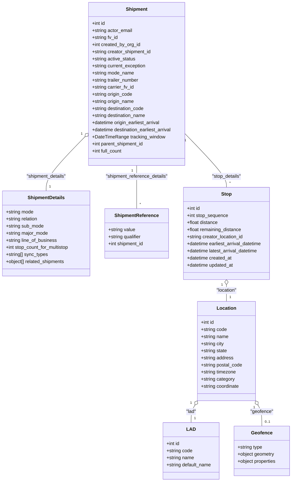

# Diagram: shipment_core/mobile_tracking_api/mobile_tracking_api_tests/test_data/haulaway_mobile_assigned.py

> Auto-generated by Obscura crawlers

## Mermaid

### SVG

<svg id="container" width="1004.083984375" xmlns="http://www.w3.org/2000/svg" class="classDiagram" height="1630" viewBox="0 0 1004.083984375 1630" role="graphics-document document" aria-roledescription="class"><g><defs><marker id="container_class-aggregationStart" class="marker aggregation class" refX="18" refY="7" markerWidth="190" markerHeight="240" orient="auto"><path d="M 18,7 L9,13 L1,7 L9,1 Z"></path></marker></defs><defs><marker id="container_class-aggregationEnd" class="marker aggregation class" refX="1" refY="7" markerWidth="20" markerHeight="28" orient="auto"><path d="M 18,7 L9,13 L1,7 L9,1 Z"></path></marker></defs><defs><marker id="container_class-extensionStart" class="marker extension class" refX="18" refY="7" markerWidth="190" markerHeight="240" orient="auto"><path d="M 1,7 L18,13 V 1 Z"></path></marker></defs><defs><marker id="container_class-extensionEnd" class="marker extension class" refX="1" refY="7" markerWidth="20" markerHeight="28" orient="auto"><path d="M 1,1 V 13 L18,7 Z"></path></marker></defs><defs><marker id="container_class-compositionStart" class="marker composition class" refX="18" refY="7" markerWidth="190" markerHeight="240" orient="auto"><path d="M 18,7 L9,13 L1,7 L9,1 Z"></path></marker></defs><defs><marker id="container_class-compositionEnd" class="marker composition class" refX="1" refY="7" markerWidth="20" markerHeight="28" orient="auto"><path d="M 18,7 L9,13 L1,7 L9,1 Z"></path></marker></defs><defs><marker id="container_class-dependencyStart" class="marker dependency class" refX="6" refY="7" markerWidth="190" markerHeight="240" orient="auto"><path d="M 5,7 L9,13 L1,7 L9,1 Z"></path></marker></defs><defs><marker id="container_class-dependencyEnd" class="marker dependency class" refX="13" refY="7" markerWidth="20" markerHeight="28" orient="auto"><path d="M 18,7 L9,13 L14,7 L9,1 Z"></path></marker></defs><defs><marker id="container_class-lollipopStart" class="marker lollipop class" refX="13" refY="7" markerWidth="190" markerHeight="240" orient="auto"><circle stroke="black" fill="transparent" cx="7" cy="7" r="6"></circle></marker></defs><defs><marker id="container_class-lollipopEnd" class="marker lollipop class" refX="1" refY="7" markerWidth="190" markerHeight="240" orient="auto"><circle stroke="black" fill="transparent" cx="7" cy="7" r="6"></circle></marker></defs><g class="root"><g class="clusters"></g><g class="edgePaths"><path d="M638.344,454.258L661.871,478.048C685.398,501.838,732.453,549.419,755.98,579.376C779.508,609.333,779.508,621.667,779.508,627.833L779.508,634" id="id_Shipment_Stop_1" class="edge-thickness-normal edge-pattern-solid relation" style=";;;" data-edge="true" data-et="edge" data-id="id_Shipment_Stop_1" data-points="W3sieCI6NjM4LjM0Mzc1LCJ5Ijo0NTQuMjU3NTkwNjcxNjEzNTd9LHsieCI6Nzc5LjUwNzgxMjUsInkiOjU5N30seyJ4Ijo3NzkuNTA3ODEyNSwieSI6NjM0fV0="></path><path d="M289.444,465.935L267.769,487.779C246.094,509.623,202.744,553.312,181.069,583.323C159.395,613.333,159.395,629.667,159.395,637.833L159.395,646" id="id_Shipment_ShipmentDetails_2" class="edge-thickness-normal edge-pattern-solid relation" style=";;;" data-edge="true" data-et="edge" data-id="id_Shipment_ShipmentDetails_2" data-points="W3sieCI6MzAxLjU5Mzc1LCJ5Ijo0NTMuNjkwMTE1MzM1NzU2NTZ9LHsieCI6MTU5LjM5NDUzMTI1LCJ5Ijo1OTd9LHsieCI6MTU5LjM5NDUzMTI1LCJ5Ijo2NDZ9XQ==" marker-start="url(#container_class-aggregationStart)"></path><path d="M469.969,560L469.969,566.167C469.969,572.333,469.969,584.667,469.969,609C469.969,633.333,469.969,669.667,469.969,687.833L469.969,706" id="id_Shipment_ShipmentReference_3" class="edge-thickness-normal edge-pattern-solid relation" style=";;;" data-edge="true" data-et="edge" data-id="id_Shipment_ShipmentReference_3" data-points="W3sieCI6NDY5Ljk2ODc1LCJ5Ijo1NjB9LHsieCI6NDY5Ljk2ODc1LCJ5Ijo1OTd9LHsieCI6NDY5Ljk2ODc1LCJ5Ijo3MDZ9XQ=="></path><path d="M779.508,963.25L779.508,966.542C779.508,969.833,779.508,976.417,779.508,985.875C779.508,995.333,779.508,1007.667,779.508,1013.833L779.508,1020" id="id_Stop_Location_4" class="edge-thickness-normal edge-pattern-solid relation" style=";;;" data-edge="true" data-et="edge" data-id="id_Stop_Location_4" data-points="W3sieCI6Nzc5LjUwNzgxMjUsInkiOjk0Nn0seyJ4Ijo3NzkuNTA3ODEyNSwieSI6OTgzfSx7IngiOjc3OS41MDc4MTI1LCJ5IjoxMDIwfV0=" marker-start="url(#container_class-aggregationStart)"></path><path d="M672.043,1370.153L669.797,1373.961C667.55,1377.769,663.057,1385.384,660.811,1395.359C658.564,1405.333,658.564,1417.667,658.564,1423.833L658.564,1430" id="id_Location_LAD_5" class="edge-thickness-normal edge-pattern-solid relation" style=";;;" data-edge="true" data-et="edge" data-id="id_Location_LAD_5" data-points="W3sieCI6NjgwLjgwODU5Mzc1LCJ5IjoxMzU1LjI5NTk5NjY0MDk4OTZ9LHsieCI6NjU4LjU2NDQ1MzEyNSwieSI6MTM5M30seyJ4Ijo2NTguNTY0NDUzMTI1LCJ5IjoxNDMwfV0=" marker-start="url(#container_class-aggregationStart)"></path><path d="M886.972,1370.153L889.219,1373.961C891.465,1377.769,895.958,1385.384,898.205,1397.359C900.451,1409.333,900.451,1425.667,900.451,1433.833L900.451,1442" id="id_Location_Geofence_6" class="edge-thickness-normal edge-pattern-solid relation" style=";;;" data-edge="true" data-et="edge" data-id="id_Location_Geofence_6" data-points="W3sieCI6ODc4LjIwNzAzMTI1LCJ5IjoxMzU1LjI5NTk5NjY0MDk4OTZ9LHsieCI6OTAwLjQ1MTE3MTg3NSwieSI6MTM5M30seyJ4Ijo5MDAuNDUxMTcxODc1LCJ5IjoxNDQyfV0=" marker-start="url(#container_class-aggregationStart)"></path></g><g class="edgeLabels"><g class="edgeLabel" transform="translate(779.5078125, 597)"><g class="label" data-id="id_Shipment_Stop_1" transform="translate(-50.6171875, -12)"><foreignObject width="101.234375" height="24">

"stop_details"

</foreignObject></g></g><g class="edgeLabel" transform="translate(159.39453125, 597)"><g class="label" data-id="id_Shipment_ShipmentDetails_2" transform="translate(-69.078125, -12)"><foreignObject width="138.15625" height="24">

"shipment_details"

</foreignObject></g></g><g class="edgeLabel" transform="translate(469.96875, 597)"><g class="label" data-id="id_Shipment_ShipmentReference_3" transform="translate(-107.1640625, -12)"><foreignObject width="214.328125" height="24">

"shipment_reference_details"

</foreignObject></g></g><g class="edgeLabel" transform="translate(779.5078125, 983)"><g class="label" data-id="id_Stop_Location_4" transform="translate(-35.8828125, -12)"><foreignObject width="71.765625" height="24">

"location"

</foreignObject></g></g><g class="edgeLabel" transform="translate(658.564453125, 1393)"><g class="label" data-id="id_Location_LAD_5" transform="translate(-17.828125, -12)"><foreignObject width="35.65625" height="24">

"lad"

</foreignObject></g></g><g class="edgeLabel" transform="translate(900.451171875, 1393)"><g class="label" data-id="id_Location_Geofence_6" transform="translate(-39.046875, -12)"><foreignObject width="78.09375" height="24">

"geofence"

</foreignObject></g></g><g class="edgeTerminals" transform="translate(639.9837323272982, 477.2480332951998)"><g class="inner" transform="translate(0, 0)"><foreignObject style="width: 9px; height: 12px;">
1
</foreignObject></g></g><g class="edgeTerminals" transform="translate(278.61982896496863, 455.54726576719514)"><g class="inner" transform="translate(0, 0)"><foreignObject style="width: 9px; height: 12px;">
1
</foreignObject></g></g><g class="edgeTerminals" transform="translate(454.96875, 577.5)"><g class="inner" transform="translate(0, 0)"><foreignObject style="width: 9px; height: 12px;">
1
</foreignObject></g></g><g class="edgeTerminals" transform="translate(764.50781125, 963.4999989285714)"><g class="inner" transform="translate(0, 0)"><foreignObject style="width: 9px; height: 12px;">
1
</foreignObject></g></g><g class="edgeTerminals" transform="translate(658.9971292509482, 1362.7465018573605)"><g class="inner" transform="translate(0, 0)"><foreignObject style="width: 9px; height: 12px;">
1
</foreignObject></g></g><g class="edgeTerminals" transform="translate(874.1800539387511, 1377.990346373213)"><g class="inner" transform="translate(0, 0)"><foreignObject style="width: 9px; height: 12px;">
1
</foreignObject></g></g><g class="edgeTerminals" transform="translate(789.50781125, 611.4999989285714)"><g class="inner" transform="translate(0, 0)"></g><foreignObject style="width: 9px; height: 12px;">
*
</foreignObject></g><g class="edgeTerminals" transform="translate(169.39453062500002, 623.4999994642857)"><g class="inner" transform="translate(0, 0)"></g><foreignObject style="width: 9px; height: 12px;">
1
</foreignObject></g><g class="edgeTerminals" transform="translate(479.96875, 683.5)"><g class="inner" transform="translate(0, 0)"></g><foreignObject style="width: 9px; height: 12px;">
*
</foreignObject></g><g class="edgeTerminals" transform="translate(789.50781125, 997.4999989285714)"><g class="inner" transform="translate(0, 0)"></g><foreignObject style="width: 9px; height: 12px;">
1
</foreignObject></g><g class="edgeTerminals" transform="translate(668.5644515624998, 1407.4999986607143)"><g class="inner" transform="translate(0, 0)"></g><foreignObject style="width: 9px; height: 12px;">
1
</foreignObject></g><g class="edgeTerminals" transform="translate(910.4511709375, 1419.4999991964287)"><g class="inner" transform="translate(0, 0)"></g><foreignObject style="width: 36px; height: 12px;">
0..1
</foreignObject></g></g><g class="nodes"><g class="node default" id="classId-Shipment-0" transform="translate(469.96875, 284)"><g class="basic label-container"><path d="M-168.375 -276 L168.375 -276 L168.375 276 L-168.375 276" stroke="none" stroke-width="0" fill="#ECECFF" style=""></path><path d="M-168.375 -276 C-97.69847649164046 -276, -27.021952983280926 -276, 168.375 -276 M-168.375 -276 C-53.94401141414073 -276, 60.486977171718536 -276, 168.375 -276 M168.375 -276 C168.375 -153.9961080077058, 168.375 -31.9922160154116, 168.375 276 M168.375 -276 C168.375 -116.0470212466418, 168.375 43.90595750671639, 168.375 276 M168.375 276 C59.39787553511805 276, -49.57924892976391 276, -168.375 276 M168.375 276 C76.41352936649018 276, -15.547941267019638 276, -168.375 276 M-168.375 276 C-168.375 117.87222405714888, -168.375 -40.25555188570223, -168.375 -276 M-168.375 276 C-168.375 78.21688744624373, -168.375 -119.56622510751254, -168.375 -276" stroke="#9370DB" stroke-width="1.3" fill="none" stroke-dasharray="0 0" style=""></path></g><g class="annotation-group text" transform="translate(0, -252)"></g><g class="label-group text" transform="translate(-35.109375, -252)"><g class="label" style="font-weight: bolder" transform="translate(0,-12)"><foreignObject width="70.21875" height="24">

Shipment

</foreignObject></g></g><g class="members-group text" transform="translate(-156.375, -204)"><g class="label" style="" transform="translate(0,-12)"><foreignObject width="45.96875" height="24">

+int id

</foreignObject></g><g class="label" style="" transform="translate(0,12)"><foreignObject width="138.328125" height="24">

+string actor_email

</foreignObject></g><g class="label" style="" transform="translate(0,36)"><foreignObject width="89.015625" height="24">

+string fv_id

</foreignObject></g><g class="label" style="" transform="translate(0,60)"><foreignObject width="165.546875" height="24">

+int created_by_org_id

</foreignObject></g><g class="label" style="" transform="translate(0,84)"><foreignObject width="203.421875" height="24">

+string creator_shipment_id

</foreignObject></g><g class="label" style="" transform="translate(0,108)"><foreignObject width="149.4375" height="24">

+string active_status

</foreignObject></g><g class="label" style="" transform="translate(0,132)"><foreignObject width="185.15625" height="24">

+string current_exception

</foreignObject></g><g class="label" style="" transform="translate(0,156)"><foreignObject width="143.71875" height="24">

+string mode_name

</foreignObject></g><g class="label" style="" transform="translate(0,180)"><foreignObject width="161.8125" height="24">

+string trailer_number

</foreignObject></g><g class="label" style="" transform="translate(0,204)"><foreignObject width="143.6875" height="24">

+string carrier_fv_id

</foreignObject></g><g class="label" style="" transform="translate(0,228)"><foreignObject width="139.0625" height="24">

+string origin_code

</foreignObject></g><g class="label" style="" transform="translate(0,252)"><foreignObject width="144.9375" height="24">

+string origin_name

</foreignObject></g><g class="label" style="" transform="translate(0,276)"><foreignObject width="179.953125" height="24">

+string destination_code

</foreignObject></g><g class="label" style="" transform="translate(0,300)"><foreignObject width="185.828125" height="24">

+string destination_name

</foreignObject></g><g class="label" style="" transform="translate(0,324)"><foreignObject width="236.75" height="24">

+datetime origin_earliest_arrival

</foreignObject></g><g class="label" style="" transform="translate(0,348)"><foreignObject width="277.640625" height="24">

+datetime destination_earliest_arrival

</foreignObject></g><g class="label" style="" transform="translate(0,372)"><foreignObject width="246.890625" height="24">

+DateTimeRange tracking_window

</foreignObject></g><g class="label" style="" transform="translate(0,396)"><foreignObject width="178.6875" height="24">

+int parent_shipment_id

</foreignObject></g><g class="label" style="" transform="translate(0,420)"><foreignObject width="105.078125" height="24">

+int full_count

</foreignObject></g></g><g class="methods-group text" transform="translate(-156.375, 276)"></g><g class="divider" style=""><path d="M-168.375 -228 C-85.55197125421618 -228, -2.728942508432368 -228, 168.375 -228 M-168.375 -228 C-59.0979630917672 -228, 50.1790738164656 -228, 168.375 -228" stroke="#9370DB" stroke-width="1.3" fill="none" stroke-dasharray="0 0" style=""></path></g><g class="divider" style=""><path d="M-168.375 252 C-66.82784889010544 252, 34.719302219789114 252, 168.375 252 M-168.375 252 C-65.16363797112678 252, 38.04772405774645 252, 168.375 252" stroke="#9370DB" stroke-width="1.3" fill="none" stroke-dasharray="0 0" style=""></path></g></g><g class="node default" id="classId-ShipmentDetails-1" transform="translate(159.39453125, 790)"><g class="basic label-container"><path d="M-151.39453125 -144 L151.39453125 -144 L151.39453125 144 L-151.39453125 144" stroke="none" stroke-width="0" fill="#ECECFF" style=""></path><path d="M-151.39453125 -144 C-79.08473465332145 -144, -6.774938056642895 -144, 151.39453125 -144 M-151.39453125 -144 C-61.981890159800486 -144, 27.43075093039903 -144, 151.39453125 -144 M151.39453125 -144 C151.39453125 -40.54269439532297, 151.39453125 62.914611209354064, 151.39453125 144 M151.39453125 -144 C151.39453125 -46.12770694248812, 151.39453125 51.744586115023765, 151.39453125 144 M151.39453125 144 C74.5413205619245 144, -2.311890126151013 144, -151.39453125 144 M151.39453125 144 C72.58237972869661 144, -6.229771792606783 144, -151.39453125 144 M-151.39453125 144 C-151.39453125 39.873441088635744, -151.39453125 -64.25311782272851, -151.39453125 -144 M-151.39453125 144 C-151.39453125 56.92632244740361, -151.39453125 -30.147355105192787, -151.39453125 -144" stroke="#9370DB" stroke-width="1.3" fill="none" stroke-dasharray="0 0" style=""></path></g><g class="annotation-group text" transform="translate(0, -120)"></g><g class="label-group text" transform="translate(-60.6015625, -120)"><g class="label" style="font-weight: bolder" transform="translate(0,-12)"><foreignObject width="121.203125" height="24">

ShipmentDetails

</foreignObject></g></g><g class="members-group text" transform="translate(-139.39453125, -72)"><g class="label" style="" transform="translate(0,-12)"><foreignObject width="95.203125" height="24">

+string mode

</foreignObject></g><g class="label" style="" transform="translate(0,12)"><foreignObject width="110.59375" height="24">

+string relation

</foreignObject></g><g class="label" style="" transform="translate(0,36)"><foreignObject width="129.5" height="24">

+string sub_mode

</foreignObject></g><g class="label" style="" transform="translate(0,60)"><foreignObject width="144.5" height="24">

+string major_mode

</foreignObject></g><g class="label" style="" transform="translate(0,84)"><foreignObject width="175.0625" height="24">

+string line_of_business

</foreignObject></g><g class="label" style="" transform="translate(0,108)"><foreignObject width="218.1875" height="24">

+int stop_count_for_multistop

</foreignObject></g><g class="label" style="" transform="translate(0,132)"><foreignObject width="143.53125" height="24">

+string[] sync_types

</foreignObject></g><g class="label" style="" transform="translate(0,156)"><foreignObject width="203.796875" height="24">

+object[] related_shipments

</foreignObject></g></g><g class="methods-group text" transform="translate(-139.39453125, 144)"></g><g class="divider" style=""><path d="M-151.39453125 -96 C-78.75767946310403 -96, -6.120827676208052 -96, 151.39453125 -96 M-151.39453125 -96 C-86.7515411079994 -96, -22.108550965998802 -96, 151.39453125 -96" stroke="#9370DB" stroke-width="1.3" fill="none" stroke-dasharray="0 0" style=""></path></g><g class="divider" style=""><path d="M-151.39453125 120 C-67.37910735188532 120, 16.636316546229352 120, 151.39453125 120 M-151.39453125 120 C-73.78292098779656 120, 3.8286892744068837 120, 151.39453125 120" stroke="#9370DB" stroke-width="1.3" fill="none" stroke-dasharray="0 0" style=""></path></g></g><g class="node default" id="classId-ShipmentReference-2" transform="translate(469.96875, 790)"><g class="basic label-container"><path d="M-109.1796875 -84 L109.1796875 -84 L109.1796875 84 L-109.1796875 84" stroke="none" stroke-width="0" fill="#ECECFF" style=""></path><path d="M-109.1796875 -84 C-54.670030955483355 -84, -0.16037441096671046 -84, 109.1796875 -84 M-109.1796875 -84 C-41.593992762723545 -84, 25.99170197455291 -84, 109.1796875 -84 M109.1796875 -84 C109.1796875 -41.28335774501457, 109.1796875 1.4332845099708607, 109.1796875 84 M109.1796875 -84 C109.1796875 -48.001705733794786, 109.1796875 -12.003411467589572, 109.1796875 84 M109.1796875 84 C48.29022086480996 84, -12.59924577038008 84, -109.1796875 84 M109.1796875 84 C46.88190999284752 84, -15.415867514304963 84, -109.1796875 84 M-109.1796875 84 C-109.1796875 23.415049709743982, -109.1796875 -37.169900580512035, -109.1796875 -84 M-109.1796875 84 C-109.1796875 43.15884037183553, -109.1796875 2.317680743671062, -109.1796875 -84" stroke="#9370DB" stroke-width="1.3" fill="none" stroke-dasharray="0 0" style=""></path></g><g class="annotation-group text" transform="translate(0, -60)"></g><g class="label-group text" transform="translate(-71.609375, -60)"><g class="label" style="font-weight: bolder" transform="translate(0,-12)"><foreignObject width="143.21875" height="24">

ShipmentReference

</foreignObject></g></g><g class="members-group text" transform="translate(-97.1796875, -12)"><g class="label" style="" transform="translate(0,-12)"><foreignObject width="92.75" height="24">

+string value

</foreignObject></g><g class="label" style="" transform="translate(0,12)"><foreignObject width="114.578125" height="24">

+string qualifier

</foreignObject></g><g class="label" style="" transform="translate(0,36)"><foreignObject width="122.75" height="24">

+int shipment_id

</foreignObject></g></g><g class="methods-group text" transform="translate(-97.1796875, 84)"></g><g class="divider" style=""><path d="M-109.1796875 -36 C-38.84168826325822 -36, 31.49631097348356 -36, 109.1796875 -36 M-109.1796875 -36 C-53.67845656139769 -36, 1.8227743772046239 -36, 109.1796875 -36" stroke="#9370DB" stroke-width="1.3" fill="none" stroke-dasharray="0 0" style=""></path></g><g class="divider" style=""><path d="M-109.1796875 60 C-41.182437813143494 60, 26.814811873713012 60, 109.1796875 60 M-109.1796875 60 C-63.317896282830866 60, -17.45610506566173 60, 109.1796875 60" stroke="#9370DB" stroke-width="1.3" fill="none" stroke-dasharray="0 0" style=""></path></g></g><g class="node default" id="classId-Stop-3" transform="translate(779.5078125, 790)"><g class="basic label-container"><path d="M-150.359375 -156 L150.359375 -156 L150.359375 156 L-150.359375 156" stroke="none" stroke-width="0" fill="#ECECFF" style=""></path><path d="M-150.359375 -156 C-34.17764526059814 -156, 82.00408447880372 -156, 150.359375 -156 M-150.359375 -156 C-80.81167583422075 -156, -11.2639766684415 -156, 150.359375 -156 M150.359375 -156 C150.359375 -37.525593831015385, 150.359375 80.94881233796923, 150.359375 156 M150.359375 -156 C150.359375 -60.710934577286366, 150.359375 34.57813084542727, 150.359375 156 M150.359375 156 C63.04113783020945 156, -24.2770993395811 156, -150.359375 156 M150.359375 156 C47.75074675625136 156, -54.85788148749728 156, -150.359375 156 M-150.359375 156 C-150.359375 90.36309312829756, -150.359375 24.726186256595128, -150.359375 -156 M-150.359375 156 C-150.359375 67.58797788869836, -150.359375 -20.824044222603277, -150.359375 -156" stroke="#9370DB" stroke-width="1.3" fill="none" stroke-dasharray="0 0" style=""></path></g><g class="annotation-group text" transform="translate(0, -132)"></g><g class="label-group text" transform="translate(-16.96875, -132)"><g class="label" style="font-weight: bolder" transform="translate(0,-12)"><foreignObject width="33.9375" height="24">

Stop

</foreignObject></g></g><g class="members-group text" transform="translate(-138.359375, -84)"><g class="label" style="" transform="translate(0,-12)"><foreignObject width="45.96875" height="24">

+int id

</foreignObject></g><g class="label" style="" transform="translate(0,12)"><foreignObject width="140.96875" height="24">

+int stop_sequence

</foreignObject></g><g class="label" style="" transform="translate(0,36)"><foreignObject width="106.390625" height="24">

+float distance

</foreignObject></g><g class="label" style="" transform="translate(0,60)"><foreignObject width="187.390625" height="24">

+float remaining_distance

</foreignObject></g><g class="label" style="" transform="translate(0,84)"><foreignObject width="193.953125" height="24">

+string creator_location_id

</foreignObject></g><g class="label" style="" transform="translate(0,108)"><foreignObject width="259.75" height="24">

+datetime earliest_arrival_datetime

</foreignObject></g><g class="label" style="" transform="translate(0,132)"><foreignObject width="245.953125" height="24">

+datetime latest_arrival_datetime

</foreignObject></g><g class="label" style="" transform="translate(0,156)"><foreignObject width="154.390625" height="24">

+datetime created_at

</foreignObject></g><g class="label" style="" transform="translate(0,180)"><foreignObject width="160.875" height="24">

+datetime updated_at

</foreignObject></g></g><g class="methods-group text" transform="translate(-138.359375, 156)"></g><g class="divider" style=""><path d="M-150.359375 -108 C-82.52682193190816 -108, -14.694268863816319 -108, 150.359375 -108 M-150.359375 -108 C-83.80225385866787 -108, -17.245132717335736 -108, 150.359375 -108" stroke="#9370DB" stroke-width="1.3" fill="none" stroke-dasharray="0 0" style=""></path></g><g class="divider" style=""><path d="M-150.359375 132 C-78.41016395961273 132, -6.460952919225463 132, 150.359375 132 M-150.359375 132 C-69.67033594811532 132, 11.018703103769354 132, 150.359375 132" stroke="#9370DB" stroke-width="1.3" fill="none" stroke-dasharray="0 0" style=""></path></g></g><g class="node default" id="classId-Location-4" transform="translate(779.5078125, 1188)"><g class="basic label-container"><path d="M-98.69921875 -168 L98.69921875 -168 L98.69921875 168 L-98.69921875 168" stroke="none" stroke-width="0" fill="#ECECFF" style=""></path><path d="M-98.69921875 -168 C-44.864381391407065 -168, 8.97045596718587 -168, 98.69921875 -168 M-98.69921875 -168 C-30.46073607787237 -168, 37.77774659425526 -168, 98.69921875 -168 M98.69921875 -168 C98.69921875 -38.534009787626076, 98.69921875 90.93198042474785, 98.69921875 168 M98.69921875 -168 C98.69921875 -50.179325664541196, 98.69921875 67.64134867091761, 98.69921875 168 M98.69921875 168 C49.46645750749448 168, 0.23369626498896423 168, -98.69921875 168 M98.69921875 168 C51.71515296604763 168, 4.731087182095266 168, -98.69921875 168 M-98.69921875 168 C-98.69921875 74.12308906030503, -98.69921875 -19.753821879389932, -98.69921875 -168 M-98.69921875 168 C-98.69921875 56.72996891018762, -98.69921875 -54.540062179624755, -98.69921875 -168" stroke="#9370DB" stroke-width="1.3" fill="none" stroke-dasharray="0 0" style=""></path></g><g class="annotation-group text" transform="translate(0, -144)"></g><g class="label-group text" transform="translate(-31.3515625, -144)"><g class="label" style="font-weight: bolder" transform="translate(0,-12)"><foreignObject width="62.703125" height="24">

Location

</foreignObject></g></g><g class="members-group text" transform="translate(-86.69921875, -96)"><g class="label" style="" transform="translate(0,-12)"><foreignObject width="45.96875" height="24">

+int id

</foreignObject></g><g class="label" style="" transform="translate(0,12)"><foreignObject width="88.828125" height="24">

+string code

</foreignObject></g><g class="label" style="" transform="translate(0,36)"><foreignObject width="94.375" height="24">

+string name

</foreignObject></g><g class="label" style="" transform="translate(0,60)"><foreignObject width="79.59375" height="24">

+string city

</foreignObject></g><g class="label" style="" transform="translate(0,84)"><foreignObject width="89.953125" height="24">

+string state

</foreignObject></g><g class="label" style="" transform="translate(0,108)"><foreignObject width="110.90625" height="24">

+string address

</foreignObject></g><g class="label" style="" transform="translate(0,132)"><foreignObject width="142.046875" height="24">

+string postal_code

</foreignObject></g><g class="label" style="" transform="translate(0,156)"><foreignObject width="120.796875" height="24">

+string timezone

</foreignObject></g><g class="label" style="" transform="translate(0,180)"><foreignObject width="115.765625" height="24">

+string category

</foreignObject></g><g class="label" style="" transform="translate(0,204)"><foreignObject width="131.984375" height="24">

+string coordinate

</foreignObject></g></g><g class="methods-group text" transform="translate(-86.69921875, 168)"></g><g class="divider" style=""><path d="M-98.69921875 -120 C-23.50205259507149 -120, 51.69511355985702 -120, 98.69921875 -120 M-98.69921875 -120 C-44.133765122340414 -120, 10.431688505319173 -120, 98.69921875 -120" stroke="#9370DB" stroke-width="1.3" fill="none" stroke-dasharray="0 0" style=""></path></g><g class="divider" style=""><path d="M-98.69921875 144 C-22.118849018228147 144, 54.461520713543706 144, 98.69921875 144 M-98.69921875 144 C-36.65577607828214 144, 25.387666593435725 144, 98.69921875 144" stroke="#9370DB" stroke-width="1.3" fill="none" stroke-dasharray="0 0" style=""></path></g></g><g class="node default" id="classId-LAD-5" transform="translate(658.564453125, 1526)"><g class="basic label-container"><path d="M-96.25390625 -96 L96.25390625 -96 L96.25390625 96 L-96.25390625 96" stroke="none" stroke-width="0" fill="#ECECFF" style=""></path><path d="M-96.25390625 -96 C-44.47975452786036 -96, 7.294397194279284 -96, 96.25390625 -96 M-96.25390625 -96 C-41.8250925244877 -96, 12.603721201024598 -96, 96.25390625 -96 M96.25390625 -96 C96.25390625 -47.1184418336896, 96.25390625 1.7631163326207968, 96.25390625 96 M96.25390625 -96 C96.25390625 -21.737427496609143, 96.25390625 52.52514500678171, 96.25390625 96 M96.25390625 96 C56.482315218762324 96, 16.710724187524647 96, -96.25390625 96 M96.25390625 96 C36.92346195961412 96, -22.406982330771754 96, -96.25390625 96 M-96.25390625 96 C-96.25390625 46.54023949745296, -96.25390625 -2.919521005094083, -96.25390625 -96 M-96.25390625 96 C-96.25390625 38.764821913729875, -96.25390625 -18.47035617254025, -96.25390625 -96" stroke="#9370DB" stroke-width="1.3" fill="none" stroke-dasharray="0 0" style=""></path></g><g class="annotation-group text" transform="translate(0, -72)"></g><g class="label-group text" transform="translate(-14.0390625, -72)"><g class="label" style="font-weight: bolder" transform="translate(0,-12)"><foreignObject width="28.078125" height="24">

LAD

</foreignObject></g></g><g class="members-group text" transform="translate(-84.25390625, -24)"><g class="label" style="" transform="translate(0,-12)"><foreignObject width="45.96875" height="24">

+int id

</foreignObject></g><g class="label" style="" transform="translate(0,12)"><foreignObject width="88.828125" height="24">

+string code

</foreignObject></g><g class="label" style="" transform="translate(0,36)"><foreignObject width="94.375" height="24">

+string name

</foreignObject></g><g class="label" style="" transform="translate(0,60)"><foreignObject width="154.46875" height="24">

+string default_name

</foreignObject></g></g><g class="methods-group text" transform="translate(-84.25390625, 96)"></g><g class="divider" style=""><path d="M-96.25390625 -48 C-50.80642646333925 -48, -5.358946676678499 -48, 96.25390625 -48 M-96.25390625 -48 C-46.67749357355852 -48, 2.8989191028829566 -48, 96.25390625 -48" stroke="#9370DB" stroke-width="1.3" fill="none" stroke-dasharray="0 0" style=""></path></g><g class="divider" style=""><path d="M-96.25390625 72 C-52.554297208007945 72, -8.85468816601589 72, 96.25390625 72 M-96.25390625 72 C-28.57407447186918 72, 39.10575730626164 72, 96.25390625 72" stroke="#9370DB" stroke-width="1.3" fill="none" stroke-dasharray="0 0" style=""></path></g></g><g class="node default" id="classId-Geofence-6" transform="translate(900.451171875, 1526)"><g class="basic label-container"><path d="M-95.6328125 -84 L95.6328125 -84 L95.6328125 84 L-95.6328125 84" stroke="none" stroke-width="0" fill="#ECECFF" style=""></path><path d="M-95.6328125 -84 C-46.683901005134736 -84, 2.2650104897305283 -84, 95.6328125 -84 M-95.6328125 -84 C-23.73665202966251 -84, 48.15950844067498 -84, 95.6328125 -84 M95.6328125 -84 C95.6328125 -47.4008110682771, 95.6328125 -10.801622136554201, 95.6328125 84 M95.6328125 -84 C95.6328125 -25.661997040033036, 95.6328125 32.67600591993393, 95.6328125 84 M95.6328125 84 C47.935009447940075 84, 0.23720639588015047 84, -95.6328125 84 M95.6328125 84 C47.282878016124904 84, -1.0670564677501915 84, -95.6328125 84 M-95.6328125 84 C-95.6328125 34.4843738588852, -95.6328125 -15.031252282229602, -95.6328125 -84 M-95.6328125 84 C-95.6328125 30.31379398282619, -95.6328125 -23.37241203434762, -95.6328125 -84" stroke="#9370DB" stroke-width="1.3" fill="none" stroke-dasharray="0 0" style=""></path></g><g class="annotation-group text" transform="translate(0, -60)"></g><g class="label-group text" transform="translate(-34.140625, -60)"><g class="label" style="font-weight: bolder" transform="translate(0,-12)"><foreignObject width="68.28125" height="24">

Geofence

</foreignObject></g></g><g class="members-group text" transform="translate(-83.6328125, -12)"><g class="label" style="" transform="translate(0,-12)"><foreignObject width="85.65625" height="24">

+string type

</foreignObject></g><g class="label" style="" transform="translate(0,12)"><foreignObject width="126.09375" height="24">

+object geometry

</foreignObject></g><g class="label" style="" transform="translate(0,36)"><foreignObject width="133.125" height="24">

+object properties

</foreignObject></g></g><g class="methods-group text" transform="translate(-83.6328125, 84)"></g><g class="divider" style=""><path d="M-95.6328125 -36 C-33.356714195767616 -36, 28.91938410846477 -36, 95.6328125 -36 M-95.6328125 -36 C-52.45570967700192 -36, -9.27860685400384 -36, 95.6328125 -36" stroke="#9370DB" stroke-width="1.3" fill="none" stroke-dasharray="0 0" style=""></path></g><g class="divider" style=""><path d="M-95.6328125 60 C-54.37057305866428 60, -13.108333617328555 60, 95.6328125 60 M-95.6328125 60 C-24.3495728816726 60, 46.9336667366548 60, 95.6328125 60" stroke="#9370DB" stroke-width="1.3" fill="none" stroke-dasharray="0 0" style=""></path></g></g></g></g></g></svg>
