# Diagram: shipment_core/mobile_tracking_api/mobile_tracking_api_tests/test_data/truck_mobile_assigned.py

> Auto-generated by Obscura crawlers

## Mermaid

```mermaid
classDiagram
    class TRUCK {
        id: int
        actor_email: str
        fv_id: str
        created_by_org_id: int
        creator_shipment_id: str
        progress
        obc_asset_id: str
        updated_at: datetime
        is_completed
        current_status
        active_status: str
        eta: datetime
        current_exception
        remaining_distance
        message_id
        mode_id: int
        leg: bool
        mode_name: str
        trailer_number
        carrier_fv_id: str
        origin_code: str
        origin_name: str
        origin_address: str
        origin_city: str
        origin_state: str
        origin_postal_code: str
        origin_earliest_arrival: datetime
        origin_latest_arrival: datetime
        destination_code: str
        destination_name: str
        destination_address: str
        destination_city: str
        destination_state: str
        destination_postal_code: str
        destination_actual_departure
        destination_earliest_arrival: datetime
        destination_latest_arrival: datetime
        is_rack_return: bool
        tracking_window: DateTimeRange
        route_number: str
        destination_eta
        current_city
        current_state
        remaining_miles
        current_country
        current_latitude
        current_longitude
        current_reported_at
        parent_shipment_id
        shipment_reference_details: List~ShipmentReference~
        shipment_details: ShipmentDetails
        stop_details: List~Stop~
        full_count: int
        current_location: CurrentLocation
        active_status_ng: str
        current_status_ng: str
        active_exceptions_ng: str
        shipment_type_ng: str
        service_code
        on_time_percentage
        has_event_refs: bool
        origin_location_code: str
        destination_location_code: str
        tracking_window_formatted: List~str~
        trailer_equipment_number: List~str~
    }

    class ShipmentReference {
        value: str
        qualifier: str
        shipment_id: int
    }

    class ShipmentDetails {
        mode: str
        hasParts: bool
        relation
        sub_mode
        major_mode: str
        is_multileg: bool
        line_of_business: str
        related_shipments
        stop_count_for_multistop: int
        haul_away_tracking_window: str
    }

    class Stop {
        id: int
        eta
        distance
        location: Location
        arrived_at
        created_at: str
        frozen_eta
        updated_at: str
        departed_at
        stop_sequence: int
        change_details
        stop_identifier: str
        frozen_eta_reason
        remaining_distance: float
        creator_location_id: str
        latest_arrival_datetime: str
        earliest_arrival_datetime: str
    }

    class Location {
        id: int
        lad: LAD
        city: str
        code: str
        name: str
        state: str
        region: Region
        address: str
        country: str
        address2: str
        boundary: str
        category: str
        geofence: Geofence
        timezone: str
        coordinate: str
        postal_code: str
    }

    class LAD {
        id: int
        code: str
        name: str
        default_name: str
    }

    class Region {
        region: List~str~
    }

    class Geofence {
        type: str
        geometry: Geometry
        properties: GeofenceProperties
    }

    class Geometry {
        type: str
        coordinates: List~float~
    }

    class GeofenceProperties {
        buffer: float
        center: Coordinates
    }

    class Coordinates {
        latitude: float
        longitude: float
    }

    class CurrentLocation {
        current_city
        current_state
        current_country
        distance_progress: str
        longitude
        latitude
        remaining_miles
        reported_at
        destination_eta
        updates: List~Event~
    }

    class Event

    TRUCK "1" o-- "many" ShipmentReference : has
    TRUCK "1" o-- "1" ShipmentDetails : has
    TRUCK "1" o-- "many" Stop : has
    Stop "1" o-- "1" Location : at
    Location "1" o-- "1" LAD : has
    Location "1" o-- "1" Region : has
    Location "1" o-- "1" Geofence : has
    Geofence "1" o-- "1" Geometry : has
    Geofence "1" o-- "1" GeofenceProperties : has
    GeofenceProperties "1" o-- "1" Coordinates : center
    TRUCK "1" o-- "1" CurrentLocation : has
    CurrentLocation "1" o-- "many" Event : updates
```

### SVG

<svg id="container" width="1318.935546875" xmlns="http://www.w3.org/2000/svg" class="classDiagram" height="3506" viewBox="0 0 1318.935546875 3506" role="graphics-document document" aria-roledescription="class"><g><defs><marker id="container_class-aggregationStart" class="marker aggregation class" refX="18" refY="7" markerWidth="190" markerHeight="240" orient="auto"><path d="M 18,7 L9,13 L1,7 L9,1 Z"></path></marker></defs><defs><marker id="container_class-aggregationEnd" class="marker aggregation class" refX="1" refY="7" markerWidth="20" markerHeight="28" orient="auto"><path d="M 18,7 L9,13 L1,7 L9,1 Z"></path></marker></defs><defs><marker id="container_class-extensionStart" class="marker extension class" refX="18" refY="7" markerWidth="190" markerHeight="240" orient="auto"><path d="M 1,7 L18,13 V 1 Z"></path></marker></defs><defs><marker id="container_class-extensionEnd" class="marker extension class" refX="1" refY="7" markerWidth="20" markerHeight="28" orient="auto"><path d="M 1,1 V 13 L18,7 Z"></path></marker></defs><defs><marker id="container_class-compositionStart" class="marker composition class" refX="18" refY="7" markerWidth="190" markerHeight="240" orient="auto"><path d="M 18,7 L9,13 L1,7 L9,1 Z"></path></marker></defs><defs><marker id="container_class-compositionEnd" class="marker composition class" refX="1" refY="7" markerWidth="20" markerHeight="28" orient="auto"><path d="M 18,7 L9,13 L1,7 L9,1 Z"></path></marker></defs><defs><marker id="container_class-dependencyStart" class="marker dependency class" refX="6" refY="7" markerWidth="190" markerHeight="240" orient="auto"><path d="M 5,7 L9,13 L1,7 L9,1 Z"></path></marker></defs><defs><marker id="container_class-dependencyEnd" class="marker dependency class" refX="13" refY="7" markerWidth="20" markerHeight="28" orient="auto"><path d="M 18,7 L9,13 L14,7 L9,1 Z"></path></marker></defs><defs><marker id="container_class-lollipopStart" class="marker lollipop class" refX="13" refY="7" markerWidth="190" markerHeight="240" orient="auto"><circle stroke="black" fill="transparent" cx="7" cy="7" r="6"></circle></marker></defs><defs><marker id="container_class-lollipopEnd" class="marker lollipop class" refX="1" refY="7" markerWidth="190" markerHeight="240" orient="auto"><circle stroke="black" fill="transparent" cx="7" cy="7" r="6"></circle></marker></defs><g class="root"><g class="clusters"></g><g class="edgePaths"><path d="M369.233,1246.134L326.878,1321.945C284.523,1397.756,199.812,1549.378,157.457,1659.356C115.102,1769.333,115.102,1837.667,115.102,1871.833L115.102,1906" id="id_TRUCK_ShipmentReference_1" class="edge-thickness-normal edge-pattern-solid relation" style=";;;" data-edge="true" data-et="edge" data-id="id_TRUCK_ShipmentReference_1" data-points="W3sieCI6Mzc3LjY0NjQ4NDM3NSwieSI6MTIzMS4wNzQ5ODkzOTExNTMyfSx7IngiOjExNS4xMDE1NjI1LCJ5IjoxNzAxfSx7IngiOjExNS4xMDE1NjI1LCJ5IjoxOTA2fV0=" marker-start="url(#container_class-aggregationStart)"></path><path d="M435.069,1680.937L434.423,1684.28C433.777,1687.624,432.484,1694.312,431.838,1717.823C431.191,1741.333,431.191,1781.667,431.191,1801.833L431.191,1822" id="id_TRUCK_ShipmentDetails_2" class="edge-thickness-normal edge-pattern-solid relation" style=";;;" data-edge="true" data-et="edge" data-id="id_TRUCK_ShipmentDetails_2" data-points="W3sieCI6NDM4LjM0MjUyODQ1MDE0NDUsInkiOjE2NjR9LHsieCI6NDMxLjE5MTQwNjI1LCJ5IjoxNzAxfSx7IngiOjQzMS4xOTE0MDYyNSwieSI6MTgyMn1d" marker-start="url(#container_class-aggregationStart)"></path><path d="M761.677,1680.937L762.323,1684.28C762.97,1687.624,764.262,1694.312,764.908,1703.823C765.555,1713.333,765.555,1725.667,765.555,1731.833L765.555,1738" id="id_TRUCK_Stop_3" class="edge-thickness-normal edge-pattern-solid relation" style=";;;" data-edge="true" data-et="edge" data-id="id_TRUCK_Stop_3" data-points="W3sieCI6NzU4LjQwMzU2NTI5OTg1NTUsInkiOjE2NjR9LHsieCI6NzY1LjU1NDY4NzUsInkiOjE3MDF9LHsieCI6NzY1LjU1NDY4NzUsInkiOjE3Mzh9XQ==" marker-start="url(#container_class-aggregationStart)"></path><path d="M765.555,2259.25L765.555,2262.542C765.555,2265.833,765.555,2272.417,765.555,2281.875C765.555,2291.333,765.555,2303.667,765.555,2309.833L765.555,2316" id="id_Stop_Location_4" class="edge-thickness-normal edge-pattern-solid relation" style=";;;" data-edge="true" data-et="edge" data-id="id_Stop_Location_4" data-points="W3sieCI6NzY1LjU1NDY4NzUsInkiOjIyNDJ9LHsieCI6NzY1LjU1NDY4NzUsInkiOjIyNzl9LHsieCI6NzY1LjU1NDY4NzUsInkiOjIzMTZ9XQ==" marker-start="url(#container_class-aggregationStart)"></path><path d="M656.762,2695.984L639.015,2718.82C621.267,2741.656,585.772,2787.328,568.025,2816.331C550.277,2845.333,550.277,2857.667,550.277,2863.833L550.277,2870" id="id_Location_LAD_5" class="edge-thickness-normal edge-pattern-solid relation" style=";;;" data-edge="true" data-et="edge" data-id="id_Location_LAD_5" data-points="W3sieCI6NjY3LjM0NzY1NjI1LCJ5IjoyNjgyLjM2NDE5MjI2NjUxNjV9LHsieCI6NTUwLjI3NzM0Mzc1LCJ5IjoyODMzfSx7IngiOjU1MC4yNzczNDM3NSwieSI6Mjg3MH1d" marker-start="url(#container_class-aggregationStart)"></path><path d="M765.555,2813.25L765.555,2816.542C765.555,2819.833,765.555,2826.417,765.555,2841.875C765.555,2857.333,765.555,2881.667,765.555,2893.833L765.555,2906" id="id_Location_Region_6" class="edge-thickness-normal edge-pattern-solid relation" style=";;;" data-edge="true" data-et="edge" data-id="id_Location_Region_6" data-points="W3sieCI6NzY1LjU1NDY4NzUsInkiOjI3OTZ9LHsieCI6NzY1LjU1NDY4NzUsInkiOjI4MzN9LHsieCI6NzY1LjU1NDY4NzUsInkiOjI5MDZ9XQ==" marker-start="url(#container_class-aggregationStart)"></path><path d="M876.136,2663.401L905.239,2691.668C934.343,2719.934,992.549,2776.467,1021.653,2812.9C1050.756,2849.333,1050.756,2865.667,1050.756,2873.833L1050.756,2882" id="id_Location_Geofence_7" class="edge-thickness-normal edge-pattern-solid relation" style=";;;" data-edge="true" data-et="edge" data-id="id_Location_Geofence_7" data-points="W3sieCI6ODYzLjc2MTcxODc1LCJ5IjoyNjUxLjM4MzAxNTAwNDQ4NTV9LHsieCI6MTA1MC43NTU4NTkzNzUsInkiOjI4MzN9LHsieCI6MTA1MC43NTU4NTkzNzUsInkiOjI4ODJ9XQ==" marker-start="url(#container_class-aggregationStart)"></path><path d="M948.852,3061.816L942.261,3068.014C935.67,3074.211,922.489,3086.605,915.898,3098.969C909.307,3111.333,909.307,3123.667,909.307,3129.833L909.307,3136" id="id_Geofence_Geometry_8" class="edge-thickness-normal edge-pattern-solid relation" style=";;;" data-edge="true" data-et="edge" data-id="id_Geofence_Geometry_8" data-points="W3sieCI6OTYxLjQxOTUxMDY5MDc4OTUsInkiOjMwNTB9LHsieCI6OTA5LjMwNjY0MDYyNSwieSI6MzA5OX0seyJ4Ijo5MDkuMzA2NjQwNjI1LCJ5IjozMTM2fV0=" marker-start="url(#container_class-aggregationStart)"></path><path d="M1152.659,3061.816L1159.25,3068.014C1165.841,3074.211,1179.023,3086.605,1185.614,3098.969C1192.205,3111.333,1192.205,3123.667,1192.205,3129.833L1192.205,3136" id="id_Geofence_GeofenceProperties_9" class="edge-thickness-normal edge-pattern-solid relation" style=";;;" data-edge="true" data-et="edge" data-id="id_Geofence_GeofenceProperties_9" data-points="W3sieCI6MTE0MC4wOTIyMDgwNTkyMTA0LCJ5IjozMDUwfSx7IngiOjExOTIuMjA1MDc4MTI1LCJ5IjozMDk5fSx7IngiOjExOTIuMjA1MDc4MTI1LCJ5IjozMTM2fV0=" marker-start="url(#container_class-aggregationStart)"></path><path d="M1192.205,3297.25L1192.205,3300.542C1192.205,3303.833,1192.205,3310.417,1192.205,3319.875C1192.205,3329.333,1192.205,3341.667,1192.205,3347.833L1192.205,3354" id="id_GeofenceProperties_Coordinates_10" class="edge-thickness-normal edge-pattern-solid relation" style=";;;" data-edge="true" data-et="edge" data-id="id_GeofenceProperties_Coordinates_10" data-points="W3sieCI6MTE5Mi4yMDUwNzgxMjUsInkiOjMyODB9LHsieCI6MTE5Mi4yMDUwNzgxMjUsInkiOjMzMTd9LHsieCI6MTE5Mi4yMDUwNzgxMjUsInkiOjMzNTR9XQ==" marker-start="url(#container_class-aggregationStart)"></path><path d="M827.245,1263.253L866.327,1336.211C905.409,1409.169,983.574,1555.084,1022.656,1648.209C1061.738,1741.333,1061.738,1781.667,1061.738,1801.833L1061.738,1822" id="id_TRUCK_CurrentLocation_11" class="edge-thickness-normal edge-pattern-solid relation" style=";;;" data-edge="true" data-et="edge" data-id="id_TRUCK_CurrentLocation_11" data-points="W3sieCI6ODE5LjA5OTYwOTM3NSwieSI6MTI0OC4wNDc0Nzg3NDU0MjE0fSx7IngiOjEwNjEuNzM4MjgxMjUsInkiOjE3MDF9LHsieCI6MTA2MS43MzgyODEyNSwieSI6MTgyMn1d" marker-start="url(#container_class-aggregationStart)"></path><path d="M1061.738,2175.25L1061.738,2192.542C1061.738,2209.833,1061.738,2244.417,1061.738,2300.875C1061.738,2357.333,1061.738,2435.667,1061.738,2474.833L1061.738,2514" id="id_CurrentLocation_Event_12" class="edge-thickness-normal edge-pattern-solid relation" style=";;;" data-edge="true" data-et="edge" data-id="id_CurrentLocation_Event_12" data-points="W3sieCI6MTA2MS43MzgyODEyNSwieSI6MjE1OH0seyJ4IjoxMDYxLjczODI4MTI1LCJ5IjoyMjc5fSx7IngiOjEwNjEuNzM4MjgxMjUsInkiOjI1MTR9XQ==" marker-start="url(#container_class-aggregationStart)"></path></g><g class="edgeLabels"><g class="edgeLabel" transform="translate(115.1015625, 1701)"><g class="label" data-id="id_TRUCK_ShipmentReference_1" transform="translate(-12.703125, -12)"><foreignObject width="25.40625" height="24">

has

</foreignObject></g></g><g class="edgeLabel" transform="translate(431.19140625, 1701)"><g class="label" data-id="id_TRUCK_ShipmentDetails_2" transform="translate(-12.703125, -12)"><foreignObject width="25.40625" height="24">

has

</foreignObject></g></g><g class="edgeLabel" transform="translate(765.5546875, 1701)"><g class="label" data-id="id_TRUCK_Stop_3" transform="translate(-12.703125, -12)"><foreignObject width="25.40625" height="24">

has

</foreignObject></g></g><g class="edgeLabel" transform="translate(765.5546875, 2279)"><g class="label" data-id="id_Stop_Location_4" transform="translate(-7.2421875, -12)"><foreignObject width="14.484375" height="24">

at

</foreignObject></g></g><g class="edgeLabel" transform="translate(550.27734375, 2833)"><g class="label" data-id="id_Location_LAD_5" transform="translate(-12.703125, -12)"><foreignObject width="25.40625" height="24">

has

</foreignObject></g></g><g class="edgeLabel" transform="translate(765.5546875, 2833)"><g class="label" data-id="id_Location_Region_6" transform="translate(-12.703125, -12)"><foreignObject width="25.40625" height="24">

has

</foreignObject></g></g><g class="edgeLabel" transform="translate(1050.755859375, 2833)"><g class="label" data-id="id_Location_Geofence_7" transform="translate(-12.703125, -12)"><foreignObject width="25.40625" height="24">

has

</foreignObject></g></g><g class="edgeLabel" transform="translate(909.306640625, 3099)"><g class="label" data-id="id_Geofence_Geometry_8" transform="translate(-12.703125, -12)"><foreignObject width="25.40625" height="24">

has

</foreignObject></g></g><g class="edgeLabel" transform="translate(1192.205078125, 3099)"><g class="label" data-id="id_Geofence_GeofenceProperties_9" transform="translate(-12.703125, -12)"><foreignObject width="25.40625" height="24">

has

</foreignObject></g></g><g class="edgeLabel" transform="translate(1192.205078125, 3317)"><g class="label" data-id="id_GeofenceProperties_Coordinates_10" transform="translate(-22.9296875, -12)"><foreignObject width="45.859375" height="24">

center

</foreignObject></g></g><g class="edgeLabel" transform="translate(1061.73828125, 1701)"><g class="label" data-id="id_TRUCK_CurrentLocation_11" transform="translate(-12.703125, -12)"><foreignObject width="25.40625" height="24">

has

</foreignObject></g></g><g class="edgeLabel" transform="translate(1061.73828125, 2279)"><g class="label" data-id="id_CurrentLocation_Event_12" transform="translate(-29.4140625, -12)"><foreignObject width="58.828125" height="24">

updates

</foreignObject></g></g><g class="edgeTerminals" transform="translate(356.0162353959557, 1239.0362931626364)"><g class="inner" transform="translate(0, 0)"><foreignObject style="width: 9px; height: 12px;">
1
</foreignObject></g></g><g class="edgeTerminals" transform="translate(420.2942422205213, 1678.3356011051126)"><g class="inner" transform="translate(0, 0)"><foreignObject style="width: 9px; height: 12px;">
1
</foreignObject></g></g><g class="edgeTerminals" transform="translate(746.9969453459438, 1684.0284573456172)"><g class="inner" transform="translate(0, 0)"><foreignObject style="width: 9px; height: 12px;">
1
</foreignObject></g></g><g class="edgeTerminals" transform="translate(750.55468875, 2259.5000010714284)"><g class="inner" transform="translate(0, 0)"><foreignObject style="width: 9px; height: 12px;">
1
</foreignObject></g></g><g class="edgeTerminals" transform="translate(644.7651435196171, 2686.977238957542)"><g class="inner" transform="translate(0, 0)"><foreignObject style="width: 9px; height: 12px;">
1
</foreignObject></g></g><g class="edgeTerminals" transform="translate(750.55468875, 2813.5000010714284)"><g class="inner" transform="translate(0, 0)"><foreignObject style="width: 9px; height: 12px;">
1
</foreignObject></g></g><g class="edgeTerminals" transform="translate(865.8645002269919, 2674.335755062158)"><g class="inner" transform="translate(0, 0)"><foreignObject style="width: 9px; height: 12px;">
1
</foreignObject></g></g><g class="edgeTerminals" transform="translate(938.3950273196456, 3051.0597701935385)"><g class="inner" transform="translate(0, 0)"><foreignObject style="width: 9px; height: 12px;">
1
</foreignObject></g></g><g class="edgeTerminals" transform="translate(1142.5662962712058, 3072.9156900578414)"><g class="inner" transform="translate(0, 0)"><foreignObject style="width: 9px; height: 12px;">
1
</foreignObject></g></g><g class="edgeTerminals" transform="translate(1177.2050790624999, 3297.5000008035713)"><g class="inner" transform="translate(0, 0)"><foreignObject style="width: 9px; height: 12px;">
1
</foreignObject></g></g><g class="edgeTerminals" transform="translate(814.1407235859828, 1270.5565759885485)"><g class="inner" transform="translate(0, 0)"><foreignObject style="width: 9px; height: 12px;">
1
</foreignObject></g></g><g class="edgeTerminals" transform="translate(1046.738280625, 2175.499999464286)"><g class="inner" transform="translate(0, 0)"><foreignObject style="width: 9px; height: 12px;">
1
</foreignObject></g></g><g class="edgeTerminals" transform="translate(125.10156124999997, 1883.4999989285714)"><g class="inner" transform="translate(0, 0)"></g><foreignObject style="width: 36px; height: 12px;">
many
</foreignObject></g><g class="edgeTerminals" transform="translate(441.1914081249999, 1799.5000016071428)"><g class="inner" transform="translate(0, 0)"></g><foreignObject style="width: 9px; height: 12px;">
1
</foreignObject></g><g class="edgeTerminals" transform="translate(775.55468875, 1715.5000010714286)"><g class="inner" transform="translate(0, 0)"></g><foreignObject style="width: 36px; height: 12px;">
many
</foreignObject></g><g class="edgeTerminals" transform="translate(775.55468875, 2293.5000010714284)"><g class="inner" transform="translate(0, 0)"></g><foreignObject style="width: 9px; height: 12px;">
1
</foreignObject></g><g class="edgeTerminals" transform="translate(560.2773418749999, 2847.499998392857)"><g class="inner" transform="translate(0, 0)"></g><foreignObject style="width: 9px; height: 12px;">
1
</foreignObject></g><g class="edgeTerminals" transform="translate(775.55468875, 2883.5000010714284)"><g class="inner" transform="translate(0, 0)"></g><foreignObject style="width: 9px; height: 12px;">
1
</foreignObject></g><g class="edgeTerminals" transform="translate(1060.7558596875, 2859.500000267857)"><g class="inner" transform="translate(0, 0)"></g><foreignObject style="width: 9px; height: 12px;">
1
</foreignObject></g><g class="edgeTerminals" transform="translate(919.3066403125, 3113.499999732143)"><g class="inner" transform="translate(0, 0)"></g><foreignObject style="width: 9px; height: 12px;">
1
</foreignObject></g><g class="edgeTerminals" transform="translate(1202.2050790624999, 3113.5000008035713)"><g class="inner" transform="translate(0, 0)"></g><foreignObject style="width: 9px; height: 12px;">
1
</foreignObject></g><g class="edgeTerminals" transform="translate(1202.2050790624999, 3331.5000008035713)"><g class="inner" transform="translate(0, 0)"></g><foreignObject style="width: 9px; height: 12px;">
1
</foreignObject></g><g class="edgeTerminals" transform="translate(1071.738280625, 1799.4999994642858)"><g class="inner" transform="translate(0, 0)"></g><foreignObject style="width: 9px; height: 12px;">
1
</foreignObject></g><g class="edgeTerminals" transform="translate(1071.738280625, 2491.499999464286)"><g class="inner" transform="translate(0, 0)"></g><foreignObject style="width: 36px; height: 12px;">
many
</foreignObject></g></g><g class="nodes"><g class="node default" id="classId-TRUCK-0" transform="translate(598.373046875, 836)"><g class="basic label-container"><path d="M-220.7265625 -828 L220.7265625 -828 L220.7265625 828 L-220.7265625 828" stroke="none" stroke-width="0" fill="#ECECFF" style=""></path><path d="M-220.7265625 -828 C-49.29169782000028 -828, 122.14316685999944 -828, 220.7265625 -828 M-220.7265625 -828 C-113.15262483635472 -828, -5.5786871727094365 -828, 220.7265625 -828 M220.7265625 -828 C220.7265625 -222.25474923886838, 220.7265625 383.49050152226323, 220.7265625 828 M220.7265625 -828 C220.7265625 -290.92472515718737, 220.7265625 246.15054968562526, 220.7265625 828 M220.7265625 828 C77.38794831753489 828, -65.95066586493022 828, -220.7265625 828 M220.7265625 828 C71.36075875859453 828, -78.00504498281094 828, -220.7265625 828 M-220.7265625 828 C-220.7265625 411.71526571799046, -220.7265625 -4.5694685640190755, -220.7265625 -828 M-220.7265625 828 C-220.7265625 471.52254011213614, -220.7265625 115.04508022427228, -220.7265625 -828" stroke="#9370DB" stroke-width="1.3" fill="none" stroke-dasharray="0 0" style=""></path></g><g class="annotation-group text" transform="translate(0, -804)"></g><g class="label-group text" transform="translate(-24.0625, -804)"><g class="label" style="font-weight: bolder" transform="translate(0,-12)"><foreignObject width="48.125" height="24">

TRUCK

</foreignObject></g></g><g class="members-group text" transform="translate(-208.7265625, -756)"><g class="label" style="" transform="translate(0,-12)"><foreignObject width="41.828125" height="24">

id: int

</foreignObject></g><g class="label" style="" transform="translate(0,12)"><foreignObject width="112.140625" height="24">

actor_email: str

</foreignObject></g><g class="label" style="" transform="translate(0,36)"><foreignObject width="62.65625" height="24">

fv_id: str

</foreignObject></g><g class="label" style="" transform="translate(0,60)"><foreignObject width="161.40625" height="24">

created_by_org_id: int

</foreignObject></g><g class="label" style="" transform="translate(0,84)"><foreignObject width="177.0625" height="24">

creator_shipment_id: str

</foreignObject></g><g class="label" style="" transform="translate(0,108)"><foreignObject width="62.078125" height="24">

progress

</foreignObject></g><g class="label" style="" transform="translate(0,132)"><foreignObject width="122.234375" height="24">

obc_asset_id: str

</foreignObject></g><g class="label" style="" transform="translate(0,156)"><foreignObject width="156.796875" height="24">

updated_at: datetime

</foreignObject></g><g class="label" style="" transform="translate(0,180)"><foreignObject width="96.71875" height="24">

is_completed

</foreignObject></g><g class="label" style="" transform="translate(0,204)"><foreignObject width="105.265625" height="24">

current_status

</foreignObject></g><g class="label" style="" transform="translate(0,228)"><foreignObject width="123.078125" height="24">

active_status: str

</foreignObject></g><g class="label" style="" transform="translate(0,252)"><foreignObject width="96.421875" height="24">

eta: datetime

</foreignObject></g><g class="label" style="" transform="translate(0,276)"><foreignObject width="131.296875" height="24">

current_exception

</foreignObject></g><g class="label" style="" transform="translate(0,300)"><foreignObject width="142.34375" height="24">

remaining_distance

</foreignObject></g><g class="label" style="" transform="translate(0,324)"><foreignObject width="84.46875" height="24">

message_id

</foreignObject></g><g class="label" style="" transform="translate(0,348)"><foreignObject width="91.171875" height="24">

mode_id: int

</foreignObject></g><g class="label" style="" transform="translate(0,372)"><foreignObject width="62.609375" height="24">

leg: bool

</foreignObject></g><g class="label" style="" transform="translate(0,396)"><foreignObject width="117.375" height="24">

mode_name: str

</foreignObject></g><g class="label" style="" transform="translate(0,420)"><foreignObject width="107.953125" height="24">

trailer_number

</foreignObject></g><g class="label" style="" transform="translate(0,444)"><foreignObject width="117.34375" height="24">

carrier_fv_id: str

</foreignObject></g><g class="label" style="" transform="translate(0,468)"><foreignObject width="112.71875" height="24">

origin_code: str

</foreignObject></g><g class="label" style="" transform="translate(0,492)"><foreignObject width="118.578125" height="24">

origin_name: str

</foreignObject></g><g class="label" style="" transform="translate(0,516)"><foreignObject width="134.796875" height="24">

origin_address: str

</foreignObject></g><g class="label" style="" transform="translate(0,540)"><foreignObject width="103.546875" height="24">

origin_city: str

</foreignObject></g><g class="label" style="" transform="translate(0,564)"><foreignObject width="114.171875" height="24">

origin_state: str

</foreignObject></g><g class="label" style="" transform="translate(0,588)"><foreignObject width="166.25" height="24">

origin_postal_code: str

</foreignObject></g><g class="label" style="" transform="translate(0,612)"><foreignObject width="232.765625" height="24">

origin_earliest_arrival: datetime

</foreignObject></g><g class="label" style="" transform="translate(0,636)"><foreignObject width="219.125" height="24">

origin_latest_arrival: datetime

</foreignObject></g><g class="label" style="" transform="translate(0,660)"><foreignObject width="153.609375" height="24">

destination_code: str

</foreignObject></g><g class="label" style="" transform="translate(0,684)"><foreignObject width="159.484375" height="24">

destination_name: str

</foreignObject></g><g class="label" style="" transform="translate(0,708)"><foreignObject width="175.6875" height="24">

destination_address: str

</foreignObject></g><g class="label" style="" transform="translate(0,732)"><foreignObject width="144.4375" height="24">

destination_city: str

</foreignObject></g><g class="label" style="" transform="translate(0,756)"><foreignObject width="155.0625" height="24">

destination_state: str

</foreignObject></g><g class="label" style="" transform="translate(0,780)"><foreignObject width="207.140625" height="24">

destination_postal_code: str

</foreignObject></g><g class="label" style="" transform="translate(0,804)"><foreignObject width="215.828125" height="24">

destination_actual_departure

</foreignObject></g><g class="label" style="" transform="translate(0,828)"><foreignObject width="273.65625" height="24">

destination_earliest_arrival: datetime

</foreignObject></g><g class="label" style="" transform="translate(0,852)"><foreignObject width="260.03125" height="24">

destination_latest_arrival: datetime

</foreignObject></g><g class="label" style="" transform="translate(0,876)"><foreignObject width="144.484375" height="24">

is_rack_return: bool

</foreignObject></g><g class="label" style="" transform="translate(0,900)"><foreignObject width="242.8125" height="24">

tracking_window: DateTimeRange

</foreignObject></g><g class="label" style="" transform="translate(0,924)"><foreignObject width="131.078125" height="24">

route_number: str

</foreignObject></g><g class="label" style="" transform="translate(0,948)"><foreignObject width="114.234375" height="24">

destination_eta

</foreignObject></g><g class="label" style="" transform="translate(0,972)"><foreignObject width="86.28125" height="24">

current_city

</foreignObject></g><g class="label" style="" transform="translate(0,996)"><foreignObject width="96.96875" height="24">

current_state

</foreignObject></g><g class="label" style="" transform="translate(0,1020)"><foreignObject width="120.34375" height="24">

remaining_miles

</foreignObject></g><g class="label" style="" transform="translate(0,1044)"><foreignObject width="115.734375" height="24">

current_country

</foreignObject></g><g class="label" style="" transform="translate(0,1068)"><foreignObject width="117.6875" height="24">

current_latitude

</foreignObject></g><g class="label" style="" transform="translate(0,1092)"><foreignObject width="130.25" height="24">

current_longitude

</foreignObject></g><g class="label" style="" transform="translate(0,1116)"><foreignObject width="146.609375" height="24">

current_reported_at

</foreignObject></g><g class="label" style="" transform="translate(0,1140)"><foreignObject width="146.796875" height="24">

parent_shipment_id

</foreignObject></g><g class="label" style="" transform="translate(0,1164)"><foreignObject width="393.390625" height="24">

shipment_reference_details: List&lt;ShipmentReference&gt;

</foreignObject></g><g class="label" style="" transform="translate(0,1188)"><foreignObject width="253.625" height="24">

shipment_details: ShipmentDetails

</foreignObject></g><g class="label" style="" transform="translate(0,1212)"><foreignObject width="171.78125" height="24">

stop_details: List&lt;Stop&gt;

</foreignObject></g><g class="label" style="" transform="translate(0,1236)"><foreignObject width="101" height="24">

full_count: int

</foreignObject></g><g class="label" style="" transform="translate(0,1260)"><foreignObject width="243.796875" height="24">

current_location: CurrentLocation

</foreignObject></g><g class="label" style="" transform="translate(0,1284)"><foreignObject width="148.78125" height="24">

active_status_ng: str

</foreignObject></g><g class="label" style="" transform="translate(0,1308)"><foreignObject width="158.46875" height="24">

current_status_ng: str

</foreignObject></g><g class="label" style="" transform="translate(0,1332)"><foreignObject width="182.28125" height="24">

active_exceptions_ng: str

</foreignObject></g><g class="label" style="" transform="translate(0,1356)"><foreignObject width="161.453125" height="24">

shipment_type_ng: str

</foreignObject></g><g class="label" style="" transform="translate(0,1380)"><foreignObject width="93.453125" height="24">

service_code

</foreignObject></g><g class="label" style="" transform="translate(0,1404)"><foreignObject width="147.78125" height="24">

on_time_percentage

</foreignObject></g><g class="label" style="" transform="translate(0,1428)"><foreignObject width="149.859375" height="24">

has_event_refs: bool

</foreignObject></g><g class="label" style="" transform="translate(0,1452)"><foreignObject width="180.03125" height="24">

origin_location_code: str

</foreignObject></g><g class="label" style="" transform="translate(0,1476)"><foreignObject width="220.921875" height="24">

destination_location_code: str

</foreignObject></g><g class="label" style="" transform="translate(0,1500)"><foreignObject width="271.609375" height="24">

tracking_window_formatted: List&lt;str&gt;

</foreignObject></g><g class="label" style="" transform="translate(0,1524)"><foreignObject width="264.546875" height="24">

trailer_equipment_number: List&lt;str&gt;

</foreignObject></g></g><g class="methods-group text" transform="translate(-208.7265625, 828)"></g><g class="divider" style=""><path d="M-220.7265625 -780 C-88.4890601834154 -780, 43.74844213316919 -780, 220.7265625 -780 M-220.7265625 -780 C-88.19716362530383 -780, 44.33223524939234 -780, 220.7265625 -780" stroke="#9370DB" stroke-width="1.3" fill="none" stroke-dasharray="0 0" style=""></path></g><g class="divider" style=""><path d="M-220.7265625 804 C-64.67779990127283 804, 91.37096269745433 804, 220.7265625 804 M-220.7265625 804 C-55.11146065105848 804, 110.50364119788304 804, 220.7265625 804" stroke="#9370DB" stroke-width="1.3" fill="none" stroke-dasharray="0 0" style=""></path></g></g><g class="node default" id="classId-ShipmentReference-1" transform="translate(115.1015625, 1990)"><g class="basic label-container"><path d="M-107.1015625 -84 L107.1015625 -84 L107.1015625 84 L-107.1015625 84" stroke="none" stroke-width="0" fill="#ECECFF" style=""></path><path d="M-107.1015625 -84 C-47.13381063744527 -84, 12.833941225109456 -84, 107.1015625 -84 M-107.1015625 -84 C-27.58536897880832 -84, 51.93082454238336 -84, 107.1015625 -84 M107.1015625 -84 C107.1015625 -32.40726938497717, 107.1015625 19.18546123004566, 107.1015625 84 M107.1015625 -84 C107.1015625 -24.68083504817099, 107.1015625 34.63832990365802, 107.1015625 84 M107.1015625 84 C28.87635688633928 84, -49.34884872732144 84, -107.1015625 84 M107.1015625 84 C64.0952053599593 84, 21.088848219918575 84, -107.1015625 84 M-107.1015625 84 C-107.1015625 42.179263044085594, -107.1015625 0.3585260881711889, -107.1015625 -84 M-107.1015625 84 C-107.1015625 22.840325536879384, -107.1015625 -38.31934892624123, -107.1015625 -84" stroke="#9370DB" stroke-width="1.3" fill="none" stroke-dasharray="0 0" style=""></path></g><g class="annotation-group text" transform="translate(0, -60)"></g><g class="label-group text" transform="translate(-71.609375, -60)"><g class="label" style="font-weight: bolder" transform="translate(0,-12)"><foreignObject width="143.21875" height="24">

ShipmentReference

</foreignObject></g></g><g class="members-group text" transform="translate(-95.1015625, -12)"><g class="label" style="" transform="translate(0,-12)"><foreignObject width="66.390625" height="24">

value: str

</foreignObject></g><g class="label" style="" transform="translate(0,12)"><foreignObject width="88.390625" height="24">

qualifier: str

</foreignObject></g><g class="label" style="" transform="translate(0,36)"><foreignObject width="118.59375" height="24">

shipment_id: int

</foreignObject></g></g><g class="methods-group text" transform="translate(-95.1015625, 84)"></g><g class="divider" style=""><path d="M-107.1015625 -36 C-51.08473207739224 -36, 4.932098345215522 -36, 107.1015625 -36 M-107.1015625 -36 C-52.10390814745593 -36, 2.893746205088135 -36, 107.1015625 -36" stroke="#9370DB" stroke-width="1.3" fill="none" stroke-dasharray="0 0" style=""></path></g><g class="divider" style=""><path d="M-107.1015625 60 C-38.044937825113266 60, 31.01168684977347 60, 107.1015625 60 M-107.1015625 60 C-49.19691498962466 60, 8.707732520750682 60, 107.1015625 60" stroke="#9370DB" stroke-width="1.3" fill="none" stroke-dasharray="0 0" style=""></path></g></g><g class="node default" id="classId-ShipmentDetails-2" transform="translate(431.19140625, 1990)"><g class="basic label-container"><path d="M-158.98828125 -168 L158.98828125 -168 L158.98828125 168 L-158.98828125 168" stroke="none" stroke-width="0" fill="#ECECFF" style=""></path><path d="M-158.98828125 -168 C-60.02302437209329 -168, 38.94223250581342 -168, 158.98828125 -168 M-158.98828125 -168 C-60.50743253273265 -168, 37.9734161845347 -168, 158.98828125 -168 M158.98828125 -168 C158.98828125 -84.73017643046569, 158.98828125 -1.4603528609313798, 158.98828125 168 M158.98828125 -168 C158.98828125 -65.9384185103419, 158.98828125 36.12316297931619, 158.98828125 168 M158.98828125 168 C55.3127042982741 168, -48.3628726534518 168, -158.98828125 168 M158.98828125 168 C51.08732970346874 168, -56.81362184306252 168, -158.98828125 168 M-158.98828125 168 C-158.98828125 84.08929367393046, -158.98828125 0.1785873478609119, -158.98828125 -168 M-158.98828125 168 C-158.98828125 83.48748118345112, -158.98828125 -1.025037633097753, -158.98828125 -168" stroke="#9370DB" stroke-width="1.3" fill="none" stroke-dasharray="0 0" style=""></path></g><g class="annotation-group text" transform="translate(0, -144)"></g><g class="label-group text" transform="translate(-60.6015625, -144)"><g class="label" style="font-weight: bolder" transform="translate(0,-12)"><foreignObject width="121.203125" height="24">

ShipmentDetails

</foreignObject></g></g><g class="members-group text" transform="translate(-146.98828125, -96)"><g class="label" style="" transform="translate(0,-12)"><foreignObject width="68.859375" height="24">

mode: str

</foreignObject></g><g class="label" style="" transform="translate(0,12)"><foreignObject width="102.90625" height="24">

hasParts: bool

</foreignObject></g><g class="label" style="" transform="translate(0,36)"><foreignObject width="56.75" height="24">

relation

</foreignObject></g><g class="label" style="" transform="translate(0,60)"><foreignObject width="75.640625" height="24">

sub_mode

</foreignObject></g><g class="label" style="" transform="translate(0,84)"><foreignObject width="118.15625" height="24">

major_mode: str

</foreignObject></g><g class="label" style="" transform="translate(0,108)"><foreignObject width="120.59375" height="24">

is_multileg: bool

</foreignObject></g><g class="label" style="" transform="translate(0,132)"><foreignObject width="148.71875" height="24">

line_of_business: str

</foreignObject></g><g class="label" style="" transform="translate(0,156)"><foreignObject width="135.796875" height="24">

related_shipments

</foreignObject></g><g class="label" style="" transform="translate(0,180)"><foreignObject width="214.046875" height="24">

stop_count_for_multistop: int

</foreignObject></g><g class="label" style="" transform="translate(0,204)"><foreignObject width="233.375" height="24">

haul_away_tracking_window: str

</foreignObject></g></g><g class="methods-group text" transform="translate(-146.98828125, 168)"></g><g class="divider" style=""><path d="M-158.98828125 -120 C-82.30617834248459 -120, -5.624075434969171 -120, 158.98828125 -120 M-158.98828125 -120 C-91.84288717108092 -120, -24.697493092161835 -120, 158.98828125 -120" stroke="#9370DB" stroke-width="1.3" fill="none" stroke-dasharray="0 0" style=""></path></g><g class="divider" style=""><path d="M-158.98828125 144 C-35.47872220111533 144, 88.03083684776934 144, 158.98828125 144 M-158.98828125 144 C-32.43408622975845 144, 94.1201087904831 144, 158.98828125 144" stroke="#9370DB" stroke-width="1.3" fill="none" stroke-dasharray="0 0" style=""></path></g></g><g class="node default" id="classId-Stop-3" transform="translate(765.5546875, 1990)"><g class="basic label-container"><path d="M-125.375 -252 L125.375 -252 L125.375 252 L-125.375 252" stroke="none" stroke-width="0" fill="#ECECFF" style=""></path><path d="M-125.375 -252 C-34.92082614145477 -252, 55.533347717090464 -252, 125.375 -252 M-125.375 -252 C-30.511858835318606 -252, 64.35128232936279 -252, 125.375 -252 M125.375 -252 C125.375 -118.07872878648448, 125.375 15.842542427031049, 125.375 252 M125.375 -252 C125.375 -91.12958678102748, 125.375 69.74082643794503, 125.375 252 M125.375 252 C64.00037404646173 252, 2.625748092923459 252, -125.375 252 M125.375 252 C34.461386872801654 252, -56.45222625439669 252, -125.375 252 M-125.375 252 C-125.375 127.14623500374061, -125.375 2.292470007481228, -125.375 -252 M-125.375 252 C-125.375 99.54968503242955, -125.375 -52.9006299351409, -125.375 -252" stroke="#9370DB" stroke-width="1.3" fill="none" stroke-dasharray="0 0" style=""></path></g><g class="annotation-group text" transform="translate(0, -228)"></g><g class="label-group text" transform="translate(-16.96875, -228)"><g class="label" style="font-weight: bolder" transform="translate(0,-12)"><foreignObject width="33.9375" height="24">

Stop

</foreignObject></g></g><g class="members-group text" transform="translate(-113.375, -180)"><g class="label" style="" transform="translate(0,-12)"><foreignObject width="41.828125" height="24">

id: int

</foreignObject></g><g class="label" style="" transform="translate(0,12)"><foreignObject width="23.09375" height="24">

eta

</foreignObject></g><g class="label" style="" transform="translate(0,36)"><foreignObject width="61.359375" height="24">

distance

</foreignObject></g><g class="label" style="" transform="translate(0,60)"><foreignObject width="129.359375" height="24">

location: Location

</foreignObject></g><g class="label" style="" transform="translate(0,84)"><foreignObject width="74.15625" height="24">

arrived_at

</foreignObject></g><g class="label" style="" transform="translate(0,108)"><foreignObject width="104.484375" height="24">

created_at: str

</foreignObject></g><g class="label" style="" transform="translate(0,132)"><foreignObject width="76.359375" height="24">

frozen_eta

</foreignObject></g><g class="label" style="" transform="translate(0,156)"><foreignObject width="110.96875" height="24">

updated_at: str

</foreignObject></g><g class="label" style="" transform="translate(0,180)"><foreignObject width="88.828125" height="24">

departed_at

</foreignObject></g><g class="label" style="" transform="translate(0,204)"><foreignObject width="136.828125" height="24">

stop_sequence: int

</foreignObject></g><g class="label" style="" transform="translate(0,228)"><foreignObject width="108.90625" height="24">

change_details

</foreignObject></g><g class="label" style="" transform="translate(0,252)"><foreignObject width="134.09375" height="24">

stop_identifier: str

</foreignObject></g><g class="label" style="" transform="translate(0,276)"><foreignObject width="133.671875" height="24">

frozen_eta_reason

</foreignObject></g><g class="label" style="" transform="translate(0,300)"><foreignObject width="183.484375" height="24">

remaining_distance: float

</foreignObject></g><g class="label" style="" transform="translate(0,324)"><foreignObject width="167.609375" height="24">

creator_location_id: str

</foreignObject></g><g class="label" style="" transform="translate(0,348)"><foreignObject width="196" height="24">

latest_arrival_datetime: str

</foreignObject></g><g class="label" style="" transform="translate(0,372)"><foreignObject width="209.78125" height="24">

earliest_arrival_datetime: str

</foreignObject></g></g><g class="methods-group text" transform="translate(-113.375, 252)"></g><g class="divider" style=""><path d="M-125.375 -204 C-52.09870051725713 -204, 21.177598965485743 -204, 125.375 -204 M-125.375 -204 C-61.37773739208484 -204, 2.619525215830322 -204, 125.375 -204" stroke="#9370DB" stroke-width="1.3" fill="none" stroke-dasharray="0 0" style=""></path></g><g class="divider" style=""><path d="M-125.375 228 C-58.54562102147159 228, 8.283757957056821 228, 125.375 228 M-125.375 228 C-28.020729885549272 228, 69.33354022890146 228, 125.375 228" stroke="#9370DB" stroke-width="1.3" fill="none" stroke-dasharray="0 0" style=""></path></g></g><g class="node default" id="classId-Location-4" transform="translate(765.5546875, 2556)"><g class="basic label-container"><path d="M-98.20703125 -240 L98.20703125 -240 L98.20703125 240 L-98.20703125 240" stroke="none" stroke-width="0" fill="#ECECFF" style=""></path><path d="M-98.20703125 -240 C-33.445449353995414 -240, 31.31613254200917 -240, 98.20703125 -240 M-98.20703125 -240 C-52.257846324946 -240, -6.308661399892003 -240, 98.20703125 -240 M98.20703125 -240 C98.20703125 -89.03150118154724, 98.20703125 61.93699763690552, 98.20703125 240 M98.20703125 -240 C98.20703125 -51.11678370316858, 98.20703125 137.76643259366284, 98.20703125 240 M98.20703125 240 C53.52941983594914 240, 8.851808421898284 240, -98.20703125 240 M98.20703125 240 C58.0569477566475 240, 17.906864263295006 240, -98.20703125 240 M-98.20703125 240 C-98.20703125 140.92233721879234, -98.20703125 41.8446744375847, -98.20703125 -240 M-98.20703125 240 C-98.20703125 99.13510961254178, -98.20703125 -41.729780774916435, -98.20703125 -240" stroke="#9370DB" stroke-width="1.3" fill="none" stroke-dasharray="0 0" style=""></path></g><g class="annotation-group text" transform="translate(0, -216)"></g><g class="label-group text" transform="translate(-31.3515625, -216)"><g class="label" style="font-weight: bolder" transform="translate(0,-12)"><foreignObject width="62.703125" height="24">

Location

</foreignObject></g></g><g class="members-group text" transform="translate(-86.20703125, -168)"><g class="label" style="" transform="translate(0,-12)"><foreignObject width="41.828125" height="24">

id: int

</foreignObject></g><g class="label" style="" transform="translate(0,12)"><foreignObject width="58.40625" height="24">

lad: LAD

</foreignObject></g><g class="label" style="" transform="translate(0,36)"><foreignObject width="53.296875" height="24">

city: str

</foreignObject></g><g class="label" style="" transform="translate(0,60)"><foreignObject width="62.46875" height="24">

code: str

</foreignObject></g><g class="label" style="" transform="translate(0,84)"><foreignObject width="68.03125" height="24">

name: str

</foreignObject></g><g class="label" style="" transform="translate(0,108)"><foreignObject width="63.609375" height="24">

state: str

</foreignObject></g><g class="label" style="" transform="translate(0,132)"><foreignObject width="103.765625" height="24">

region: Region

</foreignObject></g><g class="label" style="" transform="translate(0,156)"><foreignObject width="84.546875" height="24">

address: str

</foreignObject></g><g class="label" style="" transform="translate(0,180)"><foreignObject width="82.765625" height="24">

country: str

</foreignObject></g><g class="label" style="" transform="translate(0,204)"><foreignObject width="92.3125" height="24">

address2: str

</foreignObject></g><g class="label" style="" transform="translate(0,228)"><foreignObject width="97.4375" height="24">

boundary: str

</foreignObject></g><g class="label" style="" transform="translate(0,252)"><foreignObject width="89.484375" height="24">

category: str

</foreignObject></g><g class="label" style="" transform="translate(0,276)"><foreignObject width="141.0625" height="24">

geofence: Geofence

</foreignObject></g><g class="label" style="" transform="translate(0,300)"><foreignObject width="94.4375" height="24">

timezone: str

</foreignObject></g><g class="label" style="" transform="translate(0,324)"><foreignObject width="105.640625" height="24">

coordinate: str

</foreignObject></g><g class="label" style="" transform="translate(0,348)"><foreignObject width="115.6875" height="24">

postal_code: str

</foreignObject></g></g><g class="methods-group text" transform="translate(-86.20703125, 240)"></g><g class="divider" style=""><path d="M-98.20703125 -192 C-58.87709552372475 -192, -19.547159797449495 -192, 98.20703125 -192 M-98.20703125 -192 C-39.057270043713665 -192, 20.09249116257267 -192, 98.20703125 -192" stroke="#9370DB" stroke-width="1.3" fill="none" stroke-dasharray="0 0" style=""></path></g><g class="divider" style=""><path d="M-98.20703125 216 C-49.484186279228894 216, -0.7613413084577871 216, 98.20703125 216 M-98.20703125 216 C-23.670157116824313 216, 50.86671701635137 216, 98.20703125 216" stroke="#9370DB" stroke-width="1.3" fill="none" stroke-dasharray="0 0" style=""></path></g></g><g class="node default" id="classId-LAD-5" transform="translate(550.27734375, 2966)"><g class="basic label-container"><path d="M-83.08203125 -96 L83.08203125 -96 L83.08203125 96 L-83.08203125 96" stroke="none" stroke-width="0" fill="#ECECFF" style=""></path><path d="M-83.08203125 -96 C-48.07253982319906 -96, -13.063048396398116 -96, 83.08203125 -96 M-83.08203125 -96 C-19.73256796773346 -96, 43.61689531453308 -96, 83.08203125 -96 M83.08203125 -96 C83.08203125 -25.303264354841815, 83.08203125 45.39347129031637, 83.08203125 96 M83.08203125 -96 C83.08203125 -52.94900805764437, 83.08203125 -9.89801611528874, 83.08203125 96 M83.08203125 96 C20.714005777203383 96, -41.654019695593234 96, -83.08203125 96 M83.08203125 96 C42.89486394824047 96, 2.70769664648094 96, -83.08203125 96 M-83.08203125 96 C-83.08203125 33.84294706012423, -83.08203125 -28.314105879751537, -83.08203125 -96 M-83.08203125 96 C-83.08203125 29.316013733036243, -83.08203125 -37.367972533927514, -83.08203125 -96" stroke="#9370DB" stroke-width="1.3" fill="none" stroke-dasharray="0 0" style=""></path></g><g class="annotation-group text" transform="translate(0, -72)"></g><g class="label-group text" transform="translate(-14.0390625, -72)"><g class="label" style="font-weight: bolder" transform="translate(0,-12)"><foreignObject width="28.078125" height="24">

LAD

</foreignObject></g></g><g class="members-group text" transform="translate(-71.08203125, -24)"><g class="label" style="" transform="translate(0,-12)"><foreignObject width="41.828125" height="24">

id: int

</foreignObject></g><g class="label" style="" transform="translate(0,12)"><foreignObject width="62.46875" height="24">

code: str

</foreignObject></g><g class="label" style="" transform="translate(0,36)"><foreignObject width="68.03125" height="24">

name: str

</foreignObject></g><g class="label" style="" transform="translate(0,60)"><foreignObject width="128.125" height="24">

default_name: str

</foreignObject></g></g><g class="methods-group text" transform="translate(-71.08203125, 96)"></g><g class="divider" style=""><path d="M-83.08203125 -48 C-22.938600302497633 -48, 37.20483064500473 -48, 83.08203125 -48 M-83.08203125 -48 C-20.741553474349082 -48, 41.598924301301835 -48, 83.08203125 -48" stroke="#9370DB" stroke-width="1.3" fill="none" stroke-dasharray="0 0" style=""></path></g><g class="divider" style=""><path d="M-83.08203125 72 C-22.042854810669773 72, 38.99632162866045 72, 83.08203125 72 M-83.08203125 72 C-37.49364656143972 72, 8.094738127120564 72, 83.08203125 72" stroke="#9370DB" stroke-width="1.3" fill="none" stroke-dasharray="0 0" style=""></path></g></g><g class="node default" id="classId-Region-6" transform="translate(765.5546875, 2966)"><g class="basic label-container"><path d="M-82.1953125 -60 L82.1953125 -60 L82.1953125 60 L-82.1953125 60" stroke="none" stroke-width="0" fill="#ECECFF" style=""></path><path d="M-82.1953125 -60 C-17.816771808208344 -60, 46.56176888358331 -60, 82.1953125 -60 M-82.1953125 -60 C-48.631011625357864 -60, -15.066710750715728 -60, 82.1953125 -60 M82.1953125 -60 C82.1953125 -32.215052085698204, 82.1953125 -4.430104171396408, 82.1953125 60 M82.1953125 -60 C82.1953125 -33.89410874090046, 82.1953125 -7.788217481800913, 82.1953125 60 M82.1953125 60 C25.489316255510722 60, -31.216679988978555 60, -82.1953125 60 M82.1953125 60 C16.90268840929639 60, -48.38993568140722 60, -82.1953125 60 M-82.1953125 60 C-82.1953125 29.143980254786197, -82.1953125 -1.7120394904276068, -82.1953125 -60 M-82.1953125 60 C-82.1953125 25.852789630185086, -82.1953125 -8.294420739629828, -82.1953125 -60" stroke="#9370DB" stroke-width="1.3" fill="none" stroke-dasharray="0 0" style=""></path></g><g class="annotation-group text" transform="translate(0, -36)"></g><g class="label-group text" transform="translate(-25.1875, -36)"><g class="label" style="font-weight: bolder" transform="translate(0,-12)"><foreignObject width="50.375" height="24">

Region

</foreignObject></g></g><g class="members-group text" transform="translate(-70.1953125, 12)"><g class="label" style="" transform="translate(0,-12)"><foreignObject width="115.203125" height="24">

region: List&lt;str&gt;

</foreignObject></g></g><g class="methods-group text" transform="translate(-70.1953125, 60)"></g><g class="divider" style=""><path d="M-82.1953125 -12 C-48.57818896863578 -12, -14.961065437271557 -12, 82.1953125 -12 M-82.1953125 -12 C-20.681276078023664 -12, 40.83276034395267 -12, 82.1953125 -12" stroke="#9370DB" stroke-width="1.3" fill="none" stroke-dasharray="0 0" style=""></path></g><g class="divider" style=""><path d="M-82.1953125 36 C-19.701774473760196 36, 42.79176355247961 36, 82.1953125 36 M-82.1953125 36 C-48.51083517242689 36, -14.826357844853774 36, 82.1953125 36" stroke="#9370DB" stroke-width="1.3" fill="none" stroke-dasharray="0 0" style=""></path></g></g><g class="node default" id="classId-Geofence-7" transform="translate(1050.755859375, 2966)"><g class="basic label-container"><path d="M-142.0234375 -84 L142.0234375 -84 L142.0234375 84 L-142.0234375 84" stroke="none" stroke-width="0" fill="#ECECFF" style=""></path><path d="M-142.0234375 -84 C-65.18465577347537 -84, 11.65412595304926 -84, 142.0234375 -84 M-142.0234375 -84 C-32.675277498087894 -84, 76.67288250382421 -84, 142.0234375 -84 M142.0234375 -84 C142.0234375 -35.94895717323444, 142.0234375 12.10208565353112, 142.0234375 84 M142.0234375 -84 C142.0234375 -38.44640709140039, 142.0234375 7.107185817199223, 142.0234375 84 M142.0234375 84 C46.44622465582576 84, -49.13098818834848 84, -142.0234375 84 M142.0234375 84 C41.62869252129212 84, -58.76605245741575 84, -142.0234375 84 M-142.0234375 84 C-142.0234375 17.911182611114143, -142.0234375 -48.177634777771715, -142.0234375 -84 M-142.0234375 84 C-142.0234375 23.880047790397114, -142.0234375 -36.23990441920577, -142.0234375 -84" stroke="#9370DB" stroke-width="1.3" fill="none" stroke-dasharray="0 0" style=""></path></g><g class="annotation-group text" transform="translate(0, -60)"></g><g class="label-group text" transform="translate(-34.140625, -60)"><g class="label" style="font-weight: bolder" transform="translate(0,-12)"><foreignObject width="68.28125" height="24">

Geofence

</foreignObject></g></g><g class="members-group text" transform="translate(-130.0234375, -12)"><g class="label" style="" transform="translate(0,-12)"><foreignObject width="59.296875" height="24">

type: str

</foreignObject></g><g class="label" style="" transform="translate(0,12)"><foreignObject width="146.953125" height="24">

geometry: Geometry

</foreignObject></g><g class="label" style="" transform="translate(0,36)"><foreignObject width="225.90625" height="24">

properties: GeofenceProperties

</foreignObject></g></g><g class="methods-group text" transform="translate(-130.0234375, 84)"></g><g class="divider" style=""><path d="M-142.0234375 -36 C-44.961440766401736 -36, 52.10055596719653 -36, 142.0234375 -36 M-142.0234375 -36 C-29.44957337482235 -36, 83.1242907503553 -36, 142.0234375 -36" stroke="#9370DB" stroke-width="1.3" fill="none" stroke-dasharray="0 0" style=""></path></g><g class="divider" style=""><path d="M-142.0234375 60 C-29.76737665323023 60, 82.48868419353954 60, 142.0234375 60 M-142.0234375 60 C-79.73500433109044 60, -17.446571162180874 60, 142.0234375 60" stroke="#9370DB" stroke-width="1.3" fill="none" stroke-dasharray="0 0" style=""></path></g></g><g class="node default" id="classId-Geometry-8" transform="translate(909.306640625, 3208)"><g class="basic label-container"><path d="M-114.16796875 -72 L114.16796875 -72 L114.16796875 72 L-114.16796875 72" stroke="none" stroke-width="0" fill="#ECECFF" style=""></path><path d="M-114.16796875 -72 C-59.085298104928704 -72, -4.002627459857408 -72, 114.16796875 -72 M-114.16796875 -72 C-55.24932978612814 -72, 3.6693091777437132 -72, 114.16796875 -72 M114.16796875 -72 C114.16796875 -30.450511790105196, 114.16796875 11.098976419789608, 114.16796875 72 M114.16796875 -72 C114.16796875 -23.852767303719574, 114.16796875 24.294465392560852, 114.16796875 72 M114.16796875 72 C60.06153866519942 72, 5.955108580398843 72, -114.16796875 72 M114.16796875 72 C43.63457852718926 72, -26.898811695621475 72, -114.16796875 72 M-114.16796875 72 C-114.16796875 30.08066915140826, -114.16796875 -11.838661697183483, -114.16796875 -72 M-114.16796875 72 C-114.16796875 27.8294332190829, -114.16796875 -16.341133561834198, -114.16796875 -72" stroke="#9370DB" stroke-width="1.3" fill="none" stroke-dasharray="0 0" style=""></path></g><g class="annotation-group text" transform="translate(0, -48)"></g><g class="label-group text" transform="translate(-35.8671875, -48)"><g class="label" style="font-weight: bolder" transform="translate(0,-12)"><foreignObject width="71.734375" height="24">

Geometry

</foreignObject></g></g><g class="members-group text" transform="translate(-102.16796875, 0)"><g class="label" style="" transform="translate(0,-12)"><foreignObject width="59.296875" height="24">

type: str

</foreignObject></g><g class="label" style="" transform="translate(0,12)"><foreignObject width="168.46875" height="24">

coordinates: List&lt;float&gt;

</foreignObject></g></g><g class="methods-group text" transform="translate(-102.16796875, 72)"></g><g class="divider" style=""><path d="M-114.16796875 -24 C-67.39120661914714 -24, -20.614444488294296 -24, 114.16796875 -24 M-114.16796875 -24 C-45.32511952732652 -24, 23.517729695346958 -24, 114.16796875 -24" stroke="#9370DB" stroke-width="1.3" fill="none" stroke-dasharray="0 0" style=""></path></g><g class="divider" style=""><path d="M-114.16796875 48 C-32.12382433766359 48, 49.920320074672816 48, 114.16796875 48 M-114.16796875 48 C-32.64477013957277 48, 48.87842847085446 48, 114.16796875 48" stroke="#9370DB" stroke-width="1.3" fill="none" stroke-dasharray="0 0" style=""></path></g></g><g class="node default" id="classId-GeofenceProperties-9" transform="translate(1192.205078125, 3208)"><g class="basic label-container"><path d="M-118.73046875 -72 L118.73046875 -72 L118.73046875 72 L-118.73046875 72" stroke="none" stroke-width="0" fill="#ECECFF" style=""></path><path d="M-118.73046875 -72 C-39.50643774845746 -72, 39.717593253085084 -72, 118.73046875 -72 M-118.73046875 -72 C-53.56363416373175 -72, 11.603200422536503 -72, 118.73046875 -72 M118.73046875 -72 C118.73046875 -39.13475702009504, 118.73046875 -6.269514040190074, 118.73046875 72 M118.73046875 -72 C118.73046875 -37.827221503365124, 118.73046875 -3.654443006730247, 118.73046875 72 M118.73046875 72 C44.5465371232585 72, -29.637394503482994 72, -118.73046875 72 M118.73046875 72 C57.26146547845752 72, -4.207537793084967 72, -118.73046875 72 M-118.73046875 72 C-118.73046875 24.42529512792673, -118.73046875 -23.14940974414654, -118.73046875 -72 M-118.73046875 72 C-118.73046875 14.968009943373268, -118.73046875 -42.063980113253464, -118.73046875 -72" stroke="#9370DB" stroke-width="1.3" fill="none" stroke-dasharray="0 0" style=""></path></g><g class="annotation-group text" transform="translate(0, -48)"></g><g class="label-group text" transform="translate(-72.4453125, -48)"><g class="label" style="font-weight: bolder" transform="translate(0,-12)"><foreignObject width="144.890625" height="24">

GeofenceProperties

</foreignObject></g></g><g class="members-group text" transform="translate(-106.73046875, 0)"><g class="label" style="" transform="translate(0,-12)"><foreignObject width="85.578125" height="24">

buffer: float

</foreignObject></g><g class="label" style="" transform="translate(0,12)"><foreignObject width="141.015625" height="24">

center: Coordinates

</foreignObject></g></g><g class="methods-group text" transform="translate(-106.73046875, 72)"></g><g class="divider" style=""><path d="M-118.73046875 -24 C-49.15330031483717 -24, 20.423868120325665 -24, 118.73046875 -24 M-118.73046875 -24 C-36.727876104696534 -24, 45.27471654060693 -24, 118.73046875 -24" stroke="#9370DB" stroke-width="1.3" fill="none" stroke-dasharray="0 0" style=""></path></g><g class="divider" style=""><path d="M-118.73046875 48 C-39.894327497483275 48, 38.94181375503345 48, 118.73046875 48 M-118.73046875 48 C-53.794185668338415 48, 11.142097413323171 48, 118.73046875 48" stroke="#9370DB" stroke-width="1.3" fill="none" stroke-dasharray="0 0" style=""></path></g></g><g class="node default" id="classId-Coordinates-10" transform="translate(1192.205078125, 3426)"><g class="basic label-container"><path d="M-89.36328125 -72 L89.36328125 -72 L89.36328125 72 L-89.36328125 72" stroke="none" stroke-width="0" fill="#ECECFF" style=""></path><path d="M-89.36328125 -72 C-34.65936420728536 -72, 20.044552835429286 -72, 89.36328125 -72 M-89.36328125 -72 C-48.443630212330795 -72, -7.523979174661591 -72, 89.36328125 -72 M89.36328125 -72 C89.36328125 -27.44173968226378, 89.36328125 17.11652063547244, 89.36328125 72 M89.36328125 -72 C89.36328125 -37.36213466752199, 89.36328125 -2.724269335043985, 89.36328125 72 M89.36328125 72 C53.13195511138933 72, 16.900628972778662 72, -89.36328125 72 M89.36328125 72 C19.567638484788446 72, -50.22800428042311 72, -89.36328125 72 M-89.36328125 72 C-89.36328125 36.164489344497234, -89.36328125 0.3289786889944679, -89.36328125 -72 M-89.36328125 72 C-89.36328125 36.78520218563328, -89.36328125 1.5704043712665623, -89.36328125 -72" stroke="#9370DB" stroke-width="1.3" fill="none" stroke-dasharray="0 0" style=""></path></g><g class="annotation-group text" transform="translate(0, -48)"></g><g class="label-group text" transform="translate(-44.0390625, -48)"><g class="label" style="font-weight: bolder" transform="translate(0,-12)"><foreignObject width="88.078125" height="24">

Coordinates

</foreignObject></g></g><g class="members-group text" transform="translate(-77.36328125, 0)"><g class="label" style="" transform="translate(0,-12)"><foreignObject width="98.125" height="24">

latitude: float

</foreignObject></g><g class="label" style="" transform="translate(0,12)"><foreignObject width="110.6875" height="24">

longitude: float

</foreignObject></g></g><g class="methods-group text" transform="translate(-77.36328125, 72)"></g><g class="divider" style=""><path d="M-89.36328125 -24 C-30.383760997376605 -24, 28.59575925524679 -24, 89.36328125 -24 M-89.36328125 -24 C-24.163340537771617 -24, 41.036600174456765 -24, 89.36328125 -24" stroke="#9370DB" stroke-width="1.3" fill="none" stroke-dasharray="0 0" style=""></path></g><g class="divider" style=""><path d="M-89.36328125 48 C-31.85432716513582 48, 25.654626919728358 48, 89.36328125 48 M-89.36328125 48 C-51.90072675047971 48, -14.438172250959425 48, 89.36328125 48" stroke="#9370DB" stroke-width="1.3" fill="none" stroke-dasharray="0 0" style=""></path></g></g><g class="node default" id="classId-CurrentLocation-11" transform="translate(1061.73828125, 1990)"><g class="basic label-container"><path d="M-120.80859375 -168 L120.80859375 -168 L120.80859375 168 L-120.80859375 168" stroke="none" stroke-width="0" fill="#ECECFF" style=""></path><path d="M-120.80859375 -168 C-41.37607647674065 -168, 38.0564407965187 -168, 120.80859375 -168 M-120.80859375 -168 C-41.21006277296212 -168, 38.388468204075764 -168, 120.80859375 -168 M120.80859375 -168 C120.80859375 -79.79675288849997, 120.80859375 8.406494223000067, 120.80859375 168 M120.80859375 -168 C120.80859375 -37.54722757995219, 120.80859375 92.90554484009562, 120.80859375 168 M120.80859375 168 C60.16829277217788 168, -0.4720082056442436 168, -120.80859375 168 M120.80859375 168 C48.739696730616345 168, -23.32920028876731 168, -120.80859375 168 M-120.80859375 168 C-120.80859375 85.73356433917544, -120.80859375 3.467128678350889, -120.80859375 -168 M-120.80859375 168 C-120.80859375 48.320868090854134, -120.80859375 -71.35826381829173, -120.80859375 -168" stroke="#9370DB" stroke-width="1.3" fill="none" stroke-dasharray="0 0" style=""></path></g><g class="annotation-group text" transform="translate(0, -144)"></g><g class="label-group text" transform="translate(-58.6953125, -144)"><g class="label" style="font-weight: bolder" transform="translate(0,-12)"><foreignObject width="117.390625" height="24">

CurrentLocation

</foreignObject></g></g><g class="members-group text" transform="translate(-108.80859375, -96)"><g class="label" style="" transform="translate(0,-12)"><foreignObject width="86.28125" height="24">

current_city

</foreignObject></g><g class="label" style="" transform="translate(0,12)"><foreignObject width="96.96875" height="24">

current_state

</foreignObject></g><g class="label" style="" transform="translate(0,36)"><foreignObject width="115.734375" height="24">

current_country

</foreignObject></g><g class="label" style="" transform="translate(0,60)"><foreignObject width="158.921875" height="24">

distance_progress: str

</foreignObject></g><g class="label" style="" transform="translate(0,84)"><foreignObject width="69.546875" height="24">

longitude

</foreignObject></g><g class="label" style="" transform="translate(0,108)"><foreignObject width="56.984375" height="24">

latitude

</foreignObject></g><g class="label" style="" transform="translate(0,132)"><foreignObject width="120.34375" height="24">

remaining_miles

</foreignObject></g><g class="label" style="" transform="translate(0,156)"><foreignObject width="85.75" height="24">

reported_at

</foreignObject></g><g class="label" style="" transform="translate(0,180)"><foreignObject width="114.234375" height="24">

destination_eta

</foreignObject></g><g class="label" style="" transform="translate(0,204)"><foreignObject width="148.546875" height="24">

updates: List&lt;Event&gt;

</foreignObject></g></g><g class="methods-group text" transform="translate(-108.80859375, 168)"></g><g class="divider" style=""><path d="M-120.80859375 -120 C-43.35459005506911 -120, 34.09941363986178 -120, 120.80859375 -120 M-120.80859375 -120 C-42.44234050715815 -120, 35.9239127356837 -120, 120.80859375 -120" stroke="#9370DB" stroke-width="1.3" fill="none" stroke-dasharray="0 0" style=""></path></g><g class="divider" style=""><path d="M-120.80859375 144 C-26.52118056101085 144, 67.7662326279783 144, 120.80859375 144 M-120.80859375 144 C-45.0203441433959 144, 30.767905463208194 144, 120.80859375 144" stroke="#9370DB" stroke-width="1.3" fill="none" stroke-dasharray="0 0" style=""></path></g></g><g class="node default" id="classId-Event-12" transform="translate(1061.73828125, 2556)"><g class="basic label-container"><path d="M-32.2109375 -42 L32.2109375 -42 L32.2109375 42 L-32.2109375 42" stroke="none" stroke-width="0" fill="#ECECFF" style=""></path><path d="M-32.2109375 -42 C-13.581078906734632 -42, 5.048779686530736 -42, 32.2109375 -42 M-32.2109375 -42 C-11.884151667117262 -42, 8.442634165765476 -42, 32.2109375 -42 M32.2109375 -42 C32.2109375 -12.454155811914738, 32.2109375 17.091688376170524, 32.2109375 42 M32.2109375 -42 C32.2109375 -8.57486804552321, 32.2109375 24.85026390895358, 32.2109375 42 M32.2109375 42 C16.948592639849096 42, 1.686247779698192 42, -32.2109375 42 M32.2109375 42 C8.78633395094954 42, -14.63826959810092 42, -32.2109375 42 M-32.2109375 42 C-32.2109375 19.94740788263537, -32.2109375 -2.1051842347292578, -32.2109375 -42 M-32.2109375 42 C-32.2109375 20.021390956997386, -32.2109375 -1.957218086005227, -32.2109375 -42" stroke="#9370DB" stroke-width="1.3" fill="none" stroke-dasharray="0 0" style=""></path></g><g class="annotation-group text" transform="translate(0, -18)"></g><g class="label-group text" transform="translate(-20.2109375, -18)"><g class="label" style="font-weight: bolder" transform="translate(0,-12)"><foreignObject width="40.421875" height="24">

Event

</foreignObject></g></g><g class="members-group text" transform="translate(-20.2109375, 30)"></g><g class="methods-group text" transform="translate(-20.2109375, 60)"></g><g class="divider" style=""><path d="M-32.2109375 6 C-7.094469741105819 6, 18.021998017788363 6, 32.2109375 6 M-32.2109375 6 C-7.346051208245893 6, 17.518835083508215 6, 32.2109375 6" stroke="#9370DB" stroke-width="1.3" fill="none" stroke-dasharray="0 0" style=""></path></g><g class="divider" style=""><path d="M-32.2109375 24 C-18.86301927649245 24, -5.515101052984907 24, 32.2109375 24 M-32.2109375 24 C-15.640479044566494 24, 0.9299794108670127 24, 32.2109375 24" stroke="#9370DB" stroke-width="1.3" fill="none" stroke-dasharray="0 0" style=""></path></g></g></g></g></g></svg>
