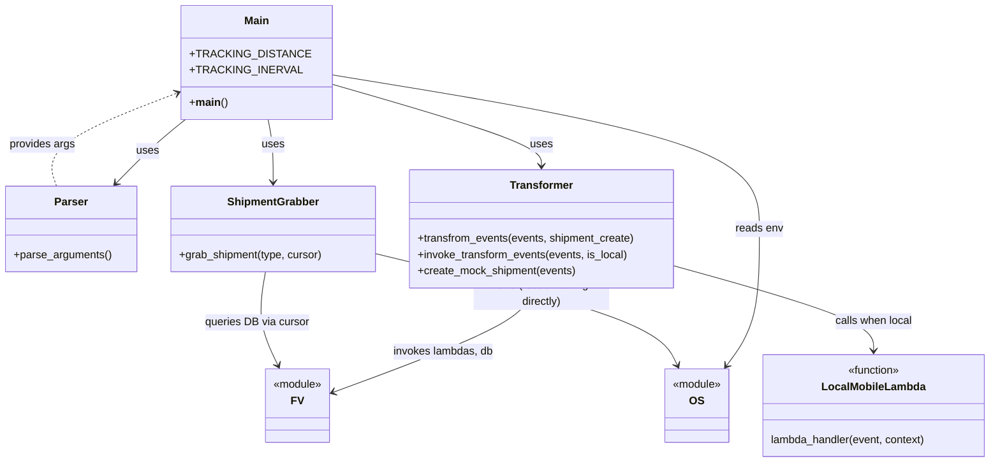

# Diagram: shipment_core/mobile_tracking_api/scripts/reproccess_mobile_updates.py

> Auto-generated by Obscura crawlers

## Mermaid

```mermaid
classDiagram
class Main {
  +TRACKING_DISTANCE
  +TRACKING_INERVAL
  +__main__()
}
class Parser {
  +parse_arguments()
}
class ShipmentGrabber {
  +grab_shipment(type, cursor)
}
class Transformer {
  +transfrom_events(events, shipment_create)
  +invoke_transform_events(events, is_local)
  +create_mock_shipment(events)
}
class FV <<module>>
class LocalMobileLambda <<function>>
class OS <<module>>

Main --> Parser : uses
Main --> ShipmentGrabber : uses
Main --> Transformer : uses
Transformer --> FV : invokes lambdas, db
Transformer --> LocalMobileLambda : calls when local
Main --> OS : reads env
ShipmentGrabber --> FV : queries DB via cursor
ShipmentGrabber --> OS : none (reads nothing directly)
Parser ..> Main : provides args
LocalMobileLambda : lambda_handler(event, context)
```

> SVG rendering failed for this diagram.
