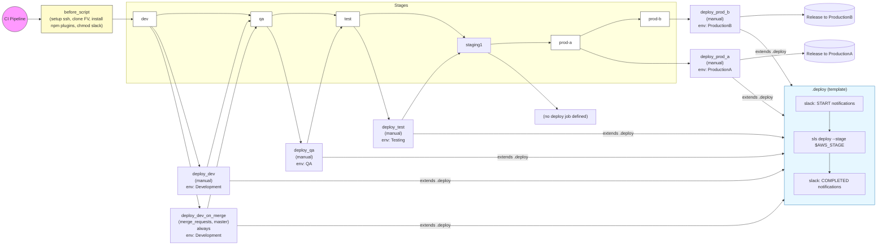

# Diagram: shipment_core/scheduled_services/.gitlab-ci.yml

> Auto-generated by Obscura crawlers

## Mermaid

### SVG

<svg id="container" width="3735.578125" xmlns="http://www.w3.org/2000/svg" class="flowchart" height="791.4467163085938" viewBox="0 0 3735.578125 791.4467163085938" role="graphics-document document" aria-roledescription="flowchart-v2"><g><marker id="container_flowchart-v2-pointEnd" class="marker flowchart-v2" viewBox="0 0 10 10" refX="5" refY="5" markerUnits="userSpaceOnUse" markerWidth="8" markerHeight="8" orient="auto"><path d="M 0 0 L 10 5 L 0 10 z" class="arrowMarkerPath" style="stroke-width: 1; stroke-dasharray: 1, 0;"></path></marker><marker id="container_flowchart-v2-pointStart" class="marker flowchart-v2" viewBox="0 0 10 10" refX="4.5" refY="5" markerUnits="userSpaceOnUse" markerWidth="8" markerHeight="8" orient="auto"><path d="M 0 5 L 10 10 L 10 0 z" class="arrowMarkerPath" style="stroke-width: 1; stroke-dasharray: 1, 0;"></path></marker><marker id="container_flowchart-v2-circleEnd" class="marker flowchart-v2" viewBox="0 0 10 10" refX="11" refY="5" markerUnits="userSpaceOnUse" markerWidth="11" markerHeight="11" orient="auto"><circle cx="5" cy="5" r="5" class="arrowMarkerPath" style="stroke-width: 1; stroke-dasharray: 1, 0;"></circle></marker><marker id="container_flowchart-v2-circleStart" class="marker flowchart-v2" viewBox="0 0 10 10" refX="-1" refY="5" markerUnits="userSpaceOnUse" markerWidth="11" markerHeight="11" orient="auto"><circle cx="5" cy="5" r="5" class="arrowMarkerPath" style="stroke-width: 1; stroke-dasharray: 1, 0;"></circle></marker><marker id="container_flowchart-v2-crossEnd" class="marker cross flowchart-v2" viewBox="0 0 11 11" refX="12" refY="5.2" markerUnits="userSpaceOnUse" markerWidth="11" markerHeight="11" orient="auto"><path d="M 1,1 l 9,9 M 10,1 l -9,9" class="arrowMarkerPath" style="stroke-width: 2; stroke-dasharray: 1, 0;"></path></marker><marker id="container_flowchart-v2-crossStart" class="marker cross flowchart-v2" viewBox="0 0 11 11" refX="-1" refY="5.2" markerUnits="userSpaceOnUse" markerWidth="11" markerHeight="11" orient="auto"><path d="M 1,1 l 9,9 M 10,1 l -9,9" class="arrowMarkerPath" style="stroke-width: 2; stroke-dasharray: 1, 0;"></path></marker><g class="root"><g class="clusters"><g class="cluster" id="StagesSequence" data-look="classic"><rect style="" x="460.25" y="8" width="2420.21875" height="272"></rect><g class="cluster-label" transform="translate(1646.765625, 8)"><foreignObject width="47.1875" height="24">

Stages

</foreignObject></g></g></g><g class="edgePaths"><path d="M100.25,70L104.417,70C108.583,70,116.917,70,124.583,70C132.25,70,139.25,70,142.75,70L146.25,70" id="L_Start_BeforeScript_0" class="edge-thickness-normal edge-pattern-solid edge-thickness-normal edge-pattern-solid flowchart-link" style=";" data-edge="true" data-et="edge" data-id="L_Start_BeforeScript_0" data-points="W3sieCI6MTAwLjI1LCJ5Ijo3MH0seyJ4IjoxMjUuMjUsInkiOjcwfSx7IngiOjE1MC4yNSwieSI6NzB9XQ==" marker-end="url(#container_flowchart-v2-pointEnd)"></path><path d="M571.359,56.714L575.526,55.429C579.693,54.143,588.026,51.571,627.104,50.286C666.182,49,736.005,49,805.828,49C875.651,49,945.474,49,983.919,50.157C1022.363,51.314,1029.429,53.627,1032.962,54.784L1036.495,55.941" id="L_Dev_QA_0" class="edge-thickness-normal edge-pattern-solid edge-thickness-normal edge-pattern-solid flowchart-link" style=";" data-edge="true" data-et="edge" data-id="L_Dev_QA_0" data-points="W3sieCI6NTcxLjM1OTM3NSwieSI6NTYuNzE0Mzg0MTEyMDQyMjV9LHsieCI6NTk2LjM1OTM3NSwieSI6NDl9LHsieCI6ODA1LjgyODEyNSwieSI6NDl9LHsieCI6MTAxNS4yOTY4NzUsInkiOjQ5fSx7IngiOjEwNDAuMjk2ODc1LCJ5Ijo1Ny4xODUxNDAwNzMwODE2MDV9XQ==" marker-end="url(#container_flowchart-v2-pointEnd)"></path><path d="M1118.578,57.185L1122.745,55.821C1126.911,54.457,1135.245,51.728,1165.979,50.364C1196.714,49,1249.849,49,1302.984,49C1356.12,49,1409.255,49,1439.352,50.078C1469.449,51.156,1476.507,53.311,1480.036,54.389L1483.565,55.467" id="L_QA_Test_0" class="edge-thickness-normal edge-pattern-solid edge-thickness-normal edge-pattern-solid flowchart-link" style=";" data-edge="true" data-et="edge" data-id="L_QA_Test_0" data-points="W3sieCI6MTExOC41NzgxMjUsInkiOjU3LjE4NTE0MDA3MzA4MTYwNX0seyJ4IjoxMTQzLjU3ODEyNSwieSI6NDl9LHsieCI6MTMwMi45ODQzNzUsInkiOjQ5fSx7IngiOjE0NjIuMzkwNjI1LCJ5Ijo0OX0seyJ4IjoxNDg3LjM5MDYyNSwieSI6NTYuNjM1NDk1OTY2MzY3NDZ9XQ==" marker-end="url(#container_flowchart-v2-pointEnd)"></path><path d="M1574.906,56.635L1579.073,55.363C1583.24,54.09,1591.573,51.545,1623.077,50.273C1654.581,49,1709.255,49,1773.47,49C1837.685,49,1911.44,49,1965.34,61.603C2019.239,74.207,2053.283,99.413,2070.305,112.016L2087.327,124.62" id="L_Test_Staging1_0" class="edge-thickness-normal edge-pattern-solid edge-thickness-normal edge-pattern-solid flowchart-link" style=";" data-edge="true" data-et="edge" data-id="L_Test_Staging1_0" data-points="W3sieCI6MTU3NC45MDYyNSwieSI6NTYuNjM1NDk1OTY2MzY3NDZ9LHsieCI6MTU5OS45MDYyNSwieSI6NDl9LHsieCI6MTc2My45Mjk2ODc1LCJ5Ijo0OX0seyJ4IjoxOTg1LjE5NTMxMjUsInkiOjQ5fSx7IngiOjIwOTAuNTQxNzQxMDcxNDI4NSwieSI6MTI3fV0=" marker-end="url(#container_flowchart-v2-pointEnd)"></path><path d="M2186.578,149.799L2200.285,148.833C2213.992,147.866,2241.406,145.933,2278.221,144.967C2315.036,144,2361.253,144,2384.361,144L2407.469,144" id="L_Staging1_ProdA_0" class="edge-thickness-normal edge-pattern-solid edge-thickness-normal edge-pattern-solid flowchart-link" style=";" data-edge="true" data-et="edge" data-id="L_Staging1_ProdA_0" data-points="W3sieCI6MjE4Ni41NzgxMjUsInkiOjE0OS43OTkzNjA5NTE5NjEyfSx7IngiOjIyNjguODIwMzEyNSwieSI6MTQ0fSx7IngiOjI0MTEuNDY4NzUsInkiOjE0NH1d" marker-end="url(#container_flowchart-v2-pointEnd)"></path><path d="M2520.5,123.539L2544.275,114.616C2568.049,105.693,2615.599,87.846,2652.414,78.923C2689.229,70,2715.31,70,2728.35,70L2741.391,70" id="L_ProdA_ProdB_0" class="edge-thickness-normal edge-pattern-solid edge-thickness-normal edge-pattern-solid flowchart-link" style=";" data-edge="true" data-et="edge" data-id="L_ProdA_ProdB_0" data-points="W3sieCI6MjUyMC41LCJ5IjoxMjMuNTM5MDg5NDMyMTgyOX0seyJ4IjoyNjYzLjE0ODQzNzUsInkiOjcwfSx7IngiOjI3NDUuMzkwNjI1LCJ5Ijo3MH1d" marker-end="url(#container_flowchart-v2-pointEnd)"></path><path d="M410.25,70L414.417,70C418.583,70,426.917,70,435.25,70C443.583,70,451.917,70,459.583,70C467.25,70,474.25,70,477.75,70L481.25,70" id="L_BeforeScript_Dev_0" class="edge-thickness-normal edge-pattern-solid edge-thickness-normal edge-pattern-solid flowchart-link" style=";" data-edge="true" data-et="edge" data-id="L_BeforeScript_Dev_0" data-points="W3sieCI6NDEwLjI1LCJ5Ijo3MH0seyJ4Ijo0MzUuMjUsInkiOjcwfSx7IngiOjQ2MC4yNSwieSI6NzB9LHsieCI6NDg1LjI1LCJ5Ijo3MH1d" marker-end="url(#container_flowchart-v2-pointEnd)"></path><path d="M555.811,97L562.569,103.634C569.327,110.267,582.843,123.535,621.407,202.998C659.971,282.462,723.583,428.121,755.389,500.951L787.195,573.781" id="L_Dev_DeployDev_0" class="edge-thickness-normal edge-pattern-solid edge-thickness-normal edge-pattern-solid flowchart-link" style=";" data-edge="true" data-et="edge" data-id="L_Dev_DeployDev_0" data-points="W3sieCI6NTU1LjgxMDgyNjExMzY1NzksInkiOjk3fSx7IngiOjU5Ni4zNTkzNzUsInkiOjEzNi44MDI0MTc3NTUxMjY5NX0seyJ4Ijo3ODguNzk2MTY2OTQzNzk4NSwieSI6NTc3LjQ0NjY5NzIzNTEwNzR9XQ==" marker-end="url(#container_flowchart-v2-pointEnd)"></path><path d="M549.473,97L557.288,106.967C565.102,116.934,580.731,136.868,620.916,237.648C661.101,338.428,725.842,520.053,758.213,610.866L790.583,701.679" id="L_Dev_DeployDevOnMerge_0" class="edge-thickness-normal edge-pattern-solid edge-thickness-normal edge-pattern-solid flowchart-link" style=";" data-edge="true" data-et="edge" data-id="L_Dev_DeployDevOnMerge_0" data-points="W3sieCI6NTQ5LjQ3MzE4MjY4NzM1MjgsInkiOjk3fSx7IngiOjU5Ni4zNTkzNzUsInkiOjE1Ni44MDI0MTc3NTUxMjY5NX0seyJ4Ijo3OTEuOTI2Mzc5NDQ1MzA5NywieSI6NzA1LjQ0NjY5NzIzNTEwNzR9XQ==" marker-end="url(#container_flowchart-v2-pointEnd)"></path><path d="M1101.986,97L1108.918,105.3C1115.85,113.601,1129.714,130.202,1160.346,197.324C1190.978,264.447,1238.377,382.092,1262.077,440.914L1285.776,499.737" id="L_QA_DeployQA_0" class="edge-thickness-normal edge-pattern-solid edge-thickness-normal edge-pattern-solid flowchart-link" style=";" data-edge="true" data-et="edge" data-id="L_QA_DeployQA_0" data-points="W3sieCI6MTEwMS45ODYyMjg2MTU4MzA0LCJ5Ijo5N30seyJ4IjoxMTQzLjU3ODEyNSwieSI6MTQ2LjgwMjQxNzc1NTEyNjk1fSx7IngiOjEyODcuMjcxMTU5Njg5MDg3LCJ5Ijo1MDMuNDQ2Njk3MjM1MTA3NH1d" marker-end="url(#container_flowchart-v2-pointEnd)"></path><path d="M1555.32,97L1562.751,105.3C1570.182,113.601,1585.044,130.202,1616.195,185.015C1647.346,239.829,1694.785,332.856,1718.505,379.37L1742.224,425.883" id="L_Test_DeployTest_0" class="edge-thickness-normal edge-pattern-solid edge-thickness-normal edge-pattern-solid flowchart-link" style=";" data-edge="true" data-et="edge" data-id="L_Test_DeployTest_0" data-points="W3sieCI6MTU1NS4zMjAzNDQ5OTY3MDIsInkiOjk3fSx7IngiOjE1OTkuOTA2MjUsInkiOjE0Ni44MDI0MTc3NTUxMjY5NX0seyJ4IjoxNzQ0LjA0MTUyMzg2NTE4NTEsInkiOjQyOS40NDY2OTcyMzUxMDc0fV0=" marker-end="url(#container_flowchart-v2-pointEnd)"></path><path d="M2184.325,181L2198.408,187.634C2212.49,194.267,2240.655,207.535,2282.334,240.152C2324.012,272.77,2379.205,324.737,2406.801,350.721L2434.397,376.705" id="L_Staging1_StagingPlaceholder_0" class="edge-thickness-normal edge-pattern-solid edge-thickness-normal edge-pattern-solid flowchart-link" style=";" data-edge="true" data-et="edge" data-id="L_Staging1_StagingPlaceholder_0" data-points="W3sieCI6MjE4NC4zMjUxNjE2MTIwNTU2LCJ5IjoxODF9LHsieCI6MjI2OC44MjAzMTI1LCJ5IjoyMjAuODAyNDE3NzU1MTI2OTV9LHsieCI6MjQzNy4zMDg5NDQyMTE1NDkzLCJ5IjozNzkuNDQ2Njk3MjM1MTA3NH1d" marker-end="url(#container_flowchart-v2-pointEnd)"></path><path d="M2520.5,162.471L2544.275,170.526C2568.049,178.581,2615.599,194.692,2662.254,202.747C2708.909,210.802,2754.669,210.802,2790.889,210.802C2827.109,210.802,2853.789,210.802,2871.296,210.802C2888.802,210.802,2897.135,210.802,2904.882,210.802C2912.628,210.802,2919.786,210.802,2923.366,210.802L2926.945,210.802" id="L_ProdA_DeployProdA_0" class="edge-thickness-normal edge-pattern-solid edge-thickness-normal edge-pattern-solid flowchart-link" style=";" data-edge="true" data-et="edge" data-id="L_ProdA_DeployProdA_0" data-points="W3sieCI6MjUyMC41LCJ5IjoxNjIuNDcwNzg3Nzc1Njk3NDN9LHsieCI6MjY2My4xNDg0Mzc1LCJ5IjoyMTAuODAyNDE3NzU1MTI2OTV9LHsieCI6MjgwMC40Mjk2ODc1LCJ5IjoyMTAuODAyNDE3NzU1MTI2OTV9LHsieCI6Mjg4MC40Njg3NSwieSI6MjEwLjgwMjQxNzc1NTEyNjk1fSx7IngiOjI5MDUuNDY4NzUsInkiOjIxMC44MDI0MTc3NTUxMjY5NX0seyJ4IjoyOTMwLjk0NTMxMjUsInkiOjIxMC44MDI0MTc3NTUxMjY5NX1d" marker-end="url(#container_flowchart-v2-pointEnd)"></path><path d="M2855.469,70L2859.635,70C2863.802,70,2872.135,70,2880.469,70C2888.802,70,2897.135,70,2904.802,70C2912.469,70,2919.469,70,2922.969,70L2926.469,70" id="L_ProdB_DeployProdB_0" class="edge-thickness-normal edge-pattern-solid edge-thickness-normal edge-pattern-solid flowchart-link" style=";" data-edge="true" data-et="edge" data-id="L_ProdB_DeployProdB_0" data-points="W3sieCI6Mjg1NS40Njg3NSwieSI6NzB9LHsieCI6Mjg4MC40Njg3NSwieSI6NzB9LHsieCI6MjkwNS40Njg3NSwieSI6NzB9LHsieCI6MjkzMC40Njg3NSwieSI6NzB9XQ==" marker-end="url(#container_flowchart-v2-pointEnd)"></path><path d="M821.057,577.447L853.43,494.539C885.803,411.631,950.55,245.816,986.431,162.361C1022.313,78.906,1029.329,77.812,1032.837,77.265L1036.345,76.719" id="L_DeployDev_QA_0" class="edge-thickness-normal edge-pattern-solid edge-thickness-normal edge-pattern-solid flowchart-link" style=";" data-edge="true" data-et="edge" data-id="L_DeployDev_QA_0" data-points="W3sieCI6ODIxLjA1NjYzMDA3MjU1NDYsInkiOjU3Ny40NDY2OTcyMzUxMDc0fSx7IngiOjEwMTUuMjk2ODc1LCJ5Ijo4MH0seyJ4IjoxMDQwLjI5Njg3NSwieSI6NzYuMTAyMzE0MjUwOTEzNTJ9XQ==" marker-end="url(#container_flowchart-v2-pointEnd)"></path><path d="M819.73,705.447L852.324,614.006C884.919,522.565,950.108,339.684,989.671,238.812C1029.234,137.941,1043.172,119.079,1050.141,109.648L1057.109,100.217" id="L_DeployDevOnMerge_QA_0" class="edge-thickness-normal edge-pattern-solid edge-thickness-normal edge-pattern-solid flowchart-link" style=";" data-edge="true" data-et="edge" data-id="L_DeployDevOnMerge_QA_0" data-points="W3sieCI6ODE5LjcyOTg3MDU1NDY5MDMsInkiOjcwNS40NDY2OTcyMzUxMDc0fSx7IngiOjEwMTUuMjk2ODc1LCJ5IjoxNTYuODAyNDE3NzU1MTI2OTV9LHsieCI6MTA1OS40ODY0Nzg4MjEyNDEyLCJ5Ijo5N31d" marker-end="url(#container_flowchart-v2-pointEnd)"></path><path d="M1318.698,503.447L1342.646,444.006C1366.595,384.565,1414.493,265.684,1445.428,198.439C1476.363,131.195,1490.336,115.588,1497.322,107.784L1504.308,99.98" id="L_DeployQA_Test_0" class="edge-thickness-normal edge-pattern-solid edge-thickness-normal edge-pattern-solid flowchart-link" style=";" data-edge="true" data-et="edge" data-id="L_DeployQA_Test_0" data-points="W3sieCI6MTMxOC42OTc1OTAzMTA5MTMsInkiOjUwMy40NDY2OTcyMzUxMDc0fSx7IngiOjE0NjIuMzkwNjI1LCJ5IjoxNDYuODAyNDE3NzU1MTI2OTV9LHsieCI6MTUwNi45NzY1MzAwMDMyOTgsInkiOjk3fV0=" marker-end="url(#container_flowchart-v2-pointEnd)"></path><path d="M1798.775,429.447L1829.845,394.673C1860.915,359.899,1923.055,290.351,1967.605,249.227C2012.154,208.103,2039.113,195.404,2052.592,189.054L2066.072,182.705" id="L_DeployTest_Staging1_0" class="edge-thickness-normal edge-pattern-solid edge-thickness-normal edge-pattern-solid flowchart-link" style=";" data-edge="true" data-et="edge" data-id="L_DeployTest_Staging1_0" data-points="W3sieCI6MTc5OC43NzU0NzI3MjUxNjQ1LCJ5Ijo0MjkuNDQ2Njk3MjM1MTA3NH0seyJ4IjoxOTg1LjE5NTMxMjUsInkiOjIyMC44MDI0MTc3NTUxMjY5NX0seyJ4IjoyMDY5LjY5MDQ2MzM4Nzk0NDQsInkiOjE4MX1d" marker-end="url(#container_flowchart-v2-pointEnd)"></path><path d="M3232.617,200.469L3246.404,199.525C3260.19,198.58,3287.763,196.691,3326.827,194.724C3365.892,192.758,3416.447,190.713,3441.725,189.69L3467.003,188.668" id="L_DeployProdA_EndA_0" class="edge-thickness-normal edge-pattern-solid edge-thickness-normal edge-pattern-solid flowchart-link" style=";" data-edge="true" data-et="edge" data-id="L_DeployProdA_EndA_0" data-points="W3sieCI6MzIzMi42MTcxODc1LCJ5IjoyMDAuNDY5MTg0NzczMDIyOTN9LHsieCI6MzMxNS4zMzU5Mzc1LCJ5IjoxOTQuODAyNDE3NzU1MTI2OTV9LHsieCI6MzQ3MSwieSI6MTg4LjUwNjQwMjMzNTAyMzk1fV0=" marker-end="url(#container_flowchart-v2-pointEnd)"></path><path d="M3233.094,57.819L3246.801,56.715C3260.508,55.612,3287.922,53.405,3326.859,52.301C3365.797,51.198,3416.258,51.198,3441.488,51.198L3466.719,51.198" id="L_DeployProdB_EndB_0" class="edge-thickness-normal edge-pattern-solid edge-thickness-normal edge-pattern-solid flowchart-link" style=";" data-edge="true" data-et="edge" data-id="L_DeployProdB_EndB_0" data-points="W3sieCI6MzIzMy4wOTM3NSwieSI6NTcuODE4NTIzOTMxMDQ4NzF9LHsieCI6MzMxNS4zMzU5Mzc1LCJ5Ijo1MS4xOTc1ODIyNDQ4NzMwNX0seyJ4IjozNDcwLjcxODc1LCJ5Ijo1MS4xOTc1ODIyNDQ4NzMwNX1d" marker-end="url(#container_flowchart-v2-pointEnd)"></path><path d="M944.305,616.447L956.137,616.447C967.969,616.447,991.633,616.447,1014.155,616.447C1036.677,616.447,1058.057,616.447,1079.438,616.447C1100.818,616.447,1122.198,616.447,1159.456,616.447C1196.714,616.447,1249.849,616.447,1302.984,616.447C1356.12,616.447,1409.255,616.447,1447.283,616.447C1485.31,616.447,1508.229,616.447,1531.148,616.447C1554.068,616.447,1576.987,616.447,1615.784,616.447C1654.581,616.447,1709.255,616.447,1773.47,616.447C1837.685,616.447,1911.44,616.447,1971.953,616.447C2032.466,616.447,2079.737,616.447,2127.008,616.447C2174.279,616.447,2221.549,616.447,2278.046,616.447C2334.542,616.447,2400.263,616.447,2465.984,616.447C2531.706,616.447,2597.427,616.447,2653.168,616.447C2708.909,616.447,2754.669,616.447,2790.889,616.447C2827.109,616.447,2853.789,616.447,2871.296,616.447C2888.802,616.447,2897.135,616.447,2930.688,616.447C2964.24,616.447,3023.01,616.447,3091.322,616.447C3159.633,616.447,3237.484,616.447,3289.494,611.496C3341.503,606.545,3367.67,596.644,3380.753,591.694L3393.837,586.743" id="L_DeployDev_DeployTemplate_0" class="edge-thickness-normal edge-pattern-solid edge-thickness-normal edge-pattern-solid flowchart-link" style=";" data-edge="true" data-et="edge" data-id="L_DeployDev_DeployTemplate_0" data-points="W3sieCI6OTQ0LjMwNDY4NzUsInkiOjYxNi40NDY2OTcyMzUxMDc0fSx7IngiOjEwMTUuMjk2ODc1LCJ5Ijo2MTYuNDQ2Njk3MjM1MTA3NH0seyJ4IjoxMDc5LjQzNzUsInkiOjYxNi40NDY2OTcyMzUxMDc0fSx7IngiOjExNDMuNTc4MTI1LCJ5Ijo2MTYuNDQ2Njk3MjM1MTA3NH0seyJ4IjoxMzAyLjk4NDM3NSwieSI6NjE2LjQ0NjY5NzIzNTEwNzR9LHsieCI6MTQ2Mi4zOTA2MjUsInkiOjYxNi40NDY2OTcyMzUxMDc0fSx7IngiOjE1MzEuMTQ4NDM3NSwieSI6NjE2LjQ0NjY5NzIzNTEwNzR9LHsieCI6MTU5OS45MDYyNSwieSI6NjE2LjQ0NjY5NzIzNTEwNzR9LHsieCI6MTc2My45Mjk2ODc1LCJ5Ijo2MTYuNDQ2Njk3MjM1MTA3NH0seyJ4IjoxOTg1LjE5NTMxMjUsInkiOjYxNi40NDY2OTcyMzUxMDc0fSx7IngiOjIxMjcuMDA3ODEyNSwieSI6NjE2LjQ0NjY5NzIzNTEwNzR9LHsieCI6MjI2OC44MjAzMTI1LCJ5Ijo2MTYuNDQ2Njk3MjM1MTA3NH0seyJ4IjoyNDY1Ljk4NDM3NSwieSI6NjE2LjQ0NjY5NzIzNTEwNzR9LHsieCI6MjY2My4xNDg0Mzc1LCJ5Ijo2MTYuNDQ2Njk3MjM1MTA3NH0seyJ4IjoyODAwLjQyOTY4NzUsInkiOjYxNi40NDY2OTcyMzUxMDc0fSx7IngiOjI4ODAuNDY4NzUsInkiOjYxNi40NDY2OTcyMzUxMDc0fSx7IngiOjI5MDUuNDY4NzUsInkiOjYxNi40NDY2OTcyMzUxMDc0fSx7IngiOjMwODEuNzgxMjUsInkiOjYxNi40NDY2OTcyMzUxMDc0fSx7IngiOjMzMTUuMzM1OTM3NSwieSI6NjE2LjQ0NjY5NzIzNTEwNzR9LHsieCI6MzM5Ny41NzgxMjUsInkiOjU4NS4zMjcyOTgyOTY2MjkxfV0=" marker-end="url(#container_flowchart-v2-pointEnd)"></path><path d="M990.297,744.447L994.464,744.447C998.63,744.447,1006.964,744.447,1021.82,744.447C1036.677,744.447,1058.057,744.447,1079.438,744.447C1100.818,744.447,1122.198,744.447,1159.456,744.447C1196.714,744.447,1249.849,744.447,1302.984,744.447C1356.12,744.447,1409.255,744.447,1447.283,744.447C1485.31,744.447,1508.229,744.447,1531.148,744.447C1554.068,744.447,1576.987,744.447,1615.784,744.447C1654.581,744.447,1709.255,744.447,1773.47,744.447C1837.685,744.447,1911.44,744.447,1971.953,744.447C2032.466,744.447,2079.737,744.447,2127.008,744.447C2174.279,744.447,2221.549,744.447,2278.046,744.447C2334.542,744.447,2400.263,744.447,2465.984,744.447C2531.706,744.447,2597.427,744.447,2653.168,744.447C2708.909,744.447,2754.669,744.447,2790.889,744.447C2827.109,744.447,2853.789,744.447,2871.296,744.447C2888.802,744.447,2897.135,744.447,2930.688,744.447C2964.24,744.447,3023.01,744.447,3091.322,744.447C3159.633,744.447,3237.484,744.447,3289.621,732.609C3341.757,720.771,3368.178,697.095,3381.389,685.257L3394.599,673.419" id="L_DeployDevOnMerge_DeployTemplate_0" class="edge-thickness-normal edge-pattern-solid edge-thickness-normal edge-pattern-solid flowchart-link" style=";" data-edge="true" data-et="edge" data-id="L_DeployDevOnMerge_DeployTemplate_0" data-points="W3sieCI6OTkwLjI5Njg3NSwieSI6NzQ0LjQ0NjY5NzIzNTEwNzR9LHsieCI6MTAxNS4yOTY4NzUsInkiOjc0NC40NDY2OTcyMzUxMDc0fSx7IngiOjEwNzkuNDM3NSwieSI6NzQ0LjQ0NjY5NzIzNTEwNzR9LHsieCI6MTE0My41NzgxMjUsInkiOjc0NC40NDY2OTcyMzUxMDc0fSx7IngiOjEzMDIuOTg0Mzc1LCJ5Ijo3NDQuNDQ2Njk3MjM1MTA3NH0seyJ4IjoxNDYyLjM5MDYyNSwieSI6NzQ0LjQ0NjY5NzIzNTEwNzR9LHsieCI6MTUzMS4xNDg0Mzc1LCJ5Ijo3NDQuNDQ2Njk3MjM1MTA3NH0seyJ4IjoxNTk5LjkwNjI1LCJ5Ijo3NDQuNDQ2Njk3MjM1MTA3NH0seyJ4IjoxNzYzLjkyOTY4NzUsInkiOjc0NC40NDY2OTcyMzUxMDc0fSx7IngiOjE5ODUuMTk1MzEyNSwieSI6NzQ0LjQ0NjY5NzIzNTEwNzR9LHsieCI6MjEyNy4wMDc4MTI1LCJ5Ijo3NDQuNDQ2Njk3MjM1MTA3NH0seyJ4IjoyMjY4LjgyMDMxMjUsInkiOjc0NC40NDY2OTcyMzUxMDc0fSx7IngiOjI0NjUuOTg0Mzc1LCJ5Ijo3NDQuNDQ2Njk3MjM1MTA3NH0seyJ4IjoyNjYzLjE0ODQzNzUsInkiOjc0NC40NDY2OTcyMzUxMDc0fSx7IngiOjI4MDAuNDI5Njg3NSwieSI6NzQ0LjQ0NjY5NzIzNTEwNzR9LHsieCI6Mjg4MC40Njg3NSwieSI6NzQ0LjQ0NjY5NzIzNTEwNzR9LHsieCI6MjkwNS40Njg3NSwieSI6NzQ0LjQ0NjY5NzIzNTEwNzR9LHsieCI6MzA4MS43ODEyNSwieSI6NzQ0LjQ0NjY5NzIzNTEwNzR9LHsieCI6MzMxNS4zMzU5Mzc1LCJ5Ijo3NDQuNDQ2Njk3MjM1MTA3NH0seyJ4IjozMzk3LjU3ODEyNSwieSI6NjcwLjc0OTYxMzIwNzk5NX1d" marker-end="url(#container_flowchart-v2-pointEnd)"></path><path d="M1437.391,542.447L1441.557,542.447C1445.724,542.447,1454.057,542.447,1469.684,542.447C1485.31,542.447,1508.229,542.447,1531.148,542.447C1554.068,542.447,1576.987,542.447,1615.784,542.447C1654.581,542.447,1709.255,542.447,1773.47,542.447C1837.685,542.447,1911.44,542.447,1971.953,542.447C2032.466,542.447,2079.737,542.447,2127.008,542.447C2174.279,542.447,2221.549,542.447,2278.046,542.447C2334.542,542.447,2400.263,542.447,2465.984,542.447C2531.706,542.447,2597.427,542.447,2653.168,542.447C2708.909,542.447,2754.669,542.447,2790.889,542.447C2827.109,542.447,2853.789,542.447,2871.296,542.447C2888.802,542.447,2897.135,542.447,2930.688,542.447C2964.24,542.447,3023.01,542.447,3091.322,542.447C3159.633,542.447,3237.484,542.447,3289.453,541.415C3341.421,540.384,3367.506,538.321,3380.548,537.289L3393.591,536.258" id="L_DeployQA_DeployTemplate_0" class="edge-thickness-normal edge-pattern-solid edge-thickness-normal edge-pattern-solid flowchart-link" style=";" data-edge="true" data-et="edge" data-id="L_DeployQA_DeployTemplate_0" data-points="W3sieCI6MTQzNy4zOTA2MjUsInkiOjU0Mi40NDY2OTcyMzUxMDc0fSx7IngiOjE0NjIuMzkwNjI1LCJ5Ijo1NDIuNDQ2Njk3MjM1MTA3NH0seyJ4IjoxNTMxLjE0ODQzNzUsInkiOjU0Mi40NDY2OTcyMzUxMDc0fSx7IngiOjE1OTkuOTA2MjUsInkiOjU0Mi40NDY2OTcyMzUxMDc0fSx7IngiOjE3NjMuOTI5Njg3NSwieSI6NTQyLjQ0NjY5NzIzNTEwNzR9LHsieCI6MTk4NS4xOTUzMTI1LCJ5Ijo1NDIuNDQ2Njk3MjM1MTA3NH0seyJ4IjoyMTI3LjAwNzgxMjUsInkiOjU0Mi40NDY2OTcyMzUxMDc0fSx7IngiOjIyNjguODIwMzEyNSwieSI6NTQyLjQ0NjY5NzIzNTEwNzR9LHsieCI6MjQ2NS45ODQzNzUsInkiOjU0Mi40NDY2OTcyMzUxMDc0fSx7IngiOjI2NjMuMTQ4NDM3NSwieSI6NTQyLjQ0NjY5NzIzNTEwNzR9LHsieCI6MjgwMC40Mjk2ODc1LCJ5Ijo1NDIuNDQ2Njk3MjM1MTA3NH0seyJ4IjoyODgwLjQ2ODc1LCJ5Ijo1NDIuNDQ2Njk3MjM1MTA3NH0seyJ4IjoyOTA1LjQ2ODc1LCJ5Ijo1NDIuNDQ2Njk3MjM1MTA3NH0seyJ4IjozMDgxLjc4MTI1LCJ5Ijo1NDIuNDQ2Njk3MjM1MTA3NH0seyJ4IjozMzE1LjMzNTkzNzUsInkiOjU0Mi40NDY2OTcyMzUxMDc0fSx7IngiOjMzOTcuNTc4MTI1LCJ5Ijo1MzUuOTQyNTIyNDg4NDk1Nn1d" marker-end="url(#container_flowchart-v2-pointEnd)"></path><path d="M1902.953,468.447L1916.66,468.447C1930.367,468.447,1957.781,468.447,1995.124,468.447C2032.466,468.447,2079.737,468.447,2127.008,468.447C2174.279,468.447,2221.549,468.447,2278.046,468.447C2334.542,468.447,2400.263,468.447,2465.984,468.447C2531.706,468.447,2597.427,468.447,2653.168,468.447C2708.909,468.447,2754.669,468.447,2790.889,468.447C2827.109,468.447,2853.789,468.447,2871.296,468.447C2888.802,468.447,2897.135,468.447,2930.688,468.447C2964.24,468.447,3023.01,468.447,3091.322,468.447C3159.633,468.447,3237.484,468.447,3289.466,471.322C3341.448,474.197,3367.56,479.947,3380.616,482.822L3393.672,485.697" id="L_DeployTest_DeployTemplate_0" class="edge-thickness-normal edge-pattern-solid edge-thickness-normal edge-pattern-solid flowchart-link" style=";" data-edge="true" data-et="edge" data-id="L_DeployTest_DeployTemplate_0" data-points="W3sieCI6MTkwMi45NTMxMjUsInkiOjQ2OC40NDY2OTcyMzUxMDc0fSx7IngiOjE5ODUuMTk1MzEyNSwieSI6NDY4LjQ0NjY5NzIzNTEwNzR9LHsieCI6MjEyNy4wMDc4MTI1LCJ5Ijo0NjguNDQ2Njk3MjM1MTA3NH0seyJ4IjoyMjY4LjgyMDMxMjUsInkiOjQ2OC40NDY2OTcyMzUxMDc0fSx7IngiOjI0NjUuOTg0Mzc1LCJ5Ijo0NjguNDQ2Njk3MjM1MTA3NH0seyJ4IjoyNjYzLjE0ODQzNzUsInkiOjQ2OC40NDY2OTcyMzUxMDc0fSx7IngiOjI4MDAuNDI5Njg3NSwieSI6NDY4LjQ0NjY5NzIzNTEwNzR9LHsieCI6Mjg4MC40Njg3NSwieSI6NDY4LjQ0NjY5NzIzNTEwNzR9LHsieCI6MjkwNS40Njg3NSwieSI6NDY4LjQ0NjY5NzIzNTEwNzR9LHsieCI6MzA4MS43ODEyNSwieSI6NDY4LjQ0NjY5NzIzNTEwNzR9LHsieCI6MzMxNS4zMzU5Mzc1LCJ5Ijo0NjguNDQ2Njk3MjM1MTA3NH0seyJ4IjozMzk3LjU3ODEyNSwieSI6NDg2LjU1Nzc0NjY4MDM2MjEzfV0=" marker-end="url(#container_flowchart-v2-pointEnd)"></path><path d="M3147.479,249.802L3175.455,266.41C3203.431,283.017,3259.384,316.232,3300.521,342.072C3341.658,367.913,3367.981,386.379,3381.142,395.612L3394.304,404.844" id="L_DeployProdA_DeployTemplate_0" class="edge-thickness-normal edge-pattern-solid edge-thickness-normal edge-pattern-solid flowchart-link" style=";" data-edge="true" data-et="edge" data-id="L_DeployProdA_DeployTemplate_0" data-points="W3sieCI6MzE0Ny40NzkxMTI1MjAyODcsInkiOjI0OS44MDI0MTc3NTUxMjY5NX0seyJ4IjozMzE1LjMzNTkzNzUsInkiOjM0OS40NDY2OTcyMzUxMDc0fSx7IngiOjMzOTcuNTc4MTI1LCJ5Ijo0MDcuMTQxNjg4Mjg2MjAxNTR9XQ==" marker-end="url(#container_flowchart-v2-pointEnd)"></path><path d="M3231.588,109L3245.546,112.634C3259.504,116.267,3287.42,123.535,3319.371,155.703C3351.322,187.872,3387.309,244.941,3405.302,273.475L3423.295,302.01" id="L_DeployProdB_DeployTemplate_0" class="edge-thickness-normal edge-pattern-solid edge-thickness-normal edge-pattern-solid flowchart-link" style=";" data-edge="true" data-et="edge" data-id="L_DeployProdB_DeployTemplate_0" data-points="W3sieCI6MzIzMS41ODgzMzI0OTQzNzksInkiOjEwOX0seyJ4IjozMzE1LjMzNTkzNzUsInkiOjEzMC44MDI0MTc3NTUxMjY5NX0seyJ4IjozNDI1LjQyODM4NDMxNTM4OTQsInkiOjMwNS4zOTMzOTQ0NzAyMTQ4NH1d" marker-end="url(#container_flowchart-v2-pointEnd)"></path></g><g class="edgeLabels"><g class="edgeLabel"><g class="label" data-id="L_Start_BeforeScript_0" transform="translate(0, 0)"><foreignObject width="0" height="0">

</foreignObject></g></g><g class="edgeLabel"><g class="label" data-id="L_Dev_QA_0" transform="translate(0, 0)"><foreignObject width="0" height="0">

</foreignObject></g></g><g class="edgeLabel"><g class="label" data-id="L_QA_Test_0" transform="translate(0, 0)"><foreignObject width="0" height="0">

</foreignObject></g></g><g class="edgeLabel"><g class="label" data-id="L_Test_Staging1_0" transform="translate(0, 0)"><foreignObject width="0" height="0">

</foreignObject></g></g><g class="edgeLabel"><g class="label" data-id="L_Staging1_ProdA_0" transform="translate(0, 0)"><foreignObject width="0" height="0">

</foreignObject></g></g><g class="edgeLabel"><g class="label" data-id="L_ProdA_ProdB_0" transform="translate(0, 0)"><foreignObject width="0" height="0">

</foreignObject></g></g><g class="edgeLabel"><g class="label" data-id="L_BeforeScript_Dev_0" transform="translate(0, 0)"><foreignObject width="0" height="0">

</foreignObject></g></g><g class="edgeLabel"><g class="label" data-id="L_Dev_DeployDev_0" transform="translate(0, 0)"><foreignObject width="0" height="0">

</foreignObject></g></g><g class="edgeLabel"><g class="label" data-id="L_Dev_DeployDevOnMerge_0" transform="translate(0, 0)"><foreignObject width="0" height="0">

</foreignObject></g></g><g class="edgeLabel"><g class="label" data-id="L_QA_DeployQA_0" transform="translate(0, 0)"><foreignObject width="0" height="0">

</foreignObject></g></g><g class="edgeLabel"><g class="label" data-id="L_Test_DeployTest_0" transform="translate(0, 0)"><foreignObject width="0" height="0">

</foreignObject></g></g><g class="edgeLabel"><g class="label" data-id="L_Staging1_StagingPlaceholder_0" transform="translate(0, 0)"><foreignObject width="0" height="0">

</foreignObject></g></g><g class="edgeLabel"><g class="label" data-id="L_ProdA_DeployProdA_0" transform="translate(0, 0)"><foreignObject width="0" height="0">

</foreignObject></g></g><g class="edgeLabel"><g class="label" data-id="L_ProdB_DeployProdB_0" transform="translate(0, 0)"><foreignObject width="0" height="0">

</foreignObject></g></g><g class="edgeLabel"><g class="label" data-id="L_DeployDev_QA_0" transform="translate(0, 0)"><foreignObject width="0" height="0">

</foreignObject></g></g><g class="edgeLabel"><g class="label" data-id="L_DeployDevOnMerge_QA_0" transform="translate(0, 0)"><foreignObject width="0" height="0">

</foreignObject></g></g><g class="edgeLabel"><g class="label" data-id="L_DeployQA_Test_0" transform="translate(0, 0)"><foreignObject width="0" height="0">

</foreignObject></g></g><g class="edgeLabel"><g class="label" data-id="L_DeployTest_Staging1_0" transform="translate(0, 0)"><foreignObject width="0" height="0">

</foreignObject></g></g><g class="edgeLabel"><g class="label" data-id="L_DeployProdA_EndA_0" transform="translate(0, 0)"><foreignObject width="0" height="0">

</foreignObject></g></g><g class="edgeLabel"><g class="label" data-id="L_DeployProdB_EndB_0" transform="translate(0, 0)"><foreignObject width="0" height="0">

</foreignObject></g></g><g class="edgeLabel" transform="translate(1985.1953125, 616.4466972351074)"><g class="label" data-id="L_DeployDev_DeployTemplate_0" transform="translate(-57.2421875, -12)"><foreignObject width="114.484375" height="24">

extends .deploy

</foreignObject></g></g><g class="edgeLabel" transform="translate(1985.1953125, 744.4466972351074)"><g class="label" data-id="L_DeployDevOnMerge_DeployTemplate_0" transform="translate(-57.2421875, -12)"><foreignObject width="114.484375" height="24">

extends .deploy

</foreignObject></g></g><g class="edgeLabel" transform="translate(2268.8203125, 542.4466972351074)"><g class="label" data-id="L_DeployQA_DeployTemplate_0" transform="translate(-57.2421875, -12)"><foreignObject width="114.484375" height="24">

extends .deploy

</foreignObject></g></g><g class="edgeLabel" transform="translate(2663.1484375, 468.4466972351074)"><g class="label" data-id="L_DeployTest_DeployTemplate_0" transform="translate(-57.2421875, -12)"><foreignObject width="114.484375" height="24">

extends .deploy

</foreignObject></g></g><g class="edgeLabel" transform="translate(3274.60096, 325.26533)"><g class="label" data-id="L_DeployProdA_DeployTemplate_0" transform="translate(-57.2421875, -12)"><foreignObject width="114.484375" height="24">

extends .deploy

</foreignObject></g></g><g class="edgeLabel" transform="translate(3347.30285, 181.4974)"><g class="label" data-id="L_DeployProdB_DeployTemplate_0" transform="translate(-57.2421875, -12)"><foreignObject width="114.484375" height="24">

extends .deploy

</foreignObject></g></g></g><g class="nodes"><g class="root" transform="translate(3389.578125, 297.39339447021484)"><g class="clusters"><g class="cluster" id="DeployTemplate" data-look="classic"><rect style="fill:#e6f7ff !important;stroke:#1f78b4 !important" x="8" y="8" width="330" height="435"></rect><g class="cluster-label" transform="translate(106.5546875, 8)"><foreignObject width="132.890625" height="24">

.deploy (template)

</foreignObject></g></g></g><g class="edgePaths"><path d="M173,99.5L173,105.75C173,112,173,124.5,173,136.333C173,148.167,173,159.333,173,164.917L173,170.5" id="L_SlackStart_SLS_0" class="edge-thickness-normal edge-pattern-solid edge-thickness-normal edge-pattern-solid flowchart-link" style=";" data-edge="true" data-et="edge" data-id="L_SlackStart_SLS_0" data-points="W3sieCI6MTczLCJ5Ijo5OS41fSx7IngiOjE3MywieSI6MTM3fSx7IngiOjE3MywieSI6MTc0LjV9XQ==" marker-end="url(#container_flowchart-v2-pointEnd)"></path><path d="M173,252.5L173,258.75C173,265,173,277.5,173,289.333C173,301.167,173,312.333,173,317.917L173,323.5" id="L_SLS_SlackEnd_0" class="edge-thickness-normal edge-pattern-solid edge-thickness-normal edge-pattern-solid flowchart-link" style=";" data-edge="true" data-et="edge" data-id="L_SLS_SlackEnd_0" data-points="W3sieCI6MTczLCJ5IjoyNTIuNX0seyJ4IjoxNzMsInkiOjI5MH0seyJ4IjoxNzMsInkiOjMyNy41fV0=" marker-end="url(#container_flowchart-v2-pointEnd)"></path></g><g class="edgeLabels"><g class="edgeLabel"><g class="label" data-id="L_SlackStart_SLS_0" transform="translate(0, 0)"><foreignObject width="0" height="0">

</foreignObject></g></g><g class="edgeLabel"><g class="label" data-id="L_SLS_SlackEnd_0" transform="translate(0, 0)"><foreignObject width="0" height="0">

</foreignObject></g></g></g><g class="nodes"><g class="node default" id="flowchart-SlackStart-10" transform="translate(173, 72.5)"><rect class="basic label-container" style="" x="-121.265625" y="-27" width="242.53125" height="54"></rect><g class="label" style="" transform="translate(-91.265625, -12)"><rect></rect><foreignObject width="182.53125" height="24">

slack: START notifications

</foreignObject></g></g><g class="node default" id="flowchart-SLS-11" transform="translate(173, 213.5)"><rect class="basic label-container" style="" x="-130" y="-39" width="260" height="78"></rect><g class="label" style="" transform="translate(-100, -24)"><rect></rect><foreignObject width="200" height="48">

sls deploy --stage $AWS_STAGE

</foreignObject></g></g><g class="node default" id="flowchart-SlackEnd-12" transform="translate(173, 366.5)"><rect class="basic label-container" style="" x="-130" y="-39" width="260" height="78"></rect><g class="label" style="" transform="translate(-100, -24)"><rect></rect><foreignObject width="200" height="48">

slack: COMPLETED notifications

</foreignObject></g></g></g></g><g class="node default" id="flowchart-Start-0" transform="translate(54.125, 70)"><circle class="basic label-container" style="fill:#f9f !important;stroke:#333 !important;stroke-width:1px !important" r="46.125" cx="0" cy="0"></circle><g class="label" style="" transform="translate(-38.625, -12)"><rect></rect><foreignObject width="77.25" height="24">

CI Pipeline

</foreignObject></g></g><g class="node default" id="flowchart-BeforeScript-1" transform="translate(280.25, 70)"><rect class="basic label-container" style="fill:#fffbcc !important;stroke:#333 !important" x="-130" y="-51" width="260" height="102"></rect><g class="label" style="" transform="translate(-100, -36)"><rect></rect><foreignObject width="200" height="72">

before_script\n(setup ssh, clone FV, install npm plugins, chmod slack)

</foreignObject></g></g><g class="node default" id="flowchart-Dev-2" transform="translate(528.3046875, 70)"><rect class="basic label-container" style="fill:#fff !important;stroke:#333 !important" x="-43.0546875" y="-27" width="86.109375" height="54"></rect><g class="label" style="" transform="translate(-13.0546875, -12)"><rect></rect><foreignObject width="26.109375" height="24">

dev

</foreignObject></g></g><g class="node default" id="flowchart-QA-3" transform="translate(1079.4375, 70)"><rect class="basic label-container" style="fill:#fff !important;stroke:#333 !important" x="-39.140625" y="-27" width="78.28125" height="54"></rect><g class="label" style="" transform="translate(-9.140625, -12)"><rect></rect><foreignObject width="18.28125" height="24">

qa

</foreignObject></g></g><g class="node default" id="flowchart-Test-4" transform="translate(1531.1484375, 70)"><rect class="basic label-container" style="fill:#fff !important;stroke:#333 !important" x="-43.7578125" y="-27" width="87.515625" height="54"></rect><g class="label" style="" transform="translate(-13.7578125, -12)"><rect></rect><foreignObject width="27.515625" height="24">

test

</foreignObject></g></g><g class="node default" id="flowchart-Staging1-5" transform="translate(2127.0078125, 154)"><rect class="basic label-container" style="" x="-59.5703125" y="-27" width="119.140625" height="54"></rect><g class="label" style="" transform="translate(-29.5703125, -12)"><rect></rect><foreignObject width="59.140625" height="24">

staging1

</foreignObject></g></g><g class="node default" id="flowchart-ProdA-6" transform="translate(2465.984375, 144)"><rect class="basic label-container" style="fill:#fff !important;stroke:#333 !important" x="-54.515625" y="-27" width="109.03125" height="54"></rect><g class="label" style="" transform="translate(-24.515625, -12)"><rect></rect><foreignObject width="49.03125" height="24">

prod-a

</foreignObject></g></g><g class="node default" id="flowchart-ProdB-7" transform="translate(2800.4296875, 70)"><rect class="basic label-container" style="fill:#fff !important;stroke:#333 !important" x="-55.0390625" y="-27" width="110.078125" height="54"></rect><g class="label" style="" transform="translate(-25.0390625, -12)"><rect></rect><foreignObject width="50.078125" height="24">

prod-b

</foreignObject></g></g><g class="node default" id="flowchart-DeployDev-16" transform="translate(805.828125, 616.4466972351074)"><rect class="basic label-container" style="" x="-138.4765625" y="-39" width="276.953125" height="78"></rect><g class="label" style="" transform="translate(-108.4765625, -24)"><rect></rect><foreignObject width="216.953125" height="48">

deploy_dev\n(manual)\nenv: Development

</foreignObject></g></g><g class="node default" id="flowchart-DeployDevOnMerge-18" transform="translate(805.828125, 744.4466972351074)"><rect class="basic label-container" style="" x="-184.46875" y="-39" width="368.9375" height="78"></rect><g class="label" style="" transform="translate(-154.46875, -24)"><rect></rect><foreignObject width="308.9375" height="48">

deploy_dev_on_merge\n(merge_requests, master)\nalways\nenv: Development

</foreignObject></g></g><g class="node default" id="flowchart-DeployQA-20" transform="translate(1302.984375, 542.4466972351074)"><rect class="basic label-container" style="" x="-134.40625" y="-39" width="268.8125" height="78"></rect><g class="label" style="" transform="translate(-104.40625, -24)"><rect></rect><foreignObject width="208.8125" height="48">

deploy_qa\n(manual)\nenv: QA

</foreignObject></g></g><g class="node default" id="flowchart-DeployTest-22" transform="translate(1763.9296875, 468.4466972351074)"><rect class="basic label-container" style="" x="-139.0234375" y="-39" width="278.046875" height="78"></rect><g class="label" style="" transform="translate(-109.0234375, -24)"><rect></rect><foreignObject width="218.046875" height="48">

deploy_test\n(manual)\nenv: Testing

</foreignObject></g></g><g class="node default" id="flowchart-DeployProdA-24" transform="translate(3081.78125, 210.80241775512695)"><rect class="basic label-container" style="" x="-150.8359375" y="-39" width="301.671875" height="78"></rect><g class="label" style="" transform="translate(-120.8359375, -24)"><rect></rect><foreignObject width="241.671875" height="48">

deploy_prod_a\n(manual)\nenv: ProductionA

</foreignObject></g></g><g class="node default" id="flowchart-DeployProdB-26" transform="translate(3081.78125, 70)"><rect class="basic label-container" style="" x="-151.3125" y="-39" width="302.625" height="78"></rect><g class="label" style="" transform="translate(-121.3125, -24)"><rect></rect><foreignObject width="242.625" height="48">

deploy_prod_b\n(manual)\nenv: ProductionB

</foreignObject></g></g><g class="node default" id="flowchart-StagingPlaceholder-37" transform="translate(2465.984375, 406.4466972351074)"><rect class="basic label-container" style="" x="-114.921875" y="-27" width="229.84375" height="54"></rect><g class="label" style="" transform="translate(-84.921875, -12)"><rect></rect><foreignObject width="169.84375" height="24">

(no deploy job defined)

</foreignObject></g></g><g class="node default" id="flowchart-EndA-51" transform="translate(3562.578125, 184.80241775512695)"><path d="M0,14.859040665246932 a91.578125,14.859040665246932 0,0,0 183.15625,0 a91.578125,14.859040665246932 0,0,0 -183.15625,0 l0,53.85904066524693 a91.578125,14.859040665246932 0,0,0 183.15625,0 l0,-53.85904066524693" class="basic label-container" style="" transform="translate(-91.578125, -41.7885609978704)"></path><g class="label" style="" transform="translate(-84.078125, -2)"><rect></rect><foreignObject width="168.15625" height="24">

Release to ProductionA

</foreignObject></g></g><g class="node default" id="flowchart-EndB-53" transform="translate(3562.578125, 51.19758224487305)"><path d="M0,14.877517967405609 a91.859375,14.877517967405609 0,0,0 183.71875,0 a91.859375,14.877517967405609 0,0,0 -183.71875,0 l0,53.87751796740561 a91.859375,14.877517967405609 0,0,0 183.71875,0 l0,-53.87751796740561" class="basic label-container" style="" transform="translate(-91.859375, -41.816276951108414)"></path><g class="label" style="" transform="translate(-84.359375, -2)"><rect></rect><foreignObject width="168.71875" height="24">

Release to ProductionB

</foreignObject></g></g></g></g></g></svg>
