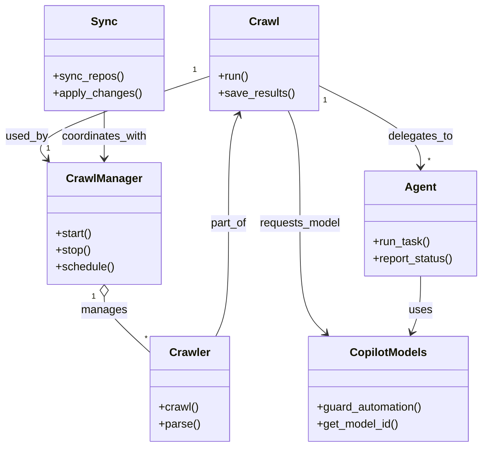
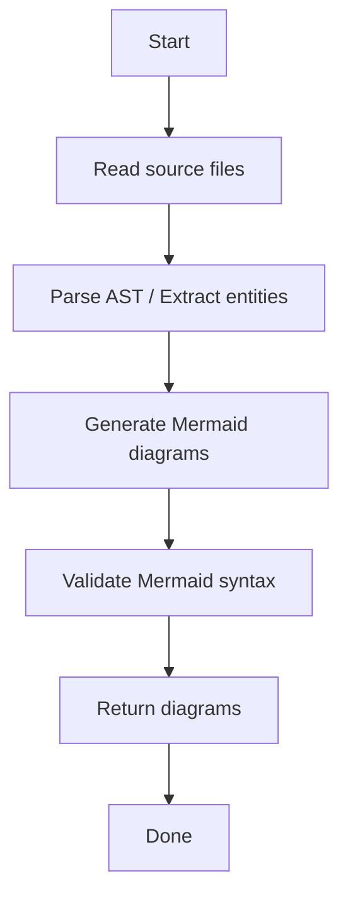

# Diagram: shipment_core/scheduled_services/config/config.alpha.yml

> Auto-generated by Obscura crawlers

## Diagram 1

### SVG

<svg id="container" width="643.3474731445312" xmlns="http://www.w3.org/2000/svg" class="classDiagram" height="638" viewBox="50.15837860107422 0 643.3474731445312 638" role="graphics-document document" aria-roledescription="class"><g><defs><marker id="container_class-aggregationStart" class="marker aggregation class" refX="18" refY="7" markerWidth="190" markerHeight="240" orient="auto"><path d="M 18,7 L9,13 L1,7 L9,1 Z"></path></marker></defs><defs><marker id="container_class-aggregationEnd" class="marker aggregation class" refX="1" refY="7" markerWidth="20" markerHeight="28" orient="auto"><path d="M 18,7 L9,13 L1,7 L9,1 Z"></path></marker></defs><defs><marker id="container_class-extensionStart" class="marker extension class" refX="18" refY="7" markerWidth="190" markerHeight="240" orient="auto"><path d="M 1,7 L18,13 V 1 Z"></path></marker></defs><defs><marker id="container_class-extensionEnd" class="marker extension class" refX="1" refY="7" markerWidth="20" markerHeight="28" orient="auto"><path d="M 1,1 V 13 L18,7 Z"></path></marker></defs><defs><marker id="container_class-compositionStart" class="marker composition class" refX="18" refY="7" markerWidth="190" markerHeight="240" orient="auto"><path d="M 18,7 L9,13 L1,7 L9,1 Z"></path></marker></defs><defs><marker id="container_class-compositionEnd" class="marker composition class" refX="1" refY="7" markerWidth="20" markerHeight="28" orient="auto"><path d="M 18,7 L9,13 L1,7 L9,1 Z"></path></marker></defs><defs><marker id="container_class-dependencyStart" class="marker dependency class" refX="6" refY="7" markerWidth="190" markerHeight="240" orient="auto"><path d="M 5,7 L9,13 L1,7 L9,1 Z"></path></marker></defs><defs><marker id="container_class-dependencyEnd" class="marker dependency class" refX="13" refY="7" markerWidth="20" markerHeight="28" orient="auto"><path d="M 18,7 L9,13 L14,7 L9,1 Z"></path></marker></defs><defs><marker id="container_class-lollipopStart" class="marker lollipop class" refX="13" refY="7" markerWidth="190" markerHeight="240" orient="auto"><circle stroke="black" fill="transparent" cx="7" cy="7" r="6"></circle></marker></defs><defs><marker id="container_class-lollipopEnd" class="marker lollipop class" refX="1" refY="7" markerWidth="190" markerHeight="240" orient="auto"><circle stroke="black" fill="transparent" cx="7" cy="7" r="6"></circle></marker></defs><g class="root"><g class="clusters"></g><g class="edgePaths"><path d="M150.93,423.25L150.93,426.542C150.93,429.833,150.93,436.417,161.537,449.71C172.144,463.004,193.358,483.008,203.965,493.01L214.572,503.012" id="id_CrawlManager_Crawler_1" class="edge-thickness-normal edge-pattern-solid relation" style=";;;" data-edge="true" data-et="edge" data-id="id_CrawlManager_Crawler_1" data-points="W3sieCI6MTUwLjkyOTY4NzUsInkiOjQwNn0seyJ4IjoxNTAuOTI5Njg3NSwieSI6NDQzfSx7IngiOjIxNC41NzIyNjU2MjUsInkiOjUwMy4wMTIxNjg0NTA4MjQ3fV0=" marker-start="url(#container_class-aggregationStart)"></path><path d="M302.393,108.026L258.387,122.522C214.382,137.017,126.37,166.009,87.291,185.931C48.212,205.853,58.064,216.705,62.99,222.131L67.916,227.558" id="id_Crawl_CrawlManager_2" class="edge-thickness-normal edge-pattern-solid relation" style=";;;" data-edge="true" data-et="edge" data-id="id_Crawl_CrawlManager_2" data-points="W3sieCI6MzAyLjM5MjU3ODEyNSwieSI6MTA4LjAyNTg1NTQ4MjcyOTV9LHsieCI6MzguMzU5Mzc1LCJ5IjoxOTV9LHsieCI6NzEuOTQ4OTAzNzI5ODM4NywieSI6MjMyfV0=" marker-end="url(#container_class-dependencyEnd)"></path><path d="M454.338,120.575L479.418,132.979C504.498,145.383,554.658,170.192,579.738,189.762C604.818,209.333,604.818,223.667,604.818,230.833L604.818,238" id="id_Crawl_Agent_3" class="edge-thickness-normal edge-pattern-solid relation" style=";;;" data-edge="true" data-et="edge" data-id="id_Crawl_Agent_3" data-points="W3sieCI6NDU0LjMzNzg5MDYyNSwieSI6MTIwLjU3NDgyOTIyNzkwMzEyfSx7IngiOjYwNC44MTgzNTkzNzUsInkiOjE5NX0seyJ4Ijo2MDQuODE4MzU5Mzc1LCJ5IjoyNDR9XQ==" marker-end="url(#container_class-dependencyEnd)"></path><path d="M413.438,158L416.322,164.167C419.205,170.333,424.973,182.667,427.856,209.5C430.74,236.333,430.74,277.667,430.74,319C430.74,360.333,430.74,401.667,437.043,427.842C443.345,454.017,455.951,465.034,462.253,470.543L468.556,476.051" id="id_Crawl_CopilotModels_4" class="edge-thickness-normal edge-pattern-solid relation" style=";;;" data-edge="true" data-et="edge" data-id="id_Crawl_CopilotModels_4" data-points="W3sieCI6NDEzLjQzNzc3OTAxNzg1NzE3LCJ5IjoxNTh9LHsieCI6NDMwLjc0MDIzNDM3NSwieSI6MTk1fSx7IngiOjQzMC43NDAyMzQzNzUsInkiOjMxOX0seyJ4Ijo0MzAuNzQwMjM0Mzc1LCJ5Ijo0NDN9LHsieCI6NDczLjA3MzY5NTU5MTUxNzksInkiOjQ4MH1d" marker-end="url(#container_class-dependencyEnd)"></path><path d="M150.93,158L150.93,164.167C150.93,170.333,150.93,182.667,150.93,194C150.93,205.333,150.93,215.667,150.93,220.833L150.93,226" id="id_Sync_CrawlManager_5" class="edge-thickness-normal edge-pattern-solid relation" style=";;;" data-edge="true" data-et="edge" data-id="id_Sync_CrawlManager_5" data-points="W3sieCI6MTUwLjkyOTY4NzUsInkiOjE1OH0seyJ4IjoxNTAuOTI5Njg3NSwieSI6MTk1fSx7IngiOjE1MC45Mjk2ODc1LCJ5IjoyMzJ9XQ==" marker-end="url(#container_class-dependencyEnd)"></path><path d="M604.818,394L604.818,402.167C604.818,410.333,604.818,426.667,602.669,440.075C600.519,453.483,596.22,463.966,594.07,469.207L591.921,474.449" id="id_Agent_CopilotModels_6" class="edge-thickness-normal edge-pattern-solid relation" style=";;;" data-edge="true" data-et="edge" data-id="id_Agent_CopilotModels_6" data-points="W3sieCI6NjA0LjgxODM1OTM3NSwieSI6Mzk0fSx7IngiOjYwNC44MTgzNTkzNzUsInkiOjQ0M30seyJ4Ijo1ODkuNjQzODY4NTgyNTg5MywieSI6NDgwfV0=" marker-end="url(#container_class-dependencyEnd)"></path><path d="M307.396,480L310.495,473.833C313.594,467.667,319.792,455.333,322.891,428.5C325.99,401.667,325.99,360.333,325.99,319C325.99,277.667,325.99,236.333,328.45,210.406C330.911,184.478,335.831,173.957,338.291,168.696L340.751,163.435" id="id_Crawler_Crawl_7" class="edge-thickness-normal edge-pattern-solid relation" style=";;;" data-edge="true" data-et="edge" data-id="id_Crawler_Crawl_7" data-points="W3sieCI6MzA3LjM5NjAzMDk3MDk4MjE3LCJ5Ijo0ODB9LHsieCI6MzI1Ljk5MDIzNDM3NSwieSI6NDQzfSx7IngiOjMyNS45OTAyMzQzNzUsInkiOjMxOX0seyJ4IjozMjUuOTkwMjM0Mzc1LCJ5IjoxOTV9LHsieCI6MzQzLjI5MjY4OTczMjE0MjgzLCJ5IjoxNTh9XQ==" marker-end="url(#container_class-dependencyEnd)"></path></g><g class="edgeLabels"><g class="edgeLabel" transform="translate(150.9296875, 443)"><g class="label" data-id="id_CrawlManager_Crawler_1" transform="translate(-32.296875, -12)"><foreignObject width="64.59375" height="24">

manages

</foreignObject></g></g><g class="edgeLabel" transform="translate(146.6441, 159.33035)"><g class="label" data-id="id_Crawl_CrawlManager_2" transform="translate(-30.359375, -12)"><foreignObject width="60.71875" height="24">

used_by

</foreignObject></g></g><g class="edgeLabel" transform="translate(604.818359375, 195)"><g class="label" data-id="id_Crawl_Agent_3" transform="translate(-46.3125, -12)"><foreignObject width="92.625" height="24">

delegates_to

</foreignObject></g></g><g class="edgeLabel" transform="translate(430.740234375, 319)"><g class="label" data-id="id_Crawl_CopilotModels_4" transform="translate(-58.390625, -12)"><foreignObject width="116.78125" height="24">

requests_model

</foreignObject></g></g><g class="edgeLabel" transform="translate(150.9296875, 195)"><g class="label" data-id="id_Sync_CrawlManager_5" transform="translate(-62.2109375, -12)"><foreignObject width="124.421875" height="24">

coordinates_with

</foreignObject></g></g><g class="edgeLabel" transform="translate(604.818359375, 443)"><g class="label" data-id="id_Agent_CopilotModels_6" transform="translate(-16.4921875, -12)"><foreignObject width="32.984375" height="24">

uses

</foreignObject></g></g><g class="edgeLabel" transform="translate(325.990234375, 319)"><g class="label" data-id="id_Crawler_Crawl_7" transform="translate(-26.359375, -12)"><foreignObject width="52.71875" height="24">

part_of

</foreignObject></g></g><g class="edgeTerminals" transform="translate(135.92968875000003, 423.5000010714286)"><g class="inner" transform="translate(0, 0)"><foreignObject style="width: 9px; height: 12px;">
1
</foreignObject></g></g><g class="edgeTerminals" transform="translate(281.078109139573, 99.25411174783646)"><g class="inner" transform="translate(0, 0)"><foreignObject style="width: 9px; height: 12px;">
1
</foreignObject></g></g><g class="edgeTerminals" transform="translate(463.3743242492141, 141.77843579562062)"><g class="inner" transform="translate(0, 0)"><foreignObject style="width: 9px; height: 12px;">
1
</foreignObject></g></g><g class="edgeTerminals" transform="translate(207.13084970603424, 475.09297423214997)"><g class="inner" transform="translate(0, 0)"></g><foreignObject style="width: 9px; height: 12px;">
*
</foreignObject></g><g class="edgeTerminals" transform="translate(66.29220665816835, 203.96049651217342)"><g class="inner" transform="translate(0, 0)"></g><foreignObject style="width: 9px; height: 12px;">
1
</foreignObject></g><g class="edgeTerminals" transform="translate(614.8183596875, 221.50000026785713)"><g class="inner" transform="translate(0, 0)"></g><foreignObject style="width: 9px; height: 12px;">
*
</foreignObject></g></g><g class="nodes"><g class="node default" id="classId-Crawl-0" transform="translate(378.365234375, 83)"><g class="basic label-container"><path d="M-75.97265625 -75 L75.97265625 -75 L75.97265625 75 L-75.97265625 75" stroke="none" stroke-width="0" fill="#ECECFF" style=""></path><path d="M-75.97265625 -75 C-21.70360626151998 -75, 32.56544372696004 -75, 75.97265625 -75 M-75.97265625 -75 C-18.162355705715306 -75, 39.64794483856939 -75, 75.97265625 -75 M75.97265625 -75 C75.97265625 -28.301564238134084, 75.97265625 18.396871523731832, 75.97265625 75 M75.97265625 -75 C75.97265625 -22.43142955573027, 75.97265625 30.137140888539463, 75.97265625 75 M75.97265625 75 C44.03536357556054 75, 12.098070901121083 75, -75.97265625 75 M75.97265625 75 C38.84737139129458 75, 1.7220865325891594 75, -75.97265625 75 M-75.97265625 75 C-75.97265625 30.724545230152025, -75.97265625 -13.550909539695951, -75.97265625 -75 M-75.97265625 75 C-75.97265625 19.412722861521637, -75.97265625 -36.17455427695673, -75.97265625 -75" stroke="#9370DB" stroke-width="1.3" fill="none" stroke-dasharray="0 0" style=""></path></g><g class="annotation-group text" transform="translate(0, -51)"></g><g class="label-group text" transform="translate(-20.1484375, -51)"><g class="label" style="font-weight: bolder" transform="translate(0,-12)"><foreignObject width="40.296875" height="24">

Crawl

</foreignObject></g></g><g class="members-group text" transform="translate(-63.97265625, -3)"></g><g class="methods-group text" transform="translate(-63.97265625, 27)"><g class="label" style="" transform="translate(0,-12)"><foreignObject width="43.21875" height="24">

+run()

</foreignObject></g><g class="label" style="" transform="translate(0,12)"><foreignObject width="107.796875" height="24">

+save_results()

</foreignObject></g></g><g class="divider" style=""><path d="M-75.97265625 -27 C-32.27986743298951 -27, 11.412921384020976 -27, 75.97265625 -27 M-75.97265625 -27 C-36.5719244592626 -27, 2.828807331474806 -27, 75.97265625 -27" stroke="#9370DB" stroke-width="1.3" fill="none" stroke-dasharray="0 0" style=""></path></g><g class="divider" style=""><path d="M-75.97265625 -3 C-43.772553738548 -3, -11.572451227095996 -3, 75.97265625 -3 M-75.97265625 -3 C-41.96389868098984 -3, -7.955141111979685 -3, 75.97265625 -3" stroke="#9370DB" stroke-width="1.3" fill="none" stroke-dasharray="0 0" style=""></path></g></g><g class="node default" id="classId-Crawler-1" transform="translate(269.705078125, 555)"><g class="basic label-container"><path d="M-55.1328125 -75 L55.1328125 -75 L55.1328125 75 L-55.1328125 75" stroke="none" stroke-width="0" fill="#ECECFF" style=""></path><path d="M-55.1328125 -75 C-31.262334498233578 -75, -7.391856496467156 -75, 55.1328125 -75 M-55.1328125 -75 C-13.686457810896776 -75, 27.759896878206447 -75, 55.1328125 -75 M55.1328125 -75 C55.1328125 -37.89726271700074, 55.1328125 -0.7945254340014856, 55.1328125 75 M55.1328125 -75 C55.1328125 -29.429809549997643, 55.1328125 16.140380900004715, 55.1328125 75 M55.1328125 75 C23.877412025199 75, -7.377988449602 75, -55.1328125 75 M55.1328125 75 C25.846826130474486 75, -3.439160239051027 75, -55.1328125 75 M-55.1328125 75 C-55.1328125 17.677926169962568, -55.1328125 -39.644147660074864, -55.1328125 -75 M-55.1328125 75 C-55.1328125 44.835030778689955, -55.1328125 14.67006155737991, -55.1328125 -75" stroke="#9370DB" stroke-width="1.3" fill="none" stroke-dasharray="0 0" style=""></path></g><g class="annotation-group text" transform="translate(0, -51)"></g><g class="label-group text" transform="translate(-27.734375, -51)"><g class="label" style="font-weight: bolder" transform="translate(0,-12)"><foreignObject width="55.46875" height="24">

Crawler

</foreignObject></g></g><g class="members-group text" transform="translate(-43.1328125, -3)"></g><g class="methods-group text" transform="translate(-43.1328125, 27)"><g class="label" style="" transform="translate(0,-12)"><foreignObject width="56.40625" height="24">

+crawl()

</foreignObject></g><g class="label" style="" transform="translate(0,12)"><foreignObject width="58.53125" height="24">

+parse()

</foreignObject></g></g><g class="divider" style=""><path d="M-55.1328125 -27 C-16.458180151654133 -27, 22.216452196691733 -27, 55.1328125 -27 M-55.1328125 -27 C-30.424325992814083 -27, -5.715839485628166 -27, 55.1328125 -27" stroke="#9370DB" stroke-width="1.3" fill="none" stroke-dasharray="0 0" style=""></path></g><g class="divider" style=""><path d="M-55.1328125 -3 C-16.99918339062402 -3, 21.134445718751962 -3, 55.1328125 -3 M-55.1328125 -3 C-20.90680840698373 -3, 13.319195686032543 -3, 55.1328125 -3" stroke="#9370DB" stroke-width="1.3" fill="none" stroke-dasharray="0 0" style=""></path></g></g><g class="node default" id="classId-CrawlManager-2" transform="translate(150.9296875, 319)"><g class="basic label-container"><path d="M-79.6875 -87 L79.6875 -87 L79.6875 87 L-79.6875 87" stroke="none" stroke-width="0" fill="#ECECFF" style=""></path><path d="M-79.6875 -87 C-19.485236879849666 -87, 40.71702624030067 -87, 79.6875 -87 M-79.6875 -87 C-19.237496052546163 -87, 41.212507894907674 -87, 79.6875 -87 M79.6875 -87 C79.6875 -39.98870636111236, 79.6875 7.022587277775287, 79.6875 87 M79.6875 -87 C79.6875 -25.00059854443151, 79.6875 36.99880291113698, 79.6875 87 M79.6875 87 C17.060477454084015 87, -45.56654509183197 87, -79.6875 87 M79.6875 87 C18.228222372352192 87, -43.231055255295615 87, -79.6875 87 M-79.6875 87 C-79.6875 34.00225587070209, -79.6875 -18.995488258595813, -79.6875 -87 M-79.6875 87 C-79.6875 32.43642726361327, -79.6875 -22.127145472773464, -79.6875 -87" stroke="#9370DB" stroke-width="1.3" fill="none" stroke-dasharray="0 0" style=""></path></g><g class="annotation-group text" transform="translate(0, -63)"></g><g class="label-group text" transform="translate(-51.59375, -63)"><g class="label" style="font-weight: bolder" transform="translate(0,-12)"><foreignObject width="103.1875" height="24">

CrawlManager

</foreignObject></g></g><g class="members-group text" transform="translate(-67.6875, -15)"></g><g class="methods-group text" transform="translate(-67.6875, 15)"><g class="label" style="" transform="translate(0,-12)"><foreignObject width="52.15625" height="24">

+start()

</foreignObject></g><g class="label" style="" transform="translate(0,12)"><foreignObject width="50.21875" height="24">

+stop()

</foreignObject></g><g class="label" style="" transform="translate(0,36)"><foreignObject width="83.78125" height="24">

+schedule()

</foreignObject></g></g><g class="divider" style=""><path d="M-79.6875 -39 C-29.912120561892316 -39, 19.86325887621537 -39, 79.6875 -39 M-79.6875 -39 C-20.43255171875319 -39, 38.82239656249362 -39, 79.6875 -39" stroke="#9370DB" stroke-width="1.3" fill="none" stroke-dasharray="0 0" style=""></path></g><g class="divider" style=""><path d="M-79.6875 -15 C-41.83228420418239 -15, -3.9770684083647865 -15, 79.6875 -15 M-79.6875 -15 C-16.92925327536441 -15, 45.82899344927118 -15, 79.6875 -15" stroke="#9370DB" stroke-width="1.3" fill="none" stroke-dasharray="0 0" style=""></path></g></g><g class="node default" id="classId-Sync-3" transform="translate(150.9296875, 83)"><g class="basic label-container"><path d="M-83.1015625 -75 L83.1015625 -75 L83.1015625 75 L-83.1015625 75" stroke="none" stroke-width="0" fill="#ECECFF" style=""></path><path d="M-83.1015625 -75 C-39.37995101547277 -75, 4.34166046905446 -75, 83.1015625 -75 M-83.1015625 -75 C-22.847859931237373 -75, 37.405842637525254 -75, 83.1015625 -75 M83.1015625 -75 C83.1015625 -32.579578919520905, 83.1015625 9.84084216095819, 83.1015625 75 M83.1015625 -75 C83.1015625 -33.218037950313565, 83.1015625 8.56392409937287, 83.1015625 75 M83.1015625 75 C41.388586294563936 75, -0.324389910872128 75, -83.1015625 75 M83.1015625 75 C19.113793919502584 75, -44.87397466099483 75, -83.1015625 75 M-83.1015625 75 C-83.1015625 26.982938239050334, -83.1015625 -21.034123521899332, -83.1015625 -75 M-83.1015625 75 C-83.1015625 22.29487007927778, -83.1015625 -30.410259841444443, -83.1015625 -75" stroke="#9370DB" stroke-width="1.3" fill="none" stroke-dasharray="0 0" style=""></path></g><g class="annotation-group text" transform="translate(0, -51)"></g><g class="label-group text" transform="translate(-17.09375, -51)"><g class="label" style="font-weight: bolder" transform="translate(0,-12)"><foreignObject width="34.1875" height="24">

Sync

</foreignObject></g></g><g class="members-group text" transform="translate(-71.1015625, -3)"></g><g class="methods-group text" transform="translate(-71.1015625, 27)"><g class="label" style="" transform="translate(0,-12)"><foreignObject width="99.515625" height="24">

+sync_repos()

</foreignObject></g><g class="label" style="" transform="translate(0,12)"><foreignObject width="125.109375" height="24">

+apply_changes()

</foreignObject></g></g><g class="divider" style=""><path d="M-83.1015625 -27 C-35.47724382864373 -27, 12.147074842712541 -27, 83.1015625 -27 M-83.1015625 -27 C-34.324877039034455 -27, 14.45180842193109 -27, 83.1015625 -27" stroke="#9370DB" stroke-width="1.3" fill="none" stroke-dasharray="0 0" style=""></path></g><g class="divider" style=""><path d="M-83.1015625 -3 C-36.11591139235652 -3, 10.869739715286954 -3, 83.1015625 -3 M-83.1015625 -3 C-46.24732019501799 -3, -9.393077890035983 -3, 83.1015625 -3" stroke="#9370DB" stroke-width="1.3" fill="none" stroke-dasharray="0 0" style=""></path></g></g><g class="node default" id="classId-Agent-4" transform="translate(604.818359375, 319)"><g class="basic label-container"><path d="M-80.6875 -75 L80.6875 -75 L80.6875 75 L-80.6875 75" stroke="none" stroke-width="0" fill="#ECECFF" style=""></path><path d="M-80.6875 -75 C-23.095088385450566 -75, 34.49732322909887 -75, 80.6875 -75 M-80.6875 -75 C-33.97375010041722 -75, 12.73999979916556 -75, 80.6875 -75 M80.6875 -75 C80.6875 -22.408477699670392, 80.6875 30.183044600659215, 80.6875 75 M80.6875 -75 C80.6875 -23.11804287237839, 80.6875 28.763914255243222, 80.6875 75 M80.6875 75 C31.89194351029891 75, -16.903612979402183 75, -80.6875 75 M80.6875 75 C42.65070557367005 75, 4.613911147340104 75, -80.6875 75 M-80.6875 75 C-80.6875 44.46345716195253, -80.6875 13.926914323905066, -80.6875 -75 M-80.6875 75 C-80.6875 34.45526702702336, -80.6875 -6.089465945953279, -80.6875 -75" stroke="#9370DB" stroke-width="1.3" fill="none" stroke-dasharray="0 0" style=""></path></g><g class="annotation-group text" transform="translate(0, -51)"></g><g class="label-group text" transform="translate(-21.078125, -51)"><g class="label" style="font-weight: bolder" transform="translate(0,-12)"><foreignObject width="42.15625" height="24">

Agent

</foreignObject></g></g><g class="members-group text" transform="translate(-68.6875, -3)"></g><g class="methods-group text" transform="translate(-68.6875, 27)"><g class="label" style="" transform="translate(0,-12)"><foreignObject width="81.09375" height="24">

+run_task()

</foreignObject></g><g class="label" style="" transform="translate(0,12)"><foreignObject width="116.296875" height="24">

+report_status()

</foreignObject></g></g><g class="divider" style=""><path d="M-80.6875 -27 C-41.44663834667326 -27, -2.2057766933465217 -27, 80.6875 -27 M-80.6875 -27 C-18.86195210247765 -27, 42.9635957950447 -27, 80.6875 -27" stroke="#9370DB" stroke-width="1.3" fill="none" stroke-dasharray="0 0" style=""></path></g><g class="divider" style=""><path d="M-80.6875 -3 C-28.4128857627652 -3, 23.8617284744696 -3, 80.6875 -3 M-80.6875 -3 C-36.177074448478926 -3, 8.333351103042148 -3, 80.6875 -3" stroke="#9370DB" stroke-width="1.3" fill="none" stroke-dasharray="0 0" style=""></path></g></g><g class="node default" id="classId-CopilotModels-5" transform="translate(558.884765625, 555)"><g class="basic label-container"><path d="M-114.390625 -75 L114.390625 -75 L114.390625 75 L-114.390625 75" stroke="none" stroke-width="0" fill="#ECECFF" style=""></path><path d="M-114.390625 -75 C-35.893317671212586 -75, 42.60398965757483 -75, 114.390625 -75 M-114.390625 -75 C-55.98670472853201 -75, 2.4172155429359776 -75, 114.390625 -75 M114.390625 -75 C114.390625 -34.93448311992645, 114.390625 5.131033760147105, 114.390625 75 M114.390625 -75 C114.390625 -43.10755548671894, 114.390625 -11.215110973437866, 114.390625 75 M114.390625 75 C42.94065395953743 75, -28.509317080925143 75, -114.390625 75 M114.390625 75 C37.27358238081136 75, -39.843460238377276 75, -114.390625 75 M-114.390625 75 C-114.390625 25.208747729963726, -114.390625 -24.58250454007255, -114.390625 -75 M-114.390625 75 C-114.390625 31.36059217767265, -114.390625 -12.2788156446547, -114.390625 -75" stroke="#9370DB" stroke-width="1.3" fill="none" stroke-dasharray="0 0" style=""></path></g><g class="annotation-group text" transform="translate(0, -51)"></g><g class="label-group text" transform="translate(-52.65625, -51)"><g class="label" style="font-weight: bolder" transform="translate(0,-12)"><foreignObject width="105.3125" height="24">

CopilotModels

</foreignObject></g></g><g class="members-group text" transform="translate(-102.390625, -3)"></g><g class="methods-group text" transform="translate(-102.390625, 27)"><g class="label" style="" transform="translate(0,-12)"><foreignObject width="152.125" height="24">

+guard_automation()

</foreignObject></g><g class="label" style="" transform="translate(0,12)"><foreignObject width="117.671875" height="24">

+get_model_id()

</foreignObject></g></g><g class="divider" style=""><path d="M-114.390625 -27 C-35.802276570730314 -27, 42.78607185853937 -27, 114.390625 -27 M-114.390625 -27 C-31.04605093396684 -27, 52.29852313206632 -27, 114.390625 -27" stroke="#9370DB" stroke-width="1.3" fill="none" stroke-dasharray="0 0" style=""></path></g><g class="divider" style=""><path d="M-114.390625 -3 C-44.95991746509951 -3, 24.470790069800984 -3, 114.390625 -3 M-114.390625 -3 C-51.00653202168689 -3, 12.377560956626226 -3, 114.390625 -3" stroke="#9370DB" stroke-width="1.3" fill="none" stroke-dasharray="0 0" style=""></path></g></g></g></g></g></svg>

## Diagram 2

### SVG

<svg id="container" width="276" xmlns="http://www.w3.org/2000/svg" class="flowchart" height="718" viewBox="0 0 276 718" role="graphics-document document" aria-roledescription="flowchart-v2"><g><marker id="container_flowchart-v2-pointEnd" class="marker flowchart-v2" viewBox="0 0 10 10" refX="5" refY="5" markerUnits="userSpaceOnUse" markerWidth="8" markerHeight="8" orient="auto"><path d="M 0 0 L 10 5 L 0 10 z" class="arrowMarkerPath" style="stroke-width: 1; stroke-dasharray: 1, 0;"></path></marker><marker id="container_flowchart-v2-pointStart" class="marker flowchart-v2" viewBox="0 0 10 10" refX="4.5" refY="5" markerUnits="userSpaceOnUse" markerWidth="8" markerHeight="8" orient="auto"><path d="M 0 5 L 10 10 L 10 0 z" class="arrowMarkerPath" style="stroke-width: 1; stroke-dasharray: 1, 0;"></path></marker><marker id="container_flowchart-v2-circleEnd" class="marker flowchart-v2" viewBox="0 0 10 10" refX="11" refY="5" markerUnits="userSpaceOnUse" markerWidth="11" markerHeight="11" orient="auto"><circle cx="5" cy="5" r="5" class="arrowMarkerPath" style="stroke-width: 1; stroke-dasharray: 1, 0;"></circle></marker><marker id="container_flowchart-v2-circleStart" class="marker flowchart-v2" viewBox="0 0 10 10" refX="-1" refY="5" markerUnits="userSpaceOnUse" markerWidth="11" markerHeight="11" orient="auto"><circle cx="5" cy="5" r="5" class="arrowMarkerPath" style="stroke-width: 1; stroke-dasharray: 1, 0;"></circle></marker><marker id="container_flowchart-v2-crossEnd" class="marker cross flowchart-v2" viewBox="0 0 11 11" refX="12" refY="5.2" markerUnits="userSpaceOnUse" markerWidth="11" markerHeight="11" orient="auto"><path d="M 1,1 l 9,9 M 10,1 l -9,9" class="arrowMarkerPath" style="stroke-width: 2; stroke-dasharray: 1, 0;"></path></marker><marker id="container_flowchart-v2-crossStart" class="marker cross flowchart-v2" viewBox="0 0 11 11" refX="-1" refY="5.2" markerUnits="userSpaceOnUse" markerWidth="11" markerHeight="11" orient="auto"><path d="M 1,1 l 9,9 M 10,1 l -9,9" class="arrowMarkerPath" style="stroke-width: 2; stroke-dasharray: 1, 0;"></path></marker><g class="root"><g class="clusters"></g><g class="edgePaths"><path d="M138,62L138,66.167C138,70.333,138,78.667,138,86.333C138,94,138,101,138,104.5L138,108" id="L_Start_ReadCode_0" class="edge-thickness-normal edge-pattern-solid edge-thickness-normal edge-pattern-solid flowchart-link" style=";" data-edge="true" data-et="edge" data-id="L_Start_ReadCode_0" data-points="W3sieCI6MTM4LCJ5Ijo2Mn0seyJ4IjoxMzgsInkiOjg3fSx7IngiOjEzOCwieSI6MTEyfV0=" marker-end="url(#container_flowchart-v2-pointEnd)"></path><path d="M138,166L138,170.167C138,174.333,138,182.667,138,190.333C138,198,138,205,138,208.5L138,212" id="L_ReadCode_Parse_0" class="edge-thickness-normal edge-pattern-solid edge-thickness-normal edge-pattern-solid flowchart-link" style=";" data-edge="true" data-et="edge" data-id="L_ReadCode_Parse_0" data-points="W3sieCI6MTM4LCJ5IjoxNjZ9LHsieCI6MTM4LCJ5IjoxOTF9LHsieCI6MTM4LCJ5IjoyMTZ9XQ==" marker-end="url(#container_flowchart-v2-pointEnd)"></path><path d="M138,270L138,274.167C138,278.333,138,286.667,138,294.333C138,302,138,309,138,312.5L138,316" id="L_Parse_Generate_0" class="edge-thickness-normal edge-pattern-solid edge-thickness-normal edge-pattern-solid flowchart-link" style=";" data-edge="true" data-et="edge" data-id="L_Parse_Generate_0" data-points="W3sieCI6MTM4LCJ5IjoyNzB9LHsieCI6MTM4LCJ5IjoyOTV9LHsieCI6MTM4LCJ5IjozMjB9XQ==" marker-end="url(#container_flowchart-v2-pointEnd)"></path><path d="M138,398L138,402.167C138,406.333,138,414.667,138,422.333C138,430,138,437,138,440.5L138,444" id="L_Generate_Validate_0" class="edge-thickness-normal edge-pattern-solid edge-thickness-normal edge-pattern-solid flowchart-link" style=";" data-edge="true" data-et="edge" data-id="L_Generate_Validate_0" data-points="W3sieCI6MTM4LCJ5IjozOTh9LHsieCI6MTM4LCJ5Ijo0MjN9LHsieCI6MTM4LCJ5Ijo0NDh9XQ==" marker-end="url(#container_flowchart-v2-pointEnd)"></path><path d="M138,502L138,506.167C138,510.333,138,518.667,138,526.333C138,534,138,541,138,544.5L138,548" id="L_Validate_Output_0" class="edge-thickness-normal edge-pattern-solid edge-thickness-normal edge-pattern-solid flowchart-link" style=";" data-edge="true" data-et="edge" data-id="L_Validate_Output_0" data-points="W3sieCI6MTM4LCJ5Ijo1MDJ9LHsieCI6MTM4LCJ5Ijo1Mjd9LHsieCI6MTM4LCJ5Ijo1NTJ9XQ==" marker-end="url(#container_flowchart-v2-pointEnd)"></path><path d="M138,606L138,610.167C138,614.333,138,622.667,138,630.333C138,638,138,645,138,648.5L138,652" id="L_Output_End_0" class="edge-thickness-normal edge-pattern-solid edge-thickness-normal edge-pattern-solid flowchart-link" style=";" data-edge="true" data-et="edge" data-id="L_Output_End_0" data-points="W3sieCI6MTM4LCJ5Ijo2MDZ9LHsieCI6MTM4LCJ5Ijo2MzF9LHsieCI6MTM4LCJ5Ijo2NTZ9XQ==" marker-end="url(#container_flowchart-v2-pointEnd)"></path></g><g class="edgeLabels"><g class="edgeLabel"><g class="label" data-id="L_Start_ReadCode_0" transform="translate(0, 0)"><foreignObject width="0" height="0">

</foreignObject></g></g><g class="edgeLabel"><g class="label" data-id="L_ReadCode_Parse_0" transform="translate(0, 0)"><foreignObject width="0" height="0">

</foreignObject></g></g><g class="edgeLabel"><g class="label" data-id="L_Parse_Generate_0" transform="translate(0, 0)"><foreignObject width="0" height="0">

</foreignObject></g></g><g class="edgeLabel"><g class="label" data-id="L_Generate_Validate_0" transform="translate(0, 0)"><foreignObject width="0" height="0">

</foreignObject></g></g><g class="edgeLabel"><g class="label" data-id="L_Validate_Output_0" transform="translate(0, 0)"><foreignObject width="0" height="0">

</foreignObject></g></g><g class="edgeLabel"><g class="label" data-id="L_Output_End_0" transform="translate(0, 0)"><foreignObject width="0" height="0">

</foreignObject></g></g></g><g class="nodes"><g class="node default" id="flowchart-Start-0" transform="translate(138, 35)"><rect class="basic label-container" style="" x="-47.5234375" y="-27" width="95.046875" height="54"></rect><g class="label" style="" transform="translate(-17.5234375, -12)"><rect></rect><foreignObject width="35.046875" height="24">

Start

</foreignObject></g></g><g class="node default" id="flowchart-ReadCode-1" transform="translate(138, 139)"><rect class="basic label-container" style="" x="-91.3125" y="-27" width="182.625" height="54"></rect><g class="label" style="" transform="translate(-61.3125, -12)"><rect></rect><foreignObject width="122.625" height="24">

Read source files

</foreignObject></g></g><g class="node default" id="flowchart-Parse-3" transform="translate(138, 243)"><rect class="basic label-container" style="" x="-127.5234375" y="-27" width="255.046875" height="54"></rect><g class="label" style="" transform="translate(-97.5234375, -12)"><rect></rect><foreignObject width="195.046875" height="24">

Parse AST / Extract entities

</foreignObject></g></g><g class="node default" id="flowchart-Generate-5" transform="translate(138, 359)"><rect class="basic label-container" style="" x="-130" y="-39" width="260" height="78"></rect><g class="label" style="" transform="translate(-100, -24)"><rect></rect><foreignObject width="200" height="48">

Generate Mermaid diagrams

</foreignObject></g></g><g class="node default" id="flowchart-Validate-7" transform="translate(138, 475)"><rect class="basic label-container" style="" x="-118.71875" y="-27" width="237.4375" height="54"></rect><g class="label" style="" transform="translate(-88.71875, -12)"><rect></rect><foreignObject width="177.4375" height="24">

Validate Mermaid syntax

</foreignObject></g></g><g class="node default" id="flowchart-Output-9" transform="translate(138, 579)"><rect class="basic label-container" style="" x="-89.75" y="-27" width="179.5" height="54"></rect><g class="label" style="" transform="translate(-59.75, -12)"><rect></rect><foreignObject width="119.5" height="24">

Return diagrams

</foreignObject></g></g><g class="node default" id="flowchart-End-11" transform="translate(138, 683)"><rect class="basic label-container" style="" x="-48.875" y="-27" width="97.75" height="54"></rect><g class="label" style="" transform="translate(-18.875, -12)"><rect></rect><foreignObject width="37.75" height="24">

Done

</foreignObject></g></g></g></g></g></svg>
