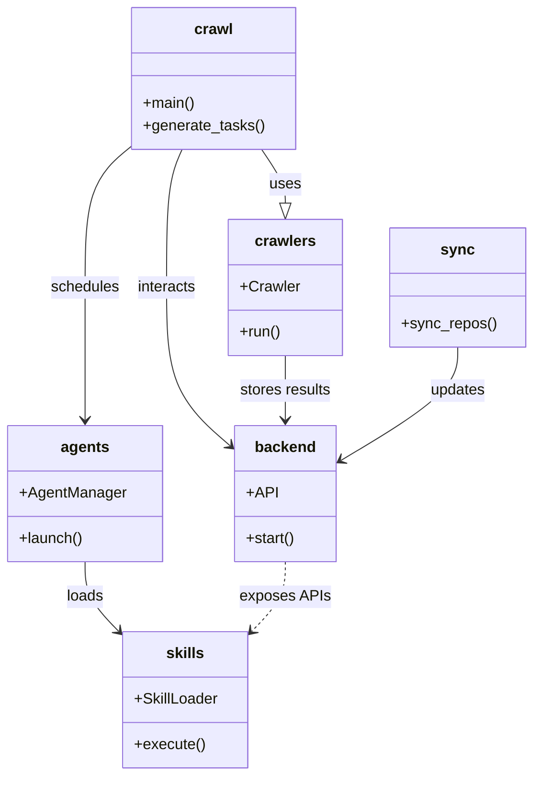

# Diagram: shipment_core/scheduled_services/config/config.dev2.yml

> Auto-generated by Obscura crawlers

## Mermaid

### SVG

<svg id="container" width="557.14453125" xmlns="http://www.w3.org/2000/svg" class="classDiagram" height="820" viewBox="0 0 557.14453125 820" role="graphics-document document" aria-roledescription="class"><g><defs><marker id="container_class-aggregationStart" class="marker aggregation class" refX="18" refY="7" markerWidth="190" markerHeight="240" orient="auto"><path d="M 18,7 L9,13 L1,7 L9,1 Z"></path></marker></defs><defs><marker id="container_class-aggregationEnd" class="marker aggregation class" refX="1" refY="7" markerWidth="20" markerHeight="28" orient="auto"><path d="M 18,7 L9,13 L1,7 L9,1 Z"></path></marker></defs><defs><marker id="container_class-extensionStart" class="marker extension class" refX="18" refY="7" markerWidth="190" markerHeight="240" orient="auto"><path d="M 1,7 L18,13 V 1 Z"></path></marker></defs><defs><marker id="container_class-extensionEnd" class="marker extension class" refX="1" refY="7" markerWidth="20" markerHeight="28" orient="auto"><path d="M 1,1 V 13 L18,7 Z"></path></marker></defs><defs><marker id="container_class-compositionStart" class="marker composition class" refX="18" refY="7" markerWidth="190" markerHeight="240" orient="auto"><path d="M 18,7 L9,13 L1,7 L9,1 Z"></path></marker></defs><defs><marker id="container_class-compositionEnd" class="marker composition class" refX="1" refY="7" markerWidth="20" markerHeight="28" orient="auto"><path d="M 18,7 L9,13 L1,7 L9,1 Z"></path></marker></defs><defs><marker id="container_class-dependencyStart" class="marker dependency class" refX="6" refY="7" markerWidth="190" markerHeight="240" orient="auto"><path d="M 5,7 L9,13 L1,7 L9,1 Z"></path></marker></defs><defs><marker id="container_class-dependencyEnd" class="marker dependency class" refX="13" refY="7" markerWidth="20" markerHeight="28" orient="auto"><path d="M 18,7 L9,13 L14,7 L9,1 Z"></path></marker></defs><defs><marker id="container_class-lollipopStart" class="marker lollipop class" refX="13" refY="7" markerWidth="190" markerHeight="240" orient="auto"><circle stroke="black" fill="transparent" cx="7" cy="7" r="6"></circle></marker></defs><defs><marker id="container_class-lollipopEnd" class="marker lollipop class" refX="1" refY="7" markerWidth="190" markerHeight="240" orient="auto"><circle stroke="black" fill="transparent" cx="7" cy="7" r="6"></circle></marker></defs><g class="root"><g class="clusters"></g><g class="edgePaths"><path d="M275.361,158L279.626,164.167C283.891,170.333,292.42,182.667,296.685,192.125C300.949,201.583,300.949,208.167,300.949,211.458L300.949,214.75" id="id_crawl_crawlers_1" class="edge-thickness-normal edge-pattern-solid relation" style=";;;" data-edge="true" data-et="edge" data-id="id_crawl_crawlers_1" data-points="W3sieCI6Mjc1LjM2MTM4MDQ0MDg0ODIsInkiOjE1OH0seyJ4IjozMDAuOTQ5MjE4NzUsInkiOjE5NX0seyJ4IjozMDAuOTQ5MjE4NzUsInkiOjIzMn1d" marker-end="url(#container_class-extensionEnd)"></path><path d="M191.614,158L188.993,164.167C186.372,170.333,181.129,182.667,178.508,207C175.887,231.333,175.887,267.667,175.887,304C175.887,340.333,175.887,376.667,187.042,404.556C198.197,432.445,220.507,451.889,231.662,461.611L242.817,471.334" id="id_crawl_backend_2" class="edge-thickness-normal edge-pattern-solid relation" style=";;;" data-edge="true" data-et="edge" data-id="id_crawl_backend_2" data-points="W3sieCI6MTkxLjYxNDE3MDYxOTQxOTY0LCJ5IjoxNTh9LHsieCI6MTc1Ljg4NjcxODc1LCJ5IjoxOTV9LHsieCI6MTc1Ljg4NjcxODc1LCJ5IjozMDR9LHsieCI6MTc1Ljg4NjcxODc1LCJ5Ijo0MTN9LHsieCI6MjQ3LjMzOTg0Mzc1LCJ5Ijo0NzUuMjc1OTg3MDA2NDk2NzN9XQ==" marker-end="url(#container_class-dependencyEnd)"></path><path d="M138.373,153.23L129.935,160.192C121.497,167.153,104.622,181.077,96.184,206.205C87.746,231.333,87.746,267.667,87.746,304C87.746,340.333,87.746,376.667,87.746,400C87.746,423.333,87.746,433.667,87.746,438.833L87.746,444" id="id_crawl_agents_3" class="edge-thickness-normal edge-pattern-solid relation" style=";;;" data-edge="true" data-et="edge" data-id="id_crawl_agents_3" data-points="W3sieCI6MTM4LjM3MzA0Njg3NSwieSI6MTUzLjIyOTgzMTgwNTgyMTMzfSx7IngiOjg3Ljc0NjA5Mzc1LCJ5IjoxOTV9LHsieCI6ODcuNzQ2MDkzNzUsInkiOjMwNH0seyJ4Ijo4Ny43NDYwOTM3NSwieSI6NDEzfSx7IngiOjg3Ljc0NjA5Mzc1LCJ5Ijo0NTB9XQ==" marker-end="url(#container_class-dependencyEnd)"></path><path d="M300.949,376L300.949,382.167C300.949,388.333,300.949,400.667,300.949,412C300.949,423.333,300.949,433.667,300.949,438.833L300.949,444" id="id_crawlers_backend_4" class="edge-thickness-normal edge-pattern-solid relation" style=";;;" data-edge="true" data-et="edge" data-id="id_crawlers_backend_4" data-points="W3sieCI6MzAwLjk0OTIxODc1LCJ5IjozNzZ9LHsieCI6MzAwLjk0OTIxODc1LCJ5Ijo0MTN9LHsieCI6MzAwLjk0OTIxODc1LCJ5Ijo0NTB9XQ==" marker-end="url(#container_class-dependencyEnd)"></path><path d="M479.234,367L479.234,374.667C479.234,382.333,479.234,397.667,459.308,417.516C439.382,437.365,399.53,461.73,379.604,473.912L359.678,486.095" id="id_sync_backend_5" class="edge-thickness-normal edge-pattern-solid relation" style=";;;" data-edge="true" data-et="edge" data-id="id_sync_backend_5" data-points="W3sieCI6NDc5LjIzNDM3NSwieSI6MzY3fSx7IngiOjQ3OS4yMzQzNzUsInkiOjQxM30seyJ4IjozNTQuNTU4NTkzNzUsInkiOjQ4OS4yMjQyOTM5NDYyMzI1NH1d" marker-end="url(#container_class-dependencyEnd)"></path><path d="M87.746,594L87.746,600.167C87.746,606.333,87.746,618.667,93.878,631.103C100.009,643.539,112.272,656.078,118.404,662.347L124.535,668.617" id="id_agents_skills_6" class="edge-thickness-normal edge-pattern-solid relation" style=";;;" data-edge="true" data-et="edge" data-id="id_agents_skills_6" data-points="W3sieCI6ODcuNzQ2MDkzNzUsInkiOjU5NH0seyJ4Ijo4Ny43NDYwOTM3NSwieSI6NjMxfSx7IngiOjEyOC43MzA0Njg3NSwieSI6NjcyLjkwNjQ4NTg5MjI2ODN9XQ==" marker-end="url(#container_class-dependencyEnd)"></path><path d="M300.949,594L300.949,600.167C300.949,606.333,300.949,618.667,294.818,631.103C288.686,643.539,276.423,656.078,270.292,662.347L264.16,668.617" id="id_backend_skills_7" class="edge-thickness-normal edge-pattern-dashed relation" style=";;;" data-edge="true" data-et="edge" data-id="id_backend_skills_7" data-points="W3sieCI6MzAwLjk0OTIxODc1LCJ5Ijo1OTR9LHsieCI6MzAwLjk0OTIxODc1LCJ5Ijo2MzF9LHsieCI6MjU5Ljk2NDg0Mzc1LCJ5Ijo2NzIuOTA2NDg1ODkyMjY4M31d" marker-end="url(#container_class-dependencyEnd)"></path></g><g class="edgeLabels"><g class="edgeLabel" transform="translate(300.94921875, 195)"><g class="label" data-id="id_crawl_crawlers_1" transform="translate(-16.4921875, -12)"><foreignObject width="32.984375" height="24">

uses

</foreignObject></g></g><g class="edgeLabel" transform="translate(175.88671875, 304)"><g class="label" data-id="id_crawl_backend_2" transform="translate(-31.6875, -12)"><foreignObject width="63.375" height="24">

interacts

</foreignObject></g></g><g class="edgeLabel" transform="translate(87.74609375, 304)"><g class="label" data-id="id_crawl_agents_3" transform="translate(-36.453125, -12)"><foreignObject width="72.90625" height="24">

schedules

</foreignObject></g></g><g class="edgeLabel" transform="translate(300.94921875, 413)"><g class="label" data-id="id_crawlers_backend_4" transform="translate(-48.8125, -12)"><foreignObject width="97.625" height="24">

stores results

</foreignObject></g></g><g class="edgeLabel" transform="translate(479.234375, 413)"><g class="label" data-id="id_sync_backend_5" transform="translate(-29.4140625, -12)"><foreignObject width="58.828125" height="24">

updates

</foreignObject></g></g><g class="edgeLabel" transform="translate(87.74609375, 631)"><g class="label" data-id="id_agents_skills_6" transform="translate(-19.7734375, -12)"><foreignObject width="39.546875" height="24">

loads

</foreignObject></g></g><g class="edgeLabel" transform="translate(300.94921875, 631)"><g class="label" data-id="id_backend_skills_7" transform="translate(-46.875, -12)"><foreignObject width="93.75" height="24">

exposes APIs

</foreignObject></g></g></g><g class="nodes"><g class="node default" id="classId-crawl-0" transform="translate(223.494140625, 83)"><g class="basic label-container"><path d="M-85.12109375 -75 L85.12109375 -75 L85.12109375 75 L-85.12109375 75" stroke="none" stroke-width="0" fill="#ECECFF" style=""></path><path d="M-85.12109375 -75 C-42.716859433337675 -75, -0.3126251166753491 -75, 85.12109375 -75 M-85.12109375 -75 C-21.840196752634093 -75, 41.440700244731815 -75, 85.12109375 -75 M85.12109375 -75 C85.12109375 -22.954458090368725, 85.12109375 29.09108381926255, 85.12109375 75 M85.12109375 -75 C85.12109375 -40.01770582559333, 85.12109375 -5.035411651186664, 85.12109375 75 M85.12109375 75 C38.357433151739095 75, -8.406227446521811 75, -85.12109375 75 M85.12109375 75 C33.68791412302512 75, -17.745265503949767 75, -85.12109375 75 M-85.12109375 75 C-85.12109375 43.19066506235721, -85.12109375 11.381330124714417, -85.12109375 -75 M-85.12109375 75 C-85.12109375 34.80138924903832, -85.12109375 -5.3972215019233545, -85.12109375 -75" stroke="#9370DB" stroke-width="1.3" fill="none" stroke-dasharray="0 0" style=""></path></g><g class="annotation-group text" transform="translate(0, -51)"></g><g class="label-group text" transform="translate(-19.4765625, -51)"><g class="label" style="font-weight: bolder" transform="translate(0,-12)"><foreignObject width="38.953125" height="24">

crawl

</foreignObject></g></g><g class="members-group text" transform="translate(-73.12109375, -3)"></g><g class="methods-group text" transform="translate(-73.12109375, 27)"><g class="label" style="" transform="translate(0,-12)"><foreignObject width="54.65625" height="24">

+main()

</foreignObject></g><g class="label" style="" transform="translate(0,12)"><foreignObject width="126.765625" height="24">

+generate_tasks()

</foreignObject></g></g><g class="divider" style=""><path d="M-85.12109375 -27 C-21.724517574594827 -27, 41.672058600810345 -27, 85.12109375 -27 M-85.12109375 -27 C-27.1179575690782 -27, 30.8851786118436 -27, 85.12109375 -27" stroke="#9370DB" stroke-width="1.3" fill="none" stroke-dasharray="0 0" style=""></path></g><g class="divider" style=""><path d="M-85.12109375 -3 C-37.070789631361045 -3, 10.97951448727791 -3, 85.12109375 -3 M-85.12109375 -3 C-19.095836036114264 -3, 46.92942167777147 -3, 85.12109375 -3" stroke="#9370DB" stroke-width="1.3" fill="none" stroke-dasharray="0 0" style=""></path></g></g><g class="node default" id="classId-crawlers-1" transform="translate(300.94921875, 304)"><g class="basic label-container"><path d="M-58.375 -72 L58.375 -72 L58.375 72 L-58.375 72" stroke="none" stroke-width="0" fill="#ECECFF" style=""></path><path d="M-58.375 -72 C-34.14311806083276 -72, -9.911236121665532 -72, 58.375 -72 M-58.375 -72 C-23.857542455495505 -72, 10.65991508900899 -72, 58.375 -72 M58.375 -72 C58.375 -28.59598044251298, 58.375 14.808039114974036, 58.375 72 M58.375 -72 C58.375 -17.431610452502312, 58.375 37.136779094995376, 58.375 72 M58.375 72 C12.423117039396885 72, -33.52876592120623 72, -58.375 72 M58.375 72 C26.799799742635013 72, -4.775400514729974 72, -58.375 72 M-58.375 72 C-58.375 20.43354647415078, -58.375 -31.13290705169844, -58.375 -72 M-58.375 72 C-58.375 37.57232980426075, -58.375 3.1446596085214935, -58.375 -72" stroke="#9370DB" stroke-width="1.3" fill="none" stroke-dasharray="0 0" style=""></path></g><g class="annotation-group text" transform="translate(0, -48)"></g><g class="label-group text" transform="translate(-30.828125, -48)"><g class="label" style="font-weight: bolder" transform="translate(0,-12)"><foreignObject width="61.65625" height="24">

crawlers

</foreignObject></g></g><g class="members-group text" transform="translate(-46.375, 0)"><g class="label" style="" transform="translate(0,-12)"><foreignObject width="61.921875" height="24">

+Crawler

</foreignObject></g></g><g class="methods-group text" transform="translate(-46.375, 48)"><g class="label" style="" transform="translate(0,-12)"><foreignObject width="43.21875" height="24">

+run()

</foreignObject></g></g><g class="divider" style=""><path d="M-58.375 -24 C-12.642889815852648 -24, 33.089220368294704 -24, 58.375 -24 M-58.375 -24 C-24.171575306460596 -24, 10.031849387078807 -24, 58.375 -24" stroke="#9370DB" stroke-width="1.3" fill="none" stroke-dasharray="0 0" style=""></path></g><g class="divider" style=""><path d="M-58.375 24 C-32.2216614410268 24, -6.0683228820536 24, 58.375 24 M-58.375 24 C-27.4264311186097 24, 3.522137762780602 24, 58.375 24" stroke="#9370DB" stroke-width="1.3" fill="none" stroke-dasharray="0 0" style=""></path></g></g><g class="node default" id="classId-sync-2" transform="translate(479.234375, 304)"><g class="basic label-container"><path d="M-69.91015625 -63 L69.91015625 -63 L69.91015625 63 L-69.91015625 63" stroke="none" stroke-width="0" fill="#ECECFF" style=""></path><path d="M-69.91015625 -63 C-37.76639447440637 -63, -5.622632698812737 -63, 69.91015625 -63 M-69.91015625 -63 C-15.227034881099925 -63, 39.45608648780015 -63, 69.91015625 -63 M69.91015625 -63 C69.91015625 -13.00000501970495, 69.91015625 36.9999899605901, 69.91015625 63 M69.91015625 -63 C69.91015625 -14.934729373264929, 69.91015625 33.13054125347014, 69.91015625 63 M69.91015625 63 C15.578462308151266 63, -38.75323163369747 63, -69.91015625 63 M69.91015625 63 C16.23465538943873 63, -37.44084547112254 63, -69.91015625 63 M-69.91015625 63 C-69.91015625 34.423758053447145, -69.91015625 5.847516106894297, -69.91015625 -63 M-69.91015625 63 C-69.91015625 31.08512080083221, -69.91015625 -0.8297583983355779, -69.91015625 -63" stroke="#9370DB" stroke-width="1.3" fill="none" stroke-dasharray="0 0" style=""></path></g><g class="annotation-group text" transform="translate(0, -39)"></g><g class="label-group text" transform="translate(-16.3046875, -39)"><g class="label" style="font-weight: bolder" transform="translate(0,-12)"><foreignObject width="32.609375" height="24">

sync

</foreignObject></g></g><g class="members-group text" transform="translate(-57.91015625, 9)"></g><g class="methods-group text" transform="translate(-57.91015625, 39)"><g class="label" style="" transform="translate(0,-12)"><foreignObject width="99.515625" height="24">

+sync_repos()

</foreignObject></g></g><g class="divider" style=""><path d="M-69.91015625 -15 C-35.93667129209373 -15, -1.963186334187455 -15, 69.91015625 -15 M-69.91015625 -15 C-32.829715084002444 -15, 4.250726081995111 -15, 69.91015625 -15" stroke="#9370DB" stroke-width="1.3" fill="none" stroke-dasharray="0 0" style=""></path></g><g class="divider" style=""><path d="M-69.91015625 9 C-14.713228009898017 9, 40.483700230203965 9, 69.91015625 9 M-69.91015625 9 C-41.36287769477682 9, -12.81559913955364 9, 69.91015625 9" stroke="#9370DB" stroke-width="1.3" fill="none" stroke-dasharray="0 0" style=""></path></g></g><g class="node default" id="classId-backend-3" transform="translate(300.94921875, 522)"><g class="basic label-container"><path d="M-53.609375 -72 L53.609375 -72 L53.609375 72 L-53.609375 72" stroke="none" stroke-width="0" fill="#ECECFF" style=""></path><path d="M-53.609375 -72 C-25.7968331230649 -72, 2.0157087538702 -72, 53.609375 -72 M-53.609375 -72 C-16.62780739079436 -72, 20.35376021841128 -72, 53.609375 -72 M53.609375 -72 C53.609375 -37.7179056701217, 53.609375 -3.4358113402434043, 53.609375 72 M53.609375 -72 C53.609375 -39.22031146666197, 53.609375 -6.440622933323937, 53.609375 72 M53.609375 72 C23.60481009725206 72, -6.399754805495881 72, -53.609375 72 M53.609375 72 C23.386597498391932 72, -6.8361800032161355 72, -53.609375 72 M-53.609375 72 C-53.609375 39.14855255809831, -53.609375 6.297105116196619, -53.609375 -72 M-53.609375 72 C-53.609375 15.593914218504288, -53.609375 -40.81217156299142, -53.609375 -72" stroke="#9370DB" stroke-width="1.3" fill="none" stroke-dasharray="0 0" style=""></path></g><g class="annotation-group text" transform="translate(0, -48)"></g><g class="label-group text" transform="translate(-31.0625, -48)"><g class="label" style="font-weight: bolder" transform="translate(0,-12)"><foreignObject width="62.125" height="24">

backend

</foreignObject></g></g><g class="members-group text" transform="translate(-41.609375, 0)"><g class="label" style="" transform="translate(0,-12)"><foreignObject width="31.015625" height="24">

+API

</foreignObject></g></g><g class="methods-group text" transform="translate(-41.609375, 48)"><g class="label" style="" transform="translate(0,-12)"><foreignObject width="52.15625" height="24">

+start()

</foreignObject></g></g><g class="divider" style=""><path d="M-53.609375 -24 C-24.421743328434914 -24, 4.765888343130172 -24, 53.609375 -24 M-53.609375 -24 C-22.854716438196636 -24, 7.899942123606728 -24, 53.609375 -24" stroke="#9370DB" stroke-width="1.3" fill="none" stroke-dasharray="0 0" style=""></path></g><g class="divider" style=""><path d="M-53.609375 24 C-29.786241803913036 24, -5.963108607826072 24, 53.609375 24 M-53.609375 24 C-28.299630212045766 24, -2.9898854240915327 24, 53.609375 24" stroke="#9370DB" stroke-width="1.3" fill="none" stroke-dasharray="0 0" style=""></path></g></g><g class="node default" id="classId-agents-4" transform="translate(87.74609375, 522)"><g class="basic label-container"><path d="M-79.74609375 -72 L79.74609375 -72 L79.74609375 72 L-79.74609375 72" stroke="none" stroke-width="0" fill="#ECECFF" style=""></path><path d="M-79.74609375 -72 C-38.97232776248826 -72, 1.8014382250234746 -72, 79.74609375 -72 M-79.74609375 -72 C-36.50765605090701 -72, 6.730781648185982 -72, 79.74609375 -72 M79.74609375 -72 C79.74609375 -30.28842831470029, 79.74609375 11.42314337059942, 79.74609375 72 M79.74609375 -72 C79.74609375 -29.05575349956689, 79.74609375 13.88849300086622, 79.74609375 72 M79.74609375 72 C35.926713775053535 72, -7.892666199892929 72, -79.74609375 72 M79.74609375 72 C21.476073005440448 72, -36.793947739119105 72, -79.74609375 72 M-79.74609375 72 C-79.74609375 24.82334006882172, -79.74609375 -22.353319862356557, -79.74609375 -72 M-79.74609375 72 C-79.74609375 37.326857934760014, -79.74609375 2.6537158695200276, -79.74609375 -72" stroke="#9370DB" stroke-width="1.3" fill="none" stroke-dasharray="0 0" style=""></path></g><g class="annotation-group text" transform="translate(0, -48)"></g><g class="label-group text" transform="translate(-24.5234375, -48)"><g class="label" style="font-weight: bolder" transform="translate(0,-12)"><foreignObject width="49.046875" height="24">

agents

</foreignObject></g></g><g class="members-group text" transform="translate(-67.74609375, 0)"><g class="label" style="" transform="translate(0,-12)"><foreignObject width="110.96875" height="24">

+AgentManager

</foreignObject></g></g><g class="methods-group text" transform="translate(-67.74609375, 48)"><g class="label" style="" transform="translate(0,-12)"><foreignObject width="67.390625" height="24">

+launch()

</foreignObject></g></g><g class="divider" style=""><path d="M-79.74609375 -24 C-37.6928786570127 -24, 4.360336435974602 -24, 79.74609375 -24 M-79.74609375 -24 C-42.0207071444912 -24, -4.295320538982395 -24, 79.74609375 -24" stroke="#9370DB" stroke-width="1.3" fill="none" stroke-dasharray="0 0" style=""></path></g><g class="divider" style=""><path d="M-79.74609375 24 C-39.5484274379333 24, 0.6492388741334025 24, 79.74609375 24 M-79.74609375 24 C-23.469415420900845 24, 32.80726290819831 24, 79.74609375 24" stroke="#9370DB" stroke-width="1.3" fill="none" stroke-dasharray="0 0" style=""></path></g></g><g class="node default" id="classId-skills-5" transform="translate(194.34765625, 740)"><g class="basic label-container"><path d="M-65.6171875 -72 L65.6171875 -72 L65.6171875 72 L-65.6171875 72" stroke="none" stroke-width="0" fill="#ECECFF" style=""></path><path d="M-65.6171875 -72 C-33.72366586023226 -72, -1.8301442204645255 -72, 65.6171875 -72 M-65.6171875 -72 C-21.40555686669464 -72, 22.806073766610723 -72, 65.6171875 -72 M65.6171875 -72 C65.6171875 -19.428702178848624, 65.6171875 33.14259564230275, 65.6171875 72 M65.6171875 -72 C65.6171875 -19.35673194096325, 65.6171875 33.2865361180735, 65.6171875 72 M65.6171875 72 C32.786648735018574 72, -0.04389002996285285 72, -65.6171875 72 M65.6171875 72 C23.667199273980003 72, -18.282788952039994 72, -65.6171875 72 M-65.6171875 72 C-65.6171875 31.835871438754417, -65.6171875 -8.328257122491166, -65.6171875 -72 M-65.6171875 72 C-65.6171875 30.92542843450545, -65.6171875 -10.149143130989103, -65.6171875 -72" stroke="#9370DB" stroke-width="1.3" fill="none" stroke-dasharray="0 0" style=""></path></g><g class="annotation-group text" transform="translate(0, -48)"></g><g class="label-group text" transform="translate(-19.15625, -48)"><g class="label" style="font-weight: bolder" transform="translate(0,-12)"><foreignObject width="38.3125" height="24">

skills

</foreignObject></g></g><g class="members-group text" transform="translate(-53.6171875, 0)"><g class="label" style="" transform="translate(0,-12)"><foreignObject width="88.078125" height="24">

+SkillLoader

</foreignObject></g></g><g class="methods-group text" transform="translate(-53.6171875, 48)"><g class="label" style="" transform="translate(0,-12)"><foreignObject width="74.328125" height="24">

+execute()

</foreignObject></g></g><g class="divider" style=""><path d="M-65.6171875 -24 C-15.36211850027776 -24, 34.89295049944448 -24, 65.6171875 -24 M-65.6171875 -24 C-18.97311090729186 -24, 27.670965685416277 -24, 65.6171875 -24" stroke="#9370DB" stroke-width="1.3" fill="none" stroke-dasharray="0 0" style=""></path></g><g class="divider" style=""><path d="M-65.6171875 24 C-18.933416439430047 24, 27.750354621139905 24, 65.6171875 24 M-65.6171875 24 C-34.147558616352 24, -2.6779297327040084 24, 65.6171875 24" stroke="#9370DB" stroke-width="1.3" fill="none" stroke-dasharray="0 0" style=""></path></g></g></g></g></g></svg>
