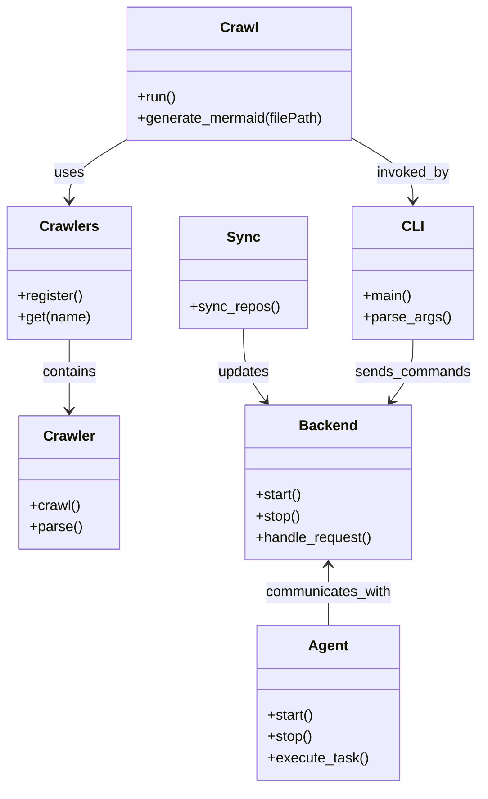

# Diagram: shipment_core/scheduled_services/config/config.prod-b.yml


> Auto-generated by Obscura crawlers

## Diagram 1



### SVG

<svg id="container" width="530.12890625" xmlns="http://www.w3.org/2000/svg" class="classDiagram" height="886" viewBox="0 0 530.12890625 886" role="graphics-document document" aria-roledescription="class"><style>#container{font-family:"trebuchet ms",verdana,arial,sans-serif;font-size:16px;fill:#333;}@keyframes edge-animation-frame{from{stroke-dashoffset:0;}}@keyframes dash{to{stroke-dashoffset:0;}}#container .edge-animation-slow{stroke-dasharray:9,5!important;stroke-dashoffset:900;animation:dash 50s linear infinite;stroke-linecap:round;}#container .edge-animation-fast{stroke-dasharray:9,5!important;stroke-dashoffset:900;animation:dash 20s linear infinite;stroke-linecap:round;}#container .error-icon{fill:#552222;}#container .error-text{fill:#552222;stroke:#552222;}#container .edge-thickness-normal{stroke-width:1px;}#container .edge-thickness-thick{stroke-width:3.5px;}#container .edge-pattern-solid{stroke-dasharray:0;}#container .edge-thickness-invisible{stroke-width:0;fill:none;}#container .edge-pattern-dashed{stroke-dasharray:3;}#container .edge-pattern-dotted{stroke-dasharray:2;}#container .marker{fill:#333333;stroke:#333333;}#container .marker.cross{stroke:#333333;}#container svg{font-family:"trebuchet ms",verdana,arial,sans-serif;font-size:16px;}#container p{margin:0;}#container g.classGroup text{fill:#9370DB;stroke:none;font-family:"trebuchet ms",verdana,arial,sans-serif;font-size:10px;}#container g.classGroup text .title{font-weight:bolder;}#container .nodeLabel,#container .edgeLabel{color:#131300;}#container .edgeLabel .label rect{fill:#ECECFF;}#container .label text{fill:#131300;}#container .labelBkg{background:#ECECFF;}#container .edgeLabel .label span{background:#ECECFF;}#container .classTitle{font-weight:bolder;}#container .node rect,#container .node circle,#container .node ellipse,#container .node polygon,#container .node path{fill:#ECECFF;stroke:#9370DB;stroke-width:1px;}#container .divider{stroke:#9370DB;stroke-width:1;}#container g.clickable{cursor:pointer;}#container g.classGroup rect{fill:#ECECFF;stroke:#9370DB;}#container g.classGroup line{stroke:#9370DB;stroke-width:1;}#container .classLabel .box{stroke:none;stroke-width:0;fill:#ECECFF;opacity:0.5;}#container .classLabel .label{fill:#9370DB;font-size:10px;}#container .relation{stroke:#333333;stroke-width:1;fill:none;}#container .dashed-line{stroke-dasharray:3;}#container .dotted-line{stroke-dasharray:1 2;}#container #compositionStart,#container .composition{fill:#333333!important;stroke:#333333!important;stroke-width:1;}#container #compositionEnd,#container .composition{fill:#333333!important;stroke:#333333!important;stroke-width:1;}#container #dependencyStart,#container .dependency{fill:#333333!important;stroke:#333333!important;stroke-width:1;}#container #dependencyStart,#container .dependency{fill:#333333!important;stroke:#333333!important;stroke-width:1;}#container #extensionStart,#container .extension{fill:transparent!important;stroke:#333333!important;stroke-width:1;}#container #extensionEnd,#container .extension{fill:transparent!important;stroke:#333333!important;stroke-width:1;}#container #aggregationStart,#container .aggregation{fill:transparent!important;stroke:#333333!important;stroke-width:1;}#container #aggregationEnd,#container .aggregation{fill:transparent!important;stroke:#333333!important;stroke-width:1;}#container #lollipopStart,#container .lollipop{fill:#ECECFF!important;stroke:#333333!important;stroke-width:1;}#container #lollipopEnd,#container .lollipop{fill:#ECECFF!important;stroke:#333333!important;stroke-width:1;}#container .edgeTerminals{font-size:11px;line-height:initial;}#container .classTitleText{text-anchor:middle;font-size:18px;fill:#333;}#container .label-icon{display:inline-block;height:1em;overflow:visible;vertical-align:-0.125em;}#container .node .label-icon path{fill:currentColor;stroke:revert;stroke-width:revert;}#container :root{--mermaid-font-family:"trebuchet ms",verdana,arial,sans-serif;}</style><g><defs><marker id="container_class-aggregationStart" class="marker aggregation class" refX="18" refY="7" markerWidth="190" markerHeight="240" orient="auto"><path d="M 18,7 L9,13 L1,7 L9,1 Z"></path></marker></defs><defs><marker id="container_class-aggregationEnd" class="marker aggregation class" refX="1" refY="7" markerWidth="20" markerHeight="28" orient="auto"><path d="M 18,7 L9,13 L1,7 L9,1 Z"></path></marker></defs><defs><marker id="container_class-extensionStart" class="marker extension class" refX="18" refY="7" markerWidth="190" markerHeight="240" orient="auto"><path d="M 1,7 L18,13 V 1 Z"></path></marker></defs><defs><marker id="container_class-extensionEnd" class="marker extension class" refX="1" refY="7" markerWidth="20" markerHeight="28" orient="auto"><path d="M 1,1 V 13 L18,7 Z"></path></marker></defs><defs><marker id="container_class-compositionStart" class="marker composition class" refX="18" refY="7" markerWidth="190" markerHeight="240" orient="auto"><path d="M 18,7 L9,13 L1,7 L9,1 Z"></path></marker></defs><defs><marker id="container_class-compositionEnd" class="marker composition class" refX="1" refY="7" markerWidth="20" markerHeight="28" orient="auto"><path d="M 18,7 L9,13 L1,7 L9,1 Z"></path></marker></defs><defs><marker id="container_class-dependencyStart" class="marker dependency class" refX="6" refY="7" markerWidth="190" markerHeight="240" orient="auto"><path d="M 5,7 L9,13 L1,7 L9,1 Z"></path></marker></defs><defs><marker id="container_class-dependencyEnd" class="marker dependency class" refX="13" refY="7" markerWidth="20" markerHeight="28" orient="auto"><path d="M 18,7 L9,13 L14,7 L9,1 Z"></path></marker></defs><defs><marker id="container_class-lollipopStart" class="marker lollipop class" refX="13" refY="7" markerWidth="190" markerHeight="240" orient="auto"><circle stroke="black" fill="transparent" cx="7" cy="7" r="6"></circle></marker></defs><defs><marker id="container_class-lollipopEnd" class="marker lollipop class" refX="1" refY="7" markerWidth="190" markerHeight="240" orient="auto"><circle stroke="black" fill="transparent" cx="7" cy="7" r="6"></circle></marker></defs><g class="root"><g class="clusters"></g><g class="edgePaths"><path d="M138.389,158L128.069,164.167C117.749,170.333,97.109,182.667,86.789,194C76.469,205.333,76.469,215.667,76.469,220.833L76.469,226" id="id_Crawl_Crawlers_1" class="edge-thickness-normal edge-pattern-solid relation" style=";;;" data-edge="true" data-et="edge" data-id="id_Crawl_Crawlers_1" data-points="W3sieCI6MTM4LjM4OTQyMTczNTQ5MTA2LCJ5IjoxNTh9LHsieCI6NzYuNDY4NzUsInkiOjE5NX0seyJ4Ijo3Ni40Njg3NSwieSI6MjMyfV0=" marker-end="url(#container_class-dependencyEnd)"></path><path d="M390.838,156.879L401.754,163.232C412.671,169.586,434.503,182.293,445.42,193.813C456.336,205.333,456.336,215.667,456.336,220.833L456.336,226" id="id_Crawl_CLI_2" class="edge-thickness-normal edge-pattern-solid relation" style=";;;" data-edge="true" data-et="edge" data-id="id_Crawl_CLI_2" data-points="W3sieCI6MzkwLjgzNzg5MDYyNSwieSI6MTU2Ljg3ODUwNzk5Mjg5NTJ9LHsieCI6NDU2LjMzNTkzNzUsInkiOjE5NX0seyJ4Ijo0NTYuMzM1OTM3NSwieSI6MjMyfV0=" marker-end="url(#container_class-dependencyEnd)"></path><path d="M76.469,382L76.469,388.167C76.469,394.333,76.469,406.667,76.469,420C76.469,433.333,76.469,447.667,76.469,454.833L76.469,462" id="id_Crawlers_Crawler_3" class="edge-thickness-normal edge-pattern-solid relation" style=";;;" data-edge="true" data-et="edge" data-id="id_Crawlers_Crawler_3" data-points="W3sieCI6NzYuNDY4NzUsInkiOjM4Mn0seyJ4Ijo3Ni40Njg3NSwieSI6NDE5fSx7IngiOjc2LjQ2ODc1LCJ5Ijo0Njh9XQ==" marker-end="url(#container_class-dependencyEnd)"></path><path d="M363.287,636L363.287,641.167C363.287,646.333,363.287,656.667,363.287,668C363.287,679.333,363.287,691.667,363.287,697.833L363.287,704" id="id_Backend_Agent_4" class="edge-thickness-normal edge-pattern-solid relation" style=";;;" data-edge="true" data-et="edge" data-id="id_Backend_Agent_4" data-points="W3sieCI6MzYzLjI4NzEwOTM3NSwieSI6NjMwfSx7IngiOjM2My4yODcxMDkzNzUsInkiOjY2N30seyJ4IjozNjMuMjg3MTA5Mzc1LCJ5Ijo3MDR9XQ==" marker-start="url(#container_class-dependencyStart)"></path><path d="M270.238,370L270.238,378.167C270.238,386.333,270.238,402.667,274.266,416.2C278.293,429.734,286.347,440.467,290.374,445.834L294.402,451.201" id="id_Sync_Backend_5" class="edge-thickness-normal edge-pattern-solid relation" style=";;;" data-edge="true" data-et="edge" data-id="id_Sync_Backend_5" data-points="W3sieCI6MjcwLjIzODI4MTI1LCJ5IjozNzB9LHsieCI6MjcwLjIzODI4MTI1LCJ5Ijo0MTl9LHsieCI6Mjk4LjAwMjg1MDkzMjQ1OTcsInkiOjQ1Nn1d" marker-end="url(#container_class-dependencyEnd)"></path><path d="M456.336,382L456.336,388.167C456.336,394.333,456.336,406.667,452.309,418.2C448.281,429.734,440.227,440.467,436.2,445.834L432.173,451.201" id="id_CLI_Backend_6" class="edge-thickness-normal edge-pattern-solid relation" style=";;;" data-edge="true" data-et="edge" data-id="id_CLI_Backend_6" data-points="W3sieCI6NDU2LjMzNTkzNzUsInkiOjM4Mn0seyJ4Ijo0NTYuMzM1OTM3NSwieSI6NDE5fSx7IngiOjQyOC41NzEzNjc4MTc1NDAzLCJ5Ijo0NTZ9XQ==" marker-end="url(#container_class-dependencyEnd)"></path></g><g class="edgeLabels"><g class="edgeLabel" transform="translate(76.46875, 195)"><g class="label" data-id="id_Crawl_Crawlers_1" transform="translate(-16.4921875, -12)"><foreignObject width="32.984375" height="24"><div xmlns="http://www.w3.org/1999/xhtml" class="labelBkg" style="display: table-cell; white-space: nowrap; line-height: 1.5; max-width: 200px; text-align: center;"><span class="edgeLabel"><p>uses</p></span></div></foreignObject></g></g><g class="edgeLabel" transform="translate(456.3359375, 195)"><g class="label" data-id="id_Crawl_CLI_2" transform="translate(-41.453125, -12)"><foreignObject width="82.90625" height="24"><div xmlns="http://www.w3.org/1999/xhtml" class="labelBkg" style="display: table-cell; white-space: nowrap; line-height: 1.5; max-width: 200px; text-align: center;"><span class="edgeLabel"><p>invoked_by</p></span></div></foreignObject></g></g><g class="edgeLabel" transform="translate(76.46875, 419)"><g class="label" data-id="id_Crawlers_Crawler_3" transform="translate(-30.890625, -12)"><foreignObject width="61.78125" height="24"><div xmlns="http://www.w3.org/1999/xhtml" class="labelBkg" style="display: table-cell; white-space: nowrap; line-height: 1.5; max-width: 200px; text-align: center;"><span class="edgeLabel"><p>contains</p></span></div></foreignObject></g></g><g class="edgeLabel" transform="translate(363.287109375, 667)"><g class="label" data-id="id_Backend_Agent_4" transform="translate(-72.0234375, -12)"><foreignObject width="144.046875" height="24"><div xmlns="http://www.w3.org/1999/xhtml" class="labelBkg" style="display: table-cell; white-space: nowrap; line-height: 1.5; max-width: 200px; text-align: center;"><span class="edgeLabel"><p>communicates_with</p></span></div></foreignObject></g></g><g class="edgeLabel" transform="translate(270.23828125, 419)"><g class="label" data-id="id_Sync_Backend_5" transform="translate(-29.4140625, -12)"><foreignObject width="58.828125" height="24"><div xmlns="http://www.w3.org/1999/xhtml" class="labelBkg" style="display: table-cell; white-space: nowrap; line-height: 1.5; max-width: 200px; text-align: center;"><span class="edgeLabel"><p>updates</p></span></div></foreignObject></g></g><g class="edgeLabel" transform="translate(456.3359375, 419)"><g class="label" data-id="id_CLI_Backend_6" transform="translate(-64.7578125, -12)"><foreignObject width="129.515625" height="24"><div xmlns="http://www.w3.org/1999/xhtml" class="labelBkg" style="display: table-cell; white-space: nowrap; line-height: 1.5; max-width: 200px; text-align: center;"><span class="edgeLabel"><p>sends_commands</p></span></div></foreignObject></g></g></g><g class="nodes"><g class="node default" id="classId-Crawl-0" transform="translate(263.904296875, 83)"><g class="basic label-container"><path d="M-126.93359375 -75 L126.93359375 -75 L126.93359375 75 L-126.93359375 75" stroke="none" stroke-width="0" fill="#ECECFF" style=""></path><path d="M-126.93359375 -75 C-47.0035579600539 -75, 32.92647782989221 -75, 126.93359375 -75 M-126.93359375 -75 C-62.176792807828434 -75, 2.5800081343431316 -75, 126.93359375 -75 M126.93359375 -75 C126.93359375 -44.855920132714374, 126.93359375 -14.711840265428755, 126.93359375 75 M126.93359375 -75 C126.93359375 -37.76338155297002, 126.93359375 -0.5267631059400344, 126.93359375 75 M126.93359375 75 C74.63932112608381 75, 22.34504850216763 75, -126.93359375 75 M126.93359375 75 C36.66412687118152 75, -53.605340007636954 75, -126.93359375 75 M-126.93359375 75 C-126.93359375 38.19385636736406, -126.93359375 1.387712734728126, -126.93359375 -75 M-126.93359375 75 C-126.93359375 37.38253196548905, -126.93359375 -0.23493606902189867, -126.93359375 -75" stroke="#9370DB" stroke-width="1.3" fill="none" stroke-dasharray="0 0" style=""></path></g><g class="annotation-group text" transform="translate(0, -51)"></g><g class="label-group text" transform="translate(-20.1484375, -51)"><g class="label" style="font-weight: bolder" transform="translate(0,-12)"><foreignObject width="40.296875" height="24"><div xmlns="http://www.w3.org/1999/xhtml" style="display: table-cell; white-space: nowrap; line-height: 1.5; max-width: 89px; text-align: center;"><span class="nodeLabel markdown-node-label" style=""><p>Crawl</p></span></div></foreignObject></g></g><g class="members-group text" transform="translate(-114.93359375, -3)"></g><g class="methods-group text" transform="translate(-114.93359375, 27)"><g class="label" style="" transform="translate(0,-12)"><foreignObject width="43.21875" height="24"><div xmlns="http://www.w3.org/1999/xhtml" style="display: table-cell; white-space: nowrap; line-height: 1.5; max-width: 101px; text-align: center;"><span class="nodeLabel markdown-node-label" style=""><p>+run()</p></span></div></foreignObject></g><g class="label" style="" transform="translate(0,12)"><foreignObject width="209.71875" height="24"><div xmlns="http://www.w3.org/1999/xhtml" style="display: table-cell; white-space: nowrap; line-height: 1.5; max-width: 267px; text-align: center;"><span class="nodeLabel markdown-node-label" style=""><p>+generate_mermaid(filePath)</p></span></div></foreignObject></g></g><g class="divider" style=""><path d="M-126.93359375 -27 C-26.984014066415895 -27, 72.96556561716821 -27, 126.93359375 -27 M-126.93359375 -27 C-40.947796707092124 -27, 45.03800033581575 -27, 126.93359375 -27" stroke="#9370DB" stroke-width="1.3" fill="none" stroke-dasharray="0 0" style=""></path></g><g class="divider" style=""><path d="M-126.93359375 -3 C-40.29578487436554 -3, 46.342024001268925 -3, 126.93359375 -3 M-126.93359375 -3 C-71.4802679101962 -3, -16.02694207039241 -3, 126.93359375 -3" stroke="#9370DB" stroke-width="1.3" fill="none" stroke-dasharray="0 0" style=""></path></g></g><g class="node default" id="classId-Crawler-1" transform="translate(76.46875, 543)"><g class="basic label-container"><path d="M-55.1328125 -75 L55.1328125 -75 L55.1328125 75 L-55.1328125 75" stroke="none" stroke-width="0" fill="#ECECFF" style=""></path><path d="M-55.1328125 -75 C-16.117560254394803 -75, 22.897691991210394 -75, 55.1328125 -75 M-55.1328125 -75 C-30.223047092502252 -75, -5.313281685004505 -75, 55.1328125 -75 M55.1328125 -75 C55.1328125 -33.03320753232103, 55.1328125 8.933584935357942, 55.1328125 75 M55.1328125 -75 C55.1328125 -15.662867482204938, 55.1328125 43.674265035590125, 55.1328125 75 M55.1328125 75 C25.7734439315121 75, -3.585924636975797 75, -55.1328125 75 M55.1328125 75 C22.72432145558443 75, -9.68416958883114 75, -55.1328125 75 M-55.1328125 75 C-55.1328125 29.93447311836777, -55.1328125 -15.131053763264461, -55.1328125 -75 M-55.1328125 75 C-55.1328125 20.94601702339694, -55.1328125 -33.10796595320612, -55.1328125 -75" stroke="#9370DB" stroke-width="1.3" fill="none" stroke-dasharray="0 0" style=""></path></g><g class="annotation-group text" transform="translate(0, -51)"></g><g class="label-group text" transform="translate(-27.734375, -51)"><g class="label" style="font-weight: bolder" transform="translate(0,-12)"><foreignObject width="55.46875" height="24"><div xmlns="http://www.w3.org/1999/xhtml" style="display: table-cell; white-space: nowrap; line-height: 1.5; max-width: 105px; text-align: center;"><span class="nodeLabel markdown-node-label" style=""><p>Crawler</p></span></div></foreignObject></g></g><g class="members-group text" transform="translate(-43.1328125, -3)"></g><g class="methods-group text" transform="translate(-43.1328125, 27)"><g class="label" style="" transform="translate(0,-12)"><foreignObject width="56.40625" height="24"><div xmlns="http://www.w3.org/1999/xhtml" style="display: table-cell; white-space: nowrap; line-height: 1.5; max-width: 114px; text-align: center;"><span class="nodeLabel markdown-node-label" style=""><p>+crawl()</p></span></div></foreignObject></g><g class="label" style="" transform="translate(0,12)"><foreignObject width="58.53125" height="24"><div xmlns="http://www.w3.org/1999/xhtml" style="display: table-cell; white-space: nowrap; line-height: 1.5; max-width: 116px; text-align: center;"><span class="nodeLabel markdown-node-label" style=""><p>+parse()</p></span></div></foreignObject></g></g><g class="divider" style=""><path d="M-55.1328125 -27 C-14.069455648414802 -27, 26.993901203170395 -27, 55.1328125 -27 M-55.1328125 -27 C-30.663277370028073 -27, -6.193742240056146 -27, 55.1328125 -27" stroke="#9370DB" stroke-width="1.3" fill="none" stroke-dasharray="0 0" style=""></path></g><g class="divider" style=""><path d="M-55.1328125 -3 C-32.72440006961008 -3, -10.315987639220154 -3, 55.1328125 -3 M-55.1328125 -3 C-26.47939428084702 -3, 2.1740239383059574 -3, 55.1328125 -3" stroke="#9370DB" stroke-width="1.3" fill="none" stroke-dasharray="0 0" style=""></path></g></g><g class="node default" id="classId-Crawlers-2" transform="translate(76.46875, 307)"><g class="basic label-container"><path d="M-68.46875 -75 L68.46875 -75 L68.46875 75 L-68.46875 75" stroke="none" stroke-width="0" fill="#ECECFF" style=""></path><path d="M-68.46875 -75 C-18.65361347475975 -75, 31.161523050480497 -75, 68.46875 -75 M-68.46875 -75 C-20.31581447076465 -75, 27.8371210584707 -75, 68.46875 -75 M68.46875 -75 C68.46875 -32.483227254422204, 68.46875 10.033545491155593, 68.46875 75 M68.46875 -75 C68.46875 -22.56869190342246, 68.46875 29.862616193155077, 68.46875 75 M68.46875 75 C15.798989709723315 75, -36.87077058055337 75, -68.46875 75 M68.46875 75 C25.46760203852086 75, -17.533545922958282 75, -68.46875 75 M-68.46875 75 C-68.46875 23.856902671204757, -68.46875 -27.286194657590485, -68.46875 -75 M-68.46875 75 C-68.46875 41.65067003356981, -68.46875 8.30134006713962, -68.46875 -75" stroke="#9370DB" stroke-width="1.3" fill="none" stroke-dasharray="0 0" style=""></path></g><g class="annotation-group text" transform="translate(0, -51)"></g><g class="label-group text" transform="translate(-31.5, -51)"><g class="label" style="font-weight: bolder" transform="translate(0,-12)"><foreignObject width="63" height="24"><div xmlns="http://www.w3.org/1999/xhtml" style="display: table-cell; white-space: nowrap; line-height: 1.5; max-width: 111px; text-align: center;"><span class="nodeLabel markdown-node-label" style=""><p>Crawlers</p></span></div></foreignObject></g></g><g class="members-group text" transform="translate(-56.46875, -3)"></g><g class="methods-group text" transform="translate(-56.46875, 27)"><g class="label" style="" transform="translate(0,-12)"><foreignObject width="73.515625" height="24"><div xmlns="http://www.w3.org/1999/xhtml" style="display: table-cell; white-space: nowrap; line-height: 1.5; max-width: 131px; text-align: center;"><span class="nodeLabel markdown-node-label" style=""><p>+register()</p></span></div></foreignObject></g><g class="label" style="" transform="translate(0,12)"><foreignObject width="81.4375" height="24"><div xmlns="http://www.w3.org/1999/xhtml" style="display: table-cell; white-space: nowrap; line-height: 1.5; max-width: 139px; text-align: center;"><span class="nodeLabel markdown-node-label" style=""><p>+get(name)</p></span></div></foreignObject></g></g><g class="divider" style=""><path d="M-68.46875 -27 C-17.26314295715808 -27, 33.94246408568384 -27, 68.46875 -27 M-68.46875 -27 C-31.037140113116408 -27, 6.3944697737671845 -27, 68.46875 -27" stroke="#9370DB" stroke-width="1.3" fill="none" stroke-dasharray="0 0" style=""></path></g><g class="divider" style=""><path d="M-68.46875 -3 C-31.700428446145118 -3, 5.067893107709764 -3, 68.46875 -3 M-68.46875 -3 C-33.565745290338064 -3, 1.3372594193238712 -3, 68.46875 -3" stroke="#9370DB" stroke-width="1.3" fill="none" stroke-dasharray="0 0" style=""></path></g></g><g class="node default" id="classId-Backend-3" transform="translate(363.287109375, 543)"><g class="basic label-container"><path d="M-93.6328125 -87 L93.6328125 -87 L93.6328125 87 L-93.6328125 87" stroke="none" stroke-width="0" fill="#ECECFF" style=""></path><path d="M-93.6328125 -87 C-23.709143599652165 -87, 46.21452530069567 -87, 93.6328125 -87 M-93.6328125 -87 C-49.34676207324925 -87, -5.060711646498504 -87, 93.6328125 -87 M93.6328125 -87 C93.6328125 -31.465272919624113, 93.6328125 24.069454160751775, 93.6328125 87 M93.6328125 -87 C93.6328125 -25.433684119871153, 93.6328125 36.132631760257695, 93.6328125 87 M93.6328125 87 C47.150136588211694 87, 0.6674606764233886 87, -93.6328125 87 M93.6328125 87 C36.03862140036907 87, -21.555569699261866 87, -93.6328125 87 M-93.6328125 87 C-93.6328125 51.83842123819496, -93.6328125 16.676842476389922, -93.6328125 -87 M-93.6328125 87 C-93.6328125 30.906941009148923, -93.6328125 -25.186117981702154, -93.6328125 -87" stroke="#9370DB" stroke-width="1.3" fill="none" stroke-dasharray="0 0" style=""></path></g><g class="annotation-group text" transform="translate(0, -63)"></g><g class="label-group text" transform="translate(-31.296875, -63)"><g class="label" style="font-weight: bolder" transform="translate(0,-12)"><foreignObject width="62.59375" height="24"><div xmlns="http://www.w3.org/1999/xhtml" style="display: table-cell; white-space: nowrap; line-height: 1.5; max-width: 112px; text-align: center;"><span class="nodeLabel markdown-node-label" style=""><p>Backend</p></span></div></foreignObject></g></g><g class="members-group text" transform="translate(-81.6328125, -15)"></g><g class="methods-group text" transform="translate(-81.6328125, 15)"><g class="label" style="" transform="translate(0,-12)"><foreignObject width="52.15625" height="24"><div xmlns="http://www.w3.org/1999/xhtml" style="display: table-cell; white-space: nowrap; line-height: 1.5; max-width: 110px; text-align: center;"><span class="nodeLabel markdown-node-label" style=""><p>+start()</p></span></div></foreignObject></g><g class="label" style="" transform="translate(0,12)"><foreignObject width="50.21875" height="24"><div xmlns="http://www.w3.org/1999/xhtml" style="display: table-cell; white-space: nowrap; line-height: 1.5; max-width: 108px; text-align: center;"><span class="nodeLabel markdown-node-label" style=""><p>+stop()</p></span></div></foreignObject></g><g class="label" style="" transform="translate(0,36)"><foreignObject width="131.96875" height="24"><div xmlns="http://www.w3.org/1999/xhtml" style="display: table-cell; white-space: nowrap; line-height: 1.5; max-width: 189px; text-align: center;"><span class="nodeLabel markdown-node-label" style=""><p>+handle_request()</p></span></div></foreignObject></g></g><g class="divider" style=""><path d="M-93.6328125 -39 C-20.252127912597132 -39, 53.128556674805736 -39, 93.6328125 -39 M-93.6328125 -39 C-43.80488569767911 -39, 6.023041104641777 -39, 93.6328125 -39" stroke="#9370DB" stroke-width="1.3" fill="none" stroke-dasharray="0 0" style=""></path></g><g class="divider" style=""><path d="M-93.6328125 -15 C-50.62932214383599 -15, -7.625831787671984 -15, 93.6328125 -15 M-93.6328125 -15 C-45.16989844814921 -15, 3.2930156037015763 -15, 93.6328125 -15" stroke="#9370DB" stroke-width="1.3" fill="none" stroke-dasharray="0 0" style=""></path></g></g><g class="node default" id="classId-Agent-4" transform="translate(363.287109375, 791)"><g class="basic label-container"><path d="M-78.4765625 -87 L78.4765625 -87 L78.4765625 87 L-78.4765625 87" stroke="none" stroke-width="0" fill="#ECECFF" style=""></path><path d="M-78.4765625 -87 C-35.89869928495767 -87, 6.6791639300846555 -87, 78.4765625 -87 M-78.4765625 -87 C-21.737254692450662 -87, 35.002053115098676 -87, 78.4765625 -87 M78.4765625 -87 C78.4765625 -47.09119622349503, 78.4765625 -7.182392446990065, 78.4765625 87 M78.4765625 -87 C78.4765625 -50.90289917526247, 78.4765625 -14.805798350524938, 78.4765625 87 M78.4765625 87 C23.312931904510833 87, -31.850698690978334 87, -78.4765625 87 M78.4765625 87 C33.07301810886633 87, -12.330526282267343 87, -78.4765625 87 M-78.4765625 87 C-78.4765625 35.73586350145519, -78.4765625 -15.528272997089616, -78.4765625 -87 M-78.4765625 87 C-78.4765625 25.55501394309988, -78.4765625 -35.88997211380024, -78.4765625 -87" stroke="#9370DB" stroke-width="1.3" fill="none" stroke-dasharray="0 0" style=""></path></g><g class="annotation-group text" transform="translate(0, -63)"></g><g class="label-group text" transform="translate(-21.078125, -63)"><g class="label" style="font-weight: bolder" transform="translate(0,-12)"><foreignObject width="42.15625" height="24"><div xmlns="http://www.w3.org/1999/xhtml" style="display: table-cell; white-space: nowrap; line-height: 1.5; max-width: 91px; text-align: center;"><span class="nodeLabel markdown-node-label" style=""><p>Agent</p></span></div></foreignObject></g></g><g class="members-group text" transform="translate(-66.4765625, -15)"></g><g class="methods-group text" transform="translate(-66.4765625, 15)"><g class="label" style="" transform="translate(0,-12)"><foreignObject width="52.15625" height="24"><div xmlns="http://www.w3.org/1999/xhtml" style="display: table-cell; white-space: nowrap; line-height: 1.5; max-width: 110px; text-align: center;"><span class="nodeLabel markdown-node-label" style=""><p>+start()</p></span></div></foreignObject></g><g class="label" style="" transform="translate(0,12)"><foreignObject width="50.21875" height="24"><div xmlns="http://www.w3.org/1999/xhtml" style="display: table-cell; white-space: nowrap; line-height: 1.5; max-width: 108px; text-align: center;"><span class="nodeLabel markdown-node-label" style=""><p>+stop()</p></span></div></foreignObject></g><g class="label" style="" transform="translate(0,36)"><foreignObject width="111.875" height="24"><div xmlns="http://www.w3.org/1999/xhtml" style="display: table-cell; white-space: nowrap; line-height: 1.5; max-width: 169px; text-align: center;"><span class="nodeLabel markdown-node-label" style=""><p>+execute_task()</p></span></div></foreignObject></g></g><g class="divider" style=""><path d="M-78.4765625 -39 C-19.071788627838785 -39, 40.33298524432243 -39, 78.4765625 -39 M-78.4765625 -39 C-27.135982109527433 -39, 24.204598280945135 -39, 78.4765625 -39" stroke="#9370DB" stroke-width="1.3" fill="none" stroke-dasharray="0 0" style=""></path></g><g class="divider" style=""><path d="M-78.4765625 -15 C-41.41523133309551 -15, -4.353900166191025 -15, 78.4765625 -15 M-78.4765625 -15 C-23.985251071032927 -15, 30.506060357934146 -15, 78.4765625 -15" stroke="#9370DB" stroke-width="1.3" fill="none" stroke-dasharray="0 0" style=""></path></g></g><g class="node default" id="classId-Sync-5" transform="translate(270.23828125, 307)"><g class="basic label-container"><path d="M-70.3046875 -63 L70.3046875 -63 L70.3046875 63 L-70.3046875 63" stroke="none" stroke-width="0" fill="#ECECFF" style=""></path><path d="M-70.3046875 -63 C-40.78135134352518 -63, -11.258015187050361 -63, 70.3046875 -63 M-70.3046875 -63 C-23.056110613777996 -63, 24.19246627244401 -63, 70.3046875 -63 M70.3046875 -63 C70.3046875 -21.98079210419968, 70.3046875 19.03841579160064, 70.3046875 63 M70.3046875 -63 C70.3046875 -26.56379254698055, 70.3046875 9.872414906038898, 70.3046875 63 M70.3046875 63 C23.34778082438173 63, -23.60912585123654 63, -70.3046875 63 M70.3046875 63 C38.834138492305776 63, 7.363589484611552 63, -70.3046875 63 M-70.3046875 63 C-70.3046875 36.14811316801644, -70.3046875 9.29622633603288, -70.3046875 -63 M-70.3046875 63 C-70.3046875 21.032295402524923, -70.3046875 -20.935409194950154, -70.3046875 -63" stroke="#9370DB" stroke-width="1.3" fill="none" stroke-dasharray="0 0" style=""></path></g><g class="annotation-group text" transform="translate(0, -39)"></g><g class="label-group text" transform="translate(-17.09375, -39)"><g class="label" style="font-weight: bolder" transform="translate(0,-12)"><foreignObject width="34.1875" height="24"><div xmlns="http://www.w3.org/1999/xhtml" style="display: table-cell; white-space: nowrap; line-height: 1.5; max-width: 84px; text-align: center;"><span class="nodeLabel markdown-node-label" style=""><p>Sync</p></span></div></foreignObject></g></g><g class="members-group text" transform="translate(-58.3046875, 9)"></g><g class="methods-group text" transform="translate(-58.3046875, 39)"><g class="label" style="" transform="translate(0,-12)"><foreignObject width="99.515625" height="24"><div xmlns="http://www.w3.org/1999/xhtml" style="display: table-cell; white-space: nowrap; line-height: 1.5; max-width: 157px; text-align: center;"><span class="nodeLabel markdown-node-label" style=""><p>+sync_repos()</p></span></div></foreignObject></g></g><g class="divider" style=""><path d="M-70.3046875 -15 C-36.59417168069202 -15, -2.8836558613840424 -15, 70.3046875 -15 M-70.3046875 -15 C-23.19289087741638 -15, 23.918905745167237 -15, 70.3046875 -15" stroke="#9370DB" stroke-width="1.3" fill="none" stroke-dasharray="0 0" style=""></path></g><g class="divider" style=""><path d="M-70.3046875 9 C-27.175717599658277 9, 15.953252300683445 9, 70.3046875 9 M-70.3046875 9 C-34.333527465105476 9, 1.637632569789048 9, 70.3046875 9" stroke="#9370DB" stroke-width="1.3" fill="none" stroke-dasharray="0 0" style=""></path></g></g><g class="node default" id="classId-CLI-6" transform="translate(456.3359375, 307)"><g class="basic label-container"><path d="M-65.79296875 -75 L65.79296875 -75 L65.79296875 75 L-65.79296875 75" stroke="none" stroke-width="0" fill="#ECECFF" style=""></path><path d="M-65.79296875 -75 C-32.750574288145074 -75, 0.29182017370985136 -75, 65.79296875 -75 M-65.79296875 -75 C-25.27599366481767 -75, 15.240981420364662 -75, 65.79296875 -75 M65.79296875 -75 C65.79296875 -24.836480341671923, 65.79296875 25.327039316656155, 65.79296875 75 M65.79296875 -75 C65.79296875 -37.201476429145586, 65.79296875 0.5970471417088277, 65.79296875 75 M65.79296875 75 C20.086669524505062 75, -25.619629700989876 75, -65.79296875 75 M65.79296875 75 C21.234994723883055 75, -23.32297930223389 75, -65.79296875 75 M-65.79296875 75 C-65.79296875 34.06491679280126, -65.79296875 -6.870166414397474, -65.79296875 -75 M-65.79296875 75 C-65.79296875 30.944647643168437, -65.79296875 -13.110704713663125, -65.79296875 -75" stroke="#9370DB" stroke-width="1.3" fill="none" stroke-dasharray="0 0" style=""></path></g><g class="annotation-group text" transform="translate(0, -51)"></g><g class="label-group text" transform="translate(-11.0546875, -51)"><g class="label" style="font-weight: bolder" transform="translate(0,-12)"><foreignObject width="22.109375" height="24"><div xmlns="http://www.w3.org/1999/xhtml" style="display: table-cell; white-space: nowrap; line-height: 1.5; max-width: 72px; text-align: center;"><span class="nodeLabel markdown-node-label" style=""><p>CLI</p></span></div></foreignObject></g></g><g class="members-group text" transform="translate(-53.79296875, -3)"></g><g class="methods-group text" transform="translate(-53.79296875, 27)"><g class="label" style="" transform="translate(0,-12)"><foreignObject width="54.65625" height="24"><div xmlns="http://www.w3.org/1999/xhtml" style="display: table-cell; white-space: nowrap; line-height: 1.5; max-width: 112px; text-align: center;"><span class="nodeLabel markdown-node-label" style=""><p>+main()</p></span></div></foreignObject></g><g class="label" style="" transform="translate(0,12)"><foreignObject width="96.53125" height="24"><div xmlns="http://www.w3.org/1999/xhtml" style="display: table-cell; white-space: nowrap; line-height: 1.5; max-width: 154px; text-align: center;"><span class="nodeLabel markdown-node-label" style=""><p>+parse_args()</p></span></div></foreignObject></g></g><g class="divider" style=""><path d="M-65.79296875 -27 C-30.856305107258287 -27, 4.080358535483427 -27, 65.79296875 -27 M-65.79296875 -27 C-31.76857732456868 -27, 2.2558141008626365 -27, 65.79296875 -27" stroke="#9370DB" stroke-width="1.3" fill="none" stroke-dasharray="0 0" style=""></path></g><g class="divider" style=""><path d="M-65.79296875 -3 C-36.44609751747417 -3, -7.099226284948344 -3, 65.79296875 -3 M-65.79296875 -3 C-24.886444733850688 -3, 16.020079282298624 -3, 65.79296875 -3" stroke="#9370DB" stroke-width="1.3" fill="none" stroke-dasharray="0 0" style=""></path></g></g></g></g></g></svg>

## Diagram 2

```mermaid
flowchart TD
    CLI[CLI / User] -->|runs| CrawlRunner[Crawl.run()]
    CrawlRunner -->|reads files| RepoFiles[Repository Files]
    CrawlRunner -->|invokes| DiagramGen[Generate Mermaid]
    DiagramGen -->|calls| Copilot[Copilot -p]
    Copilot -->|returns| Mermaid[Mermaid diagrams]
    CrawlRunner -->|stores| Output[Output files / docs]
    Backend[Backend Service] -->|receives| CrawlRunner
    Agent[Background Agent] -->|triggers| CrawlRunner
    RepoFiles -->|include| CrawlersModule["crawlers/ module"]
```

> SVG rendering failed for this diagram.
