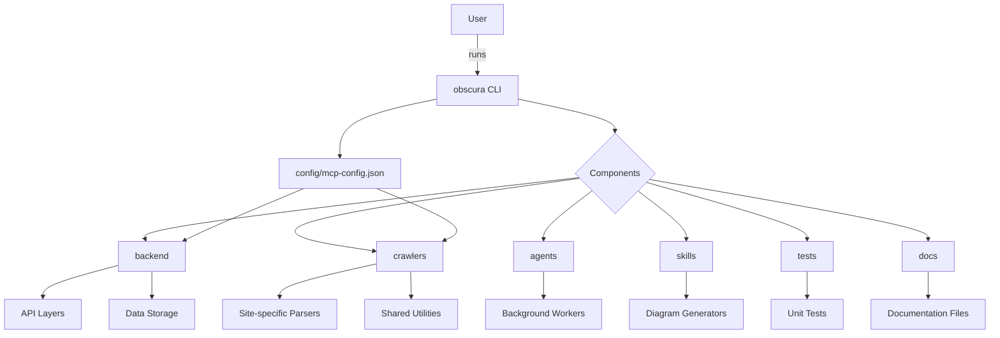

# Diagram: shipment_core/scheduled_services/config/config.qa.yml

> Auto-generated by Obscura crawlers

## Mermaid

### SVG

<svg id="container" width="1780.890625" xmlns="http://www.w3.org/2000/svg" class="flowchart" height="601.265625" viewBox="0 0 1780.890625 601.265625" role="graphics-document document" aria-roledescription="flowchart-v2"><g><marker id="container_flowchart-v2-pointEnd" class="marker flowchart-v2" viewBox="0 0 10 10" refX="5" refY="5" markerUnits="userSpaceOnUse" markerWidth="8" markerHeight="8" orient="auto"><path d="M 0 0 L 10 5 L 0 10 z" class="arrowMarkerPath" style="stroke-width: 1; stroke-dasharray: 1, 0;"></path></marker><marker id="container_flowchart-v2-pointStart" class="marker flowchart-v2" viewBox="0 0 10 10" refX="4.5" refY="5" markerUnits="userSpaceOnUse" markerWidth="8" markerHeight="8" orient="auto"><path d="M 0 5 L 10 10 L 10 0 z" class="arrowMarkerPath" style="stroke-width: 1; stroke-dasharray: 1, 0;"></path></marker><marker id="container_flowchart-v2-circleEnd" class="marker flowchart-v2" viewBox="0 0 10 10" refX="11" refY="5" markerUnits="userSpaceOnUse" markerWidth="11" markerHeight="11" orient="auto"><circle cx="5" cy="5" r="5" class="arrowMarkerPath" style="stroke-width: 1; stroke-dasharray: 1, 0;"></circle></marker><marker id="container_flowchart-v2-circleStart" class="marker flowchart-v2" viewBox="0 0 10 10" refX="-1" refY="5" markerUnits="userSpaceOnUse" markerWidth="11" markerHeight="11" orient="auto"><circle cx="5" cy="5" r="5" class="arrowMarkerPath" style="stroke-width: 1; stroke-dasharray: 1, 0;"></circle></marker><marker id="container_flowchart-v2-crossEnd" class="marker cross flowchart-v2" viewBox="0 0 11 11" refX="12" refY="5.2" markerUnits="userSpaceOnUse" markerWidth="11" markerHeight="11" orient="auto"><path d="M 1,1 l 9,9 M 10,1 l -9,9" class="arrowMarkerPath" style="stroke-width: 2; stroke-dasharray: 1, 0;"></path></marker><marker id="container_flowchart-v2-crossStart" class="marker cross flowchart-v2" viewBox="0 0 11 11" refX="-1" refY="5.2" markerUnits="userSpaceOnUse" markerWidth="11" markerHeight="11" orient="auto"><path d="M 1,1 l 9,9 M 10,1 l -9,9" class="arrowMarkerPath" style="stroke-width: 2; stroke-dasharray: 1, 0;"></path></marker><g class="root"><g class="clusters"></g><g class="edgePaths"><path d="M853.875,62L853.875,68.167C853.875,74.333,853.875,86.667,853.875,98.333C853.875,110,853.875,121,853.875,126.5L853.875,132" id="L_A_B_0" class="edge-thickness-normal edge-pattern-solid edge-thickness-normal edge-pattern-solid flowchart-link" style=";" data-edge="true" data-et="edge" data-id="L_A_B_0" data-points="W3sieCI6ODUzLjg3NSwieSI6NjJ9LHsieCI6ODUzLjg3NSwieSI6OTl9LHsieCI6ODUzLjg3NSwieSI6MTM2fV0=" marker-end="url(#container_flowchart-v2-pointEnd)"></path><path d="M925.547,177.945L955.165,184.121C984.783,190.297,1044.018,202.648,1073.636,212.324C1103.254,222,1103.254,229,1103.254,232.5L1103.254,236" id="L_B_C_0" class="edge-thickness-normal edge-pattern-solid edge-thickness-normal edge-pattern-solid flowchart-link" style=";" data-edge="true" data-et="edge" data-id="L_B_C_0" data-points="W3sieCI6OTI1LjU0Njg3NSwieSI6MTc3Ljk0NDg3ODY4Mjk3ODAxfSx7IngiOjExMDMuMjUzOTA2MjUsInkiOjIxNX0seyJ4IjoxMTAzLjI1MzkwNjI1LCJ5IjoyNDB9XQ==" marker-end="url(#container_flowchart-v2-pointEnd)"></path><path d="M1038.06,320.072L906.325,335.104C774.59,350.137,511.119,380.201,380.747,398.778C250.375,417.354,253.101,424.443,254.465,427.988L255.828,431.532" id="L_C_D_0" class="edge-thickness-normal edge-pattern-solid edge-thickness-normal edge-pattern-solid flowchart-link" style=";" data-edge="true" data-et="edge" data-id="L_C_D_0" data-points="W3sieCI6MTAzOC4wNjAzMTAwNTQ3MjE5LCJ5IjozMjAuMDcyMDI4ODA0NzIyfSx7IngiOjI0Ny42NDg0Mzc1LCJ5Ijo0MTAuMjY1NjI1fSx7IngiOjI1Ny4yNjM4MjIxMTUzODQ2NCwieSI6NDM1LjI2NTYyNX1d" marker-end="url(#container_flowchart-v2-pointEnd)"></path><path d="M1039.388,321.4L931.497,336.211C823.605,351.022,607.822,380.644,546.212,402.498C484.601,424.352,577.163,438.438,623.444,445.481L669.725,452.525" id="L_C_E_0" class="edge-thickness-normal edge-pattern-solid edge-thickness-normal edge-pattern-solid flowchart-link" style=";" data-edge="true" data-et="edge" data-id="L_C_E_0" data-points="W3sieCI6MTAzOS4zODgzMTQyNjM0ODYsInkiOjMyMS40MDAwMzMwMTM0ODYxfSx7IngiOjM5Mi4wMzkwNjI1LCJ5Ijo0MTAuMjY1NjI1fSx7IngiOjY3My42Nzk2ODc1LCJ5Ijo0NTMuMTI2MzYwNzYxNDgzNH1d" marker-end="url(#container_flowchart-v2-pointEnd)"></path><path d="M1062.041,344.052L1047.565,355.088C1033.09,366.123,1004.139,388.195,989.663,402.73C975.188,417.266,975.188,424.266,975.188,427.766L975.188,431.266" id="L_C_F_0" class="edge-thickness-normal edge-pattern-solid edge-thickness-normal edge-pattern-solid flowchart-link" style=";" data-edge="true" data-et="edge" data-id="L_C_F_0" data-points="W3sieCI6MTA2Mi4wNDA1NDU3MjQzMzMyLCJ5IjozNDQuMDUyMjY0NDc0MzMzMjR9LHsieCI6OTc1LjE4NzUsInkiOjQxMC4yNjU2MjV9LHsieCI6OTc1LjE4NzUsInkiOjQzNS4yNjU2MjV9XQ==" marker-end="url(#container_flowchart-v2-pointEnd)"></path><path d="M1144.467,344.052L1158.943,355.088C1173.418,366.123,1202.369,388.195,1216.845,402.73C1231.32,417.266,1231.32,424.266,1231.32,427.766L1231.32,431.266" id="L_C_G_0" class="edge-thickness-normal edge-pattern-solid edge-thickness-normal edge-pattern-solid flowchart-link" style=";" data-edge="true" data-et="edge" data-id="L_C_G_0" data-points="W3sieCI6MTE0NC40NjcyNjY3NzU2NjY4LCJ5IjozNDQuMDUyMjY0NDc0MzMzMjR9LHsieCI6MTIzMS4zMjAzMTI1LCJ5Ijo0MTAuMjY1NjI1fSx7IngiOjEyMzEuMzIwMzEyNSwieSI6NDM1LjI2NTYyNX1d" marker-end="url(#container_flowchart-v2-pointEnd)"></path><path d="M1159.883,328.636L1208.025,342.241C1256.167,355.846,1352.451,383.056,1400.593,400.161C1448.734,417.266,1448.734,424.266,1448.734,427.766L1448.734,431.266" id="L_C_H_0" class="edge-thickness-normal edge-pattern-solid edge-thickness-normal edge-pattern-solid flowchart-link" style=";" data-edge="true" data-et="edge" data-id="L_C_H_0" data-points="W3sieCI6MTE1OS44ODMyNTg1NDE5MTEsInkiOjMyOC42MzYyNzI3MDgwODkwNX0seyJ4IjoxNDQ4LjczNDM3NSwieSI6NDEwLjI2NTYyNX0seyJ4IjoxNDQ4LjczNDM3NSwieSI6NDM1LjI2NTYyNX1d" marker-end="url(#container_flowchart-v2-pointEnd)"></path><path d="M1165.191,323.328L1249.101,337.818C1333.01,352.307,1500.829,381.286,1584.739,399.276C1668.648,417.266,1668.648,424.266,1668.648,427.766L1668.648,431.266" id="L_C_I_0" class="edge-thickness-normal edge-pattern-solid edge-thickness-normal edge-pattern-solid flowchart-link" style=";" data-edge="true" data-et="edge" data-id="L_C_I_0" data-points="W3sieCI6MTE2NS4xOTEzMTQwNTY2NTQ0LCJ5IjozMjMuMzI4MjE3MTkzMzQ1NX0seyJ4IjoxNjY4LjY0ODQzNzUsInkiOjQxMC4yNjU2MjV9LHsieCI6MTY2OC42NDg0Mzc1LCJ5Ijo0MzUuMjY1NjI1fV0=" marker-end="url(#container_flowchart-v2-pointEnd)"></path><path d="M206.938,478.638L184.918,484.576C162.898,490.514,118.859,502.39,96.84,511.828C74.82,521.266,74.82,528.266,74.82,531.766L74.82,535.266" id="L_D_J_0" class="edge-thickness-normal edge-pattern-solid edge-thickness-normal edge-pattern-solid flowchart-link" style=";" data-edge="true" data-et="edge" data-id="L_D_J_0" data-points="W3sieCI6MjA2LjkzNzUsInkiOjQ3OC42Mzc1NTU5NjE4MzQ1NX0seyJ4Ijo3NC44MjAzMTI1LCJ5Ijo1MTQuMjY1NjI1fSx7IngiOjc0LjgyMDMxMjUsInkiOjUzOS4yNjU2MjV9XQ==" marker-end="url(#container_flowchart-v2-pointEnd)"></path><path d="M267.648,489.266L267.648,493.432C267.648,497.599,267.648,505.932,267.648,513.599C267.648,521.266,267.648,528.266,267.648,531.766L267.648,535.266" id="L_D_K_0" class="edge-thickness-normal edge-pattern-solid edge-thickness-normal edge-pattern-solid flowchart-link" style=";" data-edge="true" data-et="edge" data-id="L_D_K_0" data-points="W3sieCI6MjY3LjY0ODQzNzUsInkiOjQ4OS4yNjU2MjV9LHsieCI6MjY3LjY0ODQzNzUsInkiOjUxNC4yNjU2MjV9LHsieCI6MjY3LjY0ODQzNzUsInkiOjUzOS4yNjU2MjV9XQ==" marker-end="url(#container_flowchart-v2-pointEnd)"></path><path d="M673.68,475.425L644.138,481.899C614.596,488.372,555.513,501.319,525.971,511.292C496.43,521.266,496.43,528.266,496.43,531.766L496.43,535.266" id="L_E_L_0" class="edge-thickness-normal edge-pattern-solid edge-thickness-normal edge-pattern-solid flowchart-link" style=";" data-edge="true" data-et="edge" data-id="L_E_L_0" data-points="W3sieCI6NjczLjY3OTY4NzUsInkiOjQ3NS40MjUyNjI4NjAwODIzfSx7IngiOjQ5Ni40Mjk2ODc1LCJ5Ijo1MTQuMjY1NjI1fSx7IngiOjQ5Ni40Mjk2ODc1LCJ5Ijo1MzkuMjY1NjI1fV0=" marker-end="url(#container_flowchart-v2-pointEnd)"></path><path d="M734.392,489.266L734.493,493.432C734.594,497.599,734.797,505.932,734.899,513.599C735,521.266,735,528.266,735,531.766L735,535.266" id="L_E_M_0" class="edge-thickness-normal edge-pattern-solid edge-thickness-normal edge-pattern-solid flowchart-link" style=";" data-edge="true" data-et="edge" data-id="L_E_M_0" data-points="W3sieCI6NzM0LjM5MTUyNjQ0MjMwNzcsInkiOjQ4OS4yNjU2MjV9LHsieCI6NzM1LCJ5Ijo1MTQuMjY1NjI1fSx7IngiOjczNSwieSI6NTM5LjI2NTYyNX1d" marker-end="url(#container_flowchart-v2-pointEnd)"></path><path d="M975.188,489.266L975.188,493.432C975.188,497.599,975.188,505.932,975.188,513.599C975.188,521.266,975.188,528.266,975.188,531.766L975.188,535.266" id="L_F_N_0" class="edge-thickness-normal edge-pattern-solid edge-thickness-normal edge-pattern-solid flowchart-link" style=";" data-edge="true" data-et="edge" data-id="L_F_N_0" data-points="W3sieCI6OTc1LjE4NzUsInkiOjQ4OS4yNjU2MjV9LHsieCI6OTc1LjE4NzUsInkiOjUxNC4yNjU2MjV9LHsieCI6OTc1LjE4NzUsInkiOjUzOS4yNjU2MjV9XQ==" marker-end="url(#container_flowchart-v2-pointEnd)"></path><path d="M1231.32,489.266L1231.32,493.432C1231.32,497.599,1231.32,505.932,1231.32,513.599C1231.32,521.266,1231.32,528.266,1231.32,531.766L1231.32,535.266" id="L_G_O_0" class="edge-thickness-normal edge-pattern-solid edge-thickness-normal edge-pattern-solid flowchart-link" style=";" data-edge="true" data-et="edge" data-id="L_G_O_0" data-points="W3sieCI6MTIzMS4zMjAzMTI1LCJ5Ijo0ODkuMjY1NjI1fSx7IngiOjEyMzEuMzIwMzEyNSwieSI6NTE0LjI2NTYyNX0seyJ4IjoxMjMxLjMyMDMxMjUsInkiOjUzOS4yNjU2MjV9XQ==" marker-end="url(#container_flowchart-v2-pointEnd)"></path><path d="M1448.734,489.266L1448.734,493.432C1448.734,497.599,1448.734,505.932,1448.734,513.599C1448.734,521.266,1448.734,528.266,1448.734,531.766L1448.734,535.266" id="L_H_P_0" class="edge-thickness-normal edge-pattern-solid edge-thickness-normal edge-pattern-solid flowchart-link" style=";" data-edge="true" data-et="edge" data-id="L_H_P_0" data-points="W3sieCI6MTQ0OC43MzQzNzUsInkiOjQ4OS4yNjU2MjV9LHsieCI6MTQ0OC43MzQzNzUsInkiOjUxNC4yNjU2MjV9LHsieCI6MTQ0OC43MzQzNzUsInkiOjUzOS4yNjU2MjV9XQ==" marker-end="url(#container_flowchart-v2-pointEnd)"></path><path d="M1668.648,489.266L1668.648,493.432C1668.648,497.599,1668.648,505.932,1668.648,513.599C1668.648,521.266,1668.648,528.266,1668.648,531.766L1668.648,535.266" id="L_I_Q_0" class="edge-thickness-normal edge-pattern-solid edge-thickness-normal edge-pattern-solid flowchart-link" style=";" data-edge="true" data-et="edge" data-id="L_I_Q_0" data-points="W3sieCI6MTY2OC42NDg0Mzc1LCJ5Ijo0ODkuMjY1NjI1fSx7IngiOjE2NjguNjQ4NDM3NSwieSI6NTE0LjI2NTYyNX0seyJ4IjoxNjY4LjY0ODQzNzUsInkiOjUzOS4yNjU2MjV9XQ==" marker-end="url(#container_flowchart-v2-pointEnd)"></path><path d="M782.203,178.018L752.788,184.182C723.374,190.346,664.544,202.673,635.13,219.942C605.715,237.211,605.715,259.422,605.715,270.527L605.715,281.633" id="L_B_R_0" class="edge-thickness-normal edge-pattern-solid edge-thickness-normal edge-pattern-solid flowchart-link" style=";" data-edge="true" data-et="edge" data-id="L_B_R_0" data-points="W3sieCI6NzgyLjIwMzEyNSwieSI6MTc4LjAxODI3NTExODQ0OTg1fSx7IngiOjYwNS43MTQ4NDM3NSwieSI6MjE1fSx7IngiOjYwNS43MTQ4NDM3NSwieSI6Mjg1LjYzMjgxMjV9XQ==" marker-end="url(#container_flowchart-v2-pointEnd)"></path><path d="M541.093,339.633L512.917,351.405C484.741,363.177,428.39,386.721,392.447,402.363C356.503,418.004,340.967,425.743,333.2,429.613L325.432,433.482" id="L_R_D_0" class="edge-thickness-normal edge-pattern-solid edge-thickness-normal edge-pattern-solid flowchart-link" style=";" data-edge="true" data-et="edge" data-id="L_R_D_0" data-points="W3sieCI6NTQxLjA5MjY1NDQyNDU2MTksInkiOjMzOS42MzI4MTI1fSx7IngiOjM3Mi4wMzkwNjI1LCJ5Ijo0MTAuMjY1NjI1fSx7IngiOjMyMS44NTEyNjIwMTkyMzA4LCJ5Ijo0MzUuMjY1NjI1fV0=" marker-end="url(#container_flowchart-v2-pointEnd)"></path><path d="M671.914,339.633L700.777,351.405C729.641,363.177,787.367,386.721,807.912,402.378C828.456,418.035,811.818,425.804,803.499,429.689L795.18,433.573" id="L_R_E_0" class="edge-thickness-normal edge-pattern-solid edge-thickness-normal edge-pattern-solid flowchart-link" style=";" data-edge="true" data-et="edge" data-id="L_R_E_0" data-points="W3sieCI6NjcxLjkxNDIxMTU5ODI4MzYsInkiOjMzOS42MzI4MTI1fSx7IngiOjg0NS4wOTM3NSwieSI6NDEwLjI2NTYyNX0seyJ4Ijo3OTEuNTU1NTg4OTQyMzA3NywieSI6NDM1LjI2NTYyNX1d" marker-end="url(#container_flowchart-v2-pointEnd)"></path></g><g class="edgeLabels"><g class="edgeLabel" transform="translate(853.875, 99)"><g class="label" data-id="L_A_B_0" transform="translate(-16.171875, -12)"><foreignObject width="32.34375" height="24">

runs

</foreignObject></g></g><g class="edgeLabel"><g class="label" data-id="L_B_C_0" transform="translate(0, 0)"><foreignObject width="0" height="0">

</foreignObject></g></g><g class="edgeLabel"><g class="label" data-id="L_C_D_0" transform="translate(0, 0)"><foreignObject width="0" height="0">

</foreignObject></g></g><g class="edgeLabel"><g class="label" data-id="L_C_E_0" transform="translate(0, 0)"><foreignObject width="0" height="0">

</foreignObject></g></g><g class="edgeLabel"><g class="label" data-id="L_C_F_0" transform="translate(0, 0)"><foreignObject width="0" height="0">

</foreignObject></g></g><g class="edgeLabel"><g class="label" data-id="L_C_G_0" transform="translate(0, 0)"><foreignObject width="0" height="0">

</foreignObject></g></g><g class="edgeLabel"><g class="label" data-id="L_C_H_0" transform="translate(0, 0)"><foreignObject width="0" height="0">

</foreignObject></g></g><g class="edgeLabel"><g class="label" data-id="L_C_I_0" transform="translate(0, 0)"><foreignObject width="0" height="0">

</foreignObject></g></g><g class="edgeLabel"><g class="label" data-id="L_D_J_0" transform="translate(0, 0)"><foreignObject width="0" height="0">

</foreignObject></g></g><g class="edgeLabel"><g class="label" data-id="L_D_K_0" transform="translate(0, 0)"><foreignObject width="0" height="0">

</foreignObject></g></g><g class="edgeLabel"><g class="label" data-id="L_E_L_0" transform="translate(0, 0)"><foreignObject width="0" height="0">

</foreignObject></g></g><g class="edgeLabel"><g class="label" data-id="L_E_M_0" transform="translate(0, 0)"><foreignObject width="0" height="0">

</foreignObject></g></g><g class="edgeLabel"><g class="label" data-id="L_F_N_0" transform="translate(0, 0)"><foreignObject width="0" height="0">

</foreignObject></g></g><g class="edgeLabel"><g class="label" data-id="L_G_O_0" transform="translate(0, 0)"><foreignObject width="0" height="0">

</foreignObject></g></g><g class="edgeLabel"><g class="label" data-id="L_H_P_0" transform="translate(0, 0)"><foreignObject width="0" height="0">

</foreignObject></g></g><g class="edgeLabel"><g class="label" data-id="L_I_Q_0" transform="translate(0, 0)"><foreignObject width="0" height="0">

</foreignObject></g></g><g class="edgeLabel"><g class="label" data-id="L_B_R_0" transform="translate(0, 0)"><foreignObject width="0" height="0">

</foreignObject></g></g><g class="edgeLabel"><g class="label" data-id="L_R_D_0" transform="translate(0, 0)"><foreignObject width="0" height="0">

</foreignObject></g></g><g class="edgeLabel"><g class="label" data-id="L_R_E_0" transform="translate(0, 0)"><foreignObject width="0" height="0">

</foreignObject></g></g></g><g class="nodes"><g class="node default" id="flowchart-A-0" transform="translate(853.875, 35)"><rect class="basic label-container" style="" x="-46.4453125" y="-27" width="92.890625" height="54"></rect><g class="label" style="" transform="translate(-16.4453125, -12)"><rect></rect><foreignObject width="32.890625" height="24">

User

</foreignObject></g></g><g class="node default" id="flowchart-B-1" transform="translate(853.875, 163)"><rect class="basic label-container" style="" x="-71.671875" y="-27" width="143.34375" height="54"></rect><g class="label" style="" transform="translate(-41.671875, -12)"><rect></rect><foreignObject width="83.34375" height="24">

obscura CLI

</foreignObject></g></g><g class="node default" id="flowchart-C-3" transform="translate(1103.25390625, 312.6328125)"><polygon points="72.6328125,0 145.265625,-72.6328125 72.6328125,-145.265625 0,-72.6328125" class="label-container" transform="translate(-72.1328125, 72.6328125)"></polygon><g class="label" style="" transform="translate(-45.6328125, -12)"><rect></rect><foreignObject width="91.265625" height="24">

Components

</foreignObject></g></g><g class="node default" id="flowchart-D-5" transform="translate(267.6484375, 462.265625)"><rect class="basic label-container" style="" x="-60.7109375" y="-27" width="121.421875" height="54"></rect><g class="label" style="" transform="translate(-30.7109375, -12)"><rect></rect><foreignObject width="61.421875" height="24">

backend

</foreignObject></g></g><g class="node default" id="flowchart-E-7" transform="translate(733.734375, 462.265625)"><rect class="basic label-container" style="" x="-60.0546875" y="-27" width="120.109375" height="54"></rect><g class="label" style="" transform="translate(-30.0546875, -12)"><rect></rect><foreignObject width="60.109375" height="24">

crawlers

</foreignObject></g></g><g class="node default" id="flowchart-F-9" transform="translate(975.1875, 462.265625)"><rect class="basic label-container" style="" x="-53.9765625" y="-27" width="107.953125" height="54"></rect><g class="label" style="" transform="translate(-23.9765625, -12)"><rect></rect><foreignObject width="47.953125" height="24">

agents

</foreignObject></g></g><g class="node default" id="flowchart-G-11" transform="translate(1231.3203125, 462.265625)"><rect class="basic label-container" style="" x="-48.515625" y="-27" width="97.03125" height="54"></rect><g class="label" style="" transform="translate(-18.515625, -12)"><rect></rect><foreignObject width="37.03125" height="24">

skills

</foreignObject></g></g><g class="node default" id="flowchart-H-13" transform="translate(1448.734375, 462.265625)"><rect class="basic label-container" style="" x="-47.4921875" y="-27" width="94.984375" height="54"></rect><g class="label" style="" transform="translate(-17.4921875, -12)"><rect></rect><foreignObject width="34.984375" height="24">

tests

</foreignObject></g></g><g class="node default" id="flowchart-I-15" transform="translate(1668.6484375, 462.265625)"><rect class="basic label-container" style="" x="-47.0234375" y="-27" width="94.046875" height="54"></rect><g class="label" style="" transform="translate(-17.0234375, -12)"><rect></rect><foreignObject width="34.046875" height="24">

docs

</foreignObject></g></g><g class="node default" id="flowchart-J-17" transform="translate(74.8203125, 566.265625)"><rect class="basic label-container" style="" x="-66.8203125" y="-27" width="133.640625" height="54"></rect><g class="label" style="" transform="translate(-36.8203125, -12)"><rect></rect><foreignObject width="73.640625" height="24">

API Layers

</foreignObject></g></g><g class="node default" id="flowchart-K-19" transform="translate(267.6484375, 566.265625)"><rect class="basic label-container" style="" x="-76.0078125" y="-27" width="152.015625" height="54"></rect><g class="label" style="" transform="translate(-46.0078125, -12)"><rect></rect><foreignObject width="92.015625" height="24">

Data Storage

</foreignObject></g></g><g class="node default" id="flowchart-L-21" transform="translate(496.4296875, 566.265625)"><rect class="basic label-container" style="" x="-102.7734375" y="-27" width="205.546875" height="54"></rect><g class="label" style="" transform="translate(-72.7734375, -12)"><rect></rect><foreignObject width="145.546875" height="24">

Site-specific Parsers

</foreignObject></g></g><g class="node default" id="flowchart-M-23" transform="translate(735, 566.265625)"><rect class="basic label-container" style="" x="-85.796875" y="-27" width="171.59375" height="54"></rect><g class="label" style="" transform="translate(-55.796875, -12)"><rect></rect><foreignObject width="111.59375" height="24">

Shared Utilities

</foreignObject></g></g><g class="node default" id="flowchart-N-25" transform="translate(975.1875, 566.265625)"><rect class="basic label-container" style="" x="-104.390625" y="-27" width="208.78125" height="54"></rect><g class="label" style="" transform="translate(-74.390625, -12)"><rect></rect><foreignObject width="148.78125" height="24">

Background Workers

</foreignObject></g></g><g class="node default" id="flowchart-O-27" transform="translate(1231.3203125, 566.265625)"><rect class="basic label-container" style="" x="-101.7421875" y="-27" width="203.484375" height="54"></rect><g class="label" style="" transform="translate(-71.7421875, -12)"><rect></rect><foreignObject width="143.484375" height="24">

Diagram Generators

</foreignObject></g></g><g class="node default" id="flowchart-P-29" transform="translate(1448.734375, 566.265625)"><rect class="basic label-container" style="" x="-65.671875" y="-27" width="131.34375" height="54"></rect><g class="label" style="" transform="translate(-35.671875, -12)"><rect></rect><foreignObject width="71.34375" height="24">

Unit Tests

</foreignObject></g></g><g class="node default" id="flowchart-Q-31" transform="translate(1668.6484375, 566.265625)"><rect class="basic label-container" style="" x="-104.2421875" y="-27" width="208.484375" height="54"></rect><g class="label" style="" transform="translate(-74.2421875, -12)"><rect></rect><foreignObject width="148.484375" height="24">

Documentation Files

</foreignObject></g></g><g class="node default" id="flowchart-R-33" transform="translate(605.71484375, 312.6328125)"><rect class="basic label-container" style="" x="-113.40625" y="-27" width="226.8125" height="54"></rect><g class="label" style="" transform="translate(-83.40625, -12)"><rect></rect><foreignObject width="166.8125" height="24">

config/mcp-config.json

</foreignObject></g></g></g></g></g></svg>
