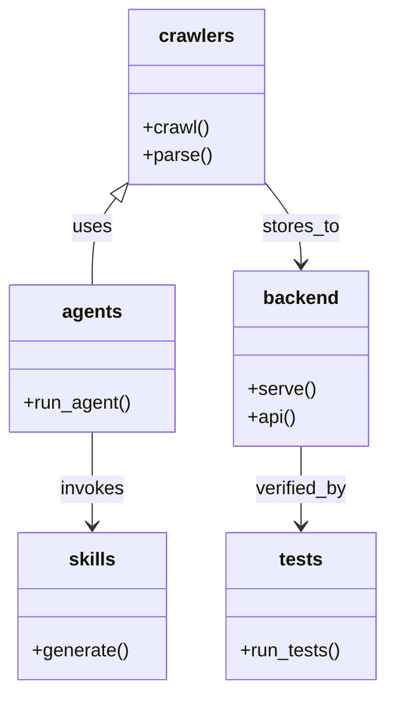
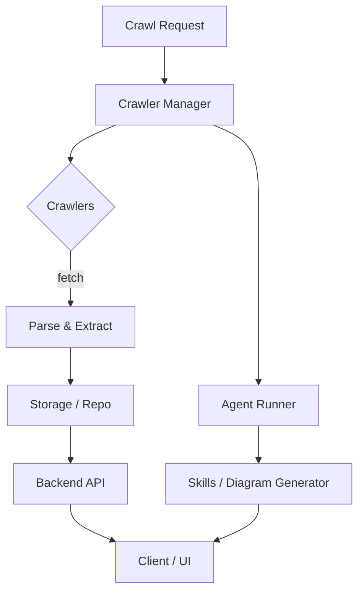

# Diagram: shipment_core/scheduled_services/config/config.qa2.yml

> Auto-generated by Obscura crawlers

## Diagram 1

### SVG

<svg id="container" width="326.98046875" xmlns="http://www.w3.org/2000/svg" class="classDiagram" height="590" viewBox="0 0 326.98046875 590" role="graphics-document document" aria-roledescription="class"><g><defs><marker id="container_class-aggregationStart" class="marker aggregation class" refX="18" refY="7" markerWidth="190" markerHeight="240" orient="auto"><path d="M 18,7 L9,13 L1,7 L9,1 Z"></path></marker></defs><defs><marker id="container_class-aggregationEnd" class="marker aggregation class" refX="1" refY="7" markerWidth="20" markerHeight="28" orient="auto"><path d="M 18,7 L9,13 L1,7 L9,1 Z"></path></marker></defs><defs><marker id="container_class-extensionStart" class="marker extension class" refX="18" refY="7" markerWidth="190" markerHeight="240" orient="auto"><path d="M 1,7 L18,13 V 1 Z"></path></marker></defs><defs><marker id="container_class-extensionEnd" class="marker extension class" refX="1" refY="7" markerWidth="20" markerHeight="28" orient="auto"><path d="M 1,1 V 13 L18,7 Z"></path></marker></defs><defs><marker id="container_class-compositionStart" class="marker composition class" refX="18" refY="7" markerWidth="190" markerHeight="240" orient="auto"><path d="M 18,7 L9,13 L1,7 L9,1 Z"></path></marker></defs><defs><marker id="container_class-compositionEnd" class="marker composition class" refX="1" refY="7" markerWidth="20" markerHeight="28" orient="auto"><path d="M 18,7 L9,13 L1,7 L9,1 Z"></path></marker></defs><defs><marker id="container_class-dependencyStart" class="marker dependency class" refX="6" refY="7" markerWidth="190" markerHeight="240" orient="auto"><path d="M 5,7 L9,13 L1,7 L9,1 Z"></path></marker></defs><defs><marker id="container_class-dependencyEnd" class="marker dependency class" refX="13" refY="7" markerWidth="20" markerHeight="28" orient="auto"><path d="M 18,7 L9,13 L14,7 L9,1 Z"></path></marker></defs><defs><marker id="container_class-lollipopStart" class="marker lollipop class" refX="13" refY="7" markerWidth="190" markerHeight="240" orient="auto"><circle stroke="black" fill="transparent" cx="7" cy="7" r="6"></circle></marker></defs><defs><marker id="container_class-lollipopEnd" class="marker lollipop class" refX="1" refY="7" markerWidth="190" markerHeight="240" orient="auto"><circle stroke="black" fill="transparent" cx="7" cy="7" r="6"></circle></marker></defs><g class="root"><g class="clusters"></g><g class="edgePaths"><path d="M99.089,168.406L95.593,172.838C92.097,177.271,85.105,186.135,81.609,198.734C78.113,211.333,78.113,227.667,78.113,235.833L78.113,244" id="id_crawlers_agents_1" class="edge-thickness-normal edge-pattern-solid relation" style=";;;" data-edge="true" data-et="edge" data-id="id_crawlers_agents_1" data-points="W3sieCI6MTA5Ljc3MTQ4NDM3NSwieSI6MTU0Ljg2MTg1ODU0MjA4NTgzfSx7IngiOjc4LjExMzI4MTI1LCJ5IjoxOTV9LHsieCI6NzguMTEzMjgxMjUsInkiOjI0NH1d" marker-start="url(#container_class-extensionStart)"></path><path d="M78.113,370L78.113,378.167C78.113,386.333,78.113,402.667,78.113,416C78.113,429.333,78.113,439.667,78.113,444.833L78.113,450" id="id_agents_skills_2" class="edge-thickness-normal edge-pattern-solid relation" style=";;;" data-edge="true" data-et="edge" data-id="id_agents_skills_2" data-points="W3sieCI6NzguMTEzMjgxMjUsInkiOjM3MH0seyJ4Ijo3OC4xMTMyODEyNSwieSI6NDE5fSx7IngiOjc4LjExMzI4MTI1LCJ5Ijo0NTZ9XQ==" marker-end="url(#container_class-dependencyEnd)"></path><path d="M223.131,154.862L228.407,161.552C233.684,168.241,244.236,181.621,249.513,193.477C254.789,205.333,254.789,215.667,254.789,220.833L254.789,226" id="id_crawlers_backend_3" class="edge-thickness-normal edge-pattern-solid relation" style=";;;" data-edge="true" data-et="edge" data-id="id_crawlers_backend_3" data-points="W3sieCI6MjIzLjEzMDg1OTM3NSwieSI6MTU0Ljg2MTg1ODU0MjA4NTgzfSx7IngiOjI1NC43ODkwNjI1LCJ5IjoxOTV9LHsieCI6MjU0Ljc4OTA2MjUsInkiOjIzMn1d" marker-end="url(#container_class-dependencyEnd)"></path><path d="M254.789,382L254.789,388.167C254.789,394.333,254.789,406.667,254.789,418C254.789,429.333,254.789,439.667,254.789,444.833L254.789,450" id="id_backend_tests_4" class="edge-thickness-normal edge-pattern-solid relation" style=";;;" data-edge="true" data-et="edge" data-id="id_backend_tests_4" data-points="W3sieCI6MjU0Ljc4OTA2MjUsInkiOjM4Mn0seyJ4IjoyNTQuNzg5MDYyNSwieSI6NDE5fSx7IngiOjI1NC43ODkwNjI1LCJ5Ijo0NTZ9XQ==" marker-end="url(#container_class-dependencyEnd)"></path></g><g class="edgeLabels"><g class="edgeLabel" transform="translate(78.11328125, 195)"><g class="label" data-id="id_crawlers_agents_1" transform="translate(-16.4921875, -12)"><foreignObject width="32.984375" height="24">

uses

</foreignObject></g></g><g class="edgeLabel" transform="translate(78.11328125, 419)"><g class="label" data-id="id_agents_skills_2" transform="translate(-27.5859375, -12)"><foreignObject width="55.171875" height="24">

invokes

</foreignObject></g></g><g class="edgeLabel" transform="translate(254.7890625, 195)"><g class="label" data-id="id_crawlers_backend_3" transform="translate(-33.40625, -12)"><foreignObject width="66.8125" height="24">

stores_to

</foreignObject></g></g><g class="edgeLabel" transform="translate(254.7890625, 419)"><g class="label" data-id="id_backend_tests_4" transform="translate(-40.171875, -12)"><foreignObject width="80.34375" height="24">

verified_by

</foreignObject></g></g></g><g class="nodes"><g class="node default" id="classId-crawlers-0" transform="translate(166.451171875, 83)"><g class="basic label-container"><path d="M-56.6796875 -75 L56.6796875 -75 L56.6796875 75 L-56.6796875 75" stroke="none" stroke-width="0" fill="#ECECFF" style=""></path><path d="M-56.6796875 -75 C-16.416088839969262 -75, 23.847509820061475 -75, 56.6796875 -75 M-56.6796875 -75 C-12.990798016250665 -75, 30.69809146749867 -75, 56.6796875 -75 M56.6796875 -75 C56.6796875 -22.129862406129583, 56.6796875 30.740275187740835, 56.6796875 75 M56.6796875 -75 C56.6796875 -25.78808244944998, 56.6796875 23.42383510110004, 56.6796875 75 M56.6796875 75 C20.487386980143597 75, -15.704913539712805 75, -56.6796875 75 M56.6796875 75 C25.38293295277794 75, -5.913821594444123 75, -56.6796875 75 M-56.6796875 75 C-56.6796875 24.43272686765124, -56.6796875 -26.13454626469752, -56.6796875 -75 M-56.6796875 75 C-56.6796875 33.29642550568848, -56.6796875 -8.407148988623035, -56.6796875 -75" stroke="#9370DB" stroke-width="1.3" fill="none" stroke-dasharray="0 0" style=""></path></g><g class="annotation-group text" transform="translate(0, -51)"></g><g class="label-group text" transform="translate(-30.828125, -51)"><g class="label" style="font-weight: bolder" transform="translate(0,-12)"><foreignObject width="61.65625" height="24">

crawlers

</foreignObject></g></g><g class="members-group text" transform="translate(-44.6796875, -3)"></g><g class="methods-group text" transform="translate(-44.6796875, 27)"><g class="label" style="" transform="translate(0,-12)"><foreignObject width="56.40625" height="24">

+crawl()

</foreignObject></g><g class="label" style="" transform="translate(0,12)"><foreignObject width="58.53125" height="24">

+parse()

</foreignObject></g></g><g class="divider" style=""><path d="M-56.6796875 -27 C-19.10051849324219 -27, 18.478650513515618 -27, 56.6796875 -27 M-56.6796875 -27 C-23.179655332672766 -27, 10.320376834654468 -27, 56.6796875 -27" stroke="#9370DB" stroke-width="1.3" fill="none" stroke-dasharray="0 0" style=""></path></g><g class="divider" style=""><path d="M-56.6796875 -3 C-27.515401347744124 -3, 1.6488848045117521 -3, 56.6796875 -3 M-56.6796875 -3 C-30.642837667126923 -3, -4.605987834253845 -3, 56.6796875 -3" stroke="#9370DB" stroke-width="1.3" fill="none" stroke-dasharray="0 0" style=""></path></g></g><g class="node default" id="classId-backend-1" transform="translate(254.7890625, 307)"><g class="basic label-container"><path d="M-56.15625 -75 L56.15625 -75 L56.15625 75 L-56.15625 75" stroke="none" stroke-width="0" fill="#ECECFF" style=""></path><path d="M-56.15625 -75 C-30.866420682329025 -75, -5.57659136465805 -75, 56.15625 -75 M-56.15625 -75 C-11.398707882312742 -75, 33.358834235374516 -75, 56.15625 -75 M56.15625 -75 C56.15625 -16.301692039011556, 56.15625 42.39661592197689, 56.15625 75 M56.15625 -75 C56.15625 -32.12248625492872, 56.15625 10.755027490142567, 56.15625 75 M56.15625 75 C11.523854198952804 75, -33.10854160209439 75, -56.15625 75 M56.15625 75 C25.56581471820761 75, -5.024620563584783 75, -56.15625 75 M-56.15625 75 C-56.15625 30.472230569130957, -56.15625 -14.055538861738086, -56.15625 -75 M-56.15625 75 C-56.15625 39.14073948948696, -56.15625 3.2814789789739223, -56.15625 -75" stroke="#9370DB" stroke-width="1.3" fill="none" stroke-dasharray="0 0" style=""></path></g><g class="annotation-group text" transform="translate(0, -51)"></g><g class="label-group text" transform="translate(-31.0625, -51)"><g class="label" style="font-weight: bolder" transform="translate(0,-12)"><foreignObject width="62.125" height="24">

backend

</foreignObject></g></g><g class="members-group text" transform="translate(-44.15625, -3)"></g><g class="methods-group text" transform="translate(-44.15625, 27)"><g class="label" style="" transform="translate(0,-12)"><foreignObject width="57.25" height="24">

+serve()

</foreignObject></g><g class="label" style="" transform="translate(0,12)"><foreignObject width="40.84375" height="24">

+api()

</foreignObject></g></g><g class="divider" style=""><path d="M-56.15625 -27 C-31.553572326068554 -27, -6.950894652137109 -27, 56.15625 -27 M-56.15625 -27 C-12.249862733496194 -27, 31.656524533007612 -27, 56.15625 -27" stroke="#9370DB" stroke-width="1.3" fill="none" stroke-dasharray="0 0" style=""></path></g><g class="divider" style=""><path d="M-56.15625 -3 C-33.48378355494206 -3, -10.811317109884115 -3, 56.15625 -3 M-56.15625 -3 C-24.109575846820597 -3, 7.937098306358806 -3, 56.15625 -3" stroke="#9370DB" stroke-width="1.3" fill="none" stroke-dasharray="0 0" style=""></path></g></g><g class="node default" id="classId-agents-2" transform="translate(78.11328125, 307)"><g class="basic label-container"><path d="M-70.11328125 -63 L70.11328125 -63 L70.11328125 63 L-70.11328125 63" stroke="none" stroke-width="0" fill="#ECECFF" style=""></path><path d="M-70.11328125 -63 C-17.874957901924596 -63, 34.36336544615081 -63, 70.11328125 -63 M-70.11328125 -63 C-19.451722536183738 -63, 31.209836177632525 -63, 70.11328125 -63 M70.11328125 -63 C70.11328125 -27.37600762971997, 70.11328125 8.247984740560057, 70.11328125 63 M70.11328125 -63 C70.11328125 -23.306047187665932, 70.11328125 16.387905624668136, 70.11328125 63 M70.11328125 63 C29.17019981258997 63, -11.772881624820059 63, -70.11328125 63 M70.11328125 63 C35.6676739129566 63, 1.2220665759132032 63, -70.11328125 63 M-70.11328125 63 C-70.11328125 15.55527169140494, -70.11328125 -31.88945661719012, -70.11328125 -63 M-70.11328125 63 C-70.11328125 26.00675946010996, -70.11328125 -10.986481079780077, -70.11328125 -63" stroke="#9370DB" stroke-width="1.3" fill="none" stroke-dasharray="0 0" style=""></path></g><g class="annotation-group text" transform="translate(0, -39)"></g><g class="label-group text" transform="translate(-24.5234375, -39)"><g class="label" style="font-weight: bolder" transform="translate(0,-12)"><foreignObject width="49.046875" height="24">

agents

</foreignObject></g></g><g class="members-group text" transform="translate(-58.11328125, 9)"></g><g class="methods-group text" transform="translate(-58.11328125, 39)"><g class="label" style="" transform="translate(0,-12)"><foreignObject width="91.703125" height="24">

+run_agent()

</foreignObject></g></g><g class="divider" style=""><path d="M-70.11328125 -15 C-32.923089564304945 -15, 4.26710212139011 -15, 70.11328125 -15 M-70.11328125 -15 C-18.817924124699793 -15, 32.47743300060041 -15, 70.11328125 -15" stroke="#9370DB" stroke-width="1.3" fill="none" stroke-dasharray="0 0" style=""></path></g><g class="divider" style=""><path d="M-70.11328125 9 C-34.26874643768376 9, 1.5757883746324808 9, 70.11328125 9 M-70.11328125 9 C-18.822624885197875 9, 32.46803147960425 9, 70.11328125 9" stroke="#9370DB" stroke-width="1.3" fill="none" stroke-dasharray="0 0" style=""></path></g></g><g class="node default" id="classId-skills-3" transform="translate(78.11328125, 519)"><g class="basic label-container"><path d="M-62.484375 -63 L62.484375 -63 L62.484375 63 L-62.484375 63" stroke="none" stroke-width="0" fill="#ECECFF" style=""></path><path d="M-62.484375 -63 C-25.811393932858742 -63, 10.861587134282516 -63, 62.484375 -63 M-62.484375 -63 C-19.610831463432532 -63, 23.262712073134935 -63, 62.484375 -63 M62.484375 -63 C62.484375 -31.70722230166249, 62.484375 -0.4144446033249807, 62.484375 63 M62.484375 -63 C62.484375 -30.33092887406569, 62.484375 2.338142251868618, 62.484375 63 M62.484375 63 C18.116362260962852 63, -26.251650478074296 63, -62.484375 63 M62.484375 63 C24.56632893219996 63, -13.351717135600083 63, -62.484375 63 M-62.484375 63 C-62.484375 31.971228981414736, -62.484375 0.9424579628294723, -62.484375 -63 M-62.484375 63 C-62.484375 26.64229791510438, -62.484375 -9.715404169791242, -62.484375 -63" stroke="#9370DB" stroke-width="1.3" fill="none" stroke-dasharray="0 0" style=""></path></g><g class="annotation-group text" transform="translate(0, -39)"></g><g class="label-group text" transform="translate(-19.15625, -39)"><g class="label" style="font-weight: bolder" transform="translate(0,-12)"><foreignObject width="38.3125" height="24">

skills

</foreignObject></g></g><g class="members-group text" transform="translate(-50.484375, 9)"></g><g class="methods-group text" transform="translate(-50.484375, 39)"><g class="label" style="" transform="translate(0,-12)"><foreignObject width="81.8125" height="24">

+generate()

</foreignObject></g></g><g class="divider" style=""><path d="M-62.484375 -15 C-29.00748749729528 -15, 4.46940000540944 -15, 62.484375 -15 M-62.484375 -15 C-29.09607314907217 -15, 4.292228701855663 -15, 62.484375 -15" stroke="#9370DB" stroke-width="1.3" fill="none" stroke-dasharray="0 0" style=""></path></g><g class="divider" style=""><path d="M-62.484375 9 C-17.688613910130933 9, 27.107147179738135 9, 62.484375 9 M-62.484375 9 C-35.939709964299766 9, -9.395044928599532 9, 62.484375 9" stroke="#9370DB" stroke-width="1.3" fill="none" stroke-dasharray="0 0" style=""></path></g></g><g class="node default" id="classId-tests-4" transform="translate(254.7890625, 519)"><g class="basic label-container"><path d="M-64.19140625 -63 L64.19140625 -63 L64.19140625 63 L-64.19140625 63" stroke="none" stroke-width="0" fill="#ECECFF" style=""></path><path d="M-64.19140625 -63 C-30.384908464034716 -63, 3.4215893219305684 -63, 64.19140625 -63 M-64.19140625 -63 C-20.498139983911855 -63, 23.19512628217629 -63, 64.19140625 -63 M64.19140625 -63 C64.19140625 -18.855790293855023, 64.19140625 25.288419412289954, 64.19140625 63 M64.19140625 -63 C64.19140625 -22.347951504005422, 64.19140625 18.304096991989155, 64.19140625 63 M64.19140625 63 C33.14285090856822 63, 2.0942955671364345 63, -64.19140625 63 M64.19140625 63 C31.914419158400456 63, -0.3625679331990881 63, -64.19140625 63 M-64.19140625 63 C-64.19140625 14.607410148653358, -64.19140625 -33.785179702693284, -64.19140625 -63 M-64.19140625 63 C-64.19140625 32.352338499182764, -64.19140625 1.704676998365528, -64.19140625 -63" stroke="#9370DB" stroke-width="1.3" fill="none" stroke-dasharray="0 0" style=""></path></g><g class="annotation-group text" transform="translate(0, -39)"></g><g class="label-group text" transform="translate(-18.1796875, -39)"><g class="label" style="font-weight: bolder" transform="translate(0,-12)"><foreignObject width="36.359375" height="24">

tests

</foreignObject></g></g><g class="members-group text" transform="translate(-52.19140625, 9)"></g><g class="methods-group text" transform="translate(-52.19140625, 39)"><g class="label" style="" transform="translate(0,-12)"><foreignObject width="86.203125" height="24">

+run_tests()

</foreignObject></g></g><g class="divider" style=""><path d="M-64.19140625 -15 C-18.676138104101675 -15, 26.83913004179665 -15, 64.19140625 -15 M-64.19140625 -15 C-18.042522029450545 -15, 28.10636219109891 -15, 64.19140625 -15" stroke="#9370DB" stroke-width="1.3" fill="none" stroke-dasharray="0 0" style=""></path></g><g class="divider" style=""><path d="M-64.19140625 9 C-33.69566801967169 9, -3.1999297893433862 9, 64.19140625 9 M-64.19140625 9 C-20.513035553795014 9, 23.165335142409972 9, 64.19140625 9" stroke="#9370DB" stroke-width="1.3" fill="none" stroke-dasharray="0 0" style=""></path></g></g></g></g></g></svg>

## Diagram 2

### SVG

<svg id="container" width="476.5390625" xmlns="http://www.w3.org/2000/svg" class="flowchart" height="779.171875" viewBox="0 0 476.5390625 779.171875" role="graphics-document document" aria-roledescription="flowchart-v2"><g><marker id="container_flowchart-v2-pointEnd" class="marker flowchart-v2" viewBox="0 0 10 10" refX="5" refY="5" markerUnits="userSpaceOnUse" markerWidth="8" markerHeight="8" orient="auto"><path d="M 0 0 L 10 5 L 0 10 z" class="arrowMarkerPath" style="stroke-width: 1; stroke-dasharray: 1, 0;"></path></marker><marker id="container_flowchart-v2-pointStart" class="marker flowchart-v2" viewBox="0 0 10 10" refX="4.5" refY="5" markerUnits="userSpaceOnUse" markerWidth="8" markerHeight="8" orient="auto"><path d="M 0 5 L 10 10 L 10 0 z" class="arrowMarkerPath" style="stroke-width: 1; stroke-dasharray: 1, 0;"></path></marker><marker id="container_flowchart-v2-circleEnd" class="marker flowchart-v2" viewBox="0 0 10 10" refX="11" refY="5" markerUnits="userSpaceOnUse" markerWidth="11" markerHeight="11" orient="auto"><circle cx="5" cy="5" r="5" class="arrowMarkerPath" style="stroke-width: 1; stroke-dasharray: 1, 0;"></circle></marker><marker id="container_flowchart-v2-circleStart" class="marker flowchart-v2" viewBox="0 0 10 10" refX="-1" refY="5" markerUnits="userSpaceOnUse" markerWidth="11" markerHeight="11" orient="auto"><circle cx="5" cy="5" r="5" class="arrowMarkerPath" style="stroke-width: 1; stroke-dasharray: 1, 0;"></circle></marker><marker id="container_flowchart-v2-crossEnd" class="marker cross flowchart-v2" viewBox="0 0 11 11" refX="12" refY="5.2" markerUnits="userSpaceOnUse" markerWidth="11" markerHeight="11" orient="auto"><path d="M 1,1 l 9,9 M 10,1 l -9,9" class="arrowMarkerPath" style="stroke-width: 2; stroke-dasharray: 1, 0;"></path></marker><marker id="container_flowchart-v2-crossStart" class="marker cross flowchart-v2" viewBox="0 0 11 11" refX="-1" refY="5.2" markerUnits="userSpaceOnUse" markerWidth="11" markerHeight="11" orient="auto"><path d="M 1,1 l 9,9 M 10,1 l -9,9" class="arrowMarkerPath" style="stroke-width: 2; stroke-dasharray: 1, 0;"></path></marker><g class="root"><g class="clusters"></g><g class="edgePaths"><path d="M217.75,62L217.75,66.167C217.75,70.333,217.75,78.667,217.75,86.333C217.75,94,217.75,101,217.75,104.5L217.75,108" id="L_A_B_0" class="edge-thickness-normal edge-pattern-solid edge-thickness-normal edge-pattern-solid flowchart-link" style=";" data-edge="true" data-et="edge" data-id="L_A_B_0" data-points="W3sieCI6MjE3Ljc1LCJ5Ijo2Mn0seyJ4IjoyMTcuNzUsInkiOjg3fSx7IngiOjIxNy43NSwieSI6MTEyfV0=" marker-end="url(#container_flowchart-v2-pointEnd)"></path><path d="M152.777,166L142.751,170.167C132.724,174.333,112.671,182.667,102.644,190.333C92.617,198,92.617,205,92.617,208.5L92.617,212" id="L_B_C_0" class="edge-thickness-normal edge-pattern-solid edge-thickness-normal edge-pattern-solid flowchart-link" style=";" data-edge="true" data-et="edge" data-id="L_B_C_0" data-points="W3sieCI6MTUyLjc3NzE5MzUwOTYxNTQsInkiOjE2Nn0seyJ4Ijo5Mi42MTcxODc1LCJ5IjoxOTF9LHsieCI6OTIuNjE3MTg3NSwieSI6MjE2fV0=" marker-end="url(#container_flowchart-v2-pointEnd)"></path><path d="M92.617,331.172L92.617,337.339C92.617,343.505,92.617,355.839,92.617,367.505C92.617,379.172,92.617,390.172,92.617,395.672L92.617,401.172" id="L_C_D_0" class="edge-thickness-normal edge-pattern-solid edge-thickness-normal edge-pattern-solid flowchart-link" style=";" data-edge="true" data-et="edge" data-id="L_C_D_0" data-points="W3sieCI6OTIuNjE3MTg3NSwieSI6MzMxLjE3MTg3NX0seyJ4Ijo5Mi42MTcxODc1LCJ5IjozNjguMTcxODc1fSx7IngiOjkyLjYxNzE4NzUsInkiOjQwNS4xNzE4NzV9XQ==" marker-end="url(#container_flowchart-v2-pointEnd)"></path><path d="M92.617,459.172L92.617,463.339C92.617,467.505,92.617,475.839,92.617,483.505C92.617,491.172,92.617,498.172,92.617,501.672L92.617,505.172" id="L_D_E_0" class="edge-thickness-normal edge-pattern-solid edge-thickness-normal edge-pattern-solid flowchart-link" style=";" data-edge="true" data-et="edge" data-id="L_D_E_0" data-points="W3sieCI6OTIuNjE3MTg3NSwieSI6NDU5LjE3MTg3NX0seyJ4Ijo5Mi42MTcxODc1LCJ5Ijo0ODQuMTcxODc1fSx7IngiOjkyLjYxNzE4NzUsInkiOjUwOS4xNzE4NzV9XQ==" marker-end="url(#container_flowchart-v2-pointEnd)"></path><path d="M92.617,563.172L92.617,567.339C92.617,571.505,92.617,579.839,92.617,587.505C92.617,595.172,92.617,602.172,92.617,605.672L92.617,609.172" id="L_E_F_0" class="edge-thickness-normal edge-pattern-solid edge-thickness-normal edge-pattern-solid flowchart-link" style=";" data-edge="true" data-et="edge" data-id="L_E_F_0" data-points="W3sieCI6OTIuNjE3MTg3NSwieSI6NTYzLjE3MTg3NX0seyJ4Ijo5Mi42MTcxODc1LCJ5Ijo1ODguMTcxODc1fSx7IngiOjkyLjYxNzE4NzUsInkiOjYxMy4xNzE4NzV9XQ==" marker-end="url(#container_flowchart-v2-pointEnd)"></path><path d="M92.617,667.172L92.617,671.339C92.617,675.505,92.617,683.839,102.028,691.916C111.439,699.994,130.261,707.815,139.672,711.726L149.083,715.637" id="L_F_G_0" class="edge-thickness-normal edge-pattern-solid edge-thickness-normal edge-pattern-solid flowchart-link" style=";" data-edge="true" data-et="edge" data-id="L_F_G_0" data-points="W3sieCI6OTIuNjE3MTg3NSwieSI6NjY3LjE3MTg3NX0seyJ4Ijo5Mi42MTcxODc1LCJ5Ijo2OTIuMTcxODc1fSx7IngiOjE1Mi43NzcxOTM1MDk2MTU0LCJ5Ijo3MTcuMTcxODc1fV0=" marker-end="url(#container_flowchart-v2-pointEnd)"></path><path d="M282.723,166L292.749,170.167C302.776,174.333,322.829,182.667,332.856,200.598C342.883,218.529,342.883,246.057,342.883,275.586C342.883,305.115,342.883,336.643,342.883,363.074C342.883,389.505,342.883,410.839,342.883,430.172C342.883,449.505,342.883,466.839,342.883,479.005C342.883,491.172,342.883,498.172,342.883,501.672L342.883,505.172" id="L_B_H_0" class="edge-thickness-normal edge-pattern-solid edge-thickness-normal edge-pattern-solid flowchart-link" style=";" data-edge="true" data-et="edge" data-id="L_B_H_0" data-points="W3sieCI6MjgyLjcyMjgwNjQ5MDM4NDY0LCJ5IjoxNjZ9LHsieCI6MzQyLjg4MjgxMjUsInkiOjE5MX0seyJ4IjozNDIuODgyODEyNSwieSI6MjczLjU4NTkzNzV9LHsieCI6MzQyLjg4MjgxMjUsInkiOjM2OC4xNzE4NzV9LHsieCI6MzQyLjg4MjgxMjUsInkiOjQzMi4xNzE4NzV9LHsieCI6MzQyLjg4MjgxMjUsInkiOjQ4NC4xNzE4NzV9LHsieCI6MzQyLjg4MjgxMjUsInkiOjUwOS4xNzE4NzV9XQ==" marker-end="url(#container_flowchart-v2-pointEnd)"></path><path d="M342.883,563.172L342.883,567.339C342.883,571.505,342.883,579.839,342.883,587.505C342.883,595.172,342.883,602.172,342.883,605.672L342.883,609.172" id="L_H_I_0" class="edge-thickness-normal edge-pattern-solid edge-thickness-normal edge-pattern-solid flowchart-link" style=";" data-edge="true" data-et="edge" data-id="L_H_I_0" data-points="W3sieCI6MzQyLjg4MjgxMjUsInkiOjU2My4xNzE4NzV9LHsieCI6MzQyLjg4MjgxMjUsInkiOjU4OC4xNzE4NzV9LHsieCI6MzQyLjg4MjgxMjUsInkiOjYxMy4xNzE4NzV9XQ==" marker-end="url(#container_flowchart-v2-pointEnd)"></path><path d="M342.883,667.172L342.883,671.339C342.883,675.505,342.883,683.839,333.472,691.916C324.061,699.994,305.239,707.815,295.828,711.726L286.417,715.637" id="L_I_G_0" class="edge-thickness-normal edge-pattern-solid edge-thickness-normal edge-pattern-solid flowchart-link" style=";" data-edge="true" data-et="edge" data-id="L_I_G_0" data-points="W3sieCI6MzQyLjg4MjgxMjUsInkiOjY2Ny4xNzE4NzV9LHsieCI6MzQyLjg4MjgxMjUsInkiOjY5Mi4xNzE4NzV9LHsieCI6MjgyLjcyMjgwNjQ5MDM4NDY0LCJ5Ijo3MTcuMTcxODc1fV0=" marker-end="url(#container_flowchart-v2-pointEnd)"></path></g><g class="edgeLabels"><g class="edgeLabel"><g class="label" data-id="L_A_B_0" transform="translate(0, 0)"><foreignObject width="0" height="0">

</foreignObject></g></g><g class="edgeLabel"><g class="label" data-id="L_B_C_0" transform="translate(0, 0)"><foreignObject width="0" height="0">

</foreignObject></g></g><g class="edgeLabel" transform="translate(92.6171875, 368.171875)"><g class="label" data-id="L_C_D_0" transform="translate(-18.2421875, -12)"><foreignObject width="36.484375" height="24">

fetch

</foreignObject></g></g><g class="edgeLabel"><g class="label" data-id="L_D_E_0" transform="translate(0, 0)"><foreignObject width="0" height="0">

</foreignObject></g></g><g class="edgeLabel"><g class="label" data-id="L_E_F_0" transform="translate(0, 0)"><foreignObject width="0" height="0">

</foreignObject></g></g><g class="edgeLabel"><g class="label" data-id="L_F_G_0" transform="translate(0, 0)"><foreignObject width="0" height="0">

</foreignObject></g></g><g class="edgeLabel"><g class="label" data-id="L_B_H_0" transform="translate(0, 0)"><foreignObject width="0" height="0">

</foreignObject></g></g><g class="edgeLabel"><g class="label" data-id="L_H_I_0" transform="translate(0, 0)"><foreignObject width="0" height="0">

</foreignObject></g></g><g class="edgeLabel"><g class="label" data-id="L_I_G_0" transform="translate(0, 0)"><foreignObject width="0" height="0">

</foreignObject></g></g></g><g class="nodes"><g class="node default" id="flowchart-A-0" transform="translate(217.75, 35)"><rect class="basic label-container" style="" x="-81.1875" y="-27" width="162.375" height="54"></rect><g class="label" style="" transform="translate(-51.1875, -12)"><rect></rect><foreignObject width="102.375" height="24">

Crawl Request

</foreignObject></g></g><g class="node default" id="flowchart-B-1" transform="translate(217.75, 139)"><rect class="basic label-container" style="" x="-90.109375" y="-27" width="180.21875" height="54"></rect><g class="label" style="" transform="translate(-60.109375, -12)"><rect></rect><foreignObject width="120.21875" height="24">

Crawler Manager

</foreignObject></g></g><g class="node default" id="flowchart-C-3" transform="translate(92.6171875, 273.5859375)"><polygon points="57.5859375,0 115.171875,-57.5859375 57.5859375,-115.171875 0,-57.5859375" class="label-container" transform="translate(-57.0859375, 57.5859375)"></polygon><g class="label" style="" transform="translate(-30.5859375, -12)"><rect></rect><foreignObject width="61.171875" height="24">

Crawlers

</foreignObject></g></g><g class="node default" id="flowchart-D-5" transform="translate(92.6171875, 432.171875)"><rect class="basic label-container" style="" x="-84.6171875" y="-27" width="169.234375" height="54"></rect><g class="label" style="" transform="translate(-54.6171875, -12)"><rect></rect><foreignObject width="109.234375" height="24">

Parse &amp; Extract

</foreignObject></g></g><g class="node default" id="flowchart-E-7" transform="translate(92.6171875, 536.171875)"><rect class="basic label-container" style="" x="-84.1796875" y="-27" width="168.359375" height="54"></rect><g class="label" style="" transform="translate(-54.1796875, -12)"><rect></rect><foreignObject width="108.359375" height="24">

Storage / Repo

</foreignObject></g></g><g class="node default" id="flowchart-F-9" transform="translate(92.6171875, 640.171875)"><rect class="basic label-container" style="" x="-74.609375" y="-27" width="149.21875" height="54"></rect><g class="label" style="" transform="translate(-44.609375, -12)"><rect></rect><foreignObject width="89.21875" height="24">

Backend API

</foreignObject></g></g><g class="node default" id="flowchart-G-11" transform="translate(217.75, 744.171875)"><rect class="basic label-container" style="" x="-66.9921875" y="-27" width="133.984375" height="54"></rect><g class="label" style="" transform="translate(-36.9921875, -12)"><rect></rect><foreignObject width="73.984375" height="24">

Client / UI

</foreignObject></g></g><g class="node default" id="flowchart-H-13" transform="translate(342.8828125, 536.171875)"><rect class="basic label-container" style="" x="-78.9921875" y="-27" width="157.984375" height="54"></rect><g class="label" style="" transform="translate(-48.9921875, -12)"><rect></rect><foreignObject width="97.984375" height="24">

Agent Runner

</foreignObject></g></g><g class="node default" id="flowchart-I-15" transform="translate(342.8828125, 640.171875)"><rect class="basic label-container" style="" x="-125.65625" y="-27" width="251.3125" height="54"></rect><g class="label" style="" transform="translate(-95.65625, -12)"><rect></rect><foreignObject width="191.3125" height="24">

Skills / Diagram Generator

</foreignObject></g></g></g></g></g></svg>
