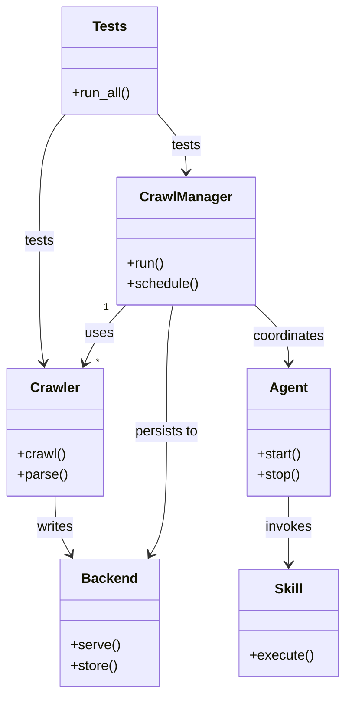

# Diagram: shipment_core/scheduled_services/config/config.staging.yml

> Auto-generated by Obscura crawlers

## Mermaid

### SVG

<svg id="container" width="400.978515625" xmlns="http://www.w3.org/2000/svg" class="classDiagram" height="814" viewBox="0 0 400.978515625 814" role="graphics-document document" aria-roledescription="class"><g><defs><marker id="container_class-aggregationStart" class="marker aggregation class" refX="18" refY="7" markerWidth="190" markerHeight="240" orient="auto"><path d="M 18,7 L9,13 L1,7 L9,1 Z"></path></marker></defs><defs><marker id="container_class-aggregationEnd" class="marker aggregation class" refX="1" refY="7" markerWidth="20" markerHeight="28" orient="auto"><path d="M 18,7 L9,13 L1,7 L9,1 Z"></path></marker></defs><defs><marker id="container_class-extensionStart" class="marker extension class" refX="18" refY="7" markerWidth="190" markerHeight="240" orient="auto"><path d="M 1,7 L18,13 V 1 Z"></path></marker></defs><defs><marker id="container_class-extensionEnd" class="marker extension class" refX="1" refY="7" markerWidth="20" markerHeight="28" orient="auto"><path d="M 1,1 V 13 L18,7 Z"></path></marker></defs><defs><marker id="container_class-compositionStart" class="marker composition class" refX="18" refY="7" markerWidth="190" markerHeight="240" orient="auto"><path d="M 18,7 L9,13 L1,7 L9,1 Z"></path></marker></defs><defs><marker id="container_class-compositionEnd" class="marker composition class" refX="1" refY="7" markerWidth="20" markerHeight="28" orient="auto"><path d="M 18,7 L9,13 L1,7 L9,1 Z"></path></marker></defs><defs><marker id="container_class-dependencyStart" class="marker dependency class" refX="6" refY="7" markerWidth="190" markerHeight="240" orient="auto"><path d="M 5,7 L9,13 L1,7 L9,1 Z"></path></marker></defs><defs><marker id="container_class-dependencyEnd" class="marker dependency class" refX="13" refY="7" markerWidth="20" markerHeight="28" orient="auto"><path d="M 18,7 L9,13 L14,7 L9,1 Z"></path></marker></defs><defs><marker id="container_class-lollipopStart" class="marker lollipop class" refX="13" refY="7" markerWidth="190" markerHeight="240" orient="auto"><circle stroke="black" fill="transparent" cx="7" cy="7" r="6"></circle></marker></defs><defs><marker id="container_class-lollipopEnd" class="marker lollipop class" refX="1" refY="7" markerWidth="190" markerHeight="240" orient="auto"><circle stroke="black" fill="transparent" cx="7" cy="7" r="6"></circle></marker></defs><g class="root"><g class="clusters"></g><g class="edgePaths"><path d="M145.078,358L139.394,364.167C133.711,370.333,122.344,382.667,114.419,394.08C106.494,405.494,102.011,415.988,99.769,421.235L97.528,426.482" id="id_CrawlManager_Crawler_1" class="edge-thickness-normal edge-pattern-solid relation" style=";;;" data-edge="true" data-et="edge" data-id="id_CrawlManager_Crawler_1" data-points="W3sieCI6MTQ1LjA3NzU0OTUyNTY2OTY0LCJ5IjozNTh9LHsieCI6MTEwLjk3NjU2MjUsInkiOjM5NX0seyJ4Ijo5NS4xNzEwMzc5NDY0Mjg1NywieSI6NDMyfV0=" marker-end="url(#container_class-dependencyEnd)"></path><path d="M200.195,358L199.043,364.167C197.892,370.333,195.588,382.667,194.437,407.5C193.285,432.333,193.285,469.667,193.285,507C193.285,544.333,193.285,581.667,190.154,605.639C187.024,629.611,180.762,640.222,177.632,645.527L174.501,650.833" id="id_CrawlManager_Backend_2" class="edge-thickness-normal edge-pattern-solid relation" style=";;;" data-edge="true" data-et="edge" data-id="id_CrawlManager_Backend_2" data-points="W3sieCI6MjAwLjE5NDkxMTQxMTgzMDM2LCJ5IjozNTh9LHsieCI6MTkzLjI4NTE1NjI1LCJ5IjozOTV9LHsieCI6MTkzLjI4NTE1NjI1LCJ5Ijo1MDd9LHsieCI6MTkzLjI4NTE1NjI1LCJ5Ijo2MTl9LHsieCI6MTcxLjQ1MTkwNDI5Njg3NSwieSI6NjU2fV0=" marker-end="url(#container_class-dependencyEnd)"></path><path d="M63.133,582L63.133,588.167C63.133,594.333,63.133,606.667,66.164,618.132C69.194,629.597,75.256,640.195,78.287,645.493L81.317,650.792" id="id_Crawler_Backend_3" class="edge-thickness-normal edge-pattern-solid relation" style=";;;" data-edge="true" data-et="edge" data-id="id_Crawler_Backend_3" data-points="W3sieCI6NjMuMTMyODEyNSwieSI6NTgyfSx7IngiOjYzLjEzMjgxMjUsInkiOjYxOX0seyJ4Ijo4NC4yOTYzMTY5NjQyODU3MiwieSI6NjU2fV0=" marker-end="url(#container_class-dependencyEnd)"></path><path d="M335.811,582L335.811,588.167C335.811,594.333,335.811,606.667,335.811,620C335.811,633.333,335.811,647.667,335.811,654.833L335.811,662" id="id_Agent_Skill_4" class="edge-thickness-normal edge-pattern-solid relation" style=";;;" data-edge="true" data-et="edge" data-id="id_Agent_Skill_4" data-points="W3sieCI6MzM1LjgxMDU0Njg3NSwieSI6NTgyfSx7IngiOjMzNS44MTA1NDY4NzUsInkiOjYxOX0seyJ4IjozMzUuODEwNTQ2ODc1LCJ5Ijo2Njh9XQ==" marker-end="url(#container_class-dependencyEnd)"></path><path d="M293.889,356.391L300.876,362.826C307.863,369.26,321.837,382.13,328.824,393.732C335.811,405.333,335.811,415.667,335.811,420.833L335.811,426" id="id_CrawlManager_Agent_5" class="edge-thickness-normal edge-pattern-solid relation" style=";;;" data-edge="true" data-et="edge" data-id="id_CrawlManager_Agent_5" data-points="W3sieCI6MjkzLjg4ODY3MTg3NSwieSI6MzU2LjM5MDcyMzM3MTQ1MDZ9LHsieCI6MzM1LjgxMDU0Njg3NSwieSI6Mzk1fSx7IngiOjMzNS44MTA1NDY4NzUsInkiOjQzMn1d" marker-end="url(#container_class-dependencyEnd)"></path><path d="M182.009,134L187.374,140.167C192.74,146.333,203.47,158.667,208.836,170C214.201,181.333,214.201,191.667,214.201,196.833L214.201,202" id="id_Tests_CrawlManager_6" class="edge-thickness-normal edge-pattern-solid relation" style=";;;" data-edge="true" data-et="edge" data-id="id_Tests_CrawlManager_6" data-points="W3sieCI6MTgyLjAwOTAwMzkwNjI1LCJ5IjoxMzR9LHsieCI6MjE0LjIwMTE3MTg3NSwieSI6MTcxfSx7IngiOjIxNC4yMDExNzE4NzUsInkiOjIwOH1d" marker-end="url(#container_class-dependencyEnd)"></path><path d="M75.341,134L70.265,140.167C65.19,146.333,55.038,158.667,49.962,183.5C44.887,208.333,44.887,245.667,44.887,283C44.887,320.333,44.887,357.667,45.731,381.513C46.574,405.359,48.262,415.719,49.106,420.898L49.95,426.078" id="id_Tests_Crawler_7" class="edge-thickness-normal edge-pattern-solid relation" style=";;;" data-edge="true" data-et="edge" data-id="id_Tests_Crawler_7" data-points="W3sieCI6NzUuMzQwODk4NDM3NSwieSI6MTM0fSx7IngiOjQ0Ljg4NjcxODc1LCJ5IjoxNzF9LHsieCI6NDQuODg2NzE4NzUsInkiOjI4M30seyJ4Ijo0NC44ODY3MTg3NSwieSI6Mzk1fSx7IngiOjUwLjkxNDQ0NjE0OTU1MzU3LCJ5Ijo0MzJ9XQ==" marker-end="url(#container_class-dependencyEnd)"></path></g><g class="edgeLabels"><g class="edgeLabel" transform="translate(114.39334, 391.29275)"><g class="label" data-id="id_CrawlManager_Crawler_1" transform="translate(-16.4921875, -12)"><foreignObject width="32.984375" height="24">

uses

</foreignObject></g></g><g class="edgeLabel" transform="translate(193.28515625, 507)"><g class="label" data-id="id_CrawlManager_Backend_2" transform="translate(-37.9921875, -12)"><foreignObject width="75.984375" height="24">

persists to

</foreignObject></g></g><g class="edgeLabel" transform="translate(63.1328125, 619)"><g class="label" data-id="id_Crawler_Backend_3" transform="translate(-21.9453125, -12)"><foreignObject width="43.890625" height="24">

writes

</foreignObject></g></g><g class="edgeLabel" transform="translate(335.810546875, 619)"><g class="label" data-id="id_Agent_Skill_4" transform="translate(-27.5859375, -12)"><foreignObject width="55.171875" height="24">

invokes

</foreignObject></g></g><g class="edgeLabel" transform="translate(335.810546875, 395)"><g class="label" data-id="id_CrawlManager_Agent_5" transform="translate(-42.8046875, -12)"><foreignObject width="85.609375" height="24">

coordinates

</foreignObject></g></g><g class="edgeLabel" transform="translate(214.201171875, 171)"><g class="label" data-id="id_Tests_CrawlManager_6" transform="translate(-17.4921875, -12)"><foreignObject width="34.984375" height="24">

tests

</foreignObject></g></g><g class="edgeLabel" transform="translate(44.88671875, 283)"><g class="label" data-id="id_Tests_Crawler_7" transform="translate(-17.4921875, -12)"><foreignObject width="34.984375" height="24">

tests

</foreignObject></g></g><g class="edgeTerminals" transform="translate(122.18767634282933, 360.70253111309466)"><g class="inner" transform="translate(0, 0)"><foreignObject style="width: 9px; height: 12px;">
1
</foreignObject></g></g><g class="edgeTerminals" transform="translate(110.83978720488726, 416.7993731829496)"><g class="inner" transform="translate(0, 0)"></g><foreignObject style="width: 9px; height: 12px;">
*
</foreignObject></g></g><g class="nodes"><g class="node default" id="classId-CrawlManager-0" transform="translate(214.201171875, 283)"><g class="basic label-container"><path d="M-79.6875 -75 L79.6875 -75 L79.6875 75 L-79.6875 75" stroke="none" stroke-width="0" fill="#ECECFF" style=""></path><path d="M-79.6875 -75 C-47.59038116004592 -75, -15.493262320091844 -75, 79.6875 -75 M-79.6875 -75 C-28.593350394917174 -75, 22.500799210165653 -75, 79.6875 -75 M79.6875 -75 C79.6875 -16.034771023902373, 79.6875 42.930457952195255, 79.6875 75 M79.6875 -75 C79.6875 -19.77997921660956, 79.6875 35.44004156678088, 79.6875 75 M79.6875 75 C25.785432785268092 75, -28.116634429463815 75, -79.6875 75 M79.6875 75 C27.662754329345994 75, -24.361991341308013 75, -79.6875 75 M-79.6875 75 C-79.6875 18.60675817429059, -79.6875 -37.78648365141882, -79.6875 -75 M-79.6875 75 C-79.6875 16.885181848476165, -79.6875 -41.22963630304767, -79.6875 -75" stroke="#9370DB" stroke-width="1.3" fill="none" stroke-dasharray="0 0" style=""></path></g><g class="annotation-group text" transform="translate(0, -51)"></g><g class="label-group text" transform="translate(-51.59375, -51)"><g class="label" style="font-weight: bolder" transform="translate(0,-12)"><foreignObject width="103.1875" height="24">

CrawlManager

</foreignObject></g></g><g class="members-group text" transform="translate(-67.6875, -3)"></g><g class="methods-group text" transform="translate(-67.6875, 27)"><g class="label" style="" transform="translate(0,-12)"><foreignObject width="43.21875" height="24">

+run()

</foreignObject></g><g class="label" style="" transform="translate(0,12)"><foreignObject width="83.78125" height="24">

+schedule()

</foreignObject></g></g><g class="divider" style=""><path d="M-79.6875 -27 C-34.96714155214295 -27, 9.753216895714104 -27, 79.6875 -27 M-79.6875 -27 C-30.47929228714998 -27, 18.728915425700038 -27, 79.6875 -27" stroke="#9370DB" stroke-width="1.3" fill="none" stroke-dasharray="0 0" style=""></path></g><g class="divider" style=""><path d="M-79.6875 -3 C-18.115336763070424 -3, 43.45682647385915 -3, 79.6875 -3 M-79.6875 -3 C-26.32261163035556 -3, 27.04227673928888 -3, 79.6875 -3" stroke="#9370DB" stroke-width="1.3" fill="none" stroke-dasharray="0 0" style=""></path></g></g><g class="node default" id="classId-Crawler-1" transform="translate(63.1328125, 507)"><g class="basic label-container"><path d="M-55.1328125 -75 L55.1328125 -75 L55.1328125 75 L-55.1328125 75" stroke="none" stroke-width="0" fill="#ECECFF" style=""></path><path d="M-55.1328125 -75 C-21.157949808566585 -75, 12.81691288286683 -75, 55.1328125 -75 M-55.1328125 -75 C-31.380138470847594 -75, -7.627464441695189 -75, 55.1328125 -75 M55.1328125 -75 C55.1328125 -32.978413040659916, 55.1328125 9.043173918680168, 55.1328125 75 M55.1328125 -75 C55.1328125 -20.99342585337717, 55.1328125 33.01314829324566, 55.1328125 75 M55.1328125 75 C26.96992335639335 75, -1.1929657872133035 75, -55.1328125 75 M55.1328125 75 C22.349610629954825 75, -10.433591240090351 75, -55.1328125 75 M-55.1328125 75 C-55.1328125 24.280276517400154, -55.1328125 -26.439446965199693, -55.1328125 -75 M-55.1328125 75 C-55.1328125 39.46902245927059, -55.1328125 3.9380449185411806, -55.1328125 -75" stroke="#9370DB" stroke-width="1.3" fill="none" stroke-dasharray="0 0" style=""></path></g><g class="annotation-group text" transform="translate(0, -51)"></g><g class="label-group text" transform="translate(-27.734375, -51)"><g class="label" style="font-weight: bolder" transform="translate(0,-12)"><foreignObject width="55.46875" height="24">

Crawler

</foreignObject></g></g><g class="members-group text" transform="translate(-43.1328125, -3)"></g><g class="methods-group text" transform="translate(-43.1328125, 27)"><g class="label" style="" transform="translate(0,-12)"><foreignObject width="56.40625" height="24">

+crawl()

</foreignObject></g><g class="label" style="" transform="translate(0,12)"><foreignObject width="58.53125" height="24">

+parse()

</foreignObject></g></g><g class="divider" style=""><path d="M-55.1328125 -27 C-32.581953704132715 -27, -10.03109490826543 -27, 55.1328125 -27 M-55.1328125 -27 C-15.47871585050521 -27, 24.17538079898958 -27, 55.1328125 -27" stroke="#9370DB" stroke-width="1.3" fill="none" stroke-dasharray="0 0" style=""></path></g><g class="divider" style=""><path d="M-55.1328125 -3 C-23.457831550098874 -3, 8.217149399802253 -3, 55.1328125 -3 M-55.1328125 -3 C-13.110755027079165 -3, 28.91130244584167 -3, 55.1328125 -3" stroke="#9370DB" stroke-width="1.3" fill="none" stroke-dasharray="0 0" style=""></path></g></g><g class="node default" id="classId-Backend-2" transform="translate(127.1953125, 731)"><g class="basic label-container"><path d="M-56.2734375 -75 L56.2734375 -75 L56.2734375 75 L-56.2734375 75" stroke="none" stroke-width="0" fill="#ECECFF" style=""></path><path d="M-56.2734375 -75 C-19.84772020161968 -75, 16.57799709676064 -75, 56.2734375 -75 M-56.2734375 -75 C-28.64564066715579 -75, -1.0178438343115772 -75, 56.2734375 -75 M56.2734375 -75 C56.2734375 -41.56536019395585, 56.2734375 -8.130720387911694, 56.2734375 75 M56.2734375 -75 C56.2734375 -27.554999466037337, 56.2734375 19.890001067925326, 56.2734375 75 M56.2734375 75 C23.687948368280374 75, -8.897540763439252 75, -56.2734375 75 M56.2734375 75 C18.643918887603704 75, -18.985599724792593 75, -56.2734375 75 M-56.2734375 75 C-56.2734375 19.334748659449325, -56.2734375 -36.33050268110135, -56.2734375 -75 M-56.2734375 75 C-56.2734375 27.856324089008524, -56.2734375 -19.287351821982952, -56.2734375 -75" stroke="#9370DB" stroke-width="1.3" fill="none" stroke-dasharray="0 0" style=""></path></g><g class="annotation-group text" transform="translate(0, -51)"></g><g class="label-group text" transform="translate(-31.296875, -51)"><g class="label" style="font-weight: bolder" transform="translate(0,-12)"><foreignObject width="62.59375" height="24">

Backend

</foreignObject></g></g><g class="members-group text" transform="translate(-44.2734375, -3)"></g><g class="methods-group text" transform="translate(-44.2734375, 27)"><g class="label" style="" transform="translate(0,-12)"><foreignObject width="57.25" height="24">

+serve()

</foreignObject></g><g class="label" style="" transform="translate(0,12)"><foreignObject width="55.125" height="24">

+store()

</foreignObject></g></g><g class="divider" style=""><path d="M-56.2734375 -27 C-23.268147568589356 -27, 9.737142362821288 -27, 56.2734375 -27 M-56.2734375 -27 C-21.260357921684765 -27, 13.75272165663047 -27, 56.2734375 -27" stroke="#9370DB" stroke-width="1.3" fill="none" stroke-dasharray="0 0" style=""></path></g><g class="divider" style=""><path d="M-56.2734375 -3 C-26.600658583733175 -3, 3.0721203325336504 -3, 56.2734375 -3 M-56.2734375 -3 C-12.375855186987906 -3, 31.52172712602419 -3, 56.2734375 -3" stroke="#9370DB" stroke-width="1.3" fill="none" stroke-dasharray="0 0" style=""></path></g></g><g class="node default" id="classId-Agent-3" transform="translate(335.810546875, 507)"><g class="basic label-container"><path d="M-48.6171875 -75 L48.6171875 -75 L48.6171875 75 L-48.6171875 75" stroke="none" stroke-width="0" fill="#ECECFF" style=""></path><path d="M-48.6171875 -75 C-22.869131177255003 -75, 2.878925145489994 -75, 48.6171875 -75 M-48.6171875 -75 C-25.979512608013675 -75, -3.3418377160273494 -75, 48.6171875 -75 M48.6171875 -75 C48.6171875 -39.58918618840721, 48.6171875 -4.178372376814423, 48.6171875 75 M48.6171875 -75 C48.6171875 -28.005451048715493, 48.6171875 18.989097902569014, 48.6171875 75 M48.6171875 75 C29.138768756709297 75, 9.660350013418594 75, -48.6171875 75 M48.6171875 75 C22.377837113222924 75, -3.861513273554152 75, -48.6171875 75 M-48.6171875 75 C-48.6171875 24.016060784494563, -48.6171875 -26.967878431010874, -48.6171875 -75 M-48.6171875 75 C-48.6171875 20.463015987994552, -48.6171875 -34.073968024010895, -48.6171875 -75" stroke="#9370DB" stroke-width="1.3" fill="none" stroke-dasharray="0 0" style=""></path></g><g class="annotation-group text" transform="translate(0, -51)"></g><g class="label-group text" transform="translate(-21.078125, -51)"><g class="label" style="font-weight: bolder" transform="translate(0,-12)"><foreignObject width="42.15625" height="24">

Agent

</foreignObject></g></g><g class="members-group text" transform="translate(-36.6171875, -3)"></g><g class="methods-group text" transform="translate(-36.6171875, 27)"><g class="label" style="" transform="translate(0,-12)"><foreignObject width="52.15625" height="24">

+start()

</foreignObject></g><g class="label" style="" transform="translate(0,12)"><foreignObject width="50.21875" height="24">

+stop()

</foreignObject></g></g><g class="divider" style=""><path d="M-48.6171875 -27 C-22.480948322034553 -27, 3.655290855930893 -27, 48.6171875 -27 M-48.6171875 -27 C-21.44066024049295 -27, 5.735867019014101 -27, 48.6171875 -27" stroke="#9370DB" stroke-width="1.3" fill="none" stroke-dasharray="0 0" style=""></path></g><g class="divider" style=""><path d="M-48.6171875 -3 C-14.567938066020915 -3, 19.48131136795817 -3, 48.6171875 -3 M-48.6171875 -3 C-20.166255953481258 -3, 8.284675593037484 -3, 48.6171875 -3" stroke="#9370DB" stroke-width="1.3" fill="none" stroke-dasharray="0 0" style=""></path></g></g><g class="node default" id="classId-Skill-4" transform="translate(335.810546875, 731)"><g class="basic label-container"><path d="M-57.16796875 -63 L57.16796875 -63 L57.16796875 63 L-57.16796875 63" stroke="none" stroke-width="0" fill="#ECECFF" style=""></path><path d="M-57.16796875 -63 C-12.676372437862057 -63, 31.815223874275887 -63, 57.16796875 -63 M-57.16796875 -63 C-15.043476626254595 -63, 27.08101549749081 -63, 57.16796875 -63 M57.16796875 -63 C57.16796875 -23.466918730831203, 57.16796875 16.066162538337593, 57.16796875 63 M57.16796875 -63 C57.16796875 -21.912683875301077, 57.16796875 19.174632249397845, 57.16796875 63 M57.16796875 63 C28.42733491591286 63, -0.3132989181742829 63, -57.16796875 63 M57.16796875 63 C20.27314905627044 63, -16.62167063745912 63, -57.16796875 63 M-57.16796875 63 C-57.16796875 12.66853438878509, -57.16796875 -37.66293122242982, -57.16796875 -63 M-57.16796875 63 C-57.16796875 36.003699217056976, -57.16796875 9.007398434113945, -57.16796875 -63" stroke="#9370DB" stroke-width="1.3" fill="none" stroke-dasharray="0 0" style=""></path></g><g class="annotation-group text" transform="translate(0, -39)"></g><g class="label-group text" transform="translate(-16.0078125, -39)"><g class="label" style="font-weight: bolder" transform="translate(0,-12)"><foreignObject width="32.015625" height="24">

Skill

</foreignObject></g></g><g class="members-group text" transform="translate(-45.16796875, 9)"></g><g class="methods-group text" transform="translate(-45.16796875, 39)"><g class="label" style="" transform="translate(0,-12)"><foreignObject width="74.328125" height="24">

+execute()

</foreignObject></g></g><g class="divider" style=""><path d="M-57.16796875 -15 C-16.832500444740447 -15, 23.502967860519107 -15, 57.16796875 -15 M-57.16796875 -15 C-23.825904607508726 -15, 9.516159534982549 -15, 57.16796875 -15" stroke="#9370DB" stroke-width="1.3" fill="none" stroke-dasharray="0 0" style=""></path></g><g class="divider" style=""><path d="M-57.16796875 9 C-17.804593829817804 9, 21.55878109036439 9, 57.16796875 9 M-57.16796875 9 C-17.04921097084469 9, 23.06954680831062 9, 57.16796875 9" stroke="#9370DB" stroke-width="1.3" fill="none" stroke-dasharray="0 0" style=""></path></g></g><g class="node default" id="classId-Tests-5" transform="translate(127.1953125, 71)"><g class="basic label-container"><path d="M-56.12890625 -63 L56.12890625 -63 L56.12890625 63 L-56.12890625 63" stroke="none" stroke-width="0" fill="#ECECFF" style=""></path><path d="M-56.12890625 -63 C-21.01063395100436 -63, 14.107638347991283 -63, 56.12890625 -63 M-56.12890625 -63 C-11.845364220387644 -63, 32.43817780922471 -63, 56.12890625 -63 M56.12890625 -63 C56.12890625 -23.340592238980697, 56.12890625 16.318815522038605, 56.12890625 63 M56.12890625 -63 C56.12890625 -34.43121038831357, 56.12890625 -5.862420776627154, 56.12890625 63 M56.12890625 63 C28.3263243019911 63, 0.5237423539822004 63, -56.12890625 63 M56.12890625 63 C25.63299056787881 63, -4.86292511424238 63, -56.12890625 63 M-56.12890625 63 C-56.12890625 16.67545464689546, -56.12890625 -29.64909070620908, -56.12890625 -63 M-56.12890625 63 C-56.12890625 30.035607450301697, -56.12890625 -2.928785099396606, -56.12890625 -63" stroke="#9370DB" stroke-width="1.3" fill="none" stroke-dasharray="0 0" style=""></path></g><g class="annotation-group text" transform="translate(0, -39)"></g><g class="label-group text" transform="translate(-19.1171875, -39)"><g class="label" style="font-weight: bolder" transform="translate(0,-12)"><foreignObject width="38.234375" height="24">

Tests

</foreignObject></g></g><g class="members-group text" transform="translate(-44.12890625, 9)"></g><g class="methods-group text" transform="translate(-44.12890625, 39)"><g class="label" style="" transform="translate(0,-12)"><foreignObject width="69.140625" height="24">

+run_all()

</foreignObject></g></g><g class="divider" style=""><path d="M-56.12890625 -15 C-22.74714735799116 -15, 10.63461153401768 -15, 56.12890625 -15 M-56.12890625 -15 C-32.55689768598822 -15, -8.984889121976437 -15, 56.12890625 -15" stroke="#9370DB" stroke-width="1.3" fill="none" stroke-dasharray="0 0" style=""></path></g><g class="divider" style=""><path d="M-56.12890625 9 C-25.314409603491157 9, 5.500087043017686 9, 56.12890625 9 M-56.12890625 9 C-27.44758700832825 9, 1.2337322333435026 9, 56.12890625 9" stroke="#9370DB" stroke-width="1.3" fill="none" stroke-dasharray="0 0" style=""></path></g></g></g></g></g></svg>
