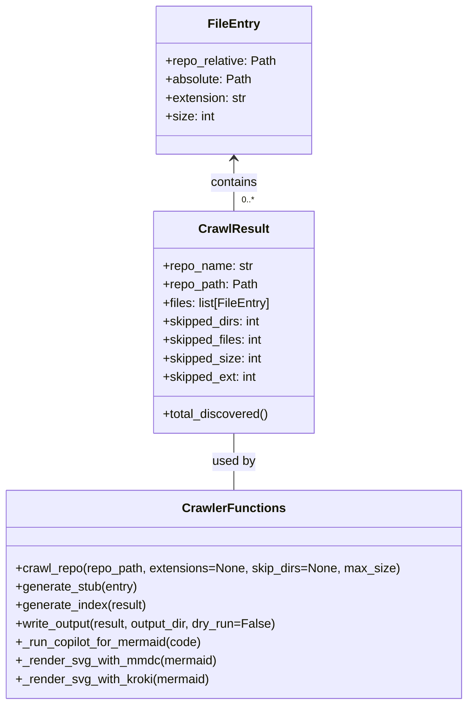

# Diagram: shipment_core/scheduled_services/config/config.test.yml


> Auto-generated by Obscura crawlers

## Diagram 1



### SVG

<svg id="container" width="601.046875" xmlns="http://www.w3.org/2000/svg" class="classDiagram" height="914" viewBox="0 0 601.046875 914" role="graphics-document document" aria-roledescription="class"><style>#container{font-family:"trebuchet ms",verdana,arial,sans-serif;font-size:16px;fill:#333;}@keyframes edge-animation-frame{from{stroke-dashoffset:0;}}@keyframes dash{to{stroke-dashoffset:0;}}#container .edge-animation-slow{stroke-dasharray:9,5!important;stroke-dashoffset:900;animation:dash 50s linear infinite;stroke-linecap:round;}#container .edge-animation-fast{stroke-dasharray:9,5!important;stroke-dashoffset:900;animation:dash 20s linear infinite;stroke-linecap:round;}#container .error-icon{fill:#552222;}#container .error-text{fill:#552222;stroke:#552222;}#container .edge-thickness-normal{stroke-width:1px;}#container .edge-thickness-thick{stroke-width:3.5px;}#container .edge-pattern-solid{stroke-dasharray:0;}#container .edge-thickness-invisible{stroke-width:0;fill:none;}#container .edge-pattern-dashed{stroke-dasharray:3;}#container .edge-pattern-dotted{stroke-dasharray:2;}#container .marker{fill:#333333;stroke:#333333;}#container .marker.cross{stroke:#333333;}#container svg{font-family:"trebuchet ms",verdana,arial,sans-serif;font-size:16px;}#container p{margin:0;}#container g.classGroup text{fill:#9370DB;stroke:none;font-family:"trebuchet ms",verdana,arial,sans-serif;font-size:10px;}#container g.classGroup text .title{font-weight:bolder;}#container .nodeLabel,#container .edgeLabel{color:#131300;}#container .edgeLabel .label rect{fill:#ECECFF;}#container .label text{fill:#131300;}#container .labelBkg{background:#ECECFF;}#container .edgeLabel .label span{background:#ECECFF;}#container .classTitle{font-weight:bolder;}#container .node rect,#container .node circle,#container .node ellipse,#container .node polygon,#container .node path{fill:#ECECFF;stroke:#9370DB;stroke-width:1px;}#container .divider{stroke:#9370DB;stroke-width:1;}#container g.clickable{cursor:pointer;}#container g.classGroup rect{fill:#ECECFF;stroke:#9370DB;}#container g.classGroup line{stroke:#9370DB;stroke-width:1;}#container .classLabel .box{stroke:none;stroke-width:0;fill:#ECECFF;opacity:0.5;}#container .classLabel .label{fill:#9370DB;font-size:10px;}#container .relation{stroke:#333333;stroke-width:1;fill:none;}#container .dashed-line{stroke-dasharray:3;}#container .dotted-line{stroke-dasharray:1 2;}#container #compositionStart,#container .composition{fill:#333333!important;stroke:#333333!important;stroke-width:1;}#container #compositionEnd,#container .composition{fill:#333333!important;stroke:#333333!important;stroke-width:1;}#container #dependencyStart,#container .dependency{fill:#333333!important;stroke:#333333!important;stroke-width:1;}#container #dependencyStart,#container .dependency{fill:#333333!important;stroke:#333333!important;stroke-width:1;}#container #extensionStart,#container .extension{fill:transparent!important;stroke:#333333!important;stroke-width:1;}#container #extensionEnd,#container .extension{fill:transparent!important;stroke:#333333!important;stroke-width:1;}#container #aggregationStart,#container .aggregation{fill:transparent!important;stroke:#333333!important;stroke-width:1;}#container #aggregationEnd,#container .aggregation{fill:transparent!important;stroke:#333333!important;stroke-width:1;}#container #lollipopStart,#container .lollipop{fill:#ECECFF!important;stroke:#333333!important;stroke-width:1;}#container #lollipopEnd,#container .lollipop{fill:#ECECFF!important;stroke:#333333!important;stroke-width:1;}#container .edgeTerminals{font-size:11px;line-height:initial;}#container .classTitleText{text-anchor:middle;font-size:18px;fill:#333;}#container .label-icon{display:inline-block;height:1em;overflow:visible;vertical-align:-0.125em;}#container .node .label-icon path{fill:currentColor;stroke:revert;stroke-width:revert;}#container :root{--mermaid-font-family:"trebuchet ms",verdana,arial,sans-serif;}</style><g><defs><marker id="container_class-aggregationStart" class="marker aggregation class" refX="18" refY="7" markerWidth="190" markerHeight="240" orient="auto"><path d="M 18,7 L9,13 L1,7 L9,1 Z"></path></marker></defs><defs><marker id="container_class-aggregationEnd" class="marker aggregation class" refX="1" refY="7" markerWidth="20" markerHeight="28" orient="auto"><path d="M 18,7 L9,13 L1,7 L9,1 Z"></path></marker></defs><defs><marker id="container_class-extensionStart" class="marker extension class" refX="18" refY="7" markerWidth="190" markerHeight="240" orient="auto"><path d="M 1,7 L18,13 V 1 Z"></path></marker></defs><defs><marker id="container_class-extensionEnd" class="marker extension class" refX="1" refY="7" markerWidth="20" markerHeight="28" orient="auto"><path d="M 1,1 V 13 L18,7 Z"></path></marker></defs><defs><marker id="container_class-compositionStart" class="marker composition class" refX="18" refY="7" markerWidth="190" markerHeight="240" orient="auto"><path d="M 18,7 L9,13 L1,7 L9,1 Z"></path></marker></defs><defs><marker id="container_class-compositionEnd" class="marker composition class" refX="1" refY="7" markerWidth="20" markerHeight="28" orient="auto"><path d="M 18,7 L9,13 L1,7 L9,1 Z"></path></marker></defs><defs><marker id="container_class-dependencyStart" class="marker dependency class" refX="6" refY="7" markerWidth="190" markerHeight="240" orient="auto"><path d="M 5,7 L9,13 L1,7 L9,1 Z"></path></marker></defs><defs><marker id="container_class-dependencyEnd" class="marker dependency class" refX="13" refY="7" markerWidth="20" markerHeight="28" orient="auto"><path d="M 18,7 L9,13 L14,7 L9,1 Z"></path></marker></defs><defs><marker id="container_class-lollipopStart" class="marker lollipop class" refX="13" refY="7" markerWidth="190" markerHeight="240" orient="auto"><circle stroke="black" fill="transparent" cx="7" cy="7" r="6"></circle></marker></defs><defs><marker id="container_class-lollipopEnd" class="marker lollipop class" refX="1" refY="7" markerWidth="190" markerHeight="240" orient="auto"><circle stroke="black" fill="transparent" cx="7" cy="7" r="6"></circle></marker></defs><g class="root"><g class="clusters"></g><g class="edgePaths"><path d="M300.523,206L300.523,211.167C300.523,216.333,300.523,226.667,300.523,238C300.523,249.333,300.523,261.667,300.523,267.833L300.523,274" id="id_FileEntry_CrawlResult_1" class="edge-thickness-normal edge-pattern-solid relation" style=";;;" data-edge="true" data-et="edge" data-id="id_FileEntry_CrawlResult_1" data-points="W3sieCI6MzAwLjUyMzQzNzUsInkiOjIwMH0seyJ4IjozMDAuNTIzNDM3NSwieSI6MjM3fSx7IngiOjMwMC41MjM0Mzc1LCJ5IjoyNzR9XQ==" marker-start="url(#container_class-dependencyStart)"></path><path d="M300.523,562L300.523,568.167C300.523,574.333,300.523,586.667,300.523,599C300.523,611.333,300.523,623.667,300.523,629.833L300.523,636" id="id_CrawlResult_CrawlerFunctions_2" class="edge-thickness-normal edge-pattern-solid relation" style=";;;" data-edge="true" data-et="edge" data-id="id_CrawlResult_CrawlerFunctions_2" data-points="W3sieCI6MzAwLjUyMzQzNzUsInkiOjU2Mn0seyJ4IjozMDAuNTIzNDM3NSwieSI6NTk5fSx7IngiOjMwMC41MjM0Mzc1LCJ5Ijo2MzZ9XQ=="></path></g><g class="edgeLabels"><g class="edgeLabel" transform="translate(300.5234375, 237)"><g class="label" data-id="id_FileEntry_CrawlResult_1" transform="translate(-30.890625, -12)"><foreignObject width="61.78125" height="24"><div xmlns="http://www.w3.org/1999/xhtml" class="labelBkg" style="display: table-cell; white-space: nowrap; line-height: 1.5; max-width: 200px; text-align: center;"><span class="edgeLabel"><p>contains</p></span></div></foreignObject></g></g><g class="edgeLabel" transform="translate(300.5234375, 599)"><g class="label" data-id="id_CrawlResult_CrawlerFunctions_2" transform="translate(-28.3125, -12)"><foreignObject width="56.625" height="24"><div xmlns="http://www.w3.org/1999/xhtml" class="labelBkg" style="display: table-cell; white-space: nowrap; line-height: 1.5; max-width: 200px; text-align: center;"><span class="edgeLabel"><p>used by</p></span></div></foreignObject></g></g><g class="edgeTerminals" transform="translate(310.5234387499999, 251.50000107142858)"><g class="inner" transform="translate(0, 0)"></g><foreignObject style="width: 36px; height: 12px;"><div xmlns="http://www.w3.org/1999/xhtml" style="display: inline-block; padding-right: 1px; white-space: nowrap;"><span class="edgeLabel">0..*</span></div></foreignObject></g></g><g class="nodes"><g class="node default" id="classId-FileEntry-0" transform="translate(300.5234375, 104)"><g class="basic label-container"><path d="M-100.0078125 -96 L100.0078125 -96 L100.0078125 96 L-100.0078125 96" stroke="none" stroke-width="0" fill="#ECECFF" style=""></path><path d="M-100.0078125 -96 C-38.619700359262474 -96, 22.768411781475052 -96, 100.0078125 -96 M-100.0078125 -96 C-56.48410562484964 -96, -12.96039874969928 -96, 100.0078125 -96 M100.0078125 -96 C100.0078125 -21.990338067337746, 100.0078125 52.01932386532451, 100.0078125 96 M100.0078125 -96 C100.0078125 -40.9683880907253, 100.0078125 14.063223818549403, 100.0078125 96 M100.0078125 96 C58.65345459472739 96, 17.299096689454785 96, -100.0078125 96 M100.0078125 96 C27.74162278812632 96, -44.52456692374736 96, -100.0078125 96 M-100.0078125 96 C-100.0078125 19.634746262573657, -100.0078125 -56.730507474852686, -100.0078125 -96 M-100.0078125 96 C-100.0078125 20.983224244005385, -100.0078125 -54.03355151198923, -100.0078125 -96" stroke="#9370DB" stroke-width="1.3" fill="none" stroke-dasharray="0 0" style=""></path></g><g class="annotation-group text" transform="translate(0, -72)"></g><g class="label-group text" transform="translate(-31.859375, -72)"><g class="label" style="font-weight: bolder" transform="translate(0,-12)"><foreignObject width="63.71875" height="24"><div xmlns="http://www.w3.org/1999/xhtml" style="display: table-cell; white-space: nowrap; line-height: 1.5; max-width: 113px; text-align: center;"><span class="nodeLabel markdown-node-label" style=""><p>FileEntry</p></span></div></foreignObject></g></g><g class="members-group text" transform="translate(-88.0078125, -24)"><g class="label" style="" transform="translate(0,-12)"><foreignObject width="144.15625" height="24"><div xmlns="http://www.w3.org/1999/xhtml" style="display: table-cell; white-space: nowrap; line-height: 1.5; max-width: 202px; text-align: center;"><span class="nodeLabel markdown-node-label" style=""><p>+repo_relative: Path</p></span></div></foreignObject></g><g class="label" style="" transform="translate(0,12)"><foreignObject width="111.390625" height="24"><div xmlns="http://www.w3.org/1999/xhtml" style="display: table-cell; white-space: nowrap; line-height: 1.5; max-width: 169px; text-align: center;"><span class="nodeLabel markdown-node-label" style=""><p>+absolute: Path</p></span></div></foreignObject></g><g class="label" style="" transform="translate(0,36)"><foreignObject width="106.171875" height="24"><div xmlns="http://www.w3.org/1999/xhtml" style="display: table-cell; white-space: nowrap; line-height: 1.5; max-width: 164px; text-align: center;"><span class="nodeLabel markdown-node-label" style=""><p>+extension: str</p></span></div></foreignObject></g><g class="label" style="" transform="translate(0,60)"><foreignObject width="63.3125" height="24"><div xmlns="http://www.w3.org/1999/xhtml" style="display: table-cell; white-space: nowrap; line-height: 1.5; max-width: 121px; text-align: center;"><span class="nodeLabel markdown-node-label" style=""><p>+size: int</p></span></div></foreignObject></g></g><g class="methods-group text" transform="translate(-88.0078125, 96)"></g><g class="divider" style=""><path d="M-100.0078125 -48 C-33.13461327281087 -48, 33.738585954378266 -48, 100.0078125 -48 M-100.0078125 -48 C-29.815422143752087 -48, 40.376968212495825 -48, 100.0078125 -48" stroke="#9370DB" stroke-width="1.3" fill="none" stroke-dasharray="0 0" style=""></path></g><g class="divider" style=""><path d="M-100.0078125 72 C-58.921625166002585 72, -17.83543783200517 72, 100.0078125 72 M-100.0078125 72 C-56.000846857981216 72, -11.993881215962432 72, 100.0078125 72" stroke="#9370DB" stroke-width="1.3" fill="none" stroke-dasharray="0 0" style=""></path></g></g><g class="node default" id="classId-CrawlResult-1" transform="translate(300.5234375, 418)"><g class="basic label-container"><path d="M-104.296875 -144 L104.296875 -144 L104.296875 144 L-104.296875 144" stroke="none" stroke-width="0" fill="#ECECFF" style=""></path><path d="M-104.296875 -144 C-57.10895658871038 -144, -9.921038177420755 -144, 104.296875 -144 M-104.296875 -144 C-36.766526291571424 -144, 30.763822416857153 -144, 104.296875 -144 M104.296875 -144 C104.296875 -55.915855451125864, 104.296875 32.16828909774827, 104.296875 144 M104.296875 -144 C104.296875 -70.61351608092885, 104.296875 2.772967838142307, 104.296875 144 M104.296875 144 C42.720786002095224 144, -18.855302995809552 144, -104.296875 144 M104.296875 144 C25.074882150009017 144, -54.147110699981965 144, -104.296875 144 M-104.296875 144 C-104.296875 38.235474141667225, -104.296875 -67.52905171666555, -104.296875 -144 M-104.296875 144 C-104.296875 76.60514283336948, -104.296875 9.210285666738969, -104.296875 -144" stroke="#9370DB" stroke-width="1.3" fill="none" stroke-dasharray="0 0" style=""></path></g><g class="annotation-group text" transform="translate(0, -120)"></g><g class="label-group text" transform="translate(-43.28125, -120)"><g class="label" style="font-weight: bolder" transform="translate(0,-12)"><foreignObject width="86.5625" height="24"><div xmlns="http://www.w3.org/1999/xhtml" style="display: table-cell; white-space: nowrap; line-height: 1.5; max-width: 135px; text-align: center;"><span class="nodeLabel markdown-node-label" style=""><p>CrawlResult</p></span></div></foreignObject></g></g><g class="members-group text" transform="translate(-92.296875, -72)"><g class="label" style="" transform="translate(0,-12)"><foreignObject width="117.265625" height="24"><div xmlns="http://www.w3.org/1999/xhtml" style="display: table-cell; white-space: nowrap; line-height: 1.5; max-width: 175px; text-align: center;"><span class="nodeLabel markdown-node-label" style=""><p>+repo_name: str</p></span></div></foreignObject></g><g class="label" style="" transform="translate(0,12)"><foreignObject width="122.8125" height="24"><div xmlns="http://www.w3.org/1999/xhtml" style="display: table-cell; white-space: nowrap; line-height: 1.5; max-width: 180px; text-align: center;"><span class="nodeLabel markdown-node-label" style=""><p>+repo_path: Path</p></span></div></foreignObject></g><g class="label" style="" transform="translate(0,36)"><foreignObject width="141.3125" height="24"><div xmlns="http://www.w3.org/1999/xhtml" style="display: table-cell; white-space: nowrap; line-height: 1.5; max-width: 199px; text-align: center;"><span class="nodeLabel markdown-node-label" style=""><p>+files: list[FileEntry]</p></span></div></foreignObject></g><g class="label" style="" transform="translate(0,60)"><foreignObject width="128.703125" height="24"><div xmlns="http://www.w3.org/1999/xhtml" style="display: table-cell; white-space: nowrap; line-height: 1.5; max-width: 186px; text-align: center;"><span class="nodeLabel markdown-node-label" style=""><p>+skipped_dirs: int</p></span></div></foreignObject></g><g class="label" style="" transform="translate(0,84)"><foreignObject width="131.203125" height="24"><div xmlns="http://www.w3.org/1999/xhtml" style="display: table-cell; white-space: nowrap; line-height: 1.5; max-width: 189px; text-align: center;"><span class="nodeLabel markdown-node-label" style=""><p>+skipped_files: int</p></span></div></foreignObject></g><g class="label" style="" transform="translate(0,108)"><foreignObject width="129.109375" height="24"><div xmlns="http://www.w3.org/1999/xhtml" style="display: table-cell; white-space: nowrap; line-height: 1.5; max-width: 187px; text-align: center;"><span class="nodeLabel markdown-node-label" style=""><p>+skipped_size: int</p></span></div></foreignObject></g><g class="label" style="" transform="translate(0,132)"><foreignObject width="123.390625" height="24"><div xmlns="http://www.w3.org/1999/xhtml" style="display: table-cell; white-space: nowrap; line-height: 1.5; max-width: 181px; text-align: center;"><span class="nodeLabel markdown-node-label" style=""><p>+skipped_ext: int</p></span></div></foreignObject></g></g><g class="methods-group text" transform="translate(-92.296875, 120)"><g class="label" style="" transform="translate(0,-12)"><foreignObject width="138.734375" height="24"><div xmlns="http://www.w3.org/1999/xhtml" style="display: table-cell; white-space: nowrap; line-height: 1.5; max-width: 196px; text-align: center;"><span class="nodeLabel markdown-node-label" style=""><p>+total_discovered()</p></span></div></foreignObject></g></g><g class="divider" style=""><path d="M-104.296875 -96 C-21.481062465755045 -96, 61.33475006848991 -96, 104.296875 -96 M-104.296875 -96 C-49.482370831812716 -96, 5.332133336374568 -96, 104.296875 -96" stroke="#9370DB" stroke-width="1.3" fill="none" stroke-dasharray="0 0" style=""></path></g><g class="divider" style=""><path d="M-104.296875 96 C-29.6517355238897 96, 44.9934039522206 96, 104.296875 96 M-104.296875 96 C-31.251445062704477 96, 41.79398487459105 96, 104.296875 96" stroke="#9370DB" stroke-width="1.3" fill="none" stroke-dasharray="0 0" style=""></path></g></g><g class="node default" id="classId-CrawlerFunctions-2" transform="translate(300.5234375, 771)"><g class="basic label-container"><path d="M-292.5234375 -135 L292.5234375 -135 L292.5234375 135 L-292.5234375 135" stroke="none" stroke-width="0" fill="#ECECFF" style=""></path><path d="M-292.5234375 -135 C-164.88965419345828 -135, -37.25587088691654 -135, 292.5234375 -135 M-292.5234375 -135 C-123.94286751028284 -135, 44.637702479434324 -135, 292.5234375 -135 M292.5234375 -135 C292.5234375 -50.07929221291485, 292.5234375 34.8414155741703, 292.5234375 135 M292.5234375 -135 C292.5234375 -28.39943359626588, 292.5234375 78.20113280746824, 292.5234375 135 M292.5234375 135 C149.3934713738933 135, 6.263505247786611 135, -292.5234375 135 M292.5234375 135 C174.77454856715653 135, 57.02565963431306 135, -292.5234375 135 M-292.5234375 135 C-292.5234375 65.09481026888085, -292.5234375 -4.810379462238302, -292.5234375 -135 M-292.5234375 135 C-292.5234375 49.388386862879386, -292.5234375 -36.22322627424123, -292.5234375 -135" stroke="#9370DB" stroke-width="1.3" fill="none" stroke-dasharray="0 0" style=""></path></g><g class="annotation-group text" transform="translate(0, -111)"></g><g class="label-group text" transform="translate(-62.859375, -111)"><g class="label" style="font-weight: bolder" transform="translate(0,-12)"><foreignObject width="125.71875" height="24"><div xmlns="http://www.w3.org/1999/xhtml" style="display: table-cell; white-space: nowrap; line-height: 1.5; max-width: 174px; text-align: center;"><span class="nodeLabel markdown-node-label" style=""><p>CrawlerFunctions</p></span></div></foreignObject></g></g><g class="members-group text" transform="translate(-280.5234375, -63)"></g><g class="methods-group text" transform="translate(-280.5234375, -33)"><g class="label" style="" transform="translate(0,-12)"><foreignObject width="498.1875" height="24"><div xmlns="http://www.w3.org/1999/xhtml" style="display: table-cell; white-space: nowrap; line-height: 1.5; max-width: 556px; text-align: center;"><span class="nodeLabel markdown-node-label" style=""><p>+crawl_repo(repo_path, extensions=None, skip_dirs=None, max_size)</p></span></div></foreignObject></g><g class="label" style="" transform="translate(0,12)"><foreignObject width="159.796875" height="24"><div xmlns="http://www.w3.org/1999/xhtml" style="display: table-cell; white-space: nowrap; line-height: 1.5; max-width: 217px; text-align: center;"><span class="nodeLabel markdown-node-label" style=""><p>+generate_stub(entry)</p></span></div></foreignObject></g><g class="label" style="" transform="translate(0,36)"><foreignObject width="171.265625" height="24"><div xmlns="http://www.w3.org/1999/xhtml" style="display: table-cell; white-space: nowrap; line-height: 1.5; max-width: 229px; text-align: center;"><span class="nodeLabel markdown-node-label" style=""><p>+generate_index(result)</p></span></div></foreignObject></g><g class="label" style="" transform="translate(0,60)"><foreignObject width="346.015625" height="24"><div xmlns="http://www.w3.org/1999/xhtml" style="display: table-cell; white-space: nowrap; line-height: 1.5; max-width: 403px; text-align: center;"><span class="nodeLabel markdown-node-label" style=""><p>+write_output(result, output_dir, dry_run=False)</p></span></div></foreignObject></g><g class="label" style="" transform="translate(0,84)"><foreignObject width="244.5" height="24"><div xmlns="http://www.w3.org/1999/xhtml" style="display: table-cell; white-space: nowrap; line-height: 1.5; max-width: 302px; text-align: center;"><span class="nodeLabel markdown-node-label" style=""><p>+_run_copilot_for_mermaid(code)</p></span></div></foreignObject></g><g class="label" style="" transform="translate(0,108)"><foreignObject width="261.328125" height="24"><div xmlns="http://www.w3.org/1999/xhtml" style="display: table-cell; white-space: nowrap; line-height: 1.5; max-width: 319px; text-align: center;"><span class="nodeLabel markdown-node-label" style=""><p>+_render_svg_with_mmdc(mermaid)</p></span></div></foreignObject></g><g class="label" style="" transform="translate(0,132)"><foreignObject width="252.609375" height="24"><div xmlns="http://www.w3.org/1999/xhtml" style="display: table-cell; white-space: nowrap; line-height: 1.5; max-width: 310px; text-align: center;"><span class="nodeLabel markdown-node-label" style=""><p>+_render_svg_with_kroki(mermaid)</p></span></div></foreignObject></g></g><g class="divider" style=""><path d="M-292.5234375 -87 C-128.2441729343517 -87, 36.03509163129661 -87, 292.5234375 -87 M-292.5234375 -87 C-127.0308336376317 -87, 38.4617702247366 -87, 292.5234375 -87" stroke="#9370DB" stroke-width="1.3" fill="none" stroke-dasharray="0 0" style=""></path></g><g class="divider" style=""><path d="M-292.5234375 -63 C-113.93857970067839 -63, 64.64627809864322 -63, 292.5234375 -63 M-292.5234375 -63 C-66.41677326689219 -63, 159.68989096621561 -63, 292.5234375 -63" stroke="#9370DB" stroke-width="1.3" fill="none" stroke-dasharray="0 0" style=""></path></g></g></g></g></g></svg>

## Diagram 2

```mermaid
flowchart TD
    A[Start: main()] --> B[Parse args (repo, output, extensions, max-size, dry-run, stats)]
    B --> C{Repo path exists?}
    C -- No --> Z[Exit with error]
    C -- Yes --> D[Crawl repo: crawl_repo()]
    D --> D1[Walk filesystem, prune SKIP_DIRS]
    D1 --> D2[For each file: check SKIP_FILES, extension, size, zero size]
    D2 --> D3[Collect FileEntry objects into CrawlResult.files]
    D3 --> E[If stats/dry-run: print stats]
    E --> F[write_output(result, output_dir, dry_run)]
    F --> F1[For each FileEntry -> generate_stub(entry)]
    F1 --> G[_run_copilot_for_mermaid(code) -> mermaid]
    G --> H[Try _render_svg_with_mmdc(mermaid)]
    H -- success --> I[Embed SVG in markdown]
    H -- fail --> J[_render_svg_with_kroki(mermaid) -> embed SVG]
    I --> K[Write .md file]
    J --> K
    K --> L[Write INDEX.md]
    L --> M[Finish: print summary]
```

> SVG rendering failed for this diagram.
