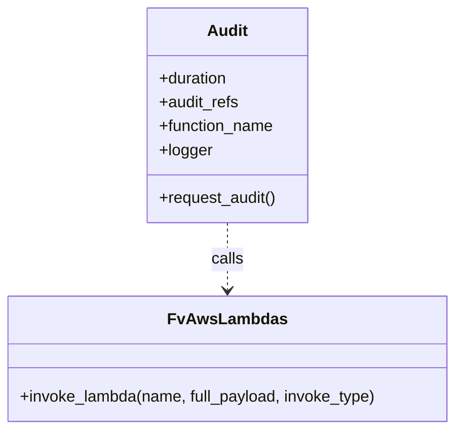

# Diagram: shipment_core/scheduled_services/scheduled_services/db/audit/__init__.py

> Auto-generated by Obscura crawlers

## Mermaid

### SVG

<svg id="container" width="457.6953125" xmlns="http://www.w3.org/2000/svg" class="classDiagram" height="432" viewBox="0 0 457.6953125 432" role="graphics-document document" aria-roledescription="class"><g><defs><marker id="container_class-aggregationStart" class="marker aggregation class" refX="18" refY="7" markerWidth="190" markerHeight="240" orient="auto"><path d="M 18,7 L9,13 L1,7 L9,1 Z"></path></marker></defs><defs><marker id="container_class-aggregationEnd" class="marker aggregation class" refX="1" refY="7" markerWidth="20" markerHeight="28" orient="auto"><path d="M 18,7 L9,13 L1,7 L9,1 Z"></path></marker></defs><defs><marker id="container_class-extensionStart" class="marker extension class" refX="18" refY="7" markerWidth="190" markerHeight="240" orient="auto"><path d="M 1,7 L18,13 V 1 Z"></path></marker></defs><defs><marker id="container_class-extensionEnd" class="marker extension class" refX="1" refY="7" markerWidth="20" markerHeight="28" orient="auto"><path d="M 1,1 V 13 L18,7 Z"></path></marker></defs><defs><marker id="container_class-compositionStart" class="marker composition class" refX="18" refY="7" markerWidth="190" markerHeight="240" orient="auto"><path d="M 18,7 L9,13 L1,7 L9,1 Z"></path></marker></defs><defs><marker id="container_class-compositionEnd" class="marker composition class" refX="1" refY="7" markerWidth="20" markerHeight="28" orient="auto"><path d="M 18,7 L9,13 L1,7 L9,1 Z"></path></marker></defs><defs><marker id="container_class-dependencyStart" class="marker dependency class" refX="6" refY="7" markerWidth="190" markerHeight="240" orient="auto"><path d="M 5,7 L9,13 L1,7 L9,1 Z"></path></marker></defs><defs><marker id="container_class-dependencyEnd" class="marker dependency class" refX="13" refY="7" markerWidth="20" markerHeight="28" orient="auto"><path d="M 18,7 L9,13 L14,7 L9,1 Z"></path></marker></defs><defs><marker id="container_class-lollipopStart" class="marker lollipop class" refX="13" refY="7" markerWidth="190" markerHeight="240" orient="auto"><circle stroke="black" fill="transparent" cx="7" cy="7" r="6"></circle></marker></defs><defs><marker id="container_class-lollipopEnd" class="marker lollipop class" refX="1" refY="7" markerWidth="190" markerHeight="240" orient="auto"><circle stroke="black" fill="transparent" cx="7" cy="7" r="6"></circle></marker></defs><g class="root"><g class="clusters"></g><g class="edgePaths"><path d="M228.848,224L228.848,230.167C228.848,236.333,228.848,248.667,228.848,260C228.848,271.333,228.848,281.667,228.848,286.833L228.848,292" id="id_Audit_FvAwsLambdas_1" class="edge-thickness-normal edge-pattern-dashed relation" style=";;;" data-edge="true" data-et="edge" data-id="id_Audit_FvAwsLambdas_1" data-points="W3sieCI6MjI4Ljg0NzY1NjI1LCJ5IjoyMjR9LHsieCI6MjI4Ljg0NzY1NjI1LCJ5IjoyNjF9LHsieCI6MjI4Ljg0NzY1NjI1LCJ5IjoyOTh9XQ==" marker-end="url(#container_class-dependencyEnd)"></path></g><g class="edgeLabels"><g class="edgeLabel" transform="translate(228.84765625, 261)"><g class="label" data-id="id_Audit_FvAwsLambdas_1" transform="translate(-16.4453125, -12)"><foreignObject width="32.890625" height="24">

calls

</foreignObject></g></g></g><g class="nodes"><g class="node default" id="classId-Audit-0" transform="translate(228.84765625, 116)"><g class="basic label-container"><path d="M-81.47265625 -108 L81.47265625 -108 L81.47265625 108 L-81.47265625 108" stroke="none" stroke-width="0" fill="#ECECFF" style=""></path><path d="M-81.47265625 -108 C-29.682538990092972 -108, 22.107578269814056 -108, 81.47265625 -108 M-81.47265625 -108 C-45.19165383418878 -108, -8.910651418377554 -108, 81.47265625 -108 M81.47265625 -108 C81.47265625 -41.06588486403179, 81.47265625 25.868230271936426, 81.47265625 108 M81.47265625 -108 C81.47265625 -48.502456542714036, 81.47265625 10.995086914571928, 81.47265625 108 M81.47265625 108 C38.54191920508841 108, -4.388817839823176 108, -81.47265625 108 M81.47265625 108 C48.35821904642395 108, 15.243781842847895 108, -81.47265625 108 M-81.47265625 108 C-81.47265625 49.41050445133372, -81.47265625 -9.178991097332556, -81.47265625 -108 M-81.47265625 108 C-81.47265625 37.174871770569794, -81.47265625 -33.65025645886041, -81.47265625 -108" stroke="#9370DB" stroke-width="1.3" fill="none" stroke-dasharray="0 0" style=""></path></g><g class="annotation-group text" transform="translate(0, -84)"></g><g class="label-group text" transform="translate(-19.4453125, -84)"><g class="label" style="font-weight: bolder" transform="translate(0,-12)"><foreignObject width="38.890625" height="24">

Audit

</foreignObject></g></g><g class="members-group text" transform="translate(-69.47265625, -36)"><g class="label" style="" transform="translate(0,-12)"><foreignObject width="70.203125" height="24">

+duration

</foreignObject></g><g class="label" style="" transform="translate(0,12)"><foreignObject width="81.109375" height="24">

+audit_refs

</foreignObject></g><g class="label" style="" transform="translate(0,36)"><foreignObject width="117.28125" height="24">

+function_name

</foreignObject></g><g class="label" style="" transform="translate(0,60)"><foreignObject width="53.21875" height="24">

+logger

</foreignObject></g></g><g class="methods-group text" transform="translate(-69.47265625, 84)"><g class="label" style="" transform="translate(0,-12)"><foreignObject width="119.5" height="24">

+request_audit()

</foreignObject></g></g><g class="divider" style=""><path d="M-81.47265625 -60 C-26.48588259179376 -60, 28.50089106641248 -60, 81.47265625 -60 M-81.47265625 -60 C-40.683741952826516 -60, 0.10517234434696832 -60, 81.47265625 -60" stroke="#9370DB" stroke-width="1.3" fill="none" stroke-dasharray="0 0" style=""></path></g><g class="divider" style=""><path d="M-81.47265625 60 C-48.23159511872635 60, -14.990533987452693 60, 81.47265625 60 M-81.47265625 60 C-30.113779487737027 60, 21.245097274525946 60, 81.47265625 60" stroke="#9370DB" stroke-width="1.3" fill="none" stroke-dasharray="0 0" style=""></path></g></g><g class="node default" id="classId-FvAwsLambdas-1" transform="translate(228.84765625, 361)"><g class="basic label-container"><path d="M-220.84765625 -63 L220.84765625 -63 L220.84765625 63 L-220.84765625 63" stroke="none" stroke-width="0" fill="#ECECFF" style=""></path><path d="M-220.84765625 -63 C-115.62423542626554 -63, -10.400814602531085 -63, 220.84765625 -63 M-220.84765625 -63 C-57.69909181644272 -63, 105.44947261711457 -63, 220.84765625 -63 M220.84765625 -63 C220.84765625 -35.15681324180756, 220.84765625 -7.313626483615124, 220.84765625 63 M220.84765625 -63 C220.84765625 -15.353064520213245, 220.84765625 32.29387095957351, 220.84765625 63 M220.84765625 63 C85.47406977713038 63, -49.89951669573924 63, -220.84765625 63 M220.84765625 63 C110.05878821453928 63, -0.7300798209214463 63, -220.84765625 63 M-220.84765625 63 C-220.84765625 18.312817552772223, -220.84765625 -26.374364894455553, -220.84765625 -63 M-220.84765625 63 C-220.84765625 19.89641143125212, -220.84765625 -23.207177137495762, -220.84765625 -63" stroke="#9370DB" stroke-width="1.3" fill="none" stroke-dasharray="0 0" style=""></path></g><g class="annotation-group text" transform="translate(0, -39)"></g><g class="label-group text" transform="translate(-55.2109375, -39)"><g class="label" style="font-weight: bolder" transform="translate(0,-12)"><foreignObject width="110.421875" height="24">

FvAwsLambdas

</foreignObject></g></g><g class="members-group text" transform="translate(-208.84765625, 9)"></g><g class="methods-group text" transform="translate(-208.84765625, 39)"><g class="label" style="" transform="translate(0,-12)"><foreignObject width="362.484375" height="24">

+invoke_lambda(name, full_payload, invoke_type)

</foreignObject></g></g><g class="divider" style=""><path d="M-220.84765625 -15 C-108.43330831849318 -15, 3.9810396130136496 -15, 220.84765625 -15 M-220.84765625 -15 C-74.48059644492847 -15, 71.88646336014307 -15, 220.84765625 -15" stroke="#9370DB" stroke-width="1.3" fill="none" stroke-dasharray="0 0" style=""></path></g><g class="divider" style=""><path d="M-220.84765625 9 C-90.77539105988669 9, 39.29687413022663 9, 220.84765625 9 M-220.84765625 9 C-91.12742134966368 9, 38.592813550672645 9, 220.84765625 9" stroke="#9370DB" stroke-width="1.3" fill="none" stroke-dasharray="0 0" style=""></path></g></g></g></g></g></svg>
