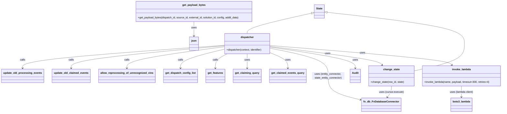
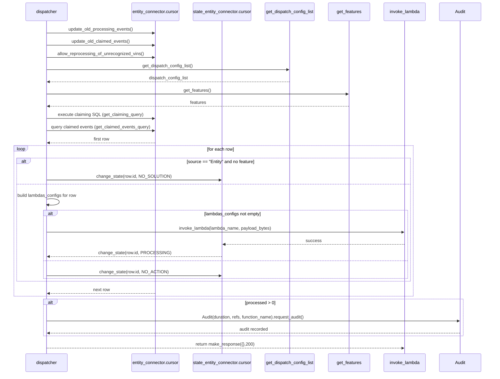

# Diagram: shipment_core/scheduled_services/scheduled_services/event_dispatcher/event_dispatcher.py

> Auto-generated by Obscura crawlers

## Diagram 1

### SVG

<svg id="container" width="3030.78125" xmlns="http://www.w3.org/2000/svg" class="classDiagram" height="700" viewBox="0 0 3030.78125 700" role="graphics-document document" aria-roledescription="class"><g><defs><marker id="container_class-aggregationStart" class="marker aggregation class" refX="18" refY="7" markerWidth="190" markerHeight="240" orient="auto"><path d="M 18,7 L9,13 L1,7 L9,1 Z"></path></marker></defs><defs><marker id="container_class-aggregationEnd" class="marker aggregation class" refX="1" refY="7" markerWidth="20" markerHeight="28" orient="auto"><path d="M 18,7 L9,13 L1,7 L9,1 Z"></path></marker></defs><defs><marker id="container_class-extensionStart" class="marker extension class" refX="18" refY="7" markerWidth="190" markerHeight="240" orient="auto"><path d="M 1,7 L18,13 V 1 Z"></path></marker></defs><defs><marker id="container_class-extensionEnd" class="marker extension class" refX="1" refY="7" markerWidth="20" markerHeight="28" orient="auto"><path d="M 1,1 V 13 L18,7 Z"></path></marker></defs><defs><marker id="container_class-compositionStart" class="marker composition class" refX="18" refY="7" markerWidth="190" markerHeight="240" orient="auto"><path d="M 18,7 L9,13 L1,7 L9,1 Z"></path></marker></defs><defs><marker id="container_class-compositionEnd" class="marker composition class" refX="1" refY="7" markerWidth="20" markerHeight="28" orient="auto"><path d="M 18,7 L9,13 L1,7 L9,1 Z"></path></marker></defs><defs><marker id="container_class-dependencyStart" class="marker dependency class" refX="6" refY="7" markerWidth="190" markerHeight="240" orient="auto"><path d="M 5,7 L9,13 L1,7 L9,1 Z"></path></marker></defs><defs><marker id="container_class-dependencyEnd" class="marker dependency class" refX="13" refY="7" markerWidth="20" markerHeight="28" orient="auto"><path d="M 18,7 L9,13 L14,7 L9,1 Z"></path></marker></defs><defs><marker id="container_class-lollipopStart" class="marker lollipop class" refX="13" refY="7" markerWidth="190" markerHeight="240" orient="auto"><circle stroke="black" fill="transparent" cx="7" cy="7" r="6"></circle></marker></defs><defs><marker id="container_class-lollipopEnd" class="marker lollipop class" refX="1" refY="7" markerWidth="190" markerHeight="240" orient="auto"><circle stroke="black" fill="transparent" cx="7" cy="7" r="6"></circle></marker></defs><g class="root"><g class="clusters"></g><g class="edgePaths"><path d="M1328.613,281.715L1129.445,296.596C930.276,311.477,531.939,341.238,332.77,364.786C133.602,388.333,133.602,405.667,133.602,414.333L133.602,423" id="id_dispatcher_update_old_processing_events_1" class="edge-thickness-normal edge-pattern-solid relation" style=";;;" data-edge="true" data-et="edge" data-id="id_dispatcher_update_old_processing_events_1" data-points="W3sieCI6MTMyOC42MTMyODEyNSwieSI6MjgxLjcxNTM5MDU4NzE1MDN9LHsieCI6MTMzLjYwMTU2MjUsInkiOjM3MX0seyJ4IjoxMzMuNjAxNTYyNSwieSI6NDI5fV0=" marker-end="url(#container_class-dependencyEnd)"></path><path d="M1328.613,284.683L1177.83,299.069C1027.047,313.456,725.48,342.228,574.697,365.281C423.914,388.333,423.914,405.667,423.914,414.333L423.914,423" id="id_dispatcher_update_old_claimed_events_2" class="edge-thickness-normal edge-pattern-solid relation" style=";;;" data-edge="true" data-et="edge" data-id="id_dispatcher_update_old_claimed_events_2" data-points="W3sieCI6MTMyOC42MTMyODEyNSwieSI6Mjg0LjY4MzM5MDYwMzY4Njd9LHsieCI6NDIzLjkxNDA2MjUsInkiOjM3MX0seyJ4Ijo0MjMuOTE0MDYyNSwieSI6NDI5fV0=" marker-end="url(#container_class-dependencyEnd)"></path><path d="M1328.613,290.981L1232.889,304.318C1137.164,317.654,945.715,344.327,849.99,366.33C754.266,388.333,754.266,405.667,754.266,414.333L754.266,423" id="id_dispatcher_allow_reprocessing_of_unrecognized_vins_3" class="edge-thickness-normal edge-pattern-solid relation" style=";;;" data-edge="true" data-et="edge" data-id="id_dispatcher_allow_reprocessing_of_unrecognized_vins_3" data-points="W3sieCI6MTMyOC42MTMyODEyNSwieSI6MjkwLjk4MTE2OTg2MzA3MzN9LHsieCI6NzU0LjI2NTYyNSwieSI6MzcxfSx7IngiOjc1NC4yNjU2MjUsInkiOjQyOX1d" marker-end="url(#container_class-dependencyEnd)"></path><path d="M1328.613,306.756L1285.666,317.463C1242.719,328.171,1156.824,349.585,1113.877,368.959C1070.93,388.333,1070.93,405.667,1070.93,414.333L1070.93,423" id="id_dispatcher_get_dispatch_config_list_4" class="edge-thickness-normal edge-pattern-solid relation" style=";;;" data-edge="true" data-et="edge" data-id="id_dispatcher_get_dispatch_config_list_4" data-points="W3sieCI6MTMyOC42MTMyODEyNSwieSI6MzA2Ljc1NjAyMzQ1MTA0M30seyJ4IjoxMDcwLjkyOTY4NzUsInkiOjM3MX0seyJ4IjoxMDcwLjkyOTY4NzUsInkiOjQyOX1d" marker-end="url(#container_class-dependencyEnd)"></path><path d="M1351.111,334L1339.274,340.167C1327.438,346.333,1303.766,358.667,1291.93,373.5C1280.094,388.333,1280.094,405.667,1280.094,414.333L1280.094,423" id="id_dispatcher_get_features_5" class="edge-thickness-normal edge-pattern-solid relation" style=";;;" data-edge="true" data-et="edge" data-id="id_dispatcher_get_features_5" data-points="W3sieCI6MTM1MS4xMTA2MjUsInkiOjMzNH0seyJ4IjoxMjgwLjA5Mzc1LCJ5IjozNzF9LHsieCI6MTI4MC4wOTM3NSwieSI6NDI5fV0=" marker-end="url(#container_class-dependencyEnd)"></path><path d="M1472.031,334L1472.031,340.167C1472.031,346.333,1472.031,358.667,1472.031,373.5C1472.031,388.333,1472.031,405.667,1472.031,414.333L1472.031,423" id="id_dispatcher_get_claiming_query_6" class="edge-thickness-normal edge-pattern-solid relation" style=";;;" data-edge="true" data-et="edge" data-id="id_dispatcher_get_claiming_query_6" data-points="W3sieCI6MTQ3Mi4wMzEyNSwieSI6MzM0fSx7IngiOjE0NzIuMDMxMjUsInkiOjM3MX0seyJ4IjoxNDcyLjAzMTI1LCJ5Ijo0Mjl9XQ==" marker-end="url(#container_class-dependencyEnd)"></path><path d="M1615.449,329.855L1632.16,336.713C1648.87,343.57,1682.29,357.285,1699.001,372.809C1715.711,388.333,1715.711,405.667,1715.711,414.333L1715.711,423" id="id_dispatcher_get_claimed_events_query_7" class="edge-thickness-normal edge-pattern-solid relation" style=";;;" data-edge="true" data-et="edge" data-id="id_dispatcher_get_claimed_events_query_7" data-points="W3sieCI6MTYxNS40NDkyMTg3NSwieSI6MzI5Ljg1NTExODQ2MzY1OTR9LHsieCI6MTcxNS43MTA5Mzc1LCJ5IjozNzF9LHsieCI6MTcxNS43MTA5Mzc1LCJ5Ijo0Mjl9XQ==" marker-end="url(#container_class-dependencyEnd)"></path><path d="M1615.449,300.355L1672.973,312.129C1730.497,323.903,1845.546,347.452,1903.07,375.893C1960.594,404.333,1960.594,437.667,1960.594,471C1960.594,504.333,1960.594,537.667,1994.954,562.62C2029.314,587.572,2098.035,604.145,2132.395,612.431L2166.755,620.717" id="id_dispatcher_fv_db_FvDatabaseConnector_8" class="edge-thickness-normal edge-pattern-solid relation" style=";;;" data-edge="true" data-et="edge" data-id="id_dispatcher_fv_db_FvDatabaseConnector_8" data-points="W3sieCI6MTYxNS40NDkyMTg3NSwieSI6MzAwLjM1NTA5MTQ2NzMxNDh9LHsieCI6MTk2MC41OTM3NSwieSI6MzcxfSx7IngiOjE5NjAuNTkzNzUsInkiOjQ3MX0seyJ4IjoxOTYwLjU5Mzc1LCJ5Ijo1NzF9LHsieCI6MjE3Mi41ODc4OTA2MjUsInkiOjYyMi4xMjM3OTc4ODM0NDAxfV0=" marker-end="url(#container_class-dependencyEnd)"></path><path d="M1615.449,292.896L1700.714,305.913C1785.979,318.93,1956.509,344.965,2041.774,366.649C2127.039,388.333,2127.039,405.667,2127.039,414.333L2127.039,423" id="id_dispatcher_Audit_9" class="edge-thickness-normal edge-pattern-solid relation" style=";;;" data-edge="true" data-et="edge" data-id="id_dispatcher_Audit_9" data-points="W3sieCI6MTYxNS40NDkyMTg3NSwieSI6MjkyLjg5NTYxMTkzMjEwOTZ9LHsieCI6MjEyNy4wMzkwNjI1LCJ5IjozNzF9LHsieCI6MjEyNy4wMzkwNjI1LCJ5Ijo0Mjl9XQ==" marker-end="url(#container_class-dependencyEnd)"></path><path d="M1615.449,289.104L1723.576,302.754C1831.702,316.403,2047.954,343.701,2160.628,362.752C2273.302,381.803,2282.396,392.607,2286.944,398.008L2291.491,403.41" id="id_dispatcher_change_state_10" class="edge-thickness-normal edge-pattern-solid relation" style=";;;" data-edge="true" data-et="edge" data-id="id_dispatcher_change_state_10" data-points="W3sieCI6MTYxNS40NDkyMTg3NSwieSI6Mjg5LjEwNDMxMTIwNzc1OTV9LHsieCI6MjI2NC4yMDcwMzEyNSwieSI6MzcxfSx7IngiOjIyOTUuMzU0OTYwOTM3NSwieSI6NDA4fV0=" marker-end="url(#container_class-dependencyEnd)"></path><path d="M1615.449,282.762L1794.763,297.469C1974.076,312.175,2332.703,341.587,2516.852,361.714C2701.001,381.841,2710.672,392.682,2715.508,398.102L2720.343,403.523" id="id_dispatcher_invoke_lambda_11" class="edge-thickness-normal edge-pattern-solid relation" style=";;;" data-edge="true" data-et="edge" data-id="id_dispatcher_invoke_lambda_11" data-points="W3sieCI6MTYxNS40NDkyMTg3NSwieSI6MjgyLjc2MjMzMTM4NjAyNjQ2fSx7IngiOjI2OTEuMzMwMDc4MTI1LCJ5IjozNzF9LHsieCI6MjcyNC4zMzc0MDIzNDM3NSwieSI6NDA4fV0=" marker-end="url(#container_class-dependencyEnd)"></path><path d="M2780.539,534L2780.539,540.167C2780.539,546.333,2780.539,558.667,2780.539,570C2780.539,581.333,2780.539,591.667,2780.539,596.833L2780.539,602" id="id_invoke_lambda_boto3_lambda_12" class="edge-thickness-normal edge-pattern-solid relation" style=";;;" data-edge="true" data-et="edge" data-id="id_invoke_lambda_boto3_lambda_12" data-points="W3sieCI6Mjc4MC41MzkwNjI1LCJ5Ijo1MzR9LHsieCI6Mjc4MC41MzkwNjI1LCJ5Ijo1NzF9LHsieCI6Mjc4MC41MzkwNjI1LCJ5Ijo2MDh9XQ==" marker-end="url(#container_class-dependencyEnd)"></path><path d="M1138.721,134L1138.721,140.167C1138.721,146.333,1138.721,158.667,1138.721,173.5C1138.721,188.333,1138.721,205.667,1138.721,214.333L1138.721,223" id="id_get_payload_bytes_json_13" class="edge-thickness-normal edge-pattern-solid relation" style=";;;" data-edge="true" data-et="edge" data-id="id_get_payload_bytes_json_13" data-points="W3sieCI6MTEzOC43MjA3MDMxMjUsInkiOjEzNH0seyJ4IjoxMTM4LjcyMDcwMzEyNSwieSI6MTcxfSx7IngiOjExMzguNzIwNzAzMTI1LCJ5IjoyMjl9XQ==" marker-end="url(#container_class-dependencyEnd)"></path><path d="M2348.391,534L2348.391,540.167C2348.391,546.333,2348.391,558.667,2344.297,570.205C2340.203,581.743,2332.016,592.485,2327.922,597.857L2323.828,603.228" id="id_change_state_fv_db_FvDatabaseConnector_14" class="edge-thickness-normal edge-pattern-solid relation" style=";;;" data-edge="true" data-et="edge" data-id="id_change_state_fv_db_FvDatabaseConnector_14" data-points="W3sieCI6MjM0OC4zOTA2MjUsInkiOjUzNH0seyJ4IjoyMzQ4LjM5MDYyNSwieSI6NTcxfSx7IngiOjIzMjAuMTkxNDgwNDE5MzA0LCJ5Ijo2MDh9XQ==" marker-end="url(#container_class-dependencyEnd)"></path><path d="M1862.081,81.984L1797.073,96.82C1732.064,111.656,1602.048,141.328,1537.04,162.331C1472.031,183.333,1472.031,195.667,1472.031,201.833L1472.031,208" id="id_State_dispatcher_15" class="edge-thickness-normal edge-pattern-solid relation" style=";;;" data-edge="true" data-et="edge" data-id="id_State_dispatcher_15" data-points="W3sieCI6MTg3OC44OTg0Mzc1LCJ5Ijo3OC4xNDYwNDA5NzIwNjEyNn0seyJ4IjoxNDcyLjAzMTI1LCJ5IjoxNzF9LHsieCI6MTQ3Mi4wMzEyNSwieSI6MjA4fV0=" marker-start="url(#container_class-extensionStart)"></path><path d="M1958.665,76.453L2098.685,92.211C2238.705,107.969,2518.745,139.484,2658.765,171.909C2798.785,204.333,2798.785,237.667,2798.785,271C2798.785,304.333,2798.785,337.667,2747.037,365.823C2695.289,393.979,2591.793,416.958,2540.045,428.447L2488.297,439.937" id="id_State_change_state_16" class="edge-thickness-normal edge-pattern-solid relation" style=";;;" data-edge="true" data-et="edge" data-id="id_State_change_state_16" data-points="W3sieCI6MTk0MS41MjM0Mzc1LCJ5Ijo3NC41MjM5MDM3MjU2ODQxNH0seyJ4IjoyNzk4Ljc4NTE1NjI1LCJ5IjoxNzF9LHsieCI6Mjc5OC43ODUxNTYyNSwieSI6MjcxfSx7IngiOjI3OTguNzg1MTU2MjUsInkiOjM3MX0seyJ4IjoyNDg4LjI5Njg3NSwieSI6NDM5LjkzNjk1NjMxNDM0MjQ3fV0=" marker-start="url(#container_class-extensionStart)"></path></g><g class="edgeLabels"><g class="edgeLabel" transform="translate(133.6015625, 371)"><g class="label" data-id="id_dispatcher_update_old_processing_events_1" transform="translate(-16.4453125, -12)"><foreignObject width="32.890625" height="24">

calls

</foreignObject></g></g><g class="edgeLabel" transform="translate(423.9140625, 371)"><g class="label" data-id="id_dispatcher_update_old_claimed_events_2" transform="translate(-16.4453125, -12)"><foreignObject width="32.890625" height="24">

calls

</foreignObject></g></g><g class="edgeLabel" transform="translate(754.265625, 371)"><g class="label" data-id="id_dispatcher_allow_reprocessing_of_unrecognized_vins_3" transform="translate(-16.4453125, -12)"><foreignObject width="32.890625" height="24">

calls

</foreignObject></g></g><g class="edgeLabel" transform="translate(1070.9296875, 371)"><g class="label" data-id="id_dispatcher_get_dispatch_config_list_4" transform="translate(-16.4453125, -12)"><foreignObject width="32.890625" height="24">

calls

</foreignObject></g></g><g class="edgeLabel" transform="translate(1280.09375, 371)"><g class="label" data-id="id_dispatcher_get_features_5" transform="translate(-16.4453125, -12)"><foreignObject width="32.890625" height="24">

calls

</foreignObject></g></g><g class="edgeLabel" transform="translate(1472.03125, 371)"><g class="label" data-id="id_dispatcher_get_claiming_query_6" transform="translate(-16.4921875, -12)"><foreignObject width="32.984375" height="24">

uses

</foreignObject></g></g><g class="edgeLabel" transform="translate(1715.7109375, 371)"><g class="label" data-id="id_dispatcher_get_claimed_events_query_7" transform="translate(-16.4921875, -12)"><foreignObject width="32.984375" height="24">

uses

</foreignObject></g></g><g class="edgeLabel" transform="translate(1960.59375, 471)"><g class="label" data-id="id_dispatcher_fv_db_FvDatabaseConnector_8" transform="translate(-100, -24)"><foreignObject width="200" height="48">

uses (entity_connector, state_entity_connector)

</foreignObject></g></g><g class="edgeLabel" transform="translate(2127.0390625, 371)"><g class="label" data-id="id_dispatcher_Audit_9" transform="translate(-16.4921875, -12)"><foreignObject width="32.984375" height="24">

uses

</foreignObject></g></g><g class="edgeLabel" transform="translate(1963.82033, 333.0808)"><g class="label" data-id="id_dispatcher_change_state_10" transform="translate(-16.4921875, -12)"><foreignObject width="32.984375" height="24">

uses

</foreignObject></g></g><g class="edgeLabel" transform="translate(2178.09824, 328.90762)"><g class="label" data-id="id_dispatcher_invoke_lambda_11" transform="translate(-16.4921875, -12)"><foreignObject width="32.984375" height="24">

uses

</foreignObject></g></g><g class="edgeLabel" transform="translate(2780.5390625, 571)"><g class="label" data-id="id_invoke_lambda_boto3_lambda_12" transform="translate(-73.6796875, -12)"><foreignObject width="147.359375" height="24">

uses (lambda client)

</foreignObject></g></g><g class="edgeLabel" transform="translate(1138.720703125, 171)"><g class="label" data-id="id_get_payload_bytes_json_13" transform="translate(-16.4921875, -12)"><foreignObject width="32.984375" height="24">

uses

</foreignObject></g></g><g class="edgeLabel" transform="translate(2348.390625, 571)"><g class="label" data-id="id_change_state_fv_db_FvDatabaseConnector_14" transform="translate(-75.84375, -12)"><foreignObject width="151.6875" height="24">

uses (cursor.execute)

</foreignObject></g></g><g class="edgeLabel"><g class="label" data-id="id_State_dispatcher_15" transform="translate(0, 0)"><foreignObject width="0" height="0">

</foreignObject></g></g><g class="edgeLabel"><g class="label" data-id="id_State_change_state_16" transform="translate(0, 0)"><foreignObject width="0" height="0">

</foreignObject></g></g></g><g class="nodes"><g class="node default" id="classId-dispatcher-0" transform="translate(1472.03125, 271)"><g class="basic label-container"><path d="M-143.41796875 -63 L143.41796875 -63 L143.41796875 63 L-143.41796875 63" stroke="none" stroke-width="0" fill="#ECECFF" style=""></path><path d="M-143.41796875 -63 C-57.81183155658972 -63, 27.794305636820553 -63, 143.41796875 -63 M-143.41796875 -63 C-49.00213189975011 -63, 45.41370495049978 -63, 143.41796875 -63 M143.41796875 -63 C143.41796875 -36.968017379797004, 143.41796875 -10.936034759594015, 143.41796875 63 M143.41796875 -63 C143.41796875 -35.4558985730993, 143.41796875 -7.9117971461985945, 143.41796875 63 M143.41796875 63 C50.33292574436422 63, -42.752117261271565 63, -143.41796875 63 M143.41796875 63 C57.99292267167719 63, -27.432123406645616 63, -143.41796875 63 M-143.41796875 63 C-143.41796875 21.444285060310804, -143.41796875 -20.11142987937839, -143.41796875 -63 M-143.41796875 63 C-143.41796875 12.835248935871924, -143.41796875 -37.32950212825615, -143.41796875 -63" stroke="#9370DB" stroke-width="1.3" fill="none" stroke-dasharray="0 0" style=""></path></g><g class="annotation-group text" transform="translate(0, -39)"></g><g class="label-group text" transform="translate(-39.0234375, -39)"><g class="label" style="font-weight: bolder" transform="translate(0,-12)"><foreignObject width="78.046875" height="24">

dispatcher

</foreignObject></g></g><g class="members-group text" transform="translate(-131.41796875, 9)"></g><g class="methods-group text" transform="translate(-131.41796875, 39)"><g class="label" style="" transform="translate(0,-12)"><foreignObject width="223.8125" height="24">

+dispatcher(context, identifier)

</foreignObject></g></g><g class="divider" style=""><path d="M-143.41796875 -15 C-48.382300874196886 -15, 46.65336700160623 -15, 143.41796875 -15 M-143.41796875 -15 C-53.17353541095751 -15, 37.070897928084975 -15, 143.41796875 -15" stroke="#9370DB" stroke-width="1.3" fill="none" stroke-dasharray="0 0" style=""></path></g><g class="divider" style=""><path d="M-143.41796875 9 C-81.06006717917002 9, -18.70216560834004 9, 143.41796875 9 M-143.41796875 9 C-81.71734116469233 9, -20.016713579384657 9, 143.41796875 9" stroke="#9370DB" stroke-width="1.3" fill="none" stroke-dasharray="0 0" style=""></path></g></g><g class="node default" id="classId-change_state-1" transform="translate(2348.390625, 471)"><g class="basic label-container"><path d="M-139.90625 -63 L139.90625 -63 L139.90625 63 L-139.90625 63" stroke="none" stroke-width="0" fill="#ECECFF" style=""></path><path d="M-139.90625 -63 C-61.17105386052667 -63, 17.56414227894666 -63, 139.90625 -63 M-139.90625 -63 C-38.45927915476611 -63, 62.987691690467784 -63, 139.90625 -63 M139.90625 -63 C139.90625 -13.195826859814062, 139.90625 36.608346280371876, 139.90625 63 M139.90625 -63 C139.90625 -33.96299907693388, 139.90625 -4.9259981538677735, 139.90625 63 M139.90625 63 C63.87491677148975 63, -12.156416457020498 63, -139.90625 63 M139.90625 63 C83.87757198616623 63, 27.848893972332462 63, -139.90625 63 M-139.90625 63 C-139.90625 28.39899625068182, -139.90625 -6.2020074986363625, -139.90625 -63 M-139.90625 63 C-139.90625 22.611762542061058, -139.90625 -17.776474915877884, -139.90625 -63" stroke="#9370DB" stroke-width="1.3" fill="none" stroke-dasharray="0 0" style=""></path></g><g class="annotation-group text" transform="translate(0, -39)"></g><g class="label-group text" transform="translate(-48.703125, -39)"><g class="label" style="font-weight: bolder" transform="translate(0,-12)"><foreignObject width="97.40625" height="24">

change_state

</foreignObject></g></g><g class="members-group text" transform="translate(-127.90625, 9)"></g><g class="methods-group text" transform="translate(-127.90625, 39)"><g class="label" style="" transform="translate(0,-12)"><foreignObject width="207.109375" height="24">

+change_state(row_id, state)

</foreignObject></g></g><g class="divider" style=""><path d="M-139.90625 -15 C-46.63974176473995 -15, 46.626766470520096 -15, 139.90625 -15 M-139.90625 -15 C-79.69745096446883 -15, -19.48865192893767 -15, 139.90625 -15" stroke="#9370DB" stroke-width="1.3" fill="none" stroke-dasharray="0 0" style=""></path></g><g class="divider" style=""><path d="M-139.90625 9 C-35.973977266622114 9, 67.95829546675577 9, 139.90625 9 M-139.90625 9 C-29.51434327873274 9, 80.87756344253452 9, 139.90625 9" stroke="#9370DB" stroke-width="1.3" fill="none" stroke-dasharray="0 0" style=""></path></g></g><g class="node default" id="classId-invoke_lambda-2" transform="translate(2780.5390625, 471)"><g class="basic label-container"><path d="M-242.2421875 -63 L242.2421875 -63 L242.2421875 63 L-242.2421875 63" stroke="none" stroke-width="0" fill="#ECECFF" style=""></path><path d="M-242.2421875 -63 C-96.89753287082789 -63, 48.447121758344224 -63, 242.2421875 -63 M-242.2421875 -63 C-57.32761702978033 -63, 127.58695344043934 -63, 242.2421875 -63 M242.2421875 -63 C242.2421875 -28.527932205288423, 242.2421875 5.944135589423155, 242.2421875 63 M242.2421875 -63 C242.2421875 -30.96939399462449, 242.2421875 1.0612120107510208, 242.2421875 63 M242.2421875 63 C85.25097733790014 63, -71.74023282419972 63, -242.2421875 63 M242.2421875 63 C124.51157840877458 63, 6.7809693175491645 63, -242.2421875 63 M-242.2421875 63 C-242.2421875 31.254138320808853, -242.2421875 -0.49172335838229486, -242.2421875 -63 M-242.2421875 63 C-242.2421875 34.75675243406853, -242.2421875 6.513504868137062, -242.2421875 -63" stroke="#9370DB" stroke-width="1.3" fill="none" stroke-dasharray="0 0" style=""></path></g><g class="annotation-group text" transform="translate(0, -39)"></g><g class="label-group text" transform="translate(-55.625, -39)"><g class="label" style="font-weight: bolder" transform="translate(0,-12)"><foreignObject width="111.25" height="24">

invoke_lambda

</foreignObject></g></g><g class="members-group text" transform="translate(-230.2421875, 9)"></g><g class="methods-group text" transform="translate(-230.2421875, 39)"><g class="label" style="" transform="translate(0,-12)"><foreignObject width="404.859375" height="24">

+invoke_lambda(name, payload, timeout=300, retries=4)

</foreignObject></g></g><g class="divider" style=""><path d="M-242.2421875 -15 C-112.23312882569917 -15, 17.775929848601663 -15, 242.2421875 -15 M-242.2421875 -15 C-80.62765841099574 -15, 80.98687067800853 -15, 242.2421875 -15" stroke="#9370DB" stroke-width="1.3" fill="none" stroke-dasharray="0 0" style=""></path></g><g class="divider" style=""><path d="M-242.2421875 9 C-55.6991665897053 9, 130.8438543205894 9, 242.2421875 9 M-242.2421875 9 C-108.64690739541254 9, 24.94837270917492 9, 242.2421875 9" stroke="#9370DB" stroke-width="1.3" fill="none" stroke-dasharray="0 0" style=""></path></g></g><g class="node default" id="classId-get_payload_bytes-3" transform="translate(1138.720703125, 71)"><g class="basic label-container"><path d="M-364.484375 -63 L364.484375 -63 L364.484375 63 L-364.484375 63" stroke="none" stroke-width="0" fill="#ECECFF" style=""></path><path d="M-364.484375 -63 C-217.1506312730131 -63, -69.81688754602618 -63, 364.484375 -63 M-364.484375 -63 C-184.33290960714234 -63, -4.1814442142846815 -63, 364.484375 -63 M364.484375 -63 C364.484375 -15.38664628604375, 364.484375 32.2267074279125, 364.484375 63 M364.484375 -63 C364.484375 -35.02574792424947, 364.484375 -7.051495848498952, 364.484375 63 M364.484375 63 C215.5529132421912 63, 66.62145148438242 63, -364.484375 63 M364.484375 63 C109.9151819789154 63, -144.6540110421692 63, -364.484375 63 M-364.484375 63 C-364.484375 15.84124120684696, -364.484375 -31.31751758630608, -364.484375 -63 M-364.484375 63 C-364.484375 26.529733297207486, -364.484375 -9.940533405585029, -364.484375 -63" stroke="#9370DB" stroke-width="1.3" fill="none" stroke-dasharray="0 0" style=""></path></g><g class="annotation-group text" transform="translate(0, -39)"></g><g class="label-group text" transform="translate(-69.359375, -39)"><g class="label" style="font-weight: bolder" transform="translate(0,-12)"><foreignObject width="138.71875" height="24">

get_payload_bytes

</foreignObject></g></g><g class="members-group text" transform="translate(-352.484375, 9)"></g><g class="methods-group text" transform="translate(-352.484375, 39)"><g class="label" style="" transform="translate(0,-12)"><foreignObject width="635.609375" height="24">

+get_payload_bytes(dispatch_id, source_id, external_id, solution_id, config, addtl_data)

</foreignObject></g></g><g class="divider" style=""><path d="M-364.484375 -15 C-111.90087416386501 -15, 140.68262667226998 -15, 364.484375 -15 M-364.484375 -15 C-177.42703758652254 -15, 9.63029982695491 -15, 364.484375 -15" stroke="#9370DB" stroke-width="1.3" fill="none" stroke-dasharray="0 0" style=""></path></g><g class="divider" style=""><path d="M-364.484375 9 C-104.49354356904286 9, 155.4972878619143 9, 364.484375 9 M-364.484375 9 C-187.96118967079133 9, -11.438004341582655 9, 364.484375 9" stroke="#9370DB" stroke-width="1.3" fill="none" stroke-dasharray="0 0" style=""></path></g></g><g class="node default" id="classId-get_claimed_events_query-4" transform="translate(1715.7109375, 471)"><g class="basic label-container"><path d="M-109.8828125 -42 L109.8828125 -42 L109.8828125 42 L-109.8828125 42" stroke="none" stroke-width="0" fill="#ECECFF" style=""></path><path d="M-109.8828125 -42 C-46.07385807022614 -42, 17.735096359547725 -42, 109.8828125 -42 M-109.8828125 -42 C-63.12110242751582 -42, -16.359392355031645 -42, 109.8828125 -42 M109.8828125 -42 C109.8828125 -12.979743533800352, 109.8828125 16.040512932399295, 109.8828125 42 M109.8828125 -42 C109.8828125 -9.274314437241046, 109.8828125 23.45137112551791, 109.8828125 42 M109.8828125 42 C37.27575131175466 42, -35.33130987649068 42, -109.8828125 42 M109.8828125 42 C47.27137622373874 42, -15.340060052522517 42, -109.8828125 42 M-109.8828125 42 C-109.8828125 20.384648918353182, -109.8828125 -1.2307021632936355, -109.8828125 -42 M-109.8828125 42 C-109.8828125 21.393125058362575, -109.8828125 0.7862501167251494, -109.8828125 -42" stroke="#9370DB" stroke-width="1.3" fill="none" stroke-dasharray="0 0" style=""></path></g><g class="annotation-group text" transform="translate(0, -18)"></g><g class="label-group text" transform="translate(-97.8828125, -18)"><g class="label" style="font-weight: bolder" transform="translate(0,-12)"><foreignObject width="195.765625" height="24">

get_claimed_events_query

</foreignObject></g></g><g class="members-group text" transform="translate(-97.8828125, 30)"></g><g class="methods-group text" transform="translate(-97.8828125, 60)"></g><g class="divider" style=""><path d="M-109.8828125 6 C-23.109015916231613 6, 63.664780667536775 6, 109.8828125 6 M-109.8828125 6 C-50.57504903022875 6, 8.732714439542505 6, 109.8828125 6" stroke="#9370DB" stroke-width="1.3" fill="none" stroke-dasharray="0 0" style=""></path></g><g class="divider" style=""><path d="M-109.8828125 24 C-49.79564330314717 24, 10.291525893705654 24, 109.8828125 24 M-109.8828125 24 C-30.060229532346753 24, 49.762353435306494 24, 109.8828125 24" stroke="#9370DB" stroke-width="1.3" fill="none" stroke-dasharray="0 0" style=""></path></g></g><g class="node default" id="classId-get_claiming_query-5" transform="translate(1472.03125, 471)"><g class="basic label-container"><path d="M-83.796875 -42 L83.796875 -42 L83.796875 42 L-83.796875 42" stroke="none" stroke-width="0" fill="#ECECFF" style=""></path><path d="M-83.796875 -42 C-49.89371571670986 -42, -15.990556433419727 -42, 83.796875 -42 M-83.796875 -42 C-18.651621390524056 -42, 46.49363221895189 -42, 83.796875 -42 M83.796875 -42 C83.796875 -12.593546702232015, 83.796875 16.81290659553597, 83.796875 42 M83.796875 -42 C83.796875 -14.69316878924226, 83.796875 12.613662421515478, 83.796875 42 M83.796875 42 C34.630070730141625 42, -14.53673353971675 42, -83.796875 42 M83.796875 42 C40.86994295857722 42, -2.0569890828455613 42, -83.796875 42 M-83.796875 42 C-83.796875 16.740265621293847, -83.796875 -8.519468757412305, -83.796875 -42 M-83.796875 42 C-83.796875 19.660512341626724, -83.796875 -2.678975316746552, -83.796875 -42" stroke="#9370DB" stroke-width="1.3" fill="none" stroke-dasharray="0 0" style=""></path></g><g class="annotation-group text" transform="translate(0, -18)"></g><g class="label-group text" transform="translate(-71.796875, -18)"><g class="label" style="font-weight: bolder" transform="translate(0,-12)"><foreignObject width="143.59375" height="24">

get_claiming_query

</foreignObject></g></g><g class="members-group text" transform="translate(-71.796875, 30)"></g><g class="methods-group text" transform="translate(-71.796875, 60)"></g><g class="divider" style=""><path d="M-83.796875 6 C-35.32042708590041 6, 13.156020828199175 6, 83.796875 6 M-83.796875 6 C-34.25497819300219 6, 15.286918613995624 6, 83.796875 6" stroke="#9370DB" stroke-width="1.3" fill="none" stroke-dasharray="0 0" style=""></path></g><g class="divider" style=""><path d="M-83.796875 24 C-47.91003992130416 24, -12.023204842608322 24, 83.796875 24 M-83.796875 24 C-44.324663724043006 24, -4.852452448086012 24, 83.796875 24" stroke="#9370DB" stroke-width="1.3" fill="none" stroke-dasharray="0 0" style=""></path></g></g><g class="node default" id="classId-get_features-6" transform="translate(1280.09375, 471)"><g class="basic label-container"><path d="M-58.140625 -42 L58.140625 -42 L58.140625 42 L-58.140625 42" stroke="none" stroke-width="0" fill="#ECECFF" style=""></path><path d="M-58.140625 -42 C-28.00153949587154 -42, 2.137546008256919 -42, 58.140625 -42 M-58.140625 -42 C-33.8595565677454 -42, -9.578488135490801 -42, 58.140625 -42 M58.140625 -42 C58.140625 -15.61094240607001, 58.140625 10.778115187859981, 58.140625 42 M58.140625 -42 C58.140625 -14.409452141699674, 58.140625 13.181095716600652, 58.140625 42 M58.140625 42 C28.405950354004652 42, -1.3287242919906959 42, -58.140625 42 M58.140625 42 C22.642346290288053 42, -12.855932419423894 42, -58.140625 42 M-58.140625 42 C-58.140625 10.624796824373849, -58.140625 -20.750406351252302, -58.140625 -42 M-58.140625 42 C-58.140625 23.247304431075595, -58.140625 4.494608862151189, -58.140625 -42" stroke="#9370DB" stroke-width="1.3" fill="none" stroke-dasharray="0 0" style=""></path></g><g class="annotation-group text" transform="translate(0, -18)"></g><g class="label-group text" transform="translate(-46.140625, -18)"><g class="label" style="font-weight: bolder" transform="translate(0,-12)"><foreignObject width="92.28125" height="24">

get_features

</foreignObject></g></g><g class="members-group text" transform="translate(-46.140625, 30)"></g><g class="methods-group text" transform="translate(-46.140625, 60)"></g><g class="divider" style=""><path d="M-58.140625 6 C-13.584790090557526 6, 30.97104481888495 6, 58.140625 6 M-58.140625 6 C-29.92657077536931 6, -1.71251655073862 6, 58.140625 6" stroke="#9370DB" stroke-width="1.3" fill="none" stroke-dasharray="0 0" style=""></path></g><g class="divider" style=""><path d="M-58.140625 24 C-22.486062318786722 24, 13.168500362426556 24, 58.140625 24 M-58.140625 24 C-21.5172261969075 24, 15.106172606184998 24, 58.140625 24" stroke="#9370DB" stroke-width="1.3" fill="none" stroke-dasharray="0 0" style=""></path></g></g><g class="node default" id="classId-get_dispatch_config_list-7" transform="translate(1070.9296875, 471)"><g class="basic label-container"><path d="M-101.0234375 -42 L101.0234375 -42 L101.0234375 42 L-101.0234375 42" stroke="none" stroke-width="0" fill="#ECECFF" style=""></path><path d="M-101.0234375 -42 C-37.21355464216144 -42, 26.59632821567712 -42, 101.0234375 -42 M-101.0234375 -42 C-21.13940533601381 -42, 58.74462682797238 -42, 101.0234375 -42 M101.0234375 -42 C101.0234375 -12.349141145388504, 101.0234375 17.30171770922299, 101.0234375 42 M101.0234375 -42 C101.0234375 -12.894085326076407, 101.0234375 16.211829347847186, 101.0234375 42 M101.0234375 42 C22.97227102006174 42, -55.07889545987652 42, -101.0234375 42 M101.0234375 42 C25.757833320776868 42, -49.507770858446264 42, -101.0234375 42 M-101.0234375 42 C-101.0234375 22.918764484608324, -101.0234375 3.837528969216649, -101.0234375 -42 M-101.0234375 42 C-101.0234375 20.05866556052126, -101.0234375 -1.8826688789574817, -101.0234375 -42" stroke="#9370DB" stroke-width="1.3" fill="none" stroke-dasharray="0 0" style=""></path></g><g class="annotation-group text" transform="translate(0, -18)"></g><g class="label-group text" transform="translate(-89.0234375, -18)"><g class="label" style="font-weight: bolder" transform="translate(0,-12)"><foreignObject width="178.046875" height="24">

get_dispatch_config_list

</foreignObject></g></g><g class="members-group text" transform="translate(-89.0234375, 30)"></g><g class="methods-group text" transform="translate(-89.0234375, 60)"></g><g class="divider" style=""><path d="M-101.0234375 6 C-22.497605200483434 6, 56.02822709903313 6, 101.0234375 6 M-101.0234375 6 C-25.92135697640566 6, 49.18072354718868 6, 101.0234375 6" stroke="#9370DB" stroke-width="1.3" fill="none" stroke-dasharray="0 0" style=""></path></g><g class="divider" style=""><path d="M-101.0234375 24 C-26.04832366743271 24, 48.92679016513458 24, 101.0234375 24 M-101.0234375 24 C-55.18865261571066 24, -9.353867731421317 24, 101.0234375 24" stroke="#9370DB" stroke-width="1.3" fill="none" stroke-dasharray="0 0" style=""></path></g></g><g class="node default" id="classId-update_old_claimed_events-8" transform="translate(423.9140625, 471)"><g class="basic label-container"><path d="M-114.7109375 -42 L114.7109375 -42 L114.7109375 42 L-114.7109375 42" stroke="none" stroke-width="0" fill="#ECECFF" style=""></path><path d="M-114.7109375 -42 C-61.30213874668125 -42, -7.893339993362503 -42, 114.7109375 -42 M-114.7109375 -42 C-29.121247167347263 -42, 56.46844316530547 -42, 114.7109375 -42 M114.7109375 -42 C114.7109375 -16.91255575268759, 114.7109375 8.174888494624817, 114.7109375 42 M114.7109375 -42 C114.7109375 -12.13691926677075, 114.7109375 17.7261614664585, 114.7109375 42 M114.7109375 42 C44.79551142755 42, -25.119914644900007 42, -114.7109375 42 M114.7109375 42 C30.53662257257247 42, -53.63769235485506 42, -114.7109375 42 M-114.7109375 42 C-114.7109375 17.144021610122813, -114.7109375 -7.711956779754374, -114.7109375 -42 M-114.7109375 42 C-114.7109375 21.47392252623187, -114.7109375 0.947845052463741, -114.7109375 -42" stroke="#9370DB" stroke-width="1.3" fill="none" stroke-dasharray="0 0" style=""></path></g><g class="annotation-group text" transform="translate(0, -18)"></g><g class="label-group text" transform="translate(-102.7109375, -18)"><g class="label" style="font-weight: bolder" transform="translate(0,-12)"><foreignObject width="205.421875" height="24">

update_old_claimed_events

</foreignObject></g></g><g class="members-group text" transform="translate(-102.7109375, 30)"></g><g class="methods-group text" transform="translate(-102.7109375, 60)"></g><g class="divider" style=""><path d="M-114.7109375 6 C-42.59104876728824 6, 29.528839965423515 6, 114.7109375 6 M-114.7109375 6 C-45.448463800463 6, 23.814009899073994 6, 114.7109375 6" stroke="#9370DB" stroke-width="1.3" fill="none" stroke-dasharray="0 0" style=""></path></g><g class="divider" style=""><path d="M-114.7109375 24 C-42.39370291488555 24, 29.923531670228897 24, 114.7109375 24 M-114.7109375 24 C-51.066708904116695 24, 12.57751969176661 24, 114.7109375 24" stroke="#9370DB" stroke-width="1.3" fill="none" stroke-dasharray="0 0" style=""></path></g></g><g class="node default" id="classId-update_old_processing_events-9" transform="translate(133.6015625, 471)"><g class="basic label-container"><path d="M-125.6015625 -42 L125.6015625 -42 L125.6015625 42 L-125.6015625 42" stroke="none" stroke-width="0" fill="#ECECFF" style=""></path><path d="M-125.6015625 -42 C-33.19655192089566 -42, 59.208458658208684 -42, 125.6015625 -42 M-125.6015625 -42 C-37.957646392093224 -42, 49.68626971581355 -42, 125.6015625 -42 M125.6015625 -42 C125.6015625 -19.50345669988792, 125.6015625 2.99308660022416, 125.6015625 42 M125.6015625 -42 C125.6015625 -24.99034939619977, 125.6015625 -7.9806987923995365, 125.6015625 42 M125.6015625 42 C48.58506202045727 42, -28.431438459085456 42, -125.6015625 42 M125.6015625 42 C64.45704699844552 42, 3.31253149689104 42, -125.6015625 42 M-125.6015625 42 C-125.6015625 18.376399771926767, -125.6015625 -5.247200456146466, -125.6015625 -42 M-125.6015625 42 C-125.6015625 16.454259474176816, -125.6015625 -9.091481051646369, -125.6015625 -42" stroke="#9370DB" stroke-width="1.3" fill="none" stroke-dasharray="0 0" style=""></path></g><g class="annotation-group text" transform="translate(0, -18)"></g><g class="label-group text" transform="translate(-113.6015625, -18)"><g class="label" style="font-weight: bolder" transform="translate(0,-12)"><foreignObject width="227.203125" height="24">

update_old_processing_events

</foreignObject></g></g><g class="members-group text" transform="translate(-113.6015625, 30)"></g><g class="methods-group text" transform="translate(-113.6015625, 60)"></g><g class="divider" style=""><path d="M-125.6015625 6 C-64.08471428649929 6, -2.5678660729985836 6, 125.6015625 6 M-125.6015625 6 C-60.265396682902605 6, 5.070769134194791 6, 125.6015625 6" stroke="#9370DB" stroke-width="1.3" fill="none" stroke-dasharray="0 0" style=""></path></g><g class="divider" style=""><path d="M-125.6015625 24 C-61.54217798776722 24, 2.517206524465564 24, 125.6015625 24 M-125.6015625 24 C-67.18189537672276 24, -8.762228253445542 24, 125.6015625 24" stroke="#9370DB" stroke-width="1.3" fill="none" stroke-dasharray="0 0" style=""></path></g></g><g class="node default" id="classId-allow_reprocessing_of_unrecognized_vins-10" transform="translate(754.265625, 471)"><g class="basic label-container"><path d="M-165.640625 -42 L165.640625 -42 L165.640625 42 L-165.640625 42" stroke="none" stroke-width="0" fill="#ECECFF" style=""></path><path d="M-165.640625 -42 C-81.13825003323474 -42, 3.364124933530519 -42, 165.640625 -42 M-165.640625 -42 C-74.87586871385422 -42, 15.888887572291566 -42, 165.640625 -42 M165.640625 -42 C165.640625 -22.960348919656937, 165.640625 -3.920697839313874, 165.640625 42 M165.640625 -42 C165.640625 -17.871115976584395, 165.640625 6.25776804683121, 165.640625 42 M165.640625 42 C82.17522053537597 42, -1.2901839292480588 42, -165.640625 42 M165.640625 42 C69.4253042963315 42, -26.790016407336992 42, -165.640625 42 M-165.640625 42 C-165.640625 24.226111128651198, -165.640625 6.452222257302395, -165.640625 -42 M-165.640625 42 C-165.640625 11.772815801737934, -165.640625 -18.45436839652413, -165.640625 -42" stroke="#9370DB" stroke-width="1.3" fill="none" stroke-dasharray="0 0" style=""></path></g><g class="annotation-group text" transform="translate(0, -18)"></g><g class="label-group text" transform="translate(-153.640625, -18)"><g class="label" style="font-weight: bolder" transform="translate(0,-12)"><foreignObject width="307.28125" height="24">

allow_reprocessing_of_unrecognized_vins

</foreignObject></g></g><g class="members-group text" transform="translate(-153.640625, 30)"></g><g class="methods-group text" transform="translate(-153.640625, 60)"></g><g class="divider" style=""><path d="M-165.640625 6 C-68.91731984386215 6, 27.80598531227571 6, 165.640625 6 M-165.640625 6 C-71.05762998403183 6, 23.52536503193633 6, 165.640625 6" stroke="#9370DB" stroke-width="1.3" fill="none" stroke-dasharray="0 0" style=""></path></g><g class="divider" style=""><path d="M-165.640625 24 C-68.08350220820353 24, 29.473620583592947 24, 165.640625 24 M-165.640625 24 C-55.086950496707985 24, 55.46672400658403 24, 165.640625 24" stroke="#9370DB" stroke-width="1.3" fill="none" stroke-dasharray="0 0" style=""></path></g></g><g class="node default" id="classId-Audit-11" transform="translate(2127.0390625, 471)"><g class="basic label-container"><path d="M-31.4453125 -42 L31.4453125 -42 L31.4453125 42 L-31.4453125 42" stroke="none" stroke-width="0" fill="#ECECFF" style=""></path><path d="M-31.4453125 -42 C-9.448903086563828 -42, 12.547506326872345 -42, 31.4453125 -42 M-31.4453125 -42 C-18.36869745837255 -42, -5.292082416745103 -42, 31.4453125 -42 M31.4453125 -42 C31.4453125 -22.563874272397808, 31.4453125 -3.1277485447956153, 31.4453125 42 M31.4453125 -42 C31.4453125 -20.787676752285307, 31.4453125 0.4246464954293856, 31.4453125 42 M31.4453125 42 C18.742536042774795 42, 6.039759585549593 42, -31.4453125 42 M31.4453125 42 C14.991308644005773 42, -1.4626952119884535 42, -31.4453125 42 M-31.4453125 42 C-31.4453125 17.098794247688133, -31.4453125 -7.802411504623734, -31.4453125 -42 M-31.4453125 42 C-31.4453125 23.252410919879146, -31.4453125 4.504821839758293, -31.4453125 -42" stroke="#9370DB" stroke-width="1.3" fill="none" stroke-dasharray="0 0" style=""></path></g><g class="annotation-group text" transform="translate(0, -18)"></g><g class="label-group text" transform="translate(-19.4453125, -18)"><g class="label" style="font-weight: bolder" transform="translate(0,-12)"><foreignObject width="38.890625" height="24">

Audit

</foreignObject></g></g><g class="members-group text" transform="translate(-19.4453125, 30)"></g><g class="methods-group text" transform="translate(-19.4453125, 60)"></g><g class="divider" style=""><path d="M-31.4453125 6 C-6.863164145911327 6, 17.718984208177346 6, 31.4453125 6 M-31.4453125 6 C-10.523997701423742 6, 10.397317097152516 6, 31.4453125 6" stroke="#9370DB" stroke-width="1.3" fill="none" stroke-dasharray="0 0" style=""></path></g><g class="divider" style=""><path d="M-31.4453125 24 C-17.761648280230624 24, -4.077984060461244 24, 31.4453125 24 M-31.4453125 24 C-9.836549190449862 24, 11.772214119100276 24, 31.4453125 24" stroke="#9370DB" stroke-width="1.3" fill="none" stroke-dasharray="0 0" style=""></path></g></g><g class="node default" id="classId-fv_db_FvDatabaseConnector-12" transform="translate(2288.181640625, 650)"><g class="basic label-container"><path d="M-115.59375 -42 L115.59375 -42 L115.59375 42 L-115.59375 42" stroke="none" stroke-width="0" fill="#ECECFF" style=""></path><path d="M-115.59375 -42 C-61.407944783894706 -42, -7.222139567789412 -42, 115.59375 -42 M-115.59375 -42 C-49.364634948823905 -42, 16.86448010235219 -42, 115.59375 -42 M115.59375 -42 C115.59375 -24.048925350853313, 115.59375 -6.097850701706626, 115.59375 42 M115.59375 -42 C115.59375 -16.77612861898772, 115.59375 8.44774276202456, 115.59375 42 M115.59375 42 C55.851129949131334 42, -3.8914901017373325 42, -115.59375 42 M115.59375 42 C69.17475896041594 42, 22.755767920831886 42, -115.59375 42 M-115.59375 42 C-115.59375 22.62762379806944, -115.59375 3.2552475961388794, -115.59375 -42 M-115.59375 42 C-115.59375 12.255829685584672, -115.59375 -17.488340628830656, -115.59375 -42" stroke="#9370DB" stroke-width="1.3" fill="none" stroke-dasharray="0 0" style=""></path></g><g class="annotation-group text" transform="translate(0, -18)"></g><g class="label-group text" transform="translate(-103.59375, -18)"><g class="label" style="font-weight: bolder" transform="translate(0,-12)"><foreignObject width="207.1875" height="24">

fv_db_FvDatabaseConnector

</foreignObject></g></g><g class="members-group text" transform="translate(-103.59375, 30)"></g><g class="methods-group text" transform="translate(-103.59375, 60)"></g><g class="divider" style=""><path d="M-115.59375 6 C-67.26272403592768 6, -18.931698071855365 6, 115.59375 6 M-115.59375 6 C-31.770491373903482 6, 52.052767252193036 6, 115.59375 6" stroke="#9370DB" stroke-width="1.3" fill="none" stroke-dasharray="0 0" style=""></path></g><g class="divider" style=""><path d="M-115.59375 24 C-65.76610524667923 24, -15.938460493358463 24, 115.59375 24 M-115.59375 24 C-46.63443449706037 24, 22.324881005879263 24, 115.59375 24" stroke="#9370DB" stroke-width="1.3" fill="none" stroke-dasharray="0 0" style=""></path></g></g><g class="node default" id="classId-boto3_lambda-13" transform="translate(2780.5390625, 650)"><g class="basic label-container"><path d="M-64.4296875 -42 L64.4296875 -42 L64.4296875 42 L-64.4296875 42" stroke="none" stroke-width="0" fill="#ECECFF" style=""></path><path d="M-64.4296875 -42 C-29.88844337673998 -42, 4.652800746520043 -42, 64.4296875 -42 M-64.4296875 -42 C-32.92842926112495 -42, -1.4271710222498868 -42, 64.4296875 -42 M64.4296875 -42 C64.4296875 -16.442137995514102, 64.4296875 9.115724008971796, 64.4296875 42 M64.4296875 -42 C64.4296875 -12.314768966874883, 64.4296875 17.370462066250234, 64.4296875 42 M64.4296875 42 C12.961945849134757 42, -38.505795801730486 42, -64.4296875 42 M64.4296875 42 C25.894393858236263 42, -12.640899783527473 42, -64.4296875 42 M-64.4296875 42 C-64.4296875 19.867527689636304, -64.4296875 -2.264944620727391, -64.4296875 -42 M-64.4296875 42 C-64.4296875 17.152905737299466, -64.4296875 -7.694188525401067, -64.4296875 -42" stroke="#9370DB" stroke-width="1.3" fill="none" stroke-dasharray="0 0" style=""></path></g><g class="annotation-group text" transform="translate(0, -18)"></g><g class="label-group text" transform="translate(-52.4296875, -18)"><g class="label" style="font-weight: bolder" transform="translate(0,-12)"><foreignObject width="104.859375" height="24">

boto3_lambda

</foreignObject></g></g><g class="members-group text" transform="translate(-52.4296875, 30)"></g><g class="methods-group text" transform="translate(-52.4296875, 60)"></g><g class="divider" style=""><path d="M-64.4296875 6 C-23.53424891637107 6, 17.36118966725786 6, 64.4296875 6 M-64.4296875 6 C-26.53771573741205 6, 11.3542560251759 6, 64.4296875 6" stroke="#9370DB" stroke-width="1.3" fill="none" stroke-dasharray="0 0" style=""></path></g><g class="divider" style=""><path d="M-64.4296875 24 C-36.906369521716655 24, -9.383051543433304 24, 64.4296875 24 M-64.4296875 24 C-28.063891961059866 24, 8.301903577880267 24, 64.4296875 24" stroke="#9370DB" stroke-width="1.3" fill="none" stroke-dasharray="0 0" style=""></path></g></g><g class="node default" id="classId-State-14" transform="translate(1910.2109375, 71)"><g class="basic label-container"><path d="M-31.3125 -42 L31.3125 -42 L31.3125 42 L-31.3125 42" stroke="none" stroke-width="0" fill="#ECECFF" style=""></path><path d="M-31.3125 -42 C-17.843800116987538 -42, -4.375100233975072 -42, 31.3125 -42 M-31.3125 -42 C-8.447919113205248 -42, 14.416661773589503 -42, 31.3125 -42 M31.3125 -42 C31.3125 -17.13332577849672, 31.3125 7.733348443006562, 31.3125 42 M31.3125 -42 C31.3125 -8.692648898098291, 31.3125 24.614702203803418, 31.3125 42 M31.3125 42 C16.712960308296257 42, 2.1134206165925136 42, -31.3125 42 M31.3125 42 C12.976906002574292 42, -5.358687994851415 42, -31.3125 42 M-31.3125 42 C-31.3125 19.062446137551902, -31.3125 -3.8751077248961963, -31.3125 -42 M-31.3125 42 C-31.3125 15.463401956434772, -31.3125 -11.073196087130455, -31.3125 -42" stroke="#9370DB" stroke-width="1.3" fill="none" stroke-dasharray="0 0" style=""></path></g><g class="annotation-group text" transform="translate(0, -18)"></g><g class="label-group text" transform="translate(-19.3125, -18)"><g class="label" style="font-weight: bolder" transform="translate(0,-12)"><foreignObject width="38.625" height="24">

State

</foreignObject></g></g><g class="members-group text" transform="translate(-19.3125, 30)"></g><g class="methods-group text" transform="translate(-19.3125, 60)"></g><g class="divider" style=""><path d="M-31.3125 6 C-17.053247495530165 6, -2.793994991060327 6, 31.3125 6 M-31.3125 6 C-9.158857687457928 6, 12.994784625084144 6, 31.3125 6" stroke="#9370DB" stroke-width="1.3" fill="none" stroke-dasharray="0 0" style=""></path></g><g class="divider" style=""><path d="M-31.3125 24 C-17.29696614473556 24, -3.2814322894711196 24, 31.3125 24 M-31.3125 24 C-6.339252106987313 24, 18.633995786025373 24, 31.3125 24" stroke="#9370DB" stroke-width="1.3" fill="none" stroke-dasharray="0 0" style=""></path></g></g><g class="node default" id="classId-json-15" transform="translate(1138.720703125, 271)"><g class="basic label-container"><path d="M-27.40625 -42 L27.40625 -42 L27.40625 42 L-27.40625 42" stroke="none" stroke-width="0" fill="#ECECFF" style=""></path><path d="M-27.40625 -42 C-6.011108799176284 -42, 15.384032401647431 -42, 27.40625 -42 M-27.40625 -42 C-10.415410423429282 -42, 6.575429153141435 -42, 27.40625 -42 M27.40625 -42 C27.40625 -21.524469318414432, 27.40625 -1.048938636828865, 27.40625 42 M27.40625 -42 C27.40625 -14.934915143826672, 27.40625 12.130169712346657, 27.40625 42 M27.40625 42 C5.574197837970427 42, -16.257854324059146 42, -27.40625 42 M27.40625 42 C11.524235412327267 42, -4.357779175345467 42, -27.40625 42 M-27.40625 42 C-27.40625 21.08399776637491, -27.40625 0.1679955327498206, -27.40625 -42 M-27.40625 42 C-27.40625 10.782155303682952, -27.40625 -20.435689392634096, -27.40625 -42" stroke="#9370DB" stroke-width="1.3" fill="none" stroke-dasharray="0 0" style=""></path></g><g class="annotation-group text" transform="translate(0, -18)"></g><g class="label-group text" transform="translate(-15.40625, -18)"><g class="label" style="font-weight: bolder" transform="translate(0,-12)"><foreignObject width="30.8125" height="24">

json

</foreignObject></g></g><g class="members-group text" transform="translate(-15.40625, 30)"></g><g class="methods-group text" transform="translate(-15.40625, 60)"></g><g class="divider" style=""><path d="M-27.40625 6 C-10.90608201599835 6, 5.594085968003299 6, 27.40625 6 M-27.40625 6 C-12.308802577762396 6, 2.7886448444752077 6, 27.40625 6" stroke="#9370DB" stroke-width="1.3" fill="none" stroke-dasharray="0 0" style=""></path></g><g class="divider" style=""><path d="M-27.40625 24 C-8.292412183544705 24, 10.82142563291059 24, 27.40625 24 M-27.40625 24 C-13.683205484242317 24, 0.03983903151536694 24, 27.40625 24" stroke="#9370DB" stroke-width="1.3" fill="none" stroke-dasharray="0 0" style=""></path></g></g></g></g></g></svg>

## Diagram 2

### SVG

<svg id="container" width="1887" xmlns="http://www.w3.org/2000/svg" height="1431" viewBox="-103.5 -10 1887 1431" role="graphics-document document" aria-roledescription="sequence"><g><rect x="1583.5" y="1345" fill="#eaeaea" stroke="#666" width="150" height="65" name="AuditSvc" rx="3" ry="3" class="actor actor-bottom"></rect><text x="1658.5" y="1377.5" dominant-baseline="central" alignment-baseline="central" class="actor actor-box" style="text-anchor: middle; font-size: 16px; font-weight: 400;"><tspan x="1658.5" dy="0">Audit</tspan></text></g><g><rect x="1383.5" y="1345" fill="#eaeaea" stroke="#666" width="150" height="65" name="LambdaSvc" rx="3" ry="3" class="actor actor-bottom"></rect><text x="1458.5" y="1377.5" dominant-baseline="central" alignment-baseline="central" class="actor actor-box" style="text-anchor: middle; font-size: 16px; font-weight: 400;"><tspan x="1458.5" dy="0">invoke_lambda</tspan></text></g><g><rect x="1183.5" y="1345" fill="#eaeaea" stroke="#666" width="150" height="65" name="Features" rx="3" ry="3" class="actor actor-bottom"></rect><text x="1258.5" y="1377.5" dominant-baseline="central" alignment-baseline="central" class="actor actor-box" style="text-anchor: middle; font-size: 16px; font-weight: 400;"><tspan x="1258.5" dy="0">get_features</tspan></text></g><g><rect x="938.5" y="1345" fill="#eaeaea" stroke="#666" width="195" height="65" name="ConfigStore" rx="3" ry="3" class="actor actor-bottom"></rect><text x="1036" y="1377.5" dominant-baseline="central" alignment-baseline="central" class="actor actor-box" style="text-anchor: middle; font-size: 16px; font-weight: 400;"><tspan x="1036" dy="0">get_dispatch_config_list</tspan></text></g><g><rect x="653.5" y="1345" fill="#eaeaea" stroke="#666" width="235" height="65" name="DB_state" rx="3" ry="3" class="actor actor-bottom"></rect><text x="771" y="1377.5" dominant-baseline="central" alignment-baseline="central" class="actor actor-box" style="text-anchor: middle; font-size: 16px; font-weight: 400;"><tspan x="771" dy="0">state_entity_connector.cursor</tspan></text></g><g><rect x="412.5" y="1345" fill="#eaeaea" stroke="#666" width="191" height="65" name="DB_entity" rx="3" ry="3" class="actor actor-bottom"></rect><text x="508" y="1377.5" dominant-baseline="central" alignment-baseline="central" class="actor actor-box" style="text-anchor: middle; font-size: 16px; font-weight: 400;"><tspan x="508" dy="0">entity_connector.cursor</tspan></text></g><g><rect x="0" y="1345" fill="#eaeaea" stroke="#666" width="150" height="65" name="Scheduler" rx="3" ry="3" class="actor actor-bottom"></rect><text x="75" y="1377.5" dominant-baseline="central" alignment-baseline="central" class="actor actor-box" style="text-anchor: middle; font-size: 16px; font-weight: 400;"><tspan x="75" dy="0">dispatcher</tspan></text></g><g><line id="actor6" x1="1658.5" y1="65" x2="1658.5" y2="1345" class="actor-line 200" stroke-width="0.5px" stroke="#999" name="AuditSvc"></line><g id="root-6"><rect x="1583.5" y="0" fill="#eaeaea" stroke="#666" width="150" height="65" name="AuditSvc" rx="3" ry="3" class="actor actor-top"></rect><text x="1658.5" y="32.5" dominant-baseline="central" alignment-baseline="central" class="actor actor-box" style="text-anchor: middle; font-size: 16px; font-weight: 400;"><tspan x="1658.5" dy="0">Audit</tspan></text></g></g><g><line id="actor5" x1="1458.5" y1="65" x2="1458.5" y2="1345" class="actor-line 200" stroke-width="0.5px" stroke="#999" name="LambdaSvc"></line><g id="root-5"><rect x="1383.5" y="0" fill="#eaeaea" stroke="#666" width="150" height="65" name="LambdaSvc" rx="3" ry="3" class="actor actor-top"></rect><text x="1458.5" y="32.5" dominant-baseline="central" alignment-baseline="central" class="actor actor-box" style="text-anchor: middle; font-size: 16px; font-weight: 400;"><tspan x="1458.5" dy="0">invoke_lambda</tspan></text></g></g><g><line id="actor4" x1="1258.5" y1="65" x2="1258.5" y2="1345" class="actor-line 200" stroke-width="0.5px" stroke="#999" name="Features"></line><g id="root-4"><rect x="1183.5" y="0" fill="#eaeaea" stroke="#666" width="150" height="65" name="Features" rx="3" ry="3" class="actor actor-top"></rect><text x="1258.5" y="32.5" dominant-baseline="central" alignment-baseline="central" class="actor actor-box" style="text-anchor: middle; font-size: 16px; font-weight: 400;"><tspan x="1258.5" dy="0">get_features</tspan></text></g></g><g><line id="actor3" x1="1036" y1="65" x2="1036" y2="1345" class="actor-line 200" stroke-width="0.5px" stroke="#999" name="ConfigStore"></line><g id="root-3"><rect x="938.5" y="0" fill="#eaeaea" stroke="#666" width="195" height="65" name="ConfigStore" rx="3" ry="3" class="actor actor-top"></rect><text x="1036" y="32.5" dominant-baseline="central" alignment-baseline="central" class="actor actor-box" style="text-anchor: middle; font-size: 16px; font-weight: 400;"><tspan x="1036" dy="0">get_dispatch_config_list</tspan></text></g></g><g><line id="actor2" x1="771" y1="65" x2="771" y2="1345" class="actor-line 200" stroke-width="0.5px" stroke="#999" name="DB_state"></line><g id="root-2"><rect x="653.5" y="0" fill="#eaeaea" stroke="#666" width="235" height="65" name="DB_state" rx="3" ry="3" class="actor actor-top"></rect><text x="771" y="32.5" dominant-baseline="central" alignment-baseline="central" class="actor actor-box" style="text-anchor: middle; font-size: 16px; font-weight: 400;"><tspan x="771" dy="0">state_entity_connector.cursor</tspan></text></g></g><g><line id="actor1" x1="508" y1="65" x2="508" y2="1345" class="actor-line 200" stroke-width="0.5px" stroke="#999" name="DB_entity"></line><g id="root-1"><rect x="412.5" y="0" fill="#eaeaea" stroke="#666" width="191" height="65" name="DB_entity" rx="3" ry="3" class="actor actor-top"></rect><text x="508" y="32.5" dominant-baseline="central" alignment-baseline="central" class="actor actor-box" style="text-anchor: middle; font-size: 16px; font-weight: 400;"><tspan x="508" dy="0">entity_connector.cursor</tspan></text></g></g><g><line id="actor0" x1="75" y1="65" x2="75" y2="1345" class="actor-line 200" stroke-width="0.5px" stroke="#999" name="Scheduler"></line><g id="root-0"><rect x="0" y="0" fill="#eaeaea" stroke="#666" width="150" height="65" name="Scheduler" rx="3" ry="3" class="actor actor-top"></rect><text x="75" y="32.5" dominant-baseline="central" alignment-baseline="central" class="actor actor-box" style="text-anchor: middle; font-size: 16px; font-weight: 400;"><tspan x="75" dy="0">dispatcher</tspan></text></g></g><g></g><defs><symbol id="computer" width="24" height="24"><path transform="scale(.5)" d="M2 2v13h20v-13h-20zm18 11h-16v-9h16v9zm-10.228 6l.466-1h3.524l.467 1h-4.457zm14.228 3h-24l2-6h2.104l-1.33 4h18.45l-1.297-4h2.073l2 6zm-5-10h-14v-7h14v7z"></path></symbol></defs><defs><symbol id="database" fill-rule="evenodd" clip-rule="evenodd"><path transform="scale(.5)" d="M12.258.001l.256.004.255.005.253.008.251.01.249.012.247.015.246.016.242.019.241.02.239.023.236.024.233.027.231.028.229.031.225.032.223.034.22.036.217.038.214.04.211.041.208.043.205.045.201.046.198.048.194.05.191.051.187.053.183.054.18.056.175.057.172.059.168.06.163.061.16.063.155.064.15.066.074.033.073.033.071.034.07.034.069.035.068.035.067.035.066.035.064.036.064.036.062.036.06.036.06.037.058.037.058.037.055.038.055.038.053.038.052.038.051.039.05.039.048.039.047.039.045.04.044.04.043.04.041.04.04.041.039.041.037.041.036.041.034.041.033.042.032.042.03.042.029.042.027.042.026.043.024.043.023.043.021.043.02.043.018.044.017.043.015.044.013.044.012.044.011.045.009.044.007.045.006.045.004.045.002.045.001.045v17l-.001.045-.002.045-.004.045-.006.045-.007.045-.009.044-.011.045-.012.044-.013.044-.015.044-.017.043-.018.044-.02.043-.021.043-.023.043-.024.043-.026.043-.027.042-.029.042-.03.042-.032.042-.033.042-.034.041-.036.041-.037.041-.039.041-.04.041-.041.04-.043.04-.044.04-.045.04-.047.039-.048.039-.05.039-.051.039-.052.038-.053.038-.055.038-.055.038-.058.037-.058.037-.06.037-.06.036-.062.036-.064.036-.064.036-.066.035-.067.035-.068.035-.069.035-.07.034-.071.034-.073.033-.074.033-.15.066-.155.064-.16.063-.163.061-.168.06-.172.059-.175.057-.18.056-.183.054-.187.053-.191.051-.194.05-.198.048-.201.046-.205.045-.208.043-.211.041-.214.04-.217.038-.22.036-.223.034-.225.032-.229.031-.231.028-.233.027-.236.024-.239.023-.241.02-.242.019-.246.016-.247.015-.249.012-.251.01-.253.008-.255.005-.256.004-.258.001-.258-.001-.256-.004-.255-.005-.253-.008-.251-.01-.249-.012-.247-.015-.245-.016-.243-.019-.241-.02-.238-.023-.236-.024-.234-.027-.231-.028-.228-.031-.226-.032-.223-.034-.22-.036-.217-.038-.214-.04-.211-.041-.208-.043-.204-.045-.201-.046-.198-.048-.195-.05-.19-.051-.187-.053-.184-.054-.179-.056-.176-.057-.172-.059-.167-.06-.164-.061-.159-.063-.155-.064-.151-.066-.074-.033-.072-.033-.072-.034-.07-.034-.069-.035-.068-.035-.067-.035-.066-.035-.064-.036-.063-.036-.062-.036-.061-.036-.06-.037-.058-.037-.057-.037-.056-.038-.055-.038-.053-.038-.052-.038-.051-.039-.049-.039-.049-.039-.046-.039-.046-.04-.044-.04-.043-.04-.041-.04-.04-.041-.039-.041-.037-.041-.036-.041-.034-.041-.033-.042-.032-.042-.03-.042-.029-.042-.027-.042-.026-.043-.024-.043-.023-.043-.021-.043-.02-.043-.018-.044-.017-.043-.015-.044-.013-.044-.012-.044-.011-.045-.009-.044-.007-.045-.006-.045-.004-.045-.002-.045-.001-.045v-17l.001-.045.002-.045.004-.045.006-.045.007-.045.009-.044.011-.045.012-.044.013-.044.015-.044.017-.043.018-.044.02-.043.021-.043.023-.043.024-.043.026-.043.027-.042.029-.042.03-.042.032-.042.033-.042.034-.041.036-.041.037-.041.039-.041.04-.041.041-.04.043-.04.044-.04.046-.04.046-.039.049-.039.049-.039.051-.039.052-.038.053-.038.055-.038.056-.038.057-.037.058-.037.06-.037.061-.036.062-.036.063-.036.064-.036.066-.035.067-.035.068-.035.069-.035.07-.034.072-.034.072-.033.074-.033.151-.066.155-.064.159-.063.164-.061.167-.06.172-.059.176-.057.179-.056.184-.054.187-.053.19-.051.195-.05.198-.048.201-.046.204-.045.208-.043.211-.041.214-.04.217-.038.22-.036.223-.034.226-.032.228-.031.231-.028.234-.027.236-.024.238-.023.241-.02.243-.019.245-.016.247-.015.249-.012.251-.01.253-.008.255-.005.256-.004.258-.001.258.001zm-9.258 20.499v.01l.001.021.003.021.004.022.005.021.006.022.007.022.009.023.01.022.011.023.012.023.013.023.015.023.016.024.017.023.018.024.019.024.021.024.022.025.023.024.024.025.052.049.056.05.061.051.066.051.07.051.075.051.079.052.084.052.088.052.092.052.097.052.102.051.105.052.11.052.114.051.119.051.123.051.127.05.131.05.135.05.139.048.144.049.147.047.152.047.155.047.16.045.163.045.167.043.171.043.176.041.178.041.183.039.187.039.19.037.194.035.197.035.202.033.204.031.209.03.212.029.216.027.219.025.222.024.226.021.23.02.233.018.236.016.24.015.243.012.246.01.249.008.253.005.256.004.259.001.26-.001.257-.004.254-.005.25-.008.247-.011.244-.012.241-.014.237-.016.233-.018.231-.021.226-.021.224-.024.22-.026.216-.027.212-.028.21-.031.205-.031.202-.034.198-.034.194-.036.191-.037.187-.039.183-.04.179-.04.175-.042.172-.043.168-.044.163-.045.16-.046.155-.046.152-.047.148-.048.143-.049.139-.049.136-.05.131-.05.126-.05.123-.051.118-.052.114-.051.11-.052.106-.052.101-.052.096-.052.092-.052.088-.053.083-.051.079-.052.074-.052.07-.051.065-.051.06-.051.056-.05.051-.05.023-.024.023-.025.021-.024.02-.024.019-.024.018-.024.017-.024.015-.023.014-.024.013-.023.012-.023.01-.023.01-.022.008-.022.006-.022.006-.022.004-.022.004-.021.001-.021.001-.021v-4.127l-.077.055-.08.053-.083.054-.085.053-.087.052-.09.052-.093.051-.095.05-.097.05-.1.049-.102.049-.105.048-.106.047-.109.047-.111.046-.114.045-.115.045-.118.044-.12.043-.122.042-.124.042-.126.041-.128.04-.13.04-.132.038-.134.038-.135.037-.138.037-.139.035-.142.035-.143.034-.144.033-.147.032-.148.031-.15.03-.151.03-.153.029-.154.027-.156.027-.158.026-.159.025-.161.024-.162.023-.163.022-.165.021-.166.02-.167.019-.169.018-.169.017-.171.016-.173.015-.173.014-.175.013-.175.012-.177.011-.178.01-.179.008-.179.008-.181.006-.182.005-.182.004-.184.003-.184.002h-.37l-.184-.002-.184-.003-.182-.004-.182-.005-.181-.006-.179-.008-.179-.008-.178-.01-.176-.011-.176-.012-.175-.013-.173-.014-.172-.015-.171-.016-.17-.017-.169-.018-.167-.019-.166-.02-.165-.021-.163-.022-.162-.023-.161-.024-.159-.025-.157-.026-.156-.027-.155-.027-.153-.029-.151-.03-.15-.03-.148-.031-.146-.032-.145-.033-.143-.034-.141-.035-.14-.035-.137-.037-.136-.037-.134-.038-.132-.038-.13-.04-.128-.04-.126-.041-.124-.042-.122-.042-.12-.044-.117-.043-.116-.045-.113-.045-.112-.046-.109-.047-.106-.047-.105-.048-.102-.049-.1-.049-.097-.05-.095-.05-.093-.052-.09-.051-.087-.052-.085-.053-.083-.054-.08-.054-.077-.054v4.127zm0-5.654v.011l.001.021.003.021.004.021.005.022.006.022.007.022.009.022.01.022.011.023.012.023.013.023.015.024.016.023.017.024.018.024.019.024.021.024.022.024.023.025.024.024.052.05.056.05.061.05.066.051.07.051.075.052.079.051.084.052.088.052.092.052.097.052.102.052.105.052.11.051.114.051.119.052.123.05.127.051.131.05.135.049.139.049.144.048.147.048.152.047.155.046.16.045.163.045.167.044.171.042.176.042.178.04.183.04.187.038.19.037.194.036.197.034.202.033.204.032.209.03.212.028.216.027.219.025.222.024.226.022.23.02.233.018.236.016.24.014.243.012.246.01.249.008.253.006.256.003.259.001.26-.001.257-.003.254-.006.25-.008.247-.01.244-.012.241-.015.237-.016.233-.018.231-.02.226-.022.224-.024.22-.025.216-.027.212-.029.21-.03.205-.032.202-.033.198-.035.194-.036.191-.037.187-.039.183-.039.179-.041.175-.042.172-.043.168-.044.163-.045.16-.045.155-.047.152-.047.148-.048.143-.048.139-.05.136-.049.131-.05.126-.051.123-.051.118-.051.114-.052.11-.052.106-.052.101-.052.096-.052.092-.052.088-.052.083-.052.079-.052.074-.051.07-.052.065-.051.06-.05.056-.051.051-.049.023-.025.023-.024.021-.025.02-.024.019-.024.018-.024.017-.024.015-.023.014-.023.013-.024.012-.022.01-.023.01-.023.008-.022.006-.022.006-.022.004-.021.004-.022.001-.021.001-.021v-4.139l-.077.054-.08.054-.083.054-.085.052-.087.053-.09.051-.093.051-.095.051-.097.05-.1.049-.102.049-.105.048-.106.047-.109.047-.111.046-.114.045-.115.044-.118.044-.12.044-.122.042-.124.042-.126.041-.128.04-.13.039-.132.039-.134.038-.135.037-.138.036-.139.036-.142.035-.143.033-.144.033-.147.033-.148.031-.15.03-.151.03-.153.028-.154.028-.156.027-.158.026-.159.025-.161.024-.162.023-.163.022-.165.021-.166.02-.167.019-.169.018-.169.017-.171.016-.173.015-.173.014-.175.013-.175.012-.177.011-.178.009-.179.009-.179.007-.181.007-.182.005-.182.004-.184.003-.184.002h-.37l-.184-.002-.184-.003-.182-.004-.182-.005-.181-.007-.179-.007-.179-.009-.178-.009-.176-.011-.176-.012-.175-.013-.173-.014-.172-.015-.171-.016-.17-.017-.169-.018-.167-.019-.166-.02-.165-.021-.163-.022-.162-.023-.161-.024-.159-.025-.157-.026-.156-.027-.155-.028-.153-.028-.151-.03-.15-.03-.148-.031-.146-.033-.145-.033-.143-.033-.141-.035-.14-.036-.137-.036-.136-.037-.134-.038-.132-.039-.13-.039-.128-.04-.126-.041-.124-.042-.122-.043-.12-.043-.117-.044-.116-.044-.113-.046-.112-.046-.109-.046-.106-.047-.105-.048-.102-.049-.1-.049-.097-.05-.095-.051-.093-.051-.09-.051-.087-.053-.085-.052-.083-.054-.08-.054-.077-.054v4.139zm0-5.666v.011l.001.02.003.022.004.021.005.022.006.021.007.022.009.023.01.022.011.023.012.023.013.023.015.023.016.024.017.024.018.023.019.024.021.025.022.024.023.024.024.025.052.05.056.05.061.05.066.051.07.051.075.052.079.051.084.052.088.052.092.052.097.052.102.052.105.051.11.052.114.051.119.051.123.051.127.05.131.05.135.05.139.049.144.048.147.048.152.047.155.046.16.045.163.045.167.043.171.043.176.042.178.04.183.04.187.038.19.037.194.036.197.034.202.033.204.032.209.03.212.028.216.027.219.025.222.024.226.021.23.02.233.018.236.017.24.014.243.012.246.01.249.008.253.006.256.003.259.001.26-.001.257-.003.254-.006.25-.008.247-.01.244-.013.241-.014.237-.016.233-.018.231-.02.226-.022.224-.024.22-.025.216-.027.212-.029.21-.03.205-.032.202-.033.198-.035.194-.036.191-.037.187-.039.183-.039.179-.041.175-.042.172-.043.168-.044.163-.045.16-.045.155-.047.152-.047.148-.048.143-.049.139-.049.136-.049.131-.051.126-.05.123-.051.118-.052.114-.051.11-.052.106-.052.101-.052.096-.052.092-.052.088-.052.083-.052.079-.052.074-.052.07-.051.065-.051.06-.051.056-.05.051-.049.023-.025.023-.025.021-.024.02-.024.019-.024.018-.024.017-.024.015-.023.014-.024.013-.023.012-.023.01-.022.01-.023.008-.022.006-.022.006-.022.004-.022.004-.021.001-.021.001-.021v-4.153l-.077.054-.08.054-.083.053-.085.053-.087.053-.09.051-.093.051-.095.051-.097.05-.1.049-.102.048-.105.048-.106.048-.109.046-.111.046-.114.046-.115.044-.118.044-.12.043-.122.043-.124.042-.126.041-.128.04-.13.039-.132.039-.134.038-.135.037-.138.036-.139.036-.142.034-.143.034-.144.033-.147.032-.148.032-.15.03-.151.03-.153.028-.154.028-.156.027-.158.026-.159.024-.161.024-.162.023-.163.023-.165.021-.166.02-.167.019-.169.018-.169.017-.171.016-.173.015-.173.014-.175.013-.175.012-.177.01-.178.01-.179.009-.179.007-.181.006-.182.006-.182.004-.184.003-.184.001-.185.001-.185-.001-.184-.001-.184-.003-.182-.004-.182-.006-.181-.006-.179-.007-.179-.009-.178-.01-.176-.01-.176-.012-.175-.013-.173-.014-.172-.015-.171-.016-.17-.017-.169-.018-.167-.019-.166-.02-.165-.021-.163-.023-.162-.023-.161-.024-.159-.024-.157-.026-.156-.027-.155-.028-.153-.028-.151-.03-.15-.03-.148-.032-.146-.032-.145-.033-.143-.034-.141-.034-.14-.036-.137-.036-.136-.037-.134-.038-.132-.039-.13-.039-.128-.041-.126-.041-.124-.041-.122-.043-.12-.043-.117-.044-.116-.044-.113-.046-.112-.046-.109-.046-.106-.048-.105-.048-.102-.048-.1-.05-.097-.049-.095-.051-.093-.051-.09-.052-.087-.052-.085-.053-.083-.053-.08-.054-.077-.054v4.153zm8.74-8.179l-.257.004-.254.005-.25.008-.247.011-.244.012-.241.014-.237.016-.233.018-.231.021-.226.022-.224.023-.22.026-.216.027-.212.028-.21.031-.205.032-.202.033-.198.034-.194.036-.191.038-.187.038-.183.04-.179.041-.175.042-.172.043-.168.043-.163.045-.16.046-.155.046-.152.048-.148.048-.143.048-.139.049-.136.05-.131.05-.126.051-.123.051-.118.051-.114.052-.11.052-.106.052-.101.052-.096.052-.092.052-.088.052-.083.052-.079.052-.074.051-.07.052-.065.051-.06.05-.056.05-.051.05-.023.025-.023.024-.021.024-.02.025-.019.024-.018.024-.017.023-.015.024-.014.023-.013.023-.012.023-.01.023-.01.022-.008.022-.006.023-.006.021-.004.022-.004.021-.001.021-.001.021.001.021.001.021.004.021.004.022.006.021.006.023.008.022.01.022.01.023.012.023.013.023.014.023.015.024.017.023.018.024.019.024.02.025.021.024.023.024.023.025.051.05.056.05.06.05.065.051.07.052.074.051.079.052.083.052.088.052.092.052.096.052.101.052.106.052.11.052.114.052.118.051.123.051.126.051.131.05.136.05.139.049.143.048.148.048.152.048.155.046.16.046.163.045.168.043.172.043.175.042.179.041.183.04.187.038.191.038.194.036.198.034.202.033.205.032.21.031.212.028.216.027.22.026.224.023.226.022.231.021.233.018.237.016.241.014.244.012.247.011.25.008.254.005.257.004.26.001.26-.001.257-.004.254-.005.25-.008.247-.011.244-.012.241-.014.237-.016.233-.018.231-.021.226-.022.224-.023.22-.026.216-.027.212-.028.21-.031.205-.032.202-.033.198-.034.194-.036.191-.038.187-.038.183-.04.179-.041.175-.042.172-.043.168-.043.163-.045.16-.046.155-.046.152-.048.148-.048.143-.048.139-.049.136-.05.131-.05.126-.051.123-.051.118-.051.114-.052.11-.052.106-.052.101-.052.096-.052.092-.052.088-.052.083-.052.079-.052.074-.051.07-.052.065-.051.06-.05.056-.05.051-.05.023-.025.023-.024.021-.024.02-.025.019-.024.018-.024.017-.023.015-.024.014-.023.013-.023.012-.023.01-.023.01-.022.008-.022.006-.023.006-.021.004-.022.004-.021.001-.021.001-.021-.001-.021-.001-.021-.004-.021-.004-.022-.006-.021-.006-.023-.008-.022-.01-.022-.01-.023-.012-.023-.013-.023-.014-.023-.015-.024-.017-.023-.018-.024-.019-.024-.02-.025-.021-.024-.023-.024-.023-.025-.051-.05-.056-.05-.06-.05-.065-.051-.07-.052-.074-.051-.079-.052-.083-.052-.088-.052-.092-.052-.096-.052-.101-.052-.106-.052-.11-.052-.114-.052-.118-.051-.123-.051-.126-.051-.131-.05-.136-.05-.139-.049-.143-.048-.148-.048-.152-.048-.155-.046-.16-.046-.163-.045-.168-.043-.172-.043-.175-.042-.179-.041-.183-.04-.187-.038-.191-.038-.194-.036-.198-.034-.202-.033-.205-.032-.21-.031-.212-.028-.216-.027-.22-.026-.224-.023-.226-.022-.231-.021-.233-.018-.237-.016-.241-.014-.244-.012-.247-.011-.25-.008-.254-.005-.257-.004-.26-.001-.26.001z"></path></symbol></defs><defs><symbol id="clock" width="24" height="24"><path transform="scale(.5)" d="M12 2c5.514 0 10 4.486 10 10s-4.486 10-10 10-10-4.486-10-10 4.486-10 10-10zm0-2c-6.627 0-12 5.373-12 12s5.373 12 12 12 12-5.373 12-12-5.373-12-12-12zm5.848 12.459c.202.038.202.333.001.372-1.907.361-6.045 1.111-6.547 1.111-.719 0-1.301-.582-1.301-1.301 0-.512.77-5.447 1.125-7.445.034-.192.312-.181.343.014l.985 6.238 5.394 1.011z"></path></symbol></defs><defs><marker id="arrowhead" refX="7.9" refY="5" markerUnits="userSpaceOnUse" markerWidth="12" markerHeight="12" orient="auto-start-reverse"><path d="M -1 0 L 10 5 L 0 10 z"></path></marker></defs><defs><marker id="crosshead" markerWidth="15" markerHeight="8" orient="auto" refX="4" refY="4.5"><path fill="none" stroke="#000000" stroke-width="1pt" d="M 1,2 L 6,7 M 6,2 L 1,7" style="stroke-dasharray: 0, 0;"></path></marker></defs><defs><marker id="filled-head" refX="15.5" refY="7" markerWidth="20" markerHeight="28" orient="auto"><path d="M 18,7 L9,13 L14,7 L9,1 Z"></path></marker></defs><defs><marker id="sequencenumber" refX="15" refY="15" markerWidth="60" markerHeight="40" orient="auto"><circle cx="15" cy="15" r="6"></circle></marker></defs><g><line x1="64" y1="796" x2="1469.5" y2="796" class="loopLine"></line><line x1="1469.5" y1="796" x2="1469.5" y2="1058" class="loopLine"></line><line x1="64" y1="1058" x2="1469.5" y2="1058" class="loopLine"></line><line x1="64" y1="796" x2="64" y2="1058" class="loopLine"></line><line x1="64" y1="990" x2="1469.5" y2="990" class="loopLine" style="stroke-dasharray: 3, 3;"></line><polygon points="64,796 114,796 114,809 105.6,816 64,816" class="labelBox"></polygon><text x="89" y="809" text-anchor="middle" dominant-baseline="middle" alignment-baseline="middle" class="labelText" style="font-size: 16px; font-weight: 400;">alt</text><text x="791.75" y="814" text-anchor="middle" class="loopText" style="font-size: 16px; font-weight: 400;"><tspan x="791.75">[lambdas_configs not empty]</tspan></text></g><g><line x1="-43.5" y1="600" x2="1479.5" y2="600" class="loopLine"></line><line x1="1479.5" y1="600" x2="1479.5" y2="1068" class="loopLine"></line><line x1="-43.5" y1="1068" x2="1479.5" y2="1068" class="loopLine"></line><line x1="-43.5" y1="600" x2="-43.5" y2="1068" class="loopLine"></line><line x1="-43.5" y1="698" x2="1479.5" y2="698" class="loopLine" style="stroke-dasharray: 3, 3;"></line><polygon points="-43.5,600 6.5,600 6.5,613 -1.9000000000000004,620 -43.5,620" class="labelBox"></polygon><text x="-18" y="613" text-anchor="middle" dominant-baseline="middle" alignment-baseline="middle" class="labelText" style="font-size: 16px; font-weight: 400;">alt</text><text x="743" y="618" text-anchor="middle" class="loopText" style="font-size: 16px; font-weight: 400;"><tspan x="743">[source == "Entity" and no feature]</tspan></text></g><g><line x1="-53.5" y1="555" x2="1489.5" y2="555" class="loopLine"></line><line x1="1489.5" y1="555" x2="1489.5" y2="1126" class="loopLine"></line><line x1="-53.5" y1="1126" x2="1489.5" y2="1126" class="loopLine"></line><line x1="-53.5" y1="555" x2="-53.5" y2="1126" class="loopLine"></line><polygon points="-53.5,555 -3.5,555 -3.5,568 -11.9,575 -53.5,575" class="labelBox"></polygon><text x="-28" y="568" text-anchor="middle" dominant-baseline="middle" alignment-baseline="middle" class="labelText" style="font-size: 16px; font-weight: 400;">loop</text><text x="743" y="573" text-anchor="middle" class="loopText" style="font-size: 16px; font-weight: 400;"><tspan x="743">[for each row]</tspan></text></g><g><line x1="64" y1="1136" x2="1669.5" y2="1136" class="loopLine"></line><line x1="1669.5" y1="1136" x2="1669.5" y2="1277" class="loopLine"></line><line x1="64" y1="1277" x2="1669.5" y2="1277" class="loopLine"></line><line x1="64" y1="1136" x2="64" y2="1277" class="loopLine"></line><polygon points="64,1136 114,1136 114,1149 105.6,1156 64,1156" class="labelBox"></polygon><text x="89" y="1149" text-anchor="middle" dominant-baseline="middle" alignment-baseline="middle" class="labelText" style="font-size: 16px; font-weight: 400;">alt</text><text x="891.75" y="1154" text-anchor="middle" class="loopText" style="font-size: 16px; font-weight: 400;"><tspan x="891.75">[processed &gt; 0]</tspan></text></g><text x="290" y="80" text-anchor="middle" dominant-baseline="middle" alignment-baseline="middle" class="messageText" dy="1em" style="font-size: 16px; font-weight: 400;">update_old_processing_events()</text><line x1="76" y1="113" x2="504" y2="113" class="messageLine0" stroke-width="2" stroke="none" marker-end="url(#arrowhead)" style="fill: none;"></line><text x="290" y="128" text-anchor="middle" dominant-baseline="middle" alignment-baseline="middle" class="messageText" dy="1em" style="font-size: 16px; font-weight: 400;">update_old_claimed_events()</text><line x1="76" y1="161" x2="504" y2="161" class="messageLine0" stroke-width="2" stroke="none" marker-end="url(#arrowhead)" style="fill: none;"></line><text x="290" y="176" text-anchor="middle" dominant-baseline="middle" alignment-baseline="middle" class="messageText" dy="1em" style="font-size: 16px; font-weight: 400;">allow_reprocessing_of_unrecognized_vins()</text><line x1="76" y1="209" x2="504" y2="209" class="messageLine0" stroke-width="2" stroke="none" marker-end="url(#arrowhead)" style="fill: none;"></line><text x="554" y="224" text-anchor="middle" dominant-baseline="middle" alignment-baseline="middle" class="messageText" dy="1em" style="font-size: 16px; font-weight: 400;">get_dispatch_config_list()</text><line x1="76" y1="257" x2="1032" y2="257" class="messageLine0" stroke-width="2" stroke="none" marker-end="url(#arrowhead)" style="fill: none;"></line><text x="557" y="272" text-anchor="middle" dominant-baseline="middle" alignment-baseline="middle" class="messageText" dy="1em" style="font-size: 16px; font-weight: 400;">dispatch_config_list</text><line x1="1035" y1="305" x2="79" y2="305" class="messageLine1" stroke-width="2" stroke="none" marker-end="url(#arrowhead)" style="stroke-dasharray: 3, 3; fill: none;"></line><text x="665" y="320" text-anchor="middle" dominant-baseline="middle" alignment-baseline="middle" class="messageText" dy="1em" style="font-size: 16px; font-weight: 400;">get_features()</text><line x1="76" y1="353" x2="1254.5" y2="353" class="messageLine0" stroke-width="2" stroke="none" marker-end="url(#arrowhead)" style="fill: none;"></line><text x="668" y="368" text-anchor="middle" dominant-baseline="middle" alignment-baseline="middle" class="messageText" dy="1em" style="font-size: 16px; font-weight: 400;">features</text><line x1="1257.5" y1="401" x2="79" y2="401" class="messageLine1" stroke-width="2" stroke="none" marker-end="url(#arrowhead)" style="stroke-dasharray: 3, 3; fill: none;"></line><text x="290" y="416" text-anchor="middle" dominant-baseline="middle" alignment-baseline="middle" class="messageText" dy="1em" style="font-size: 16px; font-weight: 400;">execute claiming SQL (get_claiming_query)</text><line x1="76" y1="449" x2="504" y2="449" class="messageLine0" stroke-width="2" stroke="none" marker-end="url(#arrowhead)" style="fill: none;"></line><text x="290" y="464" text-anchor="middle" dominant-baseline="middle" alignment-baseline="middle" class="messageText" dy="1em" style="font-size: 16px; font-weight: 400;">query claimed events (get_claimed_events_query)</text><line x1="76" y1="497" x2="504" y2="497" class="messageLine0" stroke-width="2" stroke="none" marker-end="url(#arrowhead)" style="fill: none;"></line><text x="293" y="512" text-anchor="middle" dominant-baseline="middle" alignment-baseline="middle" class="messageText" dy="1em" style="font-size: 16px; font-weight: 400;">first row</text><line x1="507" y1="545" x2="79" y2="545" class="messageLine1" stroke-width="2" stroke="none" marker-end="url(#arrowhead)" style="stroke-dasharray: 3, 3; fill: none;"></line><text x="422" y="650" text-anchor="middle" dominant-baseline="middle" alignment-baseline="middle" class="messageText" dy="1em" style="font-size: 16px; font-weight: 400;">change_state(row.id, NO_SOLUTION)</text><line x1="76" y1="683" x2="767" y2="683" class="messageLine0" stroke-width="2" stroke="none" marker-end="url(#arrowhead)" style="fill: none;"></line><text x="76" y="723" text-anchor="middle" dominant-baseline="middle" alignment-baseline="middle" class="messageText" dy="1em" style="font-size: 16px; font-weight: 400;">build lambdas_configs for row</text><path d="M 76,756 C 136,746 136,786 76,776" class="messageLine0" stroke-width="2" stroke="none" marker-end="url(#arrowhead)" style="fill: none;"></path><text x="765" y="846" text-anchor="middle" dominant-baseline="middle" alignment-baseline="middle" class="messageText" dy="1em" style="font-size: 16px; font-weight: 400;">invoke_lambda(lambda_name, payload_bytes)</text><line x1="76" y1="879" x2="1454.5" y2="879" class="messageLine0" stroke-width="2" stroke="none" marker-end="url(#arrowhead)" style="fill: none;"></line><text x="1116" y="894" text-anchor="middle" dominant-baseline="middle" alignment-baseline="middle" class="messageText" dy="1em" style="font-size: 16px; font-weight: 400;">success</text><line x1="1457.5" y1="927" x2="775" y2="927" class="messageLine1" stroke-width="2" stroke="none" marker-end="url(#arrowhead)" style="stroke-dasharray: 3, 3; fill: none;"></line><text x="425" y="942" text-anchor="middle" dominant-baseline="middle" alignment-baseline="middle" class="messageText" dy="1em" style="font-size: 16px; font-weight: 400;">change_state(row.id, PROCESSING)</text><line x1="770" y1="975" x2="79" y2="975" class="messageLine1" stroke-width="2" stroke="none" marker-end="url(#arrowhead)" style="stroke-dasharray: 3, 3; fill: none;"></line><text x="422" y="1015" text-anchor="middle" dominant-baseline="middle" alignment-baseline="middle" class="messageText" dy="1em" style="font-size: 16px; font-weight: 400;">change_state(row.id, NO_ACTION)</text><line x1="76" y1="1048" x2="767" y2="1048" class="messageLine0" stroke-width="2" stroke="none" marker-end="url(#arrowhead)" style="fill: none;"></line><text x="293" y="1083" text-anchor="middle" dominant-baseline="middle" alignment-baseline="middle" class="messageText" dy="1em" style="font-size: 16px; font-weight: 400;">next row</text><line x1="507" y1="1116" x2="79" y2="1116" class="messageLine1" stroke-width="2" stroke="none" marker-end="url(#arrowhead)" style="stroke-dasharray: 3, 3; fill: none;"></line><text x="865" y="1186" text-anchor="middle" dominant-baseline="middle" alignment-baseline="middle" class="messageText" dy="1em" style="font-size: 16px; font-weight: 400;">Audit(duration, refs, function_name).request_audit()</text><line x1="76" y1="1219" x2="1654.5" y2="1219" class="messageLine0" stroke-width="2" stroke="none" marker-end="url(#arrowhead)" style="fill: none;"></line><text x="868" y="1234" text-anchor="middle" dominant-baseline="middle" alignment-baseline="middle" class="messageText" dy="1em" style="font-size: 16px; font-weight: 400;">audit recorded</text><line x1="1657.5" y1="1267" x2="79" y2="1267" class="messageLine1" stroke-width="2" stroke="none" marker-end="url(#arrowhead)" style="stroke-dasharray: 3, 3; fill: none;"></line><text x="765" y="1292" text-anchor="middle" dominant-baseline="middle" alignment-baseline="middle" class="messageText" dy="1em" style="font-size: 16px; font-weight: 400;">return make_response({},200)</text><line x1="76" y1="1325" x2="1454.5" y2="1325" class="messageLine1" stroke-width="2" stroke="none" marker-end="url(#arrowhead)" style="stroke-dasharray: 3, 3; fill: none;"></line></svg>
