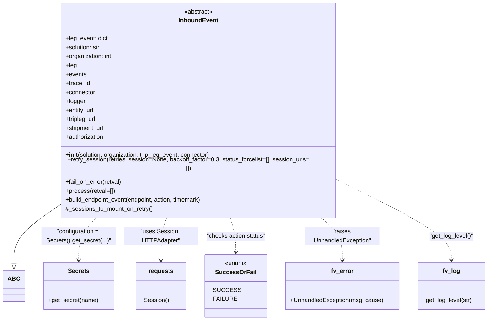

# Diagram: shipment_core/scheduled_services/scheduled_services/finished_vehicle_event_orchestrator/inbound_event.py

> Auto-generated by Obscura crawlers

## Mermaid

> SVG rendering failed for this diagram.
