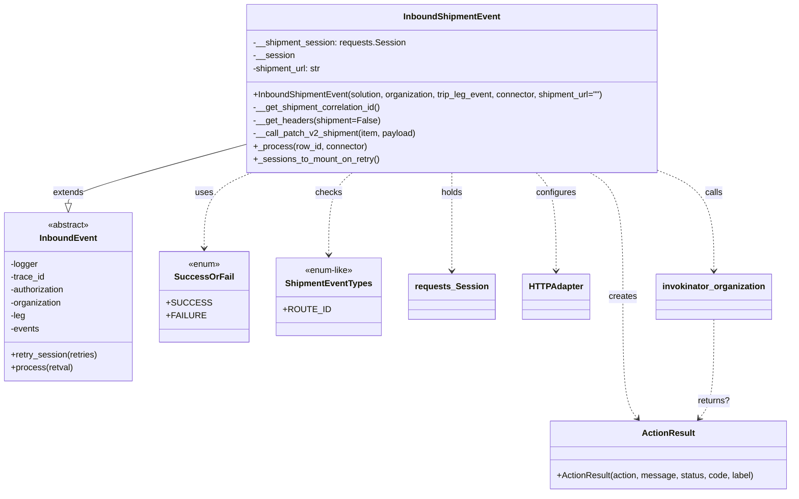

# Diagram: shipment_core/scheduled_services/scheduled_services/finished_vehicle_event_orchestrator/inbound_shipment_event.py

> Auto-generated by Obscura crawlers

## Mermaid

### SVG

<svg id="container" width="1407.96875" xmlns="http://www.w3.org/2000/svg" class="classDiagram" height="914" viewBox="0 0 1407.96875 914" role="graphics-document document" aria-roledescription="class"><g><defs><marker id="container_class-aggregationStart" class="marker aggregation class" refX="18" refY="7" markerWidth="190" markerHeight="240" orient="auto"><path d="M 18,7 L9,13 L1,7 L9,1 Z"></path></marker></defs><defs><marker id="container_class-aggregationEnd" class="marker aggregation class" refX="1" refY="7" markerWidth="20" markerHeight="28" orient="auto"><path d="M 18,7 L9,13 L1,7 L9,1 Z"></path></marker></defs><defs><marker id="container_class-extensionStart" class="marker extension class" refX="18" refY="7" markerWidth="190" markerHeight="240" orient="auto"><path d="M 1,7 L18,13 V 1 Z"></path></marker></defs><defs><marker id="container_class-extensionEnd" class="marker extension class" refX="1" refY="7" markerWidth="20" markerHeight="28" orient="auto"><path d="M 1,1 V 13 L18,7 Z"></path></marker></defs><defs><marker id="container_class-compositionStart" class="marker composition class" refX="18" refY="7" markerWidth="190" markerHeight="240" orient="auto"><path d="M 18,7 L9,13 L1,7 L9,1 Z"></path></marker></defs><defs><marker id="container_class-compositionEnd" class="marker composition class" refX="1" refY="7" markerWidth="20" markerHeight="28" orient="auto"><path d="M 18,7 L9,13 L1,7 L9,1 Z"></path></marker></defs><defs><marker id="container_class-dependencyStart" class="marker dependency class" refX="6" refY="7" markerWidth="190" markerHeight="240" orient="auto"><path d="M 5,7 L9,13 L1,7 L9,1 Z"></path></marker></defs><defs><marker id="container_class-dependencyEnd" class="marker dependency class" refX="13" refY="7" markerWidth="20" markerHeight="28" orient="auto"><path d="M 18,7 L9,13 L14,7 L9,1 Z"></path></marker></defs><defs><marker id="container_class-lollipopStart" class="marker lollipop class" refX="13" refY="7" markerWidth="190" markerHeight="240" orient="auto"><circle stroke="black" fill="transparent" cx="7" cy="7" r="6"></circle></marker></defs><defs><marker id="container_class-lollipopEnd" class="marker lollipop class" refX="1" refY="7" markerWidth="190" markerHeight="240" orient="auto"><circle stroke="black" fill="transparent" cx="7" cy="7" r="6"></circle></marker></defs><g class="root"><g class="clusters"></g><g class="edgePaths"><path d="M406.797,275.891L360.025,289.409C313.253,302.927,219.708,329.964,172.936,346.773C126.164,363.583,126.164,370.167,126.164,373.458L126.164,376.75" id="id_InboundShipmentEvent_InboundEvent_1" class="edge-thickness-normal edge-pattern-solid relation" style=";;;" data-edge="true" data-et="edge" data-id="id_InboundShipmentEvent_InboundEvent_1" data-points="W3sieCI6NDA2Ljc5Njg3NSwieSI6Mjc1Ljg5MDUwNDcxNDg4NDA2fSx7IngiOjEyNi4xNjQwNjI1LCJ5IjozNTd9LHsieCI6MTI2LjE2NDA2MjUsInkiOjM5NH1d" marker-end="url(#container_class-extensionEnd)"></path><path d="M1041.506,320L1051.293,326.167C1061.08,332.333,1080.653,344.667,1090.44,383C1100.227,421.333,1100.227,485.667,1100.227,550C1100.227,614.333,1100.227,678.667,1104.661,716.227C1109.094,753.788,1117.962,764.577,1122.396,769.971L1126.83,775.365" id="id_InboundShipmentEvent_ActionResult_2" class="edge-thickness-normal edge-pattern-dashed relation" style=";;;" data-edge="true" data-et="edge" data-id="id_InboundShipmentEvent_ActionResult_2" data-points="W3sieCI6MTA0MS41MDY0MzYyMDQ2NjMzLCJ5IjozMjB9LHsieCI6MTEwMC4yMjY1NjI1LCJ5IjozNTd9LHsieCI6MTEwMC4yMjY1NjI1LCJ5Ijo1NTB9LHsieCI6MTEwMC4yMjY1NjI1LCJ5Ijo3NDN9LHsieCI6MTEzMC42NDAyNzM0Mzc1LCJ5Ijo3ODB9XQ==" marker-end="url(#container_class-dependencyEnd)"></path><path d="M448.168,320L434.5,326.167C420.832,332.333,393.496,344.667,379.828,368C366.16,391.333,366.16,425.667,366.16,442.833L366.16,460" id="id_InboundShipmentEvent_SuccessOrFail_3" class="edge-thickness-normal edge-pattern-dashed relation" style=";;;" data-edge="true" data-et="edge" data-id="id_InboundShipmentEvent_SuccessOrFail_3" data-points="W3sieCI6NDQ4LjE2Nzc4NjU5MzI2NDIsInkiOjMyMH0seyJ4IjozNjYuMTYwMTU2MjUsInkiOjM1N30seyJ4IjozNjYuMTYwMTU2MjUsInkiOjQ2Nn1d" marker-end="url(#container_class-dependencyEnd)"></path><path d="M619.345,320L612.444,326.167C605.543,332.333,591.74,344.667,584.839,370C577.938,395.333,577.938,433.667,577.938,452.833L577.938,472" id="id_InboundShipmentEvent_ShipmentEventTypes_4" class="edge-thickness-normal edge-pattern-dashed relation" style=";;;" data-edge="true" data-et="edge" data-id="id_InboundShipmentEvent_ShipmentEventTypes_4" data-points="W3sieCI6NjE5LjM0NTMyODY5MTcwOTgsInkiOjMyMH0seyJ4Ijo1NzcuOTM3NSwieSI6MzU3fSx7IngiOjU3Ny45Mzc1LCJ5Ijo0Nzh9XQ==" marker-end="url(#container_class-dependencyEnd)"></path><path d="M793.93,320L793.93,326.167C793.93,332.333,793.93,344.667,793.93,375C793.93,405.333,793.93,453.667,793.93,477.833L793.93,502" id="id_InboundShipmentEvent_requests_Session_5" class="edge-thickness-normal edge-pattern-dashed relation" style=";;;" data-edge="true" data-et="edge" data-id="id_InboundShipmentEvent_requests_Session_5" data-points="W3sieCI6NzkzLjkyOTY4NzUsInkiOjMyMH0seyJ4Ijo3OTMuOTI5Njg3NSwieSI6MzU3fSx7IngiOjc5My45Mjk2ODc1LCJ5Ijo1MDh9XQ==" marker-end="url(#container_class-dependencyEnd)"></path><path d="M943.937,320L949.867,326.167C955.797,332.333,967.656,344.667,973.586,375C979.516,405.333,979.516,453.667,979.516,477.833L979.516,502" id="id_InboundShipmentEvent_HTTPAdapter_6" class="edge-thickness-normal edge-pattern-dashed relation" style=";;;" data-edge="true" data-et="edge" data-id="id_InboundShipmentEvent_HTTPAdapter_6" data-points="W3sieCI6OTQzLjkzNjk3Mzc2OTQzMDEsInkiOjMyMH0seyJ4Ijo5NzkuNTE1NjI1LCJ5IjozNTd9LHsieCI6OTc5LjUxNTYyNSwieSI6NTA4fV0=" marker-end="url(#container_class-dependencyEnd)"></path><path d="M1174.388,320L1189.428,326.167C1204.467,332.333,1234.546,344.667,1249.586,375C1264.625,405.333,1264.625,453.667,1264.625,477.833L1264.625,502" id="id_InboundShipmentEvent_invokinator_organization_7" class="edge-thickness-normal edge-pattern-dashed relation" style=";;;" data-edge="true" data-et="edge" data-id="id_InboundShipmentEvent_invokinator_organization_7" data-points="W3sieCI6MTE3NC4zODgwNzQ4MDU2OTk1LCJ5IjozMjB9LHsieCI6MTI2NC42MjUsInkiOjM1N30seyJ4IjoxMjY0LjYyNSwieSI6NTA4fV0=" marker-end="url(#container_class-dependencyEnd)"></path><path d="M1264.625,592L1264.625,617.167C1264.625,642.333,1264.625,692.667,1260.191,723.227C1255.757,753.788,1246.889,764.577,1242.455,769.971L1238.021,775.365" id="id_invokinator_organization_ActionResult_8" class="edge-thickness-normal edge-pattern-dashed relation" style=";;;" data-edge="true" data-et="edge" data-id="id_invokinator_organization_ActionResult_8" data-points="W3sieCI6MTI2NC42MjUsInkiOjU5Mn0seyJ4IjoxMjY0LjYyNSwieSI6NzQzfSx7IngiOjEyMzQuMjExMjg5MDYyNSwieSI6NzgwfV0=" marker-end="url(#container_class-dependencyEnd)"></path></g><g class="edgeLabels"><g class="edgeLabel" transform="translate(126.1640625, 357)"><g class="label" data-id="id_InboundShipmentEvent_InboundEvent_1" transform="translate(-28.5078125, -12)"><foreignObject width="57.015625" height="24">

extends

</foreignObject></g></g><g class="edgeLabel" transform="translate(1100.2265625, 550)"><g class="label" data-id="id_InboundShipmentEvent_ActionResult_2" transform="translate(-26.171875, -12)"><foreignObject width="52.34375" height="24">

creates

</foreignObject></g></g><g class="edgeLabel" transform="translate(366.16015625, 357)"><g class="label" data-id="id_InboundShipmentEvent_SuccessOrFail_3" transform="translate(-16.4921875, -12)"><foreignObject width="32.984375" height="24">

uses

</foreignObject></g></g><g class="edgeLabel" transform="translate(577.9375, 357)"><g class="label" data-id="id_InboundShipmentEvent_ShipmentEventTypes_4" transform="translate(-24.4921875, -12)"><foreignObject width="48.984375" height="24">

checks

</foreignObject></g></g><g class="edgeLabel" transform="translate(793.9296875, 357)"><g class="label" data-id="id_InboundShipmentEvent_requests_Session_5" transform="translate(-20.1875, -12)"><foreignObject width="40.375" height="24">

holds

</foreignObject></g></g><g class="edgeLabel" transform="translate(979.515625, 357)"><g class="label" data-id="id_InboundShipmentEvent_HTTPAdapter_6" transform="translate(-37.3046875, -12)"><foreignObject width="74.609375" height="24">

configures

</foreignObject></g></g><g class="edgeLabel" transform="translate(1264.625, 357)"><g class="label" data-id="id_InboundShipmentEvent_invokinator_organization_7" transform="translate(-16.4453125, -12)"><foreignObject width="32.890625" height="24">

calls

</foreignObject></g></g><g class="edgeLabel" transform="translate(1264.625, 743)"><g class="label" data-id="id_invokinator_organization_ActionResult_8" transform="translate(-29.703125, -12)"><foreignObject width="59.40625" height="24">

returns?

</foreignObject></g></g></g><g class="nodes"><g class="node default" id="classId-InboundEvent-0" transform="translate(126.1640625, 550)"><g class="basic label-container"><path d="M-118.1640625 -156 L118.1640625 -156 L118.1640625 156 L-118.1640625 156" stroke="none" stroke-width="0" fill="#ECECFF" style=""></path><path d="M-118.1640625 -156 C-39.182606172299785 -156, 39.79885015540043 -156, 118.1640625 -156 M-118.1640625 -156 C-61.70792848591688 -156, -5.251794471833762 -156, 118.1640625 -156 M118.1640625 -156 C118.1640625 -84.7306436384868, 118.1640625 -13.461287276973593, 118.1640625 156 M118.1640625 -156 C118.1640625 -52.19679169162785, 118.1640625 51.6064166167443, 118.1640625 156 M118.1640625 156 C31.773543065866292 156, -54.616976368267416 156, -118.1640625 156 M118.1640625 156 C70.1670403920617 156, 22.170018284123373 156, -118.1640625 156 M-118.1640625 156 C-118.1640625 70.99381347254679, -118.1640625 -14.01237305490642, -118.1640625 -156 M-118.1640625 156 C-118.1640625 64.90220317269637, -118.1640625 -26.19559365460725, -118.1640625 -156" stroke="#9370DB" stroke-width="1.3" fill="none" stroke-dasharray="0 0" style=""></path></g><g class="annotation-group text" transform="translate(-38.609375, -132)"><g class="label" style="" transform="translate(0,-12)"><foreignObject width="77.21875" height="24">

«abstract»

</foreignObject></g></g><g class="label-group text" transform="translate(-50.609375, -108)"><g class="label" style="font-weight: bolder" transform="translate(0,-12)"><foreignObject width="101.21875" height="24">

InboundEvent

</foreignObject></g></g><g class="members-group text" transform="translate(-106.1640625, -60)"><g class="label" style="" transform="translate(0,-12)"><foreignObject width="51.6875" height="24">

-logger

</foreignObject></g><g class="label" style="" transform="translate(0,12)"><foreignObject width="64.59375" height="24">

-trace_id

</foreignObject></g><g class="label" style="" transform="translate(0,36)"><foreignObject width="103.875" height="24">

-authorization

</foreignObject></g><g class="label" style="" transform="translate(0,60)"><foreignObject width="96.8125" height="24">

-organization

</foreignObject></g><g class="label" style="" transform="translate(0,84)"><foreignObject width="28.109375" height="24">

-leg

</foreignObject></g><g class="label" style="" transform="translate(0,108)"><foreignObject width="54.265625" height="24">

-events

</foreignObject></g></g><g class="methods-group text" transform="translate(-106.1640625, 108)"><g class="label" style="" transform="translate(0,-12)"><foreignObject width="161.71875" height="24">

+retry_session(retries)

</foreignObject></g><g class="label" style="" transform="translate(0,12)"><foreignObject width="114.703125" height="24">

+process(retval)

</foreignObject></g></g><g class="divider" style=""><path d="M-118.1640625 -84 C-55.531332667670284 -84, 7.101397164659431 -84, 118.1640625 -84 M-118.1640625 -84 C-33.771943619255154 -84, 50.62017526148969 -84, 118.1640625 -84" stroke="#9370DB" stroke-width="1.3" fill="none" stroke-dasharray="0 0" style=""></path></g><g class="divider" style=""><path d="M-118.1640625 84 C-69.09344736182021 84, -20.022832223640435 84, 118.1640625 84 M-118.1640625 84 C-38.74192568076772 84, 40.68021113846456 84, 118.1640625 84" stroke="#9370DB" stroke-width="1.3" fill="none" stroke-dasharray="0 0" style=""></path></g></g><g class="node default" id="classId-InboundShipmentEvent-1" transform="translate(793.9296875, 164)"><g class="basic label-container"><path d="M-387.1328125 -156 L387.1328125 -156 L387.1328125 156 L-387.1328125 156" stroke="none" stroke-width="0" fill="#ECECFF" style=""></path><path d="M-387.1328125 -156 C-201.8270880338461 -156, -16.52136356769222 -156, 387.1328125 -156 M-387.1328125 -156 C-188.46244974908655 -156, 10.20791300182691 -156, 387.1328125 -156 M387.1328125 -156 C387.1328125 -73.9529480334648, 387.1328125 8.094103933070386, 387.1328125 156 M387.1328125 -156 C387.1328125 -89.15971622686398, 387.1328125 -22.319432453727956, 387.1328125 156 M387.1328125 156 C132.60691150479968 156, -121.91898949040063 156, -387.1328125 156 M387.1328125 156 C136.27178374523885 156, -114.5892450095223 156, -387.1328125 156 M-387.1328125 156 C-387.1328125 61.78757969330279, -387.1328125 -32.42484061339442, -387.1328125 -156 M-387.1328125 156 C-387.1328125 67.1668928889543, -387.1328125 -21.666214222091412, -387.1328125 -156" stroke="#9370DB" stroke-width="1.3" fill="none" stroke-dasharray="0 0" style=""></path></g><g class="annotation-group text" transform="translate(0, -132)"></g><g class="label-group text" transform="translate(-85.71875, -132)"><g class="label" style="font-weight: bolder" transform="translate(0,-12)"><foreignObject width="171.4375" height="24">

InboundShipmentEvent

</foreignObject></g></g><g class="members-group text" transform="translate(-375.1328125, -84)"><g class="label" style="" transform="translate(0,-12)"><foreignObject width="282.75" height="24">

-__shipment_session: requests.Session

</foreignObject></g><g class="label" style="" transform="translate(0,12)"><foreignObject width="75.859375" height="24">

-__session

</foreignObject></g><g class="label" style="" transform="translate(0,36)"><foreignObject width="130.75" height="24">

-shipment_url: str

</foreignObject></g></g><g class="methods-group text" transform="translate(-375.1328125, 12)"><g class="label" style="" transform="translate(0,-12)"><foreignObject width="664.546875" height="24">

+InboundShipmentEvent(solution, organization, trip_leg_event, connector, shipment_url="")

</foreignObject></g><g class="label" style="" transform="translate(0,12)"><foreignObject width="241.484375" height="24">

-__get_shipment_correlation_id()

</foreignObject></g><g class="label" style="" transform="translate(0,36)"><foreignObject width="234.15625" height="24">

-__get_headers(shipment=False)

</foreignObject></g><g class="label" style="" transform="translate(0,60)"><foreignObject width="304.578125" height="24">

-__call_patch_v2_shipment(item, payload)

</foreignObject></g><g class="label" style="" transform="translate(0,84)"><foreignObject width="210.296875" height="24">

+_process(row_id, connector)

</foreignObject></g><g class="label" style="" transform="translate(0,108)"><foreignObject width="234.4375" height="24">

+_sessions_to_mount_on_retry()

</foreignObject></g></g><g class="divider" style=""><path d="M-387.1328125 -108 C-123.492039856264 -108, 140.148732787472 -108, 387.1328125 -108 M-387.1328125 -108 C-113.4820339764118 -108, 160.1687445471764 -108, 387.1328125 -108" stroke="#9370DB" stroke-width="1.3" fill="none" stroke-dasharray="0 0" style=""></path></g><g class="divider" style=""><path d="M-387.1328125 -12 C-170.0802432680356 -12, 46.972325963928824 -12, 387.1328125 -12 M-387.1328125 -12 C-102.27241054098943 -12, 182.58799141802115 -12, 387.1328125 -12" stroke="#9370DB" stroke-width="1.3" fill="none" stroke-dasharray="0 0" style=""></path></g></g><g class="node default" id="classId-ActionResult-2" transform="translate(1182.42578125, 843)"><g class="basic label-container"><path d="M-217.54296875 -63 L217.54296875 -63 L217.54296875 63 L-217.54296875 63" stroke="none" stroke-width="0" fill="#ECECFF" style=""></path><path d="M-217.54296875 -63 C-78.82792997982682 -63, 59.88710879034636 -63, 217.54296875 -63 M-217.54296875 -63 C-87.41557815081413 -63, 42.711812448371745 -63, 217.54296875 -63 M217.54296875 -63 C217.54296875 -27.69374810290683, 217.54296875 7.612503794186338, 217.54296875 63 M217.54296875 -63 C217.54296875 -29.450087315073027, 217.54296875 4.099825369853946, 217.54296875 63 M217.54296875 63 C105.21034463696654 63, -7.122279476066922 63, -217.54296875 63 M217.54296875 63 C122.86992563993425 63, 28.196882529868503 63, -217.54296875 63 M-217.54296875 63 C-217.54296875 23.21746430567964, -217.54296875 -16.565071388640717, -217.54296875 -63 M-217.54296875 63 C-217.54296875 16.67678901132124, -217.54296875 -29.64642197735752, -217.54296875 -63" stroke="#9370DB" stroke-width="1.3" fill="none" stroke-dasharray="0 0" style=""></path></g><g class="annotation-group text" transform="translate(0, -39)"></g><g class="label-group text" transform="translate(-46.3203125, -39)"><g class="label" style="font-weight: bolder" transform="translate(0,-12)"><foreignObject width="92.640625" height="24">

ActionResult

</foreignObject></g></g><g class="members-group text" transform="translate(-205.54296875, 9)"></g><g class="methods-group text" transform="translate(-205.54296875, 39)"><g class="label" style="" transform="translate(0,-12)"><foreignObject width="364.765625" height="24">

+ActionResult(action, message, status, code, label)

</foreignObject></g></g><g class="divider" style=""><path d="M-217.54296875 -15 C-87.66356689743537 -15, 42.21583495512925 -15, 217.54296875 -15 M-217.54296875 -15 C-72.33279538416693 -15, 72.87737798166614 -15, 217.54296875 -15" stroke="#9370DB" stroke-width="1.3" fill="none" stroke-dasharray="0 0" style=""></path></g><g class="divider" style=""><path d="M-217.54296875 9 C-54.98020134406036 9, 107.58256606187928 9, 217.54296875 9 M-217.54296875 9 C-129.8059486596227 9, -42.0689285692454 9, 217.54296875 9" stroke="#9370DB" stroke-width="1.3" fill="none" stroke-dasharray="0 0" style=""></path></g></g><g class="node default" id="classId-SuccessOrFail-3" transform="translate(366.16015625, 550)"><g class="basic label-container"><path d="M-71.83203125 -84 L71.83203125 -84 L71.83203125 84 L-71.83203125 84" stroke="none" stroke-width="0" fill="#ECECFF" style=""></path><path d="M-71.83203125 -84 C-18.60160243926952 -84, 34.62882637146096 -84, 71.83203125 -84 M-71.83203125 -84 C-35.659483305277405 -84, 0.5130646394451901 -84, 71.83203125 -84 M71.83203125 -84 C71.83203125 -37.61664053069156, 71.83203125 8.766718938616876, 71.83203125 84 M71.83203125 -84 C71.83203125 -45.49699452373817, 71.83203125 -6.993989047476333, 71.83203125 84 M71.83203125 84 C14.542342069720391 84, -42.74734711055922 84, -71.83203125 84 M71.83203125 84 C25.557362911921118 84, -20.717305426157765 84, -71.83203125 84 M-71.83203125 84 C-71.83203125 43.62208390004289, -71.83203125 3.2441678000857763, -71.83203125 -84 M-71.83203125 84 C-71.83203125 37.03396088671324, -71.83203125 -9.932078226573523, -71.83203125 -84" stroke="#9370DB" stroke-width="1.3" fill="none" stroke-dasharray="0 0" style=""></path></g><g class="annotation-group text" transform="translate(-29.53125, -60)"><g class="label" style="" transform="translate(0,-12)"><foreignObject width="59.0625" height="24">

«enum»

</foreignObject></g></g><g class="label-group text" transform="translate(-49.7578125, -36)"><g class="label" style="font-weight: bolder" transform="translate(0,-12)"><foreignObject width="99.515625" height="24">

SuccessOrFail

</foreignObject></g></g><g class="members-group text" transform="translate(-59.83203125, 12)"><g class="label" style="" transform="translate(0,-12)"><foreignObject width="69.90625" height="24">

+SUCCESS

</foreignObject></g><g class="label" style="" transform="translate(0,12)"><foreignObject width="65.34375" height="24">

+FAILURE

</foreignObject></g></g><g class="methods-group text" transform="translate(-59.83203125, 84)"></g><g class="divider" style=""><path d="M-71.83203125 -12 C-36.217504117287255 -12, -0.6029769845745108 -12, 71.83203125 -12 M-71.83203125 -12 C-40.0538543911092 -12, -8.275677532218396 -12, 71.83203125 -12" stroke="#9370DB" stroke-width="1.3" fill="none" stroke-dasharray="0 0" style=""></path></g><g class="divider" style=""><path d="M-71.83203125 60 C-25.331495043813533 60, 21.169041162372935 60, 71.83203125 60 M-71.83203125 60 C-26.00722868754051 60, 19.817573874918978 60, 71.83203125 60" stroke="#9370DB" stroke-width="1.3" fill="none" stroke-dasharray="0 0" style=""></path></g></g><g class="node default" id="classId-ShipmentEventTypes-4" transform="translate(577.9375, 550)"><g class="basic label-container"><path d="M-89.9453125 -72 L89.9453125 -72 L89.9453125 72 L-89.9453125 72" stroke="none" stroke-width="0" fill="#ECECFF" style=""></path><path d="M-89.9453125 -72 C-44.95550691812315 -72, 0.034298663753702385 -72, 89.9453125 -72 M-89.9453125 -72 C-33.611432920041715 -72, 22.72244665991657 -72, 89.9453125 -72 M89.9453125 -72 C89.9453125 -19.32258725788902, 89.9453125 33.35482548422196, 89.9453125 72 M89.9453125 -72 C89.9453125 -33.24985170565208, 89.9453125 5.500296588695846, 89.9453125 72 M89.9453125 72 C44.89078144241572 72, -0.16374961516855535 72, -89.9453125 72 M89.9453125 72 C22.162220074146077 72, -45.620872351707845 72, -89.9453125 72 M-89.9453125 72 C-89.9453125 37.71929366994172, -89.9453125 3.4385873398834406, -89.9453125 -72 M-89.9453125 72 C-89.9453125 31.468546804237157, -89.9453125 -9.062906391525686, -89.9453125 -72" stroke="#9370DB" stroke-width="1.3" fill="none" stroke-dasharray="0 0" style=""></path></g><g class="annotation-group text" transform="translate(-45.578125, -48)"><g class="label" style="" transform="translate(0,-12)"><foreignObject width="91.15625" height="24">

«enum-like»

</foreignObject></g></g><g class="label-group text" transform="translate(-76.515625, -24)"><g class="label" style="font-weight: bolder" transform="translate(0,-12)"><foreignObject width="153.03125" height="24">

ShipmentEventTypes

</foreignObject></g></g><g class="members-group text" transform="translate(-77.9453125, 24)"><g class="label" style="" transform="translate(0,-12)"><foreignObject width="79.375" height="24">

+ROUTE_ID

</foreignObject></g></g><g class="methods-group text" transform="translate(-77.9453125, 72)"></g><g class="divider" style=""><path d="M-89.9453125 0 C-47.27787560860277 0, -4.61043871720554 0, 89.9453125 0 M-89.9453125 0 C-29.678308734952473 0, 30.588695030095053 0, 89.9453125 0" stroke="#9370DB" stroke-width="1.3" fill="none" stroke-dasharray="0 0" style=""></path></g><g class="divider" style=""><path d="M-89.9453125 48 C-34.87562602783819 48, 20.194060444323625 48, 89.9453125 48 M-89.9453125 48 C-26.287870651372387 48, 37.369571197255226 48, 89.9453125 48" stroke="#9370DB" stroke-width="1.3" fill="none" stroke-dasharray="0 0" style=""></path></g></g><g class="node default" id="classId-requests_Session-5" transform="translate(793.9296875, 550)"><g class="basic label-container"><path d="M-76.046875 -42 L76.046875 -42 L76.046875 42 L-76.046875 42" stroke="none" stroke-width="0" fill="#ECECFF" style=""></path><path d="M-76.046875 -42 C-34.9770796852587 -42, 6.092715629482598 -42, 76.046875 -42 M-76.046875 -42 C-29.981534108415254 -42, 16.083806783169493 -42, 76.046875 -42 M76.046875 -42 C76.046875 -17.523929160800705, 76.046875 6.95214167839859, 76.046875 42 M76.046875 -42 C76.046875 -16.33267766167661, 76.046875 9.334644676646782, 76.046875 42 M76.046875 42 C41.960422601271674 42, 7.873970202543347 42, -76.046875 42 M76.046875 42 C41.68128019170294 42, 7.315685383405878 42, -76.046875 42 M-76.046875 42 C-76.046875 23.27029915474721, -76.046875 4.5405983094944204, -76.046875 -42 M-76.046875 42 C-76.046875 15.92316224582419, -76.046875 -10.153675508351618, -76.046875 -42" stroke="#9370DB" stroke-width="1.3" fill="none" stroke-dasharray="0 0" style=""></path></g><g class="annotation-group text" transform="translate(0, -18)"></g><g class="label-group text" transform="translate(-64.046875, -18)"><g class="label" style="font-weight: bolder" transform="translate(0,-12)"><foreignObject width="128.09375" height="24">

requests_Session

</foreignObject></g></g><g class="members-group text" transform="translate(-64.046875, 30)"></g><g class="methods-group text" transform="translate(-64.046875, 60)"></g><g class="divider" style=""><path d="M-76.046875 6 C-35.56420757810408 6, 4.918459843791837 6, 76.046875 6 M-76.046875 6 C-30.373529417507257 6, 15.299816164985486 6, 76.046875 6" stroke="#9370DB" stroke-width="1.3" fill="none" stroke-dasharray="0 0" style=""></path></g><g class="divider" style=""><path d="M-76.046875 24 C-42.47103068615137 24, -8.895186372302746 24, 76.046875 24 M-76.046875 24 C-25.057906450080928 24, 25.931062099838144 24, 76.046875 24" stroke="#9370DB" stroke-width="1.3" fill="none" stroke-dasharray="0 0" style=""></path></g></g><g class="node default" id="classId-HTTPAdapter-6" transform="translate(979.515625, 550)"><g class="basic label-container"><path d="M-59.5390625 -42 L59.5390625 -42 L59.5390625 42 L-59.5390625 42" stroke="none" stroke-width="0" fill="#ECECFF" style=""></path><path d="M-59.5390625 -42 C-17.74576613901123 -42, 24.04753022197754 -42, 59.5390625 -42 M-59.5390625 -42 C-25.09693176294588 -42, 9.345198974108243 -42, 59.5390625 -42 M59.5390625 -42 C59.5390625 -24.557459581683094, 59.5390625 -7.114919163366189, 59.5390625 42 M59.5390625 -42 C59.5390625 -23.640408804530328, 59.5390625 -5.280817609060655, 59.5390625 42 M59.5390625 42 C17.597773550696772 42, -24.343515398606456 42, -59.5390625 42 M59.5390625 42 C20.864483590840756 42, -17.81009531831849 42, -59.5390625 42 M-59.5390625 42 C-59.5390625 20.718224164406614, -59.5390625 -0.5635516711867723, -59.5390625 -42 M-59.5390625 42 C-59.5390625 22.496453291798606, -59.5390625 2.992906583597211, -59.5390625 -42" stroke="#9370DB" stroke-width="1.3" fill="none" stroke-dasharray="0 0" style=""></path></g><g class="annotation-group text" transform="translate(0, -18)"></g><g class="label-group text" transform="translate(-47.5390625, -18)"><g class="label" style="font-weight: bolder" transform="translate(0,-12)"><foreignObject width="95.078125" height="24">

HTTPAdapter

</foreignObject></g></g><g class="members-group text" transform="translate(-47.5390625, 30)"></g><g class="methods-group text" transform="translate(-47.5390625, 60)"></g><g class="divider" style=""><path d="M-59.5390625 6 C-23.27284590879826 6, 12.99337068240348 6, 59.5390625 6 M-59.5390625 6 C-34.414732748604266 6, -9.290402997208538 6, 59.5390625 6" stroke="#9370DB" stroke-width="1.3" fill="none" stroke-dasharray="0 0" style=""></path></g><g class="divider" style=""><path d="M-59.5390625 24 C-22.82732457574513 24, 13.884413348509739 24, 59.5390625 24 M-59.5390625 24 C-28.221993202615163 24, 3.0950760947696736 24, 59.5390625 24" stroke="#9370DB" stroke-width="1.3" fill="none" stroke-dasharray="0 0" style=""></path></g></g><g class="node default" id="classId-invokinator_organization-7" transform="translate(1264.625, 550)"><g class="basic label-container"><path d="M-103.2265625 -42 L103.2265625 -42 L103.2265625 42 L-103.2265625 42" stroke="none" stroke-width="0" fill="#ECECFF" style=""></path><path d="M-103.2265625 -42 C-30.061211940577266 -42, 43.10413861884547 -42, 103.2265625 -42 M-103.2265625 -42 C-46.68541126640354 -42, 9.855739967192918 -42, 103.2265625 -42 M103.2265625 -42 C103.2265625 -20.16653922756903, 103.2265625 1.6669215448619426, 103.2265625 42 M103.2265625 -42 C103.2265625 -18.486815141468778, 103.2265625 5.026369717062444, 103.2265625 42 M103.2265625 42 C22.244486001367108 42, -58.737590497265785 42, -103.2265625 42 M103.2265625 42 C23.88311721458882 42, -55.46032807082236 42, -103.2265625 42 M-103.2265625 42 C-103.2265625 17.471517993918745, -103.2265625 -7.05696401216251, -103.2265625 -42 M-103.2265625 42 C-103.2265625 24.119113086915142, -103.2265625 6.238226173830284, -103.2265625 -42" stroke="#9370DB" stroke-width="1.3" fill="none" stroke-dasharray="0 0" style=""></path></g><g class="annotation-group text" transform="translate(0, -18)"></g><g class="label-group text" transform="translate(-91.2265625, -18)"><g class="label" style="font-weight: bolder" transform="translate(0,-12)"><foreignObject width="182.453125" height="24">

invokinator_organization

</foreignObject></g></g><g class="members-group text" transform="translate(-91.2265625, 30)"></g><g class="methods-group text" transform="translate(-91.2265625, 60)"></g><g class="divider" style=""><path d="M-103.2265625 6 C-31.646005221657177 6, 39.93455205668565 6, 103.2265625 6 M-103.2265625 6 C-39.96085037219292 6, 23.304861755614155 6, 103.2265625 6" stroke="#9370DB" stroke-width="1.3" fill="none" stroke-dasharray="0 0" style=""></path></g><g class="divider" style=""><path d="M-103.2265625 24 C-25.47945529022762 24, 52.26765191954476 24, 103.2265625 24 M-103.2265625 24 C-26.999560540914274 24, 49.22744141817145 24, 103.2265625 24" stroke="#9370DB" stroke-width="1.3" fill="none" stroke-dasharray="0 0" style=""></path></g></g></g></g></g></svg>
