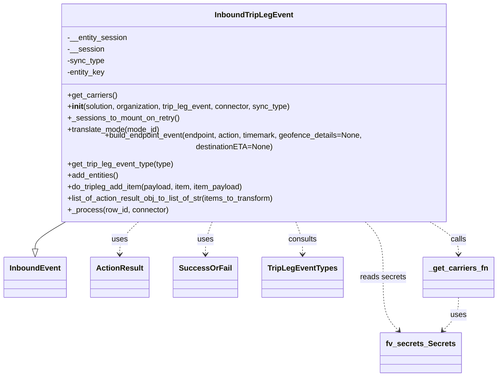

# Diagram: shipment_core/scheduled_services/scheduled_services/finished_vehicle_event_orchestrator/inbound_trip_leg_event.py


> Auto-generated by Obscura crawlers

## Diagram 1



### SVG

<svg id="container" width="1001.109375" xmlns="http://www.w3.org/2000/svg" class="classDiagram" height="764" viewBox="0 0 1001.109375 764" role="graphics-document document" aria-roledescription="class"><style>#container{font-family:"trebuchet ms",verdana,arial,sans-serif;font-size:16px;fill:#333;}@keyframes edge-animation-frame{from{stroke-dashoffset:0;}}@keyframes dash{to{stroke-dashoffset:0;}}#container .edge-animation-slow{stroke-dasharray:9,5!important;stroke-dashoffset:900;animation:dash 50s linear infinite;stroke-linecap:round;}#container .edge-animation-fast{stroke-dasharray:9,5!important;stroke-dashoffset:900;animation:dash 20s linear infinite;stroke-linecap:round;}#container .error-icon{fill:#552222;}#container .error-text{fill:#552222;stroke:#552222;}#container .edge-thickness-normal{stroke-width:1px;}#container .edge-thickness-thick{stroke-width:3.5px;}#container .edge-pattern-solid{stroke-dasharray:0;}#container .edge-thickness-invisible{stroke-width:0;fill:none;}#container .edge-pattern-dashed{stroke-dasharray:3;}#container .edge-pattern-dotted{stroke-dasharray:2;}#container .marker{fill:#333333;stroke:#333333;}#container .marker.cross{stroke:#333333;}#container svg{font-family:"trebuchet ms",verdana,arial,sans-serif;font-size:16px;}#container p{margin:0;}#container g.classGroup text{fill:#9370DB;stroke:none;font-family:"trebuchet ms",verdana,arial,sans-serif;font-size:10px;}#container g.classGroup text .title{font-weight:bolder;}#container .nodeLabel,#container .edgeLabel{color:#131300;}#container .edgeLabel .label rect{fill:#ECECFF;}#container .label text{fill:#131300;}#container .labelBkg{background:#ECECFF;}#container .edgeLabel .label span{background:#ECECFF;}#container .classTitle{font-weight:bolder;}#container .node rect,#container .node circle,#container .node ellipse,#container .node polygon,#container .node path{fill:#ECECFF;stroke:#9370DB;stroke-width:1px;}#container .divider{stroke:#9370DB;stroke-width:1;}#container g.clickable{cursor:pointer;}#container g.classGroup rect{fill:#ECECFF;stroke:#9370DB;}#container g.classGroup line{stroke:#9370DB;stroke-width:1;}#container .classLabel .box{stroke:none;stroke-width:0;fill:#ECECFF;opacity:0.5;}#container .classLabel .label{fill:#9370DB;font-size:10px;}#container .relation{stroke:#333333;stroke-width:1;fill:none;}#container .dashed-line{stroke-dasharray:3;}#container .dotted-line{stroke-dasharray:1 2;}#container #compositionStart,#container .composition{fill:#333333!important;stroke:#333333!important;stroke-width:1;}#container #compositionEnd,#container .composition{fill:#333333!important;stroke:#333333!important;stroke-width:1;}#container #dependencyStart,#container .dependency{fill:#333333!important;stroke:#333333!important;stroke-width:1;}#container #dependencyStart,#container .dependency{fill:#333333!important;stroke:#333333!important;stroke-width:1;}#container #extensionStart,#container .extension{fill:transparent!important;stroke:#333333!important;stroke-width:1;}#container #extensionEnd,#container .extension{fill:transparent!important;stroke:#333333!important;stroke-width:1;}#container #aggregationStart,#container .aggregation{fill:transparent!important;stroke:#333333!important;stroke-width:1;}#container #aggregationEnd,#container .aggregation{fill:transparent!important;stroke:#333333!important;stroke-width:1;}#container #lollipopStart,#container .lollipop{fill:#ECECFF!important;stroke:#333333!important;stroke-width:1;}#container #lollipopEnd,#container .lollipop{fill:#ECECFF!important;stroke:#333333!important;stroke-width:1;}#container .edgeTerminals{font-size:11px;line-height:initial;}#container .classTitleText{text-anchor:middle;font-size:18px;fill:#333;}#container .label-icon{display:inline-block;height:1em;overflow:visible;vertical-align:-0.125em;}#container .node .label-icon path{fill:currentColor;stroke:revert;stroke-width:revert;}#container :root{--mermaid-font-family:"trebuchet ms",verdana,arial,sans-serif;}</style><g><defs><marker id="container_class-aggregationStart" class="marker aggregation class" refX="18" refY="7" markerWidth="190" markerHeight="240" orient="auto"><path d="M 18,7 L9,13 L1,7 L9,1 Z"></path></marker></defs><defs><marker id="container_class-aggregationEnd" class="marker aggregation class" refX="1" refY="7" markerWidth="20" markerHeight="28" orient="auto"><path d="M 18,7 L9,13 L1,7 L9,1 Z"></path></marker></defs><defs><marker id="container_class-extensionStart" class="marker extension class" refX="18" refY="7" markerWidth="190" markerHeight="240" orient="auto"><path d="M 1,7 L18,13 V 1 Z"></path></marker></defs><defs><marker id="container_class-extensionEnd" class="marker extension class" refX="1" refY="7" markerWidth="20" markerHeight="28" orient="auto"><path d="M 1,1 V 13 L18,7 Z"></path></marker></defs><defs><marker id="container_class-compositionStart" class="marker composition class" refX="18" refY="7" markerWidth="190" markerHeight="240" orient="auto"><path d="M 18,7 L9,13 L1,7 L9,1 Z"></path></marker></defs><defs><marker id="container_class-compositionEnd" class="marker composition class" refX="1" refY="7" markerWidth="20" markerHeight="28" orient="auto"><path d="M 18,7 L9,13 L1,7 L9,1 Z"></path></marker></defs><defs><marker id="container_class-dependencyStart" class="marker dependency class" refX="6" refY="7" markerWidth="190" markerHeight="240" orient="auto"><path d="M 5,7 L9,13 L1,7 L9,1 Z"></path></marker></defs><defs><marker id="container_class-dependencyEnd" class="marker dependency class" refX="13" refY="7" markerWidth="20" markerHeight="28" orient="auto"><path d="M 18,7 L9,13 L14,7 L9,1 Z"></path></marker></defs><defs><marker id="container_class-lollipopStart" class="marker lollipop class" refX="13" refY="7" markerWidth="190" markerHeight="240" orient="auto"><circle stroke="black" fill="transparent" cx="7" cy="7" r="6"></circle></marker></defs><defs><marker id="container_class-lollipopEnd" class="marker lollipop class" refX="1" refY="7" markerWidth="190" markerHeight="240" orient="auto"><circle stroke="black" fill="transparent" cx="7" cy="7" r="6"></circle></marker></defs><g class="root"><g class="clusters"></g><g class="edgePaths"><path d="M134.536,440L123.881,446.167C113.227,452.333,91.918,464.667,81.264,474.125C70.609,483.583,70.609,490.167,70.609,493.458L70.609,496.75" id="id_InboundTripLegEvent_InboundEvent_1" class="edge-thickness-normal edge-pattern-solid relation" style=";;;" data-edge="true" data-et="edge" data-id="id_InboundTripLegEvent_InboundEvent_1" data-points="W3sieCI6MTM0LjUzNTYwNDAwMTk3NjMsInkiOjQ0MH0seyJ4Ijo3MC42MDkzNzUsInkiOjQ3N30seyJ4Ijo3MC42MDkzNzUsInkiOjUxNH1d" marker-end="url(#container_class-extensionEnd)"></path><path d="M280.468,440L273.98,446.167C267.491,452.333,254.515,464.667,248.027,476C241.539,487.333,241.539,497.667,241.539,502.833L241.539,508" id="id_InboundTripLegEvent_ActionResult_2" class="edge-thickness-normal edge-pattern-dashed relation" style=";;;" data-edge="true" data-et="edge" data-id="id_InboundTripLegEvent_ActionResult_2" data-points="W3sieCI6MjgwLjQ2NzY2OTIxOTM2NzYsInkiOjQ0MH0seyJ4IjoyNDEuNTM5MDYyNSwieSI6NDc3fSx7IngiOjI0MS41MzkwNjI1LCJ5Ijo1MTR9XQ==" marker-end="url(#container_class-dependencyEnd)"></path><path d="M425.673,440L423.33,446.167C420.988,452.333,416.302,464.667,413.96,476C411.617,487.333,411.617,497.667,411.617,502.833L411.617,508" id="id_InboundTripLegEvent_SuccessOrFail_3" class="edge-thickness-normal edge-pattern-dashed relation" style=";;;" data-edge="true" data-et="edge" data-id="id_InboundTripLegEvent_SuccessOrFail_3" data-points="W3sieCI6NDI1LjY3MjcwODc0NTA1OTI1LCJ5Ijo0NDB9LHsieCI6NDExLjYxNzE4NzUsInkiOjQ3N30seyJ4Ijo0MTEuNjE3MTg3NSwieSI6NTE0fV0=" marker-end="url(#container_class-dependencyEnd)"></path><path d="M589.78,440L592.123,446.167C594.466,452.333,599.151,464.667,601.493,476C603.836,487.333,603.836,497.667,603.836,502.833L603.836,508" id="id_InboundTripLegEvent_TripLegEventTypes_4" class="edge-thickness-normal edge-pattern-dashed relation" style=";;;" data-edge="true" data-et="edge" data-id="id_InboundTripLegEvent_TripLegEventTypes_4" data-points="W3sieCI6NTg5Ljc4MDQxNjI1NDk0MDcsInkiOjQ0MH0seyJ4Ijo2MDMuODM1OTM3NSwieSI6NDc3fSx7IngiOjYwMy44MzU5Mzc1LCJ5Ijo1MTR9XQ==" marker-end="url(#container_class-dependencyEnd)"></path><path d="M729.229,440L735.553,446.167C741.877,452.333,754.524,464.667,760.848,484C767.172,503.333,767.172,529.667,767.172,556C767.172,582.333,767.172,608.667,772.499,627.285C777.827,645.903,788.482,656.806,793.809,662.257L799.137,667.709" id="id_InboundTripLegEvent_fv_secrets_Secrets_5" class="edge-thickness-normal edge-pattern-dashed relation" style=";;;" data-edge="true" data-et="edge" data-id="id_InboundTripLegEvent_fv_secrets_Secrets_5" data-points="W3sieCI6NzI5LjIyOTI3OTg5MTMwNDQsInkiOjQ0MH0seyJ4Ijo3NjcuMTcxODc1LCJ5Ijo0Nzd9LHsieCI6NzY3LjE3MTg3NSwieSI6NTU2fSx7IngiOjc2Ny4xNzE4NzUsInkiOjYzNX0seyJ4Ijo4MDMuMzMwMzAwNjMyOTExNCwieSI6NjcyfV0=" marker-end="url(#container_class-dependencyEnd)"></path><path d="M861.054,440L871.142,446.167C881.229,452.333,901.404,464.667,911.491,476C921.578,487.333,921.578,497.667,921.578,502.833L921.578,508" id="id_InboundTripLegEvent__get_carriers_fn_6" class="edge-thickness-normal edge-pattern-dashed relation" style=";;;" data-edge="true" data-et="edge" data-id="id_InboundTripLegEvent__get_carriers_fn_6" data-points="W3sieCI6ODYxLjA1NDM3ODcwNTUzMzYsInkiOjQ0MH0seyJ4Ijo5MjEuNTc4MTI1LCJ5Ijo0Nzd9LHsieCI6OTIxLjU3ODEyNSwieSI6NTE0fV0=" marker-end="url(#container_class-dependencyEnd)"></path><path d="M921.578,598L921.578,604.167C921.578,610.333,921.578,622.667,916.251,634.285C910.923,645.903,900.268,656.806,894.941,662.257L889.613,667.709" id="id__get_carriers_fn_fv_secrets_Secrets_7" class="edge-thickness-normal edge-pattern-dashed relation" style=";;;" data-edge="true" data-et="edge" data-id="id__get_carriers_fn_fv_secrets_Secrets_7" data-points="W3sieCI6OTIxLjU3ODEyNSwieSI6NTk4fSx7IngiOjkyMS41NzgxMjUsInkiOjYzNX0seyJ4Ijo4ODUuNDE5Njk5MzY3MDg4NiwieSI6NjcyfV0=" marker-end="url(#container_class-dependencyEnd)"></path></g><g class="edgeLabels"><g class="edgeLabel"><g class="label" data-id="id_InboundTripLegEvent_InboundEvent_1" transform="translate(0, 0)"><foreignObject width="0" height="0"><div xmlns="http://www.w3.org/1999/xhtml" class="labelBkg" style="display: table-cell; white-space: nowrap; line-height: 1.5; max-width: 200px; text-align: center;"><span class="edgeLabel"></span></div></foreignObject></g></g><g class="edgeLabel" transform="translate(241.5390625, 477)"><g class="label" data-id="id_InboundTripLegEvent_ActionResult_2" transform="translate(-16.4921875, -12)"><foreignObject width="32.984375" height="24"><div xmlns="http://www.w3.org/1999/xhtml" class="labelBkg" style="display: table-cell; white-space: nowrap; line-height: 1.5; max-width: 200px; text-align: center;"><span class="edgeLabel"><p>uses</p></span></div></foreignObject></g></g><g class="edgeLabel" transform="translate(411.6171875, 477)"><g class="label" data-id="id_InboundTripLegEvent_SuccessOrFail_3" transform="translate(-16.4921875, -12)"><foreignObject width="32.984375" height="24"><div xmlns="http://www.w3.org/1999/xhtml" class="labelBkg" style="display: table-cell; white-space: nowrap; line-height: 1.5; max-width: 200px; text-align: center;"><span class="edgeLabel"><p>uses</p></span></div></foreignObject></g></g><g class="edgeLabel" transform="translate(603.8359375, 477)"><g class="label" data-id="id_InboundTripLegEvent_TripLegEventTypes_4" transform="translate(-30.390625, -12)"><foreignObject width="60.78125" height="24"><div xmlns="http://www.w3.org/1999/xhtml" class="labelBkg" style="display: table-cell; white-space: nowrap; line-height: 1.5; max-width: 200px; text-align: center;"><span class="edgeLabel"><p>consults</p></span></div></foreignObject></g></g><g class="edgeLabel" transform="translate(767.171875, 556)"><g class="label" data-id="id_InboundTripLegEvent_fv_secrets_Secrets_5" transform="translate(-47.875, -12)"><foreignObject width="95.75" height="24"><div xmlns="http://www.w3.org/1999/xhtml" class="labelBkg" style="display: table-cell; white-space: nowrap; line-height: 1.5; max-width: 200px; text-align: center;"><span class="edgeLabel"><p>reads secrets</p></span></div></foreignObject></g></g><g class="edgeLabel" transform="translate(921.578125, 477)"><g class="label" data-id="id_InboundTripLegEvent__get_carriers_fn_6" transform="translate(-16.4453125, -12)"><foreignObject width="32.890625" height="24"><div xmlns="http://www.w3.org/1999/xhtml" class="labelBkg" style="display: table-cell; white-space: nowrap; line-height: 1.5; max-width: 200px; text-align: center;"><span class="edgeLabel"><p>calls</p></span></div></foreignObject></g></g><g class="edgeLabel" transform="translate(921.578125, 635)"><g class="label" data-id="id__get_carriers_fn_fv_secrets_Secrets_7" transform="translate(-16.4921875, -12)"><foreignObject width="32.984375" height="24"><div xmlns="http://www.w3.org/1999/xhtml" class="labelBkg" style="display: table-cell; white-space: nowrap; line-height: 1.5; max-width: 200px; text-align: center;"><span class="edgeLabel"><p>uses</p></span></div></foreignObject></g></g></g><g class="nodes"><g class="node default" id="classId-InboundEvent-0" transform="translate(70.609375, 556)"><g class="basic label-container"><path d="M-62.609375 -42 L62.609375 -42 L62.609375 42 L-62.609375 42" stroke="none" stroke-width="0" fill="#ECECFF" style=""></path><path d="M-62.609375 -42 C-31.541541774296775 -42, -0.4737085485935495 -42, 62.609375 -42 M-62.609375 -42 C-32.84508876978158 -42, -3.080802539563166 -42, 62.609375 -42 M62.609375 -42 C62.609375 -12.134267151723439, 62.609375 17.731465696553123, 62.609375 42 M62.609375 -42 C62.609375 -23.567670756147834, 62.609375 -5.135341512295668, 62.609375 42 M62.609375 42 C29.026400390718557 42, -4.556574218562886 42, -62.609375 42 M62.609375 42 C36.172843326991014 42, 9.736311653982028 42, -62.609375 42 M-62.609375 42 C-62.609375 21.780230942134818, -62.609375 1.5604618842696354, -62.609375 -42 M-62.609375 42 C-62.609375 10.628907357477242, -62.609375 -20.742185285045515, -62.609375 -42" stroke="#9370DB" stroke-width="1.3" fill="none" stroke-dasharray="0 0" style=""></path></g><g class="annotation-group text" transform="translate(0, -18)"></g><g class="label-group text" transform="translate(-50.609375, -18)"><g class="label" style="font-weight: bolder" transform="translate(0,-12)"><foreignObject width="101.21875" height="24"><div xmlns="http://www.w3.org/1999/xhtml" style="display: table-cell; white-space: nowrap; line-height: 1.5; max-width: 151px; text-align: center;"><span class="nodeLabel markdown-node-label" style=""><p>InboundEvent</p></span></div></foreignObject></g></g><g class="members-group text" transform="translate(-50.609375, 30)"></g><g class="methods-group text" transform="translate(-50.609375, 60)"></g><g class="divider" style=""><path d="M-62.609375 6 C-16.957950583448316 6, 28.69347383310337 6, 62.609375 6 M-62.609375 6 C-34.258736319627374 6, -5.908097639254741 6, 62.609375 6" stroke="#9370DB" stroke-width="1.3" fill="none" stroke-dasharray="0 0" style=""></path></g><g class="divider" style=""><path d="M-62.609375 24 C-23.39546800989592 24, 15.818438980208157 24, 62.609375 24 M-62.609375 24 C-28.363679850483244 24, 5.882015299033512 24, 62.609375 24" stroke="#9370DB" stroke-width="1.3" fill="none" stroke-dasharray="0 0" style=""></path></g></g><g class="node default" id="classId-InboundTripLegEvent-1" transform="translate(507.7265625, 224)"><g class="basic label-container"><path d="M-408.453125 -216 L408.453125 -216 L408.453125 216 L-408.453125 216" stroke="none" stroke-width="0" fill="#ECECFF" style=""></path><path d="M-408.453125 -216 C-166.95326321326115 -216, 74.5465985734777 -216, 408.453125 -216 M-408.453125 -216 C-161.4420157651308 -216, 85.56909346973839 -216, 408.453125 -216 M408.453125 -216 C408.453125 -87.67920008327536, 408.453125 40.64159983344928, 408.453125 216 M408.453125 -216 C408.453125 -57.815359259964055, 408.453125 100.36928148007189, 408.453125 216 M408.453125 216 C87.2290510130315 216, -233.995022973937 216, -408.453125 216 M408.453125 216 C212.43356085112998 216, 16.413996702259965 216, -408.453125 216 M-408.453125 216 C-408.453125 123.84051677048735, -408.453125 31.68103354097471, -408.453125 -216 M-408.453125 216 C-408.453125 47.26212651750399, -408.453125 -121.47574696499203, -408.453125 -216" stroke="#9370DB" stroke-width="1.3" fill="none" stroke-dasharray="0 0" style=""></path></g><g class="annotation-group text" transform="translate(0, -192)"></g><g class="label-group text" transform="translate(-77.65625, -192)"><g class="label" style="font-weight: bolder" transform="translate(0,-12)"><foreignObject width="155.3125" height="24"><div xmlns="http://www.w3.org/1999/xhtml" style="display: table-cell; white-space: nowrap; line-height: 1.5; max-width: 204px; text-align: center;"><span class="nodeLabel markdown-node-label" style=""><p>InboundTripLegEvent</p></span></div></foreignObject></g></g><g class="members-group text" transform="translate(-396.453125, -144)"><g class="label" style="" transform="translate(0,-12)"><foreignObject width="125.34375" height="24"><div xmlns="http://www.w3.org/1999/xhtml" style="display: table-cell; white-space: nowrap; line-height: 1.5; max-width: 183px; text-align: center;"><span class="nodeLabel markdown-node-label" style=""><p>-__entity_session</p></span></div></foreignObject></g><g class="label" style="" transform="translate(0,12)"><foreignObject width="75.859375" height="24"><div xmlns="http://www.w3.org/1999/xhtml" style="display: table-cell; white-space: nowrap; line-height: 1.5; max-width: 133px; text-align: center;"><span class="nodeLabel markdown-node-label" style=""><p>-__session</p></span></div></foreignObject></g><g class="label" style="" transform="translate(0,36)"><foreignObject width="78.34375" height="24"><div xmlns="http://www.w3.org/1999/xhtml" style="display: table-cell; white-space: nowrap; line-height: 1.5; max-width: 136px; text-align: center;"><span class="nodeLabel markdown-node-label" style=""><p>-sync_type</p></span></div></foreignObject></g><g class="label" style="" transform="translate(0,60)"><foreignObject width="80.828125" height="24"><div xmlns="http://www.w3.org/1999/xhtml" style="display: table-cell; white-space: nowrap; line-height: 1.5; max-width: 138px; text-align: center;"><span class="nodeLabel markdown-node-label" style=""><p>-entity_key</p></span></div></foreignObject></g></g><g class="methods-group text" transform="translate(-396.453125, -24)"><g class="label" style="" transform="translate(0,-12)"><foreignObject width="104.109375" height="24"><div xmlns="http://www.w3.org/1999/xhtml" style="display: table-cell; white-space: nowrap; line-height: 1.5; max-width: 161px; text-align: center;"><span class="nodeLabel markdown-node-label" style=""><p>+get_carriers()</p></span></div></foreignObject></g><g class="label" style="" transform="translate(0,12)"><foreignObject width="472.671875" height="24"><div xmlns="http://www.w3.org/1999/xhtml" style="display: table-cell; white-space: nowrap; line-height: 1.5; max-width: 561px; text-align: center;"><span class="nodeLabel markdown-node-label" style=""><p>+<strong>init</strong>(solution, organization, trip_leg_event, connector, sync_type)</p></span></div></foreignObject></g><g class="label" style="" transform="translate(0,36)"><foreignObject width="234.4375" height="24"><div xmlns="http://www.w3.org/1999/xhtml" style="display: table-cell; white-space: nowrap; line-height: 1.5; max-width: 292px; text-align: center;"><span class="nodeLabel markdown-node-label" style=""><p>+_sessions_to_mount_on_retry()</p></span></div></foreignObject></g><g class="label" style="" transform="translate(0,60)"><foreignObject width="195.5625" height="24"><div xmlns="http://www.w3.org/1999/xhtml" style="display: table-cell; white-space: nowrap; line-height: 1.5; max-width: 253px; text-align: center;"><span class="nodeLabel markdown-node-label" style=""><p>+translate_mode(mode_id)</p></span></div></foreignObject></g><g class="label" style="" transform="translate(0,84)"><foreignObject width="715.25" height="24"><div xmlns="http://www.w3.org/1999/xhtml" style="display: table-cell; white-space: nowrap; line-height: 1.5; max-width: 773px; text-align: center;"><span class="nodeLabel markdown-node-label" style=""><p>+build_endpoint_event(endpoint, action, timemark, geofence_details=None, destinationETA=None)</p></span></div></foreignObject></g><g class="label" style="" transform="translate(0,108)"><foreignObject width="224.359375" height="24"><div xmlns="http://www.w3.org/1999/xhtml" style="display: table-cell; white-space: nowrap; line-height: 1.5; max-width: 282px; text-align: center;"><span class="nodeLabel markdown-node-label" style=""><p>+get_trip_leg_event_type(type)</p></span></div></foreignObject></g><g class="label" style="" transform="translate(0,132)"><foreignObject width="108.828125" height="24"><div xmlns="http://www.w3.org/1999/xhtml" style="display: table-cell; white-space: nowrap; line-height: 1.5; max-width: 166px; text-align: center;"><span class="nodeLabel markdown-node-label" style=""><p>+add_entities()</p></span></div></foreignObject></g><g class="label" style="" transform="translate(0,156)"><foreignObject width="374.203125" height="24"><div xmlns="http://www.w3.org/1999/xhtml" style="display: table-cell; white-space: nowrap; line-height: 1.5; max-width: 432px; text-align: center;"><span class="nodeLabel markdown-node-label" style=""><p>+do_tripleg_add_item(payload, item, item_payload)</p></span></div></foreignObject></g><g class="label" style="" transform="translate(0,180)"><foreignObject width="442.40625" height="24"><div xmlns="http://www.w3.org/1999/xhtml" style="display: table-cell; white-space: nowrap; line-height: 1.5; max-width: 500px; text-align: center;"><span class="nodeLabel markdown-node-label" style=""><p>+list_of_action_result_obj_to_list_of_str(items_to_transform)</p></span></div></foreignObject></g><g class="label" style="" transform="translate(0,204)"><foreignObject width="210.296875" height="24"><div xmlns="http://www.w3.org/1999/xhtml" style="display: table-cell; white-space: nowrap; line-height: 1.5; max-width: 268px; text-align: center;"><span class="nodeLabel markdown-node-label" style=""><p>+_process(row_id, connector)</p></span></div></foreignObject></g></g><g class="divider" style=""><path d="M-408.453125 -168 C-232.833937847098 -168, -57.21475069419603 -168, 408.453125 -168 M-408.453125 -168 C-187.04238457558026 -168, 34.368355848839485 -168, 408.453125 -168" stroke="#9370DB" stroke-width="1.3" fill="none" stroke-dasharray="0 0" style=""></path></g><g class="divider" style=""><path d="M-408.453125 -48 C-138.59103376683498 -48, 131.27105746633003 -48, 408.453125 -48 M-408.453125 -48 C-153.97162066965427 -48, 100.50988366069146 -48, 408.453125 -48" stroke="#9370DB" stroke-width="1.3" fill="none" stroke-dasharray="0 0" style=""></path></g></g><g class="node default" id="classId-ActionResult-2" transform="translate(241.5390625, 556)"><g class="basic label-container"><path d="M-58.3203125 -42 L58.3203125 -42 L58.3203125 42 L-58.3203125 42" stroke="none" stroke-width="0" fill="#ECECFF" style=""></path><path d="M-58.3203125 -42 C-21.751885729231496 -42, 14.816541041537008 -42, 58.3203125 -42 M-58.3203125 -42 C-24.868583089605778 -42, 8.583146320788444 -42, 58.3203125 -42 M58.3203125 -42 C58.3203125 -10.213505146566558, 58.3203125 21.572989706866885, 58.3203125 42 M58.3203125 -42 C58.3203125 -19.06234786101168, 58.3203125 3.875304277976639, 58.3203125 42 M58.3203125 42 C23.338035321829473 42, -11.644241856341054 42, -58.3203125 42 M58.3203125 42 C32.3824384520142 42, 6.444564404028405 42, -58.3203125 42 M-58.3203125 42 C-58.3203125 18.577754236512245, -58.3203125 -4.84449152697551, -58.3203125 -42 M-58.3203125 42 C-58.3203125 16.462812927451836, -58.3203125 -9.074374145096328, -58.3203125 -42" stroke="#9370DB" stroke-width="1.3" fill="none" stroke-dasharray="0 0" style=""></path></g><g class="annotation-group text" transform="translate(0, -18)"></g><g class="label-group text" transform="translate(-46.3203125, -18)"><g class="label" style="font-weight: bolder" transform="translate(0,-12)"><foreignObject width="92.640625" height="24"><div xmlns="http://www.w3.org/1999/xhtml" style="display: table-cell; white-space: nowrap; line-height: 1.5; max-width: 141px; text-align: center;"><span class="nodeLabel markdown-node-label" style=""><p>ActionResult</p></span></div></foreignObject></g></g><g class="members-group text" transform="translate(-46.3203125, 30)"></g><g class="methods-group text" transform="translate(-46.3203125, 60)"></g><g class="divider" style=""><path d="M-58.3203125 6 C-12.755765430139391 6, 32.80878163972122 6, 58.3203125 6 M-58.3203125 6 C-14.824089170982283 6, 28.672134158035433 6, 58.3203125 6" stroke="#9370DB" stroke-width="1.3" fill="none" stroke-dasharray="0 0" style=""></path></g><g class="divider" style=""><path d="M-58.3203125 24 C-15.728513770034517 24, 26.863284959930965 24, 58.3203125 24 M-58.3203125 24 C-21.46641162761602 24, 15.387489244767963 24, 58.3203125 24" stroke="#9370DB" stroke-width="1.3" fill="none" stroke-dasharray="0 0" style=""></path></g></g><g class="node default" id="classId-SuccessOrFail-3" transform="translate(411.6171875, 556)"><g class="basic label-container"><path d="M-61.7578125 -42 L61.7578125 -42 L61.7578125 42 L-61.7578125 42" stroke="none" stroke-width="0" fill="#ECECFF" style=""></path><path d="M-61.7578125 -42 C-27.441382843745437 -42, 6.875046812509126 -42, 61.7578125 -42 M-61.7578125 -42 C-20.825188264768883 -42, 20.107435970462234 -42, 61.7578125 -42 M61.7578125 -42 C61.7578125 -17.980614691899557, 61.7578125 6.038770616200885, 61.7578125 42 M61.7578125 -42 C61.7578125 -16.118927924093914, 61.7578125 9.762144151812173, 61.7578125 42 M61.7578125 42 C19.743341417859334 42, -22.271129664281332 42, -61.7578125 42 M61.7578125 42 C17.06961095101287 42, -27.61859059797426 42, -61.7578125 42 M-61.7578125 42 C-61.7578125 16.205557625839372, -61.7578125 -9.588884748321256, -61.7578125 -42 M-61.7578125 42 C-61.7578125 11.029080073451269, -61.7578125 -19.941839853097463, -61.7578125 -42" stroke="#9370DB" stroke-width="1.3" fill="none" stroke-dasharray="0 0" style=""></path></g><g class="annotation-group text" transform="translate(0, -18)"></g><g class="label-group text" transform="translate(-49.7578125, -18)"><g class="label" style="font-weight: bolder" transform="translate(0,-12)"><foreignObject width="99.515625" height="24"><div xmlns="http://www.w3.org/1999/xhtml" style="display: table-cell; white-space: nowrap; line-height: 1.5; max-width: 149px; text-align: center;"><span class="nodeLabel markdown-node-label" style=""><p>SuccessOrFail</p></span></div></foreignObject></g></g><g class="members-group text" transform="translate(-49.7578125, 30)"></g><g class="methods-group text" transform="translate(-49.7578125, 60)"></g><g class="divider" style=""><path d="M-61.7578125 6 C-20.630294368440275 6, 20.49722376311945 6, 61.7578125 6 M-61.7578125 6 C-33.37380134501265 6, -4.98979019002531 6, 61.7578125 6" stroke="#9370DB" stroke-width="1.3" fill="none" stroke-dasharray="0 0" style=""></path></g><g class="divider" style=""><path d="M-61.7578125 24 C-27.767308203301468 24, 6.223196093397064 24, 61.7578125 24 M-61.7578125 24 C-29.374447220054357 24, 3.008918059891286 24, 61.7578125 24" stroke="#9370DB" stroke-width="1.3" fill="none" stroke-dasharray="0 0" style=""></path></g></g><g class="node default" id="classId-TripLegEventTypes-4" transform="translate(603.8359375, 556)"><g class="basic label-container"><path d="M-80.4609375 -42 L80.4609375 -42 L80.4609375 42 L-80.4609375 42" stroke="none" stroke-width="0" fill="#ECECFF" style=""></path><path d="M-80.4609375 -42 C-38.45024544699034 -42, 3.560446606019326 -42, 80.4609375 -42 M-80.4609375 -42 C-20.51514904559148 -42, 39.43063940881704 -42, 80.4609375 -42 M80.4609375 -42 C80.4609375 -18.540922677192732, 80.4609375 4.9181546456145355, 80.4609375 42 M80.4609375 -42 C80.4609375 -11.886567107329828, 80.4609375 18.226865785340344, 80.4609375 42 M80.4609375 42 C20.223027394692963 42, -40.014882710614074 42, -80.4609375 42 M80.4609375 42 C42.749955766718315 42, 5.038974033436631 42, -80.4609375 42 M-80.4609375 42 C-80.4609375 21.637124484813256, -80.4609375 1.2742489696265125, -80.4609375 -42 M-80.4609375 42 C-80.4609375 19.627607876413524, -80.4609375 -2.7447842471729516, -80.4609375 -42" stroke="#9370DB" stroke-width="1.3" fill="none" stroke-dasharray="0 0" style=""></path></g><g class="annotation-group text" transform="translate(0, -18)"></g><g class="label-group text" transform="translate(-68.4609375, -18)"><g class="label" style="font-weight: bolder" transform="translate(0,-12)"><foreignObject width="136.921875" height="24"><div xmlns="http://www.w3.org/1999/xhtml" style="display: table-cell; white-space: nowrap; line-height: 1.5; max-width: 184px; text-align: center;"><span class="nodeLabel markdown-node-label" style=""><p>TripLegEventTypes</p></span></div></foreignObject></g></g><g class="members-group text" transform="translate(-68.4609375, 30)"></g><g class="methods-group text" transform="translate(-68.4609375, 60)"></g><g class="divider" style=""><path d="M-80.4609375 6 C-42.99760867324262 6, -5.534279846485234 6, 80.4609375 6 M-80.4609375 6 C-46.91323355926474 6, -13.365529618529479 6, 80.4609375 6" stroke="#9370DB" stroke-width="1.3" fill="none" stroke-dasharray="0 0" style=""></path></g><g class="divider" style=""><path d="M-80.4609375 24 C-34.72824372128038 24, 11.004450057439243 24, 80.4609375 24 M-80.4609375 24 C-35.98977052432682 24, 8.481396451346356 24, 80.4609375 24" stroke="#9370DB" stroke-width="1.3" fill="none" stroke-dasharray="0 0" style=""></path></g></g><g class="node default" id="classId-fv_secrets_Secrets-5" transform="translate(844.375, 714)"><g class="basic label-container"><path d="M-80.3203125 -42 L80.3203125 -42 L80.3203125 42 L-80.3203125 42" stroke="none" stroke-width="0" fill="#ECECFF" style=""></path><path d="M-80.3203125 -42 C-29.699412655486896 -42, 20.92148718902621 -42, 80.3203125 -42 M-80.3203125 -42 C-37.186851925381156 -42, 5.946608649237689 -42, 80.3203125 -42 M80.3203125 -42 C80.3203125 -8.65632855341208, 80.3203125 24.68734289317584, 80.3203125 42 M80.3203125 -42 C80.3203125 -21.75963747540545, 80.3203125 -1.5192749508109031, 80.3203125 42 M80.3203125 42 C31.948125588003307 42, -16.424061323993385 42, -80.3203125 42 M80.3203125 42 C21.664969263565915 42, -36.99037397286817 42, -80.3203125 42 M-80.3203125 42 C-80.3203125 9.628340559838122, -80.3203125 -22.743318880323756, -80.3203125 -42 M-80.3203125 42 C-80.3203125 16.116449108655274, -80.3203125 -9.767101782689451, -80.3203125 -42" stroke="#9370DB" stroke-width="1.3" fill="none" stroke-dasharray="0 0" style=""></path></g><g class="annotation-group text" transform="translate(0, -18)"></g><g class="label-group text" transform="translate(-68.3203125, -18)"><g class="label" style="font-weight: bolder" transform="translate(0,-12)"><foreignObject width="136.640625" height="24"><div xmlns="http://www.w3.org/1999/xhtml" style="display: table-cell; white-space: nowrap; line-height: 1.5; max-width: 183px; text-align: center;"><span class="nodeLabel markdown-node-label" style=""><p>fv_secrets_Secrets</p></span></div></foreignObject></g></g><g class="members-group text" transform="translate(-68.3203125, 30)"></g><g class="methods-group text" transform="translate(-68.3203125, 60)"></g><g class="divider" style=""><path d="M-80.3203125 6 C-22.44946860136705 6, 35.4213752972659 6, 80.3203125 6 M-80.3203125 6 C-26.095558432803614 6, 28.129195634392772 6, 80.3203125 6" stroke="#9370DB" stroke-width="1.3" fill="none" stroke-dasharray="0 0" style=""></path></g><g class="divider" style=""><path d="M-80.3203125 24 C-26.745772780998053 24, 26.828766938003895 24, 80.3203125 24 M-80.3203125 24 C-37.28530548994106 24, 5.749701520117881 24, 80.3203125 24" stroke="#9370DB" stroke-width="1.3" fill="none" stroke-dasharray="0 0" style=""></path></g></g><g class="node default" id="classId-_get_carriers_fn-6" transform="translate(921.578125, 556)"><g class="basic label-container"><path d="M-71.53125 -42 L71.53125 -42 L71.53125 42 L-71.53125 42" stroke="none" stroke-width="0" fill="#ECECFF" style=""></path><path d="M-71.53125 -42 C-28.048796687413024 -42, 15.433656625173953 -42, 71.53125 -42 M-71.53125 -42 C-22.531979095084935 -42, 26.46729180983013 -42, 71.53125 -42 M71.53125 -42 C71.53125 -21.40483672045811, 71.53125 -0.809673440916221, 71.53125 42 M71.53125 -42 C71.53125 -22.961364100145516, 71.53125 -3.922728200291033, 71.53125 42 M71.53125 42 C19.723305296522952 42, -32.084639406954096 42, -71.53125 42 M71.53125 42 C17.07484417734188 42, -37.38156164531624 42, -71.53125 42 M-71.53125 42 C-71.53125 11.875440036851693, -71.53125 -18.249119926296615, -71.53125 -42 M-71.53125 42 C-71.53125 18.994773914707377, -71.53125 -4.010452170585246, -71.53125 -42" stroke="#9370DB" stroke-width="1.3" fill="none" stroke-dasharray="0 0" style=""></path></g><g class="annotation-group text" transform="translate(0, -18)"></g><g class="label-group text" transform="translate(-59.53125, -18)"><g class="label" style="font-weight: bolder" transform="translate(0,-12)"><foreignObject width="119.0625" height="24"><div xmlns="http://www.w3.org/1999/xhtml" style="display: table-cell; white-space: nowrap; line-height: 1.5; max-width: 167px; text-align: center;"><span class="nodeLabel markdown-node-label" style=""><p>_get_carriers_fn</p></span></div></foreignObject></g></g><g class="members-group text" transform="translate(-59.53125, 30)"></g><g class="methods-group text" transform="translate(-59.53125, 60)"></g><g class="divider" style=""><path d="M-71.53125 6 C-32.99377556022921 6, 5.54369887954158 6, 71.53125 6 M-71.53125 6 C-24.343128772953627 6, 22.844992454092747 6, 71.53125 6" stroke="#9370DB" stroke-width="1.3" fill="none" stroke-dasharray="0 0" style=""></path></g><g class="divider" style=""><path d="M-71.53125 24 C-19.35365959360859 24, 32.82393081278282 24, 71.53125 24 M-71.53125 24 C-26.456981660423438 24, 18.617286679153125 24, 71.53125 24" stroke="#9370DB" stroke-width="1.3" fill="none" stroke-dasharray="0 0" style=""></path></g></g></g></g></g></svg>

## Diagram 2

```mermaid
flowchart TD
    Start([Start _process]) --> ValidateSolution{solution present?}
    ValidateSolution -- No --> Error[Raise BadRequestError]
    ValidateSolution -- Yes --> BuildPayload[__build_tripleg_payload()]
    BuildPayload --> ForEachEvent[for event in events]
    ForEachEvent --> GetType[get event.type.lower()]
    GetType --> ShipmentCreate{"type == shipmentcreate\nor shipmentupdate?"}
    ShipmentCreate -- Yes --> UpdateOrAdd[__call_tripleg_update_or_add(payload)]
    ShipmentCreate -- No --> ShipmentCancel{"type == shipmentcancel?"}
    ShipmentCancel -- Yes --> DeleteTripleg[__call_tripleg_delete()]
    ShipmentCancel -- No --> EndpointEvent{"origin/destination arrival/departure?"}
    EndpointEvent -- Yes --> BuildEndpoint[build_endpoint_event(...)] --> DoEvent[__do_event(payload, event)]
    EndpointEvent -- No --> LocationOrProgress{"locationupdate or progressupdate?"}
    LocationOrProgress -- locationupdate --> DoAddPosition[do_tripleg_add_item(payload, "position-update", event_payload)]
    LocationOrProgress -- progressupdate --> BuildProgress[position & eta & progress -> event_payload] --> DoAddProgress[do_tripleg_add_item(payload, "progress-update", event_payload)]
    DoAddPosition --> CheckFail[fail_on_error(retval)]
    DoAddProgress --> CheckFail
    UpdateOrAdd --> CheckFail
    DeleteTripleg --> CheckFail
    DoEvent --> CheckFail
    CheckFail --> End([End process])
```

> SVG rendering failed for this diagram.
