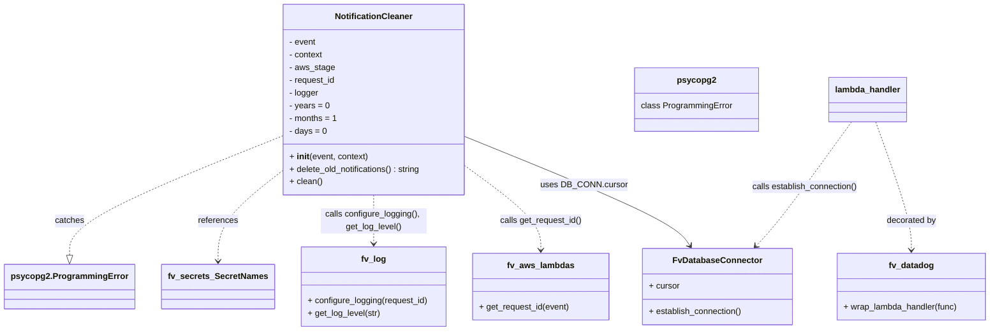
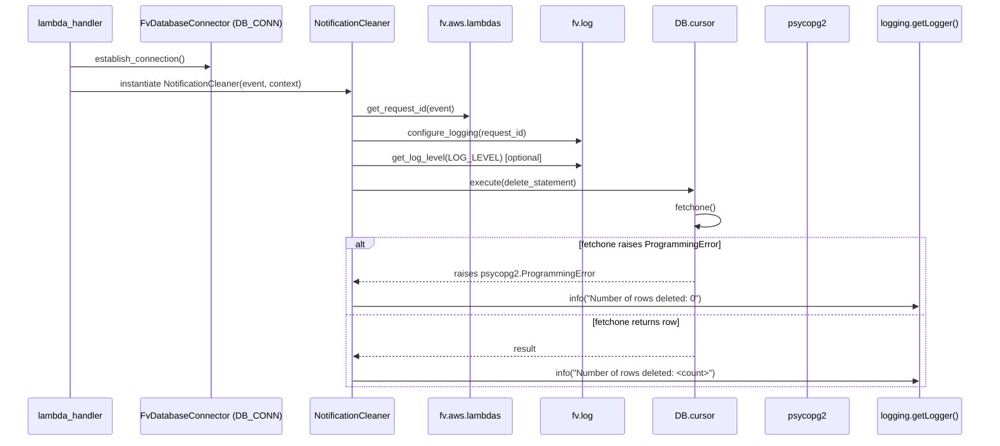

# Diagram: shipment_core/scheduled_services/scheduled_services/finished_vehicle_notification_cleaner/finished_vehicle_notification_cleaner.py

> Auto-generated by Obscura crawlers

## Diagram 1

### SVG

<svg id="container" width="1836.03125" xmlns="http://www.w3.org/2000/svg" class="classDiagram" height="624" viewBox="0 0 1836.03125 624" role="graphics-document document" aria-roledescription="class"><g><defs><marker id="container_class-aggregationStart" class="marker aggregation class" refX="18" refY="7" markerWidth="190" markerHeight="240" orient="auto"><path d="M 18,7 L9,13 L1,7 L9,1 Z"></path></marker></defs><defs><marker id="container_class-aggregationEnd" class="marker aggregation class" refX="1" refY="7" markerWidth="20" markerHeight="28" orient="auto"><path d="M 18,7 L9,13 L1,7 L9,1 Z"></path></marker></defs><defs><marker id="container_class-extensionStart" class="marker extension class" refX="18" refY="7" markerWidth="190" markerHeight="240" orient="auto"><path d="M 1,7 L18,13 V 1 Z"></path></marker></defs><defs><marker id="container_class-extensionEnd" class="marker extension class" refX="1" refY="7" markerWidth="20" markerHeight="28" orient="auto"><path d="M 1,1 V 13 L18,7 Z"></path></marker></defs><defs><marker id="container_class-compositionStart" class="marker composition class" refX="18" refY="7" markerWidth="190" markerHeight="240" orient="auto"><path d="M 18,7 L9,13 L1,7 L9,1 Z"></path></marker></defs><defs><marker id="container_class-compositionEnd" class="marker composition class" refX="1" refY="7" markerWidth="20" markerHeight="28" orient="auto"><path d="M 18,7 L9,13 L1,7 L9,1 Z"></path></marker></defs><defs><marker id="container_class-dependencyStart" class="marker dependency class" refX="6" refY="7" markerWidth="190" markerHeight="240" orient="auto"><path d="M 5,7 L9,13 L1,7 L9,1 Z"></path></marker></defs><defs><marker id="container_class-dependencyEnd" class="marker dependency class" refX="13" refY="7" markerWidth="20" markerHeight="28" orient="auto"><path d="M 18,7 L9,13 L14,7 L9,1 Z"></path></marker></defs><defs><marker id="container_class-lollipopStart" class="marker lollipop class" refX="13" refY="7" markerWidth="190" markerHeight="240" orient="auto"><circle stroke="black" fill="transparent" cx="7" cy="7" r="6"></circle></marker></defs><defs><marker id="container_class-lollipopEnd" class="marker lollipop class" refX="1" refY="7" markerWidth="190" markerHeight="240" orient="auto"><circle stroke="black" fill="transparent" cx="7" cy="7" r="6"></circle></marker></defs><g class="root"><g class="clusters"></g><g class="edgePaths"><path d="M851.551,258.817L916.241,285.181C980.93,311.545,1110.31,364.272,1180.186,398.469C1250.062,432.666,1260.434,448.331,1265.62,456.164L1270.806,463.997" id="id_NotificationCleaner_FvDatabaseConnector_1" class="edge-thickness-normal edge-pattern-solid relation" style=";;;" data-edge="true" data-et="edge" data-id="id_NotificationCleaner_FvDatabaseConnector_1" data-points="W3sieCI6ODUxLjU1MDc4MTI1LCJ5IjoyNTguODE2OTEzNzQ1NDU5Nn0seyJ4IjoxMjM5LjY4OTQ1MzEyNSwieSI6NDE3fSx7IngiOjEyNzQuMTE4MzIxNTcyNTgwNywieSI6NDY5fV0=" marker-end="url(#container_class-dependencyEnd)"></path><path d="M851.551,314.364L875.074,331.47C898.596,348.576,945.642,382.788,969.165,409.061C992.688,435.333,992.688,453.667,992.688,462.833L992.688,472" id="id_NotificationCleaner_fv_aws_lambdas_2" class="edge-thickness-normal edge-pattern-dashed relation" style=";;;" data-edge="true" data-et="edge" data-id="id_NotificationCleaner_fv_aws_lambdas_2" data-points="W3sieCI6ODUxLjU1MDc4MTI1LCJ5IjozMTQuMzY0MDI2NTQ1OTI4Mn0seyJ4Ijo5OTIuNjg3NSwieSI6NDE3fSx7IngiOjk5Mi42ODc1LCJ5Ijo0Nzh9XQ==" marker-end="url(#container_class-dependencyEnd)"></path><path d="M677.785,368L677.785,376.167C677.785,384.333,677.785,400.667,677.785,416C677.785,431.333,677.785,445.667,677.785,452.833L677.785,460" id="id_NotificationCleaner_fv_log_3" class="edge-thickness-normal edge-pattern-dashed relation" style=";;;" data-edge="true" data-et="edge" data-id="id_NotificationCleaner_fv_log_3" data-points="W3sieCI6Njc3Ljc4NTE1NjI1LCJ5IjozNjh9LHsieCI6Njc3Ljc4NTE1NjI1LCJ5Ijo0MTd9LHsieCI6Njc3Ljc4NTE1NjI1LCJ5Ijo0NjZ9XQ==" marker-end="url(#container_class-dependencyEnd)"></path><path d="M504.02,326.016L484.928,341.18C465.836,356.344,427.652,386.672,408.561,414.503C389.469,442.333,389.469,467.667,389.469,480.333L389.469,493" id="id_NotificationCleaner_fv_secrets_SecretNames_4" class="edge-thickness-normal edge-pattern-dashed relation" style=";;;" data-edge="true" data-et="edge" data-id="id_NotificationCleaner_fv_secrets_SecretNames_4" data-points="W3sieCI6NTA0LjAxOTUzMTI1LCJ5IjozMjYuMDE2MTc2ODg4OTk3M30seyJ4IjozODkuNDY4NzUsInkiOjQxN30seyJ4IjozODkuNDY4NzUsInkiOjQ5OX1d" marker-end="url(#container_class-dependencyEnd)"></path><path d="M1618.595,230L1629.981,261.167C1641.368,292.333,1664.141,354.667,1675.527,395C1686.914,435.333,1686.914,453.667,1686.914,462.833L1686.914,472" id="id_lambda_handler_fv_datadog_5" class="edge-thickness-normal edge-pattern-dashed relation" style=";;;" data-edge="true" data-et="edge" data-id="id_lambda_handler_fv_datadog_5" data-points="W3sieCI6MTYxOC41OTQ1MDA1NDU4NTE2LCJ5IjoyMzB9LHsieCI6MTY4Ni45MTQwNjI1LCJ5Ijo0MTd9LHsieCI6MTY4Ni45MTQwNjI1LCJ5Ijo0Nzh9XQ==" marker-end="url(#container_class-dependencyEnd)"></path><path d="M1572.848,230L1550.288,261.167C1527.727,292.333,1482.607,354.667,1452.642,393.769C1422.678,432.871,1407.87,448.742,1400.466,456.678L1393.061,464.613" id="id_lambda_handler_FvDatabaseConnector_6" class="edge-thickness-normal edge-pattern-dashed relation" style=";;;" data-edge="true" data-et="edge" data-id="id_lambda_handler_FvDatabaseConnector_6" data-points="W3sieCI6MTU3Mi44NDc5MjkxNzU3NjQyLCJ5IjoyMzB9LHsieCI6MTQzNy40ODYzMjgxMjUsInkiOjQxN30seyJ4IjoxMzg4Ljk2ODExOTk1OTY3NzMsInkiOjQ2OX1d" marker-end="url(#container_class-dependencyEnd)"></path><path d="M504.02,259.744L440.54,285.953C377.06,312.163,250.1,364.581,186.62,401.582C123.141,438.583,123.141,460.167,123.141,470.958L123.141,481.75" id="id_NotificationCleaner_psycopg2.ProgrammingError_7" class="edge-thickness-normal edge-pattern-dashed relation" style=";;;" data-edge="true" data-et="edge" data-id="id_NotificationCleaner_psycopg2.ProgrammingError_7" data-points="W3sieCI6NTA0LjAxOTUzMTI1LCJ5IjoyNTkuNzQzODM5MzExNDk1OTV9LHsieCI6MTIzLjE0MDYyNSwieSI6NDE3fSx7IngiOjEyMy4xNDA2MjUsInkiOjQ5OX1d" marker-end="url(#container_class-extensionEnd)"></path></g><g class="edgeLabels"><g class="edgeLabel" transform="translate(1074.49646, 349.6768)"><g class="label" data-id="id_NotificationCleaner_FvDatabaseConnector_1" transform="translate(-77.796875, -12)"><foreignObject width="155.59375" height="24">

uses DB_CONN.cursor

</foreignObject></g></g><g class="edgeLabel" transform="translate(992.6875, 417)"><g class="label" data-id="id_NotificationCleaner_fv_aws_lambdas_2" transform="translate(-78.0234375, -12)"><foreignObject width="156.046875" height="24">

calls get_request_id()

</foreignObject></g></g><g class="edgeLabel" transform="translate(677.78515625, 417)"><g class="label" data-id="id_NotificationCleaner_fv_log_3" transform="translate(-100, -24)"><foreignObject width="200" height="48">

calls configure_logging(), get_log_level()

</foreignObject></g></g><g class="edgeLabel" transform="translate(389.46875, 417)"><g class="label" data-id="id_NotificationCleaner_fv_secrets_SecretNames_4" transform="translate(-37.828125, -12)"><foreignObject width="75.65625" height="24">

references

</foreignObject></g></g><g class="edgeLabel" transform="translate(1686.9140625, 417)"><g class="label" data-id="id_lambda_handler_fv_datadog_5" transform="translate(-47.328125, -12)"><foreignObject width="94.65625" height="24">

decorated by

</foreignObject></g></g><g class="edgeLabel" transform="translate(1484.31619, 352.30525)"><g class="label" data-id="id_lambda_handler_FvDatabaseConnector_6" transform="translate(-100, -24)"><foreignObject width="200" height="48">

calls establish_connection()

</foreignObject></g></g><g class="edgeLabel" transform="translate(123.140625, 417)"><g class="label" data-id="id_NotificationCleaner_psycopg2.ProgrammingError_7" transform="translate(-27.4765625, -12)"><foreignObject width="54.953125" height="24">

catches

</foreignObject></g></g></g><g class="nodes"><g class="node default" id="classId-NotificationCleaner-0" transform="translate(677.78515625, 188)"><g class="basic label-container"><path d="M-173.765625 -180 L173.765625 -180 L173.765625 180 L-173.765625 180" stroke="none" stroke-width="0" fill="#ECECFF" style=""></path><path d="M-173.765625 -180 C-81.72065781122551 -180, 10.324309377548985 -180, 173.765625 -180 M-173.765625 -180 C-70.66046602843383 -180, 32.44469294313234 -180, 173.765625 -180 M173.765625 -180 C173.765625 -63.26174060567567, 173.765625 53.47651878864866, 173.765625 180 M173.765625 -180 C173.765625 -53.93529139665107, 173.765625 72.12941720669787, 173.765625 180 M173.765625 180 C88.0627970296722 180, 2.359969059344394 180, -173.765625 180 M173.765625 180 C35.82041662814095 180, -102.1247917437181 180, -173.765625 180 M-173.765625 180 C-173.765625 56.60211610148387, -173.765625 -66.79576779703225, -173.765625 -180 M-173.765625 180 C-173.765625 91.40806695123615, -173.765625 2.816133902472302, -173.765625 -180" stroke="#9370DB" stroke-width="1.3" fill="none" stroke-dasharray="0 0" style=""></path></g><g class="annotation-group text" transform="translate(0, -156)"></g><g class="label-group text" transform="translate(-70.703125, -156)"><g class="label" style="font-weight: bolder" transform="translate(0,-12)"><foreignObject width="141.40625" height="24">

NotificationCleaner

</foreignObject></g></g><g class="members-group text" transform="translate(-161.765625, -108)"><g class="label" style="" transform="translate(0,-12)"><foreignObject width="51.03125" height="24">

- event

</foreignObject></g><g class="label" style="" transform="translate(0,12)"><foreignObject width="64.390625" height="24">

- context

</foreignObject></g><g class="label" style="" transform="translate(0,36)"><foreignObject width="84.734375" height="24">

- aws_stage

</foreignObject></g><g class="label" style="" transform="translate(0,60)"><foreignObject width="88.359375" height="24">

- request_id

</foreignObject></g><g class="label" style="" transform="translate(0,84)"><foreignObject width="55.921875" height="24">

- logger

</foreignObject></g><g class="label" style="" transform="translate(0,108)"><foreignObject width="74.578125" height="24">

- years = 0

</foreignObject></g><g class="label" style="" transform="translate(0,132)"><foreignObject width="89.15625" height="24">

- months = 1

</foreignObject></g><g class="label" style="" transform="translate(0,156)"><foreignObject width="69.375" height="24">

- days = 0

</foreignObject></g></g><g class="methods-group text" transform="translate(-161.765625, 108)"><g class="label" style="" transform="translate(0,-12)"><foreignObject width="149.21875" height="24">

+ <strong>init</strong>(event, context)

</foreignObject></g><g class="label" style="" transform="translate(0,12)"><foreignObject width="252.828125" height="24">

+ delete_old_notifications() : string

</foreignObject></g><g class="label" style="" transform="translate(0,36)"><foreignObject width="61.5" height="24">

+ clean()

</foreignObject></g></g><g class="divider" style=""><path d="M-173.765625 -132 C-57.35187088404079 -132, 59.061883231918415 -132, 173.765625 -132 M-173.765625 -132 C-58.67990543318267 -132, 56.405814133634664 -132, 173.765625 -132" stroke="#9370DB" stroke-width="1.3" fill="none" stroke-dasharray="0 0" style=""></path></g><g class="divider" style=""><path d="M-173.765625 84 C-62.29369795884679 84, 49.178229082306416 84, 173.765625 84 M-173.765625 84 C-96.8036294885558 84, -19.8416339771116 84, 173.765625 84" stroke="#9370DB" stroke-width="1.3" fill="none" stroke-dasharray="0 0" style=""></path></g></g><g class="node default" id="classId-FvDatabaseConnector-1" transform="translate(1321.7890625, 541)"><g class="basic label-container"><path d="M-140.41015625 -72 L140.41015625 -72 L140.41015625 72 L-140.41015625 72" stroke="none" stroke-width="0" fill="#ECECFF" style=""></path><path d="M-140.41015625 -72 C-73.37447121567958 -72, -6.338786181359154 -72, 140.41015625 -72 M-140.41015625 -72 C-30.29796437418382 -72, 79.81422750163236 -72, 140.41015625 -72 M140.41015625 -72 C140.41015625 -17.585058532002336, 140.41015625 36.82988293599533, 140.41015625 72 M140.41015625 -72 C140.41015625 -42.003738761454514, 140.41015625 -12.007477522909035, 140.41015625 72 M140.41015625 72 C51.85757891664275 72, -36.6949984167145 72, -140.41015625 72 M140.41015625 72 C81.12912791840029 72, 21.848099586800586 72, -140.41015625 72 M-140.41015625 72 C-140.41015625 37.11608336009543, -140.41015625 2.232166720190861, -140.41015625 -72 M-140.41015625 72 C-140.41015625 23.2947588544166, -140.41015625 -25.4104822911668, -140.41015625 -72" stroke="#9370DB" stroke-width="1.3" fill="none" stroke-dasharray="0 0" style=""></path></g><g class="annotation-group text" transform="translate(0, -48)"></g><g class="label-group text" transform="translate(-79.3046875, -48)"><g class="label" style="font-weight: bolder" transform="translate(0,-12)"><foreignObject width="158.609375" height="24">

FvDatabaseConnector

</foreignObject></g></g><g class="members-group text" transform="translate(-128.41015625, 0)"><g class="label" style="" transform="translate(0,-12)"><foreignObject width="57.953125" height="24">

+ cursor

</foreignObject></g></g><g class="methods-group text" transform="translate(-128.41015625, 48)"><g class="label" style="" transform="translate(0,-12)"><foreignObject width="177.515625" height="24">

+ establish_connection()

</foreignObject></g></g><g class="divider" style=""><path d="M-140.41015625 -24 C-65.31830982141844 -24, 9.773536607163123 -24, 140.41015625 -24 M-140.41015625 -24 C-50.780167446131 -24, 38.849821357737994 -24, 140.41015625 -24" stroke="#9370DB" stroke-width="1.3" fill="none" stroke-dasharray="0 0" style=""></path></g><g class="divider" style=""><path d="M-140.41015625 24 C-36.99677425812433 24, 66.41660773375133 24, 140.41015625 24 M-140.41015625 24 C-52.57028824698466 24, 35.26957975603068 24, 140.41015625 24" stroke="#9370DB" stroke-width="1.3" fill="none" stroke-dasharray="0 0" style=""></path></g></g><g class="node default" id="classId-fv_aws_lambdas-2" transform="translate(992.6875, 541)"><g class="basic label-container"><path d="M-127.7734375 -63 L127.7734375 -63 L127.7734375 63 L-127.7734375 63" stroke="none" stroke-width="0" fill="#ECECFF" style=""></path><path d="M-127.7734375 -63 C-75.12837373856848 -63, -22.483309977136955 -63, 127.7734375 -63 M-127.7734375 -63 C-44.32651848372748 -63, 39.120400532545034 -63, 127.7734375 -63 M127.7734375 -63 C127.7734375 -15.035300922420369, 127.7734375 32.92939815515926, 127.7734375 63 M127.7734375 -63 C127.7734375 -30.856403046697196, 127.7734375 1.2871939066056086, 127.7734375 63 M127.7734375 63 C61.76294945456128 63, -4.24753859087744 63, -127.7734375 63 M127.7734375 63 C48.80887171741783 63, -30.15569406516434 63, -127.7734375 63 M-127.7734375 63 C-127.7734375 15.126685950109128, -127.7734375 -32.746628099781745, -127.7734375 -63 M-127.7734375 63 C-127.7734375 21.689567078860406, -127.7734375 -19.620865842279187, -127.7734375 -63" stroke="#9370DB" stroke-width="1.3" fill="none" stroke-dasharray="0 0" style=""></path></g><g class="annotation-group text" transform="translate(0, -39)"></g><g class="label-group text" transform="translate(-60.0625, -39)"><g class="label" style="font-weight: bolder" transform="translate(0,-12)"><foreignObject width="120.125" height="24">

fv_aws_lambdas

</foreignObject></g></g><g class="members-group text" transform="translate(-115.7734375, 9)"></g><g class="methods-group text" transform="translate(-115.7734375, 39)"><g class="label" style="" transform="translate(0,-12)"><foreignObject width="171.484375" height="24">

+ get_request_id(event)

</foreignObject></g></g><g class="divider" style=""><path d="M-127.7734375 -15 C-51.03201350668827 -15, 25.709410486623455 -15, 127.7734375 -15 M-127.7734375 -15 C-72.91119945057085 -15, -18.048961401141696 -15, 127.7734375 -15" stroke="#9370DB" stroke-width="1.3" fill="none" stroke-dasharray="0 0" style=""></path></g><g class="divider" style=""><path d="M-127.7734375 9 C-47.90014287186605 9, 31.973151756267896 9, 127.7734375 9 M-127.7734375 9 C-31.66102976370668 9, 64.45137797258664 9, 127.7734375 9" stroke="#9370DB" stroke-width="1.3" fill="none" stroke-dasharray="0 0" style=""></path></g></g><g class="node default" id="classId-fv_log-3" transform="translate(677.78515625, 541)"><g class="basic label-container"><path d="M-137.12890625 -75 L137.12890625 -75 L137.12890625 75 L-137.12890625 75" stroke="none" stroke-width="0" fill="#ECECFF" style=""></path><path d="M-137.12890625 -75 C-67.21385418679596 -75, 2.701197876408088 -75, 137.12890625 -75 M-137.12890625 -75 C-36.93719837744747 -75, 63.254509495105054 -75, 137.12890625 -75 M137.12890625 -75 C137.12890625 -33.43714074587785, 137.12890625 8.125718508244304, 137.12890625 75 M137.12890625 -75 C137.12890625 -25.66174610760676, 137.12890625 23.67650778478648, 137.12890625 75 M137.12890625 75 C55.90784137673376 75, -25.313223496532487 75, -137.12890625 75 M137.12890625 75 C53.029091651140476 75, -31.070722947719048 75, -137.12890625 75 M-137.12890625 75 C-137.12890625 34.67834873390986, -137.12890625 -5.643302532180286, -137.12890625 -75 M-137.12890625 75 C-137.12890625 18.394611093516687, -137.12890625 -38.210777812966626, -137.12890625 -75" stroke="#9370DB" stroke-width="1.3" fill="none" stroke-dasharray="0 0" style=""></path></g><g class="annotation-group text" transform="translate(0, -51)"></g><g class="label-group text" transform="translate(-22.2109375, -51)"><g class="label" style="font-weight: bolder" transform="translate(0,-12)"><foreignObject width="44.421875" height="24">

fv_log

</foreignObject></g></g><g class="members-group text" transform="translate(-125.12890625, -3)"></g><g class="methods-group text" transform="translate(-125.12890625, 27)"><g class="label" style="" transform="translate(0,-12)"><foreignObject width="228.046875" height="24">

+ configure_logging(request_id)

</foreignObject></g><g class="label" style="" transform="translate(0,12)"><foreignObject width="137.71875" height="24">

+ get_log_level(str)

</foreignObject></g></g><g class="divider" style=""><path d="M-137.12890625 -27 C-75.13404108560577 -27, -13.139175921211546 -27, 137.12890625 -27 M-137.12890625 -27 C-68.29750841181675 -27, 0.5338894263664997 -27, 137.12890625 -27" stroke="#9370DB" stroke-width="1.3" fill="none" stroke-dasharray="0 0" style=""></path></g><g class="divider" style=""><path d="M-137.12890625 -3 C-81.91594090158617 -3, -26.70297555317235 -3, 137.12890625 -3 M-137.12890625 -3 C-29.337346398672054 -3, 78.45421345265589 -3, 137.12890625 -3" stroke="#9370DB" stroke-width="1.3" fill="none" stroke-dasharray="0 0" style=""></path></g></g><g class="node default" id="classId-fv_secrets_SecretNames-4" transform="translate(389.46875, 541)"><g class="basic label-container"><path d="M-101.1875 -42 L101.1875 -42 L101.1875 42 L-101.1875 42" stroke="none" stroke-width="0" fill="#ECECFF" style=""></path><path d="M-101.1875 -42 C-35.21315481832741 -42, 30.76119036334518 -42, 101.1875 -42 M-101.1875 -42 C-42.57720887923439 -42, 16.03308224153122 -42, 101.1875 -42 M101.1875 -42 C101.1875 -13.482963619558898, 101.1875 15.034072760882204, 101.1875 42 M101.1875 -42 C101.1875 -25.09377631586229, 101.1875 -8.187552631724579, 101.1875 42 M101.1875 42 C51.04741275309832 42, 0.9073255061966421 42, -101.1875 42 M101.1875 42 C44.85626142468541 42, -11.474977150629186 42, -101.1875 42 M-101.1875 42 C-101.1875 24.274747724448613, -101.1875 6.5494954488972255, -101.1875 -42 M-101.1875 42 C-101.1875 17.9320266382586, -101.1875 -6.135946723482803, -101.1875 -42" stroke="#9370DB" stroke-width="1.3" fill="none" stroke-dasharray="0 0" style=""></path></g><g class="annotation-group text" transform="translate(0, -18)"></g><g class="label-group text" transform="translate(-89.1875, -18)"><g class="label" style="font-weight: bolder" transform="translate(0,-12)"><foreignObject width="178.375" height="24">

fv_secrets_SecretNames

</foreignObject></g></g><g class="members-group text" transform="translate(-89.1875, 30)"></g><g class="methods-group text" transform="translate(-89.1875, 60)"></g><g class="divider" style=""><path d="M-101.1875 6 C-54.93737006850124 6, -8.687240137002476 6, 101.1875 6 M-101.1875 6 C-28.120646206484352 6, 44.946207587031296 6, 101.1875 6" stroke="#9370DB" stroke-width="1.3" fill="none" stroke-dasharray="0 0" style=""></path></g><g class="divider" style=""><path d="M-101.1875 24 C-25.874922747558728 24, 49.437654504882545 24, 101.1875 24 M-101.1875 24 C-43.877608539623225 24, 13.43228292075355 24, 101.1875 24" stroke="#9370DB" stroke-width="1.3" fill="none" stroke-dasharray="0 0" style=""></path></g></g><g class="node default" id="classId-fv_datadog-5" transform="translate(1686.9140625, 541)"><g class="basic label-container"><path d="M-141.1171875 -63 L141.1171875 -63 L141.1171875 63 L-141.1171875 63" stroke="none" stroke-width="0" fill="#ECECFF" style=""></path><path d="M-141.1171875 -63 C-57.96479582997655 -63, 25.187595840046896 -63, 141.1171875 -63 M-141.1171875 -63 C-46.958887323748144 -63, 47.19941285250371 -63, 141.1171875 -63 M141.1171875 -63 C141.1171875 -37.2685056716614, 141.1171875 -11.537011343322796, 141.1171875 63 M141.1171875 -63 C141.1171875 -20.412257423194326, 141.1171875 22.175485153611348, 141.1171875 63 M141.1171875 63 C69.93314994038163 63, -1.2508876192367495 63, -141.1171875 63 M141.1171875 63 C36.54548823815023 63, -68.02621102369955 63, -141.1171875 63 M-141.1171875 63 C-141.1171875 22.957227928758655, -141.1171875 -17.08554414248269, -141.1171875 -63 M-141.1171875 63 C-141.1171875 28.23097706530171, -141.1171875 -6.5380458693965835, -141.1171875 -63" stroke="#9370DB" stroke-width="1.3" fill="none" stroke-dasharray="0 0" style=""></path></g><g class="annotation-group text" transform="translate(0, -39)"></g><g class="label-group text" transform="translate(-41.15625, -39)"><g class="label" style="font-weight: bolder" transform="translate(0,-12)"><foreignObject width="82.3125" height="24">

fv_datadog

</foreignObject></g></g><g class="members-group text" transform="translate(-129.1171875, 9)"></g><g class="methods-group text" transform="translate(-129.1171875, 39)"><g class="label" style="" transform="translate(0,-12)"><foreignObject width="217.078125" height="24">

+ wrap_lambda_handler(func)

</foreignObject></g></g><g class="divider" style=""><path d="M-141.1171875 -15 C-45.871827586994186 -15, 49.37353232601163 -15, 141.1171875 -15 M-141.1171875 -15 C-38.60754206733509 -15, 63.90210336532982 -15, 141.1171875 -15" stroke="#9370DB" stroke-width="1.3" fill="none" stroke-dasharray="0 0" style=""></path></g><g class="divider" style=""><path d="M-141.1171875 9 C-70.48443218789735 9, 0.14832312420529092 9, 141.1171875 9 M-141.1171875 9 C-74.24207699180519 9, -7.366966483610383 9, 141.1171875 9" stroke="#9370DB" stroke-width="1.3" fill="none" stroke-dasharray="0 0" style=""></path></g></g><g class="node default" id="classId-psycopg2-6" transform="translate(1282.5390625, 188)"><g class="basic label-container"><path d="M-115.0703125 -60 L115.0703125 -60 L115.0703125 60 L-115.0703125 60" stroke="none" stroke-width="0" fill="#ECECFF" style=""></path><path d="M-115.0703125 -60 C-32.24091027032448 -60, 50.588491959351046 -60, 115.0703125 -60 M-115.0703125 -60 C-32.38117206974185 -60, 50.3079683605163 -60, 115.0703125 -60 M115.0703125 -60 C115.0703125 -16.348782158951863, 115.0703125 27.302435682096274, 115.0703125 60 M115.0703125 -60 C115.0703125 -31.101898246136944, 115.0703125 -2.203796492273888, 115.0703125 60 M115.0703125 60 C52.156164247767634 60, -10.757984004464731 60, -115.0703125 60 M115.0703125 60 C23.970118710752956 60, -67.13007507849409 60, -115.0703125 60 M-115.0703125 60 C-115.0703125 15.546963839549804, -115.0703125 -28.906072320900392, -115.0703125 -60 M-115.0703125 60 C-115.0703125 12.072212939060073, -115.0703125 -35.855574121879854, -115.0703125 -60" stroke="#9370DB" stroke-width="1.3" fill="none" stroke-dasharray="0 0" style=""></path></g><g class="annotation-group text" transform="translate(0, -36)"></g><g class="label-group text" transform="translate(-34.234375, -36)"><g class="label" style="font-weight: bolder" transform="translate(0,-12)"><foreignObject width="68.46875" height="24">

psycopg2

</foreignObject></g></g><g class="members-group text" transform="translate(-103.0703125, 12)"><g class="label" style="" transform="translate(0,-12)"><foreignObject width="171.90625" height="24">

class ProgrammingError

</foreignObject></g></g><g class="methods-group text" transform="translate(-103.0703125, 60)"></g><g class="divider" style=""><path d="M-115.0703125 -12 C-62.70601820997803 -12, -10.341723919956067 -12, 115.0703125 -12 M-115.0703125 -12 C-45.0008970148094 -12, 25.068518470381207 -12, 115.0703125 -12" stroke="#9370DB" stroke-width="1.3" fill="none" stroke-dasharray="0 0" style=""></path></g><g class="divider" style=""><path d="M-115.0703125 36 C-32.17994804646476 36, 50.71041640707048 36, 115.0703125 36 M-115.0703125 36 C-55.5762047442229 36, 3.917903011554202 36, 115.0703125 36" stroke="#9370DB" stroke-width="1.3" fill="none" stroke-dasharray="0 0" style=""></path></g></g><g class="node default" id="classId-lambda_handler-7" transform="translate(1603.25, 188)"><g class="basic label-container"><path d="M-71.9765625 -42 L71.9765625 -42 L71.9765625 42 L-71.9765625 42" stroke="none" stroke-width="0" fill="#ECECFF" style=""></path><path d="M-71.9765625 -42 C-16.90028599839038 -42, 38.17599050321924 -42, 71.9765625 -42 M-71.9765625 -42 C-37.29981698005162 -42, -2.623071460103233 -42, 71.9765625 -42 M71.9765625 -42 C71.9765625 -23.67995607743283, 71.9765625 -5.359912154865661, 71.9765625 42 M71.9765625 -42 C71.9765625 -23.09696463288168, 71.9765625 -4.193929265763359, 71.9765625 42 M71.9765625 42 C18.342702047338705 42, -35.29115840532259 42, -71.9765625 42 M71.9765625 42 C31.008264227542625 42, -9.96003404491475 42, -71.9765625 42 M-71.9765625 42 C-71.9765625 24.118952728762423, -71.9765625 6.237905457524846, -71.9765625 -42 M-71.9765625 42 C-71.9765625 16.44226302602879, -71.9765625 -9.11547394794242, -71.9765625 -42" stroke="#9370DB" stroke-width="1.3" fill="none" stroke-dasharray="0 0" style=""></path></g><g class="annotation-group text" transform="translate(0, -18)"></g><g class="label-group text" transform="translate(-59.9765625, -18)"><g class="label" style="font-weight: bolder" transform="translate(0,-12)"><foreignObject width="119.953125" height="24">

lambda_handler

</foreignObject></g></g><g class="members-group text" transform="translate(-59.9765625, 30)"></g><g class="methods-group text" transform="translate(-59.9765625, 60)"></g><g class="divider" style=""><path d="M-71.9765625 6 C-26.834904356886085 6, 18.30675378622783 6, 71.9765625 6 M-71.9765625 6 C-22.812058236666346 6, 26.35244602666731 6, 71.9765625 6" stroke="#9370DB" stroke-width="1.3" fill="none" stroke-dasharray="0 0" style=""></path></g><g class="divider" style=""><path d="M-71.9765625 24 C-25.648949485170228 24, 20.678663529659545 24, 71.9765625 24 M-71.9765625 24 C-28.779186821069267 24, 14.418188857861466 24, 71.9765625 24" stroke="#9370DB" stroke-width="1.3" fill="none" stroke-dasharray="0 0" style=""></path></g></g><g class="node default" id="classId-psycopg2.ProgrammingError-8" transform="translate(123.140625, 541)"><g class="basic label-container"><path d="M-115.140625 -42 L115.140625 -42 L115.140625 42 L-115.140625 42" stroke="none" stroke-width="0" fill="#ECECFF" style=""></path><path d="M-115.140625 -42 C-35.329625149067894 -42, 44.48137470186421 -42, 115.140625 -42 M-115.140625 -42 C-26.82010994051035 -42, 61.5004051189793 -42, 115.140625 -42 M115.140625 -42 C115.140625 -16.365131010658104, 115.140625 9.269737978683793, 115.140625 42 M115.140625 -42 C115.140625 -17.606948942141905, 115.140625 6.78610211571619, 115.140625 42 M115.140625 42 C45.427351614740104 42, -24.285921770519792 42, -115.140625 42 M115.140625 42 C64.16159214194866 42, 13.18255928389732 42, -115.140625 42 M-115.140625 42 C-115.140625 23.58549552264703, -115.140625 5.170991045294059, -115.140625 -42 M-115.140625 42 C-115.140625 21.62623986501529, -115.140625 1.2524797300305792, -115.140625 -42" stroke="#9370DB" stroke-width="1.3" fill="none" stroke-dasharray="0 0" style=""></path></g><g class="annotation-group text" transform="translate(0, -18)"></g><g class="label-group text" transform="translate(-103.140625, -18)"><g class="label" style="font-weight: bolder" transform="translate(0,-12)"><foreignObject width="206.28125" height="24">

psycopg2.ProgrammingError

</foreignObject></g></g><g class="members-group text" transform="translate(-103.140625, 30)"></g><g class="methods-group text" transform="translate(-103.140625, 60)"></g><g class="divider" style=""><path d="M-115.140625 6 C-44.70898551662788 6, 25.722653966744247 6, 115.140625 6 M-115.140625 6 C-58.19444250100853 6, -1.2482600020170622 6, 115.140625 6" stroke="#9370DB" stroke-width="1.3" fill="none" stroke-dasharray="0 0" style=""></path></g><g class="divider" style=""><path d="M-115.140625 24 C-48.3006948207757 24, 18.539235358448593 24, 115.140625 24 M-115.140625 24 C-50.04972195775832 24, 15.041181084483355 24, 115.140625 24" stroke="#9370DB" stroke-width="1.3" fill="none" stroke-dasharray="0 0" style=""></path></g></g></g></g></g></svg>

## Diagram 2

### SVG

<svg id="container" width="1802.5" xmlns="http://www.w3.org/2000/svg" height="829" viewBox="-50 -10 1802.5 829" role="graphics-document document" aria-roledescription="sequence"><g><rect x="1544.5" y="743" fill="#eaeaea" stroke="#666" width="158" height="65" name="Logger" rx="3" ry="3" class="actor actor-bottom"></rect><text x="1623.5" y="775.5" dominant-baseline="central" alignment-baseline="central" class="actor actor-box" style="text-anchor: middle; font-size: 16px; font-weight: 400;"><tspan x="1623.5" dy="0">logging.getLogger()</tspan></text></g><g><rect x="1344.5" y="743" fill="#eaeaea" stroke="#666" width="150" height="65" name="PG" rx="3" ry="3" class="actor actor-bottom"></rect><text x="1419.5" y="775.5" dominant-baseline="central" alignment-baseline="central" class="actor actor-box" style="text-anchor: middle; font-size: 16px; font-weight: 400;"><tspan x="1419.5" dy="0">psycopg2</tspan></text></g><g><rect x="1144.5" y="743" fill="#eaeaea" stroke="#666" width="150" height="65" name="Cursor" rx="3" ry="3" class="actor actor-bottom"></rect><text x="1219.5" y="775.5" dominant-baseline="central" alignment-baseline="central" class="actor actor-box" style="text-anchor: middle; font-size: 16px; font-weight: 400;"><tspan x="1219.5" dy="0">DB.cursor</tspan></text></g><g><rect x="944.5" y="743" fill="#eaeaea" stroke="#666" width="150" height="65" name="Log" rx="3" ry="3" class="actor actor-bottom"></rect><text x="1019.5" y="775.5" dominant-baseline="central" alignment-baseline="central" class="actor actor-box" style="text-anchor: middle; font-size: 16px; font-weight: 400;"><tspan x="1019.5" dy="0">fv.log</tspan></text></g><g><rect x="744.5" y="743" fill="#eaeaea" stroke="#666" width="150" height="65" name="AWS" rx="3" ry="3" class="actor actor-bottom"></rect><text x="819.5" y="775.5" dominant-baseline="central" alignment-baseline="central" class="actor actor-box" style="text-anchor: middle; font-size: 16px; font-weight: 400;"><tspan x="819.5" dy="0">fv.aws.lambdas</tspan></text></g><g><rect x="510" y="743" fill="#eaeaea" stroke="#666" width="161" height="65" name="NC" rx="3" ry="3" class="actor actor-bottom"></rect><text x="590.5" y="775.5" dominant-baseline="central" alignment-baseline="central" class="actor actor-box" style="text-anchor: middle; font-size: 16px; font-weight: 400;"><tspan x="590.5" dy="0">NotificationCleaner</tspan></text></g><g><rect x="200" y="743" fill="#eaeaea" stroke="#666" width="260" height="65" name="DB" rx="3" ry="3" class="actor actor-bottom"></rect><text x="330" y="775.5" dominant-baseline="central" alignment-baseline="central" class="actor actor-box" style="text-anchor: middle; font-size: 16px; font-weight: 400;"><tspan x="330" dy="0">FvDatabaseConnector (DB_CONN)</tspan></text></g><g><rect x="0" y="743" fill="#eaeaea" stroke="#666" width="150" height="65" name="Lambda" rx="3" ry="3" class="actor actor-bottom"></rect><text x="75" y="775.5" dominant-baseline="central" alignment-baseline="central" class="actor actor-box" style="text-anchor: middle; font-size: 16px; font-weight: 400;"><tspan x="75" dy="0">lambda_handler</tspan></text></g><g><line id="actor7" x1="1623.5" y1="65" x2="1623.5" y2="743" class="actor-line 200" stroke-width="0.5px" stroke="#999" name="Logger"></line><g id="root-7"><rect x="1544.5" y="0" fill="#eaeaea" stroke="#666" width="158" height="65" name="Logger" rx="3" ry="3" class="actor actor-top"></rect><text x="1623.5" y="32.5" dominant-baseline="central" alignment-baseline="central" class="actor actor-box" style="text-anchor: middle; font-size: 16px; font-weight: 400;"><tspan x="1623.5" dy="0">logging.getLogger()</tspan></text></g></g><g><line id="actor6" x1="1419.5" y1="65" x2="1419.5" y2="743" class="actor-line 200" stroke-width="0.5px" stroke="#999" name="PG"></line><g id="root-6"><rect x="1344.5" y="0" fill="#eaeaea" stroke="#666" width="150" height="65" name="PG" rx="3" ry="3" class="actor actor-top"></rect><text x="1419.5" y="32.5" dominant-baseline="central" alignment-baseline="central" class="actor actor-box" style="text-anchor: middle; font-size: 16px; font-weight: 400;"><tspan x="1419.5" dy="0">psycopg2</tspan></text></g></g><g><line id="actor5" x1="1219.5" y1="65" x2="1219.5" y2="743" class="actor-line 200" stroke-width="0.5px" stroke="#999" name="Cursor"></line><g id="root-5"><rect x="1144.5" y="0" fill="#eaeaea" stroke="#666" width="150" height="65" name="Cursor" rx="3" ry="3" class="actor actor-top"></rect><text x="1219.5" y="32.5" dominant-baseline="central" alignment-baseline="central" class="actor actor-box" style="text-anchor: middle; font-size: 16px; font-weight: 400;"><tspan x="1219.5" dy="0">DB.cursor</tspan></text></g></g><g><line id="actor4" x1="1019.5" y1="65" x2="1019.5" y2="743" class="actor-line 200" stroke-width="0.5px" stroke="#999" name="Log"></line><g id="root-4"><rect x="944.5" y="0" fill="#eaeaea" stroke="#666" width="150" height="65" name="Log" rx="3" ry="3" class="actor actor-top"></rect><text x="1019.5" y="32.5" dominant-baseline="central" alignment-baseline="central" class="actor actor-box" style="text-anchor: middle; font-size: 16px; font-weight: 400;"><tspan x="1019.5" dy="0">fv.log</tspan></text></g></g><g><line id="actor3" x1="819.5" y1="65" x2="819.5" y2="743" class="actor-line 200" stroke-width="0.5px" stroke="#999" name="AWS"></line><g id="root-3"><rect x="744.5" y="0" fill="#eaeaea" stroke="#666" width="150" height="65" name="AWS" rx="3" ry="3" class="actor actor-top"></rect><text x="819.5" y="32.5" dominant-baseline="central" alignment-baseline="central" class="actor actor-box" style="text-anchor: middle; font-size: 16px; font-weight: 400;"><tspan x="819.5" dy="0">fv.aws.lambdas</tspan></text></g></g><g><line id="actor2" x1="590.5" y1="65" x2="590.5" y2="743" class="actor-line 200" stroke-width="0.5px" stroke="#999" name="NC"></line><g id="root-2"><rect x="510" y="0" fill="#eaeaea" stroke="#666" width="161" height="65" name="NC" rx="3" ry="3" class="actor actor-top"></rect><text x="590.5" y="32.5" dominant-baseline="central" alignment-baseline="central" class="actor actor-box" style="text-anchor: middle; font-size: 16px; font-weight: 400;"><tspan x="590.5" dy="0">NotificationCleaner</tspan></text></g></g><g><line id="actor1" x1="330" y1="65" x2="330" y2="743" class="actor-line 200" stroke-width="0.5px" stroke="#999" name="DB"></line><g id="root-1"><rect x="200" y="0" fill="#eaeaea" stroke="#666" width="260" height="65" name="DB" rx="3" ry="3" class="actor actor-top"></rect><text x="330" y="32.5" dominant-baseline="central" alignment-baseline="central" class="actor actor-box" style="text-anchor: middle; font-size: 16px; font-weight: 400;"><tspan x="330" dy="0">FvDatabaseConnector (DB_CONN)</tspan></text></g></g><g><line id="actor0" x1="75" y1="65" x2="75" y2="743" class="actor-line 200" stroke-width="0.5px" stroke="#999" name="Lambda"></line><g id="root-0"><rect x="0" y="0" fill="#eaeaea" stroke="#666" width="150" height="65" name="Lambda" rx="3" ry="3" class="actor actor-top"></rect><text x="75" y="32.5" dominant-baseline="central" alignment-baseline="central" class="actor actor-box" style="text-anchor: middle; font-size: 16px; font-weight: 400;"><tspan x="75" dy="0">lambda_handler</tspan></text></g></g><g></g><defs><symbol id="computer" width="24" height="24"><path transform="scale(.5)" d="M2 2v13h20v-13h-20zm18 11h-16v-9h16v9zm-10.228 6l.466-1h3.524l.467 1h-4.457zm14.228 3h-24l2-6h2.104l-1.33 4h18.45l-1.297-4h2.073l2 6zm-5-10h-14v-7h14v7z"></path></symbol></defs><defs><symbol id="database" fill-rule="evenodd" clip-rule="evenodd"><path transform="scale(.5)" d="M12.258.001l.256.004.255.005.253.008.251.01.249.012.247.015.246.016.242.019.241.02.239.023.236.024.233.027.231.028.229.031.225.032.223.034.22.036.217.038.214.04.211.041.208.043.205.045.201.046.198.048.194.05.191.051.187.053.183.054.18.056.175.057.172.059.168.06.163.061.16.063.155.064.15.066.074.033.073.033.071.034.07.034.069.035.068.035.067.035.066.035.064.036.064.036.062.036.06.036.06.037.058.037.058.037.055.038.055.038.053.038.052.038.051.039.05.039.048.039.047.039.045.04.044.04.043.04.041.04.04.041.039.041.037.041.036.041.034.041.033.042.032.042.03.042.029.042.027.042.026.043.024.043.023.043.021.043.02.043.018.044.017.043.015.044.013.044.012.044.011.045.009.044.007.045.006.045.004.045.002.045.001.045v17l-.001.045-.002.045-.004.045-.006.045-.007.045-.009.044-.011.045-.012.044-.013.044-.015.044-.017.043-.018.044-.02.043-.021.043-.023.043-.024.043-.026.043-.027.042-.029.042-.03.042-.032.042-.033.042-.034.041-.036.041-.037.041-.039.041-.04.041-.041.04-.043.04-.044.04-.045.04-.047.039-.048.039-.05.039-.051.039-.052.038-.053.038-.055.038-.055.038-.058.037-.058.037-.06.037-.06.036-.062.036-.064.036-.064.036-.066.035-.067.035-.068.035-.069.035-.07.034-.071.034-.073.033-.074.033-.15.066-.155.064-.16.063-.163.061-.168.06-.172.059-.175.057-.18.056-.183.054-.187.053-.191.051-.194.05-.198.048-.201.046-.205.045-.208.043-.211.041-.214.04-.217.038-.22.036-.223.034-.225.032-.229.031-.231.028-.233.027-.236.024-.239.023-.241.02-.242.019-.246.016-.247.015-.249.012-.251.01-.253.008-.255.005-.256.004-.258.001-.258-.001-.256-.004-.255-.005-.253-.008-.251-.01-.249-.012-.247-.015-.245-.016-.243-.019-.241-.02-.238-.023-.236-.024-.234-.027-.231-.028-.228-.031-.226-.032-.223-.034-.22-.036-.217-.038-.214-.04-.211-.041-.208-.043-.204-.045-.201-.046-.198-.048-.195-.05-.19-.051-.187-.053-.184-.054-.179-.056-.176-.057-.172-.059-.167-.06-.164-.061-.159-.063-.155-.064-.151-.066-.074-.033-.072-.033-.072-.034-.07-.034-.069-.035-.068-.035-.067-.035-.066-.035-.064-.036-.063-.036-.062-.036-.061-.036-.06-.037-.058-.037-.057-.037-.056-.038-.055-.038-.053-.038-.052-.038-.051-.039-.049-.039-.049-.039-.046-.039-.046-.04-.044-.04-.043-.04-.041-.04-.04-.041-.039-.041-.037-.041-.036-.041-.034-.041-.033-.042-.032-.042-.03-.042-.029-.042-.027-.042-.026-.043-.024-.043-.023-.043-.021-.043-.02-.043-.018-.044-.017-.043-.015-.044-.013-.044-.012-.044-.011-.045-.009-.044-.007-.045-.006-.045-.004-.045-.002-.045-.001-.045v-17l.001-.045.002-.045.004-.045.006-.045.007-.045.009-.044.011-.045.012-.044.013-.044.015-.044.017-.043.018-.044.02-.043.021-.043.023-.043.024-.043.026-.043.027-.042.029-.042.03-.042.032-.042.033-.042.034-.041.036-.041.037-.041.039-.041.04-.041.041-.04.043-.04.044-.04.046-.04.046-.039.049-.039.049-.039.051-.039.052-.038.053-.038.055-.038.056-.038.057-.037.058-.037.06-.037.061-.036.062-.036.063-.036.064-.036.066-.035.067-.035.068-.035.069-.035.07-.034.072-.034.072-.033.074-.033.151-.066.155-.064.159-.063.164-.061.167-.06.172-.059.176-.057.179-.056.184-.054.187-.053.19-.051.195-.05.198-.048.201-.046.204-.045.208-.043.211-.041.214-.04.217-.038.22-.036.223-.034.226-.032.228-.031.231-.028.234-.027.236-.024.238-.023.241-.02.243-.019.245-.016.247-.015.249-.012.251-.01.253-.008.255-.005.256-.004.258-.001.258.001zm-9.258 20.499v.01l.001.021.003.021.004.022.005.021.006.022.007.022.009.023.01.022.011.023.012.023.013.023.015.023.016.024.017.023.018.024.019.024.021.024.022.025.023.024.024.025.052.049.056.05.061.051.066.051.07.051.075.051.079.052.084.052.088.052.092.052.097.052.102.051.105.052.11.052.114.051.119.051.123.051.127.05.131.05.135.05.139.048.144.049.147.047.152.047.155.047.16.045.163.045.167.043.171.043.176.041.178.041.183.039.187.039.19.037.194.035.197.035.202.033.204.031.209.03.212.029.216.027.219.025.222.024.226.021.23.02.233.018.236.016.24.015.243.012.246.01.249.008.253.005.256.004.259.001.26-.001.257-.004.254-.005.25-.008.247-.011.244-.012.241-.014.237-.016.233-.018.231-.021.226-.021.224-.024.22-.026.216-.027.212-.028.21-.031.205-.031.202-.034.198-.034.194-.036.191-.037.187-.039.183-.04.179-.04.175-.042.172-.043.168-.044.163-.045.16-.046.155-.046.152-.047.148-.048.143-.049.139-.049.136-.05.131-.05.126-.05.123-.051.118-.052.114-.051.11-.052.106-.052.101-.052.096-.052.092-.052.088-.053.083-.051.079-.052.074-.052.07-.051.065-.051.06-.051.056-.05.051-.05.023-.024.023-.025.021-.024.02-.024.019-.024.018-.024.017-.024.015-.023.014-.024.013-.023.012-.023.01-.023.01-.022.008-.022.006-.022.006-.022.004-.022.004-.021.001-.021.001-.021v-4.127l-.077.055-.08.053-.083.054-.085.053-.087.052-.09.052-.093.051-.095.05-.097.05-.1.049-.102.049-.105.048-.106.047-.109.047-.111.046-.114.045-.115.045-.118.044-.12.043-.122.042-.124.042-.126.041-.128.04-.13.04-.132.038-.134.038-.135.037-.138.037-.139.035-.142.035-.143.034-.144.033-.147.032-.148.031-.15.03-.151.03-.153.029-.154.027-.156.027-.158.026-.159.025-.161.024-.162.023-.163.022-.165.021-.166.02-.167.019-.169.018-.169.017-.171.016-.173.015-.173.014-.175.013-.175.012-.177.011-.178.01-.179.008-.179.008-.181.006-.182.005-.182.004-.184.003-.184.002h-.37l-.184-.002-.184-.003-.182-.004-.182-.005-.181-.006-.179-.008-.179-.008-.178-.01-.176-.011-.176-.012-.175-.013-.173-.014-.172-.015-.171-.016-.17-.017-.169-.018-.167-.019-.166-.02-.165-.021-.163-.022-.162-.023-.161-.024-.159-.025-.157-.026-.156-.027-.155-.027-.153-.029-.151-.03-.15-.03-.148-.031-.146-.032-.145-.033-.143-.034-.141-.035-.14-.035-.137-.037-.136-.037-.134-.038-.132-.038-.13-.04-.128-.04-.126-.041-.124-.042-.122-.042-.12-.044-.117-.043-.116-.045-.113-.045-.112-.046-.109-.047-.106-.047-.105-.048-.102-.049-.1-.049-.097-.05-.095-.05-.093-.052-.09-.051-.087-.052-.085-.053-.083-.054-.08-.054-.077-.054v4.127zm0-5.654v.011l.001.021.003.021.004.021.005.022.006.022.007.022.009.022.01.022.011.023.012.023.013.023.015.024.016.023.017.024.018.024.019.024.021.024.022.024.023.025.024.024.052.05.056.05.061.05.066.051.07.051.075.052.079.051.084.052.088.052.092.052.097.052.102.052.105.052.11.051.114.051.119.052.123.05.127.051.131.05.135.049.139.049.144.048.147.048.152.047.155.046.16.045.163.045.167.044.171.042.176.042.178.04.183.04.187.038.19.037.194.036.197.034.202.033.204.032.209.03.212.028.216.027.219.025.222.024.226.022.23.02.233.018.236.016.24.014.243.012.246.01.249.008.253.006.256.003.259.001.26-.001.257-.003.254-.006.25-.008.247-.01.244-.012.241-.015.237-.016.233-.018.231-.02.226-.022.224-.024.22-.025.216-.027.212-.029.21-.03.205-.032.202-.033.198-.035.194-.036.191-.037.187-.039.183-.039.179-.041.175-.042.172-.043.168-.044.163-.045.16-.045.155-.047.152-.047.148-.048.143-.048.139-.05.136-.049.131-.05.126-.051.123-.051.118-.051.114-.052.11-.052.106-.052.101-.052.096-.052.092-.052.088-.052.083-.052.079-.052.074-.051.07-.052.065-.051.06-.05.056-.051.051-.049.023-.025.023-.024.021-.025.02-.024.019-.024.018-.024.017-.024.015-.023.014-.023.013-.024.012-.022.01-.023.01-.023.008-.022.006-.022.006-.022.004-.021.004-.022.001-.021.001-.021v-4.139l-.077.054-.08.054-.083.054-.085.052-.087.053-.09.051-.093.051-.095.051-.097.05-.1.049-.102.049-.105.048-.106.047-.109.047-.111.046-.114.045-.115.044-.118.044-.12.044-.122.042-.124.042-.126.041-.128.04-.13.039-.132.039-.134.038-.135.037-.138.036-.139.036-.142.035-.143.033-.144.033-.147.033-.148.031-.15.03-.151.03-.153.028-.154.028-.156.027-.158.026-.159.025-.161.024-.162.023-.163.022-.165.021-.166.02-.167.019-.169.018-.169.017-.171.016-.173.015-.173.014-.175.013-.175.012-.177.011-.178.009-.179.009-.179.007-.181.007-.182.005-.182.004-.184.003-.184.002h-.37l-.184-.002-.184-.003-.182-.004-.182-.005-.181-.007-.179-.007-.179-.009-.178-.009-.176-.011-.176-.012-.175-.013-.173-.014-.172-.015-.171-.016-.17-.017-.169-.018-.167-.019-.166-.02-.165-.021-.163-.022-.162-.023-.161-.024-.159-.025-.157-.026-.156-.027-.155-.028-.153-.028-.151-.03-.15-.03-.148-.031-.146-.033-.145-.033-.143-.033-.141-.035-.14-.036-.137-.036-.136-.037-.134-.038-.132-.039-.13-.039-.128-.04-.126-.041-.124-.042-.122-.043-.12-.043-.117-.044-.116-.044-.113-.046-.112-.046-.109-.046-.106-.047-.105-.048-.102-.049-.1-.049-.097-.05-.095-.051-.093-.051-.09-.051-.087-.053-.085-.052-.083-.054-.08-.054-.077-.054v4.139zm0-5.666v.011l.001.02.003.022.004.021.005.022.006.021.007.022.009.023.01.022.011.023.012.023.013.023.015.023.016.024.017.024.018.023.019.024.021.025.022.024.023.024.024.025.052.05.056.05.061.05.066.051.07.051.075.052.079.051.084.052.088.052.092.052.097.052.102.052.105.051.11.052.114.051.119.051.123.051.127.05.131.05.135.05.139.049.144.048.147.048.152.047.155.046.16.045.163.045.167.043.171.043.176.042.178.04.183.04.187.038.19.037.194.036.197.034.202.033.204.032.209.03.212.028.216.027.219.025.222.024.226.021.23.02.233.018.236.017.24.014.243.012.246.01.249.008.253.006.256.003.259.001.26-.001.257-.003.254-.006.25-.008.247-.01.244-.013.241-.014.237-.016.233-.018.231-.02.226-.022.224-.024.22-.025.216-.027.212-.029.21-.03.205-.032.202-.033.198-.035.194-.036.191-.037.187-.039.183-.039.179-.041.175-.042.172-.043.168-.044.163-.045.16-.045.155-.047.152-.047.148-.048.143-.049.139-.049.136-.049.131-.051.126-.05.123-.051.118-.052.114-.051.11-.052.106-.052.101-.052.096-.052.092-.052.088-.052.083-.052.079-.052.074-.052.07-.051.065-.051.06-.051.056-.05.051-.049.023-.025.023-.025.021-.024.02-.024.019-.024.018-.024.017-.024.015-.023.014-.024.013-.023.012-.023.01-.022.01-.023.008-.022.006-.022.006-.022.004-.022.004-.021.001-.021.001-.021v-4.153l-.077.054-.08.054-.083.053-.085.053-.087.053-.09.051-.093.051-.095.051-.097.05-.1.049-.102.048-.105.048-.106.048-.109.046-.111.046-.114.046-.115.044-.118.044-.12.043-.122.043-.124.042-.126.041-.128.04-.13.039-.132.039-.134.038-.135.037-.138.036-.139.036-.142.034-.143.034-.144.033-.147.032-.148.032-.15.03-.151.03-.153.028-.154.028-.156.027-.158.026-.159.024-.161.024-.162.023-.163.023-.165.021-.166.02-.167.019-.169.018-.169.017-.171.016-.173.015-.173.014-.175.013-.175.012-.177.01-.178.01-.179.009-.179.007-.181.006-.182.006-.182.004-.184.003-.184.001-.185.001-.185-.001-.184-.001-.184-.003-.182-.004-.182-.006-.181-.006-.179-.007-.179-.009-.178-.01-.176-.01-.176-.012-.175-.013-.173-.014-.172-.015-.171-.016-.17-.017-.169-.018-.167-.019-.166-.02-.165-.021-.163-.023-.162-.023-.161-.024-.159-.024-.157-.026-.156-.027-.155-.028-.153-.028-.151-.03-.15-.03-.148-.032-.146-.032-.145-.033-.143-.034-.141-.034-.14-.036-.137-.036-.136-.037-.134-.038-.132-.039-.13-.039-.128-.041-.126-.041-.124-.041-.122-.043-.12-.043-.117-.044-.116-.044-.113-.046-.112-.046-.109-.046-.106-.048-.105-.048-.102-.048-.1-.05-.097-.049-.095-.051-.093-.051-.09-.052-.087-.052-.085-.053-.083-.053-.08-.054-.077-.054v4.153zm8.74-8.179l-.257.004-.254.005-.25.008-.247.011-.244.012-.241.014-.237.016-.233.018-.231.021-.226.022-.224.023-.22.026-.216.027-.212.028-.21.031-.205.032-.202.033-.198.034-.194.036-.191.038-.187.038-.183.04-.179.041-.175.042-.172.043-.168.043-.163.045-.16.046-.155.046-.152.048-.148.048-.143.048-.139.049-.136.05-.131.05-.126.051-.123.051-.118.051-.114.052-.11.052-.106.052-.101.052-.096.052-.092.052-.088.052-.083.052-.079.052-.074.051-.07.052-.065.051-.06.05-.056.05-.051.05-.023.025-.023.024-.021.024-.02.025-.019.024-.018.024-.017.023-.015.024-.014.023-.013.023-.012.023-.01.023-.01.022-.008.022-.006.023-.006.021-.004.022-.004.021-.001.021-.001.021.001.021.001.021.004.021.004.022.006.021.006.023.008.022.01.022.01.023.012.023.013.023.014.023.015.024.017.023.018.024.019.024.02.025.021.024.023.024.023.025.051.05.056.05.06.05.065.051.07.052.074.051.079.052.083.052.088.052.092.052.096.052.101.052.106.052.11.052.114.052.118.051.123.051.126.051.131.05.136.05.139.049.143.048.148.048.152.048.155.046.16.046.163.045.168.043.172.043.175.042.179.041.183.04.187.038.191.038.194.036.198.034.202.033.205.032.21.031.212.028.216.027.22.026.224.023.226.022.231.021.233.018.237.016.241.014.244.012.247.011.25.008.254.005.257.004.26.001.26-.001.257-.004.254-.005.25-.008.247-.011.244-.012.241-.014.237-.016.233-.018.231-.021.226-.022.224-.023.22-.026.216-.027.212-.028.21-.031.205-.032.202-.033.198-.034.194-.036.191-.038.187-.038.183-.04.179-.041.175-.042.172-.043.168-.043.163-.045.16-.046.155-.046.152-.048.148-.048.143-.048.139-.049.136-.05.131-.05.126-.051.123-.051.118-.051.114-.052.11-.052.106-.052.101-.052.096-.052.092-.052.088-.052.083-.052.079-.052.074-.051.07-.052.065-.051.06-.05.056-.05.051-.05.023-.025.023-.024.021-.024.02-.025.019-.024.018-.024.017-.023.015-.024.014-.023.013-.023.012-.023.01-.023.01-.022.008-.022.006-.023.006-.021.004-.022.004-.021.001-.021.001-.021-.001-.021-.001-.021-.004-.021-.004-.022-.006-.021-.006-.023-.008-.022-.01-.022-.01-.023-.012-.023-.013-.023-.014-.023-.015-.024-.017-.023-.018-.024-.019-.024-.02-.025-.021-.024-.023-.024-.023-.025-.051-.05-.056-.05-.06-.05-.065-.051-.07-.052-.074-.051-.079-.052-.083-.052-.088-.052-.092-.052-.096-.052-.101-.052-.106-.052-.11-.052-.114-.052-.118-.051-.123-.051-.126-.051-.131-.05-.136-.05-.139-.049-.143-.048-.148-.048-.152-.048-.155-.046-.16-.046-.163-.045-.168-.043-.172-.043-.175-.042-.179-.041-.183-.04-.187-.038-.191-.038-.194-.036-.198-.034-.202-.033-.205-.032-.21-.031-.212-.028-.216-.027-.22-.026-.224-.023-.226-.022-.231-.021-.233-.018-.237-.016-.241-.014-.244-.012-.247-.011-.25-.008-.254-.005-.257-.004-.26-.001-.26.001z"></path></symbol></defs><defs><symbol id="clock" width="24" height="24"><path transform="scale(.5)" d="M12 2c5.514 0 10 4.486 10 10s-4.486 10-10 10-10-4.486-10-10 4.486-10 10-10zm0-2c-6.627 0-12 5.373-12 12s5.373 12 12 12 12-5.373 12-12-5.373-12-12-12zm5.848 12.459c.202.038.202.333.001.372-1.907.361-6.045 1.111-6.547 1.111-.719 0-1.301-.582-1.301-1.301 0-.512.77-5.447 1.125-7.445.034-.192.312-.181.343.014l.985 6.238 5.394 1.011z"></path></symbol></defs><defs><marker id="arrowhead" refX="7.9" refY="5" markerUnits="userSpaceOnUse" markerWidth="12" markerHeight="12" orient="auto-start-reverse"><path d="M -1 0 L 10 5 L 0 10 z"></path></marker></defs><defs><marker id="crosshead" markerWidth="15" markerHeight="8" orient="auto" refX="4" refY="4.5"><path fill="none" stroke="#000000" stroke-width="1pt" d="M 1,2 L 6,7 M 6,2 L 1,7" style="stroke-dasharray: 0, 0;"></path></marker></defs><defs><marker id="filled-head" refX="15.5" refY="7" markerWidth="20" markerHeight="28" orient="auto"><path d="M 18,7 L9,13 L14,7 L9,1 Z"></path></marker></defs><defs><marker id="sequencenumber" refX="15" refY="15" markerWidth="60" markerHeight="40" orient="auto"><circle cx="15" cy="15" r="6"></circle></marker></defs><g><line x1="579.5" y1="441" x2="1634.5" y2="441" class="loopLine"></line><line x1="1634.5" y1="441" x2="1634.5" y2="723" class="loopLine"></line><line x1="579.5" y1="723" x2="1634.5" y2="723" class="loopLine"></line><line x1="579.5" y1="441" x2="579.5" y2="723" class="loopLine"></line><line x1="579.5" y1="587" x2="1634.5" y2="587" class="loopLine" style="stroke-dasharray: 3, 3;"></line><polygon points="579.5,441 629.5,441 629.5,454 621.1,461 579.5,461" class="labelBox"></polygon><text x="605" y="454" text-anchor="middle" dominant-baseline="middle" alignment-baseline="middle" class="labelText" style="font-size: 16px; font-weight: 400;">alt</text><text x="1132" y="459" text-anchor="middle" class="loopText" style="font-size: 16px; font-weight: 400;"><tspan x="1132">[fetchone raises ProgrammingError]</tspan></text><text x="1107" y="605" text-anchor="middle" class="loopText" style="font-size: 16px; font-weight: 400;">[fetchone returns row]</text></g><text x="201" y="80" text-anchor="middle" dominant-baseline="middle" alignment-baseline="middle" class="messageText" dy="1em" style="font-size: 16px; font-weight: 400;">establish_connection()</text><line x1="76" y1="113" x2="326" y2="113" class="messageLine0" stroke-width="2" stroke="none" marker-end="url(#arrowhead)" style="fill: none;"></line><text x="331" y="128" text-anchor="middle" dominant-baseline="middle" alignment-baseline="middle" class="messageText" dy="1em" style="font-size: 16px; font-weight: 400;">instantiate NotificationCleaner(event, context)</text><line x1="76" y1="161" x2="586.5" y2="161" class="messageLine0" stroke-width="2" stroke="none" marker-end="url(#arrowhead)" style="fill: none;"></line><text x="704" y="176" text-anchor="middle" dominant-baseline="middle" alignment-baseline="middle" class="messageText" dy="1em" style="font-size: 16px; font-weight: 400;">get_request_id(event)</text><line x1="591.5" y1="209" x2="815.5" y2="209" class="messageLine0" stroke-width="2" stroke="none" marker-end="url(#arrowhead)" style="fill: none;"></line><text x="804" y="224" text-anchor="middle" dominant-baseline="middle" alignment-baseline="middle" class="messageText" dy="1em" style="font-size: 16px; font-weight: 400;">configure_logging(request_id)</text><line x1="591.5" y1="257" x2="1015.5" y2="257" class="messageLine0" stroke-width="2" stroke="none" marker-end="url(#arrowhead)" style="fill: none;"></line><text x="804" y="272" text-anchor="middle" dominant-baseline="middle" alignment-baseline="middle" class="messageText" dy="1em" style="font-size: 16px; font-weight: 400;">get_log_level(LOG_LEVEL) [optional]</text><line x1="591.5" y1="305" x2="1015.5" y2="305" class="messageLine0" stroke-width="2" stroke="none" marker-end="url(#arrowhead)" style="fill: none;"></line><text x="904" y="320" text-anchor="middle" dominant-baseline="middle" alignment-baseline="middle" class="messageText" dy="1em" style="font-size: 16px; font-weight: 400;">execute(delete_statement)</text><line x1="591.5" y1="353" x2="1215.5" y2="353" class="messageLine0" stroke-width="2" stroke="none" marker-end="url(#arrowhead)" style="fill: none;"></line><text x="1221" y="368" text-anchor="middle" dominant-baseline="middle" alignment-baseline="middle" class="messageText" dy="1em" style="font-size: 16px; font-weight: 400;">fetchone()</text><path d="M 1220.5,401 C 1280.5,391 1280.5,431 1220.5,421" class="messageLine0" stroke-width="2" stroke="none" marker-end="url(#arrowhead)" style="fill: none;"></path><text x="907" y="491" text-anchor="middle" dominant-baseline="middle" alignment-baseline="middle" class="messageText" dy="1em" style="font-size: 16px; font-weight: 400;">raises psycopg2.ProgrammingError</text><line x1="1218.5" y1="524" x2="594.5" y2="524" class="messageLine1" stroke-width="2" stroke="none" marker-end="url(#arrowhead)" style="stroke-dasharray: 3, 3; fill: none;"></line><text x="1106" y="539" text-anchor="middle" dominant-baseline="middle" alignment-baseline="middle" class="messageText" dy="1em" style="font-size: 16px; font-weight: 400;">info("Number of rows deleted: 0")</text><line x1="591.5" y1="572" x2="1619.5" y2="572" class="messageLine0" stroke-width="2" stroke="none" marker-end="url(#arrowhead)" style="fill: none;"></line><text x="907" y="632" text-anchor="middle" dominant-baseline="middle" alignment-baseline="middle" class="messageText" dy="1em" style="font-size: 16px; font-weight: 400;">result</text><line x1="1218.5" y1="665" x2="594.5" y2="665" class="messageLine1" stroke-width="2" stroke="none" marker-end="url(#arrowhead)" style="stroke-dasharray: 3, 3; fill: none;"></line><text x="1106" y="680" text-anchor="middle" dominant-baseline="middle" alignment-baseline="middle" class="messageText" dy="1em" style="font-size: 16px; font-weight: 400;">info("Number of rows deleted: &lt;count&gt;")</text><line x1="591.5" y1="713" x2="1619.5" y2="713" class="messageLine0" stroke-width="2" stroke="none" marker-end="url(#arrowhead)" style="fill: none;"></line></svg>
