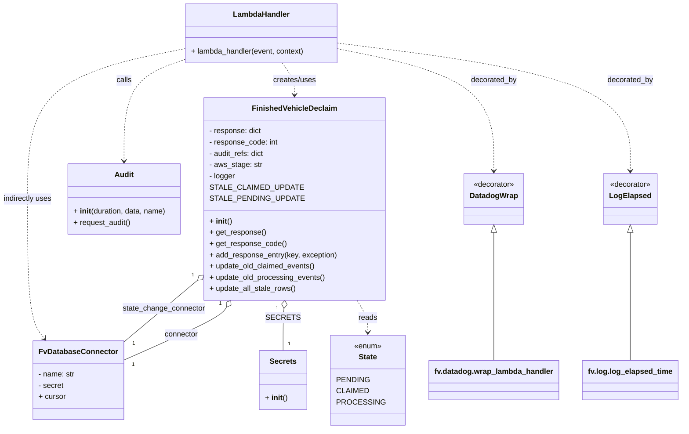

# Diagram: shipment_core/scheduled_services/scheduled_services/finished_vehicle_sync/finished_vehicle_declaim.py

> Auto-generated by Obscura crawlers

## Mermaid

### SVG

<svg id="container" width="1431.23046875" xmlns="http://www.w3.org/2000/svg" class="classDiagram" height="914" viewBox="0 0 1431.23046875 914" role="graphics-document document" aria-roledescription="class"><g><defs><marker id="container_class-aggregationStart" class="marker aggregation class" refX="18" refY="7" markerWidth="190" markerHeight="240" orient="auto"><path d="M 18,7 L9,13 L1,7 L9,1 Z"></path></marker></defs><defs><marker id="container_class-aggregationEnd" class="marker aggregation class" refX="1" refY="7" markerWidth="20" markerHeight="28" orient="auto"><path d="M 18,7 L9,13 L1,7 L9,1 Z"></path></marker></defs><defs><marker id="container_class-extensionStart" class="marker extension class" refX="18" refY="7" markerWidth="190" markerHeight="240" orient="auto"><path d="M 1,7 L18,13 V 1 Z"></path></marker></defs><defs><marker id="container_class-extensionEnd" class="marker extension class" refX="1" refY="7" markerWidth="20" markerHeight="28" orient="auto"><path d="M 1,1 V 13 L18,7 Z"></path></marker></defs><defs><marker id="container_class-compositionStart" class="marker composition class" refX="18" refY="7" markerWidth="190" markerHeight="240" orient="auto"><path d="M 18,7 L9,13 L1,7 L9,1 Z"></path></marker></defs><defs><marker id="container_class-compositionEnd" class="marker composition class" refX="1" refY="7" markerWidth="20" markerHeight="28" orient="auto"><path d="M 18,7 L9,13 L1,7 L9,1 Z"></path></marker></defs><defs><marker id="container_class-dependencyStart" class="marker dependency class" refX="6" refY="7" markerWidth="190" markerHeight="240" orient="auto"><path d="M 5,7 L9,13 L1,7 L9,1 Z"></path></marker></defs><defs><marker id="container_class-dependencyEnd" class="marker dependency class" refX="13" refY="7" markerWidth="20" markerHeight="28" orient="auto"><path d="M 18,7 L9,13 L14,7 L9,1 Z"></path></marker></defs><defs><marker id="container_class-lollipopStart" class="marker lollipop class" refX="13" refY="7" markerWidth="190" markerHeight="240" orient="auto"><circle stroke="black" fill="transparent" cx="7" cy="7" r="6"></circle></marker></defs><defs><marker id="container_class-lollipopEnd" class="marker lollipop class" refX="1" refY="7" markerWidth="190" markerHeight="240" orient="auto"><circle stroke="black" fill="transparent" cx="7" cy="7" r="6"></circle></marker></defs><g class="root"><g class="clusters"></g><g class="edgePaths"><path d="M486.717,654.596L484.366,658.33C482.014,662.064,477.311,669.532,441.219,688.543C405.126,707.553,337.645,738.107,303.905,753.383L270.164,768.66" id="id_FinishedVehicleDeclaim_FvDatabaseConnector_1" class="edge-thickness-normal edge-pattern-solid relation" style=";;;" data-edge="true" data-et="edge" data-id="id_FinishedVehicleDeclaim_FvDatabaseConnector_1" data-points="W3sieCI6NDk1LjkxMDM3MjQwNjEyNjUsInkiOjY0MH0seyJ4Ijo0NzIuNjA3NDIxODc1LCJ5Ijo2Nzd9LHsieCI6MjcwLjE2NDA2MjUsInkiOjc2OC42NjAwNzA4NzgxMzA4fV0=" marker-start="url(#container_class-aggregationStart)"></path><path d="M427.017,594.624L410.527,608.353C394.037,622.082,361.056,649.541,334.914,671.874C308.772,694.206,289.468,711.412,279.816,720.015L270.164,728.618" id="id_FinishedVehicleDeclaim_FvDatabaseConnector_2" class="edge-thickness-normal edge-pattern-solid relation" style=";;;" data-edge="true" data-et="edge" data-id="id_FinishedVehicleDeclaim_FvDatabaseConnector_2" data-points="W3sieCI6NDQwLjI3MzQzNzUsInkiOjU4My41ODYyOTE1NjE0MTc0fSx7IngiOjMyOC4wNzYxNzE4NzUsInkiOjY3N30seyJ4IjoyNzAuMTY0MDYyNSwieSI6NzI4LjYxODI1NDE2NTYzMDR9XQ==" marker-start="url(#container_class-aggregationStart)"></path><path d="M614.728,657.203L614.484,660.503C614.24,663.802,613.753,670.401,613.509,685.367C613.266,700.333,613.266,723.667,613.266,735.333L613.266,747" id="id_FinishedVehicleDeclaim_Secrets_3" class="edge-thickness-normal edge-pattern-solid relation" style=";;;" data-edge="true" data-et="edge" data-id="id_FinishedVehicleDeclaim_Secrets_3" data-points="W3sieCI6NjE1Ljk5ODAwODI3NTY5MTcsInkiOjY0MH0seyJ4Ijo2MTMuMjY1NjI1LCJ5Ijo2Nzd9LHsieCI6NjEzLjI2NTYyNSwieSI6NzQ3fV0=" marker-start="url(#container_class-aggregationStart)"></path><path d="M761.993,640L765.706,646.167C769.419,652.333,776.844,664.667,780.557,676C784.27,687.333,784.27,697.667,784.27,702.833L784.27,708" id="id_FinishedVehicleDeclaim_State_4" class="edge-thickness-normal edge-pattern-dashed relation" style=";;;" data-edge="true" data-et="edge" data-id="id_FinishedVehicleDeclaim_State_4" data-points="W3sieCI6NzYxLjk5MzQzODExNzU4OSwieSI6NjQwfSx7IngiOjc4NC4yNjk1MzEyNSwieSI6Njc3fSx7IngiOjc4NC4yNjk1MzEyNSwieSI6NzE0fV0=" marker-end="url(#container_class-dependencyEnd)"></path><path d="M608.957,134L612.789,140.167C616.621,146.333,624.285,158.667,628.117,170C631.949,181.333,631.949,191.667,631.949,196.833L631.949,202" id="id_LambdaHandler_FinishedVehicleDeclaim_5" class="edge-thickness-normal edge-pattern-dashed relation" style=";;;" data-edge="true" data-et="edge" data-id="id_LambdaHandler_FinishedVehicleDeclaim_5" data-points="W3sieCI6NjA4Ljk1NzE4NzUsInkiOjEzNH0seyJ4Ijo2MzEuOTQ5MjE4NzUsInkiOjE3MX0seyJ4Ijo2MzEuOTQ5MjE4NzUsInkiOjIwOH1d" marker-end="url(#container_class-dependencyEnd)"></path><path d="M406.488,125.342L383.618,132.952C360.749,140.562,315.009,155.781,292.139,192.057C269.27,228.333,269.27,285.667,269.27,314.333L269.27,343" id="id_LambdaHandler_Audit_6" class="edge-thickness-normal edge-pattern-dashed relation" style=";;;" data-edge="true" data-et="edge" data-id="id_LambdaHandler_Audit_6" data-points="W3sieCI6NDA2LjQ4ODI4MTI1LCJ5IjoxMjUuMzQyNDU3NTYzMjMyNzN9LHsieCI6MjY5LjI2OTUzMTI1LCJ5IjoxNzF9LHsieCI6MjY5LjI2OTUzMTI1LCJ5IjozNDl9XQ==" marker-end="url(#container_class-dependencyEnd)"></path><path d="M406.488,103.075L348.846,114.396C291.203,125.717,175.918,148.358,118.275,201.846C60.633,255.333,60.633,339.667,60.633,424C60.633,508.333,60.633,592.667,67.228,642.253C73.823,691.839,87.013,706.677,93.609,714.096L100.204,721.516" id="id_LambdaHandler_FvDatabaseConnector_7" class="edge-thickness-normal edge-pattern-dashed relation" style=";;;" data-edge="true" data-et="edge" data-id="id_LambdaHandler_FvDatabaseConnector_7" data-points="W3sieCI6NDA2LjQ4ODI4MTI1LCJ5IjoxMDMuMDc1NDI4MjczMzI3NzZ9LHsieCI6NjAuNjMyODEyNSwieSI6MTcxfSx7IngiOjYwLjYzMjgxMjUsInkiOjQyNH0seyJ4Ijo2MC42MzI4MTI1LCJ5Ijo2Nzd9LHsieCI6MTA0LjE4OTk2NzEwNTI2MzE2LCJ5Ijo3MjZ9XQ==" marker-end="url(#container_class-dependencyEnd)"></path><path d="M733.129,105.675L784.41,116.562C835.691,127.45,938.254,149.225,989.535,192.279C1040.816,235.333,1040.816,299.667,1040.816,331.833L1040.816,364" id="id_LambdaHandler_DatadogWrap_8" class="edge-thickness-normal edge-pattern-dashed relation" style=";;;" data-edge="true" data-et="edge" data-id="id_LambdaHandler_DatadogWrap_8" data-points="W3sieCI6NzMzLjEyODkwNjI1LCJ5IjoxMDUuNjc0NjUwNDMzNzQ0MTN9LHsieCI6MTA0MC44MTY0MDYyNSwieSI6MTcxfSx7IngiOjEwNDAuODE2NDA2MjUsInkiOjM3MH1d" marker-end="url(#container_class-dependencyEnd)"></path><path d="M733.129,92.645L831.665,105.704C930.202,118.763,1127.275,144.882,1225.811,190.108C1324.348,235.333,1324.348,299.667,1324.348,331.833L1324.348,364" id="id_LambdaHandler_LogElapsed_9" class="edge-thickness-normal edge-pattern-dashed relation" style=";;;" data-edge="true" data-et="edge" data-id="id_LambdaHandler_LogElapsed_9" data-points="W3sieCI6NzMzLjEyODkwNjI1LCJ5Ijo5Mi42NDUwNDQwNTYyODQzNn0seyJ4IjoxMzI0LjM0NzY1NjI1LCJ5IjoxNzF9LHsieCI6MTMyNC4zNDc2NTYyNSwieSI6MzcwfV0=" marker-end="url(#container_class-dependencyEnd)"></path><path d="M1040.816,495.25L1040.816,525.542C1040.816,555.833,1040.816,616.417,1040.816,661.875C1040.816,707.333,1040.816,737.667,1040.816,752.833L1040.816,768" id="id_DatadogWrap_fv.datadog.wrap_lambda_handler_10" class="edge-thickness-normal edge-pattern-solid relation" style=";;;" data-edge="true" data-et="edge" data-id="id_DatadogWrap_fv.datadog.wrap_lambda_handler_10" data-points="W3sieCI6MTA0MC44MTY0MDYyNSwieSI6NDc4fSx7IngiOjEwNDAuODE2NDA2MjUsInkiOjY3N30seyJ4IjoxMDQwLjgxNjQwNjI1LCJ5Ijo3Njh9XQ==" marker-start="url(#container_class-extensionStart)"></path><path d="M1324.348,495.25L1324.348,525.542C1324.348,555.833,1324.348,616.417,1324.348,661.875C1324.348,707.333,1324.348,737.667,1324.348,752.833L1324.348,768" id="id_LogElapsed_fv.log.log_elapsed_time_11" class="edge-thickness-normal edge-pattern-solid relation" style=";;;" data-edge="true" data-et="edge" data-id="id_LogElapsed_fv.log.log_elapsed_time_11" data-points="W3sieCI6MTMyNC4zNDc2NTYyNSwieSI6NDc4fSx7IngiOjEzMjQuMzQ3NjU2MjUsInkiOjY3N30seyJ4IjoxMzI0LjM0NzY1NjI1LCJ5Ijo3Njh9XQ==" marker-start="url(#container_class-extensionStart)"></path></g><g class="edgeLabels"><g class="edgeLabel" transform="translate(391.30273, 713.81224)"><g class="label" data-id="id_FinishedVehicleDeclaim_FvDatabaseConnector_1" transform="translate(-36.4296875, -12)"><foreignObject width="72.859375" height="24">

connector

</foreignObject></g></g><g class="edgeLabel" transform="translate(354.36552, 655.1119)"><g class="label" data-id="id_FinishedVehicleDeclaim_FvDatabaseConnector_2" transform="translate(-88.1015625, -12)"><foreignObject width="176.203125" height="24">

state_change_connector

</foreignObject></g></g><g class="edgeLabel" transform="translate(613.265625, 677)"><g class="label" data-id="id_FinishedVehicleDeclaim_Secrets_3" transform="translate(-30.484375, -12)"><foreignObject width="60.96875" height="24">

SECRETS

</foreignObject></g></g><g class="edgeLabel" transform="translate(784.26953125, 677)"><g class="label" data-id="id_FinishedVehicleDeclaim_State_4" transform="translate(-20.0078125, -12)"><foreignObject width="40.015625" height="24">

reads

</foreignObject></g></g><g class="edgeLabel" transform="translate(631.94921875, 171)"><g class="label" data-id="id_LambdaHandler_FinishedVehicleDeclaim_5" transform="translate(-46.578125, -12)"><foreignObject width="93.15625" height="24">

creates/uses

</foreignObject></g></g><g class="edgeLabel" transform="translate(269.26953125, 171)"><g class="label" data-id="id_LambdaHandler_Audit_6" transform="translate(-16.4453125, -12)"><foreignObject width="32.890625" height="24">

calls

</foreignObject></g></g><g class="edgeLabel" transform="translate(60.6328125, 424)"><g class="label" data-id="id_LambdaHandler_FvDatabaseConnector_7" transform="translate(-52.6328125, -12)"><foreignObject width="105.265625" height="24">

indirectly uses

</foreignObject></g></g><g class="edgeLabel" transform="translate(1040.81640625, 171)"><g class="label" data-id="id_LambdaHandler_DatadogWrap_8" transform="translate(-49.375, -12)"><foreignObject width="98.75" height="24">

decorated_by

</foreignObject></g></g><g class="edgeLabel" transform="translate(1324.34765625, 171)"><g class="label" data-id="id_LambdaHandler_LogElapsed_9" transform="translate(-49.375, -12)"><foreignObject width="98.75" height="24">

decorated_by

</foreignObject></g></g><g class="edgeLabel"><g class="label" data-id="id_DatadogWrap_fv.datadog.wrap_lambda_handler_10" transform="translate(0, 0)"><foreignObject width="0" height="0">

</foreignObject></g></g><g class="edgeLabel"><g class="label" data-id="id_LogElapsed_fv.log.log_elapsed_time_11" transform="translate(0, 0)"><foreignObject width="0" height="0">

</foreignObject></g></g><g class="edgeTerminals" transform="translate(473.8917684042859, 646.8140406195757)"><g class="inner" transform="translate(0, 0)"><foreignObject style="width: 9px; height: 12px;">
1
</foreignObject></g></g><g class="edgeTerminals" transform="translate(417.22694209709493, 583.256013209071)"><g class="inner" transform="translate(0, 0)"><foreignObject style="width: 9px; height: 12px;">
1
</foreignObject></g></g><g class="edgeTerminals" transform="translate(599.7499092918736, 656.3477599833295)"><g class="inner" transform="translate(0, 0)"><foreignObject style="width: 9px; height: 12px;">
1
</foreignObject></g></g><g class="edgeTerminals" transform="translate(287.2930444007962, 770.1066279054601)"><g class="inner" transform="translate(0, 0)"></g><foreignObject style="width: 9px; height: 12px;">
1
</foreignObject></g><g class="edgeTerminals" transform="translate(288.2085995049873, 723.1717616847415)"><g class="inner" transform="translate(0, 0)"></g><foreignObject style="width: 9px; height: 12px;">
1
</foreignObject></g><g class="edgeTerminals" transform="translate(623.2656274999998, 724.5000021428572)"><g class="inner" transform="translate(0, 0)"></g><foreignObject style="width: 9px; height: 12px;">
1
</foreignObject></g></g><g class="nodes"><g class="node default" id="classId-FinishedVehicleDeclaim-0" transform="translate(631.94921875, 424)"><g class="basic label-container"><path d="M-191.67578125 -216 L191.67578125 -216 L191.67578125 216 L-191.67578125 216" stroke="none" stroke-width="0" fill="#ECECFF" style=""></path><path d="M-191.67578125 -216 C-45.0069549526512 -216, 101.6618713446976 -216, 191.67578125 -216 M-191.67578125 -216 C-42.959756391438674 -216, 105.75626846712265 -216, 191.67578125 -216 M191.67578125 -216 C191.67578125 -126.06830016751026, 191.67578125 -36.13660033502052, 191.67578125 216 M191.67578125 -216 C191.67578125 -71.89581573123539, 191.67578125 72.20836853752922, 191.67578125 216 M191.67578125 216 C113.67833390169922 216, 35.68088655339844 216, -191.67578125 216 M191.67578125 216 C100.28381694962037 216, 8.891852649240747 216, -191.67578125 216 M-191.67578125 216 C-191.67578125 113.45510232410751, -191.67578125 10.910204648215029, -191.67578125 -216 M-191.67578125 216 C-191.67578125 48.99895781654149, -191.67578125 -118.00208436691702, -191.67578125 -216" stroke="#9370DB" stroke-width="1.3" fill="none" stroke-dasharray="0 0" style=""></path></g><g class="annotation-group text" transform="translate(0, -192)"></g><g class="label-group text" transform="translate(-85.9140625, -192)"><g class="label" style="font-weight: bolder" transform="translate(0,-12)"><foreignObject width="171.828125" height="24">

FinishedVehicleDeclaim

</foreignObject></g></g><g class="members-group text" transform="translate(-179.67578125, -144)"><g class="label" style="" transform="translate(0,-12)"><foreignObject width="112.578125" height="24">

- response: dict

</foreignObject></g><g class="label" style="" transform="translate(0,12)"><foreignObject width="147.390625" height="24">

- response_code: int

</foreignObject></g><g class="label" style="" transform="translate(0,36)"><foreignObject width="119.640625" height="24">

- audit_refs: dict

</foreignObject></g><g class="label" style="" transform="translate(0,60)"><foreignObject width="112.234375" height="24">

- aws_stage: str

</foreignObject></g><g class="label" style="" transform="translate(0,84)"><foreignObject width="55.921875" height="24">

- logger

</foreignObject></g><g class="label" style="" transform="translate(0,108)"><foreignObject width="173.78125" height="24">

STALE_CLAIMED_UPDATE

</foreignObject></g><g class="label" style="" transform="translate(0,132)"><foreignObject width="177.765625" height="24">

STALE_PENDING_UPDATE

</foreignObject></g></g><g class="methods-group text" transform="translate(-179.67578125, 48)"><g class="label" style="" transform="translate(0,-12)"><foreignObject width="47.046875" height="24">

+ <strong>init</strong>()

</foreignObject></g><g class="label" style="" transform="translate(0,12)"><foreignObject width="119.78125" height="24">

+ get_response()

</foreignObject></g><g class="label" style="" transform="translate(0,36)"><foreignObject width="162.421875" height="24">

+ get_response_code()

</foreignObject></g><g class="label" style="" transform="translate(0,60)"><foreignObject width="273.4375" height="24">

+ add_response_entry(key, exception)

</foreignObject></g><g class="label" style="" transform="translate(0,84)"><foreignObject width="226.421875" height="24">

+ update_old_claimed_events()

</foreignObject></g><g class="label" style="" transform="translate(0,108)"><foreignObject width="246.921875" height="24">

+ update_old_processing_events()

</foreignObject></g><g class="label" style="" transform="translate(0,132)"><foreignObject width="184.859375" height="24">

+ update_all_stale_rows()

</foreignObject></g></g><g class="divider" style=""><path d="M-191.67578125 -168 C-89.11464917614423 -168, 13.446482897711547 -168, 191.67578125 -168 M-191.67578125 -168 C-96.13598232900308 -168, -0.5961834080061692 -168, 191.67578125 -168" stroke="#9370DB" stroke-width="1.3" fill="none" stroke-dasharray="0 0" style=""></path></g><g class="divider" style=""><path d="M-191.67578125 24 C-102.89993310656332 24, -14.124084963126649 24, 191.67578125 24 M-191.67578125 24 C-84.67815167530344 24, 22.31947789939312 24, 191.67578125 24" stroke="#9370DB" stroke-width="1.3" fill="none" stroke-dasharray="0 0" style=""></path></g></g><g class="node default" id="classId-FvDatabaseConnector-1" transform="translate(178.859375, 810)"><g class="basic label-container"><path d="M-91.3046875 -84 L91.3046875 -84 L91.3046875 84 L-91.3046875 84" stroke="none" stroke-width="0" fill="#ECECFF" style=""></path><path d="M-91.3046875 -84 C-40.585988202366124 -84, 10.132711095267751 -84, 91.3046875 -84 M-91.3046875 -84 C-33.372702360236026 -84, 24.559282779527948 -84, 91.3046875 -84 M91.3046875 -84 C91.3046875 -41.89594461823871, 91.3046875 0.2081107635225834, 91.3046875 84 M91.3046875 -84 C91.3046875 -30.00650798746632, 91.3046875 23.986984025067358, 91.3046875 84 M91.3046875 84 C25.175721333635792 84, -40.953244832728416 84, -91.3046875 84 M91.3046875 84 C41.32047753327035 84, -8.663732433459302 84, -91.3046875 84 M-91.3046875 84 C-91.3046875 17.937695118145015, -91.3046875 -48.12460976370997, -91.3046875 -84 M-91.3046875 84 C-91.3046875 26.284370358218446, -91.3046875 -31.431259283563108, -91.3046875 -84" stroke="#9370DB" stroke-width="1.3" fill="none" stroke-dasharray="0 0" style=""></path></g><g class="annotation-group text" transform="translate(0, -60)"></g><g class="label-group text" transform="translate(-79.3046875, -60)"><g class="label" style="font-weight: bolder" transform="translate(0,-12)"><foreignObject width="158.609375" height="24">

FvDatabaseConnector

</foreignObject></g></g><g class="members-group text" transform="translate(-79.3046875, -12)"><g class="label" style="" transform="translate(0,-12)"><foreignObject width="78.71875" height="24">

- name: str

</foreignObject></g><g class="label" style="" transform="translate(0,12)"><foreignObject width="54.734375" height="24">

- secret

</foreignObject></g><g class="label" style="" transform="translate(0,36)"><foreignObject width="57.953125" height="24">

+ cursor

</foreignObject></g></g><g class="methods-group text" transform="translate(-79.3046875, 84)"></g><g class="divider" style=""><path d="M-91.3046875 -36 C-22.44600734887746 -36, 46.41267280224508 -36, 91.3046875 -36 M-91.3046875 -36 C-50.920300655957924 -36, -10.535913811915847 -36, 91.3046875 -36" stroke="#9370DB" stroke-width="1.3" fill="none" stroke-dasharray="0 0" style=""></path></g><g class="divider" style=""><path d="M-91.3046875 60 C-21.2620111680975 60, 48.780665163805 60, 91.3046875 60 M-91.3046875 60 C-40.9482789572295 60, 9.408129585541005 60, 91.3046875 60" stroke="#9370DB" stroke-width="1.3" fill="none" stroke-dasharray="0 0" style=""></path></g></g><g class="node default" id="classId-Secrets-2" transform="translate(613.265625, 810)"><g class="basic label-container"><path d="M-49.10546875 -63 L49.10546875 -63 L49.10546875 63 L-49.10546875 63" stroke="none" stroke-width="0" fill="#ECECFF" style=""></path><path d="M-49.10546875 -63 C-12.104989408606244 -63, 24.895489932787513 -63, 49.10546875 -63 M-49.10546875 -63 C-23.037943721109556 -63, 3.0295813077808873 -63, 49.10546875 -63 M49.10546875 -63 C49.10546875 -26.223118284615175, 49.10546875 10.55376343076965, 49.10546875 63 M49.10546875 -63 C49.10546875 -32.52709365171357, 49.10546875 -2.054187303427149, 49.10546875 63 M49.10546875 63 C14.556191816451978 63, -19.993085117096044 63, -49.10546875 63 M49.10546875 63 C15.036283943170595 63, -19.03290086365881 63, -49.10546875 63 M-49.10546875 63 C-49.10546875 26.97471875481827, -49.10546875 -9.050562490363461, -49.10546875 -63 M-49.10546875 63 C-49.10546875 15.624217529591036, -49.10546875 -31.75156494081793, -49.10546875 -63" stroke="#9370DB" stroke-width="1.3" fill="none" stroke-dasharray="0 0" style=""></path></g><g class="annotation-group text" transform="translate(0, -39)"></g><g class="label-group text" transform="translate(-27.1640625, -39)"><g class="label" style="font-weight: bolder" transform="translate(0,-12)"><foreignObject width="54.328125" height="24">

Secrets

</foreignObject></g></g><g class="members-group text" transform="translate(-37.10546875, 9)"></g><g class="methods-group text" transform="translate(-37.10546875, 39)"><g class="label" style="" transform="translate(0,-12)"><foreignObject width="47.046875" height="24">

+ <strong>init</strong>()

</foreignObject></g></g><g class="divider" style=""><path d="M-49.10546875 -15 C-27.245139672658862 -15, -5.384810595317724 -15, 49.10546875 -15 M-49.10546875 -15 C-23.331786673168686 -15, 2.4418954036626275 -15, 49.10546875 -15" stroke="#9370DB" stroke-width="1.3" fill="none" stroke-dasharray="0 0" style=""></path></g><g class="divider" style=""><path d="M-49.10546875 9 C-11.700750134479911 9, 25.703968481040178 9, 49.10546875 9 M-49.10546875 9 C-9.884149347570272 9, 29.337170054859456 9, 49.10546875 9" stroke="#9370DB" stroke-width="1.3" fill="none" stroke-dasharray="0 0" style=""></path></g></g><g class="node default" id="classId-State-3" transform="translate(784.26953125, 810)"><g class="basic label-container"><path d="M-71.8984375 -96 L71.8984375 -96 L71.8984375 96 L-71.8984375 96" stroke="none" stroke-width="0" fill="#ECECFF" style=""></path><path d="M-71.8984375 -96 C-26.344796126916656 -96, 19.20884524616669 -96, 71.8984375 -96 M-71.8984375 -96 C-20.679153743488094 -96, 30.540130013023813 -96, 71.8984375 -96 M71.8984375 -96 C71.8984375 -24.533966546843487, 71.8984375 46.932066906313025, 71.8984375 96 M71.8984375 -96 C71.8984375 -25.19158360133035, 71.8984375 45.6168327973393, 71.8984375 96 M71.8984375 96 C24.18843626840013 96, -23.521564963199737 96, -71.8984375 96 M71.8984375 96 C25.113741488987536 96, -21.67095452202493 96, -71.8984375 96 M-71.8984375 96 C-71.8984375 57.129945838939626, -71.8984375 18.259891677879253, -71.8984375 -96 M-71.8984375 96 C-71.8984375 53.351451696087885, -71.8984375 10.70290339217577, -71.8984375 -96" stroke="#9370DB" stroke-width="1.3" fill="none" stroke-dasharray="0 0" style=""></path></g><g class="annotation-group text" transform="translate(-29.53125, -72)"><g class="label" style="" transform="translate(0,-12)"><foreignObject width="59.0625" height="24">

«enum»

</foreignObject></g></g><g class="label-group text" transform="translate(-19.3125, -48)"><g class="label" style="font-weight: bolder" transform="translate(0,-12)"><foreignObject width="38.625" height="24">

State

</foreignObject></g></g><g class="members-group text" transform="translate(-59.8984375, 0)"><g class="label" style="" transform="translate(0,-12)"><foreignObject width="64.84375" height="24">

PENDING

</foreignObject></g><g class="label" style="" transform="translate(0,12)"><foreignObject width="62.140625" height="24">

CLAIMED

</foreignObject></g><g class="label" style="" transform="translate(0,36)"><foreignObject width="90.265625" height="24">

PROCESSING

</foreignObject></g></g><g class="methods-group text" transform="translate(-59.8984375, 96)"></g><g class="divider" style=""><path d="M-71.8984375 -24 C-39.0630875035881 -24, -6.227737507176201 -24, 71.8984375 -24 M-71.8984375 -24 C-33.012251372144235 -24, 5.873934755711531 -24, 71.8984375 -24" stroke="#9370DB" stroke-width="1.3" fill="none" stroke-dasharray="0 0" style=""></path></g><g class="divider" style=""><path d="M-71.8984375 72 C-25.80282359966278 72, 20.29279030067444 72, 71.8984375 72 M-71.8984375 72 C-21.330249787046043 72, 29.237937925907914 72, 71.8984375 72" stroke="#9370DB" stroke-width="1.3" fill="none" stroke-dasharray="0 0" style=""></path></g></g><g class="node default" id="classId-Audit-4" transform="translate(269.26953125, 424)"><g class="basic label-container"><path d="M-121.00390625 -75 L121.00390625 -75 L121.00390625 75 L-121.00390625 75" stroke="none" stroke-width="0" fill="#ECECFF" style=""></path><path d="M-121.00390625 -75 C-52.00898638258742 -75, 16.985933484825154 -75, 121.00390625 -75 M-121.00390625 -75 C-53.12196946478623 -75, 14.759967320427535 -75, 121.00390625 -75 M121.00390625 -75 C121.00390625 -38.72101520566723, 121.00390625 -2.442030411334457, 121.00390625 75 M121.00390625 -75 C121.00390625 -31.885421739763977, 121.00390625 11.229156520472046, 121.00390625 75 M121.00390625 75 C60.66605517268591 75, 0.3282040953718166 75, -121.00390625 75 M121.00390625 75 C31.787813329684653 75, -57.428279590630694 75, -121.00390625 75 M-121.00390625 75 C-121.00390625 27.865965497095246, -121.00390625 -19.268069005809508, -121.00390625 -75 M-121.00390625 75 C-121.00390625 42.20433863742118, -121.00390625 9.408677274842361, -121.00390625 -75" stroke="#9370DB" stroke-width="1.3" fill="none" stroke-dasharray="0 0" style=""></path></g><g class="annotation-group text" transform="translate(0, -51)"></g><g class="label-group text" transform="translate(-19.4453125, -51)"><g class="label" style="font-weight: bolder" transform="translate(0,-12)"><foreignObject width="38.890625" height="24">

Audit

</foreignObject></g></g><g class="members-group text" transform="translate(-109.00390625, -3)"></g><g class="methods-group text" transform="translate(-109.00390625, 27)"><g class="label" style="" transform="translate(0,-12)"><foreignObject width="198.5625" height="24">

+ <strong>init</strong>(duration, data, name)

</foreignObject></g><g class="label" style="" transform="translate(0,12)"><foreignObject width="123.734375" height="24">

+ request_audit()

</foreignObject></g></g><g class="divider" style=""><path d="M-121.00390625 -27 C-58.53229255880121 -27, 3.9393211323975805 -27, 121.00390625 -27 M-121.00390625 -27 C-62.224073128319596 -27, -3.444240006639191 -27, 121.00390625 -27" stroke="#9370DB" stroke-width="1.3" fill="none" stroke-dasharray="0 0" style=""></path></g><g class="divider" style=""><path d="M-121.00390625 -3 C-43.258156622809835 -3, 34.48759300438033 -3, 121.00390625 -3 M-121.00390625 -3 C-43.29011028395951 -3, 34.423685682080986 -3, 121.00390625 -3" stroke="#9370DB" stroke-width="1.3" fill="none" stroke-dasharray="0 0" style=""></path></g></g><g class="node default" id="classId-LambdaHandler-5" transform="translate(569.80859375, 71)"><g class="basic label-container"><path d="M-163.3203125 -63 L163.3203125 -63 L163.3203125 63 L-163.3203125 63" stroke="none" stroke-width="0" fill="#ECECFF" style=""></path><path d="M-163.3203125 -63 C-49.06258134262053 -63, 65.19514981475893 -63, 163.3203125 -63 M-163.3203125 -63 C-41.60135358796069 -63, 80.11760532407862 -63, 163.3203125 -63 M163.3203125 -63 C163.3203125 -24.468536455510247, 163.3203125 14.062927088979507, 163.3203125 63 M163.3203125 -63 C163.3203125 -33.77979803668836, 163.3203125 -4.559596073376724, 163.3203125 63 M163.3203125 63 C63.4652226522922 63, -36.389867195415604 63, -163.3203125 63 M163.3203125 63 C73.1612864302916 63, -16.997739639416807 63, -163.3203125 63 M-163.3203125 63 C-163.3203125 17.377600352535346, -163.3203125 -28.244799294929308, -163.3203125 -63 M-163.3203125 63 C-163.3203125 16.313593078217743, -163.3203125 -30.372813843564515, -163.3203125 -63" stroke="#9370DB" stroke-width="1.3" fill="none" stroke-dasharray="0 0" style=""></path></g><g class="annotation-group text" transform="translate(0, -39)"></g><g class="label-group text" transform="translate(-58.21875, -39)"><g class="label" style="font-weight: bolder" transform="translate(0,-12)"><foreignObject width="116.4375" height="24">

LambdaHandler

</foreignObject></g></g><g class="members-group text" transform="translate(-151.3203125, 9)"></g><g class="methods-group text" transform="translate(-151.3203125, 39)"><g class="label" style="" transform="translate(0,-12)"><foreignObject width="244.421875" height="24">

+ lambda_handler(event, context)

</foreignObject></g></g><g class="divider" style=""><path d="M-163.3203125 -15 C-38.492549279494455 -15, 86.33521394101109 -15, 163.3203125 -15 M-163.3203125 -15 C-47.80528906686422 -15, 67.70973436627156 -15, 163.3203125 -15" stroke="#9370DB" stroke-width="1.3" fill="none" stroke-dasharray="0 0" style=""></path></g><g class="divider" style=""><path d="M-163.3203125 9 C-86.4862899339997 9, -9.6522673679994 9, 163.3203125 9 M-163.3203125 9 C-48.41134677711602 9, 66.49761894576795 9, 163.3203125 9" stroke="#9370DB" stroke-width="1.3" fill="none" stroke-dasharray="0 0" style=""></path></g></g><g class="node default" id="classId-DatadogWrap-6" transform="translate(1040.81640625, 424)"><g class="basic label-container"><path d="M-61.59375 -54 L61.59375 -54 L61.59375 54 L-61.59375 54" stroke="none" stroke-width="0" fill="#ECECFF" style=""></path><path d="M-61.59375 -54 C-35.92032909774548 -54, -10.24690819549096 -54, 61.59375 -54 M-61.59375 -54 C-22.92607472356704 -54, 15.741600552865918 -54, 61.59375 -54 M61.59375 -54 C61.59375 -22.58939468007675, 61.59375 8.821210639846498, 61.59375 54 M61.59375 -54 C61.59375 -22.846607800076917, 61.59375 8.306784399846165, 61.59375 54 M61.59375 54 C13.900093162840868 54, -33.793563674318264 54, -61.59375 54 M61.59375 54 C13.443448388446846 54, -34.70685322310631 54, -61.59375 54 M-61.59375 54 C-61.59375 11.464914576075849, -61.59375 -31.070170847848303, -61.59375 -54 M-61.59375 54 C-61.59375 24.182352214911393, -61.59375 -5.635295570177213, -61.59375 -54" stroke="#9370DB" stroke-width="1.3" fill="none" stroke-dasharray="0 0" style=""></path></g><g class="annotation-group text" transform="translate(-44.0625, -30)"><g class="label" style="" transform="translate(0,-12)"><foreignObject width="88.125" height="24">

«decorator»

</foreignObject></g></g><g class="label-group text" transform="translate(-49.59375, -6)"><g class="label" style="font-weight: bolder" transform="translate(0,-12)"><foreignObject width="99.1875" height="24">

DatadogWrap

</foreignObject></g></g><g class="members-group text" transform="translate(-49.59375, 42)"></g><g class="methods-group text" transform="translate(-49.59375, 72)"></g><g class="divider" style=""><path d="M-61.59375 18 C-35.156477731791654 18, -8.7192054635833 18, 61.59375 18 M-61.59375 18 C-21.051012335301415 18, 19.49172532939717 18, 61.59375 18" stroke="#9370DB" stroke-width="1.3" fill="none" stroke-dasharray="0 0" style=""></path></g><g class="divider" style=""><path d="M-61.59375 36 C-36.371047875512176 36, -11.148345751024351 36, 61.59375 36 M-61.59375 36 C-18.89357842909255 36, 23.8065931418149 36, 61.59375 36" stroke="#9370DB" stroke-width="1.3" fill="none" stroke-dasharray="0 0" style=""></path></g></g><g class="node default" id="classId-LogElapsed-7" transform="translate(1324.34765625, 424)"><g class="basic label-container"><path d="M-56.0625 -54 L56.0625 -54 L56.0625 54 L-56.0625 54" stroke="none" stroke-width="0" fill="#ECECFF" style=""></path><path d="M-56.0625 -54 C-21.053668463981467 -54, 13.955163072037067 -54, 56.0625 -54 M-56.0625 -54 C-22.616388017204223 -54, 10.829723965591555 -54, 56.0625 -54 M56.0625 -54 C56.0625 -25.64492211954647, 56.0625 2.710155760907057, 56.0625 54 M56.0625 -54 C56.0625 -16.472724205132316, 56.0625 21.054551589735368, 56.0625 54 M56.0625 54 C21.437336675499438 54, -13.187826649001124 54, -56.0625 54 M56.0625 54 C29.875015147341536 54, 3.6875302946830715 54, -56.0625 54 M-56.0625 54 C-56.0625 15.138692604343525, -56.0625 -23.72261479131295, -56.0625 -54 M-56.0625 54 C-56.0625 25.537764806751532, -56.0625 -2.9244703864969352, -56.0625 -54" stroke="#9370DB" stroke-width="1.3" fill="none" stroke-dasharray="0 0" style=""></path></g><g class="annotation-group text" transform="translate(-44.0625, -30)"><g class="label" style="" transform="translate(0,-12)"><foreignObject width="88.125" height="24">

«decorator»

</foreignObject></g></g><g class="label-group text" transform="translate(-41.703125, -6)"><g class="label" style="font-weight: bolder" transform="translate(0,-12)"><foreignObject width="83.40625" height="24">

LogElapsed

</foreignObject></g></g><g class="members-group text" transform="translate(-44.0625, 42)"></g><g class="methods-group text" transform="translate(-44.0625, 72)"></g><g class="divider" style=""><path d="M-56.0625 18 C-21.349373559540894 18, 13.363752880918213 18, 56.0625 18 M-56.0625 18 C-25.613300792663658 18, 4.835898414672684 18, 56.0625 18" stroke="#9370DB" stroke-width="1.3" fill="none" stroke-dasharray="0 0" style=""></path></g><g class="divider" style=""><path d="M-56.0625 36 C-22.52794052276738 36, 11.006618954465239 36, 56.0625 36 M-56.0625 36 C-33.492420663666806 36, -10.922341327333612 36, 56.0625 36" stroke="#9370DB" stroke-width="1.3" fill="none" stroke-dasharray="0 0" style=""></path></g></g><g class="node default" id="classId-fv.datadog.wrap_lambda_handler-8" transform="translate(1040.81640625, 810)"><g class="basic label-container"><path d="M-134.6484375 -42 L134.6484375 -42 L134.6484375 42 L-134.6484375 42" stroke="none" stroke-width="0" fill="#ECECFF" style=""></path><path d="M-134.6484375 -42 C-77.39827561374528 -42, -20.148113727490568 -42, 134.6484375 -42 M-134.6484375 -42 C-40.92259366008629 -42, 52.803250179827415 -42, 134.6484375 -42 M134.6484375 -42 C134.6484375 -21.012712019295222, 134.6484375 -0.025424038590443843, 134.6484375 42 M134.6484375 -42 C134.6484375 -11.434702593040601, 134.6484375 19.130594813918798, 134.6484375 42 M134.6484375 42 C59.950716883313476 42, -14.747003733373049 42, -134.6484375 42 M134.6484375 42 C80.5081925158805 42, 26.36794753176099 42, -134.6484375 42 M-134.6484375 42 C-134.6484375 21.059695451496474, -134.6484375 0.11939090299294719, -134.6484375 -42 M-134.6484375 42 C-134.6484375 22.137653448350736, -134.6484375 2.2753068967014727, -134.6484375 -42" stroke="#9370DB" stroke-width="1.3" fill="none" stroke-dasharray="0 0" style=""></path></g><g class="annotation-group text" transform="translate(0, -18)"></g><g class="label-group text" transform="translate(-122.6484375, -18)"><g class="label" style="font-weight: bolder" transform="translate(0,-12)"><foreignObject width="245.296875" height="24">

fv.datadog.wrap_lambda_handler

</foreignObject></g></g><g class="members-group text" transform="translate(-122.6484375, 30)"></g><g class="methods-group text" transform="translate(-122.6484375, 60)"></g><g class="divider" style=""><path d="M-134.6484375 6 C-53.663478492178 6, 27.321480515643998 6, 134.6484375 6 M-134.6484375 6 C-29.561744930584524 6, 75.52494763883095 6, 134.6484375 6" stroke="#9370DB" stroke-width="1.3" fill="none" stroke-dasharray="0 0" style=""></path></g><g class="divider" style=""><path d="M-134.6484375 24 C-49.26450925714573 24, 36.119418985708535 24, 134.6484375 24 M-134.6484375 24 C-58.83763269668171 24, 16.973172106636582 24, 134.6484375 24" stroke="#9370DB" stroke-width="1.3" fill="none" stroke-dasharray="0 0" style=""></path></g></g><g class="node default" id="classId-fv.log.log_elapsed_time-9" transform="translate(1324.34765625, 810)"><g class="basic label-container"><path d="M-98.8828125 -42 L98.8828125 -42 L98.8828125 42 L-98.8828125 42" stroke="none" stroke-width="0" fill="#ECECFF" style=""></path><path d="M-98.8828125 -42 C-31.962089133151636 -42, 34.95863423369673 -42, 98.8828125 -42 M-98.8828125 -42 C-32.79543462208568 -42, 33.29194325582864 -42, 98.8828125 -42 M98.8828125 -42 C98.8828125 -25.197386322477463, 98.8828125 -8.394772644954926, 98.8828125 42 M98.8828125 -42 C98.8828125 -18.839158837101156, 98.8828125 4.321682325797688, 98.8828125 42 M98.8828125 42 C57.098702733115246 42, 15.314592966230492 42, -98.8828125 42 M98.8828125 42 C28.215758012547752 42, -42.451296474904495 42, -98.8828125 42 M-98.8828125 42 C-98.8828125 15.148489102454299, -98.8828125 -11.703021795091402, -98.8828125 -42 M-98.8828125 42 C-98.8828125 14.091960803873814, -98.8828125 -13.816078392252372, -98.8828125 -42" stroke="#9370DB" stroke-width="1.3" fill="none" stroke-dasharray="0 0" style=""></path></g><g class="annotation-group text" transform="translate(0, -18)"></g><g class="label-group text" transform="translate(-86.8828125, -18)"><g class="label" style="font-weight: bolder" transform="translate(0,-12)"><foreignObject width="173.765625" height="24">

fv.log.log_elapsed_time

</foreignObject></g></g><g class="members-group text" transform="translate(-86.8828125, 30)"></g><g class="methods-group text" transform="translate(-86.8828125, 60)"></g><g class="divider" style=""><path d="M-98.8828125 6 C-43.03662456536265 6, 12.809563369274699 6, 98.8828125 6 M-98.8828125 6 C-43.54237844801374 6, 11.798055603972514 6, 98.8828125 6" stroke="#9370DB" stroke-width="1.3" fill="none" stroke-dasharray="0 0" style=""></path></g><g class="divider" style=""><path d="M-98.8828125 24 C-28.95583242889603 24, 40.97114764220794 24, 98.8828125 24 M-98.8828125 24 C-21.471420967206058 24, 55.939970565587885 24, 98.8828125 24" stroke="#9370DB" stroke-width="1.3" fill="none" stroke-dasharray="0 0" style=""></path></g></g></g></g></g></svg>
