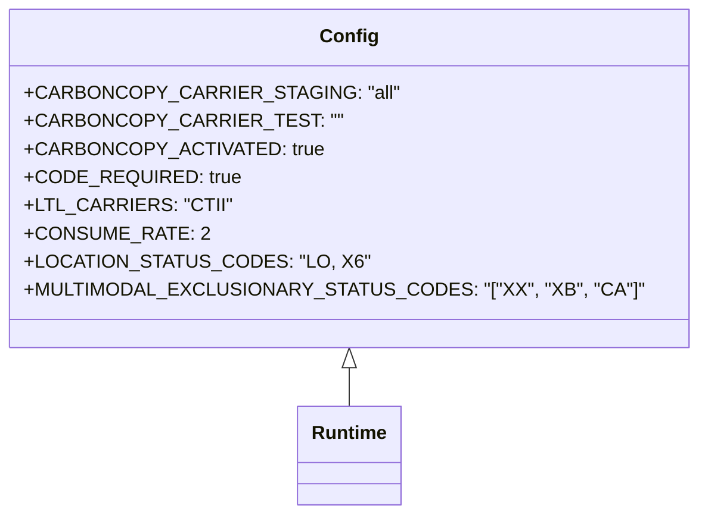

# Diagram: shipment_core/shipment_filter/config/config.qa.yml


> Auto-generated by Obscura crawlers

## Diagram 1



### SVG

<svg id="container" width="527.8203125" xmlns="http://www.w3.org/2000/svg" class="classDiagram" height="438" viewBox="0 0 527.8203125 438" role="graphics-document document" aria-roledescription="class"><style>#container{font-family:"trebuchet ms",verdana,arial,sans-serif;font-size:16px;fill:#333;}@keyframes edge-animation-frame{from{stroke-dashoffset:0;}}@keyframes dash{to{stroke-dashoffset:0;}}#container .edge-animation-slow{stroke-dasharray:9,5!important;stroke-dashoffset:900;animation:dash 50s linear infinite;stroke-linecap:round;}#container .edge-animation-fast{stroke-dasharray:9,5!important;stroke-dashoffset:900;animation:dash 20s linear infinite;stroke-linecap:round;}#container .error-icon{fill:#552222;}#container .error-text{fill:#552222;stroke:#552222;}#container .edge-thickness-normal{stroke-width:1px;}#container .edge-thickness-thick{stroke-width:3.5px;}#container .edge-pattern-solid{stroke-dasharray:0;}#container .edge-thickness-invisible{stroke-width:0;fill:none;}#container .edge-pattern-dashed{stroke-dasharray:3;}#container .edge-pattern-dotted{stroke-dasharray:2;}#container .marker{fill:#333333;stroke:#333333;}#container .marker.cross{stroke:#333333;}#container svg{font-family:"trebuchet ms",verdana,arial,sans-serif;font-size:16px;}#container p{margin:0;}#container g.classGroup text{fill:#9370DB;stroke:none;font-family:"trebuchet ms",verdana,arial,sans-serif;font-size:10px;}#container g.classGroup text .title{font-weight:bolder;}#container .nodeLabel,#container .edgeLabel{color:#131300;}#container .edgeLabel .label rect{fill:#ECECFF;}#container .label text{fill:#131300;}#container .labelBkg{background:#ECECFF;}#container .edgeLabel .label span{background:#ECECFF;}#container .classTitle{font-weight:bolder;}#container .node rect,#container .node circle,#container .node ellipse,#container .node polygon,#container .node path{fill:#ECECFF;stroke:#9370DB;stroke-width:1px;}#container .divider{stroke:#9370DB;stroke-width:1;}#container g.clickable{cursor:pointer;}#container g.classGroup rect{fill:#ECECFF;stroke:#9370DB;}#container g.classGroup line{stroke:#9370DB;stroke-width:1;}#container .classLabel .box{stroke:none;stroke-width:0;fill:#ECECFF;opacity:0.5;}#container .classLabel .label{fill:#9370DB;font-size:10px;}#container .relation{stroke:#333333;stroke-width:1;fill:none;}#container .dashed-line{stroke-dasharray:3;}#container .dotted-line{stroke-dasharray:1 2;}#container #compositionStart,#container .composition{fill:#333333!important;stroke:#333333!important;stroke-width:1;}#container #compositionEnd,#container .composition{fill:#333333!important;stroke:#333333!important;stroke-width:1;}#container #dependencyStart,#container .dependency{fill:#333333!important;stroke:#333333!important;stroke-width:1;}#container #dependencyStart,#container .dependency{fill:#333333!important;stroke:#333333!important;stroke-width:1;}#container #extensionStart,#container .extension{fill:transparent!important;stroke:#333333!important;stroke-width:1;}#container #extensionEnd,#container .extension{fill:transparent!important;stroke:#333333!important;stroke-width:1;}#container #aggregationStart,#container .aggregation{fill:transparent!important;stroke:#333333!important;stroke-width:1;}#container #aggregationEnd,#container .aggregation{fill:transparent!important;stroke:#333333!important;stroke-width:1;}#container #lollipopStart,#container .lollipop{fill:#ECECFF!important;stroke:#333333!important;stroke-width:1;}#container #lollipopEnd,#container .lollipop{fill:#ECECFF!important;stroke:#333333!important;stroke-width:1;}#container .edgeTerminals{font-size:11px;line-height:initial;}#container .classTitleText{text-anchor:middle;font-size:18px;fill:#333;}#container .label-icon{display:inline-block;height:1em;overflow:visible;vertical-align:-0.125em;}#container .node .label-icon path{fill:currentColor;stroke:revert;stroke-width:revert;}#container :root{--mermaid-font-family:"trebuchet ms",verdana,arial,sans-serif;}</style><g><defs><marker id="container_class-aggregationStart" class="marker aggregation class" refX="18" refY="7" markerWidth="190" markerHeight="240" orient="auto"><path d="M 18,7 L9,13 L1,7 L9,1 Z"></path></marker></defs><defs><marker id="container_class-aggregationEnd" class="marker aggregation class" refX="1" refY="7" markerWidth="20" markerHeight="28" orient="auto"><path d="M 18,7 L9,13 L1,7 L9,1 Z"></path></marker></defs><defs><marker id="container_class-extensionStart" class="marker extension class" refX="18" refY="7" markerWidth="190" markerHeight="240" orient="auto"><path d="M 1,7 L18,13 V 1 Z"></path></marker></defs><defs><marker id="container_class-extensionEnd" class="marker extension class" refX="1" refY="7" markerWidth="20" markerHeight="28" orient="auto"><path d="M 1,1 V 13 L18,7 Z"></path></marker></defs><defs><marker id="container_class-compositionStart" class="marker composition class" refX="18" refY="7" markerWidth="190" markerHeight="240" orient="auto"><path d="M 18,7 L9,13 L1,7 L9,1 Z"></path></marker></defs><defs><marker id="container_class-compositionEnd" class="marker composition class" refX="1" refY="7" markerWidth="20" markerHeight="28" orient="auto"><path d="M 18,7 L9,13 L1,7 L9,1 Z"></path></marker></defs><defs><marker id="container_class-dependencyStart" class="marker dependency class" refX="6" refY="7" markerWidth="190" markerHeight="240" orient="auto"><path d="M 5,7 L9,13 L1,7 L9,1 Z"></path></marker></defs><defs><marker id="container_class-dependencyEnd" class="marker dependency class" refX="13" refY="7" markerWidth="20" markerHeight="28" orient="auto"><path d="M 18,7 L9,13 L14,7 L9,1 Z"></path></marker></defs><defs><marker id="container_class-lollipopStart" class="marker lollipop class" refX="13" refY="7" markerWidth="190" markerHeight="240" orient="auto"><circle stroke="black" fill="transparent" cx="7" cy="7" r="6"></circle></marker></defs><defs><marker id="container_class-lollipopEnd" class="marker lollipop class" refX="1" refY="7" markerWidth="190" markerHeight="240" orient="auto"><circle stroke="black" fill="transparent" cx="7" cy="7" r="6"></circle></marker></defs><g class="root"><g class="clusters"></g><g class="edgePaths"><path d="M263.91,313.25L263.91,314.542C263.91,315.833,263.91,318.417,263.91,323.875C263.91,329.333,263.91,337.667,263.91,341.833L263.91,346" id="id_Config_Runtime_1" class="edge-thickness-normal edge-pattern-solid relation" style=";;;" data-edge="true" data-et="edge" data-id="id_Config_Runtime_1" data-points="W3sieCI6MjYzLjkxMDE1NjI1LCJ5IjoyOTZ9LHsieCI6MjYzLjkxMDE1NjI1LCJ5IjozMjF9LHsieCI6MjYzLjkxMDE1NjI1LCJ5IjozNDZ9XQ==" marker-start="url(#container_class-extensionStart)"></path></g><g class="edgeLabels"><g class="edgeLabel"><g class="label" data-id="id_Config_Runtime_1" transform="translate(0, 0)"><foreignObject width="0" height="0"><div xmlns="http://www.w3.org/1999/xhtml" class="labelBkg" style="display: table-cell; white-space: nowrap; line-height: 1.5; max-width: 200px; text-align: center;"><span class="edgeLabel"></span></div></foreignObject></g></g></g><g class="nodes"><g class="node default" id="classId-Config-0" transform="translate(263.91015625, 152)"><g class="basic label-container"><path d="M-255.91015625 -144 L255.91015625 -144 L255.91015625 144 L-255.91015625 144" stroke="none" stroke-width="0" fill="#ECECFF" style=""></path><path d="M-255.91015625 -144 C-125.15328312855681 -144, 5.603589992886384 -144, 255.91015625 -144 M-255.91015625 -144 C-111.49450772125354 -144, 32.92114080749292 -144, 255.91015625 -144 M255.91015625 -144 C255.91015625 -83.87872720765539, 255.91015625 -23.757454415310775, 255.91015625 144 M255.91015625 -144 C255.91015625 -38.008068440211986, 255.91015625 67.98386311957603, 255.91015625 144 M255.91015625 144 C136.50332587649712 144, 17.096495502994202 144, -255.91015625 144 M255.91015625 144 C122.5154044904371 144, -10.879347269125788 144, -255.91015625 144 M-255.91015625 144 C-255.91015625 45.432020843632884, -255.91015625 -53.13595831273423, -255.91015625 -144 M-255.91015625 144 C-255.91015625 40.397256532084015, -255.91015625 -63.20548693583197, -255.91015625 -144" stroke="#9370DB" stroke-width="1.3" fill="none" stroke-dasharray="0 0" style=""></path></g><g class="annotation-group text" transform="translate(0, -120)"></g><g class="label-group text" transform="translate(-22.9296875, -120)"><g class="label" style="font-weight: bolder" transform="translate(0,-12)"><foreignObject width="45.859375" height="24"><div xmlns="http://www.w3.org/1999/xhtml" style="display: table-cell; white-space: nowrap; line-height: 1.5; max-width: 96px; text-align: center;"><span class="nodeLabel markdown-node-label" style=""><p>Config</p></span></div></foreignObject></g></g><g class="members-group text" transform="translate(-243.91015625, -72)"><g class="label" style="" transform="translate(0,-12)"><foreignObject width="278.5625" height="24"><div xmlns="http://www.w3.org/1999/xhtml" style="display: table-cell; white-space: nowrap; line-height: 1.5; max-width: 336px; text-align: center;"><span class="nodeLabel markdown-node-label" style=""><p>+CARBONCOPY_CARRIER_STAGING: "all"</p></span></div></foreignObject></g><g class="label" style="" transform="translate(0,12)"><foreignObject width="232.625" height="24"><div xmlns="http://www.w3.org/1999/xhtml" style="display: table-cell; white-space: nowrap; line-height: 1.5; max-width: 290px; text-align: center;"><span class="nodeLabel markdown-node-label" style=""><p>+CARBONCOPY_CARRIER_TEST: ""</p></span></div></foreignObject></g><g class="label" style="" transform="translate(0,36)"><foreignObject width="224.828125" height="24"><div xmlns="http://www.w3.org/1999/xhtml" style="display: table-cell; white-space: nowrap; line-height: 1.5; max-width: 282px; text-align: center;"><span class="nodeLabel markdown-node-label" style=""><p>+CARBONCOPY_ACTIVATED: true</p></span></div></foreignObject></g><g class="label" style="" transform="translate(0,60)"><foreignObject width="165.90625" height="24"><div xmlns="http://www.w3.org/1999/xhtml" style="display: table-cell; white-space: nowrap; line-height: 1.5; max-width: 223px; text-align: center;"><span class="nodeLabel markdown-node-label" style=""><p>+CODE_REQUIRED: true</p></span></div></foreignObject></g><g class="label" style="" transform="translate(0,84)"><foreignObject width="154.96875" height="24"><div xmlns="http://www.w3.org/1999/xhtml" style="display: table-cell; white-space: nowrap; line-height: 1.5; max-width: 212px; text-align: center;"><span class="nodeLabel markdown-node-label" style=""><p>+LTL_CARRIERS: "CTII"</p></span></div></foreignObject></g><g class="label" style="" transform="translate(0,108)"><foreignObject width="138.15625" height="24"><div xmlns="http://www.w3.org/1999/xhtml" style="display: table-cell; white-space: nowrap; line-height: 1.5; max-width: 196px; text-align: center;"><span class="nodeLabel markdown-node-label" style=""><p>+CONSUME_RATE: 2</p></span></div></foreignObject></g><g class="label" style="" transform="translate(0,132)"><foreignObject width="256.109375" height="24"><div xmlns="http://www.w3.org/1999/xhtml" style="display: table-cell; white-space: nowrap; line-height: 1.5; max-width: 313px; text-align: center;"><span class="nodeLabel markdown-node-label" style=""><p>+LOCATION_STATUS_CODES: "LO, X6"</p></span></div></foreignObject></g><g class="label" style="" transform="translate(0,156)"><foreignObject width="464.890625" height="24"><div xmlns="http://www.w3.org/1999/xhtml" style="display: table-cell; white-space: nowrap; line-height: 1.5; max-width: 562px; text-align: center;"><span class="nodeLabel markdown-node-label" style=""><p>+MULTIMODAL_EXCLUSIONARY_STATUS_CODES: "["XX", "XB", "CA"]"</p></span></div></foreignObject></g></g><g class="methods-group text" transform="translate(-243.91015625, 144)"></g><g class="divider" style=""><path d="M-255.91015625 -96 C-80.63377336458441 -96, 94.64260952083117 -96, 255.91015625 -96 M-255.91015625 -96 C-113.25129005405603 -96, 29.407576141887944 -96, 255.91015625 -96" stroke="#9370DB" stroke-width="1.3" fill="none" stroke-dasharray="0 0" style=""></path></g><g class="divider" style=""><path d="M-255.91015625 120 C-127.82864474297267 120, 0.2528667640546587 120, 255.91015625 120 M-255.91015625 120 C-122.45733169600214 120, 10.995492857995714 120, 255.91015625 120" stroke="#9370DB" stroke-width="1.3" fill="none" stroke-dasharray="0 0" style=""></path></g></g><g class="node default" id="classId-Runtime-1" transform="translate(263.91015625, 388)"><g class="basic label-container"><path d="M-42.6484375 -42 L42.6484375 -42 L42.6484375 42 L-42.6484375 42" stroke="none" stroke-width="0" fill="#ECECFF" style=""></path><path d="M-42.6484375 -42 C-12.781103785827248 -42, 17.086229928345503 -42, 42.6484375 -42 M-42.6484375 -42 C-23.50580836963392 -42, -4.3631792392678435 -42, 42.6484375 -42 M42.6484375 -42 C42.6484375 -16.187254737874238, 42.6484375 9.625490524251525, 42.6484375 42 M42.6484375 -42 C42.6484375 -8.681079148424942, 42.6484375 24.637841703150116, 42.6484375 42 M42.6484375 42 C21.518673026574785 42, 0.3889085531495695 42, -42.6484375 42 M42.6484375 42 C9.6627815603782 42, -23.3228743792436 42, -42.6484375 42 M-42.6484375 42 C-42.6484375 23.179663192067252, -42.6484375 4.359326384134505, -42.6484375 -42 M-42.6484375 42 C-42.6484375 21.745338415300484, -42.6484375 1.4906768306009681, -42.6484375 -42" stroke="#9370DB" stroke-width="1.3" fill="none" stroke-dasharray="0 0" style=""></path></g><g class="annotation-group text" transform="translate(0, -18)"></g><g class="label-group text" transform="translate(-30.6484375, -18)"><g class="label" style="font-weight: bolder" transform="translate(0,-12)"><foreignObject width="61.296875" height="24"><div xmlns="http://www.w3.org/1999/xhtml" style="display: table-cell; white-space: nowrap; line-height: 1.5; max-width: 111px; text-align: center;"><span class="nodeLabel markdown-node-label" style=""><p>Runtime</p></span></div></foreignObject></g></g><g class="members-group text" transform="translate(-30.6484375, 30)"></g><g class="methods-group text" transform="translate(-30.6484375, 60)"></g><g class="divider" style=""><path d="M-42.6484375 6 C-11.606481528552845 6, 19.43547444289431 6, 42.6484375 6 M-42.6484375 6 C-24.705387816485228 6, -6.762338132970456 6, 42.6484375 6" stroke="#9370DB" stroke-width="1.3" fill="none" stroke-dasharray="0 0" style=""></path></g><g class="divider" style=""><path d="M-42.6484375 24 C-21.76331799183928 24, -0.8781984836785597 24, 42.6484375 24 M-42.6484375 24 C-19.373189904231502 24, 3.9020576915369958 24, 42.6484375 24" stroke="#9370DB" stroke-width="1.3" fill="none" stroke-dasharray="0 0" style=""></path></g></g></g></g></g></svg>

## Diagram 2

```mermaid
flowchart TD
    Start([Start]) --> CheckActivation{CARBONCOPY_ACTIVATED?}
    CheckActivation -- true --> ApplyCarbon[Apply carbon copy rules]
    CheckActivation -- false --> SkipCarbon[Bypass carbon copy]
    ApplyCarbon --> StagingInfo[Read CARBONCOPY_CARRIER_STAGING: "all"]
    ApplyCarbon --> TestInfo[Read CARBONCOPY_CARRIER_TEST: ""]
    ApplyCarbon --> LTLInfo[LTL carriers: "CTII"]
    ApplyCarbon --> Consume[Consume rate: 2]
    ApplyCarbon --> Exclusion[Exclude statuses: ["XX","XB","CA"]]
    Exclusion --> LocationStatus[Allowed location statuses: "LO, X6"]
    SkipCarbon --> Continue[Proceed without carbon copy rules]
```

> SVG rendering failed for this diagram.
