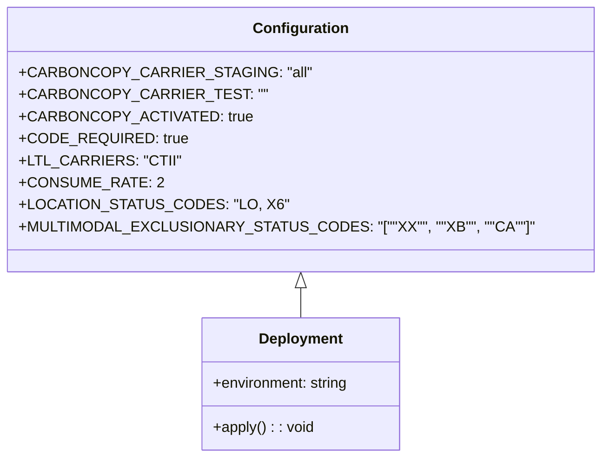

# Diagram: shipment_core/shipment_filter/config/config.qa2.yml


> Auto-generated by Obscura crawlers

## Diagram 1



### SVG

<svg id="container" width="592.5625" xmlns="http://www.w3.org/2000/svg" class="classDiagram" height="498" viewBox="0 0 592.5625 498" role="graphics-document document" aria-roledescription="class"><style>#container{font-family:"trebuchet ms",verdana,arial,sans-serif;font-size:16px;fill:#333;}@keyframes edge-animation-frame{from{stroke-dashoffset:0;}}@keyframes dash{to{stroke-dashoffset:0;}}#container .edge-animation-slow{stroke-dasharray:9,5!important;stroke-dashoffset:900;animation:dash 50s linear infinite;stroke-linecap:round;}#container .edge-animation-fast{stroke-dasharray:9,5!important;stroke-dashoffset:900;animation:dash 20s linear infinite;stroke-linecap:round;}#container .error-icon{fill:#552222;}#container .error-text{fill:#552222;stroke:#552222;}#container .edge-thickness-normal{stroke-width:1px;}#container .edge-thickness-thick{stroke-width:3.5px;}#container .edge-pattern-solid{stroke-dasharray:0;}#container .edge-thickness-invisible{stroke-width:0;fill:none;}#container .edge-pattern-dashed{stroke-dasharray:3;}#container .edge-pattern-dotted{stroke-dasharray:2;}#container .marker{fill:#333333;stroke:#333333;}#container .marker.cross{stroke:#333333;}#container svg{font-family:"trebuchet ms",verdana,arial,sans-serif;font-size:16px;}#container p{margin:0;}#container g.classGroup text{fill:#9370DB;stroke:none;font-family:"trebuchet ms",verdana,arial,sans-serif;font-size:10px;}#container g.classGroup text .title{font-weight:bolder;}#container .nodeLabel,#container .edgeLabel{color:#131300;}#container .edgeLabel .label rect{fill:#ECECFF;}#container .label text{fill:#131300;}#container .labelBkg{background:#ECECFF;}#container .edgeLabel .label span{background:#ECECFF;}#container .classTitle{font-weight:bolder;}#container .node rect,#container .node circle,#container .node ellipse,#container .node polygon,#container .node path{fill:#ECECFF;stroke:#9370DB;stroke-width:1px;}#container .divider{stroke:#9370DB;stroke-width:1;}#container g.clickable{cursor:pointer;}#container g.classGroup rect{fill:#ECECFF;stroke:#9370DB;}#container g.classGroup line{stroke:#9370DB;stroke-width:1;}#container .classLabel .box{stroke:none;stroke-width:0;fill:#ECECFF;opacity:0.5;}#container .classLabel .label{fill:#9370DB;font-size:10px;}#container .relation{stroke:#333333;stroke-width:1;fill:none;}#container .dashed-line{stroke-dasharray:3;}#container .dotted-line{stroke-dasharray:1 2;}#container #compositionStart,#container .composition{fill:#333333!important;stroke:#333333!important;stroke-width:1;}#container #compositionEnd,#container .composition{fill:#333333!important;stroke:#333333!important;stroke-width:1;}#container #dependencyStart,#container .dependency{fill:#333333!important;stroke:#333333!important;stroke-width:1;}#container #dependencyStart,#container .dependency{fill:#333333!important;stroke:#333333!important;stroke-width:1;}#container #extensionStart,#container .extension{fill:transparent!important;stroke:#333333!important;stroke-width:1;}#container #extensionEnd,#container .extension{fill:transparent!important;stroke:#333333!important;stroke-width:1;}#container #aggregationStart,#container .aggregation{fill:transparent!important;stroke:#333333!important;stroke-width:1;}#container #aggregationEnd,#container .aggregation{fill:transparent!important;stroke:#333333!important;stroke-width:1;}#container #lollipopStart,#container .lollipop{fill:#ECECFF!important;stroke:#333333!important;stroke-width:1;}#container #lollipopEnd,#container .lollipop{fill:#ECECFF!important;stroke:#333333!important;stroke-width:1;}#container .edgeTerminals{font-size:11px;line-height:initial;}#container .classTitleText{text-anchor:middle;font-size:18px;fill:#333;}#container .label-icon{display:inline-block;height:1em;overflow:visible;vertical-align:-0.125em;}#container .node .label-icon path{fill:currentColor;stroke:revert;stroke-width:revert;}#container :root{--mermaid-font-family:"trebuchet ms",verdana,arial,sans-serif;}</style><g><defs><marker id="container_class-aggregationStart" class="marker aggregation class" refX="18" refY="7" markerWidth="190" markerHeight="240" orient="auto"><path d="M 18,7 L9,13 L1,7 L9,1 Z"></path></marker></defs><defs><marker id="container_class-aggregationEnd" class="marker aggregation class" refX="1" refY="7" markerWidth="20" markerHeight="28" orient="auto"><path d="M 18,7 L9,13 L1,7 L9,1 Z"></path></marker></defs><defs><marker id="container_class-extensionStart" class="marker extension class" refX="18" refY="7" markerWidth="190" markerHeight="240" orient="auto"><path d="M 1,7 L18,13 V 1 Z"></path></marker></defs><defs><marker id="container_class-extensionEnd" class="marker extension class" refX="1" refY="7" markerWidth="20" markerHeight="28" orient="auto"><path d="M 1,1 V 13 L18,7 Z"></path></marker></defs><defs><marker id="container_class-compositionStart" class="marker composition class" refX="18" refY="7" markerWidth="190" markerHeight="240" orient="auto"><path d="M 18,7 L9,13 L1,7 L9,1 Z"></path></marker></defs><defs><marker id="container_class-compositionEnd" class="marker composition class" refX="1" refY="7" markerWidth="20" markerHeight="28" orient="auto"><path d="M 18,7 L9,13 L1,7 L9,1 Z"></path></marker></defs><defs><marker id="container_class-dependencyStart" class="marker dependency class" refX="6" refY="7" markerWidth="190" markerHeight="240" orient="auto"><path d="M 5,7 L9,13 L1,7 L9,1 Z"></path></marker></defs><defs><marker id="container_class-dependencyEnd" class="marker dependency class" refX="13" refY="7" markerWidth="20" markerHeight="28" orient="auto"><path d="M 18,7 L9,13 L14,7 L9,1 Z"></path></marker></defs><defs><marker id="container_class-lollipopStart" class="marker lollipop class" refX="13" refY="7" markerWidth="190" markerHeight="240" orient="auto"><circle stroke="black" fill="transparent" cx="7" cy="7" r="6"></circle></marker></defs><defs><marker id="container_class-lollipopEnd" class="marker lollipop class" refX="1" refY="7" markerWidth="190" markerHeight="240" orient="auto"><circle stroke="black" fill="transparent" cx="7" cy="7" r="6"></circle></marker></defs><g class="root"><g class="clusters"></g><g class="edgePaths"><path d="M296.281,313.25L296.281,314.542C296.281,315.833,296.281,318.417,296.281,323.875C296.281,329.333,296.281,337.667,296.281,341.833L296.281,346" id="id_Configuration_Deployment_1" class="edge-thickness-normal edge-pattern-solid relation" style=";;;" data-edge="true" data-et="edge" data-id="id_Configuration_Deployment_1" data-points="W3sieCI6Mjk2LjI4MTI1LCJ5IjoyOTZ9LHsieCI6Mjk2LjI4MTI1LCJ5IjozMjF9LHsieCI6Mjk2LjI4MTI1LCJ5IjozNDZ9XQ==" marker-start="url(#container_class-extensionStart)"></path></g><g class="edgeLabels"><g class="edgeLabel"><g class="label" data-id="id_Configuration_Deployment_1" transform="translate(0, 0)"><foreignObject width="0" height="0"><div xmlns="http://www.w3.org/1999/xhtml" class="labelBkg" style="display: table-cell; white-space: nowrap; line-height: 1.5; max-width: 200px; text-align: center;"><span class="edgeLabel"></span></div></foreignObject></g></g></g><g class="nodes"><g class="node default" id="classId-Configuration-0" transform="translate(296.28125, 152)"><g class="basic label-container"><path d="M-288.28125 -144 L288.28125 -144 L288.28125 144 L-288.28125 144" stroke="none" stroke-width="0" fill="#ECECFF" style=""></path><path d="M-288.28125 -144 C-88.77847792716756 -144, 110.72429414566489 -144, 288.28125 -144 M-288.28125 -144 C-151.5899838430716 -144, -14.898717686143186 -144, 288.28125 -144 M288.28125 -144 C288.28125 -46.32602077432247, 288.28125 51.347958451355055, 288.28125 144 M288.28125 -144 C288.28125 -67.46852797908222, 288.28125 9.06294404183555, 288.28125 144 M288.28125 144 C103.92357846652789 144, -80.43409306694423 144, -288.28125 144 M288.28125 144 C137.84656413546182 144, -12.588121729076363 144, -288.28125 144 M-288.28125 144 C-288.28125 73.1174241636264, -288.28125 2.2348483272527915, -288.28125 -144 M-288.28125 144 C-288.28125 79.6776403569012, -288.28125 15.355280713802387, -288.28125 -144" stroke="#9370DB" stroke-width="1.3" fill="none" stroke-dasharray="0 0" style=""></path></g><g class="annotation-group text" transform="translate(0, -120)"></g><g class="label-group text" transform="translate(-49.375, -120)"><g class="label" style="font-weight: bolder" transform="translate(0,-12)"><foreignObject width="98.75" height="24"><div xmlns="http://www.w3.org/1999/xhtml" style="display: table-cell; white-space: nowrap; line-height: 1.5; max-width: 147px; text-align: center;"><span class="nodeLabel markdown-node-label" style=""><p>Configuration</p></span></div></foreignObject></g></g><g class="members-group text" transform="translate(-276.28125, -72)"><g class="label" style="" transform="translate(0,-12)"><foreignObject width="278.5625" height="24"><div xmlns="http://www.w3.org/1999/xhtml" style="display: table-cell; white-space: nowrap; line-height: 1.5; max-width: 336px; text-align: center;"><span class="nodeLabel markdown-node-label" style=""><p>+CARBONCOPY_CARRIER_STAGING: "all"</p></span></div></foreignObject></g><g class="label" style="" transform="translate(0,12)"><foreignObject width="232.625" height="24"><div xmlns="http://www.w3.org/1999/xhtml" style="display: table-cell; white-space: nowrap; line-height: 1.5; max-width: 290px; text-align: center;"><span class="nodeLabel markdown-node-label" style=""><p>+CARBONCOPY_CARRIER_TEST: ""</p></span></div></foreignObject></g><g class="label" style="" transform="translate(0,36)"><foreignObject width="224.828125" height="24"><div xmlns="http://www.w3.org/1999/xhtml" style="display: table-cell; white-space: nowrap; line-height: 1.5; max-width: 282px; text-align: center;"><span class="nodeLabel markdown-node-label" style=""><p>+CARBONCOPY_ACTIVATED: true</p></span></div></foreignObject></g><g class="label" style="" transform="translate(0,60)"><foreignObject width="165.90625" height="24"><div xmlns="http://www.w3.org/1999/xhtml" style="display: table-cell; white-space: nowrap; line-height: 1.5; max-width: 223px; text-align: center;"><span class="nodeLabel markdown-node-label" style=""><p>+CODE_REQUIRED: true</p></span></div></foreignObject></g><g class="label" style="" transform="translate(0,84)"><foreignObject width="154.96875" height="24"><div xmlns="http://www.w3.org/1999/xhtml" style="display: table-cell; white-space: nowrap; line-height: 1.5; max-width: 212px; text-align: center;"><span class="nodeLabel markdown-node-label" style=""><p>+LTL_CARRIERS: "CTII"</p></span></div></foreignObject></g><g class="label" style="" transform="translate(0,108)"><foreignObject width="138.15625" height="24"><div xmlns="http://www.w3.org/1999/xhtml" style="display: table-cell; white-space: nowrap; line-height: 1.5; max-width: 196px; text-align: center;"><span class="nodeLabel markdown-node-label" style=""><p>+CONSUME_RATE: 2</p></span></div></foreignObject></g><g class="label" style="" transform="translate(0,132)"><foreignObject width="256.109375" height="24"><div xmlns="http://www.w3.org/1999/xhtml" style="display: table-cell; white-space: nowrap; line-height: 1.5; max-width: 313px; text-align: center;"><span class="nodeLabel markdown-node-label" style=""><p>+LOCATION_STATUS_CODES: "LO, X6"</p></span></div></foreignObject></g><g class="label" style="" transform="translate(0,156)"><foreignObject width="503.1875" height="24"><div xmlns="http://www.w3.org/1999/xhtml" style="display: table-cell; white-space: nowrap; line-height: 1.5; max-width: 561px; text-align: center;"><span class="nodeLabel markdown-node-label" style=""><p>+MULTIMODAL_EXCLUSIONARY_STATUS_CODES: "[""XX"", ""XB"", ""CA""]"</p></span></div></foreignObject></g></g><g class="methods-group text" transform="translate(-276.28125, 144)"></g><g class="divider" style=""><path d="M-288.28125 -96 C-168.4587499609498 -96, -48.636249921899605 -96, 288.28125 -96 M-288.28125 -96 C-67.2744969825905 -96, 153.732256034819 -96, 288.28125 -96" stroke="#9370DB" stroke-width="1.3" fill="none" stroke-dasharray="0 0" style=""></path></g><g class="divider" style=""><path d="M-288.28125 120 C-77.04702754253336 120, 134.1871949149333 120, 288.28125 120 M-288.28125 120 C-92.85773512018517 120, 102.56577975962966 120, 288.28125 120" stroke="#9370DB" stroke-width="1.3" fill="none" stroke-dasharray="0 0" style=""></path></g></g><g class="node default" id="classId-Deployment-1" transform="translate(296.28125, 418)"><g class="basic label-container"><path d="M-109.2578125 -72 L109.2578125 -72 L109.2578125 72 L-109.2578125 72" stroke="none" stroke-width="0" fill="#ECECFF" style=""></path><path d="M-109.2578125 -72 C-62.71988446476412 -72, -16.181956429528242 -72, 109.2578125 -72 M-109.2578125 -72 C-34.06364133456201 -72, 41.130529830875986 -72, 109.2578125 -72 M109.2578125 -72 C109.2578125 -38.56085501541299, 109.2578125 -5.12171003082598, 109.2578125 72 M109.2578125 -72 C109.2578125 -29.236701602593477, 109.2578125 13.526596794813045, 109.2578125 72 M109.2578125 72 C61.53732273127696 72, 13.816832962553917 72, -109.2578125 72 M109.2578125 72 C60.05035226758848 72, 10.842892035176959 72, -109.2578125 72 M-109.2578125 72 C-109.2578125 26.342186596283995, -109.2578125 -19.31562680743201, -109.2578125 -72 M-109.2578125 72 C-109.2578125 41.31569938582611, -109.2578125 10.631398771652215, -109.2578125 -72" stroke="#9370DB" stroke-width="1.3" fill="none" stroke-dasharray="0 0" style=""></path></g><g class="annotation-group text" transform="translate(0, -48)"></g><g class="label-group text" transform="translate(-44.375, -48)"><g class="label" style="font-weight: bolder" transform="translate(0,-12)"><foreignObject width="88.75" height="24"><div xmlns="http://www.w3.org/1999/xhtml" style="display: table-cell; white-space: nowrap; line-height: 1.5; max-width: 138px; text-align: center;"><span class="nodeLabel markdown-node-label" style=""><p>Deployment</p></span></div></foreignObject></g></g><g class="members-group text" transform="translate(-97.2578125, 0)"><g class="label" style="" transform="translate(0,-12)"><foreignObject width="150.140625" height="24"><div xmlns="http://www.w3.org/1999/xhtml" style="display: table-cell; white-space: nowrap; line-height: 1.5; max-width: 208px; text-align: center;"><span class="nodeLabel markdown-node-label" style=""><p>+environment: string</p></span></div></foreignObject></g></g><g class="methods-group text" transform="translate(-97.2578125, 48)"><g class="label" style="" transform="translate(0,-12)"><foreignObject width="109.859375" height="24"><div xmlns="http://www.w3.org/1999/xhtml" style="display: table-cell; white-space: nowrap; line-height: 1.5; max-width: 167px; text-align: center;"><span class="nodeLabel markdown-node-label" style=""><p>+apply() : : void</p></span></div></foreignObject></g></g><g class="divider" style=""><path d="M-109.2578125 -24 C-35.06604022843041 -24, 39.12573204313918 -24, 109.2578125 -24 M-109.2578125 -24 C-42.02530608157279 -24, 25.207200336854413 -24, 109.2578125 -24" stroke="#9370DB" stroke-width="1.3" fill="none" stroke-dasharray="0 0" style=""></path></g><g class="divider" style=""><path d="M-109.2578125 24 C-30.022103006071703 24, 49.213606487856595 24, 109.2578125 24 M-109.2578125 24 C-23.1723381392015 24, 62.913136221597 24, 109.2578125 24" stroke="#9370DB" stroke-width="1.3" fill="none" stroke-dasharray="0 0" style=""></path></g></g></g></g></g></svg>

## Diagram 2

```mermaid
flowchart TD
    A[CARBONCOPY_ACTIVATED?] -->|true| B[Enable carbon copy carriers]
    A -->|false| C[Disable carbon copy carriers]
    B --> D{CARBONCOPY_CARRIER_STAGING set?}
    D -->|all| E[Broadcast to all staging carriers]
    D -->|other| F[Broadcast to subset]
    B --> G{CODE_REQUIRED}
    G -->|true| H[Require code validation]
    G -->|false| I[Skip code validation]
    H --> J[LTL Carriers: "CTII"]
    J --> K[Consume rate = 2]
    K --> L[Apply LOCATION_STATUS_CODES: "LO, X6"]
    L --> M[Exclude statuses: "XX","XB","CA"]
```

> SVG rendering failed for this diagram.
