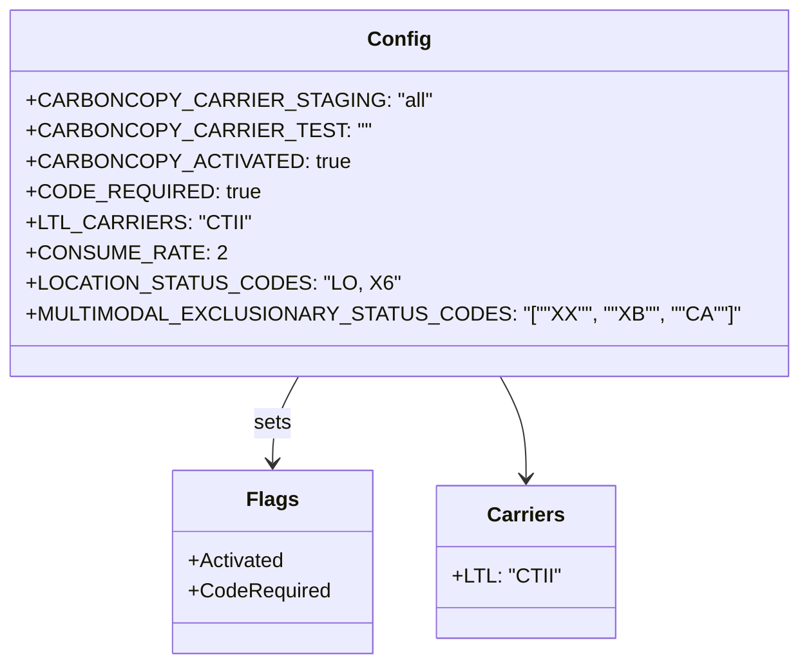
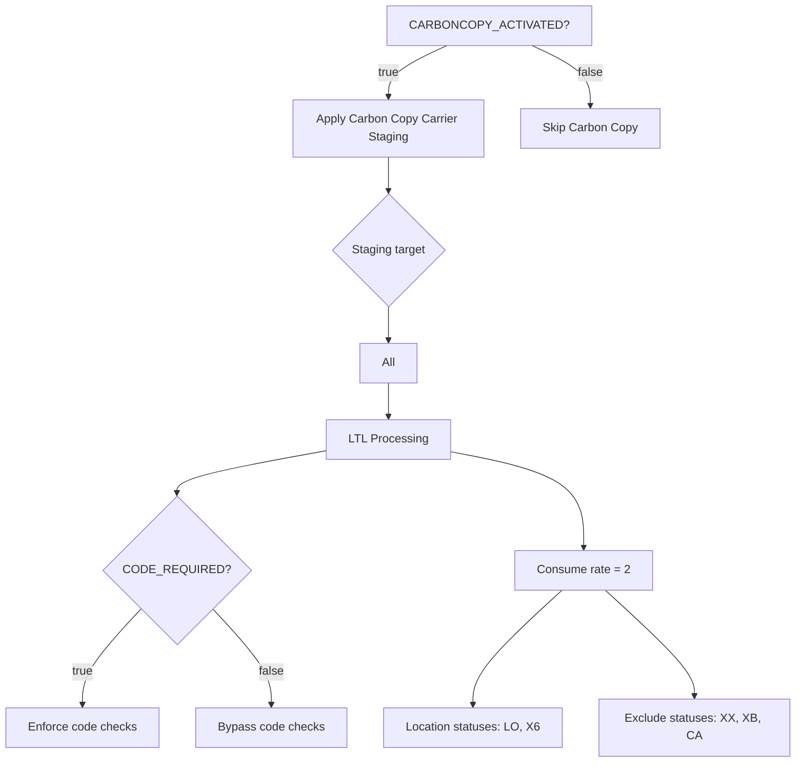

# Diagram: shipment_core/shipment_filter/config/config.staging.yml

> Auto-generated by Obscura crawlers

## Diagram 1

### SVG

<svg id="container" width="566.1171875" xmlns="http://www.w3.org/2000/svg" class="classDiagram" height="522" viewBox="0 0 566.1171875 522" role="graphics-document document" aria-roledescription="class"><g><defs><marker id="container_class-aggregationStart" class="marker aggregation class" refX="18" refY="7" markerWidth="190" markerHeight="240" orient="auto"><path d="M 18,7 L9,13 L1,7 L9,1 Z"></path></marker></defs><defs><marker id="container_class-aggregationEnd" class="marker aggregation class" refX="1" refY="7" markerWidth="20" markerHeight="28" orient="auto"><path d="M 18,7 L9,13 L1,7 L9,1 Z"></path></marker></defs><defs><marker id="container_class-extensionStart" class="marker extension class" refX="18" refY="7" markerWidth="190" markerHeight="240" orient="auto"><path d="M 1,7 L18,13 V 1 Z"></path></marker></defs><defs><marker id="container_class-extensionEnd" class="marker extension class" refX="1" refY="7" markerWidth="20" markerHeight="28" orient="auto"><path d="M 1,1 V 13 L18,7 Z"></path></marker></defs><defs><marker id="container_class-compositionStart" class="marker composition class" refX="18" refY="7" markerWidth="190" markerHeight="240" orient="auto"><path d="M 18,7 L9,13 L1,7 L9,1 Z"></path></marker></defs><defs><marker id="container_class-compositionEnd" class="marker composition class" refX="1" refY="7" markerWidth="20" markerHeight="28" orient="auto"><path d="M 18,7 L9,13 L1,7 L9,1 Z"></path></marker></defs><defs><marker id="container_class-dependencyStart" class="marker dependency class" refX="6" refY="7" markerWidth="190" markerHeight="240" orient="auto"><path d="M 5,7 L9,13 L1,7 L9,1 Z"></path></marker></defs><defs><marker id="container_class-dependencyEnd" class="marker dependency class" refX="13" refY="7" markerWidth="20" markerHeight="28" orient="auto"><path d="M 18,7 L9,13 L14,7 L9,1 Z"></path></marker></defs><defs><marker id="container_class-lollipopStart" class="marker lollipop class" refX="13" refY="7" markerWidth="190" markerHeight="240" orient="auto"><circle stroke="black" fill="transparent" cx="7" cy="7" r="6"></circle></marker></defs><defs><marker id="container_class-lollipopEnd" class="marker lollipop class" refX="1" refY="7" markerWidth="190" markerHeight="240" orient="auto"><circle stroke="black" fill="transparent" cx="7" cy="7" r="6"></circle></marker></defs><g class="root"><g class="clusters"></g><g class="edgePaths"><path d="M206.751,296L203.483,302.167C200.216,308.333,193.68,320.667,190.412,332C187.145,343.333,187.145,353.667,187.145,358.833L187.145,364" id="id_Config_Flags_1" class="edge-thickness-normal edge-pattern-solid relation" style=";;;" data-edge="true" data-et="edge" data-id="id_Config_Flags_1" data-points="W3sieCI6MjA2Ljc1MTI3MzMwODAxMTA0LCJ5IjoyOTZ9LHsieCI6MTg3LjE0NDUzMTI1LCJ5IjozMzN9LHsieCI6MTg3LjE0NDUzMTI1LCJ5IjozNzB9XQ==" marker-end="url(#container_class-dependencyEnd)"></path><path d="M359.366,296L362.634,302.167C365.901,308.333,372.437,320.667,375.705,334C378.973,347.333,378.973,361.667,378.973,368.833L378.973,376" id="id_Config_Carriers_2" class="edge-thickness-normal edge-pattern-solid relation" style=";;;" data-edge="true" data-et="edge" data-id="id_Config_Carriers_2" data-points="W3sieCI6MzU5LjM2NTkxNDE5MTk4ODk2LCJ5IjoyOTZ9LHsieCI6Mzc4Ljk3MjY1NjI1LCJ5IjozMzN9LHsieCI6Mzc4Ljk3MjY1NjI1LCJ5IjozODJ9XQ==" marker-end="url(#container_class-dependencyEnd)"></path></g><g class="edgeLabels"><g class="edgeLabel" transform="translate(187.14453125, 333)"><g class="label" data-id="id_Config_Flags_1" transform="translate(-14.7265625, -12)"><foreignObject width="29.453125" height="24">

sets

</foreignObject></g></g><g class="edgeLabel"><g class="label" data-id="id_Config_Carriers_2" transform="translate(0, 0)"><foreignObject width="0" height="0">

</foreignObject></g></g></g><g class="nodes"><g class="node default" id="classId-Config-0" transform="translate(283.05859375, 152)"><g class="basic label-container"><path d="M-275.05859375 -144 L275.05859375 -144 L275.05859375 144 L-275.05859375 144" stroke="none" stroke-width="0" fill="#ECECFF" style=""></path><path d="M-275.05859375 -144 C-105.07676701959721 -144, 64.90505971080557 -144, 275.05859375 -144 M-275.05859375 -144 C-121.34969062603687 -144, 32.35921249792625 -144, 275.05859375 -144 M275.05859375 -144 C275.05859375 -33.362176839539146, 275.05859375 77.27564632092171, 275.05859375 144 M275.05859375 -144 C275.05859375 -76.73406059752654, 275.05859375 -9.468121195053072, 275.05859375 144 M275.05859375 144 C140.64332491510615 144, 6.228056080212298 144, -275.05859375 144 M275.05859375 144 C149.7241236433526 144, 24.389653536705225 144, -275.05859375 144 M-275.05859375 144 C-275.05859375 63.12331958865701, -275.05859375 -17.753360822685977, -275.05859375 -144 M-275.05859375 144 C-275.05859375 67.8001670986024, -275.05859375 -8.399665802795198, -275.05859375 -144" stroke="#9370DB" stroke-width="1.3" fill="none" stroke-dasharray="0 0" style=""></path></g><g class="annotation-group text" transform="translate(0, -120)"></g><g class="label-group text" transform="translate(-22.9296875, -120)"><g class="label" style="font-weight: bolder" transform="translate(0,-12)"><foreignObject width="45.859375" height="24">

Config

</foreignObject></g></g><g class="members-group text" transform="translate(-263.05859375, -72)"><g class="label" style="" transform="translate(0,-12)"><foreignObject width="278.5625" height="24">

+CARBONCOPY_CARRIER_STAGING: "all"

</foreignObject></g><g class="label" style="" transform="translate(0,12)"><foreignObject width="232.625" height="24">

+CARBONCOPY_CARRIER_TEST: ""

</foreignObject></g><g class="label" style="" transform="translate(0,36)"><foreignObject width="224.828125" height="24">

+CARBONCOPY_ACTIVATED: true

</foreignObject></g><g class="label" style="" transform="translate(0,60)"><foreignObject width="165.90625" height="24">

+CODE_REQUIRED: true

</foreignObject></g><g class="label" style="" transform="translate(0,84)"><foreignObject width="154.96875" height="24">

+LTL_CARRIERS: "CTII"

</foreignObject></g><g class="label" style="" transform="translate(0,108)"><foreignObject width="138.15625" height="24">

+CONSUME_RATE: 2

</foreignObject></g><g class="label" style="" transform="translate(0,132)"><foreignObject width="256.109375" height="24">

+LOCATION_STATUS_CODES: "LO, X6"

</foreignObject></g><g class="label" style="" transform="translate(0,156)"><foreignObject width="503.1875" height="24">

+MULTIMODAL_EXCLUSIONARY_STATUS_CODES: "[""XX"", ""XB"", ""CA""]"

</foreignObject></g></g><g class="methods-group text" transform="translate(-263.05859375, 144)"></g><g class="divider" style=""><path d="M-275.05859375 -96 C-134.84399212903617 -96, 5.370609491927667 -96, 275.05859375 -96 M-275.05859375 -96 C-86.95816156110084 -96, 101.14227062779833 -96, 275.05859375 -96" stroke="#9370DB" stroke-width="1.3" fill="none" stroke-dasharray="0 0" style=""></path></g><g class="divider" style=""><path d="M-275.05859375 120 C-65.40999885151481 120, 144.23859604697037 120, 275.05859375 120 M-275.05859375 120 C-81.12350234116474 120, 112.81158906767052 120, 275.05859375 120" stroke="#9370DB" stroke-width="1.3" fill="none" stroke-dasharray="0 0" style=""></path></g></g><g class="node default" id="classId-Flags-1" transform="translate(187.14453125, 442)"><g class="basic label-container"><path d="M-76.2265625 -72 L76.2265625 -72 L76.2265625 72 L-76.2265625 72" stroke="none" stroke-width="0" fill="#ECECFF" style=""></path><path d="M-76.2265625 -72 C-26.505264323577904 -72, 23.21603385284419 -72, 76.2265625 -72 M-76.2265625 -72 C-42.883285018373854 -72, -9.540007536747709 -72, 76.2265625 -72 M76.2265625 -72 C76.2265625 -39.02706765768813, 76.2265625 -6.054135315376257, 76.2265625 72 M76.2265625 -72 C76.2265625 -36.24749760132137, 76.2265625 -0.4949952026427411, 76.2265625 72 M76.2265625 72 C34.71206132402646 72, -6.802439851947085 72, -76.2265625 72 M76.2265625 72 C44.033445446050926 72, 11.840328392101853 72, -76.2265625 72 M-76.2265625 72 C-76.2265625 31.177687727910225, -76.2265625 -9.64462454417955, -76.2265625 -72 M-76.2265625 72 C-76.2265625 39.6473709820551, -76.2265625 7.294741964110202, -76.2265625 -72" stroke="#9370DB" stroke-width="1.3" fill="none" stroke-dasharray="0 0" style=""></path></g><g class="annotation-group text" transform="translate(0, -48)"></g><g class="label-group text" transform="translate(-18.65625, -48)"><g class="label" style="font-weight: bolder" transform="translate(0,-12)"><foreignObject width="37.3125" height="24">

Flags

</foreignObject></g></g><g class="members-group text" transform="translate(-64.2265625, 0)"><g class="label" style="" transform="translate(0,-12)"><foreignObject width="75.078125" height="24">

+Activated

</foreignObject></g><g class="label" style="" transform="translate(0,12)"><foreignObject width="109.796875" height="24">

+CodeRequired

</foreignObject></g></g><g class="methods-group text" transform="translate(-64.2265625, 72)"></g><g class="divider" style=""><path d="M-76.2265625 -24 C-41.90232676593269 -24, -7.578091031865384 -24, 76.2265625 -24 M-76.2265625 -24 C-25.584703844421128 -24, 25.057154811157744 -24, 76.2265625 -24" stroke="#9370DB" stroke-width="1.3" fill="none" stroke-dasharray="0 0" style=""></path></g><g class="divider" style=""><path d="M-76.2265625 48 C-28.057505032038407 48, 20.111552435923187 48, 76.2265625 48 M-76.2265625 48 C-22.297263811574474 48, 31.63203487685105 48, 76.2265625 48" stroke="#9370DB" stroke-width="1.3" fill="none" stroke-dasharray="0 0" style=""></path></g></g><g class="node default" id="classId-Carriers-2" transform="translate(378.97265625, 442)"><g class="basic label-container"><path d="M-65.6015625 -60 L65.6015625 -60 L65.6015625 60 L-65.6015625 60" stroke="none" stroke-width="0" fill="#ECECFF" style=""></path><path d="M-65.6015625 -60 C-29.696394053496597 -60, 6.208774393006806 -60, 65.6015625 -60 M-65.6015625 -60 C-27.72965375102052 -60, 10.142254997958958 -60, 65.6015625 -60 M65.6015625 -60 C65.6015625 -29.458652901469627, 65.6015625 1.0826941970607464, 65.6015625 60 M65.6015625 -60 C65.6015625 -30.98816914600304, 65.6015625 -1.9763382920060835, 65.6015625 60 M65.6015625 60 C35.70827908293174 60, 5.814995665863478 60, -65.6015625 60 M65.6015625 60 C15.071348211224091 60, -35.45886607755182 60, -65.6015625 60 M-65.6015625 60 C-65.6015625 32.5809906626657, -65.6015625 5.161981325331396, -65.6015625 -60 M-65.6015625 60 C-65.6015625 16.64403555025617, -65.6015625 -26.71192889948766, -65.6015625 -60" stroke="#9370DB" stroke-width="1.3" fill="none" stroke-dasharray="0 0" style=""></path></g><g class="annotation-group text" transform="translate(0, -36)"></g><g class="label-group text" transform="translate(-28.96875, -36)"><g class="label" style="font-weight: bolder" transform="translate(0,-12)"><foreignObject width="57.9375" height="24">

Carriers

</foreignObject></g></g><g class="members-group text" transform="translate(-53.6015625, 12)"><g class="label" style="" transform="translate(0,-12)"><foreignObject width="78.234375" height="24">

+LTL: "CTII"

</foreignObject></g></g><g class="methods-group text" transform="translate(-53.6015625, 60)"></g><g class="divider" style=""><path d="M-65.6015625 -12 C-30.245876488055934 -12, 5.109809523888131 -12, 65.6015625 -12 M-65.6015625 -12 C-20.731599289818455 -12, 24.13836392036309 -12, 65.6015625 -12" stroke="#9370DB" stroke-width="1.3" fill="none" stroke-dasharray="0 0" style=""></path></g><g class="divider" style=""><path d="M-65.6015625 36 C-25.372023065938954 36, 14.857516368122091 36, 65.6015625 36 M-65.6015625 36 C-14.573880895009175 36, 36.45380070998165 36, 65.6015625 36" stroke="#9370DB" stroke-width="1.3" fill="none" stroke-dasharray="0 0" style=""></path></g></g></g></g></g></svg>

## Diagram 2

### SVG

<svg id="container" width="1072.109375" xmlns="http://www.w3.org/2000/svg" class="flowchart" height="993.453125" viewBox="0 0 1072.109375 993.453125" role="graphics-document document" aria-roledescription="flowchart-v2"><g><marker id="container_flowchart-v2-pointEnd" class="marker flowchart-v2" viewBox="0 0 10 10" refX="5" refY="5" markerUnits="userSpaceOnUse" markerWidth="8" markerHeight="8" orient="auto"><path d="M 0 0 L 10 5 L 0 10 z" class="arrowMarkerPath" style="stroke-width: 1; stroke-dasharray: 1, 0;"></path></marker><marker id="container_flowchart-v2-pointStart" class="marker flowchart-v2" viewBox="0 0 10 10" refX="4.5" refY="5" markerUnits="userSpaceOnUse" markerWidth="8" markerHeight="8" orient="auto"><path d="M 0 5 L 10 10 L 10 0 z" class="arrowMarkerPath" style="stroke-width: 1; stroke-dasharray: 1, 0;"></path></marker><marker id="container_flowchart-v2-circleEnd" class="marker flowchart-v2" viewBox="0 0 10 10" refX="11" refY="5" markerUnits="userSpaceOnUse" markerWidth="11" markerHeight="11" orient="auto"><circle cx="5" cy="5" r="5" class="arrowMarkerPath" style="stroke-width: 1; stroke-dasharray: 1, 0;"></circle></marker><marker id="container_flowchart-v2-circleStart" class="marker flowchart-v2" viewBox="0 0 10 10" refX="-1" refY="5" markerUnits="userSpaceOnUse" markerWidth="11" markerHeight="11" orient="auto"><circle cx="5" cy="5" r="5" class="arrowMarkerPath" style="stroke-width: 1; stroke-dasharray: 1, 0;"></circle></marker><marker id="container_flowchart-v2-crossEnd" class="marker cross flowchart-v2" viewBox="0 0 11 11" refX="12" refY="5.2" markerUnits="userSpaceOnUse" markerWidth="11" markerHeight="11" orient="auto"><path d="M 1,1 l 9,9 M 10,1 l -9,9" class="arrowMarkerPath" style="stroke-width: 2; stroke-dasharray: 1, 0;"></path></marker><marker id="container_flowchart-v2-crossStart" class="marker cross flowchart-v2" viewBox="0 0 11 11" refX="-1" refY="5.2" markerUnits="userSpaceOnUse" markerWidth="11" markerHeight="11" orient="auto"><path d="M 1,1 l 9,9 M 10,1 l -9,9" class="arrowMarkerPath" style="stroke-width: 2; stroke-dasharray: 1, 0;"></path></marker><g class="root"><g class="clusters"></g><g class="edgePaths"><path d="M601.936,62L588.769,68.167C575.602,74.333,549.268,86.667,536.101,98.333C522.934,110,522.934,121,522.934,126.5L522.934,132" id="L_A_B_0" class="edge-thickness-normal edge-pattern-solid edge-thickness-normal edge-pattern-solid flowchart-link" style=";" data-edge="true" data-et="edge" data-id="L_A_B_0" data-points="W3sieCI6NjAxLjkzNTcyOTk4MDQ2ODgsInkiOjYyfSx7IngiOjUyMi45MzM1OTM3NSwieSI6OTl9LHsieCI6NTIyLjkzMzU5Mzc1LCJ5IjoxMzZ9XQ==" marker-end="url(#container_flowchart-v2-pointEnd)"></path><path d="M717.236,62L730.403,68.167C743.57,74.333,769.904,86.667,783.071,100.333C796.238,114,796.238,129,796.238,136.5L796.238,144" id="L_A_C_0" class="edge-thickness-normal edge-pattern-solid edge-thickness-normal edge-pattern-solid flowchart-link" style=";" data-edge="true" data-et="edge" data-id="L_A_C_0" data-points="W3sieCI6NzE3LjIzNjE0NTAxOTUzMTIsInkiOjYyfSx7IngiOjc5Ni4yMzgyODEyNSwieSI6OTl9LHsieCI6Nzk2LjIzODI4MTI1LCJ5IjoxNDh9XQ==" marker-end="url(#container_flowchart-v2-pointEnd)"></path><path d="M522.934,214L522.934,218.167C522.934,222.333,522.934,230.667,522.934,238.333C522.934,246,522.934,253,522.934,256.5L522.934,260" id="L_B_D_0" class="edge-thickness-normal edge-pattern-solid edge-thickness-normal edge-pattern-solid flowchart-link" style=";" data-edge="true" data-et="edge" data-id="L_B_D_0" data-points="W3sieCI6NTIyLjkzMzU5Mzc1LCJ5IjoyMTR9LHsieCI6NTIyLjkzMzU5Mzc1LCJ5IjoyMzl9LHsieCI6NTIyLjkzMzU5Mzc1LCJ5IjoyNjR9XQ==" marker-end="url(#container_flowchart-v2-pointEnd)"></path><path d="M522.934,418.563L522.934,422.729C522.934,426.896,522.934,435.229,522.934,442.896C522.934,450.563,522.934,457.563,522.934,461.063L522.934,464.563" id="L_D_E_0" class="edge-thickness-normal edge-pattern-solid edge-thickness-normal edge-pattern-solid flowchart-link" style=";" data-edge="true" data-et="edge" data-id="L_D_E_0" data-points="W3sieCI6NTIyLjkzMzU5Mzc1LCJ5Ijo0MTguNTYyNX0seyJ4Ijo1MjIuOTMzNTkzNzUsInkiOjQ0My41NjI1fSx7IngiOjUyMi45MzM1OTM3NSwieSI6NDY4LjU2MjV9XQ==" marker-end="url(#container_flowchart-v2-pointEnd)"></path><path d="M522.934,522.563L522.934,526.729C522.934,530.896,522.934,539.229,522.934,546.896C522.934,554.563,522.934,561.563,522.934,565.063L522.934,568.563" id="L_E_F_0" class="edge-thickness-normal edge-pattern-solid edge-thickness-normal edge-pattern-solid flowchart-link" style=";" data-edge="true" data-et="edge" data-id="L_E_F_0" data-points="W3sieCI6NTIyLjkzMzU5Mzc1LCJ5Ijo1MjIuNTYyNX0seyJ4Ijo1MjIuOTMzNTkzNzUsInkiOjU0Ny41NjI1fSx7IngiOjUyMi45MzM1OTM3NSwieSI6NTcyLjU2MjV9XQ==" marker-end="url(#container_flowchart-v2-pointEnd)"></path><path d="M440.84,614.573L407.123,620.738C373.406,626.903,305.973,639.233,272.256,648.898C238.539,658.563,238.539,665.563,238.539,669.063L238.539,672.563" id="L_F_G_0" class="edge-thickness-normal edge-pattern-solid edge-thickness-normal edge-pattern-solid flowchart-link" style=";" data-edge="true" data-et="edge" data-id="L_F_G_0" data-points="W3sieCI6NDQwLjgzOTg0Mzc1LCJ5Ijo2MTQuNTcyODk3NjM3NTI0OX0seyJ4IjoyMzguNTM5MDYyNSwieSI6NjUxLjU2MjV9LHsieCI6MjM4LjUzOTA2MjUsInkiOjY3Ni41NjI1fV0=" marker-end="url(#container_flowchart-v2-pointEnd)"></path><path d="M193.343,812.257L179.659,825.956C165.976,839.656,138.609,867.054,124.926,886.254C111.242,905.453,111.242,916.453,111.242,921.953L111.242,927.453" id="L_G_H_0" class="edge-thickness-normal edge-pattern-solid edge-thickness-normal edge-pattern-solid flowchart-link" style=";" data-edge="true" data-et="edge" data-id="L_G_H_0" data-points="W3sieCI6MTkzLjM0Mjc1NzM1NDYzMjQ1LCJ5Ijo4MTIuMjU2ODE5ODU0NjMyNX0seyJ4IjoxMTEuMjQyMTg3NSwieSI6ODk0LjQ1MzEyNX0seyJ4IjoxMTEuMjQyMTg3NSwieSI6OTMxLjQ1MzEyNX1d" marker-end="url(#container_flowchart-v2-pointEnd)"></path><path d="M283.735,812.257L297.419,825.956C311.102,839.656,338.469,867.054,352.153,886.254C365.836,905.453,365.836,916.453,365.836,921.953L365.836,927.453" id="L_G_I_0" class="edge-thickness-normal edge-pattern-solid edge-thickness-normal edge-pattern-solid flowchart-link" style=";" data-edge="true" data-et="edge" data-id="L_G_I_0" data-points="W3sieCI6MjgzLjczNTM2NzY0NTM2NzU1LCJ5Ijo4MTIuMjU2ODE5ODU0NjMyNX0seyJ4IjozNjUuODM1OTM3NSwieSI6ODk0LjQ1MzEyNX0seyJ4IjozNjUuODM1OTM3NSwieSI6OTMxLjQ1MzEyNX1d" marker-end="url(#container_flowchart-v2-pointEnd)"></path><path d="M605.027,615.827L635.089,621.783C665.15,627.739,725.272,639.651,755.333,659.681C785.395,679.711,785.395,707.859,785.395,721.934L785.395,736.008" id="L_F_J_0" class="edge-thickness-normal edge-pattern-solid edge-thickness-normal edge-pattern-solid flowchart-link" style=";" data-edge="true" data-et="edge" data-id="L_F_J_0" data-points="W3sieCI6NjA1LjAyNzM0Mzc1LCJ5Ijo2MTUuODI3MzAxMzA5NzE4N30seyJ4Ijo3ODUuMzk0NTMxMjUsInkiOjY1MS41NjI1fSx7IngiOjc4NS4zOTQ1MzEyNSwieSI6NzQwLjAwNzgxMjV9XQ==" marker-end="url(#container_flowchart-v2-pointEnd)"></path><path d="M753.779,794.008L734.177,810.749C714.574,827.49,675.369,860.971,655.767,883.212C636.164,905.453,636.164,916.453,636.164,921.953L636.164,927.453" id="L_J_K_0" class="edge-thickness-normal edge-pattern-solid edge-thickness-normal edge-pattern-solid flowchart-link" style=";" data-edge="true" data-et="edge" data-id="L_J_K_0" data-points="W3sieCI6NzUzLjc3OTIyNDQzOTQ4MDgsInkiOjc5NC4wMDc4MTI1fSx7IngiOjYzNi4xNjQwNjI1LCJ5Ijo4OTQuNDUzMTI1fSx7IngiOjYzNi4xNjQwNjI1LCJ5Ijo5MzEuNDUzMTI1fV0=" marker-end="url(#container_flowchart-v2-pointEnd)"></path><path d="M817.01,794.008L836.612,810.749C856.215,827.49,895.42,860.971,915.022,883.212C934.625,905.453,934.625,916.453,934.625,921.953L934.625,927.453" id="L_J_L_0" class="edge-thickness-normal edge-pattern-solid edge-thickness-normal edge-pattern-solid flowchart-link" style=";" data-edge="true" data-et="edge" data-id="L_J_L_0" data-points="W3sieCI6ODE3LjAwOTgzODA2MDUxOTIsInkiOjc5NC4wMDc4MTI1fSx7IngiOjkzNC42MjUsInkiOjg5NC40NTMxMjV9LHsieCI6OTM0LjYyNSwieSI6OTMxLjQ1MzEyNX1d" marker-end="url(#container_flowchart-v2-pointEnd)"></path></g><g class="edgeLabels"><g class="edgeLabel" transform="translate(522.93359375, 99)"><g class="label" data-id="L_A_B_0" transform="translate(-14.9921875, -12)"><foreignObject width="29.984375" height="24">

true

</foreignObject></g></g><g class="edgeLabel" transform="translate(796.23828125, 99)"><g class="label" data-id="L_A_C_0" transform="translate(-17.21875, -12)"><foreignObject width="34.4375" height="24">

false

</foreignObject></g></g><g class="edgeLabel"><g class="label" data-id="L_B_D_0" transform="translate(0, 0)"><foreignObject width="0" height="0">

</foreignObject></g></g><g class="edgeLabel"><g class="label" data-id="L_D_E_0" transform="translate(0, 0)"><foreignObject width="0" height="0">

</foreignObject></g></g><g class="edgeLabel"><g class="label" data-id="L_E_F_0" transform="translate(0, 0)"><foreignObject width="0" height="0">

</foreignObject></g></g><g class="edgeLabel"><g class="label" data-id="L_F_G_0" transform="translate(0, 0)"><foreignObject width="0" height="0">

</foreignObject></g></g><g class="edgeLabel" transform="translate(111.2421875, 894.453125)"><g class="label" data-id="L_G_H_0" transform="translate(-14.9921875, -12)"><foreignObject width="29.984375" height="24">

true

</foreignObject></g></g><g class="edgeLabel" transform="translate(365.8359375, 894.453125)"><g class="label" data-id="L_G_I_0" transform="translate(-17.21875, -12)"><foreignObject width="34.4375" height="24">

false

</foreignObject></g></g><g class="edgeLabel"><g class="label" data-id="L_F_J_0" transform="translate(0, 0)"><foreignObject width="0" height="0">

</foreignObject></g></g><g class="edgeLabel"><g class="label" data-id="L_J_K_0" transform="translate(0, 0)"><foreignObject width="0" height="0">

</foreignObject></g></g><g class="edgeLabel"><g class="label" data-id="L_J_L_0" transform="translate(0, 0)"><foreignObject width="0" height="0">

</foreignObject></g></g></g><g class="nodes"><g class="node default" id="flowchart-A-0" transform="translate(659.5859375, 35)"><rect class="basic label-container" style="" x="-122.8984375" y="-27" width="245.796875" height="54"></rect><g class="label" style="" transform="translate(-92.8984375, -12)"><rect></rect><foreignObject width="185.796875" height="24">

CARBONCOPY_ACTIVATED?

</foreignObject></g></g><g class="node default" id="flowchart-B-1" transform="translate(522.93359375, 175)"><rect class="basic label-container" style="" x="-130" y="-39" width="260" height="78"></rect><g class="label" style="" transform="translate(-100, -24)"><rect></rect><foreignObject width="200" height="48">

Apply Carbon Copy Carrier Staging

</foreignObject></g></g><g class="node default" id="flowchart-C-3" transform="translate(796.23828125, 175)"><rect class="basic label-container" style="" x="-93.3046875" y="-27" width="186.609375" height="54"></rect><g class="label" style="" transform="translate(-63.3046875, -12)"><rect></rect><foreignObject width="126.609375" height="24">

Skip Carbon Copy

</foreignObject></g></g><g class="node default" id="flowchart-D-5" transform="translate(522.93359375, 341.28125)"><polygon points="77.28125,0 154.5625,-77.28125 77.28125,-154.5625 0,-77.28125" class="label-container" transform="translate(-76.78125, 77.28125)"></polygon><g class="label" style="" transform="translate(-50.28125, -12)"><rect></rect><foreignObject width="100.5625" height="24">

Staging target

</foreignObject></g></g><g class="node default" id="flowchart-E-7" transform="translate(522.93359375, 495.5625)"><rect class="basic label-container" style="" x="-39.2734375" y="-27" width="78.546875" height="54"></rect><g class="label" style="" transform="translate(-9.2734375, -12)"><rect></rect><foreignObject width="18.546875" height="24">

All

</foreignObject></g></g><g class="node default" id="flowchart-F-9" transform="translate(522.93359375, 599.5625)"><rect class="basic label-container" style="" x="-82.09375" y="-27" width="164.1875" height="54"></rect><g class="label" style="" transform="translate(-52.09375, -12)"><rect></rect><foreignObject width="104.1875" height="24">

LTL Processing

</foreignObject></g></g><g class="node default" id="flowchart-G-11" transform="translate(238.5390625, 767.0078125)"><polygon points="90.4453125,0 180.890625,-90.4453125 90.4453125,-180.890625 0,-90.4453125" class="label-container" transform="translate(-89.9453125, 90.4453125)"></polygon><g class="label" style="" transform="translate(-63.4453125, -12)"><rect></rect><foreignObject width="126.890625" height="24">

CODE_REQUIRED?

</foreignObject></g></g><g class="node default" id="flowchart-H-13" transform="translate(111.2421875, 958.453125)"><rect class="basic label-container" style="" x="-103.2421875" y="-27" width="206.484375" height="54"></rect><g class="label" style="" transform="translate(-73.2421875, -12)"><rect></rect><foreignObject width="146.484375" height="24">

Enforce code checks

</foreignObject></g></g><g class="node default" id="flowchart-I-15" transform="translate(365.8359375, 958.453125)"><rect class="basic label-container" style="" x="-101.3515625" y="-27" width="202.703125" height="54"></rect><g class="label" style="" transform="translate(-71.3515625, -12)"><rect></rect><foreignObject width="142.703125" height="24">

Bypass code checks

</foreignObject></g></g><g class="node default" id="flowchart-J-17" transform="translate(785.39453125, 767.0078125)"><rect class="basic label-container" style="" x="-91.8984375" y="-27" width="183.796875" height="54"></rect><g class="label" style="" transform="translate(-61.8984375, -12)"><rect></rect><foreignObject width="123.796875" height="24">

Consume rate = 2

</foreignObject></g></g><g class="node default" id="flowchart-K-19" transform="translate(636.1640625, 958.453125)"><rect class="basic label-container" style="" x="-118.9765625" y="-27" width="237.953125" height="54"></rect><g class="label" style="" transform="translate(-88.9765625, -12)"><rect></rect><foreignObject width="177.953125" height="24">

Location statuses: LO, X6

</foreignObject></g></g><g class="node default" id="flowchart-L-21" transform="translate(934.625, 958.453125)"><rect class="basic label-container" style="" x="-129.484375" y="-27" width="258.96875" height="54"></rect><g class="label" style="" transform="translate(-99.484375, -12)"><rect></rect><foreignObject width="198.96875" height="24">

Exclude statuses: XX, XB, CA

</foreignObject></g></g></g></g></g></svg>
