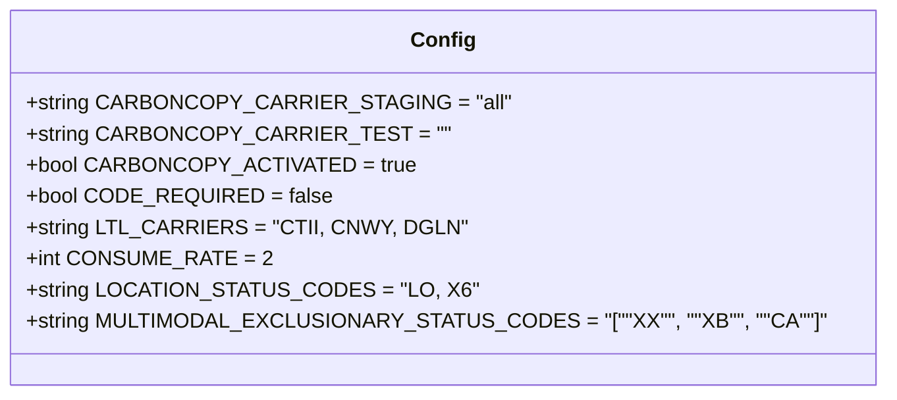

# Diagram: shipment_core/shipment_filter/config/config.test.yml

> Auto-generated by Obscura crawlers

## Mermaid

### SVG

<svg id="container" width="620.3984375" xmlns="http://www.w3.org/2000/svg" class="classDiagram" height="304" viewBox="0 0 620.3984375 304" role="graphics-document document" aria-roledescription="class"><g><defs><marker id="container_class-aggregationStart" class="marker aggregation class" refX="18" refY="7" markerWidth="190" markerHeight="240" orient="auto"><path d="M 18,7 L9,13 L1,7 L9,1 Z"></path></marker></defs><defs><marker id="container_class-aggregationEnd" class="marker aggregation class" refX="1" refY="7" markerWidth="20" markerHeight="28" orient="auto"><path d="M 18,7 L9,13 L1,7 L9,1 Z"></path></marker></defs><defs><marker id="container_class-extensionStart" class="marker extension class" refX="18" refY="7" markerWidth="190" markerHeight="240" orient="auto"><path d="M 1,7 L18,13 V 1 Z"></path></marker></defs><defs><marker id="container_class-extensionEnd" class="marker extension class" refX="1" refY="7" markerWidth="20" markerHeight="28" orient="auto"><path d="M 1,1 V 13 L18,7 Z"></path></marker></defs><defs><marker id="container_class-compositionStart" class="marker composition class" refX="18" refY="7" markerWidth="190" markerHeight="240" orient="auto"><path d="M 18,7 L9,13 L1,7 L9,1 Z"></path></marker></defs><defs><marker id="container_class-compositionEnd" class="marker composition class" refX="1" refY="7" markerWidth="20" markerHeight="28" orient="auto"><path d="M 18,7 L9,13 L1,7 L9,1 Z"></path></marker></defs><defs><marker id="container_class-dependencyStart" class="marker dependency class" refX="6" refY="7" markerWidth="190" markerHeight="240" orient="auto"><path d="M 5,7 L9,13 L1,7 L9,1 Z"></path></marker></defs><defs><marker id="container_class-dependencyEnd" class="marker dependency class" refX="13" refY="7" markerWidth="20" markerHeight="28" orient="auto"><path d="M 18,7 L9,13 L14,7 L9,1 Z"></path></marker></defs><defs><marker id="container_class-lollipopStart" class="marker lollipop class" refX="13" refY="7" markerWidth="190" markerHeight="240" orient="auto"><circle stroke="black" fill="transparent" cx="7" cy="7" r="6"></circle></marker></defs><defs><marker id="container_class-lollipopEnd" class="marker lollipop class" refX="1" refY="7" markerWidth="190" markerHeight="240" orient="auto"><circle stroke="black" fill="transparent" cx="7" cy="7" r="6"></circle></marker></defs><g class="root"><g class="clusters"></g><g class="edgePaths"></g><g class="edgeLabels"></g><g class="nodes"><g class="node default" id="classId-Config-0" transform="translate(310.19921875, 152)"><g class="basic label-container"><path d="M-302.19921875 -144 L302.19921875 -144 L302.19921875 144 L-302.19921875 144" stroke="none" stroke-width="0" fill="#ECECFF" style=""></path><path d="M-302.19921875 -144 C-178.3610672247087 -144, -54.52291569941741 -144, 302.19921875 -144 M-302.19921875 -144 C-158.38576654214432 -144, -14.572314334288649 -144, 302.19921875 -144 M302.19921875 -144 C302.19921875 -64.43385919870424, 302.19921875 15.132281602591519, 302.19921875 144 M302.19921875 -144 C302.19921875 -61.56886113916748, 302.19921875 20.862277721665038, 302.19921875 144 M302.19921875 144 C128.42296085470517 144, -45.353297040589666 144, -302.19921875 144 M302.19921875 144 C128.1992460559501 144, -45.800726638099775 144, -302.19921875 144 M-302.19921875 144 C-302.19921875 71.47144798915933, -302.19921875 -1.05710402168134, -302.19921875 -144 M-302.19921875 144 C-302.19921875 63.01398021860375, -302.19921875 -17.972039562792503, -302.19921875 -144" stroke="#9370DB" stroke-width="1.3" fill="none" stroke-dasharray="0 0" style=""></path></g><g class="annotation-group text" transform="translate(0, -120)"></g><g class="label-group text" transform="translate(-22.9296875, -120)"><g class="label" style="font-weight: bolder" transform="translate(0,-12)"><foreignObject width="45.859375" height="24">

Config

</foreignObject></g></g><g class="members-group text" transform="translate(-290.19921875, -72)"><g class="label" style="" transform="translate(0,-12)"><foreignObject width="332.84375" height="24">

+string CARBONCOPY_CARRIER_STAGING = "all"

</foreignObject></g><g class="label" style="" transform="translate(0,12)"><foreignObject width="287.546875" height="24">

+string CARBONCOPY_CARRIER_TEST = ""

</foreignObject></g><g class="label" style="" transform="translate(0,36)"><foreignObject width="270.34375" height="24">

+bool CARBONCOPY_ACTIVATED = true

</foreignObject></g><g class="label" style="" transform="translate(0,60)"><foreignObject width="215.875" height="24">

+bool CODE_REQUIRED = false

</foreignObject></g><g class="label" style="" transform="translate(0,84)"><foreignObject width="305.171875" height="24">

+string LTL_CARRIERS = "CTII, CNWY, DGLN"

</foreignObject></g><g class="label" style="" transform="translate(0,108)"><foreignObject width="170.453125" height="24">

+int CONSUME_RATE = 2

</foreignObject></g><g class="label" style="" transform="translate(0,132)"><foreignObject width="310.375" height="24">

+string LOCATION_STATUS_CODES = "LO, X6"

</foreignObject></g><g class="label" style="" transform="translate(0,156)"><foreignObject width="557.46875" height="24">

+string MULTIMODAL_EXCLUSIONARY_STATUS_CODES = "[""XX"", ""XB"", ""CA""]"

</foreignObject></g></g><g class="methods-group text" transform="translate(-290.19921875, 144)"></g><g class="divider" style=""><path d="M-302.19921875 -96 C-160.41822340314712 -96, -18.637228056294248 -96, 302.19921875 -96 M-302.19921875 -96 C-121.1140369042945 -96, 59.97114494141101 -96, 302.19921875 -96" stroke="#9370DB" stroke-width="1.3" fill="none" stroke-dasharray="0 0" style=""></path></g><g class="divider" style=""><path d="M-302.19921875 120 C-71.89016051808284 120, 158.41889771383433 120, 302.19921875 120 M-302.19921875 120 C-134.51681719726807 120, 33.165584355463864 120, 302.19921875 120" stroke="#9370DB" stroke-width="1.3" fill="none" stroke-dasharray="0 0" style=""></path></g></g></g></g></g></svg>
