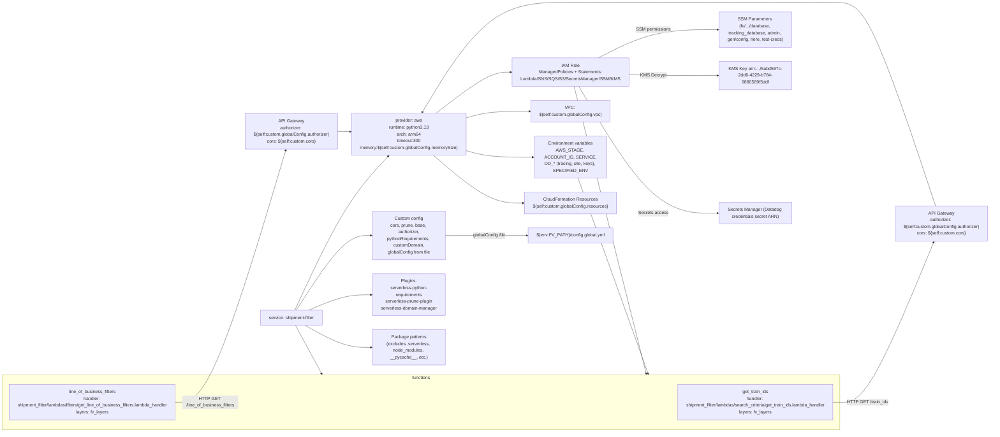

# Diagram: shipment_core/shipment_filter/serverless.shipment_filter.yml

> Auto-generated by Obscura crawlers

## Mermaid

### SVG

<svg id="container" width="4113.390625" xmlns="http://www.w3.org/2000/svg" class="flowchart" height="1526" viewBox="0 -35 4113.390625 1526" role="graphics-document document" aria-roledescription="flowchart-v2"><g><marker id="container_flowchart-v2-pointEnd" class="marker flowchart-v2" viewBox="0 0 10 10" refX="5" refY="5" markerUnits="userSpaceOnUse" markerWidth="8" markerHeight="8" orient="auto"><path d="M 0 0 L 10 5 L 0 10 z" class="arrowMarkerPath" style="stroke-width: 1; stroke-dasharray: 1, 0;"></path></marker><marker id="container_flowchart-v2-pointStart" class="marker flowchart-v2" viewBox="0 0 10 10" refX="4.5" refY="5" markerUnits="userSpaceOnUse" markerWidth="8" markerHeight="8" orient="auto"><path d="M 0 5 L 10 10 L 10 0 z" class="arrowMarkerPath" style="stroke-width: 1; stroke-dasharray: 1, 0;"></path></marker><marker id="container_flowchart-v2-circleEnd" class="marker flowchart-v2" viewBox="0 0 10 10" refX="11" refY="5" markerUnits="userSpaceOnUse" markerWidth="11" markerHeight="11" orient="auto"><circle cx="5" cy="5" r="5" class="arrowMarkerPath" style="stroke-width: 1; stroke-dasharray: 1, 0;"></circle></marker><marker id="container_flowchart-v2-circleStart" class="marker flowchart-v2" viewBox="0 0 10 10" refX="-1" refY="5" markerUnits="userSpaceOnUse" markerWidth="11" markerHeight="11" orient="auto"><circle cx="5" cy="5" r="5" class="arrowMarkerPath" style="stroke-width: 1; stroke-dasharray: 1, 0;"></circle></marker><marker id="container_flowchart-v2-crossEnd" class="marker cross flowchart-v2" viewBox="0 0 11 11" refX="12" refY="5.2" markerUnits="userSpaceOnUse" markerWidth="11" markerHeight="11" orient="auto"><path d="M 1,1 l 9,9 M 10,1 l -9,9" class="arrowMarkerPath" style="stroke-width: 2; stroke-dasharray: 1, 0;"></path></marker><marker id="container_flowchart-v2-crossStart" class="marker cross flowchart-v2" viewBox="0 0 11 11" refX="-1" refY="5.2" markerUnits="userSpaceOnUse" markerWidth="11" markerHeight="11" orient="auto"><path d="M 1,1 l 9,9 M 10,1 l -9,9" class="arrowMarkerPath" style="stroke-width: 2; stroke-dasharray: 1, 0;"></path></marker><g class="root"><g class="clusters"><g class="cluster" id="Functions" data-look="classic"><rect style="" x="8" y="1311" width="3513.65625" height="172"></rect><g class="cluster-label" transform="translate(1730.734375, 1311)"><foreignObject width="68.1875" height="24">

functions

</foreignObject></g></g></g><g class="edgePaths"><path d="M1184.452,1062L1218.377,1006.167C1252.301,950.333,1320.151,838.667,1398.344,744.768C1476.537,650.869,1565.074,574.739,1609.343,536.673L1653.612,498.608" id="L_Service_Provider_0" class="edge-thickness-normal edge-pattern-solid edge-thickness-normal edge-pattern-solid flowchart-link" style=";" data-edge="true" data-et="edge" data-id="L_Service_Provider_0" data-points="W3sieCI6MTE4NC40NTIyMTg1NzczNDgsInkiOjEwNjJ9LHsieCI6MTM4OCwieSI6NzI3fSx7IngiOjE2NTYuNjQ0NDQ0NDQ0NDQ0NCwieSI6NDk2fV0=" marker-end="url(#container_flowchart-v2-pointEnd)"></path><path d="M1893.023,496L1923.228,502.167C1953.432,508.333,2013.841,520.667,2078.755,526.833C2143.669,533,2213.089,533,2247.798,533L2282.508,533" id="L_Provider_Env_0" class="edge-thickness-normal edge-pattern-solid edge-thickness-normal edge-pattern-solid flowchart-link" style=";" data-edge="true" data-et="edge" data-id="L_Provider_Env_0" data-points="W3sieCI6MTg5My4wMjMwMjYzMTU3ODk2LCJ5Ijo0OTZ9LHsieCI6MjA3NC4yNSwieSI6NTMzfSx7IngiOjIyODYuNTA3ODEyNSwieSI6NTMzfV0=" marker-end="url(#container_flowchart-v2-pointEnd)"></path><path d="M1866.974,418L1901.52,409.833C1936.066,401.667,2005.158,385.333,2072.457,377.167C2139.755,369,2205.26,369,2238.013,369L2270.766,369" id="L_Provider_VPC_0" class="edge-thickness-normal edge-pattern-solid edge-thickness-normal edge-pattern-solid flowchart-link" style=";" data-edge="true" data-et="edge" data-id="L_Provider_VPC_0" data-points="W3sieCI6MTg2Ni45NzQ0MzE4MTgxODE4LCJ5Ijo0MTh9LHsieCI6MjA3NC4yNSwieSI6MzY5fSx7IngiOjIyNzQuNzY1NjI1LCJ5IjozNjl9XQ==" marker-end="url(#container_flowchart-v2-pointEnd)"></path><path d="M1769.212,418L1820.052,388.5C1870.891,359,1972.571,300,2036.619,270.5C2100.667,241,2127.083,241,2140.292,241L2153.5,241" id="L_Provider_IAM_0" class="edge-thickness-normal edge-pattern-solid edge-thickness-normal edge-pattern-solid flowchart-link" style=";" data-edge="true" data-et="edge" data-id="L_Provider_IAM_0" data-points="W3sieCI6MTc2OS4yMTE4MDU1NTU1NTU3LCJ5Ijo0MTh9LHsieCI6MjA3NC4yNSwieSI6MjQxfSx7IngiOjIxNTcuNSwieSI6MjQxfV0=" marker-end="url(#container_flowchart-v2-pointEnd)"></path><path d="M1762.491,496L1814.451,529.5C1866.41,563,1970.33,630,2043.716,663.5C2117.102,697,2159.953,697,2181.379,697L2202.805,697" id="L_Provider_Resources_0" class="edge-thickness-normal edge-pattern-solid edge-thickness-normal edge-pattern-solid flowchart-link" style=";" data-edge="true" data-et="edge" data-id="L_Provider_Resources_0" data-points="W3sieCI6MTc2Mi40OTA2MjUsInkiOjQ5Nn0seyJ4IjoyMDc0LjI1LCJ5Ijo2OTd9LHsieCI6MjIwNi44MDQ2ODc1LCJ5Ijo2OTd9XQ==" marker-end="url(#container_flowchart-v2-pointEnd)"></path><path d="M1235.532,1062L1260.944,1051.833C1286.355,1041.667,1337.177,1021.333,1392.589,1011.167C1448,1001,1508,1001,1538,1001L1568,1001" id="L_Service_Plugins_0" class="edge-thickness-normal edge-pattern-solid edge-thickness-normal edge-pattern-solid flowchart-link" style=";" data-edge="true" data-et="edge" data-id="L_Service_Plugins_0" data-points="W3sieCI6MTIzNS41MzI0OTI4OTc3MjczLCJ5IjoxMDYyfSx7IngiOjEzODgsInkiOjEwMDF9LHsieCI6MTU3MiwieSI6MTAwMX1d" marker-end="url(#container_flowchart-v2-pointEnd)"></path><path d="M1221.071,1116L1248.893,1130.167C1276.714,1144.333,1332.357,1172.667,1390.179,1186.833C1448,1201,1508,1201,1538,1201L1568,1201" id="L_Service_Package_0" class="edge-thickness-normal edge-pattern-solid edge-thickness-normal edge-pattern-solid flowchart-link" style=";" data-edge="true" data-et="edge" data-id="L_Service_Package_0" data-points="W3sieCI6MTIyMS4wNzEyODkwNjI1LCJ5IjoxMTE2fSx7IngiOjEzODgsInkiOjEyMDF9LHsieCI6MTU3MiwieSI6MTIwMX1d" marker-end="url(#container_flowchart-v2-pointEnd)"></path><path d="M1189.564,1062L1222.637,1020.5C1255.709,979,1321.855,896,1380.487,854.5C1439.12,813,1490.24,813,1515.799,813L1541.359,813" id="L_Service_Custom_0" class="edge-thickness-normal edge-pattern-solid edge-thickness-normal edge-pattern-solid flowchart-link" style=";" data-edge="true" data-et="edge" data-id="L_Service_Custom_0" data-points="W3sieCI6MTE4OS41NjQwMjg1MzI2MDg3LCJ5IjoxMDYyfSx7IngiOjEzODgsInkiOjgxM30seyJ4IjoxNTQ1LjM1OTM3NSwieSI6ODEzfV0=" marker-end="url(#container_flowchart-v2-pointEnd)"></path><path d="M3496.656,1397L3500.823,1397C3504.99,1397,3513.323,1397,3533.642,1397C3553.961,1397,3586.266,1397,3646.864,1300.605C3707.463,1204.211,3796.355,1011.422,3840.801,915.027L3885.247,818.632" id="L_GT_API1_0" class="edge-thickness-normal edge-pattern-solid edge-thickness-normal edge-pattern-solid flowchart-link" style=";" data-edge="true" data-et="edge" data-id="L_GT_API1_0" data-points="W3sieCI6MzQ5Ni42NTYyNSwieSI6MTM5N30seyJ4IjozNTIxLjY1NjI1LCJ5IjoxMzk3fSx7IngiOjM2MTguNTcwMzEyNSwieSI6MTM5N30seyJ4IjozODg2LjkyMjEzNDE4MjQ2NDYsInkiOjgxNX1d" marker-end="url(#container_flowchart-v2-pointEnd)"></path><path d="M723.094,1397L743.927,1397C764.76,1397,806.427,1397,877.51,1247.798C948.594,1098.597,1049.094,800.194,1099.344,650.992L1149.594,501.791" id="L_LOB_API2_0" class="edge-thickness-normal edge-pattern-solid edge-thickness-normal edge-pattern-solid flowchart-link" style=";" data-edge="true" data-et="edge" data-id="L_LOB_API2_0" data-points="W3sieCI6NzIzLjA5Mzc1LCJ5IjoxMzk3fSx7IngiOjg0OC4wOTM3NSwieSI6MTM5N30seyJ4IjoxMTUwLjg3MDQ0NDA3ODk0NzUsInkiOjQ5OH1d" marker-end="url(#container_flowchart-v2-pointEnd)"></path><path d="M3891.619,713L3846.111,589.667C3800.603,466.333,3709.587,219.667,3647.926,96.333C3586.266,-27,3553.961,-27,3479.538,-27C3405.115,-27,3288.573,-27,3161.874,-27C3035.174,-27,2898.318,-27,2772.397,-27C2646.477,-27,2531.492,-27,2416.957,-27C2302.422,-27,2188.336,-27,2074.657,46.638C1960.978,120.276,1847.706,267.553,1791.07,341.191L1734.434,414.829" id="L_API1_Provider_0" class="edge-thickness-normal edge-pattern-solid edge-thickness-normal edge-pattern-solid flowchart-link" style=";" data-edge="true" data-et="edge" data-id="L_API1_Provider_0" data-points="W3sieCI6Mzg5MS42MTkyNjE2MTUwNDQzLCJ5Ijo3MTN9LHsieCI6MzYxOC41NzAzMTI1LCJ5IjotMjd9LHsieCI6MzUyMS42NTYyNSwieSI6LTI3fSx7IngiOjMxNzIuMDMxMjUsInkiOi0yN30seyJ4IjoyNzYxLjQ2MDkzNzUsInkiOi0yN30seyJ4IjoyNDE2LjUwNzgxMjUsInkiOi0yN30seyJ4IjoyMDc0LjI1LCJ5IjotMjd9LHsieCI6MTczMS45OTUzNTEyMzk2Njk0LCJ5Ijo0MTh9XQ==" marker-end="url(#container_flowchart-v2-pointEnd)"></path><path d="M1363,447L1367.167,447C1371.333,447,1379.667,447,1387.334,447.111C1395.001,447.223,1402.001,447.446,1405.502,447.557L1409.002,447.669" id="L_API2_Provider_0" class="edge-thickness-normal edge-pattern-solid edge-thickness-normal edge-pattern-solid flowchart-link" style=";" data-edge="true" data-et="edge" data-id="L_API2_Provider_0" data-points="W3sieCI6MTM2MywieSI6NDQ3fSx7IngiOjEzODgsInkiOjQ0N30seyJ4IjoxNDEzLCJ5Ijo0NDcuNzk2MTc4MzQzOTQ5MDd9XQ==" marker-end="url(#container_flowchart-v2-pointEnd)"></path><path d="M2501.654,202L2544.956,182.167C2588.257,162.333,2674.859,122.667,2764.255,102.833C2853.651,83,2945.841,83,2991.936,83L3038.031,83" id="L_IAM_SSM_0" class="edge-thickness-normal edge-pattern-solid edge-thickness-normal edge-pattern-solid flowchart-link" style=";" data-edge="true" data-et="edge" data-id="L_IAM_SSM_0" data-points="W3sieCI6MjUwMS42NTQ0Njk5MzY3MDg3LCJ5IjoyMDJ9LHsieCI6Mjc2MS40NjA5Mzc1LCJ5Ijo4M30seyJ4IjozMDQyLjAzMTI1LCJ5Ijo4M31d" marker-end="url(#container_flowchart-v2-pointEnd)"></path><path d="M2675.516,254.515L2689.84,255.263C2704.164,256.01,2732.813,257.505,2793.232,258.253C2853.651,259,2945.841,259,2991.936,259L3038.031,259" id="L_IAM_KMS_0" class="edge-thickness-normal edge-pattern-solid edge-thickness-normal edge-pattern-solid flowchart-link" style=";" data-edge="true" data-et="edge" data-id="L_IAM_KMS_0" data-points="W3sieCI6MjY3NS41MTU2MjUsInkiOjI1NC41MTUyODc0MDMxNzk3N30seyJ4IjoyNzYxLjQ2MDkzNzUsInkiOjI1OX0seyJ4IjozMDQyLjAzMTI1LCJ5IjoyNTl9XQ==" marker-end="url(#container_flowchart-v2-pointEnd)"></path><path d="M2443.522,280L2496.512,356.5C2549.502,433,2655.481,586,2754.566,662.5C2853.651,739,2945.841,739,2991.936,739L3038.031,739" id="L_IAM_Secrets_0" class="edge-thickness-normal edge-pattern-solid edge-thickness-normal edge-pattern-solid flowchart-link" style=";" data-edge="true" data-et="edge" data-id="L_IAM_Secrets_0" data-points="W3sieCI6MjQ0My41MjIyMTM4NTU0MjIsInkiOjI4MH0seyJ4IjoyNzYxLjQ2MDkzNzUsInkiOjczOX0seyJ4IjozMDQyLjAzMTI1LCJ5Ijo3Mzl9XQ==" marker-end="url(#container_flowchart-v2-pointEnd)"></path><path d="M1858.641,813L1894.576,813C1930.51,813,2002.38,813,2069.871,813C2137.362,813,2200.474,813,2232.03,813L2263.586,813" id="L_Custom_GlobalConfigFile_0" class="edge-thickness-normal edge-pattern-solid edge-thickness-normal edge-pattern-solid flowchart-link" style=";" data-edge="true" data-et="edge" data-id="L_Custom_GlobalConfigFile_0" data-points="W3sieCI6MTg1OC42NDA2MjUsInkiOjgxM30seyJ4IjoyMDc0LjI1LCJ5Ijo4MTN9LHsieCI6MjI2Ny41ODU5Mzc1LCJ5Ijo4MTN9XQ==" marker-end="url(#container_flowchart-v2-pointEnd)"></path><path d="M1184.966,1116L1305.039,1307.611" id="L_Service_Functions_0" class="edge-thickness-normal edge-pattern-solid edge-thickness-normal edge-pattern-solid flowchart-link" style=";" data-edge="true" data-et="edge" data-id="L_Service_Functions_0" data-points="W3sieCI6MTE4NC45NjYzNDYxNTM4NDYyLCJ5IjoxMTE2fSx7IngiOjEzODgsInkiOjE0NDB9LHsieCI6MTcwMiwieSI6MTQ0MH0seyJ4IjoyMDc0LjI1LCJ5IjoxNDQwfSx7IngiOjI0MTYuNTA3ODEyNSwieSI6MTQ0MH0seyJ4IjoyNzYxLjQ2MDkzNzUsInkiOjE0NDB9LHsieCI6Mjg0Ny40MDYyNSwieSI6MTQzMC45OTg3NDQxMjQ5Nzg3fV0=" marker-end="url(#container_flowchart-v2-pointEnd)"></path><path d="M2428.146,280L2734.655,1307.167" id="L_IAM_Functions_0" class="edge-thickness-normal edge-pattern-solid edge-thickness-normal edge-pattern-solid flowchart-link" style=";" data-edge="true" data-et="edge" data-id="L_IAM_Functions_0" data-points="W3sieCI6MjQyOC4xNDU1MDQ0MzMzOTEsInkiOjI4MH0seyJ4IjoyNzYxLjQ2MDkzNzUsInkiOjEzOTd9LHsieCI6Mjg0Ny40MDYyNSwieSI6MTM5N31d" marker-end="url(#container_flowchart-v2-pointEnd)"></path><path d="M2448.02,608L2741.845,1307.312" id="L_Env_Functions_0" class="edge-thickness-normal edge-pattern-solid edge-thickness-normal edge-pattern-solid flowchart-link" style=";" data-edge="true" data-et="edge" data-id="L_Env_Functions_0" data-points="W3sieCI6MjQ0OC4wMTk5NzM3MzYyOTczLCJ5Ijo2MDh9LHsieCI6Mjc2MS40NjA5Mzc1LCJ5IjoxMzU0fSx7IngiOjI4NDcuNDA2MjUsInkiOjEzNjMuMDAxMjU1ODc1MDIxM31d" marker-end="url(#container_flowchart-v2-pointEnd)"></path></g><g class="edgeLabels"><g class="edgeLabel"><g class="label" data-id="L_Service_Provider_0" transform="translate(0, 0)"><foreignObject width="0" height="0">

</foreignObject></g></g><g class="edgeLabel"><g class="label" data-id="L_Provider_Env_0" transform="translate(0, 0)"><foreignObject width="0" height="0">

</foreignObject></g></g><g class="edgeLabel"><g class="label" data-id="L_Provider_VPC_0" transform="translate(0, 0)"><foreignObject width="0" height="0">

</foreignObject></g></g><g class="edgeLabel"><g class="label" data-id="L_Provider_IAM_0" transform="translate(0, 0)"><foreignObject width="0" height="0">

</foreignObject></g></g><g class="edgeLabel"><g class="label" data-id="L_Provider_Resources_0" transform="translate(0, 0)"><foreignObject width="0" height="0">

</foreignObject></g></g><g class="edgeLabel"><g class="label" data-id="L_Service_Plugins_0" transform="translate(0, 0)"><foreignObject width="0" height="0">

</foreignObject></g></g><g class="edgeLabel"><g class="label" data-id="L_Service_Package_0" transform="translate(0, 0)"><foreignObject width="0" height="0">

</foreignObject></g></g><g class="edgeLabel"><g class="label" data-id="L_Service_Custom_0" transform="translate(0, 0)"><foreignObject width="0" height="0">

</foreignObject></g></g><g class="edgeLabel" transform="translate(3618.5703125, 1397)"><g class="label" data-id="L_GT_API1_0" transform="translate(-71.9140625, -12)"><foreignObject width="143.828125" height="24">

HTTP GET /train_ids

</foreignObject></g></g><g class="edgeLabel" transform="translate(848.09375, 1397)"><g class="label" data-id="L_LOB_API2_0" transform="translate(-100, -24)"><foreignObject width="200" height="48">

HTTP GET /line_of_business_filters

</foreignObject></g></g><g class="edgeLabel"><g class="label" data-id="L_API1_Provider_0" transform="translate(0, 0)"><foreignObject width="0" height="0">

</foreignObject></g></g><g class="edgeLabel"><g class="label" data-id="L_API2_Provider_0" transform="translate(0, 0)"><foreignObject width="0" height="0">

</foreignObject></g></g><g class="edgeLabel" transform="translate(2761.4609375, 83)"><g class="label" data-id="L_IAM_SSM_0" transform="translate(-60.9453125, -12)"><foreignObject width="121.890625" height="24">

SSM permissions

</foreignObject></g></g><g class="edgeLabel" transform="translate(2761.4609375, 259)"><g class="label" data-id="L_IAM_KMS_0" transform="translate(-45.296875, -12)"><foreignObject width="90.59375" height="24">

KMS Decrypt

</foreignObject></g></g><g class="edgeLabel" transform="translate(2761.4609375, 739)"><g class="label" data-id="L_IAM_Secrets_0" transform="translate(-51.9296875, -12)"><foreignObject width="103.859375" height="24">

Secrets access

</foreignObject></g></g><g class="edgeLabel" transform="translate(2074.25, 813)"><g class="label" data-id="L_Custom_GlobalConfigFile_0" transform="translate(-58.25, -12)"><foreignObject width="116.5" height="24">

globalConfig file

</foreignObject></g></g><g class="edgeLabel"><g class="label" data-id="L_Service_Functions_0" transform="translate(0, 0)"><foreignObject width="0" height="0">

</foreignObject></g></g><g class="edgeLabel"><g class="label" data-id="L_IAM_Functions_0" transform="translate(0, 0)"><foreignObject width="0" height="0">

</foreignObject></g></g><g class="edgeLabel"><g class="label" data-id="L_Env_Functions_0" transform="translate(0, 0)"><foreignObject width="0" height="0">

</foreignObject></g></g></g><g class="nodes"><g class="node default" id="flowchart-Service-0" transform="translate(1168.046875, 1089)"><rect class="basic label-container" style="" x="-113.609375" y="-27" width="227.21875" height="54"></rect><g class="label" style="" transform="translate(-83.609375, -12)"><rect></rect><foreignObject width="167.21875" height="24">

service: shipment-filter

</foreignObject></g></g><g class="node default" id="flowchart-Provider-1" transform="translate(1702, 457)"><rect class="basic label-container" style="" x="-289" y="-39" width="578" height="78"></rect><g class="label" style="" transform="translate(-259, -24)"><rect></rect><foreignObject width="518" height="48">

provider: aws\nruntime: python3.13\narch: arm64\ntimeout:300\nmemory:${self:custom.globalConfig.memorySize}

</foreignObject></g></g><g class="node default" id="flowchart-Env-2" transform="translate(2416.5078125, 533)"><rect class="basic label-container" style="" x="-130" y="-75" width="260" height="150"></rect><g class="label" style="" transform="translate(-100, -60)"><rect></rect><foreignObject width="200" height="120">

Environment variables\nAWS_STAGE, ACCOUNT_ID, SERVICE,\nDD_* (tracing, site, keys), SPECIFIED_ENV

</foreignObject></g></g><g class="node default" id="flowchart-VPC-3" transform="translate(2416.5078125, 369)"><rect class="basic label-container" style="" x="-141.7421875" y="-39" width="283.484375" height="78"></rect><g class="label" style="" transform="translate(-111.7421875, -24)"><rect></rect><foreignObject width="223.484375" height="48">

VPC: ${self:custom.globalConfig.vpc}

</foreignObject></g></g><g class="node default" id="flowchart-IAM-4" transform="translate(2416.5078125, 241)"><rect class="basic label-container" style="" x="-259.0078125" y="-39" width="518.015625" height="78"></rect><g class="label" style="" transform="translate(-229.0078125, -24)"><rect></rect><foreignObject width="458.015625" height="48">

IAM Role\nManagedPolicies + Statements:\nLambda/SNS/SQS/S3/SecretsManager/SSM/KMS

</foreignObject></g></g><g class="node default" id="flowchart-Plugins-5" transform="translate(1702, 1001)"><rect class="basic label-container" style="" x="-130" y="-75" width="260" height="150"></rect><g class="label" style="" transform="translate(-100, -60)"><rect></rect><foreignObject width="200" height="120">

Plugins:\nserverless-python-requirements\nserverless-prune-plugin\nserverless-domain-manager

</foreignObject></g></g><g class="node default" id="flowchart-Package-6" transform="translate(1702, 1201)"><rect class="basic label-container" style="" x="-130" y="-75" width="260" height="150"></rect><g class="label" style="" transform="translate(-100, -60)"><rect></rect><foreignObject width="200" height="120">

Package patterns\n(excludes .serverless, node_modules, <strong>pycache</strong>, etc.)

</foreignObject></g></g><g class="node default" id="flowchart-Resources-7" transform="translate(2416.5078125, 697)"><rect class="basic label-container" style="" x="-209.703125" y="-39" width="419.40625" height="78"></rect><g class="label" style="" transform="translate(-179.703125, -24)"><rect></rect><foreignObject width="359.40625" height="48">

CloudFormation Resources\n${self:custom.globalConfig.resources}

</foreignObject></g></g><g class="node default" id="flowchart-Custom-8" transform="translate(1702, 813)"><rect class="basic label-container" style="" x="-156.640625" y="-63" width="313.28125" height="126"></rect><g class="label" style="" transform="translate(-126.640625, -48)"><rect></rect><foreignObject width="253.28125" height="96">

Custom config\ncors, prune, base, authorizer,\npythonRequirements, customDomain,\nglobalConfig from file

</foreignObject></g></g><g class="node default" id="flowchart-GT-25" transform="translate(3172.03125, 1397)"><rect class="basic label-container" style="" x="-324.625" y="-51" width="649.25" height="102"></rect><g class="label" style="" transform="translate(-294.625, -36)"><rect></rect><foreignObject width="589.25" height="72">

get_train_ids\nhandler: shipment_filter/lambdas/search_criteria/get_train_ids.lambda_handler\nlayers: fv_layers

</foreignObject></g></g><g class="node default" id="flowchart-LOB-26" transform="translate(378.046875, 1397)"><rect class="basic label-container" style="" x="-345.046875" y="-51" width="690.09375" height="102"></rect><g class="label" style="" transform="translate(-315.046875, -36)"><rect></rect><foreignObject width="630.09375" height="72">

line_of_business_filters\nhandler: shipment_filter/lambdas/filters/get_line_of_business_filters.lambda_handler\nlayers: fv_layers

</foreignObject></g></g><g class="node default" id="flowchart-API1-34" transform="translate(3910.4375, 764)"><rect class="basic label-container" style="" x="-194.953125" y="-51" width="389.90625" height="102"></rect><g class="label" style="" transform="translate(-164.953125, -36)"><rect></rect><foreignObject width="329.90625" height="72">

API Gateway\nauthorizer: ${self:custom.globalConfig.authorizer}\ncors: ${self:custom.cors}

</foreignObject></g></g><g class="node default" id="flowchart-API2-36" transform="translate(1168.046875, 447)"><rect class="basic label-container" style="" x="-194.953125" y="-51" width="389.90625" height="102"></rect><g class="label" style="" transform="translate(-164.953125, -36)"><rect></rect><foreignObject width="329.90625" height="72">

API Gateway\nauthorizer: ${self:custom.globalConfig.authorizer}\ncors: ${self:custom.cors}

</foreignObject></g></g><g class="node default" id="flowchart-SSM-42" transform="translate(3172.03125, 83)"><rect class="basic label-container" style="" x="-130" y="-75" width="260" height="150"></rect><g class="label" style="" transform="translate(-100, -60)"><rect></rect><foreignObject width="200" height="120">

SSM Parameters (fv/.../database, tracking_database, admin, gen/config, here, test-creds)

</foreignObject></g></g><g class="node default" id="flowchart-KMS-44" transform="translate(3172.03125, 259)"><rect class="basic label-container" style="" x="-130" y="-51" width="260" height="102"></rect><g class="label" style="" transform="translate(-100, -36)"><rect></rect><foreignObject width="200" height="72">

KMS Key arn:.../5abd597c-2dd6-4229-b784-9880589f5ddf

</foreignObject></g></g><g class="node default" id="flowchart-Secrets-46" transform="translate(3172.03125, 739)"><rect class="basic label-container" style="" x="-130" y="-39" width="260" height="78"></rect><g class="label" style="" transform="translate(-100, -24)"><rect></rect><foreignObject width="200" height="48">

Secrets Manager (Datadog credentials secret ARN)

</foreignObject></g></g><g class="node default" id="flowchart-GlobalConfigFile-48" transform="translate(2416.5078125, 813)"><rect class="basic label-container" style="" x="-148.921875" y="-27" width="297.84375" height="54"></rect><g class="label" style="" transform="translate(-118.921875, -12)"><rect></rect><foreignObject width="237.84375" height="24">

${env:FV_PATH}/config.global.yml

</foreignObject></g></g></g></g></g></svg>
