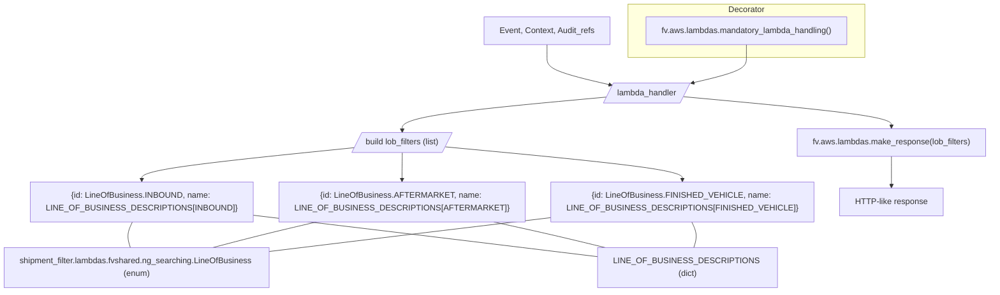
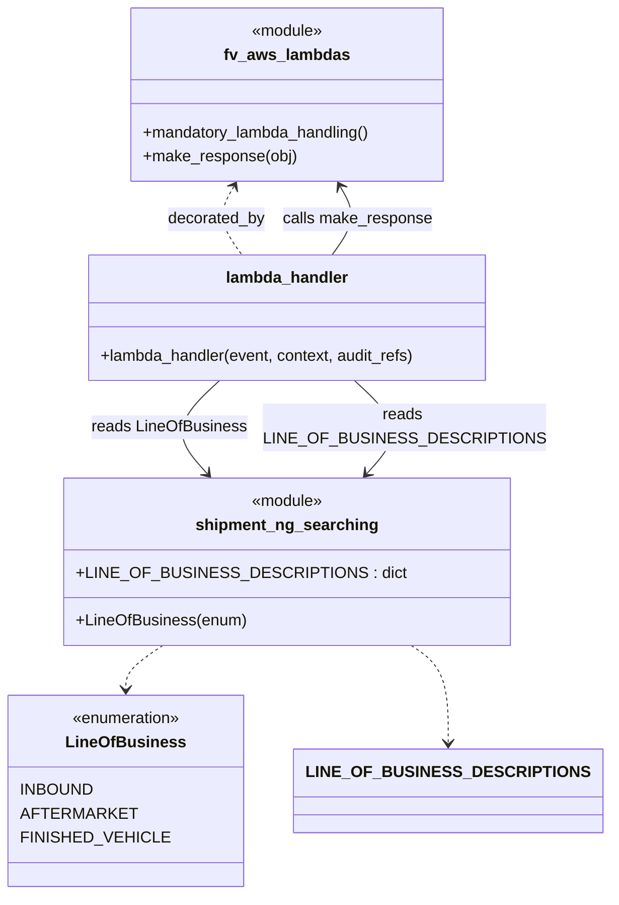

# Diagram: shipment_core/shipment_filter/shipment_filter/lambdas/filters/get_line_of_business_filters.py

> Auto-generated by Obscura crawlers

## Diagram 1

### SVG

<svg id="container" width="1794.71875" xmlns="http://www.w3.org/2000/svg" class="flowchart" height="569" viewBox="0 0 1794.71875 569" role="graphics-document document" aria-roledescription="flowchart-v2"><g><marker id="container_flowchart-v2-pointEnd" class="marker flowchart-v2" viewBox="0 0 10 10" refX="5" refY="5" markerUnits="userSpaceOnUse" markerWidth="8" markerHeight="8" orient="auto"><path d="M 0 0 L 10 5 L 0 10 z" class="arrowMarkerPath" style="stroke-width: 1; stroke-dasharray: 1, 0;"></path></marker><marker id="container_flowchart-v2-pointStart" class="marker flowchart-v2" viewBox="0 0 10 10" refX="4.5" refY="5" markerUnits="userSpaceOnUse" markerWidth="8" markerHeight="8" orient="auto"><path d="M 0 5 L 10 10 L 10 0 z" class="arrowMarkerPath" style="stroke-width: 1; stroke-dasharray: 1, 0;"></path></marker><marker id="container_flowchart-v2-circleEnd" class="marker flowchart-v2" viewBox="0 0 10 10" refX="11" refY="5" markerUnits="userSpaceOnUse" markerWidth="11" markerHeight="11" orient="auto"><circle cx="5" cy="5" r="5" class="arrowMarkerPath" style="stroke-width: 1; stroke-dasharray: 1, 0;"></circle></marker><marker id="container_flowchart-v2-circleStart" class="marker flowchart-v2" viewBox="0 0 10 10" refX="-1" refY="5" markerUnits="userSpaceOnUse" markerWidth="11" markerHeight="11" orient="auto"><circle cx="5" cy="5" r="5" class="arrowMarkerPath" style="stroke-width: 1; stroke-dasharray: 1, 0;"></circle></marker><marker id="container_flowchart-v2-crossEnd" class="marker cross flowchart-v2" viewBox="0 0 11 11" refX="12" refY="5.2" markerUnits="userSpaceOnUse" markerWidth="11" markerHeight="11" orient="auto"><path d="M 1,1 l 9,9 M 10,1 l -9,9" class="arrowMarkerPath" style="stroke-width: 2; stroke-dasharray: 1, 0;"></path></marker><marker id="container_flowchart-v2-crossStart" class="marker cross flowchart-v2" viewBox="0 0 11 11" refX="-1" refY="5.2" markerUnits="userSpaceOnUse" markerWidth="11" markerHeight="11" orient="auto"><path d="M 1,1 l 9,9 M 10,1 l -9,9" class="arrowMarkerPath" style="stroke-width: 2; stroke-dasharray: 1, 0;"></path></marker><g class="root"><g class="clusters"><g class="cluster" id="Decorator" data-look="classic"><rect style="" x="1130.26171875" y="8" width="467.875" height="104"></rect><g class="cluster-label" transform="translate(1328.66015625, 8)"><foreignObject width="71.078125" height="24">

Decorator

</foreignObject></g></g></g><g class="edgePaths"><path d="M972.738,87L972.738,91.167C972.738,95.333,972.738,103.667,972.738,112C972.738,120.333,972.738,128.667,993.259,137.561C1013.779,146.456,1054.82,155.911,1075.34,160.639L1095.86,165.367" id="L_Event_Handler_0" class="edge-thickness-normal edge-pattern-solid edge-thickness-normal edge-pattern-solid flowchart-link" style=";" data-edge="true" data-et="edge" data-id="L_Event_Handler_0" data-points="W3sieCI6OTcyLjczODI4MTI1LCJ5Ijo4N30seyJ4Ijo5NzIuNzM4MjgxMjUsInkiOjExMn0seyJ4Ijo5NzIuNzM4MjgxMjUsInkiOjEzN30seyJ4IjoxMDk5Ljc1ODI0ODYwNDQ2NTcsInkiOjE2Ni4yNjQ3NTI3OTEwNjg2fV0=" marker-end="url(#container_flowchart-v2-pointEnd)"></path><path d="M1087.716,190.349L1028.995,196.291C970.274,202.233,852.832,214.116,794.185,224.892C735.537,235.667,735.684,245.334,735.757,250.167L735.83,255" id="L_Handler_Build_0" class="edge-thickness-normal edge-pattern-solid edge-thickness-normal edge-pattern-solid flowchart-link" style=";" data-edge="true" data-et="edge" data-id="L_Handler_Build_0" data-points="W3sieCI6MTA4Ny43MTYxNTg0MTE5MzQ3LCJ5IjoxOTAuMzQ4OTMzMTc2MTMwNTJ9LHsieCI6NzM1LjM5MDYyNSwieSI6MjI2fSx7IngiOjczNS44OTA2MjUsInkiOjI1OX1d" marker-end="url(#container_flowchart-v2-pointEnd)"></path><path d="M637.284,289.714L577.428,296.428C517.572,303.143,397.86,316.571,338.004,326.786C278.148,337,278.148,344,278.148,347.5L278.148,351" id="L_Build_Item1_0" class="edge-thickness-normal edge-pattern-solid edge-thickness-normal edge-pattern-solid flowchart-link" style=";" data-edge="true" data-et="edge" data-id="L_Build_Item1_0" data-points="W3sieCI6NjM3LjI4MzU2NjkwMTEyMTQsInkiOjI4OS43MTQxMTYxOTc3NTcyfSx7IngiOjI3OC4xNDg0Mzc1LCJ5IjozMzB9LHsieCI6Mjc4LjE0ODQzNzUsInkiOjM1NX1d" marker-end="url(#container_flowchart-v2-pointEnd)"></path><path d="M735.891,298L735.807,303.333C735.724,308.667,735.557,319.333,735.474,328.167C735.391,337,735.391,344,735.391,347.5L735.391,351" id="L_Build_Item2_0" class="edge-thickness-normal edge-pattern-solid edge-thickness-normal edge-pattern-solid flowchart-link" style=";" data-edge="true" data-et="edge" data-id="L_Build_Item2_0" data-points="W3sieCI6NzM1Ljg5MDYyNSwieSI6Mjk4fSx7IngiOjczNS4zOTA2MjUsInkiOjMzMH0seyJ4Ijo3MzUuMzkwNjI1LCJ5IjozNTV9XQ==" marker-end="url(#container_flowchart-v2-pointEnd)"></path><path d="M824.197,287.887L890.923,294.906C957.65,301.925,1091.102,315.962,1157.828,326.481C1224.555,337,1224.555,344,1224.555,347.5L1224.555,351" id="L_Build_Item3_0" class="edge-thickness-normal edge-pattern-solid edge-thickness-normal edge-pattern-solid flowchart-link" style=";" data-edge="true" data-et="edge" data-id="L_Build_Item3_0" data-points="W3sieCI6ODI0LjE5Njk3NDYxNTU2NTQsInkiOjI4Ny44ODczMDA3Njg4NjkxfSx7IngiOjEyMjQuNTU0Njg3NSwieSI6MzMwfSx7IngiOjEyMjQuNTU0Njg3NSwieSI6MzU1fV0=" marker-end="url(#container_flowchart-v2-pointEnd)"></path><path d="M1242.28,189.533L1302.158,195.611C1362.036,201.689,1481.791,213.844,1541.669,223.422C1601.547,233,1601.547,240,1601.547,243.5L1601.547,247" id="L_Handler_CallMake_0" class="edge-thickness-normal edge-pattern-solid edge-thickness-normal edge-pattern-solid flowchart-link" style=";" data-edge="true" data-et="edge" data-id="L_Handler_CallMake_0" data-points="W3sieCI6MTI0Mi4yODAzODYyMDQxNDUzLCJ5IjoxODkuNTMyOTc3NTkxNzA5Mjh9LHsieCI6MTYwMS41NDY4NzUsInkiOjIyNn0seyJ4IjoxNjAxLjU0Njg3NSwieSI6MjUxfV0=" marker-end="url(#container_flowchart-v2-pointEnd)"></path><path d="M1601.547,305L1601.547,309.167C1601.547,313.333,1601.547,321.667,1601.547,331.333C1601.547,341,1601.547,352,1601.547,357.5L1601.547,363" id="L_CallMake_Response_0" class="edge-thickness-normal edge-pattern-solid edge-thickness-normal edge-pattern-solid flowchart-link" style=";" data-edge="true" data-et="edge" data-id="L_CallMake_Response_0" data-points="W3sieCI6MTYwMS41NDY4NzUsInkiOjMwNX0seyJ4IjoxNjAxLjU0Njg3NSwieSI6MzMwfSx7IngiOjE2MDEuNTQ2ODc1LCJ5IjozNjd9XQ==" marker-end="url(#container_flowchart-v2-pointEnd)"></path><path d="M1364.199,87L1364.199,91.167C1364.199,95.333,1364.199,103.667,1364.199,112C1364.199,120.333,1364.199,128.667,1346.605,136.932C1329.011,145.197,1293.822,153.395,1276.228,157.494L1258.634,161.592" id="L_Decor_Handler_0" class="edge-thickness-normal edge-pattern-solid edge-thickness-normal edge-pattern-solid flowchart-link" style=";" data-edge="true" data-et="edge" data-id="L_Decor_Handler_0" data-points="W3sieCI6MTM2NC4xOTkyMTg3NSwieSI6ODd9LHsieCI6MTM2NC4xOTkyMTg3NSwieSI6MTEyfSx7IngiOjEzNjQuMTk5MjE4NzUsInkiOjEzN30seyJ4IjoxMjU0LjczODI4MTI1LCJ5IjoxNjIuNX1d" marker-end="url(#container_flowchart-v2-pointEnd)"></path><path d="M259.867,433L257.914,437.167C255.961,441.333,252.055,449.667,251.404,458C250.753,466.333,253.357,474.667,254.659,478.833L255.961,483" id="L_Item1_LineOfBusiness_0" class="edge-thickness-normal edge-pattern-solid edge-thickness-normal edge-pattern-solid flowchart-link" style=";" data-edge="true" data-et="edge" data-id="L_Item1_LineOfBusiness_0" data-points="W3sieCI6MjU5Ljg2NzE4NzUsInkiOjQzM30seyJ4IjoyNDguMTQ4NDM3NSwieSI6NDU4fSx7IngiOjI1NS45NjA5Mzc1LCJ5Ijo0ODN9XQ=="></path><path d="M583.887,433L567.701,437.167C551.515,441.333,519.142,449.667,488.723,458C458.303,466.333,429.837,474.667,415.604,478.833L401.371,483" id="L_Item2_LineOfBusiness_0" class="edge-thickness-normal edge-pattern-solid edge-thickness-normal edge-pattern-solid flowchart-link" style=";" data-edge="true" data-et="edge" data-id="L_Item2_LineOfBusiness_0" data-points="W3sieCI6NTgzLjg4NzE0NTk5NjA5MzgsInkiOjQzM30seyJ4Ijo0ODYuNzY5NTMxMjUsInkiOjQ1OH0seyJ4Ijo0MDEuMzcwNjY2NTAzOTA2MjUsInkiOjQ4M31d"></path><path d="M997.289,424.101L954.633,429.751C911.977,435.401,826.664,446.7,748.499,457.153C670.333,467.605,599.315,477.21,563.806,482.013L528.297,486.815" id="L_Item3_LineOfBusiness_0" class="edge-thickness-normal edge-pattern-solid edge-thickness-normal edge-pattern-solid flowchart-link" style=";" data-edge="true" data-et="edge" data-id="L_Item3_LineOfBusiness_0" data-points="W3sieCI6OTk3LjI4OTA2MjUsInkiOjQyNC4xMDEyMTI2MTExNTYwM30seyJ4Ijo3NDEuMzUxNTYyNSwieSI6NDU4fSx7IngiOjUyOC4yOTY4NzUsInkiOjQ4Ni44MTUzMjExMTYwNjQwN31d"></path><path d="M473.492,419.873L521.469,426.228C569.445,432.582,665.398,445.291,766.309,458.805C867.219,472.318,973.086,486.637,1026.02,493.796L1078.953,500.955" id="L_Item1_LINE_DESC_0" class="edge-thickness-normal edge-pattern-solid edge-thickness-normal edge-pattern-solid flowchart-link" style=";" data-edge="true" data-et="edge" data-id="L_Item1_LINE_DESC_0" data-points="W3sieCI6NDczLjQ5MjE4NzUsInkiOjQxOS44NzMxNzcwNDEyMjg3Nn0seyJ4Ijo3NjEuMzUxNTYyNSwieSI6NDU4fSx7IngiOjEwNzguOTUzMTI1LCJ5Ijo1MDAuOTU1MTI2MzAwMTQ4Nn1d"></path><path d="M896.62,433L913.846,437.167C931.071,441.333,965.522,449.667,998.02,458C1030.517,466.333,1061.062,474.667,1076.334,478.833L1091.606,483" id="L_Item2_LINE_DESC_0" class="edge-thickness-normal edge-pattern-solid edge-thickness-normal edge-pattern-solid flowchart-link" style=";" data-edge="true" data-et="edge" data-id="L_Item2_LINE_DESC_0" data-points="W3sieCI6ODk2LjYyMDMwMDI5Mjk2ODgsInkiOjQzM30seyJ4Ijo5OTkuOTcyNjU2MjUsInkiOjQ1OH0seyJ4IjoxMDkxLjYwNjI2MjIwNzAzMTIsInkiOjQ4M31d"></path><path d="M1242.836,433L1244.789,437.167C1246.742,441.333,1250.648,449.667,1251.299,458C1251.951,466.333,1249.346,474.667,1248.044,478.833L1246.742,483" id="L_Item3_LINE_DESC_0" class="edge-thickness-normal edge-pattern-solid edge-thickness-normal edge-pattern-solid flowchart-link" style=";" data-edge="true" data-et="edge" data-id="L_Item3_LINE_DESC_0" data-points="W3sieCI6MTI0Mi44MzU5Mzc1LCJ5Ijo0MzN9LHsieCI6MTI1NC41NTQ2ODc1LCJ5Ijo0NTh9LHsieCI6MTI0Ni43NDIxODc1LCJ5Ijo0ODN9XQ=="></path></g><g class="edgeLabels"><g class="edgeLabel"><g class="label" data-id="L_Event_Handler_0" transform="translate(0, 0)"><foreignObject width="0" height="0">

</foreignObject></g></g><g class="edgeLabel"><g class="label" data-id="L_Handler_Build_0" transform="translate(0, 0)"><foreignObject width="0" height="0">

</foreignObject></g></g><g class="edgeLabel"><g class="label" data-id="L_Build_Item1_0" transform="translate(0, 0)"><foreignObject width="0" height="0">

</foreignObject></g></g><g class="edgeLabel"><g class="label" data-id="L_Build_Item2_0" transform="translate(0, 0)"><foreignObject width="0" height="0">

</foreignObject></g></g><g class="edgeLabel"><g class="label" data-id="L_Build_Item3_0" transform="translate(0, 0)"><foreignObject width="0" height="0">

</foreignObject></g></g><g class="edgeLabel"><g class="label" data-id="L_Handler_CallMake_0" transform="translate(0, 0)"><foreignObject width="0" height="0">

</foreignObject></g></g><g class="edgeLabel"><g class="label" data-id="L_CallMake_Response_0" transform="translate(0, 0)"><foreignObject width="0" height="0">

</foreignObject></g></g><g class="edgeLabel"><g class="label" data-id="L_Decor_Handler_0" transform="translate(0, 0)"><foreignObject width="0" height="0">

</foreignObject></g></g><g class="edgeLabel"><g class="label" data-id="L_Item1_LineOfBusiness_0" transform="translate(0, 0)"><foreignObject width="0" height="0">

</foreignObject></g></g><g class="edgeLabel"><g class="label" data-id="L_Item2_LineOfBusiness_0" transform="translate(0, 0)"><foreignObject width="0" height="0">

</foreignObject></g></g><g class="edgeLabel"><g class="label" data-id="L_Item3_LineOfBusiness_0" transform="translate(0, 0)"><foreignObject width="0" height="0">

</foreignObject></g></g><g class="edgeLabel"><g class="label" data-id="L_Item1_LINE_DESC_0" transform="translate(0, 0)"><foreignObject width="0" height="0">

</foreignObject></g></g><g class="edgeLabel"><g class="label" data-id="L_Item2_LINE_DESC_0" transform="translate(0, 0)"><foreignObject width="0" height="0">

</foreignObject></g></g><g class="edgeLabel"><g class="label" data-id="L_Item3_LINE_DESC_0" transform="translate(0, 0)"><foreignObject width="0" height="0">

</foreignObject></g></g></g><g class="nodes"><g class="node default" id="flowchart-Event-0" transform="translate(972.73828125, 60)"><rect class="basic label-container" style="" x="-122.5234375" y="-27" width="245.046875" height="54"></rect><g class="label" style="" transform="translate(-92.5234375, -12)"><rect></rect><foreignObject width="185.046875" height="24">

Event, Context, Audit_refs

</foreignObject></g></g><g class="node default" id="flowchart-Handler-1" transform="translate(1168.46875, 181.5)"><polygon points="-19.5,0 134.65625,0 154.15625,-39 0,-39" class="label-container" transform="translate(-67.328125,19.5)"></polygon><g class="label" style="" transform="translate(-59.828125, -12)"><rect></rect><foreignObject width="119.65625" height="24">

lambda_handler

</foreignObject></g></g><g class="node default" id="flowchart-Build-3" transform="translate(735.390625, 278)"><polygon points="-19.5,0 166.5,0 186,-39 0,-39" class="label-container" transform="translate(-83.25,19.5)"></polygon><g class="label" style="" transform="translate(-75.75, -12)"><rect></rect><foreignObject width="151.5" height="24">

build lob_filters (list)

</foreignObject></g></g><g class="node default" id="flowchart-Item1-5" transform="translate(278.1484375, 394)"><rect class="basic label-container" style="" x="-195.34375" y="-39" width="390.6875" height="78"></rect><g class="label" style="" transform="translate(-165.34375, -24)"><rect></rect><foreignObject width="330.6875" height="48">

{id: LineOfBusiness.INBOUND, name: LINE_OF_BUSINESS_DESCRIPTIONS[INBOUND]}

</foreignObject></g></g><g class="node default" id="flowchart-Item2-7" transform="translate(735.390625, 394)"><rect class="basic label-container" style="" x="-211.8984375" y="-39" width="423.796875" height="78"></rect><g class="label" style="" transform="translate(-181.8984375, -24)"><rect></rect><foreignObject width="363.796875" height="48">

{id: LineOfBusiness.AFTERMARKET, name: LINE_OF_BUSINESS_DESCRIPTIONS[AFTERMARKET]}

</foreignObject></g></g><g class="node default" id="flowchart-Item3-9" transform="translate(1224.5546875, 394)"><rect class="basic label-container" style="" x="-227.265625" y="-39" width="454.53125" height="78"></rect><g class="label" style="" transform="translate(-197.265625, -24)"><rect></rect><foreignObject width="394.53125" height="48">

{id: LineOfBusiness.FINISHED_VEHICLE, name: LINE_OF_BUSINESS_DESCRIPTIONS[FINISHED_VEHICLE]}

</foreignObject></g></g><g class="node default" id="flowchart-CallMake-11" transform="translate(1601.546875, 278)"><rect class="basic label-container" style="" x="-185.171875" y="-27" width="370.34375" height="54"></rect><g class="label" style="" transform="translate(-155.171875, -12)"><rect></rect><foreignObject width="310.34375" height="24">

fv.aws.lambdas.make_response(lob_filters)

</foreignObject></g></g><g class="node default" id="flowchart-Response-13" transform="translate(1601.546875, 394)"><rect class="basic label-container" style="" x="-99.7265625" y="-27" width="199.453125" height="54"></rect><g class="label" style="" transform="translate(-69.7265625, -12)"><rect></rect><foreignObject width="139.453125" height="24">

HTTP-like response

</foreignObject></g></g><g class="node default" id="flowchart-Decor-14" transform="translate(1364.19921875, 60)"><rect class="basic label-container" style="" x="-198.9375" y="-27" width="397.875" height="54"></rect><g class="label" style="" transform="translate(-168.9375, -12)"><rect></rect><foreignObject width="337.875" height="24">

fv.aws.lambdas.mandatory_lambda_handling()

</foreignObject></g></g><g class="node default" id="flowchart-LineOfBusiness-17" transform="translate(268.1484375, 522)"><rect class="basic label-container" style="" x="-260.1484375" y="-39" width="520.296875" height="78"></rect><g class="label" style="" transform="translate(-230.1484375, -24)"><rect></rect><foreignObject width="460.296875" height="48">

shipment_filter.lambdas.fvshared.ng_searching.LineOfBusiness (enum)

</foreignObject></g></g><g class="node default" id="flowchart-LINE_DESC-18" transform="translate(1234.5546875, 522)"><rect class="basic label-container" style="" x="-155.6015625" y="-39" width="311.203125" height="78"></rect><g class="label" style="" transform="translate(-125.6015625, -24)"><rect></rect><foreignObject width="251.203125" height="48">

LINE_OF_BUSINESS_DESCRIPTIONS (dict)

</foreignObject></g></g></g></g></g></svg>

## Diagram 2

### SVG

<svg id="container" width="551.203125" xmlns="http://www.w3.org/2000/svg" class="classDiagram" height="898" viewBox="0 0 551.203125 898" role="graphics-document document" aria-roledescription="class"><g><defs><marker id="container_class-aggregationStart" class="marker aggregation class" refX="18" refY="7" markerWidth="190" markerHeight="240" orient="auto"><path d="M 18,7 L9,13 L1,7 L9,1 Z"></path></marker></defs><defs><marker id="container_class-aggregationEnd" class="marker aggregation class" refX="1" refY="7" markerWidth="20" markerHeight="28" orient="auto"><path d="M 18,7 L9,13 L1,7 L9,1 Z"></path></marker></defs><defs><marker id="container_class-extensionStart" class="marker extension class" refX="18" refY="7" markerWidth="190" markerHeight="240" orient="auto"><path d="M 1,7 L18,13 V 1 Z"></path></marker></defs><defs><marker id="container_class-extensionEnd" class="marker extension class" refX="1" refY="7" markerWidth="20" markerHeight="28" orient="auto"><path d="M 1,1 V 13 L18,7 Z"></path></marker></defs><defs><marker id="container_class-compositionStart" class="marker composition class" refX="18" refY="7" markerWidth="190" markerHeight="240" orient="auto"><path d="M 18,7 L9,13 L1,7 L9,1 Z"></path></marker></defs><defs><marker id="container_class-compositionEnd" class="marker composition class" refX="1" refY="7" markerWidth="20" markerHeight="28" orient="auto"><path d="M 18,7 L9,13 L1,7 L9,1 Z"></path></marker></defs><defs><marker id="container_class-dependencyStart" class="marker dependency class" refX="6" refY="7" markerWidth="190" markerHeight="240" orient="auto"><path d="M 5,7 L9,13 L1,7 L9,1 Z"></path></marker></defs><defs><marker id="container_class-dependencyEnd" class="marker dependency class" refX="13" refY="7" markerWidth="20" markerHeight="28" orient="auto"><path d="M 18,7 L9,13 L14,7 L9,1 Z"></path></marker></defs><defs><marker id="container_class-lollipopStart" class="marker lollipop class" refX="13" refY="7" markerWidth="190" markerHeight="240" orient="auto"><circle stroke="black" fill="transparent" cx="7" cy="7" r="6"></circle></marker></defs><defs><marker id="container_class-lollipopEnd" class="marker lollipop class" refX="1" refY="7" markerWidth="190" markerHeight="240" orient="auto"><circle stroke="black" fill="transparent" cx="7" cy="7" r="6"></circle></marker></defs><g class="root"><g class="clusters"></g><g class="edgePaths"><path d="M206.64,187.183L203.546,192.485C200.453,197.788,194.265,208.394,195.633,219.864C197,231.333,205.922,243.667,210.383,249.833L214.844,256" id="id_fv_aws_lambdas_lambda_handler_1" class="edge-thickness-normal edge-pattern-dashed relation" style=";;;" data-edge="true" data-et="edge" data-id="id_fv_aws_lambdas_lambda_handler_1" data-points="W3sieCI6MjA5LjY2MzQwMDk1NzY2MTI4LCJ5IjoxODJ9LHsieCI6MTg4LjA3ODEyNSwieSI6MjE5fSx7IngiOjIxNC44NDM4NjcxODc1LCJ5IjoyNTZ9XQ==" marker-start="url(#container_class-dependencyStart)"></path><path d="M305.992,256L310.453,249.833C314.914,243.667,323.836,231.333,325.203,219.864C326.571,208.394,320.383,197.788,317.29,192.485L314.196,187.183" id="id_lambda_handler_fv_aws_lambdas_2" class="edge-thickness-normal edge-pattern-solid relation" style=";;;" data-edge="true" data-et="edge" data-id="id_lambda_handler_fv_aws_lambdas_2" data-points="W3sieCI6MzA1Ljk5MjA3MDMxMjUsInkiOjI1Nn0seyJ4IjozMzIuNzU3ODEyNSwieSI6MjE5fSx7IngiOjMxMS4xNzI1MzY1NDIzMzg3LCJ5IjoxODJ9XQ==" marker-end="url(#container_class-dependencyEnd)"></path><path d="M198.246,382L190.187,390.167C182.128,398.333,166.009,414.667,164.098,430.231C162.186,445.795,174.481,460.59,180.629,467.988L186.776,475.385" id="id_lambda_handler_shipment_ng_searching_3" class="edge-thickness-normal edge-pattern-solid relation" style=";;;" data-edge="true" data-et="edge" data-id="id_lambda_handler_shipment_ng_searching_3" data-points="W3sieCI6MTk4LjI0NjMzNzg5MDYyNSwieSI6MzgyfSx7IngiOjE0OS44OTA2MjUsInkiOjQzMX0seyJ4IjoxOTAuNjExMjI1MzI4OTQ3MzcsInkiOjQ4MH1d" marker-end="url(#container_class-dependencyEnd)"></path><path d="M322.59,382L330.649,390.167C338.708,398.333,354.827,414.667,356.738,430.231C358.65,445.795,346.355,460.59,340.207,467.988L334.06,475.385" id="id_lambda_handler_shipment_ng_searching_4" class="edge-thickness-normal edge-pattern-solid relation" style=";;;" data-edge="true" data-et="edge" data-id="id_lambda_handler_shipment_ng_searching_4" data-points="W3sieCI6MzIyLjU4OTU5OTYwOTM3NSwieSI6MzgyfSx7IngiOjM3MC45NDUzMTI1LCJ5Ijo0MzF9LHsieCI6MzMwLjIyNDcxMjE3MTA1MjYsInkiOjQ4MH1d" marker-end="url(#container_class-dependencyEnd)"></path><path d="M147.672,648L142.08,652.167C136.487,656.333,125.302,664.667,119.71,672C114.117,679.333,114.117,685.667,114.117,688.833L114.117,692" id="id_shipment_ng_searching_LineOfBusiness_5" class="edge-thickness-normal edge-pattern-dashed relation" style=";;;" data-edge="true" data-et="edge" data-id="id_shipment_ng_searching_LineOfBusiness_5" data-points="W3sieCI6MTQ3LjY3MjQxMjU1NzMzOTQ0LCJ5Ijo2NDh9LHsieCI6MTE0LjExNzE4NzUsInkiOjY3M30seyJ4IjoxMTQuMTE3MTg3NSwieSI6Njk4fV0=" marker-end="url(#container_class-dependencyEnd)"></path><path d="M373.164,648L378.756,652.167C384.349,656.333,395.534,664.667,401.126,681C406.719,697.333,406.719,721.667,406.719,733.833L406.719,746" id="id_shipment_ng_searching_LINE_OF_BUSINESS_DESCRIPTIONS_6" class="edge-thickness-normal edge-pattern-dashed relation" style=";;;" data-edge="true" data-et="edge" data-id="id_shipment_ng_searching_LINE_OF_BUSINESS_DESCRIPTIONS_6" data-points="W3sieCI6MzczLjE2MzUyNDk0MjY2MDU2LCJ5Ijo2NDh9LHsieCI6NDA2LjcxODc1LCJ5Ijo2NzN9LHsieCI6NDA2LjcxODc1LCJ5Ijo3NTJ9XQ==" marker-end="url(#container_class-dependencyEnd)"></path></g><g class="edgeLabels"><g class="edgeLabel" transform="translate(188.90754, 220.14656)"><g class="label" data-id="id_fv_aws_lambdas_lambda_handler_1" transform="translate(-49.375, -12)"><foreignObject width="98.75" height="24">

decorated_by

</foreignObject></g></g><g class="edgeLabel" transform="translate(331.92839, 220.14656)"><g class="label" data-id="id_lambda_handler_fv_aws_lambdas_2" transform="translate(-75.3046875, -12)"><foreignObject width="150.609375" height="24">

calls make_response

</foreignObject></g></g><g class="edgeLabel" transform="translate(151.69259, 429.17402)"><g class="label" data-id="id_lambda_handler_shipment_ng_searching_3" transform="translate(-77.578125, -12)"><foreignObject width="155.15625" height="24">

reads LineOfBusiness

</foreignObject></g></g><g class="edgeLabel" transform="translate(369.14335, 429.17402)"><g class="label" data-id="id_lambda_handler_shipment_ng_searching_4" transform="translate(-123.4765625, -24)"><foreignObject width="246.953125" height="48">

reads LINE_OF_BUSINESS_DESCRIPTIONS

</foreignObject></g></g><g class="edgeLabel"><g class="label" data-id="id_shipment_ng_searching_LineOfBusiness_5" transform="translate(0, 0)"><foreignObject width="0" height="0">

</foreignObject></g></g><g class="edgeLabel"><g class="label" data-id="id_shipment_ng_searching_LINE_OF_BUSINESS_DESCRIPTIONS_6" transform="translate(0, 0)"><foreignObject width="0" height="0">

</foreignObject></g></g></g><g class="nodes"><g class="node default" id="classId-fv_aws_lambdas-0" transform="translate(260.41796875, 95)"><g class="basic label-container"><path d="M-158.0703125 -87 L158.0703125 -87 L158.0703125 87 L-158.0703125 87" stroke="none" stroke-width="0" fill="#ECECFF" style=""></path><path d="M-158.0703125 -87 C-38.34246008578336 -87, 81.38539232843328 -87, 158.0703125 -87 M-158.0703125 -87 C-69.89036113873036 -87, 18.28959022253929 -87, 158.0703125 -87 M158.0703125 -87 C158.0703125 -29.692758272960326, 158.0703125 27.61448345407935, 158.0703125 87 M158.0703125 -87 C158.0703125 -25.10105646320126, 158.0703125 36.79788707359748, 158.0703125 87 M158.0703125 87 C71.13694709359348 87, -15.796418312813046 87, -158.0703125 87 M158.0703125 87 C48.13424358391359 87, -61.801825332172825 87, -158.0703125 87 M-158.0703125 87 C-158.0703125 21.579831054756824, -158.0703125 -43.84033789048635, -158.0703125 -87 M-158.0703125 87 C-158.0703125 20.903429816968014, -158.0703125 -45.19314036606397, -158.0703125 -87" stroke="#9370DB" stroke-width="1.3" fill="none" stroke-dasharray="0 0" style=""></path></g><g class="annotation-group text" transform="translate(-36.6015625, -63)"><g class="label" style="" transform="translate(0,-12)"><foreignObject width="73.203125" height="24">

«module»

</foreignObject></g></g><g class="label-group text" transform="translate(-60.0625, -39)"><g class="label" style="font-weight: bolder" transform="translate(0,-12)"><foreignObject width="120.125" height="24">

fv_aws_lambdas

</foreignObject></g></g><g class="members-group text" transform="translate(-146.0703125, 9)"></g><g class="methods-group text" transform="translate(-146.0703125, 39)"><g class="label" style="" transform="translate(0,-12)"><foreignObject width="232.078125" height="24">

+mandatory_lambda_handling()

</foreignObject></g><g class="label" style="" transform="translate(0,12)"><foreignObject width="155.171875" height="24">

+make_response(obj)

</foreignObject></g></g><g class="divider" style=""><path d="M-158.0703125 -15 C-93.01733305492907 -15, -27.964353609858136 -15, 158.0703125 -15 M-158.0703125 -15 C-71.86921139388299 -15, 14.331889712234016 -15, 158.0703125 -15" stroke="#9370DB" stroke-width="1.3" fill="none" stroke-dasharray="0 0" style=""></path></g><g class="divider" style=""><path d="M-158.0703125 9 C-58.955916310860005 9, 40.15847987827999 9, 158.0703125 9 M-158.0703125 9 C-67.49233155083941 9, 23.08564939832118 9, 158.0703125 9" stroke="#9370DB" stroke-width="1.3" fill="none" stroke-dasharray="0 0" style=""></path></g></g><g class="node default" id="classId-lambda_handler-1" transform="translate(260.41796875, 319)"><g class="basic label-container"><path d="M-202.83203125 -63 L202.83203125 -63 L202.83203125 63 L-202.83203125 63" stroke="none" stroke-width="0" fill="#ECECFF" style=""></path><path d="M-202.83203125 -63 C-105.81249849091196 -63, -8.792965731823926 -63, 202.83203125 -63 M-202.83203125 -63 C-50.938851668611704 -63, 100.95432791277659 -63, 202.83203125 -63 M202.83203125 -63 C202.83203125 -31.092787921901515, 202.83203125 0.8144241561969707, 202.83203125 63 M202.83203125 -63 C202.83203125 -26.195945738476553, 202.83203125 10.608108523046894, 202.83203125 63 M202.83203125 63 C54.29665607238405 63, -94.2387191052319 63, -202.83203125 63 M202.83203125 63 C94.50727889611801 63, -13.817473457763981 63, -202.83203125 63 M-202.83203125 63 C-202.83203125 16.58131088649823, -202.83203125 -29.83737822700354, -202.83203125 -63 M-202.83203125 63 C-202.83203125 26.259159051592142, -202.83203125 -10.481681896815715, -202.83203125 -63" stroke="#9370DB" stroke-width="1.3" fill="none" stroke-dasharray="0 0" style=""></path></g><g class="annotation-group text" transform="translate(0, -39)"></g><g class="label-group text" transform="translate(-59.9765625, -39)"><g class="label" style="font-weight: bolder" transform="translate(0,-12)"><foreignObject width="119.953125" height="24">

lambda_handler

</foreignObject></g></g><g class="members-group text" transform="translate(-190.83203125, 9)"></g><g class="methods-group text" transform="translate(-190.83203125, 39)"><g class="label" style="" transform="translate(0,-12)"><foreignObject width="321.6875" height="24">

+lambda_handler(event, context, audit_refs)

</foreignObject></g></g><g class="divider" style=""><path d="M-202.83203125 -15 C-48.880989270789115 -15, 105.07005270842177 -15, 202.83203125 -15 M-202.83203125 -15 C-64.8531432942599 -15, 73.12574466148021 -15, 202.83203125 -15" stroke="#9370DB" stroke-width="1.3" fill="none" stroke-dasharray="0 0" style=""></path></g><g class="divider" style=""><path d="M-202.83203125 9 C-115.41548342340356 9, -27.998935596807115 9, 202.83203125 9 M-202.83203125 9 C-56.548257200364105 9, 89.73551684927179 9, 202.83203125 9" stroke="#9370DB" stroke-width="1.3" fill="none" stroke-dasharray="0 0" style=""></path></g></g><g class="node default" id="classId-shipment_ng_searching-2" transform="translate(260.41796875, 564)"><g class="basic label-container"><path d="M-202.93359375 -84 L202.93359375 -84 L202.93359375 84 L-202.93359375 84" stroke="none" stroke-width="0" fill="#ECECFF" style=""></path><path d="M-202.93359375 -84 C-118.5902480368499 -84, -34.2469023236998 -84, 202.93359375 -84 M-202.93359375 -84 C-69.00267553402156 -84, 64.92824268195687 -84, 202.93359375 -84 M202.93359375 -84 C202.93359375 -40.533114722644314, 202.93359375 2.933770554711373, 202.93359375 84 M202.93359375 -84 C202.93359375 -19.063306893309388, 202.93359375 45.873386213381224, 202.93359375 84 M202.93359375 84 C83.23903970472934 84, -36.45551434054133 84, -202.93359375 84 M202.93359375 84 C72.88943471088578 84, -57.15472432822844 84, -202.93359375 84 M-202.93359375 84 C-202.93359375 28.623049967006416, -202.93359375 -26.753900065987168, -202.93359375 -84 M-202.93359375 84 C-202.93359375 46.32162452611787, -202.93359375 8.643249052235745, -202.93359375 -84" stroke="#9370DB" stroke-width="1.3" fill="none" stroke-dasharray="0 0" style=""></path></g><g class="annotation-group text" transform="translate(-36.6015625, -60)"><g class="label" style="" transform="translate(0,-12)"><foreignObject width="73.203125" height="24">

«module»

</foreignObject></g></g><g class="label-group text" transform="translate(-87.0859375, -36)"><g class="label" style="font-weight: bolder" transform="translate(0,-12)"><foreignObject width="174.171875" height="24">

shipment_ng_searching

</foreignObject></g></g><g class="members-group text" transform="translate(-190.93359375, 12)"><g class="label" style="" transform="translate(0,-12)"><foreignObject width="294.78125" height="24">

+LINE_OF_BUSINESS_DESCRIPTIONS : dict

</foreignObject></g></g><g class="methods-group text" transform="translate(-190.93359375, 60)"><g class="label" style="" transform="translate(0,-12)"><foreignObject width="170.390625" height="24">

+LineOfBusiness(enum)

</foreignObject></g></g><g class="divider" style=""><path d="M-202.93359375 -12 C-62.267223466135505 -12, 78.39914681772899 -12, 202.93359375 -12 M-202.93359375 -12 C-116.4855950395781 -12, -30.0375963291562 -12, 202.93359375 -12" stroke="#9370DB" stroke-width="1.3" fill="none" stroke-dasharray="0 0" style=""></path></g><g class="divider" style=""><path d="M-202.93359375 36 C-98.0967318340758 36, 6.740130081848406 36, 202.93359375 36 M-202.93359375 36 C-86.52970380737555 36, 29.87418613524889 36, 202.93359375 36" stroke="#9370DB" stroke-width="1.3" fill="none" stroke-dasharray="0 0" style=""></path></g></g><g class="node default" id="classId-LineOfBusiness-3" transform="translate(114.1171875, 794)"><g class="basic label-container"><path d="M-106.1171875 -96 L106.1171875 -96 L106.1171875 96 L-106.1171875 96" stroke="none" stroke-width="0" fill="#ECECFF" style=""></path><path d="M-106.1171875 -96 C-40.56008712149297 -96, 24.99701325701406 -96, 106.1171875 -96 M-106.1171875 -96 C-27.492730961707906 -96, 51.13172557658419 -96, 106.1171875 -96 M106.1171875 -96 C106.1171875 -32.37592715024977, 106.1171875 31.248145699500455, 106.1171875 96 M106.1171875 -96 C106.1171875 -51.73506139838173, 106.1171875 -7.470122796763462, 106.1171875 96 M106.1171875 96 C40.03027626898965 96, -26.056634962020695 96, -106.1171875 96 M106.1171875 96 C52.15771350873759 96, -1.801760482524827 96, -106.1171875 96 M-106.1171875 96 C-106.1171875 41.87785298561429, -106.1171875 -12.24429402877142, -106.1171875 -96 M-106.1171875 96 C-106.1171875 46.064982776969586, -106.1171875 -3.870034446060828, -106.1171875 -96" stroke="#9370DB" stroke-width="1.3" fill="none" stroke-dasharray="0 0" style=""></path></g><g class="annotation-group text" transform="translate(-55.5546875, -72)"><g class="label" style="" transform="translate(0,-12)"><foreignObject width="111.109375" height="24">

«enumeration»

</foreignObject></g></g><g class="label-group text" transform="translate(-56.109375, -48)"><g class="label" style="font-weight: bolder" transform="translate(0,-12)"><foreignObject width="112.21875" height="24">

LineOfBusiness

</foreignObject></g></g><g class="members-group text" transform="translate(-94.1171875, 0)"><g class="label" style="" transform="translate(0,-12)"><foreignObject width="68.28125" height="24">

INBOUND

</foreignObject></g><g class="label" style="" transform="translate(0,12)"><foreignObject width="101.09375" height="24">

AFTERMARKET

</foreignObject></g><g class="label" style="" transform="translate(0,36)"><foreignObject width="132.125" height="24">

FINISHED_VEHICLE

</foreignObject></g></g><g class="methods-group text" transform="translate(-94.1171875, 96)"></g><g class="divider" style=""><path d="M-106.1171875 -24 C-48.66638339981812 -24, 8.784420700363754 -24, 106.1171875 -24 M-106.1171875 -24 C-55.645737767694754 -24, -5.174288035389509 -24, 106.1171875 -24" stroke="#9370DB" stroke-width="1.3" fill="none" stroke-dasharray="0 0" style=""></path></g><g class="divider" style=""><path d="M-106.1171875 72 C-22.441001810772605 72, 61.23518387845479 72, 106.1171875 72 M-106.1171875 72 C-63.307431670443755 72, -20.49767584088751 72, 106.1171875 72" stroke="#9370DB" stroke-width="1.3" fill="none" stroke-dasharray="0 0" style=""></path></g></g><g class="node default" id="classId-LINE_OF_BUSINESS_DESCRIPTIONS-4" transform="translate(406.71875, 794)"><g class="basic label-container"><path d="M-136.484375 -42 L136.484375 -42 L136.484375 42 L-136.484375 42" stroke="none" stroke-width="0" fill="#ECECFF" style=""></path><path d="M-136.484375 -42 C-50.475414743139154 -42, 35.53354551372169 -42, 136.484375 -42 M-136.484375 -42 C-54.87726530488378 -42, 26.729844390232444 -42, 136.484375 -42 M136.484375 -42 C136.484375 -10.605750598090538, 136.484375 20.788498803818925, 136.484375 42 M136.484375 -42 C136.484375 -21.586983777459043, 136.484375 -1.173967554918086, 136.484375 42 M136.484375 42 C77.4305724353558 42, 18.376769870711584 42, -136.484375 42 M136.484375 42 C57.19379725507392 42, -22.096780489852165 42, -136.484375 42 M-136.484375 42 C-136.484375 23.141762231611878, -136.484375 4.283524463223756, -136.484375 -42 M-136.484375 42 C-136.484375 22.513280399930977, -136.484375 3.0265607998619544, -136.484375 -42" stroke="#9370DB" stroke-width="1.3" fill="none" stroke-dasharray="0 0" style=""></path></g><g class="annotation-group text" transform="translate(0, -18)"></g><g class="label-group text" transform="translate(-124.484375, -18)"><g class="label" style="font-weight: bolder" transform="translate(0,-12)"><foreignObject width="248.96875" height="24">

LINE_OF_BUSINESS_DESCRIPTIONS

</foreignObject></g></g><g class="members-group text" transform="translate(-124.484375, 30)"></g><g class="methods-group text" transform="translate(-124.484375, 60)"></g><g class="divider" style=""><path d="M-136.484375 6 C-46.230793162257726 6, 44.02278867548455 6, 136.484375 6 M-136.484375 6 C-57.43142554942958 6, 21.621523901140847 6, 136.484375 6" stroke="#9370DB" stroke-width="1.3" fill="none" stroke-dasharray="0 0" style=""></path></g><g class="divider" style=""><path d="M-136.484375 24 C-77.15074748576431 24, -17.817119971528626 24, 136.484375 24 M-136.484375 24 C-80.56631702777727 24, -24.648259055554547 24, 136.484375 24" stroke="#9370DB" stroke-width="1.3" fill="none" stroke-dasharray="0 0" style=""></path></g></g></g></g></g></svg>
