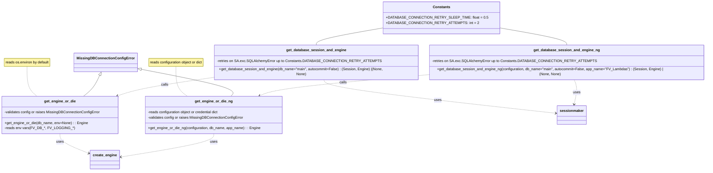

# Diagram: shipment_core/shipment_filter/shipment_filter/lambdas/fvshared/database.py


> Auto-generated by Obscura crawlers

## Diagram 1



### SVG

<svg id="container" width="3202.697265625" xmlns="http://www.w3.org/2000/svg" class="classDiagram" height="754" viewBox="0 0 3202.697265625 754" role="graphics-document document" aria-roledescription="class"><style>#container{font-family:"trebuchet ms",verdana,arial,sans-serif;font-size:16px;fill:#333;}@keyframes edge-animation-frame{from{stroke-dashoffset:0;}}@keyframes dash{to{stroke-dashoffset:0;}}#container .edge-animation-slow{stroke-dasharray:9,5!important;stroke-dashoffset:900;animation:dash 50s linear infinite;stroke-linecap:round;}#container .edge-animation-fast{stroke-dasharray:9,5!important;stroke-dashoffset:900;animation:dash 20s linear infinite;stroke-linecap:round;}#container .error-icon{fill:#552222;}#container .error-text{fill:#552222;stroke:#552222;}#container .edge-thickness-normal{stroke-width:1px;}#container .edge-thickness-thick{stroke-width:3.5px;}#container .edge-pattern-solid{stroke-dasharray:0;}#container .edge-thickness-invisible{stroke-width:0;fill:none;}#container .edge-pattern-dashed{stroke-dasharray:3;}#container .edge-pattern-dotted{stroke-dasharray:2;}#container .marker{fill:#333333;stroke:#333333;}#container .marker.cross{stroke:#333333;}#container svg{font-family:"trebuchet ms",verdana,arial,sans-serif;font-size:16px;}#container p{margin:0;}#container g.classGroup text{fill:#9370DB;stroke:none;font-family:"trebuchet ms",verdana,arial,sans-serif;font-size:10px;}#container g.classGroup text .title{font-weight:bolder;}#container .nodeLabel,#container .edgeLabel{color:#131300;}#container .edgeLabel .label rect{fill:#ECECFF;}#container .label text{fill:#131300;}#container .labelBkg{background:#ECECFF;}#container .edgeLabel .label span{background:#ECECFF;}#container .classTitle{font-weight:bolder;}#container .node rect,#container .node circle,#container .node ellipse,#container .node polygon,#container .node path{fill:#ECECFF;stroke:#9370DB;stroke-width:1px;}#container .divider{stroke:#9370DB;stroke-width:1;}#container g.clickable{cursor:pointer;}#container g.classGroup rect{fill:#ECECFF;stroke:#9370DB;}#container g.classGroup line{stroke:#9370DB;stroke-width:1;}#container .classLabel .box{stroke:none;stroke-width:0;fill:#ECECFF;opacity:0.5;}#container .classLabel .label{fill:#9370DB;font-size:10px;}#container .relation{stroke:#333333;stroke-width:1;fill:none;}#container .dashed-line{stroke-dasharray:3;}#container .dotted-line{stroke-dasharray:1 2;}#container #compositionStart,#container .composition{fill:#333333!important;stroke:#333333!important;stroke-width:1;}#container #compositionEnd,#container .composition{fill:#333333!important;stroke:#333333!important;stroke-width:1;}#container #dependencyStart,#container .dependency{fill:#333333!important;stroke:#333333!important;stroke-width:1;}#container #dependencyStart,#container .dependency{fill:#333333!important;stroke:#333333!important;stroke-width:1;}#container #extensionStart,#container .extension{fill:transparent!important;stroke:#333333!important;stroke-width:1;}#container #extensionEnd,#container .extension{fill:transparent!important;stroke:#333333!important;stroke-width:1;}#container #aggregationStart,#container .aggregation{fill:transparent!important;stroke:#333333!important;stroke-width:1;}#container #aggregationEnd,#container .aggregation{fill:transparent!important;stroke:#333333!important;stroke-width:1;}#container #lollipopStart,#container .lollipop{fill:#ECECFF!important;stroke:#333333!important;stroke-width:1;}#container #lollipopEnd,#container .lollipop{fill:#ECECFF!important;stroke:#333333!important;stroke-width:1;}#container .edgeTerminals{font-size:11px;line-height:initial;}#container .classTitleText{text-anchor:middle;font-size:18px;fill:#333;}#container .label-icon{display:inline-block;height:1em;overflow:visible;vertical-align:-0.125em;}#container .node .label-icon path{fill:currentColor;stroke:revert;stroke-width:revert;}#container :root{--mermaid-font-family:"trebuchet ms",verdana,arial,sans-serif;}</style><g><defs><marker id="container_class-aggregationStart" class="marker aggregation class" refX="18" refY="7" markerWidth="190" markerHeight="240" orient="auto"><path d="M 18,7 L9,13 L1,7 L9,1 Z"></path></marker></defs><defs><marker id="container_class-aggregationEnd" class="marker aggregation class" refX="1" refY="7" markerWidth="20" markerHeight="28" orient="auto"><path d="M 18,7 L9,13 L1,7 L9,1 Z"></path></marker></defs><defs><marker id="container_class-extensionStart" class="marker extension class" refX="18" refY="7" markerWidth="190" markerHeight="240" orient="auto"><path d="M 1,7 L18,13 V 1 Z"></path></marker></defs><defs><marker id="container_class-extensionEnd" class="marker extension class" refX="1" refY="7" markerWidth="20" markerHeight="28" orient="auto"><path d="M 1,1 V 13 L18,7 Z"></path></marker></defs><defs><marker id="container_class-compositionStart" class="marker composition class" refX="18" refY="7" markerWidth="190" markerHeight="240" orient="auto"><path d="M 18,7 L9,13 L1,7 L9,1 Z"></path></marker></defs><defs><marker id="container_class-compositionEnd" class="marker composition class" refX="1" refY="7" markerWidth="20" markerHeight="28" orient="auto"><path d="M 18,7 L9,13 L1,7 L9,1 Z"></path></marker></defs><defs><marker id="container_class-dependencyStart" class="marker dependency class" refX="6" refY="7" markerWidth="190" markerHeight="240" orient="auto"><path d="M 5,7 L9,13 L1,7 L9,1 Z"></path></marker></defs><defs><marker id="container_class-dependencyEnd" class="marker dependency class" refX="13" refY="7" markerWidth="20" markerHeight="28" orient="auto"><path d="M 18,7 L9,13 L14,7 L9,1 Z"></path></marker></defs><defs><marker id="container_class-lollipopStart" class="marker lollipop class" refX="13" refY="7" markerWidth="190" markerHeight="240" orient="auto"><circle stroke="black" fill="transparent" cx="7" cy="7" r="6"></circle></marker></defs><defs><marker id="container_class-lollipopEnd" class="marker lollipop class" refX="1" refY="7" markerWidth="190" markerHeight="240" orient="auto"><circle stroke="black" fill="transparent" cx="7" cy="7" r="6"></circle></marker></defs><g class="root"><g class="clusters"></g><g class="edgePaths"><path d="M123.734,292L123.734,307.167C123.734,322.333,123.734,352.667,131.036,374C138.337,395.333,152.939,407.667,160.24,413.833L167.542,420" id="edgeNote1" class="edge-thickness-normal edge-pattern-dotted relation" style="fill: none;;;fill: none" data-edge="true" data-et="edge" data-id="edgeNote1" data-points="W3sieCI6MTIzLjczNDM3NSwieSI6MjkyfSx7IngiOjEyMy43MzQzNzUsInkiOjM4M30seyJ4IjoxNjcuNTQxNjc3NDI3Njg1OTUsInkiOjQyMH1d"></path><path d="M780.166,292L780.166,307.167C780.166,322.333,780.166,352.667,788.814,374C797.463,395.333,814.76,407.667,823.408,413.833L832.057,420" id="edgeNote2" class="edge-thickness-normal edge-pattern-dotted relation" style="fill: none;;;fill: none" data-edge="true" data-et="edge" data-id="edgeNote2" data-points="W3sieCI6NzgwLjE2NjAxNTYyNSwieSI6MjkyfSx7IngiOjc4MC4xNjYwMTU2MjUsInkiOjM4M30seyJ4Ijo4MzIuMDU2OTE1MDMwOTkxNywieSI6NDIwfV0="></path><path d="M1760.438,119.194L1703.63,128.828C1646.822,138.462,1533.207,157.731,1476.399,171.532C1419.592,185.333,1419.592,193.667,1419.592,197.833L1419.592,202" id="id_Constants_get_database_session_and_engine_1" class="edge-thickness-normal edge-pattern-solid relation" style=";;;" data-edge="true" data-et="edge" data-id="id_Constants_get_database_session_and_engine_1" data-points="W3sieCI6MTc2MC40Mzc1LCJ5IjoxMTkuMTkzNTE4NTM0MzI4Mn0seyJ4IjoxNDE5LjU5MTc5Njg3NSwieSI6MTc3fSx7IngiOjE0MTkuNTkxNzk2ODc1LCJ5IjoyMDJ9XQ=="></path><path d="M2222.633,119.194L2279.44,128.828C2336.248,138.462,2449.863,157.731,2506.671,171.532C2563.479,185.333,2563.479,193.667,2563.479,197.833L2563.479,202" id="id_Constants_get_database_session_and_engine_ng_2" class="edge-thickness-normal edge-pattern-solid relation" style=";;;" data-edge="true" data-et="edge" data-id="id_Constants_get_database_session_and_engine_ng_2" data-points="W3sieCI6MjIyMi42MzI4MTI1LCJ5IjoxMTkuMTkzNTE4NTM0MzI4Mn0seyJ4IjoyNTYzLjQ3ODUxNTYyNSwieSI6MTc3fSx7IngiOjI1NjMuNDc4NTE1NjI1LCJ5IjoyMDJ9XQ=="></path><path d="M443.486,331.516L439.317,340.096C435.148,348.677,426.809,365.839,414.92,380.586C403.031,395.333,387.592,407.667,379.872,413.833L372.152,420" id="id_MissingDBConnectionConfigError_get_engine_or_die_3" class="edge-thickness-normal edge-pattern-solid relation" style=";;;" data-edge="true" data-et="edge" data-id="id_MissingDBConnectionConfigError_get_engine_or_die_3" data-points="W3sieCI6NDUxLjAyNDY3Mzg4MTg4MDc0LCJ5IjozMTZ9LHsieCI6NDE4LjQ3MDcwMzEyNSwieSI6MzgzfSx7IngiOjM3Mi4xNTIwMjA5MTk0MjE1LCJ5Ijo0MjB9XQ==" marker-start="url(#container_class-extensionStart)"></path><path d="M620.375,301.343L694.51,314.952C768.646,328.562,916.917,355.781,985.175,375.557C1053.433,395.333,1041.678,407.667,1035.8,413.833L1029.923,420" id="id_MissingDBConnectionConfigError_get_engine_or_die_ng_4" class="edge-thickness-normal edge-pattern-solid relation" style=";;;" data-edge="true" data-et="edge" data-id="id_MissingDBConnectionConfigError_get_engine_or_die_ng_4" data-points="W3sieCI6NjAzLjQwODIwMzEyNSwieSI6Mjk4LjIyNzg3OTMzMDEzODJ9LHsieCI6MTA2NS4xODc1LCJ5IjozODN9LHsieCI6MTAyOS45MjMwNjk0NzMxNDA1LCJ5Ijo0MjB9XQ==" marker-start="url(#container_class-extensionStart)"></path><path d="M956.924,337.531L901.736,345.11C846.549,352.688,736.174,367.844,663.648,381.269C591.122,394.694,556.445,406.388,539.106,412.236L521.768,418.083" id="id_get_database_session_and_engine_get_engine_or_die_5" class="edge-thickness-normal edge-pattern-dashed relation" style=";;;" data-edge="true" data-et="edge" data-id="id_get_database_session_and_engine_get_engine_or_die_5" data-points="W3sieCI6OTU2LjkyMzgyODEyNSwieSI6MzM3LjUzMTQzNzc2NjY1NjN9LHsieCI6NjI1Ljc5ODgyODEyNSwieSI6MzgzfSx7IngiOjUxNi4wODIyODk1MTQ0NjI4LCJ5Ijo0MjB9XQ==" marker-end="url(#container_class-dependencyEnd)"></path><path d="M1449.15,346L1451.682,352.167C1454.213,358.333,1459.277,370.667,1636.617,395.763C1813.957,420.859,2163.574,458.718,2338.383,477.648L2513.191,496.578" id="id_get_database_session_and_engine_sessionmaker_6" class="edge-thickness-normal edge-pattern-dashed relation" style=";;;" data-edge="true" data-et="edge" data-id="id_get_database_session_and_engine_sessionmaker_6" data-points="W3sieCI6MTQ0OS4xNTAxMzk3NjQ5MDgzLCJ5IjozNDZ9LHsieCI6MTQ2NC4zMzk4NDM3NSwieSI6MzgzfSx7IngiOjI1MTkuMTU2MjUsInkiOjQ5Ny4yMjM1NjM0NjU1MTE2M31d" marker-end="url(#container_class-dependencyEnd)"></path><path d="M1932.26,326.109L1817.401,335.591C1702.542,345.072,1472.825,364.036,1343.946,379.303C1215.066,394.57,1187.025,406.141,1173.005,411.926L1158.984,417.711" id="id_get_database_session_and_engine_ng_get_engine_or_die_ng_7" class="edge-thickness-normal edge-pattern-dashed relation" style=";;;" data-edge="true" data-et="edge" data-id="id_get_database_session_and_engine_ng_get_engine_or_die_ng_7" data-points="W3sieCI6MTkzMi4yNTk3NjU2MjUsInkiOjMyNi4xMDg3MTcwNjg3NjkxfSx7IngiOjEyNDMuMTA3NDIxODc1LCJ5IjozODN9LHsieCI6MTE1My40Mzc3MjU5ODE0MDUsInkiOjQyMH1d" marker-end="url(#container_class-dependencyEnd)"></path><path d="M2593.037,346L2595.568,352.167C2598.1,358.333,2603.163,370.667,2603.026,389.023C2602.889,407.38,2597.551,431.759,2594.882,443.949L2592.213,456.139" id="id_get_database_session_and_engine_ng_sessionmaker_8" class="edge-thickness-normal edge-pattern-dashed relation" style=";;;" data-edge="true" data-et="edge" data-id="id_get_database_session_and_engine_ng_sessionmaker_8" data-points="W3sieCI6MjU5My4wMzY4NTg1MTQ5MDgsInkiOjM0Nn0seyJ4IjoyNjA4LjIyNjU2MjUsInkiOjM4M30seyJ4IjoyNTkwLjkzMDAxMDMzMDU3ODYsInkiOjQ2Mn1d" marker-end="url(#container_class-dependencyEnd)"></path><path d="M266.996,588L266.996,594.167C266.996,600.333,266.996,612.667,288.197,627.369C309.397,642.071,351.799,659.142,372.999,667.677L394.2,676.213" id="id_get_engine_or_die_create_engine_9" class="edge-thickness-normal edge-pattern-dashed relation" style=";;;" data-edge="true" data-et="edge" data-id="id_get_engine_or_die_create_engine_9" data-points="W3sieCI6MjY2Ljk5NjA5Mzc1LCJ5Ijo1ODh9LHsieCI6MjY2Ljk5NjA5Mzc1LCJ5Ijo2MjV9LHsieCI6Mzk5Ljc2NTYyNSwieSI6Njc4LjQ1MzUyNjU2NjIwMTV9XQ==" marker-end="url(#container_class-dependencyEnd)"></path><path d="M949.863,588L949.863,594.167C949.863,600.333,949.863,612.667,880.318,630.123C810.774,647.579,671.684,670.159,602.139,681.448L532.594,692.738" id="id_get_engine_or_die_ng_create_engine_10" class="edge-thickness-normal edge-pattern-dashed relation" style=";;;" data-edge="true" data-et="edge" data-id="id_get_engine_or_die_ng_create_engine_10" data-points="W3sieCI6OTQ5Ljg2MzI4MTI1LCJ5Ijo1ODh9LHsieCI6OTQ5Ljg2MzI4MTI1LCJ5Ijo2MjV9LHsieCI6NTI2LjY3MTg3NSwieSI6NjkzLjY5OTI2MzkzMjcwMjR9XQ==" marker-end="url(#container_class-dependencyEnd)"></path></g><g class="edgeLabels"><g class="edgeLabel"><g class="label" data-id="edgeNote1" transform="translate(0, 0)"><foreignObject width="0" height="0"><div xmlns="http://www.w3.org/1999/xhtml" class="labelBkg" style="display: table-cell; white-space: nowrap; line-height: 1.5; max-width: 200px; text-align: center;"><span class="edgeLabel"></span></div></foreignObject></g></g><g class="edgeLabel"><g class="label" data-id="edgeNote2" transform="translate(0, 0)"><foreignObject width="0" height="0"><div xmlns="http://www.w3.org/1999/xhtml" class="labelBkg" style="display: table-cell; white-space: nowrap; line-height: 1.5; max-width: 200px; text-align: center;"><span class="edgeLabel"></span></div></foreignObject></g></g><g class="edgeLabel"><g class="label" data-id="id_Constants_get_database_session_and_engine_1" transform="translate(0, 0)"><foreignObject width="0" height="0"><div xmlns="http://www.w3.org/1999/xhtml" class="labelBkg" style="display: table-cell; white-space: nowrap; line-height: 1.5; max-width: 200px; text-align: center;"><span class="edgeLabel"></span></div></foreignObject></g></g><g class="edgeLabel"><g class="label" data-id="id_Constants_get_database_session_and_engine_ng_2" transform="translate(0, 0)"><foreignObject width="0" height="0"><div xmlns="http://www.w3.org/1999/xhtml" class="labelBkg" style="display: table-cell; white-space: nowrap; line-height: 1.5; max-width: 200px; text-align: center;"><span class="edgeLabel"></span></div></foreignObject></g></g><g class="edgeLabel"><g class="label" data-id="id_MissingDBConnectionConfigError_get_engine_or_die_3" transform="translate(0, 0)"><foreignObject width="0" height="0"><div xmlns="http://www.w3.org/1999/xhtml" class="labelBkg" style="display: table-cell; white-space: nowrap; line-height: 1.5; max-width: 200px; text-align: center;"><span class="edgeLabel"></span></div></foreignObject></g></g><g class="edgeLabel"><g class="label" data-id="id_MissingDBConnectionConfigError_get_engine_or_die_ng_4" transform="translate(0, 0)"><foreignObject width="0" height="0"><div xmlns="http://www.w3.org/1999/xhtml" class="labelBkg" style="display: table-cell; white-space: nowrap; line-height: 1.5; max-width: 200px; text-align: center;"><span class="edgeLabel"></span></div></foreignObject></g></g><g class="edgeLabel" transform="translate(734.00584, 368.14151)"><g class="label" data-id="id_get_database_session_and_engine_get_engine_or_die_5" transform="translate(-16.4453125, -12)"><foreignObject width="32.890625" height="24"><div xmlns="http://www.w3.org/1999/xhtml" class="labelBkg" style="display: table-cell; white-space: nowrap; line-height: 1.5; max-width: 200px; text-align: center;"><span class="edgeLabel"><p>calls</p></span></div></foreignObject></g></g><g class="edgeLabel" transform="translate(1971.86598, 437.9588)"><g class="label" data-id="id_get_database_session_and_engine_sessionmaker_6" transform="translate(-16.4921875, -12)"><foreignObject width="32.984375" height="24"><div xmlns="http://www.w3.org/1999/xhtml" class="labelBkg" style="display: table-cell; white-space: nowrap; line-height: 1.5; max-width: 200px; text-align: center;"><span class="edgeLabel"><p>uses</p></span></div></foreignObject></g></g><g class="edgeLabel" transform="translate(1539.34633, 358.54472)"><g class="label" data-id="id_get_database_session_and_engine_ng_get_engine_or_die_ng_7" transform="translate(-16.4453125, -12)"><foreignObject width="32.890625" height="24"><div xmlns="http://www.w3.org/1999/xhtml" class="labelBkg" style="display: table-cell; white-space: nowrap; line-height: 1.5; max-width: 200px; text-align: center;"><span class="edgeLabel"><p>calls</p></span></div></foreignObject></g></g><g class="edgeLabel" transform="translate(2603.85547, 402.96446)"><g class="label" data-id="id_get_database_session_and_engine_ng_sessionmaker_8" transform="translate(-16.4921875, -12)"><foreignObject width="32.984375" height="24"><div xmlns="http://www.w3.org/1999/xhtml" class="labelBkg" style="display: table-cell; white-space: nowrap; line-height: 1.5; max-width: 200px; text-align: center;"><span class="edgeLabel"><p>uses</p></span></div></foreignObject></g></g><g class="edgeLabel" transform="translate(266.99609375, 625)"><g class="label" data-id="id_get_engine_or_die_create_engine_9" transform="translate(-16.4921875, -12)"><foreignObject width="32.984375" height="24"><div xmlns="http://www.w3.org/1999/xhtml" class="labelBkg" style="display: table-cell; white-space: nowrap; line-height: 1.5; max-width: 200px; text-align: center;"><span class="edgeLabel"><p>uses</p></span></div></foreignObject></g></g><g class="edgeLabel" transform="translate(949.86328125, 625)"><g class="label" data-id="id_get_engine_or_die_ng_create_engine_10" transform="translate(-16.4921875, -12)"><foreignObject width="32.984375" height="24"><div xmlns="http://www.w3.org/1999/xhtml" class="labelBkg" style="display: table-cell; white-space: nowrap; line-height: 1.5; max-width: 200px; text-align: center;"><span class="edgeLabel"><p>uses</p></span></div></foreignObject></g></g></g><g class="nodes"><g class="node default" id="classId-Constants-0" transform="translate(1991.53515625, 80)"><g class="basic label-container"><path d="M-231.09765625 -72 L231.09765625 -72 L231.09765625 72 L-231.09765625 72" stroke="none" stroke-width="0" fill="#ECECFF" style=""></path><path d="M-231.09765625 -72 C-74.38930925208146 -72, 82.31903774583708 -72, 231.09765625 -72 M-231.09765625 -72 C-62.5780500109189 -72, 105.9415562281622 -72, 231.09765625 -72 M231.09765625 -72 C231.09765625 -40.86195950827503, 231.09765625 -9.723919016550056, 231.09765625 72 M231.09765625 -72 C231.09765625 -38.17857661883883, 231.09765625 -4.3571532376776645, 231.09765625 72 M231.09765625 72 C50.25106493935752 72, -130.59552637128496 72, -231.09765625 72 M231.09765625 72 C105.4074000430504 72, -20.282856163899197 72, -231.09765625 72 M-231.09765625 72 C-231.09765625 20.251240658305427, -231.09765625 -31.497518683389146, -231.09765625 -72 M-231.09765625 72 C-231.09765625 33.665129488596406, -231.09765625 -4.669741022807187, -231.09765625 -72" stroke="#9370DB" stroke-width="1.3" fill="none" stroke-dasharray="0 0" style=""></path></g><g class="annotation-group text" transform="translate(0, -48)"></g><g class="label-group text" transform="translate(-36.5390625, -48)"><g class="label" style="font-weight: bolder" transform="translate(0,-12)"><foreignObject width="73.078125" height="24"><div xmlns="http://www.w3.org/1999/xhtml" style="display: table-cell; white-space: nowrap; line-height: 1.5; max-width: 122px; text-align: center;"><span class="nodeLabel markdown-node-label" style=""><p>Constants</p></span></div></foreignObject></g></g><g class="members-group text" transform="translate(-219.09765625, 0)"><g class="label" style="" transform="translate(0,-12)"><foreignObject width="401.65625" height="24"><div xmlns="http://www.w3.org/1999/xhtml" style="display: table-cell; white-space: nowrap; line-height: 1.5; max-width: 459px; text-align: center;"><span class="nodeLabel markdown-node-label" style=""><p>+DATABASE_CONNECTION_RETRY_SLEEP_TIME: float = 0.5</p></span></div></foreignObject></g><g class="label" style="" transform="translate(0,12)"><foreignObject width="364.21875" height="24"><div xmlns="http://www.w3.org/1999/xhtml" style="display: table-cell; white-space: nowrap; line-height: 1.5; max-width: 422px; text-align: center;"><span class="nodeLabel markdown-node-label" style=""><p>+DATABASE_CONNECTION_RETRY_ATTEMPTS: int = 2</p></span></div></foreignObject></g></g><g class="methods-group text" transform="translate(-219.09765625, 72)"></g><g class="divider" style=""><path d="M-231.09765625 -24 C-97.57547564011458 -24, 35.94670496977085 -24, 231.09765625 -24 M-231.09765625 -24 C-94.45305615692828 -24, 42.19154393614343 -24, 231.09765625 -24" stroke="#9370DB" stroke-width="1.3" fill="none" stroke-dasharray="0 0" style=""></path></g><g class="divider" style=""><path d="M-231.09765625 48 C-124.58233161933782 48, -18.067006988675644 48, 231.09765625 48 M-231.09765625 48 C-105.08695868219046 48, 20.923738885619088 48, 231.09765625 48" stroke="#9370DB" stroke-width="1.3" fill="none" stroke-dasharray="0 0" style=""></path></g></g><g class="node default" id="classId-MissingDBConnectionConfigError-1" transform="translate(471.431640625, 274)"><g class="basic label-container"><path d="M-131.9765625 -42 L131.9765625 -42 L131.9765625 42 L-131.9765625 42" stroke="none" stroke-width="0" fill="#ECECFF" style=""></path><path d="M-131.9765625 -42 C-44.336780380658084 -42, 43.30300173868383 -42, 131.9765625 -42 M-131.9765625 -42 C-45.81870464102053 -42, 40.33915321795894 -42, 131.9765625 -42 M131.9765625 -42 C131.9765625 -16.460416965028845, 131.9765625 9.07916606994231, 131.9765625 42 M131.9765625 -42 C131.9765625 -23.47876715184379, 131.9765625 -4.957534303687581, 131.9765625 42 M131.9765625 42 C46.5259919585464 42, -38.9245785829072 42, -131.9765625 42 M131.9765625 42 C27.989735087300957 42, -75.99709232539809 42, -131.9765625 42 M-131.9765625 42 C-131.9765625 9.972372486253313, -131.9765625 -22.055255027493374, -131.9765625 -42 M-131.9765625 42 C-131.9765625 22.513766518076878, -131.9765625 3.0275330361537556, -131.9765625 -42" stroke="#9370DB" stroke-width="1.3" fill="none" stroke-dasharray="0 0" style=""></path></g><g class="annotation-group text" transform="translate(0, -18)"></g><g class="label-group text" transform="translate(-119.9765625, -18)"><g class="label" style="font-weight: bolder" transform="translate(0,-12)"><foreignObject width="239.953125" height="24"><div xmlns="http://www.w3.org/1999/xhtml" style="display: table-cell; white-space: nowrap; line-height: 1.5; max-width: 288px; text-align: center;"><span class="nodeLabel markdown-node-label" style=""><p>MissingDBConnectionConfigError</p></span></div></foreignObject></g></g><g class="members-group text" transform="translate(-119.9765625, 30)"></g><g class="methods-group text" transform="translate(-119.9765625, 60)"></g><g class="divider" style=""><path d="M-131.9765625 6 C-54.01327772796459 6, 23.950007044070816 6, 131.9765625 6 M-131.9765625 6 C-65.45667833596607 6, 1.0632058280678507 6, 131.9765625 6" stroke="#9370DB" stroke-width="1.3" fill="none" stroke-dasharray="0 0" style=""></path></g><g class="divider" style=""><path d="M-131.9765625 24 C-59.02746342192897 24, 13.921635656142058 24, 131.9765625 24 M-131.9765625 24 C-72.74664128630113 24, -13.516720072602268 24, 131.9765625 24" stroke="#9370DB" stroke-width="1.3" fill="none" stroke-dasharray="0 0" style=""></path></g></g><g class="node default" id="classId-get_engine_or_die-2" transform="translate(266.99609375, 504)"><g class="basic label-container"><path d="M-258.99609375 -84 L258.99609375 -84 L258.99609375 84 L-258.99609375 84" stroke="none" stroke-width="0" fill="#ECECFF" style=""></path><path d="M-258.99609375 -84 C-71.42862880133049 -84, 116.13883614733902 -84, 258.99609375 -84 M-258.99609375 -84 C-88.95425038922306 -84, 81.08759297155387 -84, 258.99609375 -84 M258.99609375 -84 C258.99609375 -40.043212701780945, 258.99609375 3.91357459643811, 258.99609375 84 M258.99609375 -84 C258.99609375 -34.49456762506017, 258.99609375 15.010864749879659, 258.99609375 84 M258.99609375 84 C69.3756177076726 84, -120.2448583346548 84, -258.99609375 84 M258.99609375 84 C131.38877068520958 84, 3.7814476204191294 84, -258.99609375 84 M-258.99609375 84 C-258.99609375 42.626601973074514, -258.99609375 1.2532039461490285, -258.99609375 -84 M-258.99609375 84 C-258.99609375 25.60236946874229, -258.99609375 -32.79526106251542, -258.99609375 -84" stroke="#9370DB" stroke-width="1.3" fill="none" stroke-dasharray="0 0" style=""></path></g><g class="annotation-group text" transform="translate(0, -60)"></g><g class="label-group text" transform="translate(-67.0234375, -60)"><g class="label" style="font-weight: bolder" transform="translate(0,-12)"><foreignObject width="134.046875" height="24"><div xmlns="http://www.w3.org/1999/xhtml" style="display: table-cell; white-space: nowrap; line-height: 1.5; max-width: 182px; text-align: center;"><span class="nodeLabel markdown-node-label" style=""><p>get_engine_or_die</p></span></div></foreignObject></g></g><g class="members-group text" transform="translate(-246.99609375, -12)"><g class="label" style="" transform="translate(0,-12)"><foreignObject width="426.96875" height="24"><div xmlns="http://www.w3.org/1999/xhtml" style="display: table-cell; white-space: nowrap; line-height: 1.5; max-width: 485px; text-align: center;"><span class="nodeLabel markdown-node-label" style=""><p>-validates config or raises MissingDBConnectionConfigError</p></span></div></foreignObject></g></g><g class="methods-group text" transform="translate(-246.99609375, 36)"><g class="label" style="" transform="translate(0,-12)"><foreignObject width="367.5" height="24"><div xmlns="http://www.w3.org/1999/xhtml" style="display: table-cell; white-space: nowrap; line-height: 1.5; max-width: 425px; text-align: center;"><span class="nodeLabel markdown-node-label" style=""><p>+get_engine_or_die(db_name, env=None) : : Engine</p></span></div></foreignObject></g><g class="label" style="" transform="translate(0,12)"><foreignObject width="287.375" height="24"><div xmlns="http://www.w3.org/1999/xhtml" style="display: table-cell; white-space: nowrap; line-height: 1.5; max-width: 345px; text-align: center;"><span class="nodeLabel markdown-node-label" style=""><p>-reads env vars(FV_DB_*, FV_LOGGING_*)</p></span></div></foreignObject></g></g><g class="divider" style=""><path d="M-258.99609375 -36 C-126.32132974651762 -36, 6.353434256964761 -36, 258.99609375 -36 M-258.99609375 -36 C-118.66472142931116 -36, 21.666650891377685 -36, 258.99609375 -36" stroke="#9370DB" stroke-width="1.3" fill="none" stroke-dasharray="0 0" style=""></path></g><g class="divider" style=""><path d="M-258.99609375 12 C-60.95424090696636 12, 137.08761193606728 12, 258.99609375 12 M-258.99609375 12 C-114.95422520904606 12, 29.087643331907884 12, 258.99609375 12" stroke="#9370DB" stroke-width="1.3" fill="none" stroke-dasharray="0 0" style=""></path></g></g><g class="node default" id="classId-get_database_session_and_engine-3" transform="translate(1419.591796875, 274)"><g class="basic label-container"><path d="M-462.66796875 -72 L462.66796875 -72 L462.66796875 72 L-462.66796875 72" stroke="none" stroke-width="0" fill="#ECECFF" style=""></path><path d="M-462.66796875 -72 C-181.83505563405538 -72, 98.99785748188924 -72, 462.66796875 -72 M-462.66796875 -72 C-207.43779021482405 -72, 47.792388320351904 -72, 462.66796875 -72 M462.66796875 -72 C462.66796875 -26.868938830092468, 462.66796875 18.262122339815065, 462.66796875 72 M462.66796875 -72 C462.66796875 -20.432831785026636, 462.66796875 31.13433642994673, 462.66796875 72 M462.66796875 72 C110.38965763380867 72, -241.88865348238267 72, -462.66796875 72 M462.66796875 72 C258.89962747875563 72, 55.131286207511266 72, -462.66796875 72 M-462.66796875 72 C-462.66796875 37.86497095539941, -462.66796875 3.7299419107988143, -462.66796875 -72 M-462.66796875 72 C-462.66796875 37.03182887243254, -462.66796875 2.0636577448650826, -462.66796875 -72" stroke="#9370DB" stroke-width="1.3" fill="none" stroke-dasharray="0 0" style=""></path></g><g class="annotation-group text" transform="translate(0, -48)"></g><g class="label-group text" transform="translate(-127.6015625, -48)"><g class="label" style="font-weight: bolder" transform="translate(0,-12)"><foreignObject width="255.203125" height="24"><div xmlns="http://www.w3.org/1999/xhtml" style="display: table-cell; white-space: nowrap; line-height: 1.5; max-width: 302px; text-align: center;"><span class="nodeLabel markdown-node-label" style=""><p>get_database_session_and_engine</p></span></div></foreignObject></g></g><g class="members-group text" transform="translate(-450.66796875, 0)"><g class="label" style="" transform="translate(0,-12)"><foreignObject width="680.8125" height="24"><div xmlns="http://www.w3.org/1999/xhtml" style="display: table-cell; white-space: nowrap; line-height: 1.5; max-width: 738px; text-align: center;"><span class="nodeLabel markdown-node-label" style=""><p>-retries on SA.exc.SQLAlchemyError up to Constants.DATABASE_CONNECTION_RETRY_ATTEMPTS</p></span></div></foreignObject></g></g><g class="methods-group text" transform="translate(-450.66796875, 48)"><g class="label" style="" transform="translate(0,-12)"><foreignObject width="773.734375" height="24"><div xmlns="http://www.w3.org/1999/xhtml" style="display: table-cell; white-space: nowrap; line-height: 1.5; max-width: 831px; text-align: center;"><span class="nodeLabel markdown-node-label" style=""><p>+get_database_session_and_engine(db_name="main", autocommit=False) : (Session, Engine) |(None, None)</p></span></div></foreignObject></g></g><g class="divider" style=""><path d="M-462.66796875 -24 C-137.41560701319793 -24, 187.83675472360414 -24, 462.66796875 -24 M-462.66796875 -24 C-268.53213487151936 -24, -74.39630099303878 -24, 462.66796875 -24" stroke="#9370DB" stroke-width="1.3" fill="none" stroke-dasharray="0 0" style=""></path></g><g class="divider" style=""><path d="M-462.66796875 24 C-165.05122635907776 24, 132.56551603184448 24, 462.66796875 24 M-462.66796875 24 C-260.08563845794316 24, -57.503308165886324 24, 462.66796875 24" stroke="#9370DB" stroke-width="1.3" fill="none" stroke-dasharray="0 0" style=""></path></g></g><g class="node default" id="classId-get_engine_or_die_ng-4" transform="translate(949.86328125, 504)"><g class="basic label-container"><path d="M-302.6875 -84 L302.6875 -84 L302.6875 84 L-302.6875 84" stroke="none" stroke-width="0" fill="#ECECFF" style=""></path><path d="M-302.6875 -84 C-148.70136530109372 -84, 5.284769397812568 -84, 302.6875 -84 M-302.6875 -84 C-150.95244365980474 -84, 0.782612680390514 -84, 302.6875 -84 M302.6875 -84 C302.6875 -32.77446930382513, 302.6875 18.451061392349743, 302.6875 84 M302.6875 -84 C302.6875 -46.82388188958522, 302.6875 -9.647763779170447, 302.6875 84 M302.6875 84 C94.75476422543758 84, -113.17797154912483 84, -302.6875 84 M302.6875 84 C154.97434530467743 84, 7.2611906093548555 84, -302.6875 84 M-302.6875 84 C-302.6875 20.00971967644133, -302.6875 -43.98056064711734, -302.6875 -84 M-302.6875 84 C-302.6875 47.99990994643887, -302.6875 11.999819892877738, -302.6875 -84" stroke="#9370DB" stroke-width="1.3" fill="none" stroke-dasharray="0 0" style=""></path></g><g class="annotation-group text" transform="translate(0, -60)"></g><g class="label-group text" transform="translate(-80.046875, -60)"><g class="label" style="font-weight: bolder" transform="translate(0,-12)"><foreignObject width="160.09375" height="24"><div xmlns="http://www.w3.org/1999/xhtml" style="display: table-cell; white-space: nowrap; line-height: 1.5; max-width: 209px; text-align: center;"><span class="nodeLabel markdown-node-label" style=""><p>get_engine_or_die_ng</p></span></div></foreignObject></g></g><g class="members-group text" transform="translate(-290.6875, -12)"><g class="label" style="" transform="translate(0,-12)"><foreignObject width="325.453125" height="24"><div xmlns="http://www.w3.org/1999/xhtml" style="display: table-cell; white-space: nowrap; line-height: 1.5; max-width: 383px; text-align: center;"><span class="nodeLabel markdown-node-label" style=""><p>-reads configuration object or credential dict</p></span></div></foreignObject></g><g class="label" style="" transform="translate(0,12)"><foreignObject width="426.96875" height="24"><div xmlns="http://www.w3.org/1999/xhtml" style="display: table-cell; white-space: nowrap; line-height: 1.5; max-width: 485px; text-align: center;"><span class="nodeLabel markdown-node-label" style=""><p>-validates config or raises MissingDBConnectionConfigError</p></span></div></foreignObject></g></g><g class="methods-group text" transform="translate(-290.6875, 60)"><g class="label" style="" transform="translate(0,-12)"><foreignObject width="501.328125" height="24"><div xmlns="http://www.w3.org/1999/xhtml" style="display: table-cell; white-space: nowrap; line-height: 1.5; max-width: 559px; text-align: center;"><span class="nodeLabel markdown-node-label" style=""><p>+get_engine_or_die_ng(configuration, db_name, app_name) : : Engine</p></span></div></foreignObject></g></g><g class="divider" style=""><path d="M-302.6875 -36 C-175.75086581354762 -36, -48.81423162709524 -36, 302.6875 -36 M-302.6875 -36 C-150.9654658601531 -36, 0.7565682796937949 -36, 302.6875 -36" stroke="#9370DB" stroke-width="1.3" fill="none" stroke-dasharray="0 0" style=""></path></g><g class="divider" style=""><path d="M-302.6875 36 C-86.61262279948369 36, 129.46225440103262 36, 302.6875 36 M-302.6875 36 C-60.9591836644654 36, 180.7691326710692 36, 302.6875 36" stroke="#9370DB" stroke-width="1.3" fill="none" stroke-dasharray="0 0" style=""></path></g></g><g class="node default" id="classId-get_database_session_and_engine_ng-5" transform="translate(2563.478515625, 274)"><g class="basic label-container"><path d="M-631.21875 -72 L631.21875 -72 L631.21875 72 L-631.21875 72" stroke="none" stroke-width="0" fill="#ECECFF" style=""></path><path d="M-631.21875 -72 C-145.08017133375904 -72, 341.0584073324819 -72, 631.21875 -72 M-631.21875 -72 C-363.02297194542814 -72, -94.82719389085628 -72, 631.21875 -72 M631.21875 -72 C631.21875 -26.480956482807443, 631.21875 19.038087034385114, 631.21875 72 M631.21875 -72 C631.21875 -20.42414744860912, 631.21875 31.15170510278176, 631.21875 72 M631.21875 72 C285.6371202895694 72, -59.94450942086121 72, -631.21875 72 M631.21875 72 C329.3771935151305 72, 27.535637030261 72, -631.21875 72 M-631.21875 72 C-631.21875 33.881506198927354, -631.21875 -4.236987602145291, -631.21875 -72 M-631.21875 72 C-631.21875 31.420235965999254, -631.21875 -9.159528068001492, -631.21875 -72" stroke="#9370DB" stroke-width="1.3" fill="none" stroke-dasharray="0 0" style=""></path></g><g class="annotation-group text" transform="translate(0, -48)"></g><g class="label-group text" transform="translate(-140.625, -48)"><g class="label" style="font-weight: bolder" transform="translate(0,-12)"><foreignObject width="281.25" height="24"><div xmlns="http://www.w3.org/1999/xhtml" style="display: table-cell; white-space: nowrap; line-height: 1.5; max-width: 329px; text-align: center;"><span class="nodeLabel markdown-node-label" style=""><p>get_database_session_and_engine_ng</p></span></div></foreignObject></g></g><g class="members-group text" transform="translate(-619.21875, 0)"><g class="label" style="" transform="translate(0,-12)"><foreignObject width="680.8125" height="24"><div xmlns="http://www.w3.org/1999/xhtml" style="display: table-cell; white-space: nowrap; line-height: 1.5; max-width: 738px; text-align: center;"><span class="nodeLabel markdown-node-label" style=""><p>-retries on SA.exc.SQLAlchemyError up to Constants.DATABASE_CONNECTION_RETRY_ATTEMPTS</p></span></div></foreignObject></g></g><g class="methods-group text" transform="translate(-619.21875, 48)"><g class="label" style="" transform="translate(0,-12)"><foreignObject width="1097.8125" height="24"><div xmlns="http://www.w3.org/1999/xhtml" style="display: table-cell; white-space: nowrap; line-height: 1.5; max-width: 1155px; text-align: center;"><span class="nodeLabel markdown-node-label" style=""><p>+get_database_session_and_engine_ng(configuration, db_name="main", autocommit=False, app_name="FV_Lambdas") : (Session, Engine) |(None, None)</p></span></div></foreignObject></g></g><g class="divider" style=""><path d="M-631.21875 -24 C-222.33068712650305 -24, 186.5573757469939 -24, 631.21875 -24 M-631.21875 -24 C-320.04074275509294 -24, -8.862735510185871 -24, 631.21875 -24" stroke="#9370DB" stroke-width="1.3" fill="none" stroke-dasharray="0 0" style=""></path></g><g class="divider" style=""><path d="M-631.21875 24 C-154.98148572873174 24, 321.2557785425365 24, 631.21875 24 M-631.21875 24 C-338.4489672661801 24, -45.67918453236018 24, 631.21875 24" stroke="#9370DB" stroke-width="1.3" fill="none" stroke-dasharray="0 0" style=""></path></g></g><g class="node default" id="classId-sessionmaker-6" transform="translate(2581.734375, 504)"><g class="basic label-container"><path d="M-62.578125 -42 L62.578125 -42 L62.578125 42 L-62.578125 42" stroke="none" stroke-width="0" fill="#ECECFF" style=""></path><path d="M-62.578125 -42 C-32.28077668755988 -42, -1.9834283751197574 -42, 62.578125 -42 M-62.578125 -42 C-23.02421359770316 -42, 16.52969780459368 -42, 62.578125 -42 M62.578125 -42 C62.578125 -16.52648992164908, 62.578125 8.94702015670184, 62.578125 42 M62.578125 -42 C62.578125 -10.315546929683904, 62.578125 21.36890614063219, 62.578125 42 M62.578125 42 C15.124472526971687 42, -32.32917994605663 42, -62.578125 42 M62.578125 42 C30.415384843249257 42, -1.7473553135014868 42, -62.578125 42 M-62.578125 42 C-62.578125 25.181125648627063, -62.578125 8.362251297254126, -62.578125 -42 M-62.578125 42 C-62.578125 16.74501259708701, -62.578125 -8.509974805825983, -62.578125 -42" stroke="#9370DB" stroke-width="1.3" fill="none" stroke-dasharray="0 0" style=""></path></g><g class="annotation-group text" transform="translate(0, -18)"></g><g class="label-group text" transform="translate(-50.578125, -18)"><g class="label" style="font-weight: bolder" transform="translate(0,-12)"><foreignObject width="101.15625" height="24"><div xmlns="http://www.w3.org/1999/xhtml" style="display: table-cell; white-space: nowrap; line-height: 1.5; max-width: 150px; text-align: center;"><span class="nodeLabel markdown-node-label" style=""><p>sessionmaker</p></span></div></foreignObject></g></g><g class="members-group text" transform="translate(-50.578125, 30)"></g><g class="methods-group text" transform="translate(-50.578125, 60)"></g><g class="divider" style=""><path d="M-62.578125 6 C-36.44229891172462 6, -10.306472823449248 6, 62.578125 6 M-62.578125 6 C-20.093250513027265 6, 22.39162397394547 6, 62.578125 6" stroke="#9370DB" stroke-width="1.3" fill="none" stroke-dasharray="0 0" style=""></path></g><g class="divider" style=""><path d="M-62.578125 24 C-31.74910810317221 24, -0.9200912063444235 24, 62.578125 24 M-62.578125 24 C-30.19222218264082 24, 2.193680634718362 24, 62.578125 24" stroke="#9370DB" stroke-width="1.3" fill="none" stroke-dasharray="0 0" style=""></path></g></g><g class="node default" id="classId-create_engine-7" transform="translate(463.21875, 704)"><g class="basic label-container"><path d="M-63.453125 -42 L63.453125 -42 L63.453125 42 L-63.453125 42" stroke="none" stroke-width="0" fill="#ECECFF" style=""></path><path d="M-63.453125 -42 C-18.81704998647225 -42, 25.819025027055503 -42, 63.453125 -42 M-63.453125 -42 C-13.940245550332051 -42, 35.5726338993359 -42, 63.453125 -42 M63.453125 -42 C63.453125 -24.903843261434478, 63.453125 -7.807686522868956, 63.453125 42 M63.453125 -42 C63.453125 -15.435878960845432, 63.453125 11.128242078309135, 63.453125 42 M63.453125 42 C16.566294951357456 42, -30.320535097285088 42, -63.453125 42 M63.453125 42 C14.291696298439618 42, -34.869732403120764 42, -63.453125 42 M-63.453125 42 C-63.453125 18.34598137058108, -63.453125 -5.308037258837842, -63.453125 -42 M-63.453125 42 C-63.453125 11.57134504821953, -63.453125 -18.85730990356094, -63.453125 -42" stroke="#9370DB" stroke-width="1.3" fill="none" stroke-dasharray="0 0" style=""></path></g><g class="annotation-group text" transform="translate(0, -18)"></g><g class="label-group text" transform="translate(-51.453125, -18)"><g class="label" style="font-weight: bolder" transform="translate(0,-12)"><foreignObject width="102.90625" height="24"><div xmlns="http://www.w3.org/1999/xhtml" style="display: table-cell; white-space: nowrap; line-height: 1.5; max-width: 152px; text-align: center;"><span class="nodeLabel markdown-node-label" style=""><p>create_engine</p></span></div></foreignObject></g></g><g class="members-group text" transform="translate(-51.453125, 30)"></g><g class="methods-group text" transform="translate(-51.453125, 60)"></g><g class="divider" style=""><path d="M-63.453125 6 C-25.68646787191266 6, 12.080189256174677 6, 63.453125 6 M-63.453125 6 C-15.69066370395175 6, 32.0717975920965 6, 63.453125 6" stroke="#9370DB" stroke-width="1.3" fill="none" stroke-dasharray="0 0" style=""></path></g><g class="divider" style=""><path d="M-63.453125 24 C-33.34308418290284 24, -3.233043365805692 24, 63.453125 24 M-63.453125 24 C-29.644886572241496 24, 4.163351855517007 24, 63.453125 24" stroke="#9370DB" stroke-width="1.3" fill="none" stroke-dasharray="0 0" style=""></path></g></g><g class="node undefined" id="note0" transform="translate(123.734375, 274)"><g class="basic label-container"><path d="M-104.546875 -18 L104.546875 -18 L104.546875 18 L-104.546875 18" stroke="none" stroke-width="0" fill="#fff5ad" style="fill:#fff5ad !important;stroke:#aaaa33 !important"></path><path d="M-104.546875 -18 C-52.97987578520929 -18, -1.4128765704185753 -18, 104.546875 -18 M-104.546875 -18 C-62.103081425232816 -18, -19.65928785046563 -18, 104.546875 -18 M104.546875 -18 C104.546875 -4.590561287535547, 104.546875 8.818877424928907, 104.546875 18 M104.546875 -18 C104.546875 -7.935500856840772, 104.546875 2.1289982863184562, 104.546875 18 M104.546875 18 C29.04016507936558 18, -46.46654484126884 18, -104.546875 18 M104.546875 18 C57.2326024909528 18, 9.9183299819056 18, -104.546875 18 M-104.546875 18 C-104.546875 10.508800391535832, -104.546875 3.0176007830716625, -104.546875 -18 M-104.546875 18 C-104.546875 10.310012362606791, -104.546875 2.6200247252135824, -104.546875 -18" stroke="#aaaa33" stroke-width="1.3" fill="none" stroke-dasharray="0 0" style="fill:#fff5ad !important;stroke:#aaaa33 !important"></path></g><g class="label" style="text-align:left !important;white-space:nowrap !important" transform="translate(-98.546875, -12)"><rect></rect><foreignObject width="197.09375" height="24"><div style="text-align: center; white-space: nowrap; display: table-cell; line-height: 1.5; max-width: 200px;" xmlns="http://www.w3.org/1999/xhtml"><span style="text-align:left !important;white-space:nowrap !important" class="nodeLabel"><p>reads os.environ by default</p></span></div></foreignObject></g></g><g class="node undefined" id="note1" transform="translate(780.166015625, 274)"><g class="basic label-container"><path d="M-126.7578125 -18 L126.7578125 -18 L126.7578125 18 L-126.7578125 18" stroke="none" stroke-width="0" fill="#fff5ad" style="fill:#fff5ad !important;stroke:#aaaa33 !important"></path><path d="M-126.7578125 -18 C-33.381442682613596 -18, 59.99492713477281 -18, 126.7578125 -18 M-126.7578125 -18 C-51.73068720783549 -18, 23.296438084329026 -18, 126.7578125 -18 M126.7578125 -18 C126.7578125 -8.623676159479071, 126.7578125 0.7526476810418572, 126.7578125 18 M126.7578125 -18 C126.7578125 -9.077268246165543, 126.7578125 -0.15453649233108635, 126.7578125 18 M126.7578125 18 C65.07801404773606 18, 3.3982155954721236 18, -126.7578125 18 M126.7578125 18 C53.93527502403465 18, -18.887262451930695 18, -126.7578125 18 M-126.7578125 18 C-126.7578125 9.933760386557319, -126.7578125 1.867520773114638, -126.7578125 -18 M-126.7578125 18 C-126.7578125 9.715438805658776, -126.7578125 1.4308776113175519, -126.7578125 -18" stroke="#aaaa33" stroke-width="1.3" fill="none" stroke-dasharray="0 0" style="fill:#fff5ad !important;stroke:#aaaa33 !important"></path></g><g class="label" style="text-align:left !important;white-space:nowrap !important" transform="translate(-120.7578125, -12)"><rect></rect><foreignObject width="241.515625" height="24"><div style="text-align: center; white-space: break-spaces; display: table; line-height: 1.5; max-width: 200px; width: 200px;" xmlns="http://www.w3.org/1999/xhtml"><span style="text-align:left !important;white-space:nowrap !important" class="nodeLabel"><p>reads configuration object or dict</p></span></div></foreignObject></g></g></g></g></g></svg>

## Diagram 2

```mermaid
flowchart LR
    Start([Start]) --> TryConn1{Attempt to get engine}
    TryConn1 --> |call get_engine_or_die / get_engine_or_die_ng| EngineResult((Engine))
    EngineResult --> |success| CreateSession[Create Session via sessionmaker]
    CreateSession --> ReturnSuccess[(Return (Session, Engine))]
    TryConn1 --> |SA.exc.SQLAlchemyError| LogError1[Log error and warning]
    LogError1 --> Sleep1[Sleep Constants.DATABASE_CONNECTION_RETRY_SLEEP_TIME]
    Sleep1 --> RetryLoop{Retries left?}
    RetryLoop --> |yes| TryConn2{Attempt to get engine again}
    TryConn2 --> |call get_engine_or_die / get_engine_or_die_ng| EngineResult2((Engine))
    EngineResult2 --> |success| CreateSession2[Create Session via sessionmaker]
    CreateSession2 --> ReturnSuccess2[(Return (Session, Engine))]
    TryConn2 --> |SA.exc.SQLAlchemyError| LogError2[Log error and warning]
    LogError2 --> Sleep2[Sleep Constants.DATABASE_CONNECTION_RETRY_SLEEP_TIME]
    Sleep2 --> RetryLoop2{Retries left?}
    RetryLoop2 --> |no| ReturnFail[(Return (None, None))]
    RetryLoop --> |no| ReturnFail
    ReturnFail --> End([End])
```

> SVG rendering failed for this diagram.
