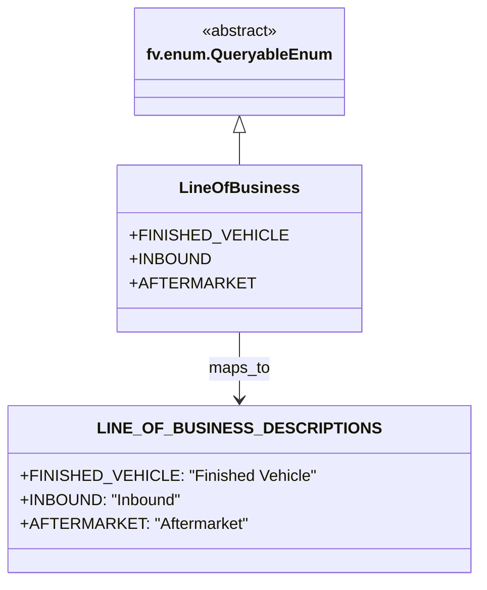

# Diagram: shipment_core/shipment_filter/shipment_filter/lambdas/fvshared/ng_searching.py

> Auto-generated by Obscura crawlers

## Mermaid

### SVG

<svg id="container" width="442.421875" xmlns="http://www.w3.org/2000/svg" class="classDiagram" height="584" viewBox="0 0 442.421875 584" role="graphics-document document" aria-roledescription="class"><g><defs><marker id="container_class-aggregationStart" class="marker aggregation class" refX="18" refY="7" markerWidth="190" markerHeight="240" orient="auto"><path d="M 18,7 L9,13 L1,7 L9,1 Z"></path></marker></defs><defs><marker id="container_class-aggregationEnd" class="marker aggregation class" refX="1" refY="7" markerWidth="20" markerHeight="28" orient="auto"><path d="M 18,7 L9,13 L1,7 L9,1 Z"></path></marker></defs><defs><marker id="container_class-extensionStart" class="marker extension class" refX="18" refY="7" markerWidth="190" markerHeight="240" orient="auto"><path d="M 1,7 L18,13 V 1 Z"></path></marker></defs><defs><marker id="container_class-extensionEnd" class="marker extension class" refX="1" refY="7" markerWidth="20" markerHeight="28" orient="auto"><path d="M 1,1 V 13 L18,7 Z"></path></marker></defs><defs><marker id="container_class-compositionStart" class="marker composition class" refX="18" refY="7" markerWidth="190" markerHeight="240" orient="auto"><path d="M 18,7 L9,13 L1,7 L9,1 Z"></path></marker></defs><defs><marker id="container_class-compositionEnd" class="marker composition class" refX="1" refY="7" markerWidth="20" markerHeight="28" orient="auto"><path d="M 18,7 L9,13 L1,7 L9,1 Z"></path></marker></defs><defs><marker id="container_class-dependencyStart" class="marker dependency class" refX="6" refY="7" markerWidth="190" markerHeight="240" orient="auto"><path d="M 5,7 L9,13 L1,7 L9,1 Z"></path></marker></defs><defs><marker id="container_class-dependencyEnd" class="marker dependency class" refX="13" refY="7" markerWidth="20" markerHeight="28" orient="auto"><path d="M 18,7 L9,13 L14,7 L9,1 Z"></path></marker></defs><defs><marker id="container_class-lollipopStart" class="marker lollipop class" refX="13" refY="7" markerWidth="190" markerHeight="240" orient="auto"><circle stroke="black" fill="transparent" cx="7" cy="7" r="6"></circle></marker></defs><defs><marker id="container_class-lollipopEnd" class="marker lollipop class" refX="1" refY="7" markerWidth="190" markerHeight="240" orient="auto"><circle stroke="black" fill="transparent" cx="7" cy="7" r="6"></circle></marker></defs><g class="root"><g class="clusters"></g><g class="edgePaths"><path d="M221.211,133.25L221.211,134.542C221.211,135.833,221.211,138.417,221.211,143.875C221.211,149.333,221.211,157.667,221.211,161.833L221.211,166" id="id_fv.enum.QueryableEnum_LineOfBusiness_1" class="edge-thickness-normal edge-pattern-solid relation" style=";;;" data-edge="true" data-et="edge" data-id="id_fv.enum.QueryableEnum_LineOfBusiness_1" data-points="W3sieCI6MjIxLjIxMDkzNzUsInkiOjExNn0seyJ4IjoyMjEuMjEwOTM3NSwieSI6MTQxfSx7IngiOjIyMS4yMTA5Mzc1LCJ5IjoxNjZ9XQ==" marker-start="url(#container_class-extensionStart)"></path><path d="M221.211,334L221.211,340.167C221.211,346.333,221.211,358.667,221.211,370C221.211,381.333,221.211,391.667,221.211,396.833L221.211,402" id="id_LineOfBusiness_LINE_OF_BUSINESS_DESCRIPTIONS_2" class="edge-thickness-normal edge-pattern-solid relation" style=";;;" data-edge="true" data-et="edge" data-id="id_LineOfBusiness_LINE_OF_BUSINESS_DESCRIPTIONS_2" data-points="W3sieCI6MjIxLjIxMDkzNzUsInkiOjMzNH0seyJ4IjoyMjEuMjEwOTM3NSwieSI6MzcxfSx7IngiOjIyMS4yMTA5Mzc1LCJ5Ijo0MDh9XQ==" marker-end="url(#container_class-dependencyEnd)"></path></g><g class="edgeLabels"><g class="edgeLabel"><g class="label" data-id="id_fv.enum.QueryableEnum_LineOfBusiness_1" transform="translate(0, 0)"><foreignObject width="0" height="0">

</foreignObject></g></g><g class="edgeLabel" transform="translate(221.2109375, 371)"><g class="label" data-id="id_LineOfBusiness_LINE_OF_BUSINESS_DESCRIPTIONS_2" transform="translate(-30.9765625, -12)"><foreignObject width="61.953125" height="24">

maps_to

</foreignObject></g></g></g><g class="nodes"><g class="node default" id="classId-fv.enum.QueryableEnum-0" transform="translate(221.2109375, 62)"><g class="basic label-container"><path d="M-100.28125 -54 L100.28125 -54 L100.28125 54 L-100.28125 54" stroke="none" stroke-width="0" fill="#ECECFF" style=""></path><path d="M-100.28125 -54 C-35.913559927177886 -54, 28.45413014564423 -54, 100.28125 -54 M-100.28125 -54 C-38.690387383490105 -54, 22.90047523301979 -54, 100.28125 -54 M100.28125 -54 C100.28125 -31.129200532899468, 100.28125 -8.258401065798935, 100.28125 54 M100.28125 -54 C100.28125 -15.565450367296862, 100.28125 22.869099265406277, 100.28125 54 M100.28125 54 C38.28322562273392 54, -23.714798754532154 54, -100.28125 54 M100.28125 54 C48.36108854359042 54, -3.559072912819161 54, -100.28125 54 M-100.28125 54 C-100.28125 21.843094344235595, -100.28125 -10.31381131152881, -100.28125 -54 M-100.28125 54 C-100.28125 21.009638609640348, -100.28125 -11.980722780719304, -100.28125 -54" stroke="#9370DB" stroke-width="1.3" fill="none" stroke-dasharray="0 0" style=""></path></g><g class="annotation-group text" transform="translate(-38.609375, -30)"><g class="label" style="" transform="translate(0,-12)"><foreignObject width="77.21875" height="24">

«abstract»

</foreignObject></g></g><g class="label-group text" transform="translate(-88.28125, -6)"><g class="label" style="font-weight: bolder" transform="translate(0,-12)"><foreignObject width="176.5625" height="24">

fv.enum.QueryableEnum

</foreignObject></g></g><g class="members-group text" transform="translate(-88.28125, 42)"></g><g class="methods-group text" transform="translate(-88.28125, 72)"></g><g class="divider" style=""><path d="M-100.28125 18 C-58.15546042020089 18, -16.029670840401778 18, 100.28125 18 M-100.28125 18 C-22.768230147437123 18, 54.744789705125754 18, 100.28125 18" stroke="#9370DB" stroke-width="1.3" fill="none" stroke-dasharray="0 0" style=""></path></g><g class="divider" style=""><path d="M-100.28125 36 C-32.37412293727428 36, 35.53300412545144 36, 100.28125 36 M-100.28125 36 C-26.088487976157836 36, 48.10427404768433 36, 100.28125 36" stroke="#9370DB" stroke-width="1.3" fill="none" stroke-dasharray="0 0" style=""></path></g></g><g class="node default" id="classId-LineOfBusiness-1" transform="translate(221.2109375, 250)"><g class="basic label-container"><path d="M-110.109375 -84 L110.109375 -84 L110.109375 84 L-110.109375 84" stroke="none" stroke-width="0" fill="#ECECFF" style=""></path><path d="M-110.109375 -84 C-63.2289150884377 -84, -16.348455176875405 -84, 110.109375 -84 M-110.109375 -84 C-22.342677730706995 -84, 65.42401953858601 -84, 110.109375 -84 M110.109375 -84 C110.109375 -49.29424315939429, 110.109375 -14.588486318788583, 110.109375 84 M110.109375 -84 C110.109375 -38.87743280512428, 110.109375 6.245134389751442, 110.109375 84 M110.109375 84 C52.97723630585419 84, -4.154902388291617 84, -110.109375 84 M110.109375 84 C33.424314183571724 84, -43.26074663285655 84, -110.109375 84 M-110.109375 84 C-110.109375 26.78716868895566, -110.109375 -30.42566262208868, -110.109375 -84 M-110.109375 84 C-110.109375 46.51905961594693, -110.109375 9.038119231893859, -110.109375 -84" stroke="#9370DB" stroke-width="1.3" fill="none" stroke-dasharray="0 0" style=""></path></g><g class="annotation-group text" transform="translate(0, -60)"></g><g class="label-group text" transform="translate(-56.109375, -60)"><g class="label" style="font-weight: bolder" transform="translate(0,-12)"><foreignObject width="112.21875" height="24">

LineOfBusiness

</foreignObject></g></g><g class="members-group text" transform="translate(-98.109375, -12)"><g class="label" style="" transform="translate(0,-12)"><foreignObject width="140.109375" height="24">

+FINISHED_VEHICLE

</foreignObject></g><g class="label" style="" transform="translate(0,12)"><foreignObject width="76.265625" height="24">

+INBOUND

</foreignObject></g><g class="label" style="" transform="translate(0,36)"><foreignObject width="108.921875" height="24">

+AFTERMARKET

</foreignObject></g></g><g class="methods-group text" transform="translate(-98.109375, 84)"></g><g class="divider" style=""><path d="M-110.109375 -36 C-61.124565077158096 -36, -12.139755154316191 -36, 110.109375 -36 M-110.109375 -36 C-53.937441738505186 -36, 2.2344915229896287 -36, 110.109375 -36" stroke="#9370DB" stroke-width="1.3" fill="none" stroke-dasharray="0 0" style=""></path></g><g class="divider" style=""><path d="M-110.109375 60 C-43.067949145735966 60, 23.973476708528068 60, 110.109375 60 M-110.109375 60 C-23.322582781996516 60, 63.46420943600697 60, 110.109375 60" stroke="#9370DB" stroke-width="1.3" fill="none" stroke-dasharray="0 0" style=""></path></g></g><g class="node default" id="classId-LINE_OF_BUSINESS_DESCRIPTIONS-2" transform="translate(221.2109375, 492)"><g class="basic label-container"><path d="M-213.2109375 -84 L213.2109375 -84 L213.2109375 84 L-213.2109375 84" stroke="none" stroke-width="0" fill="#ECECFF" style=""></path><path d="M-213.2109375 -84 C-47.369251590757926 -84, 118.47243431848415 -84, 213.2109375 -84 M-213.2109375 -84 C-58.110101356725266 -84, 96.99073478654947 -84, 213.2109375 -84 M213.2109375 -84 C213.2109375 -47.123767622510165, 213.2109375 -10.24753524502033, 213.2109375 84 M213.2109375 -84 C213.2109375 -46.900019382295206, 213.2109375 -9.800038764590411, 213.2109375 84 M213.2109375 84 C77.91075853630426 84, -57.389420427391485 84, -213.2109375 84 M213.2109375 84 C112.39577414744436 84, 11.580610794888713 84, -213.2109375 84 M-213.2109375 84 C-213.2109375 33.941852650700795, -213.2109375 -16.11629469859841, -213.2109375 -84 M-213.2109375 84 C-213.2109375 32.11789024537672, -213.2109375 -19.76421950924656, -213.2109375 -84" stroke="#9370DB" stroke-width="1.3" fill="none" stroke-dasharray="0 0" style=""></path></g><g class="annotation-group text" transform="translate(0, -60)"></g><g class="label-group text" transform="translate(-124.484375, -60)"><g class="label" style="font-weight: bolder" transform="translate(0,-12)"><foreignObject width="248.96875" height="24">

LINE_OF_BUSINESS_DESCRIPTIONS

</foreignObject></g></g><g class="members-group text" transform="translate(-201.2109375, -12)"><g class="label" style="" transform="translate(0,-12)"><foreignObject width="277.9375" height="24">

+FINISHED_VEHICLE: "Finished Vehicle"

</foreignObject></g><g class="label" style="" transform="translate(0,12)"><foreignObject width="158.3125" height="24">

+INBOUND: "Inbound"

</foreignObject></g><g class="label" style="" transform="translate(0,36)"><foreignObject width="214.5" height="24">

+AFTERMARKET: "Aftermarket"

</foreignObject></g></g><g class="methods-group text" transform="translate(-201.2109375, 84)"></g><g class="divider" style=""><path d="M-213.2109375 -36 C-67.08465436875116 -36, 79.04162876249768 -36, 213.2109375 -36 M-213.2109375 -36 C-46.8835706786885 -36, 119.443796142623 -36, 213.2109375 -36" stroke="#9370DB" stroke-width="1.3" fill="none" stroke-dasharray="0 0" style=""></path></g><g class="divider" style=""><path d="M-213.2109375 60 C-62.54478375532943 60, 88.12136998934113 60, 213.2109375 60 M-213.2109375 60 C-97.63134593090072 60, 17.948245638198557 60, 213.2109375 60" stroke="#9370DB" stroke-width="1.3" fill="none" stroke-dasharray="0 0" style=""></path></g></g></g></g></g></svg>
