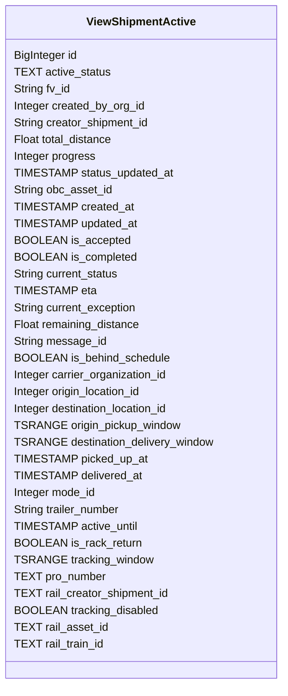

# Diagram: shipment_core/shipment_filter/shipment_filter/lambdas/fvshared/tables.py

> Auto-generated by Obscura crawlers

## Mermaid

### SVG

<svg id="container" width="396.5" xmlns="http://www.w3.org/2000/svg" class="classDiagram" height="976" viewBox="0 0 396.5 976" role="graphics-document document" aria-roledescription="class"><g><defs><marker id="container_class-aggregationStart" class="marker aggregation class" refX="18" refY="7" markerWidth="190" markerHeight="240" orient="auto"><path d="M 18,7 L9,13 L1,7 L9,1 Z"></path></marker></defs><defs><marker id="container_class-aggregationEnd" class="marker aggregation class" refX="1" refY="7" markerWidth="20" markerHeight="28" orient="auto"><path d="M 18,7 L9,13 L1,7 L9,1 Z"></path></marker></defs><defs><marker id="container_class-extensionStart" class="marker extension class" refX="18" refY="7" markerWidth="190" markerHeight="240" orient="auto"><path d="M 1,7 L18,13 V 1 Z"></path></marker></defs><defs><marker id="container_class-extensionEnd" class="marker extension class" refX="1" refY="7" markerWidth="20" markerHeight="28" orient="auto"><path d="M 1,1 V 13 L18,7 Z"></path></marker></defs><defs><marker id="container_class-compositionStart" class="marker composition class" refX="18" refY="7" markerWidth="190" markerHeight="240" orient="auto"><path d="M 18,7 L9,13 L1,7 L9,1 Z"></path></marker></defs><defs><marker id="container_class-compositionEnd" class="marker composition class" refX="1" refY="7" markerWidth="20" markerHeight="28" orient="auto"><path d="M 18,7 L9,13 L1,7 L9,1 Z"></path></marker></defs><defs><marker id="container_class-dependencyStart" class="marker dependency class" refX="6" refY="7" markerWidth="190" markerHeight="240" orient="auto"><path d="M 5,7 L9,13 L1,7 L9,1 Z"></path></marker></defs><defs><marker id="container_class-dependencyEnd" class="marker dependency class" refX="13" refY="7" markerWidth="20" markerHeight="28" orient="auto"><path d="M 18,7 L9,13 L14,7 L9,1 Z"></path></marker></defs><defs><marker id="container_class-lollipopStart" class="marker lollipop class" refX="13" refY="7" markerWidth="190" markerHeight="240" orient="auto"><circle stroke="black" fill="transparent" cx="7" cy="7" r="6"></circle></marker></defs><defs><marker id="container_class-lollipopEnd" class="marker lollipop class" refX="1" refY="7" markerWidth="190" markerHeight="240" orient="auto"><circle stroke="black" fill="transparent" cx="7" cy="7" r="6"></circle></marker></defs><g class="root"><g class="clusters"></g><g class="edgePaths"></g><g class="edgeLabels"></g><g class="nodes"><g class="node default" id="classId-ViewShipmentActive-0" transform="translate(198.25, 488)"><g class="basic label-container"><path d="M-190.25 -480 L190.25 -480 L190.25 480 L-190.25 480" stroke="none" stroke-width="0" fill="#ECECFF" style=""></path><path d="M-190.25 -480 C-91.22092370105821 -480, 7.808152597883577 -480, 190.25 -480 M-190.25 -480 C-86.64316663538884 -480, 16.963666729222325 -480, 190.25 -480 M190.25 -480 C190.25 -162.11798777902925, 190.25 155.7640244419415, 190.25 480 M190.25 -480 C190.25 -256.32110226589043, 190.25 -32.64220453178086, 190.25 480 M190.25 480 C93.4518959828735 480, -3.34620803425301 480, -190.25 480 M190.25 480 C47.01395849253794 480, -96.22208301492412 480, -190.25 480 M-190.25 480 C-190.25 218.42269311720645, -190.25 -43.1546137655871, -190.25 -480 M-190.25 480 C-190.25 101.67079740685256, -190.25 -276.6584051862949, -190.25 -480" stroke="#9370DB" stroke-width="1.3" fill="none" stroke-dasharray="0 0" style=""></path></g><g class="annotation-group text" transform="translate(0, -456)"></g><g class="label-group text" transform="translate(-74.6875, -456)"><g class="label" style="font-weight: bolder" transform="translate(0,-12)"><foreignObject width="149.375" height="24">

ViewShipmentActive

</foreignObject></g></g><g class="members-group text" transform="translate(-178.25, -408)"><g class="label" style="" transform="translate(0,-12)"><foreignObject width="92.203125" height="24">

BigInteger id

</foreignObject></g><g class="label" style="" transform="translate(0,12)"><foreignObject width="133.5625" height="24">

TEXT active_status

</foreignObject></g><g class="label" style="" transform="translate(0,36)"><foreignObject width="82.28125" height="24">

String fv_id

</foreignObject></g><g class="label" style="" transform="translate(0,60)"><foreignObject width="189.203125" height="24">

Integer created_by_org_id

</foreignObject></g><g class="label" style="" transform="translate(0,84)"><foreignObject width="196.6875" height="24">

String creator_shipment_id

</foreignObject></g><g class="label" style="" transform="translate(0,108)"><foreignObject width="143.34375" height="24">

Float total_distance

</foreignObject></g><g class="label" style="" transform="translate(0,132)"><foreignObject width="117.625" height="24">

Integer progress

</foreignObject></g><g class="label" style="" transform="translate(0,156)"><foreignObject width="220.3125" height="24">

TIMESTAMP status_updated_at

</foreignObject></g><g class="label" style="" transform="translate(0,180)"><foreignObject width="141.84375" height="24">

String obc_asset_id

</foreignObject></g><g class="label" style="" transform="translate(0,204)"><foreignObject width="161.75" height="24">

TIMESTAMP created_at

</foreignObject></g><g class="label" style="" transform="translate(0,228)"><foreignObject width="168.234375" height="24">

TIMESTAMP updated_at

</foreignObject></g><g class="label" style="" transform="translate(0,252)"><foreignObject width="157.8125" height="24">

BOOLEAN is_accepted

</foreignObject></g><g class="label" style="" transform="translate(0,276)"><foreignObject width="169.453125" height="24">

BOOLEAN is_completed

</foreignObject></g><g class="label" style="" transform="translate(0,300)"><foreignObject width="152.390625" height="24">

String current_status

</foreignObject></g><g class="label" style="" transform="translate(0,324)"><foreignObject width="107.921875" height="24">

TIMESTAMP eta

</foreignObject></g><g class="label" style="" transform="translate(0,348)"><foreignObject width="178.421875" height="24">

String current_exception

</foreignObject></g><g class="label" style="" transform="translate(0,372)"><foreignObject width="182.546875" height="24">

Float remaining_distance

</foreignObject></g><g class="label" style="" transform="translate(0,396)"><foreignObject width="131.59375" height="24">

String message_id

</foreignObject></g><g class="label" style="" transform="translate(0,420)"><foreignObject width="217.53125" height="24">

BOOLEAN is_behind_schedule

</foreignObject></g><g class="label" style="" transform="translate(0,444)"><foreignObject width="222.984375" height="24">

Integer carrier_organization_id

</foreignObject></g><g class="label" style="" transform="translate(0,468)"><foreignObject width="187.515625" height="24">

Integer origin_location_id

</foreignObject></g><g class="label" style="" transform="translate(0,492)"><foreignObject width="228.40625" height="24">

Integer destination_location_id

</foreignObject></g><g class="label" style="" transform="translate(0,516)"><foreignObject width="231.890625" height="24">

TSRANGE origin_pickup_window

</foreignObject></g><g class="label" style="" transform="translate(0,540)"><foreignObject width="281.8125" height="24">

TSRANGE destination_delivery_window

</foreignObject></g><g class="label" style="" transform="translate(0,564)"><foreignObject width="181.8125" height="24">

TIMESTAMP picked_up_at

</foreignObject></g><g class="label" style="" transform="translate(0,588)"><foreignObject width="175.3125" height="24">

TIMESTAMP delivered_at

</foreignObject></g><g class="label" style="" transform="translate(0,612)"><foreignObject width="118.984375" height="24">

Integer mode_id

</foreignObject></g><g class="label" style="" transform="translate(0,636)"><foreignObject width="155.078125" height="24">

String trailer_number

</foreignObject></g><g class="label" style="" transform="translate(0,660)"><foreignObject width="169.359375" height="24">

TIMESTAMP active_until

</foreignObject></g><g class="label" style="" transform="translate(0,684)"><foreignObject width="176.265625" height="24">

BOOLEAN is_rack_return

</foreignObject></g><g class="label" style="" transform="translate(0,708)"><foreignObject width="191.296875" height="24">

TSRANGE tracking_window

</foreignObject></g><g class="label" style="" transform="translate(0,732)"><foreignObject width="127.34375" height="24">

TEXT pro_number

</foreignObject></g><g class="label" style="" transform="translate(0,756)"><foreignObject width="219.0625" height="24">

TEXT rail_creator_shipment_id

</foreignObject></g><g class="label" style="" transform="translate(0,780)"><foreignObject width="201.453125" height="24">

BOOLEAN tracking_disabled

</foreignObject></g><g class="label" style="" transform="translate(0,804)"><foreignObject width="129.734375" height="24">

TEXT rail_asset_id

</foreignObject></g><g class="label" style="" transform="translate(0,828)"><foreignObject width="125.890625" height="24">

TEXT rail_train_id

</foreignObject></g></g><g class="methods-group text" transform="translate(-178.25, 480)"></g><g class="divider" style=""><path d="M-190.25 -432 C-82.64579393328343 -432, 24.958412133433143 -432, 190.25 -432 M-190.25 -432 C-46.258403094538096 -432, 97.73319381092381 -432, 190.25 -432" stroke="#9370DB" stroke-width="1.3" fill="none" stroke-dasharray="0 0" style=""></path></g><g class="divider" style=""><path d="M-190.25 456 C-82.95529903020322 456, 24.339401939593557 456, 190.25 456 M-190.25 456 C-100.28080036139782 456, -10.311600722795646 456, 190.25 456" stroke="#9370DB" stroke-width="1.3" fill="none" stroke-dasharray="0 0" style=""></path></g></g></g></g></g></svg>
