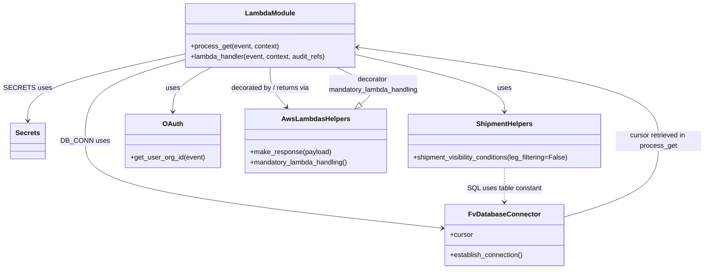

# Diagram: shipment_core/shipment_filter/shipment_filter/lambdas/search_criteria/get_train_ids.py


> Auto-generated by Obscura crawlers

## Diagram 1



### SVG

<svg id="container" width="1638.68359375" xmlns="http://www.w3.org/2000/svg" class="classDiagram" height="632" viewBox="0 0 1638.68359375 632" role="graphics-document document" aria-roledescription="class"><style>#container{font-family:"trebuchet ms",verdana,arial,sans-serif;font-size:16px;fill:#333;}@keyframes edge-animation-frame{from{stroke-dashoffset:0;}}@keyframes dash{to{stroke-dashoffset:0;}}#container .edge-animation-slow{stroke-dasharray:9,5!important;stroke-dashoffset:900;animation:dash 50s linear infinite;stroke-linecap:round;}#container .edge-animation-fast{stroke-dasharray:9,5!important;stroke-dashoffset:900;animation:dash 20s linear infinite;stroke-linecap:round;}#container .error-icon{fill:#552222;}#container .error-text{fill:#552222;stroke:#552222;}#container .edge-thickness-normal{stroke-width:1px;}#container .edge-thickness-thick{stroke-width:3.5px;}#container .edge-pattern-solid{stroke-dasharray:0;}#container .edge-thickness-invisible{stroke-width:0;fill:none;}#container .edge-pattern-dashed{stroke-dasharray:3;}#container .edge-pattern-dotted{stroke-dasharray:2;}#container .marker{fill:#333333;stroke:#333333;}#container .marker.cross{stroke:#333333;}#container svg{font-family:"trebuchet ms",verdana,arial,sans-serif;font-size:16px;}#container p{margin:0;}#container g.classGroup text{fill:#9370DB;stroke:none;font-family:"trebuchet ms",verdana,arial,sans-serif;font-size:10px;}#container g.classGroup text .title{font-weight:bolder;}#container .nodeLabel,#container .edgeLabel{color:#131300;}#container .edgeLabel .label rect{fill:#ECECFF;}#container .label text{fill:#131300;}#container .labelBkg{background:#ECECFF;}#container .edgeLabel .label span{background:#ECECFF;}#container .classTitle{font-weight:bolder;}#container .node rect,#container .node circle,#container .node ellipse,#container .node polygon,#container .node path{fill:#ECECFF;stroke:#9370DB;stroke-width:1px;}#container .divider{stroke:#9370DB;stroke-width:1;}#container g.clickable{cursor:pointer;}#container g.classGroup rect{fill:#ECECFF;stroke:#9370DB;}#container g.classGroup line{stroke:#9370DB;stroke-width:1;}#container .classLabel .box{stroke:none;stroke-width:0;fill:#ECECFF;opacity:0.5;}#container .classLabel .label{fill:#9370DB;font-size:10px;}#container .relation{stroke:#333333;stroke-width:1;fill:none;}#container .dashed-line{stroke-dasharray:3;}#container .dotted-line{stroke-dasharray:1 2;}#container #compositionStart,#container .composition{fill:#333333!important;stroke:#333333!important;stroke-width:1;}#container #compositionEnd,#container .composition{fill:#333333!important;stroke:#333333!important;stroke-width:1;}#container #dependencyStart,#container .dependency{fill:#333333!important;stroke:#333333!important;stroke-width:1;}#container #dependencyStart,#container .dependency{fill:#333333!important;stroke:#333333!important;stroke-width:1;}#container #extensionStart,#container .extension{fill:transparent!important;stroke:#333333!important;stroke-width:1;}#container #extensionEnd,#container .extension{fill:transparent!important;stroke:#333333!important;stroke-width:1;}#container #aggregationStart,#container .aggregation{fill:transparent!important;stroke:#333333!important;stroke-width:1;}#container #aggregationEnd,#container .aggregation{fill:transparent!important;stroke:#333333!important;stroke-width:1;}#container #lollipopStart,#container .lollipop{fill:#ECECFF!important;stroke:#333333!important;stroke-width:1;}#container #lollipopEnd,#container .lollipop{fill:#ECECFF!important;stroke:#333333!important;stroke-width:1;}#container .edgeTerminals{font-size:11px;line-height:initial;}#container .classTitleText{text-anchor:middle;font-size:18px;fill:#333;}#container .label-icon{display:inline-block;height:1em;overflow:visible;vertical-align:-0.125em;}#container .node .label-icon path{fill:currentColor;stroke:revert;stroke-width:revert;}#container :root{--mermaid-font-family:"trebuchet ms",verdana,arial,sans-serif;}</style><g><defs><marker id="container_class-aggregationStart" class="marker aggregation class" refX="18" refY="7" markerWidth="190" markerHeight="240" orient="auto"><path d="M 18,7 L9,13 L1,7 L9,1 Z"></path></marker></defs><defs><marker id="container_class-aggregationEnd" class="marker aggregation class" refX="1" refY="7" markerWidth="20" markerHeight="28" orient="auto"><path d="M 18,7 L9,13 L1,7 L9,1 Z"></path></marker></defs><defs><marker id="container_class-extensionStart" class="marker extension class" refX="18" refY="7" markerWidth="190" markerHeight="240" orient="auto"><path d="M 1,7 L18,13 V 1 Z"></path></marker></defs><defs><marker id="container_class-extensionEnd" class="marker extension class" refX="1" refY="7" markerWidth="20" markerHeight="28" orient="auto"><path d="M 1,1 V 13 L18,7 Z"></path></marker></defs><defs><marker id="container_class-compositionStart" class="marker composition class" refX="18" refY="7" markerWidth="190" markerHeight="240" orient="auto"><path d="M 18,7 L9,13 L1,7 L9,1 Z"></path></marker></defs><defs><marker id="container_class-compositionEnd" class="marker composition class" refX="1" refY="7" markerWidth="20" markerHeight="28" orient="auto"><path d="M 18,7 L9,13 L1,7 L9,1 Z"></path></marker></defs><defs><marker id="container_class-dependencyStart" class="marker dependency class" refX="6" refY="7" markerWidth="190" markerHeight="240" orient="auto"><path d="M 5,7 L9,13 L1,7 L9,1 Z"></path></marker></defs><defs><marker id="container_class-dependencyEnd" class="marker dependency class" refX="13" refY="7" markerWidth="20" markerHeight="28" orient="auto"><path d="M 18,7 L9,13 L14,7 L9,1 Z"></path></marker></defs><defs><marker id="container_class-lollipopStart" class="marker lollipop class" refX="13" refY="7" markerWidth="190" markerHeight="240" orient="auto"><circle stroke="black" fill="transparent" cx="7" cy="7" r="6"></circle></marker></defs><defs><marker id="container_class-lollipopEnd" class="marker lollipop class" refX="1" refY="7" markerWidth="190" markerHeight="240" orient="auto"><circle stroke="black" fill="transparent" cx="7" cy="7" r="6"></circle></marker></defs><g class="root"><g class="clusters"></g><g class="edgePaths"><path d="M410.16,141.389L372.525,152.324C334.891,163.259,259.621,185.13,221.986,216.731C184.352,248.333,184.352,289.667,184.352,329C184.352,368.333,184.352,405.667,324.042,439.833C463.732,473.998,743.113,504.997,882.803,520.496L1022.494,535.995" id="id_LambdaModule_FvDatabaseConnector_1" class="edge-thickness-normal edge-pattern-solid relation" style=";;;" data-edge="true" data-et="edge" data-id="id_LambdaModule_FvDatabaseConnector_1" data-points="W3sieCI6NDEwLjE2MDE1NjI1LCJ5IjoxNDEuMzg4OTk0MTUxMDgzM30seyJ4IjoxODQuMzUxNTYyNSwieSI6MjA3fSx7IngiOjE4NC4zNTE1NjI1LCJ5IjozMzF9LHsieCI6MTg0LjM1MTU2MjUsInkiOjQ0M30seyJ4IjoxMDI4LjQ1NzAzMTI1LCJ5Ijo1MzYuNjU2NzMyNjE5NzI1NX1d" marker-end="url(#container_class-dependencyEnd)"></path><path d="M410.16,127.977L351.316,141.148C292.471,154.318,174.783,180.659,115.938,206.496C57.094,232.333,57.094,257.667,57.094,270.333L57.094,283" id="id_LambdaModule_Secrets_2" class="edge-thickness-normal edge-pattern-solid relation" style=";;;" data-edge="true" data-et="edge" data-id="id_LambdaModule_Secrets_2" data-points="W3sieCI6NDEwLjE2MDE1NjI1LCJ5IjoxMjcuOTc3MDkyMTMyMDc0NTV9LHsieCI6NTcuMDkzNzUsInkiOjIwN30seyJ4Ijo1Ny4wOTM3NSwieSI6Mjg5fV0=" marker-end="url(#container_class-dependencyEnd)"></path><path d="M812.066,127.847L871.179,141.039C930.292,154.231,1048.517,180.616,1107.63,202.974C1166.742,225.333,1166.742,243.667,1166.742,252.833L1166.742,262" id="id_LambdaModule_ShipmentHelpers_3" class="edge-thickness-normal edge-pattern-solid relation" style=";;;" data-edge="true" data-et="edge" data-id="id_LambdaModule_ShipmentHelpers_3" data-points="W3sieCI6ODEyLjA2NjQwNjI1LCJ5IjoxMjcuODQ2ODE2MzE4NzgyOTF9LHsieCI6MTE2Ni43NDIxODc1LCJ5IjoyMDd9LHsieCI6MTE2Ni43NDIxODc1LCJ5IjoyNjh9XQ==" marker-end="url(#container_class-dependencyEnd)"></path><path d="M472.858,158L457.804,166.167C442.749,174.333,412.64,190.667,397.586,208C382.531,225.333,382.531,243.667,382.531,252.833L382.531,262" id="id_LambdaModule_OAuth_4" class="edge-thickness-normal edge-pattern-solid relation" style=";;;" data-edge="true" data-et="edge" data-id="id_LambdaModule_OAuth_4" data-points="W3sieCI6NDcyLjg1ODAyMDQxMzMwNjQ2LCJ5IjoxNTh9LHsieCI6MzgyLjUzMTI1LCJ5IjoyMDd9LHsieCI6MzgyLjUzMTI1LCJ5IjoyNjh9XQ==" marker-end="url(#container_class-dependencyEnd)"></path><path d="M611.113,158L611.113,166.167C611.113,174.333,611.113,190.667,617.742,206.254C624.37,221.842,637.627,236.683,644.255,244.104L650.884,251.525" id="id_LambdaModule_AwsLambdasHelpers_5" class="edge-thickness-normal edge-pattern-solid relation" style=";;;" data-edge="true" data-et="edge" data-id="id_LambdaModule_AwsLambdasHelpers_5" data-points="W3sieCI6NjExLjExMzI4MTI1LCJ5IjoxNTh9LHsieCI6NjExLjExMzI4MTI1LCJ5IjoyMDd9LHsieCI6NjU0Ljg4MDQ4MTM1MDgwNjUsInkiOjI1Nn1d" marker-end="url(#container_class-dependencyEnd)"></path><path d="M1305.027,510.584L1342.637,499.32C1380.246,488.056,1455.465,465.528,1493.074,435.597C1530.684,405.667,1530.684,368.333,1530.684,329C1530.684,289.667,1530.684,248.333,1411.905,211.65C1293.127,174.966,1055.57,142.933,936.791,126.916L818.013,110.899" id="id_FvDatabaseConnector_LambdaModule_6" class="edge-thickness-normal edge-pattern-solid relation" style=";;;" data-edge="true" data-et="edge" data-id="id_FvDatabaseConnector_LambdaModule_6" data-points="W3sieCI6MTMwNS4wMjczNDM3NSwieSI6NTEwLjU4Mzc2NzEzMjg0NDZ9LHsieCI6MTUzMC42ODM1OTM3NSwieSI6NDQzfSx7IngiOjE1MzAuNjgzNTkzNzUsInkiOjMzMX0seyJ4IjoxNTMwLjY4MzU5Mzc1LCJ5IjoyMDd9LHsieCI6ODEyLjA2NjQwNjI1LCJ5IjoxMTAuMDk3NjQyNDExMTEyNTN9XQ==" marker-end="url(#container_class-dependencyEnd)"></path><path d="M1166.742,394L1166.742,402.167C1166.742,410.333,1166.742,426.667,1166.742,440C1166.742,453.333,1166.742,463.667,1166.742,468.833L1166.742,474" id="id_ShipmentHelpers_FvDatabaseConnector_7" class="edge-thickness-normal edge-pattern-dashed relation" style=";;;" data-edge="true" data-et="edge" data-id="id_ShipmentHelpers_FvDatabaseConnector_7" data-points="W3sieCI6MTE2Ni43NDIxODc1LCJ5IjozOTR9LHsieCI6MTE2Ni43NDIxODc1LCJ5Ijo0NDN9LHsieCI6MTE2Ni43NDIxODc1LCJ5Ijo0ODB9XQ==" marker-end="url(#container_class-dependencyEnd)"></path><path d="M826.379,245.042L834.088,238.702C841.796,232.361,857.214,219.681,847.699,205.174C838.184,190.667,803.736,174.333,786.513,166.167L769.289,158" id="id_AwsLambdasHelpers_LambdaModule_8" class="edge-thickness-normal edge-pattern-solid relation" style=";;;" data-edge="true" data-et="edge" data-id="id_AwsLambdasHelpers_LambdaModule_8" data-points="W3sieCI6ODEzLjA1NjQzNTg2MTg5NTEsInkiOjI1Nn0seyJ4Ijo4NzIuNjMwODU5Mzc1LCJ5IjoyMDd9LHsieCI6NzY5LjI4OTIzNTc2MTA4ODgsInkiOjE1OH1d" marker-start="url(#container_class-extensionStart)"></path></g><g class="edgeLabels"><g class="edgeLabel" transform="translate(184.3515625, 331)"><g class="label" data-id="id_LambdaModule_FvDatabaseConnector_1" transform="translate(-53.09375, -12)"><foreignObject width="106.1875" height="24"><div xmlns="http://www.w3.org/1999/xhtml" class="labelBkg" style="display: table-cell; white-space: nowrap; line-height: 1.5; max-width: 200px; text-align: center;"><span class="edgeLabel"><p>DB_CONN uses</p></span></div></foreignObject></g></g><g class="edgeLabel" transform="translate(57.09375, 207)"><g class="label" data-id="id_LambdaModule_Secrets_2" transform="translate(-49.09375, -12)"><foreignObject width="98.1875" height="24"><div xmlns="http://www.w3.org/1999/xhtml" class="labelBkg" style="display: table-cell; white-space: nowrap; line-height: 1.5; max-width: 200px; text-align: center;"><span class="edgeLabel"><p>SECRETS uses</p></span></div></foreignObject></g></g><g class="edgeLabel" transform="translate(1166.7421875, 207)"><g class="label" data-id="id_LambdaModule_ShipmentHelpers_3" transform="translate(-16.4921875, -12)"><foreignObject width="32.984375" height="24"><div xmlns="http://www.w3.org/1999/xhtml" class="labelBkg" style="display: table-cell; white-space: nowrap; line-height: 1.5; max-width: 200px; text-align: center;"><span class="edgeLabel"><p>uses</p></span></div></foreignObject></g></g><g class="edgeLabel" transform="translate(382.53125, 207)"><g class="label" data-id="id_LambdaModule_OAuth_4" transform="translate(-16.4921875, -12)"><foreignObject width="32.984375" height="24"><div xmlns="http://www.w3.org/1999/xhtml" class="labelBkg" style="display: table-cell; white-space: nowrap; line-height: 1.5; max-width: 200px; text-align: center;"><span class="edgeLabel"><p>uses</p></span></div></foreignObject></g></g><g class="edgeLabel" transform="translate(611.11328125, 207)"><g class="label" data-id="id_LambdaModule_AwsLambdasHelpers_5" transform="translate(-94.65625, -12)"><foreignObject width="189.3125" height="24"><div xmlns="http://www.w3.org/1999/xhtml" class="labelBkg" style="display: table-cell; white-space: nowrap; line-height: 1.5; max-width: 200px; text-align: center;"><span class="edgeLabel"><p>decorated by / returns via</p></span></div></foreignObject></g></g><g class="edgeLabel" transform="translate(1530.68359375, 331)"><g class="label" data-id="id_FvDatabaseConnector_LambdaModule_6" transform="translate(-100, -24)"><foreignObject width="200" height="48"><div xmlns="http://www.w3.org/1999/xhtml" class="labelBkg" style="display: table; white-space: break-spaces; line-height: 1.5; max-width: 200px; text-align: center; width: 200px;"><span class="edgeLabel"><p>cursor retrieved in process_get</p></span></div></foreignObject></g></g><g class="edgeLabel" transform="translate(1166.7421875, 443)"><g class="label" data-id="id_ShipmentHelpers_FvDatabaseConnector_7" transform="translate(-86.84375, -12)"><foreignObject width="173.6875" height="24"><div xmlns="http://www.w3.org/1999/xhtml" class="labelBkg" style="display: table-cell; white-space: nowrap; line-height: 1.5; max-width: 200px; text-align: center;"><span class="edgeLabel"><p>SQL uses table constant</p></span></div></foreignObject></g></g><g class="edgeLabel" transform="translate(855.80949, 199.02405)"><g class="label" data-id="id_AwsLambdasHelpers_LambdaModule_8" transform="translate(-106.859375, -24)"><foreignObject width="213.71875" height="48"><div xmlns="http://www.w3.org/1999/xhtml" class="labelBkg" style="display: table; white-space: break-spaces; line-height: 1.5; max-width: 200px; text-align: center; width: 200px;"><span class="edgeLabel"><p>decorator mandatory_lambda_handling</p></span></div></foreignObject></g></g></g><g class="nodes"><g class="node default" id="classId-LambdaModule-0" transform="translate(611.11328125, 83)"><g class="basic label-container"><path d="M-200.953125 -75 L200.953125 -75 L200.953125 75 L-200.953125 75" stroke="none" stroke-width="0" fill="#ECECFF" style=""></path><path d="M-200.953125 -75 C-75.41561321582756 -75, 50.121898568344875 -75, 200.953125 -75 M-200.953125 -75 C-109.33481715539754 -75, -17.71650931079509 -75, 200.953125 -75 M200.953125 -75 C200.953125 -24.041500148839404, 200.953125 26.916999702321192, 200.953125 75 M200.953125 -75 C200.953125 -23.790714926502595, 200.953125 27.41857014699481, 200.953125 75 M200.953125 75 C78.6646732056376 75, -43.623778588724804 75, -200.953125 75 M200.953125 75 C119.58685962300513 75, 38.22059424601025 75, -200.953125 75 M-200.953125 75 C-200.953125 20.492479868076316, -200.953125 -34.01504026384737, -200.953125 -75 M-200.953125 75 C-200.953125 24.627839106341156, -200.953125 -25.744321787317688, -200.953125 -75" stroke="#9370DB" stroke-width="1.3" fill="none" stroke-dasharray="0 0" style=""></path></g><g class="annotation-group text" transform="translate(0, -51)"></g><g class="label-group text" transform="translate(-56.21875, -51)"><g class="label" style="font-weight: bolder" transform="translate(0,-12)"><foreignObject width="112.4375" height="24"><div xmlns="http://www.w3.org/1999/xhtml" style="display: table-cell; white-space: nowrap; line-height: 1.5; max-width: 162px; text-align: center;"><span class="nodeLabel markdown-node-label" style=""><p>LambdaModule</p></span></div></foreignObject></g></g><g class="members-group text" transform="translate(-188.953125, -3)"></g><g class="methods-group text" transform="translate(-188.953125, 27)"><g class="label" style="" transform="translate(0,-12)"><foreignObject width="206.609375" height="24"><div xmlns="http://www.w3.org/1999/xhtml" style="display: table-cell; white-space: nowrap; line-height: 1.5; max-width: 264px; text-align: center;"><span class="nodeLabel markdown-node-label" style=""><p>+process_get(event, context)</p></span></div></foreignObject></g><g class="label" style="" transform="translate(0,12)"><foreignObject width="321.6875" height="24"><div xmlns="http://www.w3.org/1999/xhtml" style="display: table-cell; white-space: nowrap; line-height: 1.5; max-width: 379px; text-align: center;"><span class="nodeLabel markdown-node-label" style=""><p>+lambda_handler(event, context, audit_refs)</p></span></div></foreignObject></g></g><g class="divider" style=""><path d="M-200.953125 -27 C-65.95967685908022 -27, 69.03377128183956 -27, 200.953125 -27 M-200.953125 -27 C-82.29309597607622 -27, 36.36693304784757 -27, 200.953125 -27" stroke="#9370DB" stroke-width="1.3" fill="none" stroke-dasharray="0 0" style=""></path></g><g class="divider" style=""><path d="M-200.953125 -3 C-119.28005460098245 -3, -37.606984201964906 -3, 200.953125 -3 M-200.953125 -3 C-53.525038155735444 -3, 93.90304868852911 -3, 200.953125 -3" stroke="#9370DB" stroke-width="1.3" fill="none" stroke-dasharray="0 0" style=""></path></g></g><g class="node default" id="classId-FvDatabaseConnector-1" transform="translate(1166.7421875, 552)"><g class="basic label-container"><path d="M-138.28515625 -72 L138.28515625 -72 L138.28515625 72 L-138.28515625 72" stroke="none" stroke-width="0" fill="#ECECFF" style=""></path><path d="M-138.28515625 -72 C-55.0024376073341 -72, 28.280281035331797 -72, 138.28515625 -72 M-138.28515625 -72 C-51.85236559873789 -72, 34.58042505252422 -72, 138.28515625 -72 M138.28515625 -72 C138.28515625 -21.87861528458599, 138.28515625 28.24276943082802, 138.28515625 72 M138.28515625 -72 C138.28515625 -37.129088729758195, 138.28515625 -2.2581774595163893, 138.28515625 72 M138.28515625 72 C42.7446154050068 72, -52.795925439986405 72, -138.28515625 72 M138.28515625 72 C31.620770792979428 72, -75.04361466404114 72, -138.28515625 72 M-138.28515625 72 C-138.28515625 22.77222591964415, -138.28515625 -26.4555481607117, -138.28515625 -72 M-138.28515625 72 C-138.28515625 21.529672654014462, -138.28515625 -28.940654691971076, -138.28515625 -72" stroke="#9370DB" stroke-width="1.3" fill="none" stroke-dasharray="0 0" style=""></path></g><g class="annotation-group text" transform="translate(0, -48)"></g><g class="label-group text" transform="translate(-79.3046875, -48)"><g class="label" style="font-weight: bolder" transform="translate(0,-12)"><foreignObject width="158.609375" height="24"><div xmlns="http://www.w3.org/1999/xhtml" style="display: table-cell; white-space: nowrap; line-height: 1.5; max-width: 207px; text-align: center;"><span class="nodeLabel markdown-node-label" style=""><p>FvDatabaseConnector</p></span></div></foreignObject></g></g><g class="members-group text" transform="translate(-126.28515625, 0)"><g class="label" style="" transform="translate(0,-12)"><foreignObject width="53.71875" height="24"><div xmlns="http://www.w3.org/1999/xhtml" style="display: table-cell; white-space: nowrap; line-height: 1.5; max-width: 112px; text-align: center;"><span class="nodeLabel markdown-node-label" style=""><p>+cursor</p></span></div></foreignObject></g></g><g class="methods-group text" transform="translate(-126.28515625, 48)"><g class="label" style="" transform="translate(0,-12)"><foreignObject width="173.265625" height="24"><div xmlns="http://www.w3.org/1999/xhtml" style="display: table-cell; white-space: nowrap; line-height: 1.5; max-width: 231px; text-align: center;"><span class="nodeLabel markdown-node-label" style=""><p>+establish_connection()</p></span></div></foreignObject></g></g><g class="divider" style=""><path d="M-138.28515625 -24 C-38.5856996438433 -24, 61.1137569623134 -24, 138.28515625 -24 M-138.28515625 -24 C-70.97010485387112 -24, -3.655053457742241 -24, 138.28515625 -24" stroke="#9370DB" stroke-width="1.3" fill="none" stroke-dasharray="0 0" style=""></path></g><g class="divider" style=""><path d="M-138.28515625 24 C-58.13404056474664 24, 22.017075120506718 24, 138.28515625 24 M-138.28515625 24 C-67.4507674613991 24, 3.3836213272018085 24, 138.28515625 24" stroke="#9370DB" stroke-width="1.3" fill="none" stroke-dasharray="0 0" style=""></path></g></g><g class="node default" id="classId-Secrets-2" transform="translate(57.09375, 331)"><g class="basic label-container"><path d="M-39.1640625 -42 L39.1640625 -42 L39.1640625 42 L-39.1640625 42" stroke="none" stroke-width="0" fill="#ECECFF" style=""></path><path d="M-39.1640625 -42 C-12.509368465187869 -42, 14.145325569624262 -42, 39.1640625 -42 M-39.1640625 -42 C-20.284057368224126 -42, -1.4040522364482513 -42, 39.1640625 -42 M39.1640625 -42 C39.1640625 -22.61605386280656, 39.1640625 -3.232107725613119, 39.1640625 42 M39.1640625 -42 C39.1640625 -12.249340160143838, 39.1640625 17.501319679712324, 39.1640625 42 M39.1640625 42 C13.897993553280035 42, -11.36807539343993 42, -39.1640625 42 M39.1640625 42 C22.247029339695036 42, 5.329996179390072 42, -39.1640625 42 M-39.1640625 42 C-39.1640625 21.114354705593936, -39.1640625 0.22870941118787158, -39.1640625 -42 M-39.1640625 42 C-39.1640625 19.1764010747194, -39.1640625 -3.6471978505611986, -39.1640625 -42" stroke="#9370DB" stroke-width="1.3" fill="none" stroke-dasharray="0 0" style=""></path></g><g class="annotation-group text" transform="translate(0, -18)"></g><g class="label-group text" transform="translate(-27.1640625, -18)"><g class="label" style="font-weight: bolder" transform="translate(0,-12)"><foreignObject width="54.328125" height="24"><div xmlns="http://www.w3.org/1999/xhtml" style="display: table-cell; white-space: nowrap; line-height: 1.5; max-width: 103px; text-align: center;"><span class="nodeLabel markdown-node-label" style=""><p>Secrets</p></span></div></foreignObject></g></g><g class="members-group text" transform="translate(-27.1640625, 30)"></g><g class="methods-group text" transform="translate(-27.1640625, 60)"></g><g class="divider" style=""><path d="M-39.1640625 6 C-14.861720305608848 6, 9.440621888782303 6, 39.1640625 6 M-39.1640625 6 C-15.946626449832149 6, 7.270809600335703 6, 39.1640625 6" stroke="#9370DB" stroke-width="1.3" fill="none" stroke-dasharray="0 0" style=""></path></g><g class="divider" style=""><path d="M-39.1640625 24 C-14.000732177012615 24, 11.16259814597477 24, 39.1640625 24 M-39.1640625 24 C-18.11340148644997 24, 2.9372595271000606 24, 39.1640625 24" stroke="#9370DB" stroke-width="1.3" fill="none" stroke-dasharray="0 0" style=""></path></g></g><g class="node default" id="classId-ShipmentHelpers-3" transform="translate(1166.7421875, 331)"><g class="basic label-container"><path d="M-228.94140625 -63 L228.94140625 -63 L228.94140625 63 L-228.94140625 63" stroke="none" stroke-width="0" fill="#ECECFF" style=""></path><path d="M-228.94140625 -63 C-66.84290826502527 -63, 95.25558971994946 -63, 228.94140625 -63 M-228.94140625 -63 C-90.25948207642455 -63, 48.422442097150906 -63, 228.94140625 -63 M228.94140625 -63 C228.94140625 -28.263905717651078, 228.94140625 6.472188564697845, 228.94140625 63 M228.94140625 -63 C228.94140625 -19.909786094207995, 228.94140625 23.18042781158401, 228.94140625 63 M228.94140625 63 C105.55445381396432 63, -17.83249862207137 63, -228.94140625 63 M228.94140625 63 C119.82708567844769 63, 10.712765106895375 63, -228.94140625 63 M-228.94140625 63 C-228.94140625 29.431043462820988, -228.94140625 -4.137913074358025, -228.94140625 -63 M-228.94140625 63 C-228.94140625 22.170117142249154, -228.94140625 -18.659765715501692, -228.94140625 -63" stroke="#9370DB" stroke-width="1.3" fill="none" stroke-dasharray="0 0" style=""></path></g><g class="annotation-group text" transform="translate(0, -39)"></g><g class="label-group text" transform="translate(-63.3984375, -39)"><g class="label" style="font-weight: bolder" transform="translate(0,-12)"><foreignObject width="126.796875" height="24"><div xmlns="http://www.w3.org/1999/xhtml" style="display: table-cell; white-space: nowrap; line-height: 1.5; max-width: 176px; text-align: center;"><span class="nodeLabel markdown-node-label" style=""><p>ShipmentHelpers</p></span></div></foreignObject></g></g><g class="members-group text" transform="translate(-216.94140625, 9)"></g><g class="methods-group text" transform="translate(-216.94140625, 39)"><g class="label" style="" transform="translate(0,-12)"><foreignObject width="370.484375" height="24"><div xmlns="http://www.w3.org/1999/xhtml" style="display: table-cell; white-space: nowrap; line-height: 1.5; max-width: 428px; text-align: center;"><span class="nodeLabel markdown-node-label" style=""><p>+shipment_visibility_conditions(leg_filtering=False)</p></span></div></foreignObject></g></g><g class="divider" style=""><path d="M-228.94140625 -15 C-76.45368687897366 -15, 76.03403249205269 -15, 228.94140625 -15 M-228.94140625 -15 C-48.615700286768714 -15, 131.71000567646257 -15, 228.94140625 -15" stroke="#9370DB" stroke-width="1.3" fill="none" stroke-dasharray="0 0" style=""></path></g><g class="divider" style=""><path d="M-228.94140625 9 C-133.3692715861008 9, -37.79713692220162 9, 228.94140625 9 M-228.94140625 9 C-92.93399131847798 9, 43.07342361304404 9, 228.94140625 9" stroke="#9370DB" stroke-width="1.3" fill="none" stroke-dasharray="0 0" style=""></path></g></g><g class="node default" id="classId-OAuth-4" transform="translate(382.53125, 331)"><g class="basic label-container"><path d="M-110.0859375 -63 L110.0859375 -63 L110.0859375 63 L-110.0859375 63" stroke="none" stroke-width="0" fill="#ECECFF" style=""></path><path d="M-110.0859375 -63 C-29.66404918660885 -63, 50.7578391267823 -63, 110.0859375 -63 M-110.0859375 -63 C-51.20012375065549 -63, 7.685689998689014 -63, 110.0859375 -63 M110.0859375 -63 C110.0859375 -16.61305292504499, 110.0859375 29.77389414991002, 110.0859375 63 M110.0859375 -63 C110.0859375 -34.369430841668546, 110.0859375 -5.738861683337099, 110.0859375 63 M110.0859375 63 C35.76688633938426 63, -38.552164821231486 63, -110.0859375 63 M110.0859375 63 C49.12870816410531 63, -11.828521171789376 63, -110.0859375 63 M-110.0859375 63 C-110.0859375 31.779053466764566, -110.0859375 0.5581069335291318, -110.0859375 -63 M-110.0859375 63 C-110.0859375 18.416344205423414, -110.0859375 -26.167311589153172, -110.0859375 -63" stroke="#9370DB" stroke-width="1.3" fill="none" stroke-dasharray="0 0" style=""></path></g><g class="annotation-group text" transform="translate(0, -39)"></g><g class="label-group text" transform="translate(-22.453125, -39)"><g class="label" style="font-weight: bolder" transform="translate(0,-12)"><foreignObject width="44.90625" height="24"><div xmlns="http://www.w3.org/1999/xhtml" style="display: table-cell; white-space: nowrap; line-height: 1.5; max-width: 95px; text-align: center;"><span class="nodeLabel markdown-node-label" style=""><p>OAuth</p></span></div></foreignObject></g></g><g class="members-group text" transform="translate(-98.0859375, 9)"></g><g class="methods-group text" transform="translate(-98.0859375, 39)"><g class="label" style="" transform="translate(0,-12)"><foreignObject width="173.71875" height="24"><div xmlns="http://www.w3.org/1999/xhtml" style="display: table-cell; white-space: nowrap; line-height: 1.5; max-width: 231px; text-align: center;"><span class="nodeLabel markdown-node-label" style=""><p>+get_user_org_id(event)</p></span></div></foreignObject></g></g><g class="divider" style=""><path d="M-110.0859375 -15 C-30.101787920827547 -15, 49.882361658344905 -15, 110.0859375 -15 M-110.0859375 -15 C-64.9745606939591 -15, -19.86318388791821 -15, 110.0859375 -15" stroke="#9370DB" stroke-width="1.3" fill="none" stroke-dasharray="0 0" style=""></path></g><g class="divider" style=""><path d="M-110.0859375 9 C-48.93801664425225 9, 12.209904211495498 9, 110.0859375 9 M-110.0859375 9 C-34.852857982723606 9, 40.38022153455279 9, 110.0859375 9" stroke="#9370DB" stroke-width="1.3" fill="none" stroke-dasharray="0 0" style=""></path></g></g><g class="node default" id="classId-AwsLambdasHelpers-5" transform="translate(721.87109375, 331)"><g class="basic label-container"><path d="M-165.9296875 -75 L165.9296875 -75 L165.9296875 75 L-165.9296875 75" stroke="none" stroke-width="0" fill="#ECECFF" style=""></path><path d="M-165.9296875 -75 C-61.47079264563345 -75, 42.988102208733096 -75, 165.9296875 -75 M-165.9296875 -75 C-76.03876614247922 -75, 13.852155215041563 -75, 165.9296875 -75 M165.9296875 -75 C165.9296875 -38.66399519087286, 165.9296875 -2.327990381745721, 165.9296875 75 M165.9296875 -75 C165.9296875 -18.13850558320155, 165.9296875 38.7229888335969, 165.9296875 75 M165.9296875 75 C65.65122475704032 75, -34.62723798591935 75, -165.9296875 75 M165.9296875 75 C94.84311843573032 75, 23.756549371460636 75, -165.9296875 75 M-165.9296875 75 C-165.9296875 38.00959400837219, -165.9296875 1.0191880167443799, -165.9296875 -75 M-165.9296875 75 C-165.9296875 23.46100995419399, -165.9296875 -28.07798009161202, -165.9296875 -75" stroke="#9370DB" stroke-width="1.3" fill="none" stroke-dasharray="0 0" style=""></path></g><g class="annotation-group text" transform="translate(0, -51)"></g><g class="label-group text" transform="translate(-75.78125, -51)"><g class="label" style="font-weight: bolder" transform="translate(0,-12)"><foreignObject width="151.5625" height="24"><div xmlns="http://www.w3.org/1999/xhtml" style="display: table-cell; white-space: nowrap; line-height: 1.5; max-width: 199px; text-align: center;"><span class="nodeLabel markdown-node-label" style=""><p>AwsLambdasHelpers</p></span></div></foreignObject></g></g><g class="members-group text" transform="translate(-153.9296875, -3)"></g><g class="methods-group text" transform="translate(-153.9296875, 27)"><g class="label" style="" transform="translate(0,-12)"><foreignObject width="189.59375" height="24"><div xmlns="http://www.w3.org/1999/xhtml" style="display: table-cell; white-space: nowrap; line-height: 1.5; max-width: 247px; text-align: center;"><span class="nodeLabel markdown-node-label" style=""><p>+make_response(payload)</p></span></div></foreignObject></g><g class="label" style="" transform="translate(0,12)"><foreignObject width="232.078125" height="24"><div xmlns="http://www.w3.org/1999/xhtml" style="display: table-cell; white-space: nowrap; line-height: 1.5; max-width: 289px; text-align: center;"><span class="nodeLabel markdown-node-label" style=""><p>+mandatory_lambda_handling()</p></span></div></foreignObject></g></g><g class="divider" style=""><path d="M-165.9296875 -27 C-91.36324666330542 -27, -16.796805826610836 -27, 165.9296875 -27 M-165.9296875 -27 C-93.3564181207579 -27, -20.783148741515788 -27, 165.9296875 -27" stroke="#9370DB" stroke-width="1.3" fill="none" stroke-dasharray="0 0" style=""></path></g><g class="divider" style=""><path d="M-165.9296875 -3 C-73.22388758753198 -3, 19.481912324936047 -3, 165.9296875 -3 M-165.9296875 -3 C-43.385080854174916 -3, 79.15952579165017 -3, 165.9296875 -3" stroke="#9370DB" stroke-width="1.3" fill="none" stroke-dasharray="0 0" style=""></path></g></g></g></g></g></svg>

## Diagram 2

```mermaid
flowchart TD
    A[lambda_handler(event, context)] --> B{early return present?}
    B -- yes --> C[make_response([])] --> Z[HTTP Response]
    B -- no --> D[process_get(event, context)]
    D --> E[DB_CONN.establish_connection()]
    E --> F[DB_CONN.cursor]
    F --> G[get_user_org_id(event)]
    G --> H[Build SQL using TableVersions.SHIPMENT_TRACKING and shipment_visibility_conditions]
    H --> I[cursor.execute(sql, {organization_id: user_org_id})]
    I --> J[cursor.fetchall() -> train_ids]
    J --> K[make_response(train_ids)]
    K --> Z[HTTP Response]
```

> SVG rendering failed for this diagram.
