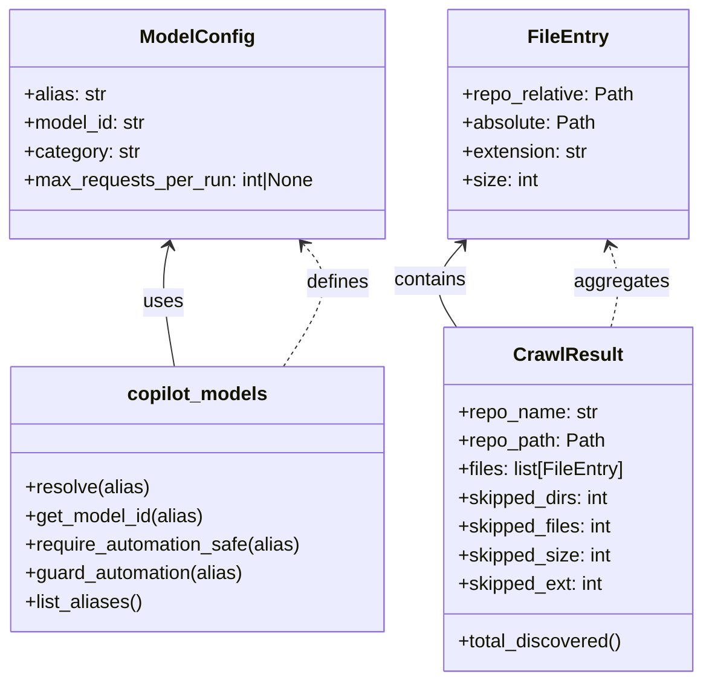
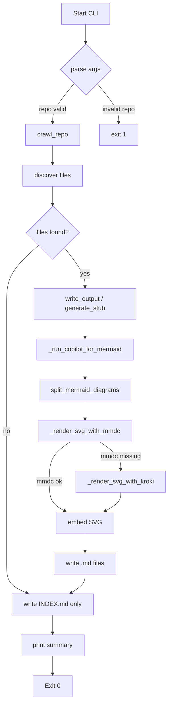

# Diagram: shipment_core/shipment_service/config/config.alpha.yml

> Auto-generated by Obscura crawlers

## Diagram 1

### SVG

<svg id="container" width="589.94140625" xmlns="http://www.w3.org/2000/svg" class="classDiagram" height="570" viewBox="0 0 589.94140625 570" role="graphics-document document" aria-roledescription="class"><g><defs><marker id="container_class-aggregationStart" class="marker aggregation class" refX="18" refY="7" markerWidth="190" markerHeight="240" orient="auto"><path d="M 18,7 L9,13 L1,7 L9,1 Z"></path></marker></defs><defs><marker id="container_class-aggregationEnd" class="marker aggregation class" refX="1" refY="7" markerWidth="20" markerHeight="28" orient="auto"><path d="M 18,7 L9,13 L1,7 L9,1 Z"></path></marker></defs><defs><marker id="container_class-extensionStart" class="marker extension class" refX="18" refY="7" markerWidth="190" markerHeight="240" orient="auto"><path d="M 1,7 L18,13 V 1 Z"></path></marker></defs><defs><marker id="container_class-extensionEnd" class="marker extension class" refX="1" refY="7" markerWidth="20" markerHeight="28" orient="auto"><path d="M 1,1 V 13 L18,7 Z"></path></marker></defs><defs><marker id="container_class-compositionStart" class="marker composition class" refX="18" refY="7" markerWidth="190" markerHeight="240" orient="auto"><path d="M 18,7 L9,13 L1,7 L9,1 Z"></path></marker></defs><defs><marker id="container_class-compositionEnd" class="marker composition class" refX="1" refY="7" markerWidth="20" markerHeight="28" orient="auto"><path d="M 18,7 L9,13 L1,7 L9,1 Z"></path></marker></defs><defs><marker id="container_class-dependencyStart" class="marker dependency class" refX="6" refY="7" markerWidth="190" markerHeight="240" orient="auto"><path d="M 5,7 L9,13 L1,7 L9,1 Z"></path></marker></defs><defs><marker id="container_class-dependencyEnd" class="marker dependency class" refX="13" refY="7" markerWidth="20" markerHeight="28" orient="auto"><path d="M 18,7 L9,13 L14,7 L9,1 Z"></path></marker></defs><defs><marker id="container_class-lollipopStart" class="marker lollipop class" refX="13" refY="7" markerWidth="190" markerHeight="240" orient="auto"><circle stroke="black" fill="transparent" cx="7" cy="7" r="6"></circle></marker></defs><defs><marker id="container_class-lollipopEnd" class="marker lollipop class" refX="1" refY="7" markerWidth="190" markerHeight="240" orient="auto"><circle stroke="black" fill="transparent" cx="7" cy="7" r="6"></circle></marker></defs><g class="root"><g class="clusters"></g><g class="edgePaths"><path d="M141.66,205.838L140.43,211.032C139.199,216.226,136.738,226.613,137.539,243.473C138.34,260.333,142.402,283.667,144.433,295.333L146.464,307" id="id_ModelConfig_copilot_models_1" class="edge-thickness-normal edge-pattern-solid relation" style=";;;" data-edge="true" data-et="edge" data-id="id_ModelConfig_copilot_models_1" data-points="W3sieCI6MTQzLjA0Mzc2MTc0ODEyMDMsInkiOjIwMH0seyJ4IjoxMzQuMjc3MzQzNzUsInkiOjIzN30seyJ4IjoxNDYuNDY0MTk2MzA1MjQ4NiwieSI6MzA3fV0=" marker-start="url(#container_class-dependencyStart)"></path><path d="M389.07,204.501L384.296,209.918C379.522,215.334,369.975,226.167,369.195,237.75C368.415,249.333,376.402,261.667,380.396,267.833L384.389,274" id="id_FileEntry_CrawlResult_2" class="edge-thickness-normal edge-pattern-solid relation" style=";;;" data-edge="true" data-et="edge" data-id="id_FileEntry_CrawlResult_2" data-points="W3sieCI6MzkzLjAzNjkxODQ2ODA0NTEsInkiOjIwMH0seyJ4IjozNjAuNDI3NzM0Mzc1LCJ5IjoyMzd9LHsieCI6Mzg0LjM4OTE3OTA0MDA1NTI0LCJ5IjoyNzR9XQ==" marker-start="url(#container_class-dependencyStart)"></path><path d="M237.673,307L245.229,295.333C252.784,283.667,267.895,260.333,270.677,243.25C273.459,226.167,263.911,215.334,259.137,209.918L254.364,204.501" id="id_copilot_models_ModelConfig_3" class="edge-thickness-normal edge-pattern-dashed relation" style=";;;" data-edge="true" data-et="edge" data-id="id_copilot_models_ModelConfig_3" data-points="W3sieCI6MjM3LjY3MzM5NjQ5NTE2NTc1LCJ5IjozMDd9LHsieCI6MjgzLjAwNTg1OTM3NSwieSI6MjM3fSx7IngiOjI1MC4zOTY2NzUyODE5NTQ4OCwieSI6MjAwfV0=" marker-end="url(#container_class-dependencyEnd)"></path><path d="M513.415,274L514.946,267.833C516.478,261.667,519.542,249.333,519.309,237.947C519.077,226.561,515.548,216.123,513.783,210.903L512.019,205.684" id="id_CrawlResult_FileEntry_4" class="edge-thickness-normal edge-pattern-dashed relation" style=";;;" data-edge="true" data-et="edge" data-id="id_CrawlResult_FileEntry_4" data-points="W3sieCI6NTEzLjQxNDU1ODg3NDMwOTQsInkiOjI3NH0seyJ4Ijo1MjIuNjA1NDY4NzUsInkiOjIzN30seyJ4Ijo1MTAuMDk3NTM4NzY4Nzk3LCJ5IjoyMDB9XQ==" marker-end="url(#container_class-dependencyEnd)"></path></g><g class="edgeLabels"><g class="edgeLabel" transform="translate(137.10984, 253.26957)"><g class="label" data-id="id_ModelConfig_copilot_models_1" transform="translate(-16.4921875, -12)"><foreignObject width="32.984375" height="24">

uses

</foreignObject></g></g><g class="edgeLabel" transform="translate(362.15931, 235.03526)"><g class="label" data-id="id_FileEntry_CrawlResult_2" transform="translate(-30.890625, -12)"><foreignObject width="61.78125" height="24">

contains

</foreignObject></g></g><g class="edgeLabel" transform="translate(273.74391, 251.30181)"><g class="label" data-id="id_copilot_models_ModelConfig_3" transform="translate(-26.53125, -12)"><foreignObject width="53.0625" height="24">

defines

</foreignObject></g></g><g class="edgeLabel" transform="translate(522.45615, 236.55828)"><g class="label" data-id="id_CrawlResult_FileEntry_4" transform="translate(-39.03125, -12)"><foreignObject width="78.0625" height="24">

aggregates

</foreignObject></g></g></g><g class="nodes"><g class="node default" id="classId-ModelConfig-0" transform="translate(165.7890625, 104)"><g class="basic label-container"><path d="M-157.7890625 -96 L157.7890625 -96 L157.7890625 96 L-157.7890625 96" stroke="none" stroke-width="0" fill="#ECECFF" style=""></path><path d="M-157.7890625 -96 C-54.74209762795661 -96, 48.30486724408678 -96, 157.7890625 -96 M-157.7890625 -96 C-55.31090255014661 -96, 47.167257399706784 -96, 157.7890625 -96 M157.7890625 -96 C157.7890625 -44.4222830782584, 157.7890625 7.155433843483195, 157.7890625 96 M157.7890625 -96 C157.7890625 -21.673347129542208, 157.7890625 52.653305740915584, 157.7890625 96 M157.7890625 96 C71.35388585212948 96, -15.08129079574104 96, -157.7890625 96 M157.7890625 96 C87.19072464430559 96, 16.59238678861118 96, -157.7890625 96 M-157.7890625 96 C-157.7890625 44.397926309599, -157.7890625 -7.204147380801999, -157.7890625 -96 M-157.7890625 96 C-157.7890625 53.993677940891175, -157.7890625 11.98735588178235, -157.7890625 -96" stroke="#9370DB" stroke-width="1.3" fill="none" stroke-dasharray="0 0" style=""></path></g><g class="annotation-group text" transform="translate(0, -72)"></g><g class="label-group text" transform="translate(-45.484375, -72)"><g class="label" style="font-weight: bolder" transform="translate(0,-12)"><foreignObject width="90.96875" height="24">

ModelConfig

</foreignObject></g></g><g class="members-group text" transform="translate(-145.7890625, -24)"><g class="label" style="" transform="translate(0,-12)"><foreignObject width="69.015625" height="24">

+alias: str

</foreignObject></g><g class="label" style="" transform="translate(0,12)"><foreignObject width="103.921875" height="24">

+model_id: str

</foreignObject></g><g class="label" style="" transform="translate(0,36)"><foreignObject width="97.46875" height="24">

+category: str

</foreignObject></g><g class="label" style="" transform="translate(0,60)"><foreignObject width="246.09375" height="24">

+max_requests_per_run: int|None

</foreignObject></g></g><g class="methods-group text" transform="translate(-145.7890625, 96)"></g><g class="divider" style=""><path d="M-157.7890625 -48 C-62.62438103761919 -48, 32.540300424761625 -48, 157.7890625 -48 M-157.7890625 -48 C-44.38035853954318 -48, 69.02834542091364 -48, 157.7890625 -48" stroke="#9370DB" stroke-width="1.3" fill="none" stroke-dasharray="0 0" style=""></path></g><g class="divider" style=""><path d="M-157.7890625 72 C-50.67756912081741 72, 56.43392425836518 72, 157.7890625 72 M-157.7890625 72 C-38.04563881127217 72, 81.69778487745566 72, 157.7890625 72" stroke="#9370DB" stroke-width="1.3" fill="none" stroke-dasharray="0 0" style=""></path></g></g><g class="node default" id="classId-copilot_models-1" transform="translate(165.7890625, 418)"><g class="basic label-container"><path d="M-157.55859375 -111 L157.55859375 -111 L157.55859375 111 L-157.55859375 111" stroke="none" stroke-width="0" fill="#ECECFF" style=""></path><path d="M-157.55859375 -111 C-33.125793545777185 -111, 91.30700665844563 -111, 157.55859375 -111 M-157.55859375 -111 C-64.38170764243695 -111, 28.7951784651261 -111, 157.55859375 -111 M157.55859375 -111 C157.55859375 -47.870353302619144, 157.55859375 15.259293394761713, 157.55859375 111 M157.55859375 -111 C157.55859375 -33.99749856507762, 157.55859375 43.00500286984476, 157.55859375 111 M157.55859375 111 C63.60391848545109 111, -30.35075677909782 111, -157.55859375 111 M157.55859375 111 C54.34018624042578 111, -48.87822126914844 111, -157.55859375 111 M-157.55859375 111 C-157.55859375 61.44118670770575, -157.55859375 11.882373415411493, -157.55859375 -111 M-157.55859375 111 C-157.55859375 64.55185546910943, -157.55859375 18.10371093821884, -157.55859375 -111" stroke="#9370DB" stroke-width="1.3" fill="none" stroke-dasharray="0 0" style=""></path></g><g class="annotation-group text" transform="translate(0, -87)"></g><g class="label-group text" transform="translate(-56.5234375, -87)"><g class="label" style="font-weight: bolder" transform="translate(0,-12)"><foreignObject width="113.046875" height="24">

copilot_models

</foreignObject></g></g><g class="members-group text" transform="translate(-145.55859375, -39)"></g><g class="methods-group text" transform="translate(-145.55859375, -9)"><g class="label" style="" transform="translate(0,-12)"><foreignObject width="104.40625" height="24">

+resolve(alias)

</foreignObject></g><g class="label" style="" transform="translate(0,12)"><foreignObject width="151.4375" height="24">

+get_model_id(alias)

</foreignObject></g><g class="label" style="" transform="translate(0,36)"><foreignObject width="234.59375" height="24">

+require_automation_safe(alias)

</foreignObject></g><g class="label" style="" transform="translate(0,60)"><foreignObject width="185.875" height="24">

+guard_automation(alias)

</foreignObject></g><g class="label" style="" transform="translate(0,84)"><foreignObject width="98.765625" height="24">

+list_aliases()

</foreignObject></g></g><g class="divider" style=""><path d="M-157.55859375 -63 C-37.35180279622557 -63, 82.85498815754886 -63, 157.55859375 -63 M-157.55859375 -63 C-76.97263124917328 -63, 3.613331251653449 -63, 157.55859375 -63" stroke="#9370DB" stroke-width="1.3" fill="none" stroke-dasharray="0 0" style=""></path></g><g class="divider" style=""><path d="M-157.55859375 -39 C-82.30368720571607 -39, -7.048780661432147 -39, 157.55859375 -39 M-157.55859375 -39 C-33.059441188686904 -39, 91.43971137262619 -39, 157.55859375 -39" stroke="#9370DB" stroke-width="1.3" fill="none" stroke-dasharray="0 0" style=""></path></g></g><g class="node default" id="classId-FileEntry-2" transform="translate(477.64453125, 104)"><g class="basic label-container"><path d="M-100.0078125 -96 L100.0078125 -96 L100.0078125 96 L-100.0078125 96" stroke="none" stroke-width="0" fill="#ECECFF" style=""></path><path d="M-100.0078125 -96 C-36.049323994944835 -96, 27.90916451011033 -96, 100.0078125 -96 M-100.0078125 -96 C-49.50596674734553 -96, 0.9958790053089359 -96, 100.0078125 -96 M100.0078125 -96 C100.0078125 -44.859127284427785, 100.0078125 6.281745431144429, 100.0078125 96 M100.0078125 -96 C100.0078125 -27.992910239468046, 100.0078125 40.01417952106391, 100.0078125 96 M100.0078125 96 C20.265089244241395 96, -59.47763401151721 96, -100.0078125 96 M100.0078125 96 C39.26681282577363 96, -21.474186848452746 96, -100.0078125 96 M-100.0078125 96 C-100.0078125 35.08437731688772, -100.0078125 -25.831245366224564, -100.0078125 -96 M-100.0078125 96 C-100.0078125 51.17491468667197, -100.0078125 6.349829373343937, -100.0078125 -96" stroke="#9370DB" stroke-width="1.3" fill="none" stroke-dasharray="0 0" style=""></path></g><g class="annotation-group text" transform="translate(0, -72)"></g><g class="label-group text" transform="translate(-31.859375, -72)"><g class="label" style="font-weight: bolder" transform="translate(0,-12)"><foreignObject width="63.71875" height="24">

FileEntry

</foreignObject></g></g><g class="members-group text" transform="translate(-88.0078125, -24)"><g class="label" style="" transform="translate(0,-12)"><foreignObject width="144.15625" height="24">

+repo_relative: Path

</foreignObject></g><g class="label" style="" transform="translate(0,12)"><foreignObject width="111.390625" height="24">

+absolute: Path

</foreignObject></g><g class="label" style="" transform="translate(0,36)"><foreignObject width="106.171875" height="24">

+extension: str

</foreignObject></g><g class="label" style="" transform="translate(0,60)"><foreignObject width="63.3125" height="24">

+size: int

</foreignObject></g></g><g class="methods-group text" transform="translate(-88.0078125, 96)"></g><g class="divider" style=""><path d="M-100.0078125 -48 C-39.49816368214821 -48, 21.01148513570358 -48, 100.0078125 -48 M-100.0078125 -48 C-31.87675009327137 -48, 36.25431231345726 -48, 100.0078125 -48" stroke="#9370DB" stroke-width="1.3" fill="none" stroke-dasharray="0 0" style=""></path></g><g class="divider" style=""><path d="M-100.0078125 72 C-59.5077092723341 72, -19.007606044668194 72, 100.0078125 72 M-100.0078125 72 C-21.68592603082091 72, 56.63596043835818 72, 100.0078125 72" stroke="#9370DB" stroke-width="1.3" fill="none" stroke-dasharray="0 0" style=""></path></g></g><g class="node default" id="classId-CrawlResult-3" transform="translate(477.64453125, 418)"><g class="basic label-container"><path d="M-104.296875 -144 L104.296875 -144 L104.296875 144 L-104.296875 144" stroke="none" stroke-width="0" fill="#ECECFF" style=""></path><path d="M-104.296875 -144 C-30.01751275974614 -144, 44.26184948050772 -144, 104.296875 -144 M-104.296875 -144 C-24.112797679555968 -144, 56.071279640888065 -144, 104.296875 -144 M104.296875 -144 C104.296875 -38.0925624459214, 104.296875 67.8148751081572, 104.296875 144 M104.296875 -144 C104.296875 -83.84097906425283, 104.296875 -23.68195812850567, 104.296875 144 M104.296875 144 C30.527594464050537 144, -43.241686071898926 144, -104.296875 144 M104.296875 144 C51.395785172110486 144, -1.5053046557790282 144, -104.296875 144 M-104.296875 144 C-104.296875 62.18739464376499, -104.296875 -19.62521071247002, -104.296875 -144 M-104.296875 144 C-104.296875 49.86617309196271, -104.296875 -44.267653816074585, -104.296875 -144" stroke="#9370DB" stroke-width="1.3" fill="none" stroke-dasharray="0 0" style=""></path></g><g class="annotation-group text" transform="translate(0, -120)"></g><g class="label-group text" transform="translate(-43.28125, -120)"><g class="label" style="font-weight: bolder" transform="translate(0,-12)"><foreignObject width="86.5625" height="24">

CrawlResult

</foreignObject></g></g><g class="members-group text" transform="translate(-92.296875, -72)"><g class="label" style="" transform="translate(0,-12)"><foreignObject width="117.265625" height="24">

+repo_name: str

</foreignObject></g><g class="label" style="" transform="translate(0,12)"><foreignObject width="122.8125" height="24">

+repo_path: Path

</foreignObject></g><g class="label" style="" transform="translate(0,36)"><foreignObject width="141.3125" height="24">

+files: list[FileEntry]

</foreignObject></g><g class="label" style="" transform="translate(0,60)"><foreignObject width="128.703125" height="24">

+skipped_dirs: int

</foreignObject></g><g class="label" style="" transform="translate(0,84)"><foreignObject width="131.203125" height="24">

+skipped_files: int

</foreignObject></g><g class="label" style="" transform="translate(0,108)"><foreignObject width="129.109375" height="24">

+skipped_size: int

</foreignObject></g><g class="label" style="" transform="translate(0,132)"><foreignObject width="123.390625" height="24">

+skipped_ext: int

</foreignObject></g></g><g class="methods-group text" transform="translate(-92.296875, 120)"><g class="label" style="" transform="translate(0,-12)"><foreignObject width="138.734375" height="24">

+total_discovered()

</foreignObject></g></g><g class="divider" style=""><path d="M-104.296875 -96 C-34.14000427031702 -96, 36.01686645936596 -96, 104.296875 -96 M-104.296875 -96 C-30.27841209540098 -96, 43.74005080919804 -96, 104.296875 -96" stroke="#9370DB" stroke-width="1.3" fill="none" stroke-dasharray="0 0" style=""></path></g><g class="divider" style=""><path d="M-104.296875 96 C-53.37982927984742 96, -2.4627835596948415 96, 104.296875 96 M-104.296875 96 C-23.212185104012946 96, 57.87250479197411 96, 104.296875 96" stroke="#9370DB" stroke-width="1.3" fill="none" stroke-dasharray="0 0" style=""></path></g></g></g></g></g></svg>

## Diagram 2

### SVG

<svg id="container" width="433.12109375" xmlns="http://www.w3.org/2000/svg" class="flowchart" height="1781.140625" viewBox="0 0 433.12109375 1781.140625" role="graphics-document document" aria-roledescription="flowchart-v2"><g><marker id="container_flowchart-v2-pointEnd" class="marker flowchart-v2" viewBox="0 0 10 10" refX="5" refY="5" markerUnits="userSpaceOnUse" markerWidth="8" markerHeight="8" orient="auto"><path d="M 0 0 L 10 5 L 0 10 z" class="arrowMarkerPath" style="stroke-width: 1; stroke-dasharray: 1, 0;"></path></marker><marker id="container_flowchart-v2-pointStart" class="marker flowchart-v2" viewBox="0 0 10 10" refX="4.5" refY="5" markerUnits="userSpaceOnUse" markerWidth="8" markerHeight="8" orient="auto"><path d="M 0 5 L 10 10 L 10 0 z" class="arrowMarkerPath" style="stroke-width: 1; stroke-dasharray: 1, 0;"></path></marker><marker id="container_flowchart-v2-circleEnd" class="marker flowchart-v2" viewBox="0 0 10 10" refX="11" refY="5" markerUnits="userSpaceOnUse" markerWidth="11" markerHeight="11" orient="auto"><circle cx="5" cy="5" r="5" class="arrowMarkerPath" style="stroke-width: 1; stroke-dasharray: 1, 0;"></circle></marker><marker id="container_flowchart-v2-circleStart" class="marker flowchart-v2" viewBox="0 0 10 10" refX="-1" refY="5" markerUnits="userSpaceOnUse" markerWidth="11" markerHeight="11" orient="auto"><circle cx="5" cy="5" r="5" class="arrowMarkerPath" style="stroke-width: 1; stroke-dasharray: 1, 0;"></circle></marker><marker id="container_flowchart-v2-crossEnd" class="marker cross flowchart-v2" viewBox="0 0 11 11" refX="12" refY="5.2" markerUnits="userSpaceOnUse" markerWidth="11" markerHeight="11" orient="auto"><path d="M 1,1 l 9,9 M 10,1 l -9,9" class="arrowMarkerPath" style="stroke-width: 2; stroke-dasharray: 1, 0;"></path></marker><marker id="container_flowchart-v2-crossStart" class="marker cross flowchart-v2" viewBox="0 0 11 11" refX="-1" refY="5.2" markerUnits="userSpaceOnUse" markerWidth="11" markerHeight="11" orient="auto"><path d="M 1,1 l 9,9 M 10,1 l -9,9" class="arrowMarkerPath" style="stroke-width: 2; stroke-dasharray: 1, 0;"></path></marker><g class="root"><g class="clusters"></g><g class="edgePaths"><path d="M220.047,62L220.047,66.167C220.047,70.333,220.047,78.667,220.047,86.333C220.047,94,220.047,101,220.047,104.5L220.047,108" id="L_A_B_0" class="edge-thickness-normal edge-pattern-solid edge-thickness-normal edge-pattern-solid flowchart-link" style=";" data-edge="true" data-et="edge" data-id="L_A_B_0" data-points="W3sieCI6MjIwLjA0Njg3NSwieSI6NjJ9LHsieCI6MjIwLjA0Njg3NSwieSI6ODd9LHsieCI6MjIwLjA0Njg3NSwieSI6MTEyfV0=" marker-end="url(#container_flowchart-v2-pointEnd)"></path><path d="M190.808,211.511L181.621,222.551C172.435,233.591,154.061,255.67,144.874,272.21C135.688,288.75,135.688,299.75,135.688,305.25L135.688,310.75" id="L_B_C_0" class="edge-thickness-normal edge-pattern-solid edge-thickness-normal edge-pattern-solid flowchart-link" style=";" data-edge="true" data-et="edge" data-id="L_B_C_0" data-points="W3sieCI6MTkwLjgwODE1ODMzNDczNTQyLCJ5IjoyMTEuNTExMjgzMzM0NzM1NDJ9LHsieCI6MTM1LjY4NzUsInkiOjI3Ny43NX0seyJ4IjoxMzUuNjg3NSwieSI6MzE0Ljc1fV0=" marker-end="url(#container_flowchart-v2-pointEnd)"></path><path d="M249.286,211.511L258.472,222.551C267.659,233.591,286.033,255.67,295.219,272.21C304.406,288.75,304.406,299.75,304.406,305.25L304.406,310.75" id="L_B_Z_0" class="edge-thickness-normal edge-pattern-solid edge-thickness-normal edge-pattern-solid flowchart-link" style=";" data-edge="true" data-et="edge" data-id="L_B_Z_0" data-points="W3sieCI6MjQ5LjI4NTU5MTY2NTI2NDU4LCJ5IjoyMTEuNTExMjgzMzM0NzM1NDJ9LHsieCI6MzA0LjQwNjI1LCJ5IjoyNzcuNzV9LHsieCI6MzA0LjQwNjI1LCJ5IjozMTQuNzV9XQ==" marker-end="url(#container_flowchart-v2-pointEnd)"></path><path d="M135.688,368.75L135.688,372.917C135.688,377.083,135.688,385.417,135.688,393.083C135.688,400.75,135.688,407.75,135.688,411.25L135.688,414.75" id="L_C_D_0" class="edge-thickness-normal edge-pattern-solid edge-thickness-normal edge-pattern-solid flowchart-link" style=";" data-edge="true" data-et="edge" data-id="L_C_D_0" data-points="W3sieCI6MTM1LjY4NzUsInkiOjM2OC43NX0seyJ4IjoxMzUuNjg3NSwieSI6MzkzLjc1fSx7IngiOjEzNS42ODc1LCJ5Ijo0MTguNzV9XQ==" marker-end="url(#container_flowchart-v2-pointEnd)"></path><path d="M135.688,472.75L135.688,476.917C135.688,481.083,135.688,489.417,135.688,497.083C135.688,504.75,135.688,511.75,135.688,515.25L135.688,518.75" id="L_D_E_0" class="edge-thickness-normal edge-pattern-solid edge-thickness-normal edge-pattern-solid flowchart-link" style=";" data-edge="true" data-et="edge" data-id="L_D_E_0" data-points="W3sieCI6MTM1LjY4NzUsInkiOjQ3Mi43NX0seyJ4IjoxMzUuNjg3NSwieSI6NDk3Ljc1fSx7IngiOjEzNS42ODc1LCJ5Ijo1MjIuNzV9XQ==" marker-end="url(#container_flowchart-v2-pointEnd)"></path><path d="M99.221,624.675L85.579,636.919C71.937,649.163,44.652,673.652,31.01,698.563C17.367,723.474,17.367,748.807,17.367,772.141C17.367,795.474,17.367,816.807,17.367,836.141C17.367,855.474,17.367,872.807,17.367,890.141C17.367,907.474,17.367,924.807,17.367,942.141C17.367,959.474,17.367,976.807,17.367,994.141C17.367,1011.474,17.367,1028.807,17.367,1046.141C17.367,1063.474,17.367,1080.807,17.367,1100.141C17.367,1119.474,17.367,1140.807,17.367,1162.141C17.367,1183.474,17.367,1204.807,17.367,1224.141C17.367,1243.474,17.367,1260.807,17.367,1278.141C17.367,1295.474,17.367,1312.807,17.367,1330.141C17.367,1347.474,17.367,1364.807,17.367,1382.141C17.367,1399.474,17.367,1416.807,17.367,1434.141C17.367,1451.474,17.367,1468.807,26.238,1481.372C35.108,1493.938,52.849,1501.734,61.72,1505.633L70.59,1509.531" id="L_E_F_0" class="edge-thickness-normal edge-pattern-solid edge-thickness-normal edge-pattern-solid flowchart-link" style=";" data-edge="true" data-et="edge" data-id="L_E_F_0" data-points="W3sieCI6OTkuMjIxMzkyMTM1NDEzMDQsInkiOjYyNC42NzQ1MTcxMzU0MTN9LHsieCI6MTcuMzY3MTg3NSwieSI6Njk4LjE0MDYyNX0seyJ4IjoxNy4zNjcxODc1LCJ5Ijo3NzQuMTQwNjI1fSx7IngiOjE3LjM2NzE4NzUsInkiOjgzOC4xNDA2MjV9LHsieCI6MTcuMzY3MTg3NSwieSI6ODkwLjE0MDYyNX0seyJ4IjoxNy4zNjcxODc1LCJ5Ijo5NDIuMTQwNjI1fSx7IngiOjE3LjM2NzE4NzUsInkiOjk5NC4xNDA2MjV9LHsieCI6MTcuMzY3MTg3NSwieSI6MTA0Ni4xNDA2MjV9LHsieCI6MTcuMzY3MTg3NSwieSI6MTA5OC4xNDA2MjV9LHsieCI6MTcuMzY3MTg3NSwieSI6MTE2Mi4xNDA2MjV9LHsieCI6MTcuMzY3MTg3NSwieSI6MTIyNi4xNDA2MjV9LHsieCI6MTcuMzY3MTg3NSwieSI6MTI3OC4xNDA2MjV9LHsieCI6MTcuMzY3MTg3NSwieSI6MTMzMC4xNDA2MjV9LHsieCI6MTcuMzY3MTg3NSwieSI6MTM4Mi4xNDA2MjV9LHsieCI6MTcuMzY3MTg3NSwieSI6MTQzNC4xNDA2MjV9LHsieCI6MTcuMzY3MTg3NSwieSI6MTQ4Ni4xNDA2MjV9LHsieCI6NzQuMjUxOTUzMTI1LCJ5IjoxNTExLjE0MDYyNX1d" marker-end="url(#container_flowchart-v2-pointEnd)"></path><path d="M165.941,630.888L174.648,642.096C183.356,653.305,200.772,675.723,209.48,692.432C218.188,709.141,218.188,720.141,218.188,725.641L218.188,731.141" id="L_E_G_0" class="edge-thickness-normal edge-pattern-solid edge-thickness-normal edge-pattern-solid flowchart-link" style=";" data-edge="true" data-et="edge" data-id="L_E_G_0" data-points="W3sieCI6MTY1Ljk0MDU3NDE1MjI3OTIzLCJ5Ijo2MzAuODg3NTUwODQ3NzIwOH0seyJ4IjoyMTguMTg3NSwieSI6Njk4LjE0MDYyNX0seyJ4IjoyMTguMTg3NSwieSI6NzM1LjE0MDYyNX1d" marker-end="url(#container_flowchart-v2-pointEnd)"></path><path d="M218.188,813.141L218.188,817.307C218.188,821.474,218.188,829.807,218.188,837.474C218.188,845.141,218.188,852.141,218.188,855.641L218.188,859.141" id="L_G_H_0" class="edge-thickness-normal edge-pattern-solid edge-thickness-normal edge-pattern-solid flowchart-link" style=";" data-edge="true" data-et="edge" data-id="L_G_H_0" data-points="W3sieCI6MjE4LjE4NzUsInkiOjgxMy4xNDA2MjV9LHsieCI6MjE4LjE4NzUsInkiOjgzOC4xNDA2MjV9LHsieCI6MjE4LjE4NzUsInkiOjg2My4xNDA2MjV9XQ==" marker-end="url(#container_flowchart-v2-pointEnd)"></path><path d="M218.188,917.141L218.188,921.307C218.188,925.474,218.188,933.807,218.188,941.474C218.188,949.141,218.188,956.141,218.188,959.641L218.188,963.141" id="L_H_I_0" class="edge-thickness-normal edge-pattern-solid edge-thickness-normal edge-pattern-solid flowchart-link" style=";" data-edge="true" data-et="edge" data-id="L_H_I_0" data-points="W3sieCI6MjE4LjE4NzUsInkiOjkxNy4xNDA2MjV9LHsieCI6MjE4LjE4NzUsInkiOjk0Mi4xNDA2MjV9LHsieCI6MjE4LjE4NzUsInkiOjk2Ny4xNDA2MjV9XQ==" marker-end="url(#container_flowchart-v2-pointEnd)"></path><path d="M218.188,1021.141L218.188,1025.307C218.188,1029.474,218.188,1037.807,218.188,1045.474C218.188,1053.141,218.188,1060.141,218.188,1063.641L218.188,1067.141" id="L_I_J_0" class="edge-thickness-normal edge-pattern-solid edge-thickness-normal edge-pattern-solid flowchart-link" style=";" data-edge="true" data-et="edge" data-id="L_I_J_0" data-points="W3sieCI6MjE4LjE4NzUsInkiOjEwMjEuMTQwNjI1fSx7IngiOjIxOC4xODc1LCJ5IjoxMDQ2LjE0MDYyNX0seyJ4IjoyMTguMTg3NSwieSI6MTA3MS4xNDA2MjV9XQ==" marker-end="url(#container_flowchart-v2-pointEnd)"></path><path d="M179.495,1125.141L170.658,1131.307C161.821,1137.474,144.147,1149.807,135.31,1166.641C126.473,1183.474,126.473,1204.807,126.473,1224.141C126.473,1243.474,126.473,1260.807,133.242,1273.312C140.011,1285.816,153.549,1293.492,160.318,1297.33L167.087,1301.168" id="L_J_K_0" class="edge-thickness-normal edge-pattern-solid edge-thickness-normal edge-pattern-solid flowchart-link" style=";" data-edge="true" data-et="edge" data-id="L_J_K_0" data-points="W3sieCI6MTc5LjQ5NTMwMDI5Mjk2ODc1LCJ5IjoxMTI1LjE0MDYyNX0seyJ4IjoxMjYuNDcyNjU2MjUsInkiOjExNjIuMTQwNjI1fSx7IngiOjEyNi40NzI2NTYyNSwieSI6MTIyNi4xNDA2MjV9LHsieCI6MTI2LjQ3MjY1NjI1LCJ5IjoxMjc4LjE0MDYyNX0seyJ4IjoxNzAuNTY2MzMxMTI5ODA3NjgsInkiOjEzMDMuMTQwNjI1fV0=" marker-end="url(#container_flowchart-v2-pointEnd)"></path><path d="M256.88,1125.141L265.717,1131.307C274.554,1137.474,292.228,1149.807,301.065,1161.474C309.902,1173.141,309.902,1184.141,309.902,1189.641L309.902,1195.141" id="L_J_L_0" class="edge-thickness-normal edge-pattern-solid edge-thickness-normal edge-pattern-solid flowchart-link" style=";" data-edge="true" data-et="edge" data-id="L_J_L_0" data-points="W3sieCI6MjU2Ljg3OTY5OTcwNzAzMTI1LCJ5IjoxMTI1LjE0MDYyNX0seyJ4IjozMDkuOTAyMzQzNzUsInkiOjExNjIuMTQwNjI1fSx7IngiOjMwOS45MDIzNDM3NSwieSI6MTE5OS4xNDA2MjV9XQ==" marker-end="url(#container_flowchart-v2-pointEnd)"></path><path d="M309.902,1253.141L309.902,1257.307C309.902,1261.474,309.902,1269.807,303.133,1277.812C296.364,1285.816,282.826,1293.492,276.057,1297.33L269.288,1301.168" id="L_L_K_0" class="edge-thickness-normal edge-pattern-solid edge-thickness-normal edge-pattern-solid flowchart-link" style=";" data-edge="true" data-et="edge" data-id="L_L_K_0" data-points="W3sieCI6MzA5LjkwMjM0Mzc1LCJ5IjoxMjUzLjE0MDYyNX0seyJ4IjozMDkuOTAyMzQzNzUsInkiOjEyNzguMTQwNjI1fSx7IngiOjI2NS44MDg2Njg4NzAxOTIzLCJ5IjoxMzAzLjE0MDYyNX1d" marker-end="url(#container_flowchart-v2-pointEnd)"></path><path d="M218.188,1357.141L218.188,1361.307C218.188,1365.474,218.188,1373.807,218.188,1381.474C218.188,1389.141,218.188,1396.141,218.188,1399.641L218.188,1403.141" id="L_K_M_0" class="edge-thickness-normal edge-pattern-solid edge-thickness-normal edge-pattern-solid flowchart-link" style=";" data-edge="true" data-et="edge" data-id="L_K_M_0" data-points="W3sieCI6MjE4LjE4NzUsInkiOjEzNTcuMTQwNjI1fSx7IngiOjIxOC4xODc1LCJ5IjoxMzgyLjE0MDYyNX0seyJ4IjoyMTguMTg3NSwieSI6MTQwNy4xNDA2MjV9XQ==" marker-end="url(#container_flowchart-v2-pointEnd)"></path><path d="M218.188,1461.141L218.188,1465.307C218.188,1469.474,218.188,1477.807,212.141,1485.785C206.094,1493.763,194.001,1501.385,187.955,1505.197L181.908,1509.008" id="L_M_F_0" class="edge-thickness-normal edge-pattern-solid edge-thickness-normal edge-pattern-solid flowchart-link" style=";" data-edge="true" data-et="edge" data-id="L_M_F_0" data-points="W3sieCI6MjE4LjE4NzUsInkiOjE0NjEuMTQwNjI1fSx7IngiOjIxOC4xODc1LCJ5IjoxNDg2LjE0MDYyNX0seyJ4IjoxNzguNTI0MDM4NDYxNTM4NDUsInkiOjE1MTEuMTQwNjI1fV0=" marker-end="url(#container_flowchart-v2-pointEnd)"></path><path d="M135.688,1565.141L135.688,1569.307C135.688,1573.474,135.688,1581.807,135.688,1589.474C135.688,1597.141,135.688,1604.141,135.688,1607.641L135.688,1611.141" id="L_F_N_0" class="edge-thickness-normal edge-pattern-solid edge-thickness-normal edge-pattern-solid flowchart-link" style=";" data-edge="true" data-et="edge" data-id="L_F_N_0" data-points="W3sieCI6MTM1LjY4NzUsInkiOjE1NjUuMTQwNjI1fSx7IngiOjEzNS42ODc1LCJ5IjoxNTkwLjE0MDYyNX0seyJ4IjoxMzUuNjg3NSwieSI6MTYxNS4xNDA2MjV9XQ==" marker-end="url(#container_flowchart-v2-pointEnd)"></path><path d="M135.688,1669.141L135.688,1673.307C135.688,1677.474,135.688,1685.807,135.688,1693.474C135.688,1701.141,135.688,1708.141,135.688,1711.641L135.688,1715.141" id="L_N_O_0" class="edge-thickness-normal edge-pattern-solid edge-thickness-normal edge-pattern-solid flowchart-link" style=";" data-edge="true" data-et="edge" data-id="L_N_O_0" data-points="W3sieCI6MTM1LjY4NzUsInkiOjE2NjkuMTQwNjI1fSx7IngiOjEzNS42ODc1LCJ5IjoxNjk0LjE0MDYyNX0seyJ4IjoxMzUuNjg3NSwieSI6MTcxOS4xNDA2MjV9XQ==" marker-end="url(#container_flowchart-v2-pointEnd)"></path></g><g class="edgeLabels"><g class="edgeLabel"><g class="label" data-id="L_A_B_0" transform="translate(0, 0)"><foreignObject width="0" height="0">

</foreignObject></g></g><g class="edgeLabel" transform="translate(135.6875, 277.75)"><g class="label" data-id="L_B_C_0" transform="translate(-36.21875, -12)"><foreignObject width="72.4375" height="24">

repo valid

</foreignObject></g></g><g class="edgeLabel" transform="translate(304.40625, 277.75)"><g class="label" data-id="L_B_Z_0" transform="translate(-43.109375, -12)"><foreignObject width="86.21875" height="24">

invalid repo

</foreignObject></g></g><g class="edgeLabel"><g class="label" data-id="L_C_D_0" transform="translate(0, 0)"><foreignObject width="0" height="0">

</foreignObject></g></g><g class="edgeLabel"><g class="label" data-id="L_D_E_0" transform="translate(0, 0)"><foreignObject width="0" height="0">

</foreignObject></g></g><g class="edgeLabel" transform="translate(17.3671875, 1098.140625)"><g class="label" data-id="L_E_F_0" transform="translate(-9.3671875, -12)"><foreignObject width="18.734375" height="24">

no

</foreignObject></g></g><g class="edgeLabel" transform="translate(218.1875, 698.140625)"><g class="label" data-id="L_E_G_0" transform="translate(-12.0078125, -12)"><foreignObject width="24.015625" height="24">

yes

</foreignObject></g></g><g class="edgeLabel"><g class="label" data-id="L_G_H_0" transform="translate(0, 0)"><foreignObject width="0" height="0">

</foreignObject></g></g><g class="edgeLabel"><g class="label" data-id="L_H_I_0" transform="translate(0, 0)"><foreignObject width="0" height="0">

</foreignObject></g></g><g class="edgeLabel"><g class="label" data-id="L_I_J_0" transform="translate(0, 0)"><foreignObject width="0" height="0">

</foreignObject></g></g><g class="edgeLabel" transform="translate(126.47265625, 1226.140625)"><g class="label" data-id="L_J_K_0" transform="translate(-33.2109375, -12)"><foreignObject width="66.421875" height="24">

mmdc ok

</foreignObject></g></g><g class="edgeLabel" transform="translate(309.90234375, 1162.140625)"><g class="label" data-id="L_J_L_0" transform="translate(-52.0546875, -12)"><foreignObject width="104.109375" height="24">

mmdc missing

</foreignObject></g></g><g class="edgeLabel"><g class="label" data-id="L_L_K_0" transform="translate(0, 0)"><foreignObject width="0" height="0">

</foreignObject></g></g><g class="edgeLabel"><g class="label" data-id="L_K_M_0" transform="translate(0, 0)"><foreignObject width="0" height="0">

</foreignObject></g></g><g class="edgeLabel"><g class="label" data-id="L_M_F_0" transform="translate(0, 0)"><foreignObject width="0" height="0">

</foreignObject></g></g><g class="edgeLabel"><g class="label" data-id="L_F_N_0" transform="translate(0, 0)"><foreignObject width="0" height="0">

</foreignObject></g></g><g class="edgeLabel"><g class="label" data-id="L_N_O_0" transform="translate(0, 0)"><foreignObject width="0" height="0">

</foreignObject></g></g></g><g class="nodes"><g class="node default" id="flowchart-A-0" transform="translate(220.046875, 35)"><rect class="basic label-container" style="" x="-60.46875" y="-27" width="120.9375" height="54"></rect><g class="label" style="" transform="translate(-30.46875, -12)"><rect></rect><foreignObject width="60.9375" height="24">

Start CLI

</foreignObject></g></g><g class="node default" id="flowchart-B-1" transform="translate(220.046875, 176.375)"><polygon points="64.375,0 128.75,-64.375 64.375,-128.75 0,-64.375" class="label-container" transform="translate(-63.875, 64.375)"></polygon><g class="label" style="" transform="translate(-37.375, -12)"><rect></rect><foreignObject width="74.75" height="24">

parse args

</foreignObject></g></g><g class="node default" id="flowchart-C-3" transform="translate(135.6875, 341.75)"><rect class="basic label-container" style="" x="-69.8203125" y="-27" width="139.640625" height="54"></rect><g class="label" style="" transform="translate(-39.8203125, -12)"><rect></rect><foreignObject width="79.640625" height="24">

crawl_repo

</foreignObject></g></g><g class="node default" id="flowchart-Z-5" transform="translate(304.40625, 341.75)"><rect class="basic label-container" style="" x="-48.8984375" y="-27" width="97.796875" height="54"></rect><g class="label" style="" transform="translate(-18.8984375, -12)"><rect></rect><foreignObject width="37.796875" height="24">

exit 1

</foreignObject></g></g><g class="node default" id="flowchart-D-7" transform="translate(135.6875, 445.75)"><rect class="basic label-container" style="" x="-77.5546875" y="-27" width="155.109375" height="54"></rect><g class="label" style="" transform="translate(-47.5546875, -12)"><rect></rect><foreignObject width="95.109375" height="24">

discover files

</foreignObject></g></g><g class="node default" id="flowchart-E-9" transform="translate(135.6875, 591.9453125)"><polygon points="69.1953125,0 138.390625,-69.1953125 69.1953125,-138.390625 0,-69.1953125" class="label-container" transform="translate(-68.6953125, 69.1953125)"></polygon><g class="label" style="" transform="translate(-42.1953125, -12)"><rect></rect><foreignObject width="84.390625" height="24">

files found?

</foreignObject></g></g><g class="node default" id="flowchart-F-11" transform="translate(135.6875, 1538.140625)"><rect class="basic label-container" style="" x="-103.1484375" y="-27" width="206.296875" height="54"></rect><g class="label" style="" transform="translate(-73.1484375, -12)"><rect></rect><foreignObject width="146.296875" height="24">

write INDEX.md only

</foreignObject></g></g><g class="node default" id="flowchart-G-13" transform="translate(218.1875, 774.140625)"><rect class="basic label-container" style="" x="-130" y="-39" width="260" height="78"></rect><g class="label" style="" transform="translate(-100, -24)"><rect></rect><foreignObject width="200" height="48">

write_output / generate_stub

</foreignObject></g></g><g class="node default" id="flowchart-H-15" transform="translate(218.1875, 890.140625)"><rect class="basic label-container" style="" x="-126.234375" y="-27" width="252.46875" height="54"></rect><g class="label" style="" transform="translate(-96.234375, -12)"><rect></rect><foreignObject width="192.46875" height="24">

_run_copilot_for_mermaid

</foreignObject></g></g><g class="node default" id="flowchart-I-17" transform="translate(218.1875, 994.140625)"><rect class="basic label-container" style="" x="-119.9140625" y="-27" width="239.828125" height="54"></rect><g class="label" style="" transform="translate(-89.9140625, -12)"><rect></rect><foreignObject width="179.828125" height="24">

split_mermaid_diagrams

</foreignObject></g></g><g class="node default" id="flowchart-J-19" transform="translate(218.1875, 1098.140625)"><rect class="basic label-container" style="" x="-119.5703125" y="-27" width="239.140625" height="54"></rect><g class="label" style="" transform="translate(-89.5703125, -12)"><rect></rect><foreignObject width="179.140625" height="24">

_render_svg_with_mmdc

</foreignObject></g></g><g class="node default" id="flowchart-K-21" transform="translate(218.1875, 1330.140625)"><rect class="basic label-container" style="" x="-70.890625" y="-27" width="141.78125" height="54"></rect><g class="label" style="" transform="translate(-40.890625, -12)"><rect></rect><foreignObject width="81.78125" height="24">

embed SVG

</foreignObject></g></g><g class="node default" id="flowchart-L-23" transform="translate(309.90234375, 1226.140625)"><rect class="basic label-container" style="" x="-115.21875" y="-27" width="230.4375" height="54"></rect><g class="label" style="" transform="translate(-85.21875, -12)"><rect></rect><foreignObject width="170.4375" height="24">

_render_svg_with_kroki

</foreignObject></g></g><g class="node default" id="flowchart-M-27" transform="translate(218.1875, 1434.140625)"><rect class="basic label-container" style="" x="-81.015625" y="-27" width="162.03125" height="54"></rect><g class="label" style="" transform="translate(-51.015625, -12)"><rect></rect><foreignObject width="102.03125" height="24">

write .md files

</foreignObject></g></g><g class="node default" id="flowchart-N-31" transform="translate(135.6875, 1642.140625)"><rect class="basic label-container" style="" x="-83.2734375" y="-27" width="166.546875" height="54"></rect><g class="label" style="" transform="translate(-53.2734375, -12)"><rect></rect><foreignObject width="106.546875" height="24">

print summary

</foreignObject></g></g><g class="node default" id="flowchart-O-33" transform="translate(135.6875, 1746.140625)"><rect class="basic label-container" style="" x="-49.890625" y="-27" width="99.78125" height="54"></rect><g class="label" style="" transform="translate(-19.890625, -12)"><rect></rect><foreignObject width="39.78125" height="24">

Exit 0

</foreignObject></g></g></g></g></g></svg>
