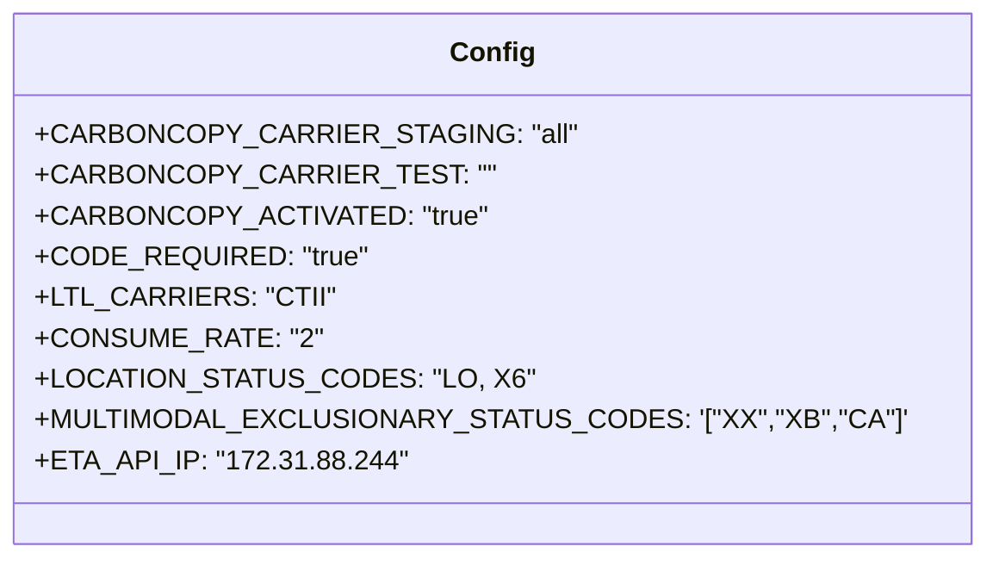

# Diagram: shipment_core/shipment_service/config/config.dev.yml


> Auto-generated by Obscura crawlers

## Diagram 1



### SVG

<svg id="container" width="510.3828125" xmlns="http://www.w3.org/2000/svg" class="classDiagram" height="328" viewBox="0 0 510.3828125 328" role="graphics-document document" aria-roledescription="class"><style>#container{font-family:"trebuchet ms",verdana,arial,sans-serif;font-size:16px;fill:#333;}@keyframes edge-animation-frame{from{stroke-dashoffset:0;}}@keyframes dash{to{stroke-dashoffset:0;}}#container .edge-animation-slow{stroke-dasharray:9,5!important;stroke-dashoffset:900;animation:dash 50s linear infinite;stroke-linecap:round;}#container .edge-animation-fast{stroke-dasharray:9,5!important;stroke-dashoffset:900;animation:dash 20s linear infinite;stroke-linecap:round;}#container .error-icon{fill:#552222;}#container .error-text{fill:#552222;stroke:#552222;}#container .edge-thickness-normal{stroke-width:1px;}#container .edge-thickness-thick{stroke-width:3.5px;}#container .edge-pattern-solid{stroke-dasharray:0;}#container .edge-thickness-invisible{stroke-width:0;fill:none;}#container .edge-pattern-dashed{stroke-dasharray:3;}#container .edge-pattern-dotted{stroke-dasharray:2;}#container .marker{fill:#333333;stroke:#333333;}#container .marker.cross{stroke:#333333;}#container svg{font-family:"trebuchet ms",verdana,arial,sans-serif;font-size:16px;}#container p{margin:0;}#container g.classGroup text{fill:#9370DB;stroke:none;font-family:"trebuchet ms",verdana,arial,sans-serif;font-size:10px;}#container g.classGroup text .title{font-weight:bolder;}#container .nodeLabel,#container .edgeLabel{color:#131300;}#container .edgeLabel .label rect{fill:#ECECFF;}#container .label text{fill:#131300;}#container .labelBkg{background:#ECECFF;}#container .edgeLabel .label span{background:#ECECFF;}#container .classTitle{font-weight:bolder;}#container .node rect,#container .node circle,#container .node ellipse,#container .node polygon,#container .node path{fill:#ECECFF;stroke:#9370DB;stroke-width:1px;}#container .divider{stroke:#9370DB;stroke-width:1;}#container g.clickable{cursor:pointer;}#container g.classGroup rect{fill:#ECECFF;stroke:#9370DB;}#container g.classGroup line{stroke:#9370DB;stroke-width:1;}#container .classLabel .box{stroke:none;stroke-width:0;fill:#ECECFF;opacity:0.5;}#container .classLabel .label{fill:#9370DB;font-size:10px;}#container .relation{stroke:#333333;stroke-width:1;fill:none;}#container .dashed-line{stroke-dasharray:3;}#container .dotted-line{stroke-dasharray:1 2;}#container #compositionStart,#container .composition{fill:#333333!important;stroke:#333333!important;stroke-width:1;}#container #compositionEnd,#container .composition{fill:#333333!important;stroke:#333333!important;stroke-width:1;}#container #dependencyStart,#container .dependency{fill:#333333!important;stroke:#333333!important;stroke-width:1;}#container #dependencyStart,#container .dependency{fill:#333333!important;stroke:#333333!important;stroke-width:1;}#container #extensionStart,#container .extension{fill:transparent!important;stroke:#333333!important;stroke-width:1;}#container #extensionEnd,#container .extension{fill:transparent!important;stroke:#333333!important;stroke-width:1;}#container #aggregationStart,#container .aggregation{fill:transparent!important;stroke:#333333!important;stroke-width:1;}#container #aggregationEnd,#container .aggregation{fill:transparent!important;stroke:#333333!important;stroke-width:1;}#container #lollipopStart,#container .lollipop{fill:#ECECFF!important;stroke:#333333!important;stroke-width:1;}#container #lollipopEnd,#container .lollipop{fill:#ECECFF!important;stroke:#333333!important;stroke-width:1;}#container .edgeTerminals{font-size:11px;line-height:initial;}#container .classTitleText{text-anchor:middle;font-size:18px;fill:#333;}#container .label-icon{display:inline-block;height:1em;overflow:visible;vertical-align:-0.125em;}#container .node .label-icon path{fill:currentColor;stroke:revert;stroke-width:revert;}#container :root{--mermaid-font-family:"trebuchet ms",verdana,arial,sans-serif;}</style><g><defs><marker id="container_class-aggregationStart" class="marker aggregation class" refX="18" refY="7" markerWidth="190" markerHeight="240" orient="auto"><path d="M 18,7 L9,13 L1,7 L9,1 Z"></path></marker></defs><defs><marker id="container_class-aggregationEnd" class="marker aggregation class" refX="1" refY="7" markerWidth="20" markerHeight="28" orient="auto"><path d="M 18,7 L9,13 L1,7 L9,1 Z"></path></marker></defs><defs><marker id="container_class-extensionStart" class="marker extension class" refX="18" refY="7" markerWidth="190" markerHeight="240" orient="auto"><path d="M 1,7 L18,13 V 1 Z"></path></marker></defs><defs><marker id="container_class-extensionEnd" class="marker extension class" refX="1" refY="7" markerWidth="20" markerHeight="28" orient="auto"><path d="M 1,1 V 13 L18,7 Z"></path></marker></defs><defs><marker id="container_class-compositionStart" class="marker composition class" refX="18" refY="7" markerWidth="190" markerHeight="240" orient="auto"><path d="M 18,7 L9,13 L1,7 L9,1 Z"></path></marker></defs><defs><marker id="container_class-compositionEnd" class="marker composition class" refX="1" refY="7" markerWidth="20" markerHeight="28" orient="auto"><path d="M 18,7 L9,13 L1,7 L9,1 Z"></path></marker></defs><defs><marker id="container_class-dependencyStart" class="marker dependency class" refX="6" refY="7" markerWidth="190" markerHeight="240" orient="auto"><path d="M 5,7 L9,13 L1,7 L9,1 Z"></path></marker></defs><defs><marker id="container_class-dependencyEnd" class="marker dependency class" refX="13" refY="7" markerWidth="20" markerHeight="28" orient="auto"><path d="M 18,7 L9,13 L14,7 L9,1 Z"></path></marker></defs><defs><marker id="container_class-lollipopStart" class="marker lollipop class" refX="13" refY="7" markerWidth="190" markerHeight="240" orient="auto"><circle stroke="black" fill="transparent" cx="7" cy="7" r="6"></circle></marker></defs><defs><marker id="container_class-lollipopEnd" class="marker lollipop class" refX="1" refY="7" markerWidth="190" markerHeight="240" orient="auto"><circle stroke="black" fill="transparent" cx="7" cy="7" r="6"></circle></marker></defs><g class="root"><g class="clusters"></g><g class="edgePaths"></g><g class="edgeLabels"></g><g class="nodes"><g class="node default" id="classId-Config-0" transform="translate(255.19140625, 164)"><g class="basic label-container"><path d="M-247.19140625 -156 L247.19140625 -156 L247.19140625 156 L-247.19140625 156" stroke="none" stroke-width="0" fill="#ECECFF" style=""></path><path d="M-247.19140625 -156 C-114.34788080578548 -156, 18.49564463842904 -156, 247.19140625 -156 M-247.19140625 -156 C-56.50692136455481 -156, 134.17756352089037 -156, 247.19140625 -156 M247.19140625 -156 C247.19140625 -56.394535182710314, 247.19140625 43.21092963457937, 247.19140625 156 M247.19140625 -156 C247.19140625 -32.81061289198867, 247.19140625 90.37877421602266, 247.19140625 156 M247.19140625 156 C130.67979720589037 156, 14.168188161780733 156, -247.19140625 156 M247.19140625 156 C144.62528048473354 156, 42.0591547194671 156, -247.19140625 156 M-247.19140625 156 C-247.19140625 83.11017088248799, -247.19140625 10.220341764975984, -247.19140625 -156 M-247.19140625 156 C-247.19140625 52.1795833055109, -247.19140625 -51.640833388978194, -247.19140625 -156" stroke="#9370DB" stroke-width="1.3" fill="none" stroke-dasharray="0 0" style=""></path></g><g class="annotation-group text" transform="translate(0, -132)"></g><g class="label-group text" transform="translate(-22.9296875, -132)"><g class="label" style="font-weight: bolder" transform="translate(0,-12)"><foreignObject width="45.859375" height="24"><div xmlns="http://www.w3.org/1999/xhtml" style="display: table-cell; white-space: nowrap; line-height: 1.5; max-width: 96px; text-align: center;"><span class="nodeLabel markdown-node-label" style=""><p>Config</p></span></div></foreignObject></g></g><g class="members-group text" transform="translate(-235.19140625, -84)"><g class="label" style="" transform="translate(0,-12)"><foreignObject width="278.5625" height="24"><div xmlns="http://www.w3.org/1999/xhtml" style="display: table-cell; white-space: nowrap; line-height: 1.5; max-width: 336px; text-align: center;"><span class="nodeLabel markdown-node-label" style=""><p>+CARBONCOPY_CARRIER_STAGING: "all"</p></span></div></foreignObject></g><g class="label" style="" transform="translate(0,12)"><foreignObject width="232.625" height="24"><div xmlns="http://www.w3.org/1999/xhtml" style="display: table-cell; white-space: nowrap; line-height: 1.5; max-width: 290px; text-align: center;"><span class="nodeLabel markdown-node-label" style=""><p>+CARBONCOPY_CARRIER_TEST: ""</p></span></div></foreignObject></g><g class="label" style="" transform="translate(0,36)"><foreignObject width="237.59375" height="24"><div xmlns="http://www.w3.org/1999/xhtml" style="display: table-cell; white-space: nowrap; line-height: 1.5; max-width: 295px; text-align: center;"><span class="nodeLabel markdown-node-label" style=""><p>+CARBONCOPY_ACTIVATED: "true"</p></span></div></foreignObject></g><g class="label" style="" transform="translate(0,60)"><foreignObject width="178.6875" height="24"><div xmlns="http://www.w3.org/1999/xhtml" style="display: table-cell; white-space: nowrap; line-height: 1.5; max-width: 236px; text-align: center;"><span class="nodeLabel markdown-node-label" style=""><p>+CODE_REQUIRED: "true"</p></span></div></foreignObject></g><g class="label" style="" transform="translate(0,84)"><foreignObject width="154.96875" height="24"><div xmlns="http://www.w3.org/1999/xhtml" style="display: table-cell; white-space: nowrap; line-height: 1.5; max-width: 212px; text-align: center;"><span class="nodeLabel markdown-node-label" style=""><p>+LTL_CARRIERS: "CTII"</p></span></div></foreignObject></g><g class="label" style="" transform="translate(0,108)"><foreignObject width="150.921875" height="24"><div xmlns="http://www.w3.org/1999/xhtml" style="display: table-cell; white-space: nowrap; line-height: 1.5; max-width: 208px; text-align: center;"><span class="nodeLabel markdown-node-label" style=""><p>+CONSUME_RATE: "2"</p></span></div></foreignObject></g><g class="label" style="" transform="translate(0,132)"><foreignObject width="256.109375" height="24"><div xmlns="http://www.w3.org/1999/xhtml" style="display: table-cell; white-space: nowrap; line-height: 1.5; max-width: 313px; text-align: center;"><span class="nodeLabel markdown-node-label" style=""><p>+LOCATION_STATUS_CODES: "LO, X6"</p></span></div></foreignObject></g><g class="label" style="" transform="translate(0,156)"><foreignObject width="447.453125" height="24"><div xmlns="http://www.w3.org/1999/xhtml" style="display: table-cell; white-space: nowrap; line-height: 1.5; max-width: 505px; text-align: center;"><span class="nodeLabel markdown-node-label" style=""><p>+MULTIMODAL_EXCLUSIONARY_STATUS_CODES: '["XX","XB","CA"]'</p></span></div></foreignObject></g><g class="label" style="" transform="translate(0,180)"><foreignObject width="197.03125" height="24"><div xmlns="http://www.w3.org/1999/xhtml" style="display: table-cell; white-space: nowrap; line-height: 1.5; max-width: 254px; text-align: center;"><span class="nodeLabel markdown-node-label" style=""><p>+ETA_API_IP: "172.31.88.244"</p></span></div></foreignObject></g></g><g class="methods-group text" transform="translate(-235.19140625, 156)"></g><g class="divider" style=""><path d="M-247.19140625 -108 C-138.7191692452306 -108, -30.246932240461206 -108, 247.19140625 -108 M-247.19140625 -108 C-81.77020804486506 -108, 83.65099016026988 -108, 247.19140625 -108" stroke="#9370DB" stroke-width="1.3" fill="none" stroke-dasharray="0 0" style=""></path></g><g class="divider" style=""><path d="M-247.19140625 132 C-84.77956270893571 132, 77.63228083212857 132, 247.19140625 132 M-247.19140625 132 C-76.19917721454925 132, 94.7930518209015 132, 247.19140625 132" stroke="#9370DB" stroke-width="1.3" fill="none" stroke-dasharray="0 0" style=""></path></g></g></g></g></g></svg>

## Diagram 2

```mermaid
flowchart TD
    Start([Configuration Input]) --> Parse[Parse key-value pairs]
    Parse --> ActivationCheck{CARBONCOPY_ACTIVATED == "true"}
    ActivationCheck -->|yes| CCEnabled[Enable carbon copy carriers]
    ActivationCheck -->|no| CCDIsabled[Disable carbon copy carriers]
    CCEnabled --> Staging{CARBONCOPY_CARRIER_STAGING == "all"}
    Staging -->|all| ApplyAll[Apply to all carriers]
    Staging -->|other| ApplySubset[Apply to specified carriers]
    Parse --> LTLCheck{LTL_CARRIERS present}
    LTLCheck -->|yes| HandleLTL[Mark LTL carriers: CTII]
    Parse --> Exclusions[Parse MULTIMODAL_EXCLUSIONARY_STATUS_CODES]
    Exclusions --> ExcludeApply[Exclude shipments with XX/XB/CA]
    Parse --> ETAService[Resolve ETA_API_IP]
    ETAService --> Reachable{IP reachable}
    Reachable -->|yes| UseAPI[Use ETA API at 172.31.88.244]
    Reachable -->|no| Fallback[Use fallback ETA service]
    ApplyAll --> End([Configuration Applied])
    ApplySubset --> End
    HandleLTL --> End
    ExcludeApply --> End
    UseAPI --> End
    Fallback --> End
```

> SVG rendering failed for this diagram.
