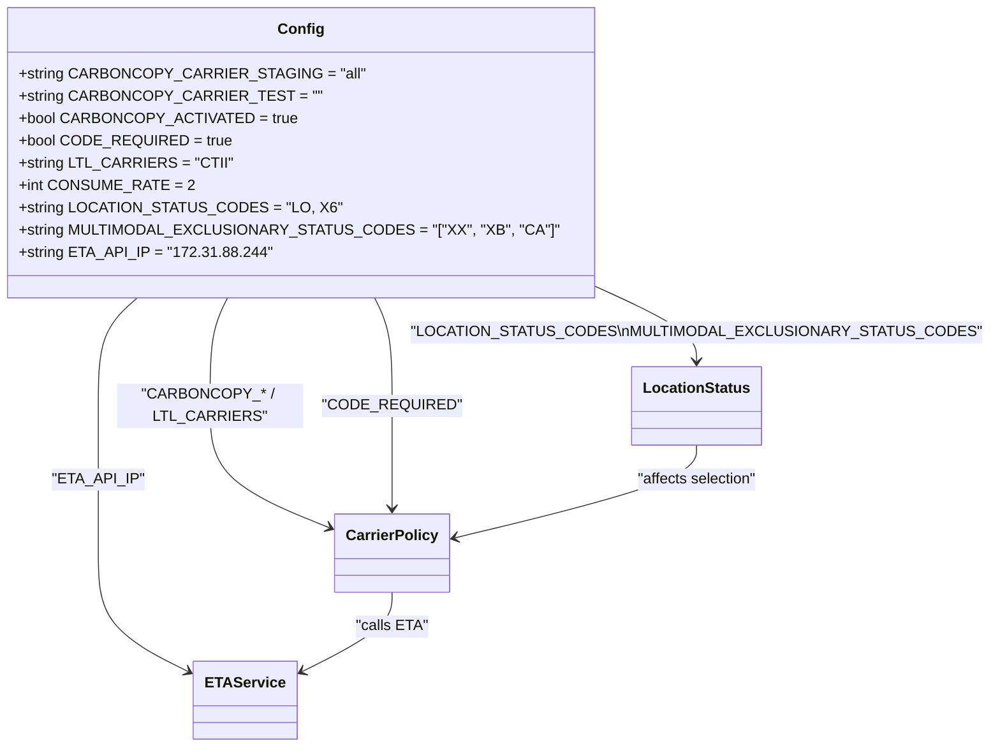
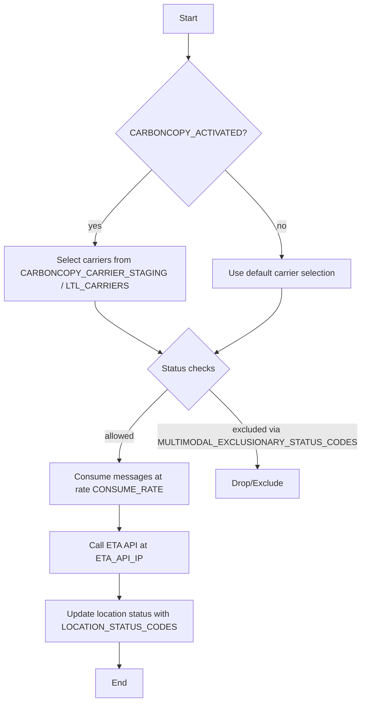

# Diagram: shipment_core/shipment_service/config/config.dev2.yml

> Auto-generated by Obscura crawlers

## Diagram 1

### SVG

<svg id="container" width="947.71484375" xmlns="http://www.w3.org/2000/svg" class="classDiagram" height="802" viewBox="0 0 947.71484375 802" role="graphics-document document" aria-roledescription="class"><g><defs><marker id="container_class-aggregationStart" class="marker aggregation class" refX="18" refY="7" markerWidth="190" markerHeight="240" orient="auto"><path d="M 18,7 L9,13 L1,7 L9,1 Z"></path></marker></defs><defs><marker id="container_class-aggregationEnd" class="marker aggregation class" refX="1" refY="7" markerWidth="20" markerHeight="28" orient="auto"><path d="M 18,7 L9,13 L1,7 L9,1 Z"></path></marker></defs><defs><marker id="container_class-extensionStart" class="marker extension class" refX="18" refY="7" markerWidth="190" markerHeight="240" orient="auto"><path d="M 1,7 L18,13 V 1 Z"></path></marker></defs><defs><marker id="container_class-extensionEnd" class="marker extension class" refX="1" refY="7" markerWidth="20" markerHeight="28" orient="auto"><path d="M 1,1 V 13 L18,7 Z"></path></marker></defs><defs><marker id="container_class-compositionStart" class="marker composition class" refX="18" refY="7" markerWidth="190" markerHeight="240" orient="auto"><path d="M 18,7 L9,13 L1,7 L9,1 Z"></path></marker></defs><defs><marker id="container_class-compositionEnd" class="marker composition class" refX="1" refY="7" markerWidth="20" markerHeight="28" orient="auto"><path d="M 18,7 L9,13 L1,7 L9,1 Z"></path></marker></defs><defs><marker id="container_class-dependencyStart" class="marker dependency class" refX="6" refY="7" markerWidth="190" markerHeight="240" orient="auto"><path d="M 5,7 L9,13 L1,7 L9,1 Z"></path></marker></defs><defs><marker id="container_class-dependencyEnd" class="marker dependency class" refX="13" refY="7" markerWidth="20" markerHeight="28" orient="auto"><path d="M 18,7 L9,13 L14,7 L9,1 Z"></path></marker></defs><defs><marker id="container_class-lollipopStart" class="marker lollipop class" refX="13" refY="7" markerWidth="190" markerHeight="240" orient="auto"><circle stroke="black" fill="transparent" cx="7" cy="7" r="6"></circle></marker></defs><defs><marker id="container_class-lollipopEnd" class="marker lollipop class" refX="1" refY="7" markerWidth="190" markerHeight="240" orient="auto"><circle stroke="black" fill="transparent" cx="7" cy="7" r="6"></circle></marker></defs><g class="root"><g class="clusters"></g><g class="edgePaths"><path d="M215.746,320L212.769,326.167C209.793,332.333,203.84,344.667,200.863,364C197.887,383.333,197.887,409.667,197.887,436C197.887,462.333,197.887,488.667,218.177,510.437C238.467,532.207,279.048,549.414,299.338,558.017L319.628,566.621" id="id_Config_CarrierPolicy_1" class="edge-thickness-normal edge-pattern-solid relation" style=";;;" data-edge="true" data-et="edge" data-id="id_Config_CarrierPolicy_1" data-points="W3sieCI6MjE1Ljc0NTY4ODk1NzI1MzksInkiOjMyMH0seyJ4IjoxOTcuODg2NzE4NzUsInkiOjM1N30seyJ4IjoxOTcuODg2NzE4NzUsInkiOjQzNn0seyJ4IjoxOTcuODg2NzE4NzUsInkiOjUxNX0seyJ4IjozMjUuMTUyMzQzNzUsInkiOjU2OC45NjMwMTU3NjY1MjEzfV0=" marker-end="url(#container_class-dependencyEnd)"></path><path d="M574.086,307.411L590.398,315.676C606.71,323.941,639.333,340.47,655.645,353.902C671.957,367.333,671.957,377.667,671.957,382.833L671.957,388" id="id_Config_LocationStatus_2" class="edge-thickness-normal edge-pattern-solid relation" style=";;;" data-edge="true" data-et="edge" data-id="id_Config_LocationStatus_2" data-points="W3sieCI6NTc0LjA4NTkzNzUsInkiOjMwNy40MTEwNjkxNzk4MTAwNn0seyJ4Ijo2NzEuOTU3MDMxMjUsInkiOjM1N30seyJ4Ijo2NzEuOTU3MDMxMjUsInkiOjM5NH1d" marker-end="url(#container_class-dependencyEnd)"></path><path d="M118.751,320L111.94,326.167C105.129,332.333,91.508,344.667,84.697,364C77.887,383.333,77.887,409.667,77.887,436C77.887,462.333,77.887,488.667,77.887,515C77.887,541.333,77.887,567.667,77.887,594C77.887,620.333,77.887,646.667,93.941,668.114C109.995,689.562,142.103,706.123,158.157,714.404L174.211,722.685" id="id_Config_ETAService_3" class="edge-thickness-normal edge-pattern-solid relation" style=";;;" data-edge="true" data-et="edge" data-id="id_Config_ETAService_3" data-points="W3sieCI6MTE4Ljc1MDg3MDMwNDQwNDE1LCJ5IjozMjB9LHsieCI6NzcuODg2NzE4NzUsInkiOjM1N30seyJ4Ijo3Ny44ODY3MTg3NSwieSI6NDM2fSx7IngiOjc3Ljg4NjcxODc1LCJ5Ijo1MTV9LHsieCI6NzcuODg2NzE4NzUsInkiOjU5NH0seyJ4Ijo3Ny44ODY3MTg3NSwieSI6NjczfSx7IngiOjE3OS41NDI5Njg3NSwieSI6NzI1LjQzNTYyNTM4MjU3NDl9XQ==" marker-end="url(#container_class-dependencyEnd)"></path><path d="M366.34,320L369.317,326.167C372.293,332.333,378.246,344.667,381.223,364C384.199,383.333,384.199,409.667,384.199,436C384.199,462.333,384.199,488.667,384.199,507C384.199,525.333,384.199,535.667,384.199,540.833L384.199,546" id="id_Config_CarrierPolicy_4" class="edge-thickness-normal edge-pattern-solid relation" style=";;;" data-edge="true" data-et="edge" data-id="id_Config_CarrierPolicy_4" data-points="W3sieCI6MzY2LjM0MDI0ODU0Mjc0NjEsInkiOjMyMH0seyJ4IjozODQuMTk5MjE4NzUsInkiOjM1N30seyJ4IjozODQuMTk5MjE4NzUsInkiOjQzNn0seyJ4IjozODQuMTk5MjE4NzUsInkiOjUxNX0seyJ4IjozODQuMTk5MjE4NzUsInkiOjU1Mn1d" marker-end="url(#container_class-dependencyEnd)"></path><path d="M384.199,636L384.199,642.167C384.199,648.333,384.199,660.667,368.145,675.114C352.091,689.562,319.983,706.123,303.929,714.404L287.875,722.685" id="id_CarrierPolicy_ETAService_5" class="edge-thickness-normal edge-pattern-solid relation" style=";;;" data-edge="true" data-et="edge" data-id="id_CarrierPolicy_ETAService_5" data-points="W3sieCI6Mzg0LjE5OTIxODc1LCJ5Ijo2MzZ9LHsieCI6Mzg0LjE5OTIxODc1LCJ5Ijo2NzN9LHsieCI6MjgyLjU0Mjk2ODc1LCJ5Ijo3MjUuNDM1NjI1MzgyNTc0OX1d" marker-end="url(#container_class-dependencyEnd)"></path><path d="M671.957,478L671.957,484.167C671.957,490.333,671.957,502.667,634.803,519.034C597.649,535.4,523.34,555.801,486.186,566.001L449.032,576.201" id="id_LocationStatus_CarrierPolicy_6" class="edge-thickness-normal edge-pattern-solid relation" style=";;;" data-edge="true" data-et="edge" data-id="id_LocationStatus_CarrierPolicy_6" data-points="W3sieCI6NjcxLjk1NzAzMTI1LCJ5Ijo0Nzh9LHsieCI6NjcxLjk1NzAzMTI1LCJ5Ijo1MTV9LHsieCI6NDQzLjI0NjA5Mzc1LCJ5Ijo1NzcuNzg5NDgyMjU3NzU4fV0=" marker-end="url(#container_class-dependencyEnd)"></path></g><g class="edgeLabels"><g class="edgeLabel" transform="translate(197.88671875, 436)"><g class="label" data-id="id_Config_CarrierPolicy_1" transform="translate(-100, -24)"><foreignObject width="200" height="48">

"CARBONCOPY_* / LTL_CARRIERS"

</foreignObject></g></g><g class="edgeLabel" transform="translate(671.95703125, 357)"><g class="label" data-id="id_Config_LocationStatus_2" transform="translate(-267.7578125, -12)"><foreignObject width="535.515625" height="24">

"LOCATION_STATUS_CODES\nMULTIMODAL_EXCLUSIONARY_STATUS_CODES"

</foreignObject></g></g><g class="edgeLabel" transform="translate(77.88671875, 515)"><g class="label" data-id="id_Config_ETAService_3" transform="translate(-45.90625, -12)"><foreignObject width="91.8125" height="24">

"ETA_API_IP"

</foreignObject></g></g><g class="edgeLabel" transform="translate(384.19921875, 436)"><g class="label" data-id="id_Config_CarrierPolicy_4" transform="translate(-66.3125, -12)"><foreignObject width="132.625" height="24">

"CODE_REQUIRED"

</foreignObject></g></g><g class="edgeLabel" transform="translate(384.19921875, 673)"><g class="label" data-id="id_CarrierPolicy_ETAService_5" transform="translate(-37.2265625, -12)"><foreignObject width="74.453125" height="24">

"calls ETA"

</foreignObject></g></g><g class="edgeLabel" transform="translate(671.95703125, 515)"><g class="label" data-id="id_LocationStatus_CarrierPolicy_6" transform="translate(-65.8359375, -12)"><foreignObject width="131.671875" height="24">

"affects selection"

</foreignObject></g></g></g><g class="nodes"><g class="node default" id="classId-Config-0" transform="translate(291.04296875, 164)"><g class="basic label-container"><path d="M-283.04296875 -156 L283.04296875 -156 L283.04296875 156 L-283.04296875 156" stroke="none" stroke-width="0" fill="#ECECFF" style=""></path><path d="M-283.04296875 -156 C-98.42254869110093 -156, 86.19787136779814 -156, 283.04296875 -156 M-283.04296875 -156 C-125.9500421857696 -156, 31.142884378460792 -156, 283.04296875 -156 M283.04296875 -156 C283.04296875 -93.1205967670395, 283.04296875 -30.241193534078988, 283.04296875 156 M283.04296875 -156 C283.04296875 -65.68584925836399, 283.04296875 24.628301483272026, 283.04296875 156 M283.04296875 156 C61.987040844936104 156, -159.0688870601278 156, -283.04296875 156 M283.04296875 156 C145.57434110570046 156, 8.10571346140091 156, -283.04296875 156 M-283.04296875 156 C-283.04296875 78.88540766134767, -283.04296875 1.7708153226953414, -283.04296875 -156 M-283.04296875 156 C-283.04296875 43.75148638620668, -283.04296875 -68.49702722758664, -283.04296875 -156" stroke="#9370DB" stroke-width="1.3" fill="none" stroke-dasharray="0 0" style=""></path></g><g class="annotation-group text" transform="translate(0, -132)"></g><g class="label-group text" transform="translate(-22.9296875, -132)"><g class="label" style="font-weight: bolder" transform="translate(0,-12)"><foreignObject width="45.859375" height="24">

Config

</foreignObject></g></g><g class="members-group text" transform="translate(-271.04296875, -84)"><g class="label" style="" transform="translate(0,-12)"><foreignObject width="332.84375" height="24">

+string CARBONCOPY_CARRIER_STAGING = "all"

</foreignObject></g><g class="label" style="" transform="translate(0,12)"><foreignObject width="287.546875" height="24">

+string CARBONCOPY_CARRIER_TEST = ""

</foreignObject></g><g class="label" style="" transform="translate(0,36)"><foreignObject width="270.34375" height="24">

+bool CARBONCOPY_ACTIVATED = true

</foreignObject></g><g class="label" style="" transform="translate(0,60)"><foreignObject width="211.4375" height="24">

+bool CODE_REQUIRED = true

</foreignObject></g><g class="label" style="" transform="translate(0,84)"><foreignObject width="209.234375" height="24">

+string LTL_CARRIERS = "CTII"

</foreignObject></g><g class="label" style="" transform="translate(0,108)"><foreignObject width="170.453125" height="24">

+int CONSUME_RATE = 2

</foreignObject></g><g class="label" style="" transform="translate(0,132)"><foreignObject width="310.375" height="24">

+string LOCATION_STATUS_CODES = "LO, X6"

</foreignObject></g><g class="label" style="" transform="translate(0,156)"><foreignObject width="519.15625" height="24">

+string MULTIMODAL_EXCLUSIONARY_STATUS_CODES = "["XX", "XB", "CA"]"

</foreignObject></g><g class="label" style="" transform="translate(0,180)"><foreignObject width="251.390625" height="24">

+string ETA_API_IP = "172.31.88.244"

</foreignObject></g></g><g class="methods-group text" transform="translate(-271.04296875, 156)"></g><g class="divider" style=""><path d="M-283.04296875 -108 C-151.22253383523815 -108, -19.402098920476305 -108, 283.04296875 -108 M-283.04296875 -108 C-135.02618226162488 -108, 12.990604226750236 -108, 283.04296875 -108" stroke="#9370DB" stroke-width="1.3" fill="none" stroke-dasharray="0 0" style=""></path></g><g class="divider" style=""><path d="M-283.04296875 132 C-137.3300524208307 132, 8.382863908338607 132, 283.04296875 132 M-283.04296875 132 C-67.56313906959514 132, 147.91669061080972 132, 283.04296875 132" stroke="#9370DB" stroke-width="1.3" fill="none" stroke-dasharray="0 0" style=""></path></g></g><g class="node default" id="classId-CarrierPolicy-1" transform="translate(384.19921875, 594)"><g class="basic label-container"><path d="M-59.046875 -42 L59.046875 -42 L59.046875 42 L-59.046875 42" stroke="none" stroke-width="0" fill="#ECECFF" style=""></path><path d="M-59.046875 -42 C-21.49296966631337 -42, 16.060935667373258 -42, 59.046875 -42 M-59.046875 -42 C-27.096047131545653 -42, 4.854780736908694 -42, 59.046875 -42 M59.046875 -42 C59.046875 -20.66457851296822, 59.046875 0.6708429740635609, 59.046875 42 M59.046875 -42 C59.046875 -17.025107485673214, 59.046875 7.949785028653572, 59.046875 42 M59.046875 42 C20.27534458749127 42, -18.496185825017463 42, -59.046875 42 M59.046875 42 C13.600351543959007 42, -31.846171912081985 42, -59.046875 42 M-59.046875 42 C-59.046875 14.019969388998867, -59.046875 -13.960061222002267, -59.046875 -42 M-59.046875 42 C-59.046875 15.60196974745142, -59.046875 -10.79606050509716, -59.046875 -42" stroke="#9370DB" stroke-width="1.3" fill="none" stroke-dasharray="0 0" style=""></path></g><g class="annotation-group text" transform="translate(0, -18)"></g><g class="label-group text" transform="translate(-47.046875, -18)"><g class="label" style="font-weight: bolder" transform="translate(0,-12)"><foreignObject width="94.09375" height="24">

CarrierPolicy

</foreignObject></g></g><g class="members-group text" transform="translate(-47.046875, 30)"></g><g class="methods-group text" transform="translate(-47.046875, 60)"></g><g class="divider" style=""><path d="M-59.046875 6 C-14.904799263510498 6, 29.237276472979005 6, 59.046875 6 M-59.046875 6 C-19.113405227903613 6, 20.820064544192775 6, 59.046875 6" stroke="#9370DB" stroke-width="1.3" fill="none" stroke-dasharray="0 0" style=""></path></g><g class="divider" style=""><path d="M-59.046875 24 C-17.354058692038876 24, 24.338757615922248 24, 59.046875 24 M-59.046875 24 C-28.001987361518612 24, 3.0429002769627758 24, 59.046875 24" stroke="#9370DB" stroke-width="1.3" fill="none" stroke-dasharray="0 0" style=""></path></g></g><g class="node default" id="classId-LocationStatus-2" transform="translate(671.95703125, 436)"><g class="basic label-container"><path d="M-66.828125 -42 L66.828125 -42 L66.828125 42 L-66.828125 42" stroke="none" stroke-width="0" fill="#ECECFF" style=""></path><path d="M-66.828125 -42 C-39.052537278217656 -42, -11.276949556435312 -42, 66.828125 -42 M-66.828125 -42 C-16.990159211776536 -42, 32.84780657644693 -42, 66.828125 -42 M66.828125 -42 C66.828125 -21.912949652733715, 66.828125 -1.8258993054674306, 66.828125 42 M66.828125 -42 C66.828125 -25.054669572848752, 66.828125 -8.109339145697504, 66.828125 42 M66.828125 42 C23.94902659677519 42, -18.930071806449618 42, -66.828125 42 M66.828125 42 C15.402814868395495 42, -36.02249526320901 42, -66.828125 42 M-66.828125 42 C-66.828125 14.095341676768868, -66.828125 -13.809316646462264, -66.828125 -42 M-66.828125 42 C-66.828125 14.39691220142576, -66.828125 -13.20617559714848, -66.828125 -42" stroke="#9370DB" stroke-width="1.3" fill="none" stroke-dasharray="0 0" style=""></path></g><g class="annotation-group text" transform="translate(0, -18)"></g><g class="label-group text" transform="translate(-54.828125, -18)"><g class="label" style="font-weight: bolder" transform="translate(0,-12)"><foreignObject width="109.65625" height="24">

LocationStatus

</foreignObject></g></g><g class="members-group text" transform="translate(-54.828125, 30)"></g><g class="methods-group text" transform="translate(-54.828125, 60)"></g><g class="divider" style=""><path d="M-66.828125 6 C-16.468365951729048 6, 33.891393096541904 6, 66.828125 6 M-66.828125 6 C-25.745447109727102 6, 15.337230780545795 6, 66.828125 6" stroke="#9370DB" stroke-width="1.3" fill="none" stroke-dasharray="0 0" style=""></path></g><g class="divider" style=""><path d="M-66.828125 24 C-22.246897244156408 24, 22.334330511687185 24, 66.828125 24 M-66.828125 24 C-25.308072997829953 24, 16.211979004340094 24, 66.828125 24" stroke="#9370DB" stroke-width="1.3" fill="none" stroke-dasharray="0 0" style=""></path></g></g><g class="node default" id="classId-ETAService-3" transform="translate(231.04296875, 752)"><g class="basic label-container"><path d="M-51.5 -42 L51.5 -42 L51.5 42 L-51.5 42" stroke="none" stroke-width="0" fill="#ECECFF" style=""></path><path d="M-51.5 -42 C-26.15847181781179 -42, -0.8169436356235806 -42, 51.5 -42 M-51.5 -42 C-28.963380237909284 -42, -6.426760475818568 -42, 51.5 -42 M51.5 -42 C51.5 -23.012114521394576, 51.5 -4.024229042789152, 51.5 42 M51.5 -42 C51.5 -13.025551368063297, 51.5 15.948897263873405, 51.5 42 M51.5 42 C26.291459365730088 42, 1.0829187314601754 42, -51.5 42 M51.5 42 C14.707867484537744 42, -22.084265030924513 42, -51.5 42 M-51.5 42 C-51.5 15.3147809303229, -51.5 -11.3704381393542, -51.5 -42 M-51.5 42 C-51.5 19.262695935109207, -51.5 -3.4746081297815863, -51.5 -42" stroke="#9370DB" stroke-width="1.3" fill="none" stroke-dasharray="0 0" style=""></path></g><g class="annotation-group text" transform="translate(0, -18)"></g><g class="label-group text" transform="translate(-39.5, -18)"><g class="label" style="font-weight: bolder" transform="translate(0,-12)"><foreignObject width="79" height="24">

ETAService

</foreignObject></g></g><g class="members-group text" transform="translate(-39.5, 30)"></g><g class="methods-group text" transform="translate(-39.5, 60)"></g><g class="divider" style=""><path d="M-51.5 6 C-17.2847716906604 6, 16.9304566186792 6, 51.5 6 M-51.5 6 C-11.460772373234676 6, 28.57845525353065 6, 51.5 6" stroke="#9370DB" stroke-width="1.3" fill="none" stroke-dasharray="0 0" style=""></path></g><g class="divider" style=""><path d="M-51.5 24 C-26.430517707990568 24, -1.361035415981135 24, 51.5 24 M-51.5 24 C-26.818157553070623 24, -2.1363151061412466 24, 51.5 24" stroke="#9370DB" stroke-width="1.3" fill="none" stroke-dasharray="0 0" style=""></path></g></g></g></g></g></svg>

## Diagram 2

### SVG

<svg id="container" width="622.53125" xmlns="http://www.w3.org/2000/svg" class="flowchart" height="1274.671875" viewBox="0 0 622.53125 1274.671875" role="graphics-document document" aria-roledescription="flowchart-v2"><g><marker id="container_flowchart-v2-pointEnd" class="marker flowchart-v2" viewBox="0 0 10 10" refX="5" refY="5" markerUnits="userSpaceOnUse" markerWidth="8" markerHeight="8" orient="auto"><path d="M 0 0 L 10 5 L 0 10 z" class="arrowMarkerPath" style="stroke-width: 1; stroke-dasharray: 1, 0;"></path></marker><marker id="container_flowchart-v2-pointStart" class="marker flowchart-v2" viewBox="0 0 10 10" refX="4.5" refY="5" markerUnits="userSpaceOnUse" markerWidth="8" markerHeight="8" orient="auto"><path d="M 0 5 L 10 10 L 10 0 z" class="arrowMarkerPath" style="stroke-width: 1; stroke-dasharray: 1, 0;"></path></marker><marker id="container_flowchart-v2-circleEnd" class="marker flowchart-v2" viewBox="0 0 10 10" refX="11" refY="5" markerUnits="userSpaceOnUse" markerWidth="11" markerHeight="11" orient="auto"><circle cx="5" cy="5" r="5" class="arrowMarkerPath" style="stroke-width: 1; stroke-dasharray: 1, 0;"></circle></marker><marker id="container_flowchart-v2-circleStart" class="marker flowchart-v2" viewBox="0 0 10 10" refX="-1" refY="5" markerUnits="userSpaceOnUse" markerWidth="11" markerHeight="11" orient="auto"><circle cx="5" cy="5" r="5" class="arrowMarkerPath" style="stroke-width: 1; stroke-dasharray: 1, 0;"></circle></marker><marker id="container_flowchart-v2-crossEnd" class="marker cross flowchart-v2" viewBox="0 0 11 11" refX="12" refY="5.2" markerUnits="userSpaceOnUse" markerWidth="11" markerHeight="11" orient="auto"><path d="M 1,1 l 9,9 M 10,1 l -9,9" class="arrowMarkerPath" style="stroke-width: 2; stroke-dasharray: 1, 0;"></path></marker><marker id="container_flowchart-v2-crossStart" class="marker cross flowchart-v2" viewBox="0 0 11 11" refX="-1" refY="5.2" markerUnits="userSpaceOnUse" markerWidth="11" markerHeight="11" orient="auto"><path d="M 1,1 l 9,9 M 10,1 l -9,9" class="arrowMarkerPath" style="stroke-width: 2; stroke-dasharray: 1, 0;"></path></marker><g class="root"><g class="clusters"></g><g class="edgePaths"><path d="M320.398,62L320.398,66.167C320.398,70.333,320.398,78.667,320.398,86.333C320.398,94,320.398,101,320.398,104.5L320.398,108" id="L_A_B_0" class="edge-thickness-normal edge-pattern-solid edge-thickness-normal edge-pattern-solid flowchart-link" style=";" data-edge="true" data-et="edge" data-id="L_A_B_0" data-points="W3sieCI6MzIwLjM5ODQzNzUsInkiOjYyfSx7IngiOjMyMC4zOTg0Mzc1LCJ5Ijo4N30seyJ4IjozMjAuMzk4NDM3NSwieSI6MTEyfV0=" marker-end="url(#container_flowchart-v2-pointEnd)"></path><path d="M259.098,290.497L241.96,306.88C224.821,323.263,190.543,356.03,173.404,377.914C156.266,399.797,156.266,410.797,156.266,416.297L156.266,421.797" id="L_B_C_0" class="edge-thickness-normal edge-pattern-solid edge-thickness-normal edge-pattern-solid flowchart-link" style=";" data-edge="true" data-et="edge" data-id="L_B_C_0" data-points="W3sieCI6MjU5LjA5ODI3NTA5NzY0Njc2LCJ5IjoyOTAuNDk2NzEyNTk3NjQ2NzZ9LHsieCI6MTU2LjI2NTYyNSwieSI6Mzg4Ljc5Njg3NX0seyJ4IjoxNTYuMjY1NjI1LCJ5Ijo0MjUuNzk2ODc1fV0=" marker-end="url(#container_flowchart-v2-pointEnd)"></path><path d="M381.699,290.497L398.837,306.88C415.976,323.263,450.254,356.03,467.392,379.914C484.531,403.797,484.531,418.797,484.531,426.297L484.531,433.797" id="L_B_D_0" class="edge-thickness-normal edge-pattern-solid edge-thickness-normal edge-pattern-solid flowchart-link" style=";" data-edge="true" data-et="edge" data-id="L_B_D_0" data-points="W3sieCI6MzgxLjY5ODU5OTkwMjM1MzI0LCJ5IjoyOTAuNDk2NzEyNTk3NjQ2NzZ9LHsieCI6NDg0LjUzMTI1LCJ5IjozODguNzk2ODc1fSx7IngiOjQ4NC41MzEyNSwieSI6NDM3Ljc5Njg3NX1d" marker-end="url(#container_flowchart-v2-pointEnd)"></path><path d="M156.266,527.797L156.266,531.964C156.266,536.13,156.266,544.464,175.18,560.32C194.095,576.176,231.925,599.556,250.84,611.246L269.754,622.935" id="L_C_E_0" class="edge-thickness-normal edge-pattern-solid edge-thickness-normal edge-pattern-solid flowchart-link" style=";" data-edge="true" data-et="edge" data-id="L_C_E_0" data-points="W3sieCI6MTU2LjI2NTYyNSwieSI6NTI3Ljc5Njg3NX0seyJ4IjoxNTYuMjY1NjI1LCJ5Ijo1NTIuNzk2ODc1fSx7IngiOjI3My4xNTcwODA4MjM2MjU0NSwieSI6NjI1LjAzODIzMTY3NjM3NDV9XQ==" marker-end="url(#container_flowchart-v2-pointEnd)"></path><path d="M484.531,515.797L484.531,521.964C484.531,528.13,484.531,540.464,465.616,558.32C446.702,576.176,408.872,599.556,389.957,611.246L371.042,622.935" id="L_D_E_0" class="edge-thickness-normal edge-pattern-solid edge-thickness-normal edge-pattern-solid flowchart-link" style=";" data-edge="true" data-et="edge" data-id="L_D_E_0" data-points="W3sieCI6NDg0LjUzMTI1LCJ5Ijo1MTUuNzk2ODc1fSx7IngiOjQ4NC41MzEyNSwieSI6NTUyLjc5Njg3NX0seyJ4IjozNjcuNjM5Nzk0MTc2Mzc0NTUsInkiOjYyNS4wMzgyMzE2NzYzNzQ1fV0=" marker-end="url(#container_flowchart-v2-pointEnd)"></path><path d="M281.523,691.797L266.366,706.443C251.208,721.089,220.893,750.38,205.736,772.526C190.578,794.672,190.578,809.672,190.578,817.172L190.578,824.672" id="L_E_F_0" class="edge-thickness-normal edge-pattern-solid edge-thickness-normal edge-pattern-solid flowchart-link" style=";" data-edge="true" data-et="edge" data-id="L_E_F_0" data-points="W3sieCI6MjgxLjUyMzQ2NjE5MzQxNjYsInkiOjY5MS43OTY5MDM2OTM0MTY1fSx7IngiOjE5MC41NzgxMjUsInkiOjc3OS42NzE4NzV9LHsieCI6MTkwLjU3ODEyNSwieSI6ODI4LjY3MTg3NX1d" marker-end="url(#container_flowchart-v2-pointEnd)"></path><path d="M359.273,691.797L374.431,706.443C389.589,721.089,419.904,750.38,435.061,774.526C450.219,798.672,450.219,817.672,450.219,827.172L450.219,836.672" id="L_E_G_0" class="edge-thickness-normal edge-pattern-solid edge-thickness-normal edge-pattern-solid flowchart-link" style=";" data-edge="true" data-et="edge" data-id="L_E_G_0" data-points="W3sieCI6MzU5LjI3MzQwODgwNjU4MzQsInkiOjY5MS43OTY5MDM2OTM0MTY1fSx7IngiOjQ1MC4yMTg3NSwieSI6Nzc5LjY3MTg3NX0seyJ4Ijo0NTAuMjE4NzUsInkiOjg0MC42NzE4NzV9XQ==" marker-end="url(#container_flowchart-v2-pointEnd)"></path><path d="M190.578,906.672L190.578,910.839C190.578,915.005,190.578,923.339,190.578,931.005C190.578,938.672,190.578,945.672,190.578,949.172L190.578,952.672" id="L_F_H_0" class="edge-thickness-normal edge-pattern-solid edge-thickness-normal edge-pattern-solid flowchart-link" style=";" data-edge="true" data-et="edge" data-id="L_F_H_0" data-points="W3sieCI6MTkwLjU3ODEyNSwieSI6OTA2LjY3MTg3NX0seyJ4IjoxOTAuNTc4MTI1LCJ5Ijo5MzEuNjcxODc1fSx7IngiOjE5MC41NzgxMjUsInkiOjk1Ni42NzE4NzV9XQ==" marker-end="url(#container_flowchart-v2-pointEnd)"></path><path d="M190.578,1010.672L190.578,1014.839C190.578,1019.005,190.578,1027.339,190.578,1035.005C190.578,1042.672,190.578,1049.672,190.578,1053.172L190.578,1056.672" id="L_H_I_0" class="edge-thickness-normal edge-pattern-solid edge-thickness-normal edge-pattern-solid flowchart-link" style=";" data-edge="true" data-et="edge" data-id="L_H_I_0" data-points="W3sieCI6MTkwLjU3ODEyNSwieSI6MTAxMC42NzE4NzV9LHsieCI6MTkwLjU3ODEyNSwieSI6MTAzNS42NzE4NzV9LHsieCI6MTkwLjU3ODEyNSwieSI6MTA2MC42NzE4NzV9XQ==" marker-end="url(#container_flowchart-v2-pointEnd)"></path><path d="M190.578,1162.672L190.578,1166.839C190.578,1171.005,190.578,1179.339,190.578,1187.005C190.578,1194.672,190.578,1201.672,190.578,1205.172L190.578,1208.672" id="L_I_J_0" class="edge-thickness-normal edge-pattern-solid edge-thickness-normal edge-pattern-solid flowchart-link" style=";" data-edge="true" data-et="edge" data-id="L_I_J_0" data-points="W3sieCI6MTkwLjU3ODEyNSwieSI6MTE2Mi42NzE4NzV9LHsieCI6MTkwLjU3ODEyNSwieSI6MTE4Ny42NzE4NzV9LHsieCI6MTkwLjU3ODEyNSwieSI6MTIxMi42NzE4NzV9XQ==" marker-end="url(#container_flowchart-v2-pointEnd)"></path></g><g class="edgeLabels"><g class="edgeLabel"><g class="label" data-id="L_A_B_0" transform="translate(0, 0)"><foreignObject width="0" height="0">

</foreignObject></g></g><g class="edgeLabel" transform="translate(156.265625, 388.796875)"><g class="label" data-id="L_B_C_0" transform="translate(-12.0078125, -12)"><foreignObject width="24.015625" height="24">

yes

</foreignObject></g></g><g class="edgeLabel" transform="translate(484.53125, 388.796875)"><g class="label" data-id="L_B_D_0" transform="translate(-9.3671875, -12)"><foreignObject width="18.734375" height="24">

no

</foreignObject></g></g><g class="edgeLabel"><g class="label" data-id="L_C_E_0" transform="translate(0, 0)"><foreignObject width="0" height="0">

</foreignObject></g></g><g class="edgeLabel"><g class="label" data-id="L_D_E_0" transform="translate(0, 0)"><foreignObject width="0" height="0">

</foreignObject></g></g><g class="edgeLabel" transform="translate(190.578125, 779.671875)"><g class="label" data-id="L_E_F_0" transform="translate(-28.4765625, -12)"><foreignObject width="56.953125" height="24">

allowed

</foreignObject></g></g><g class="edgeLabel" transform="translate(450.21875, 779.671875)"><g class="label" data-id="L_E_G_0" transform="translate(-160.515625, -24)"><foreignObject width="321.03125" height="48">

excluded via MULTIMODAL_EXCLUSIONARY_STATUS_CODES

</foreignObject></g></g><g class="edgeLabel"><g class="label" data-id="L_F_H_0" transform="translate(0, 0)"><foreignObject width="0" height="0">

</foreignObject></g></g><g class="edgeLabel"><g class="label" data-id="L_H_I_0" transform="translate(0, 0)"><foreignObject width="0" height="0">

</foreignObject></g></g><g class="edgeLabel"><g class="label" data-id="L_I_J_0" transform="translate(0, 0)"><foreignObject width="0" height="0">

</foreignObject></g></g></g><g class="nodes"><g class="node default" id="flowchart-A-0" transform="translate(320.3984375, 35)"><rect class="basic label-container" style="" x="-47.5234375" y="-27" width="95.046875" height="54"></rect><g class="label" style="" transform="translate(-17.5234375, -12)"><rect></rect><foreignObject width="35.046875" height="24">

Start

</foreignObject></g></g><g class="node default" id="flowchart-B-1" transform="translate(320.3984375, 231.8984375)"><polygon points="119.8984375,0 239.796875,-119.8984375 119.8984375,-239.796875 0,-119.8984375" class="label-container" transform="translate(-119.3984375, 119.8984375)"></polygon><g class="label" style="" transform="translate(-92.8984375, -12)"><rect></rect><foreignObject width="185.796875" height="24">

CARBONCOPY_ACTIVATED?

</foreignObject></g></g><g class="node default" id="flowchart-C-3" transform="translate(156.265625, 476.796875)"><rect class="basic label-container" style="" x="-148.265625" y="-51" width="296.53125" height="102"></rect><g class="label" style="" transform="translate(-118.265625, -36)"><rect></rect><foreignObject width="236.53125" height="72">

Select carriers from CARBONCOPY_CARRIER_STAGING / LTL_CARRIERS

</foreignObject></g></g><g class="node default" id="flowchart-D-5" transform="translate(484.53125, 476.796875)"><rect class="basic label-container" style="" x="-130" y="-39" width="260" height="78"></rect><g class="label" style="" transform="translate(-100, -24)"><rect></rect><foreignObject width="200" height="48">

Use default carrier selection

</foreignObject></g></g><g class="node default" id="flowchart-E-7" transform="translate(320.3984375, 654.234375)"><polygon points="76.4375,0 152.875,-76.4375 76.4375,-152.875 0,-76.4375" class="label-container" transform="translate(-75.9375, 76.4375)"></polygon><g class="label" style="" transform="translate(-49.4375, -12)"><rect></rect><foreignObject width="98.875" height="24">

Status checks

</foreignObject></g></g><g class="node default" id="flowchart-F-11" transform="translate(190.578125, 867.671875)"><rect class="basic label-container" style="" x="-130" y="-39" width="260" height="78"></rect><g class="label" style="" transform="translate(-100, -24)"><rect></rect><foreignObject width="200" height="48">

Consume messages at rate CONSUME_RATE

</foreignObject></g></g><g class="node default" id="flowchart-G-13" transform="translate(450.21875, 867.671875)"><rect class="basic label-container" style="" x="-79.640625" y="-27" width="159.28125" height="54"></rect><g class="label" style="" transform="translate(-49.640625, -12)"><rect></rect><foreignObject width="99.28125" height="24">

Drop/Exclude

</foreignObject></g></g><g class="node default" id="flowchart-H-15" transform="translate(190.578125, 983.671875)"><rect class="basic label-container" style="" x="-122.796875" y="-27" width="245.59375" height="54"></rect><g class="label" style="" transform="translate(-92.796875, -12)"><rect></rect><foreignObject width="185.59375" height="24">

Call ETA API at ETA_API_IP

</foreignObject></g></g><g class="node default" id="flowchart-I-17" transform="translate(190.578125, 1111.671875)"><rect class="basic label-container" style="" x="-130" y="-51" width="260" height="102"></rect><g class="label" style="" transform="translate(-100, -36)"><rect></rect><foreignObject width="200" height="72">

Update location status with LOCATION_STATUS_CODES

</foreignObject></g></g><g class="node default" id="flowchart-J-19" transform="translate(190.578125, 1239.671875)"><rect class="basic label-container" style="" x="-43.6796875" y="-27" width="87.359375" height="54"></rect><g class="label" style="" transform="translate(-13.6796875, -12)"><rect></rect><foreignObject width="27.359375" height="24">

End

</foreignObject></g></g></g></g></g></svg>
