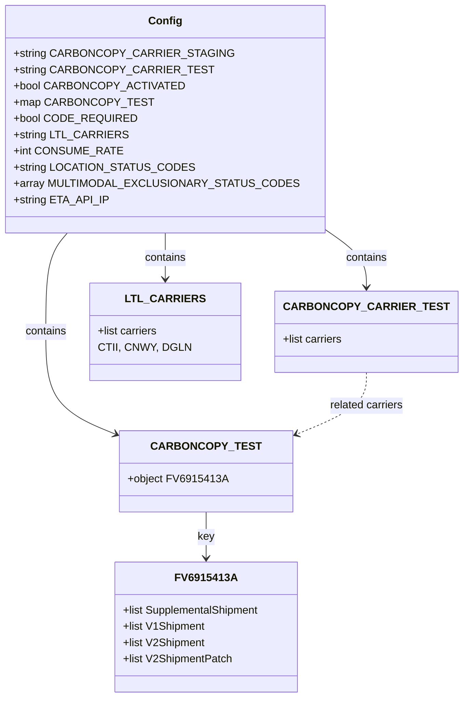

# Diagram: shipment_core/shipment_service/config/config.prod-b.yml


> Auto-generated by Obscura crawlers

## Diagram 1



### SVG

<svg id="container" width="605.125" xmlns="http://www.w3.org/2000/svg" class="classDiagram" height="1030" viewBox="0 0 605.125 1030" role="graphics-document document" aria-roledescription="class"><style>#container{font-family:"trebuchet ms",verdana,arial,sans-serif;font-size:16px;fill:#333;}@keyframes edge-animation-frame{from{stroke-dashoffset:0;}}@keyframes dash{to{stroke-dashoffset:0;}}#container .edge-animation-slow{stroke-dasharray:9,5!important;stroke-dashoffset:900;animation:dash 50s linear infinite;stroke-linecap:round;}#container .edge-animation-fast{stroke-dasharray:9,5!important;stroke-dashoffset:900;animation:dash 20s linear infinite;stroke-linecap:round;}#container .error-icon{fill:#552222;}#container .error-text{fill:#552222;stroke:#552222;}#container .edge-thickness-normal{stroke-width:1px;}#container .edge-thickness-thick{stroke-width:3.5px;}#container .edge-pattern-solid{stroke-dasharray:0;}#container .edge-thickness-invisible{stroke-width:0;fill:none;}#container .edge-pattern-dashed{stroke-dasharray:3;}#container .edge-pattern-dotted{stroke-dasharray:2;}#container .marker{fill:#333333;stroke:#333333;}#container .marker.cross{stroke:#333333;}#container svg{font-family:"trebuchet ms",verdana,arial,sans-serif;font-size:16px;}#container p{margin:0;}#container g.classGroup text{fill:#9370DB;stroke:none;font-family:"trebuchet ms",verdana,arial,sans-serif;font-size:10px;}#container g.classGroup text .title{font-weight:bolder;}#container .nodeLabel,#container .edgeLabel{color:#131300;}#container .edgeLabel .label rect{fill:#ECECFF;}#container .label text{fill:#131300;}#container .labelBkg{background:#ECECFF;}#container .edgeLabel .label span{background:#ECECFF;}#container .classTitle{font-weight:bolder;}#container .node rect,#container .node circle,#container .node ellipse,#container .node polygon,#container .node path{fill:#ECECFF;stroke:#9370DB;stroke-width:1px;}#container .divider{stroke:#9370DB;stroke-width:1;}#container g.clickable{cursor:pointer;}#container g.classGroup rect{fill:#ECECFF;stroke:#9370DB;}#container g.classGroup line{stroke:#9370DB;stroke-width:1;}#container .classLabel .box{stroke:none;stroke-width:0;fill:#ECECFF;opacity:0.5;}#container .classLabel .label{fill:#9370DB;font-size:10px;}#container .relation{stroke:#333333;stroke-width:1;fill:none;}#container .dashed-line{stroke-dasharray:3;}#container .dotted-line{stroke-dasharray:1 2;}#container #compositionStart,#container .composition{fill:#333333!important;stroke:#333333!important;stroke-width:1;}#container #compositionEnd,#container .composition{fill:#333333!important;stroke:#333333!important;stroke-width:1;}#container #dependencyStart,#container .dependency{fill:#333333!important;stroke:#333333!important;stroke-width:1;}#container #dependencyStart,#container .dependency{fill:#333333!important;stroke:#333333!important;stroke-width:1;}#container #extensionStart,#container .extension{fill:transparent!important;stroke:#333333!important;stroke-width:1;}#container #extensionEnd,#container .extension{fill:transparent!important;stroke:#333333!important;stroke-width:1;}#container #aggregationStart,#container .aggregation{fill:transparent!important;stroke:#333333!important;stroke-width:1;}#container #aggregationEnd,#container .aggregation{fill:transparent!important;stroke:#333333!important;stroke-width:1;}#container #lollipopStart,#container .lollipop{fill:#ECECFF!important;stroke:#333333!important;stroke-width:1;}#container #lollipopEnd,#container .lollipop{fill:#ECECFF!important;stroke:#333333!important;stroke-width:1;}#container .edgeTerminals{font-size:11px;line-height:initial;}#container .classTitleText{text-anchor:middle;font-size:18px;fill:#333;}#container .label-icon{display:inline-block;height:1em;overflow:visible;vertical-align:-0.125em;}#container .node .label-icon path{fill:currentColor;stroke:revert;stroke-width:revert;}#container :root{--mermaid-font-family:"trebuchet ms",verdana,arial,sans-serif;}</style><g><defs><marker id="container_class-aggregationStart" class="marker aggregation class" refX="18" refY="7" markerWidth="190" markerHeight="240" orient="auto"><path d="M 18,7 L9,13 L1,7 L9,1 Z"></path></marker></defs><defs><marker id="container_class-aggregationEnd" class="marker aggregation class" refX="1" refY="7" markerWidth="20" markerHeight="28" orient="auto"><path d="M 18,7 L9,13 L1,7 L9,1 Z"></path></marker></defs><defs><marker id="container_class-extensionStart" class="marker extension class" refX="18" refY="7" markerWidth="190" markerHeight="240" orient="auto"><path d="M 1,7 L18,13 V 1 Z"></path></marker></defs><defs><marker id="container_class-extensionEnd" class="marker extension class" refX="1" refY="7" markerWidth="20" markerHeight="28" orient="auto"><path d="M 1,1 V 13 L18,7 Z"></path></marker></defs><defs><marker id="container_class-compositionStart" class="marker composition class" refX="18" refY="7" markerWidth="190" markerHeight="240" orient="auto"><path d="M 18,7 L9,13 L1,7 L9,1 Z"></path></marker></defs><defs><marker id="container_class-compositionEnd" class="marker composition class" refX="1" refY="7" markerWidth="20" markerHeight="28" orient="auto"><path d="M 18,7 L9,13 L1,7 L9,1 Z"></path></marker></defs><defs><marker id="container_class-dependencyStart" class="marker dependency class" refX="6" refY="7" markerWidth="190" markerHeight="240" orient="auto"><path d="M 5,7 L9,13 L1,7 L9,1 Z"></path></marker></defs><defs><marker id="container_class-dependencyEnd" class="marker dependency class" refX="13" refY="7" markerWidth="20" markerHeight="28" orient="auto"><path d="M 18,7 L9,13 L14,7 L9,1 Z"></path></marker></defs><defs><marker id="container_class-lollipopStart" class="marker lollipop class" refX="13" refY="7" markerWidth="190" markerHeight="240" orient="auto"><circle stroke="black" fill="transparent" cx="7" cy="7" r="6"></circle></marker></defs><defs><marker id="container_class-lollipopEnd" class="marker lollipop class" refX="1" refY="7" markerWidth="190" markerHeight="240" orient="auto"><circle stroke="black" fill="transparent" cx="7" cy="7" r="6"></circle></marker></defs><g class="root"><g class="clusters"></g><g class="edgePaths"><path d="M424.773,337.398L434.156,344.665C443.539,351.932,462.305,366.466,471.688,380.9C481.07,395.333,481.07,409.667,481.07,416.833L481.07,424" id="id_Config_CARBONCOPY_CARRIER_TEST_1" class="edge-thickness-normal edge-pattern-solid relation" style=";;;" data-edge="true" data-et="edge" data-id="id_Config_CARBONCOPY_CARRIER_TEST_1" data-points="W3sieCI6NDI0Ljc3MzQzNzUsInkiOjMzNy4zOTc1MjY1Mjc4NDEzfSx7IngiOjQ4MS4wNzAzMTI1LCJ5IjozODF9LHsieCI6NDgxLjA3MDMxMjUsInkiOjQzMH1d" marker-end="url(#container_class-dependencyEnd)"></path><path d="M81.561,344L76.612,350.167C71.663,356.333,61.765,368.667,56.816,393C51.867,417.333,51.867,453.667,51.867,490C51.867,526.333,51.867,562.667,67.482,587.891C83.097,613.116,114.326,627.232,129.941,634.289L145.556,641.347" id="id_Config_CARBONCOPY_TEST_2" class="edge-thickness-normal edge-pattern-solid relation" style=";;;" data-edge="true" data-et="edge" data-id="id_Config_CARBONCOPY_TEST_2" data-points="W3sieCI6ODEuNTYwOTU2NTU0ODc4MDYsInkiOjM0NH0seyJ4Ijo1MS44NjcxODc1LCJ5IjozODF9LHsieCI6NTEuODY3MTg3NSwieSI6NDkwfSx7IngiOjUxLjg2NzE4NzUsInkiOjU5OX0seyJ4IjoxNTEuMDIzNDM3NSwieSI6NjQzLjgxODY2ODMxNzAxMTl9XQ==" marker-end="url(#container_class-dependencyEnd)"></path><path d="M216.387,344L216.387,350.167C216.387,356.333,216.387,368.667,216.387,380C216.387,391.333,216.387,401.667,216.387,406.833L216.387,412" id="id_Config_LTL_CARRIERS_3" class="edge-thickness-normal edge-pattern-solid relation" style=";;;" data-edge="true" data-et="edge" data-id="id_Config_LTL_CARRIERS_3" data-points="W3sieCI6MjE2LjM4NjcxODc1LCJ5IjozNDR9LHsieCI6MjE2LjM4NjcxODc1LCJ5IjozODF9LHsieCI6MjE2LjM4NjcxODc1LCJ5Ijo0MTh9XQ==" marker-end="url(#container_class-dependencyEnd)"></path><path d="M266.469,756L266.469,762.167C266.469,768.333,266.469,780.667,266.469,792C266.469,803.333,266.469,813.667,266.469,818.833L266.469,824" id="id_CARBONCOPY_TEST_FV6915413A_4" class="edge-thickness-normal edge-pattern-solid relation" style=";;;" data-edge="true" data-et="edge" data-id="id_CARBONCOPY_TEST_FV6915413A_4" data-points="W3sieCI6MjY2LjQ2ODc1LCJ5Ijo3NTZ9LHsieCI6MjY2LjQ2ODc1LCJ5Ijo3OTN9LHsieCI6MjY2LjQ2ODc1LCJ5Ijo4MzB9XQ==" marker-end="url(#container_class-dependencyEnd)"></path><path d="M481.07,550L481.07,558.167C481.07,566.333,481.07,582.667,465.456,597.891C449.841,613.116,418.611,627.232,402.996,634.289L387.381,641.347" id="id_CARBONCOPY_CARRIER_TEST_CARBONCOPY_TEST_5" class="edge-thickness-normal edge-pattern-dashed relation" style=";;;" data-edge="true" data-et="edge" data-id="id_CARBONCOPY_CARRIER_TEST_CARBONCOPY_TEST_5" data-points="W3sieCI6NDgxLjA3MDMxMjUsInkiOjU1MH0seyJ4Ijo0ODEuMDcwMzEyNSwieSI6NTk5fSx7IngiOjM4MS45MTQwNjI1LCJ5Ijo2NDMuODE4NjY4MzE3MDExOX1d" marker-end="url(#container_class-dependencyEnd)"></path></g><g class="edgeLabels"><g class="edgeLabel" transform="translate(481.0703125, 381)"><g class="label" data-id="id_Config_CARBONCOPY_CARRIER_TEST_1" transform="translate(-30.890625, -12)"><foreignObject width="61.78125" height="24"><div xmlns="http://www.w3.org/1999/xhtml" class="labelBkg" style="display: table-cell; white-space: nowrap; line-height: 1.5; max-width: 200px; text-align: center;"><span class="edgeLabel"><p>contains</p></span></div></foreignObject></g></g><g class="edgeLabel" transform="translate(51.8671875, 490)"><g class="label" data-id="id_Config_CARBONCOPY_TEST_2" transform="translate(-30.890625, -12)"><foreignObject width="61.78125" height="24"><div xmlns="http://www.w3.org/1999/xhtml" class="labelBkg" style="display: table-cell; white-space: nowrap; line-height: 1.5; max-width: 200px; text-align: center;"><span class="edgeLabel"><p>contains</p></span></div></foreignObject></g></g><g class="edgeLabel" transform="translate(216.38671875, 381)"><g class="label" data-id="id_Config_LTL_CARRIERS_3" transform="translate(-30.890625, -12)"><foreignObject width="61.78125" height="24"><div xmlns="http://www.w3.org/1999/xhtml" class="labelBkg" style="display: table-cell; white-space: nowrap; line-height: 1.5; max-width: 200px; text-align: center;"><span class="edgeLabel"><p>contains</p></span></div></foreignObject></g></g><g class="edgeLabel" transform="translate(266.46875, 793)"><g class="label" data-id="id_CARBONCOPY_TEST_FV6915413A_4" transform="translate(-12.2890625, -12)"><foreignObject width="24.578125" height="24"><div xmlns="http://www.w3.org/1999/xhtml" class="labelBkg" style="display: table-cell; white-space: nowrap; line-height: 1.5; max-width: 200px; text-align: center;"><span class="edgeLabel"><p>key</p></span></div></foreignObject></g></g><g class="edgeLabel" transform="translate(481.0703125, 599)"><g class="label" data-id="id_CARBONCOPY_CARRIER_TEST_CARBONCOPY_TEST_5" transform="translate(-55.4921875, -12)"><foreignObject width="110.984375" height="24"><div xmlns="http://www.w3.org/1999/xhtml" class="labelBkg" style="display: table-cell; white-space: nowrap; line-height: 1.5; max-width: 200px; text-align: center;"><span class="edgeLabel"><p>related carriers</p></span></div></foreignObject></g></g></g><g class="nodes"><g class="node default" id="classId-Config-0" transform="translate(216.38671875, 176)"><g class="basic label-container"><path d="M-208.38671875 -168 L208.38671875 -168 L208.38671875 168 L-208.38671875 168" stroke="none" stroke-width="0" fill="#ECECFF" style=""></path><path d="M-208.38671875 -168 C-67.35741217662019 -168, 73.67189439675963 -168, 208.38671875 -168 M-208.38671875 -168 C-60.425843486802364 -168, 87.53503177639527 -168, 208.38671875 -168 M208.38671875 -168 C208.38671875 -95.92597300692698, 208.38671875 -23.85194601385396, 208.38671875 168 M208.38671875 -168 C208.38671875 -92.60642172892065, 208.38671875 -17.212843457841302, 208.38671875 168 M208.38671875 168 C45.46439560598452 168, -117.45792753803096 168, -208.38671875 168 M208.38671875 168 C121.85707552136478 168, 35.327432292729554 168, -208.38671875 168 M-208.38671875 168 C-208.38671875 48.507646032019125, -208.38671875 -70.98470793596175, -208.38671875 -168 M-208.38671875 168 C-208.38671875 50.71349159366514, -208.38671875 -66.57301681266972, -208.38671875 -168" stroke="#9370DB" stroke-width="1.3" fill="none" stroke-dasharray="0 0" style=""></path></g><g class="annotation-group text" transform="translate(0, -144)"></g><g class="label-group text" transform="translate(-22.9296875, -144)"><g class="label" style="font-weight: bolder" transform="translate(0,-12)"><foreignObject width="45.859375" height="24"><div xmlns="http://www.w3.org/1999/xhtml" style="display: table-cell; white-space: nowrap; line-height: 1.5; max-width: 96px; text-align: center;"><span class="nodeLabel markdown-node-label" style=""><p>Config</p></span></div></foreignObject></g></g><g class="members-group text" transform="translate(-196.38671875, -96)"><g class="label" style="" transform="translate(0,-12)"><foreignObject width="286.15625" height="24"><div xmlns="http://www.w3.org/1999/xhtml" style="display: table-cell; white-space: nowrap; line-height: 1.5; max-width: 344px; text-align: center;"><span class="nodeLabel markdown-node-label" style=""><p>+string CARBONCOPY_CARRIER_STAGING</p></span></div></foreignObject></g><g class="label" style="" transform="translate(0,12)"><foreignObject width="258.296875" height="24"><div xmlns="http://www.w3.org/1999/xhtml" style="display: table-cell; white-space: nowrap; line-height: 1.5; max-width: 316px; text-align: center;"><span class="nodeLabel markdown-node-label" style=""><p>+string CARBONCOPY_CARRIER_TEST</p></span></div></foreignObject></g><g class="label" style="" transform="translate(0,36)"><foreignObject width="223.875" height="24"><div xmlns="http://www.w3.org/1999/xhtml" style="display: table-cell; white-space: nowrap; line-height: 1.5; max-width: 281px; text-align: center;"><span class="nodeLabel markdown-node-label" style=""><p>+bool CARBONCOPY_ACTIVATED</p></span></div></foreignObject></g><g class="label" style="" transform="translate(0,60)"><foreignObject width="180.453125" height="24"><div xmlns="http://www.w3.org/1999/xhtml" style="display: table-cell; white-space: nowrap; line-height: 1.5; max-width: 239px; text-align: center;"><span class="nodeLabel markdown-node-label" style=""><p>+map CARBONCOPY_TEST</p></span></div></foreignObject></g><g class="label" style="" transform="translate(0,84)"><foreignObject width="164.96875" height="24"><div xmlns="http://www.w3.org/1999/xhtml" style="display: table-cell; white-space: nowrap; line-height: 1.5; max-width: 222px; text-align: center;"><span class="nodeLabel markdown-node-label" style=""><p>+bool CODE_REQUIRED</p></span></div></foreignObject></g><g class="label" style="" transform="translate(0,108)"><foreignObject width="153.484375" height="24"><div xmlns="http://www.w3.org/1999/xhtml" style="display: table-cell; white-space: nowrap; line-height: 1.5; max-width: 211px; text-align: center;"><span class="nodeLabel markdown-node-label" style=""><p>+string LTL_CARRIERS</p></span></div></foreignObject></g><g class="label" style="" transform="translate(0,132)"><foreignObject width="146.0625" height="24"><div xmlns="http://www.w3.org/1999/xhtml" style="display: table-cell; white-space: nowrap; line-height: 1.5; max-width: 203px; text-align: center;"><span class="nodeLabel markdown-node-label" style=""><p>+int CONSUME_RATE</p></span></div></foreignObject></g><g class="label" style="" transform="translate(0,156)"><foreignObject width="238.515625" height="24"><div xmlns="http://www.w3.org/1999/xhtml" style="display: table-cell; white-space: nowrap; line-height: 1.5; max-width: 296px; text-align: center;"><span class="nodeLabel markdown-node-label" style=""><p>+string LOCATION_STATUS_CODES</p></span></div></foreignObject></g><g class="label" style="" transform="translate(0,180)"><foreignObject width="369.84375" height="24"><div xmlns="http://www.w3.org/1999/xhtml" style="display: table-cell; white-space: nowrap; line-height: 1.5; max-width: 427px; text-align: center;"><span class="nodeLabel markdown-node-label" style=""><p>+array MULTIMODAL_EXCLUSIONARY_STATUS_CODES</p></span></div></foreignObject></g><g class="label" style="" transform="translate(0,204)"><foreignObject width="132.90625" height="24"><div xmlns="http://www.w3.org/1999/xhtml" style="display: table-cell; white-space: nowrap; line-height: 1.5; max-width: 190px; text-align: center;"><span class="nodeLabel markdown-node-label" style=""><p>+string ETA_API_IP</p></span></div></foreignObject></g></g><g class="methods-group text" transform="translate(-196.38671875, 168)"></g><g class="divider" style=""><path d="M-208.38671875 -120 C-86.44741220192047 -120, 35.49189434615906 -120, 208.38671875 -120 M-208.38671875 -120 C-80.59892733020392 -120, 47.18886408959216 -120, 208.38671875 -120" stroke="#9370DB" stroke-width="1.3" fill="none" stroke-dasharray="0 0" style=""></path></g><g class="divider" style=""><path d="M-208.38671875 144 C-86.87981884451838 144, 34.627081060963235 144, 208.38671875 144 M-208.38671875 144 C-113.38359356098648 144, -18.380468371972967 144, 208.38671875 144" stroke="#9370DB" stroke-width="1.3" fill="none" stroke-dasharray="0 0" style=""></path></g></g><g class="node default" id="classId-CARBONCOPY_CARRIER_TEST-1" transform="translate(481.0703125, 490)"><g class="basic label-container"><path d="M-116.0546875 -60 L116.0546875 -60 L116.0546875 60 L-116.0546875 60" stroke="none" stroke-width="0" fill="#ECECFF" style=""></path><path d="M-116.0546875 -60 C-51.65622836416688 -60, 12.742230771666243 -60, 116.0546875 -60 M-116.0546875 -60 C-35.00022532923384 -60, 46.054236841532315 -60, 116.0546875 -60 M116.0546875 -60 C116.0546875 -34.14209520837188, 116.0546875 -8.284190416743755, 116.0546875 60 M116.0546875 -60 C116.0546875 -22.642905754065083, 116.0546875 14.714188491869834, 116.0546875 60 M116.0546875 60 C58.964027338381854 60, 1.8733671767637077 60, -116.0546875 60 M116.0546875 60 C54.49446109738652 60, -7.065765305226961 60, -116.0546875 60 M-116.0546875 60 C-116.0546875 35.11830849089547, -116.0546875 10.236616981790952, -116.0546875 -60 M-116.0546875 60 C-116.0546875 16.331318662272167, -116.0546875 -27.337362675455665, -116.0546875 -60" stroke="#9370DB" stroke-width="1.3" fill="none" stroke-dasharray="0 0" style=""></path></g><g class="annotation-group text" transform="translate(0, -36)"></g><g class="label-group text" transform="translate(-104.0546875, -36)"><g class="label" style="font-weight: bolder" transform="translate(0,-12)"><foreignObject width="208.109375" height="24"><div xmlns="http://www.w3.org/1999/xhtml" style="display: table-cell; white-space: nowrap; line-height: 1.5; max-width: 255px; text-align: center;"><span class="nodeLabel markdown-node-label" style=""><p>CARBONCOPY_CARRIER_TEST</p></span></div></foreignObject></g></g><g class="members-group text" transform="translate(-104.0546875, 12)"><g class="label" style="" transform="translate(0,-12)"><foreignObject width="89.859375" height="24"><div xmlns="http://www.w3.org/1999/xhtml" style="display: table-cell; white-space: nowrap; line-height: 1.5; max-width: 147px; text-align: center;"><span class="nodeLabel markdown-node-label" style=""><p>+list carriers</p></span></div></foreignObject></g></g><g class="methods-group text" transform="translate(-104.0546875, 60)"></g><g class="divider" style=""><path d="M-116.0546875 -12 C-24.025915160592902 -12, 68.0028571788142 -12, 116.0546875 -12 M-116.0546875 -12 C-30.62872230906737 -12, 54.79724288186526 -12, 116.0546875 -12" stroke="#9370DB" stroke-width="1.3" fill="none" stroke-dasharray="0 0" style=""></path></g><g class="divider" style=""><path d="M-116.0546875 36 C-25.850925468314983 36, 64.35283656337003 36, 116.0546875 36 M-116.0546875 36 C-66.88143129379517 36, -17.708175087590348 36, 116.0546875 36" stroke="#9370DB" stroke-width="1.3" fill="none" stroke-dasharray="0 0" style=""></path></g></g><g class="node default" id="classId-CARBONCOPY_TEST-2" transform="translate(266.46875, 696)"><g class="basic label-container"><path d="M-115.4453125 -60 L115.4453125 -60 L115.4453125 60 L-115.4453125 60" stroke="none" stroke-width="0" fill="#ECECFF" style=""></path><path d="M-115.4453125 -60 C-38.696442281335194 -60, 38.05242793732961 -60, 115.4453125 -60 M-115.4453125 -60 C-49.13500770425607 -60, 17.175297091487863 -60, 115.4453125 -60 M115.4453125 -60 C115.4453125 -35.39182538584622, 115.4453125 -10.783650771692443, 115.4453125 60 M115.4453125 -60 C115.4453125 -23.189840005238644, 115.4453125 13.620319989522713, 115.4453125 60 M115.4453125 60 C61.75040489824847 60, 8.055497296496938 60, -115.4453125 60 M115.4453125 60 C41.04294051871878 60, -33.35943146256244 60, -115.4453125 60 M-115.4453125 60 C-115.4453125 19.031297326395716, -115.4453125 -21.937405347208568, -115.4453125 -60 M-115.4453125 60 C-115.4453125 31.748204615149337, -115.4453125 3.4964092302986742, -115.4453125 -60" stroke="#9370DB" stroke-width="1.3" fill="none" stroke-dasharray="0 0" style=""></path></g><g class="annotation-group text" transform="translate(0, -36)"></g><g class="label-group text" transform="translate(-69.53125, -36)"><g class="label" style="font-weight: bolder" transform="translate(0,-12)"><foreignObject width="139.0625" height="24"><div xmlns="http://www.w3.org/1999/xhtml" style="display: table-cell; white-space: nowrap; line-height: 1.5; max-width: 187px; text-align: center;"><span class="nodeLabel markdown-node-label" style=""><p>CARBONCOPY_TEST</p></span></div></foreignObject></g></g><g class="members-group text" transform="translate(-103.4453125, 12)"><g class="label" style="" transform="translate(0,-12)"><foreignObject width="137.359375" height="24"><div xmlns="http://www.w3.org/1999/xhtml" style="display: table-cell; white-space: nowrap; line-height: 1.5; max-width: 196px; text-align: center;"><span class="nodeLabel markdown-node-label" style=""><p>+object FV6915413A</p></span></div></foreignObject></g></g><g class="methods-group text" transform="translate(-103.4453125, 60)"></g><g class="divider" style=""><path d="M-115.4453125 -12 C-43.26010706936036 -12, 28.925098361279282 -12, 115.4453125 -12 M-115.4453125 -12 C-25.823239767713304 -12, 63.79883296457339 -12, 115.4453125 -12" stroke="#9370DB" stroke-width="1.3" fill="none" stroke-dasharray="0 0" style=""></path></g><g class="divider" style=""><path d="M-115.4453125 36 C-36.05895380261329 36, 43.32740489477342 36, 115.4453125 36 M-115.4453125 36 C-27.125480676887065 36, 61.19435114622587 36, 115.4453125 36" stroke="#9370DB" stroke-width="1.3" fill="none" stroke-dasharray="0 0" style=""></path></g></g><g class="node default" id="classId-FV6915413A-3" transform="translate(266.46875, 926)"><g class="basic label-container"><path d="M-135.5625 -96 L135.5625 -96 L135.5625 96 L-135.5625 96" stroke="none" stroke-width="0" fill="#ECECFF" style=""></path><path d="M-135.5625 -96 C-38.771418466092626 -96, 58.01966306781475 -96, 135.5625 -96 M-135.5625 -96 C-69.54739893497465 -96, -3.5322978699493035 -96, 135.5625 -96 M135.5625 -96 C135.5625 -54.55918297643416, 135.5625 -13.118365952868317, 135.5625 96 M135.5625 -96 C135.5625 -44.18109431199059, 135.5625 7.637811376018817, 135.5625 96 M135.5625 96 C79.89994878351916 96, 24.237397567038343 96, -135.5625 96 M135.5625 96 C57.732104387238266 96, -20.098291225523468 96, -135.5625 96 M-135.5625 96 C-135.5625 43.99657686306666, -135.5625 -8.006846273866685, -135.5625 -96 M-135.5625 96 C-135.5625 40.90898155979516, -135.5625 -14.182036880409683, -135.5625 -96" stroke="#9370DB" stroke-width="1.3" fill="none" stroke-dasharray="0 0" style=""></path></g><g class="annotation-group text" transform="translate(0, -72)"></g><g class="label-group text" transform="translate(-41.671875, -72)"><g class="label" style="font-weight: bolder" transform="translate(0,-12)"><foreignObject width="83.34375" height="24"><div xmlns="http://www.w3.org/1999/xhtml" style="display: table-cell; white-space: nowrap; line-height: 1.5; max-width: 130px; text-align: center;"><span class="nodeLabel markdown-node-label" style=""><p>FV6915413A</p></span></div></foreignObject></g></g><g class="members-group text" transform="translate(-123.5625, -24)"><g class="label" style="" transform="translate(0,-12)"><foreignObject width="205.453125" height="24"><div xmlns="http://www.w3.org/1999/xhtml" style="display: table-cell; white-space: nowrap; line-height: 1.5; max-width: 263px; text-align: center;"><span class="nodeLabel markdown-node-label" style=""><p>+list SupplementalShipment</p></span></div></foreignObject></g><g class="label" style="" transform="translate(0,12)"><foreignObject width="119.875" height="24"><div xmlns="http://www.w3.org/1999/xhtml" style="display: table-cell; white-space: nowrap; line-height: 1.5; max-width: 177px; text-align: center;"><span class="nodeLabel markdown-node-label" style=""><p>+list V1Shipment</p></span></div></foreignObject></g><g class="label" style="" transform="translate(0,36)"><foreignObject width="121.1875" height="24"><div xmlns="http://www.w3.org/1999/xhtml" style="display: table-cell; white-space: nowrap; line-height: 1.5; max-width: 179px; text-align: center;"><span class="nodeLabel markdown-node-label" style=""><p>+list V2Shipment</p></span></div></foreignObject></g><g class="label" style="" transform="translate(0,60)"><foreignObject width="160.875" height="24"><div xmlns="http://www.w3.org/1999/xhtml" style="display: table-cell; white-space: nowrap; line-height: 1.5; max-width: 218px; text-align: center;"><span class="nodeLabel markdown-node-label" style=""><p>+list V2ShipmentPatch</p></span></div></foreignObject></g></g><g class="methods-group text" transform="translate(-123.5625, 96)"></g><g class="divider" style=""><path d="M-135.5625 -48 C-40.835307101287455 -48, 53.89188579742509 -48, 135.5625 -48 M-135.5625 -48 C-47.559782972050144 -48, 40.44293405589971 -48, 135.5625 -48" stroke="#9370DB" stroke-width="1.3" fill="none" stroke-dasharray="0 0" style=""></path></g><g class="divider" style=""><path d="M-135.5625 72 C-31.806603930313187 72, 71.94929213937363 72, 135.5625 72 M-135.5625 72 C-53.71541075592951 72, 28.131678488140977 72, 135.5625 72" stroke="#9370DB" stroke-width="1.3" fill="none" stroke-dasharray="0 0" style=""></path></g></g><g class="node default" id="classId-LTL_CARRIERS-4" transform="translate(216.38671875, 490)"><g class="basic label-container"><path d="M-98.62890625 -72 L98.62890625 -72 L98.62890625 72 L-98.62890625 72" stroke="none" stroke-width="0" fill="#ECECFF" style=""></path><path d="M-98.62890625 -72 C-55.578603180443395 -72, -12.52830011088679 -72, 98.62890625 -72 M-98.62890625 -72 C-58.67997184119365 -72, -18.731037432387296 -72, 98.62890625 -72 M98.62890625 -72 C98.62890625 -31.985983116747292, 98.62890625 8.028033766505416, 98.62890625 72 M98.62890625 -72 C98.62890625 -18.66008786313001, 98.62890625 34.67982427373998, 98.62890625 72 M98.62890625 72 C46.133776157453845 72, -6.3613539350923105 72, -98.62890625 72 M98.62890625 72 C22.844717041573006 72, -52.93947216685399 72, -98.62890625 72 M-98.62890625 72 C-98.62890625 31.72842524258177, -98.62890625 -8.543149514836458, -98.62890625 -72 M-98.62890625 72 C-98.62890625 16.732759328761013, -98.62890625 -38.534481342477974, -98.62890625 -72" stroke="#9370DB" stroke-width="1.3" fill="none" stroke-dasharray="0 0" style=""></path></g><g class="annotation-group text" transform="translate(0, -48)"></g><g class="label-group text" transform="translate(-50.8046875, -48)"><g class="label" style="font-weight: bolder" transform="translate(0,-12)"><foreignObject width="101.609375" height="24"><div xmlns="http://www.w3.org/1999/xhtml" style="display: table-cell; white-space: nowrap; line-height: 1.5; max-width: 150px; text-align: center;"><span class="nodeLabel markdown-node-label" style=""><p>LTL_CARRIERS</p></span></div></foreignObject></g></g><g class="members-group text" transform="translate(-86.62890625, 0)"><g class="label" style="" transform="translate(0,-12)"><foreignObject width="89.859375" height="24"><div xmlns="http://www.w3.org/1999/xhtml" style="display: table-cell; white-space: nowrap; line-height: 1.5; max-width: 147px; text-align: center;"><span class="nodeLabel markdown-node-label" style=""><p>+list carriers</p></span></div></foreignObject></g><g class="label" style="" transform="translate(0,12)"><foreignObject width="122.453125" height="24"><div xmlns="http://www.w3.org/1999/xhtml" style="display: table-cell; white-space: nowrap; line-height: 1.5; max-width: 172px; text-align: center;"><span class="nodeLabel markdown-node-label" style=""><p>CTII, CNWY, DGLN</p></span></div></foreignObject></g></g><g class="methods-group text" transform="translate(-86.62890625, 72)"></g><g class="divider" style=""><path d="M-98.62890625 -24 C-34.67556983861533 -24, 29.277766572769337 -24, 98.62890625 -24 M-98.62890625 -24 C-46.63527580730672 -24, 5.358354635386561 -24, 98.62890625 -24" stroke="#9370DB" stroke-width="1.3" fill="none" stroke-dasharray="0 0" style=""></path></g><g class="divider" style=""><path d="M-98.62890625 48 C-51.14967476056941 48, -3.670443271138822 48, 98.62890625 48 M-98.62890625 48 C-55.84840735069072 48, -13.067908451381442 48, 98.62890625 48" stroke="#9370DB" stroke-width="1.3" fill="none" stroke-dasharray="0 0" style=""></path></g></g></g></g></g></svg>

## Diagram 2

```mermaid
graph LR
    subgraph Carboncopy
        CC_ACTIVATED[CARBONCOPY_ACTIVATED="true"]
        CC_CARRIERS[CARBONCOPY_CARRIER_TEST]
        CC_TEST[CARBONCOPY_TEST]
    end
    subgraph FV6915413A_Group
        FV6915413A[\"FV6915413A\"]
        SS[SupplementalShipment: ALL]
        V1[V1Shipment: ALL]
        V2[V2Shipment: ALL]
        V2P[V2ShipmentPatch: ALL]
    end
    CC_ACTIVATED -->|enabled| CC_CARRIERS
    CC_CARRIERS -->|contains many IDs| CC_TEST
    CC_TEST --> FV6915413A
    FV6915413A --> SS
    FV6915413A --> V1
    FV6915413A --> V2
    FV6915413A --> V2P
```

> SVG rendering failed for this diagram.

## Diagram 3

```mermaid
flowchart TD
    ETA[\"ETA_API_IP: 44.203.136.85\"] --> CONFIG[Config]
    CONFIG --> CODE_REQ[\"CODE_REQUIRED: false\"]
    CONFIG --> CONSUME[\"CONSUME_RATE: 8\"]
    CONFIG --> LOC_STATUS[\"LOCATION_STATUS_CODES: LO, X6\"]
    CONFIG --> MULTI_EXCL[\"MULTIMODAL_EXCLUSIONARY_STATUS_CODES: [\\\"XX\\\", \\\"XB\\\", \\\"CA\\\"]\"]
    CONFIG --> LTL[\"LTL_CARRIERS: CTII, CNWY, DGLN\"]
    CONFIG --> CARBONCOPY_ACT[\"CARBONCOPY_ACTIVATED: true\"]
    CARBONCOPY_ACT --> CARBONCOPY_LIST[\"CARBONCOPY_CARRIER_TEST (many IDs)\"]
```

> SVG rendering failed for this diagram.
