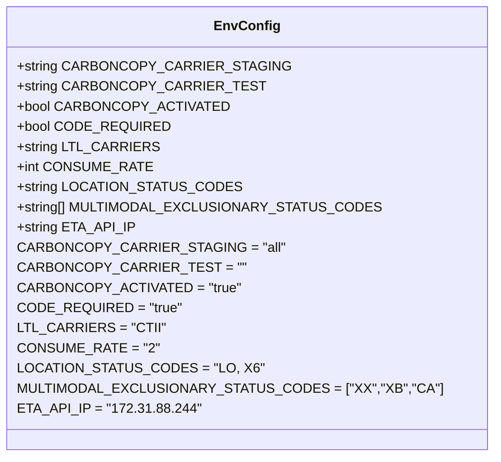

# Diagram: shipment_core/shipment_service/config/config.qa.yml


> Auto-generated by Obscura crawlers

## Diagram 1

```mermaid
flowchart LR
  A[Environment Configuration] -->|Feature Flags| FF[Feature Flags]
  A -->|Carrier Settings| CS[Carrier Settings]
  A -->|Rates & Limits| RL[Rates & Limits]
  A -->|Location & Status| LS[Location & Status]
  A -->|Network & APIs| NA[Network & APIs]
  FF --> F1[CARBONCOPY_ACTIVATED = "true"]
  FF --> F2[CARBONCOPY_CARRIER_STAGING = "all"]
  FF --> F3[CARBONCOPY_CARRIER_TEST = ""]
  CS --> C1[CODE_REQUIRED = "true"]
  CS --> C2[LTL_CARRIERS = "CTII"]
  RL --> R1[CONSUME_RATE = "2"]
  LS --> L1[LOCATION_STATUS_CODES = "LO, X6"]
  LS --> L2[MULTIMODAL_EXCLUSIONARY_STATUS_CODES = ["XX","XB","CA"]]
  NA --> N1[ETA_API_IP = "172.31.88.244"]
  style A fill:#f9f,stroke:#333,stroke-width:2px
  style FF fill:#bbf,stroke:#333
  style CS fill:#bbf,stroke:#333
  style RL fill:#bfb,stroke:#333
  style LS fill:#fbf,stroke:#333
  style NA fill:#ffb,stroke:#333
```

> SVG rendering failed for this diagram.

## Diagram 2



### SVG

<svg id="container" width="516.59375" xmlns="http://www.w3.org/2000/svg" class="classDiagram" height="544" viewBox="0 0 516.59375 544" role="graphics-document document" aria-roledescription="class"><style>#container{font-family:"trebuchet ms",verdana,arial,sans-serif;font-size:16px;fill:#333;}@keyframes edge-animation-frame{from{stroke-dashoffset:0;}}@keyframes dash{to{stroke-dashoffset:0;}}#container .edge-animation-slow{stroke-dasharray:9,5!important;stroke-dashoffset:900;animation:dash 50s linear infinite;stroke-linecap:round;}#container .edge-animation-fast{stroke-dasharray:9,5!important;stroke-dashoffset:900;animation:dash 20s linear infinite;stroke-linecap:round;}#container .error-icon{fill:#552222;}#container .error-text{fill:#552222;stroke:#552222;}#container .edge-thickness-normal{stroke-width:1px;}#container .edge-thickness-thick{stroke-width:3.5px;}#container .edge-pattern-solid{stroke-dasharray:0;}#container .edge-thickness-invisible{stroke-width:0;fill:none;}#container .edge-pattern-dashed{stroke-dasharray:3;}#container .edge-pattern-dotted{stroke-dasharray:2;}#container .marker{fill:#333333;stroke:#333333;}#container .marker.cross{stroke:#333333;}#container svg{font-family:"trebuchet ms",verdana,arial,sans-serif;font-size:16px;}#container p{margin:0;}#container g.classGroup text{fill:#9370DB;stroke:none;font-family:"trebuchet ms",verdana,arial,sans-serif;font-size:10px;}#container g.classGroup text .title{font-weight:bolder;}#container .nodeLabel,#container .edgeLabel{color:#131300;}#container .edgeLabel .label rect{fill:#ECECFF;}#container .label text{fill:#131300;}#container .labelBkg{background:#ECECFF;}#container .edgeLabel .label span{background:#ECECFF;}#container .classTitle{font-weight:bolder;}#container .node rect,#container .node circle,#container .node ellipse,#container .node polygon,#container .node path{fill:#ECECFF;stroke:#9370DB;stroke-width:1px;}#container .divider{stroke:#9370DB;stroke-width:1;}#container g.clickable{cursor:pointer;}#container g.classGroup rect{fill:#ECECFF;stroke:#9370DB;}#container g.classGroup line{stroke:#9370DB;stroke-width:1;}#container .classLabel .box{stroke:none;stroke-width:0;fill:#ECECFF;opacity:0.5;}#container .classLabel .label{fill:#9370DB;font-size:10px;}#container .relation{stroke:#333333;stroke-width:1;fill:none;}#container .dashed-line{stroke-dasharray:3;}#container .dotted-line{stroke-dasharray:1 2;}#container #compositionStart,#container .composition{fill:#333333!important;stroke:#333333!important;stroke-width:1;}#container #compositionEnd,#container .composition{fill:#333333!important;stroke:#333333!important;stroke-width:1;}#container #dependencyStart,#container .dependency{fill:#333333!important;stroke:#333333!important;stroke-width:1;}#container #dependencyStart,#container .dependency{fill:#333333!important;stroke:#333333!important;stroke-width:1;}#container #extensionStart,#container .extension{fill:transparent!important;stroke:#333333!important;stroke-width:1;}#container #extensionEnd,#container .extension{fill:transparent!important;stroke:#333333!important;stroke-width:1;}#container #aggregationStart,#container .aggregation{fill:transparent!important;stroke:#333333!important;stroke-width:1;}#container #aggregationEnd,#container .aggregation{fill:transparent!important;stroke:#333333!important;stroke-width:1;}#container #lollipopStart,#container .lollipop{fill:#ECECFF!important;stroke:#333333!important;stroke-width:1;}#container #lollipopEnd,#container .lollipop{fill:#ECECFF!important;stroke:#333333!important;stroke-width:1;}#container .edgeTerminals{font-size:11px;line-height:initial;}#container .classTitleText{text-anchor:middle;font-size:18px;fill:#333;}#container .label-icon{display:inline-block;height:1em;overflow:visible;vertical-align:-0.125em;}#container .node .label-icon path{fill:currentColor;stroke:revert;stroke-width:revert;}#container :root{--mermaid-font-family:"trebuchet ms",verdana,arial,sans-serif;}</style><g><defs><marker id="container_class-aggregationStart" class="marker aggregation class" refX="18" refY="7" markerWidth="190" markerHeight="240" orient="auto"><path d="M 18,7 L9,13 L1,7 L9,1 Z"></path></marker></defs><defs><marker id="container_class-aggregationEnd" class="marker aggregation class" refX="1" refY="7" markerWidth="20" markerHeight="28" orient="auto"><path d="M 18,7 L9,13 L1,7 L9,1 Z"></path></marker></defs><defs><marker id="container_class-extensionStart" class="marker extension class" refX="18" refY="7" markerWidth="190" markerHeight="240" orient="auto"><path d="M 1,7 L18,13 V 1 Z"></path></marker></defs><defs><marker id="container_class-extensionEnd" class="marker extension class" refX="1" refY="7" markerWidth="20" markerHeight="28" orient="auto"><path d="M 1,1 V 13 L18,7 Z"></path></marker></defs><defs><marker id="container_class-compositionStart" class="marker composition class" refX="18" refY="7" markerWidth="190" markerHeight="240" orient="auto"><path d="M 18,7 L9,13 L1,7 L9,1 Z"></path></marker></defs><defs><marker id="container_class-compositionEnd" class="marker composition class" refX="1" refY="7" markerWidth="20" markerHeight="28" orient="auto"><path d="M 18,7 L9,13 L1,7 L9,1 Z"></path></marker></defs><defs><marker id="container_class-dependencyStart" class="marker dependency class" refX="6" refY="7" markerWidth="190" markerHeight="240" orient="auto"><path d="M 5,7 L9,13 L1,7 L9,1 Z"></path></marker></defs><defs><marker id="container_class-dependencyEnd" class="marker dependency class" refX="13" refY="7" markerWidth="20" markerHeight="28" orient="auto"><path d="M 18,7 L9,13 L14,7 L9,1 Z"></path></marker></defs><defs><marker id="container_class-lollipopStart" class="marker lollipop class" refX="13" refY="7" markerWidth="190" markerHeight="240" orient="auto"><circle stroke="black" fill="transparent" cx="7" cy="7" r="6"></circle></marker></defs><defs><marker id="container_class-lollipopEnd" class="marker lollipop class" refX="1" refY="7" markerWidth="190" markerHeight="240" orient="auto"><circle stroke="black" fill="transparent" cx="7" cy="7" r="6"></circle></marker></defs><g class="root"><g class="clusters"></g><g class="edgePaths"></g><g class="edgeLabels"></g><g class="nodes"><g class="node default" id="classId-EnvConfig-0" transform="translate(258.296875, 272)"><g class="basic label-container"><path d="M-250.296875 -264 L250.296875 -264 L250.296875 264 L-250.296875 264" stroke="none" stroke-width="0" fill="#ECECFF" style=""></path><path d="M-250.296875 -264 C-120.68082276669364 -264, 8.935229466612725 -264, 250.296875 -264 M-250.296875 -264 C-113.73209260792771 -264, 22.832689784144577 -264, 250.296875 -264 M250.296875 -264 C250.296875 -110.24853774825064, 250.296875 43.50292450349872, 250.296875 264 M250.296875 -264 C250.296875 -122.14322115656938, 250.296875 19.713557686861236, 250.296875 264 M250.296875 264 C104.70159156152096 264, -40.89369187695809 264, -250.296875 264 M250.296875 264 C81.28513413826363 264, -87.72660672347274 264, -250.296875 264 M-250.296875 264 C-250.296875 78.4791945703727, -250.296875 -107.0416108592546, -250.296875 -264 M-250.296875 264 C-250.296875 67.94199258496664, -250.296875 -128.11601483006672, -250.296875 -264" stroke="#9370DB" stroke-width="1.3" fill="none" stroke-dasharray="0 0" style=""></path></g><g class="annotation-group text" transform="translate(0, -240)"></g><g class="label-group text" transform="translate(-35.734375, -240)"><g class="label" style="font-weight: bolder" transform="translate(0,-12)"><foreignObject width="71.46875" height="24"><div xmlns="http://www.w3.org/1999/xhtml" style="display: table-cell; white-space: nowrap; line-height: 1.5; max-width: 121px; text-align: center;"><span class="nodeLabel markdown-node-label" style=""><p>EnvConfig</p></span></div></foreignObject></g></g><g class="members-group text" transform="translate(-238.296875, -192)"><g class="label" style="" transform="translate(0,-12)"><foreignObject width="286.15625" height="24"><div xmlns="http://www.w3.org/1999/xhtml" style="display: table-cell; white-space: nowrap; line-height: 1.5; max-width: 344px; text-align: center;"><span class="nodeLabel markdown-node-label" style=""><p>+string CARBONCOPY_CARRIER_STAGING</p></span></div></foreignObject></g><g class="label" style="" transform="translate(0,12)"><foreignObject width="258.296875" height="24"><div xmlns="http://www.w3.org/1999/xhtml" style="display: table-cell; white-space: nowrap; line-height: 1.5; max-width: 316px; text-align: center;"><span class="nodeLabel markdown-node-label" style=""><p>+string CARBONCOPY_CARRIER_TEST</p></span></div></foreignObject></g><g class="label" style="" transform="translate(0,36)"><foreignObject width="223.875" height="24"><div xmlns="http://www.w3.org/1999/xhtml" style="display: table-cell; white-space: nowrap; line-height: 1.5; max-width: 281px; text-align: center;"><span class="nodeLabel markdown-node-label" style=""><p>+bool CARBONCOPY_ACTIVATED</p></span></div></foreignObject></g><g class="label" style="" transform="translate(0,60)"><foreignObject width="164.96875" height="24"><div xmlns="http://www.w3.org/1999/xhtml" style="display: table-cell; white-space: nowrap; line-height: 1.5; max-width: 222px; text-align: center;"><span class="nodeLabel markdown-node-label" style=""><p>+bool CODE_REQUIRED</p></span></div></foreignObject></g><g class="label" style="" transform="translate(0,84)"><foreignObject width="153.484375" height="24"><div xmlns="http://www.w3.org/1999/xhtml" style="display: table-cell; white-space: nowrap; line-height: 1.5; max-width: 211px; text-align: center;"><span class="nodeLabel markdown-node-label" style=""><p>+string LTL_CARRIERS</p></span></div></foreignObject></g><g class="label" style="" transform="translate(0,108)"><foreignObject width="146.0625" height="24"><div xmlns="http://www.w3.org/1999/xhtml" style="display: table-cell; white-space: nowrap; line-height: 1.5; max-width: 203px; text-align: center;"><span class="nodeLabel markdown-node-label" style=""><p>+int CONSUME_RATE</p></span></div></foreignObject></g><g class="label" style="" transform="translate(0,132)"><foreignObject width="238.515625" height="24"><div xmlns="http://www.w3.org/1999/xhtml" style="display: table-cell; white-space: nowrap; line-height: 1.5; max-width: 296px; text-align: center;"><span class="nodeLabel markdown-node-label" style=""><p>+string LOCATION_STATUS_CODES</p></span></div></foreignObject></g><g class="label" style="" transform="translate(0,156)"><foreignObject width="385.1875" height="24"><div xmlns="http://www.w3.org/1999/xhtml" style="display: table-cell; white-space: nowrap; line-height: 1.5; max-width: 443px; text-align: center;"><span class="nodeLabel markdown-node-label" style=""><p>+string[] MULTIMODAL_EXCLUSIONARY_STATUS_CODES</p></span></div></foreignObject></g><g class="label" style="" transform="translate(0,180)"><foreignObject width="132.90625" height="24"><div xmlns="http://www.w3.org/1999/xhtml" style="display: table-cell; white-space: nowrap; line-height: 1.5; max-width: 190px; text-align: center;"><span class="nodeLabel markdown-node-label" style=""><p>+string ETA_API_IP</p></span></div></foreignObject></g><g class="label" style="" transform="translate(0,204)"><foreignObject width="278.984375" height="24"><div xmlns="http://www.w3.org/1999/xhtml" style="display: table-cell; white-space: nowrap; line-height: 1.5; max-width: 329px; text-align: center;"><span class="nodeLabel markdown-node-label" style=""><p>CARBONCOPY_CARRIER_STAGING = "all"</p></span></div></foreignObject></g><g class="label" style="" transform="translate(0,228)"><foreignObject width="233.6875" height="24"><div xmlns="http://www.w3.org/1999/xhtml" style="display: table-cell; white-space: nowrap; line-height: 1.5; max-width: 284px; text-align: center;"><span class="nodeLabel markdown-node-label" style=""><p>CARBONCOPY_CARRIER_TEST = ""</p></span></div></foreignObject></g><g class="label" style="" transform="translate(0,252)"><foreignObject width="238.015625" height="24"><div xmlns="http://www.w3.org/1999/xhtml" style="display: table-cell; white-space: nowrap; line-height: 1.5; max-width: 288px; text-align: center;"><span class="nodeLabel markdown-node-label" style=""><p>CARBONCOPY_ACTIVATED = "true"</p></span></div></foreignObject></g><g class="label" style="" transform="translate(0,276)"><foreignObject width="179.09375" height="24"><div xmlns="http://www.w3.org/1999/xhtml" style="display: table-cell; white-space: nowrap; line-height: 1.5; max-width: 229px; text-align: center;"><span class="nodeLabel markdown-node-label" style=""><p>CODE_REQUIRED = "true"</p></span></div></foreignObject></g><g class="label" style="" transform="translate(0,300)"><foreignObject width="155.390625" height="24"><div xmlns="http://www.w3.org/1999/xhtml" style="display: table-cell; white-space: nowrap; line-height: 1.5; max-width: 205px; text-align: center;"><span class="nodeLabel markdown-node-label" style=""><p>LTL_CARRIERS = "CTII"</p></span></div></foreignObject></g><g class="label" style="" transform="translate(0,324)"><foreignObject width="151.34375" height="24"><div xmlns="http://www.w3.org/1999/xhtml" style="display: table-cell; white-space: nowrap; line-height: 1.5; max-width: 201px; text-align: center;"><span class="nodeLabel markdown-node-label" style=""><p>CONSUME_RATE = "2"</p></span></div></foreignObject></g><g class="label" style="" transform="translate(0,348)"><foreignObject width="256.515625" height="24"><div xmlns="http://www.w3.org/1999/xhtml" style="display: table-cell; white-space: nowrap; line-height: 1.5; max-width: 307px; text-align: center;"><span class="nodeLabel markdown-node-label" style=""><p>LOCATION_STATUS_CODES = "LO, X6"</p></span></div></foreignObject></g><g class="label" style="" transform="translate(0,372)"><foreignObject width="440.859375" height="24"><div xmlns="http://www.w3.org/1999/xhtml" style="display: table-cell; white-space: nowrap; line-height: 1.5; max-width: 491px; text-align: center;"><span class="nodeLabel markdown-node-label" style=""><p>MULTIMODAL_EXCLUSIONARY_STATUS_CODES = ["XX","XB","CA"]</p></span></div></foreignObject></g><g class="label" style="" transform="translate(0,396)"><foreignObject width="197.53125" height="24"><div xmlns="http://www.w3.org/1999/xhtml" style="display: table-cell; white-space: nowrap; line-height: 1.5; max-width: 248px; text-align: center;"><span class="nodeLabel markdown-node-label" style=""><p>ETA_API_IP = "172.31.88.244"</p></span></div></foreignObject></g></g><g class="methods-group text" transform="translate(-238.296875, 264)"></g><g class="divider" style=""><path d="M-250.296875 -216 C-108.37278711606135 -216, 33.55130076787731 -216, 250.296875 -216 M-250.296875 -216 C-51.43405013642342 -216, 147.42877472715315 -216, 250.296875 -216" stroke="#9370DB" stroke-width="1.3" fill="none" stroke-dasharray="0 0" style=""></path></g><g class="divider" style=""><path d="M-250.296875 240 C-88.70767177498666 240, 72.88153145002667 240, 250.296875 240 M-250.296875 240 C-62.540388740572496 240, 125.21609751885501 240, 250.296875 240" stroke="#9370DB" stroke-width="1.3" fill="none" stroke-dasharray="0 0" style=""></path></g></g></g></g></g></svg>
