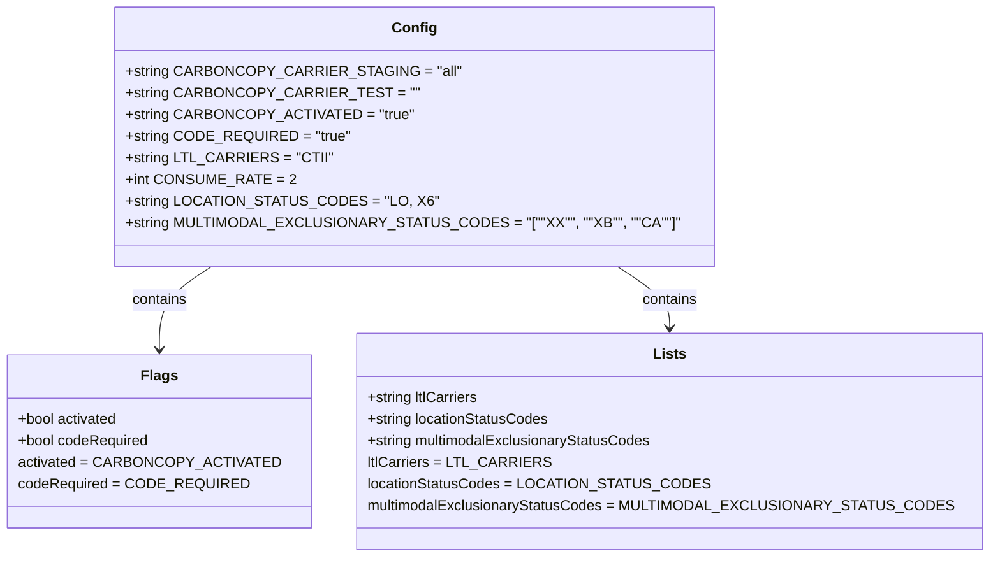

# Diagram: shipment_core/shipment_service/config/config.staging1.yml

> Auto-generated by Obscura crawlers

## Mermaid

### SVG

<svg id="container" width="1013.9296875" xmlns="http://www.w3.org/2000/svg" class="classDiagram" height="618" viewBox="0 0 1013.9296875 618" role="graphics-document document" aria-roledescription="class"><g><defs><marker id="container_class-aggregationStart" class="marker aggregation class" refX="18" refY="7" markerWidth="190" markerHeight="240" orient="auto"><path d="M 18,7 L9,13 L1,7 L9,1 Z"></path></marker></defs><defs><marker id="container_class-aggregationEnd" class="marker aggregation class" refX="1" refY="7" markerWidth="20" markerHeight="28" orient="auto"><path d="M 18,7 L9,13 L1,7 L9,1 Z"></path></marker></defs><defs><marker id="container_class-extensionStart" class="marker extension class" refX="18" refY="7" markerWidth="190" markerHeight="240" orient="auto"><path d="M 1,7 L18,13 V 1 Z"></path></marker></defs><defs><marker id="container_class-extensionEnd" class="marker extension class" refX="1" refY="7" markerWidth="20" markerHeight="28" orient="auto"><path d="M 1,1 V 13 L18,7 Z"></path></marker></defs><defs><marker id="container_class-compositionStart" class="marker composition class" refX="18" refY="7" markerWidth="190" markerHeight="240" orient="auto"><path d="M 18,7 L9,13 L1,7 L9,1 Z"></path></marker></defs><defs><marker id="container_class-compositionEnd" class="marker composition class" refX="1" refY="7" markerWidth="20" markerHeight="28" orient="auto"><path d="M 18,7 L9,13 L1,7 L9,1 Z"></path></marker></defs><defs><marker id="container_class-dependencyStart" class="marker dependency class" refX="6" refY="7" markerWidth="190" markerHeight="240" orient="auto"><path d="M 5,7 L9,13 L1,7 L9,1 Z"></path></marker></defs><defs><marker id="container_class-dependencyEnd" class="marker dependency class" refX="13" refY="7" markerWidth="20" markerHeight="28" orient="auto"><path d="M 18,7 L9,13 L14,7 L9,1 Z"></path></marker></defs><defs><marker id="container_class-lollipopStart" class="marker lollipop class" refX="13" refY="7" markerWidth="190" markerHeight="240" orient="auto"><circle stroke="black" fill="transparent" cx="7" cy="7" r="6"></circle></marker></defs><defs><marker id="container_class-lollipopEnd" class="marker lollipop class" refX="1" refY="7" markerWidth="190" markerHeight="240" orient="auto"><circle stroke="black" fill="transparent" cx="7" cy="7" r="6"></circle></marker></defs><g class="root"><g class="clusters"></g><g class="edgePaths"><path d="M213.906,296L204.98,302.167C196.055,308.333,178.203,320.667,169.277,336C160.352,351.333,160.352,369.667,160.352,378.833L160.352,388" id="id_Config_Flags_1" class="edge-thickness-normal edge-pattern-solid relation" style=";;;" data-edge="true" data-et="edge" data-id="id_Config_Flags_1" data-points="W3sieCI6MjEzLjkwNTk4MDIzMTM1MzYsInkiOjI5Nn0seyJ4IjoxNjAuMzUxNTYyNSwieSI6MzMzfSx7IngiOjE2MC4zNTE1NjI1LCJ5IjozOTR9XQ==" marker-end="url(#container_class-dependencyEnd)"></path><path d="M630.762,296L639.688,302.167C648.613,308.333,666.465,320.667,675.391,332C684.316,343.333,684.316,353.667,684.316,358.833L684.316,364" id="id_Config_Lists_2" class="edge-thickness-normal edge-pattern-solid relation" style=";;;" data-edge="true" data-et="edge" data-id="id_Config_Lists_2" data-points="W3sieCI6NjMwLjc2MTk4ODUxODY0NjQsInkiOjI5Nn0seyJ4Ijo2ODQuMzE2NDA2MjUsInkiOjMzM30seyJ4Ijo2ODQuMzE2NDA2MjUsInkiOjM3MH1d" marker-end="url(#container_class-dependencyEnd)"></path></g><g class="edgeLabels"><g class="edgeLabel" transform="translate(160.3515625, 333)"><g class="label" data-id="id_Config_Flags_1" transform="translate(-30.890625, -12)"><foreignObject width="61.78125" height="24">

contains

</foreignObject></g></g><g class="edgeLabel" transform="translate(684.31640625, 333)"><g class="label" data-id="id_Config_Lists_2" transform="translate(-30.890625, -12)"><foreignObject width="61.78125" height="24">

contains

</foreignObject></g></g></g><g class="nodes"><g class="node default" id="classId-Config-0" transform="translate(422.333984375, 152)"><g class="basic label-container"><path d="M-302.19921875 -144 L302.19921875 -144 L302.19921875 144 L-302.19921875 144" stroke="none" stroke-width="0" fill="#ECECFF" style=""></path><path d="M-302.19921875 -144 C-154.07694970566894 -144, -5.954680661337875 -144, 302.19921875 -144 M-302.19921875 -144 C-158.47923598771519 -144, -14.75925322543037 -144, 302.19921875 -144 M302.19921875 -144 C302.19921875 -53.00699228991442, 302.19921875 37.98601542017116, 302.19921875 144 M302.19921875 -144 C302.19921875 -49.287818526585994, 302.19921875 45.42436294682801, 302.19921875 144 M302.19921875 144 C145.9856487896446 144, -10.227921170710772 144, -302.19921875 144 M302.19921875 144 C67.05224207570265 144, -168.0947345985947 144, -302.19921875 144 M-302.19921875 144 C-302.19921875 72.25520129089324, -302.19921875 0.5104025817864795, -302.19921875 -144 M-302.19921875 144 C-302.19921875 49.8453602224841, -302.19921875 -44.30927955503179, -302.19921875 -144" stroke="#9370DB" stroke-width="1.3" fill="none" stroke-dasharray="0 0" style=""></path></g><g class="annotation-group text" transform="translate(0, -120)"></g><g class="label-group text" transform="translate(-22.9296875, -120)"><g class="label" style="font-weight: bolder" transform="translate(0,-12)"><foreignObject width="45.859375" height="24">

Config

</foreignObject></g></g><g class="members-group text" transform="translate(-290.19921875, -72)"><g class="label" style="" transform="translate(0,-12)"><foreignObject width="332.84375" height="24">

+string CARBONCOPY_CARRIER_STAGING = "all"

</foreignObject></g><g class="label" style="" transform="translate(0,12)"><foreignObject width="287.546875" height="24">

+string CARBONCOPY_CARRIER_TEST = ""

</foreignObject></g><g class="label" style="" transform="translate(0,36)"><foreignObject width="291.859375" height="24">

+string CARBONCOPY_ACTIVATED = "true"

</foreignObject></g><g class="label" style="" transform="translate(0,60)"><foreignObject width="232.953125" height="24">

+string CODE_REQUIRED = "true"

</foreignObject></g><g class="label" style="" transform="translate(0,84)"><foreignObject width="209.234375" height="24">

+string LTL_CARRIERS = "CTII"

</foreignObject></g><g class="label" style="" transform="translate(0,108)"><foreignObject width="170.453125" height="24">

+int CONSUME_RATE = 2

</foreignObject></g><g class="label" style="" transform="translate(0,132)"><foreignObject width="310.375" height="24">

+string LOCATION_STATUS_CODES = "LO, X6"

</foreignObject></g><g class="label" style="" transform="translate(0,156)"><foreignObject width="557.46875" height="24">

+string MULTIMODAL_EXCLUSIONARY_STATUS_CODES = "[""XX"", ""XB"", ""CA""]"

</foreignObject></g></g><g class="methods-group text" transform="translate(-290.19921875, 144)"></g><g class="divider" style=""><path d="M-302.19921875 -96 C-77.1785667171871 -96, 147.8420853156258 -96, 302.19921875 -96 M-302.19921875 -96 C-140.1301444197276 -96, 21.9389299105448 -96, 302.19921875 -96" stroke="#9370DB" stroke-width="1.3" fill="none" stroke-dasharray="0 0" style=""></path></g><g class="divider" style=""><path d="M-302.19921875 120 C-137.70633545420873 120, 26.786547841582546 120, 302.19921875 120 M-302.19921875 120 C-66.33158676748246 120, 169.53604521503507 120, 302.19921875 120" stroke="#9370DB" stroke-width="1.3" fill="none" stroke-dasharray="0 0" style=""></path></g></g><g class="node default" id="classId-Flags-1" transform="translate(160.3515625, 490)"><g class="basic label-container"><path d="M-152.3515625 -96 L152.3515625 -96 L152.3515625 96 L-152.3515625 96" stroke="none" stroke-width="0" fill="#ECECFF" style=""></path><path d="M-152.3515625 -96 C-51.95360465163313 -96, 48.44435319673374 -96, 152.3515625 -96 M-152.3515625 -96 C-72.07041706257134 -96, 8.210728374857325 -96, 152.3515625 -96 M152.3515625 -96 C152.3515625 -45.98728159213783, 152.3515625 4.025436815724333, 152.3515625 96 M152.3515625 -96 C152.3515625 -33.09838240746321, 152.3515625 29.803235185073575, 152.3515625 96 M152.3515625 96 C66.9058572845914 96, -18.53984793081719 96, -152.3515625 96 M152.3515625 96 C73.56239868793261 96, -5.226765124134772 96, -152.3515625 96 M-152.3515625 96 C-152.3515625 50.90193186276386, -152.3515625 5.8038637255277195, -152.3515625 -96 M-152.3515625 96 C-152.3515625 35.58498623096214, -152.3515625 -24.830027538075726, -152.3515625 -96" stroke="#9370DB" stroke-width="1.3" fill="none" stroke-dasharray="0 0" style=""></path></g><g class="annotation-group text" transform="translate(0, -72)"></g><g class="label-group text" transform="translate(-18.65625, -72)"><g class="label" style="font-weight: bolder" transform="translate(0,-12)"><foreignObject width="37.3125" height="24">

Flags

</foreignObject></g></g><g class="members-group text" transform="translate(-140.3515625, -24)"><g class="label" style="" transform="translate(0,-12)"><foreignObject width="111.890625" height="24">

+bool activated

</foreignObject></g><g class="label" style="" transform="translate(0,12)"><foreignObject width="145.609375" height="24">

+bool codeRequired

</foreignObject></g><g class="label" style="" transform="translate(0,36)"><foreignObject width="262.046875" height="24">

activated = CARBONCOPY_ACTIVATED

</foreignObject></g><g class="label" style="" transform="translate(0,60)"><foreignObject width="236.84375" height="24">

codeRequired = CODE_REQUIRED

</foreignObject></g></g><g class="methods-group text" transform="translate(-140.3515625, 96)"></g><g class="divider" style=""><path d="M-152.3515625 -48 C-73.55011415983 -48, 5.251334180339995 -48, 152.3515625 -48 M-152.3515625 -48 C-63.029273909264745 -48, 26.29301468147051 -48, 152.3515625 -48" stroke="#9370DB" stroke-width="1.3" fill="none" stroke-dasharray="0 0" style=""></path></g><g class="divider" style=""><path d="M-152.3515625 72 C-39.710892380122615 72, 72.92977773975477 72, 152.3515625 72 M-152.3515625 72 C-63.450700060314304 72, 25.450162379371392 72, 152.3515625 72" stroke="#9370DB" stroke-width="1.3" fill="none" stroke-dasharray="0 0" style=""></path></g></g><g class="node default" id="classId-Lists-2" transform="translate(684.31640625, 490)"><g class="basic label-container"><path d="M-321.61328125 -120 L321.61328125 -120 L321.61328125 120 L-321.61328125 120" stroke="none" stroke-width="0" fill="#ECECFF" style=""></path><path d="M-321.61328125 -120 C-91.76001851270058 -120, 138.09324422459883 -120, 321.61328125 -120 M-321.61328125 -120 C-109.4765057932971 -120, 102.66026966340581 -120, 321.61328125 -120 M321.61328125 -120 C321.61328125 -34.179675411580774, 321.61328125 51.64064917683845, 321.61328125 120 M321.61328125 -120 C321.61328125 -36.709861319335886, 321.61328125 46.58027736132823, 321.61328125 120 M321.61328125 120 C108.92976744197767 120, -103.75374636604465 120, -321.61328125 120 M321.61328125 120 C66.9753571926419 120, -187.6625668647162 120, -321.61328125 120 M-321.61328125 120 C-321.61328125 43.12679166278822, -321.61328125 -33.74641667442356, -321.61328125 -120 M-321.61328125 120 C-321.61328125 27.09639457403847, -321.61328125 -65.80721085192306, -321.61328125 -120" stroke="#9370DB" stroke-width="1.3" fill="none" stroke-dasharray="0 0" style=""></path></g><g class="annotation-group text" transform="translate(0, -96)"></g><g class="label-group text" transform="translate(-17.1796875, -96)"><g class="label" style="font-weight: bolder" transform="translate(0,-12)"><foreignObject width="34.359375" height="24">

Lists

</foreignObject></g></g><g class="members-group text" transform="translate(-309.61328125, -48)"><g class="label" style="" transform="translate(0,-12)"><foreignObject width="125.359375" height="24">

+string ltlCarriers

</foreignObject></g><g class="label" style="" transform="translate(0,12)"><foreignObject width="202.40625" height="24">

+string locationStatusCodes

</foreignObject></g><g class="label" style="" transform="translate(0,36)"><foreignObject width="318.390625" height="24">

+string multimodalExclusionaryStatusCodes

</foreignObject></g><g class="label" style="" transform="translate(0,60)"><foreignObject width="187.59375" height="24">

ltlCarriers = LTL_CARRIERS

</foreignObject></g><g class="label" style="" transform="translate(0,84)"><foreignObject width="349.6875" height="24">

locationStatusCodes = LOCATION_STATUS_CODES

</foreignObject></g><g class="label" style="" transform="translate(0,108)"><foreignObject width="602.046875" height="24">

multimodalExclusionaryStatusCodes = MULTIMODAL_EXCLUSIONARY_STATUS_CODES

</foreignObject></g></g><g class="methods-group text" transform="translate(-309.61328125, 120)"></g><g class="divider" style=""><path d="M-321.61328125 -72 C-73.23444272195476 -72, 175.14439580609047 -72, 321.61328125 -72 M-321.61328125 -72 C-118.64048928544162 -72, 84.33230267911676 -72, 321.61328125 -72" stroke="#9370DB" stroke-width="1.3" fill="none" stroke-dasharray="0 0" style=""></path></g><g class="divider" style=""><path d="M-321.61328125 96 C-79.98303681692315 96, 161.6472076161537 96, 321.61328125 96 M-321.61328125 96 C-179.71958350589736 96, -37.82588576179472 96, 321.61328125 96" stroke="#9370DB" stroke-width="1.3" fill="none" stroke-dasharray="0 0" style=""></path></g></g></g></g></g></svg>
