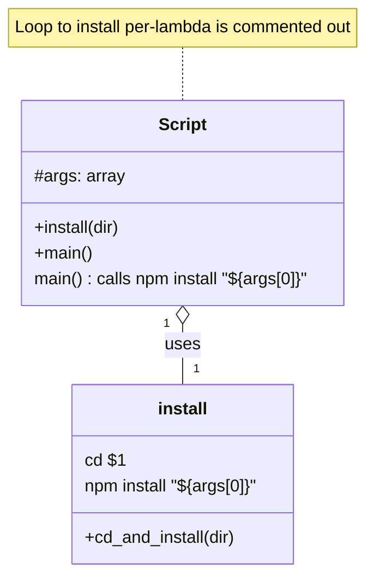

# Diagram: shipment_core/shipment_service/install.sh


> Auto-generated by Obscura crawlers

## Diagram 1

```mermaid
flowchart TD
    Start((Start)) --> DefineInstall[/"define install(dir)"/]
    DefineInstall --> InstallBody["cd $1 && npm install ${args[0]}"]
    Start --> CallNpm["run: npm install \"${args[0]}\""]
    CallNpm --> End((End))
    DefineInstall -.-> CommentedLoop["# for dir in ./lambdas/* (commented)"]
    CommentedLoop -.-> InstallBody
```

> SVG rendering failed for this diagram.

## Diagram 2



### SVG

<svg id="container" width="356.578125" xmlns="http://www.w3.org/2000/svg" class="classDiagram" height="536" viewBox="0 0 356.578125 536" role="graphics-document document" aria-roledescription="class"><style>#container{font-family:"trebuchet ms",verdana,arial,sans-serif;font-size:16px;fill:#333;}@keyframes edge-animation-frame{from{stroke-dashoffset:0;}}@keyframes dash{to{stroke-dashoffset:0;}}#container .edge-animation-slow{stroke-dasharray:9,5!important;stroke-dashoffset:900;animation:dash 50s linear infinite;stroke-linecap:round;}#container .edge-animation-fast{stroke-dasharray:9,5!important;stroke-dashoffset:900;animation:dash 20s linear infinite;stroke-linecap:round;}#container .error-icon{fill:#552222;}#container .error-text{fill:#552222;stroke:#552222;}#container .edge-thickness-normal{stroke-width:1px;}#container .edge-thickness-thick{stroke-width:3.5px;}#container .edge-pattern-solid{stroke-dasharray:0;}#container .edge-thickness-invisible{stroke-width:0;fill:none;}#container .edge-pattern-dashed{stroke-dasharray:3;}#container .edge-pattern-dotted{stroke-dasharray:2;}#container .marker{fill:#333333;stroke:#333333;}#container .marker.cross{stroke:#333333;}#container svg{font-family:"trebuchet ms",verdana,arial,sans-serif;font-size:16px;}#container p{margin:0;}#container g.classGroup text{fill:#9370DB;stroke:none;font-family:"trebuchet ms",verdana,arial,sans-serif;font-size:10px;}#container g.classGroup text .title{font-weight:bolder;}#container .nodeLabel,#container .edgeLabel{color:#131300;}#container .edgeLabel .label rect{fill:#ECECFF;}#container .label text{fill:#131300;}#container .labelBkg{background:#ECECFF;}#container .edgeLabel .label span{background:#ECECFF;}#container .classTitle{font-weight:bolder;}#container .node rect,#container .node circle,#container .node ellipse,#container .node polygon,#container .node path{fill:#ECECFF;stroke:#9370DB;stroke-width:1px;}#container .divider{stroke:#9370DB;stroke-width:1;}#container g.clickable{cursor:pointer;}#container g.classGroup rect{fill:#ECECFF;stroke:#9370DB;}#container g.classGroup line{stroke:#9370DB;stroke-width:1;}#container .classLabel .box{stroke:none;stroke-width:0;fill:#ECECFF;opacity:0.5;}#container .classLabel .label{fill:#9370DB;font-size:10px;}#container .relation{stroke:#333333;stroke-width:1;fill:none;}#container .dashed-line{stroke-dasharray:3;}#container .dotted-line{stroke-dasharray:1 2;}#container #compositionStart,#container .composition{fill:#333333!important;stroke:#333333!important;stroke-width:1;}#container #compositionEnd,#container .composition{fill:#333333!important;stroke:#333333!important;stroke-width:1;}#container #dependencyStart,#container .dependency{fill:#333333!important;stroke:#333333!important;stroke-width:1;}#container #dependencyStart,#container .dependency{fill:#333333!important;stroke:#333333!important;stroke-width:1;}#container #extensionStart,#container .extension{fill:transparent!important;stroke:#333333!important;stroke-width:1;}#container #extensionEnd,#container .extension{fill:transparent!important;stroke:#333333!important;stroke-width:1;}#container #aggregationStart,#container .aggregation{fill:transparent!important;stroke:#333333!important;stroke-width:1;}#container #aggregationEnd,#container .aggregation{fill:transparent!important;stroke:#333333!important;stroke-width:1;}#container #lollipopStart,#container .lollipop{fill:#ECECFF!important;stroke:#333333!important;stroke-width:1;}#container #lollipopEnd,#container .lollipop{fill:#ECECFF!important;stroke:#333333!important;stroke-width:1;}#container .edgeTerminals{font-size:11px;line-height:initial;}#container .classTitleText{text-anchor:middle;font-size:18px;fill:#333;}#container .label-icon{display:inline-block;height:1em;overflow:visible;vertical-align:-0.125em;}#container .node .label-icon path{fill:currentColor;stroke:revert;stroke-width:revert;}#container :root{--mermaid-font-family:"trebuchet ms",verdana,arial,sans-serif;}</style><g><defs><marker id="container_class-aggregationStart" class="marker aggregation class" refX="18" refY="7" markerWidth="190" markerHeight="240" orient="auto"><path d="M 18,7 L9,13 L1,7 L9,1 Z"></path></marker></defs><defs><marker id="container_class-aggregationEnd" class="marker aggregation class" refX="1" refY="7" markerWidth="20" markerHeight="28" orient="auto"><path d="M 18,7 L9,13 L1,7 L9,1 Z"></path></marker></defs><defs><marker id="container_class-extensionStart" class="marker extension class" refX="18" refY="7" markerWidth="190" markerHeight="240" orient="auto"><path d="M 1,7 L18,13 V 1 Z"></path></marker></defs><defs><marker id="container_class-extensionEnd" class="marker extension class" refX="1" refY="7" markerWidth="20" markerHeight="28" orient="auto"><path d="M 1,1 V 13 L18,7 Z"></path></marker></defs><defs><marker id="container_class-compositionStart" class="marker composition class" refX="18" refY="7" markerWidth="190" markerHeight="240" orient="auto"><path d="M 18,7 L9,13 L1,7 L9,1 Z"></path></marker></defs><defs><marker id="container_class-compositionEnd" class="marker composition class" refX="1" refY="7" markerWidth="20" markerHeight="28" orient="auto"><path d="M 18,7 L9,13 L1,7 L9,1 Z"></path></marker></defs><defs><marker id="container_class-dependencyStart" class="marker dependency class" refX="6" refY="7" markerWidth="190" markerHeight="240" orient="auto"><path d="M 5,7 L9,13 L1,7 L9,1 Z"></path></marker></defs><defs><marker id="container_class-dependencyEnd" class="marker dependency class" refX="13" refY="7" markerWidth="20" markerHeight="28" orient="auto"><path d="M 18,7 L9,13 L14,7 L9,1 Z"></path></marker></defs><defs><marker id="container_class-lollipopStart" class="marker lollipop class" refX="13" refY="7" markerWidth="190" markerHeight="240" orient="auto"><circle stroke="black" fill="transparent" cx="7" cy="7" r="6"></circle></marker></defs><defs><marker id="container_class-lollipopEnd" class="marker lollipop class" refX="1" refY="7" markerWidth="190" markerHeight="240" orient="auto"><circle stroke="black" fill="transparent" cx="7" cy="7" r="6"></circle></marker></defs><g class="root"><g class="clusters"></g><g class="edgePaths"><path d="M178.289,44L178.289,48.167C178.289,52.333,178.289,60.667,178.289,69C178.289,77.333,178.289,85.667,178.289,89.833L178.289,94" id="edgeNote1" class="edge-thickness-normal edge-pattern-dotted relation" style="fill: none;;;fill: none" data-edge="true" data-et="edge" data-id="edgeNote1" data-points="W3sieCI6MTc4LjI4OTA2MjUsInkiOjQ0fSx7IngiOjE3OC4yODkwNjI1LCJ5Ijo2OX0seyJ4IjoxNzguMjg5MDYyNSwieSI6OTR9XQ=="></path><path d="M178.289,303.25L178.289,306.542C178.289,309.833,178.289,316.417,178.289,325.875C178.289,335.333,178.289,347.667,178.289,353.833L178.289,360" id="id_Script_install_1" class="edge-thickness-normal edge-pattern-solid relation" style=";;;" data-edge="true" data-et="edge" data-id="id_Script_install_1" data-points="W3sieCI6MTc4LjI4OTA2MjUsInkiOjI4Nn0seyJ4IjoxNzguMjg5MDYyNSwieSI6MzIzfSx7IngiOjE3OC4yODkwNjI1LCJ5IjozNjB9XQ==" marker-start="url(#container_class-aggregationStart)"></path></g><g class="edgeLabels"><g class="edgeLabel"><g class="label" data-id="edgeNote1" transform="translate(0, 0)"><foreignObject width="0" height="0"><div xmlns="http://www.w3.org/1999/xhtml" class="labelBkg" style="display: table-cell; white-space: nowrap; line-height: 1.5; max-width: 200px; text-align: center;"><span class="edgeLabel"></span></div></foreignObject></g></g><g class="edgeLabel" transform="translate(178.2890625, 323)"><g class="label" data-id="id_Script_install_1" transform="translate(-16.4921875, -12)"><foreignObject width="32.984375" height="24"><div xmlns="http://www.w3.org/1999/xhtml" class="labelBkg" style="display: table-cell; white-space: nowrap; line-height: 1.5; max-width: 200px; text-align: center;"><span class="edgeLabel"><p>uses</p></span></div></foreignObject></g></g><g class="edgeTerminals" transform="translate(163.28906125000003, 303.4999989285714)"><g class="inner" transform="translate(0, 0)"><foreignObject style="width: 9px; height: 12px;"><div xmlns="http://www.w3.org/1999/xhtml" style="display: inline-block; padding-right: 1px; white-space: nowrap;"><span class="edgeLabel">1</span></div></foreignObject></g></g><g class="edgeTerminals" transform="translate(188.28906124999997, 337.4999989285714)"><g class="inner" transform="translate(0, 0)"></g><foreignObject style="width: 9px; height: 12px;"><div xmlns="http://www.w3.org/1999/xhtml" style="display: inline-block; padding-right: 1px; white-space: nowrap;"><span class="edgeLabel">1</span></div></foreignObject></g></g><g class="nodes"><g class="node default" id="classId-Script-0" transform="translate(178.2890625, 190)"><g class="basic label-container"><path d="M-154.49609375 -96 L154.49609375 -96 L154.49609375 96 L-154.49609375 96" stroke="none" stroke-width="0" fill="#ECECFF" style=""></path><path d="M-154.49609375 -96 C-80.08124514030662 -96, -5.666396530613241 -96, 154.49609375 -96 M-154.49609375 -96 C-64.40766646510815 -96, 25.6807608197837 -96, 154.49609375 -96 M154.49609375 -96 C154.49609375 -29.728190738470374, 154.49609375 36.54361852305925, 154.49609375 96 M154.49609375 -96 C154.49609375 -37.6989456169118, 154.49609375 20.6021087661764, 154.49609375 96 M154.49609375 96 C57.6073090397535 96, -39.281475670492995 96, -154.49609375 96 M154.49609375 96 C78.15009590084121 96, 1.8040980516824163 96, -154.49609375 96 M-154.49609375 96 C-154.49609375 42.140014338973124, -154.49609375 -11.719971322053752, -154.49609375 -96 M-154.49609375 96 C-154.49609375 29.916756828100972, -154.49609375 -36.166486343798056, -154.49609375 -96" stroke="#9370DB" stroke-width="1.3" fill="none" stroke-dasharray="0 0" style=""></path></g><g class="annotation-group text" transform="translate(0, -72)"></g><g class="label-group text" transform="translate(-21.7421875, -72)"><g class="label" style="font-weight: bolder" transform="translate(0,-12)"><foreignObject width="43.484375" height="24"><div xmlns="http://www.w3.org/1999/xhtml" style="display: table-cell; white-space: nowrap; line-height: 1.5; max-width: 93px; text-align: center;"><span class="nodeLabel markdown-node-label" style=""><p>Script</p></span></div></foreignObject></g></g><g class="members-group text" transform="translate(-142.49609375, -24)"><g class="label" style="" transform="translate(0,-12)"><foreignObject width="83.203125" height="24"><div xmlns="http://www.w3.org/1999/xhtml" style="display: table-cell; white-space: nowrap; line-height: 1.5; max-width: 142px; text-align: center;"><span class="nodeLabel markdown-node-label" style=""><p>#args: array</p></span></div></foreignObject></g></g><g class="methods-group text" transform="translate(-142.49609375, 24)"><g class="label" style="" transform="translate(0,-12)"><foreignObject width="83.5625" height="24"><div xmlns="http://www.w3.org/1999/xhtml" style="display: table-cell; white-space: nowrap; line-height: 1.5; max-width: 141px; text-align: center;"><span class="nodeLabel markdown-node-label" style=""><p>+install(dir)</p></span></div></foreignObject></g><g class="label" style="" transform="translate(0,12)"><foreignObject width="54.65625" height="24"><div xmlns="http://www.w3.org/1999/xhtml" style="display: table-cell; white-space: nowrap; line-height: 1.5; max-width: 112px; text-align: center;"><span class="nodeLabel markdown-node-label" style=""><p>+main()</p></span></div></foreignObject></g><g class="label" style="" transform="translate(0,36)"><foreignObject width="263.25" height="24"><div xmlns="http://www.w3.org/1999/xhtml" style="display: table-cell; white-space: nowrap; line-height: 1.5; max-width: 313px; text-align: center;"><span class="nodeLabel markdown-node-label" style=""><p>main() : calls npm install "${args[0]}"</p></span></div></foreignObject></g></g><g class="divider" style=""><path d="M-154.49609375 -48 C-70.14846699286896 -48, 14.199159764262077 -48, 154.49609375 -48 M-154.49609375 -48 C-41.53580402581633 -48, 71.42448569836733 -48, 154.49609375 -48" stroke="#9370DB" stroke-width="1.3" fill="none" stroke-dasharray="0 0" style=""></path></g><g class="divider" style=""><path d="M-154.49609375 0 C-42.36928277479282 0, 69.75752820041436 0, 154.49609375 0 M-154.49609375 0 C-45.149522633965546 0, 64.19704848206891 0, 154.49609375 0" stroke="#9370DB" stroke-width="1.3" fill="none" stroke-dasharray="0 0" style=""></path></g></g><g class="node default" id="classId-install-1" transform="translate(178.2890625, 444)"><g class="basic label-container"><path d="M-106.96484375 -84 L106.96484375 -84 L106.96484375 84 L-106.96484375 84" stroke="none" stroke-width="0" fill="#ECECFF" style=""></path><path d="M-106.96484375 -84 C-35.51987774456511 -84, 35.925088260869785 -84, 106.96484375 -84 M-106.96484375 -84 C-44.7765163774937 -84, 17.4118109950126 -84, 106.96484375 -84 M106.96484375 -84 C106.96484375 -36.944853448402746, 106.96484375 10.110293103194508, 106.96484375 84 M106.96484375 -84 C106.96484375 -26.83802939316216, 106.96484375 30.32394121367568, 106.96484375 84 M106.96484375 84 C53.933097242619866 84, 0.9013507352397312 84, -106.96484375 84 M106.96484375 84 C37.636033443170035 84, -31.69277686365993 84, -106.96484375 84 M-106.96484375 84 C-106.96484375 21.647717820790177, -106.96484375 -40.704564358419645, -106.96484375 -84 M-106.96484375 84 C-106.96484375 36.72526775262201, -106.96484375 -10.54946449475598, -106.96484375 -84" stroke="#9370DB" stroke-width="1.3" fill="none" stroke-dasharray="0 0" style=""></path></g><g class="annotation-group text" transform="translate(0, -60)"></g><g class="label-group text" transform="translate(-22.7890625, -60)"><g class="label" style="font-weight: bolder" transform="translate(0,-12)"><foreignObject width="45.578125" height="24"><div xmlns="http://www.w3.org/1999/xhtml" style="display: table-cell; white-space: nowrap; line-height: 1.5; max-width: 95px; text-align: center;"><span class="nodeLabel markdown-node-label" style=""><p>install</p></span></div></foreignObject></g></g><g class="members-group text" transform="translate(-94.96484375, -12)"><g class="label" style="" transform="translate(0,-12)"><foreignObject width="36.109375" height="24"><div xmlns="http://www.w3.org/1999/xhtml" style="display: table-cell; white-space: nowrap; line-height: 1.5; max-width: 86px; text-align: center;"><span class="nodeLabel markdown-node-label" style=""><p>cd $1</p></span></div></foreignObject></g><g class="label" style="" transform="translate(0,12)"><foreignObject width="167.140625" height="24"><div xmlns="http://www.w3.org/1999/xhtml" style="display: table-cell; white-space: nowrap; line-height: 1.5; max-width: 217px; text-align: center;"><span class="nodeLabel markdown-node-label" style=""><p>npm install "${args[0]}"</p></span></div></foreignObject></g></g><g class="methods-group text" transform="translate(-94.96484375, 60)"><g class="label" style="" transform="translate(0,-12)"><foreignObject width="144.421875" height="24"><div xmlns="http://www.w3.org/1999/xhtml" style="display: table-cell; white-space: nowrap; line-height: 1.5; max-width: 202px; text-align: center;"><span class="nodeLabel markdown-node-label" style=""><p>+cd_and_install(dir)</p></span></div></foreignObject></g></g><g class="divider" style=""><path d="M-106.96484375 -36 C-61.268642538411015 -36, -15.57244132682203 -36, 106.96484375 -36 M-106.96484375 -36 C-43.49956389732029 -36, 19.965715955359414 -36, 106.96484375 -36" stroke="#9370DB" stroke-width="1.3" fill="none" stroke-dasharray="0 0" style=""></path></g><g class="divider" style=""><path d="M-106.96484375 36 C-29.499440195549198 36, 47.965963358901604 36, 106.96484375 36 M-106.96484375 36 C-45.17417366777508 36, 16.61649641444984 36, 106.96484375 36" stroke="#9370DB" stroke-width="1.3" fill="none" stroke-dasharray="0 0" style=""></path></g></g><g class="node undefined" id="note0" transform="translate(178.2890625, 26)"><g class="basic label-container"><path d="M-170.2890625 -18 L170.2890625 -18 L170.2890625 18 L-170.2890625 18" stroke="none" stroke-width="0" fill="#fff5ad" style="fill:#fff5ad !important;stroke:#aaaa33 !important"></path><path d="M-170.2890625 -18 C-89.90644156530092 -18, -9.523820630601847 -18, 170.2890625 -18 M-170.2890625 -18 C-99.6280764937188 -18, -28.967090487437588 -18, 170.2890625 -18 M170.2890625 -18 C170.2890625 -5.657292418738258, 170.2890625 6.6854151625234834, 170.2890625 18 M170.2890625 -18 C170.2890625 -7.374212444982659, 170.2890625 3.2515751100346826, 170.2890625 18 M170.2890625 18 C100.92161147574384 18, 31.55416045148769 18, -170.2890625 18 M170.2890625 18 C59.28633300154202 18, -51.71639649691596 18, -170.2890625 18 M-170.2890625 18 C-170.2890625 8.410354136257652, -170.2890625 -1.1792917274846957, -170.2890625 -18 M-170.2890625 18 C-170.2890625 6.700677669348714, -170.2890625 -4.598644661302572, -170.2890625 -18" stroke="#aaaa33" stroke-width="1.3" fill="none" stroke-dasharray="0 0" style="fill:#fff5ad !important;stroke:#aaaa33 !important"></path></g><g class="label" style="text-align:left !important;white-space:nowrap !important" transform="translate(-164.2890625, -12)"><rect></rect><foreignObject width="328.578125" height="24"><div style="text-align: center; white-space: break-spaces; display: table; line-height: 1.5; max-width: 200px; width: 200px;" xmlns="http://www.w3.org/1999/xhtml"><span style="text-align:left !important;white-space:nowrap !important" class="nodeLabel"><p>Loop to install per-lambda is commented out</p></span></div></foreignObject></g></g></g></g></g></svg>
