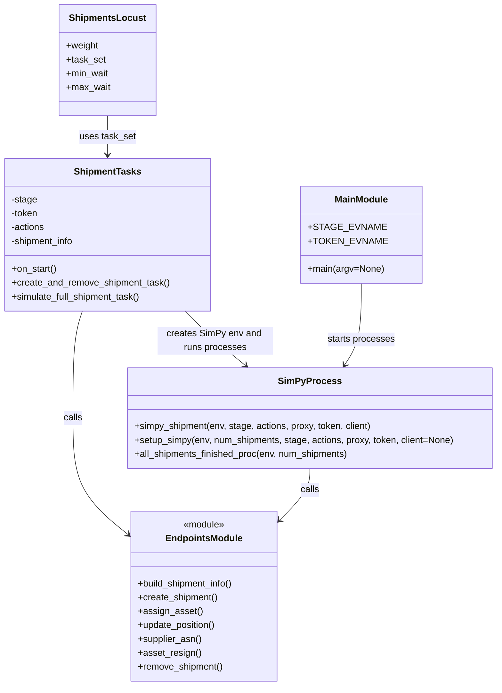

# Diagram: shipment_core/shipment_service/ng_val/locust_saves/fvlocus_lambdaSim.py


> Auto-generated by Obscura crawlers

## Diagram 1

```mermaid
flowchart TD
    Start([Start simpy_shipment]) --> Create[Create Shipment]
    Create --> Assign[Assign Asset]
    Assign --> OriginalPing[Original Ping (lat,lon)]
    OriginalPing --> ArrivePickup[Arrive at Pickup]
    ArrivePickup --> OnSiteUpdate[On-site Pickup Update]
    OnSiteUpdate --> DepartPickup[Depart Pickup]
    DepartPickup --> ASN[ASN from Supplier]
    ASN --> CheckResign{RESIGN_FROM_FIRST_ASSET?}
    CheckResign -- Yes --> AssetResign[Asset Resign]
    AssetResign --> Reassign[Re-Assign New Asset]
    Reassign --> MaybeTransit
    CheckResign -- No --> MaybeTransit[Check WASTE_TIME_IN_TRANSIT]
    MaybeTransit --> CheckTransit{WASTE_TIME_IN_TRANSIT?}
    CheckTransit -- Yes --> InTransitLoop[In-Transit Loop\n(random updates, exit on hit or timeout)]
    InTransitLoop --> FirstDropoff
    CheckTransit -- No --> FirstDropoff[First Dropoff Arrival Update]
    FirstDropoff --> SecondDropoff[Arrives for Dropoff Update]
    SecondDropoff --> FirstDepartDropoff[First Dropoff Departure Update]
    FirstDepartDropoff --> SecondDepartDropoff[Departs Dropoff Update]
    SecondDepartDropoff --> Remove[Remove Shipment]
    Remove --> Finished([Finished Shipment])
    Finished --> End([End simpy_shipment])
```

> SVG rendering failed for this diagram.

## Diagram 2



### SVG

<svg id="container" width="858.015625" xmlns="http://www.w3.org/2000/svg" class="classDiagram" height="1186" viewBox="0 0 858.015625 1186" role="graphics-document document" aria-roledescription="class"><style>#container{font-family:"trebuchet ms",verdana,arial,sans-serif;font-size:16px;fill:#333;}@keyframes edge-animation-frame{from{stroke-dashoffset:0;}}@keyframes dash{to{stroke-dashoffset:0;}}#container .edge-animation-slow{stroke-dasharray:9,5!important;stroke-dashoffset:900;animation:dash 50s linear infinite;stroke-linecap:round;}#container .edge-animation-fast{stroke-dasharray:9,5!important;stroke-dashoffset:900;animation:dash 20s linear infinite;stroke-linecap:round;}#container .error-icon{fill:#552222;}#container .error-text{fill:#552222;stroke:#552222;}#container .edge-thickness-normal{stroke-width:1px;}#container .edge-thickness-thick{stroke-width:3.5px;}#container .edge-pattern-solid{stroke-dasharray:0;}#container .edge-thickness-invisible{stroke-width:0;fill:none;}#container .edge-pattern-dashed{stroke-dasharray:3;}#container .edge-pattern-dotted{stroke-dasharray:2;}#container .marker{fill:#333333;stroke:#333333;}#container .marker.cross{stroke:#333333;}#container svg{font-family:"trebuchet ms",verdana,arial,sans-serif;font-size:16px;}#container p{margin:0;}#container g.classGroup text{fill:#9370DB;stroke:none;font-family:"trebuchet ms",verdana,arial,sans-serif;font-size:10px;}#container g.classGroup text .title{font-weight:bolder;}#container .nodeLabel,#container .edgeLabel{color:#131300;}#container .edgeLabel .label rect{fill:#ECECFF;}#container .label text{fill:#131300;}#container .labelBkg{background:#ECECFF;}#container .edgeLabel .label span{background:#ECECFF;}#container .classTitle{font-weight:bolder;}#container .node rect,#container .node circle,#container .node ellipse,#container .node polygon,#container .node path{fill:#ECECFF;stroke:#9370DB;stroke-width:1px;}#container .divider{stroke:#9370DB;stroke-width:1;}#container g.clickable{cursor:pointer;}#container g.classGroup rect{fill:#ECECFF;stroke:#9370DB;}#container g.classGroup line{stroke:#9370DB;stroke-width:1;}#container .classLabel .box{stroke:none;stroke-width:0;fill:#ECECFF;opacity:0.5;}#container .classLabel .label{fill:#9370DB;font-size:10px;}#container .relation{stroke:#333333;stroke-width:1;fill:none;}#container .dashed-line{stroke-dasharray:3;}#container .dotted-line{stroke-dasharray:1 2;}#container #compositionStart,#container .composition{fill:#333333!important;stroke:#333333!important;stroke-width:1;}#container #compositionEnd,#container .composition{fill:#333333!important;stroke:#333333!important;stroke-width:1;}#container #dependencyStart,#container .dependency{fill:#333333!important;stroke:#333333!important;stroke-width:1;}#container #dependencyStart,#container .dependency{fill:#333333!important;stroke:#333333!important;stroke-width:1;}#container #extensionStart,#container .extension{fill:transparent!important;stroke:#333333!important;stroke-width:1;}#container #extensionEnd,#container .extension{fill:transparent!important;stroke:#333333!important;stroke-width:1;}#container #aggregationStart,#container .aggregation{fill:transparent!important;stroke:#333333!important;stroke-width:1;}#container #aggregationEnd,#container .aggregation{fill:transparent!important;stroke:#333333!important;stroke-width:1;}#container #lollipopStart,#container .lollipop{fill:#ECECFF!important;stroke:#333333!important;stroke-width:1;}#container #lollipopEnd,#container .lollipop{fill:#ECECFF!important;stroke:#333333!important;stroke-width:1;}#container .edgeTerminals{font-size:11px;line-height:initial;}#container .classTitleText{text-anchor:middle;font-size:18px;fill:#333;}#container .label-icon{display:inline-block;height:1em;overflow:visible;vertical-align:-0.125em;}#container .node .label-icon path{fill:currentColor;stroke:revert;stroke-width:revert;}#container :root{--mermaid-font-family:"trebuchet ms",verdana,arial,sans-serif;}</style><g><defs><marker id="container_class-aggregationStart" class="marker aggregation class" refX="18" refY="7" markerWidth="190" markerHeight="240" orient="auto"><path d="M 18,7 L9,13 L1,7 L9,1 Z"></path></marker></defs><defs><marker id="container_class-aggregationEnd" class="marker aggregation class" refX="1" refY="7" markerWidth="20" markerHeight="28" orient="auto"><path d="M 18,7 L9,13 L1,7 L9,1 Z"></path></marker></defs><defs><marker id="container_class-extensionStart" class="marker extension class" refX="18" refY="7" markerWidth="190" markerHeight="240" orient="auto"><path d="M 1,7 L18,13 V 1 Z"></path></marker></defs><defs><marker id="container_class-extensionEnd" class="marker extension class" refX="1" refY="7" markerWidth="20" markerHeight="28" orient="auto"><path d="M 1,1 V 13 L18,7 Z"></path></marker></defs><defs><marker id="container_class-compositionStart" class="marker composition class" refX="18" refY="7" markerWidth="190" markerHeight="240" orient="auto"><path d="M 18,7 L9,13 L1,7 L9,1 Z"></path></marker></defs><defs><marker id="container_class-compositionEnd" class="marker composition class" refX="1" refY="7" markerWidth="20" markerHeight="28" orient="auto"><path d="M 18,7 L9,13 L1,7 L9,1 Z"></path></marker></defs><defs><marker id="container_class-dependencyStart" class="marker dependency class" refX="6" refY="7" markerWidth="190" markerHeight="240" orient="auto"><path d="M 5,7 L9,13 L1,7 L9,1 Z"></path></marker></defs><defs><marker id="container_class-dependencyEnd" class="marker dependency class" refX="13" refY="7" markerWidth="20" markerHeight="28" orient="auto"><path d="M 18,7 L9,13 L14,7 L9,1 Z"></path></marker></defs><defs><marker id="container_class-lollipopStart" class="marker lollipop class" refX="13" refY="7" markerWidth="190" markerHeight="240" orient="auto"><circle stroke="black" fill="transparent" cx="7" cy="7" r="6"></circle></marker></defs><defs><marker id="container_class-lollipopEnd" class="marker lollipop class" refX="1" refY="7" markerWidth="190" markerHeight="240" orient="auto"><circle stroke="black" fill="transparent" cx="7" cy="7" r="6"></circle></marker></defs><g class="root"><g class="clusters"></g><g class="edgePaths"><path d="M141.524,538L138.817,546.167C136.11,554.333,130.696,570.667,127.988,601.5C125.281,632.333,125.281,677.667,125.281,721C125.281,764.333,125.281,805.667,140.361,838.734C155.442,871.801,185.602,896.601,200.682,909.002L215.762,921.402" id="id_ShipmentTasks_EndpointsModule_1" class="edge-thickness-normal edge-pattern-solid relation" style=";;;" data-edge="true" data-et="edge" data-id="id_ShipmentTasks_EndpointsModule_1" data-points="W3sieCI6MTQxLjUyNDM0MzkyMjY1MTk1LCJ5Ijo1Mzh9LHsieCI6MTI1LjI4MTI1LCJ5Ijo1ODd9LHsieCI6MTI1LjI4MTI1LCJ5Ijo3MjN9LHsieCI6MTI1LjI4MTI1LCJ5Ijo4NDd9LHsieCI6MjIwLjM5NjQ4NDM3NSwieSI6OTI1LjIxMjg4ODUyODExMDJ9XQ==" marker-end="url(#container_class-dependencyEnd)"></path><path d="M533.184,810L533.184,816.167C533.184,822.333,533.184,834.667,524.643,849.368C516.102,864.069,499.02,881.138,490.479,889.673L481.938,898.207" id="id_SimPyProcess_EndpointsModule_2" class="edge-thickness-normal edge-pattern-solid relation" style=";;;" data-edge="true" data-et="edge" data-id="id_SimPyProcess_EndpointsModule_2" data-points="W3sieCI6NTMzLjE4MzU5Mzc1LCJ5Ijo4MTB9LHsieCI6NTMzLjE4MzU5Mzc1LCJ5Ijo4NDd9LHsieCI6NDc3LjY5MzM1OTM3NSwieSI6OTAyLjQ0ODQ0NTU3MTEyNH1d" marker-end="url(#container_class-dependencyEnd)"></path><path d="M185.281,200L185.281,206.167C185.281,212.333,185.281,224.667,185.281,236C185.281,247.333,185.281,257.667,185.281,262.833L185.281,268" id="id_ShipmentsLocust_ShipmentTasks_3" class="edge-thickness-normal edge-pattern-solid relation" style=";;;" data-edge="true" data-et="edge" data-id="id_ShipmentsLocust_ShipmentTasks_3" data-points="W3sieCI6MTg1LjI4MTI1LCJ5IjoyMDB9LHsieCI6MTg1LjI4MTI1LCJ5IjoyMzd9LHsieCI6MTg1LjI4MTI1LCJ5IjoyNzR9XQ==" marker-end="url(#container_class-dependencyEnd)"></path><path d="M622.453,490L622.453,506.167C622.453,522.333,622.453,554.667,617.641,578.164C612.83,601.661,603.206,616.323,598.394,623.653L593.582,630.984" id="id_MainModule_SimPyProcess_4" class="edge-thickness-normal edge-pattern-solid relation" style=";;;" data-edge="true" data-et="edge" data-id="id_MainModule_SimPyProcess_4" data-points="W3sieCI6NjIyLjQ1MzEyNSwieSI6NDkwfSx7IngiOjYyMi40NTMxMjUsInkiOjU4N30seyJ4Ijo1OTAuMjg5ODM4MDA1NTE0OCwieSI6NjM2fV0=" marker-end="url(#container_class-dependencyEnd)"></path><path d="M319.57,538L327.879,546.167C336.187,554.333,352.803,570.667,370.176,586.361C387.549,602.056,405.678,617.111,414.743,624.639L423.807,632.167" id="id_ShipmentTasks_SimPyProcess_5" class="edge-thickness-normal edge-pattern-solid relation" style=";;;" data-edge="true" data-et="edge" data-id="id_ShipmentTasks_SimPyProcess_5" data-points="W3sieCI6MzE5LjU3MDIyNjE3NDAzMzEsInkiOjUzOH0seyJ4IjozNjkuNDE5OTIxODc1LCJ5Ijo1ODd9LHsieCI6NDI4LjQyMzAwOTUzNTg0NTYsInkiOjYzNn1d" marker-end="url(#container_class-dependencyEnd)"></path></g><g class="edgeLabels"><g class="edgeLabel" transform="translate(125.28125, 723)"><g class="label" data-id="id_ShipmentTasks_EndpointsModule_1" transform="translate(-16.4453125, -12)"><foreignObject width="32.890625" height="24"><div xmlns="http://www.w3.org/1999/xhtml" class="labelBkg" style="display: table-cell; white-space: nowrap; line-height: 1.5; max-width: 200px; text-align: center;"><span class="edgeLabel"><p>calls</p></span></div></foreignObject></g></g><g class="edgeLabel" transform="translate(533.18359375, 847)"><g class="label" data-id="id_SimPyProcess_EndpointsModule_2" transform="translate(-16.4453125, -12)"><foreignObject width="32.890625" height="24"><div xmlns="http://www.w3.org/1999/xhtml" class="labelBkg" style="display: table-cell; white-space: nowrap; line-height: 1.5; max-width: 200px; text-align: center;"><span class="edgeLabel"><p>calls</p></span></div></foreignObject></g></g><g class="edgeLabel" transform="translate(185.28125, 237)"><g class="label" data-id="id_ShipmentsLocust_ShipmentTasks_3" transform="translate(-48.6953125, -12)"><foreignObject width="97.390625" height="24"><div xmlns="http://www.w3.org/1999/xhtml" class="labelBkg" style="display: table-cell; white-space: nowrap; line-height: 1.5; max-width: 200px; text-align: center;"><span class="edgeLabel"><p>uses task_set</p></span></div></foreignObject></g></g><g class="edgeLabel" transform="translate(622.453125, 587)"><g class="label" data-id="id_MainModule_SimPyProcess_4" transform="translate(-58.5390625, -12)"><foreignObject width="117.078125" height="24"><div xmlns="http://www.w3.org/1999/xhtml" class="labelBkg" style="display: table-cell; white-space: nowrap; line-height: 1.5; max-width: 200px; text-align: center;"><span class="edgeLabel"><p>starts processes</p></span></div></foreignObject></g></g><g class="edgeLabel" transform="translate(372.03429, 589.17114)"><g class="label" data-id="id_ShipmentTasks_SimPyProcess_5" transform="translate(-100, -24)"><foreignObject width="200" height="48"><div xmlns="http://www.w3.org/1999/xhtml" class="labelBkg" style="display: table; white-space: break-spaces; line-height: 1.5; max-width: 200px; text-align: center; width: 200px;"><span class="edgeLabel"><p>creates SimPy env and runs processes</p></span></div></foreignObject></g></g></g><g class="nodes"><g class="node default" id="classId-ShipmentTasks-0" transform="translate(185.28125, 406)"><g class="basic label-container"><path d="M-177.28125 -132 L177.28125 -132 L177.28125 132 L-177.28125 132" stroke="none" stroke-width="0" fill="#ECECFF" style=""></path><path d="M-177.28125 -132 C-53.62073977859389 -132, 70.03977044281223 -132, 177.28125 -132 M-177.28125 -132 C-76.86750601231596 -132, 23.546237975368086 -132, 177.28125 -132 M177.28125 -132 C177.28125 -56.593279359426234, 177.28125 18.813441281147533, 177.28125 132 M177.28125 -132 C177.28125 -41.32423464851425, 177.28125 49.3515307029715, 177.28125 132 M177.28125 132 C56.5531503298636 132, -64.1749493402728 132, -177.28125 132 M177.28125 132 C100.4160538012035 132, 23.550857602407007 132, -177.28125 132 M-177.28125 132 C-177.28125 40.13176851029641, -177.28125 -51.73646297940718, -177.28125 -132 M-177.28125 132 C-177.28125 57.43828012130996, -177.28125 -17.123439757380083, -177.28125 -132" stroke="#9370DB" stroke-width="1.3" fill="none" stroke-dasharray="0 0" style=""></path></g><g class="annotation-group text" transform="translate(0, -108)"></g><g class="label-group text" transform="translate(-55.4375, -108)"><g class="label" style="font-weight: bolder" transform="translate(0,-12)"><foreignObject width="110.875" height="24"><div xmlns="http://www.w3.org/1999/xhtml" style="display: table-cell; white-space: nowrap; line-height: 1.5; max-width: 159px; text-align: center;"><span class="nodeLabel markdown-node-label" style=""><p>ShipmentTasks</p></span></div></foreignObject></g></g><g class="members-group text" transform="translate(-165.28125, -60)"><g class="label" style="" transform="translate(0,-12)"><foreignObject width="44.921875" height="24"><div xmlns="http://www.w3.org/1999/xhtml" style="display: table-cell; white-space: nowrap; line-height: 1.5; max-width: 102px; text-align: center;"><span class="nodeLabel markdown-node-label" style=""><p>-stage</p></span></div></foreignObject></g><g class="label" style="" transform="translate(0,12)"><foreignObject width="47.40625" height="24"><div xmlns="http://www.w3.org/1999/xhtml" style="display: table-cell; white-space: nowrap; line-height: 1.5; max-width: 105px; text-align: center;"><span class="nodeLabel markdown-node-label" style=""><p>-token</p></span></div></foreignObject></g><g class="label" style="" transform="translate(0,36)"><foreignObject width="59.046875" height="24"><div xmlns="http://www.w3.org/1999/xhtml" style="display: table-cell; white-space: nowrap; line-height: 1.5; max-width: 116px; text-align: center;"><span class="nodeLabel markdown-node-label" style=""><p>-actions</p></span></div></foreignObject></g><g class="label" style="" transform="translate(0,60)"><foreignObject width="111.65625" height="24"><div xmlns="http://www.w3.org/1999/xhtml" style="display: table-cell; white-space: nowrap; line-height: 1.5; max-width: 169px; text-align: center;"><span class="nodeLabel markdown-node-label" style=""><p>-shipment_info</p></span></div></foreignObject></g></g><g class="methods-group text" transform="translate(-165.28125, 60)"><g class="label" style="" transform="translate(0,-12)"><foreignObject width="79.1875" height="24"><div xmlns="http://www.w3.org/1999/xhtml" style="display: table-cell; white-space: nowrap; line-height: 1.5; max-width: 137px; text-align: center;"><span class="nodeLabel markdown-node-label" style=""><p>+on_start()</p></span></div></foreignObject></g><g class="label" style="" transform="translate(0,12)"><foreignObject width="275.125" height="24"><div xmlns="http://www.w3.org/1999/xhtml" style="display: table-cell; white-space: nowrap; line-height: 1.5; max-width: 332px; text-align: center;"><span class="nodeLabel markdown-node-label" style=""><p>+create_and_remove_shipment_task()</p></span></div></foreignObject></g><g class="label" style="" transform="translate(0,36)"><foreignObject width="227.296875" height="24"><div xmlns="http://www.w3.org/1999/xhtml" style="display: table-cell; white-space: nowrap; line-height: 1.5; max-width: 285px; text-align: center;"><span class="nodeLabel markdown-node-label" style=""><p>+simulate_full_shipment_task()</p></span></div></foreignObject></g></g><g class="divider" style=""><path d="M-177.28125 -84 C-49.07279474957096 -84, 79.13566050085808 -84, 177.28125 -84 M-177.28125 -84 C-93.63461501782682 -84, -9.987980035653635 -84, 177.28125 -84" stroke="#9370DB" stroke-width="1.3" fill="none" stroke-dasharray="0 0" style=""></path></g><g class="divider" style=""><path d="M-177.28125 36 C-90.45230190714673 36, -3.6233538142934663 36, 177.28125 36 M-177.28125 36 C-69.6034917756439 36, 38.074266448712194 36, 177.28125 36" stroke="#9370DB" stroke-width="1.3" fill="none" stroke-dasharray="0 0" style=""></path></g></g><g class="node default" id="classId-ShipmentsLocust-1" transform="translate(185.28125, 104)"><g class="basic label-container"><path d="M-81.6328125 -96 L81.6328125 -96 L81.6328125 96 L-81.6328125 96" stroke="none" stroke-width="0" fill="#ECECFF" style=""></path><path d="M-81.6328125 -96 C-25.288764201649755 -96, 31.05528409670049 -96, 81.6328125 -96 M-81.6328125 -96 C-31.660171660593427 -96, 18.312469178813146 -96, 81.6328125 -96 M81.6328125 -96 C81.6328125 -21.52305383225368, 81.6328125 52.95389233549264, 81.6328125 96 M81.6328125 -96 C81.6328125 -42.323556019302856, 81.6328125 11.352887961394288, 81.6328125 96 M81.6328125 96 C28.00273088611815 96, -25.627350727763698 96, -81.6328125 96 M81.6328125 96 C37.219296305889976 96, -7.194219888220047 96, -81.6328125 96 M-81.6328125 96 C-81.6328125 38.59335846962358, -81.6328125 -18.813283060752838, -81.6328125 -96 M-81.6328125 96 C-81.6328125 34.07217667375558, -81.6328125 -27.855646652488844, -81.6328125 -96" stroke="#9370DB" stroke-width="1.3" fill="none" stroke-dasharray="0 0" style=""></path></g><g class="annotation-group text" transform="translate(0, -72)"></g><g class="label-group text" transform="translate(-62.828125, -72)"><g class="label" style="font-weight: bolder" transform="translate(0,-12)"><foreignObject width="125.65625" height="24"><div xmlns="http://www.w3.org/1999/xhtml" style="display: table-cell; white-space: nowrap; line-height: 1.5; max-width: 174px; text-align: center;"><span class="nodeLabel markdown-node-label" style=""><p>ShipmentsLocust</p></span></div></foreignObject></g></g><g class="members-group text" transform="translate(-69.6328125, -24)"><g class="label" style="" transform="translate(0,-12)"><foreignObject width="56.171875" height="24"><div xmlns="http://www.w3.org/1999/xhtml" style="display: table-cell; white-space: nowrap; line-height: 1.5; max-width: 114px; text-align: center;"><span class="nodeLabel markdown-node-label" style=""><p>+weight</p></span></div></foreignObject></g><g class="label" style="" transform="translate(0,12)"><foreignObject width="68.078125" height="24"><div xmlns="http://www.w3.org/1999/xhtml" style="display: table-cell; white-space: nowrap; line-height: 1.5; max-width: 126px; text-align: center;"><span class="nodeLabel markdown-node-label" style=""><p>+task_set</p></span></div></foreignObject></g><g class="label" style="" transform="translate(0,36)"><foreignObject width="73.859375" height="24"><div xmlns="http://www.w3.org/1999/xhtml" style="display: table-cell; white-space: nowrap; line-height: 1.5; max-width: 131px; text-align: center;"><span class="nodeLabel markdown-node-label" style=""><p>+min_wait</p></span></div></foreignObject></g><g class="label" style="" transform="translate(0,60)"><foreignObject width="76.4375" height="24"><div xmlns="http://www.w3.org/1999/xhtml" style="display: table-cell; white-space: nowrap; line-height: 1.5; max-width: 134px; text-align: center;"><span class="nodeLabel markdown-node-label" style=""><p>+max_wait</p></span></div></foreignObject></g></g><g class="methods-group text" transform="translate(-69.6328125, 96)"></g><g class="divider" style=""><path d="M-81.6328125 -48 C-31.628311403978223 -48, 18.376189692043553 -48, 81.6328125 -48 M-81.6328125 -48 C-17.630127792705565 -48, 46.37255691458887 -48, 81.6328125 -48" stroke="#9370DB" stroke-width="1.3" fill="none" stroke-dasharray="0 0" style=""></path></g><g class="divider" style=""><path d="M-81.6328125 72 C-20.68384569274508 72, 40.26512111450984 72, 81.6328125 72 M-81.6328125 72 C-21.41851865516484 72, 38.79577518967032 72, 81.6328125 72" stroke="#9370DB" stroke-width="1.3" fill="none" stroke-dasharray="0 0" style=""></path></g></g><g class="node default" id="classId-SimPyProcess-2" transform="translate(533.18359375, 723)"><g class="basic label-container"><path d="M-316.83203125 -87 L316.83203125 -87 L316.83203125 87 L-316.83203125 87" stroke="none" stroke-width="0" fill="#ECECFF" style=""></path><path d="M-316.83203125 -87 C-147.70136988832004 -87, 21.42929147335991 -87, 316.83203125 -87 M-316.83203125 -87 C-150.15505937481853 -87, 16.52191250036293 -87, 316.83203125 -87 M316.83203125 -87 C316.83203125 -24.97868835403972, 316.83203125 37.04262329192056, 316.83203125 87 M316.83203125 -87 C316.83203125 -45.46525938162681, 316.83203125 -3.930518763253616, 316.83203125 87 M316.83203125 87 C98.27372304603074 87, -120.28458515793852 87, -316.83203125 87 M316.83203125 87 C145.91237864921013 87, -25.007273951579748 87, -316.83203125 87 M-316.83203125 87 C-316.83203125 24.23743820372237, -316.83203125 -38.52512359255526, -316.83203125 -87 M-316.83203125 87 C-316.83203125 33.59926311144576, -316.83203125 -19.801473777108484, -316.83203125 -87" stroke="#9370DB" stroke-width="1.3" fill="none" stroke-dasharray="0 0" style=""></path></g><g class="annotation-group text" transform="translate(0, -63)"></g><g class="label-group text" transform="translate(-50.5390625, -63)"><g class="label" style="font-weight: bolder" transform="translate(0,-12)"><foreignObject width="101.078125" height="24"><div xmlns="http://www.w3.org/1999/xhtml" style="display: table-cell; white-space: nowrap; line-height: 1.5; max-width: 149px; text-align: center;"><span class="nodeLabel markdown-node-label" style=""><p>SimPyProcess</p></span></div></foreignObject></g></g><g class="members-group text" transform="translate(-304.83203125, -15)"></g><g class="methods-group text" transform="translate(-304.83203125, 15)"><g class="label" style="" transform="translate(0,-12)"><foreignObject width="415.546875" height="24"><div xmlns="http://www.w3.org/1999/xhtml" style="display: table-cell; white-space: nowrap; line-height: 1.5; max-width: 473px; text-align: center;"><span class="nodeLabel markdown-node-label" style=""><p>+simpy_shipment(env, stage, actions, proxy, token, client)</p></span></div></foreignObject></g><g class="label" style="" transform="translate(0,12)"><foreignObject width="559.125" height="24"><div xmlns="http://www.w3.org/1999/xhtml" style="display: table-cell; white-space: nowrap; line-height: 1.5; max-width: 616px; text-align: center;"><span class="nodeLabel markdown-node-label" style=""><p>+setup_simpy(env, num_shipments, stage, actions, proxy, token, client=None)</p></span></div></foreignObject></g><g class="label" style="" transform="translate(0,36)"><foreignObject width="376.625" height="24"><div xmlns="http://www.w3.org/1999/xhtml" style="display: table-cell; white-space: nowrap; line-height: 1.5; max-width: 434px; text-align: center;"><span class="nodeLabel markdown-node-label" style=""><p>+all_shipments_finished_proc(env, num_shipments)</p></span></div></foreignObject></g></g><g class="divider" style=""><path d="M-316.83203125 -39 C-151.27284583292948 -39, 14.286339584141047 -39, 316.83203125 -39 M-316.83203125 -39 C-161.35883322095034 -39, -5.88563519190069 -39, 316.83203125 -39" stroke="#9370DB" stroke-width="1.3" fill="none" stroke-dasharray="0 0" style=""></path></g><g class="divider" style=""><path d="M-316.83203125 -15 C-69.63402823057245 -15, 177.5639747888551 -15, 316.83203125 -15 M-316.83203125 -15 C-162.92041683016757 -15, -9.008802410335136 -15, 316.83203125 -15" stroke="#9370DB" stroke-width="1.3" fill="none" stroke-dasharray="0 0" style=""></path></g></g><g class="node default" id="classId-EndpointsModule-3" transform="translate(349.044921875, 1031)"><g class="basic label-container"><path d="M-128.6484375 -147 L128.6484375 -147 L128.6484375 147 L-128.6484375 147" stroke="none" stroke-width="0" fill="#ECECFF" style=""></path><path d="M-128.6484375 -147 C-31.780260054931404 -147, 65.08791739013719 -147, 128.6484375 -147 M-128.6484375 -147 C-59.512269920706785 -147, 9.62389765858643 -147, 128.6484375 -147 M128.6484375 -147 C128.6484375 -85.18389584191169, 128.6484375 -23.3677916838234, 128.6484375 147 M128.6484375 -147 C128.6484375 -59.17621403817347, 128.6484375 28.64757192365306, 128.6484375 147 M128.6484375 147 C27.510716376496646 147, -73.62700474700671 147, -128.6484375 147 M128.6484375 147 C42.72359479961894 147, -43.20124790076213 147, -128.6484375 147 M-128.6484375 147 C-128.6484375 73.18985468337058, -128.6484375 -0.6202906332588327, -128.6484375 -147 M-128.6484375 147 C-128.6484375 75.26747072192978, -128.6484375 3.534941443859566, -128.6484375 -147" stroke="#9370DB" stroke-width="1.3" fill="none" stroke-dasharray="0 0" style=""></path></g><g class="annotation-group text" transform="translate(-36.6015625, -123)"><g class="label" style="" transform="translate(0,-12)"><foreignObject width="73.203125" height="24"><div xmlns="http://www.w3.org/1999/xhtml" style="display: table-cell; white-space: nowrap; line-height: 1.5; max-width: 123px; text-align: center;"><span class="nodeLabel markdown-node-label" style=""><p>«module»</p></span></div></foreignObject></g></g><g class="label-group text" transform="translate(-63.90625, -99)"><g class="label" style="font-weight: bolder" transform="translate(0,-12)"><foreignObject width="127.8125" height="24"><div xmlns="http://www.w3.org/1999/xhtml" style="display: table-cell; white-space: nowrap; line-height: 1.5; max-width: 177px; text-align: center;"><span class="nodeLabel markdown-node-label" style=""><p>EndpointsModule</p></span></div></foreignObject></g></g><g class="members-group text" transform="translate(-116.6484375, -51)"></g><g class="methods-group text" transform="translate(-116.6484375, -21)"><g class="label" style="" transform="translate(0,-12)"><foreignObject width="169.390625" height="24"><div xmlns="http://www.w3.org/1999/xhtml" style="display: table-cell; white-space: nowrap; line-height: 1.5; max-width: 227px; text-align: center;"><span class="nodeLabel markdown-node-label" style=""><p>+build_shipment_info()</p></span></div></foreignObject></g><g class="label" style="" transform="translate(0,12)"><foreignObject width="139.671875" height="24"><div xmlns="http://www.w3.org/1999/xhtml" style="display: table-cell; white-space: nowrap; line-height: 1.5; max-width: 197px; text-align: center;"><span class="nodeLabel markdown-node-label" style=""><p>+create_shipment()</p></span></div></foreignObject></g><g class="label" style="" transform="translate(0,36)"><foreignObject width="109.484375" height="24"><div xmlns="http://www.w3.org/1999/xhtml" style="display: table-cell; white-space: nowrap; line-height: 1.5; max-width: 167px; text-align: center;"><span class="nodeLabel markdown-node-label" style=""><p>+assign_asset()</p></span></div></foreignObject></g><g class="label" style="" transform="translate(0,60)"><foreignObject width="137.546875" height="24"><div xmlns="http://www.w3.org/1999/xhtml" style="display: table-cell; white-space: nowrap; line-height: 1.5; max-width: 195px; text-align: center;"><span class="nodeLabel markdown-node-label" style=""><p>+update_position()</p></span></div></foreignObject></g><g class="label" style="" transform="translate(0,84)"><foreignObject width="110.359375" height="24"><div xmlns="http://www.w3.org/1999/xhtml" style="display: table-cell; white-space: nowrap; line-height: 1.5; max-width: 168px; text-align: center;"><span class="nodeLabel markdown-node-label" style=""><p>+supplier_asn()</p></span></div></foreignObject></g><g class="label" style="" transform="translate(0,108)"><foreignObject width="108.359375" height="24"><div xmlns="http://www.w3.org/1999/xhtml" style="display: table-cell; white-space: nowrap; line-height: 1.5; max-width: 166px; text-align: center;"><span class="nodeLabel markdown-node-label" style=""><p>+asset_resign()</p></span></div></foreignObject></g><g class="label" style="" transform="translate(0,132)"><foreignObject width="148.75" height="24"><div xmlns="http://www.w3.org/1999/xhtml" style="display: table-cell; white-space: nowrap; line-height: 1.5; max-width: 206px; text-align: center;"><span class="nodeLabel markdown-node-label" style=""><p>+remove_shipment()</p></span></div></foreignObject></g></g><g class="divider" style=""><path d="M-128.6484375 -75 C-64.64603673374278 -75, -0.643635967485551 -75, 128.6484375 -75 M-128.6484375 -75 C-29.59377624078735 -75, 69.4608850184253 -75, 128.6484375 -75" stroke="#9370DB" stroke-width="1.3" fill="none" stroke-dasharray="0 0" style=""></path></g><g class="divider" style=""><path d="M-128.6484375 -51 C-44.00845446243713 -51, 40.63152857512574 -51, 128.6484375 -51 M-128.6484375 -51 C-58.843490175224076 -51, 10.961457149551848 -51, 128.6484375 -51" stroke="#9370DB" stroke-width="1.3" fill="none" stroke-dasharray="0 0" style=""></path></g></g><g class="node default" id="classId-MainModule-4" transform="translate(622.453125, 406)"><g class="basic label-container"><path d="M-100.24609375 -84 L100.24609375 -84 L100.24609375 84 L-100.24609375 84" stroke="none" stroke-width="0" fill="#ECECFF" style=""></path><path d="M-100.24609375 -84 C-53.04234085754674 -84, -5.838587965093481 -84, 100.24609375 -84 M-100.24609375 -84 C-42.94129313227566 -84, 14.363507485448679 -84, 100.24609375 -84 M100.24609375 -84 C100.24609375 -23.293071686634107, 100.24609375 37.413856626731786, 100.24609375 84 M100.24609375 -84 C100.24609375 -17.548193410066958, 100.24609375 48.903613179866085, 100.24609375 84 M100.24609375 84 C26.226529294458558 84, -47.793035161082884 84, -100.24609375 84 M100.24609375 84 C40.906250683237566 84, -18.433592383524868 84, -100.24609375 84 M-100.24609375 84 C-100.24609375 28.44254039215035, -100.24609375 -27.114919215699302, -100.24609375 -84 M-100.24609375 84 C-100.24609375 18.391076413245585, -100.24609375 -47.21784717350883, -100.24609375 -84" stroke="#9370DB" stroke-width="1.3" fill="none" stroke-dasharray="0 0" style=""></path></g><g class="annotation-group text" transform="translate(0, -60)"></g><g class="label-group text" transform="translate(-44.6328125, -60)"><g class="label" style="font-weight: bolder" transform="translate(0,-12)"><foreignObject width="89.265625" height="24"><div xmlns="http://www.w3.org/1999/xhtml" style="display: table-cell; white-space: nowrap; line-height: 1.5; max-width: 139px; text-align: center;"><span class="nodeLabel markdown-node-label" style=""><p>MainModule</p></span></div></foreignObject></g></g><g class="members-group text" transform="translate(-88.24609375, -12)"><g class="label" style="" transform="translate(0,-12)"><foreignObject width="117.734375" height="24"><div xmlns="http://www.w3.org/1999/xhtml" style="display: table-cell; white-space: nowrap; line-height: 1.5; max-width: 175px; text-align: center;"><span class="nodeLabel markdown-node-label" style=""><p>+STAGE_EVNAME</p></span></div></foreignObject></g><g class="label" style="" transform="translate(0,12)"><foreignObject width="121.765625" height="24"><div xmlns="http://www.w3.org/1999/xhtml" style="display: table-cell; white-space: nowrap; line-height: 1.5; max-width: 179px; text-align: center;"><span class="nodeLabel markdown-node-label" style=""><p>+TOKEN_EVNAME</p></span></div></foreignObject></g></g><g class="methods-group text" transform="translate(-88.24609375, 60)"><g class="label" style="" transform="translate(0,-12)"><foreignObject width="131.859375" height="24"><div xmlns="http://www.w3.org/1999/xhtml" style="display: table-cell; white-space: nowrap; line-height: 1.5; max-width: 189px; text-align: center;"><span class="nodeLabel markdown-node-label" style=""><p>+main(argv=None)</p></span></div></foreignObject></g></g><g class="divider" style=""><path d="M-100.24609375 -36 C-31.504569770235804 -36, 37.23695420952839 -36, 100.24609375 -36 M-100.24609375 -36 C-26.775980055741456 -36, 46.69413363851709 -36, 100.24609375 -36" stroke="#9370DB" stroke-width="1.3" fill="none" stroke-dasharray="0 0" style=""></path></g><g class="divider" style=""><path d="M-100.24609375 36 C-22.22893857570405 36, 55.7882165985919 36, 100.24609375 36 M-100.24609375 36 C-57.853241098414316 36, -15.460388446828631 36, 100.24609375 36" stroke="#9370DB" stroke-width="1.3" fill="none" stroke-dasharray="0 0" style=""></path></g></g></g></g></g></svg>
